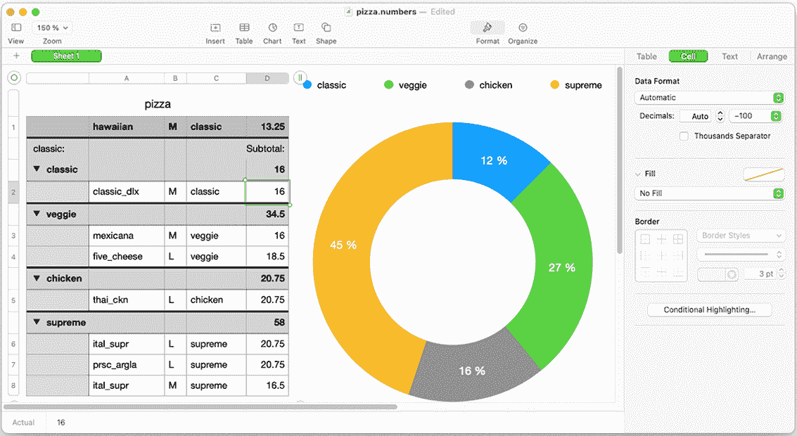
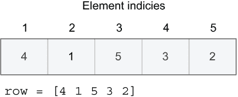
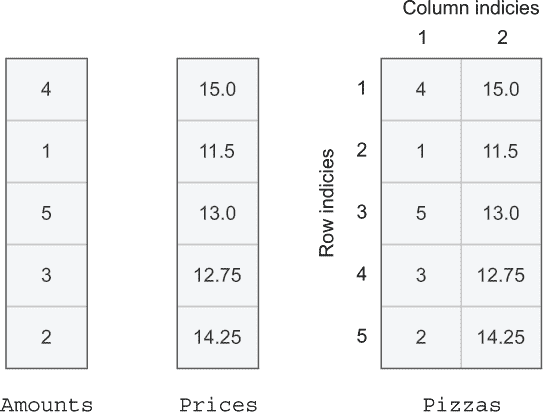

# 4 Julia 作为电子表格

本章涵盖了

+   使用 Array 和 Tuple 类型处理数字集合

+   可用于集合的有用类型，如数字、字符和文本字符串

+   进行统计分析

+   使用 map 函数转换数字列表

+   使用过滤器函数的谓词

在第二章中，我们讨论了如何将 Julia 作为计算器使用。然而，今天使用数字的人通常不会使用台式计算器；他们使用电子表格工具，如 Microsoft Excel 或 Apple Numbers（图 4.1）。



图 4.1 Apple Numbers 是一个用于处理数字行和列的电子表格应用程序。

在这些应用程序中，数字存储在表格中。所有严肃的科学工作都涉及处理大量数据表格，包括整个数字列。科学家和数据分析师获取他们想要分析的调查数据或测量数据。Julia 对于这类工作非常出色。你实际上并不是在处理图形电子表格工具，但你是在表格形式中操作数据，就像现代电子表格应用程序一样。

你在本章中只会触及到可能性的表面。相反，主要目的是介绍 Array 和 Tuple 数据类型。因为这些是其他值的容器，你还将接触到 Char（字符）和 String（文本字符串）类型，以便在数组中放入一些有趣的内容。实际上，你将把数字、字符、文本字符串和布尔值放入这两种集合类型中。

## 4.1 分析披萨销售

为了更好地理解不同 Array 操作的目的，我将使用披萨销售的例子。表 4.1 显示了不同类型的披萨以不同的数量和价格销售。你将探索如何使用 Julia 代码来回答以下问题：

+   总共卖出了多少披萨？

+   你从披萨销售中总共获得了多少收入？

+   卖出的披萨的平均价格是多少？

+   每个类别中卖出的披萨平均数量是多少？

表 4.1 披萨销售数据，其中每一行说明每种类型的披萨销售数量

| 披萨 | 数量 | 价格 |
| --- | --- | --- |
| 辣味香肠 | 4 | 15.0 |
| 玛格丽塔 | 1 | 11.5 |
| BBQ 鸡肉 | 5 | 13.0 |
| 夏威夷 | 3 | 12.75 |
| 芝士火腿 | 2 | 14.25 |

## 4.2 不同类型的数组

Julia 中的数组可以表示数字的行、列或表格。实际上，数组可以包含任何类型的元素，而不仅仅是数字。你可以有布尔值、字符或文本字符串的数组（例如，数组中的元素是有序的）。你可以要求特定位置的元素，例如，“给我数组 A 中的第三个元素。”

让我们创建一个包含卖出披萨数量的数字列。注意数字是如何垂直列出的。这是 Julia 告诉你你刚刚创建了一个 *列向量*。在创建列向量时，用逗号分隔每个元素：

```
julia> amounts = [4, 1, 5, 3, 2]
5-element Vector{Int64}:
 4
 1
 5
 3
 2
```

也可以通过用空格分隔每个元素来创建一个*行向量*：

```
julia> row = [4 1 5 3 2]
1×5 Matrix{Int64}:
 4  1  5  3  2
```

向量中的每个值都有一个相关的*元素索引*，如图 4.2 所示。第一个元素的索引是 1。



图 4.2 行向量中元素组织的示意图

术语*向量*通常用来指代一维数组，而二维数组被称为*矩阵*。你可以将矩阵想象成电子表格应用中的表格。在 Julia 中，你可以通过将行向量堆叠在一起来构建表格。

注意到每一行之间用分号分隔。这里你有一个包含数量和价格列的表格：

```
julia> pizzas = [4 15.0;
                 1 11.5;
                 5 13.0;
                 3 12.75;
                 2 14.25]
5×2 Matrix{Float64}:
 4.0  15.0
 1.0  11.5
 5.0  13.0
 3.0  12.75
 2.0  14.25
```

新行不是必需的；它们只是使代码更容易阅读。你通过写下以下内容会得到完全相同的矩阵：

```
pizzas = [4 15.0; 1 11.5; 5 13.0; 3 12.75; 2 14.25]
```

为了理解列和矩阵是如何组织的，你可以查看以下插图（图 4.3）。对于一维向量，我们通常谈论元素索引，但对于矩阵，行和列都有编号。



图 4.3 列向量和矩阵的比较

然而，在本章中，你将主要关注列向量。它们在其他语言中被称为*数组*的内容最为接近。多维数组在 Julia 中不是核心特性。

## 4.3 在数组上执行操作

数字列表并不很有趣，除非它们允许你做些有用的事情。幸运的是，许多函数可以操作数组。例如，Julia 的 sum 函数可以用来计算数组中所有元素的总和。这里你计算出售的披萨总数：

```
julia> no_pizzas_sold = sum(amounts)
15
```

如果你想知道数量中有多少个元素，你可以使用 length。这也允许你计算每种类型售出的披萨的平均数量：

```
julia> length(amounts)
5

julia> avg = sum(amounts) / length(amounts)
3.0
```

让我们把价格放入一个变量中，以便进行实验：

```
julia> prices = [15.0, 11.5, 13.0, 12.75, 14.25]
5-element Vector{Float64}:
 15.0
 11.5
 13.0
 12.75
 14.25
```

为了更容易地了解你拥有的不同价格，你可以对它们进行排序：

```
julia> sorted = sort(prices)   ❶
5-element Vector{Float64}:
 11.5
 12.75
 13.0
 14.25
 15.0

julia> prices                  ❷
5-element Vector{Float64}:
 15.0
 11.5
 13.0
 12.75
 14.25
```

❶ 排序后的价格存储在 sorted 中

❷ sort 没有修改价格。

当你调用 sort 时，你会创建一个新的向量。价格向量不会被修改。按照惯例，Julia 函数永远不会修改它们的任何输入。有时修改函数的输入是必要的。Julia 开发者已经建立了在函数名称后附加感叹号(!)的惯例，以表示任何修改其输入的函数。因此，许多不修改其输入的 Julia 函数都有修改输入的兄弟函数。例如，sort!函数将对其输入向量进行排序，而不是返回一个新的排序版本：

```
julia> sort!(prices)
5-element Vector{Float64}:
 11.5
 12.75
 13.0
 14.25
 15.0

julia> prices              ❶
5-element Vector{Float64}:
 11.5
 12.75
 13.0
 14.25
 15.0
```

❶ 价格经过排序修改！

如果你生活在一个有增值税的国家呢？为了计算出你披萨的标价，你需要加上销售税。如果你住在挪威，增值税是 25%。让我们计算带税的新价格：

```
julia> prices = [15.0, 11.5, 13.0, 12.75, 14.25];
julia> prices_with_tax = prices * 1.25
5-element Vector{Float64}:
 18.75
 14.375
 16.25
 15.9375
 17.8125
```

但如果你想知道你每种披萨赚了多少钱？你可以尝试将金额与价格相乘：

```
julia> amounts * prices
ERROR: MethodError: no method matching *(::Vector{Int64}, ::Vector{Float64})
```

不要担心错误信息。我将在后面的章节中解释你需要掌握的概念来阅读它。

目前，你需要知道的是，两个数字列之间的乘法没有明显的定义。可以想象出许多解释方式。因此，你必须明确告诉 Julia 你想要逐元素操作。你可以通过在数学运算符上添加一个点来实现这一点。+、-、* 和 / 用于对单个数字（标量）进行算术运算。要对数字数组执行逐元素运算，你需要使用 .+、.-、.* 和 ./ 运算符：

```
julia> amounts .* prices
5-element Vector{Float64}:
 60.0
 11.5
 65.0
 38.25
 28.5
```

你可以将这个结果传递给求和函数，以计算你通过卖披萨获得的总利润：

```
julia> sum(amounts .* prices)
203.25
```

## 4.4 使用统计模块

做统计和数据分析的专业人士通常与数据表打交道；你可以轻松实现自己的函数来对数据的单个列进行统计分析。以下是一个计算平均值的简单示例。

列表 4.1 计算算术平均值

```
average(A) = sum(A) / length(A)
```

而不是重新发明轮子，你可以使用现成的统计函数。这些函数包含在 Julia 中，但位于 Statistics 模块中（见 [`docs.julialang.org/en/v1/stdlib/Statistics/`](https://docs.julialang.org/en/v1/stdlib/Statistics/)）。模块将在稍后更详细地介绍，但你可以把它们看作是预先准备的功能包，你可以在程序中使用它们。要使用模块，请编写

```
using Statistics
```

这将导致模块中定义的函数、类型和常量被加载并可供你使用。它还将使模块的文档可用。记住，你可以通过在行首输入一个问号（?）来进入 Julia 的文档模式：

```
julia> using Statistics

help?> Statistics
search: Statistics

  Statistics

  Standard library module for basic statistics functionality.

help?> middle(3, 4)
  middle(x, y)

  Compute the middle of two numbers x and y, which is equivalent in both
  value and type to computing their mean ((x + y) / 2).
```

要了解模块中存在哪些类型和函数，请编写模块名称和一个点，然后按两次 Tab 键。这将显示所有可能的完成项（为了清晰起见，我已经编辑掉了一些结果）：

```
julia> Statistics.
corm           mean            realXcY
corzm          mean!           sqrt!
cov            median          std
cov2cor!       median!         stdm
covm           middle          unscaled_covzm
covzm          quantile        var
eval           quantile!       varm
include        range_varm      varm!
```

让我们探索一些在 REPL 中的统计函数：

```
julia> mean(amounts)     ❶
3.0

julia> mean(prices)
13.3

julia> median(amounts)   ❷
3.0

julia> median(prices)
13.0

julia> std(amounts)      ❸
1.5811388300841898

julia> std([3, 3, 3])
0.0
```

❶ 计算金额的算术平均值。

❷ 当值排序时的中间值

❸ 标准差

平均值和中位数都用于计算平均值，但工作方式略有不同。使用平均值时，你将所有值加起来，然后除以值的数量。如果有几个极端值，平均值可能会严重偏斜。因此，例如，在计算家庭平均收入时，你通常使用中位数。中位数收入是通过对所有家庭收入进行排序，然后选择排序列表中间的收入来计算的。这样，几个非常富裕的家庭就不会使结果偏斜。

使用 std 函数，您可以在值集合中找到标准差。标准差是衡量值差异程度的度量。如果每个元素都相同，则标准差将为零。到目前为止，您已经看到了如何处理整个数组，但为了能够构建自己的处理数组的功能，您需要知道如何访问数组中的单个元素。

## 4.5 访问元素

Julia 数组中的每个元素都是从 1 开始编号的。这称为基于 1 的索引，在数值和数学相关的语言中非常常见。然而，主流语言，如 Python、C、C++和 Java，使用基于 0 的索引。

基于 1 的索引与基于 0 的索引

索引数组最好的方式是开发者喜欢争论的话题。在数学中，使用基于 1 的索引对元素、行和列进行编号是一种常见约定。当讨论硬件细节，如计算机内存地址时，更常见的是使用基于 0 的索引。因此，具有数值关注点的语言倾向于使用基于 1 的索引，而更接近硬件的语言，如 C，则使用基于 0 的索引。

使用方括号来定义数组字面量，以及通过索引访问单个元素：

```
julia> amounts = [4, 1, 5, 3, 2]
5-element Vector{Int64}:
 4
 1
 5
 3
 2

julia> amounts[1]   ❶
4

julia> amounts[2]
1

julia> amounts[5]   ❷
2
```

❶ 访问金额数组中的第一个元素。

❷ 获取金额数组中的第五（最后一个）元素。

使用方括号既可定义数组字面量，也可访问单个元素。当然，您也希望能够更改单个元素。这可以通过相同的方式进行：

```
julia> xs = [2, 3]
2-element Vector{Int64}:
 2
 3

julia> xs[1] = 42
42

julia> xs
2-element Vector{Int64}:
 42
  3
julia> xs[2] = 12
12

julia> xs
2-element Vector{Int64}:
 42
 12
```

每次更改元素时，您都可以打印它以显示数组当前的形状。所有这些示例都很整洁。如果您尝试通过无效索引访问元素会发生什么？

```
julia> xs[3] = 5       ❶
ERROR: BoundsError: attempt to access 2-element Vector{Int64} at index [3]

julia> xs[0]           ❷
ERROR: BoundsError: attempt to access 2-element Vector{Int64} at index [0]
```

❶ 数组 xs 只有两个值，因此您不能尝试设置第三个元素。Julia 会检查您是否使用了有效的索引。

❷ 元素从索引 1 开始。索引 0 处没有值。

您在这里看到的行为在大多数主流语言中都很常见。然而，一些较老的流行语言允许您在任意索引处设置元素，无论您事先将数组设置得多大。

在这些示例中访问元素的方式存在一些挑战：

1.  您并不总是知道最后一个元素的索引，因为数组可以有不同的大小，并且可以增长。

1.  虽然基于 1 的索引是标准，但在 Julia 中可以构建基于 0 的数组。

为了处理您无法始终知道数组开始或结束位置的事实，请使用 begin 和 end 关键字分别访问第一个和最后一个元素：

```
julia> amounts[1]       ❶
4

julia> amounts[begin]   ❶
4

julia> amounts[5]       ❷
2

julia> amounts[end]     ❷
2

julia> amounts[4]       ❸
3

julia> amounts[end-1]   ❸
3
```

❶ 访问第一个元素。[1]和[begin]是相同的。

❷ 访问最后一个元素。[5]和[end]是相同的。

❸ 通过减法，您可以执行诸如访问倒数第二个元素之类的操作。

## 4.6 创建数组

到目前为止，你已经使用数组字面量创建了数组。数组字面量意味着你实际上列出了数组由哪些元素组成。例如，[4, 8, 1] 和 [false, false, true] 都是数组字面量的例子。变量 xs 可能指向一个数组，但它不是一个数组字面量。然而，数组字面量在创建大型数组时并不十分有效。你有一系列函数，如 zeros、ones、fill 和 rand，这使得快速创建包含特定值的数组变得容易。

例如，如果你想要一个包含 50 个元素且所有元素值都为 0 的数组，你可以使用 zeros 函数：

```
julia> xs = zeros(50)
50-element Vector{Float64}:
 0.0
 0.0
 0.0
 ⋮
 0.0
 0.0
 0.0
 0.0

julia> length(xs)
50
```

初始化向量的元素为 1 是如此常见，以至于有一个专门的函数 ones 来执行此操作。该函数创建一个指定长度的数组，每个元素都设置为值 1：

```
julia> ones(5)
5-element Vector{Float64}:
 1.0
 1.0
 1.0
 1.0
 1.0
```

但是，使用 fill 函数可以填充一个大型数组中的任何值。在这里，你创建了一个包含六个元素且每个元素都设置为值 42 的数组：

```
julia> fill(42, 6)
6-element Vector{Int64}:
 42
 42
 42
 42
 42
 42
```

在许多情况下，你需要具有大量随机值的数组。rand(n) 创建一个包含 n 个介于 0 和 1 之间的随机数的向量：

```
julia> rand(3)
3-element Vector{Float64}:
 0.5862914538673218
 0.8917281248249265
 0.37928032685681234
```

当你创建数组时，在 Julia REPL 中创建的数组描述将看起来像这样：

```
5-element Vector{Float64}
```

这表示你创建的向量包含五个元素，并且每个元素都是 Float64 类型。但是，如果你想有不同的元素类型呢？比如说，你想要 8 位有符号整数。你该如何做？ones、zeros 和 rand 函数允许你指定元素类型。以下是一些示例：

```
julia> ones(Int8, 5)      ❶
5-element Vector{Int8}:
 1
 1
 1
 1
 1

julia> zeros(UInt8, 4)    ❷
4-element Vector{UInt8}:
 0x00
 0x00
 0x00
 0x00

julia> rand(Int8, 3)      ❸
3-element Vector{Int8}:
 -50
 125
  58
```

❶ 创建一个包含有符号 8 位整数且值为 1 的数组。注意向量的描述说 Vector{Int8}。

❷ 创建四个无符号 8 位的零。注意零是如何以十六进制形式编写的，因为在 Julia 中这是格式化无符号整数的默认方式。

❸ 创建三个随机的 8 位有符号整数值。这些值将从完整的范围中随机选择：-128 到 127。

即使数组字面量也允许你指定元素类型。因此，你可以表明你想要一个 8 位有符号整数的向量：

```
julia> xs = Int8[72, 69, 76, 76, 79]
5-element Vector{Int8}:
 72
 69
 76
 76
 79
```

数组字面量前面加上你想要为每个元素指定的类型——在这个例子中是 Int8。如果你没有指定类型，Julia 将推断元素类型。关于它是如何工作的细节，我将在第七章讨论类型时说明。如果你想检查数组中每个元素的类型，你可以使用 eltype（元素类型的简称）函数：

```
julia> eltype(xs)
Int8

julia> eltype([3, 4, 5])
Int64

julia> eltype([true, false])
Bool
```

## 4.7 在数组中映射值

你可以做的不仅仅是简单地对值进行加法和乘法。在所有支持函数式编程风格的编程语言中，你都会找到一个由 map、reduce 和 filter 组成的三联函数。让我们首先通过回顾你之前的正弦表计算来探索 map 函数。你还记得这个函数吗？

列表 4.2 存储在函数中的创建正弦表代码

```
function print_sin_table(increment, max_angle)
    angle = 0
    while angle <= max_angle
        rad = deg2rad(angle)
        x = sin(rad)
        println(x)
        angle = angle + increment
    end
end
```

然而，您不必打印出正弦值的表格，您可以创建一个包含所有正弦值的数组。为此，您可以使用 map 函数，该函数旨在将值集合转换为另一个值数组。这里使用 map 将度数数组转换为弧度数组。map 将 deg2rad 函数应用于输入数组中的每个元素：

```
julia> degs = [0, 15, 30, 45, 60];

julia> rads = map(deg2rad, degs)
5-element Vector{Float64}:
 0.0
 0.2617993877991494
 0.5235987755982988
 0.7853981633974483
 1.0471975511965976
```

map 被称为**高阶函数**。这些函数接受其他函数作为参数，并且/或者返回函数。这与您迄今为止看到的函数不同，后者仅接受数字作为参数。map 的基本形式将函数 f 作为第一个参数，并将该函数应用于集合 xs 中的每个元素，生成一个新的集合 ys 作为输出：

```
ys = map(f, xs)
```

第二个参数，表示一个集合，不需要是一个实际的数组。它可以是一切可以迭代并获取多个元素的东西；因此，您也可以使用范围对象。这里您使用从 0 到 90 的范围，以 15 度为步长值：

```
julia> map(deg2rad, 0:15:90)
7-element Vector{Float64}:
 0.0
 0.2617993877991494
 0.5235987755982988
 0.7853981633974483
 1.0471975511965976
 1.3089969389957472
 1.5707963267948966
```

您可以将这些组合起来创建一个正弦表：

```
julia> map(sin, map(deg2rad, 0:15:90))
7-element Vector{Float64}:
 0.0
 0.25881904510252074
 0.49999999999999994
 0.7071067811865475
 0.8660254037844386
 0.9659258262890683
 1.0
```

然而，这通常不是您这样做的方式。相反，您可以将所有想要进行的转换组合成一个单独的函数。这更节省内存，因为每次调用 map 都会产生一个新的数组。另一个解决方案是预先分配一个与输出大小相同的数组，并在重复映射中使用该数组。mutating map! 函数允许您做到这一点。

它将输出直接写入作为第二个参数给出的数组。第三个参数是输入，它不会被 map! 函数修改！

然而，如果输入与所需的输出类型和长度相同，则可以重用输入参数作为输出参数：

```
result = zeros(Float64, length(0:15:90))    ❶
map!(deg2rad, result, 0:15:90)              ❷
 map!(sin, result, result)                  ❷
```

❶ 分配数组来存储结果。

❷ 输入和目标数组必须具有相同的长度。

然而，这不是编写代码的优雅方式，并且最好避免使用可变函数调用，因为它们使数据分析变得更加困难。因此，您将所有转换收集到一个函数中，这减少了代码必须进行的内存分配次数，并且通常更容易阅读：

```
degsin(deg) = sin(deg2rad(deg))
map(degsin, 0:15:90)
```

第一行只是一个单行函数定义。您也可以使用多行定义，但这会占用更多空间：

```
function degsin(deg)
    sin(deg2rad(deg))
end

map(degsin, 0:15:90)
```

理解内置函数的一个好方法是自己实现它们。为了更好地理解 map，创建一个名为 transform 的自己的 map 函数。它包含新的概念，我们将在更详细地讨论。

列表 4.3 内置 map 函数的简化版本

```
function transform(fun, xs)
    ys = []                    ❶
    for x in xs
        push!(ys, fun(x))      ❷
    end
    ys                         ❸
 end
```

❶ 创建一个空数组来存储最终结果

❷ 将转换后的元素添加到结果数组 ys 中。

❸ 返回最终结果。

transform 接受两个参数，fun 和 xs，其中前者是函数，后者是数组或其他可迭代的集合对象。函数可以存储在变量中并使用。以下是一个简单的演示：

```
julia> sin(1.0)
0.8414709848078965

julia> g = sin
sin (generic function with 13 methods)

julia> g(1.0)                ❶
0.8414709848078965

julia> add = +               ❷
+ (generic function with 190 methods)

julia> add(2, 3)
5
```

❶ 调用 sin 函数

❷ 记住 Julia 中的加号运算符是一个函数。

这就是为什么你可以将 fun 用作函数并调用它，尽管它是对 transform 函数的参数。需要进一步解释的下一部分是

```
push!(xs, x)
```

这个函数将元素 x 添加到数组 xs 中。记住，感叹号警告你 push!函数可能会更改其输入。在这种情况下，xs 参数被修改。

你必须添加感叹号来调用正确的函数；感叹号是函数名的一部分，所以 push 和 push!会被视为两个不同的函数名。在 Julia 中，没有名为 push 的函数。如果它存在，你可以想象它会返回一个包含额外元素的新数组。

在你定义的函数中添加感叹号不是必需的，但你应该养成这种习惯，以帮助阅读你代码的其他开发者。这样，就可以很容易地看到变量可能被修改（突变）的地方。

小贴士 对于初学者来说，突变函数可能看起来不是什么大问题。然而，当你编写更大的程序时，你将开始注意到，突变输入的函数往往会使程序更难阅读和跟踪。感叹号有助于在阅读源代码时减轻心理负担。没有它，每个函数调用都可能潜在地修改其输入，使代码分析变得更加困难。

以下是一个简单的演示，说明 push!是如何工作的。你创建一个空数组 ys 并向其中添加数字。每次你都可以看到数组如何变大：

```
julia> ys = []          ❶
Any[]

julia> push!(ys, 3)     ❷
1-element Vector{Any}:
 3

julia> push!(ys, 8)
2-element Vector{Any}:
 3
 8

julia> push!(ys, 2)
3-element Vector{Any}:
 3
 8
 2
```

❶ 创建一个空数组。

❷ 将数字 3 添加到数组中。

## 4.8 字符和字符串的介绍

到目前为止，你几乎只与数字打交道，但你的披萨表包含的不仅仅是数字。表中还包含文本，例如披萨的名称。你在 Julia 中如何处理文本？

让我们从最基本的构建块开始。文本由字符组成，单个字符在 Julia 中由 Char 类型表示。在计算机内存中，一切都是数字，包括字符。这里有一个小挑战：看看下面的例子，看看你是否能理解它：

```
julia> x = Int8(65)                                           ❶
65

julia> ch = Char(65)                                          ❷
'A': ASCII/Unicode U+0041 (category Lu: Letter, uppercase)

julia> ch = Char(66)
'B': ASCII/Unicode U+0042 (category Lu: Letter, uppercase)

julia> 'A'                                                    ❸
'A': ASCII/Unicode U+0041 (category Lu: Letter, uppercase)

julia> Int8('A')                                              ❹
65
```

❶ 从 64 位数值为 65 的数值中创建一个 8 位有符号整数

❷ 从数字 65 创建一个字符

❸ 字符字面量

❹ 从字符字面量创建一个 8 位数字

你用单引号包围单个字符来创建字符字面量.^(1) 'A'和'Y'都是字符字面量。

这个代码示例表明，Julia 中的字符只是不同类型的数字。记得一个 UInt8 和一个 Int8 消耗相同数量的位，可以存储相同的数据，但解释方式不同吗？字符也是如此。虽然在内存中它们看起来相同，但类型决定了你可以对它们做什么。例如，你不能将两个字符相加，但你可以将一个数字加到一个字符上：

```
julia> 'A' + 'B'
ERROR: MethodError: no method matching +(::Char, ::Char)

julia> 'A' + 3
'D': ASCII/Unicode U+0044 (category Lu: Letter, uppercase)
```

你可以创建字符数组，就像你可以创建数字或布尔值的数组一样：

```
julia> chars = ['H', 'E', 'L', 'L', 'O']
5-element Vector{Char}:
 'H': ASCII/Unicode U+0048
 'E': ASCII/Unicode U+0045
 'L': ASCII/Unicode U+004C
 'L': ASCII/Unicode U+004C
 'O': ASCII/Unicode U+004F
```

注意：为了提高可读性和清晰度，我偶尔会编辑 REPL 输出。例如，我会移除附加在字符上的（类别 Lu：大写字母）描述，因为它会产生大量的视觉噪音。

文本字符串只是字符的组合。注意，从输出中可以看出，文本字符串用双引号标识，而单个字符用单引号标识：

```
julia> join(chars)
"HELLO"
```

join 可以接受任何可迭代的对象（你可以在 for 循环中使用的对象）作为输入。因此，你可以提供一个字符范围：

```
julia> join('A':'G')
"ABCDEFG"
```

使用范围对象中的步长为‘2’跳过每个其他字符：

```
julia> join('A':2:'G')
"ACEG"
```

你可以收集文本字符串中的单个字符，因此你可以得到一个字符数组：

```
julia> collect("HELLO")
5-element Vector{Char}:
 'H': ASCII/Unicode U+0048
 'E': ASCII/Unicode U+0045
 'L': ASCII/Unicode U+004C
 'L': ASCII/Unicode U+004C
 'O': ASCII/Unicode U+004F
```

collect 是一个多功能的函数；它可以将任何允许迭代多个值的对象转换为数组。因此，你可以收集范围：

```
julia> collect(2:5)
4-element Vector{Int64}:
 2
 3
 4
 5

 julia> collect('B':'D')
3-element Vector{Char}:
 'B': ASCII/Unicode U+0042
 'C': ASCII/Unicode U+0043
 'D': ASCII/Unicode U+0044
```

字符串和字符对于表示披萨数据非常有用。让我们看看你如何将每个披萨的信息捆绑在一起。

## 4.9 在元组中存储披萨数据

要做到这一点，你将使用与数组紧密相关的元组。要编写它们，将方括号[]替换为圆括号()。以下是一个描述胡椒披萨销售信息的元组示例。它表示一个小（S）夏威夷披萨以 10.50 美元的价格售出：

```
pizza_tuple = ("hawaiian", 'S', 10.5)
```

由于许多流行的语言，如 Python 和 JavaScript，都使用单引号和双引号来表示字符串，因此值得提醒读者，在这个例子中 'S' 表示一个字符，而不是字符串。在 Julia 中，你不能使用单引号来编写字符串：

```
julia> 'hawaiian'
ERROR: syntax: character literal contains multiple characters
```

因此，'S' 和 "S" 之间有一个重要的区别。后者是一个字符串，你必须将其视为字符的集合。这种区别类似于数字 42 和数组[42]之间的区别。与其编写一个元组来包含披萨数据，你还可以使用一个数组：

```
pizza_array = ["hawaiian", 'S', 10.5]
```

那么究竟有什么区别呢？数组是用来存储同质数据的。每个元素都必须是同一类型。但显然，在这个例子中，它们**不是**同一类型的。结果是数组的元素类型变成了 Any 类型：

```
julia> pizza = ["hawaiian", 'S', 10.5]
3-element Vector{Any}:
   "hawaiian"
   'S': ASCII/Unicode U+0053
 10.5

julia> eltype(pizza)
Any
```

你将在稍后更详细地探索 Julia 的类型系统。现在你可以将 Any 理解为“任何都可以”。你可以将任何类型的值放入数组中。如果元素类型更具体，例如 Int64，这将不起作用：

```
julia> xs = [4, 5, 3]
3-element Vector{Int64}:        ❶
 4
 5
 3

julia> xs[1] = "hi"
ERROR: MethodError: Cannot `convert` an object of type String to an object
of type Int64                   ❷
```

❶ Julia 推断每个元素都是 Int64 类型。

❷ 朱莉亚不知道如何将字符串转换为数字。

与此相反，披萨数组是完全无差别的，这意味着它们不关心对象类型。你可以将任何东西分配给单个元素，因为披萨数组的元素类型是 Any：

```
julia> pizza[3] = true
true

julia> pizza[1] = 42
42

julia> pizza
3-element Vector{Any}:
   42
     'S': ASCII/Unicode U+0053
 true
```

另一方面，元组要严格得多。元组跟踪每个元素的类型；如果你对元组执行 typeof 操作，你可以看到这一点：

```
julia> pza = ("hawaiian", 'S', 10.5)
("hawaiian", 'S', 10.5)

julia> typeof(pza)
Tuple{String, Char, Float64}
```

其次，元组是**不可变**的，这意味着它们不能被更改。你只能从它们中读取值；你不能更改这些值。

```
julia> pza[1]
"hawaiian"

julia> pza[1] = "pepperoni"
ERROR: MethodError: no method matching
  setindex!(::Tuple{String, Char, Float64}, ::String, ::Int64)
```

在其他方面，元组与数组非常相似。你可以像数组或范围一样遍历元组：

```
julia> for item in pza
           println(item)
       end
hawaiian
S
10.5
```

你可以将它们传递给 sum、median 和 mean 等函数，前提是它们实际上包含数字：

```
julia> nums = (3, 4, 1)
(3, 4, 1)
julia> sum(nums)
8

julia> median(nums)
3.0
```

你可以通过结合元组和数组来查看如何创建披萨销售数据列表（表 4.2），这是你希望在 Julia 中存储的数据。

表 4.2 披萨销售数据，其中每一行代表一个已售披萨

| 披萨 | 尺寸 | 价格 |
| --- | --- | --- |
| 夏威夷披萨 | S | 10.5 |
| 西西里披萨 | S | 12.25 |
| 夏威夷披萨 | L | 16.5 |
| 烤鸡披萨 | L | 20.75 |
| 烤鸡披萨 | M | 16.75 |

你希望能够处理这些数据并找出诸如你总共赚了多少钱或你卖了多少个大披萨等信息。你可以在 Julia 中用以下方式表示：

```
julia> sales = [
           ("hawaiian", 'S', 10.5),
           ("sicilian", 'S', 12.25),
           ("hawaiian", 'L', 16.5),
           ("bbq chicken", 'L', 20.75),
           ("bbq chicken", 'M', 16.75)
       ]
```

你正在使用浮点数来表示货币数据，这是一个不好的选择。如果你为处理货币数据的客户构建软件，你应该始终使用定点数，^(2) 但为了教育目的，我保持事情简单。

为了更容易处理披萨数据，你将为不同的属性定义 *访问器* 函数^(3)。你将调用披萨尺寸部分的访问器，因为 Julia 已经在标准库中有一个名为 size 的函数：

```
name(pizza)    = pizza[1]
portion(pizza) = pizza[2]
price(pizza)   = pizza[3]
```

这些只是普通函数。在这里，我使用了 Julia 的单行语法来定义函数，但我也可以使用多行定义：

```
function price(pizza)
    pizza[3]
end
```

记住，Julia 函数中的最后一个表达式是返回值。你不需要写 return pizza[3]。

这些披萨参数的类型是什么？是元组还是数组？实际上，它们是什么并不重要，因为索引访问在两者上以相同的方式工作。这些访问器函数与 map 一起使用很有用，因为它们允许你执行诸如获取所有披萨名称的操作：

```
julia> map(name, sales)
5-element Vector{String}:
 "hawaiian"
 "sicilian"
 "hawaiian"
 "bbq chicken"
 "bbq chicken"
```

上述代码片段只是将名称函数应用于销售数组中的每个元素，并将所有结果值收集到一个新的数组中。

## 4.10 基于谓词过滤披萨

在有了有用的数据来操作后，我可以向你介绍下一个高级函数：

```
ys = filter(p, xs)
```

filter 函数接受一个值集合 xs，并返回这些值的子集 ys。xs 中包含在结果 ys 中的特定值由谓词 p 决定。你问什么是谓词？

定义 A *谓词* 是一个函数，它接受一些值并始终返回一个布尔值，例如 true 或 false。

Julia 的标准库中包含了许多谓词函数。以下是一些示例：

```
julia> iseven(3)   ❶
false

julia> iseven(2)   ❶
true

julia> isodd(3)    ❷
true

julia> isodd(4)    ❷
false
```

❶ 检查数字是否为偶数（能被二整除）。

❷ 检查数字是否为奇数（不能被二整除）。

谓词不仅限于数字。还有针对字符的谓词：

```
julia> isuppercase('A')    ❶
true

julia> isuppercase('a')    ❶
false

julia> isspace(' ')        ❷
true

julia> isspace('X')        ❷
false
```

❶ 提供的字符是否为大写字母？

❷ 字符是否为空格？例如，x 是一个字母，不是一个空白空间。

谓词与 filter 函数结合使用非常有效。以下是从一个范围中获取偶数的示例：

```
julia> filter(iseven, 1:10)
5-element Vector{Int64}:
  2
  4
  6
  8
 10
```

但要处理披萨数据，你需要定义自己的谓词，这允许我们检索特定尺寸或类型的披萨的销售情况：

```
issmall(pizza)  = portion(pizza) == 'S'
islarge(pizza)  = portion(pizza) == 'L'
isbbq(pizza)    = name(pizza) == "bbq chicken"
```

### 4.10.1 组合高阶函数

你可以使用以下方法结合 map、访问器、过滤器和谓词来找出你卖大披萨或烧烤鸡肉披萨等赚了多少钱。首先，找到大披萨：

```
julia> filter(islarge, sales)
2-element Vector{Tuple{String, Char, Float64}}:
 ("hawaiian", 'L', 16.5)
 ("bbq chicken", 'L', 20.75)
```

接下来，你得到大披萨的价格：

```
julia> map(price, filter(islarge, sales))
2-element Vector{Float64}:
 16.5
 20.75
```

使用 sum，你可以计算出你卖大披萨赚了多少钱：

```
julia> sum(map(price, filter(islarge, sales)))
37.25
```

在最后的例子中，你确定卖烧烤鸡肉披萨赚了多少钱：

```
julia> bbq_sales = filter(isbbq, sales)
2-element Vector{Tuple{String, Char, Float64}}:
 ("bbq chicken", 'L', 20.75)
 ("bbq chicken", 'M', 16.75)

julia> sum(map(price, bbq_sales))
37.5
```

结果表明，在编程中，将许多值映射到另一组值，然后将所有这些值归一化到 1 是一种如此常见的做法，以至于它有自己专门的名称：mapreduce。在上一个例子中，你将烧烤鸡肉的销售项目映射到销售价格，然后将它们加起来。在函数式编程中，将所有数字加起来被称为*归约*。

## 4.11 映射和归约数组

使用 mapreduce 函数，你可以将最后一部分写成一个单独的函数调用：

```
julia> mapreduce(price, +, bbq_sales)
37.5
```

mapreduce 由两个高阶函数组成：map 和 reduce。为了演示它是如何工作的，创建你自己的 mapreduce 变体，称为 mapcompress，以避免命名冲突：

```
mapcompress(f, g, xs) = reduce(g, map(f, xs))
```

让我澄清 reduce 是如何工作的：它接受一个二元函数 g 作为第一个参数，然后使用这个函数将提供的第二个参数集合中的元素组合起来。

```
g(x, y) = ...
y = reduce(g, xs)
```

与 map 不同，reduce 需要一个接受*两个*参数的输入函数。这就是为什么它被称为*二元*函数。在 Julia 中，像+、-和*这样的常规数学运算符是二元函数。因此，你可以使用它们与 reduce 一起执行求和和阶乘的等效操作：

```
julia> sum(2:4)
9

julia> reduce(+, 2:4)
9

julia> factorial(4)
24

julia> reduce(*, 1:4)
24
```

注意：许多开发者发现 reduce 函数的命名不够直观。可能更好的名称是*accumulate*、*aggregate*或*compress*。在某些语言中，它被称为 inject。

### 4.11.1 使用 map 和 reduce 的正弦表

正弦函数本身实际上是一个映射和归约的经典案例。对于 sin(x)的每个参数，你得到一个无限序列的数字，通过加法将它们归约为一个值。这就是你实现自己的正弦函数（称为 sine）而不与内置的 sin 函数冲突的方式。

列表 4.4 使用泰勒级数实现的正弦函数

```
function sine(x)
    n = 5
    total = 0
    for i in 0:n
        total += (-1)^i*x^(2i+1)/factorial(2i + 1)
    end
    total
end
```

你可以使用 mapreduce 高阶函数更优雅地表达这个计算。

列表 4.5 通过泰勒级数上的 mapreduce 实现的正弦函数

```
function sinus(x)
   n = 5
   taylor(i) = (-1)^i*x^(2i+1)/factorial(2i + 1)
   mapreduce(taylor, +, 0:n)
end
```

在这里，你正在做一件新的事情：在正弦函数内部，你定义了一个名为 taylor 的新函数，它接受单个参数 i。该函数用于计算泰勒级数中的一个项，即泰勒级数中要加上的一个数字。在函数内部定义函数是完全可能的。

但为什么不在外部定义这个函数呢？这是因为它使用了 x 变量，而 x 的值在正弦函数定义之外是未知的。如果你感到困惑，不要担心。这些概念将在本书后面的许多地方被重新审视，并且在那个时刻可能会更有意义。

`mapreduce(taylor, +, 0:n)`将首先将`taylor`函数应用于 0 到 n 范围内的每个值。这将产生一个值数组，然后使用加法运算符（`+`，`mapreduce`函数的第二个参数）将它们组合起来。

## 4.12 使用布尔数组计数匹配项

在第三章中，我提到将布尔值视为整数 0 或 1 可能是有用的。现在你已经接触到了数组，我们将探讨一个具体的例子。

列表 4.6 计数匹配谓词的披萨

```
julia> matches = map(islarge, sales)
5-element Vector{Bool}:
 0
 0
 1
 1
 0

julia> sum(matches)
2
```

由于你正在组合一个映射和求和的高阶函数，你可以用单个`mapreduce`调用替换它。然而，在映射后添加元素是非常常见的，因此 Julia 的`sum`函数允许映射和加法。这为你提供了一种优雅的方式来计算大型披萨的数量、有多少是烤鸡披萨等等：

```
julia> sum(islarge, sales)
2

julia> sum(isbbq, sales)
2
```

`sum`函数将通过应用第一个参数作为谓词将所有的披萨销售额转换为布尔值。这将产生一个由零和一组成的数组，这些值将由`sum`函数相加。

在阅读完本章后，你已经成功学习了编程中最基本的概念。没有控制流和数据集合，编程将不会非常有用。能够轻松地处理多个数据元素的能力使得计算机如此灵活和强大。

## 摘要

+   Julia 支持许多不同类型的数组。*向量*是一维数组，而*矩阵*是二维数组。

+   在数学和 Julia 中，人们区分*列向量*和*行向量*。列向量最接近其他编程语言中所谓的数组。

+   Julia 将行向量表示为只有一行的矩阵，这就是为什么行向量与其他语言中的一维数组非常不同。

+   Julia 中的数组默认采用基于 1 的索引。这意味着第一个元素从索引 1 开始。

+   可以对整个数组中的每个元素执行数学运算。为此，在正常数学运算符前加上一个点：.+, .-, .*, 和 ./。

+   数组上的操作可以描述为映射、过滤或归约（例如，sum 和 mean 执行归约，因为多个值被归约为一个）。

+   `zeros`、`ones`、`fill`和`rand`函数使得创建具有大量元素的数组变得容易。

+   字符对象数组并不完全等同于字符串。字符必须组合在一起才能形成一个字符串。然而，字符串的行为与数组相似。

+   元组的行为与数组类似，但它们是不可变的，这意味着你不能改变它们。

* * *

^（1.）字符字面意思是 A 到 Z 之间的字符，而不是例如包含字符的变量或常量。

(2.)查阅 FixedPointDecimals.jl 或 CurrenciesBase.jl 以处理货币数据。

(3.)用于在更复杂的数据结构中设置和获取值的函数被称为*访问器函数*，或简称*访问器*。
