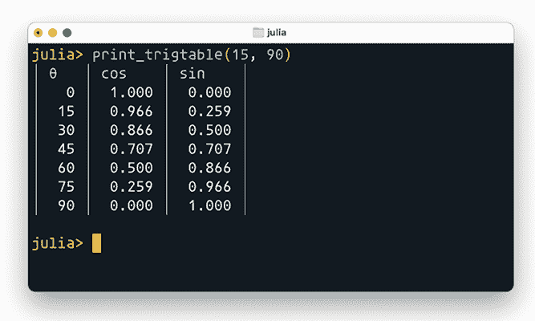
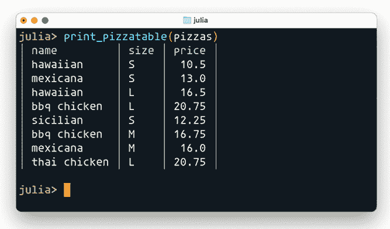
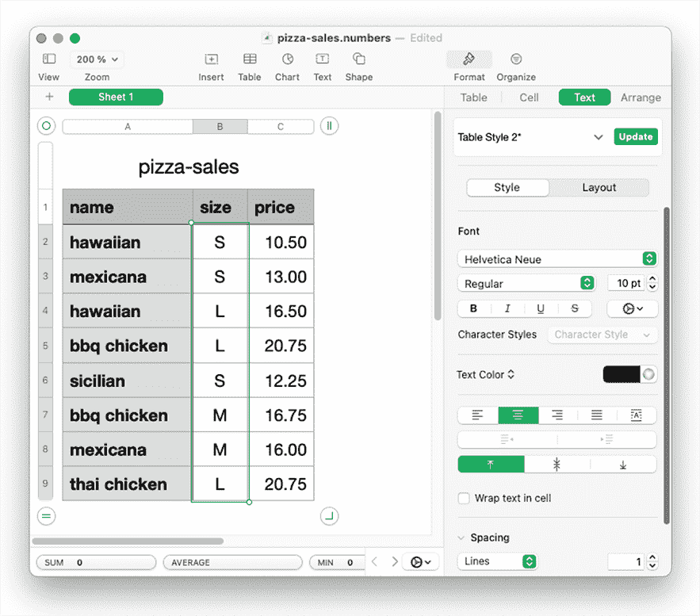
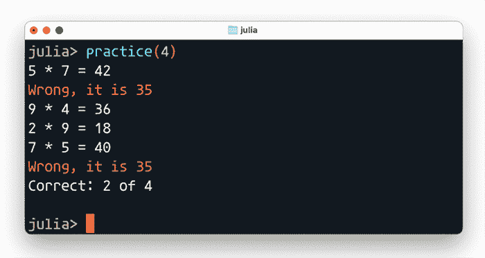

# 5 处理文本

本章节涵盖

+   使用 String 类型表示文本

+   使用 lpad 和 rpad 格式化文本

+   从键盘或文件中读取文本

+   将文本写入屏幕或文件

+   创建一个简单的交互式程序

本章将重点介绍在 Julia 中处理文本的实际方面，例如如何在屏幕上显示文本以及如何读取或写入文件。你还将查看一个简单的交互式应用程序，其中用户对问题进行响应。

然而，首先我将关注在屏幕上显示文本的不同方式，重新审视你的比萨饼销售和正弦表示例。你之前创建的表格不太易读。如何创建一个像图 5.1 中那样的整洁显示？



图 5.1 使用 Unix 终端窗口中的对齐和颜色格式化显示余弦和正弦表

在这里，正弦和余弦值被整洁地排列在单独的列中。同样，将比萨饼销售信息整洁地组织到清晰分隔的列中，如图 5.2 所示会更好吗？



图 5.2 使用对齐和颜色在 Unix 终端窗口中格式化显示比萨饼销售情况

你将使用 printstyled 函数来着色文本，使用 rpad 和 lpad 函数来格式化输出。你将使用^运算符来重复字符。接下来，你将使用 open 函数来允许你使用 print 和 println 将文本输出写入文件。为了读取和处理输入，你将使用 readline、split 和 parse 函数。

## 5.1 制作一个漂亮的比萨饼销售表

你将从查看最终结果，即你想要编写的代码开始，然后逆向工作来解释你是如何到达那里的。代码不应该完全陌生，但我会解释一些新概念。

列表 5.1 创建一个漂亮的比萨饼销售表

```
function print_pizzatable(pizzas)
    print("│ ")
    printstyled(rpad("name", 12), color=:cyan)
    print(" │ ")
    printstyled("size", color=:cyan)
    print(" │ ")
    printstyled(rpad("price", 5), color=:cyan)
    println(" │")

    for pz in pizzas
         print("│ ",  rpad(name(pz), 12))
         print(" │ ", rpad(portion(pz), 4), " │ ")
         println(lpad(price(pz), 5), " │")
    end
end
```

你有新的函数——printstyled、rpad 和 lpad，需要进一步探索和解释。为了让 print_pizzatable 函数正常工作，你还需要在第四章中定义的*访问器*函数。所有这些函数都接受一个比萨饼元组，例如("bbq chicken", 'L', 20.75)，作为参数，并返回元组中的一个元素。

列表 5.2 比萨饼元组访问器函数

```
name(pizza)    = pizza[1]
portion(pizza) = pizza[2]
price(pizza)   = pizza[3]
```

我将更详细地介绍 print_pizzatable 中使用的每个函数，并附上一些简单的示例。我在过去的章节中只是简要介绍了 print 和 println，所以让我们来详细讲解。

### 5.1.1 打印、println 和 printstyled

这些是多功能函数，可以用来将文本写入你的屏幕或文件，甚至网络连接（详见第十八章以获取更多细节）。让我们看看一些简单的示例来展示这些函数是如何工作的：

```
julia> println("hello world")
hello world
julia> print("hello world")
hello world
```

嗯？它们不是在做完全相同的事情吗？不，但在这个例子中并不容易看出。相反，你将使用分号 ; 来分隔单行上的语句。这将有助于使差异更清晰：

```
julia> println("hello"); println("world")
hello
world

julia> print("hello"); print("world")
helloworld
julia> print("hello\n"); print("world\n")
hello
world
```

这段代码显示 println 只是一个简写，它将一个换行字符 \n 添加到末尾。Julia，像许多其他语言一样，允许你通过使用带有不同字母组合的反斜杠来表示不可见的控制字符，如换行。表 5.1 展示了你在 Julia 中可以使用的、用于影响文本写入 Unix 终端窗口的一些更常见的控制字符。

表 5.1 Unix 终端中使用的常见控制字符的转义序列

| 转义序列 | 十六进制值 | 效果 |
| --- | --- | --- |
| \n | 0x0A | 换行 |
| \t | 0x09 | 水平制表符 |
| \v | 0x0B | 垂直制表符 |
| \r | 0x0D | 光标返回 |
| \b | 0x08 | 退格 |
| \\ | 0x5C | 反斜杠 |
| \" | 0x22 | 双引号 |

双引号不是一个控制字符，但既然你用它来标记字符串的开始和结束，你需要使用转义序列来表示它。但知道十六进制值有什么用？你可以直接使用它来创建字符。在这里，使用 0x0a 十六进制值创建了一个新行：

```
julia> newln = Char(0x0a)
'\n': ASCII/Unicode U+000A

julia> print("hi"); print(newln); print("world")
hi
world
```

让我们看看使用这些不同的转义序列与常规文本结合使用的一些更多示例效果：

```
julia> println("hello \v world")     ❶
hello
       world

julia> println("hello \n world")
hello
 world

julia> println("hello \r world")     ❷
 world

julia> println("ABC\n\tABC\n\tABC")
ABC
    ABC
    ABC
```

❶ 这使用的是垂直制表符 \v，而不是更广为人知的水平制表符 \t。

❷ 光标返回将光标移动到行的开头。因此，单词 "world" 覆盖了最初写入的 "hello"。

这需要一些上下文。为什么你的文本字符串中的字符会导致光标移动？这与你今天使用的文本打印系统的历史有关。当 Unix 操作系统最初开发时，没有像你现在使用的这样的电子显示器。相反，计算机用户使用了一种称为 *电传打字机* 的电磁机械设备（图 5.3）。电传打字机在操作上与老式的打字机非常相似。


图 5.3 西门子 Teletype Type 68D（挪威技术博物馆）

这些设备也充当了你的屏幕。如果计算机想要给你一些信息，它必须将字符发送到你的打字机，这将导致它将发送的字符打印到纸上。这产生了对控制字符的需求，即控制你的电传打字机的字符，告诉它创建新行或将光标向下或向后移动。

你今天使用的终端应用程序是这些旧式电传打字机的模拟器。这样，为电传打字机编写的程序仍然可以工作。Unix 命令如 ls、cp、cat 和 echo 对它们运行在现代计算机上的电子显示器一无所知。就它们而言，它们正在与一台好用的旧式电传打字机交互。

最终，这些基于纸张的终端被电子终端所取代。在此阶段，通过添加新的控制字符来扩展控制字符以表示颜色。例如，当电子终端接收到转义序列\u001b[33m 时，它会切换到以黄色字母书写。如果接收到\u001b[31m，它会以红色字母书写。因此，要使用黄色字母打印 hello world，您可以编写以下代码：

```
julia> print("\u001b[33m hello world")
hello world
```

然而，记住这些不同颜色的转义序列是繁琐的。因此，Julia 提供了 printstyled 函数，允许您通过名称指定要使用的颜色。颜色通过*关键字参数* color 指定：

```
julia> printstyled("hello world", color = :cyan)
hello world
```

此语句以青色打印出“hello world”。您可以通过查看 printstyled 的帮助来了解可以使用哪些颜色。只需将文本光标移至行首（Ctrl-A）并按?键进入帮助模式：

```
help?> printstyled("hello world", color = :cyan)
  printstyled([io], xs...; bold=false, color=:normal)

  Print xs in a color specified as a symbol or integer,
  optionally in bold.

  color may take any of the values :normal, :default,
  :bold, :black, :blink, :blue, :cyan, :green, :hidden,
  :light_black, :light_blue, :light_cyan, :light_green,
  :light_magenta, :light_red, :light_yellow, :magenta,
  :nothing, :red, :reverse, :underline, :white, or :yellow
  or an integer between 0 and 255 inclusive. Note that not
  all terminals support 256 colors. If the keyword bold is
  given as true, the result will be printed in bold
```

所有颜色都表示为*符号*。符号与文本字符串非常相似。它通常用于文本字符串，这些字符串对程序员很重要，但对程序的用户来说并不重要。您可以通过编程方式创建符号对象：

```
julia> sym = Symbol("hello")
:hello

julia> sym == :hello
true
```

### 5.1.2 打印多个元素

所有打印函数在允许您打印的内容和可以打印的元素数量方面都非常灵活：

```
julia> print("abc", 42, true, "xyz")
abc42truexyz
```

当将数字和布尔值作为参数传递给各种打印函数时，它们会被转换为文本字符串。了解字符串函数以完全相同的方式工作，除了它返回一个字符串而不是打印到屏幕上：

```
julia> string("abc", 42, true, "xyz")
"abc42truexyz"
```

这允许您使用单个 println 语句显示有关一个披萨的信息。注意使用之前定义的访问器函数：

```
julia> pizza = ("hawaiian", 'S', 10.5)
("hawaiian", 'S', 10.5)

julia> println(name(pizza), " ", portion(pizza), " ", price(pizza))
hawaiian S 10.5
```

### 5.1.3 打印多个披萨

您可以使用此功能编写有关披萨销售的简单表格。

列表 5.3 基本披萨表格打印

```
pizzas = [
   ("hawaiian", 'S', 10.5),
   ("mexicana", 'S', 13.0),
   ("hawaiian", 'L', 16.5),
   ("bbq chicken", 'L', 20.75),
   ("sicilian", 'S', 12.25),
   ("bbq chicken", 'M', 16.75),
   ("mexicana", 'M', 16.0),
   ("thai chicken", 'L', 20.75),
 ]

for pz in pizzas
    println(name(pz), " ", portion(pz), " ", price(pz))
end
```

此代码的问题在于名称、尺寸和价格列没有对齐，最终变成这样：

```
hawaiian S 10.5
mexicana S 13.0
hawaiian L 16.5
bbq chicken L 20.75
sicilian S 12.25
bbq chicken M 16.75
mexicana M 16.0
thai chicken L 20.75
```

要执行对齐，您需要使用 lpad 和 rpad 函数添加左侧填充和右侧填充。

### 5.1.4 使用 lpad 和 rpad 对齐

使用 Julia 的填充函数，您可以指定文本字符串应始终具有给定的长度。如果您提供的文本较小，它将使用所选字符进行填充。如果没有指定字符，填充字符默认为空格。

```
julia> lpad("ABC", 6, '-')       ❶
"---ABC"
julia> rpad("ABC", 6, '-')       ❷
"ABC---"
```

❶ 左侧填充

❷ 右侧填充

首先，您使用-字符在左侧填充，直到整个字符串长度为 6 个字符。第二个示例与第一个示例相同，只是您使用-字符在右侧填充。

使用 lpad 和 rpad，您可以定义表格中每列的宽度，并在提供的文本字符串较短的地方添加填充，例如空格。在这个例子中，您将保持简单，并检查每列中最宽的字符串的宽度：

```
julia> length("thai chicken")                  ❶
12

julia> length("size")                          ❷
4

julia> max(length("16.75"), length("price"))   ❸
5
```

❶ 披萨名称列的宽度

❷ 尺寸列的宽度

❸ 价格列的宽度

让我们修改初始代码以使用填充。你可以直接将此代码粘贴到你的终端中，或者将其存储在一个文件中，然后用例如 include 命令将其加载到终端中。注意在代码中你没有指定填充字符。如果你没有指定，它将默认为空格。

列表 5.4 简单对齐披萨表

```
function simple_pizzatable(pizzas)
    pname  = rpad("name", 12)
    psize  = rpad("size", 4)
    pprice = rpad("price", 5)

    printstyled(pname, " ",
                psize, " ",
                pprice,
                color=:cyan)                ❶
    println()

    for pz in pizzas
        pname  = rpad(name(pz), 12)
        psize  = rpad(portion(pz), 4)
        pprice = lpad(price(pz), 5)         ❷
        println(pname, " ", psize, " ", pprice)
    end
end
```

❶ 你使用青色来描述每一列标题的颜色。

❷ 数字在左侧填充，因此小数对齐。

你可以在终端中测试这个：

```
julia> simple_pizzatable(pizzas)
name         size price
hawaiian     S     10.5
mexicana     S     13.0
hawaiian     L     16.5
bbq chicken  L    20.75
sicilian     S    12.25
bbq chicken  M    16.75
mexicana     M     16.0
thai chicken L    20.75
```

注意小数点没有对齐。有许多方法可以解决这个问题，但在下一个关于三角函数表的例子中，你将确保每个数字后面都有相同数量的小数。

### 5.1.5 添加线条

添加分隔线实际上非常简单。你只需使用长垂直线的符号：'│'：

```
julia> '│'
'│': Unicode U+2502 (category So: Symbol, other)
```

这是 Julia 告诉你这个字符由十六进制值 0x2502 表示的方式。因此，你可以通过两种不同的方式得到这个字符：

```
julia> Char(0x2502)
'│': Unicode U+2502

julia> '\U2502'
'│': Unicode U+2502
```

事实上，有许多有用的字符可以用来制作表格：

```
julia> collect("─├┼┤")
3-element Vector{Char}:
 '├': Unicode U+251C
 '─': Unicode U+2500
 '┼': Unicode U+253C
 '┤': Unicode U+2524
```

要绘制线条，了解如何轻松重复字符是有用的。在 Julia 中，指数运算符 ^ 用于重复字符：

```
julia> "A2"³
"A2A2A2"

julia> "-"⁴
"----"

julia> "─"²
"──"
```

## 5.2 打印三角函数表

你可以用你学到的知识来创建一个三角函数表。此代码使用了你之前已经看到的一些相同函数：print、printstyled、lpad 和 rpad。不要尝试运行此函数；我只是在给你一个概述。

列表 5.5 创建三角函数表

```
function print_trigtable(inc, maxangle)
    print("│ ")                         ❶
    printstyled("θ  ", color=:cyan)     ❶
    print(" │ ")                        ❶
    printstyled(rpad("cos", n),         ❶
                color=:cyan)            ❶
    print(" │ ")                        ❶
    printstyled(rpad("sin", n),         ❶
                color=:cyan)            ❶
    println(" │")                       ❶
    angle = 0
    while angle <= maxangle             ❷
        rad  = deg2rad(angle)           ❷
        cosx = format(cos(rad))         ❷
        sinx = format(sin(rad))         ❷
        print("│ ")                     ❷
        print(lpad(angle, 3), " │ ",    ❷
              lpad(cosx, 6),  " │ ",    ❷
              lpad(sinx, 6))            ❷
        println(" │")                   ❷
        angle += inc                    ❷
    end                                 ❷
end
```

❶ 为数字的每一列写出标题。

❷ 为每个角度写出三角值的一行。

这段代码中并没有太多新的想法；我在第三章中已经介绍了核心逻辑。然而，数字需要特殊处理以对齐小数点。你需要每个数字后面都有相同数量的数字，而且你不想数字太长。如果你直接使用这些结果，你会得到太多的数字：

```
julia> rads = map(deg2rad, 0:15:90);

julia> map(sin, rads)
7-element Vector{Float64}:
 0.0
 0.25881904510252074
 0.49999999999999994
 0.7071067811865475
 0.8660254037844386
 0.9659258262890683
 1.0
```

而你想要的是这样的：

```
julia> print_trigtable(15, 180)
│ θ   │ cos    │ sin    │
│   0 │  1.000 │  0.000 │
│  15 │  0.966 │  0.259 │
│  30 │  0.866 │  0.500 │
│  45 │  0.707 │  0.707 │
│  60 │  0.500 │  0.866 │
│  75 │  0.259 │  0.966 │
│  90 │  0.000 │  1.000 │
│ 105 │ -0.259 │  0.966 │
│ 120 │ -0.500 │  0.866 │
│ 135 │ -0.707 │  0.707 │
│ 150 │ -0.866 │  0.500 │
│ 165 │ -0.966 │  0.259 │
│ 180 │ -1.000 │  0.000 │
```

为了实现这一点，你有一个辅助函数，你可以在主代码列表中看到它：format。

列表 5.6 格式化数字的辅助函数

```
n = length("-0.966")

function format(x)
    x = round(x, digits=3)    ❶
    if x < 0
        rpad(x, n, '0')       ❷
    else
        rpad(x, n-1, '0')
    end
end
```

❶ 四舍五入到三位小数。

❷ 如果你有一个负数，你必须为负号留出额外的字符。

n 存储数字的最大字符宽度。我基本上使用了一个最坏的情况，比如负数，以获取数字字符串所需的最多字符：

```
julia> format(3.1)
"3.100"

julia> format(-3.1)
"-3.100"
```

你可以在前面的例子中看到，当你使用负数时，你必须允许更多的字符。稍后你将使用 lpad 和空格打印，这意味着无论数字是正数还是负数，总宽度都不会改变：

```
julia> lpad(format(4.2), 6)
" 4.200"

julia> lpad(format(-4.2), 6)
"-4.200"
```

## 5.3 读取和写入披萨销售到 CSV 文件

你迄今为止处理的数据是以表格格式存在的，这正是电子表格应用程序设计来处理的内容。在各类电子表格应用程序和科学应用程序之间交换数据的一种非常常见的文件格式被称为 CSV，它是“逗号分隔值”的缩写。你将实现一个 store_pizzatable 函数，用于将比萨饼数据以 CSV 格式写入文件，以及一个 load_pizzatable 函数用于读取相同的 CSV 文件。以下是一个示例，展示了这两个函数都将处理的比萨饼数据 CSV 文件格式：

```
name,size,price
hawaiian,S,10.5
mexicana,S,13.0
hawaiian,L,16.5
bbq chicken,L,20.75
sicilian,S,12.25
bbq chicken,M,16.75
mexicana,M,16.0
thai chicken,L,20.75
```

第一行被称为“标题”。它为文件中的每一列命名。对于每一行，你使用逗号分隔每个值。图 5.4 展示了将此类 CSV 文件加载到 Apple Numbers 中的示例。



图 5.4 将比萨饼销售数据加载到 Apple Numbers 电子表格应用程序中

假设你产生了大量想要分享、在表格中检查或图形化表示的有用计算；导出为 CSV 格式有助于此。Julia 已经内置了用于此目的的函数，以及非常好的外部库，如 CSV.jl 在 csv.juliadata.org。然而，你的重点将放在学习文件读取和写入的基本知识上；因此，你将不会使用外部包或函数。

### 5.3.1 将比萨饼销售数据写入文件

你将定义一个简单的函数，名为 store_pizzatable，该函数以逗号分隔值的形式输出比萨饼销售数据。

列表 5.7 导出比萨饼销售数据为逗号分隔值的函数

```
function store_pizzatable(io, pizzas)
    println(io, "name,size,price")     ❶

    for pz in pizzas                   ❷
        println(io, name(pz), ",",
                portion(pz), ",",
                price(pz))
    end
end
```

❶ 写出 CSV 标题。

❷ 每售出一款比萨饼就写一行

这个函数对你来说应该很熟悉。新的地方在于 println 函数接受一个新的第一个参数，名为 io。这带来了一些常见的陷阱，所以让我首先错误地使用这个函数：

```
julia> store_pizzatable("-->", pizzas[1:3])
-->name,size,price
-->hawaiian,S,10.5
-->mexicana,S,13.0
-->hawaiian,L,16.5
```

这是可预测的。它只是将 io 对象作为常规文本字符串写出来。但如果第一个参数是特殊类型——不是字符串，不是数字，也不是布尔值，而是一个 IO 对象，那么你将改变 print 和 println 函数输出结果的位置。

println("hello") 实际上是 println(stdout, "hello") 的简写。什么是 stdout？它是“标准输出”的缩写，代表了打印的目的地。stdout 代表了打印任何内容的默认目的地；默认情况下是你的终端窗口；然而，目的地可以是文件，甚至是网络连接。你可以尝试使用 stdout 而不是字符串"--->"，尽管结果可能相当无聊：

```
julia> store_pizzatable(stdout, pizzas[1:3])
name,size,price
hawaiian,S,10.5
mexicana,S,13.0
hawaiian,L,16.5
```

当你提供一个文件作为目的地时，事情会变得更有趣。为了做到这一点，你需要创建一个表示文件的 IO 对象。

```
julia> io = open("pizza-sales.csv", "w")   ❶
IOStream(<file pizza-sales.csv>)

julia> store_pizzatable(io, pizzas)        ❷

julia> close(io)                           ❸
```

❶ 打开文件 pizza-sales.csv。第二个参数 w 告诉 Julia 你想要以写入模式打开它。因此，如果文件不存在，它将被创建。

❷ 使用 io 对象将比萨饼销售数据写入打开的文件。

❸ 当你完成时，必须关闭与文件的连接。读写文件可以是缓冲的。因此，除非你关闭，否则不一定所有数据都已经写入。

你可以通过在行首写分号;进入 shell 模式。无论何时你想回到 Julia 模式，你都可以在行首按 Backspace 键。进入 shell 模式，并使用 Unix cat 命令查看你创建的文件：

```
shell> cat pizza-sales.csv
name,size,price
hawaiian,S,10.5
mexicana,S,13.0
hawaiian,L,16.5
bbq chicken,L,20.75
sicilian,S,12.25
bbq chicken,M,16.75
mexicana,M,16.0
thai chicken,L,20.75
```

### 5.3.2 从文件中读取披萨销售数据

你可能经常从互联网上下载 CSV 文件，你想要从中读取。从学校成绩到失业率到人均 GDP 的统计数据都可以下载为 CSV 文件。

你可以打开 pizza-sales.csv 文件并尝试从中读取。有许多巧妙的方法可以做到这一点，我将在第十七章中更详细地介绍。这个示例使用 readline 函数保持简单；它一次读取一行：

```
julia> io = open("pizza-sales.csv")
IOStream(<file pizza-sales.csv>)

julia> line = readline(io)
"name,size,price"

julia> line = readline(io)
"hawaiian,S,10.5"
```

读取数据的来源不一定是文件。正如我们之前讨论的，你的终端窗口被视为一个名为 stdout 的 IO 对象。还有一个代表你的键盘的 IO 对象，称为 stdin。这为你提供了一种读取键盘输入的方法：

```
julia> s = readline(stdin)
hello                      ❶
"hello"                    ❷

julia> print(s)
hello
```

❶ 你输入的文本，被 readline 捕获

❷ 存储在 s 中的值。注意，这里使用引号来表示这个值是一个字符串。

为了更好地理解其工作原理，最好是尝试另一个示例。你将很快制作一个简单应用程序，利用这个功能。

总之，让我们回到披萨的话题。你如何将逗号分隔的字符串转换成披萨元组或数组？为此，你可以使用 split 函数。这个函数允许你将字符串分割成多个部分，并将这些部分收集到一个数组中：

```
julia> pizza = split(line, ',')
3-element Vector{SubString{String}}:
 "hawaiian"
 "S"
 "10.5"
```

然而，将它们视为披萨存在一些问题。比如说，你想添加 25%的增值税。这是行不通的：

```
julia> p = price(pizza)
"10.5"

julia> p*1.25
ERROR: MethodError: no method matching *(::SubString{String}, ::Float64)
```

这个问题存在是因为价格 p 实际上不是一个数字，而是一个字符串（或者更具体地说，是一个子字符串，但让我们不要陷入细节）：

```
julia> typeof(p)
SubString{String}
```

这适用于从文件中读取的任何内容；Julia 会将它视为文本。它无法知道你可能希望文件的一部分以数字、布尔值或其他形式表示。然而，Julia 有一个名为 parse 的函数，它允许你将文本字符串转换为其他任何形式。在下面的代码片段中，你可以看到将文本转换为数字的示例：

```
julia> parse(Int, "42")
42

julia> parse(Float64, "42")
42.0

julia> parse(Bool, "true")
true

julia> parse(Bool, "1")
true
```

在这里，数字 42 被解析了两次。在第一种情况下，它被转换成整数，而在第二种情况下，它被转换成浮点数。因此，相同的文本可以以许多不同的方式被解释。如何解释它取决于你。

还有一些完全不同的文本字符串可以被解释为相同的对象。例如，“true”和“1”都可以被解析为布尔值 true。有了这些构建块，你可以构建一个披萨加载函数。

列表 5.8 加载披萨销售数据

```
function load_pizzatable(io)
    pizzas = []                               ❶
    readline(io)                              ❷
    while !eof(io)                            ❸
      pz = split(readline(io), ',')
      pr = parse(Float64, price(pz))          ❹
      sz = portion(pz)
      push!(pizzas, (name(pz), sz[1], pr))    ❺
    end
    pizzas
end
```

❶ 存储披萨列表的地方

❷ 跳过标题名称、大小、价格。

❸ eof 是文件结束的缩写。当没有更多内容可读时，此函数将为真。

❹ 使用 parse 将价格文本字符串转换为实际数字。

❺ 在您的披萨列表中添加一个条目。注意 sz[1]；这是您将字符串“M”转换为字符'M'的方法。

如果您在 REPL 中尝试此函数，您应该得到一个类似于以下的结果：

```
julia> io = open("pizza-sales.csv");

julia> pizzas = load_pizzatable(io)
8-element Vector{Any}:
 ("hawaiian", 'S', 10.5)
 ("mexicana", 'S', 13.0)
 ("hawaiian", 'L', 16.5)
 ("bbq chicken", 'L', 20.75)
 ("sicilian", 'S', 12.25)
 ("bbq chicken", 'M', 16.75)
 ("mexicana", 'M', 16.0)
 ("thai chicken", 'L', 20.75)

julia> close(io)
```

## 5.4 与用户交互

让我们创建一个交互式应用程序，演示通过 stdin 读取用户输入的实用性。这个应用程序是受一个简单应用程序的启发，该应用程序帮助我的孩子们练习乘法表（图 5.5）。



图 5.5 运行乘法测试应用程序

该应用程序会反复要求用户乘以两个数字并检查答案。最后，您会得到一个关于您正确回答次数的总结。让我们看看练习函数的实现。

列表 5.9 练习乘法：要求用户写出 n 个答案

```
function practice(n)
    correct = 0                       ❶
    for i in 1:n
        x = rand(2:9)                 ❷
        y = rand(2:9)
        print(x, " * ", y, " = ")
        answer = readline(stdin)
        z = parse(Int, answer)        ❸
        if z == x*y                   ❹
            correct += 1
        else
            printstyled("Wrong, it is ", x*y, color = :red)
            println()
        end
    end
    println("Correct: ", correct, " of ", n)
end
```

❶ 跟踪用户正确回答的次数。

❷ 范围在 2 到 9 之间的随机数

❸ 将用户输入的数字转换为整数。

❹ 检查用户是否回答正确。

您可以通过从 REPL 调用练习函数来启动此程序。假设您想练习八种不同的乘法。您会写下以下内容：

```
julia> practice(8)
```

当您处理更复杂的函数并试图理解它们时，您可以通过简单地复制和粘贴像这样的代码行来探索它们的工作原理：

```
julia> x = rand(2:9)
3

julia> y = rand(2:9)
6
julia> print(x, " * ", y, " = ")
3 * 6 =
julia> answer = readline(stdin)
18
"18"
```

优点是您可以看到每个表达式的值。这允许您看到值是如何在多个步骤中转换的。例如，您可以探索为什么直接比较答案不起作用：

```
julia> z = parse(Int, answer)
18

julia> answer == x*y
false

julia> z == x*y
true
```

为了巩固您的理解，您可以尝试改进这个程序。以下是一些想法：计时。记录您回答问题所花费的时间。您可以使用 time()函数来完成此目的。记录提问前后的时间，看看差异。您可能希望使用 round()函数将时间四舍五入到最接近的秒。使用 Julia 的帮助系统查看如何最好地使用这些函数。

您还可能希望将 rand 使用的范围作为参数传递给练习函数。您可能想要练习特定范围的数字。尝试使用──、├、┤和┼符号创建漂亮的表格也可能很有趣。

## 摘要

+   print、println 和 printstyled 都可以用来将文本发送到目的地，如终端窗口或文件。

+   在终端中，可以使用特殊的控制字符序列来编写彩色文本。printstyled 简化了这个任务，因此您只需记住不同颜色的名称。

+   要写入文件或从文件中读取，您需要打开它们。当您完成时，您需要关闭它们。

+   在读取文件时，您可以检查是否完成 eof。

+   lpad 和 rpad 函数可以帮助您在列中对齐文本。这是通过在左侧或右侧填充所选字符来完成的，直到达到所需的字符串宽度。

+   文本可以写入或从 IO 对象中读取。IO 对象是真实物理事物的占位符，例如硬盘上的文件、键盘、网络连接或终端窗口——甚至电传打字机。

+   使用 parse 函数可以将文本字符串转换为各种对象。
