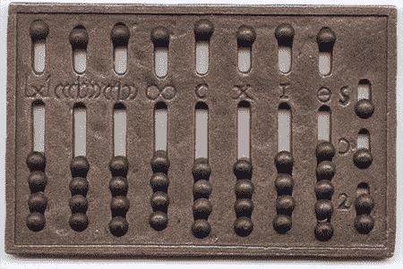

# 6 在字典中存储数据

本章涵盖

+   在字典中通过键存储值

+   与成对对象一起工作

+   使用元组创建字典

+   比较字典和数组

+   比较命名元组和字典

本章介绍了一种新的数据类型，称为*字典*。在其他一些语言中，这种数据类型也被称为*映射*。在字典中，通过键查找值，而不是像数组那样仅使用整数索引进行查找。代码示例说明了这种差异。每一行执行以下操作：

1.  在数组 xs 中查找第 42 个值 x。数组中的值是有序的。然而，xs 也可以是一个字典，因为字典的键可以是任何东西，包括整数。

1.  在字典 ys 中通过键"foo"查找值 y。

1.  在字典 zs 中使用字符'D'而不是字符串作为键来查找值 z。

```
x = xs[42]
y = ys["foo"]
z = zs['D']
```

通过一个涉及将罗马数字转换为十进制值以及反向转换的代码示例，你会发现字典的实用性。字典将用于跟踪字母 I、V 或 X 在十进制系统中的对应值。

## 6.1 解析罗马数字

虽然罗马数字在当今不太实用，但了解它们对于理解数字系统是有用的。特别是，在编程时，你会遇到各种数字系统。

罗马数字和二进制——计算机使用的系统——可能看起来非常繁琐。然而，它们往往看起来是这样，因为你没有按照它们本来的意图使用这些数字。

与阿拉伯数字（通常用于数字）相比，使用罗马数字用笔和纸进行计算比较困难。然而，罗马人并不是用笔和纸进行计算的。相反，他们使用罗马算盘（图 6.1）进行计算。



图 6.1 一个带有代表不同值的鹅卵石的罗马算盘。列决定了每个鹅卵石赋予的价值。

它被分为多个列。从右到左，你可以看到标记为 I、X 和 C 的鹅卵石列；它们各自包含四个鹅卵石。每个鹅卵石代表不同的值，具体取决于它们所在的列：

+   在 I 列中，每个鹅卵石代表 1。

+   在 X 列中，每个鹅卵石代表 10。

+   在 C 列中，每个鹅卵石代表 100。

这些列中每个都包含一个鹅卵石。它们被称为 V、L 和 D，分别代表 5、50 和 500。（在罗马算盘上实际上看不到 VLD 字母。）

注意：罗马数字系统的美在于你可以快速写下算盘上鹅卵石所表示的确切数值。同样，将鹅卵石排列在罗马算盘上以匹配你读到的罗马数字也很迅速。因此，在欧洲，罗马数字一直被使用到 1500 年，尽管阿拉伯数字已经引入。

让我们看看如何使用这些知识来解析罗马数字并将它们转换为阿拉伯数字。将以下代码放入文本文件中，并保存。不用担心新的语法；我们将在后面介绍。

列表 6.1 解析并将罗马数字转换为十进制数字

```
roman_numerals =
    Dict('I' => 1, 'X' => 10, 'C' => 100,
         'V' => 5, 'L' => 50, 'D' => 500,
         'M' => 1000)

function parse_roman(s)
    s = reverse(uppercase(s))
    vals = [roman_numerals[ch] for ch in s]
    result = 0
    for (i, val) in enumerate(vals)
        if i > 1 && val < vals[i - 1]
            result -= val
        else
            result += val
        end
    end
    result
end
```

将此文件加载到 Julia REPL 环境中以进行测试。这是使用不同罗马数字作为输入的 parse_roman 的一个示例：

```
julia> parse_roman("II")
2

julia> parse_roman("IV")
4

julia> parse_roman("VI")
6

julia> parse_roman("IX")
9

julia> parse_roman("XI")
11
```

让我们看看代码是如何工作的。

## 6.2 使用 Dict 类型

您使用所谓的 *字典* 将罗马字母 I、V、X 等映射或转换为数字。字典由多个对组成；对是通过箭头操作符 => 构建的。您不能使用等号操作符 =，因为它用于赋值。x = y 将 y 的值赋给变量 x，而 x => y 则在 x 和 y 中创建一个值对：

```
julia> 'X' => 10            ❶
'X' => 10

julia> pair = 'X' => 10     ❷
'X' => 10

julia> dump(pair)           ❸
Pair{Char,Int64}
  first: Char 'X'
  second: Int64 10

julia> pair.first           ❹
'X': ASCII/Unicode U+0058 (category Lu: Letter, uppercase)

julia> pair.second
10
```

❶ 字母 X 和数字 10 的一个对

❷ 对可以存储在变量中并在以后进行检查。

❸ dump 允许您查看任何值的字段。

❹ 提取对中的第一个值

对是复合对象，具有 first 和 second 字段。这些字段允许您访问在构建对时给出的两个值。然而，您应该将其视为实现细节，并使用 first 和 last 访问器函数访问对的字段。这种行为使对与第三章中介绍的 range 对象和第四章中介绍的元组非常相似：

```
julia> range = 2:4
2:4

julia> pair = 8=>9
8 => 9

julia> tuple = (3, 'B')
(3, 'B')

julia> first(range), first(pair), first(tuple)
(2, 8, 3)

julia> last(range), last(pair), last(tuple)
(4, 9, 'B')
```

在此代码示例中，我通过在行中用逗号分隔来访问多个值。这产生了一个包含三个值的元组。

看起来可能有些困惑，因为对中的第二个字段是通过函数 last 访问的。原因是数组也有最后一个元素。因此，last 在多个集合类型中具有更好的泛化能力。

注意 出于好奇，您可能会尝试在字典对象上使用 dump 函数。它具有 slots、idxfloor、maxprobe 等字段，这些字段可能不会很有意义。这是因为 dump 揭示了实现细节。作为数据类型的使用者，您不需要知道它有哪些字段，只需要知道您可以使用哪些函数来操作它。

您提供这些对的一个列表来创建一个字典。以下代码显示了如何创建一个字典，将罗马数字使用的字母映射到它们对应的十进制值。

```
julia> roman_numerals =
           Dict('I' => 1, 'X' => 10, 'C' => 100,
                  'V' => 5, 'L' => 50, 'D' => 500,
                  'M' => 1000)
Dict{Char,Int64} with 7 entries:
  'M' => 1000
  'D' => 500
  'I' => 1
  'L' => 50
  'V' => 5
  'X' => 10
  'C' => 100
```

在字典中使用时，您将每个对中的第一个值称为字典中的 *键*。每个对中的第二个值形成字典的 *值*。因此，I、X 和 C 是键，而 1、10 和 100 是值。

您可以向字典询问与键对应的值。这需要一个罗马字母并返回相应的值：

```
julia> roman_numerals['C']
100

julia> roman_numerals['M']
1000
```

## 6.3 遍历字符

您可以使用这个字典来帮助您将罗马字母转换为相应的数值。在`parse_roman`函数的第 8 行，您使用所谓的*数组推导式*进行这种转换。您遍历字符串`s`中的每个字符`ch`。在每次迭代中，您评估`roman_numerals[ch]`，所有这些值都被收集到一个数组中：

```
vals = [roman_numerals[ch] for ch in s]
```

推导式就像一个 for 循环，其中每个迭代都会评估一个值并将其添加到集合中。您可以为任何集合创建推导式，包括字典：

```
julia> Dict('A'+i=>i for i in 1:4)
Dict{Char, Int64} with 4 entries:
  'C' => 2
  'D' => 3
  'E' => 4
  'B' => 1
```

但在罗马数字代码中，推导式循环用于构建一个数组。为了更好地理解*数组推导式*的工作原理，让我们看看一个执行完全相同任务的常规 for 循环。在这个例子中，您从罗马数字“XIV”开始，您想要将其转换：

```
julia> s = "XIV"
"XIV"

julia> vals = Int8[]
Int8[]

julia> for ch in s
           push!(vals, roman_numerals[ch])
       end

julia> vals
3-element Vector{Int8}:
 10
  1
  5
```

“XIV”被转换成值数组[10, 1, 5]，命名为`vals`。然而，工作还没有完成。稍后，您需要将这些值组合成一个数字。

在转换输入字符串之前，代码将每个字母都转换为大写。例如，“xiv”将无法正确处理，因为字典的所有键都是大写的。

我将向您介绍这个过程的工作原理，并将解释为什么执行这些步骤的原因留到最后。反转字母的顺序，这样您就可以在循环中从右到左方便地处理数字：

```
julia> s = "xiv"
"xiv"

julia> s = reverse(uppercase(s))
"VIX"
```

## 6.4 枚举值和索引

在循环中处理值`val`时，您希望能够与前面的值进行比较。您可以使用一个变量，比如`prev`，来存储前一次迭代的值。相反，您将使用`enumerate`函数来获取每个值`val`处理的索引`i`。那么，`val`前面的值就是`vals[i-1]`：

```
for (i, val) in enumerate(vals)
    if i > 1 && val < vals[i - 1]
        result -= val
    else
        result += val
    end
end
```

为了更好地理解`enumerate`的工作原理，让我们使用一些专注于`enumerate`的示例：

```
julia> enumerate([4, 6, 8])
enumerate([4, 6, 8])
```

那个输出毫无用处。原因是`enumerate`是*惰性的*。您不会得到任何值，因为此表达式实际上不需要评估任何值。但您可以使用`collect`函数收集`enumerate`本应产生的所有值到一个数组中。以下是一个收集范围的简单示例：

```
julia> collect(2:3:11)
4-element Vector{Int64}:
  2
  5
  8
 11
```

更有趣的是如何从枚举中收集值：

```
julia> collect(enumerate(2:3:11))
4-element Vector{Tuple{Int64, Int64}}:
 (1, 2)
 (2, 5)
 (3, 8)
 (4, 11)

julia> collect(enumerate([4, 6, 8]))
3-element Vector{Tuple{Int64, Int64}}:
 (1, 4)
 (2, 6)
 (3, 8)
```

`collect`函数将模拟循环操作，就像 for 循环一样，但它会将遇到的全部值收集到一个数组中，然后返回。因此，您可以看到，使用`enumerate`，您在每次迭代时都会得到一对值：一个整数索引和该索引处的值。

## 6.5 解释转换过程

您不能简单地将转换成相应数值的罗马字母相加。以罗马数字 XVI 为例。它变成了[10, 5, 1]。您可以相加这些元素并得到正确的结果：16。然而，XIV 应该表示 14，因为在*IV*这样的情况下，较小的罗马数字位于较大的数字之前，您需要从较大的数字中减去较小的值。

你不能只是将相应的数组 [10, 1, 5] 相加。相反，你需要反转它，以便通过值向后工作。在每一个索引处，你都会询问当前值是否低于前一个值。如果是，则从结果中减去；否则，加上下一个值：

```
if i > 1 && val < vals[i - 1]
    result -= val
else
    result += val
end
```

这就是 val < vals[i - 1] 的作用。它将当前值 val 与前一个值 vals[i - 1] 进行比较。result 用于累积所有单个罗马字母的值。

## 6.6 使用字典

现在你已经查看了一个使用 Julia 中的字典类型 Dict 的实际代码示例，让我们探索更多与字典交互的方法。

### 6.6.1 创建字典

创建字典有多种方法。在本节中，我将讨论一些示例，从多个参数开始，其中每个参数都是一个对对象：

```
julia> Dict("two" => 2, "four" => 4)
Dict{String,Int64} with 2 entries:
  "two"  => 2
  "four" => 4
```

将一个对数组传递给字典构造函数（一个与它创建的实例类型同名的函数）：

```
julia> pairs = ["two" => 2, "four" => 4]
2-element Vector{Pair{String, Int64}}:
  "two" => 2
  "four" => 4

julia> Dict(pairs)
Dict{String,Int64} with 2 entries:
  "two"  => 2
  "four" => 4
```

将一个元组数组传递给字典构造函数。与对相比，元组可以包含超过两个值。对于字典，它们必须只包含一个键和一个值：

```
julia> tuples = [("two", 2), ("four", 4)]
2-element Vector{Tuple{String, Int64}}:
 ("two", 2)
 ("four", 4)

julia> Dict(tuples)
Dict{String,Int64} with 2 entries:
  "two"  => 2
  "four" => 4
```

你如何知道使用哪个变体？这取决于你试图解决的问题。例如，当你阅读第五章中的披萨数据时，你得到了一个元组的数组：

```
pizzas = [
   ("mexicana", 13.0),
   ("hawaiian", 16.5),
   ("bbq chicken", 20.75),
   ("sicilian", 12.25),
 ]
```

你可能想将此数据放入字典中，以便快速查找给定披萨的价格：

```
julia> pizza_dict = Dict(pizzas)
Dict{String, Float64} with 4 entries:
  "sicilian"    => 12.25
  "bbq chicken" => 20.75
  "mexicana"    => 13.0
  "hawaiian"    => 16.5

julia> pizza_dict["mexicana"]
13.0
```

然而，如果你不介意保持披萨数据的顺序，你可以直接定义这个字典：

```
Dict(
  "sicilian"    => 12.25,
  "bbq chicken" => 20.75,
  "mexicana"    => 13.0,
  "hawaiian"    => 16.5)
```

有时你需要一个空字典，稍后将其填充。一个例子就是从文件直接加载到字典中。你不必将值追加到数组的末尾，而是可以将它们插入到字典中：

```
julia>  d = Dict()
Dict{Any, Any}()
```

注意到 {Any, Any} 部分。这描述了 Julia 推断的字典中键和值的类型。然而，当你创建你的披萨字典时，你会注意到 Julia 将其描述为 Dict{String, Float64} 类型。String 指的是字典中键的类型，而 Float64 指的是值的类型。然而，你仍然可以为空字典指定键和值的类型：

```
julia> d = Dict{String, Float64}()
Dict{String,Int64} with 0 entries

julia> d["hawaiian"] = 16.5
16.5
```

指定键和值的类型的好处是，在运行时更容易捕捉到字典的错误使用。如果你尝试为键和值使用错误类型的值，Julia 将抛出一个异常来指示错误（第六章将更深入地介绍不同类型）。在这种情况下，你试图使用一个整数 5 作为键，而预期的是一个文本字符串键：

```
julia> d[5] = "five"
ERROR: MethodError: Cannot `convert` an object of type Int64
to an object of type String
```

有时你会得到单独的键和值数组。然而，你仍然可以使用 zip 函数将它们组合成对来创建字典：

```
julia> words = ["one", "two"]
2-element Vector{String}:
 "one"
 "two"

julia> nums = [1, 2]
2-element Vector{Int64}:
 1
 2

julia> collect(zip(words, nums))
2-element Vector{Tuple{String,Int64}}:
 ("one", 1)
 ("two", 2)

julia> Dict(zip(words, nums))
Dict{String,Int64} with 2 entries:
  "two" => 2
  "one" => 1
```

### 6.6.2 元素访问

你已经看到了一种获取和设置字典元素的方法。但是，如果你尝试检索一个不存在的键的值，比如 "seven"，会发生什么？

```
julia> d["hawaiian"]
16.5

julia> d["seven"]
ERROR: KeyError: key "seven" not found
```

你会得到一个错误。当然，你可以简单地添加它：

```
julia>  d["seven"] = 7;

julia> d["seven"]
7.0
```

但当你不确定键是否存在时，如何避免产生错误？一种解决方案是使用 get()函数。如果键不存在，则返回一个哨兵值。哨兵可以是任何值。

注意：在计算机编程中，*哨兵值*（也称为*标志值*、*触发值*、*异常值*、*信号值*或占位数据）是在使用其存在作为终止条件的情况下使用的特殊值，通常在循环或递归算法中使用。

这是在许多编程语言中处理字典时使用的一种策略。以下示例使用-1 作为哨兵值：

```
julia> get(d, "eight", -1)
-1
```

或者，你可以简单地询问字典是否具有该键：

```
julia> haskey(d, "eight")
false

julia> d["eight"] = 8
8

julia> haskey(d, "eight")
true
```

## 6.7 为什么使用字典？

原则上，你可以使用数组将罗马数字转换为十进制数字。以下是如何做到这一点的示例。

列表 6.2 在键值对数组中通过键查找值

```
function lookup(key, table)
   for (k, v) in table         ❶
       if key == k
           return v            ❷
       end
   end
   throw(KeyError(key))        ❸
 end
```

❶ 从数组中的每个键值对中提取键 k 和值 v。

❷ 找到了匹配的键，因此返回相应的值。

❸ 如果遍历所有键值对没有找到匹配的键，那么你无法返回任何内容，必须抛出异常。在 Julia 中，当键缺失时，使用 KeyError 异常是惯例。

你可以将查找表定义为键值对的数组，而不是字典：

```
numerals = ['I' => 1, 'X' => 10, 'C' => 100,
            'V' => 5, 'L' => 50, 'D' => 500,
                                 'M' => 1000]
```

这样，你可以根据键进行查找，类似于字典。

```
julia> lookup('X', roman_numerals)
10

julia> lookup('D', roman_numerals)
500

julia> lookup('S', roman_numerals)    ❶
 ERROR: KeyError: key 'S' not found
```

❶ 查找不存在的键，产生异常的演示

在进行基于键的查找时避免使用数组，因为查找所需的时间会随着数组大小的线性增长而增长。在 30 个条目中查找一个元素，平均需要的时间是 10 个元素中查找一个条目的三倍。不难看出，这种方法在大数组中扩展性不好。在 100 万个元素中查找一个元素所需的时间将是 1000 个元素中查找该元素所需时间的 1000 倍。

相反，字典被设计成查找时间与字典包含的元素数量无关。在 100 个元素中查找 1 个元素与在 100 万个元素中查找相似。

为什么字典查找如此快速？

为什么字典允许根据键快速查找值，这超出了本书的范围。关于数据结构和算法的书籍通常会详细讨论这个主题，而字典更多地指的是数据结构的接口，而不是用于实现快速查找的实际数据结构。在 Julia 中，使用*哈希表*来实现快速查找，但也可以使用*二叉搜索树*数据结构来实现字典。

但不要低估数组。短数组搜索非常快——比同等大小的字典快。因此，当元素数量少于 100 时，数组仍然是一个可行的选择。实际上，罗马数字代码示例使用了字典，因为当处理基于键的查找时，字典使用起来很方便，而且你永远不必担心因为添加了太多元素而导致性能大幅下降。

然而，在某些特殊情况下，使用数组可以非常有效（例如，如果你永远不会修改数组）。如果元素永远不会被添加或删除，你可以简单地保持数组排序。使用 Julia 的 searchsortedfirst 函数可以非常快速地搜索排序后的数组。实际上，罗马数字代码示例非常适合这种方法，因为数字和十进制值之间的映射是固定的。你可以通过保持键和值分别排序的数组来实现这一点。

列表 6.3 带有匹配值数组的排序键数组

```
keys = ['C', 'D', 'I', 'L', 'M', 'V', 'X']
vals = [100, 500, 1, 50, 1000, 5, 10]
```

使用 searchsortedfirst，你可以找到特定键的索引。

```
julia> i = searchsortedfirst(keys, 'I')
3
```

确保键 I 的值位于 vals 数组中的相同索引 i：

```
julia> vals[i]
1
```

这里还有一个例子：

```
julia> j = searchsortedfirst(keys, 'V')
6

julia> vals[j]
5
```

## 6.8 使用命名元组作为字典

在结束本章之前，我想向你展示另一个很酷的技巧，它允许你用更好的性能编写更易读的代码。你已经看到了可以通过索引访问元素的元组。但你还没有看到通过键访问元组值，就像字典一样。

记住你创建了一个像这样的 pizza 元组：("hawaiian", 'S', 10.5)。你可以给每个值命名；你给出的名称将不是文本字符串，而是 Julia *符号*（内置 Julia 类型，用于表示标识符）。在第五章中，你使用了 :cyan、:green 和 :red 这样的符号来指定打印文本的颜色。同样，你可以使用符号如 :name 和 :price 访问 pizza 元组中的单个值：

```
julia> pizza = (name = "hawaiian", size = 'S', price = 10.5)
(name = "hawaiian", size = 'S', price = 10.5)

julia> pizza[:name]
"hawaiian"

julia> pizza[:price]
10.5

julia> pizza.name
"hawaiian"

julia> pizza.size
'S': ASCII/Unicode U+0053
```

注意你在最后两个表达式中使用的快捷方式；pizza[:price] 等同于写作 pizza.price。这种方式处理数据的方式对于 JavaScript 开发者来说很熟悉。

请记住，符号在功能上比字符串有限得多。在大多数情况下，它们被视为原子值。你不能访问符号中的单个字符，也不能像字符串那样组合和操作它们。幸运的是，很容易在键和字符串之间进行转换：

```
julia> s = "price"; t = :name;

julia> Symbol(s)    ❶
:price

julia> string(t)    ❷
 "name"
```

❶ 从字符串创建一个符号。

❷ 从符号创建一个字符串。

使用这些知识，你可以将列表 6.1 中的 parse_roman 函数重写为使用命名元组而不是字典。观察你会发现，你必须将查找 roman_numerals[ch] 改为 roman_numerals[Symbol(ch)]，因为 roman_numerals 的键不再是字符，而是符号。

列表 6.4 使用命名元组解析罗马数字

```
roman_numerals =                                      ❶
          (I = 1, X = 10, C = 100,
            V = 5, L = 50, D = 500,
            M = 1000)

function parse_roman(s)
    s = reverse(uppercase(s))
    vals = [roman_numerals[Symbol(ch)] for ch in s]   ❷
    result = 0
    for (i, val) in enumerate(vals)
        if i > 1 && val < vals[i - 1]
            result -= val
        else
            result += val
        end
    end
    result
end
```

❶ 从字典更改为命名元组

❷ 使用 Symbol(ch) 而不是 ch 进行查找

### 6.8.1 何时使用命名元组？

命名元组看起来与字典非常相似，那么拥有它们的目的是什么呢？所有类型的元组都是不可变的，这意味着你不能改变它们。一旦创建了元组，就不能向其中添加值，也不能修改现有值。相比之下，数组和字典都允许你添加值。字典为你提供了更广泛的类型选择，可以用作键。命名元组只允许你使用符号作为键。

任何元组类型相对于数组或字典的优势在于，Julia JIT 编译器将确切知道在任何给定时间元组中会有哪些元素，这允许进行更激进的优化。因此，你可以假设元组通常会比数组或字典提供相等或更好的性能。

虽然只使用符号作为键是一种限制，但它也允许命名元组提供更方便的语法来访问值。例如，pizza.name 比 pizza[:name] 更容易编写和阅读。

### 6.8.2 将所有内容结合起来

本章涵盖了任何程序员都应该了解的所有关键类型。有了数字、范围、字符串、数组、元组和字典，你可以做几乎所有的事情。然而，我还没有详细说明类型实际上是什么，或者你如何创建自己的自定义类型。这对于促进构建更大、功能更丰富的应用程序至关重要。这将是下一章的重点。

## 摘要

+   字典持有键值对，其中键必须是唯一的。

+   在字典中，键值对可以快速查找、添加或删除。这与可能需要耗时搜索的大数组不同。

+   当元素数量较少或你可以进行基于索引而不是基于键的元素访问时，数组提供了更好的性能。

+   在 Julia 中，键和值是有类型的。因此，Julia 能够捕获错误类型键的使用，以及尝试插入错误类型值的尝试。

+   命名元组类似于不可变版本的字典。你可以查找值，但不能修改它们或添加新条目。
