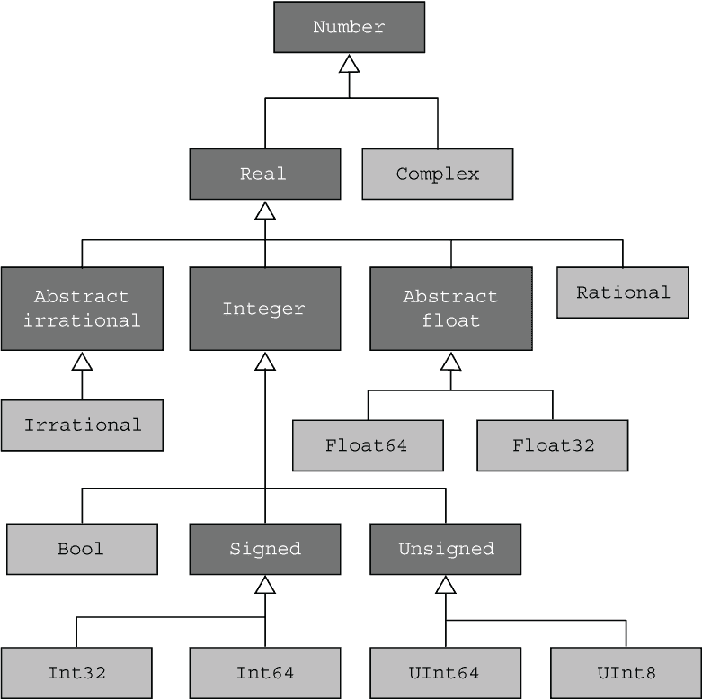
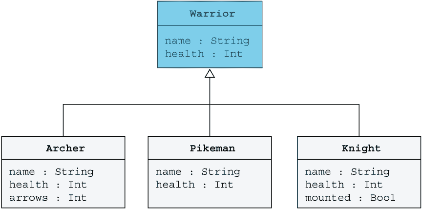
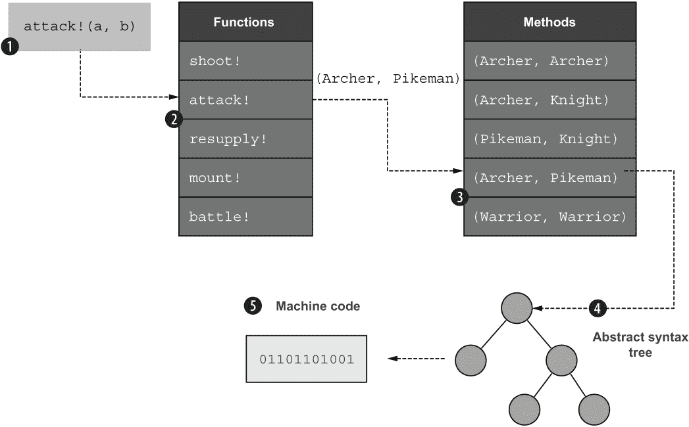
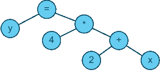
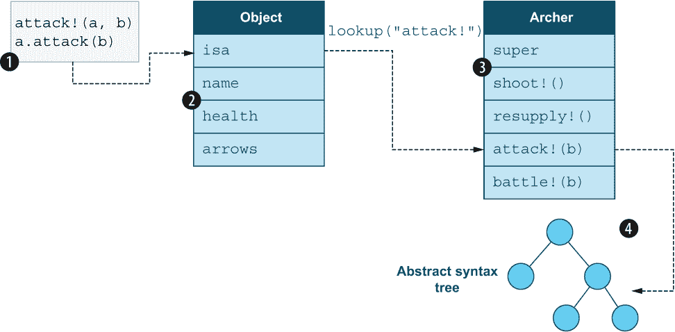

# 7 理解类型

本章涵盖了

+   理解类型层次结构

+   抽象类型和具体类型之间的区别

+   将原始类型组合成复合类型

+   利用多重分派的力量优雅地解决复杂任务

+   多重分派与面向对象语言中的单分派有何不同^(1)

Julia 中的所有对象都属于特定类型。记住，你可以使用 typeof 来发现任何对象的类型：

```
julia> typeof(42)
Int64

julia> typeof('A')
Char
julia> typeof("hello")
String
```

类型决定了你可以对对象做什么。例如，字典允许你通过键查找值，而数组按顺序存储元素。评估为 Bool 值的表达式，如 true 或 false，可以在 if 语句和 while 循环中使用，而评估为浮点值的表达式则不能：

```
julia> if 2.5
           print("this should not be possible")
       end
ERROR: TypeError: non-boolean (Float64) used in boolean context
```

因此，如果你想创建具有不同行为和特征的对象，你需要定义新的类型。在编程中，我们经常试图模仿现实世界：

+   银行应用程序有代表银行账户、客户和交易的类型。

+   视频游戏有代表怪物、英雄、武器、宇宙飞船、陷阱等等的对象。

+   图形用户界面有代表按钮、菜单项、弹出菜单和单选按钮的对象。

+   绘图应用程序有代表不同形状、笔触、颜色和绘图工具的对象。

因此，无论你想制作哪种类型的应用程序，你都需要知道如何创建与该应用程序相关的类型。本章和下一章将定义与视频游戏和火箭模拟器中的模型行为相关的类型。

## 7.1 从原始类型创建复合类型

让我们从基础知识开始：整数、字符和浮点数都是原始类型的例子。你不能将它们进一步分解成更小的部分。在某些语言中，如 LISP，这些被恰当地命名为*原子*。使用 isprimitivetype 你可以检查一个类型是否是*原始的*：

```
julia> isprimitivetype(Int8)
true

julia> isprimitivetype(Char)
true

julia> isprimitivetype(String)
false
```

你可以将原始类型组合成复合类型。复合类型甚至可以由其他复合类型组成。例如，字符串是由多个字符组成的复合类型，而字符是原始类型。让我们通过定义一个在视频游戏中表示弓箭手向对手射箭的有用复合类型来具体演示这一点。

列表 7.1 复合类型的定义

```
struct Archer
    name::String   ❶
    health::Int    ❷
    arrows::Int    ❸
end
```

❶ 弓箭手的名字——比如说罗宾汉

❷ 剩余的生命值

❸ 箭袋中的箭

将类型视为模板或模具，你使用它们来制作多个对象。从类型中制作的对象称为*实例*。

警告 Julia 的复合类型可能看起来与 Java、C++或 Python 中的类非常相似，但它们并不是同一回事。它们不支持实现继承，也没有附加的方法。

以下代码片段显示了 Archer 类型的实例创建。你也可能听到人们使用诸如“实例化一个 Archer 对象”之类的短语。

```
julia> robin = Archer("Robin Hood", 30, 24)
Archer("Robin Hood", 30, 24)

julia> william = Archer("William Tell", 28, 1)
Archer("William Tell", 28, 1)

julia> robin.name      ❶
"Robin Hood"

julia> robin.arrows    ❷
 24
```

❶ 访问 robin 对象的名称字段。

❷ 访问 robin 对象的 arrows 字段。

组合类型的定义与使用字典有一些相似之处。例如，你定义字段以存储可以通过其字段名访问的值。然而，与字典不同，你可以使用 *类型注解* 为每个字段指定不同的类型。

重要提示：在 Julia 中，:: 用于注释变量和表达式及其类型。x::T 表示变量 x 应该具有类型 T。这有助于 Julia 确定需要多少字节来存储结构体中的所有字段。

为了阐明这一点，定义一个字典来存储关于弓箭手的资料。

列表 7.2 使用字典存储关于弓箭手的资料

```
julia> robin = Dict("name"   => "Robin Hood",
                    "health" => 30,
                    "arrows" => 24)
Dict{String, Any} with 3 entries:       ❶
  "name"   => "Robin Hood"
  "health" => 30
  "arrows" => 24

julia> robin["name"]                    ❷
"Robin Hood"

julia> robin["arrows"]
24
```

❶ 字典具有 String 键，其中值是 Any 类型

❷ 访问存储在 name 键中的值

使用字典的一个问题是它要求每个值都具有相同的类型。但是等等，name 和 arrows 完全是不同类型吗？

简短的回答是，字典中的值是 Any 类型。这意味着你可以存储任何类型的值。键更加限制性，因为它们被定义为 String 类型。但要真正理解这是如何工作的，你需要探索 Julia 类型层次结构。

## 7.2 探索类型层次结构

如果你熟悉面向对象的语言，那么你应该熟悉类继承层次结构。在 Julia 中，你也有类型层次结构，但一个显著的区别是这些层次结构也存在于原始类型中。例如，在 Java 或 C++ 这样的语言中，整数或浮点数只是一个具体的类型。然而，在 Julia 中，甚至数字、集合和字符串都是更深层次类型层次结构的一部分（图 7.1）。



图 7.1 数字类型层次结构，显示抽象和具体类型在深浅阴影的框中

你可以使用超类型和子类型函数来探索这些层次结构。你可以通过从类型层次结构的顶部开始，向下使用子类型函数找到子类型，然后进一步探索来重新创建图 7.1 中数字的类型层次结构：

```
julia> subtypes(Number)      ❶
2-element Vector{Any}:
 Complex
 Real

julia> subtypes(Real)        ❷
4-element Vector{Any}:
 AbstractFloat
 AbstractIrrational
 Integer
 Rational

julia> subtypes(Integer)     ❸
3-element Vector{Any}:
 Bool
 Signed
 Unsigned
```

❶ 查找 Number 类型的直接子类型。

❷ 发现实数的子类型。

❸ 整数可以是带符号的或无符号的。

但你怎么知道数字层次结构的根是 Number 类型呢？你可以从你已知的数字类型向上工作：

```
julia> T = typeof(42)      ❶
Int64

julia> T = supertype(T)    ❷
Signed

julia> T = supertype(T)
Integer

julia> T = supertype(T)
Real

julia> T = supertype(T)
Number
```

❶ 将 42 的类型存储在变量 T 中。

❷ 查找 Int64 的超类型，并将其存储在 T 中。

你甚至可以继续传递数字层次结构的根，直到你到达整个 Julia 类型层次结构的根。一旦你到达 Any，你就知道你已经到达了类型层次结构的顶端，因为 Any 的超类型也是 Any：

```
julia> T = supertype(T)
Any

julia> T = supertype(T)
Any
```

重要的是要认识到 Julia 的类型是一等对象，你可以将它们作为参数传递或存储在变量中。例如，这里你将整数 42 的类型存储在一个名为 T 的变量中。在许多语言中，使用 T 作为任意类型的名称是一种约定。让我们通过一些简单的函数来探索类型层次。

列表 7.3 查找类型层次的最顶层

```
function findroot(T)
    T2 = supertype(T)
    println(T)
    if T2 != T        ❶
        findroot(T2)
    end
end
```

❶ 检查 T 的超类型是否与 T 相同。

这是一个递归函数，你可以用它来找到类型层次的最顶层：

```
julia> findroot(typeof(42))
Int64
Signed
Integer
Real
Number
Any

julia> supertype(Any)
Any
```

你可以看到类型层次在 Any 处停止，因为 Any 的超类型是 Any。那么这些类型层次有什么意义呢？它们作为程序员如何帮助你？让我给你一个 REPL 中的例子来给你一些提示：

```
julia> anything = Any[42, 8]        ❶
2-element Vector{Any}:
 42
  8

julia> integers = Integer[42, 8]    ❷
2-element Vector{Integer}:
 42
  8

julia> anything[2] = "hello"        ❸
"hello"

julia> integers[2] = "hello"        ❹
ERROR: MethodError: Cannot `convert` an object
       of type String to an object of type Integer
```

❶ 定义一个可以存储 Any 值的数组。

❷ 定义一个可以存储 Integer 值的数组。

❸ 将字符串放入任何数组中都可以正常工作。

❹ 整数数组不接受字符串。

由于 Julia 中的每个对象都符合 Any 类型，因此你可以将任何对象放入你指定每个元素必须为 Any 类型的数组中。然而，并非 Julia 中的每个对象都是 Integer 类型。因此，将文本字符串“hello”放入必须为 Integer 类型的数组中是不行的。

你如何知道哪些类型是兼容的？你尝试存储的值必须是一个允许的元素类型的子类型。实际上，你可以使用<:运算符来程序化地检查这一点。

列表 7.4 检查哪些类型是彼此的子类型

```
julia> String <: Any
true

julia> String <: Integer    ❶
false

julia> Int8 <: Integer
true

julia> Float64 <: Integer   ❷
 false
```

❶ 字符串不是整数的一种。

❷ Float64 是一个数字，但不是一个整数。

你可以从这个例子中看到，类型不能仅仅是有些相关（例如，浮点数和整数）。例如，4.5 是一个浮点数，但不是一个整数。然而，Int8(4)和 Int32(5)都是整数；它们是 Integer 的子类型。

这应该给你一些关于定义复合类型来存储相关数据的优势，而不是使用字典的优势的提示。每个字段可以有不同的类型。这提供了更好的运行时类型检查。

## 7.3 创建战斗模拟器

为了进一步探索这些概念，你将开发一个简单的不同战士之间战斗的模拟器，这在桌面游戏、卡牌游戏和视频游戏中很常见。

许多电脑游戏基于石头剪刀布的原则。让我澄清一下：在你的游戏中，有弓箭手、骑士和长矛兵，你会设置它们，使得

+   弓箭手打败了长矛兵，

+   骑士打败了弓箭手，并且

+   长矛兵打败了骑士。

这些单位在历史上的工作方式大致如此。弓箭手会向缓慢移动的长矛兵射箭，并在他们接近到足以攻击弓箭手之前击败他们。然而，如果骑士在射出大量箭矢并砍倒他们之前冲到弓箭手身边，这种策略就会失败。但是，骑士不能使用这种策略对付长矛兵，因为一堵长矛墙会阻止骑士冲锋，以免被刺穿。

你将在代码中实现以下内容：

+   一个适用于所有战士类型的抽象类型 Warrior

+   具体的战士类型弓箭手、长矛兵和骑士

+   具体类型和抽象类型之间关系的解释

+   通过定义如 shoot!和 mount!等函数来定义每种战士类型的行为

+   一个攻击!函数来模拟一个战士攻击另一个战士

+   一个战斗!函数来模拟两个战士反复攻击对方，直到一方获胜或双方都死亡

### 7.3.1 定义战士类型

创建一个名为 warriors.jl 的文件来存储你将开发的代码。从定义你将使用的类型开始。 

列表 7.5 战斗模拟器中类型的定义

```
abstract type Warrior end           ❶

mutable struct Archer <: Warrior    ❷
    name::String
    health::Int
    arrows::Int
end

mutable struct Pikeman <: Warrior
    name::String
    health::Int
end

mutable struct Knight <: Warrior
    name::String
    health::Int
    mounted::Bool                   ❸
 end
```

❶ 定义一个抽象类型 Warrior

❷ 将弓箭手定义为可变子类型 Warrior

❸ 骑士可以骑马或步行。

列表 7.5 中的代码正在创建以下所示的类型层次结构。在这些层次结构中，你区分了抽象类型和具体类型。弓箭手、长矛兵和骑士是具体类型的例子，而战士是抽象类型的例子。你可以创建具体类型的对象，但不能创建抽象类型的对象：

```
julia> robin = Archer("Robin Hood", 34, 24)
Archer("Robin Hood", 34, 24)
julia> Warrior()
ERROR: MethodError: no constructors have been defined for Warrior
```

抽象类型的目的在于促进类型层次结构的构建。

在图 7.2 中，我已将名称和健康添加到战士类型框中。然而，这只是为了说明所有子类型都必须有这些字段。Julia 没有提供语法来强制执行此操作。相反，这是通过惯例来做的。



图 7.2 战士类型层次结构。深色框是抽象类型，浅色框是具体类型。

在 Julia 中，如果你定义一个类型为抽象类型，它不能有任何字段。只有具体类型才能有字段或值。一个*复合类型*是一个具有字段的具体系列类型，而一个*原始类型*是一个具有单个值的具体系列类型。

子类型运算符<:不仅用于检查一个类型是否是另一个类型的子类型，还用于定义一个类型为子类型：

```
struct B <: A
  ...
end
```

这段代码片段将类型 B 定义为类型 A 的子类型。在 Julia 中，你不能将具体类型作为子类型。如果你使用过流行的面向对象语言，如 Java、C++、C#、Python 或 Ruby，这可能会让你感到惊讶。如果你考虑我们刚刚覆盖的数字层次结构，这就有意义了。你知道 Int32 或 Float64 需要多少空间，但你需要多少字节来存储整数或实数？你不知道。这就是为什么大多数数字类型都是抽象的。

### 7.3.2 为战士添加行为

只包含数据的战士并不令人兴奋。因此，你将通过定义几个带有相应方法的函数来为它们添加行为。将这些添加到 warrior.jl 源代码文件（列表 7.6）中。

所有这些函数的名字中都有一个感叹号，因为它们修改了一个字段（记住，这只是一个约定）。这就是为什么组合类型在其定义中添加了可变关键字。如果一个结构类型没有被定义为*可变*，它将不支持修改字段的函数。如果没有可变关键字，组合类型将默认为*不可变*。

列表 7.6 为战士类型添加行为

```
function shoot!(archer::Archer)
    if archer.arrows > 0
        archer.arrows -= 1
    end
end

function resupply!(archer::Archer)
    archer.arrows = 24
end

function mount!(knight::Knight)
    knight.mounted = true
end

function dismount!(k::Knight)
    knight.mounted = false
end
```

这里是每个函数的简要描述：

+   shoot!—弓箭手射出一支箭。箭矢数量减少一支。

+   resupply!—模拟弓箭手获得 24 支箭矢的补给。

+   mount!—改变骑士的状态，使其骑在马上。

+   dismount!—让骑士下马，为步兵战斗做准备。

可变与不可变类型

以下是在函数式编程社区内发展的重要见解：如果对象不能被修改，你的程序出现 bug 的可能性会更小。不能被修改的对象被称为*不可变*。如果它们可以被修改，则被称为*可变*。

在较老的语言中，对象默认是可变的。Julia 遵循一个现代趋势：除非明确标记为可变，否则对象是*不可变*的。

使用 shoot!函数可以模拟弓箭手在战斗中如何消耗箭矢。通常，中世纪的弓箭手在箭袋里有 24 支箭。当这些箭矢用完时，弓箭手需要重新补给：

```
julia> robin = Archer("Robin Hood", 34, 24)   ❶
Archer("Robin Hood", 34, 24)

julia> shoot!(robin)
23                                            ❷

julia> shoot!(robin)
22                                            ❷

julia> robin
Archer("Robin Hood", 34, 22)                  ❸
```

❶ 创建带有 24 支箭的弓箭手

❷ 剩余箭矢数量

❸ 剩余 22 支箭矢

你可以通过一个技巧来改进 shoot!函数，这个技巧我在开发 Julia 软件时经常使用：我返回在 REPL 中运行函数时最有用的对象（参见列表 7.7）。在调用修改对象的函数时，看到修改后的对象的样子非常有用。因此，在修改函数中返回修改后的对象是一个好习惯。

列表 7.7 将修改函数修改为 REPL 友好型

```
function shoot!(archer::Archer)
    if archer.arrows > 0
        archer.arrows -= 1
    end
    archer                          ❶
end

function resupply!(archer::Archer)
    archer.arrows = 24
    archer                          ❶
 end
```

❶ 返回修改后的弓箭手对象

这使得测试你正在开发的函数，并检查它们是否执行正确的操作变得简单得多：

```
julia> robin = Archer("Robin Hood", 34, 24)
Archer("Robin Hood", 34, 24)

julia> shoot!(robin)
Archer("Robin Hood", 34, 23)    ❶

julia> shoot!(robin)
Archer("Robin Hood", 34, 22)    ❶

julia> shoot!(robin)
Archer("Robin Hood", 34, 21)    ❶

julia> resupply!(robin)
Archer("Robin Hood", 34, 24)    ❷
```

❶ 展示箭矢数量的减少。

❷ 箭矢数量增加到 24。

你可以使用这些函数来构建新的函数，以模拟战士攻击另一个战士。再次，将此代码添加到 warriors.jl 文件中。看起来你定义了两次 attack!。这是怎么做到的？

列表 7.8 模拟弓箭手与骑士之间战斗的两种方法

```
function attack!(a::Archer, b::Archer)          ❶
   if a.arrows > 0                              ❷
        shoot!(a)
        damage = 6 + rand(1:6)                  ❸
        b.health = max(b.health - damage, 0)    ❹
    end
    a.health, b.health
end

function attack!(a::Archer, b::Knight)          ❺
    if a.arrows > 0                             ❷
        shoot!(a)
        damage = rand(1:6)                      ❻
        if b.mounted
            damage += 3
        end
        b.health = max(b.health - damage, 0)    ❹
    end
    a.health, b.health
end
```

❶ 模拟弓箭手攻击另一个弓箭手。

❷ 如果箭矢用尽，则无法攻击

❸ 投掷一个六面骰子（d6）来计算箭矢伤害。

❹ 使用 max 避免健康值变为负数。

❺ 模拟弓箭手攻击骑士。

❻ 投掷一个六面骰子（d6）来计算箭矢伤害。

如果这是一个常规的动态语言，例如 JavaScript、Python、Ruby 或 Lua，那么 attack! 的最后一个定义将覆盖第一个定义。如果这是一个静态类型语言，例如 Java、C# 或 C++，你将创建一个称为 *函数重载* 的东西 ^(4)。但在 Julia 中，发生的事情完全不同。

### 7.3.3 使用多重分派调用方法

在 Julia 中，你实际上并没有定义两个函数，而是定义了两个附加到 attack! 函数的 *方法*。我知道这听起来很令人困惑，所以让我更详细地解释一下。在 Julia 中，你实际上定义函数的方式如下所示。

列表 7.9 Julia 中没有方法的函数定义

```
function shoot! end
function resupply! end
function attack! end
```

函数只是名称。除非你将方法附加到它们，否则它们什么也不能做。启动一个新的 Julia REPL，并将以下函数定义以及战士、弓箭手和骑士类型的定义（参见列表 7.5）粘贴进去，然后创建一些对象来使用：

```
julia> robin = Archer("Robin Hood", 34, 24)
Archer("Robin Hood", 34, 24)

julia> white = Knight("Lancelot", 34, true)
Knight("Lancelot", 34, true)
```

现在，你可以尝试使用这些对象做一些事情，看看会发生什么：

```
julia> attack!(robin, white)                  ❶
ERROR: MethodError: no method matching attack!(::Archer, ::Knight)

julia> shoot!(robin)                          ❶
ERROR: MethodError: no method matching shoot!(::Archer)

julia> mount!(white)                          ❷
 ERROR: UndefVarError: mount! not defined
```

❶ 尝试调用没有定义方法的函数

❷ 尝试调用未定义的函数

你可以从这些错误中看出，Julia 区分了你完全没有定义的函数，例如 mount!，以及定义了但没有方法的函数，例如 shoot! 和 attack!。但你怎么知道它们没有任何方法呢？Julia 有一个名为 methods 的函数，它允许你检查附加到函数的方法数量：

```
julia> methods(attack!)                      ❶
# 0 methods for generic function "attack!":

julia> methods(mount!)                       ❷
 ERROR: UndefVarError: mount! not defined
```

❶ 证明 attack! 是一个没有方法的函数。

❷ Julia 找不到 mount!。

你可以查看 Julia 报告说 attack! 没有任何方法。让我们将这个结果与将 warriors.jl 文件加载到 REPL 中进行比较。

```
julia> include("warriors.jl")     ❶

julia> methods(shoot!)
# 1 method for generic function "shoot!":
[1] shoot!(archer::Archer)

julia> methods(attack!)
# 2 methods for generic function "attack!":
[1] attack!(a::Archer, b::Archer)
[2] attack!(a::Archer, b::Knight)

julia> methods(mount!)
# 1 method for generic function "mount!":
[1] mount!(knight::Knight)
```

❶ 将代码加载到 Julia REPL 中

图 7.3 展示了你在 REPL 中看到的内容。在内部，Julia 有一个函数列表。每个函数都进入另一个列表，包含对应函数条目的方法。方法可以跨越不同的类型，因为它们不是附加到类型上，而是附加到函数上。没有任何东西阻止你添加一个 shoot! 方法，该方法操作字典或数组类型。


图 7.3 Julia 如何将方法附加到函数。每个方法处理一组独特的参数。

让我们创建一些对象，让你可以玩一玩：

```
julia> robin = Archer("Robin Hood", 34, 24)
Archer("Robin Hood", 34, 24)

julia> tell = Archer("William Tell", 30, 20)
Archer("William Tell", 30, 20)

julia> white = Knight("Lancelot", 34, true)
Knight("Lancelot", 34, true)

julia> black = Knight("Morien", 35, true)
Knight("Morien", 35, true)
```

对于某些对象，你可以在调用 attack! 函数时使用不同类型的对象进行实验：

```
julia> attack!(robin, white)         ❶
(34, 30)                             ❷

julia> attack!(robin, white)         ❶
(34, 26)                             ❷

julia> attack!(tell, robin)          ❸
(30, 22)                             ❷

julia> attack!(black, white)         ❹
ERROR: MethodError: no method matching attack!(::Knight, ::Knight)
Closest candidates are:
  attack!(::Archer, ::Knight)        ❺
```

❶ 用弓箭手攻击骑士。

❷ 攻击者和防御者剩余的生命值

❸ 让一个弓箭手攻击另一个弓箭手。

❹ 让一个骑士攻击另一个骑士。

❺ 与尝试调用最接近匹配的方法

我建议你自己尝试一下。你可以查看不同攻击下生命值是如何减少的。为了更容易地跟踪生命值的变化，每个方法都设置为在战斗结束时返回一个元组，包含攻击者和防御者的生命值。

这里有趣的一点是最后的部分，当你尝试让两个骑士进行战斗时。你可能已经注意到，我们还没有添加处理两个骑士之间战斗的方法。我们将在下面的列表中添加一个。

列表 7.10 模拟骑士之间攻击的方法

```
function attack!(a::Knight, b::Knight)
    a.health = max(a.health - rand(1:6), 0)
    b.health = max(b.health - rand(1:6), 0)
    a.health, b.health
end
```

你可以将此方法添加到 warriors.jl 文件中并重新加载它。你不必重新加载所有内容，只需将定义粘贴到 REPL 中即可。之后，你会注意到黑骑士莫里恩爵士攻击白骑士兰斯洛特爵士是可行的：

```
julia> attack!(black, white)
(33, 22)
```

你还会注意到 Julia 报告说 attack! 函数现在有三个方法：

```
julia> methods(attack!)
# 3 methods for generic function "attack!":
[1] attack!(a::Archer, b::Archer)
[2] attack!(a::Archer, b::Knight)
[3] attack!(a::Knight, b::Knight)
```

让我们添加另一个 attack! 方法，允许弓箭手攻击长矛兵。然后你可以亲自看到方法数量是如何变化的。

列表 7.11 箭兵攻击长矛兵

```
function attack!(a::Archer, b::Pikeman)
    if a.arrows > 0                      ❶
        shoot!(a)
        damage = 4 + rand(1:6)
        b.health = max(b.health - damage, 0)
    end
    a.health, b.health
end
```

❶ 仅当弓箭手剩余箭矢大于零时才允许攻击。

## 7.4 Julia 如何选择调用的方法

当你调用攻击!(a, b)时，Julia 将找到每个参数的类型以找到所有参数类型的元组：

```
argtypes = (typeof(a), typeof(b))
```

Julia 将使用这个参数类型的元组来遍历所有方法列表以找到匹配的方法。记住，在 Julia 中，函数没有代码；方法是代码。如果一个函数没有任何方法，你不能运行该函数。这个过程在图 7.4 中得到了说明。



图 7.4 使用多分派调用方法

在这个例子中，我们假设一个弓箭手正在攻击一个长矛兵，所以 a 是一个弓箭手，b 是一个长矛兵。让我们一步一步地看看会发生什么：

1.  Julia 尝试评估（执行）你程序中的 attack!(a, b) 表达式。

1.  它取函数名 attack! 并查找所有函数的表，直到找到 attack! 的条目。

1.  Julia 做的是 (typeof(a), typeof(b)) 的等价操作，得到元组 (弓箭手, 长矛兵)。Julia 从上到下扫描存储在攻击!函数上的方法列表，直到在第 4 个条目处找到匹配项。

1.  Julia 定位到该方法。该方法被编码为抽象语法树（AST）。这是动态语言中用于在运行时表示函数和方法的常见数据结构^(5)。

1.  Julia JIT 编译器将 AST 转换为机器代码，^(7) 然后执行。编译后的机器代码被存储在方法表中，所以下次查找 attack(Archer, Pikeman) 时，它可以直接执行缓存的机器代码。

要完全理解这一点，需要对编译器和解释器理论进行深入研究，这超出了本书的范围。因此，你最好的思考方式是你在第 4 步就完成了。你以某种方式找到了可以运行的方法表示。最后几步主要对那些对理解为什么 Julia 与其他语言相比有如此高性能感兴趣的人有用。

ASTs for the curious

这本书不是关于编译器概念，如 AST 的书。但我将提供一些关于它们的信息，以帮助您理解 Julia。考虑以下表达式

```
y = 4*(2 + x)
```

当编译器或解释器读取此类代码时，它通常会将其转换为称为 AST 的树结构，如下面的图所示：



表达式 y = 4*(2 + x) 的 AST

在 Julia 中，每个方法都会转换为这样的树结构。每个函数的方法表会跟踪这些树结构中的每一个。Julia 编译器使用这些结构来创建计算机能理解的实际机器代码。

### 7.4.1 对比 Julia 的多重分派与面向对象语言

*多重分派*对于有面向对象编程语言背景的开发者来说通常很令人困惑。因此，我将尝试将 Julia 方法与面向对象语言的工作方式进行比较。在面向对象语言中，方法的实现是基于单个参数类型来选择的。这就是为什么我们称这种方法为 *单分派*。在面向对象语言中，你不会编写 attack!(archer, knight)，而是编写以下列表中的代码。

列表 7.12 如果 Julia 是面向对象语言，其语法

```
archer.attack!(knight)
archer.shoot!()
knight.mount!()
```

虽然你不能像那样编写 Julia 代码，但你可以在 Julia 中模拟这种行为。

列表 7.13 Julia 中的单分派

```
function attack(archer::Archer, opponent)   ❶
   if typeof(opponent) == Archer
        ...
    elseif typeof(opponent) == Knight
       ...
    elseif typeof(opponent) == Pikeman

    end
end

function attack(knight::Knight, opponent)   ❷
    if typeof(opponent) == Archer
        ...
    elseif typeof(opponent) == Knight
       ...
    elseif typeof(opponent) == Pikeman

    end
end
```

❶ 处理攻击者类型为 Archer 的所有情况。

❷ 处理攻击者类型为 Knight 的所有情况。

这说明了单分派的局限性。因为攻击！方法只能根据第一个参数类型进行选择，所以你需要一个长的 if-else 语句列表来处理不同类型的对手。让我通过逐步解释（图 7.5）来澄清单分派是如何工作的。

1.  当执行 a.attack!(b) 时，查找由 a 指向的对象。

1.  在这个弓箭手对象上，有一个隐藏的字段，isa，它指向弓箭手对象的类型。

1.  类型 Archer 是一个具有各种字段的实体。它为每个方法（如 shoot!、attack! 等）都有字段。它就像一个字典，你可以使用函数名 attack! 来查找正确的方法。

1.  该方法是 AST，你可以对其进行评估。



图 7.5 使用单分派调用方法的方式

因此，与 Julia 相关的关键区别在于，在大多数主流语言中，方法存储在对象的类型上，而在 Julia 中，方法存储在函数上。

### 7.4.2 多重分派与函数重载有何不同？

静态类型语言，如 Java、C# 和 C++，有一种称为函数重载的功能，其外观与多重分派相似。关键区别在于，使用函数重载时，正确的方法在编译时就已经确定，这意味着在静态类型语言中不可能有如下列表所示的方法。

列表 7.14 编写两位战士之间战斗的结果

```
function battle!(a::Warrior, b::Warrior)      ❶
   attack!(a, b)
    if a.health == 0 && b.health == 0
        println(a.name, " and ", b.name, " destroyed each other")
    elseif a.health == 0
        println(b.name, " defeated ", a.name)
    elseif b.health == 0
        println(a.name, " defeated ", b.name)
    else
        println(b.name, " survived attack from ", a.name)
    end
end
```

❶ a 和 b 必须是战士类型的子类型。

将此方法添加到你的 warriors.jl 源代码文件中。重新加载一切，并重新创建白罗宾等常用角色，以在 REPL 中测试 battle!。罗宾汉多次攻击兰斯洛特爵士，直到兰斯洛特的生命值足够低，以至于 battle! 打印出他已经被打败：

```
julia> battle!(robin, white)
Lancelot survived attack from Robin Hood

julia> battle!(robin, white)
Lancelot survived attack from Robin Hood

julia> battle!(robin, white)
Robin Hood defeated Lancelot
```

当你调用 battle!(robin, white) 时，Julia 会寻找具有签名 battle!(a::Archer, b::Knight) 的方法，但找不到。然而 battle!(a::Warrior, b::Warrior) 是一个有效的匹配，因为骑士和弓箭手都是战士的子类型。

当 Julia 编译器编译 battle! 方法时，它无法知道 a 和 b 将具有什么具体类型参数。它只知道它们是战士的某个子类型。因此，*编译器*无法选择正确的 attack! 方法来调用。这个决定只能在运行时做出。这就是它与函数重载不同的地方。函数重载，如 Java 和 C++ 中所见，依赖于编译器能够选择正确的方法。

## 摘要

+   Julia 中的数字是复杂类型层次结构的一部分。

+   在类型层次结构中，只有叶节点可以是具体类型。所有其他类型都是抽象的。

+   typeof、supertype 和 subtypes 函数可以用来探索类型层次结构。

+   函数只是一个名称。没有附加的方法，它们什么也不能做。代码始终存储在方法中。参数的类型决定了在运行时哪个方法将被执行。

+   面向对象的语言使用单重分派，这意味着只有第一个函数参数的类型决定选择哪个方法。Julia 是多重分派，这意味着*所有*参数都会影响选择哪个方法。

+   组合类型与原始类型不同，由零个或多个字段组成。使用 struct 关键字来定义组合类型。

+   通过在结构定义中添加 mutable 关键字，你可以允许在运行时修改组合类型中的单个字段。

* * *

^(1.)今天的大多数主流语言都是面向对象的。它们被设计为将行为与类型耦合，并通过我们所说的*继承*来重用功能。

^(2.)面向对象编程中的*类*是一种可以成为类型层次结构一部分的类型，并且具有称为*方法*的关联函数。

^(3.)递归函数是一种函数，它调用自身而不是使用循环。

^(4.)*函数重载*是许多静态类型语言的一个特性。它允许定义具有不同类型参数的相同函数多次。当代码被编译时，编译器会选择正确的函数。

^(5.)*数据结构*是计算机程序中组织数据的一种特定方式。数组、字符串、二叉树、链表和哈希表是数据结构的例子。但几乎任何组合类型都可以被认为是定义数据结构。

(6.)在动态语言中，在程序被允许运行之前，没有编译器分析类型正确性。Julia 有编译器，但它是在运行时调用的。

(7.)微处理器不理解像 Julia 或 Java 这样的编程语言。它只理解机器码。
