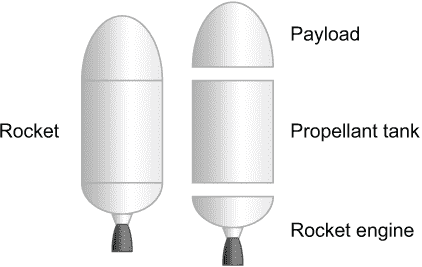
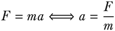
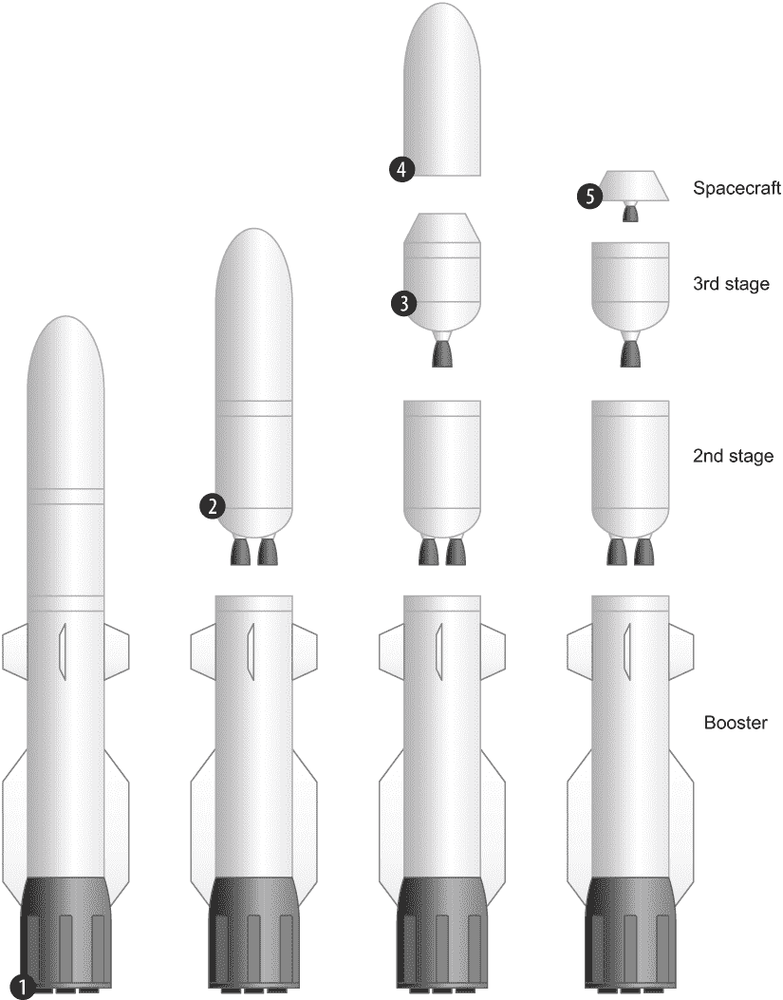
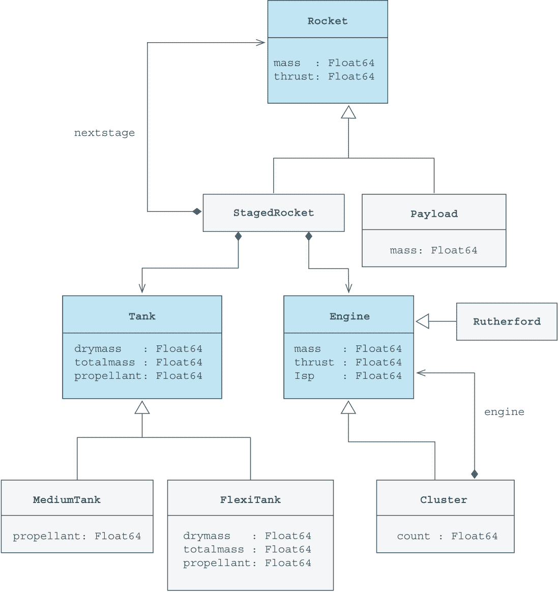
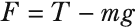
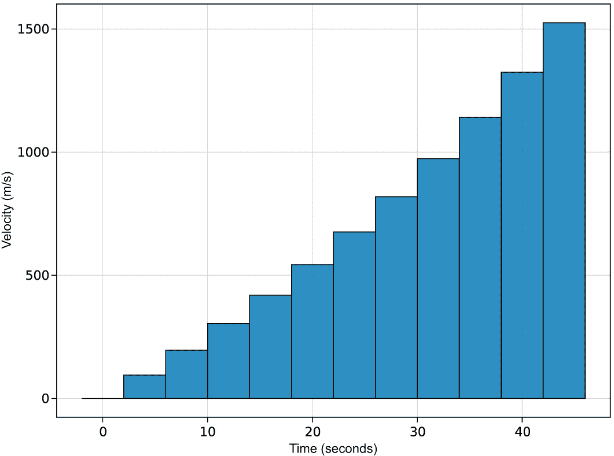

# 8 构建火箭

本章涵盖

+   构建由许多不同类型的对象组成的复杂数据结构

+   抽象掉不同但相关的类型之间的差异

在上一章中，你创建了一些简单的复合类型来表示不同类型的战士。然而，在更现实的应用中，你必须将许多不同类型的对象组合成更复杂的数据结构。

为了探索这个主题，你将通过代码构建一枚火箭。为什么是火箭？因为火箭由许多不同的部分组成。这为你提供了从其他复合类型中构建复合类型的机会，并展示了在 Julia 中使用抽象类型以促进复杂数据结构构建的不同方式。这个火箭示例将在本书的后面部分用于探索许多其他主题，例如 Julia 如何表示对象的集合。

代码示例将从定义一个简单的 Rocket 类型的火箭开始，它由一个有效载荷、一个油箱和一个引擎对象组成。稍后你将修改简单的类型定义以创建一个由多个 StagedRocket 对象组成的更复杂的多级火箭。接下来，你将进一步修改代码以添加一个表示火箭引擎集群的类型 Cluster，它可以连接到任何火箭阶段。最后，你将定义一个名为 launch!的函数来模拟多级火箭的发射。

## 8.1 构建简单火箭

让我们从在代码中模拟一个简单的太空火箭开始。这是一枚单级火箭，从底部到顶部由以下部分组成（见图 8.1）：

+   *火箭引擎*—提供推进力

+   *推进剂油箱*—包含由引擎排出的物质

+   *有效载荷*—例如舱段或卫星



图 8.1 火箭的组成部分

有效载荷是你想在太空中移动的有用物品。它可能是一艘宇航员乘员舱或带有仪器以探索其他行星的探测器。

这样一枚火箭可以通过一个复合类型（列表 8.1）来定义。但先不要把它打出来；这只是让你思考你需要定义的类型。你将为坦克和引擎实现不同的类型。然后你将添加不同的属性和行为，例如重新填充油箱和消耗推进剂。

列表 8.1 简单火箭的第一个定义

```
struct Rocket
    payload::Payload
    tank::Tank
    engine::Engine
end
```

相反，你将专注于推进剂油箱。推进剂是火箭引擎为了前进而排出的物质。在其最简单的形式中，它是一种被释放的压缩气体。然而，在现实空间火箭中，它是由像煤油或氢这样的燃料和像液氧（LOX）这样的氧化剂组成的混合物。然而，这些细节你不需要包含在你的模型中。相反，考虑以下内容：

+   *干重*—空油箱的质量

+   *总质量*—满油箱的质量

+   *推进剂质量*—油箱中目前剩余的推进剂

+   *质量*—干重加上目前剩余的推进剂

我将展示一些在 Julia 中建模的不同方法，并讨论这些不同方法的优缺点。

为了使你在这章中编写的代码更容易组织，你可以将其分散到多个文件中，然后有一个文件（例如，Rockets.jl），它包含所有这些文件。这样，你只需将此文件加载到你的 REPL 中即可导入所有代码。列表 8.2 假设你已经创建了 tanks.jl、engines.jl 和 payloads.jl 文件，并希望一次性加载它们。

列表 8.2 Rockets.jl

```
include("tanks.jl")
include("engines.jl")
include("payloads.jl")
```

这只是一个建议。如果你发现将所有代码放入一个文件更实用，你可以这样做。

重要：当你在源代码中更改类型的定义时，你需要完全重新启动你的 Julia REPL 并重新加载你的代码。然而，更改函数只需要将新代码粘贴到 REPL 中即可生效。

为了允许火箭包含许多不同类型的油箱，将 Tank 制作为一个抽象类型。由于以下列表中定义的中型和大型油箱是 Tank 的子类型，它们可以插入到任何期望 Tank 对象的字段中。

列表 8.3 定义具有固定容量的不同推进剂油箱

```
abstract type Tank end              ❶

mutable struct SmallTank <: Tank    ❷
    propellant::Float64
end

mutable struct MediumTank <: Tank   ❷
    propellant::Float64
end

mutable struct LargeTank <: Tank    ❷
    propellant::Float64
end

# Accessor functions (getters)
drymass(::SmallTank) = 40.0         ❸
drymass(::MediumTank) = 250.0       ❸
drymass(::LargeTank) = 950.0        ❸

totalmass(::SmallTank) = 410.0      ❸
totalmass(::MediumTank) = 2300.0    ❸
totalmass(::LargeTank) = 10200.0    ❸
```

❶ 将 Tank 制作为一个抽象类型。

❷ 可变，允许推进剂质量改变

❸ 干重和总重不存储。

这些油箱的干重和总重与其类型相关联。然而，你也可以制作一个灵活的油箱，你可以设置干重和总重为你想要的任何值，如下所示。

列表 8.4 具有灵活容量的推进剂油箱

```
mutable struct FlexiTank <: Tank
    drymass::Float64
    totalmass::Float64
    propellant::Float64
end

# Accessors (getters)
drymass(tank::FlexiTank) = tank.drymass
totalmass(tank::FlexiTank) = tank.totalmass
```

目前，你的油箱只是信息化的哑容器。它们没有做任何有用的事情，所以让我们添加有用的行为。

列表 8.5 添加推进剂油箱功能和行为

```
# Accessors (setters and getters)
propellant(tank::Tank) = tank.propellant               ❶
function propellant!(tank::Tank, amount::Real)         ❶
    tank.propellant = amount
end

isempty(tank::Tank) = tank.propellant <= 0             ❷
mass(tank::Tank) = drymass(tank) + propellant(tank)    ❸

# Actions
function refill!(tank::Tank)                           ❹
    propellant!(tank, totalmass(tank) - drymass(tank))
    tank                                               ❺
end

function consume!(tank::Tank, amount::Real)            ❻
    remaining = max(propellant(tank) - amount, 0)
    propellant!(tank, remaining)
    remaining
end
```

❶ 接口用于推进剂字段

❷ 检查油箱是否为空。

❸ 计算油箱当前的总质量。

❹ 用推进剂重新填充油箱。

❺ 将更改后的油箱状态提供给 REPL。

❻ 消耗推进剂。

让我们创建一些油箱来演示这些函数的行为：

```
julia> small = SmallTank(50)            ❶
SmallTank(50.0)

julia> consume!(small, 10)              ❷
40.0

julia> consume!(small, 10)              ❷
30.0

julia> small                            ❸
SmallTank(30.0)

julia> refill!(small)
SmallTank(370.0)
julia> flexi = FlexiTank(5, 50, 0)      ❹
FlexiTank(5.0, 50.0, 0.0)

julia> refill!(flexi)
FlexiTank(5.0, 50.0, 45.0)
```

❶ 制作一个装有 50 kg 推进剂的微型油箱。

❷ 消耗 10 kg 推进剂。

❸ 检查剩余多少推进剂。

❹ 5 kg 干重，50 kg 总重，和 0 kg 推进剂

在代码示例中，你使用了两个不同的油箱：一个小型油箱和一个灵活油箱。尽管 consume! 和 refill! 只是为了处理 Tank 类型而编写的，但你仍然可以使用这些函数为 SmallTank 和 FlexiTank，因为你已经为 Tank 的所有具体子类型实现了 drymass 和 totalmass。

推进剂和推进剂! 是基于所有 Tank 子类型都有推进剂字段的假设实现的。但这并不总是情况。然而，这并不是问题。如果你为具体的 Tank 子类型定义了推进剂访问器函数，这些函数将始终具有优先权。当 Julia 搜索函数的方法列表时，它总是寻找具有最具体参数类型的函数。

注意 在面向对象的语言中，访问器函数，也称为设置器和获取器，非常重要。例如，在 Java 中，如果一个类型有燃料字段，你可能会编写 GetPropellant 和 SetPropellant 方法。在 Julia 中，等效的是 propellant 用于获取值和 propellant!用于设置值。然而，Julia 不是面向对象的语言，所以避免过度使用这种模式。

你可以使用 refill!方法在构造时自动将油箱填充到最大容量。

列表 8.6 额外的构造函数，便于创建满油箱

```
function SmallTank()
    refill!(SmallTank(0))
end

function MediumTank()
    refill!(MediumTank(0))
end

function LargeTank()
    refill!(LargeTank(0))
end
```

代码示例已经展示了建模燃料油箱的不同方法。你如何在自己的代码中决定使用哪种方法？对于每个容量都有特定类型的第一种方法，例如拥有 SmallTank、MediumTank 和 LargeTank，如果你创建了很多这样的对象，可能会节省内存。一个对象在内存中存储所需的字节数取决于它拥有的字段数量以及每个字段的大小。Int8 字段仅消耗一个字节，但 Int64 字段将消耗八个字节。每个 FlexiTank 对象在内存中占用的空间是固定油箱对象的 3 倍。

然而，在你所编写的代码中，这并不重要。你并没有很多油箱，即使你有成千上万的油箱，这也不会有什么影响。FlexiTank 将是一个更好的选择，因为它提供了更多的使用灵活性。那么，为什么这本书包含了固定油箱的定义呢？

通过对比这些不同的建模油箱的方法，你可以更好地了解 Julia 的类型系统可以实现什么。有些情况下，这种权衡是值得的。例如，想象模拟一个拥有数百万人口的城市。每个人可能都有位置、饥饿、疲劳、口袋里的钱、衣服、鞋子等属性。当处理这么多对象时，你可能需要更深入地考虑减少对象的大小。

## 8.2 在代码中维护不变量

在编写代码时，了解一个重要概念是*不变量*。不变量是在你的整个程序执行期间或其某个部分执行期间必须始终为真的东西。这可能会听起来非常抽象，所以让我通过实现一个函数 propellant!来设置油箱中的燃料量来阐述表达不变量的必要性。

```
julia> tank = FlexiTank(5, 50, 10)   ❶
FlexiTank(5.0, 50.0, 10.0)

julia> propellant!(tank, 100)        ❷
100

julia> totalmass(tank)
50.0

julia> mass(tank)
105.0
```

❶ 干质量 5 公斤，总质量 50 公斤，和 10 公斤的燃料

❷ 将燃料质量设置为 100 公斤。

这里有什么问题？你将燃料的质量设置得大于油箱的最大总质量。这不应该可能。在任何时候，以下油箱的不变量应该是真实的：

```
0 <= propellant(t) + drymass(t) <= totalmass(t)
```

确保这一点始终成立的一种方法是将燃料设置器方法修改为，如果输入错误则抛出异常。

列表 8.7 燃料设置器维护油箱的不变量

```
function propellant!(tank::Tank, amount::Real)
    if 0 <= amount + drymass(tank) <= totalmass(tank)      ❶
        tank.propellant = amount
    else
        msg = "Propellant mass plus dry mass must be less than total mass"
        throw(DomainError(amount, msg))                    ❷
    end
end
```

❶ 检查新的燃料量是否破坏了油箱的不变量。

❷ 通过抛出异常来发出领域错误信号。

DomainError 是 Julia 标准库中定义的一种异常类型。Domain 指的是函数参数的合法输入值集合。因此，提供大于总质量的数值是一个域错误。

然而，这并不是你唯一可能破坏你的坦克不变量的方法。这里你正在制作一个含有 90 公斤推进剂的坦克，而总质量只能为 50 公斤：

```
julia> t = FlexiTank(5, 50, 90)
FlexiTank(5.0, 50.0, 90.0)

julia> mass(t), totalmass(t)
(95.0, 50.0)
```

处理这些问题迫使你了解 Julia 中复合对象是如何创建的。

## 8.3 使用构造函数函数创建对象

当你定义一个复合类型时，Julia 会创建一个与你的类型同名的一个特殊函数，称为*构造函数*。构造函数负责创建与其关联的类型的一个实例（对象）。Julia 向构造函数函数添加两个方法，这些方法的参数数量与你拥有的字段数量相同。一个方法使用类型注解为其参数，正如在结构中为每个字段指定的那样。另一个接受 Any 类型的参数。

然而，你可以像添加任何其他函数的方法一样，向这个构造函数函数添加方法。如果你未指定推进剂数量，你可以添加创建满油箱的方法。

列表 8.8 当未指定推进剂数量时创建满油箱

```
function FlexiTank(drymass::Number, totalmass::Number)
    FlexiTank(drymass, totalmass, totalmass - drymass)
end

MediumTank() = refill!(MediumTank(0))
LargeTank() = refill!(LargeTank(0))
```

如果你使用方法，你可以看到 FlexiTank 函数已添加了第三个方法：

```
julia> methods(FlexiTank)
# 3 methods for type constructor:
[1] FlexiTank(drymass::Float64, totalmass::Float64, propellant::Float64)  ❶
[2] FlexiTank(drymass::Number, totalmass::Number)                         ❷
[3] FlexiTank(drymass, totalmass, propellant)                             ❶
```

❶ Julia 定义的现有方法

❷ 你添加的新方法

以下是一个使用这些新方法创建满油箱的示例：

```
julia> FlexiTank(5, 50)
FlexiTank(5.0, 50.0, 45.0)   ❶

julia> MediumTank()
MediumTank(2050.0)           ❷

julia> LargeTank()
LargeTank(9250.0)
```

❶ 自动填充了 45 公斤的推进剂

❷ 填充了 2,050 公斤的推进剂

但如果你不想让你的类型的用户独立设置推进剂质量怎么办？也许你想要减少破坏之前讨论的重要坦克不变量的可能性。也许有一种方法可以防止 Julia 创建自己的构造函数方法？

## 8.4 外部构造函数与内部构造函数之间的差异

你刚刚所涉及的是 Julia 术语中的*外部构造函数*。构造函数是在复合类型定义外部定义的。外部构造函数向内置构造函数添加方法。如果你不想用你自己的方法替换 Julia 的构造函数方法，你需要在结构定义内部定义构造函数函数，如下所示。

列表 8.9 为 FlexiTank 定义内部构造函数

```
mutable struct FlexiTank <: Tank
    drymass::Float64
    totalmass::Float64
    propellant::Float64

    function FlexiTank(drymass::Number, totalmass::Number)
        new(drymass, totalmass, totalmass - drymass)         ❶
    end
end
```

❶ 注意新版本替换了 FlexiTank

内部构造函数向你介绍了一个名为 new 的特殊函数。它仅在内部构造函数内部可用——其他任何地方都不可用。你需要它，因为创建内部构造函数会移除 Julia 创建的所有构造函数方法。换句话说，你不能再调用它们中的任何一个。

new 与 Julia 提供的默认构造函数方法非常相似，但有一些重要差异：你可以向 new 提供零个或多个参数，但参数数量不能超过你的复合类型中的字段数量。对于未提供值的字段会发生什么？它们会得到一个随机值。

你如何知道你的内部构造器替换了所有 Julia 提供的构造函数方法？你可以重新加载你的 REPL 环境并测试：

```
julia> t = FlexiTank(5, 50)
FlexiTank(5.0, 50.0, 45.0)

julia> t = FlexiTank(5, 50, 150)                                          ❶
ERROR: MethodError: no method matching FlexiTank(::Int64, ::Int64, ::Int64)
Closest candidates are:
  FlexiTank(::Number, ::Number)

julia> methods(FlexiTank)                                                 ❷
# 1 method for type constructor:
[1] FlexiTank(drymass::Number, totalmass::Number)
```

❶ Julia 无法再找到接受第三个参数的方法。

❷ 检查附加到构造函数的方法数量。

现在，你可以看到方法只报告 FlexiTank 构造函数的单个方法。

## 8.5 建模火箭发动机和有效载荷

让我们转换话题，谈谈你想要送入太空的有效载荷以及提供火箭推进力的火箭发动机。有效载荷可能是一个探测器；卫星；乘员舱；或者，如果你是埃隆·马斯克，可能是一辆特斯拉 Roadster。

列表 8.10 定义火箭有效载荷

```
struct Payload
    mass::Float64
end
```

这可能看起来很简单，但请记住你正在创建模型。模型只包含回答感兴趣问题所需的属性。例如，智能手机的初始模型可能只是一个木头块，没有任何按钮、屏幕或配色方案。为什么？因为，最初，你想回答的问题是，“这个形状和大小是否适合放入我的口袋里？你有多少空间可以用来创建屏幕和内部电子设备？”

同样，设计和建造火箭也是如此。最初，你只对质量预算感兴趣。你想知道以下内容：

1.  我需要多少推进剂？

1.  我能将多大的有效载荷送入轨道？

1.  给定的火箭能飞多远？

要回答这样的问题，你*不需要*在你的模型中包含空间探测器上存在的仪器类型或它所拥有的电池或太阳能电池的类型。火箭发动机的重要属性是质量、推力和 Isp（比冲）。你可以把推力看作是发动机的强大程度，把 Isp 看作是它的燃油效率。

列表 8.11 定义自定义火箭发动机

```
abstract type Engine end

struct CustomEngine <: Engine
    mass::Float64              ❶
    thrust::Float64            ❷
    Isp::Float64               ❸
end
mass(engine::CustomEngine) = engine.mass
thrust(engine::CustomEngine) = engine.thrust
Isp(engine::CustomEngine) = engine.Isp
```

❶ 火箭发动机质量（千克）

❷ 火箭发动机产生的推力（牛顿）

❸ 比冲（推进剂效率）

你也可以为具有已知属性的具体发动机定义类型，例如在 Electron 火箭中使用的 Rutherford 发动机和在 Falcon 9 火箭中使用的 Merlin 发动机。

列表 8.12 定义 Rutherford 和 Merlin 火箭发动机

```
struct Rutherford <: Engine end    ❶
struct Merlin <: Engine end        ❶

mass(::Rutherford) = 35.0          ❷
thrust(::Rutherford) = 25000.0     ❷
Isp(::Rutherford) = 311.0          ❷

mass(::Merlin) = 470.0
thrust(::Merlin) = 845e3
Isp(::Merlin) = 282.0
```

❶ 发动机是空的 struct。

❷ 使用访问器函数获取发动机属性。

推力是火箭发动机产生的力。如果你知道火箭的总质量，你可以计算出火箭发动机启动后整个火箭的加速度是多少。这是通过牛顿第二定律得到的，该定律表明力 *F* 与质量 *m* 乘以加速度 *a* 成正比。



然而，要知道你在任何给定时间推动的质量，你需要知道发动机每秒消耗多少推进剂。仅仅推力不能告诉你这一点；你需要比冲（Isp）。高比冲发动机更高效，意味着它将在相同的推力下消耗更少的推进剂。

注意：在物理学中，你通常用*I*表示冲量。因此*Isp*明确表示你指的是*比冲*。

*Isp*类似于汽车的油耗。然而，与在路上的汽车不同，在太空中的火箭即使在没有推力的情况下也会继续移动，因此你不能通过一公斤推进剂能走多远来衡量燃料效率（或推进剂效率）。相反，你通过衡量一单位推进剂能维持 1 G（地球上的重力）的力多少秒来衡量它。这允许你计算质量流量（每秒推进剂的消耗量）：

```
g = 9.80665                                       ❶
function mass_flow(thrust::Number, Isp::Number)   ❷
    thrust / (Isp * g)
end
```

❶ 地球上的重力加速度为 m/s²

❷ 从发动机排出的质量以 kg/s 来衡量。

例如，你可以使用这个来计算 Falcon 9 火箭每秒消耗的推进剂量。它有九个 Merlin 1D 发动机，每个发动机的比冲为 282 s，推力为 845 kN：

```
julia> engine_thrust = 845e3
845000.0

julia> isp = 282
282

julia> thrust = engine_thrust * 9
7.605e6

julia> flow = mass_flow(thrust, isp)
2749.979361594732
```

因此，你得到 Falcon 9 火箭每秒消耗大约 2.7 吨推进剂的估计值。

## 8.6 组装一个简单的火箭

现在你已经拥有了组装火箭的所有部件。那么，让我们开始火箭的建造吧！

列表 8.13 带有载荷、储罐和发动机的火箭

```
struct Rocket
    payload::Payload
    tank::Tank
    engine::Engine
end
```

你将制作一个类似 Rocket Lab 制造的 Electron 火箭的火箭。^([1)] 它可以将重量为 300 千克的载荷送入近地轨道。你将用一个小储罐和一个 Rutherford 发动机制作这个火箭的一个阶段。Rutherford 发动机是一种小型火箭发动机，用于 Electron 火箭的第一和第二阶段。

为了紧凑性，我指示 REPL 不要打印前三个赋值的值，通过附加分号;。你可以移除分号来查看差异：

```
julia> payload = Payload(300);

julia> tank = SmallTank();

julia> engine = Rutherford();

julia> rocket = Rocket(payload, tank, engine)
Rocket(Payload(300.0), SmallTank(370.0), Rutherford())
```

如果你略知火箭学，你可能意识到之前的火箭配置存在多个问题：

1.  现实中的 Electron 火箭有九个 Rutherford 发动机，而不仅仅是一个。

1.  太空火箭有多个阶段，随着火箭飞得更高，这些阶段会分离；你的火箭只有一个阶段。

## 8.7 创建多阶段和发动机的火箭

让我们解决这些问题。一个重要的洞察是意识到多阶段火箭有点像俄罗斯套娃.^(2) 你可以将火箭的载荷做成另一个火箭。下一个火箭的载荷可以是另一个火箭，以此类推。图 8.2 说明了阶段火箭是如何由多个嵌套火箭组成的。



图 8.2 火箭阶段

它展示了一个多阶段火箭，你不断地移除顶部以露出火箭的载荷。让我来解释每个编号的阶段：

1.  整个多阶段火箭及其所有部件统称为*航天器*。第一阶段被称为*助推器*。

1.  打开航天器，露出**第二阶段**火箭。

1.  第二阶段的有效载荷是**第三阶段**。

1.  第三阶段由一个**整流罩**保护，这是用于保护有效载荷（你的模型将忽略整流罩）的防护壳。

1.  当发射完成时，最终的有效载荷被送入太空。这个有效载荷将是一艘*航天器*，例如卫星、月球着陆器或舱。

要使火箭内部可以放置火箭，你需要将 Rocket 改为抽象类型，并定义新的具体子类型，如下所示。

列表 8.14 允许火箭成为另一枚火箭的有效载荷

```
abstract type Rocket end                       ❶

struct Payload <: Rocket                       ❷
    mass::Float64
end

struct StagedRocket <: Rocket
    nextstage::Rocket                          ❸
    tank::Tank
    engine::Engine
end

function Rocket(payload::Rocket, tank::Tank,
➥ engine::Engine)                             ❹
    StagedRocket(payload, tank, engine)
end

thrust(r::Payload) = 0.0  # no engines
thrust(r::StagedRocket) = thrust(r.engine)
```

❶ 将 Rocket 定义为抽象类型。

❷ 将有效载荷转换为 Rocket 的子类型。

❸ 为了清晰起见，将有效载荷重命名为下一阶段。

❹ 允许使用旧的构造函数。

但在你建造火箭之前，你需要做一些更多的调整。现实生活中的 Electron 火箭在第一阶段有九个 Rutherford 发动机——我们称之为助推器。你目前无法添加超过一个发动机。为了解决这个问题，你将定义一个新的发动机子类型，称为 Cluster。这种新类型旨在模拟许多相同发动机的集群。

图 8.3 没有显示每个类型。例如，我只能在抽象类型 Tank 下获得 MediumTank 和 FlexiTank 的空间。



图 8.3 火箭不同部分之间的关系 UML 图

使用空心箭头，该图显示了 StagedRocket 和 Payload 是抽象类型 Rocket 的子类型。实心箭头显示 StagedRocket 有一个字段，nextstage，它指向另一个 Rocket 对象。

让我们看看如何实现 Cluster 类型（列表 8.15）。UML 图说明它既是 Engine 的子类型，又通过 engine 字段指向另一个发动机。

列表 8.15 定义火箭发动机集群

```
struct Cluster <: Engine
    engine::Engine
    count::Int        ❶
end
Isp(cl::Cluster) = Isp(cl.engine)
mass(cl::Cluster) = mass(cl.engine) * cl.count
thrust(cl::Cluster) = thrust(cl.engine) * cl.count
```

❶ 集群中相同发动机的数量

你会注意到比冲没有改变。燃料效率不会因为添加更多发动机而改变。然而，添加更多发动机会增加集群的质量以及总推力。

那么一个异构的发动机集群呢？你能制作由不同类型的发动机组成的集群吗？挑战在于决定如何计算每个发动机具有不同比冲的集群的 Isp。然而，你将在第十二章中制作一个异构的发动机集群。

你可以使用这些抽象来定义一个函数，update!，它负责在模拟火箭飞行时消耗推进剂。你通过执行小的时间步Δt 来进行模拟。

这是在编写实时系统模拟时常用的一种策略。当模拟具有许多部件的复杂事物时，通过解一个单独的数学方程来进行分析解法会变得过于复杂。视频游戏也是这样制作的。游戏中移动的每个对象都将有一个更新！函数，类似于以下列表中所示。

列表 8.16 在经过Δt 时间后更新推进剂质量

```
function update!(r::StagedRocket, t::Number, Δt::Number)
    mflow = mass_flow(thrust(r), Isp(r.engine))
    consume!(r.tank, mflow * Δt)
end

# Payload has no tanks with propellant to consume
update!(r::Payload, t::Number, Δt::Number) = nothing
```

假设您想制作一个三阶段的电子火箭。第三阶段非常小，因此只需要一个非常小的发动机。开发电子火箭的公司正在为此目的制造一个名为 Curie 的小型发动机。这个发动机的完整规格尚不清楚，因此您将基于一些猜测来定义这个发动机。

列表 8.17 定义第三阶段的小型发动机

```
struct Curie <: Engine end

mass(::Curie) = 8.0        ❶
thrust(::Curie) = 120.0    ❷
Isp(::Curie) = 317.0       ❶
```

❶ 质量（Mass）和比冲（Isp）需要猜测。

❷ 唯一已知的规格

您现在已经有足够的功能来定义一个由多个阶段组成的电子火箭：

```
julia> payload = Payload(300)
Payload(300.0)

julia> thirdstage = Rocket(payload, SmallTank(), Curie())
StagedRocket(Payload(300.0), SmallTank(370.0), Curie())

julia> secondstage = Rocket(thirdstage, MediumTank(), Rutherford())
StagedRocket(StagedRocket(Payload(300.0),
                          SmallTank(370.0),
                          Curie()),
             MediumTank(2050.0),
             Rutherford())

julia> booster = Rocket(secondstage, LargeTank(), Cluster(Rutherford(), 9))
StagedRocket(StagedRocket(StagedRocket(
                            Payload(300.0),
                            SmallTank(370.0),
                            Curie()),
                         MediumTank(2050.0),
                         Rutherford()),
             LargeTank(9250.0),
             Cluster(Rutherford(), 9))
```

在进行物理计算时，抽象出火箭或火箭的一部分属性（如质量）是如何确定的，这很有帮助。

列表 8.18 计算分阶段火箭的总质量

```
mass(payload::Payload) = payload.mass

function mass(r::StagedRocket)
    mass(r.nextstage) + mass(r.tank) + mass(r.engine)
end
```

您可以看到在如何定义 mass(r::StagedRocket)时质量抽象化的好处。在实现这个函数之后，您不必关心有关有效载荷（nextstage）的细节。它可能是一个有效载荷或另一个有 20 个阶段的分阶段火箭。您不必知道；这些差异被抽象化了。

同样，您也不必关心您得到的是单个发动机的质量还是发动机集群的质量。想象一下，在创建 Cluster 类型之前您已经实现了这个函数。您不需要更改这个实现，因为只要 Cluster 是 Engine 类型并且实现了 mass，一切都会正常工作。

## 8.8 将火箭发射到太空

update!函数允许您跟踪推进剂的消耗。当调用时，它给您剩余的推进剂量。当这个数量达到零时，您知道您的火箭不能再飞得更高，因为速度将稳步下降，直到变为负值。您将实现一个新的函数 launch!，该函数确定火箭在没有推进剂之前达到的高度，以及那时经过的时间。

火箭被发动机的推力 T 产生的某个力推上去。然而，这个力必须与重力作用力相抗衡。重力对火箭施加的力与火箭的质量 m 成正比，与地球上的重力加速度 g 成正比：



从这里您可以确定火箭发射时的加速度：


在讨论 update!时，我注意到您正在将发射模拟为一系列小的时间增量Δ*t*。对于一个小的时间增量，您可以找到在这个增量中速度的变化量（图 8.4）。



图 8.4 火箭发射后的速度。x 轴表示发射后的秒数。

这些观察结果是实现 launch! 函数的基础。你将速度的变化 Δ*v* 在许多小的时间增量中累加起来。对于每一个增量，你假设速度是恒定的，并使用它来计算行驶的距离 Δ*h = v × Δ*t*。将所有小增量中行驶的距离累加起来，得到总行驶距离 *h*。

这个计算可以用图表来可视化。每个条形的高度等于 Δ*h*，因为每个条形的宽度是 Δ*t*，高度是 *v*。因此，将所有条形的面积累加起来等于行驶的距离。你使增量 Δ*t* 越小，计算就越准确：


用数学术语来说，你正在对速度的积分进行近似。列表 8.19 中的代码是实现这些想法的一个实现。

注意：代码使用 1,000 秒的截止点。如果你使用大油箱，火箭可能不会在那么长时间内消耗完所有燃料。你可以使用一个 while 循环，但你会面临无限循环的风险。

列表 8.19 模拟火箭发射并确定火箭的最大高度

```
function launch!(rocket::Rocket, Δt::Real)
    g = 9.80665  # acceleration caused by gravity
    v = 0.0      # velocity
    h = 0.0      # altitude (height)

    for t in 0:Δt:1000                      ❶
        m = mass(rocket)                    ❷
        F = thrust(rocket) - m*g

        remaining = update!(rocket, t, Δt)

        # Any propellant and thrust left?
        if remaining == 0 || F <= 0
            return (t, h)                   ❸
        end

        h += v*Δt                           ❹
        a = F/m
        v += a*Δt
    end
end
```

❶ 在 1,000 秒时停止模拟。

❷ 质量变化，因为推进剂被消耗了。

❸ 返回花费的时间和行驶的距离

❹ 使用前一个时间增量中的速度。

我将 launch! 函数放入了一个名为 simulate.jl 的文件中，但你也可以将其粘贴到 REPL 中。然后你可以构建一个火箭并发射它：

```
julia> engine = Rutherford();
julia> tank = SmallTank();
julia> payload = Payload(300);
julia> rocket = Rocket(payload, tank, engine)
julia> launch!(rocket, 0.5)
(45.0, 31117.8036364191)
```

从输出中，你可以看到你的火箭花费了 45 秒才达到大约 31 公里的高度。对于真正的火箭来说，这将是不同的，因为它们必须处理空气阻力。你基本上是在一个没有大气层的地球上发射了这枚火箭。你可以看到油箱中的所有燃料都已经用完了：

```
julia> tank
SmallTank(0.0)
```

作为练习，你可以尝试用不同的载荷和油箱大小来发射火箭。你注意到更大的油箱并不总是能让你飞得更远吗？这是因为它们会增加你的火箭所受的引力。因此，重力可能最终会大于火箭发动机的推力。

除了不考虑空气阻力之外，这个模拟还有许多限制。该模拟也无法处理分级火箭。

## 摘要

+   你可以定义自己的自定义构造函数，以确保对象用有效的值初始化。

+   内部构造函数替换了 Julia 提供的默认构造函数。外部构造函数只是在外部复合类型定义中定义的方便构造函数。

+   抽象类型是用例如抽象类型 Payload end 来定义的。抽象类型不能有字段，并且你不能创建它们的对象（你不能实例化一个抽象类型）。

+   抽象类型和具体类型都可以是另一个抽象类型的子类型。然而，没有具体类型可以是另一个具体类型的子类型。`<:` 是子类型运算符。

+   将抽象类型与多态结合使用，可以使你抽象掉相关类型之间的差异，因此它们可以互换使用。

* * *

(1.) Rocket Lab 是一家起源于新西兰的太空公司，该公司将重量为几百公斤的小型卫星送入轨道。

(2.) **俄罗斯套娃**是一种俄罗斯嵌套娃娃。每个娃娃内部都嵌套着一个小木偶。
