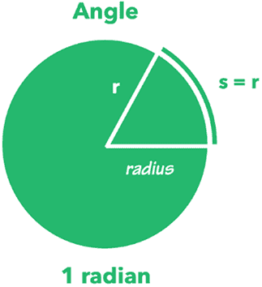
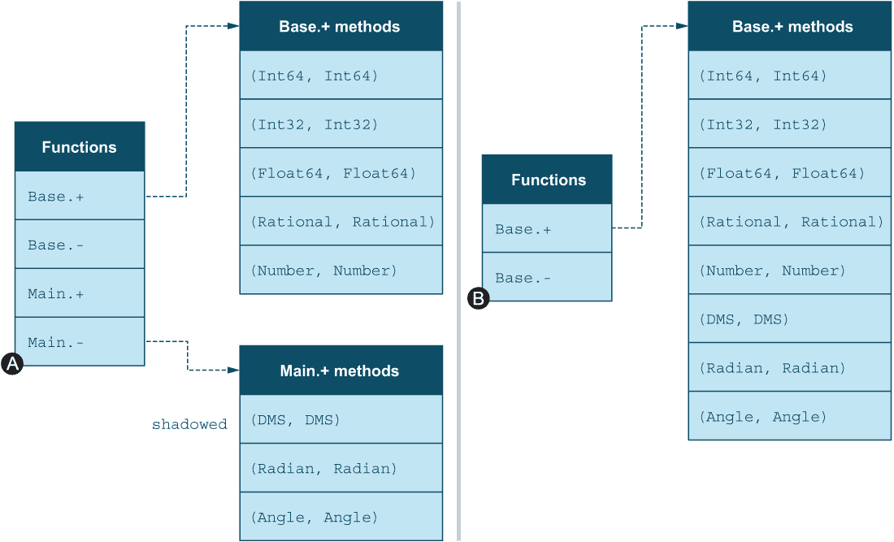

# 9 转换和提升

本章涵盖

+   一种相关类型到另一种类型的转换

+   表达式中相关类型如何找到最小公倍数

+   使用 @edit 宏探索 Julia 标准库

Julia 和其他主流编程语言处理涉及不同数字类型的算术运算如此轻松，以至于我们大多数人可能不太关注这个事实：

```
julia> 3 + 4.2                    ❶
7.2

julia> UInt8(5) + Int128(3e6)     ❷
3000005

julia> 1//4 + 0.25
0.5
```

❶ 表达式中的数字转换为浮点数

❷ 所有整数转换为 Int128

事实上，这样做涉及相当多的复杂性。在底层，大多数编程语言都定义了一套 *提升规则*，这些规则说明了如果你组合不同类型的数字应该做什么。提升规则确保所有数字都转换为可以用于最终计算的合理公共数字类型。不要将数字转换与解析文本字符串以生成数字混淆。 

你可能会想知道为什么你应该关心这些概念。掌握 Julia 的提升和转换系统将打开深入了解 Julia 中数字工作方式的门。这将使你能够执行各种任务，例如以下内容：

+   定义自定义数字类型

+   定义物理单位系统并在不同单位之间进行转换

本章的主要编程示例将做到这一点：为不同类型的角度定义一个单位系统，例如度数和弧度。然后我将演示 Julia 的提升和转换系统如何将不同的角度类型组合在同一表达式中。

但为什么要用带有单位的数字呢？为什么不让数字仅仅是数字呢？因为软件开发中经常出现由于英尺、米和其他单位混淆而导致的错误。通过使用带有单位的数字，你可以减少软件中的错误数量。

在 Julia 的许多情况下，参数的顺序并不重要。例如，如果你想检查两个几何对象是否重叠，那么 overlap(circle, triangle) 应该给出与 overlap(triangle, circle) 相同的结果。你可以想象在视频游戏中模拟不同类型战士之间的战斗时会出现类似的情况。Julia 的提升系统提供了一种优雅的技术来处理这类情况，而无需两次实现相同的算法。

## 9.1 探索 Julia 的数字提升系统

在微处理器内部，数学运算总是在相同类型的数字之间进行。微处理器没有将整数加到浮点数上的指令。微处理器总是执行相同数字类型之间的算术运算。

因此，当处理由不同数字类型组成的表达式时，所有高级编程语言都必须将表达式中的所有参数转换为相同的数字类型。但这个公共数字类型应该是什么？确定这个公共类型就是提升的全部内容。

我们将这表达为将数学运算符的参数提升到公共类型。在大多数主流语言中，控制数字提升的机制和规则是硬编码到语言中，并在语言的规范中详细说明。

注意：你会在其他编程语言中看到术语“类型强制转换”。强制转换是由编译器执行的隐式转换。Julia 的编译器不执行此操作，因此 Julia 中没有“强制转换”。

Julia 采取了截然不同的方法。在 Julia 中，数字是一等对象。它们不是具有独特硬编码规则的特殊类型。Julia 的提升规则定义在标准库中，而不是 Julia JIT 编译器的内部。这为你作为开发者提供了扩展转换和提升系统的能力。你可以添加新的数字类型以及新的规则。

但这不会增加开发者搞乱数字类型系统的风险吗？不，因为你是*扩展*现有系统；你并没有*修改*它。

提升规则由普通的 Julia 函数处理。挂钩到现有系统只是简单地添加你自己的方法到现有函数。你可以使用@edit 宏探索 Julia 源代码中的提升。

Julia 环境变量设置

为了使@edit 宏工作，你需要设置 JULIA_EDITOR 环境变量。这取决于你的操作系统。例如，我使用 fish shell。它需要修改启动配置，$HOME/.config/fish/config.fish，并添加以下行：

```
set -x JULIA_EDITOR mate
```

如果你使用 bash shell，你将修改$HOME/.profile 文件：

```
export JULIA_EDITOR=mate
```

这两个示例在 macOS 和 Linux 上都能工作。Windows 用户将使用 GUI 对话框来修改 JULIA_EDITOR 环境变量。或者，Windows 用户可以安装 Unix shell。

在下面的代码片段中，你正在添加一个整数和一个浮点数。通过使用@edit 宏前缀，Julia 会跳转到被调用的函数的定义，以便你查看源代码。

```
julia> @edit 2 + 3.5
```

一切都是函数！

值得注意的是，在 Julia 中几乎一切都是函数调用。当你写下 3 + 5 时，这实际上是调用名为+的函数的语法糖，如下所示：+(3, 5)。每个使用+、-、*等符号的函数都支持以前缀形式使用。

下面的代码展示了在 Julia 中，对某个 Number 进行的每个算术操作首先调用 promote，然后再执行实际的算术操作。

列表 9.1 Julia 标准库中数字算术操作的定义

```
+(x::Number, y::Number) = +(promote(x,y)...)
*(x::Number, y::Number) = *(promote(x,y)...)
-(x::Number, y::Number) = -(promote(x,y)...)
/(x::Number, y::Number) = /(promote(x,y)...)
```

... 被称为 *splat* 操作符，你可以使用它将数组或元组转换为函数参数。这意味着 foo([4, 5, 8]...) 与 foo(4, 5, 8) 相同。你还可以使用它将 promote 返回的元组转换为各种算术函数的参数，包括 +、-、* 等等。你可以在 Julia REPL 中进行一些实验，以更好地理解 promote 函数的工作原理：

```
julia> promote(2, 3.5)
(2.0, 3.5)

julia> typeof(1//2), typeof(42.5), typeof(false), typeof(0x5)
(Rational{Int64}, Float64, Bool, UInt8)

julia> values = promote(1//2, 42.5, false, 0x5)
(0.5, 42.5, 0.0, 5.0)

julia> map(typeof, values)
(Float64, Float64, Float64, Float64)
```

这表明 promote 返回一个数字元组，这些数字被转换为最合适的公共类型。然而，对于日常编程，你可以使用 typeof 来代替，以确定表达式将被提升为哪种类型。

## 9.2 理解数字转换

数字转换意味着将一种数字类型转换为另一种类型。这不应与解析混淆。例如，文本字符串可以被解析为数字，但字符串和数字不是相关类型；因此你不应该称之为转换。

在 Julia 中进行数字转换的推荐且最简单的方法是使用你想要转换到的类型的构造函数。所以如果你有一个值 x，并且你想将其转换为类型 T，那么只需写 T(x)。我将提供一些例子：

```
julia> x = Int8(32)
32

julia> typeof(x)
Int8

julia> Int8(4.0)
4

julia> Float64(1//2)
0.5
julia> Float32(24)
24.0f0
```

请记住，转换并不总是可以执行的：

```
julia> Int8(1000)
ERROR: InexactError: trunc(Int8, 1000)

julia> Int64(4.5)
ERROR: InexactError: Int64(4.5)
```

8 位数字无法表示大于 255（2⁸ - 1）的值，整数无法表示小数。

在许多情况下，转换是由 Julia 隐式完成的。Julia 使用 convert 函数来实现这一点，而不是构造函数。然而，你可以自由地显式调用 convert。以下是一个演示：

```
julia> convert(Int64, 5.0)   ❶
5

julia> convert(Float64, 5)   ❷
5.0

julia> convert(UInt8, 4.0)
0x04

julia>  1//4 + 1//4
1//2

julia>  convert(Float32, 1//4 + 1//4)
0.5f0
```

❶ 将浮点数 5.0 转换为整数 5。

❷ 将整数 5 转换为浮点数 5.0。

注意这些函数调用的第一个参数 Int64、Float64 等。这些都是类型对象。类型是 Julia 中的第一类对象，这意味着它们可以像任何其他对象一样被处理。你可以传递它们、存储它们，并为它们定义方法。类型对象甚至有自己的类型。Int64 的类型是 Type{Int64}，对于 Float64 是 Type{Float64}：

```
julia> 3 isa Int64             ❶
true

julia> Int64 isa Type{Int64}   ❷
true

julia> "hi" isa String
true

julia> String isa Type{String}
true

julia> Int64 isa Type{String}  ❸
 false
```

❶ 数字 3 是 Int64 类型。

❷ 类型 Int64 是 Type{Int64} 类型。

❸ 类型 Int64 不是 Type{String} 类型。

你几乎可以将 Type 视为一个特殊类型的函数。向这个“函数”提供一个参数 T，将返回 T 的类型。正式来说，Type 是一个参数化类型，可以用类型参数 T 来参数化，以产生一个具体类型。如果你觉得这不太明白，不要担心；这是一个复杂的话题，我将在下一章更详细地解释这个话题。

在执行各种类型的赋值操作时，包括以下情况，会隐式调用 convert 函数：

+   对数组元素进行赋值

+   设置复合类型字段的值

+   使用类型注解对局部变量进行赋值

+   使用类型注解从函数返回

让我们看看一些演示隐式转换的例子：

```
julia> values = Int8[3, 5]
2-element Vector{Int8}:
 3
 5

julia> typeof(values[2])
Int8

julia> x = 42
42

julia> typeof(x)
Int64

julia> values[2] = x    ❶
 42
```

❶ 将 Int64 值赋给定义为 Int8 的数组元素，这会导致调用 convert(Int8, x)

在下一个示例中，你创建了一个复合类型 `Point`，具有字段 x 和 y。接下来，你创建了一个 `Point` 的实例 p，并将其 x 字段赋值为一个 8 位整数。由于字段类型为 Float64，会发生隐式数字转换。

```
julia> mutable struct Point
           x::Float64
           y::Float64
       end

julia> p = Point(3.5, 6.8)
Point(3.5, 6.8)

julia> p.x = Int8(10)    ❶
 10
```

❶ 导致调用 `convert(Float64, Int8(10))`

在这里，向函数添加了一个类型注解，以确保返回值是某种类型。如果不是，将尝试使用 `convert` 进行转换：

```
julia> foo(x::Int64) :: UInt8 = 2x
foo (generic function with 1 method)

julia> y = foo(42)
0x54

julia> typeof(y)
UInt8
```

接下来，我们将通过一个更大的代码示例来详细说明如何进行转换和提升。

## 9.3 定义角度的自定义单位

通常，如果混合单位，科学计算很容易出错。例如，在石油工业中，混合英尺和米很容易，因为油井的坐标通常以米给出，而井深以英尺给出。

一个著名的例子是火星气候轨道器 ([`mng.bz/m2l8`](https://solarsystem.nasa.gov/missions/mars-climate-orbiter/in-depth/))，这是由 NASA 发射的机器人太空探测器，由于 NASA 和洛克希德使用不同的度量单位而丢失。NASA 使用公制单位，而洛克希德使用美国习惯单位，如英尺和磅。因此，在设计代码时，避免意外混合单位是有优势的。

在此示例中，我们将展示如何处理角度的不同单位。在数学中，角度通常以弧度给出，而使用地图导航的人通常会使用度。当使用度时，你将圆分成 360 度。因此，1 度是那个圆周长度的 1/360。

与弧度相比，我们处理的是圆周上半径重复多少次以得到该角度（图 9.1）。因此，1 弧度是当你沿着圆周标记出等于圆半径的距离时得到的角。



图 9.1 弧度的定义

与此相反，度与导航（特别是天体导航）的联系更为紧密。地球每天大约移动 1 度绕太阳转，因为一年由 365 天组成。角度进一步分为 60 分，而一分分为 60 秒。

实际上，你可以同时处理公制度和度、分、秒（DMS），但在这里你使用 DMS 以保持事情有趣。


图 9.2 度、分和秒的细分

在此代码示例中，你将实现以下功能：

+   弧度和 DMS 类型用于表示不同类型的角度单位

+   构造函数，以便在给定度、分和秒的情况下更容易构建角度对象

+   角度类型上的操作，如加法和减法

+   访问器以提取度、分和秒

+   扩展 `show` 函数以创建不同角度单位的漂亮显示

+   扩展 `convert` 函数以支持从一个角度单位转换到另一个单位

+   覆盖 sin 和 cos 函数以仅与角度单位一起工作

+   结合一些巧妙的技巧来制作角度单位的漂亮数字字面量

+   扩展 promotion_rule 函数，以便不同的角度单位可以在同一表达式中使用

让我们先实现 Radian 和 DMS 角度类型。

列表 9.2 定义弧度和度作为抽象 Angle 类型的子类型

```
abstract type Angle end

struct Radian <: Angle
    radians::Float64
end

# Degrees, Minutes, Seconds (DMS)
struct DMS <: Angle
    seconds::Int
end
```

如同火箭示例中一样，您定义了一个抽象类型 Angle，所有具体的角度单位都是其子类型。其好处将在以后变得明显。

### 9.3.1 定义角度构造函数

应将 DMS 存储为秒视为实现细节，不应暴露给用户。因此，用户不应直接使用该构造函数。相反，您将定义更自然的构造函数，如下所示。

列表 9.3 弧度构造函数：度、分和秒

```
Degree(degrees::Integer) = Minute(degrees * 60)
Degree(deg::Integer, min::Integer) = Degree(deg) + Minute(min)

function Degree(deg::Integer, min::Integer, secs::Integer)
    Degree(deg, min) + Second(secs)
end

function Minute(minutes::Integer)
    DMS(minutes * 60)
end

function Second(seconds::Integer)
    DMS(seconds)
end
```

### 9.3.2 定义角度上的算术运算

要能够实际运行这些构造函数，您需要能够将 DMS 数字相加。代码片段 Degree(deg) + Minute(min) 实际上执行的是 DMS(deg, 0, 0) + DMS(0, min, 0)。然而，+ 运算符尚未为 DMS 类型定义。您也没有为弧度定义它们，所以让我们在下面的列表中同时进行这两项定义。

列表 9.4 DMS 和弧度角度的算术运算

```
import Base: -, +

+(Θ::DMS, α::DMS) = DMS(Θ.seconds + α.seconds)
-(Θ::DMS, α::DMS) = DMS(Θ.seconds - α.seconds)

+(Θ::Radian, α::Radian) = Radian(Θ.radians + α.radians)
-(Θ::Radian, α::Radian) = Radian(Θ.radians - α.radians)
```

我将阐明这是如何工作的。如第 7.3.3 节所述，在 Julia 中定义一个方法会自动创建一个函数，如果还没有相应的函数存在。例如，如果没有导入 + 函数，当您定义 +*methods* 时，Julia 不会知道它已经存在。因此，Julia 将创建一个全新的 +*function* 并将您的角度特定方法附加到它上。

主要和基础模块 所有 Julia 类型和方法都属于一个模块。您可以将模块视为一个命名空间或库。Julia 随带的大部分功能都在名为 Base 的模块中。之前，您已经使用了 Statistics 模块。您没有明确将其包含在命名模块中的函数和类型将成为 Main 模块的一部分。在 Julia REPL 中创建的每个函数和类型都是 Main 模块的一部分。

如果您尝试计算 3 + 4，Julia 将尝试查找这个新定义的 + 函数上的匹配方法。但它没有处理常规数字的方法，只有角度的方法。因此，如果您忘记编写 import Base: +，您将收到以下错误信息：

```
julia> 3 + 4
ERROR: MethodError: no method matching +(::Int64, ::Int64)
You may have intended to import Base.+
```

实际上，您最终会覆盖在 Base 中定义的 + 函数及其附加的方法。通过导入，您实际上是在告诉 Julia 您想要向现有模块中定义的函数添加方法，例如 Base。如果您不这样做，您新定义的 + 函数将成为 Main 模块的一部分。在 REPL 中定义的、未从其他地方导入的一切都将成为 Main 模块的一部分。

图 9.3 是阴影问题的说明。函数列表 A 是在你向这些函数添加方法之前没有从 Base 中导入 + 和 - 时得到的。结果是每个运算符有两个单独的方法表：一个是 Base 的，另一个是 Main 的。在 B 示例中，导入了 + 和 -；因此，方法被添加到由 Base 定义的方法表中，而不是在 Main 模块中创建一个新的方法表。



图 9.3 在扩展函数之前未导入函数时发生的函数阴影问题

### 9.3.3 定义访问器以提取度、分和秒

给定一个 DMS（度、分、秒）角度，让我们在下面的列表中探讨其度、分和秒的部分。

列表 9.5 DMS 对象的度和分访问器

```
function degrees(dms::DMS)
    minutes = dms.seconds ÷ 60
    minutes ÷ 60
end

function minutes(dms::DMS)
    minutes = dms.seconds ÷ 60
    minutes % 60
end

seconds(dms::DMS) = dms.seconds % 60
```

你可以使用这些函数在 Julia REPL 中提供这些角度的定制显示。要表示角度为 90 度、30 分和 45 秒，你会使用表示法 90° 30' 45''。

### 9.3.4 显示 DMS 角度

如果你现在使用构造函数，你得到的显示效果并不是很好。它暴露了 DMS 度的内部表示是由弧秒组成的：

```
julia> α = Degree(90, 30, 45)
DMS(325845)

julia> degrees(α)
90

julia> minutes(α)
30

julia> seconds(α)
45

julia> β = Degree(90, 30) + Degree(90, 30)
DMS(651600)

julia> degrees(β)
181

julia> minutes(β)
0
```

你可以通过向 Julia 的 show 函数添加一个方法来定义一个替代视图。Julia 的交互式环境（REPL）使用 show(io::IO, data) 来向用户显示某些特定类型的数据。记住，在 Julia 中，你可以定义方法来处理通用抽象类型；然而，你也可以添加处理更具体类型的方法，这正是你在这个情况下想要做的。

列表 9.6 定义弧度和 DMS 对象的字符串表示

```
import Base: show

function show(io::IO, dms::DMS)
   print(io, degrees(dms), "° ", minutes(dms), "' ", seconds(dms), "''")
end

function show(io::IO, rad::Radian)
   print(io, rad.radians, "rad")
end
```

你将在第十一章中了解更多关于 show 和 IO 对象的内容。但就目前而言，这为你提供了一个查看 DMS 角度的不错方式：

```
julia> α = Degree(90, 30, 45)
90° 30' 45''

julia> β = Degree(90, 30) + Degree(90, 30)
181° 0' 0''
```

### 9.3.5 定义类型转换

现在你已经有了基础知识，你想要能够对这些角度做一些有用的事情。你可能想要使用它们与 sin 和 cos 等函数一起，但这些函数只接受纯数字，即弧度。你需要定义转换，以便 DMS 角度可以转换为弧度。

列表 9.7 定义直接和间接类型转换的方法

```
import Base: convert

Radian(dms::DMS) = Radian(deg2rad(dms.seconds/3600))
Degree(rad::Radian) = DMS(floor(Int, rad2deg(rad.radians) * 3600))

convert(::Type{Radian},  dms::DMS)    = Radian(dms)   ❶
convert(::Type{DMS},     rad::Radian) = DMS(rad)      ❷
```

❶ 将 DMS 值转换为弧度值。

❷ 将弧度值转换为 DMS 值。

这包含了一些我将更详细讨论的新内容。注意，转换方法定义没有指定参数的名称，只指定了其类型。这与火箭示例类似，在那里你将 Rutherford 发动机的质量定义为

```
mass(::Rutherford) = 35
```

你可以写成 engine::Rutherford，但这有什么意义呢？Rutherford 组合类型没有任何可以访问的字段。同样，Type{Radian} 和 Type{DMS} 没有任何你在 convert 定义中感兴趣的字段。有了这些转换，你可以实现接受具有单位数字作为参数的 sin 和 cos 的版本。

列表 9.8 覆盖标准 sin 和 cos 函数以使用 DMS 和弧度

```
sin(rad::Radian) = Base.sin(rad.radians)
cos(rad::Radian) = Base.cos(rad.radians)

sin(dms::DMS) = sin(Radian(dms))
cos(dms::DMS) = cos(Radian(dms))
```

在这种情况下，您在创建方法之前没有导入 sin 和 cos。这是因为您实际上想覆盖 *真实* 的 sin 和 cos 函数，因为您不希望人们意外地使用纯数字调用这些函数。您希望他们明确使用弧度或度：

```
julia> sin(π/2)
ERROR: MethodError: no method matching sin(::Float64)
You may have intended to import Base.sin

julia> sin(90)
ERROR: MethodError: no method matching sin(::Int64)
You may have intended to import Base.sin

julia> sin(Degree(90))
1.0

julia> sin(Radian(π/2))
1.0
```

现在您不能在没有指定角度是以弧度还是度为单位给出时，意外地将角度用作三角函数的输入。

### 9.3.6 制作漂亮的字面量

这很好，但如果您能写 sin(90°) 而不是 sin(Degree(90))，以及 sin(1.5rad) 而不是 sin(Radian(1.5))，那就更好了。

实际上，您可以实现这一点。观察 Julia 将 1.5rad 解释为 1.5*rad。因此，通过定义常规标量与度或弧度单位的乘法，您可以*神奇地*解决这个问题。

列表 9.9 允许漂亮角度字面量的运算和常数

```
import Base: *, /

*(coeff::Number, dms::DMS) = DMS(coeff * dms.seconds)
*(dms::DMS, coeff::Number) = coeff * dms
/(dms::DMS, denom::Number) = DMS(dms.seconds/denom)
*(coeff::Number, rad::Radian) = Radian(coeff * rad.radians)
*(rad::Radian, coeff::Number) = coeff * rad
/(rad::Radian, denom::Number) = Radian(rad.radians/denom)

const ° = Degree(1)
const rad = Radian(1)
```

最后两行展示了秘诀。它们意味着 Julia 将 90° 读取为 90 * Degree(1)，当计算时，将得到 Degree(90)：

```
julia> sin(90°)
1.0

julia> sin(1.5rad)
0.9974949866040544

julia> cos(30°)
0.8660254037844387

julia> cos(90°/3)
0.8660254037844387

julia> sin(3rad/2)
0.9974949866040544
```

### 9.3.7 类型提升

添加对不同角度单位进行算术运算的支持的简单但劳动密集型方法意味着定义大量具有所有可能组合的函数。想象一下，如果您还有一个角度类型：MetricDegree。它将迅速导致组合爆炸，如下面的列表所示。

列表 9.10 算术运算的组合爆炸

```
+(α::DMS, β::Radian)          = Radian(α) + β
+(α::MetricDegree, β::DMS)    = α + MetricDegree(β)
+(α::Radian, β::MetricDegree) = α + Radian(β)
+(α::Radian, β::DMS)          = α + Radian(β)
```

我甚至没有展示所有组合。我想要表达的观点是，您会得到许多难以管理的组合。相反，更好的解决方案是定义针对不同单位的通用函数，如下面的列表所示。

列表 9.11 通过利用提升简化算术运算

```
+(Θ::Angle, α::Angle) = +(promote(Θ, α)...)
-(Θ::Angle, α::Angle) = -(promote(Θ, α)...)
```

剩下的唯一问题是您没有告诉 promote 如何提升角度类型。它只知道 Number 类型。一个关于如何添加温度类型的初步猜测是添加另一个 promote 方法，但这不是它的工作方式。相反，promote 通过调用一个名为 promote_rule 的函数来完成其工作。您需要通过为 *您的* 类型定义 promote_rule 方法来注册您的类型。

列表 9.12 定义弧度和 DMS 的类型提升

```
import Base: promote_rule

promote_rule(::Type{Radian}, ::Type{DMS}) = Radian
```

这些方法是不寻常的，因为所有参数都是类型对象。此外，您没有为任何参数命名，因为类型对象不用于任何目的，只是用于通过多态选择 promote_rule 函数的正确方法。

promote_rule 函数接受两个类型对象作为参数，并返回另一个类型对象：

```
julia> promote_rule(Int16, UInt8)
Int16

julia> promote_rule(Float64, UInt8)
Float64

julia> promote_rule(Radian, DMS)
Radian
```

您可以将提升规则表述为以下问题：给定两种不同的类型，它们应该提升为哪种类型？现在您已经将所有部件放在一起。您通过实现 convert 和 promote_rule 函数的方法，将它们连接到 Julia 的转换和提升机制中：

```
julia> sin(90° + 3.14rad/2)
0.0007963267107331024

julia> cos(90° + 3.14rad/2)
-0.9999996829318346

julia> 45° + 45°
90° 0' 0''

julia> Radian(45° + 45°)
1.5707963267948966rad

julia> 45° + 3.14rad/4
1.5703981633974484rad
```

这个例子给你一个关于使用多分派语言（如 Julia）的优点提示。使用面向对象编程来实现这种行为会更难，并且随着你添加更多类型而变得越来越困难。如果你将每个角度定义为类，你将需要为每个操作定义几个方法——每个类型一个。

并且面向对象方法还有更多实际问题。如果你需要添加另一个角度单位，它将需要以下步骤：

1.  为每个运算符添加一个包含四个方法的新类

1.  通过添加处理新角度单位版本的每个运算符，修改其他每个角度类，包括基类 Angle

1.  在每个类中添加另一个构造函数来处理新的角度单位（以允许转换）

这显然无法扩展，并且违反了面向对象编程中的开放-封闭原则^(1)。开放-封闭原则可以用以下说法来概括：*对扩展开放，对修改封闭*。

如果角度单位作为库提供，则无法在不修改库本身的情况下扩展它。这显然是不切实际的。

Julia 通过 *不* 将函数作为类型的一部分来优雅地解决这个问题。因此，你可以在不修改类型定义本身的情况下向类型添加新的构造函数。添加 convert 和 promote_rule 函数不需要修改提供你试图定义提升规则和转换的类型的库。

## 摘要

+   Julia 通过定义提升规则来处理类型提升。这是通过向 promote_rule 函数添加方法来完成的。

+   将值 x 转换为类型 T 的操作通过两种不同的方法完成：T(x) 和 convert(T, x)。后者用于处理隐式转换。

+   对象 x 可以具有类型 T。Type{T} 是类型对象 T 的类型。这一知识有助于你正确地向 convert 函数添加方法。

+   通过定义自己的提升规则和转换函数，你可以将新的数字类型添加到 Julia 中，或者将度、米、英尺、摄氏度或华氏度等单位添加到 Julia 数字中。单位有助于使数值代码更加健壮。新的数字类型可以帮助提高计算的准确性，减少内存需求，并提高性能。

+   要向在另一个模块中定义的函数添加方法，你需要显式地从该模块导入这些函数。如果不这样做，你将最终覆盖这些函数，这通常不会提供你期望的结果。

* * *

^[1]*面向对象软件构造*，伯特兰·梅耶，普伦蒂斯·霍尔，1988 年，第 23 页。
