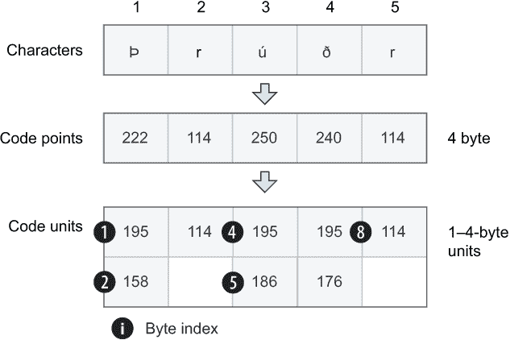
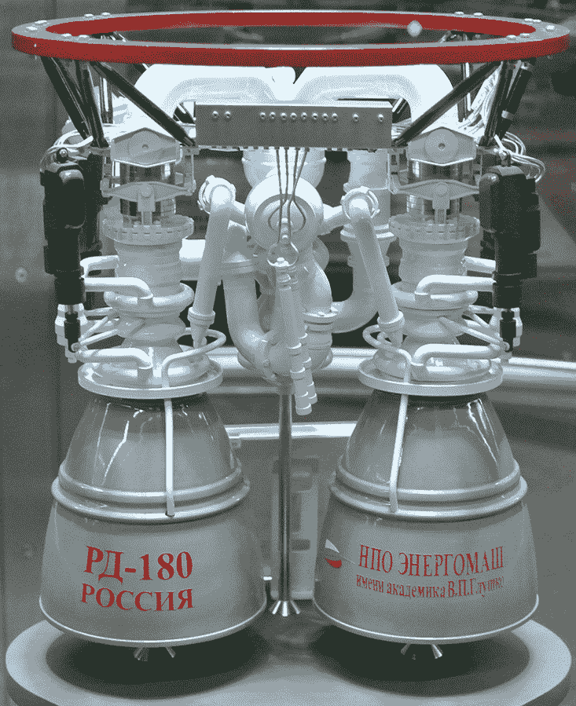
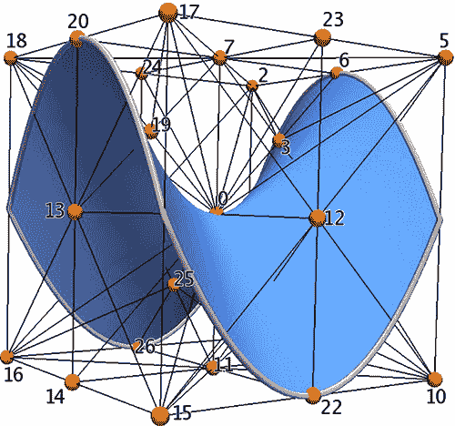

# 11 处理字符串

本章涵盖

+   理解 Unicode、码点和 UTF-8 编码之间的关系

+   比较字符串，将它们转换为小写，以及执行其他字符串操作

+   何时以及如何使用原始字符串

+   了解不同类型的字符串字面量，包括正则表达式、MIME 类型以及 BigInt 字面量

你已经在前面章节中有了处理字符串的一些实际经验；然而，我将在本章中涵盖更多细节，这将帮助你正确使用文本字符串。在本章中，你将更仔细地检查这些细节。只要你在处理 A-Z 的字母，事情就会很简单。然而，世界上有无数种语言，它们都有自己的独特字符集，而 Julia 需要能够处理这些字符集。

这意味着有效使用 Julia 字符串所需的最小知识包括一些关于 *Unicode* 的知识。Unicode 是将数字（码点）映射到字符的国际标准。

Julia 还支持特殊字符串字面量，以帮助执行各种任务。例如，有一些称为 *正则表达式* 的特殊字符串，允许你检查另一个字符串是否与特定模式匹配，例如电子邮件地址、IP 地址或邮政编码。

## 11.1 UTF-8 和 Unicode

Julia 中的文本字符串是 Unicode，以 UTF-8 格式编码。但这意味着什么，为什么你应该关心？我将通过一个简单的例子来引导你，说明更好地理解 Unicode 的重要性。

*Æser* 是挪威语中 *norse gods* 的复数形式。它是一个四个字母的单词，正如长度函数所确认的那样：

```
julia> length("Æser")
4
```

但是，当尝试访问单词中的单个字符时，你会注意到一些奇怪的事情：

```
julia> "Æser"[1]                                     ❶
'Æ': Unicode U+00C6 (category Lu: Letter, uppercase)

julia> "Æser"[2]                                     ❷
ERROR: StringIndexError("Æser", 2)

julia> "Æser"[3]                                     ❸
's': ASCII/Unicode U+0073 (category Ll: Letter, lowercase)

julia> "Æser"[4]
'e': ASCII/Unicode U+0065 (category Ll: Letter, lowercase)
```

❶ 正如预期的那样工作

❷ 你会得到一个异常。尝试在索引 2 处访问字符 s 明显不起作用。

❸ 相反，第二个字符位于索引 3。这看起来奇怪吗？

再来一个单词？*Þrúðvangr* 是北欧神托尔领域的名字：

```
julia> length("Þrúðvangr")
9

julia> "Þrúðvangr"[9]
'a': ASCII/Unicode U+0061 (category Ll: Letter, lowercase)
```

这是一个九个字符的单词，但索引 9 的字符是第六个字符，'a'。这是怎么回事？为了理解这一点，你需要了解 Unicode 以及 Julia 字符串如何通过 UTF-8 编码来支持它：

```
julia> sizeof("Æser")         ❶
5

julia> sizeof("Þrúðvangr")    ❷
12
```

❶ Æser 使用 5 个字节进行编码。

❷ Þrúðvangr 使用 12 个字节进行编码。

在 UTF-8 中，每个字符被编码为 1 到 4 个字节。正常的字母，如 A、B 和 C，只需 1 个字节，而像 Æ、Þ 和 ð 这样的字母，这些字母在英语中不常用，通常需要超过 1 个字节来编码。然而，在我进一步探讨 Julia 如何处理这个问题之前，了解一些 Unicode 的关键概念是有用的，这些概念并不特定于 Julia 编程语言。

### 11.1.1 理解码点和码单元之间的关系

Unicode 和字符编码是许多开发者可能会在某一点上遇到复杂话题。了解 Unicode 和 UTF-8 存在的历史原因将为理解提供重要背景。

两种标准都源自较老的 ASCII 标准，该标准将每个字符编码为 8 位。数字 65 到 90 将编码字母 A-Z，而数字 97 到 122 将编码小写字母 a-z。您可以使用 Char 类型的构造函数在 Julia REPL 中探索 ASCII 码与其对应字符之间的关系：

```
julia> Char(65)
'A': ASCII/Unicode U+0041

julia> Char(90)
'Z': ASCII/Unicode U+005A
```

为了处理不同的语言，人们需要操作从 1 到 255 的不同数字解释。然而，这很快变得不切实际。例如，您不能在同一页面上混合使用不同字母表编写的文本。解决方案是 Unicode，它旨在为世界上每个字符赋予一个唯一的数字——不仅限于拉丁字母，还包括西里尔字母、中文、泰语以及所有日文字符集。

分配给每个字符的数字在 Unicode 术语中称为*码点*([`www.unicode.org/glossary/#code_point`](https://www.unicode.org/glossary/#code_point))。最初，人们认为 16 位足以存储每个 Unicode 码点。16 位提供了 216 - 1 = 65,535 个唯一的数字。因此，Unicode 的第一个编码之一，UCS，使用 16 位（2 字节）来编码每个 Unicode 码点([`www.unicode.org/glossary/#UCS`](https://www.unicode.org/glossary/#UCS))).

后来人们确定这还不够，需要 4 个字节（32 位）来编码每个可能的 Unicode 字符。在这个时候，UCS 方法开始显得有缺陷，原因如下：

1.  UCS 已经与 8 位 ASCII 码不兼容。

1.  每个字符总共需要 4 个字节将消耗大量空间。

UTF-8 编码通过每个字符使用可变数量的字节解决了这些问题([`www.cl.cam.ac.uk/~mgk25/ucs/utf-8-history.txt`](https://www.cl.cam.ac.uk/~mgk25/ucs/utf-8-history.txt))。这样，常用字符可以用单个字节编码，节省空间。1 字节字符有意与 ASCII 向后兼容。

在可变长度字符编码中，需要区分字符的*码点*和编码该字符所需的*码单元*。每个 Unicode 字符都有一个数字，即码点，用于标识它。码单元用于在内存中存储这些码点。UTF-8 需要可变数量的码单元来完成这项工作（图 11.1）。



图 11.1 Unicode 码点编码为 UTF-8 码单元（并非每个索引都显示）

相比之下，UCS 具有固定大小的代码单元。每个 UCS 代码单元是 16 位。图 11.1 说明了字符、码点和代码单元之间的关系。每个灰色的码点块代表 4 个字节。每个字符需要多个代码单元。因此，它们被堆叠起来以显示哪些字节与同一字符相关。黑色的小球给出了组成字符的一些代码单元的字节索引。为了帮助阐明这些概念，你将在 Julia REPL 中进行一些关于 Unicode 字符的动手实验：

```
julia> codepoint('A')          ❶
0x00000041

julia> Int(codepoint('A'))     ❷
65

julia> ncodeunits('A')         ❸
1

julia> isascii('A')            ❹
 true
```

❶ 以十六进制形式获取字母 A 的码点。

❷ A 的十进制码点

❸ 编码字母 A 的码点所需的代码单元数量

❹ 这个字母是否是原始 ASCII 标准的一部分？

让我们探索不是原始 ASCII 标准一部分的字符。它们应该有多个代码单元，并且在调用 isascii()时不会返回 true：

```
julia> codepoint('Æ')
0x000000c6

julia> ncodeunits('Æ')   ❶
2

julia> isascii('Æ')      ❷
false

julia> codepoint('😏')   ❸
0x0001f60f

julia> ncodeunits('😏')  ❹
4

julia> isascii('😏')
false
```

❶ 在 Julia 使用的 UTF-8 标准中，编码Æ字符需要 2 个字节。

❷ Æ不是原始 ASCII 标准的一部分。

❸ 表情的码点

❹ 一个表情符号 emoji 需要 4 个字节来编码。

没有 isUnicode 函数，因为 Julia 的每个字符都是 Unicode 字符。isascii 只是检查给定 Unicode 字符是否也是原始 ASCII 标准的一部分的一种方式。

在 REPL 中直接输入字母也会在字符字面量被评估时提供有用的信息：

```
julia> 'A'
'A': ASCII/Unicode U+0041 (category Lu: Letter, uppercase)

julia> 'Æ'
'Æ': Unicode U+00C6 (category Lu: Letter, uppercase)

julia> '😏'
'😏': Unicode U+1F60F (category So: Symbol, other)
```

注意这告诉你 Unicode 码点的数字是多少。

小贴士：你可以使用反斜杠 \ 和 Tab 键轻松地写入键盘上没有的不寻常字符。例如，要在 Julia REPL 中写入 😏，请输入 \:smirk: 并按 Tab 键，以获取完成。

你甚至可以在写下 \: 之后按 Tab 键，以获取可能的全部表情符号列表。例如，挪威字母如 ÆØÅ，我在示例中偶尔使用，可以在 Mac 上通过简单地按住选项键并输入字符 O、A 或'（英文键盘布局）来轻松输入。对于其他操作系统，切换到挪威键盘布局或复制字母。

在 Julia 中，Unicode 码点可以用多种方式显式表示：

```
julia> '\U41'
'A': ASCII/Unicode U+0041 (category Lu: Letter, uppercase)

julia> Char(0x41)
'A': ASCII/Unicode U+0041 (category Lu: Letter, uppercase)

julia> '\U00c6'
'Æ': Unicode U+00C6 (category Lu: Letter, uppercase)
julia> Char(0xc6)
'Æ': Unicode U+00C6 (category Lu: Letter, uppercase)

julia> '\U01f60f'
'😏': Unicode U+1F60F (category So: Symbol, other)

julia> Char(0x01f60f)
'😏': Unicode U+1F60F (category So: Symbol, other)
```

你可以将这些与 map 结合使用来创建各种范围。例如，范围不必仅仅用数字来表示。例如，'A':'F'是一个完全有效的范围：

```
julia> map(lowercase, 'A':'F')
6-element Vector{Char}:
 'a'
 'b'
 'c'
 'd'
 'e'
 'f'

julia> map(codepoint, 'A':'F')
6-element Vector{UInt32}:
 0x00000041
 0x00000042
 0x00000043
 0x00000044
 0x00000045
 0x00000046
```

当然，你也可以选择相反的方向：

```
julia> map(Char, 65:70)
6-element Vector{Char}:
 'A'
 'B'
 'C'
 'D'
 'E'
 'F'
```

由于字符的数量和它的索引并不完全相关，所以在处理字符串和索引时必须小心。你应该使用 lastindex 和 nextind 函数，这些函数也适用于非字符串，如下面的示例所示：

```
julia> xs = [4, 5, 3]

julia> i = firstindex(xs)           ❶
1

julia> while i <= lastindex(xs)     ❷
           println((i,xs[i]))
           i = nextind(xs, i)       ❸
       end
(1, 4)
(2, 5)
(3, 3)
```

❶ 获取第一个元素的索引。因此，你不必假设第一个元素在索引 1。你可以创建具有不同起始索引的 Julia 数组。

❷ 检查你是否已经到达最后一个索引。

❸ 在数组 xs 中找到索引 i 之后的元素的索引

在下面的列表中，你可以看到如果你用字符串这样做，逻辑是完全相同的。

列表 11.1 使用 while 循环遍历字符串中的字符

```
julia> s = "Þrúðvangar"

julia> i = firstindex(s)
1

julia> while i <= lastindex(s)
           println((i, s[i]))
           i = nextind(s, i)
       end
(1, 'Þ')
(3, 'r')      ❶
(4, 'ú')
(6, 'ð')      ❷
(8, 'v')
(9, 'a')
(10, 'n')
(11, 'g')
(12, 'a')
(13, 'r')
```

❶ 注意你从索引 1 跳到 3，从 Þ 到 r。

❷ 从 ð 跳过索引 7 到 v。

通过使用这些函数，你可以抽象出字符串和常规数组之间的差异。例如，你可以看到在标准库中 nextind 是如何实现的。对于数组来说，它只是一个简单的递增：

```
nextind(::AbstractArray, i::Integer) = Int(i)+1
```

对于字符串来说，这是一个更复杂的操作。我将只展示实现的部分，以编辑清晰度。

列表 11.2 字符串 nextind 基本实现的摘录

```
function nextind(s::String, i::Int)
    i == 0 && return 1
    n = ncodeunits(s)
    between(i, 1, n) || throw(BoundsError(s, i))
    l = codeunit(s, i)
    (l < 0x80) | (0xf8 =< l) && return i+1
    if l < 0xc0
        i' = thisind(s, i)
        return i' < i ? nextind(s, i') : i+1
    end
    ...
end
```

对于常规代码，你不需要处理 nextind 和 lastindex。相反，你使用 for 循环，因为它们将在每次迭代时自动获取整个字符：

```
julia> for ch in "Þrúðvangar"
           print(ch, " ")
       end
Þ r ú ð v a n g a r
```

如果你需要每个字符的索引，请使用 eachindex 函数：

```
julia> for i in eachindex(s)
           print(i, s[i], " ")
       end
1Þ 3r 4ú 6ð 8v 9a 10n 11g 12a 13r
```

## 11.2 字符串操作

处理文本是一件非常常见的事情，因此了解语言中存在的可能性是值得的。我的意图不是展示每个存在的字符串操作，而是给出一个可能性的概念。

当我与其他编程语言一起工作时，我经常使用 Julia 作为助手。我使用 Julia 以不同的方式转换代码。我将通过一个例子来引导你。在许多编程语言中，标识符的文本格式变化是常见的：

+   FooBar—帕斯卡式（大驼峰式）；这是一种常用于类型或类的风格。有时也用于常量。

+   foo_bar—蛇形案例；它通常用于变量、方法和函数的名称。

+   fooBar—驼峰式（小驼峰式）；它通常用于方法和变量名。

+   FOO_BAR—大蛇形案例；它通常用于常量和枚举值。

+   foo-bar—短横线案例；你可以在 LISP 程序和配置文件中找到它。

我将演示几种在这些风格之间转换的方法，以及如何将它们变成有用的实用函数，以帮助你的编程。

以下是我开发一个简单函数的典型过程，用于执行某些操作：由于我对一个不熟悉的函数的工作方式不确定，我首先尝试它。然后我逐渐将其与更多的函数调用结合起来，以获得我想要的结果。最终，我有了足够的代码来实现我的函数。

列表 11.3 骆驼峰式函数的迭代开发

```
julia> s = "foo_bar"
"foo_bar"

julia> split(s, '_')
2-element Vector{SubString{String}}:
 "foo"
 "bar"

julia> uppercasefirst("foo")
"Foo"

julia> map(uppercasefirst, split(s, '_'))
2-element Vector{String}:
 "Foo"
 "Bar"

julia> join(["Foo", "Bar"])
"FooBar"

julia> join(map(uppercasefirst, split(s, '_')))
"FooBar"

julia> camel_case(s::AbstractString) = join(map(uppercasefirst,
                                                split(s, '_')))
camel_case (generic function with 1 method)
```

现在你有一个可以进行转换的函数，但通常你希望能够快速完成这个操作。在你的代码编辑器中选择一些蛇形案例的文本，并将其粘贴回驼峰式。

这就是 Julia 的 clipboard() 函数派上用场的地方。它可以读取和写入剪贴板。剪贴板是所有你复制的内容所在的地方。

警告 在 Linux 上，除非你安装了 xsel 或 xclip 命令，否则剪贴板函数将不起作用。在 Debian 或 Ubuntu 上，你可以使用以下命令安装这些命令：

```
$ sudo apt-get install xsel
```

在 Red Hat 或 Fedora Linux 上，你可以使用以下命令安装：

```
$ sudo yum install xsel
```

在列表 11.4 中，向 camel_case 函数添加了一个方法，它不接受任何字符串参数，而是读取剪贴板。在运行 clipboard() 之前，我标记了这段文字的第一部分。

列表 11.4 将剪贴板中的文本转换为驼峰式

```
julia> s = clipboard()
"HiHowAreYou"

julia> function camel_case()
            s = camel_case(clipboard())
            clipboard(s)
            s
        end
```

clipboard() 获取剪贴板的内容，而 clipboard(s) 将 s 的内容存储在剪贴板上。每次你编码并想要将蛇形文本转换为驼峰式时，你可以按照以下步骤操作：

1.  复制文本。

1.  切换到你的 Julia REPL。

1.  开始输入 came...，然后按上箭头键。如果之前调用过它，应该会完成到 camel_case()。或者按 Tab 键。

1.  返回到编辑器，并粘贴结果。

更高效地使用 Julia REPL

要快速使用 Julia，重要的是要习惯所有快捷键。上箭头键用于快速搜索你的历史记录。如果你开始输入几个字母，它将过滤历史记录，只匹配以那些字母开头的历史记录。

Tab 键用于完成 Julia 已知的函数匹配。这可能是一个内置函数或你自己定义的函数。

Ctrl-A 和 Ctrl-E 用于在 Julia REPL 中跳转到行的开始和结束。假设你刚刚写了

```
map(uppercasefirst, split(s, '_'))
```

你可能想要修改为

```
join(map(uppercasefirst, split(s, '_')))
```

按上箭头键返回你刚刚写的行。按 Ctrl-A 跳到行的开头。写 join(。最后，按 Ctrl-E 跳到行的末尾，写)。

### 11.2.1 从驼峰式转换为蛇形

让我们看看如何反向操作的代码。在这种情况下，使用 split 函数将不起作用，但为什么？在这种情况下，你无法在特定字符上分割；然而，split 可以接受函数而不是字符来决定分割的位置。要按空白分割，使用 split(s, isspace)，因此你可以尝试使用 isuppercase 函数。它检查一个字符是否为大写。这很有用，因为你在字符大写的地方分割：

```
julia> isuppercase('a')
false

julia> isuppercase('A')
true

julia> s = "oneTwoThreeFour"
"oneTwoThreeFour"

julia> split(s, isuppercase)
4-element Vector{SubString{String}}:
 "one"
 "wo"
 "hree"
 "our"
```

如你所见，这种方法不起作用，因为 split 会移除你用于分割的字符。相反，你将使用 Julia 的许多 find 函数之一。如果你在 REPL 中写入 find 并按 Tab 键，你会看到许多可能的选择：

```
julia> find
findall   findfirst  findlast
findmax    findmax!   findmin
findmin!   findnext   findprev
```

findfirst 查找匹配项的第一个出现，而 findall 查找所有出现。让我们通过一个示例来澄清：

```
julia> s = "The quick brown fox";

julia> findfirst(isspace, s)
4

julia> indices = findall(isspace, s)
3-element Vector{Int64}:
  4
 10
 16

julia> s[indices]
"   "
```

你可以遍历所有大写字母的索引，并使用范围捕获子字符串。

列表 11.5 打印出每个大写单词

```
function snake_case(s::AbstractString)
   i = 1
   for j in findall(isuppercase, s)
       println(s[i:j-1])
       i = j
   end
   println(s[i:end])
end
```

列表 11.5 只是一个演示，说明如何逐步开发函数。在这种情况下 println 将确保正确的输出。在这里，范围 i:j-1 将提取子字符串：

```
julia> snake_case("oneTwoThreeFour")
one
Two
Three
Four
```

以下列表展示了一个完整的示例。你已经移除了 println 并添加了一个名为 words 的字符串数组来存储每个单独的大写单词。

列表 11.6 将驼峰式字符串转换为蛇形字符串

```
function snake_case(s::AbstractString)
    words = String[]
    i = 1
    for j in findall(isuppercase, s)
       push!(words, lowercase(s[i:j-1]))
       i = j
    end
    push!(words, lowercase(s[i:end]))
    join(words, '_')
end
```

一旦你收集了数组中的单词，使用 join(words, '_')将它们连接成一个字符串。第二个参数'_'导致每个单词以'_'作为分隔符连接。

### 11.2.2 介于数字和字符串之间的转换

第五章介绍了从用户读取输入。无论输入来自键盘还是文件，它通常以文本字符串的形式出现；然而，你可能需要输入数字。在第五章中，你研究了 parse 函数来处理这个问题；让我们更详细地再次看看它。将类型对象作为第一个参数提供，以指定你想要解析到的数字类型。这可以是任何从不同类型的整数到浮点数：

```
julia> parse(UInt8, "42")
0x2a                       ❶

julia> parse(Int16, "42")
42

julia> parse(Float64, "0.42")
0.42
```

❶ 十六进制形式的 42（见第二章）

你甚至可以指定基数。Julia 在解析数字时默认假设基数为 10，这指的是从 0 到 9 的数字。然而，如果你想将数字解析为二进制，基数 2，你可以这样做。这假设你只有 0 和 1 这两个数字来形成数字：

```
julia> parse(Int, "101")            ❶
101

julia> parse(Int, "101", base=2)    ❷
5

julia> parse(Int, "101", base=16)   ❸
 257
```

❶ 将字符串 101 解析为十进制数。

❷ 作为二进制数（基数 2）

❸ 将 101 解析为一个十六进制数。

这些转换也可以反向进行。你可以取一个数字，并决定在转换为文本字符串时使用什么基数：

```
julia> string(5, base=2)     ❶
"101"

julia> string(17, base=16)   ❷
"11"

julia> string(17, base=10)   ❸
 "17"
```

❶ 使用十进制数 5 的二进制数位创建一个文本字符串。

❷ 将十进制数 17 转换为十六进制字符串。

❸ 使用十进制数系统转换为字符串。

从之前的字符串章节中，你可能还记得 color=:green 这样的命名参数。这里你还有一个命名参数 base=2。这是一个典型的命名参数使用案例，因为你指定的是偶尔需要指定的事情。继续火箭主题，我现在将介绍一些涉及由 Energomash 制造的 RD-180 火箭发动机的字符串操作（见图 11.2）。



图 11.2 Energomash RD-180 火箭发动机

### 11.2.3 字符串插值和连接

在 Julia 中，字符串可以通过多种方式组合；我将比较实现它的不同方法。通常，你会有一些对象，比如数字，你想将其转换为文本字符串。以下代码定义了一些不同类型的变量，用于字符串示例：

```
julia> engine = "RD-180"
"RD-180"

julia> company = "Energomash"
"Energomash"

julia> thrust = 3830
3830

julia> string("The ", engine,
  " rocket engine, produced by ",
  company,
  " produces ", thrust,
  " kN of thrust")

"The RD-180 rocket engine, produced
 by Energomash produces 3830 kN of thrust"
```

上述代码使用了 string()函数来执行字符串连接，并将非字符串转换为字符串。或者，你也可以使用字符串连接运算符*。如果你来自其他语言，你可能更熟悉使用+运算符进行字符串连接。Julia 选择了在数学符号中通常用来表示连接的运算符：

```
julia> "The " * engine *
  " rocket engine, produced by " *
  company *
  " produces " *
  string(thrust) *
  " kN of thrust"

"The RD-180 rocket engine, produced by Energomash
produces 3830 kN of thrust"
```

当处理大量变量时，通常最好使用字符串插值。字符串插值使用$符号进行：

```
julia> "The $engine rocket engine, produced by $company produces
$thrust kN of thrust"
"The RD-180 rocket engine, produced by Energomash produces 3830 kN
of thrust"
```

注意，当没有空白可以清楚地区分变量名和周围文本时，你通常需要使用 $(variable) 而不是 $variable。如果你试图插值一个表达式而不是变量，这也适用。例如，考虑以下情况，当你想写出 3830kN 而不带空格时：

```
julia> "produces $thrustkN of thrust"                      ❶
ERROR: UndefVarError: thrustkN not defined

julia> "produces $(thrust)kN of thrust"                    ❷
"produces 3830kN of thrust"

julia> "two engines produces $(2 * thrust) kN of thrust"   ❸
 "two engines produces 7660 kN of thrust"
```

❶ 你不能这样插值推力变量。

❷ 当没有周围空白时进行字符串插值的正确方法

❸ 表达式的字符串插值

### 11.2.4 sprintf 格式化

如果你熟悉 C 编程，你可能熟悉 printf 和 sprintf 函数。Julia 有名为 @printf 和 @sprintf 的宏，这些宏模仿了这些函数。与字符串插值不同，这些宏允许你更详细地指定变量应该如何显示。

注意，宏与 Julia 函数通过 @ 前缀区分。宏类似于代码生成器；宏的调用位置将被其他代码替换。宏允许进行高级元编程，本书将不会涉及。

例如，你可以指定打印十进制数时应使用的数字位数。@printf 将结果输出到控制台，但 @sprintf 和 @printf 不在始终加载的 Julia 基础模块中。因此，要使用这些宏，你需要包含 Printf 模块，这解释了第一行：

```
julia> using Printf

julia> @printf("π = %0.1f", pi)
π = 3.1
julia> @printf("π = %0.2f", pi)
π = 3.14
julia> @printf("π = %0.5f", pi)
π = 3.14159
```

以下是一些常见格式化选项的简要概述：

+   %d—整数

+   %f—浮点数

+   %x—以十六进制表示法显示的整数

+   %s—以字符串形式显示参数

使用这些格式化选项中的每一个，你可以指定诸如数字位数、小数位数或填充等。首先，让我们回顾一些基本格式化选项的示例：

```
julia> @sprintf("|%d|", 29)
"|29|"

julia> @sprintf("|%f|", 29)
"|29.000000|"

julia> @sprintf("|%x|", 29)
"|1d|"
```

我在数字前后添加了横线，因此以下填充示例更容易阅读：

```
julia> @sprintf("|%2d|", 42)
"|42|"

julia> @sprintf("|%4d|", 42)
"|  42|"

julia> @sprintf("|%-2d|", 42)
"|42|"

julia> @sprintf("|%-4d|", 42)
"|42  |"
```

注意，填充可以应用于右侧或左侧。通过添加连字符实现右填充。如果你想要显示对齐的数字列，填充很有用。你可以通过在填充数字前加 0 来使用零而不是空格作为填充：

```
julia> @sprintf("|%02d|", 42)
"|42|"

julia> @sprintf("|%04d|", 42)
"|0042|"
```

填充并不指定要添加多少个空格或零，而是指定数字应该填充的总字符数。如果填充为两个且数字为两位数，则不会发生任何变化。然而，如果填充为四个，则添加两个空格，总共为四个字符。

## 11.3 使用字符串插值生成代码

你可以使用你刚刚学到的知识创建小的实用函数。这个例子将涵盖生成 C++ 代码。Julia 可能不是你的主要工作语言；相反，你可能在工作中使用更冗长的语言，如 C++ 或 Java，但 Julia 可以作为辅助工具使你的工作更轻松。接下来，你将回顾一个 C++ 开发者如何通过利用 Julia 编程语言来简化其工作的示例。

可视化工具包（VTK；[`vtk.org`](https://vtk.org)）是一个用于可视化科学数据的惊人的 C++ 库。你可以用它来创建如图 11.3 所示的视觉表示。



图 11.3 VTK 中的可视化

很遗憾，由于 C++ 中需要所有典型的样板代码，编写 VTK C++ 代码很繁琐。以下是一些在 VTK 中用于定义几何线的 C++ 代码示例。了解列表中的代码做什么并不重要；它已被编辑以从示例代码中删除不必要的细节。

列表 11.7 VTK 中的 Line 类

```
#ifndef vtkLine_h
#define vtkLine_h

class VTKCOMMONDATAMODEL_EXPORT vtkLine : public vtkCell
{
public:
  static vtkLine *New();
  vtkTypeMacro(vtkLine,vtkCell);
  void PrintSelf(ostream& os, vtkIndent indent) override;

  int GetCellType() override {return VTK_LINE;};

protected:
  vtkLine();
  ~vtkLine() override {}

private:
  vtkLine(const vtkLine&) = delete;
  void operator=(const vtkLine&) = delete;
};
```

将此代码与列表 11.8 中定义多边形的下一块代码进行比较；你会注意到有很多重复。这适用于所有用于定义几何原型的 VTK 代码。

列表 11.8 VTK 中的 Polygon 类

```
#ifndef vtkPolygon_h
#define vtkPolygon_h

class VTKCOMMONDATAMODEL_EXPORT vtkPolygon : public vtkCell
{
public:
  static vtkPolygon *New();
  vtkTypeMacro(vtkPolygon,vtkCell);
  void PrintSelf(ostream& os, vtkIndent indent) override;

  int GetCellType() override {return VTK_POLYGON;};

protected:
  vtkPolygon();
  ~vtkPolygon() override;

private:
  vtkPolygon(const vtkPolygon&) = delete;
  void operator=(const vtkPolygon&) = delete;
};

#endif
```

想象你经常为不同的几何类型编写新的 C++ 类（类型），如下所示；重复所有这些样板代码会很繁琐。幸运的是，你可以创建小的 Julia 工具函数来帮助（列表 11.9）。

当生成由多行组成的文本时，使用三引号：`"""` 是实用的。这允许你跨多行编写字符串。

列表 11.9 Julia 代码中的 VTK C++ 代码生成器

```
function create_class(class::AbstractString)
    s = """
        #ifndef vtk$(class)_h
        #define vtk$(class)_h

        class VTKCOMMONDATAMODEL_EXPORT vtk$class : public vtkCell
        {
        public:
          static vtk$class *New();
          vtkTypeMacro(vtk$class,vtkCell);
          void PrintSelf(ostream& os, vtkIndent indent) override;

          int GetCellType() override {return VTK_$(uppercase(class));};

        protected:
          vtk$class();
          ~vtk$class() override;

        private:
          vtk$class(const vtk$class&) = delete;
          void operator=(const vtk$class&) = delete;
        };

        #endif
        """
    clipboard(s)     ❶
    println(s)
end
```

❶ 使将生成的类源代码粘贴到代码编辑器中变得容易。

以下是一个使用此实用函数创建 Hexagon 类的示例。注意在前两行中，生成的代码也存储在剪贴板上。

列表 11.10 使用 Julia 生成 C++ Hexagon 类

```
julia> create_class("Hexagon")
#ifndef vtkHexagon_h
#define vtkHexagon_h

class VTKCOMMONDATAMODEL_EXPORT vtkHexagon : public vtkCell
{
public:
  static vtkHexagon *New();
  vtkTypeMacro(vtkHexagon,vtkCell);
  void PrintSelf(ostream& os, vtkIndent indent) override;

  int GetCellType() override {return VTK_HEXAGON;};

protected:
  vtkHexagon();
  ~vtkHexagon() override;

private:
  vtkHexagon(const vtkHexagon&) = delete;
  void operator=(const vtkHexagon&) = delete;
};

#endif
```

## 11.4 使用非标准字符串字面量

在许多编程语言中，有一些有用的对象，例如日期、正则表达式、MIME 类型以及数字，它们的生命周期始于字符串。例如，在 Julia 中，你不能将非常大的数字作为数字字面量表达，所以你必须将它们作为字符串来解析。例如，浮点数字面量在 Julia 中是 64 位，这不足以容纳像 1.4e600 这样的数字。Julia 中有 BigInt 和 BigFloat 这样的类型，可以存储任意大的数字。但是，当数字字面量限制为 64 位浮点值时，如何创建这样的数字呢？解决方案是解析包含数字定义的字符串：

```
julia> 1.4e600
ERROR: syntax: overflow in numeric constant "1.4e600"

julia> x = parse(BigFloat, "1.4e600")
1.3999...9994e+600

julia> typeof(x)
BigFloat
```

当处理日期时，还可以展示另一个示例。假设你正在从文件中读取多个日期，并希望解析它们。为此，指定一个日期格式，例如 yyyy-mm-dd。这种日期格式表示年份在前，日期在后，并且每个组件由连字符分隔：-。以下是将一种日期格式转换为另一种格式的示例（稍后将会介绍日期格式化选项）。

列表 11.11 将一种数据格式转换为另一种格式

```
using Dates

dates = ["21/7", "8/12", "28/2"];
for s in dates
    date = Date(s, DateFormat("dd/mm"))
    dstr = Dates.format(date, DateFormat("E-u"))
    println(dstr)
end
```

如果你运行此代码，你将得到以下输出：

```
Saturday-Jul
Saturday-Dec
Wednesday-Feb
```

这段日期格式化代码说明了所有从字符串派生的对象存在的问题。如果你以自然的方式编写代码，你将反复解析相同的字符串。在每次循环迭代中，你都会解析字符串 "dd/mm" 和 "E-u"，但这并不是必要的。这些字符串在每次迭代中都是相同的；只有日期字符串本身会改变。为了避免解析字符串来创建 BigFloat 和 DateFormat 等对象，Julia 提供了特殊的字符串字面量，如 big"1.4e600" 和 dateformat"dd/mm"。

当 Julia 解析你的程序代码并遇到这些字符串时，它不会创建 String 对象，而是创建 BigInt、BigFloat 或 DateFormat 对象。这种方法的优点是对象是在代码解析时创建的，而不是在运行时创建的。

这可能听起来像是一个微不足道的细节，然而，这确实有显著的区别。Julia 将只解析程序中 for 循环的代码一次。但它可能会在循环内部执行代码多次。因此，通过在解析时而不是在运行时创建如 DateFormat 这样的对象，你可以提高性能。

我将依次介绍每个非标准字符串字面量，并在单独的章节中进行说明。通过阅读这些章节，将变得清楚这种策略的含义。

### 11.4.1 DateFormat 字符串

让我们回顾一下 DateFormat 的例子。在其他编程语言中，如果你想避免解析 DateFormat 字符串多次的性能开销，你可能需要重构代码，如下所示。

列表 11.12 优化但可读性较差的日期格式化代码

```
using Dates

informat  = DateFormat("dd/mm")
outformat = DateFormat("E-u")

dates = ["21/7", "8/12", "28/2"]
for s in dates
    date = Date(s, informat)
    dstr = Dates.format(date, outformat)
    println(dstr)
end
```

从性能的角度来看，这是可行的。问题是代码的可读性降低了。浏览解析和格式化日期的行，你无法立即看到使用了哪种格式。为了可读性，最好能够将日期格式定义放在使用的地方。使用 dateformat 字符串字面量，你可以做到这一点，如下所示。

列表 11.13 优化且可读的日期格式化代码

```
using Dates

dates = ["21/7", "8/12", "28/2"]
for s in dates
    date = Date(s, dateformat"dd/mm")
    dstr = Dates.format(date, dateformat"E-u")
    println(dstr)
end
```

我还没有详细说明如何指定日期格式字符串。幸运的是，Julia 在线帮助系统提供了一个很好的概述；只需进入帮助模式 (?), 输入 DateFormat，它将为你提供一个所有可用字母及其含义的列表。基本上，你使用字母如 y、m 和 d 来表示年、月和日。如果你想将年份写成四位数字，你可以指定为 yyyy。在 REPL 中的一些代码示例应该能让你了解这是如何工作的：

```
julia> d = Date(2022, 8, 28)
2022-08-28

julia> Dates.format(d, dateformat"dd-mm-yyyy")
"28-08-2022"

julia> Dates.format(d, dateformat"mm-yy")
"08-22"

julia> Dates.format(d, dateformat"yy/m")
"22/8"
```

并非所有格式都处理数字。u 和 U 提供月份的名称，例如一月和二月。e 和 E 提供星期的名称，例如星期一和星期二：

```
julia> Dates.format(d, dateformat"e u yyyy")
"Sun Aug 2022"

julia> Dates.format(d, dateformat"E U yyyy")
"Sunday August 2022"
```

### 11.4.2 原始字符串

正则表达式字符串的一个问题是，像$和\n 这样的字符具有特殊含义。对于某些类型的文本，这可能会很麻烦。你可以通过使用转义字符\\来解决它；因此，$将被写作\$，\n 将被写作\\n。然而，如果你不想这样做，也不需要字符串插值，你可以使用原始字符串：

```
julia> thrust = 3830
3830
julia> raw"produces $thrust kN of thrust" # Don't work
"produces \$thrust kN of thrust"
```

在这种情况下，非标准字符串字面量不会创建新的对象类型。相反，它在构建字符串对象时以不同的方式解释字符串字面量的内容。

### 11.4.3 使用正则表达式匹配文本

正则表达式是一种你可以用来指定要匹配的文本的微型语言。正则表达式在 Unix 文本处理工具和许多编码编辑器中广泛使用。例如，你可以使用正则表达式在代码中搜索特定的文本字符串。

在这个例子中，你有一些存储在变量 s 中的 Julia 源代码。你已经决定你想将 Rocket 类型的名称更改为 SpaceCraft。你可以使用 replace 函数定位要替换的文本：

```
julia> s = """
       struct RocketEngine
           thrust::Float64
           Isp::Float64
       end

       mutable struct Rocket
           tank::Tank
           engine::RocketEngine
       end
       """;                                           ❶

julia> result = replace(s, "Rocket"=>"SpaceCraft");   ❷

julia> println(result)
struct SpaceCraftEngine
    thrust::Float64
    Isp::Float64
end

mutable struct SpaceCraft
    tank::Tank
    engine::SpaceCraftEngine
end
```

❶ 在这段源代码文本中，你想象需要进行字符串替换

❷ 将 Rocket 的出现替换为 SpaceCraft。

如你从第六章所记得的，你使用=>运算符来创建一个对；这被用来创建键值对以存储在字典中。在这种情况下，这个对代表要查找的文本和替换文本。所以“Rocket"=>"SpaceCraft”意味着定位“Rocket”，并将其替换为“SpaceCraft”。

然而，正如你从例子中看到的，这并没有完全达到你的预期。“RocketEngine”也被替换为“SpaceCraftEngine”。然而，在这种情况下，你只想更改 Rocket 类型。使用正则表达式可以更容易地更具体地说明你要找的是什么。

在正则表达式中，"."表示任何字符；“[A-D]”表示从 A 到 D 的任何字符；而写作“[^A-D]”表示不在 A 到 D 范围内的任何字符。因此，“Rocket[^A-Za-z]”意味着找到单词“Rocket”，并且第一个后续字符不是字母，如下所示。

列表 11.14 使用正则表达式进行文本替换

```
julia> result = replace(s, r"Rocket[^A-Za-z]"=>"SpaceCraft");

julia> println(result)
struct RocketEngine
    thrust::Float64
    Isp::Float64
end

mutable struct SpaceCraft
    tank::Tank
    engine::RocketEngine
end
```

在这个例子中，你通过在前面加上 r 将你要搜索的字符串转换为正则表达式。这意味着它将不是一个字符串对象。这可以在 REPL 中演示：

```
julia> rx = r"Rocket[^A-Za-z]"
r"Rocket[^A-Za-z]"

julia> typeof(rx)
Regex
```

这个正则表达式对象是在解析时创建的，而不是在运行时。因此，就像 DateFormat 一样，你避免了在运行时多次解析相同的正则表达式。 

关于正则表达式语法的良好文档有很多，所以我将只概述正则表达式中使用的基本字符。以下是一个所谓的*字符类*的列表：

| 字符 | 含义 | 示例 |
| --- | --- | --- |
| \d | 匹配任何数字 | "387543" |
| \w | 匹配任何包含下划线的字母数字词 | "foo_bar_42" |
| \s | 匹配任何空白字符、制表符、换行符、空格 | " " |
| . | 匹配任何字符 | "aA ;%4t" |

你还有特殊字符，它们会影响字符类匹配的方式；这些被称为*量词*。它们可以显示字符类应该重复多少次：

| 字符 | 含义 |
| --- | --- |
| * | 重复字符 0 次或多次 |
| + | 重复一次或多次 |
| ? | 零次或一次 |

与 Julia 正则表达式系统的更复杂交互将涉及使用 RegexMatch 对象。在这个例子中，你想要挑选出一个多位数，\d+，和一个由多个字母组成的单词，\w+。你可以使用 match 函数来完成，它将返回一个包含所有匹配的 RegexMatch 对象：

```
julia> rx = r"\w+ (\d+) (\w+) \d+"            ❶

julia> m = match(rx, "foo 123 bar 42")        ❷
RegexMatch("foo 123 bar 42", 1="123", 2="bar")

julia> m[1]                                   ❸
"123"

julia> m[2]                                   ❸
"bar"
```

❶ 定义一个正则表达式。

❷ 将正则表达式与字符串匹配。

❸ 访问第一个和第二个匹配。

注意正则表达式中一些部分包含括号；这些括号捕获了字符串的这部分。你已经设置了你的正则表达式对象 rx 来捕获一个数字和一个单词。你可以通过整数索引访问这些捕获，例如 m[1] 和 m[2]。

对于更复杂的正则表达式，很难跟踪每个捕获的位置。幸运的是，正则表达式允许你命名你的捕获。比如说，你想从字符串 11:30 中捕获小时和分钟。你可以使用正则表达式 r"(\d+):(\d+)"，但你可以使用 ?<s> 命名每个匹配，其中 s 是捕获的名称：

```
julia> rx = r"(?<hour>\d+):(?<minute>\d+)"
r"(?<hour>\d+):(?<minute>\d+)"

julia> m = match(rx, "11:30 in the morning")
RegexMatch("11:30", hour="11", minute="30")

julia> m["minute"]
"30"

julia> m["hour"]
"11"
```

RegexMatch 对象在很多方面都类似于 Julia 集合，因此你可以使用 for 循环迭代 RegexMatch 对象。当命名你的正则表达式捕获时，RegexMatch 对象与字典中可用的许多相同函数一起工作：

```
julia> keys(m)
2-element Vector{String}:
 "hour"
 "minute"

julia> haskey(m, "hour")
true

julia> haskey(m, "foo")
false
```

虽然正则表达式非常强大且灵活，但过度使用它们很容易。Go、Plan 9、UTF-8 以及许多其他系统编程中流行的技术的创造者之一 Rob Pike 一直警告过度使用正则表达式。随着新需求的提出，它们可能会变得复杂且难以修改。

个人来说，我很少使用它们。在 Julia 中，你可以通过基本的字符串和字符函数（如 split、endswith、startswith、isdigit、isletter 和 isuppercase）走得很远。

### 11.4.4 使用 BigInt 创建大整数

大多数数字类型都存在字面量语法，如下例所示：

```
julia> typeof(42)
Int64

julia> typeof(0x42)
UInt8

julia> typeof(0x42000000)
UInt32

julia> typeof(0.42)
Float64

julia> typeof(0.42f0)
Float32

julia> typeof(3//4)
Rational{Int64}
```

在不存在的情况下，你可以进行如下转换：Int8(42)，它将一个 64 位有符号整数转换为 8 位有符号整数。当编写任意精度的整数（任意数量的数字）时，你也可以这样做，通过编写 BigInt(42)；然而，这可能会导致一些低效。在遇到这种情况时，必须将整数转换为大整数。相反，如果你写 big"42"，大整数将在程序解析时创建——而不是每次运行时都创建。

这不是语言内置的。任何人都可以定义一个数字字面量。以下是一个示例，添加对写入 int8"42" 以在解析时创建 42 作为有符号 8 位整数的支持。你可以用这个例子来展示宏与函数不同，宏只调用一次。

列表 11.15 定义 8 位有符号整数的字符串字面量

```
macro int8_str(s)        ❶
   println("hello")      ❷
   parse(Int8, s)        ❸
 end
```

❶ 对于具有前缀 foo 的字符串字面量，例如 foo"42"，写入 foo_str。

❷ 通过在每次宏调用时输出一条消息，你可以看到它被调用的频率。

❸ 解析数字字符串并返回 8 位数字

现在，你可以在循环中尝试它。如果宏像函数一样工作，那么你应该在循环中每次增加总数时都得到一个函数调用：

```
julia> total = 0
0

julia> for _ in 1:4
           total += int8"10"
       end
hello

julia> total
40
```

然而，你只看到 hello 写了一次，而不是四次。这就是我要说的关于宏的所有内容，因为这个话题太大，不适合在入门级教科书中涵盖。然而，了解 Julia 中存在的一些更强大的功能是有用的，即使你不太可能在你最初的 Julia 程序中需要它们。

### 11.4.5 MIME 类型

不同的操作系统有不同的系统来跟踪其文件类型。例如，Windows 闻名地使用三个字母的文件扩展名来指示文件类型。原始的 macOS 将文件类型存储在特殊属性中。

然而，为了在互联网上的计算机之间发送不同类型的文件，需要一个共同的标准来识别文件类型；这就是 MIME 类型的用途。它们通常被描述为用斜杠分隔的类型和子类型。HTML 页面表示为 text/html，而 JPEG 图像表示为 image/jpeg。PNG 文件类型将写作 image/png 等等。你可以在 Julia 中使用以下方式创建 MIME 类型对象：

```
julia> MIME("text/html")
MIME type text/html

julia> typeof(ans)
MIME{Symbol("text/html")}
```

因此，MIME 类型对象 MIME("foo/bar") 将具有类型 MIME{Symbol{"foo/bar"}}。这将在我介绍第十八章的参数化类型之前看起来有些晦涩。MIME{Symbol{"foo/bar"}} 写起来既长又繁琐，这就是为什么 Julia 提供了 MIME"foo/bar" 的快捷方式。

这很容易混淆。MIME("foo/bar") 和 MIME"foo/bar" 并不相同。前者是一个对象，而后者是对象类型。以下是一个简单示例，说明你可以如何使用它为不同的 MIME 类型创建提供不同输出结果的方法：

```
say_hello(::MIME"text/plain") = "hello world"
say_hello(::MIME"text/html") = "<h1>hello world</h1>"
```

这很有用，因为它允许你在 Julia 中定义函数，为不同的上下文提供不同格式的文本输出：

```
julia> say_hello(MIME("text/plain"))
"hello world"

julia> say_hello(MIME("text/html"))
"<h1>hello world</h1>"
```

在图形笔记本风格的环境中执行 Julia 代码，例如 Jupyter ([`jupyter.org`](https://jupyter.org))，会传递一个 HTML MIME 类型，因此图表和表格可以以 HTML 格式渲染。

## 摘要

+   Julia 字符串以 UTF-8 编码，这意味着每个码点被编码为一个可变数量的码单元。

+   parse 用于将字符串转换为其他类型，例如数字。

+   string 可以用来将数字转换为字符串。

+   Julia 字符串可以通过使用 $ 符号进行字符串插值或使用具有可变数量参数的字符串函数与其他对象类型结合。

+   字符串可以使用乘法运算符 * 进行连接。

+   使用 @printf 宏可以在标准输出（stdout）上实现格式化输出。使用 @sprintf 获取返回的字符串值。这两个都在 Printf 模块中。

+   Julia 中的字符串是可扩展的，但它自带了一些内置类型：原始字符串、大整数和正则表达式。
