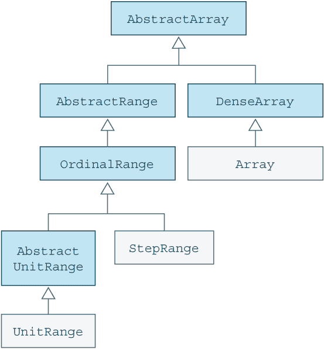
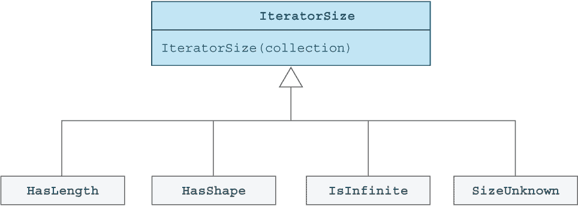
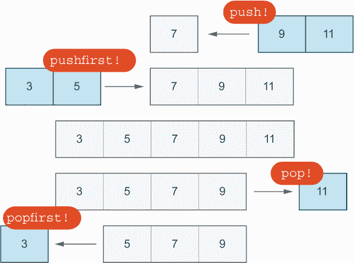
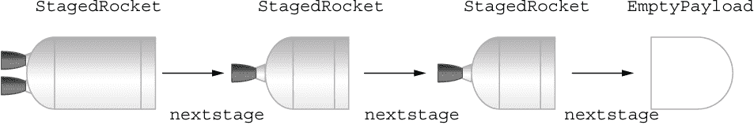
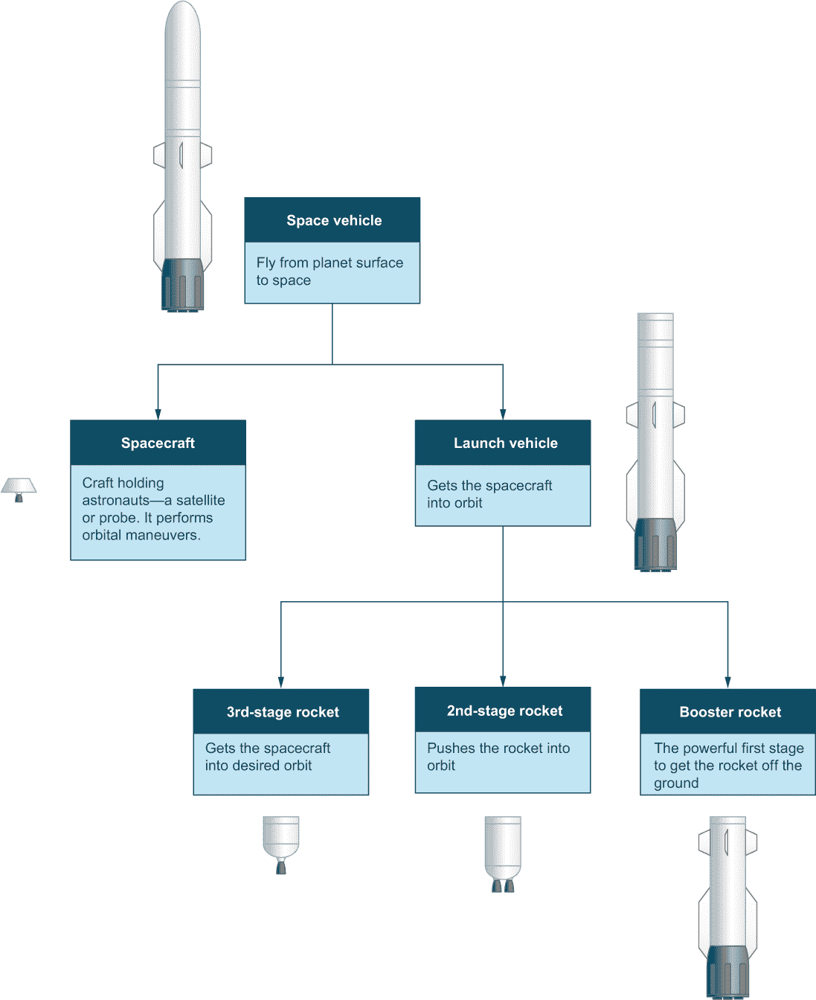

# 12 理解 Julia 集合

本章涵盖

+   理解根据它们支持的运算类型对集合进行分类的方法

+   将分阶段火箭转换为可迭代集合

+   使用各种集合类型支持的操作

你已经查看过数组、字典等集合，但还有许多其他类型的集合，包括集合、链表、堆、栈和二叉树。在本章中，我将介绍不同类型集合之间的共性。每个集合都组织和存储多个元素，每种集合类型都提供访问这些元素的独特方式。例如，使用字典，你可以通过提供键来访问元素，而数组则需要索引。

然而，集合也有所有集合都必须支持的核心功能，例如*可迭代性*。如果某物是可迭代的，你可以在 for 循环中访问其单个元素或使用高阶函数，如 map 或 filter。

什么使某物成为集合？不同集合类型之间的差异和相似之处是什么？你如何创建自己的集合？你将通过扩展第八章中的多级火箭示例来探索这些问题。因为火箭由许多不同的部分组成，所以它可以被转换成 Julia 能识别为集合的东西。

在本章中，你将为 Tank 抽象类型添加代码，以展示接口是如何定义的。你将修改 engine Cluster 类型以支持遍历引擎。在最后的示例中，你将修改 StagedRocket 类型以支持多级火箭的遍历。

## 12.1 定义接口

接口究竟是什么？它有助于将接口与实现进行对比。当你与计算机交互时，你使用鼠标和键盘；这就是你的计算机接口——你不需要知道你使用的特定计算机是如何构建的（图 12.1）。你可以使用相同的鼠标和键盘与许多不同方式构建的计算机一起使用。无论你的计算机有多少内存或什么微处理器，你都可以通过点击相同的图标和移动相同的窗口与之交互。换句话说，许多计算机模型之间存在一个共享的接口，这使你免受每个计算机特定硬件实现的干扰。


图 12.1 计算机不需要知道输入设备的工作原理。

通过清晰定义的接口分离组件，允许你构建大型、复杂的结构。组成你系统的各个部分不需要了解实现细节，只要每个部分使用一个定义良好的接口即可。让我们将这一点与使用 Julia 进行编程联系起来。数组和范围都是 AbstractArray 的子类型，如图 12.2 所示。



图 12.2 数组和范围的类型层次结构

因此，如果你已经定义了一个在抽象数组上操作的功能，你就不必处理数组和范围之间的区别。你可以创建一个名为 addup（见列表 12.1）的功能，它无论你传递的是数组还是范围作为参数都能正常工作。

列表 12.1 在抽象数组中累加元素的功能

```
function addup(xs::AbstractArray)
    total = 0           ❶
    for x in xs
        total += x
    end
    total               ❷
end
```

❶ 存储总和。

❷ 返回总和。

让我们用不同的参数调用这个函数。注意它在功能上与 sum 函数非常相似，只是它不允许你添加值元组。为什么是这样呢？

```
julia> addup(3:5)          ❶
12

julia> addup([3, 4, 5])    ❷
12

julia> addup((3, 4, 5))    ❸
ERROR: MethodError: no method matching addup(::Tuple{Int64, Int64, Int64})

julia> sum((3, 4, 5))
12
```

❶ 添加一系列值

❷ 添加一个值数组

❸ 尝试添加一个值元组

Tuple 类型在 AbstractArray 类型层次结构中无处可寻，因此 Tuple 类型的值不是 addup 的有效参数。另一个常见接口的例子是，对于范围和数组，都可以通过索引访问元素。请记住，Julia 数组的第一个元素位于索引 1：

```
julia> r = 3:5           ❶
3:5

julia> r[2]              ❷
4

julia> sum(r)            ❸
12

julia> a = [3, 4, 5]     ❶
3-element Vector{Int64}:
 3
 4
 5

julia> a[2]              ❷
4

julia> sum(a)            ❸
12
```

❶ 定义一个看起来相似的范围和数组。

❷ 访问第二个元素看起来是一样的。

❸ 对范围和数组求和的效果相同。

范围没有元素；元素是隐式存在的。然而，你可以通过给范围和数组一个相似的接口来抽象出这种差异。这允许我们定义像 sum 这样的函数，使其对这两种类型都有效，而不需要创建两个不同的方法。

在面向对象的语言中，例如 Java、C++或 C#，AbstractArray 的接口是明确定义的。这些语言中的类型定义包括子类型必须实现的方法列表。未能这样做会产生编译器错误。

然而，在 Julia 中，接口是*非正式*定义的。因此，没有编译器会告诉你你错误地实现了接口。

## 12.2 推进剂罐接口示例

为了阐明如何在 Julia 中定义和使用接口，我们将查看第八章中的推进剂罐示例（见列表 12.2）。假设你正在提供一个推进剂罐接口，其他开发人员可以使用它，并且你希望他们能够创建自己的 Tank 子类型，以便在组装火箭时使用。

列表 12.2 定义一个抽象推进剂罐

```
abstract type Tank end

propellant(tank::Tank) = tank.propellant

function refill!(tank::Tank)                            ❶
    propellant!(tank, totalmass(tank) - drymass(tank))
    tank
end
```

❶ 将推进剂罐装满至最大

现在想象另一个开发人员试图创建一个具体的 Tank 子类型，用于火箭模拟。开发人员编写了以下代码。

列表 12.3 定义推进剂罐子类型

```
mutable struct FlexiTank <: Tank
    drymass::Float64
    totalmass::Float64
    propellant::Float64
end
```

开发人员想要尝试他们的新罐子，并在 Julia REPL 中编写以下代码：

```
julia> tank = FlexiTank(10, 100, 0)
FlexiTank(10.0, 100.0, 0.0)

julia> refill!(tank)
ERROR: UndefVarError: totalmass not defined     ❶
```

❶ Julia 不知道 totalmass 是什么。

这个错误信息使得试图实现 Tank 接口的人难以知道他们应该做什么。Julia 解决这个问题的惯例是在接口中定义函数并对其进行文档化。

当查看列表 12.4 中的代码时，你可能会有以下疑问：为什么这个例子专注于文档化代码？接口在哪里定义？定义接口的语法是什么？答案是，没有。这就是为什么我说 Julia 中的接口是*非正式*定义的。因此，文档*是*定义 Julia 接口的关键部分。

记住第七章中提到的，在 Julia 中，方法附加到函数上，而不是类型上。你不能将函数与任何特定类型关联。totalmass、drymass 和 propellant 属于 Tank 接口的原因仅仅是因为我们在文档中这样说了。这完全是虚构的。

列表 12.4 定义一个良好文档化的推进剂罐接口

```
"Stores propellant for a rocket"
abstract type Tank end

"""
    totalmass(t::Tank) -> Float64 
Mass of propellant tank `t` when it is full.
"""
function totalmass end

"""
    drymass(t::Tank) -> Float64 
Mass of propellant tank `t` when it is empty.
"""
function drymass end

"""
    propellant(t::Tank) -> Float64
Get remaining propellant in tank. Propellant is fuel plus oxidizer
"""
propellant(tank::Tank) = tank.propellant

"""
    refill!(tank::Tank) -> Tank
Fill propellant tankt to the max. Returns full tank
"""
function refill!(tank::Tank)
    propellant!(tank, totalmass(tank) - drymass(tank))
    tank
end
```

Julia 的文档系统通过在函数或类型定义前加上一个常规的 Julia 文本字符串来工作。在这个文本字符串内部，你使用 markdown^(1) 语法来文档化你的函数或类型。在 markdown 中，你缩进你想格式化为源代码的行。为了突出显示单个单词作为代码，你使用反引号 `。

小贴士：有时你希望在 Julia REPL 中直接编写函数定义。然而，当你按下 Enter 键结束文档字符串后，它在你能够编写函数定义之前就会被评估。如何解决这个问题？如果你在按下 Enter 键时按住 Alt 或 Option 键，Julia 将允许你继续编写代码。

要给你的函数添加文档，你可以使用双引号或三引号字符串 (" 或 """)。请记住，这与使用井号 # 符号添加注释是不同的。注释不会存储在 Julia 帮助系统中。

三引号和双引号的工作方式略有不同。例如，如果你想在使用双引号的双引号文本中使用双引号，你需要使用反斜杠*转义*引号。对于三引号来说这不是必要的：

```
julia> print("file \"foo.txt\" not found")
file "foo.txt" not found
julia> print("""file "foo.txt" not found""")
file "foo.txt" not found
```

你的文档不需要匹配 Julia 语法。例如，你已经在文档中使用箭头来告知读者函数返回的对象类型：

```
"drymass(t::Tank) -> Float64"
```

将这个新的 Tank 定义与 FlexiTank 一起放入文件中，并用它重新加载你的 Julia REPL。你可以以几乎任何你喜欢的组织方式来做这件事。我使用一个名为 tank-interface.jl 的文件，如下所示（为了简洁，我已删除文档字符串）：

```
abstract type Tank end

function totalmass end
function drymass end

propellant(tank::Tank) = tank.propellant

function refill!(tank::Tank)
    propellant!(tank, totalmass(tank) - drymass(tank))
    tank
end

mutable struct FlexiTank <: Tank
    drymass::Float64
    totalmass::Float64
    propellant::Float64
end
```

让我们探索在尝试重新填充柔性罐时出现的错误信息：

```
julia> t = FlexiTank(10, 100, 0)
FlexiTank(10.0, 100.0, 0.0)

julia> refill!(t)
ERROR: MethodError: no method matching totalmass(::FlexiTank)
```

在这种情况下，你会得到一个更好的错误信息。Julia 通知我们，totalmass 确实是一个函数，但它缺少 FlexiTank 类型的方法。通过检查存在哪些方法，你可以推断出需要一个处理 FlexiTank 类型的方法：

```
julia> methods(totalmass)
# 0 methods for generic function "totalmass":
```

要进入 Julia 帮助系统，按 ? 键，如第二章所述：

```
help?> totalmass
search: totalmass

  totalmass(t::Tank) -> Float64

  Mass of propellant tank t when it is full.
```

通常，你会提供一个库指南来解释开发者应该如何使用它。这个指南解释了存在哪些接口以及如何实现这些接口。

在静态类型语言，例如 Java 中，编译器和复杂的 IDE^(2)可以通知开发者需要实现的方法及其参数。由于 Julia 是动态类型语言，您没有这样的便利。您必须充分记录您的函数，以便其他开发者知道预期的参数以及函数应该返回什么。以下示例显示，在完成函数调用之前，您可以按 Tab 键以获取与您所写内容匹配的方法及其参数列表：

```
refill!(tank::Tank)
julia> refill!(       ❶
```

❶ 按 Tab 键，可用的方法会弹出。

然而，这种策略对 totalmass 和 drymass 没有用，因为这些函数没有任何附加的方法。这就是为什么记录这些函数的必需参数至关重要。

## 12.3 习惯用法接口

Julia 中的接口并不都与特定的抽象类型相关联，如前例所示。例如，有一个*迭代*接口。如果您实现此接口，您将能够使用 for 循环遍历您的集合。这将使您能够使用 map、reduce 和 filter 等函数，这些函数在可迭代集合上操作。

迭代接口不是由任何特定的抽象类型表示，而是非正式地描述的。您至少需要扩展您的集合类型的 iterate 函数，以下方法：

| 必需方法 | 目的 |
| --- | --- |
| iterate(iter) | 第一个项和初始状态 |
| iterate(iter, state) | 当前项和下一个状态 |

有几种这样的方法，这些方法在官方 Julia 文档中得到了详细记录。以下是最有用的几个：

| 可选方法 | 目的 |
| --- | --- |
| IteratorSize(IterType) | 指示集合是否有已知长度 |
| eltype(IterType) | 每个元素的类型 |
| length(iter) | 集合中的项目数量 |

我将涵盖两个不同的与火箭相关的示例，在这些示例中，您将实现其中的一些方法。在第一个示例中，您将遍历集群中的发动机。在第二个示例中，您将遍历多级火箭的阶段。

## 12.4 实现发动机集群迭代

在第八章中，我们定义了一个类似以下的发动机集群。

列表 12.5 火箭发动机集群的旧定义

```
struct Cluster <: Engine
    engine::Engine
    count::Int
end
```

根据这个定义，集群中的所有发动机都必须是同一类型。但如果你想要不同类型发动机的混合呢？一些火箭实际上确实有发动机的混合，而您不能使用给定的 Cluster 类型定义来模拟这样的火箭。为了解决这个问题，您将 Cluster 转换为抽象类型。这个抽象类型将有两个具体的子类型：

+   一个 UniformCluster，表示相同的发动机

+   一个 MixedCluster，表示不同发动机的混合

但为什么引入第二层抽象？为什么 UniformCluster 和 MixedCluster 不能直接成为 Engine 的子类型？随着您代码的发展，这一层抽象的好处将变得明显。打开第八章中 Cluster 类型的源代码，并使用以下代码进行修改。

列表 12.6 重新设计的集群类型层次结构

```
abstract type Cluster <: Engine end

struct UniformCluster <: Cluster
    engine::Engine
    count::Int
end

struct MixedCluster <: Cluster
   engines::Vector{Engine}                             ❶
end

function Cluster(engine::Engine, count::Integer)
    UniformCluster(engine, count)
end

function Cluster(engine::Engine, engines::Engine...)
    sametype(e) = (typeof(engine) == typeof(e))        ❷

    if all(sametype, engines)                          ❸
        UniformCluster(engine, length(engines) + 1)    ❹
    else
        MixedCluster([engine, engines...])             ❺
    end
end
```

❶ 一个元素为 Engine 子类型的向量

❷ 定义一个检查引擎 e 是否与第一个引擎相同的函数。

❸ 检查所有引擎是否为同一类型。

❹ 如果所有引擎类型相同，则返回 UniformCluster。

❺ 如果引擎类型不同，则返回 MixedCluster。

您添加了 Cluster 方法，这些方法会查看传递给参数的引擎类型，以确定是否创建均匀或混合集群。您在这里使用了一些新技巧。

sametype 函数是在 Cluster 构造函数内部定义的。这意味着它有权访问引擎参数，而无需将其作为参数传递。这很有益，因为 all 是一个接受单个参数并返回 true 或 false 的高阶函数。以下是一些示例，以给您一个想法。

列表 12.7 all 函数的使用演示

```
julia> iseven(3)
false

julia> iseven(4)
true

julia> all(iseven, [4, 8, 10])   ❶
true

julia> all(iseven, [3, 8, 10])   ❷
 false
```

❶ 在这种情况下，每个数字都是偶数。

❷ 数字 3 不是偶数。

通过隐藏表示集群使用的类型，您可以产生只有一种 Cluster 类型的错觉。您内部使用两种不同的类型成为实现细节。让我们通过 Julia REPL 演示它是如何工作的：

```
julia> Cluster(Rutherford(), Rutherford())
UniformCluster(Rutherford(), 2)                ❶

julia> Cluster(Rutherford(), Merlin())
MixedCluster(Engine[Rutherford(), Merlin()])   ❷
```

❶ 由于所有参数都是同一类型，因此您得到一个 UniformCluster。

❷ 您需要一个混合集群来容纳 Merlin 和 Rutherford 引擎。

您需要根据这些更改重新定义您的 Isp、质量和推力方法。请记住，在第八章中，这些函数被定义为

```
Isp(cl::Cluster) = Isp(cl.engine)
mass(cl::Cluster) = mass(cl.engine) * cl.count
thrust(cl::Cluster) = thrust(cl.engine) * cl.count
```

在这些集群类型上实现一个*可迭代*接口，以便您只需编写一个质量推力和实现，它适用于两种集群类型。

### 12.4.1 使集群可迭代

您可以尝试迭代一个集群，如目前定义的那样，但不会工作：

```
julia> cl = Cluster(Rutherford(), 3)
UniformCluster(Rutherford(), 3)

julia> for engine in cl
           println(mass(engine))
       end
ERROR: MethodError: no method matching iterate(UniformCluster)
```

Julia JIT 编译器会将这个 for 循环转换为更低级的 while 循环，其代码如下所示。

列表 12.8 Julia 中的 for 循环实现

```
cluster = Cluster(Rutherford(), 3)

next = iterate(cluster)            ❶
while next != nothing              ❷
    (engine, i) = next             ❸
    println(mass(engine))
    next = iterate(cluster, i)     ❹
 end
```

❶ 开始迭代。

❷ 检查是否到达迭代的末尾。

❸ 从下一个元组中提取值。

❹ 在集合中推进到下一个元素。

因此，您的 for 循环不起作用，因为您尚未实现所需的 iterate 方法。以下列表显示了如何添加这些方法，以便可以对混合集群的引擎进行迭代。

列表 12.9 为 MixedCluster 实现迭代接口

```
import Base: iterate                                  ❶

function iterate(cluster::MixedCluster)               ❷
    cluster.engines[1], 2
end

function iterate(cluster::MixedCluster, i::Integer)   ❸
    if i > length(cluster.engines)
        nothing                                       ❹
    else
        cluster.engines[i], i+1                       ❺
    end
end
```

❶ 向 Base 模块中定义的 iterate 函数添加方法。

❷ 用于启动迭代

❸ 将集合中的下一个元素向前推进。

❹ 返回 nothing 以指示您已到达末尾。

❺ 当前元素和下一个元素的索引

从 Base 导入 iterate 函数很重要，因为 for 循环是为了使用 Base 中的 iterate 而设计的，而不是在其他模块中定义的同名 iterate 函数。当你开始迭代时，你需要返回第一个元素和下一个元素的索引。因此，当你开始迭代时，你必须返回第二个元素的索引。这就是为什么你返回 cluster.engines[1], 2。你可以手动调用 iterate 来了解它是如何工作的：

```
cluster = Cluster(Rutherford(), Merlin());

julia> next = iterate(cluster)    ❶
(Rutherford(), 2)

julia> (engine, i) = next         ❷
(Rutherford(), 2)

julia> next = iterate(cluster, i) ❸
(Merlin(), 3)

julia> (engine, i) = next         ❷
(Merlin(), 3)

julia> next = iterate(cluster, i) ❸
                                  ❹
```

❶ 获取初始状态。

❷ 从下一个元组中提取发动机和下一个索引。

❸ 获取下一个发动机。

❹ 已经到达末尾，所以 next 等于 nothing。

现在以下列表中关于 UniformCluster 迭代的实现应该更加清晰。

列表 12.10 实现 UniformCluster 的迭代

```
import Base: iterate

function iterate(cluster::UniformCluster)
    cluster.engine, 2
end

function iterate(cluster::UniformCluster, i::Integer)
    if i > cluster.count
        nothing
    else
        cluster.engine, i+1
    end
end
```

你可以看到，这种实现更简单，因为你总是返回相同的发动机。i 索引仅用于跟踪你是否已经到达迭代的末尾。因为现在 Cluster 类型都支持迭代，你可以通过迭代来实现质量和推力，如下面的列表所示。

列表 12.11 为集群定义质量和推力

```
mass(cluster::Cluster)   = sum(mass, cluster)
thrust(cluster::Cluster) = sum(thrust, cluster)
```

这是如何工作的？sum 函数遍历作为第二个参数提供的集合。sum 将提供的第一个参数函数应用于它遍历的每个元素。sum(thrust, cluster)等价于编写 sum(map(thrust, cluster))。这两个调用在实现列表 12.12（为集群实现长度）之前都不会工作；否则，Julia 无法在开始迭代之前确定结果向量的长度。

列表 12.12 为 Julia 提供一种确定集群中发动机数量的方法

```
import Base: length

length(cluster::UniformCluster) = cluster.count          ❶
length(cluster::MixedCluster) = length(cluster.engines)  ❶
```

❶ 将长度函数扩展以支持集群类型。

记住，有一些求和函数可以接受一个或两个参数。对于比冲（Isp），你不能直接求和值；相反，你需要找到一个平均值，如下所示。

列表 12.13 计算发动机集群的比冲

```
Isp(cl::Cluster) = sum(Isp, cl)/length(cl)
```

此代码还让集合支持长度，这对于大多数集合来说是有意义的。自然地，开发者希望能够检查集合中包含了多少个元素。

通过这些更改，应该更明显地看出你为什么将 Cluster 定义为抽象类型。它允许你在多个集群类型之间共享质量、比冲和推力的实现。使用抽象类型是实现代码重用的一种好方法。

接下来，你将探索遍历火箭阶段。这会有点不同，因为你不能通过索引访问火箭阶段。

## 12.5 实现火箭阶段迭代

以下列表显示了第八章中使用的火箭阶段的定义。

列表 12.14 火箭阶段的定义

```
struct StagedRocket <: Rocket
    nextstage::Rocket
    tank::Tank
    engine::Engine
end
```

注意，你没有可以从其中提取单个阶段的向量。因此，从 iterate 返回的元组中的元素不会是整数索引。

列表 12.15 启动分阶段火箭的迭代

```
import Base: iterate

iterate(r::StagedRocket) = (r, r.nextstage)
iterate(r::Rocket) = nothing
```

列表 12.15 中的代码处理了两种不同的情况：

+   一个实际有有效载荷的分级火箭

+   所有其他未分级且因此没有下一个元素的火箭

这意味着你不必为 Rocket 的每个可能的子类型添加 iterate。相反，你使 Rocket 类型默认不支持迭代。你还需要支持通过阶段集合的推进，这正是以下列表中的迭代方法将要做的。

列表 12.16 前进到火箭的下一阶段

```
function iterate(first::StagedRocket,
➥ current::StagedRocket)                                ❶
    current, current.nextstage
end

function iterate(first::StagedRocket, current::Rocket)   ❷
    nothing
end
```

❶ 当下一阶段也是分级火箭时被调用

❷ 默认处理迭代到下一阶段

你已经定义了这些新方法，以便默认结束迭代。这是通过指定 current 的类型为 Rocket 来实现的。然后你对 current 是 StagedRocket 类型的情况进行例外处理。在这种情况下，你知道有一个 nextstage 字段，你可以访问它来前进到集合中的下一个元素。

因此，虽然 Cluster 类型的第一个例子使 current 看起来像是一个整数索引，但这并不完全正确。iterate 的第二个参数不需要是整数。它可以是你迭代集合中当前位置的任何数据。你可以通过将以下列表中的代码放入 REPL 或加载到 REPL 中的文件中来测试迭代。

列表 12.17 遍历火箭阶段

```
payload = Payload(300)

thirdstage = Rocket(payload, SmallTank(), Curie())
secondstage = Rocket(thirdstage, MediumTank(), Rutherford())
booster = Rocket(secondstage, LargeTank(), Cluster(Rutherford(), 9))

for rocket in booster
    println("Mass of rocket: ", mass(rocket))
    println("Thrust of rocket: ", thrust(rocket))
    println()
end
```

确保你首先将你的火箭代码加载到你的 REPL 中。当你运行这个程序时，你应该得到以下输出：

```
Mass of rocket: 13568.0
Thrust of rocket: 225000

Mass of rocket: 3053.0
Thrust of rocket: 25000

Mass of rocket: 718.0
Thrust of rocket: 120
```

这表明在 for 循环中迭代是可行的。然而，你不能与 sum、map 和 collect 等函数一起使用。以下 REPL 会话显示了在助推阶段使用 map 和 collect 函数的失败尝试。

```
julia> map(mass, booster)
ERROR: MethodError: no method matching length(::StagedRocket)

julia> collect(booster)
ERROR: MethodError: no method matching length(::StagedRocket)
```

使其工作将是下一步。

### 12.5.1 添加对 map 和 collect 的支持

map 和 collect 失败是因为你缺少 Rocket 类型的 length 方法的实现。为了理解这个问题，我将首先展示一个原始解决方案，如下所示。

列表 12.18 计算分级火箭的阶段数量

```
import Base: length

length(::Rocket) = 0
length(r::StagedRocket) = 1 + length(r.nextstage)
```

虽然这可行，但其性能特性较差。计算分级火箭长度的所需时间与其长度成正比。这类算法在*大 O 表示法*中被称为*线性*或 O(n)。

大 O 表示法

在计算机科学中，我们经常讨论数据结构和算法的内存需求和处理能力，这被称为*大 O 表示法*。如果一个算法查找一个项目所需的时间是线性的（例如，它依赖于集合中的元素数量），那么我们将其写为 O(n)。这里的 n 指的是你整个集合中的 n 个元素。因此，如果 n 加倍，那么 O(n)算法完成所需的时间也将加倍。使用 for 循环查看每个元素的算法被称为 O(n)算法，而具有恒定时间的算法则写为 O(1)。

Julia 给我们一种方法来告诉它的迭代机制，没有有效的方法来确定你迭代的集合的长度。你可以通过实现一个 IteratorSize 方法来实现这一点，如下所示。

列表 12.19 将 SizeUnknown 特性添加到 Rocket 子类型

```
import Base: iterate, IteratorSize

IteratorSize(::Type{<:Rocket}) = Base.SizeUnknown()
```

这个概念一开始并不容易理解。我们称之为“神圣特性模式”。编程中的模式指的是在许多不同情境中重复使用的问题解决特定方式。在 Julia 中，你使用神圣特性模式向类型添加特性。一个“特性”就像是一种能力或特征（图 12.3）。例如，一个弓箭手可能有 CanShoot 特性；一个骑士可能有 CanRide 特性；而像蒙古战士这样的弓箭手，则可能同时拥有 CanShoot 和 CanRide 特性。



图 12.3 IteratorSize 特性和其子类型

可迭代的 Julia 集合可以有不同的特性，其中之一就是 IteratorSize。这究竟是如何工作的呢？当你调用 collect(rocket) 时，这会被转换成以下代码。

列表 12.20 collect 函数的实现

```
_collect(rocket, IteratorEltype(rocket), IteratorSize(rocket)).
```

_collect 函数附带了处理具有不同特性的集合的几种不同方法。你可以看到，collect 的行为取决于两个不同的特性：IteratorEltype 和 IteratorSize。你不必总是为你的集合注册特性，因为默认值就很好。以下列表显示了 IteratorSize 的默认值是如何定义的。

列表 12.21 Julia 集合的默认 IteratorSize

```
IteratorSize(x) = IteratorSize(typeof(x))
IteratorSize(::Type) = HasLength()
```

当 IteratorSize 特性被定义为 HasLength 时，Julia 将调用 length 来确定从 collect 生成的结果数组的长度。当你将此特性定义为 SizeUnknown 时，Julia 将使用一个空数组作为输出，该数组根据需要增长。

在 Julia 中，特性被定义为抽象类型。特性可以具有的值由具体子类型确定。HasLength 和 SizeUnknown 都是 IteratorSize 的子类型。你可能从第九章中认出了类似的模式：convert 和 promote_rule 函数都接受类型作为参数；然而在这种情况下，你添加了一个小的变化，即描述参数类型为 Type{<:Rocket}。

子类型运算符 `<:` 用于表示所有 Rocket 的子类型都具有 IteratorSize 特性的 SizeUnknown 值。我知道这听起来可能有些复杂，但幸运的是，当你需要时通常可以查阅。了解特性比记住它们是如何工作的更重要。为 Rocket 定义了 IteratorSize 特性后，你现在可以使用 map、sum 和其他在集合上操作的高阶函数：

```
julia> booster = Rocket(secondstage,
                        LargeTank(),
                        Cluster(Rutherford(), 9));   ❶

julia> map(mass, booster)                            ❷
3-element Vector{Float64}:
 13568.0
  3053.0
   718.0

julia> sum(thrust, booster)                          ❸
 250120
```

❶ 如果还没有定义，请记住定义第二和第三状态。

❷ 获取每个阶段的重量。

❸ 将多级火箭上所有引擎的推力相加。

集合需要支持的最基本操作是迭代。你已经看到了如何在两种不同的集合类型上实现这一点。火箭集群的行为大多像数组；然而，你的分阶段火箭更像是一种称为 *链表* 的数据结构。在下一节中，你将比较链表和数组，以更好地理解不同的集合类型有不同的权衡。

## 12.6 链表和数组的比较

你通过 nextstage 将阶段相互链接的方式与 *链表* 的工作方式相同：它们通常与数组进行对比。使用数组时，你可以快速确定长度或根据索引查找任意元素。你将为 Cluster 子类型添加基于索引的查找支持，并在稍后将其与火箭阶段的链表进行比较。

回想一下，for 循环实际上会被转换为 while 循环，在访问和替换数组中的元素时也存在类似的情况。假设你创建了一个集群，在其中访问元素。

列表 12.22 基于索引的访问

```
cluster = Cluster(Rutherford(), Merlin())
engine = cluster[1]               ❶
cluster[2] = Rutherford()         ❷
```

❶ 读取第一个元素。

❷ 更改第二个元素。

列表 12.22 中的代码将通过 Julia 编译器经过几个阶段进行翻译。其中一个阶段，称为 *lowering*，将此代码转换为以下形式。

列表 12.23 基于索引的访问内部机制

```
cluster = Cluster(Rutherford(), Merlin())
engine = getindex(cluster, 1)
setindex!(cluster, Rutherford(), 2)
```

因此，为了使你的 Cluster 子类型支持通过索引访问元素，你需要向 Base 模块中找到的 getindex 和 setindex! 函数添加方法。这些是用于实现方括号中元素访问的函数：[]。

列表 12.24 向火箭集群添加基于索引的访问

```
import Base: getindex, setindex!

function getindex(cluster::MixedCluster, i::Integer)  ❶
    cluster.engines[i]
end

function setindex!(cl::MixedCluster, egn::Engine,
➥i::Integer)                                         ❷
    cl.engines[i] = egn
end

function getindex(cluster::UniformCluster, _)         ❸
    cluster.engine
end
```

❶ 获取集群中的第 i 个元素。

❷ 将集群中的第 i 个元素设置为 egn。

❸ 对于 UniformCluster，你不需要关心索引。

你可以看到 MixedCluster 和 UniformCluster 之间的一些差异，你可以轻松地支持从 UniformCluster 中获取元素，因为每个元素都是相同的。然而，你不能支持设置元素，因为这将不再保持均匀。因此，你没有为 UniformCluster 添加处理 setindex! 的方法。虽然你可以为链表定义基于索引的访问，但如以下列表所示，这并不高效。

列表 12.25 通过索引访问火箭阶段

```
import Base: getindex
function getindex(r::StagedRocket, i::Integer)
    for _ in 1:i-1                               ❶
        r = r.nextstage
    end
    r
end
```

❶ 当你不在乎变量的名称时使用 `_`。

这样的查找是一个 O(n) 操作（线性）。阶段越多，for 循环需要重复的次数就越多。相比之下，在数组中的查找是一个 O(1) 操作。这就是说它是一个 *常数操作*。在包含三个元素的数组中查找元素的时间与在包含数百万元素的数组中查找元素的时间完全相同。

然而，你可以添加对其他类型操作的支持，这些操作运行得更快。让我们看看 Julia 中支持的一些最常见的操作，用于向集合中添加元素。

### 12.6.1 添加和删除元素

数组允许您向数组的末尾添加元素，也可以从两端删除元素。注意在示例中，push! 和 pushfirst! 如何允许您在单个函数调用中添加多个元素。

```
julia> xs = Int[7]             ❶
1-element Vector{Int64}:
 7

julia> push!(xs, 9, 11)        ❷
3-element Vector{Int64}:
  7
  9
 11

julia> pushfirst!(xs, 3, 5)    ❸
5-element Vector{Int64}:
  3
  5
  7
  9
 11

julia> pop!(xs)                ❹
11

julia> popfirst!(xs)           ❺
 3
```

❶ 创建包含一个元素 7 的数组 xs。

❷ 将 9 和 11 添加到数组的末尾。

❸ 将 3 和 5 添加到数组的开头。

❹ 移除最后一个元素。

❺ 移除第一个元素。

图 12.4 可能有助于阐明这些操作的工作原理。



图 12.4 从数组中添加和删除元素

对于链表，从前面添加和删除元素是有效的（见图 12.5）。因此，您可以支持 pushfirst! 和 popfirst! 等操作。然而，您需要做一些调整和准备工作，以便更方便地实现这些函数。



图 12.5 终止的火箭级链表

在处理链表时，有一个明显的终止对象链是很有用的。通常这将是 nothing 对象，但在多级火箭中，一个 emptypayload 将是一个自然的选择。

列表 12.26 一个空的载荷对象，用于终止火箭级列表

```
struct EmptyPayload <: Rocket end                          ❶
const emptypayload = EmptyPayload()                        ❷

mass(::EmptyPayload) = 0.0                                 ❸
thrust(r::EmptyPayload) = 0                                ❸
update!(r::EmptyPayload, t::Number, Δt::Number) = nothing  ❸

function Rocket(tank::Tank, engine::Engine)
    StagedRocket(emptypayload, tank, engine)
end
```

❶ 没有字段

❷ 每个实例都有与没有任何东西时相同的对象。

❸ 实现火箭接口。

具有空载荷的表示提供了一些优势，例如为单级火箭提供一个合理的默认构造函数，如列表 12.26 所示。然而，示例尚未完成。需要一个新类型，并且需要修改现有类型。StagedRocket 最初被设置为不可变的，这将阻碍例如 popfirst! 的操作，因为您需要修改 nextstage 字段。您不能修改不可变对象的字段（无法更改的对象）。

重要提示：每次更改类型定义，例如通过使结构可变，您都需要重新启动 Julia REPL。这是因为 Julia 类型是固定的；它们不能像许多其他动态语言那样在运行时修改。

接下来，我将介绍 SpaceVehicle 类型（列表 12.27）。图 12.6 显示了它在概念上与其他火箭部件的关系。



图 12.6 火箭术语概述

SpaceVehicle 是包含所有火箭级的整体。这种抽象有助于围绕级进行包装，以便您可以跟踪第一个火箭级开始的位置。这在实现 pushfirst! 和 popfirst! 时很有用，因为它允许您相对于其他东西添加和删除级。

列表 12.27 新的和修改的类型定义

```
mutable struct StagedRocket <: Rocket    ❶
   nextstage::Rocket                     ❷
    tank::Tank
    engine::Engine
end

mutable struct SpaceVehicle              ❸
    activestage::Rocket                  ❹
 end
```

❶ 将 StagedRocket 更改为可变的。

❷ 您希望 nextstage 可以更改。

❸ 火箭级的包装器

❹ 当前引擎正在燃烧的级

在这些类型定义到位后，你就有了实现 popfirst!和 pushfirst!方法的基础（列表 12.28）。因为它们是 Julia 集合的标准函数，所以你从 Base 导入它们，并通过处理你的特定集合 SpaceVehicle 的方法来扩展它们。

列表 12.28 从底部移除阶段

```
import Base: popfirst!, pushfirst!

tail(r::StagedRocket) = r.nextstage
tail(r::Rocket) = nothing

function popfirst!(ship::SpaceVehicle)
    r = tail(ship.activestage)
    if r == nothing                           ❶
        throw(throw(ArgumentError
        ➥
("no rocket stages left")))                   ❷
    else
        discarded = ship.activestage          ❸
        discarded.nextstage = emptypayload    ❹
        ship.activestage = r                  ❺
    end
    discarded                                 ❻
 end
```

❶ 检查是否还有剩余的阶段。

❷ 不允许从空航天器中弹出阶段

❸ 丢弃底部阶段。

❹ 解链被丢弃的阶段。

❺ 下一个阶段变为活动阶段。

❻ 在 REPL 中显示被丢弃的阶段。

尾部功能需要一些解释。你添加了两种方法：一种用于处理 StagedRocket，另一种用于 Rocket 的子类型。这是一种简单的方式来检查 SpaceVehicle 上是否还有剩余的阶段。由于 SpaceVehicle 的 activestage 字段是 Rocket 类型，你不能保证存在下一个阶段。为什么不将其改为 StagedRocket 呢？因为你希望允许阶段在只剩下代表卫星或乘员舱的有效载荷之前被分离。

列表 12.29 在底部添加阶段

```
function pushfirst!(ship::SpaceVehicle, r::StagedRocket)
    r.nextstage = ship.activestage    ❶
    ship.activestage = r              ❷
    ship
end
```

❶ 当前阶段变为下一个阶段。

❷ 新阶段变为当前阶段。

使用 pushfirst!，你将新阶段 r 放在现有活动阶段之前（列表 12.29）。旧的活动阶段改变其角色，成为新活动阶段的下一个阶段。你可以进行所有这些编辑和修改，并启动一个新的 REPL 来感受这些新函数的工作方式。为了使其更直观，我将展示一个名为 a、b 和 c 的火箭阶段示例。每个阶段都比前一个阶段有更大的油箱和更大的引擎：

```
julia> a = Rocket(SmallTank(), Curie());

julia> b = Rocket(MediumTank(), Rutherford());

julia> c = Rocket(LargeTank(), Merlin());
```

示例开始于创建一个带有小型 40 公斤有效载荷的航天器：

```
julia> ship = SpaceVehicle(Payload(40));
```

接下来，使用 pushfirst!向这艘航天器添加阶段：

```
julia> pushfirst!(ship, a)
SpaceVehicle(StagedRocket(Payload(40.0), SmallTank(370.0), Curie()))

julia> pushfirst!(ship, b)
SpaceVehicle(StagedRocket(
                StagedRocket(
                    Payload(40.0),
                    SmallTank(370.0),
                    Curie()),
                MediumTank(2050.0),
                Rutherford()))

julia> pushfirst!(ship, c)
SpaceVehicle(StagedRocket(
                StagedRocket(
                    StagedRocket(
                        Payload(40.0),
                        SmallTank(370.0),
                        Curie()),
                    MediumTank(2050.0),
                    Rutherford()),
                LargeTank(9250.0),
                Merlin()))
```

我通过添加空白和缩进来编辑 REPL 输出，以更清楚地显示在添加更多阶段时创建的结构。你可以看到最小的阶段位于最深的缩进级别。这是因为它是嵌套最深的。带有大型引擎和油箱的助推阶段位于底部。

你可以使用 popfirst!函数再次移除所有这些阶段：

```
julia> popfirst!(ship)
StagedRocket(EmptyPayload(), LargeTank(9250.0), Merlin())

julia> popfirst!(ship)
StagedRocket(EmptyPayload(), MediumTank(2050.0), Rutherford())

julia> popfirst!(ship)
StagedRocket(EmptyPayload(), SmallTank(370.0), Curie())

julia> ship
SpaceVehicle(Payload(40.0))
```

在每次 pop 操作中，被丢弃的阶段会被返回。注意，带有 Merlin 引擎的最大阶段首先脱落。下一个阶段涉及中等大小的油箱。带有小油箱的顶部阶段最后脱落。最后，只剩下包含初始 40 公斤有效载荷的航天器。

## 12.7 自定义类型的实用性

在实际代码中，链表并不常用，因为数组更灵活，并且在大多数情况下性能更好。然而，理解链表是有用的，因为这里应用的原则也适用于更复杂的数据结构。树结构和图也链接元素。

虽然你可能不会花太多时间编写完全通用的数据结构，例如数组、链表和字典，但将自定义数据结构（火箭阶段）转换为集合会很有帮助。一旦数据结构实现了已建立类型类别（如集合）的接口，你就可以使大量函数适用于它们。例如，通过使分阶段火箭可迭代，你就可以突然免费使用 map、reduce、filter、sum、collect 和其他函数。

## 摘要

+   使用方括号进行循环和索引访问都转换为 Julia 函数调用，例如 iterate、getindex 和 setindex!。

+   集合至少必须支持迭代。这是通过为你的集合类型实现两个 iterate 方法来完成的——一个用于开始迭代，另一个用于获取下一个元素。

+   Julia 类型可以使用神圣的特质模式配置不同的能力。Julia 集合可以使用不同的特质配置，例如 IteratorSize 和 IteratorEltype。

+   对于计算元素数量较慢的集合，应将 IteratorSize 配置为 SizeUnknown。

+   数组可以快速访问任何索引处的元素，但除了在数组末尾外，不允许快速插入元素。

+   链表通过索引访问元素较慢，但在前端的元素插入和删除较快。

+   实现已建立的 Julia 接口可以使你的数据类型更加灵活。例如，通过将你的数据结构转换为 Julia 集合，你可以利用许多预构建的与 Julia 集合相关的函数。

* * *

(1.)Markdown 是一种轻量级标记语言，用于使用纯文本编辑器创建格式化文本。

(2.)IDE 是集成开发环境的缩写。Visual Studio 和 IntelliJ IDEA 是 IDE 的一些例子。
