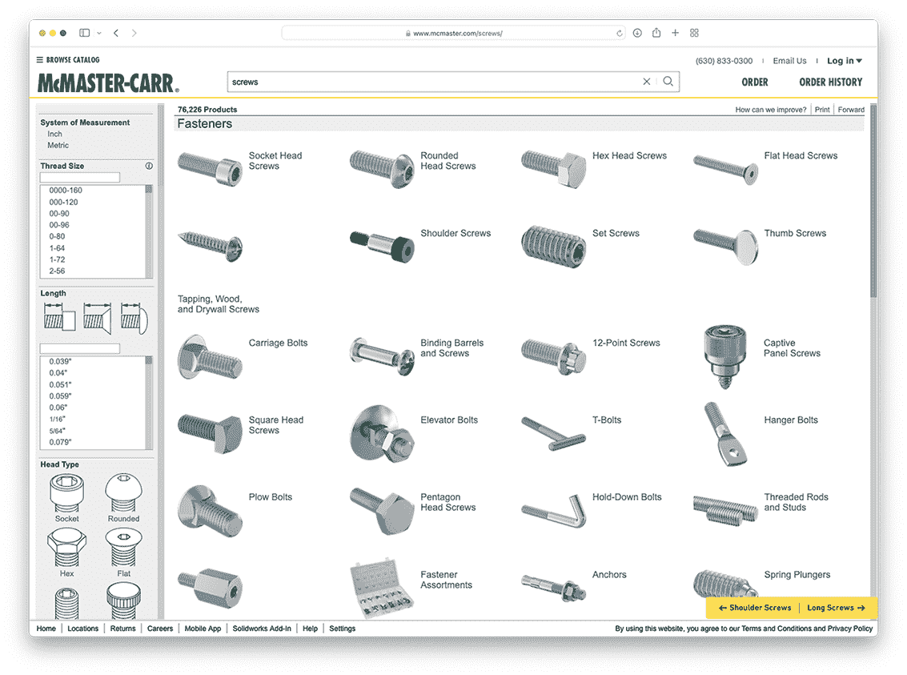
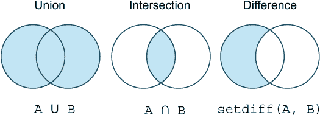

# 13 使用集合

本章涵盖了

+   比较集合和数组之间的差异

+   以不同方式创建集合

+   使用并集和交集操作在不同类型的软件中定位项目

+   理解使用集合和搜索操作之间的权衡

定义集合并展示它们可以用于的操作并不需要花费太多时间。真正需要时间的是发展对使用集合可以解决何种问题的理解或直觉。

通过利用集合和集合操作，可以巧妙地解决许多与组织数据定位相关的问题，但这并不总是显而易见的。在本章中，我将介绍集合是什么以及你可以用它做什么，然后我会通过展示各种现实生活中的例子来展示在集合中存储数据的力量。

## 13.1 集合可以帮助解决哪些类型的问题？

许多软件需要组织大量数据，包括以下内容：

+   相册

+   邮件客户端

+   缺陷跟踪系统

+   在线购物

+   软件开发项目

+   专门软件，如地质学家使用的建模软件

很长时间以来，组织数据最流行的方式是通过树形结构。要找到一项物品，你会钻入子类别，直到找到你想要的。这种方法的缺点是，许多物品可能存在于多个子类别下，而不仅仅是单个子类别。

像 McMaster-Carr（图 13.1）这样的网店，销售大量机械部件，是这种问题的绝佳例子。



图 13.1 McMaster-Carr 网店展示了螺丝可以以多种方式分类

在屏幕的侧面，你可以看到各种螺丝的分类：

+   *度量系统*——螺丝尺寸是以英制单位还是公制单位给出的？

+   *螺纹尺寸*——螺纹的实际测量值和每英寸的螺纹数是多少？

+   *材料*——螺丝是由钢、塑料还是木头制成的？

+   *长度*——从螺丝头下方到螺纹末端的长度是多少？

+   *头部类型*——它是平的、圆形的还是六角形的？

这里展示的分类远不止这些。然而，重要的是你不能将其转换成树形层次结构。例如，塑料螺丝和钢螺丝都可以有圆形的头部。

另一个例子是相册。你是如何组织它们的？你可以按家庭成员组织照片，这样你的妻子和每个孩子都有自己的相册。或者，也许根据事件组织相册，比如访问巴塞罗那或夏威夷，更有意义。或者，也许有人更喜欢基于活动的组织，比如为特定类型的景点创建相册，如技术博物馆或动物园。组织很困难，所以让我们看看集合和集合操作如何帮助你完成这项任务。

## 13.2 什么是集合？

集合是一种集合类型，就像数组或字典一样。以下是一个创建集合的例子：

```
julia> fruits = Set(["apple", "banana", "pear", "orange"])
Set{String} with 4 elements:
  "pear"
  "orange"
  "banana"
  "apple"

julia> fruits = Set([:apple, :banana, :pear, :orange])   ❶
Set{Symbol} with 4 elements:
  :pear
  :apple
  :banana
  :orange

julia> odds = Set([1, 3, 5, 7, 9])
Set{Int64} with 5 elements:
  5
  7
  9
  3
  1

julia> nodups = Set([3, 3, 3, 1, 2])                     ❷
Set{Int64} with 3 elements:
  2
  3
  1
```

❶ 用符号代替字符串

❷ 尝试添加重复项

在第一种情况下，创建了一个包含水果的集合，其中每个水果都由一个字符串表示。第二种情况类似，但使用符号而不是字符串来表示水果。这是一个有用的例子，因为符号在 Julia 中经常用来表示键。

集合类似于字典的键；没有元素重复。注意在最后一个例子中，nodups，3 被尝试添加多次。像字典一样，元素没有特定的顺序。当您遍历一个集合时，元素将以特定的顺序出现。然而，您无法控制这个顺序。如果您添加或删除元素，顺序可能会改变。

这种行为与数组不同，例如，您可以对数组中元素的增加和删除如何影响数组的顺序有完全的控制。如果您使用 push! 向数组中添加一个元素，那么每个元素都会保持原来的位置。每个元素都可以使用与之前相同的索引访问。

### 13.2.1 比较集合和数组的属性

通过比较集合的属性与数组的属性（表 13.1），您可以更好地理解什么是集合。

表 13.1 集合和数组之间的差异和相似之处

| 属性 | 集合 | 数组 |
| --- | --- | --- |
| 允许重复 | 否 | 是 |
| 元素有序 | 否 | 是 |
| 随机访问 | 否 | 是 |
| 快速成员测试 | 是 | 否 |
| 可迭代 | 是 | 是 |

集合提供了以下两个期望的属性：

1.  集合保证不包含任何重复元素。

1.  检查一个集合是否包含一个特定的对象非常快。

相比之下，数组没有提供快速检查它们是否包含特定对象的方法，因为确定数组是否包含一个元素需要查看数组中的每个元素。所以在一个包含两百万个元素的数组中寻找特定元素，平均需要的时间是寻找一个包含一百万个元素的数组中元素的两倍。

这被称为 *线性* 关系。然而，对于集合来说，定位一个元素所需的操作数量不会随着集合大小的增加而增加。没有线性关系。

集合可以用不同的方式实现；因此，在某些变体中，平均需要 *log(n)* 次检查才能在包含 *n* 个元素的集合中查找一个元素。为了帮助您更好地理解使用集合的好处，让我们比较一下集合与针对不同类型操作优化的数组。

在有序数组中搜索

在有序数组中，您可以执行 *二分搜索*。考虑以下有序数字数组，以快速了解它是如何工作的：

```
A = [2, 7, 9, 10, 11, 12, 15, 18, 19]
```

这个有序数组有 9 个数字。比如说您正在寻找数字 18。这个数字在 1:9（索引范围）的某个地方。通常，找到这个数字需要 8 次比较，但使用二分搜索，您从中间开始 A[5] == 11，并询问 18 是否大于 11 或小于 11。

由于数组是排序的，你可以得出结论 18 位于数组的上半部分，或者更具体地说，索引范围 6:9。这个搜索过程通过检查这个范围的中间值来重复进行。由于这个范围内没有中间值，可以将索引向下取整到 A[7] == 15。你发现 18 大于这个值。因此，在 3 次比较中，而不是 8 次，你就可以找到答案。Julia 有几个用于执行此类搜索的函数：

```
julia> searchsorted(A, 18)
8:8

julia> searchsortedfirst(A, 18)
8

julia> searchsortedlast(A, 18)
8
```

使用排序数组的一个缺点是程序员必须确保数组始终是排序的。这会使插入操作变慢，因为每次插入都必须重新排序数组。集合的好处在于不仅允许快速检查成员资格（例如，确定一个元素是否在集合中），而且也允许快速插入和删除。

执行对象成员资格测试

你可以将数组 A 转换为集合 S。它们都支持使用 in 或其希腊语等价物∈进行成员资格测试。你还可以使用⊆或 issubset 来检查多个元素是否是成员：

```
julia> S = Set(A);

julia> 18 in S
true
julia> 18 ∈ A
true

julia> [11, 15] ⊆ A
true

julia> issubset([11, 15], S)
true
```

数组在行为上看起来很相似，但这些操作在集合上会更快速。例外情况是对于小集合。在元素较少的情况下，没有任何集合比数组更快。一旦超过 30-40 个元素，集合在成员资格测试上就会开始优于未排序的数组。

然而，如果保持一组唯一的元素很重要而顺序不重要，那么仍然建议使用集合。这有助于*传达*你代码的工作方式。使用更复杂的集合类型，如 Dictionary 或 Set，一旦你有大量元素，就会真正开始带来回报。

集合不允许重复

当你尝试创建一个包含重复元素的集合时会发生什么？以下示例探讨了这个问题：

```
julia> apples = ["apples", "apples", "apples"]
3-element Vector{String}:
 "apples"
 "apples"
 "apples"

julia> appleset = Set(apples)
Set(["apples"])

julia> length(appleset)
1

julia> numbers = [1, 1, 1, 2, 2, 2, 3, 3];

julia> length(numbers)
8

julia> S = Set(numbers)
Set([2, 3, 1])

julia> length(S)
3
```

数组允许重复，但集合不允许。

元素的随机访问和排序

我将创建一个集合和一个具有相同元素的数组来演示随机访问和排序是如何完全不同的：

```
A = [3, 5, 7]
S = Set(A)
```

如果你使用 collect 或 foreach，它们将遍历集合。你可以看到顺序是不同的；它不是保证的，并且在不同版本的 Julia 之间可能会改变：

```
julia> collect(S)
3-element Vector{Int64}:
 7
 3
 5

julia> collect(A)
3-element Vector{Int64}:
 3
 5
 7

julia> foreach(print, S)
735

julia> foreach(print, A)
357
```

我可以使用方括号通过索引访问数组元素：

```
julia> A[2]
2
```

但这不可能用集合来完成：

```
julia> S[2]
ERROR: MethodError: no method matching getindex(::Set{Int64}, ::Int64)
```

使用数组时，push!会将每个元素添加到可预测的位置：

```
julia> push!(A, 9)
4-element Vector{Int64}:
 3
 5
 7
 9
```

然而，对于集合来说，元素可以出现在任何地方：

```
julia> push!(S, 9)
Set([7, 9, 3, 5])
```

使用数组时，pop!将移除最后添加的元素：

```
julia>  pop!(A)
9
```

然而，使用集合进行此操作最好避免，因为你无法控制最终移除的是哪个元素：

```
julia> pop!(S)
7
```

在这种情况下，Julia 抛出异常可能更为合适，而不是让用户执行 pop!操作。

## 13.3 如何使用集合操作

集合操作用于组合集合以创建新的集合。然而，集合操作实际上并不限于集合。你还可以在数组之间执行集合操作。区别在于集合被设计来支持这一点，而数组则不是。数组只对元素数量较少的集合执行集合操作效率较高。

集合操作允许你回答如下问题：*给我鲍勃访问西班牙和希腊时的照片*。如果鲍勃代表你在照片应用中叔叔鲍勃的所有图片，西班牙是一个包含你所有西班牙照片的集合，希腊是一个包含你所有希腊照片的集合，那么这样的问题可以用这两个等效表达式中的任何一个来回答：

```
S = Bob ∩ (Spain ∪ Greece)
S = intersect(Bob, union(Spain, Greece))
```

这演示了使用并集和交集操作。这些也可以使用 ∪ 和 ∩ 符号来表示。通过使用维恩图^(1)（图 13.2）是可视化不同集合操作行为的最有效方式。



图 13.2 帮助解释集合操作的维恩图

每个例子中的两个圆圈代表集合 A 和 B。这些是重叠的集合，意味着 A 中的某些元素也存在于 B 中。

彩色区域显示了集合操作结果中包含哪些元素。例如，对于 *集合并集*，A 和 B 中的所有元素都包含在结果中。然而，对于 *集合交集*，只有 A 和 B 共享的元素才是结果的一部分。你可能已经注意到了与布尔逻辑中使用的 AND && 和 OR || 操作符的类比。对于 *并集*，元素必须在集合 A *或* 集合 B 中。对于 *交集*，它们必须在集合 A *和* 集合 B 中。

使用 *集合差分* 时，顺序很重要。setdiff(A, B) 在你从 A 中移除也存在于 B 中的元素后，返回 A 中剩余的元素。让我们看看这个实际应用的例子。想象一下有一些照片标题的集合：

```
bob = Set(["Bob in Spain", "Bob in Greece", "Joe and Bob in Florida"])
joe = Set(["Joe in Texas", "Joe and Eve in Scotland", "Joe and Bob in Florida"])
eve = Set(["Eve in Wales", "Joe and Eve in Scotland", "Eve in Spain"])
```

所以有三个人——鲍勃、乔和伊芙——他们去过国外的各种度假胜地，在那里他们拍了照片。在这个例子中，这些照片被表示为它们的标题文本。

在这种情况下，你想要使用集合操作来找到包含这些人中多于一人的照片。bob 是鲍勃参与的所有照片的集合，joe 是乔参与的所有照片的集合，eve 是伊芙参与的所有照片的集合。此代码找到鲍勃和乔一起度假的照片：

```
julia> bob ∩ joe
Set{String} with 1 element:
  "Joe and Bob in Florida"
```

也许伊芙和乔分手了，所以你不想看到有乔的照片。然后伊芙可以使用 setdiff 来排除乔的照片：

```
julia> setdiff(eve, joe)
Set{String} with 2 elements:
  "Eve in Wales"
  "Eve in Spain"
```

也许乔想找到他和其他人一起度过的所有假期：

```
julia> (bob ∪ eve) ∩ joe
Set{String} with 2 elements:
  "Joe and Eve in Scotland"
  "Joe and Bob in Florida"
```

集合当然可以包含任何类型的对象。让我们用一些稍微不那么令人兴奋的数字集合操作来做一些事情。A 是一个主要由偶数组成的集合，而 B 包含了大部分的奇数：

```
A = Set([1, 2, 4, 6])
B = Set([1, 3, 5, 6])
```

你可以通过两种不同的方式得到集合的交集：

```
julia> A ∩ B
Set{Int64} with 2 elements:
  6
  1
julia> intersect(A, B)
Set{Int64} with 2 elements:
  6
  1
```

你还可以得到集合的并集：

```
julia> A ∪ B
Set{Int64} with 6 elements:
  5
  4
  6
  2
  3
  1

julia> union(A, B)
Set{Int64} with 6 elements:
  5
  4
  6
  2
  3
  1
```

最后，你可以得到 A 和 B 的集合差分：

```
julia> setdiff(A, B)
Set{Int64} with 2 elements:
  4
  2

julia> setdiff(B, A)
Set{Int64} with 2 elements:
  5
  3
```

如你所见，集合差分中的顺序很重要。

## 13.4 如何在代码中使用集合

集合的基本操作不难学习。学会何时在代码中使用集合需要更多的时间。

我经常对集合如何提供强大而优雅的解决方案来解决难题感到惊讶。很容易忘记集合就在你的工具箱里。

在以下章节中，你将看到可以使用集合解决的问题。我还会对比使用集合与其他解决方案。

我将首先展示如何使用集合构造函数创建不同产品类别的集合。之后，我将通过使用交集和集合差操作来演示查找符合不同标准的螺丝的过程。替代方案将基于定义具有不同属性的螺丝复合类型。我将展示如何使用过滤器函数来查找符合所需标准的螺丝对象。

## 13.5 使用集合操作搜索产品

当处理，比如说，网店中的产品时，你通常会使用 SQL^(2)数据库。这个过程在概念上与使用集合操作相似，这就是为什么我会扩展在线五金店购买螺丝的例子。

螺丝可以有不同的头部类型：

```
head_type = [rounded, flat, headless, tslot]
```

如果你想要螺丝与表面齐平或者需要一个无头的螺丝，比如用于轴套的螺丝，那么螺丝可以有一个驱动方式，这表明你需要什么样的螺丝刀尖端来转动螺丝：

```
drive_style = [hex, phillips, slotted, torx]
```

材料应该是显而易见的：

```
material = [aluminium, brass, steel, plastic, wood]
```

这是分类列表。列表中的每一项实际上是一个集合，该集合包含一个唯一标识该螺丝的产品编号。出于实际原因，我将演示如何发明一些三位数的产品编号。以下示例使用范围快速创建大量产品编号：

```
rounded  = Set(100:4:130)
flat     = Set(101:4:130)
headless = Set(102:4:130)
tslot    = Set(103:4:130)

hex      = Set(100:108)
phillips = Set(109:115)
slotted  = Set(116:121)
torx     = Set(122:129)

aluminium = Set(100:3:120)
brass     = Set(101:3:120)
steel     = Set(102:3:120)
plastic   = Set(121:2:130)
wood      = Set(122:2:130)
```

如果你仔细观察数字，你会看到它们是重叠的。例如，一些铝制产品编号与六角产品编号相同。

在定义了这些集合之后，我可以提出各种有用的问题，例如以下问题：在你的产品目录中，哪些螺丝是圆头、由木头制成，并且可以用扭矩螺丝刀拧紧？回答这个问题只需要一个简单的集合操作：

```
julia> intersect(rounded, torx, wood)
Set{Int64} with 2 elements:
  124
  128
```

或者你想得到所有可以用菲利普螺丝刀拧紧的钢制螺丝？

```
julia> intersect(phillips, steel)
Set{Int64} with 2 elements:
  114
  111
```

或者你可能只想知道是否存在非塑料制成的 T 型槽螺丝：

```
julia> setdiff(tslot, plastic)
Set{Int64} with 5 elements:
  107
  103
  115
  111
  119
```

这是一种使用集合的方法，但你也可以用完全不同的设计实现相同的效果，根本不使用集合。相反，你可以定义一个螺丝为一个具有每个属性属性的更丰富的数据类型：

```
struct Screw
    prodnum::Int
    headtype::HeadType
    drivestyle::DriveStyle
    material::Material
end
```

而不是仅仅将螺丝视为数字，存在一个具有属性的 数据类型，您可以使用它来尝试匹配一些给定的搜索条件。您可以看到，各种属性由自定义类型 HeadType、DriveStyle 和 Material 表示。在不同的例子中，这些可以是这些字符串或符号，但它们被制作成特定的类型，以便在将非法类别分配给任何属性时捕获这些情况。

### 13.5.1 定义和使用枚举

为了表示不同的类别，您可以使用枚举，或简称为 enum。枚举存在于多种不同的语言中。在 Julia 中，它们有点特别，因为它们是通过宏来定义的。现在重新启动 Julia，因为这些变量已经定义了；否则，会有关于变量已定义的抱怨：

```
@enum HeadType rounded flat headless tslot
@enum DriveStyle hex phillips slotted torx
@enum Material aluminum brass steel plastic wood
```

提示是@前缀。您可以将六角、槽口和 Torx 视为 DriveStyle 类型的实例。实际上，您可以使用 DriveStyle 构造函数来创建它们：

```
julia> DriveStyle(2)
slotted::DriveStyle = 2

julia> DriveStyle(3)
torx::DriveStyle = 3

julia> DriveStyle(4)
ERROR: ArgumentError: invalid value for Enum DriveStyle: 4
```

然而，您可以在最后一个例子中看到增加的类型安全性。在定义枚举时，除了指定的值之外，无法为 DriveStyle 创建其他值。

### 13.5.2 创建测试数据以执行查询

为了演示使用此类型定位具有不同属性的螺丝，您需要创建一些测试数据来操作：

```
function make_screw(prodnum)
    headtype = rand(instances(HeadType))
    drivestyle = rand(instances(DriveStyle))
    material = rand(instances(Material))

    Screw(prodnum, headtype, drivestyle, material)
end

screws = map(make_screw, 100:150)
```

此代码创建了一个包含螺丝产品编号在 100 到 150 范围内的数组，并且您为每个属性随机选择值。instances 函数返回枚举的每个可能值的数组：

```
julia> instances(DriveStyle)
(hex, phillips, slotted, torx)

julia> instances(Material)
(aluminium, brass, steel, plastic, wood)
```

### 13.5.3 搜索螺丝

第一个例子展示了使用集合操作匹配您所需标准的螺丝。现在，您将通过搜索数组中的所有螺丝并检查每个螺丝是否满足所有所需条件来找到所需的螺丝。示例将通过指定谓词函数来展示如何做到这一点。谓词函数将螺丝作为参数，并根据谓词函数测试的标准是否满足返回 true 或 false。isroundwood 将测试给定的螺丝是否具有由木材制成的圆形头部：

```
function isroundwood(screw)
    screw.headtype == rounded &&
    screw.material == wood
end
```

这个谓词可以用来（返回布尔值的函数）过滤螺丝：

```
julia> roundedwood = filter(isroundwood, screws)
3-element Vector{Screw}:
 Screw(100, rounded, torx, wood)
 Screw(113, rounded, slotted, wood)
 Screw(129, rounded, torx, wood)
```

那么，在商店里能找到哪些非塑料 T 型槽螺丝呢？

```
julia> function isnonplastic(screw)
           screw.headtype == tslot &&
           screw.material != plastic
       end

julia> nonplastic = filter(isnonplastic, screws)
15-element Vector{Screw}:
 Screw(105, tslot, hex, wood)
 Screw(106, tslot, hex, wood)
 Screw(107, tslot, hex, brass)
 Screw(108, tslot, phillips, steel)
 Screw(117, tslot, phillips, wood)
 Screw(118, tslot, hex, wood)
 Screw(125, tslot, phillips, wood)
 Screw(128, tslot, phillips, wood)
 Screw(130, tslot, phillips, wood)
 Screw(131, tslot, torx, brass)
 Screw(133, tslot, hex, wood)
 Screw(134, tslot, slotted, wood)
 Screw(138, tslot, hex, steel)
 Screw(141, tslot, phillips, steel)
 Screw(146, tslot, torx, brass)
```

### 13.5.4 将螺丝对象放入集合

对于每种情况，最佳解决方案并不总是容易确定，因此了解不同的方法是有价值的。有时结合解决方案是有意义的。您也可以将这些螺丝对象放入集合中。

您可以使用 filter 函数生成集合，这些集合以后可以重复使用：

```
julia> issteel(screw) = screw.material == steel;
julia> steel_screws = Set(filter(issteel, screws));

julia> ishex(screw) = screw.drivestyle == hex
julia> hex_screws = Set(filter(ishex, screws))
```

然后，您可以使用这些集合进行集合操作：

```
julia> steel_screws ∩ hex_screws
Set(Screw[
    Screw(126, headless, hex, steel),
    Screw(115, headless, hex, steel),
    Screw(121, flat, hex, steel),
    Screw(107, headless, hex, steel),
    Screw(108, flat, hex, steel)
])
```

然而，这个解决方案还可以进一步改进。

### 13.5.5 使用字典查找螺丝

通常，买家知道他们想要的螺丝的产品编号，并希望使用这个编号而不是复杂的搜索条件来查找螺丝。通过将螺丝存储在字典中，其中键是产品编号，你可以解决这个用例：

```
julia> screwdict = Dict(screw.prodnum => screw for screw in screws)
Dict{Int64,Screw} with 51 entries:
  148 => Screw(148, rounded, hex, brass)
  124 => Screw(124, rounded, hex, aluminium)
  134 => Screw(134, tslot, slotted, wood)
  136 => Screw(136, rounded, torx, aluminium)
  131 => Screw(131, tslot, torx, brass)
  144 => Screw(144, rounded, slotted, steel)
  142 => Screw(142, flat, slotted, steel)
  150 => Screw(150, rounded, hex, steel)
  ...

julia> screwdict[137]
Screw(137, headless, phillips, aluminium)

julia> screwdict[115]
Screw(115, flat, phillips, aluminium)
```

这个代码更改允许你回到原始解决方案，其中你在集合中使用乘积数。让我们首先基于乘积数创建一些新的集合：

```
prodnums = keys(screwdict)

function isbrass(prodnum)
    screw = screwdict[prodnum]
    screw.material == brass
end
brass_screws = Set(filter(isbrass, prodnums))

function istorx(prodnum)
    screw = screwdict[prodnum]
    screw.drivestyle == torx
end
torx_screws = Set(filter(istorx, prodnums))
```

现在，你回到了使用集合操作根据集合中的产品键选择所需产品的优雅方式：

```
julia> brass_screws ∩ torx_screws
Set([100, 122, 144])

julia> [screwdict[pn] for pn in brass_screws ∩ torx_screws]
3-element Vector{Screw}:
 Screw(100, rounded, torx, brass)
 Screw(122, tslot, torx, brass)
 Screw(144, flat, torx, brass)
```

## 13.6 使用集合在错误跟踪器中进行搜索

在开发较大的软件组件，尤其是在团队中，公司通常会使用某种形式的错误跟踪工具。通常，这些是允许测试者提交错误描述的 Web 应用程序。经理或产品专家随后可以审查这些错误，并在错误最终分配给软件开发者之前分配优先级和严重性。

记录给错误的常见属性包括以下内容：

+   *项目*—这是哪个软件项目的一部分？

+   *优先级*—修复这个错误有多重要？

+   *严重性*—这是一个小的烦恼还是一个关键功能崩溃？

+   *组件*—这是在用户界面、客户端、服务器等中吗？

+   *负责人*—目前谁被分配去处理这个错误？

就像产品一样，错误通常会被一个唯一的错误编号唯一标识。因此，可以采用与之前描述的非常相似的方法：你可以在字典中使用错误，其中键是错误编号。

我将演示定义由不同错误编号组成的集合。以下是一些你可以想象使用集合解决的问题：

在月球着陆器项目中分配给鲍勃的最关键的错误是什么？

```
bob ∩ critical ∩ lunar_lander
```

可能不实用为每个集合命名，并且集合应根据错误跟踪器中的字段进行组织。以下展示了使用字典来分组相关集合：

```
assignees["Bob"] ∩ severity[:critical] ∩ projects["Lunar Lander"]
```

当对多个对象进行集合操作时，可能更实用的是不使用操作符符号。这相当于：

```
intersect(assignees["Bob"], severity[:critical], projects["Lunar Lander"])
```

经理可能会问以下问题：

鲍勃和伊芙正在处理哪些顶级优先级的错误？

```
assignees["Bob"] ∪ assignees["Bob"] ∩ priorities[:top]
```

我们本可以查看更多的例子，但希望这能给你一个很好的想法，了解你如何在自己的应用程序中使用集合来简化问题。

## 13.7 关系型数据库和集合

如果你之前已经使用过 SQL 和关系型数据库，那么你在这个章节中看到的大部分内容可能看起来很熟悉。在 SQL 数据库查询语言中，可以执行许多类似于集合操作的操作。在数据库世界中称为*内连接*的操作相当于*集合交集*。

关系数据库建立在一种称为**关系代数**的数学分支之上，它涵盖了数据建模及其查询。在本章中，你已经探讨了集合论，这是更基础的。使用关系数据库，你可以创建具有多个列的表格数据，这些列与其他表有关。与数据库表最相似的数据结构称为 DataFrame^(3)，它存在于 DataFrames 包中.^(4)有关 DataFrames 包的深入介绍，请参阅 Bogumił Kamin´ski 的《Julia for Data Analysis》（Manning，2022 年）。

## 摘要

+   集合可以帮助你组织数据，如相册、缺陷跟踪工具中的缺陷或在线商店中销售的商品。

+   与元素数组不同，集合没有重复项，并且允许非常快速的成员测试。

+   集合中的元素没有明确的顺序，与数组不同。元素不能在集合中的特定位置插入。

+   通过提供元素数组，如 Set([4, 8, 10])，来创建一个集合。

+   使用并集、交集和集合差等集合操作来组合集合。

+   使用 in 函数检查元素 x 是否在集合 S 中。这可以写成 in(x, S)或 x in S。

+   使用@enum 宏创建枚举类型。@enum Fruit apple banana 创建了一个具有有效值 apple 和 banana 的枚举类型 Fruit。

+   你可以通过在数组上使用 filter 来执行类似于集合操作的操作。然而，对于大型数据集，性能可能不会同样良好。

+   集合论和关系代数（用于关系数据库）允许你执行类似操作。然而，集合处理的是值，而关系数据库处理的是表及其关系。

* * *

(1.)维恩图通常用于说明两个或多个项目集合之间的逻辑关系。

(2.)结构化查询语言（SQL）是一种用于制定数据库查询的专用语言。查询是对数据库中符合一个或多个标准的数据请求。

(3.)数据框具有多个命名列。每一列可以包含不同类型的数据。

(4.)有关 DataFrames 包的更多信息，请参阅[`dataframes.juliadata.org/`](https://dataframes.juliadata.org/)。
