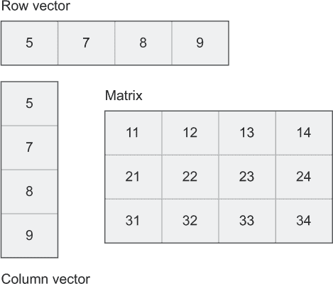
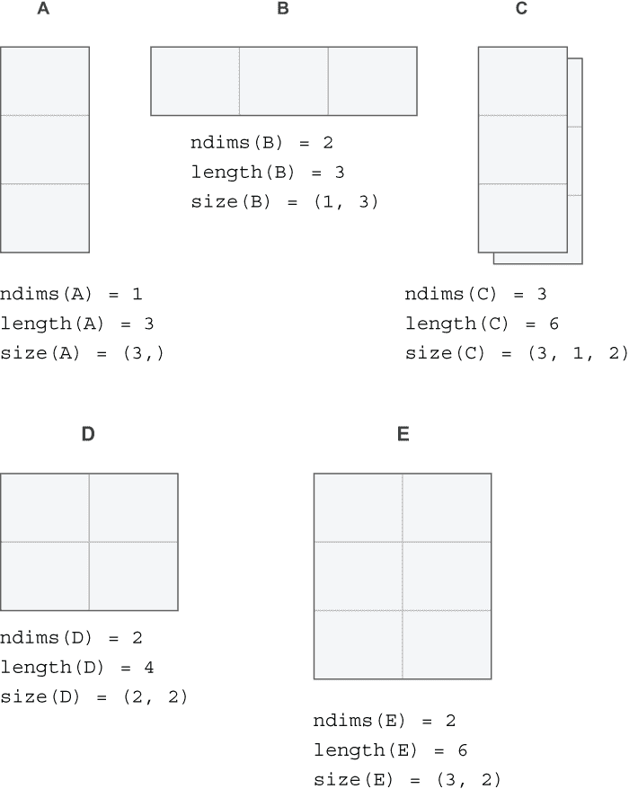
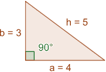
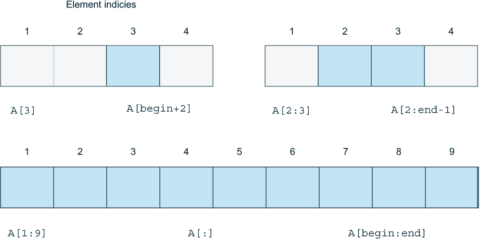
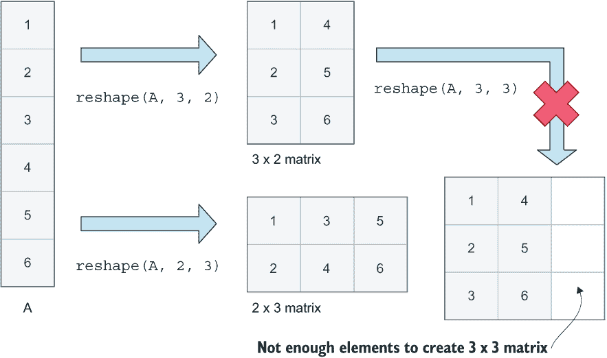
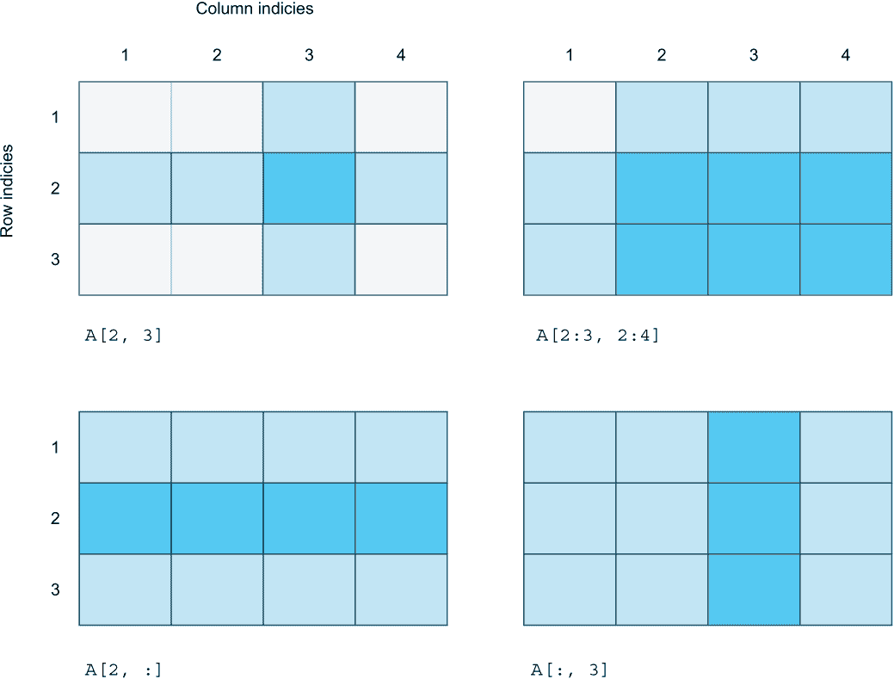
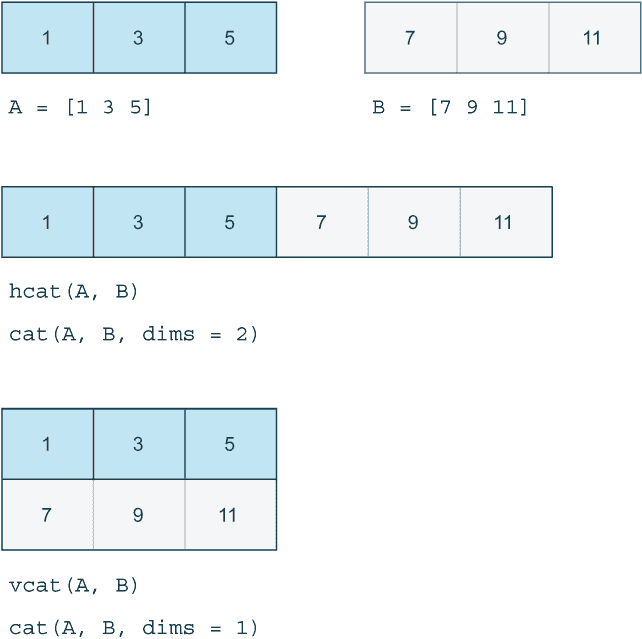
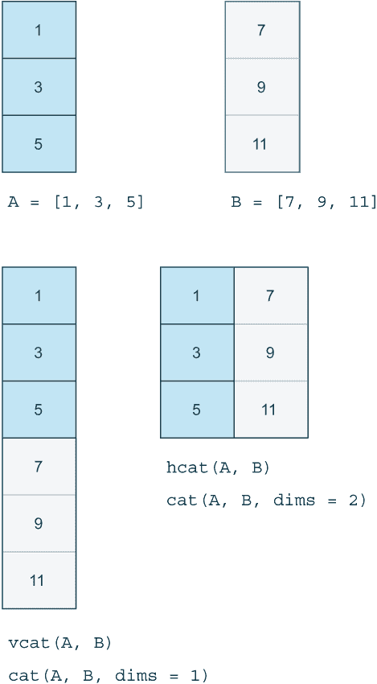
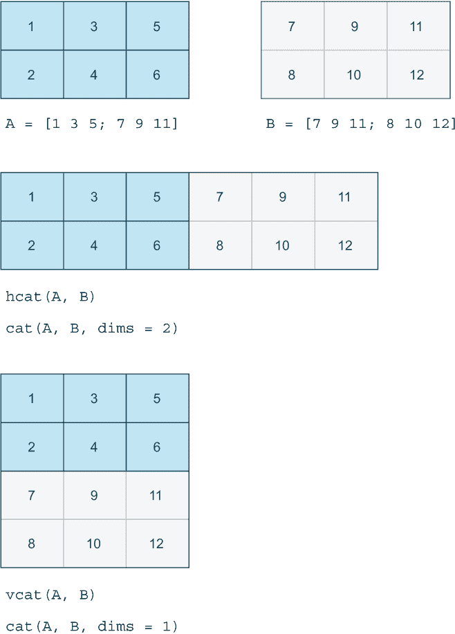

# 14 处理向量和矩阵

本章涵盖

+   在矩阵中处理数字并执行计算

+   数组的切片和切块

+   沿不同维度连接数组以形成更大的数组

在第四章中，你探索了一维数组（称为向量）的基本操作，如 push!。在本章中，你将更多地关注处理多维数组，如矩阵。

你可以用矩阵和向量做什么？它们可以组合起来解决大量问题。例如，在几何解释中使用向量很常见；在这种情况下，它们代表空间中的点。你可以使用矩阵来移动和旋转这些点。

矩阵甚至可以用来解决数学方程，并且在机器学习中非常受欢迎。矩阵可以用来表示图像。矩阵中的每个元素都可以代表单个像素的颜色。这些主题每个都值得有自己的章节或书籍，所以在本章中，我将只涵盖与向量和矩阵一起工作的基本知识。

## 14.1 数学中的向量和矩阵

矩阵或向量不仅仅是一个数字的愚蠢容器。例如，在数学中，集合、元组和向量可能都看起来像数字列表，因此看起来很相似。但你可以*做*的事情是不同的。

向量和矩阵的研究是数学领域线性代数的一部分。在线性代数中，单个值如 1、4 和 8 被称为*标量*。而一行或一列中的多个值是*向量*，表格是*矩阵*，如果数据按 3D 数组排列，它可能被称为*立方体*。向量可以进一步分为列向量和行向量（图 14.1）。



图 14.1 不同维度的数组

## 14.2 从行和列构造矩阵

矩阵可以通过指定堆叠在一起的多个行或依次排列的列来构造。当从行向量构造矩阵时，你用分号;;分隔每一行；注意你不用逗号分隔单个元素。如果你已经忘记了这一点，那么请回顾第四章中关于行向量和列向量的讨论：

```
julia> table = [2  6 12;
                3  4 12;
                6  2 12;
                12 1 12]
4×3 Matrix{Int64}:
  2  6  12
  3  4  12
  6  2  12
 12  1  12
```

要从多个列创建一个矩阵，你可以分别定义每一列，然后将它们组合成一个矩阵：

```
julia> x1 = [2, 3, 6, 12]
julia> x2 = [6, 4, 2, 1]
julia> x3 = [12, 12, 12, 12]
julia> table = [x1 x2 x3]
4×3 Matrix{Int64}:
  2  6  12
  3  4  12
  6  2  12
 12  1  12
```

这与内联编写列向量相同：

```
table = [[2, 3, 6, 12] [6, 4, 2, 1] [12, 12, 12, 12]]
```

注意 Julia 如何提供结果的 Array 类型摘要，行 4×3 Matrix{Int64}。这告诉你 Julia 创建了一个有 4 行 3 列的数组，其中每个元素都是 Int64 类型。

你可以查询任意数组关于这些属性的信息：eltype 提供数组中每个元素的类型，ndims 提供维度数，size 提供每个维度上的组件（元素）数。通常，我们认为维度是长度、高度和深度，但在这个情况下，我通常会说行和列：

```
julia> eltype(table)    ❶
Int64

julia> size(table)      ❷
(4, 3)

julia> ndims(table)     ❸
2
```

❶ 数组中每个元素的类型

❷ 行和列的数量

❸ 维度的数量

图 14.2 通过显示不同形状的向量和矩阵来帮助阐明这些不同属性的含义。它们具有不同数量的行和列，以及不同的方向和维度。



图 14.2 不同形状数组的属性

## 14.3 数组的尺寸、长度和范数

如果你来自其他编程语言，可能会很容易混淆这些数组概念：

+   size—数组的维度

+   length—数组中元素的总数

+   norm—向量的模

已创建一个 4 行 3 列的表格，总共包含 12 个元素：

```
julia> length(table)
12
```

范数函数比较难以理解。为了解释它，我将使用一个包含元素 3 和 4 的小向量：

```
julia> using LinearAlgebra

julia> norm([3, 4])
5.0
```

观察一个直角三角形将帮助你可视化范数的操作。你可以将向量的元素视为三角形中的边 *a* 和 *b*（图 14.3）。范数提供了最长边的长度，即 *斜边*。



图 14.3 一个边长为 a, b, 和 h 的直角三角形

*勾股定理*揭示了直角三角形中所有边之间的关系。你可以将范数视为应用勾股定理来确定 *斜边* 的长度：

5² = 3² + 4²

## 14.4 切片和切块数组

Julia 对选择不同维度数组的切片提供了很好的支持。这种灵活性来源于当你使用方括号 [] 访问元素或向其赋值时，会调用 setindex!和 getindex 函数。我现在将探讨这种切片是如何工作的（表 14.1）。

表 14.1 元素访问与 Julia 函数调用的关系

| 语法糖 | 转换为 | 描述 |
| --- | --- | --- |
| xs[i] | getindex(xs, i) | 在索引 i 处获取元素 |
| xs[i,j] | getindex(xs, i, j) | 在第 i 行和第 j 列获取元素 |
| xs[i] = 42 | setindex!(xs, 42, i) | 在索引 i 处设置元素 |
| xs[i,j] = 42 | setindex!(xs, 42, i, j) | 在第 i 行和第 j 列设置元素 |

我将首先简单地查看一维数组上的单个元素访问。图 14.1 说明了如何在单维数组中选择一个或多个元素。虽然该图显示了行向量的选择，但相同的原理也适用于列向量。

你可以在方括号内使用 begin 和 end 来引用向量中的一行或一列的第一个或最后一个元素。在 Julia 中，数组的第一个元素默认索引为 1。然而，在 Julia 中可以创建具有任何起始索引的数组，这使得 begin 关键字非常有用（见图 14.4）。



图 14.4 以不同方式切片一维数组 **A**

注意到有多种方式可以访问相同的元素。例如，如果你有一个数组 A，那么 A[3] 和 A[begin+2] 就会表示相同的元素。

对于包含四个元素的数组，如前两个示例，A[4] 和 A[end] 指的是相同的元素。同样，A[3] 和 A[end-1] 获取的是同一个数组元素。你可以在 Julia REPL 中尝试这些概念：

```
julia> A = collect('A':'F')
6-element Vector{Char}:
 'A'
 'B'
 'C'
 'D'
 'E'
 'F'

julia> A[begin+1]
'B': ASCII/Unicode U+0042

julia> A[end-1]
'E': ASCII/Unicode U+0045

julia> A[2:5]
4-element Vector{Char}:
 'B'
 'C'
 'D'
 'E'

julia> A[begin+1:end-1]
4-element Vector{Char}:
 'B'
 'C'
 'D'
 'E'
```

如果你不在乎特定的索引，只想获取所有元素，你可以写 A[:]。这与只写 A 有什么不同？所有切片操作都返回数据的副本。这个例子将有助于澄清：

```
julia> A = [8, 1, 2, 7];

julia> B = A[:];

julia> B[2] = 42
42

julia> B
4-element Vector{Int64}:
  8
 42
  2
  7

julia> A
4-element Vector{Int64}:
 8
 1
 2
 7
```

你看到 B 的第二个元素被更改了，但 A 的第二个元素没有变化吗？如果你写的是 B = A 而不是 B = A[:]，A 的第二个元素也会被更改，因为 A 和 B 会指向完全相同的数组对象。

但如果你想在不需要复制的情况下选择数组的切片呢？尤其是在处理大量数据时，频繁地在某些紧密的内循环中复制数千个元素可能会严重影响性能。在这些情况下，你可以在数组的子部分中创建一个所谓的“视图”。这些切片不是数组元素的副本，而是那些元素本身。你可以通过使用 @view 宏将切片转换为视图：

```
julia> B = @view A[3:end]
2-element view(::Vector{Int64}, 3:4) with eltype Int64:
 2
 7

julia> B[2] = 1331
1331

julia> A
4-element Vector{Int64}:
    8
    1
    2
 1331
```

最后的结果显示，更改 B 的第二个元素导致 A 的第四个元素也被更改。

许多这些示例应该与你之前章节中处理的一维数组相关。当你处理多维数组的切片，如矩阵时，情况会更有趣。

让我们创建一个二维矩阵 A 来进行实验，使用 Julia 的 reshape 函数。reshape 函数接受一个 AbstractArray 作为输入。让我解释下一个代码示例：范围 1:12 被用作输入。所有范围都是 AbstractArray 的子类型，因此 Julia 将范围视为一个包含 12 个元素的二维数组。reshape 函数将这些 12 个元素重新排列成一个 3 行 4 列的矩阵，称为 3×4 矩阵。

```
julia> A = reshape(1:12, 3, 4)
3×4 reshape(::UnitRange{Int64}, 3, 4) with eltype Int64:
 1  4  7  10
 2  5  8  11
 3  6  9  12
```

我将演示如何以不同的方式切片矩阵，但首先我会给出一些关于如何思考切片的建议，这样你就可以理解演示了。

重要提示：矩阵的形状是指它有多少行和列。因此，在 Julia 中，改变行和列数量的函数被称为 reshape。请注意，矩阵的长度不能通过 reshape 来改变。你可以将包含六个元素的数组 A 调整为 3 × 2 或 2 × 3 的矩阵，但你*不能*将其调整为 3 × 3 的矩阵，因为那样会包含九个元素（见图 14.5）。



图 14.5 一个数组可以被重塑为具有相同元素数量的矩阵。交叉表示你不能将包含六个元素的数组重塑为包含九个元素的数组。

我喜欢用集合交集操作 ∩ 来思考数组切片。因此，A[2, 3] 可以读作以下内容：*给我所有第 2 行和第 3 列元素的交集*。

图 14.6 提供了这个想法的可视化。阴影方块代表你选择的行和列，而深色阴影的方块代表这些行和列选择之间的交集。



图 14.6 二维数组的切片。

这种概念化使得理解选择 A[2:3, 2:4] 更容易。你可以这样读它：*给我所有第 2 行到第 3 行和第 2 列到第 4 列元素的交集*。

按照这个逻辑，很明显如何在矩阵中选择整个行或列。你可以在 REPL 中进行实验：

```
julia> A[1, 2]
4

julia> A[3, 4]
12
julia> A[:, 4]
3-element Vector{Int64}:
 10
 11
 12

julia> A[2, :]
4-element Vector{Int64}:
  2
  5
  8
 11
```

值得注意的是，即使是多维数组也可以被视为一维的：

```
julia> A[1]
1

julia> A[4]
4
```

## 14.5 矩阵和向量的组合

数据并不总是以你想要进行矩阵操作的方式和形式出现。你可能拥有 *n* 个向量，但实际上你希望有一个具有 *n* 列的矩阵。

幸运的是，Julia 有许多用于连接矩阵的函数。这个第一个例子展示了如何使用 hcat 或 vcat（图 14.7）水平或垂直地连接两个行向量。



图 14.7 行向量的水平垂直连接。

猫函数允许你指定沿着哪个维度进行连接。当你处理高维数组时，这很有用。你可以使用列向量执行类似操作（图 14.8）。



图 14.8 列向量的水平垂直连接。

同样的原则适用于矩阵的组合；你可以沿着任何维度进行连接。水平连接和垂直连接有自己的函数，hcat 和 vcat，因为它们被频繁使用（图 14.9）。



图 14.9 矩阵的水平垂直连接。

这些连接函数可以接受任意数量的参数；你不仅限于两个：

```
julia> x = [1, 2, 3]
3-element Vector{Int64}:
 1
 2
 3

julia> y = [8, 6, 4]
3-element Vector{Int64}:
 8
 6
 4

julia> hcat(x, y, x, y)
3×4 Matrix{Int64}:
 1  8  1  8
 2  6  2  6
 3  4  3  4

julia> hcat(x, 2y, 2x, 3y)
3×4 Matrix{Int64}:
 1  16  2  24
 2  12  4  18
 3   8  6  12
```

## 14.6 创建矩阵

当处理矩阵时，你经常需要特殊类型的矩阵。创建只包含零或一的矩阵如此常见，以至于有专门的函数来做这件事：

```
julia> zeros(Int8, 2, 3)
2×3 Matrix{Int8}:
 0  0  0
 0  0  0

julia> ones(2, 3)
2×3 Matrix{Float64}:
 1.0  1.0  1.0
 1.0  1.0  1.0
```

注意，你可以选择性地指定每个元素想要的数据类型作为第一个参数。如果你没有指定类型，那么它将默认为 Float64。

创建一整个随机数数组也是常见的做法。例如，在深度学习中，经常使用具有随机值的大矩阵。你经常会使用随机值来创建测试数据：

```
julia> rand(UInt8, 2, 2)
2×2 Matrix{UInt8}:
 0x8e  0x61
 0xcf  0x0d
```

有时候你只想用一个特定的值填充整个矩阵：

```
julia> fill(12, 3, 3)
3×3 Matrix{Int64}:
 12  12  12
 12  12  12
 12  12  12
```

向量和矩阵是巨大的主题，如果我们有更多时间，我会介绍向量和矩阵的几何解释。有哪些可能的用途？你可以用一个矩阵表示火箭的方向，用向量表示其位置。你可以使用矩阵在坐标系中旋转或移动火箭。对于矩阵处理的深入讨论，Bogumił Kamin´ski 的《Julia for Data Analysis》（Manning，2022）是一本极好的资源。

## 摘要

+   数组可以用来定义列向量、行向量和矩阵。

+   矩阵是可以通过多种方式构建的二维度数组。最常见的是将其定义为一系列行，但也可以将矩阵定义为一系列列。

+   数组具有 ndims、size 和 length 等属性。这些描述了数组的维度数、每个维度上的元素数量以及数组中的总元素数。

+   可以通过指定范围来切片数组，这也适用于矩阵。你可以为行和列指定范围，以切割出子矩阵。

+   切片是数据的副本。如果你不希望切片是副本，而是直接引用原始数组中的数据，那么你可以使用@view 宏创建一个切片视图。

+   可以使用 hcat 和 vcat 在水平和垂直方向上组合矩阵和向量。对于更高维度的数组，你可以使用 cat 并指定要连接的维度作为参数。

+   可以使用 rand、fill、ones 和 zeros 等函数快速创建矩阵。
