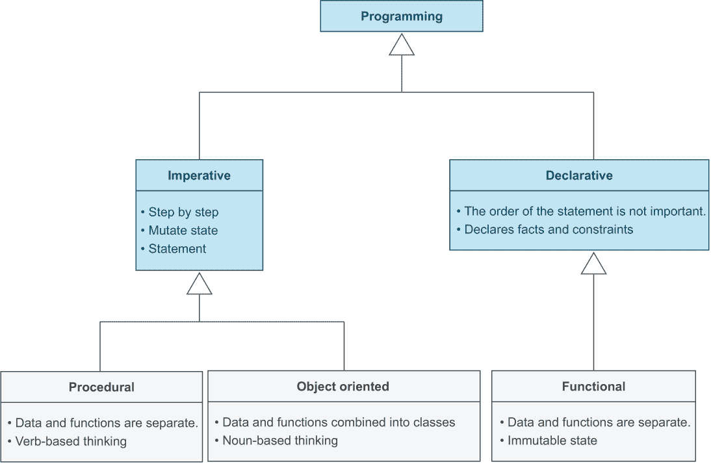
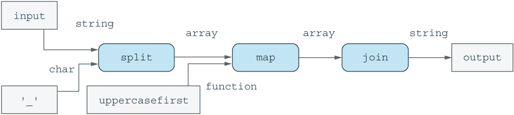
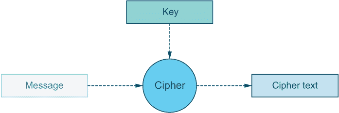
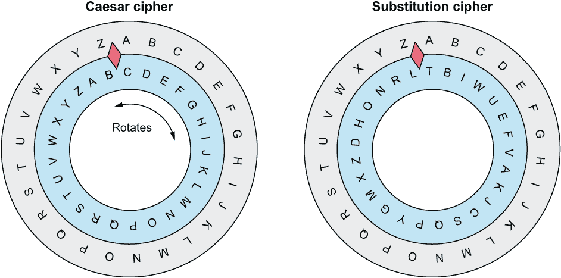

# 15 Julia 中的函数式编程

本章涵盖

+   为什么在 Julia 中理解函数式编程很重要

+   函数式编程与面向对象程序设计之间的区别

+   高阶函数的实际应用

+   使用函数链提高代码的可读性

+   开发密码管理服务

Julia 是一种多范式编程语言，但在 Julia 中，函数式编程风格比你在可能熟悉的其他主流语言（如 Python、Ruby、Java 或 C++）中更为常见。因此，了解函数式编程的原则对于成为一名优秀的 Julia 开发者来说是自然而然的。

函数式编程并不总是解决每个问题的最佳方法。在本章中，你将学习以面向对象和函数式风格构建密码管理服务，让你能够探索不同编程风格（范式）的优缺点。在构建更大的代码示例之前，你将查看函数式编程的核心构建块，如高阶函数、闭包、函数链和组合。

## 15.1 函数式编程与面向对象编程有何不同？

让我们从高层次的角度来看一下函数式编程是什么以及为什么它在 Julia 编程书中被涵盖。讨论函数式编程的第一个问题是，没有单一的明确定义。在本章中，我将使用我认为是实用主义的方法。图 15.1 展示了函数式编程如何与其他编程范式相结合。



图 15.1 不同编程范式及其相互关系图

我想在图 15.1 中强调的最重要的一点是，**过程式**编程和**函数式**编程**不是**同一回事。用一大堆函数编写代码而不是使用面向对象的方法并不能自动使你的代码成为函数式。这种技术已经在 C、Fortran 和 Pascal 等语言中使用了很长时间，称为过程式编程。

相反，函数式编程通常涉及各种不同的实践和方法：

+   将函数作为**一等对象**处理，这意味着你可以传递函数并将它们存储为常规数据

+   支持高阶函数，即接受函数作为参数的函数

+   在迭代集合时使用 map、filter 和 reduce 而不是 for 循环来对它们执行不同的操作

+   优先选择**闭包**或**lambda**而不是具有方法的对象来管理状态

函数式编程提供了许多不同的方法来组合函数，并在函数级别模块化你的代码。

## 15.2 如何以及为什么你应该学会以函数式的方式思考

在函数式编程中，我们试图避免修改（改变）输入数据，这使得推理代码中数据流变得更容易。函数接受输入并将这些输入转换成输出，这允许您将程序视为数据流过的复杂管道。

以下列表使用第十一章中的 camel_case 函数来说明这个概念，这是一个多个函数调用的嵌套。每个调用都为下一个函数提供输入。

列表 15.1 将蛇形命名法转换为驼峰命名法

```
"Turns hello_to_you into HelloToYou"
function camel_case(input::AbstractString)
    join(map(uppercasefirst, split(input, '_')))
end
```

我们可以使用数据流图来可视化函数之间数据流动的方式。数据流图中的圆形框代表数据转换，箭头标注了沿着它们流动的数据类型。例如，字符串和字符数据流入 split，然后字符串数组从 split 流出并进入 map。

命令式编程风格，如面向对象编程，通常使得对数据流的这种分析变得非常困难，因为函数或方法会改变它们的输入。与其思考数据流如何被转换，不如将这个过程概念化为对象相互发送消息以改变它们的状态。

## 15.3 避免使用函数链进行深度嵌套调用

在构建展示函数式编程优缺点的大型代码示例之前，我希望您更好地掌握一些您可用的基本构建块。上一节中的 camel_case 函数以相当函数式的方式实现，但阅读起来并不容易，因为它深度嵌套。您最终得到的并不像图 15.2 中的整洁管道。



图 15.2 camel_case 函数的数据流

然而，使用 Julia 的管道操作符 |> 可以构建类似该图的东西。它允许您将一个函数的输出传递到另一个函数中。以下是一个完整的示例，我将在之后对其进行分解。

列表 15.2 通过函数链实现驼峰命名法

```
splitter(dlm) = str -> split(str, dlm)
mapper(fn) = xs -> map(fn, xs)

function camel_case(input::AbstractString)
    input |> splitter('_') |> mapper(uppercasefirst) |> join
end
```

在 REPL 中，您可以试验分隔符和映射器函数的工作方式：

```
julia> f = splitter('_')
#13 (generic function with 1 method)

julia> words = f("hello_how_are_you")
4-element Vector{SubString{String}}:
 "hello"
 "how"
 "are"
 "you"

julia> g = mapper(uppercasefirst)
#15 (generic function with 1 method)

julia> g(words)
4-element Vector{String}:
 "Hello"
 "How"
 "Are"
 "You"
```

要理解列表 15.2，您需要了解 -> 和 |> 操作符。-> 操作符用于在 Julia 中定义所谓的 *匿名函数*。

### 15.3.1 理解匿名函数和闭包

匿名函数是没有名称的函数。您可以使用 -> 操作符创建一行匿名函数。如果没有匿名函数，您将需要编写如以下列表所示的分隔符和映射器。

列表 15.3 没有匿名函数的分隔符和映射器

```
"Create a function which splits on `dlm` character"
function splitter(dlm)
    function f(str)
        split(str, dlm)
    end
    return f       ❶
end

"Create a function applying function `fn` on all its input"
function mapper(fn)
    function g(xs)
        map(fn, xs)
    end
    return g       ❷
end
```

❶ 返回值不是必需的；这只是添加了强调 f 被返回。

❷ 这个返回值也不是必需的，但最后表达式仍然被返回。

示例表明，返回的函数的名字并不重要。对于拆分器和映射器的用户来说，这些函数在内部被命名为 f 和 g 并不重要。因此，当名字不重要时，可以使用匿名函数。你可以从第四章中处理度数和正弦的代码示例中取一个，使其更整洁，如下所示。

列表 15.4 使用匿名函数简化代码

```
degsin(deg) = sin(deg2rad(deg))         ❶
map(degsin, 0:15:90)                    ❶

map(deg->sin(deg2rad(deg)), 0:15:90)    ❷

map(0:15:90) do deg                     ❸
   rads = deg2rad(deg)                  ❸
   sin(rads)                            ❸
end                                     ❸
```

❶ 命名函数变体

❷ 单行变体

❸ 多行变体

如果你无法将匿名函数放入单行中，那么 -> 操作符就不实用了。在这些情况下，你可以使用列表 15.4 结尾所示 do-end 形式。

拆分器和映射器返回的 f 和 g 函数被称为闭包。一个 *闭包* 是一个捕获了一些外部状态（不是作为参数提供的）的函数。f 函数只接受一个字符串 str 作为参数。用于拆分字符串 str 的分隔符 dlm 是从其包围的作用域中捕获的。在这种情况下，拆分器函数定义定义了作用域 f 内部。

g 函数只接受要处理的数据集合 xs。应用于 xs 中每个元素的函数 fn 是从由映射器函数定义的作用域中捕获的。

闭包不需要命名。列表 15.2 中的拆分器和映射器函数返回匿名函数。这些匿名函数也是闭包，因为它们从它们的作用域中捕获变量。事实上，认为闭包只是 *匿名函数* 的一个花哨术语是一种相当常见的误解。考虑到匿名函数经常被用来定义闭包，这种误解并不令人惊讶。

### 15.3.2 使用管道操作符 |>

Julia 管道语法用于将接受单个参数作为输入的函数链接在一起。这允许你将如 f(g(x)) 这样的调用重写为 x |> g |> f。

这个事实有助于解释为什么你需要创建拆分器（splitter）和映射器（mapper）函数。正常的拆分（split）和映射（map）函数需要多个输入，因此不能与管道操作符 |> 一起使用。拆分器和映射器返回的函数（闭包）可以在管道中使用：

```
julia> f = splitter('_');

julia> g = mapper(uppercasefirst);

julia> "hi_there_world" |> f
3-element Vector{SubString{String}}:
 "hi"
 "there"
 "world"

julia> "hi_there_world" |> f |> g
3-element Vector{String}:
 "Hi"
 "There"
 "World"

julia> "hi_there_world" |> f |> g |> join
"HiThereWorld"
```

下一个重要的函数概念，*部分应用*，是通过简单地提出以下问题而得到的：为什么你需要使用 splitter 和 mapper 的名字？难道你不能直接将它们命名为 split 和 map 吗？

### 15.3.3 使用部分应用方便地产生新函数

在计算机科学中，*部分函数应用*指的是将一定数量的参数固定到函数中，从而产生另一个接受较少参数的函数的过程。这种部分应用的定义可能听起来很复杂，但通过一个实际例子，你会发现它比听起来容易得多。

如果你导入了 split 和 map 函数，你可以为它们添加只接受单个参数的新方法，因此你可以定义 camel_case 函数的一个稍微更优雅的版本，如下所示。

列表 15.5 使用部分应用实现驼峰式命名

```
import Base: split, map                    ❶

split(dlm::Char) = s -> split(s, dlm)      ❷
map(fn::Function) = xs -> map(fn, xs)      ❸

function camel_case(s)
    s |> split('_') |> map(uppercasefirst) |> join
end
```

❶ 允许我们扩展`split`和`map`函数

❷ 修复`split`函数的分隔符参数`dlm`

❸ 修复`map`函数的映射函数`fn`

实质上，您允许`split`函数的用户*固定*`dlm`参数。新的`split`函数作为固定的`dlm`值返回。同样的原则适用于`map`。将特定参数固定到函数的过程是部分函数应用。

由于这种能力非常实用，Julia 标准库中的许多函数都进行了扩展，方法接受所有必需参数的子集，而不是返回接受其余参数的函数。让我通过 Base 模块（始终加载的内置 Julia 模块）的一些内置函数来澄清：

```
julia> images = ["bear.jpg", "truck.png", "car.jpg", "duck.png"];

julia> findfirst(img->img == "truck.png", images)
2

julia> findfirst(==("truck.png"), images)
2

julia> filter(img->endswith(img, ".png"), images)
2-element Vector{String}:
 "truck.png"
 "duck.png"

julia> filter(endswith(".png"), images)
2-element Vector{String}:
 "truck.png"
 "duck.png"
```

您可以亲自验证，当`endswith`函数只提供一个参数时，它会调用一个返回函数的方法：

```
julia> ispng = endswith(".png")

julia> ispng isa Function
true

julia> ispng("truck.png")
true

julia> ispng("car.jpg")
false
```

这些是一些混合匹配函数的巧妙示例，这是函数式程序员所做的大量工作的一部分。

## 15.4 实现凯撒密码和替换密码

我承诺将演示如何以面向对象和函数式风格构建密码加密服务。在我这样做之前，我需要解释您如何使用密码来加密和解密密码。

*密码*是一种算法，它接受称为*消息*的输入，并使用一个密钥加密消息，生成称为*密文*的内容。当您可以使用相同的密钥进行加密和解密时，这被称为*对称*加密（图 15.3）。



图 15.3 使用密钥进行对称加密

我将演示实现两种不同的密码：凯撒密码和替换密码（图 15.4）。通过制作两种密码，我将向您展示如何配置密码保管服务以使用不同的密码。使密码可交换需要创建抽象，这提供了一个比较使用面向对象原则和函数式编程原则构建抽象的机会。



图 15.4 凯撒密码的内圈盘可以旋转。替换密码的内圈盘是固定的，但字母表的顺序将是随机的。

每个密码算法都是基于在外圈盘上查找输入消息中的字母。接下来，您将查看内圈盘上的相应字母，以确定它在密文中应该翻译成什么。

在凯撒密码中，您可以看到字母 A 将翻译成 C，而 B 将翻译成 D，依此类推。凯撒密码的内圈和外圈盘都是字母表。密码*密钥*是您旋转内圈盘（顺时针移动两个字母）的量。

当罗马将军们互相发送秘密信息时，每位将军都必须知道这个秘密密钥，才能知道内部拨盘旋转了多少。如果敌人得知这个秘密，他们就能解密任何截获的信息。

代换密码更复杂，因为内部拨盘本身是秘密密钥。你不需要旋转拨盘，而是完全替换它。为了两个当事人能够互相发送秘密信息，他们需要安装相同的内部拨盘。我们将代换密码描述为两个字母表之间的映射。外部拨盘上的字母形成一个字母表，它映射到内部拨盘上的字母；这被称为*代换字母表*。

我将首先展示两种密码的简单实现，然后再展示一个不灵活的密码保管服务，该服务与单个密码硬编码在一起。下一步是展示如何修改密码和密码保管服务，以便可以更换用于加密和解密密码的密码。在第一种方法中，我将展示如何使用面向对象的设计来实现这个目标，然后我将演示一种功能性的方法。

### 15.4.1 实现凯撒密码

在列表 15.6 中，我演示了实现凯撒密码。旋转的字母数量通过 shift 参数传递，ch 是要加密或解密的字符。对于 caesar_encrypt 和 caesar_decrypt，你需要检查输入字符 ch 是否实际上在字母表中。这确保了特殊符号和空白字符不会被加密或解密。

列表 15.6 凯撒密码加密和解密

```
# count number of letters in the English alphabet
const n = length('A':'Z')

function caesar_encrypt(ch::Char, shift::Integer)
    if ch in 'A':'Z'                        ❶
        'A' + mod((ch - 'A') + shift, n)    ❷
    else
        ch                                  ❸
    end
end
function caesar_decrypt(ch::Char, shift::Integer)
    if ch in 'A':'Z'
        'A' + mod((ch - 'A') - shift, n)
    else
        ch
    end
end
```

❶ 忽略不在字母表中的字符。

❷ 使用 mod 在字母表末尾时产生环绕。

❸ 字符不在字母表中，所以返回值不变。

在图 15.4 中，你会注意到我们得到了一个环绕效果。字母表末尾的字母，如 Y 和 Z，映射到字母表开头的 A 和 B。这就是为什么你不能只是给每个字母加上一个 Shift，ch + shift。模函数（取模运算符）让你的数字工作得像你在 12 小时模拟时钟上看到的那样：

```
julia> mod(1, 12)
1

julia> mod(9, 12)
9

julia> mod(13, 12)   ❶
1

julia> mod(21, 12)   ❶
9

julia> mod(17, 12)   ❶
 5
```

❶ 输入大于 12，所以它环绕。

在这个例子中，我将 ch - 'A'输入到 mod 中，这样我就可以将字母转换成 0 到 25 的值。这使得计算环绕值更容易。之后，我需要将 0 到 25 的数字转换成字母。幸运的是，Julia 在数字和字母之间的数学运算已经设置为以可预测的方式为你完成这项工作，如下一个 REPL 会话所示：

```
julia> 'A' + 1
'B': ASCII/Unicode U+0042

julia> 'A' + 4
'E': ASCII/Unicode U+0045

julia> ch = 'Z'; n = 26; shift = 2         ❶
2

julia> 'A' + mod((ch - 'A') + shift, n)    ❷
 'B': ASCII/Unicode U+0042
```

❶ 你可以用分号分隔语句。

❷ Z 环绕成为 B。

你可能会注意到我正在使用与图 15.4 中相同的位移值。

现在你已经知道如何加密单个字符，但你是如何使用这些知识来加密和解密整个消息的呢？你可以使用 map 函数来加密一条消息，然后尝试在之后解密它，以确保你得到你输入的内容：

```
julia> message = "THE QUICK BROWN FOX JUMPS OVER THE LAZY DOG";

julia> shift = 2;

julia> cipher_text = map(ch -> caesar_encrypt(ch, shift), message)
"VJG SWKEM DTQYP HQZ LWORU QXGT VJG NCBA FQI"

julia> map(cipher_text) do ch
           caesar_decrypt(ch, shift)
       end
"THE QUICK BROWN FOX JUMPS OVER THE LAZY DOG"
```

注意我使用了 *do-end* 形式来调用解密，这样你可以比较代码的可读性。有时我发现 do-end 形式更容易阅读，即使只是处理一行代码。

### 15.4.2 实现替换密码

要创建替换密码，我需要在两个字母表之间创建一个映射。为此，我需要使用在 Random 模块中找到的 shuffle 函数。

注意以下代码中使用了 'A':'Z' 的范围来快速创建包含字母表中所有字母的字符串。将 collect 应用到此范围将给出一个字母数组，但在此情况下，我需要一个字符串，所以我使用 join。

shuffle 将随机重新排列数组中的元素。记住，range 是 AbstractArray 的子类型，这就是为什么你可以像处理常规数组一样对 range 进行 shuffle：

```
julia> using Random

julia> join('A':'Z')
"ABCDEFGHIJKLMNOPQRSTUVWXYZ"

julia> shuffle([1, 2, 3])
3-element Vector{Int64}:
 2
 3
 1

julia> shuffle(1:5)
5-element Vector{Int64}:
 1
 2
 5
 4
 3

julia> join(shuffle('A':'Z'))
"PKTAVEQDXGWJMBZOFSLICRUNYH"
```

这些函数提供了在两个字母表之间创建字典映射所需的工具。在创建字典时，通常需要键值对，但在以下代码中，键和值作为单独的数组创建，那么我如何从这些中创建一个字典呢？

```
julia> alphabet = join('A':'F')   ❶
"ABCDEF"

julia> substitute = join(shuffle('A':'F'))
"ACFBDE"
```

❶ 使用 A-F 的范围来缩短示例。

zip 函数解决了这个问题。zip 可以接受两个元素数组，并将它们转换成一个可迭代对象，当收集时提供一个成对的数组：

```
julia> collect(zip(alphabet, substitute))
6-element Vector{Tuple{Char, Char}}:
 ('A', 'A')
 ('B', 'C')
 ('C', 'F')
 ('D', 'B')
 ('E', 'D')
 ('F', 'E')
```

你可以将 zip 函数返回的可迭代对象传递给 Dict 构造函数。因为此可迭代对象在每次迭代时返回值对，所以我会使用 zip 返回的对象来创建一个字典：

```
julia> mapping = Dict(zip(alphabet, substitute))
Dict{Char, Char} with 6 entries:
  'C' => 'F'
  'D' => 'B'
  'A' => 'A'
  'E' => 'D'
  'F' => 'E'
  'B' => 'C'
```

这提供了可以用于替换密码加密函数的输入数据。

列表 15.7 基于字典查找的替换密码加密

```
function substitution_encrypt(ch::Char, mapping::Dict{Char, Char})
    get(mapping, char, char)
end
```

这种方法有一个明显的问题：解密需要反向查找。将映射视为等同于加密密钥是一个糟糕的解决方案。对于对称加密，最好使用相同的密钥进行加密和解密。因此，而不是使用字典进行查找，我将搜索一个成对的数组，如下所示。

列表 15.8 基于数组查找的替换密码加密

```
using Random

alphabet = join('A':'Z')
substitute = join(shuffle('A':'Z'))
mapping = collect(zip(alphabet, substitute))

function substitution_encrypt(ch::Char, mapping::Vector)
    i = findfirst(row->first(row) == ch, mapping)    ❶
    if isnothing(i)                                  ❷
       ch
    else
       mapping[i][2]                                 ❸
    end
end

function substitution_decrypt(ch::Char, mapping::Vector)
    i = findfirst(row->last(row) == ch, mapping)
    if isnothing(i)
       ch
    else
       mapping[i][1]
    end
end
```

❶ 找到第一个字符等于 ch 的索引。

❷ 如果字符不在映射中，则不返回任何内容。

❸ 返回映射行 i 的第二个字符。

解决方案与凯撒密码解决方案类似，即如果字符 ch 不在字母表中，则不需要执行任何加密或解密操作。它基于 findfirst 函数的线性搜索来查找你感兴趣键的元组索引。如果 row 是元组('B', 'Q')，那么 first(row)是'B'，而 last(row)是'Q'。在加密时，首先使用 first(row)作为查找键，然后在使用解密时使用 last(row)作为查找键。

你可能会问，*通过数组进行线性搜索难道不会比使用字典查找慢得多吗？* 不。对于这样短的简单值数组，线性搜索会更快。你至少需要 100 个条目，查找性能才会有明显差异。

## 15.5 创建一个与加密算法无关的服务

想象你有一个使用加密的服务，并希望使其更容易更换所使用的加密方式。在这里，我将提供一个玩具示例来传达使用密码存储服务的概念。它维护一个以登录名作为键、加密密码作为值的字典。

列表 15.9 密码存储服务

```
mutable struct Vault                                              ❶
   passwords::Dict{String, String}
   shift::Int64
end

function Vault(shift::Integer)
    emptydict = Dict{String, String}()                            ❷
    Vault(emptydict, shift)
end

function addlogin!(vault::Vault,
                   login::AbstractString,
                   password::AbstractString)
    vault.passwords[login] = map(password) do ch                  ❸
        encrypt(ch, vault.shift)
    end
end

function getpassword(vault::Vault, login::AbstractString)
    map(ch -> decrypt(ch, vault.shift), vault.passwords[login])   ❹
 end
```

❶ 保险库被设置为可变的，因为必须能够添加密码。

❷ 使用空密码字典进行初始化。

❸ 将加密密码添加到密码字典中。

❹ 查找登录名对应的密码。

虽然代码可以工作，但这种方法存在许多问题：

1.  它被硬编码为仅支持一种加密方案：使用凯撒密码。应该有选择任何加密方案的能力。

1.  该服务假设加密，解密是逐字符进行的。加密应该被泛化以处理整个字符串，因为加密不一定是字符替换。

## 15.6 使用面向对象编程构建加密服务

在代码列表 15.9 中，加密是硬编码的；你希望能够用不同的加密方式替换它。让我们看看如何实现这一点。

解决方案是一个对密码加密的抽象接口，因此密码服务的用户不需要了解每种加密类型的具体细节。列表 15.10 展示了对此问题的面向对象方法。首先，我将 Cipher 定义为一个抽象类型，它必须支持一系列函数。我将为这些函数中的每一个添加方法以支持我特定的加密。

列表 15.10 定义抽象密码接口

```
abstract type Cipher end

function encrypt(cipher::Cipher, char::Char)
    error("Implement encrypt(::", typeof(cipher), ", char)")
end

function decrypt(cipher::Cipher, char::Char)
    error("Implement decrypt(::", typeof(cipher), ", char)")
end

function encrypt(cipher::Cipher, message::AbstractString)
    map(ch -> encrypt(cipher, ch), message)
end
function decrypt(cipher::Cipher, ciphertext::AbstractString)
    map(ch -> decrypt(cipher, ch), ciphertext)
end
```

这种代码的设置方式使得实现加密和解密对于*消息字符串*和*密文字符串*是可选的。默认实现将使用单字符的加密和解密。然而，在你的代码中，如果你没有实现这些，当你尝试使用你的加密方式执行加密或解密时，你会得到一个错误信息。

你可能会注意到，我在这里指定接口的方法与第十二章中采取的方法略有不同。通常推荐的方法是定义函数并记录你的 API 用户应该实现的方法。在这里，我明确地提供了一个错误信息，说明了你需要做什么。了解这两种实践都是有用的。在这种情况下，我认为这更实用，因为处理字符串和处理单个字符的函数是相同的。首先，我将实现凯撒密码的 Cipher 接口。

列表 15.11 实现 Cipher 接口的凯撒密码

```
struct CaesarCipher <: Cipher
    shift::Int
end

const n = length('A':'Z')

function encrypt(cipher::CaesarCipher, ch::Char)
    if ch in 'A':'Z'
        'A' + mod((ch - 'A') + cipher.shift, n)
    else
        ch
    end
end

function decrypt(cipher::CaesarCipher, ch::Char)
    if ch in 'A':'Z'
        'A' + mod((ch - 'A') - cipher.shift, n)
    else
        ch
    end
end
```

这种新的凯撒密码实现几乎与之前的实现（列表 15.6）完全相同，只是在这次示例中，我从加密对象中获取偏移量，而不是直接获取。

列表 15.12 展示了面向对象的替换密码。它与原始实现（列表 15.8）相似，除了我将映射存储在 SubstitutionCipher 对象中，调用加密和解密时需要传递加密对象而不是映射。

列表 15.12 实现 Cipher 接口的替换密码

```
using Random

struct SubstitutionCipher <: Cipher
    mapping::Vector{Tuple{Char, Char}}                ❶

    function SubstitutionCipher(substitute)
        mapping = zip('A':'Z', collect(substitute))   ❷
        new(collect(mapping))                         ❸
    end
end

function encrypt(cipher::SubstitutionCipher, ch::Char)
    i = findfirst(row->first(row) == ch, cipher.mapping)
    if isnothing(i)
       ch
    else
       cipher.mapping[i][2]
    end
end

function decrypt(cipher::SubstitutionCipher, ch::Char)
    i = findfirst(row->last(row) == ch, cipher.mapping)
    if isnothing(i)
       ch
    else
       cipher.mapping[i][1]
    end
end
```

❶ 用于查找字符应该加密为什么

❷ 创建一个字符对列表。

❸ 创建一个 SubstitutionCipher 实例。

现在，你可以修改你的密码存储服务，使其指向一个抽象的加密算法，而不是具体的加密算法（列表 15.13）。这允许你用任何实现 Cipher 接口的具体加密算法来替换所使用的加密算法。

列表 15.13 通用密码算法密码存储服务

```
mutable struct Vault
    passwords::Dict{String, String}
    cipher::Cipher
end

function Vault(cipher::Cipher)
    Vault(Dict{String, String}(), cipher)
end

function addlogin!(vault::Vault, login::AbstractString,
➥ password::AbstractString)
    vault.passwords[login] = encrypt(vault.cipher, password)
end

function getpassword(vault::Vault, login::AbstractString)
    decrypt(vault.cipher, vault.passwords[login])
end
```

我现在可以用不同的加密算法尝试升级后的密码存储服务。我将首先使用凯撒密码来展示一个例子。我首先创建一个保险库来存储密码。保险库使用它将用于加密和解密存储在其内的密码的加密算法进行初始化。

接下来，我调用 addlogin! 来向保险库中添加密码。之后，我使用 getpassword 来确保我取出的密码与放入的密码相同：

```
julia> vault = Vault(CaesarCipher(23))
Vault(Dict{String,String}(), CaesarCipher(23))

julia> addlogin!(vault, "google", "BING")
"YFKD"

julia> addlogin!(vault, "amazon", "SECRET")
"PBZOBQ"

julia> getpassword(vault, "google")
"BING"

julia> getpassword(vault, "amazon")
"SECRET"
```

接下来，我将通过替换密码的例子进行展示。在这种情况下，我使用替换字母表初始化替换密码。你可以看到，字母 ABC 将被替换为 CQP：

```
julia> substitute = "CQPYXVFHRNZMWOITJSUBKLEGDA";
julia> cipher = SubstitutionCipher(substitute);
julia> vault = Vault(cipher);

julia> addlogin!(vault, "amazon", "SECRET")
"UXPSXB"

julia> addlogin!(vault, "apple", "JONAGOLD")
"NIOCFIMY"

julia> getpassword(vault, "amazon")
"SECRET"

julia> getpassword(vault, "apple")
"JONAGOLD"
```

## 15.7 使用函数式编程构建加密服务

首先展示如何使用面向对象的方法实现抽象的目的，是因为更多的程序员已经熟悉这种方法。在这种情况下，*面向对象*意味着我通过考虑类型层次和对象来解决问题。我将加密算法表示为一个对象，并定义了在加密对象上操作的方法。

使用函数式方法，我将致力于通过考虑函数（高阶函数和闭包）来解决问题。目的是让你了解两种不同的编程问题解决思路。要成为一名优秀的 Julia 程序员，你需要理解这两种思路。

### 15.7.1 定义功能凯撒密码

我将首先使用列表 15.5 中首次展示的部分应用技术来定义凯撒密码。这种方法允许扩展使用 caesar_encrypt 和 caesar_decrypt 函数（列表 15.6）开发的原始解决方案。

注意在列表 15.14 中，代码中不再有密码类型。没有表示凯撒密码的数据对象。相反，我正在向 caesar_encrypt 和 caesar_decrypt 添加新方法以允许部分应用，因此当只提供一个移位参数时，我将返回一个接受字符而不是加密文本中的字符的函数。

列表 15.14 带有函数风格的凯撒密码

```
const n = length('A':'Z')

# Original cipher functions
function caesar_encrypt(ch::Char, shift::Integer)
    if ch in 'A':'Z'
        'A' + mod((ch - 'A') + shift, n)
    else
        ch
    end
end

function caesar_decrypt(ch::Char, shift::Integer)
    caesar_encrypt(ch, -shift)                     ❶
end

# Implement a functional interface using partial application
function caesar_encrypt(shift::Integer)
    msg -> map(msg) do ch                          ❷
        caesar_encrypt(ch, shift)
    end
end

function caesar_decrypt(shift::Integer)
    msg -> map(msg) do ch                          ❷
        caesar_decrypt(ch, shift)
    end
end
```

❶ 避免实现几乎相同代码的技巧

❷ 返回捕获移位的闭包

让我们看看这些函数是如何使用的。我将首先使用 1 的移位值调用 caesar_encrypt。它返回一个用于加密的函数。然后，我将使用该函数加密文本字符串 "ABC"。创建和解密函数的类似模式也被使用：

```
julia> encrypt = caesar_encrypt(1)

julia> encrypt("ABC")
"BCD"

julia> decrypt = caesar_decrypt(1)

julia> decrypt("BCD")
"ABC"

julia> encrypt('A')            ❶
0-dimensional Array{Char, 0}:
'B'

julia> decrypt('B')            ❶
0-dimensional Array{Char, 0}:
'A'
```

❶ 这是因为 map 可以映射到单个字符。

这种解决方案的一个优点是，它很容易使用管道操作符 |> 连接结果：

```
julia> "HELLO" |> caesar_encrypt(2)
"JGNNQ"

julia> "HELLO" |> caesar_encrypt(2) |> caesar_decrypt(2)
"HELLO"
```

### 15.7.2 定义功能替换密码

为了制作替换密码，我将在列表 15.8 中编写的替换密码代码的基础上进行扩展。我将再次使用部分应用技术，向现有的 substitution_encrypt 和 substitution_decrypt（列表 15.15）添加两个方法。它们只接受映射作为参数，但返回加密或解密消息的加密函数。

列表 15.15 带有函数风格的替换密码

```
function substitution_encrypt(mapping::Vector)
    msg -> map(msg) do ch
        substitution_encrypt(ch, mapping)
    end
end

function substitution_decrypt(mapping::Vector)
    msg -> map(msg) do ch
        substitution_decrypt(ch, mapping)
    end
end
```

我将以类似凯撒密码的方式使用替换密码。主要区别在于，我使用映射而不是移位作为密码密钥：

```
julia> alphabet = join('A':'Z');

julia> substitute = join(shuffle('A':'Z'));

julia> mapping = collect(zip(alphabet, substitute))

julia> "HELLO" |> substitution_encrypt(mapping)
"NEPPR"

julia> "HELLO" |> substitution_encrypt(mapping) |>
➥ substitution_decrypt(mapping)
"HELLO"
```

现在，您已经知道了基于功能设计原则制作密码保管库的各个部分。

### 15.7.3 实现功能密码保管服务

现在让我们将所有这些放在一起，创建一个使用加密和解密函数来允许存储和检索登录和密码的密码保管库。有多种实现方式。在列表 15.16 中，我将故意做得过分，以与面向对象解决方案形成强烈对比。

列表 15.16 过度功能风格的密码保管服务

```
function makevault(encrypt::Function, decrypt::Function)
    passwords = Dict{String, String}()

    function addlogin(login::AbstractString, password::AbstractString)
        passwords[login] = encrypt(password)
    end

    function getpassword(login::AbstractString)
       decrypt(passwords[login])
    end

    addlogin, getpassword
end
```

让我们看看使用此实现定义基于凯撒密码的密码保管库的示例。保险库通过调用 caesar_encrypt 和 caesar_decrypt 分别初始化为两个函数对象：

```
julia> addlogin, getpasswd = makevault(
                               caesar_encrypt(2),
                               caesar_decrypt(2));

julia> addlogin("google", "SECRET")
"UGETGV"

julia> addlogin("amazon", "QWERTY")
"SYGTVA"

julia> getpasswd("google")
"SECRET"

julia> getpasswd("amazon")
"QWERTY"
```

使用替换密码时，需要设置更多的映射向量。在其他所有方面，密码保管库的设置方式与凯撒密码相同：

```
julia> using Random

julia> alphabet = join('A':'Z')
"ABCDEFGHIJKLMNOPQRSTUVWXYZ"

julia> substitute = join(shuffle('A':'Z'))
"TQRBVPMHNFUESGZOLIDXCAWYJK"

julia> mapping = collect(zip(alphabet, substitute));

julia> addlogin, getpasswd = makevault(
                   substitution_encrypt(mapping),
                   substitution_decrypt(mapping));

julia> addlogin("google", "SECRET")
"DVRIVX"

julia> addlogin("amazon", "QWERTY")
"LWVIXJ"

julia> getpasswd("google")
"SECRET"

julia> getpasswd("amazon")
"QWERTY"
```

现在是时候退后几步，反思一下为什么你想要以示例中所示的方式设计闭包了。目标是与面向对象的情况相同：向加密提供通用接口，这样你就可以在不更改密码管理实现的情况下更改所使用的加密方式。

我通过返回加密和解密函数来实现这一点，这些函数在其函数签名中不暴露任何实现细节。**函数签名**指的是函数接受的参数、它们的顺序和类型。凯撒密码和替换密码产生具有相同签名的加密和解密函数。这就是为什么它们可以互换使用。

我试图使每个展示的解决方案尽可能不同，以更清楚地说明函数式编程和面向对象编程之间的差异。有时夸张可以有助于传达观点。然而，对于实际解决方案，你应该始终尝试使用良好的品味，并在面向对象和函数式方法之间找到一个合理的平衡。

在制作密码管理解决方案的情况下，我认为面向对象的方法更优越，而将蛇形命名法转换为驼峰命名法与函数式方法配合得非常好。为什么会有这种差异？当你的问题可以简化为某种数据转换时，函数式编程工作得非常好。相反，当你处理本质上具有状态的东西，比如密码管理服务时，面向对象的方法更自然，因为面向对象编程的全部都是修改状态。

## 摘要

+   功能性和过程式编程通常被认为是可以互换的，但它们并不相同。在函数式编程中，函数是一等对象，可以用高阶函数传递和处理。

+   以功能为导向的代码更容易分析和调试，因为它形成了一个更清晰的数据流。

+   可以通过使用函数链操作符 |> 解决难以阅读的函数调用嵌套。

+   **匿名函数**是没有名称的函数。它们有助于简化内联闭包的创建。

+   可以使用 -> 操作符或 *do-end* 形式创建匿名函数。

+   **闭包**是一个捕获其封装作用域状态的函数；它是一个具有记忆的函数。闭包可以用来模拟具有状态的对象，促进部分应用，以及管理资源获取和释放（打开和关闭文件）。

+   **部分应用**是一种技术，当没有向函数提供所有参数时，你返回一个函数而不是一个结果。这简化了创建用于高阶函数（如 map、filter 和 reduce）的函数参数。

+   数组中的元素可以使用来自 Random 内置模块的 shuffle 函数随机打乱。许多加密算法需要随机打乱的输入，这也是测试排序函数输入的好方法。

+   在 Julia 中，结合函数式和面向对象的技术以获得最佳结果。不同的问题需要不同的方法。通过实践，你会培养出更好的直觉，知道何时一种方法比另一种方法更优。
