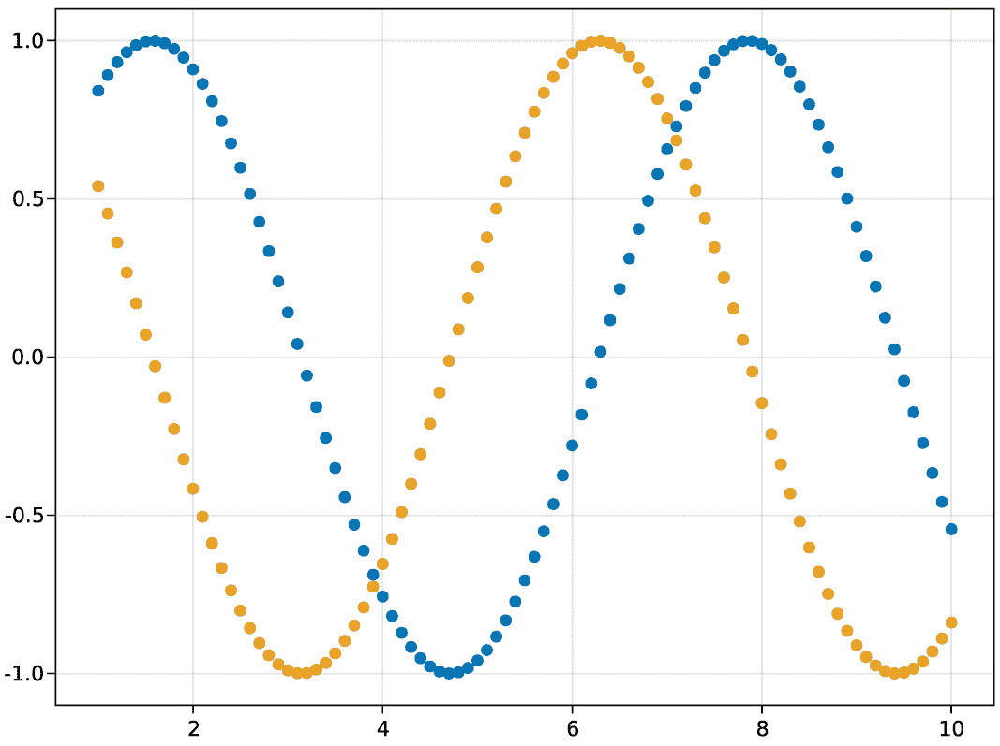
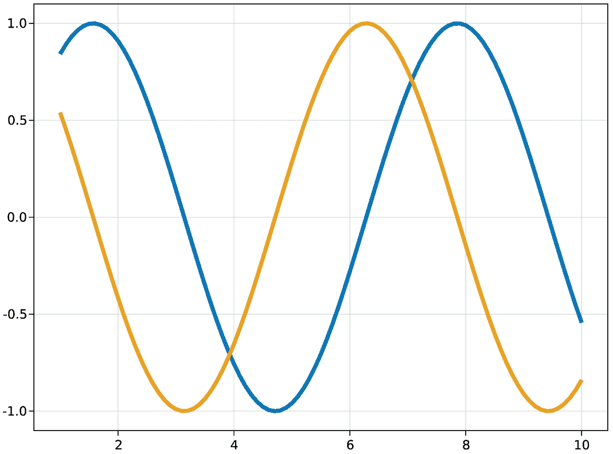
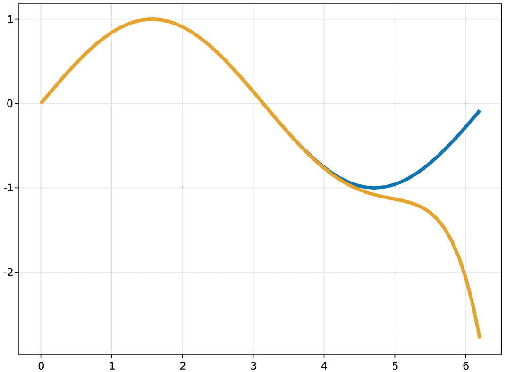

# 16 组织和模块化你的代码

本章涵盖

+   介绍环境概念以管理依赖项

+   使用环境添加和删除包依赖项

+   在不同环境中开发代码并在它们之间切换

+   创建 Julia 包并向其中添加依赖项

+   在包内组织代码

+   向包中添加测试

+   探索模块和包之间的关系

对于大规模软件开发，你不能像前几章所展示的那样随意地将代码直接放入 Julia 源代码文件中。相反，代码必须进行模块化和组织。组织良好的代码更容易理解和导航。在本章中，你将学习如何将之前工作的几何代码组织成一个 Julia 包。

包很有用，因为它们为你提供了一种捆绑相关代码、分发它和进行版本控制的方法。包可以在复杂的依赖树中依赖于其他包。现实世界系统是通过将多个包组合成一个更大的系统来构建的。如果你在一个大型组织中的广泛项目中工作，那么不同的团队可能会创建不同的包，然后这些包将被组合起来以创建完整的系统。

在本章中，我将教你如何在包内组织代码，向其他包添加和删除依赖项，并为你的包设置测试。请记住使用如 using Statistics 和 using LinearAlgebra 之类的语句加载模块。我还会解释*模块*概念与包概念之间的关系。

## 16.1 设置工作环境

在开发软件时，你可能希望使用相同包的不同版本。当你为工作场所编写 Julia 代码时，你可能希望使用每个包最稳定和经过充分测试的版本；这可能对你的业余项目不是那么关键，你可能更愿意使用带有最新酷炫功能的最新版本。

Julia 环境允许你在具有不同包版本的*工作*和*业余*环境设置之间切换。我使用*工作*这个词而不是*工作*，以避免与工作目录混淆，工作目录指的是你当前正在工作的目录。在本节中，你将查看以下内容：

+   创建环境

+   向环境中添加和删除不同版本的包

+   激活和在不同环境之间切换

+   理解模块和包之间的关系

创建环境只是创建一个目录来存放每个环境的事情。在这个例子中，我将启动 Julia 并进入 shell 模式，通过按;键，然后我将发出 Unix shell 命令来创建目录。使用图形文件管理器，如 Finder 或文件资源管理器，是完全有效的替代方法：

```
shell> mkdir job hobby   ❶

shell> ls                ❷
hobby    job
```

❶ 创建工作和业余目录。

❷ 列出当前目录内容。

记住，在 Julia REPL 中，你可以通过按 ] 进入包模式。在包模式下，你可以执行命令以激活不同的环境并向其添加包。当你切换到环境时，提示符将改变以显示你所在的环境。例如，如果你在 job 环境中，提示符将看起来像 (job) pkg>。在这个例子中，我将激活 job 环境，因此所有后续命令都将修改 job 环境：

```
(@v1.7) pkg> activate job

(job) pkg>
```

我将向这个环境添加一些包依赖。为了演示目的，添加哪些 Julia 包并不重要，但我选择使用 CairoMakie ([`makie.juliaplots.org`](https://makie.juliaplots.org)) 绘图包和链接 ElectronDisplay ([`github.com/queryverse/ElectronDisplay.jl`](https://github.com/queryverse/ElectronDisplay.jl)) 包来在窗口中显示图表。如果你使用 Visual Studio Code，你不需要 ElectronDisplay 包，因为它已经可以显示任何 Julia 图表。

注意，CairoMakie 是 Makie 相关 Julia 绘图包集合的一部分，称为 Makie。所有 Makie 包为用户提供相同的数据类型和函数，唯一的区别是生成的图形类型。CairoMakie 提供了创建高质量 2D 向量图的能力，而 GLMakie 则允许创建交互式 3D 图表。

假设你喜欢在你的业余项目中使用 CairoMakie 的最新版本，但你的雇主比较保守。因此，你必须在工作中使用版本 0.5.10：

```
(job) pkg> add CairoMakie@0.5.10                          ❶
   Updating registry at `~/.julia/registries/General.toml`
   Resolving package versions...
  [13f3f980] + CairoMakie v0.5.10
    Updating `~/dev/job/Manifest.toml`

(job) pkg> add ElectronDisplay                            ❷
   Resolving package versions...
    Updating `~/dev/job/Project.toml`
  [d872a56f] + ElectronDisplay v1.0.1
    Updating `~/dev/job/Manifest.toml`

(job) pkg> status                                         ❸
      Status `~/dev/job/Project.toml`
  [13f3f980] CairoMakie v0.5.10
  [d872a56f] ElectronDisplay v1.0.1
```

❶ 将 CairoMakie 版本 0.5.10 添加到工作环境中。

❷ 添加 ElectronDisplay 的最新版本。

❸ 检查添加到这个环境中的包。

当你运行添加包的命令时，你会看到比这里显示的更多信息。我编辑掉了大部分内容，因为它可能会填满几页，但我保留了最重要的信息。

当调用 add ElectronDisplay 时，你会被告知 ~/dev/job/Project.toml 文件已被修改。这是什么文件？我的工作环境位于 ~/dev/job 目录下。如果你当前活跃的环境中没有 Project.toml 文件，那么 Julia 会为你创建一个，以存储你添加到环境中的包信息。

ElectronDisplay v1.0.1 行会告诉你安装了哪个版本的 ElectronDisplay。那是在我写这本书时的 2022 年的最新版本。

注意到添加 CairoMakie 的命令略有不同。我在包名后附加了 @0.5.10，以告知 Julia 的包管理器，我想要版本 0.5.10，而不是 CairoMakie 的当前最新版本。当切换到业余环境时，我将使用最新版本：

```
(work) pkg> activate hobby
  Activating new project at `~/dev/hobby`

(hobby) pkg> add CairoMakie ElectronDisplay
   Resolving package versions...
    Updating `~/dev/hobby/Project.toml`
  [13f3f980] + CairoMakie v0.7.5
  [d872a56f] + ElectronDisplay v1.0.1
    Updating `~/dev/hobby/Manifest.toml`

(hobby) pkg> status
      Status `~/dev/hobby/Project.toml`
  [13f3f980] CairoMakie v0.7.5
  [d872a56f] ElectronDisplay v1.0.1
```

在业余环境中，我使用了略有不同的添加命令。我列出了所有我想添加的包，这样我就可以一次性完成。之后，Julia 通知我已安装了 CairoMakie v0.7.5 包。

你始终可以使用 status 命令来获取当前活动环境中已安装的包的概览。该命令读取 Project.toml 中存储的信息。这些信息用于在本地包仓库~/.julia/packages 中定位正确的包：

```
shell> ls hobby
Manifest.toml    Project.toml

shell> cat hobby/Project.toml
[deps]
CairoMakie = "13f3f980-e62b-5c42-98c6-ff1f3baf88f0"
ElectronDisplay = "d872a56f-244b-5cc9-b574-2017b5b909a8"
```

以 13f3f980 和 d872a56f 开头的长字符串和数字分别是每个包的全局唯一标识符（UUID）。包名不必唯一。可能有几个开发者正在制作名为 CairoMakie 的包；因此，为了能够唯一地识别特定的包，它们每个都需要一个唯一的 UUID。因为目前没有其他名为 CairoMakie 的包，所以没有包名冲突。

如果存在另一个 CairoMakie 包会怎样？在这种情况下，需要使用以下命令添加包：

```
(hobby) pkg> add CairoMakie=13f3f980-e62b-5c42-98c6-ff1f3baf88f0
```

包系统自带帮助系统，因此你可以写? add 来获取所有不同添加包方式的全面概述。要删除包，请使用 rm 命令。你可以在添加包的同时检查 Project.toml 文件如何随着删除操作而改变。以下是一个添加和删除 Dates 包的示例：

```
(hobby) pkg> add Dates
   Resolving package versions...
    Updating `~/dev/hobby/Project.toml`
  [ade2ca70] + Dates

(hobby) pkg> status
      Status `~/dev/hobby/Project.toml`
  [13f3f980] CairoMakie v0.7.5
  [d872a56f] ElectronDisplay v1.0.1
  [ade2ca70] Dates

(hobby) pkg> rm Dates
    Updating `~/dev/hobby/Project.toml`
  [ade2ca70] - Dates

(hobby) pkg> status
      Status `~/dev/hobby/Project.toml`
  [13f3f980] CairoMakie v0.7.5
  [d872a56f] ElectronDisplay v1.0.1
```

### 16.1.1 在 REPL 中使用包

将包添加到你的活动环境中不会使该包提供的函数和类型在 Julia REPL 或你正在编码的 Julia 项目中可用。相反，它们在运行 using 或 import 语句之后才可用。Makie 有许多不同的绘图函数。我将展示如何使用两个函数：lines 和 scatter。除非你使用 VS Code，否则你需要在任何内容可见之前加载 ElectronDisplay 包。

我将使用 Makie 来绘制正弦和余弦曲线。为了实现这一点，我将生成许多*x*，*y*坐标，分别存储在 xs，ys1 和 ys2 中。

列表 16.1 使用 Makie 绘制正弦和余弦曲线

```
using ElectronDisplay    ❶
using CairoMakie         ❷

xs = 1:0.1:10            ❸
ys1 = map(sin, xs)
ys2 = map(cos, xs)

scatter(xs, ys1)
scatter!(xs, ys2)        ❹

current_figure()         ❺
```

❶ 创建窗口以显示绘图输出。

❷ 使 scatter，scatter!和 current_figure 可用。

❸ 使用步长为 0.1 创建从 1 到 10 的值。

❹ 通过添加余弦图来修改当前图形。

❺ 将当前图形发送到 electron 显示

当 Julia 使用 CairoMakie 进行评估时，它将在其当前环境中寻找名为 CairoMakie 的包。如果你的环境是 hobby，那么它将加载 Makie 的 v0.7.5 版本的代码。然而，如果你在 job 环境中评估此代码，将加载 v0.5.10 版本。如果你在 Julia REPL 中运行此代码，你应该得到一个包含两个虚线图的图形（图 16.1）。



图 16.1 Makie 的正弦和余弦函数散点图

这些图称为*散点图*。每个(x, y)坐标产生一个彩色点。如果你想连接每个坐标点的线条，你可以使用 lines 和 lines!函数，如下所示。

列表 16.2 使用平滑线条绘制正弦和余弦曲线

```
lines(xs,  ys1, linewidth=5)  ❶
lines!(xs, ys2, linewidth=5)  ❶

current_figure()
```

❶ 绘制厚度为 5 的线条

执行代码将给出图 16.2 所示的图表。有许多命名参数可以修改每个图表的外观。例如，linewidth=5 的命名参数使线条变粗。



图 16.2 正弦和余弦函数的 Makie 线性图

你可以访问官方 Makie 网站 ([`docs.makie.org/stable/`](https://docs.makie.org/stable/)) 了解更多关于使用 Makie 在 Julia 中进行绘图的信息。

### 16.1.2 模块与包的关系

我对包加载过程的描述并不完全准确。包定义了一个与包同名的模块。因此，当你写下 using Dates 时，你是在查找 Dates 包并加载其中定义的 Dates 模块。一旦你定义了自己的包和模块，这种区别就会变得非常清晰。

你可以将 Julia 包想象成一个包含源代码、资源以及元数据（如版本、名称和依赖项）的物理包。这些对于 Julia 的包加载机制很重要，但不是语言结构。就像在 Julia 中有用于定义函数或复合类型的关键字 function 和 struct 一样，也有用于定义模块的 module 关键字。

当函数允许你将代码块分组时，模块允许你将相关的函数和类型分组。模块还创建了一个 *命名空间*，就像函数一样。这意味着你可以在不同的函数中使用相同名称的变量，而它们不会相互干扰，因为每个函数形成一个独立的命名空间。以下列表中的体积函数不会相互干扰，因为它们位于两个不同的模块中：Cylinder 和 Cone。

列表 16.3 不同模块中具有相同名称的函数

```
module Cylinder
    volume(r,h) = π*r²*h
end

module Cone
    volume(r, h) = π*r²*h/3
end
```

你可以在 REPL 中评估这些模块，并像这样调用不同的体积函数：

```
julia> Cylinder.volume(2.5, 3)
58.90486225480862

julia> Cone.volume(2.5, 3)
19.634954084936208
```

然而，在本章中，你将专注于每个包定义一个模块。这是 Julia 中最实用的解决方案。

## 16.2 创建自己的包和模块

在接下来的几页中，我将通过从第二章和第四章中提取体积和三角函数，并将它们组织到存储在包中的模块 ToyGeometry 中，向你展示如何创建自己的包和模块。你可以从头开始手动构建包，但使用 Julia 包管理器为你生成脚手架会更方便。

在生成包并查看其结构后，我将向你展示如何向包中添加代码。然后，你将学习如何通过绘图功能扩展你的包，这样你可以更好地掌握如何处理包依赖项。

### 16.2.1 生成包

我从 ~/dev 目录开始，其中包含爱好和职业目录。当然，你可以按任何你想要的方式组织它们。我使用 shell 模式跳转到爱好目录，在那里我想创建我的 ToyGeometry 包。在包模式下使用 generate 命令来创建一个包：

```
shell> cd hobby/
~/dev/hobby

(hobby) pkg> generate ToyGeometry
  Generating  project ToyGeometry:
    ToyGeometry/Project.toml
    ToyGeometry/src/ToyGeometry.jl
```

创建包的更复杂的方法是使用 PkgTemplate 库，但 generate 是一个很好的入门方式，因为它创建了一个极简的包。如果你查看包的内容，你会看到它只包含两个文件：Project.toml 和 src/ToyGeometry.jl：

```
shell> tree ToyGeometry
ToyGeometry
├── Project.toml
└── src
    └── ToyGeometry.jl
```

你可能会惊讶地看到里面的 Project.toml 文件。这不是用来定义环境的吗？没错！实际上，一个 Julia 包就是一个环境。作为一个环境，Julia 包可以添加它所依赖的其他包。

注意：环境可以嵌套，但这没有实际意义。嵌套模块更有用，但在这本书中我不会介绍模块嵌套。

目前没有依赖项，所以 Project.toml 文件将只显示有关包的数据，例如其名称、唯一标识包的 UUID、包的作者以及当前包的版本：

```
shell> cat ToyGeometry/Project.toml
name = "ToyGeometry"
uuid = "bbcec4ee-a196-4f18-8a9a-486bb424b745"
authors = ["Erik Engheim <erik.engheim@mac.com>"]
version = "0.1.0"
```

让我们向 ToyGeometry 添加一个依赖包来展示添加依赖项的工作原理。我将添加两个包，Dates 和 Base64，这两个包存在于 Julia 标准库中（不需要从互联网下载）。由于我不想将这些依赖项添加到娱乐环境中，而是添加到 ToyGeometry 环境中，我首先必须切换活动环境：

```
(hobby) pkg> activate ToyGeometry/
  Activating project at `~/dev/hobby/ToyGeometry`

(ToyGeometry) pkg> add Dates Base64
   Resolving package versions...
    Updating `~/dev/hobby/ToyGeometry/Project.toml`
  [2a0f44e3] + Base64
  [ade2ca70] + Dates
    Updating `~/dev/hobby/ToyGeometry/Manifest.toml`
  [2a0f44e3] + Base64
  [ade2ca70] + Dates
  [de0858da] + Printf
  [4ec0a83e] + Unicode

(ToyGeometry) pkg> status
     Project ToyGeometry v0.1.0
      Status `~/dev/hobby/ToyGeometry/Project.toml`
  [2a0f44e3] Base64
  [ade2ca70] Dates
```

ToyGeometry 中的 Project.toml 文件现在将更新以显示包的依赖关系：

```
shell> cat ToyGeometry/Project.toml
name = "ToyGeometry"
uuid = "bbcec4ee-a196-4f18-8a9a-486bb424b745"
authors = ["Erik Engheim <erik.engheim@mac.com>"]
version = "0.1.0"

[deps]
Base64 = "2a0f44e3-6c83-55bd-87e4-b1978d98bd5f"
Dates = "ade2ca70-3891-5945-98fb-dc099432e06a"
```

我还将获得一个名为 Manifest.toml 的新文件，该文件存储有关 Dates 和 Base64 依赖的包的信息。例如，Dates 依赖于 Printf 包来格式化日期的文本字符串。此外，Printf 依赖于 Unicode 包：

```
shell> cat ToyGeometry/Manifest.toml
julia_version = "1.7.2"
manifest_format = "2.0"

[[deps.Base64]]
uuid = "2a0f44e3-6c83-55bd-87e4-b1978d98bd5f"

[[deps.Dates]]
deps = ["Printf"]
uuid = "ade2ca70-3891-5945-98fb-dc099432e06a"

[[deps.Printf]]
deps = ["Unicode"]
uuid = "de0858da-6303-5e67-8744-51eddeeeb8d7"

[[deps.Unicode]]
uuid = "4ec0a83e-493e-50e2-b9ac-8f72acf5a8f5"
```

对于不属于 Julia 标准库的包，条目将更复杂。以下是从工作环境中的 Colors 包的 Manifest.toml 文件中的一个条目：

```
[[deps.Colors]]
deps = ["ColorTypes", "FixedPointNumbers", "Reexport"]
git-tree-sha1 = "417b0ed7b8b838aa6ca0a87aadf1bb9eb111ce40"
uuid = "5ae59095-9a9b-59fe-a467-6f913c188581"
version = "0.12.8"
```

你可以看到它不仅列出了 UUID，还列出了 Colors 的版本。你不需要知道 git-tree-sha1 字符串的含义，除了它有助于 Julia 在本地包仓库中定位正确的包以加载。

### 16.2.2 向你的包中添加代码

目前，这个包没有任何功能，所以让我们通过复制第二章和第四章中的体积和三角学代码来添加代码。我将首先创建两个文件，volume.jl 和 trig.jl，来存放这段代码：

```
shell> cd ToyGeometry/
~/dev/hobby/ToyGeometry

shell> touch src/volume.jl src/trig.jl

shell> tree .
.
├── Manifest.toml
├── Project.toml
└── src
    ├── ToyGeometry.jl
    ├── trig.jl
    └── volume.jl
```

将列表 16.4 中的代码添加到 src/volume.jl 中。

列表 16.4 ToyGeometry/src/volume.jl

```
"""
    sphere_volume(r)
Calculate the volume of a sphere with radius `r`
"""
function sphere_volume(r::Number)
    4π*r³/3
end

"""
    cylinder_volume(r, h)
Calculate the volume of a cylinder with radius `r`
and height `h`.
"""
function cylinder_volume(r::Number, h::Number)
    π*r²*h
end

"""
    cone_value(r, h)
Calculate the volume of a cone with radius `r`
and height `h`.
"""
function cone_value(r::Number, h::Number)
    π*r²*h/3
end
```

接下来，我将添加第四章中使用的泰勒级数来计算正弦值的函数；稍后我将添加一个余弦函数。这段代码将放入 src/trig.jl 文件中，如下所示。

列表 16.5 ToyGeometry/src/trig.jl

```
"""
    sine(x)
Calculate the sine of an angle `x` given in radians
"""
function sine(x::Number)
    n = 5
    total = 0
    for i in 0:n
        total += (-1)^i*x^(2i+1)/factorial(2i + 1)
    end
    total
end
```

ToyGeometry 包定义了一个名为 ToyGeometry 的模块。我希望我编写的所有函数都成为 ToyGeometry 模块的一部分。通过在模块定义内运行 include 函数，所有函数定义都会在 ToyGeometry 模块内进行评估，并成为其一部分。

列表 16.6 ToyGeometry/src/ToyGeometry.jl

```
module ToyGeometry

include("volume.jl")
include("trig.jl")

end # module
```

如果你像 C/C++ 开发者一样思考，你可能不会明显地理解 include 的作用，但实际上它非常简单。让我们做一个快速实验来演示。

首先创建一个名为 arithmetic.jl 的文件，并在其中写入 3 + 4。include 可以在任何地方调用，甚至是在函数定义内部：

```
julia> x = include("arithmetic.jl")
7

julia> function calc()
           include("arithmetic.jl")
       end

julia> calc()
7
```

你不必将代码拆分成多个文件并将它们添加到模块中，使用 include。你可以这样定义 ToyGeometry 模块。

列表 16.7 ToyGeometry/src/ToyGeometry.jl

```
module ToyGeometry

sphere_volume(r)      = 4π*r³/3
cylinder_volume(r, h) = π*r²*h
cone_value(r, h)      = π*r²*h/3

function sine(x)
    n = 5
    total = 0
    for i in 0:n
        total += (-1)^i*x^(2i+1)/factorial(2i + 1)
    end
    total
end

end # module
```

那为什么不用这种方式定义呢？将所有代码放入模块定义文件 ToyGeometry.jl 中并不适合扩展。随着你的包变大，将所有代码放在一个文件中变得不切实际。这就是为什么我将包的代码拆分成多个文件，并在模块定义中包含这些文件。

## 16.3 修改和开发包

如果你正在跟随，你现在有一个正确的包结构和定义；下一步是理解包开发过程。这是一个迭代过程，在这个过程中，你不断地测试你包的功能并添加新特性。

在你开发自己的包时，你可能想使用许多 Julia 包来帮助你开发工作，但这些包不应成为你包的依赖项。以下是我喜欢使用的、可以提高生产力的包：

+   OhMyREPL—在 Julia REPL 中提供语法高亮和历史匹配功能

+   Revise—监控加载到 REPL 中的代码更改，并使用这些更改更新 REPL

回到示例，我现在将切换到娱乐环境，因为我不想将这些包作为 ToyGeometry 的依赖项：

```
shell> pwd                            ❶
~/dev/hobby/ToyGeometry

(ToyGeometry) pkg> activate ..        ❷
  Activating project at `~/dev/hobby`
(hobby) pkg> add OhMyREPL Revise
   Resolving package versions...
    Updating `~/dev/hobby/Project.toml`
  [5fb14364] + OhMyREPL v0.5.12
  [295af30f] + Revise v3.3.3
    Updating `~/dev/hobby/Manifest.toml`
```

❶ 只需检查你目前的位置。

❷ 娱乐环境在上一个目录。

我现在可以将 OhMyREPL 和 Revise 加载到 REPL 中，但尝试加载 ToyGeometry 会失败。你能猜到为什么吗？

```
julia> using ToyGeometry
ERROR: ArgumentError: Package ToyGeometry not found in current path:
- Run `import Pkg; Pkg.add("ToyGeometry")` to install the ToyGeometry package.
```

在这种情况下，错误信息并不很有帮助。例如，Julia 从不会在当前文件系统路径中查找包。实际问题是，我没有将 ToyGeometry 添加到娱乐环境中。我目前工作的环境不知道我的自定义包。

我可以通过在包管理器中使用 add 命令来告知它包的信息。然而，使用 add 的问题在于它会捕获最新的包版本并将其冻结。通常，这是好事，因为你不希望第三方包突然改变而添加到你的工作环境中。但是，当你积极开发一个包时，你的需求与使用包时不同。你希望所有代码更改都可在你的工作环境中可用，而无需使用显式的更新命令来获取最新更改。因此，我将展示如何使用 dev 包命令。dev 命令需要你的包的目录路径：

```
shell> pwd
~/dev/hobby

shell> ls
Manifest.toml    Project.toml    ToyGeometry

(hobby) pkg> dev ./ToyGeometry
   Resolving package versions...
    Updating `~/dev/hobby/Project.toml`
  [bbcec4ee] + ToyGeometry v0.1.0 `ToyGeometry`
    Updating `~/dev/hobby/Manifest.toml`
  [bbcec4ee] + ToyGeometry v0.1.0 `ToyGeometry`
```

看看爱好环境的当前状态，你现在可以看到 OhMyREPL、Revise 和 ToyGeometry 都已经被添加：

```
(hobby) pkg> status
      Status `~/dev/hobby/Project.toml`
  [13f3f980] CairoMakie v0.7.5
  [d872a56f] ElectronDisplay v1.0.1
  [5fb14364] OhMyREPL v0.5.12
  [295af30f] Revise v3.3.3
  [bbcec4ee] ToyGeometry v0.1.0 `ToyGeometry`
```

现在当前工作环境知道 ToyGeometry 的位置，因此当你写 using ToyGeometry 时，它知道要加载哪些代码。记住，可能有多个名为 ToyGeometry 的包，所以你的环境需要明确告知应该加载哪个包：

```
julia> using ToyGeometry
[ Info: Precompiling ToyGeometry [bbcec4ee-a196-4f18-8a9a-486bb424b745]

julia> ToyGeometry.sphere_volume(4)
268.082573106329

julia> ToyGeometry.sine(π/2)             ❶
0.999999943741051

julia> sin(π/2)                          ❷
1.0

julia> sine(π/2)                         ❸
 ERROR: UndefVarError: sine not defined
```

❶ 调用你的自定义正弦函数。

❷ Julia 的内置正弦函数

❸ 尝试调用正弦函数而不指定模块名称

每次调用自定义正弦函数时都写 ToyGeometry.sine 是很尴尬的，但正如示例所示，如果你不使用模块名称前缀，Julia 目前不知道如何调用它。然而，正如你从其他包（如 CairoMakie）中看到的，你不需要使用模块名称前缀来调用绘图函数，如散点图和线条。你如何实现同样的效果？

使用导出语句的技巧是告诉 Julia 哪些函数和类型应该从模块中导出（公开）。在此过程中，我将添加一个余弦函数并将其也导出：

```
export sine, cosine    ❶

"""
    sine(x)
Calculate the sine of an angle `x` given in radians
"""
function sine(x::Number)
    n = 5
    total = 0
    for i in 0:n
        total += (-1)^i*x^(2i+1)/factorial(2i + 1)
    end
    total
end

function cosine(x::Number)
   n = 5
   mapreduce(+, 0:n) do i
        (-1)^i*x^(2i)/factorial(2i)
   end
end
```

❶ 将正弦和余弦函数设置为公开。

你可能会注意到，在余弦函数中，我用更优雅的 mapreduce 替换了笨拙的 for 循环，这在第四章中已经介绍过。mapreduce 是 map 和 reduce 两种高阶函数的组合。

你会注意到现在可以写正弦和余弦函数而不需要任何模块名称前缀。以下简单的测试显示，自定义函数的输出与内置函数相似：

```
julia> sine(π/2)
0.999999943741051

julia> sin(π/2)
1.0

julia> cosine(π)
-1.0018291040136216

julia> cos(π)
-1.0
```

Julia 如何突然能够知道正弦甚至余弦，而不需要重新加载任何包？这要归功于 Revise 的魔法。因为我是在加载 ToyGeometry 之前加载了 Revise，所以它会监控模块的更改，并将它们自动合并到 REPL 中。

你是否应该总是使用 Revise？有时你做的代码更改你不想立即反映在 REPL 中。只需使用常识即可。你甚至可以使用 Revise 对单个文件进行操作，通过调用 includet 而不是 include。

在编写代码时，你自然会犯错误。REPL 帮助你快速检查代码，以查看你是否得到了正确的结果。快速分析大量数据并发现问题的一种最佳方式是通过可视化数据。所以让我们绘制内置的正弦和自定义的正弦函数，看看你是否得到了相似的图形。在你的 REPL 中评估以下代码。

列表 16.8 比较内置的正弦与自定义的正弦

```
using ToyGeometry, CairoMakie, ElectronDisplay

xs = 0:0.1:2π
ys1 = map(sin, xs)
ys2 = map(sine, xs)

lines(xs,  ys1, linewidth=5)
lines!(xs, ys2, linewidth=5)

current_figure()
```

哎呀！它们并不相同。在大约 *x* 轴 4.5 处，你的自定义正弦函数明显失败。



图 16.3 Makie 散点图展示正弦和余弦函数，*n* = 5

幸运的是，多亏了 Revise，你可以修改显示 n = 5 的行。尝试不同的 n 值以查看图表如何变化。将 n 设置为 8 应该能解决你的问题。8 之所以有效，并没有什么神奇的理由，除了更高的值能提供更高的精度之外，这意味着性能和精度之间存在权衡。

## 16.4 解决关于模块的常见误解

如果你来自不同的编程语言，你可能会发现许多与环境、包和模块相关的概念让你感到困惑。例如，在 Java 世界中，*模块*被称为*包*，而 Julia 的*包*更接近于*JAR 文件*。^(1) 表 16.1 概述了在不同编程语言中描述模块、包和环境所使用的术语差异。

表 16.1 不同流行编程语言中包和模块术语使用的差异

| Julia | Java | C++ | Python |
| --- | --- | --- | --- |
| 模块 | 包 | 命名空间 | 模块 |
| 包 | JAR | DLL | 包 |
| 环境 | 环境 | 沙盒或容器 | 虚拟环境 |

另一个问题在于主流编程语言往往将诸如 public 之类的关键字置于要导出或公开的函数之前，如下面的列表所示。

列表 16.9 比较 Julia 与 Java 风格的函数导出方式

```
#### The Julia way ####
export sphere_volume

function sphere_volume(r::Number)
    4π*r³/3
end

#### A Java-style way of exporting ####
# IMPORTANT: This doesn't work in Julia!
public function sphere_volume(r::Number)
    4π*r³/3
end
```

虽然 Julia 的 include 函数可能看起来与 C/C++中的#include 相似，但你必须考虑到在 Julia 中 include 是一个常规函数调用，它返回一个结果。C/C++中的#include 根本不是一个函数调用，而是一种将包含文件的内容粘贴到包含语句的文件中的机制。

## 16.5 测试你的包

当你开发一个包时，你可以在 REPL 中快速测试函数。对于长期和大规模的开发，这还不够。你需要能够快速验证你几周或几个月前编写的代码仍然有效。在现实世界的软件开发中，你将在许多不同的文件中进行代码更改。跟踪所有受你代码编辑影响的函数可能很困难；因此，你需要设置一个广泛的测试集，以验证所有之前编写的代码仍然有效。

测试是一个更大的主题，所以在这本书中，我只会介绍一些非常基础的内容。你可以阅读以下来自我的*Erik Explores* Substack 的文章，以进一步探索这个主题：

+   “Organizing Tests in Julia” ([`erikexplores.substack.com/p/julia-test-organizing`](https://erikexplores.substack.com/p/julia-test-organizing))

+   “Julia Test Running: Best Practices” ([`erikexplores.substack.com/p/julia-testing-best-pratice`](https://erikexplores.substack.com/p/julia-testing-best-pratice))

Julia 中的测试可以从包管理器运行。它将尝试执行名为 test/runtests.jl 的文件。在示例中，我没有这个文件或测试目录，所以我将不得不创建这两个：

```
shell> pwd
~/dev

shell> cd hobby/ToyGeometry/
~/dev/hobby/ToyGeometry

shell> mkdir test

shell> touch test/runtests.jl test/trigtests.jl
```

Julia 使用*嵌套测试集*的概念，这意味着如果一个测试集包含的所有测试集都成功，则该测试集成功。Julia 的惯例是将所有测试集放入一个顶级测试集中。这就是我在 test/runtests.jl（列表 16.10）中将要展示的；然而，我将通过将测试分散到多个文件中并在顶级测试集中包含这些文件来遵循相同的策略。

列表 16.10 ToyGeometry/test/runtests.jl

```
using ToyGeometry
using Test

@testset "All tests" begin

include("trigtests.jl")

end
```

测试是与你的模块分开运行的，因此你需要使用 using 语句加载你正在测试的模块。要访问测试宏如@testset 和@test，需要导入 Test 包。这个包不在你的 ToyGeometry 环境中。将 Test 添加到这个环境中没有意义，因为它只会在测试时使用。

Julia 为这个问题提供了一个整洁的解决方案。你可以将测试目录视为它自己的环境，并且只在该环境中添加 Test：

```
shell> pwd                ❶
~/dev/hobby/ToyGeometry

(hobby) pkg> activate test
  Activating project at `~/dev/hobby/ToyGeometry/test

(test) pkg> add Test
   Resolving package versions...
    Updating `~/dev/hobby/ToyGeometry/test/Project.toml`
  [8dfed614] + Test
    Updating `~/dev/hobby/ToyGeometry/test/Manifest.toml`
```

❶ 显示你正在运行包命令的目录。

在尝试运行测试之前，你需要实际上将它们添加到你的代码中。我将通过向 test/trigtests.jl 文件添加测试来演示这一点，该文件包含与三角函数相关的测试。

每个实际测试都由@test 宏指定。由于浮点数难以完全相同，我将不会使用==来比较函数结果，而是使用≈，你可以在 Julia REPL 中通过写入\approx 并按 Tab 键来输入。

有时默认的≈容差太严格，你需要一个更宽松的相等定义。在这些情况下，使用 isapprox 函数来比较值。它接受一个命名参数 atol，你可以用它来指定你认为两个比较结果之间的差异可以接受的极限，如下所示。

列表 16.11 ToyGeometry/test/trigtests.jl

```
@testset "cosine tests" begin
    @test cosine(π) ≈ -1.0
    @test cosine(0) ≈ 1.0

    for x in 0:0.1:2π                                 ❶
        @test isapprox(cos(x), cosine(x), atol=0.05)  ❶
    end                                               ❶
end

@testset "sine tests" begin
    @test sine(0)   ≈ 0.0
    @test sine(π/2) ≈ 1.0

    for x in 0:0.1:2π
        @test isapprox(sin(x), sine(x), atol=0.05)
    end
end
```

❶ 测试范围在 0 到 2π之间，以 0.1 为增量时所有余弦值是否大致相等。

如果你尝试在测试环境中运行此测试，它将讽刺地不工作，因为 test 实际上并不知道 ToyGeometry 包。因此，你需要切换到 hobby 或 ToyGeometry 环境来运行测试：

```
(test) pkg> test ToyGeometry                               ❶
ERROR: The following package names could not be resolved:
 * ToyGeometry (not found in project or manifest)

(test) pkg> activate .
  Activating project at `~/dev/hobby/ToyGeometry`

(ToyGeometry) pkg> test ToyGeometry
     Testing ToyGeometry

Test Summary:  | Pass  Fail  Total
All tests      |  108    22    130
  cosine tests |   43    22     65
  sine tests   |   65           65
ERROR: LoadError: Some tests did not pass:
   108 passed, 22 failed, 0 errored, 0 broken
```

❶ 无法从测试环境进行测试

由于存在 for 循环，我能够在前面的列表中执行总共 130 个测试。余弦测试失败是因为我使用了 n = 5，这不足以使结果足够准确。因此，我将 n = 9 改为提高准确性。请注意，运行测试会产生大量的输出，我已经编辑掉了。

列表 16.12 在 trig.jl 中修改余弦函数

```
function cosine(x::Number)
   n = 9   # modified
   mapreduce(+, 0:n) do i
        (-1)^i*x^(2i)/factorial(2i)
   end
end
```

当我再次运行测试时，它们应该会通过：

```
(ToyGeometry) pkg> test
     Testing ToyGeometry
Test Summary: | Pass  Total
All tests     |  130    130
     Testing ToyGeometry tests passed
```

测试和环境的话题比我在这里能涵盖的更广泛。我们在本章中涵盖的内容为你提供了一个坚实的基础，你可以在此基础上进一步探索。以下是一些起点：

+   *pkgdocs.julialang.org*—这是 Pkg 模块的网站，它提供了包管理器的功能。

+   *docs.julialang.org*—这是官方 Julia 文档的网站。您在这里可以查找模块、包和环境的详细描述，包括测试。

## 摘要

+   环境就像是一个工作区，您可以在其中设置想要使用的包以及使用它们。

+   Julia 允许您维护配置为使用不同包及其不同版本的多个环境。

+   CairoMakie 是一个用于绘制 2D 向量图形的 Julia 包。它是 Makie 系列绘图包的一部分。

+   散点图和线条是 Makie 库中用于绘制函数的函数。

+   ElectronDisplay 是一个提供显示图形（如 Makie 的输出）窗口的包。它是 VS Code 编辑器中绘图的替代方案。

+   使用激活包命令在不同的环境之间切换。例如，当您想修改您正在开发的另一个包的依赖项时，可能会使用此命令。

+   要使模块在您的代码中可用，请使用添加包命令将其添加。

+   使用移除包命令移除程序中不再使用的模块的包。

+   使用状态命令检查已添加到环境中的包。您可以使用此命令检查您自定义的包有哪些依赖项。

+   在许多包具有相同名称的情况下，在将其添加到工作环境时，指定您感兴趣的包的 UUID。

+   使用生成包命令创建一个包。

+   Project.toml 显示您环境的直接依赖项，而 Manifest.toml 显示间接依赖项。

+   当添加您正在开发的本地包时，使用 dev 而不是 add。这确保了每次从该包加载模块时，都会包含最新的代码更改。

+   使用 Revise 包来监控加载到 Revise 后的包的代码更改。

+   使用 test <包名> 来运行包的测试。例如，test ToyGeometry 将运行 ToyGeometry 包的测试。

+   测试目录是其自己的环境，允许您仅将 Test 包作为依赖项添加到测试环境中。

***

^^(1.)Java 存档 (JAR) 是一种包文件格式，通常用于将 Java 类文件及其关联的元数据和资源（例如文本和图像）聚合到一个文件中以便分发。
