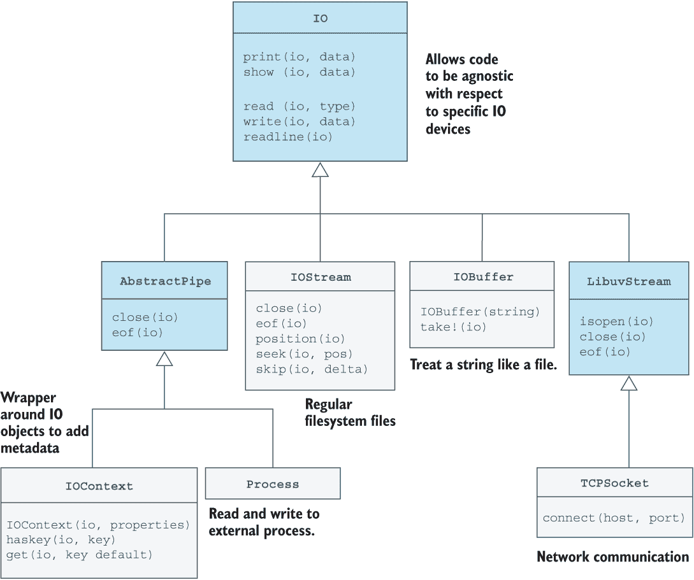
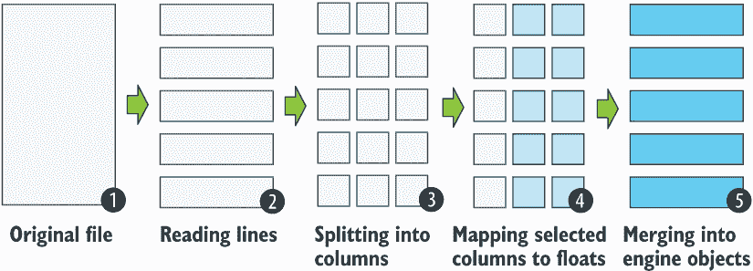

# 17 输入和输出

本章涵盖

+   理解 Julia 的 I/O 系统

+   使用最常用的文件读写函数

+   读写字符串、套接字和进程

+   在火箭示例中添加代码以从 CSV 文件中加载火箭引擎

真实程序需要能够从用户那里读取输入并输出结果。在本章中，你将学习关于 Julia 的 I/O 系统（输入和输出系统）。它为处理文件、网络通信、进程间通信以及与控制台（键盘和屏幕）的交互提供了一个抽象层。

Julia 在数据科学领域非常受欢迎，我们在那里大量处理以 CSV 文件（逗号分隔值）形式存在的输入数据。这就是为什么主要的代码示例将集中在解析包含火箭引擎数据的 CSV 文件上，以及将火箭引擎数据写入 CSV 文件。

## 17.1 介绍 Julia 的 I/O 系统

让我们鸟瞰 Julia 的 I/O 系统。它以抽象类型 IO 为中心。它有具体的子类型，如 IOStream、IOBuffer、Process 和 TCPSocket。每种类型都允许你从不同的 I/O 设备读取和写入数据，例如文件、文本缓冲区、正在运行的进程（你启动的程序）或网络连接。

从图 17.1 中的类型层次结构中，你可以看到 print、show、read、readline 和 write 等函数对所有 I/O 类型都是可用的。一些函数，如 eof 和 position，并不是所有 I/O 类型都可用。



图 17.1 显示不同子类型用途的 I/O 系统类型层次结构。浅灰色框表示具体类型。

不同的 I/O 对象以不同的方式打开，但一旦创建，你就可以在它们上面使用许多相同的函数。我将演示如何处理来自文件、字符串和进程的类似数据。所使用的数据将来自名为 rocket-engines.csv 的 CSV 文件，其内容如下：

```
name,company,mass,thrust,Isp
Curie,Rocket Lab,0.008,0.12,317
RS-25,Aerojet Rocketdyne,3.527,1860,366
Merlin 1D,SpaceX,0.47,845,282
Kestrel 2,SpaceX,0.052,31,317
RD-180,NPO Energomash,5.48,3830,311
Rutherford,Rocket Lab,0.035,25,311
```

我将打开文件，从中读取直到到达末尾，然后关闭它。在列表 17.1 中，我使用 readline 函数逐行读取，并使用 eof 检查我是否已到达文件的末尾。我使用 split 函数通过逗号作为分隔符将每一行拆分成多个单词。每一行读取的内容都打印到控制台。所有这些函数都在 Base 模块中，该模块始终被加载。

列表 17.1 通过逐行读取 CSV 文件来演示基本的 I/O 功能

```
io = open("rocket-engines.csv")
while !eof(io)
    line = readline(io)
    words = split(line, ',')
    println(join(words, '\t'))
end
close(io)
```

你可以以非常相似的方式处理文本字符串中的数据。我将通过创建一个包含 rocket-engines.csv 文件第一行的字符串，并查看如何使用不同的 I/O 函数来处理它来演示。我将使用 readuntil，它从 IO 对象中读取，直到遇到特定的字符或字符串。我将使用 position 来检查我在 IOStream 中有多少个字符，并定期使用 eof 来检查我是否已到达 I/O 对象的末尾：

```
julia> s = "name,company,mass,thrust,Isp";

julia> io = IOBuffer(s);

julia> readuntil(io, ',')
"name"

julia> position(io), eof(io)
(5, false)

julia> readuntil(io, ','), position(io), eof(io)
("company", 13, false)

julia> readuntil(io, ','), position(io), eof(io)
("mass", 18, false)

julia> readuntil(io, ','), position(io), eof(io)
("thrust", 25, false)

julia> readuntil(io, ','), position(io), eof(io)
("Isp", 28, true)
```

你可以在通过打开 rocket-engines.csv 文件获得的 I/O 对象上尝试执行相同的操作。记住，当你完成时调用 close(io)；否则，你可能会泄漏有限的操作系统资源。特别是在写入 I/O 对象时，关闭它是很重要的，否则你可能会丢失数据。

## 17.2 从进程读取数据

Python、Ruby 和 Perl 等脚本语言的部分受欢迎程度是因为它们是好的 *粘合语言*。粘合语言擅长连接现有软件组件，这些组件通常是用不同的语言编写的。

你将简要了解 Julia 作为粘合语言的能力。让我们假设 Julia 缺乏搜索文本文件的能力，而你想要利用 Unix grep 工具 1 来实现这个目的。首先，你通过按分号进入 shell 模式，只是为了演示你的 grep 命令将做什么：它找到包含文本 "Rocket Lab" 的行。通过按退格键，你回到 Julia 模式。接下来，你将打开一个连接到你所启动的 grep 进程（spawn）。注意使用反引号来引用你想要运行的 shell 命令：

```
shell> grep "Rocket Lab" rocket-engines.csv
Curie,Rocket Lab,0.008,0.12,317
Rutherford,Rocket Lab,0.035,25,311

julia> io = open(`grep "Rocket Lab" rocket-engines.csv`);

julia> readuntil(io, ',')
"Curie"

julia> readuntil(io, ',')
"Rocket Lab"

julia> readuntil(io, ',')
"0.008"

julia> position(io)
ERROR: MethodError: no method matching position(::Base.Process)

julia> close(io)
```

与 Perl 和 Ruby 等许多脚本语言不同，Julia 中的反引号不会立即运行 shell 命令。相反，它们导致创建一个名为 Cmd 的类型的命令对象。当你对一个命令对象调用 open 时，命令实际上会执行并启动一个进程。返回的 io 对象是 Process 类型，代表对运行进程输出的连接。这样，你可以几乎像读取文件一样读取进程（图 17.2）。


图 17.2 open 函数启动一个子进程。两个进程通过 open 函数返回的 I/O 对象表示的管道连接。

为什么调用位置函数时你会得到错误信息？因为没有任何方法附加到位置上，可以在 Process 对象上工作。只有对文件工作的 IOStream 对象才有流中的位置概念。

## 17.3 从套接字读取和写入

套接字代表网络连接。我将通过使用 Unix netcat 工具快速演示一个网络连接的例子。Netcat 是一个简单的工具，用于实验基于 TCP/IP-socket 的通信。2 你可以将 netcat 作为客户端或服务器运行。

注意，netcat 已经安装在 Linux 和 macOS 上。Windows 用户可以从 nmap.org/ncat 下载 nmap 工具作为替代品。每次我在文本中写 nc 命令时，在 Windows 上你应该写 ncat。

按照以下步骤操作：打开两个终端窗口。在第一个窗口中启动 Julia，在第二个窗口中启动 netcat 作为监听端口 1234 的服务器。只要你选择的端口号没有被占用，你几乎可以指定任何你喜欢的端口号。启动 netcat 后，输入行 "name,company,mass,thrust,Isp" 并按 Enter 键：

```
shell> nc -l 1234
name,company,mass,thrust,Isp
```

在 Julia 窗口中使用 connect 函数连接到在端口 1234 上运行的本地服务器。connect 函数将返回一个类型为 TCPSocket 的 I/O 对象：

```
julia> using Sockets

julia> sock = connect(1234)
TCPSocket(RawFD(23) open, 0 bytes waiting)

julia> readuntil(sock, ',')
"name"

julia> readuntil(sock, ','), isopen(sock)
("company", true)

julia> readline(sock)
"mass,thrust,Isp"
```

套接字通常是双向的，因此你可以向套接字写入消息，并在运行 netcat 的窗口中看到它们弹出：

```
julia> println(sock, "hello netcat")

julia> close(sock)
```

你在第二个窗口中看到了文本字符串"hello netcat"弹出吗？

通过这些简单的示例，我已证明你可以使用相同的函数，例如 read、readuntil、readline 和 println，对于每种 I/O 对象，无论它代表文本字符串、文件还是网络连接。

## 17.4 解析 CSV 文件

让我们构建一个更全面的代码示例。你将通过从重复的示例中添加从 CSV 文件加载火箭发动机定义的能力来增强你的火箭代码。为了练习你的 Julia 包制作技能，创建一个名为 ToyRockets 的 Julia 包来包含你的火箭代码。我已经创建了此包并将其放置在 GitHub 上，网址为 github.com/ordovician/ToyRockets.jl，因此你可以跟随操作。

ToyRockets 包是通过 Julia 包管理器中的 generate 命令创建的。接下来创建一个数据目录来存放 rocket-engines.csv 文件。将以下文件添加到 src 目录中：

+   *interfaces.jl*—包含抽象类型的定义，例如 Engine

+   *custom-engine.jl*—具体发动机类型的定义

+   *io.jl*—用于加载和保存火箭部件的函数集合

现在运行必要的命令来实现这一点，注意提示。当提示说(@v1.7) pkg>时，意味着你必须先按]键进入包模式。当提示说 shell>时，意味着你必须按;键进入 shell 模式：

```
(@v1.7) pkg> generate ToyRockets
    Generating  project ToyRockets:
    ToyRockets/Project.toml
    ToyRockets/src/ToyRockets.jl

shell> cd ToyRockets/
~/Development/ToyRockets

shell> mkdir data

shell> cd src
~/Development/ToyRockets/src

shell> touch interfaces.jl custom-engine.jl io.jl
```

如果你正确遵循了说明并将 rocket-engines.csv 文件放在 data/目录中，那么你的 ToyRockets 包应该看起来像这样：

```
ToyRockets/
├── Project.toml
├── data
│   └── rocket-engines.csv
└── src
    ├── ToyRockets.jl
    ├── custom-engine.jl
    ├── interfaces.jl
    └── io.jl
```

确保你将所有源代码文件包含在 ToyRockets.jl 文件（列表 17.2）中，该文件定义了你的包模块。

列表 17.2 src/ToyRockets.jl 文件

```
module ToyRockets

include("interfaces.jl")
include("custom-engine.jl")

include("io.jl")

end
```

接下来，你需要将 rocket-engines.csv 文件中的每一行转换为 CustomEngine 对象，因此首先你需要定义 Engine 类型。

列表 17.3 定义发动机类型

```
# interfaces.jl file
export Engine
abstract type Engine end

# custom-engine.jl file
export CustomEngine

struct CustomEngine <: Engine
    mass::Float64
    thrust::Float64
    Isp::Float64
end
```

在接下来的两个部分中，你将加载和保存火箭发动机数据。

### 17.4.1 加载火箭发动机数据

在我详细讲解并解释其不同部分的工作原理之前，你现在将查看最终代码（列表 17.4）。代码首先读取 CSV 文件中的所有行，每行代表一个火箭发动机。遍历每一行，解析它，并将其转换为 CustomEngine 对象，该对象被添加到包含从输入文件加载的所有发动机的字典 rocket_engines 中。

列表 17.4 包含将发动机对象加载到字典中的代码的 io.jl 文件

```
export load_engines

function load_engines(path::AbstractString)
    rocket_engines = Dict{String, Engine}()

    rows = readlines(path)
    for row in rows[2:end]
        cols = split(row, ',')

        if any(isempty, cols)
            continue
        end

        name, company = cols[1:2]
        mass, thrust, Isp = map(cols[3:end]) do col
            parse(Float64, col)
        end

        engine = CustomEngine(
                    mass * 1000,      ❶
                    Isp,
                    thrust * 1000)    ❷
        rocket_engines[name] = engine
    end

    rocket_engines
end
```

❶ 从吨到千克

❷ kN 到牛顿

load_engines 函数接受包含火箭发动机数据的 CSV 文件的路径，并将其解析为火箭发动机的字典。以下是如何使用它的一个示例：

```
julia> using Revise, ToyRockets

julia> pwd()
"~/Development/ToyRockets"

julia> engines = load_engines("data/rocket-engines.csv")
Dict{String, Engine} with 6 entries:
    "RD-180"     => CustomEngine(5480.0, 311.0, 3.83e6)
    "Kestrel 2"  => CustomEngine(52.0, 317.0, 31000.0)
    "Curie"      => CustomEngine(8.0, 317.0, 120.0)
    "Merlin 1D"  => CustomEngine(470.0, 282.0, 845000.0)
    "RS-25"      => CustomEngine(3527.0, 366.0, 1.86e6)
    "Rutherford" => CustomEngine(35.0, 311.0, 25000.0)

julia> engines["Curie"]
CustomEngine(8.0, 317.0, 120.0)
```

load_engines 函数遵循我处理数据时使用的相当标准的模式，这些模式被整洁地组织在类似于 CSV 文件的行中（见第五章）。在这里，你使用 readlines 来获取文件中的行，并使用 split 来获取每行的每一列（图 17.3）。



图 17.3 火箭发动机的文件被分成几个部分，经过转换，并在多个步骤中组合成多个火箭发动机。

为了更好地理解代码的工作原理，将源代码行的一部分复制并粘贴到 REPL 中，以查看输入数据是如何被处理的：

```
julia> path = "data/rocket-engines.csv"
"data/rocket-engines.csv"

julia> rows = readlines(path)
7-element Vector{String}:
    "name,company,mass,thrust,Isp"
    "Curie,Rocket Lab,0.008,0.12,317"
    "RS-25,Aerojet Rocketdyne,3.527,1860,366"
    "Merlin 1D,SpaceX,0.47,845,282"
    "Kestrel 2,SpaceX,0.052,31,317"
    "RD-180,NPO Energomash,5.48,3830,311"
    "Rutherford,Rocket Lab,0.035,25,311"
```

接下来，选择任意一行，将其拆分为列以验证解析是否按预期工作。偶尔，可能会有缺失的数据，所以请确保每个列都包含数据。你可以使用高阶函数 any(isempty, cols)，它将 isempty 应用到每个列上。如果 *任何* 列为空，它将返回 true：

```
julia> row = rows[2]
"Curie,Rocket Lab,0.008,0.12,317"

julia> cols = split(row, ',')
5-element Vector{SubString{String}}:
    "Curie"
    "Rocket Lab"
    "0.008"
    "0.12"
    "317"

julia> any(isempty, cols)
false
```

接下来，你将使用一种名为 *destructuring* 的 Julia 魔法，来提取发动机的名称和制造它的公司。使用 destructuring，你将多个变量放置在赋值运算符 = 的左侧。在右侧，你必须放置一个可迭代的集合，其元素数量至少与左侧的变量数量相同：

```
julia> name, company = cols[1:2]
2-element Vector{SubString{String}}:
    "Curie"
    "Rocket Lab"

julia> name
"Curie"

julia> company
"Rocket Lab"
```

cols[1:2] 给你一个包含两个元素的数组。Julia 会迭代这个数组，并将数组中的元素分配给 name 和 company。元组或字典同样适用。

下一个部分稍微复杂一些，因为你需要将最后三个元素 cols[3:end] 映射到浮点值，使用 parse(Float64, col) 函数。这会将质量、推力和 Isp 的文本表示转换为浮点值，你可以将这些值传递给 CustomEngine 构造函数来创建一个发动机对象：

```
julia> mass, thrust, Isp = map(cols[3:end]) do col
            parse(Float64, col)
        end
3-element Vector{Float64}:
    0.008
    0.12
    317.0

julia> engine = CustomEngine(
                        mass * 1000,
                        Isp,
                        thrust * 1000)
CustomEngine(8.0, 317.0, 120.0)
```

最后一步是将这个发动机存储在字典中，键为发动机名称。

### 17.4.2 保存火箭发动机数据

在这个阶段，你可以在你的 io.jl 文件中添加代码，以便将火箭发动机保存到文件中。默认情况下，文件是以读取模式打开的。如果你想写入它，你需要将一个 "w" 传递给 open 函数的 *write* 参数。在这段代码中，还有一些其他的新概念，你需要更详细地查看。

列表 17.5 带有添加 save_engines 代码的 io.jl 文件

```
function save_engines(path::AbstractString, engines)
    open(path, "w") do io
        println(io, "name,company,mass,thrust,Isp")
        for (name, egn) in engines
            row = [name, "", egn.mass, egn.thrust, egn.Isp]
            join(io, row, ',')
            println(io)
        end
    end
end
```

你注意到你是如何使用 do-end 形式与 open 函数一起使用的吗？这意味着它将一个函数作为第一个参数。这有什么用意？研究以下实现，看看你是否能猜出答案。

列表 17.6 实现 open(f, args...)

```
function open(f::Function, args...)
    io = open(args...)
    f(io)
    close(io)
end
```

这种解决方案的好处是，当你完成对 io 对象的处理后，你可以将关闭 io 对象的责任交给 Julia。你也会注意到 *splat* 操作符的使用。它用于表示可变数量的参数。无论你传递多少个参数给 open，它们都会被收集到一个元组 args 中。当调用 open(args...) 时，你会再次使用 splat 操作符将这个元组展开成参数。

关于 join 函数以 I/O 参数作为第一个参数的情况？与返回使用分隔符连接多个元素的结果不同，join 函数将结果写入提供的 I/O 对象。以下是将结果写入标准输出的演示：

```
julia> join(stdout, [false, 3, "hi"], ':')
false:3:hi
```

你现在应该对 Julia 的 I/O 系统有一个广泛的理解。使用内置的帮助系统研究这里涵盖的函数和类型的文档，以了解更多信息。

## 概述

+   IOStream、IOBuffer、Process 和 TCPSocket 是用于读写文件、文本字符串、运行进程或网络连接的 I/O 对象。

+   使用 readuntil、readline、readlines 和 read 等函数从任何 I/O 对象中读取数据。

+   使用 print 和 println 等函数将数据写入 I/O 对象。

+   split 是一个方便的函数，通过使用分隔符拆分字符串，可以将字符串转换为对象的数组。

+   解构赋值将集合中的多个元素分配给多个变量，提供了一种紧凑且优雅的访问元素的方式。

* * *

^（1.）grep 是 Unix 系统上的标准命令行实用工具，用于在文件中查找匹配给定搜索条件的行。

^（2.）TCP/IP 是互联网上用于通信的协议。
