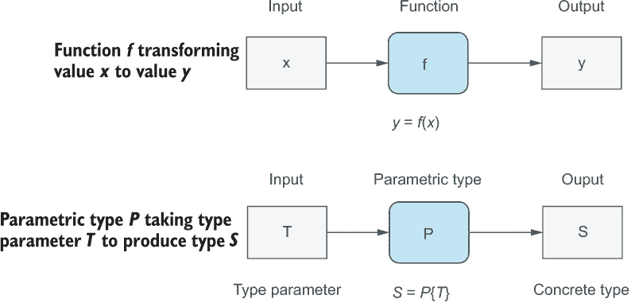
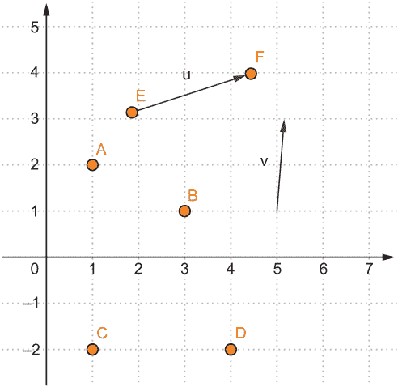
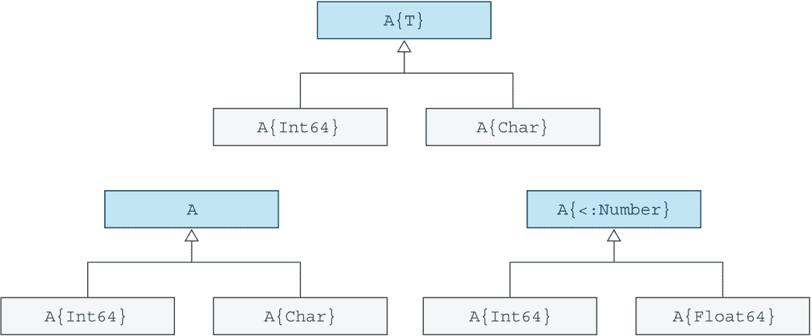
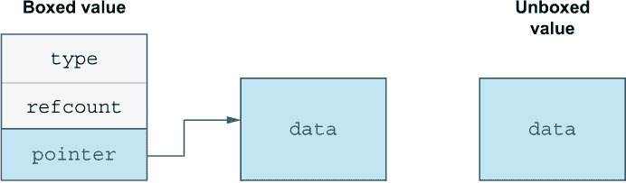

# 18 定义参数化类型

本章涵盖

+   使用和定义参数化方法和类型

+   使用参数化类型提高类型安全性和捕获错误

+   通过使用参数化类型提高内存使用率和性能

在第十章中，我介绍了参数化类型来帮助解释联合类型的工作原理。我们还讨论了与数组、字典和集合等集合相关的参数化类型。通过类型参数，你可以限制在集合中使用哪些元素，从而获得更好的类型安全。然而，所有之前的参数化类型使用都是作为其他人定义的参数化类型的用户。

在本章中，我将向你展示如何创建自己的参数化类型，并涵盖处理参数化类型时的一些常见误解和陷阱。但为什么你想创建自己的参数化类型呢？Julia 中的参数化类型有两个关键优势，我们将在本章中详细探讨：

1.  启用更安全的类型代码。Julia 可以在运行时早期捕获错误，例如尝试将字符串放入数字数组中。

1.  在处理大型数据集时提高性能。

你将通过在二维空间中的几何代码（为了简单起见）来探索这些主题。我将尝试通过你的火箭示例项目中的一个可能用途来激励你：为了表达火箭在空间中的位置，你需要一个 Point 类型来表示空间中的位置，以及一个 Vec2D 类型来表示不同方向上的力、加速度和速度。

## 18.1 定义参数化方法

我将简单地通过展示接受类型参数的方法，并探讨类型参数如何使你的方法更安全并减少样板代码。在深入之前，让我先回顾一下*类型参数*的概念。之前，我使用了一个函数调用的类比 y = f(x)，其中函数 f 接收一个值 x 并产生一个新的值 y（图 18.1）。同样，你可以将类型表达式 S = P{T} 视为参数化类型 P，它接受一个类型参数 T 并返回一个新的具体类型 S。T 和 S 都是具体类型，而 P 只是创建类型的模板。



图 18.1 函数与参数化类型之间的类比。前者产生值，而后者产生类型。

列表 18.1 中定义的 linearsearch 函数在数组 haystack 中进行*线性搜索*，寻找元素 needle。

注意：使用线性搜索意味着你没有做任何聪明的事情。你只是从第一个元素开始，依次查看每个元素。当你找到你正在寻找的元素时，你返回该元素的索引。

linearsearch 是一个参数化方法，因为它接受一个类型参数 T。定义 T 为类型参数的是 where T 子句。

列表 18.1 在集合 haystack 中搜索元素 needle 的线性搜索

```
function linearsearch(haystack::AbstractVector{T}, needle::T) where T
    for (i, x) in enumerate(haystack)
        if needle == x
            return  i
        end
    end
    nothing
end
```

在这个情况下，使用类型参数提供了哪些优势？你能否用 AbstractVector 类型注解 haystack，并给 needle 提供任何类型注解？不。那样不会在运行时提供相同强度的类型检查。你已经定义了 linearsearch，使得 needle 必须与 haystack 的所有元素具有相同的类型。让我在 REPL 中演示一下：

```
julia> linearsearch([4, 5, 8], 5)
2

julia> linearsearch([4, 5, 8], "five")
ERROR: MethodError: no method matching linearsearch(::Vector{Int64}, ::String)
```

错误信息告诉你没有方法可以接受一个包含 Int64 元素的向量和一个 String 搜索对象。我已经定义了 linearsearch，使得无论 T 是什么类型，它都必须与 haystack 元素和 needle 对象相同。

参数化类型不仅提高了类型安全性，还提供了减少样板代码的机会。假设你想实现你自己的 Julia typeof 函数版本。一个简单的方法是编写如下代码。

列表 18.2 typeof 风格函数的简单实现

```
kindof(x::Int64)   = Int64
kindof(x::Float64) = Float64
kindof(x::String)  = String
```

你可以在 REPL 中尝试 kindof 并看到它适用于 64 位整数值、浮点值和字符串。然而，仅此而已。尝试为 Julia 中的每个类型添加方法是一个徒劳之举。正如你可能已经猜到的，将 kindof 定义为参数化方法优雅地解决了这个问题，如下所示。

列表 18.3 使用类型参数实现 kindof

```
function kindof(x::T) where T
    return T
end
```

虽然 T、S、T1 和 T2 等名称常用于表示类型参数，但你也可以使用任何名称；名称不是关键。是 where 子句将名称转换为类型参数。让我们通过重新启动 Julia 并定义一个名为 Int64 的类型参数来强调这一点：

```
julia> kindof(x::Int64) where Int64 = Int64
kindof (generic function with 1 method)

julia> kindof(3)
Int64

julia> kindof('C')
Char

julia> kindof(4.2)
Float64

julia> kindof(3 => 8)
Pair{Int64, Int64}
```

Int64 是一个实际类型的事实在这里并不重要。where 子句将 Int64 转换为类型参数，并防止它被解释为具体类型。当然，你应该避免使用已知类型作为类型参数的名称，因为这会极大地混淆代码的读者。

## 18.2 定义参数化类型

在整本书中，我们使用了数组、字典和元组等参数化类型，但我们并没有自己定义这些类型。让我们看看如何实现这一点。

我将定义 Point 和 Vec2D 类型。图 18.2 展示了坐标空间中点和向量之间的关系。点通常以点状绘制，而向量则以箭头形式绘制。向量表示在坐标系中每个轴上的位移。



图 18.2 点和向量之间的几何关系

从数学的角度讲，点和向量通过不同的运算相关联。如果你从点 F 减去点 E，你会得到向量 **u**。你也可以反过来，将向量 **u** 加到点 E 上以得到点 F。我将在稍后更深入地讨论这些细节。首先，我想带你详细了解参数化类型定义的细节（列表 18.4）。请在 REPL 中不要定义这些，因为你会修改这些定义。

列表 18.4 定义参数化类型 Point 和 Vec2D

```
"A point at coordinate (x, y)"
struct Point{T}
    x::T
    y::T
end

"A vector with displacement (Δx, Δy)"
struct Vec2D{T}
    Δx::T
    Δy::T
end

"Calculate magnitude of a vector (how long it is)"
norm(v::Vec2D) = sqrt(v.Δx² + v.Δy²)
```

使用 \Delta 获取 Δ 符号。它是数学中常用以表示差异或位移的符号。

Point 和 Vec2D 不应被视为类型，而应被视为创建实际类型的模板。要创建一个实际类型，你必须为类型参数 T 提供一个具体类型。如果没有参数化类型，你将不得不定义许多具体类型来处理不同的数字。每个方法都必须为每个类型定义，从而导致代码膨胀。例如，使用参数化类型，你可以只定义一次 norm。如果没有它，你将需要为每个具体的 2D 向量类型定义它，如下面的列表所示。

列表 18.5 没有参数化类型时的代码膨胀

```
struct IntVec2D
    x::Int
    y::Int
end

struct FloatVec2D
    Δx::Float64
    Δy::Float64
end

norm(v::IntVec2D) = sqrt(v.Δx² + v.Δy²)
norm(v::FloatVec2D) = sqrt(v.Δx² + v.Δy²)
```

然而，一个 Python、Ruby 或 JavaScript 开发者可能会反对这种做法，并说定义多个具体类型是完全不必要的。如果你想在 Δx 和 Δy 的类型上获得灵活性，只需省略类型注解，如下面的列表所示。

列表 18.6 没有类型注解的 Vec2 类型（任何类型）

```
struct Vec2D
    Δx
    Δy
end
```

没有任何东西阻止你以这种方式定义一个 2D 向量。那么为什么不这样做，从而避免参数化类型引入的所有额外复杂性呢？省略注解有多个原因：

1.  你剥夺了 Julia JIT 编译器在运行时进行的宝贵类型检查。

1.  你增加了内存使用并降低了性能。

我将更详细地介绍这些观点。

## 18.3 参数化类型带来的类型安全优势

我将通过比较有类型注解和无类型注解的 2D 向量来展示使用参数化类型的类型安全优势。我将首先创建两个临时类型，GVec2D 和 PVec2D，仅用于这个比较。我不会进一步构建这些类型。注意，在单行上定义类型定义是完全有效的——只需用分号分隔单个语句即可。GVec2D 是弱类型变体，而 PVec2D 是强类型变体：

```
julia> struct GVec2D Δx; Δy end               ❶

julia> struct PVec2D{T} Δx::T; Δy::T end      ❷

julia> v = GVec2D(2, 3.0)                     ❸
GVec2D(2, 3.0)

julia> u = PVec2D(2, 3.0)                     ❹
ERROR: MethodError: no method matching PVec2D(::Int64, ::Float64)

julia> u = PVec2D(2, 3)                       ❺
PVec2D{Int64}(2, 3)

julia> u = PVec2D{Int}(2, 3.0)                ❻
 PVec2D{Int64}(2, 3)
```

❶ 创建一个没有类型注解的复合数据类型。

❷ 在新数据类型的字段中添加类型注解。

❸ 对参数类型没有限制。

❹ 类型注解阻止了错误类型的输入。

❺ 从参数中推断类型参数。

❻ 明确设置类型参数为 Int。

GVec2D 不使用类型注解，因此当创建 q 点时，我从 Julia 那里没有收到关于使用两种不同的数字类型来表示 *x* 和 *y* 的 delta 的任何抱怨。如果你尝试使用具有类型注解的 PVec2D，Julia JIT 编译器会抱怨，因为你正在尝试使用两种不同类型的 Δx 和 Δy。由于这个问题，Julia 没有办法推断类型参数 T 应该是什么，它必须放弃并抛出异常。这有助于你捕捉到你没有注意代码中传递的数字类型的情况。

这个问题可以通过两种方式解决：要么确保每个参数具有相同的类型，要么使用花括号 {} 明确地声明类型参数，而不是让 Julia 推断它。然后 Julia 将知道每个字段的类型，并自动将其转换为该数值类型。这两种选择都是有效的。

使用参数化类型可以进一步提高类型安全性。你还记得 `<:` 子类型操作符吗？你已经在各种情况下使用过这个操作符，包括测试一个类型是否是另一个类型的子类型，以及表明一个复合类型是抽象类型的子类型。你还可以使用这个操作符来对类型参数 T 施加约束。目前，T 可以是任何类型，包括非数值类型。这并不理想，因为坐标是由数字表示的。下面的列表中显示的最终 Vec2D 类型将约束 T 为一个数字。

列表 18.7 定义 Point 和 Vec2D，使得类型参数必须是数值类型

```
import Base: +, -

struct Point{T<:Number}
    x::T
    y::T
end

struct Vec2D{T<:Number}
    Δx::T
    Δy::T
end

"Adding vector `v` to point `p` creates a new point"
function +(p::Point{T}, v::Vec2D{T}) where T
    Point(p.x + v.Δx, p.y + v.Δy)
end

"Subtracting two points gives a vector"
function -(p::Point{T}, q::Point{T}) where T
    Vec2D(p.x - q.x, p.y - q.y)
end
```

你可以看到创建一个字符的 PVec2D 没有问题，因为类型参数 T 没有以任何方式被约束。另一方面，Vec2D 将不接受字符作为参数。尝试自己用不同的值进行实验以验证类型约束是否有效：

```
julia> v = PVec2D('A', 'B')
PVec2D{Char}('A', 'B')

julia> u = Vec2D('A', 'B')
ERROR: MethodError: no method matching Vec2D(::Char, ::Char)

julia> u = Vec2D(8, 4)
Vec2D{Int64}(8, 4)
```

到目前为止，你只在使用所有表达式中使用了一个类型参数。但你知道从使用字典、元组和配对中，可以有多个类型参数。对于列表 18.7 中的点减法操作符，我要求每个点 p 和 q 必须具有相同的数值类型，但这不是必需的。列表 18.8 展示了使用点 p 和 q 的不同数值类型实现的减法操作符。

列表 18.8 定义减法操作，使得参数 p 和 q 不需要是同一类型

```
function -(p::Point{T}, q::Point{S}) where {T, S}
    Vec2D(p.x - q.x, p.y - q.y)
end

function -(p::Point, q::Point)     ❶
    Vec2D(p.x - q.x, p.y - q.y)
end
```

❶ 无显式类型参数的简写版本

因为在这个例子中，我没有使用类型参数 T 和 S 来约束任何内容，所以我可以完全省略它们。在 Julia 中，编写 Point 等同于编写 Point{T}，如果 T 没有约束（图 18.3 展示了这些类型关系）。例如，如果你有一个函数 sum，它接受一个向量作为参数，而你又不关心元素的类型，你可以写 sum(xs::Vector)，这等同于写 sum(xs::Vector{T}) 其中 T。



图 18.3 参数化类型之间的子类型关系。接受参数化类型 A 的函数，例如，将接受类型 A{Int64} 和 A{Char} 的值。

在参数化方法中，使用命名类型参数（如 T）的关键原因是你想表达两个或多个参数使用相同的类型参数。在其他情况下，你不想强制执行这样的严格要求。相反，你只想让类型参数具有相似的类型。比如说，你只想让点之间的减法运算适用于整数（见以下列表）。

列表 18.9 参数化类型 p 和 q 被约束为具有基于整数的类型参数

```
function -(p::Point{<:Integer}, q::Point{<:Integer})
    Vec2D(p.x - q.x, p.y - q.y)
end
```

在这种情况下，p 可以具有 UInt8 字段，而 q 可以具有 Int16 字段。这个例子当然是人为的，因为这个特定的限制没有意义。那么为什么我没有将 p 和 q 限制为 Number 呢？这不是更现实吗？不会，因为没有办法创建不包含数字的 Point 对象。记住，这是对 Point 类型及其相关构造函数的类型参数的约束。

## 18.4 参数化类型带来的性能优势

Julia 是一种高性能的动态语言。没有参数化类型，这是不可能的。让我们讨论参数化类型是如何影响性能的。了解这一点的好处是，你可以更容易地预测你代码中的性能问题。

动态类型语言运行缓慢的一个关键原因是所谓的*装箱*。这个名字来源于大多数值必须放入特殊的容器中，这些容器包含有关它们包含的值的信息，包括其类型和垃圾回收细节，这可能是一个标记或引用计数（见图 18.4）。垃圾回收发生的具体细节（即内存释放的方式）对于这个论点不是本质的。关键点是这些通用容器有一堆账本数据。



图 18.4 装箱值和非装箱值的区别

这种账本数据有什么用呢？它允许你在运行时处理任意值。想象一个简单的函数 multiply，用于将向量乘以一个常数 k（见以下列表）。

列表 18.10 使用抽象类型字段定义的 Vec2D，以模仿常规动态语言

```
struct Vec2D         ❶
    Δx::Number       ❷
    Δy::Number       ❷
end

function multiply(u::Vec2D, k::Number)
    Vec2D(k * u.Δx, k * u.Δy)
end
```

❶ 支持解释而非运行

❷ 需要装箱

这看起来很简单，对吧？但在动态语言中，执行这个操作需要运行很多代码。在以下列表中，我将带你了解 Julia 伪代码变体中正在发生的事情。

列表 18.11 在正常动态语言中乘法将如何工作的伪代码

```
function multiply(u::Vec2D, k::Number)
    ux = getfield(u, :Δx)
    if !isa(ux, Float64)
        error("x must be a float")
    end

    uy = getfield(u, :Δy)
    if !isa(uy, Float64)
        error("y must be a float")
    end

    c = convert(Float64, k)
    Vec2D(floatmul(c, ux), floatmul(c, uy))
end
```

这段代码并不是要准确表示正在发生的事情。把它看作是一种伪代码，有助于你大致了解动态语言在底层是如何工作的。

在大多数动态语言中，你不知道复合类型有哪些字段，直到运行时。这意味着你不能生成直接访问字段的代码，这就是为什么你在列表 18.11 中看到 getfield(u, :Δx)这一行。你必须验证每个字段实际上都存在并且是预期的类型。

Julia 没有这个问题，因为它对其类型施加了一系列在其他动态语言中不常见的限制：

+   字段由类型固定。类型的实例在运行时不能添加或删除字段。

+   你不能在复合对象上存储与字段类型不匹配的值。

这些限制大大简化了 Julia JIT 编译器在尝试生成优化机器代码时的任务。关于 Julia 方法调用的复习，请参阅第 7.4 节。关键要点是，当 Julia 为方法生成代码时，它确切地知道每个输入参数的类型。由于在 Julia 中类型不能改变，JIT 编译器也将确切知道参数具有哪些字段及其类型。这允许 Julia 生成高度优化的机器代码。

## 18.5 参数类型内存优势

参数类型的优势不仅在于允许编译器生成更优化的代码，还包括使内存中数据的优化布局更容易实现。如果你定义了一个类型为 Vector{Point{Int32}}的数组，包含*N*个元素，那么 Julia JIT 可以精确计算出存储所有这些元素所需的字节数。这允许你避免内存碎片化，从而减少可用内存和应用程序的性能。简而言之，参数类型为你提供了更好的类型安全、性能和内存使用。

## 摘要

+   参数类型在运行时提高了类型安全。

+   Julia 通过查看 where 子句来确定一个类型是否是函数定义中的类型参数。

+   类型参数可以命名为任何东西，包括实际的类型名称，例如 Int8 和 Char。然而，为了避免混淆阅读你代码的开发者，尽量使用 T、T1、T2 和 S 等名称。

+   对于复合类型，使用{T1, T2, T3}来指定具有三个不同类型参数的类型。

+   使用子类型运算符 T <: S 来约束参数类型 T 成为另一个类型 S 的子类型。

+   括号化是指存储值时带有账目信息，以帮助确定在运行时存储的数据类型。

+   括号化（Boxing）会降低动态语言的性能。在 Julia 中，参数类型与不可变类型结合使用，最小化了括号化的使用，从而允许编译器生成优化的机器代码。

+   参数类型为集合和单个对象提供了更优的内存布局，减少了内存使用并提高了性能。
