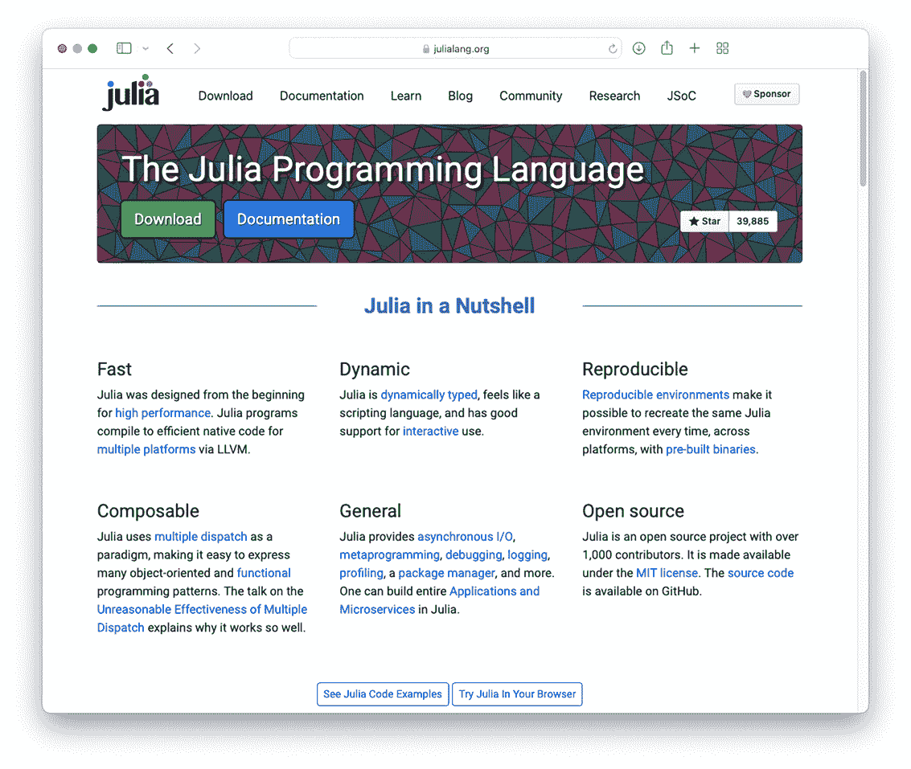
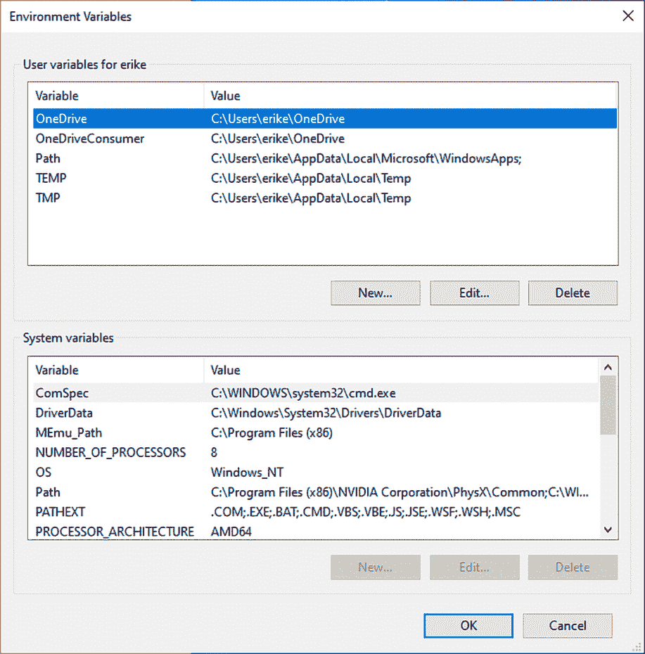

# 附录 A. 安装和配置 Julia 环境

本附录涵盖了在 Linux、macOS 和 Windows 上下载和安装 Julia，我还会介绍如何配置您的 Julia 环境以提高效率。

本附录中的说明依赖于理解诸如命令工具的路径等概念，以及知道如何设置它；这些说明将根据操作系统而有所不同。对于类似于 macOS 和 Linux 的类 Unix 系统，您通过编辑配置文件（如 .zshrc、.profile 或 .config/fish/config.fish）来配置搜索路径。在这些文件中，您可以设置环境变量，如 PATH、EDITOR 和 JULIA_EDITOR。如果您不熟悉 Unix 命令行，以下是我 Substack 的 *Erik Explores* 提供的一些资源：

+   “Unix 命令行快速入门” ([`erikexplores.substack.com/p/unix-crash-course`](https://erikexplores.substack.com/p/unix-crash-course))

+   “Unix 命令、管道和进程” ([`erikexplores.substack.com/p/unix-pipes`](https://erikexplores.substack.com/p/unix-pipes))

+   “Unix Shell 和终端” ([`erikexplores.substack.com/p/unix-shells-and-terminals`](https://erikexplores.substack.com/p/unix-shells-and-terminals))

## A.1 下载 Julia

1.  导航到 Julia 下载网页（图 A.1）：[`julialang.org/downloads`](https://julialang.org/downloads)。

1.  选择适合您操作系统的正确 Julia 版本。我建议安装 Julia 1.7 或更高版本。



图 A.1 Julia 主页

## A.2 安装 Julia

阅读您使用的操作系统的安装说明。

注意：一些 shell 命令以 sudo 前缀开头，这会给您正在运行的命令超级用户权限。这些权限是修改不属于登录用户的文件或目录所需的。

## A.3 在 Linux 上

Linux 发行版有很多种，但在这里的说明中，我假设有一个下载目录，您在其中存储下载的文件。根据您在 Linux 机器上存储下载的位置调整给出的命令。

1.  使用类似 julia-1.7.3-linux-x86_64.tar.gz 的名称解压 .tar.gz 文件。

1.  将解压后的目录移动到 /opt。如果 /opt 不存在，则创建它。同时创建一个 /opt/bin 目录，因为稍后需要它：

```
$ sudo mkdir -p /opt/bin
$ cd $HOME/Downloads
$ sudo mv julia-1.7.3 /opt
```

接下来，为了方便地从终端运行 Julia，创建一个符号链接：

```
$ sudo rm /opt/bin/julia                                ❶
$ sudo ln -s /opt/julia-1.7.3/bin/julia /opt/bin/julia
```

❶ 删除任何旧的链接。

### A.3.1 在 macOS 上

1.  打开名为 julia-1.7.3-mac64.dmg 的下载的 .dmg 文件。

1.  将 Julia 应用程序包拖放到您的 /Applications 文件夹中。

安装完成。就这么简单！

下一个步骤是可选的但很方便。如果您想通过在终端中简单地键入 julia 来启动 Julia，而不是必须点击 Julia 应用程序图标，请执行以下步骤：

1.  打开 Terminal.app 控制台应用程序。

1.  从安装位置创建一个符号链接到您的路径中的一个目录，例如 /usr/local/bin。

```
$ ln -s /Applications/Julia-1.7.app/Contents/Resources/julia/bin/julia /usr/local/bin/julia
```

### A.3.2 在 Windows 上

下载 .exe 文件，这是一个自包含的 Julia 安装程序。双击并按照提示安装 Julia。安装过程与其他大多数 Windows 软件类似。

## A.4 配置 Julia

让我们配置 Julia，使其使用更加方便。Linux 和 macOS 的配置非常相似，因为它们都是类 Unix 操作系统。

### A.4.1 在 Linux 和 macOS 上

要使从终端运行 Julia 更加方便，配置您的 shell 环境对 Julia 是有用的。如果您的 shell 是 Z shell (zsh)，您需要编辑您主目录中的 .zshrc 文件。如果您使用 Bourne Again SHell，bash，您需要编辑 .profile 文件。Z shell 目前是 macOS 的标准。

以下是在 Linux 上使用 bash shell 配置 Julia 的示例，其中 Sublime Text (见 [`www.sublimetext.com`](https://www.sublimetext.com))，subl，被用作 Julia 代码的文本编辑器：

```
# ~/.zshrc file
export JULIA_EDITOR=subl
export PATH=/opt/bin:$PATH
```

您可以使用自定义 shell。例如，我使用 fish shell，这是一个适用于所有类 Unix 系统的现代、用户友好的 shell。在这种情况下，您需要编辑您主目录中的 .config/fish/config.fish 文件。在以下代码中，我正在配置我的 Mac 使用 VS Code 编辑器，该编辑器通过 code 命令启动：

```
# ~/.config/fish/config.fish file
set -x JULIA_EDITOR code
set -x PATH /usr/local/bin $PATH
```

### A.4.2 在 Windows 上

在 Windows 上，环境变量通过图 A.2 所示的 GUI 进行配置。打开此对话框的步骤取决于您的 Windows 版本。对于 Windows 8 及更高版本，请按照以下步骤操作：

1.  在搜索中，搜索并选择系统（控制面板）。

1.  点击高级系统设置链接。



图 A.2 配置 Windows 二进制搜索路径的对话框

对于 Windows Vista 和 Windows 7，请按照以下步骤操作：

1.  从桌面右键单击计算机图标。

1.  从上下文菜单中选择属性。

1.  点击高级系统设置链接。

在 Windows 上，您不需要设置 JULIA_EDITOR 环境变量，因为操作系统在需要时会打开一个对话框并询问您要使用哪个编辑器。Windows 将随后将一个应用程序与 .jl 文件关联起来。

在 Windows 上配置 shell 环境可能比在 Linux/macOS 上更不必要，因为命令行界面不像 Windows 开发者那样经常使用。对 Windows 上的命令行感兴趣的开发者可能更喜欢使用 Windows 子系统 for Linux (WSL; [`docs.microsoft.com/en-us/windows/wsl/about`](https://docs.microsoft.com/en-us/windows/wsl/about))。如果您使用 WSL，那么请遵循 Linux 安装和配置步骤。

## A.5 运行 Julia

现在 Julia 已安装并配置，您可以尝试运行它。要么点击 Julia 应用程序图标，要么打开一个终端窗口，输入 julia，然后按 Enter。

当 Julia 程序启动时，它会进入被称为 *Julia REPL*（读取-评估-打印循环）的状态。Julia REPL 是一个接受 Julia 代码、评估它并打印该代码评估结果的程序：

```
$ julia
               _
   _       _ _(_)_     |  Documentation: https:/ /docs.julialang.org
  (_)     | (_) (_)    |
   _ _   _| |_  __ _   |  Type "?" for help, "]?" for Pkg help.
  | | | | | | |/ _` |  |
  | | |_| | | | (_| |  |  Version 1.7.2 (2022-02-06)
 _/ |\__'_|_|_|\__'_|  |  Official https:/ /julialang.org/ release
|__/                   |

julia> print("hello world")
hello world

julia> 3 + 2
5

julia> reverse("ABCD")
"DCBA"
```

通常，每一行代码被称为一个 *表达式*。（许多其他语言区分语句和表达式。）按下 Enter 后，评估表达式，Julia 将显示该表达式评估的结果。

如何退出 Julia？您可以通过按住 Ctrl 键并按 C 键来中断 Julia 中的任何操作。我们将其写作 Ctrl-C。要退出 Julia，请按住 Ctrl-D 或输入 exit()。

Ctrl-C 通常用于停止执行陷入僵局的 Julia 代码。例如，如果您正在执行一个无限循环，您可能想要停止执行。

## A.6 Julia REPL 模式

Julia REPL 可以处于不同的模式，这由当前显示的提示符指示。一个带有名称 julia> 的绿色提示符表示您处于标准 Julia 模式。以下是在代码示例中您将看到的其他模式：

+   help?>—查找有关函数或类型的帮助信息。通过按 ? 键进入帮助模式。

+   pkg>—Package 模式用于安装和删除包。通过按 ] 键进入包模式。

+   shell>—Shell 模式允许您发出 Unix shell 命令，例如 ls、cp 和 cat。通过按 ; 键进入 shell 模式。

您可以通过将光标移至行首并按退格键来退出模式。这将带您回到 Julia 模式。

在阅读这本书时，请查看提示符以确定我们处于哪种模式。如果您没有将 REPL 设置为正确的模式，您发出的命令将不会生效。以下是在帮助模式下的一个示例。提示符将是黄色：

```
help?> 4 / 2
  /(x, y)

  Right division operator: multiplication of x by the inverse of y on the right.
  Gives floating-point results for integer arguments.
```

REPL 模式在第五章、第十六章和第十七章中进行了更详细的介绍。

## A.7 安装第三方包

有几个第三方包，虽然不是必需的，但可以改善您的 workflow。包在第十六章中进行了更详细的介绍。

进入包模式以安装包。我们将在此安装 OhMyREPL、Revise 和 Debugger 包：

```
(@v1.7) pkg> add OhMyREPL, Revise, Debugger
   Resolving package versions...
```

使用 using 关键字将包加载到 Julia 环境中。可以通过逗号分隔来加载多个包。

```
julia> using OhMyREPL, Revise, Debugger
```

OhMyREPL 包提供了语法高亮和更好的搜索历史记录。Debugger 允许您使用 @enter 宏逐步执行代码。例如，以下代码将进入 titlecase 函数的执行。通过按 N 键进行步骤，通过按 Ctrl-D 键退出：

```
julia> @enter titlecase("hello")
```

最有趣和有用的包是 Revise，它允许您监控代码更改。通常，您使用 include 函数将单个文件的代码加载到 Julia REPL 中。如果您使用 Revise 包中的 includet 函数，文件中的代码将被监控。假设您创建了一个名为 hello.jl 的文件，其中包含以下代码：

```
greet() = "hello world"
```

您可以使用 Revise 在 Julia REPL 中加载此文件：

```
julia> includet("hello.jl")

julia> greet()
"hello world"
```

您可以将源代码文件修改为“hello Mars”，并且这个更改将自动生效，无需再次显式加载文件：

```
julia> greet()
"hello Mars"
```
