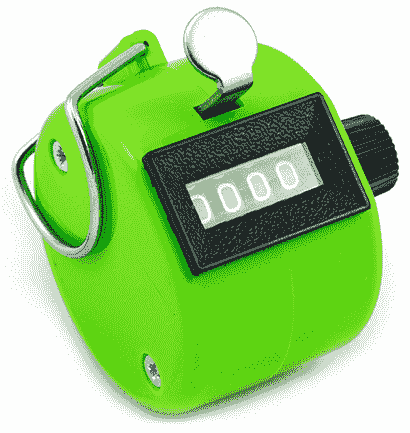
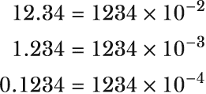
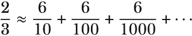

# 附录 B. 数值

本附录涵盖了编程中关于数字的一些常见问题和疑问。这些主题并非完全属于 Julia 独特；例如，我将讨论如果整数算术运算的结果超出了整数类型能表示的范围，会发生什么。我还会讨论为什么浮点数与整数不同，它们是不准确的。

## B.1 不同数字类型及其位数长度

数字不仅仅是数字。存在不同类型的数字，例如整数、实数、无理数等等。例如，*整数*是整数，如 2、7、43、820、-52、0、6 和-4，而*实数*包含有小数点的数字，如 3.45、0.042、1331.0、78.6。

然而，数学家和程序员看待数字的方式在本质上是有区别的。在计算机上，我们关注的是数字的位数长度以及数字是有符号还是无符号的。1 如果你已经使用过 Java、C#、C 或 C++等编程语言，那么你可能已经非常熟悉这一点了。

如果你的编程背景是另一种动态语言，例如 Python、Ruby、JavaScript 或 Lua，这些概念可能对你来说很陌生。虽然 Julia 也是一种动态语言，但数字在其中扮演着更核心的角色。例如，在 Python 和 JavaScript 中，你不必过多关注不同的数字类型。在 Julia 中，这一点更为重要，因为数字已经被精心设计，使 Julia 适合高性能计算。

我会为你提供基础知识。当填写表格时，你可能熟悉可以输入的数字位数限制。计算机也是如此。如果你将数字存储为四位数，那么在任何计算中你可以使用的最大数字是 9999。关键的区别是，对于现代数字计算机，所有数字都是以二进制形式存储在内存中，而不是十进制形式。因此，你可以选择的数字类型不是 4 位数、8 位数等等。相反，你可以选择的数字类型，例如，8 位、16 位或 64 位数字。这在实际操作中对你有什么影响？

数字是用一和零来表示的。8 位数字是一个有 8 个二进制位的数字。用二进制形式表示，你可以用 8 位表示的最大数字是 0b11111111。这个数字上的 0b 前缀是为了明确它不是一个十进制数。转换成十进制表示，这将等于 255。因此，如果你尝试将 256 作为 8 位数字存储，它将失败。（注意，为了清晰起见，我已经缩短了错误信息。）

```
julia> UInt8(256)
ERROR: InexactError: trunc(UInt8, 256)

julia> UInt8(255)
0xff

julia> Int(ans)
255
```

但为什么你应该限制你处理数字的大小？为什么不每次都简单地使用可能的最大数字呢？因为你的计算机上没有无限的内存。如果你只使用几个数字，那么它们的大小并不重要。然而，如果你处理数百万个数字，那么位长度就开始变得重要了。其次，与处理小数字相比，对大数字进行计算通常需要更长的时间。Julia 默认使用 64 位数字，因为它们非常实用。一个有符号的 64 位整数最大值为 9,223,372,036,854,775,807。你不太可能处理比这更大的数字。

但你是如何知道数字类型可以持有的最大和最小值呢？幸运的是，Julia 提供了 typemax 和 typemin 函数，让你可以自己找出这些值。然而，目前你只需直接理解这些函数的工作方式即可。你给出 Julia 数字类型的名称，例如 Int8、Int16 或 UInt8，这些函数就会返回你可以用该数字类型表示的最高和最低数值。例如，一个 8 位有符号整数 Int8 无法表示大于 127 的值：

```
julia> typemax(Int8)
127

julia> typemin(Int8)
-128

julia> typemax(Int16)
32767

julia> typemax(Int64)
9223372036854775807

julia> typemin(Int32)
-2147483648
```

`typemin(Int8)` 返回 -128 的值，因为一个有符号的 8 位整数无法表示小于 -128 的数值。

虽然所有这些数字类型看起来可能很复杂，但在实际操作中你很少需要考虑它们。在大多数情况下，坚持使用默认类型，如 Int64，是最好的选择。只有当你处理大量数字并遇到性能或内存问题时，你才需要考虑其他整数数字大小。或者，你可能需要更大的数字，因为你正在处理非常大的值。在这种情况下，你可以考虑使用 Int128 或甚至 BigInt。

64 位和 32 位 Julia 安装之间的差异 如果你下载并安装了 32 位的 Julia 版本，那么默认的整数类型将是 Int32 而不是 Int64。本书中的代码示例将假设你运行的是 64 位 Julia。

你尝试找到 BigInt 的最大值，但无法让它工作吗？继续阅读以了解原因。

要了解用于表示特定数字字面量的类型，你可以使用 typeof 函数。只需给它一个数字，它就会返回表示该数字的数字类型。实际上，它可以用于任何类型。如果这让你感到困惑，不要担心，因为 typeof 将在稍后更详细地介绍：

```
julia> typeof(797298432432432432)
Int64

julia> typeof(797298432432432432709090)
Int128

julia> typeof(797298432432432432709090697343)
Int128

julia> typeof(7972984324324324327090906973430912321321)
BigInt
```

BigInt 是一个非常特殊的数字类型，因为它没有预定义的位数。相反，它简单地不断增长以适应所有位数，因此你的计算机内存是其唯一的实际限制；这就是为什么 BigInt 没有定义良好的最大值。

为什么不总是使用 BigInt 呢？这样你就不必考虑你需要多少位大小了。显然的答案是这会降低性能。因此，你应该尽量将 BigInt 的使用限制在你代码中从中受益且不是性能关键的部分。

## B.2 溢出和有符号数与无符号数

让我们将第二章中学到的关于数字格式和位长度的所有知识汇总起来，来探讨一些重要的话题。首先是*溢出*的概念。想想机械计数器，就像图 B.1 中展示的那样。它有四个数字，那么当你达到 9999 时会发生什么？它会回绕，然后又回到 0000。



图 B.1 一个机械计数器。每次你点击金属按钮时，它都会增加。

数字在计算机上工作方式完全相同。因为每种数字类型都可以存储最大值，你可能会执行结果大于变量可以存储的值的算术运算。这里有一些实际例子：

```
julia> UInt8(255) + UInt8(1)
0x00

julia> UInt8(255) + UInt8(2)
0x01

julia> 0xff + 0x01
0x00

julia> 0xff + 0x05
0x04
```

因为一个 UInt8 只能持有到 255 的值，所以当你添加更多时，或者用更准确的语言来说，当你溢出时，你会得到回绕。在这种情况下，通过使用十六进制数来理解这个概念更容易。一个 8 位数字可以存储最多两个十六进制数字，十六进制中的最后一个数字值是 F。对于 16 位数字，你需要更高的值来得到溢出：

```
julia> UInt16(65535) + UInt16(1)
0x0000

julia> UInt16(65535) + UInt16(3)
0x0002
```

溢出对于有符号数和无符号数的工作方式不同。看看以下有符号数和无符号数的行为，看看你是否能理解它：

```
julia> UInt8(127) + UInt8(1)
0x80

julia> Int(ans)
128

julia> Int8(127) + Int8(1)
-128

julia> Int8(127) + Int8(2)
-127

julia> Int8(127) + Int8(127)
-2
```

这个输出看起来很奇怪，对吧？你正在添加正数，却得到了负数。这怎么可能呢？这与计算机内存只能存储数字的事实有关。没有任何地方存储负号。相反，你会使用回绕行为来模拟负数。回到图 B.1 中的机械计数器例子，存储四位十进制数；*4* + *9998*最终会变成 2。想象一下从 9998 开始点击机械计数器的四次；计数器会回绕并最终变成 2。

这意味着关于数字 9998 的另一种思考方式是想象它为数字-2。*4* + (-*2*) = *2*。这样，9999 就变成了-1，9995 变成了-5，以此类推。按照这个逻辑，1 可以解释为-9999。然而，不应该走得太远；否则，就无法用四个数字来表示正数。

现代计算机上使用的方案是将每个数字范围大致分成一半，所以一半的值用来表示负数，另一半用来表示正数。一个无符号 8 位整数可以表示从 0 到 255 的数字；然而，一个有符号 8 位整数表示的值从-128 到 127，这你之前已经看到了：

```
julia> typemin(Int8)
-128

julia> typemax(Int8)
127

julia> typemin(Int16)
-32768

julia> typemax(Int16)
32767
```

因此，存储在内存中的内容实际上并没有不同。唯一的不同之处在于在进行不同计算时如何解释存储的内容。当使用无符号数时，假设所有数字都是正数。当使用有符号数时，假设一半的值是负数。实际上，Julia 可以通过使用 reinterpret 函数向你展示内存中完全相同的位可以以不同的方式解释：

```
julia> reinterpret(Int8, UInt8(253))   ❶
-3

julia> reinterpret(UInt8, Int8(-1))    ❷
0xff

julia> Int(ans)
255
```

❶ 将无符号 8 位数字 253 重新解释为有符号 8 位数字。253 作为有符号数解释为 -3。

❷ 将有符号数 -1 的内存中的位重新解释为无符号数。8 位数的无符号 -1 与 255 相同。

## B.3 浮点数

整数无法表示带有小数点的数字，例如 4.25、80.3 或 0.233；表示这类数字有不同方法。历史上，*定点数*被使用，但在现代计算机中，我们倾向于使用所谓的*浮点数*。定点数用于诸如货币计算这样的用途。在这种数字表示法中，小数点后的位数是固定的：你总是有两个小数位。

计算机无法在内存中存储符号或小数点。计算机内存只存储数字，并且只以二进制格式存储它们。这与，比如说，算盘并没有太大区别。在算盘上无法明确存储负数或表示小数点；然而，可以建立一些惯例。

你可以简单地决定，例如，你处理的数字的最后两位应该是小数点后的数字。这意味着，如果你想输入 1，实际上你需要输入 100\. 同样，23 变成 2300\. 以类似的方式，人们可以使用仅整数来*模拟*定点数。你可以取整数，如 4250 和 850，并*假设*在最后两位数字之前有一个小数点。因此，你可以将这些数字解释为 42.50 和 8.50\. 在计算中，这没问题：

```
julia> 4250 + 850
5100

julia> 42.50 + 8.50
51.0
```

对于金钱的计算，这是合适的选择；因为此类计算通常涉及四舍五入到最接近的两个小数位。但对于需要很多小数位数的科学计算，这太不切实际了。这就是为什么我们有浮点数，其基于这样的想法：你可以以这种方式表示任何数字（图 B.2）。



图 B.2 使用整数乘以 10 的幂和正或负指数表示任何十进制数

考虑第一行：数字 1234 被称为*尾数*。第二部分表示数字的*基数*。在这种情况下，*基数*是 10，而*指数*是 -2。在内部，浮点数分别存储尾数和指数。这种安排使得小数点可以*浮动*。浮点数类型可以表示比整数更大的数字，但缺点是它们并不完全准确。为什么？这超出了这本入门书的范围，但我可以提供一些关于它的提示。考虑一个像 ⅔ 这样的数字。用小数表示，我们写成 0.6666666666666666。数字只是不断继续。在小数中，小数点后的数字代表分母是 10 的倍数的分数。因此，我们近似如图 B.3 所示。



图 B.3 用小数表示分数的近似

这永远无法完全准确。在我这本书中使用的例子中，这通常不会成问题，但如果你开始认真处理浮点数时，这是值得注意的。但不要假设每个浮点数都必须是不准确的。许多数字可以精确表示，例如 0.5 或 42.0。对于计算机来说，浮点数显然不是用十进制表示分数，而是用二进制表示分数。

* * *

(1.) 有符号数可以是负数，而无符号数只能为正数。
