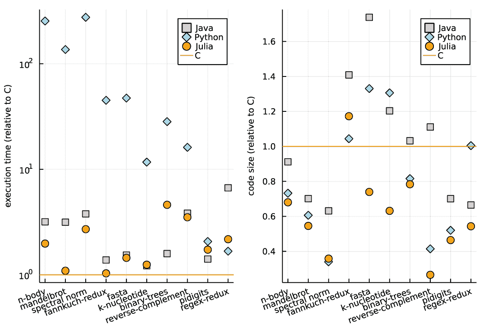

# 1 引言

本章涵盖

+   Julia 的关键特性

+   为什么用 Julia 进行数据科学？

+   Julia 中的数据分析模式

数据分析已经成为几乎所有专业活动的核心过程之一。数据的收集变得更容易、更便宜，因此我们能够轻松地访问它。关键方面是数据分析使我们能够以更低的成本和更快的速度做出更好的决策。

数据分析的需求催生了几个新的职业，其中数据科学家通常是最先想到的。*数据科学家* 是一个擅长收集数据、分析数据并产生可操作见解的人。与所有工匠一样，数据科学家需要能够帮助他们高效可靠地交付产品的工具。

各种软件工具可以帮助数据科学家完成他们的工作。其中一些工具使用图形界面，因此易于使用，但通常也有限制它们的使用方式。数据科学家需要完成的众多任务通常导致他们迅速得出结论，他们需要使用编程语言来实现所需的灵活性和表现力。

开发者已经提出了许多数据科学家常用的编程语言。其中之一是 *Julia*，它被设计用来解决数据科学家在使用其他工具时面临的挑战。引用 Julia 的创造者的话，它“运行得像 C 语言，但读起来像 Python。”与 Python 类似，Julia 支持高效便捷的开发过程。同时，用 Julia 开发的程序性能与 C 语言相当。

在 1.1 节中，我们将讨论支持这些主张的典型基准测试的结果。值得注意的是，2017 年，一个用 Julia 编写的程序在处理天文图像数据时，使用 130 万个线程实现了 1.54 petaflops（每秒数十亿次的浮点运算）的峰值性能。[`julia computing.com/case-studies/celeste/`](https://juliacomputing.com/case-studies/celeste/)。在此之前，只有用 C、C++ 和 Fortran 实现的软件才能达到超过 1 petaflops 的处理速度。

在这本书中，你将学习如何使用 Julia 语言来完成数据科学家需要例行完成的任务：以不同格式读取和写入数据，以及转换、可视化和分析数据。

## 1.1 什么是 Julia 以及为什么它有用？

Julia 是一种既高级又具有高执行速度的编程语言。创建和运行 Julia 程序都很快。在本节中，我将讨论 Julia 为什么在数据科学家中越来越受欢迎的原因。

不同的编程语言常用于数据分析，例如（按字母顺序排列）C++、Java、MATLAB、Python、R 和 SAS。其中一些语言——例如 R——被设计成在数据科学任务中非常易于表达和使用；然而，这通常是以程序执行时间较慢为代价的。其他语言，如 C++，更接近底层，这使得它们能够快速处理数据；不幸的是，用户通常必须付出编写更冗长代码和较低抽象级别的代价。

图 1.1 比较了 C、Java、Python 和 Julia 在 10 个选定问题中的执行速度和代码大小（编程语言表达性的可能度量之一）。由于这些比较总是很难客观进行，我选择了计算机语言基准游戏（[`mng.bz/19Ay`](https://shortener.manning.com/19Ay)），它有着悠久的发展历史，维护者尝试使其尽可能客观。

在图 1.1 的两个子图中，C 对每个问题的参考值都是 1；小于 1 的值表明代码比 C 运行得更快（左图）或更小（右图）。在左图中，表示执行时间的 y 轴具有对数尺度。右图中的代码大小是使用每种语言编写的程序的 gzip 存档的大小。

在执行速度（左图）方面，C 是最快的，其次是 Julia（用圆圈表示）。值得注意的是，Python（用菱形表示）在许多任务中比所有其他显示的语言慢几个数量级（我不得不将 y 轴绘制在对数尺度上，以便使左图可读）。

当考虑代码大小（右图）时，Julia 在 10 个任务中有 8 个领先，而对于 C 和 Java，我们看到最大的测量值。除了代码大小外，语言的易用性也很相关。我在 Julia 中准备了图 1.1 的图表，在一个交互会话中，我可以轻松调整它；您可以在与本书配套的 GitHub 仓库中检查源代码（[`github.com/bkamins/JuliaForDataAnalysis`](https://github.com/bkamins/JuliaForDataAnalysis)）。这也会在 Python 中很方便，但与 Java 或 C 相比更具挑战性。



图 1.1 比较了 C、Python、Java 和 Julia 在 10 个选定的计算问题中的代码大小和执行速度

在过去，开发者面临着语言表达性和速度之间的权衡。然而，在实践中，他们希望两者兼得。理想的编程语言应该易于学习和使用，就像 Python 一样，同时又能像 C 一样允许高速数据处理。

这通常需要数据科学家在他们的项目中使用两种语言。他们使用易于编码的语言（例如，Python）原型化他们的算法，然后识别性能瓶颈，并将代码的选定部分移植到快速语言（例如，C）。这种转换需要时间，并可能引入错误。维护一个包含大量部分用两种编程语言编写的代码库可能具有挑战性，并引入了集成多种技术的复杂性。最后，当处理具有挑战性和新颖性的问题时，使用两种编程语言编写的代码使得快速实验变得困难，这增加了从产品概念到市场可用性的时间。

Timeline 案例研究

让我以我使用 Julia 的经验为例。*Timeline*是一个帮助财务顾问进行退休财务规划的网络应用程序。这样的应用程序，为了提供可靠的推荐，需要进行大量的即时计算。最初，Timeline 的创建者开始使用 MATLAB 进行原型设计，然后切换到 Elixir 进行在线部署。我参与了将解决方案迁移到 Julia 的工作。

在代码重写之后，系统的在线查询时间从 40 秒减少到了 0.6 秒。为了评估这种加速的商业价值，想象一下你是一个 Timeline 用户，需要等待 40 秒才能得到你的网页浏览器的响应。现在假设等待时间缩短到了 0.6 秒。除了提高客户满意度外，更快的处理时间也降低了运营此系统所需的技术基础设施的成本和复杂性。

然而，执行速度只是变化的一个方面。另一个方面是，Timeline 报告称，切换到 Julia 节省了数万美元的编程时间和调试时间。软件开发者需要编写的代码更少，而与软件开发者沟通的数据科学家现在使用相同的工具。你可以在[`juliacomputing.com/case-studies/timeline/`](https://juliacomputing.com/case-studies/timeline/)了解更多关于这个用例的信息。

在我看来，Timeline 的例子对于将工作结果部署到生产环境的数据科学团队管理者来说尤其相关。即使是单个开发者也会欣赏使用单一语言进行原型设计和编写高性能生产代码带来的生产力提升。然而，当拥有能够使用单一工具进行协作的数据科学家、数据工程师和软件开发者的混合团队时，生产时间和开发成本的真正收益才会显现。

时间线案例研究展示了 Julia 如何在现实生活中的商业应用中取代 MATLAB 和 Elixir 语言的组合。为了补充这个例子，检查数据科学家通常使用的流行开源软件项目所使用的语言（截至 2021 年 10 月 11 日的统计数据）是有教育意义的。表 1.1 显示了用于实现三个 R 和 Python 包的前两种编程语言（按源代码行数的百分比）。

表 1.1 实现所选流行开源包使用的语言

| 包 | 功能 | URL | 语言 |
| --- | --- | --- | --- |
| data.table | R 的数据帧包 | [`github.com/Rdatatable/data.table`](https://github.com/Rdatatable/data.table) | C 36.3%，R 62.4% |
| randomForest | R 的随机森林算法 | [`github.com/cran/randomForest`](https://github.com/cran/randomForest) | C 50.3%，R 39.9% |
| PyTorch | Python 的机器学习库 | [`github.com/pytorch/pytorch`](https://github.com/pytorch/pytorch) | C++ 52.6%，Python 36.6% |

所有这些例子都有一个共同特征：数据科学家希望使用高级语言，如 Python 或 R，但由于代码的部分执行速度太慢，包的编写者必须切换到底层语言，如 C 或 C++。

为了解决这个挑战，一群开发者创建了 Julia 语言。在他们名为“我们为什么创建 Julia”的宣言中，Julia 的开发者将这个问题称为*双语言问题*([`mng.bz/Poag`](http://mng.bz/Poag))。

Julia 的美丽之处在于我们不必做出这样的选择。它为数据科学家提供了一个高级、易于使用且快速的编程语言。这一点在 Julia 及其包的源代码结构中得到了体现。表 1.2 列出了与表 1.1 中列出的包功能大致匹配的包。

表 1.2 与表 1.1 中列出的包功能匹配的 Julia 包

| 包 | 功能 | URL | 语言 |
| --- | --- | --- | --- |
| DataFrames.jl | 数据帧包 | [`github.com/JuliaData/DataFrames.jl`](https://github.com/JuliaData/DataFrames.jl) | Julia 100% |
| DecisionTree.jl | 随机森林库 | [`github.com/bensadeghi/DecisionTree.jl`](https://github.com/bensadeghi/DecisionTree.jl) | Julia 100% |
| Flux.jl | 机器学习包 | [`github.com/FluxML/Flux.jl`](https://github.com/FluxML/Flux.jl) | Julia 100% |

所有这些包都是纯 Julia 编写的。但这对于用户来说重要吗？

就像几年前我一样，你可能认为这个特性对包开发者比终端用户数据科学家更相关。Python 和 R 都有成熟的包生态系统，你可以预期大多数计算密集型算法已经在一个你可以使用的库中实现。这确实是事实，但当我们从实现玩具示例转移到复杂的生产解决方案时，我们很快遇到了三个显著的限制：

+   “大多数算法”与“所有算法”不同。虽然在你的大多数代码中你可以依赖包，但一旦你开始进行更高级的项目，你很快就会意识到你需要编写自己的快速代码。很可能会发生的是，你不想为这样的任务切换你使用的编程语言。

+   许多提供数据科学算法实现的库允许用户传递自定义函数，这些函数作为主算法的一部分执行计算。一个例子是将目标函数（也称为*损失函数*）传递给一个执行神经网络训练的算法。通常，在训练过程中，目标函数会被评估多次。如果你想计算速度快，你需要确保目标函数的评估速度快。

    如果你使用 Julia，你可以灵活地定义你想要的自定义函数，并且可以确信整个程序将运行得很快。原因是 Julia 将代码（包括库代码和你的自定义代码）一起编译，从而允许进行优化，这些优化在预编译的二进制文件使用时或当自定义函数是用解释型语言编写时是不可能的。这类优化的例子包括函数内联([`compileroptimizations.com/category/function_inlining.htm`](http://mng.bz/ya4y))和常量传播([`compileroptimizations.com/category/constant_propagation.htm`](http://mng.bz/M02o))。我不会详细讨论这些主题，因为你不需要确切了解 Julia 编译器的具体工作方式才能高效地使用它；你可以参考前面的链接获取更多关于编译器设计的详细信息。

+   作为用户，你将想要分析你使用的包的源代码，因为你经常需要详细了解某些东西是如何实现的。如果包是用高级语言实现的，这将更容易做到。更重要的是，在某些情况下，你可能想要使用包的源代码——例如，作为实现其设计者未预见到特性的起点。如果包是用你调用它的语言编写的，这将更容易做到。

为了更详细地解释这里提出的论点，下一节将介绍数据科学家通常认为至关重要的 Julia 的关键特性。

## 1.2 从数据科学家视角看 Julia 的关键特性

Julia 及其包生态系统具有五个与数据科学家相关的关键特性：

+   代码执行速度

+   专为交互式使用设计

+   可组合性，导致高度可重用且易于维护的代码

+   包管理

+   与其他语言的集成容易

让我们更详细地探讨这些特性的每一个。

### 1.2.1 Julia 快速的原因在于它是一种编译型语言

我们从*执行速度*开始，因为这是 Julia 首先承诺的特性。实现这一功能的关键设计元素是 Julia 是一个*编译型语言*。一般来说，在 Julia 代码执行之前，它会被编译成本地汇编指令，使用 LLVM 技术（[`llvm.org/`](https://llvm.org/)）。选择使用 LLVM 确保了 Julia 程序可以轻松地在各种计算环境中移植，并且它们的执行速度得到了高度优化。其他编程语言，如 Rust 和 Swift，也出于相同的原因使用 LLVM。

从性能角度来看，Julia 是编译型语言的事实带来了一个主要的好处。窍门在于编译器可以执行许多优化，这些优化不会改变代码的运行结果，但会提高其性能。让我们看看它是如何工作的。以下示例代码应该很容易理解，即使对于那些没有 Julia 先验经验的人也是如此：

```
julia> function sum_n(n)
           s = 0
           for i in 1:n
               s += i
           end
           return s
       end
sum_n (generic function with 1 method)

julia> @time sum_n(1_000_000_000)
  0.000001 seconds
500000000500000000
```

注意：你可以在第二章中找到 Julia 语法的介绍，附录 A 将指导你完成 Julia 的安装和配置过程。

在这个例子中，我们定义了一个名为 sum_n 的函数，它接受一个参数 n，并计算从 1 到 n 的数字之和。接下来，我们调用这个函数，要求为 n 等于十亿的求和。函数调用前的@time 注解要求 Julia 打印出我们代码的执行时间（技术上，它是一个宏，我在第三章中会解释）。正如你所看到的，结果产生得非常快。

你可能可以想象，在这个时间框架内执行在 sum_n 函数体内定义的循环的一亿次迭代是不可能的；这肯定需要更多的时间。确实如此。Julia 编译器所做的是意识到我们正在对一系列数字进行求和，因此它应用了一个从 1 到 n 的数字求和的已知公式，即 n(n + 1)/2。这使得 Julia 能够大幅减少计算时间。

这只是 Julia 编译器可以执行的优化示例之一。诚然，像 R 或 Python 这样的语言的实现也试图执行优化以加快代码执行速度。然而，在 Julia 中，在编译期间可以获得更多关于处理值的类型和执行代码结构的信息，因此可以执行更多的优化。“Jeff Bezanson 等人所著的《Julia：数值计算的新方法》”（语言创造者；见[`mng.bz/JVvP`](http://mng.bz/JVvP)）提供了关于 Julia 设计更详细的解释。

这只是 Julia 编译特性可以加快代码执行速度的一个例子。如果你对分析精心设计的、比较不同编程语言的基准测试源代码感兴趣，我建议你查看我用来创建图 1.1 的计算机语言基准测试游戏（[`mng.bz/19Ay`](http://mng.bz/19Ay)）。

Julia 的另一个相关方面是它内置了对多线程（使用机器的多个处理器进行计算）和分布式计算（能够在计算中使用多个机器）的支持。此外，通过使用额外的包如 CUDA.jl ([`github.com/JuliaGPU/CUDA.jl`](https://github.com/JuliaGPU/CUDA.jl))，你可以在 GPU 上运行 Julia 代码（我提到过这个包是 100% 用 Julia 编写的吗？）。这实际上意味着 Julia 允许你充分利用可用的计算资源，从而减少你等待计算结果所需的时间。

### 1.2.2 Julia 提供了对交互式工作流程的全面支持

你现在可能会问一个很自然的问题：由于 Julia 编译成原生机器码，数据科学家——他们大多数工作都是在探索和交互式方式下进行的——怎么会觉得使用它很方便？通常，当我们使用编译型语言时，编译和执行阶段是明确分开的，这与需要响应式环境的需求不太相符。

但这里出现了 Julia 语言的第二个特性：它是 *为交互式使用而设计的*。除了运行 Julia 脚本外，你还可以使用以下功能：

+   一个交互式外壳，通常称为读取-评估-打印循环（REPL）。

+   Jupyter Notebook（你可能听说过 Jupyter 的名字是对支持的三种核心编程语言的引用：Julia、Python 和 R）。

+   Pluto.jl 笔记本 ([`github.com/fonsp/Pluto.jl`](https://github.com/fonsp/Pluto.jl))，它利用 Julia 的速度，将笔记本的概念提升到了新的水平。当你更改代码中的某个内容时，Pluto.jl 会自动更新整个笔记本中所有受影响的计算结果。

在所有这些场景中，当用户尝试执行 Julia 代码时，代码会被编译。因此，编译和执行阶段被融合在一起，并从用户那里隐藏起来，确保用户体验类似于使用解释型语言。

这种相似性并不仅限于此；像 R 或 Python 一样，Julia 是 *动态类型化的*。因此，在编写代码时，你不需要（但也可以）指定你使用的变量的类型。Julia 设计的美丽之处在于，由于它是编译型的，这种动态性仍然允许 Julia 程序运行得很快。

在这里需要强调的是，只有用户不需要注释所使用的变量的类型。在运行代码时，Julia 会知道这些类型。这不仅确保了代码执行的速度，还允许编写高度可组合的软件。大多数 Julia 程序都试图遵循众所周知的 UNIX 原则：做好一件事，做好一件事。你将在下一节看到一个例子，并在本书的其余部分学习到更多。

### 1.2.3 Julia 程序高度可重用且易于组合

当在 Python 中编写函数时，你通常必须考虑用户是否会传递一个标准列表、一个 NumPy ndarray 或一个 pandas Series 给它。这通常需要多次编写类似的代码。然而，在 Julia 中，你通常可以编写一个函数，该函数将接收一个向量，然后这个函数就可以正常工作了。用户传递的具体向量实现对你的代码来说并不重要，因为代码可以是完全通用的。在编译过程中，Julia 会选择执行代码的最有效方式（这是通过第三章中提到的 *多重分派* 实现的）。

这正是我们在本书中大量使用的 DataFrames.jl 包所采取的方法。DataFrame 的对象用于处理表格数据，并且可以存储任意列。DataFrames.jl 包（[`github.com/JuliaData/DataFrames.jl`](https://github.com/JuliaData/DataFrames.jl)）在这里没有任何限制。

例如，DataFrame 可以存储在 Arrow.jl 包中定义的自定义类型（[`github.com/JuliaData/Arrow.jl`](https://github.com/JuliaData/Arrow.jl)）。这些列不遵循标准的 Julia Vector 类型，而是遵循 Apache Arrow 格式（[`arrow.apache.org/`](https://arrow.apache.org/)）。你将在第八章中学习如何处理这些数据。在 Julia 中实现此格式的自定义类型设计得非常高效，即使是潜在非常大的 Arrow 数据也能快速读取。

为了参考，让我给你简要介绍一下 Apache Arrow。这种与语言无关的列式内存格式是为了高效的分析操作而组织的。它可以用于读取和写入 Apache Parquet 文件（[`parquet.apache.org/`](https://parquet.apache.org/)），并且受到包括 PySpark ([`spark.apache.org/docs/latest/api/python/`](https://spark.apache.org/docs/latest/api/python/)) 和 Dask ([`docs.dask.org/en/stable/`](https://docs.dask.org/en/stable/)) 在内的流行框架的支持。

从 Julia 语言设计原则的角度来看，重要的是要强调 DataFrames.jl 和 Arrow.jl 是完全独立的包。尽管它们不知道对方的存在，但它们可以无缝地一起工作，因为它们依赖于共同的接口（在这种情况下，这个接口是通过我们在第二章和第三章中讨论的 AbstractVector 类型提供的）。同时，当 Julia 执行你的代码时，它会生成高效的本地汇编指令，利用你使用的具体向量类型。因此，如果你的项目中出于某种原因需要使用专有向量类型，DataFrames.jl 不会有问题，而且不仅会工作，而且效率会很高。

让我在这里强调，在 Julia 中，可组合性自然地与函数参数的 Julia 允许的（可选）类型限制相结合（你将在第三章中学习如何编写具有参数类型限制的方法）。当你处理大型项目时，你会欣赏这个特性，因为它允许你轻松地找到代码中的错误或当你阅读代码时理解代码的工作方式。如果你使用 Python，你可能知道自 3.5 版本以来，它支持类型提示，因为它们很有用，尤其是在许多开发者共同参与大型项目时。Python 与 Julia 的不同之处在于，在 Python 中，类型提示只是注释，运行时不会进行类型检查（[`peps.python.org/pep-0484/`](https://peps.python.org/pep-0484/)）。另一方面，在 Julia 中，如果你在代码中提供了类型限制，编译器将强制执行它们，这样你可以确信只有你期望执行的内容会无误地执行。

### 1.2.4 Julia 拥有一个内置的先进的包管理器

现在让我们转向从软件工程的角度来看 Julia 的重要特性。首先，Julia 自带了一个先进的包管理器，它允许你轻松管理代码设计的运行环境状态。我在附录 A 中解释了它的细节，但一种实用的思考方式如下。

要完全指定你的 Julia 环境的状态，只需共享两个文件，即 Project.toml 和 Manifest.toml，这两个文件唯一地标识了你的代码使用的包版本，以及你的程序源代码。如果你这样做，Julia 将自动重新创建你的代码正确运行所需的整个运行时环境配置。这样，Julia 确保了你的程序结果的可重复性。此外，Julia 解决了管理用其他语言编写的代码（通常称为*依赖地狱*）的常见问题，在这种情况下，程序员在正确设置其他软件所需的包时可能会遇到困难。

### 1.2.5 将现有代码与 Julia 集成很容易

第二个工程方面是与其他语言的集成容易性。Julia 的创造者意识到，在考虑使用这种语言时，你可能会有大量用其他语言编写的现有解决方案。因此，Julia 自带了对调用 C 和 Fortran 代码的原生支持，而与 C++、Java、MATLAB、Python 和 R 代码的集成则由包提供。

这种方法最小化了在具有大量遗留代码库的企业环境中将 Julia 作为首选语言使用的成本。在第五章中，你将看到一个将 Julia 与 Python 集成的例子，在第十章中，与 R 的集成。也存在一些包，使得从其他语言（如 C、Python 或 R）调用 Julia 代码变得容易。

在本节中，我专注于 Julia 语言的特点。然而，就像每一种技术一样，Julia 也有其局限性。接下来，我将描述本书中介绍的包旨在设计的计算任务类型。

## 1.3 书中介绍工具的使用场景

这本书的重点在于向您展示如何进行表格数据的分析。*表格数据*是一种由*单元格*组成的二维结构。每一行都有相同数量的单元格，并提供关于数据的一个观测值的信息。每一列都有相同数量的单元格，存储关于观测值之间相同特征的信息，并且有一个你可以参考的名字。

虽然听起来可能有些限制，但表格数据格式非常灵活且易于处理。诚然，有时你可能想要处理非结构化数据，即使是对于那些项目，你最终也会处理表格数据。因此，学习如何处理它是使用 Julia 进行数据科学的好起点。

这里是来自 DataFrames.jl 包的 DataFrame 类型的样本表的打印输出：

```
julia> using DataFrames

julia> DataFrame(id=1:3,
                 name=["Alice", "Bob", "Clyde"],
                 age=[19, 24, 21], friends=[[2], [1, 3], [2]],
                 location=[(city="Atlanta", state="GA"),
                           (city="Boston", state="MA"),
                           (city="Austin", state="TX")])
3×5 DataFrame
 Row │ id     name    age    friends  location
     │ Int64  String  Int64  Array...   NamedTup...
─────│─────────────────────────────────────────────────────────────────
   1 │     1  Alice      19  [2]      (city = "Atlanta", state = "GA")
   2 │     2  Bob        24  [1, 3]   (city = "Boston", state = "MA")
   3 │     3  Clyde      21  [2]      (city = "Austin", state = "TX")
```

这个表格有三行，每行都包含一个学生的信息。表格还有五列：

+   id—表示学生标识符的整数。

+   name—表示学生名字的字符串。

+   age—表示学生年龄的整数。

+   friends—包含给定学生朋友 ID 的可变长度向量。这种类型的数据通常被称为*嵌套的*，因为列的各个元素是数据集合。

+   location—另一个嵌套列，包含有关学生居住的城市和州的信息（技术上，该列的元素具有 NamedTuple 类型；我将在第一部分中向你展示如何处理这些对象）。

在第一部分，我们将详细讨论这个表格列中存储的数据类型。然而，你可能已经注意到了 DataFrame 列中可以存储的信息类型的巨大灵活性。

在这本书中，我们将主要讨论可以存储在单台计算机的随机访问内存（RAM）中并使用 CPU 处理的数据处理工具。这目前是数据分析的一个常见应用场景。你将要学习的包将确保这种数据处理可以方便且高效地进行。

然而，通常情况下，我们可能想要处理比可用 RAM 量更大的数据，将其分布式处理在多台机器上，或者使用 GPU 进行计算。如果你对这些应用感兴趣，我建议将《Julia 手册》中的“并行计算”部分作为起始参考点（[`mng.bz/E08q`](http://mng.bz/E08q)）。此外，附录 C 展示了 Julia 在数据库支持和数据存储格式方面提供的各种选项。

## 1.4 Julia 的缺点

当你阅读有关 Julia 优势的内容时，你可能会认为它在尝试“既要又要”时，结合了代码编译和交互式用例所需的动态性。肯定有什么问题存在。

的确，有一个问题。问题是容易识别的：编译需要时间。第一次运行一个函数时，它必须在执行之前进行编译。对于小型函数，这个成本是可以忽略不计的，但对于复杂的函数，执行可能需要几秒钟。这个问题在 Julia 社区中被称为“首次绘图时间问题”。我将在下一个列表中向你展示在一个新的 Julia 会话中生成简单图表的计时。

列表 1.1 测量首次绘制图表的时间

```
julia> @time using Plots                                            ❶
  4.719333 seconds (9.27 M allocations: 630.887 MiB, 6.32% gc time,
                    20.23% compilation time)

julia> @time plot(1:10)                                             ❷
  2.542534 seconds (3.75 M allocations: 208.403 MiB, 1.86% gc time,
                    99.63% compilation time)

julia> @time plot(1:10)                                             ❸
  0.000567 seconds (1.42 k allocations: 78.898 KiB)
```

❶ 加载 Plots.jl 包所需时间

❷ 生成第一个图表所需时间

❸ 再次生成相同图表所需时间

对 @time 宏的调用（如前所述，你将在第三章学习宏）要求 Julia 为其后表达式的执行时间生成统计数据。在这种情况下，加载 Plots.jl 包需要近 5 秒，生成第一个图表大约需要 2.5 秒（注意，这超过 99% 的时间是编译时间）。然而，再次生成图表却很快，因为图表函数已经编译完成。

这个特定例子中编译时间相对较长的原因是绘图需要非常复杂的底层代码（想象一下当你对生成的图形进行样式设置时所有可能的选择）。在 Julia 的早期阶段，这个问题相当严重，但 Julia 的核心开发者已经投入了大量努力来最小化这个问题。目前，这已经不再是问题，并且随着 Julia 的每次发布，这个问题都会得到改善。尽管如此，这个问题在某种程度上总是会存在，因为这是语言设计的一个固有特性。

一个自然的问题是，在哪些场景下我们应该期待编译成本会很重要。当满足以下两个条件时，成本是相关的：第一个是处理少量数据，第二个是 Julia 进程在终止前只执行少量操作。如果你有大量数据（例如，处理需要一小时），支付几秒钟的编译成本并不明显。同样，如果你开始一个长时间的交互会话或启动一个 Julia 服务器，该服务器响应许多请求而不会被终止（如 Timeline 案例研究所示），编译的平均成本可以忽略不计，因为你只会在第一次运行函数时支付它。然而，如果你想要快速启动 Julia，绘制一个简单数据的图表，然后退出 Julia，编译时间就会很明显，很可能是令人烦恼的（在列表 1.1 中，我们可以在我的笔记本电脑上看到执行此类任务需要大约 7 秒）。

用户也经常询问是否可以从 Julia 代码中创建一个可执行文件，该文件可以在没有安装 Julia 的机器上运行，而不会牺牲执行速度。这可以通过使用 PackageCompiler.jl 包（[`github.com/JuliaLang/PackageCompiler.jl`](https://github.com/JuliaLang/PackageCompiler.jl)）来实现。然而，与例如用 C 语言编写的应用程序相比，在运行时，此类应用程序将具有更大的可执行文件大小和更大的 RAM 内存占用。在某些 RAM 空间有限的上下文中（例如，嵌入式系统），用户可能会发现这很成问题。你可以期待在 Julia 的未来版本中这种情况会有所改善。

最后，你可能已经听说 Julia 是编程语言领域的一个相对较新的参与者。这自然会引发对其成熟度和稳定性的疑问。在这本书中，我们将关注那些已经达到生产级稳定性的包。正如你将学到的，这些包提供了数据科学家通常需要的所有标准功能。

然而，Python 或 R 的包生态系统范围更广。因此，在某些特定情况下，你可能在 Julia 生态系统中找不到合适的包，或者可能认为某个包不够成熟，不足以用于生产目的。这时，你可能需要决定是否放弃使用 Julia，或者使用 RCall.jl 或 PyCall.jl 等包，这些包允许你轻松地在 Julia 程序中使用 R 或 Python 库（这正是我通常的做法）。在本书中，你将看到此类集成的示例，以便你可以验证它确实很方便。

## 1.5 你将学习哪些数据分析技能？

本书通过 Julia 语言为你提供了一种动手学习数据分析的方法。本书的目标读者包括数据科学家、数据工程师、计算机科学家和希望学习一种能够以高效便捷的方式帮助你从数据中获得宝贵见解的新技术的商业分析师。

读者最好有一些 Julia 编程经验，以便从阅读中获得最大收益。然而，我认识到 Julia 是一种新技术，知道它的人为数不多。因此，第一部分包括几个介绍 Julia 语言的章节。在第二部分，你将在 Julia 中学习以下技能：

+   以各种常见格式读取和写入数据

+   在处理表格数据时执行常见任务，包括子集、分组、汇总、转换、排序、连接和重塑

+   通过使用各种类型的图表来可视化你的数据

+   使用收集到的数据进行数据分析并构建预测模型

+   创建复杂的数据处理管道，结合前面列表中描述的所有组件

## 1.6 Julia 如何用于数据分析？

大多数数据分析项目遵循类似的流程。在本节中，我概述了这个过程步骤的高级图（图 1.2）。对于每个步骤，我都列出了数据科学家为完成它而执行的一些典型任务。Julia 提供了一套完整的功能，允许你在实际项目中执行这些任务，在接下来的章节中，你将学习如何完成所有这些任务。


图 1.2 典型的数据处理流程。使用 Julia 语言，数据科学家可以执行数据分析的所有步骤。

Julia 包生态系统中的工具涵盖了典型数据分析流程中的所有步骤：

+   *源数据摄取*—Julia 可以原生地从各种来源读取数据，例如，包括逗号分隔值（CSV）、Arrow、Microsoft Excel 或 JavaScript 对象表示法（JSON）。值得注意的是，与 R 或 Python 相比，Julia 是编写针对来自非标准来源的数据的高效自定义解析器的优秀工具，这在物联网（IoT）应用中是一个常见的场景。

+   *数据准备*—在这个步骤中，典型的数据操作包括连接、重塑、排序、子集、转换和修复质量问题。在这本书中，我们将主要使用 DataFrames.jl 包来完成这些任务；这个包被设计成易于使用且高效，尤其是在执行需要编写自定义函数的非标准数据转换时。正如我在本章中已经讨论过的，进行适当的性能基准测试是具有挑战性的，但如果你是 Python 中的 pandas 用户，你可以期待在切换到 DataFrames.jl 后，你的复杂分割-应用-组合操作或大型连接（这两类操作通常是数据准备中最耗时的步骤）将通常减少一个数量级的时间。

+   *数据分析*—数据准备完成后，数据科学家希望从中获得洞察；数据可以通过多种方式进行分析，包括聚合和总结、可视化、执行统计分析或构建机器学习模型。与数据准备步骤类似，如果你创建复杂解决方案，使用 Julia 将带来最大的好处。根据我的经验，如果你需要在单个模型中结合机器学习、优化和模拟组件，与 R 或 Python 相比，Julia 的使用特别方便且高效。在第二部分，我们将创建一个示例项目，展示如何将模拟集成到数据分析流程中。

+   *共享结果*—任何分析的最后一步是将其结果提供给外部受众。这可以简单到将数据保存到持久存储，也可以包括通过交互式仪表板或网络服务（在第十四章中介绍）提供服务，或者将创建的机器学习模型部署到生产环境。在这里，Julia 的关键优势是，如果您将模型部署到生产环境，您不需要将其移植到另一种语言以实现高执行性能；我在第 1.1 节中展示了 Timeline 案例研究作为例子。在第二部分中，我将向您展示如何在 Julia 中创建一个提供数据分析结果给用户的网络服务。

需要强调的是，前面的步骤通常以两种模式进行：

+   *交互式*—数据科学家以探索和迭代的方式与数据工作，目的是理解它，并从中得出有价值的商业结论。这种模式通常用于在开发环境中工作。

+   *全自动*—所有分析都在没有任何数据科学家干预的情况下进行。Julia 程序自动执行数据处理管道的所有步骤，并将结果提供给外部进程。这种模式通常用于将代码部署到生产环境时使用。

Julia 及其数据科学相关生态系统被设计成可以方便地在交互式和全自动模式下使用。本书展示了为这两种场景准备的代码示例。

数据分析方法

本节提供了一个数据分析过程的简化视图。如果您想了解更多关于该领域开发的标准，以下是一些提供更深入信息的参考文献：

+   团队数据科学流程（TDSP），[`mng.bz/wy0W`](http://mng.bz/wy0W)

+   数据挖掘跨行业标准流程（CRISP-DM），[`www.statoo.com/CRISP-DM.pdf`](http://www.statoo.com/CRISP-DM.pdf)

+   数据库中的知识发现（KDD），[`link.springer.com/chapter/10.1007/0-387-25465-X_1`](https://link.springer.com/chapter/10.1007/0-387-25465-X_1)

+   样本、探索、修改、建模和评估（SEMMA），[`mng.bz/7Zjg`](http://mng.bz/7Zjg)

## 摘要

+   Julia 是一种现代编程语言，旨在满足数据科学家的需求：它既快速又易于使用，无论是交互式使用还是在生产环境中都易于使用。

+   Julia 程序高度可组合，这意味着语言提供的各种包和功能可以轻松地一起使用，同时确保高执行速度。

+   Julia 的设计对工程师友好：它内置了先进的包管理功能，并提供了一种简单的方法来与其他编程语言集成。此外，当你用 Julia 定义函数时，你可以限制它们接受的参数类型。这在处理大型项目时特别有用，因为它允许你快速捕捉代码中的错误，并使理解代码的工作方式变得简单。

+   在这本书中，你将学习如何通过使用成熟且适用于严肃生产使用的 Julia 包来处理表格数据。

+   Julia 生态系统中的包允许你轻松地以各种格式读取和写入数据，处理数据，可视化数据，并创建统计和机器学习模型。
