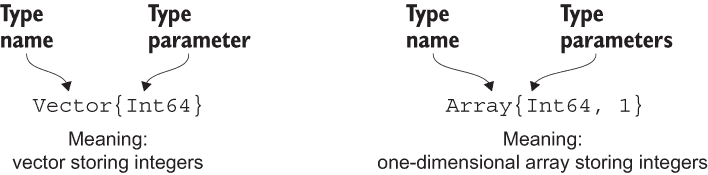
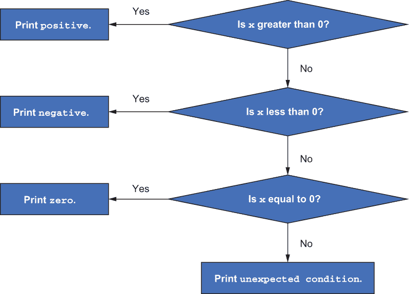
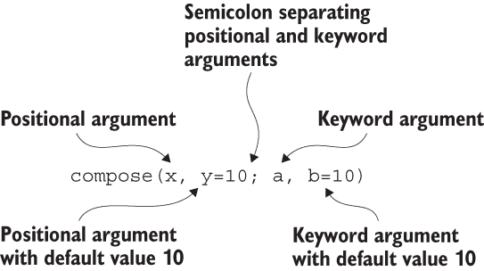

# 2 Julia 入门

本章涵盖了

+   理解值和变量

+   定义循环、条件表达式和函数

+   Julia 中的变量作用域规则

如果你刚开始接触 Julia 语言，在本章中，你将学习其基本语法和最重要的概念。我们将关注与 Python 和 R 不同的方面。即使你已经知道 Julia，我也建议你快速浏览本章，以确保你对基本概念有完整的理解。

如果你不确定如何安装、设置和使用你的工作环境，如何获取帮助，或者如何安装和管理包，请参阅附录 A。

注意，第一部分中的章节并不是为了成为 Julia 的完整课程。它们只包含你开始使用 Julia 进行数据科学所需的必要信息。我建议你参考 Julia 项目“Books”页面上的书籍（[`julialang.org/learning/books/`](https://julialang.org/learning/books/)）或 Julia 手册（[`docs.julialang.org/en/v1/`](https://docs.julialang.org/en/v1/)）以获得对 Julia 编程的全面介绍。

在本章中，我们的目标是编写一个函数来计算向量的 winsorized 均值。非正式地说，winsorized 均值是将最小值和最大值替换为最接近它们的较不极端的观测值。这样做是为了限制异常值对结果的影响（[`mng.bz/m2yM`](https://shortener.manning.com/m2yM)）。让我先解释一下你如何计算这个均值。

假设你有一个存储为向量的数字序列，并想计算其均值。然而，你知道你的数据可能包含极端值（异常值），这些值可能会显著影响结果。在这种情况下，你可以使用 winsorized 均值，这是标准均值的修改版。想法是将最极端的观测值替换为较不极端的值。让我们从一个我们将要实现的定义开始。

向量 x 的*k 次 winsorized 均值*是替换了其 k 个最小元素为(k + 1)次最小元素，以及类似地，每个最大的 k 个元素被(k + 1)次最大的元素替换后的均值（[`mng.bz/5mWD`](https://shortener.manning.com/5mWD)）。

如果我们假设向量 x 按升序排序且长度为 n，就像在 Xycoon Statistics-Econometrics-Forecasting 网站上所做的那样（[www.xycoon.com/winsorized_mean.htm](http://www.xycoon.com/winsorized_mean.htm)），那么在计算 k 次 winsorized 均值时，我们将 x[1]、x[2]、...、x[k]这些元素替换为 x[k + 1]元素，并将 x[n]、x[n - 1]、...、x[n - k + 1]这些元素替换为 x[n - k]元素。

这里有一个例子。假设我们想要计算向量 [1, 2, 3, 4, 5, 6, 7, 8] 的两次 winsorized 均值，我们将 1 和 2 替换为 3；同样，7 和 8 被替换为 6。这个操作给我们一个向量 [3, 3, 3, 4, 5, 6, 6, 6]，其平均值等于 4.5。现在你知道我们需要实现什么了。问题是如何在 Julia 中实现它。

要开发一个计算 winsorized 均值的函数，我们需要介绍 Julia 语言的各种重要部分，从值和变量开始，然后继续到控制流和函数。

## 2.1 表示值

要创建一个计算 winsorized 均值的函数，我们首先需要了解 Julia 如何表示数字和向量。更普遍地说，了解 Julia 如何处理值是非常重要的。

一个 *值* 是计算机内存中存储的实体的表示，可以被 Julia 程序操作。在这本书中，我也使用术语 *对象* 来指代值，尤其是在指代具有复杂内部结构的值时（例如，在第二部分中讨论的数据帧）。然而，Julia 不是一个面向对象的编程语言，对象没有附加到它们的方法。相反，Julia 支持多态，我们将在本章后面简要讨论。

在讨论如何操作值之前，让我们看看如何在下一列表中创建它们。每个值都是通过评估 Julia 表达式得到的结果。以下是一些通过评估 *字面量*（在源代码中表示值）创建的基本示例值。

列表 2.1 通过评估字面量创建值

```
julia> 1
1

julia> true
true

julia> "Hello world!"
"Hello world!"

julia> 0.1
0.1

julia> [1, 2, 3]
3-element Vector{Int64}:
 1
 2
 3
```

这些值依次是一个整数 1、布尔值 true、字符串 "Hello world!"、浮点数 0.1 和一个包含三个元素的向量 [1, 2, 3]。

在 Julia 中，每个值的一个重要属性是其类型，您可以通过使用 typeof 函数来检查。在 Julia 中，当您定义一个函数时，您可以可选地声明函数接受的参数类型。例如，在我们的 k 次 winsorized 均值函数中，我们希望确保 k 是一个整数，x 是一个向量。让我们尝试在下一列表中使用 typeof 函数检查 2.1 列表中的值。

列表 2.2 检查值的类型

```
julia> typeof(1)
Int64

julia> typeof(true)
Bool

julia> typeof("Hello world!")
String

julia> typeof(0.1)
Float64

julia> typeof([1, 2, 3])
Vector{Int64} (alias for Array{Int64, 1})
```

你可能在这里注意到两件事。首先，对于整数和浮点值，你会在类型名称中看到一个数字 64，即 Int64 和 Float64。这个值很重要。它向用户表明这两个值都占用 64 位内存。一般来说，如果需要，您在这里有灵活性。例如，您可以使用只占用 8 位内存的 Int8 值，但这会牺牲能够表示的值的范围：从 -128 到 127。您可以通过编写 Int8(1) 来创建一个 Int8 值。

在 Julia 中，你可以通过使用 bitstring 函数来检查（如果需要的话），数字的确切内存布局，该函数生成一个包含通过值生成的位序列的字符串。我在下面的代码中展示了这一点，以让你相信，确实在我的机器上，1 和 1.0 占用 64 位，而 Int8(1)占用 8 位。注意，尽管这三个值代表数字 1，但它们在计算机内存中的存储都不同，因为它们的类型不同（如果你想了解更多关于像 1.0 这样的浮点数在计算机内存中是如何存储的，请查看[`mng.bz/aPDo`](http://mng.bz/aPDo))：

```
julia> bitstring(1)
"0000000000000000000000000000000000000000000000000000000000000001"

julia> bitstring(1.0)
"0011111111110000000000000000000000000000000000000000000000000000"

julia> bitstring(Int8(1))
"00000001"
```

在这本书中，我们通常会使用默认的 64 位数字。了解在 64 位机器（你最可能使用的计算机类型）上，你可以通过只输入 Int 来更简洁地引用 Int64 类型是有用的：

```
julia> Int
Int64
```

第二个需要注意的事情是[1, 2, 3]向量的类型，它是 Vector{Int64}（Array{Int64, 1}的别名）。这似乎相当冗长。让我们来分析一下。

从 Array{Int64, 1}开始。我们看到我们的向量是 Array 类型。在花括号中，我们得到这个类型的*参数*：{Int64, 1}。AbstractArray 的子类型通常需要两个参数，而 Array 正好需要两个参数。第一个参数是数组可以存储的元素类型（在我们的例子中，是 Int64）。第二个参数是数组的维度，在这个例子中是 1。

因为在数学中，一维数组通常被称为*向量*，Julia 允许你只写 Vector{Int64}，这意味着与 Array{Int64, 1}相同。由于类型名是 Vector，这意味着它是一维数组，我们可以省略传递维度参数。然而，我们仍然需要传递向量可以存储的元素类型，因此它有一个参数，在这种情况下，是{Int64}。图 2.1 说明了这些概念。



图 2.1 参数类型名称的阅读规则。这两个定义是等价的，因为向量是一维数组；Array{Int64, 1}的第二个参数是数组维度（在这种情况下，1），因此这是一个向量。类型参数被括在花括号中。

除了使用 typeof 函数获取值的类型外，你还可以通过使用 isa 运算符方便地测试一个值是否为特定类型。让我们检查这个[1, 2, 3]向量：

```
julia> [1, 2, 3] isa Vector{Int}
true

julia> [1, 2, 3] isa Array{Int64, 1}
true
```

注意，在这个例子中，在 Vector{Int}中，Vector 和 Int 都是别名，而 Array{Int64, 1}是相同的类型。

当你编写自己的代码时，你很可能不会经常使用 typeof 函数和 isa 操作符，因为 Julia 在运行代码时会自动使用类型信息。然而，了解如何手动检查值的类型对于理解 Julia 的工作方式非常重要。例如，了解变量的类型在调试代码时很重要。在第三章，你将学习在 Julia 中定义函数时如何使用变量类型的有关信息。

## 2.2 定义变量

现在你已经知道了什么是值，你就可以学习关于变量的知识了。在我们的 winsorized mean 函数中，我们需要变量来引用用户传递给函数的值。

*变量* 是绑定到值的名称。将值绑定到变量名的最简单方法就是使用赋值运算符 =（等号）：

```
julia> x = 1
1

julia> y = [1, 2, 3]
3-element Vector{Int64}:
 1
 2
 3
```

在这个例子中，我们将整型 1 绑定到变量名 x，并将向量 [1, 2, 3] 绑定到变量名 y。

值绑定与复制

需要强调的是，在 Julia 中，赋值运算符 (=) 仅执行将值绑定到变量的操作。绑定过程不涉及复制值。Python 也遵循这种方法。然而，在 R 中情况并非如此。

这种区别在处理数据集合，例如向量时最为重要，尤其是当你对它们进行修改（例如，添加或更改存储的元素）时。在 Julia 中，如果一个向量绑定到两个不同的变量，并且你对其进行了修改，那么这个变化将在两个变量中都可见。例如，在 Julia 中，如果你写下 x = [1, 2] 然后 y = x，那么 x 和 y 变量绑定到相同的值。如果你接下来写 x[1] = 10，那么 x 和 y 变量的值都将变为 [10, 2]。如果你想将变量 y 绑定到变量 x 绑定的值的副本，请写 y = copy(x)。在这种情况下，修改绑定到 x 的值将不会影响 y。

理解何时发生值绑定与复制特别重要，尤其是在处理数据框的列时。在我的经验中，作为 DataFrames.jl 包的维护者，这个问题是用户代码中主要错误来源之一。在第二部分，你将学习在处理 DataFrames.jl 时，如何决定你执行的操作是否应该复制数据。

需要强调的是，Julia 是一种动态类型语言，因此在编译时它不需要知道绑定到变量的类型。这一事实的实践后果是，你可以在代码中将不同类型的值绑定到相同的变量名。以下是一个例子：

```
julia> x = 1
1

julia> x
1

julia> typeof(x)
Int64

julia> x = 0.1
0.1

julia> x
0.1

julia> typeof(x)
Float64
```

在这个例子中，我们首先将一个整型 1（类型为 Int64）绑定到变量 x。接下来，我们将 0.1（类型为 Float64）赋值给同一个变量名。这种行为是 R 或 Python 的用户自然期望的，因为它们也属于动态类型编程语言的类别。

避免将不同类型的值绑定到相同的变量名

为了方便起见，Julia 允许你将不同类型的值绑定到相同的变量名。然而，出于性能考虑，这并不推荐。

正如我们在第一章中讨论的，Julia 是一种编译型语言。在编译过程中，Julia 会尝试自动找到所有可能的值类型，这些值可以被绑定到给定的变量名。如果 Julia 编译器可以证明这是一个单一类型（或者在某些情况下，是一系列几个类型），那么 Julia 就能够生成更高效的代码。

在 Julia 手册中，避免改变绑定到变量上的值类型的代码被称为*类型稳定的*。编写类型稳定的代码是 Julia 中最重要性能建议之一（[`mng.bz/69N6`](http://mng.bz/69N6)）。我们将在第二部分中回到编写类型稳定代码的话题，在处理 DataFrames.jl 的上下文中。

Julia 在变量命名方面提供了很多灵活性。你可以在变量名中使用 Unicode 字符，并且它们是大小写敏感的。以下有三个例子：

```
julia> Kamiński = 1
1

julia> x1 = 0.5
0.5

julia> ε = 0.0001
0.0001
```

第一个例子在变量名中使用了ń（波兰字母表中的一个字母）。第二个例子在变量 x[1]的名称中有一个下标 1。最后一个例子使用了希腊字母ε。这种灵活性在你有源材料（例如，文档或研究论文）并且想在代码中使用与文本中相同的符号以使代码更容易理解时最有用。

你可能会问我们如何输入像[1]或ε这样的字符。这很容易检查。在 Julia 的 REPL 中，通过按键盘上的问号键（？）切换到帮助模式（附录 A 解释了如何在 Julia 中使用帮助），然后粘贴你想要调查的字符。以下是你会得到的截断输出：

```
help?> 1
"1" can be typed by \_1<tab>

help?> ε
"ε" can be typed by \varepsilon<tab>
```

如你所见，输入这些字符很方便，尤其是如果你是 LaTeX 用户。这种输入方法在所有标准环境中都得到了支持，在这些环境中你可以编写 Julia 代码——例如，Julia REPL、Visual Studio Code 和 Jupyter Notebook。在 Julia 手册中，你可以找到可以通过 tab 补全输入的 Unicode 字符的完整列表（[`mng.bz/o5Gv`](http://mng.bz/o5Gv)）。

## 2.3 使用最重要的控制流结构

如本章引言中所述，要编写一个计算 winsorized 平均值的函数，我们需要遍历存储在向量中的值并条件性地更改它们。在本节中，你将学习如何执行这些操作。

在本书中，我们将经常使用的三种控制流结构如下：

+   条件评估

+   循环

+   复合表达式

要获取完整列表，请参阅 Julia 手册中的“控制流”部分（[`mng.bz/ne24`](http://mng.bz/ne24)）。我现在将解释你如何使用它们中的每一个。

### 2.3.1 依赖于布尔条件的计算

当我们想要根据特定条件的值采取不同的行动时，会使用条件评估。在本节中，我将向你展示如何在 Julia 中使用条件表达式，以及当你处理布尔条件时应了解的常见模式。

条件表达式

在 Julia 中，*条件表达式*使用 if-elseif-else-end 语法编写。图 2.2 展示了条件表达式的示例。



图 2.2 列表 2.3 中代码的工作原理说明

下面的列表展示了如何在 Julia 中实现图 2.2 中展示的条件表达式。请注意，在 Julia 中，我们通过使用==运算符来测试两个值是否相等。

列表 2.3 定义条件表达式

```
julia> x = -7
-7

julia> if x > 0
           println("positive")
       elseif x < 0
           println("negative")
       elseif x == 0
           println("zero")
       else
           println("unexpected condition")
       end
negative
```

因为 x 是负数，所以 x > 0 产生 false，而 x < 0 产生 true，所以打印出负数。

在这种语法中，可以省略 elseif 和 else 部分。重要的是要强调，传递给 if 的表达式必须有一个逻辑值。表达式的值类型必须是 Bool；否则，会抛出错误：

```
julia> x = -7
-7

julia> if x
           println("condition was true")
       end
ERROR: TypeError: non-boolean (Int64) used in boolean context
```

Julia 中的代码缩进

在列表 2.3 中，我缩进了四格代码。这是 Julia 中的标准做法，也用于我们将在本章后面讨论的其他情况（循环、函数等）。

与 Python 不同，在 Julia 中，使用缩进是可选的，它旨在提高代码的可读性。一般来说，Julia 在遇到 end 关键字或其他特定于给定语句的关键字（例如，在条件表达式中，这些额外的关键字是 else 和 elseif）时，会识别代码块的结束。

比较浮点数的规则

在列表 2.3 中，当我们检查 x 是正数、负数还是零时，你可能惊讶地发现我包括了 else 部分打印出意外条件。如果 x 是一个数字，它似乎应该满足这些条件之一。

不幸的是，事情比这更复杂。电气和电子工程师协会（IEEE）754 标准的浮点算术定义了一个特殊的 NaN（*不是一个数字*）值，当使用<、<=、>、>=和==与其他值比较时，总是产生 false，正如你所看到的：

```
julia> NaN > 0
false

julia> NaN >= 0
false

julia> NaN < 0
false

julia> NaN <= 0
false

julia> NaN == 0
false
```

根据 IEEE 754 标准，当使用不等于运算符(!=)时，将 NaN 与值比较才会产生 true：

```
julia> NaN != 0
true

julia> NaN != NaN
true
```

这表明，在编程语言的环境中应用数学中的常识时必须小心——在理论和在计算机上实现时，并非所有事物都以相同的方式工作。此外，通常不同的编程语言可能会为处理数字实现不同的规则。当处理浮点数时，Julia 遵循 IEEE 754 标准。

浮点值表示数字不精确的后果

由于浮点数只是近似表示实数，因此出现了另一个类似的问题。例如，我们有：

```
julia> 0.1 + 0.2 == 0.3
false
```

这很令人惊讶。原因是，由字面量 0.1、0.2 和 0.3 的评估创建的 Float64 值没有一个能精确地表示所写的实数。Julia 所做的是存储最接近请求数字的 Float64 值。因此，我们有一个小但通常是非零的错误。通过写下这个

```
julia> 0.1 + 0.2
0.30000000000000004
```

我们可以看到 0.1 和 0.2 的和略大于 0.3。在这种情况下，数据科学家应该怎么办？在 Julia 中，您可以使用 isapprox 函数执行近似比较：

```
julia> isapprox(0.1 + 0.2, 0.3)
true
```

您可以通过传递适当的参数来控制 isapprox 如何处理 *近似等于* 语句；有关详细信息，请参阅 Julia 手册 ([`mng.bz/gR4x`](http://mng.bz/gR4x))。您还可以方便地使用默认容差级别的 isapprox 函数，该容差级别对于 Float64 值默认为大约 1.5e-8 的相对容差，通过中缀运算符：

```
julia> 0.1 + 0.2 ≈ 0.3       ❶
true
```

❶ 不要将 ≈ 字符与 = 字符混淆。

您可以在 Julia REPL 中通过输入 \approx 并按 Tab 键来获取约等于（≈）字符。

结合多个逻辑条件

您现在应该熟悉编写单个条件。然而，我们经常想要同时测试多个条件。例如，我们可能想要检查一个数字是否既是正数又小于 10。在 Julia 中，您可以通过使用 &&（和）和 ||（或）运算符来组合条件。以下有两个示例：

```
julia> x = -7
-7

julia> x > 0 && x < 10
false

julia> x < 0 || log(x) > 10
true
```

为了方便，当使用 && 运算符将针对相同值的比较连接起来时，可以更简洁地书写。因此，您不必写成 x > 0 && x < 10，而可以写成 0 < x < 10，就像在数学文本中书写条件一样。

Julia 中条件的短路评估

Julia 中 && 和 || 运算符的另一个重要特性是它们执行 *短路* 评估：它们只评估足够多的条件（从最左边开始），以确定整个表达式的逻辑值。您已经在评估表达式 x < 0 || log(x) > 10 时看到了这个特性的工作。原因是，如果 x 有负实数值，log(x) 会抛出错误，正如您在这里看到的：

```
julia> x = -7
-7

julia> log(x)
ERROR: DomainError with -7.0:
log will only return a complex result if called with a complex argument.
Try log(Complex(x)).
```

我们在评估 x < 0 || log(x) > 10 时没有看到这个错误的原因是，由于 x 等于 -7，第一个条件 x < 0 是正确的，所以 Julia 从不检查第二个条件。因此，如果您写下

```
x > 0 && println(x)
```

Julia 以相同的方式解释它，即

```
if x > 0
    println(x)
end
```

类似地，

```
x > 0 || println(x)
```

等于

```
if !(x > 0)
    println(x)
end
```

因此，&& 和 || 运算符可以方便地编写执行条件评估的单行代码：

```
julia> x = -7
-7

julia> x < 0 && println(x²)
49

julia> iseven(x) || println("x is odd")
x is odd
```

这种模式在 Julia 中用于在简单条件被使用时提高代码的可读性。

让我强调，在这些情况下，表达式的第二部分不需要产生布尔值。这是因为我们例子中 && 和 || 的短路行为等同于编写以下 if 表达式：

```
julia> x = -7
-7

julia> if x < 0
           println(x²)
       end
49

julia> if !iseven(x)
           println("x is odd")
       end
x is odd
```

然而，请记住，正如我解释的那样，在正常 if 条件中使用不产生布尔值的表达式是不允许的，并且会抛出错误：

```
julia> x = -7
-7

julia> if x < 0 && x²
           println("inside if")
       end
ERROR: TypeError: non-boolean (Int64) used in boolean context
```

三元运算符

在我们结束对检查条件的讨论之前，让我们介绍从 C 编程语言借来的 *三元运算符*。编写

```
x > 0 ? sqrt(x) : sqrt(-x)
```

等价于编写

```
if x > 0
    sqrt(x)
else
    sqrt(-x)
end
```

如你所见，在 ? 符号之前，我们传递的是条件表达式。然后，在 ? 之后，我们传递两个由 : 分隔的表达式，其中只有一个会被评估，这取决于传递的条件是 true 还是 false。

三元运算符用于简短的单行条件。这里有一个更多示例：

```
julia> x = -7
-7

julia> x > 0 ? println("x is positive") : println("x is not positive")
x is not positive
```

条件表达式返回一个值

if-elseif-else-end 表达式和三元运算符返回一个值，这是所选分支中最后一个执行的表达式的返回值。如果你想要将这个返回值绑定到一个变量上，这通常很有用。

例如，假设我们想要计算给定数字 x 的绝对值的平方根，并将结果存储在变量 y 中。你可以将这个操作写成 y = sqrt(abs(x))，但让我通过使用条件表达式来展示如何做：

```
julia> x = -4.0
-4.0

julia> y = if x > 0
               sqrt(x)
           else
               sqrt(-x)
           end
2.0

julia> y
2.0
```

同样的规则适用于三元运算符：

```
julia> x = 9.0
9.0

julia> y = x > 0 ? sqrt(x) : sqrt(-x)
3.0

julia> y
3.0
```

### 2.3.2 循环

在 Julia 中，你可以使用两种类型的循环：for-end 和 while-end。for 循环在实践上可能是更常见的一种。它遍历集合的值。下一个列表显示了一个工作示例。

列表 2.4 定义 for 循环

```
julia> for i in [1, 2, 3]
           println(i, " is ", isodd(i) ? "odd" : "even")
       end
1 is odd
2 is even
3 is odd
```

在这里我们有一个包含三个值的向量 [1, 2, 3]。循环中的每个迭代变量 i 都从这个向量中取连续的值，并执行循环体。isodd(i) ? "odd" : "even" 表达式是一个三元运算符（在第 2.3.1 节中介绍）。

另一方面，while 循环只要满足某个条件就会产生值，如下面的列表所示。

列表 2.5 定义 while 循环

```
julia> i = 1
1

julia> while i < 4
           println(i, " is ", isodd(i) ? "odd" : "even")
           global i += 1
       end
1 is odd
2 is even
3 is odd
```

在这里我们有一个变量 i。如果 while 关键字后面的条件为真，则执行循环体。在这种情况下，我们测试 i 是否小于 4。请注意，在循环体中，我们将 i 增加 1，因此最终循环会终止。

在这个例子中，你可以看到全局关键字，我将在我们讨论变量作用域规则的第 2.5 节中解释它。现在，只需理解这个关键字通知 Julia 应该使用我们在 while 循环外部定义的 i 变量就足够了。

我还没有解释的另一种风格是 i += 1。这个语句的意思等同于写作 i = i + 1，但打字更短。在这种情况下，它将变量 i 增加 1。你也可以使用其他运算符的缩写，例如 -=、*= 或 /=。

在 for 和 while 循环中，你可以使用两个特殊的关键字：

+   continue 立即停止一个迭代并移动到下一个迭代。

+   立即中断循环。

通过示例可以最容易地理解这些关键字是如何工作的：

```
julia> i = 0
0

julia> while true
           global i += 1
           i > 6 && break
           isodd(i) && continue
           println(i, " is even")
       end
2 is even
4 is even
6 is even
```

注意，我们写 while true 来设置循环。由于这个条件始终为真，除非我们有其他中断循环的方法，否则它将无限次地运行。这正是 break 关键字所实现的。为了理解这一点，让我们逐行回顾循环体。

在这个循环中，在每次迭代中，变量 i 增加 1。接下来，我们检查是否达到了大于 6 的值，如果是，则终止循环。如果 i 小于或等于 6，我们检查它是否为奇数。如果是这种情况，我们跳过循环体的其余部分；否则，（如果 i 是偶数），我们执行 println(i, " 是偶数")。

### 2.3.3 复合表达式

在处理数据时，执行多个操作但将它们捆绑在一起，以便从外部看它们像是一个返回其内部最后一个表达式值的单一表达式，这通常很有用。在 Julia 中，你有两种方法可以将多个表达式打包成一个。

第一种方法是使用 begin-end 块。第二种方法更轻量级，允许通过使用分号 (;) 来链表达式。通常，我们需要将用分号分隔的表达式链用括号括起来，以界定复合表达式的范围。下面的列表显示了几个示例。

列表 2.6 使用 begin-end 块或分号 (;) 定义复合表达式

```
julia> x = -7
-7

julia> x < 0 && begin
           println(x)                                      ❶
           x += 1
           println(x)                                      ❷
           2 * x                                           ❸
       end
-7
-6
-12

julia> x > 0 ? (println(x); x) : (x += 1; println(x); x)   ❹
-5
-5
```

❶ 打印 -7

❷ 打印 -6

❸ 整个代码块的价值是 -12，这是 Julia 显示的。

❹ 首先打印 -5，由于整个复合表达式也是 -5，Julia 显示了它

在第一种情况下，我们使用短路运算符 &&。然而，它需要在它的左右两边都有一个单一的表达式。在这个例子中，我们使用 begin-end 块来方便地将跨越多行的表达式序列创建成一个单一的表达式。注意，除了打印两个值之外，整个表达式返回 -12，这是链中的最后一个表达式 2 * x 的值。与 && 左侧的表达式不同，右侧的表达式不需要产生布尔值。

在第二个示例中，我们使用三元运算符。它同样需要将单个表达式传递给其所有部分才能正确工作。由于我们的代码相对较短，我们使用分号来将多个表达式组合成一个单一的表达式。我们使用括号来清楚地界定表达式链的范围。使用括号包围并不是 Julia 解析器严格要求的，但这是一个好的实践，所以我建议你总是在将多个表达式链在一起时使用它们。

总结来说，复合表达式在你需要在一个代码部分传递单个表达式但需要执行多个操作时是有用的。通常，begin-end 块用于跨越多行的长表达式，而使用分号进行链式操作则更适合单行的情况。

在实践中，你不应该过度使用复合表达式，因为它们可能会导致代码可读性降低。通常，例如，使用标准的条件表达式或定义辅助函数来提高代码清晰度会更好。然而，你很可能会在各种包的源代码中遇到复合表达式，因此了解如何解释它们是很重要的。

让我再强调一下我们在前面的代码中使用的风格约定。在 Julia 中，代码块使用四个空格进行缩进。然而，这只是一种约定。Julia 并不强制执行正确的代码格式，它也不会影响代码的执行方式，但强烈建议遵循此约定，因为它极大地提高了代码的可读性。

代码中的注释

我们经常需要源代码的一个特殊部分是注释。它们不是控制流结构，但会影响 Julia 如何解释代码，因此我在这里包含了这个说明。

如果你在代码中放入一个井号字符 (#)，Julia 解析器将忽略从该字符放置位置到行尾的所有内容。

### 2.3.4 计算 winsorized 均值的第一种方法

现在我们已经准备好计算向量的 k 次 winsorized 均值。目前，我们将在 Julia REPL 中不使用函数，仅通过这种方式进行。让我们尝试使用你已学到的知识来计算向量 [8, 3, 1, 5, 7] 的均值。在我们的计算中，我们想要执行以下步骤：

1.  初始化输入数据。向量 x 包含我们想要计算均值的数值，整数 k 表示要替换的最小和最大值的数量。

1.  对向量 x 进行排序，并将结果存储在一个变量 y 中。这样，k 个最小的值就在向量 y 的开头，而 k 个最大的值就在其末尾。

1.  通过使用循环将向量 y 中的 k 个最小值替换为第 (k + 1) 个最小的值。同样，将 k 个最大值替换为第 (k + 1) 个最大的值。

1.  通过首先求和向量 y 的元素，然后将结果除以向量的长度来计算向量 y 的均值。得到的结果是原始向量 x 的 k 次 winsorized 均值。

首先，将变量 x 绑定到输入向量，并让 k 等于 1：

```
julia> x = [8, 3, 1, 5, 7]
5-element Vector{Int64}:
 8
 3
 1
 5
 7

julia> k = 1
1
```

在最简单的方法中（我们将在第三章讨论更高级的方法），作为下一步，我们将对这个向量进行排序，并将其结果绑定到一个变量上：

```
julia> y = sort(x)
5-element Vector{Int64}:
 1
 3
 5
 7
 8
```

接下来，我们将 k 个最小的值替换为第 (k + 1) 个最小的值。对于最大的值也进行同样的操作，并在变化后检查 y 向量：

```
julia> for i in 1:k
           y[i] = y[k + 1]
           y[end - i + 1] = y[end - k]
       end

julia> y
5-element Vector{Int64}:
 3
 3
 5
 7
 7
```

在这里，我们还可以看到两个新的结构。首先，当我们写 1:k 时，我们创建一个从 1 开始并包含所有整数值直到 k（包括 k）的范围（与 Python 不同，Python 中的范围最后一个元素不包括在内）。

第二个特性是向量索引。我们将在第四章中更详细地讨论这个问题，但在此，重要的是要注意以下几点：

+   Julia 中的向量使用基于 1 的索引。

+   你可以通过使用语法 x[i]来获取向量 x 的第 i 个元素。

+   作为便利，在索引时，如果你在方括号内写 end，它将被替换为向量的长度；因此，x[end]指的是向量 x 的最后一个元素。

现在，我们可以计算向量 y 的平均值：

```
julia> s = 0
0

julia> for v in y
           global s += v
       end

julia> s
25

julia> s / length(y)
5.0
```

到目前为止，你很可能渴望将我们的代码封装在函数中以便重用。这是下一节的主题。

## 2.4 定义函数

你已经知道如何使用变量和使用控制流结构，所以下一步是理解如何在 Julia 中定义函数。这是一个广泛的话题，如果你对定义和调用函数的所有细节都感兴趣，我建议查看 Julia 手册([`mng.bz/vX4r`](http://mng.bz/vX4r))。

本节涵盖了实践中最常用的模式，这样你可以学习如何定义自己的函数来计算加权平均值。

### 2.4.1 使用 function 关键字定义函数

让我们从下一个列表中一个基本定义的单个位置参数函数开始。

列表 2.7 使用 function 关键字定义函数

```
julia> function times_two(x)
           return 2 * x
       end
times_two (generic function with 1 method)

julia> times_two(10)
20
```

此函数接受单个参数 x 并返回一个两倍大的值。正如你所看到的，定义从 function 关键字开始。接下来，我们传递一个函数名，然后是括号内其参数的列表。函数体随后。

当遇到 end 关键字时，函数定义完成。你可以使用 return 关键字来返回其后表达式的值。在不使用 return 关键字的情况下定义函数是允许的，在这种情况下，函数体中最后一个表达式的值将被返回（就像在 R 中一样）。在这本书中，我在函数中使用 return 关键字来明确表示我希望从函数中返回哪个值。

### 2.4.2 函数的位置和关键字参数

通常，Julia 允许你使用位置参数和关键字参数定义函数，这些参数可以可选地具有默认值。此外，一个函数可以返回多个值。以下列表显示了使用这些特性的定义示例以及函数可以调用的几种方式。

列表 2.8 使用位置和关键字参数并提供它们的默认值

```
julia> function compose(x, y=10; a, b=10)
           return x, y, a, b
       end
compose (generic function with 2 methods)

julia> compose(1, 2; a=3, b=4)
(1, 2, 3, 4)

julia> compose(1, 2; a=3)
(1, 2, 3, 10)

julia> compose(1; a=3)
(1, 10, 3, 10)

julia> compose(1)
ERROR: UndefKeywordError: keyword argument a not assigned

julia> compose(; a=3)
ERROR: MethodError: no method matching g(; a=3)
```

图 2.3 解释了在组合函数定义中每个参数的含义。



图 2.3 组合函数的定义

函数定义的规则如下：

+   多个位置参数（在这个例子中是 x 和 y）通过逗号分隔。当你调用函数时，你只需按它们定义的顺序传递位置参数的值（不包含它们的名称）。参数位置很重要；你可以使用赋值语法（如本例中的 y=10）为位置参数设置默认值。如果你为位置参数指定了默认值，所有随后的位置参数也必须指定默认值；换句话说，所有没有默认值的位置参数必须放在任何有默认值的位置参数之前。

+   要创建关键字参数（在这个例子中是 a 和 b），你使用分号（;）将它们与位置参数分开。当你调用一个函数时，你需要传递关键字参数的名称，然后通过等号（=）连接其值。这里也允许使用默认值。在调用函数时，你可以按任何顺序传递关键字参数。

+   如果一个参数（位置参数或关键字参数）有一个默认值，当你调用函数时可以省略传递它。

+   当调用同时接受位置参数和关键字参数的函数时，使用分号（;）分隔它们是一个好习惯，就像定义函数时一样。这是我在本书中使用的约定；然而，使用逗号也是允许的。

+   你可以省略传递具有默认值的参数（位置参数或关键字参数）的值。然而，你必须始终为所有没有指定默认值的参数传递值。

+   如果你想要从函数中返回多个值，请使用逗号（,）将它们分开。在第四章中，你将了解到技术上，Julia 会从这些值创建一个元组（Tuple）并返回它。

你可以在 Julia 手册中找到有关可选参数和关键字参数的更多信息，请参阅[`mng.bz/49Kv`](http://mng.bz/49Kv)和[`mng.bz/QnqQ`](http://mng.bz/QnqQ)。

### 2.4.3 函数参数传递规则

通过等号（=）定义参数的默认值的方式也突出了 Julia 的一个重要特性。如果你向函数传递一个值，Julia 会将函数参数名称绑定到这个值，就像你执行赋值操作一样（有关变量绑定到值的讨论，请参阅第 2.2 节）。

这个特性被称为*按共享传递*，意味着当将参数传递给函数时，Julia 永远不会复制数据。以下是一个例子：

```
julia> function f!(x)
           x[1] = 10
           return x
       end
f! (generic function with 1 method)

julia> x = [1, 2, 3]
3-element Vector{Int64}:
 1
 2
 3

julia> f!(x)
3-element Vector{Int64}:
 10
  2
  3

julia> x
3-element Vector{Int64}:
 10
  2
  3
```

我们将这个函数命名为 f!。在函数名称后添加!作为后缀是一种风格约定，它向用户表明该函数可能会修改其参数（我们将在本章后面更详细地讨论这个约定）。

这是一种你可能从 Python 中知道的行为，但与例如 R 不同，在 R 中会执行函数参数的复制。pass-by-sharing 行为的一个好处是 Julia 中的函数调用非常快。一般来说，你可以安全地将你的代码拆分成多个函数，而不必担心它会显著降低其性能。pass-by-sharing 的缺点是，如果你将可变对象传递给一个函数（我们将在第四章中更详细地讨论可变性）并在该函数内部修改它，这种修改实际上会在函数执行完毕后发生。

### 2.4.4 定义简单函数的简短语法

为了定义简短函数，Julia 允许你使用一个更短的语法，该语法使用赋值运算符=。然后你可以省略函数和 end 关键字参数在定义中的使用，但有一个限制，即函数体必须是单个表达式。

以下列表展示了定义 times_two 和 compose 函数的例子，再次使用这种语法。

列表 2.9 使用赋值语法定义简短函数

```
julia> times_two(x) = 2 * x
times_two (generic function with 1 method)

julia> compose(x, y=10; a, b=10) = x, y, a, b
compose (generic function with 2 methods)
```

让我提醒你一个常见的打字错误，这个错误会显著改变代码的含义。如果你输入 times_two(x) = 2 * x，你定义了一个新的函数；然而，如果你输入 times_two(x) == 2 * x，你执行了 f(x)和 2 * x 相等性的逻辑比较。正如你所看到的，代码示例仅在=与==之间有所不同。潜在的陷阱是两者都是有效的，所以你可能不会得到你想要的结果，而 Julia 仍然会接受并执行这段代码。

在 Julia 中，函数可以作为参数传递给其他函数

Julia 的一个有用特性是函数是一等对象，就像在函数式编程中一样。因此，它们可以被传递并分配给变量，每个函数都有其独特的类型。以下是一个例子：

```
julia> map(times_two, [1, 2, 3])
3-element Vector{Int64}:
 2
 4
 6
```

在这段代码中，我们使用了 map 函数，它接受两个参数：一个函数（在这个例子中是 times_two，之前已定义）和一个集合（在这个例子中是一个向量[1, 2, 3]）。返回值是通过将 times_two 函数应用于每个元素来转换传递的集合。

### 2.4.5 匿名函数

当你将一个函数作为参数传递给另一个函数时，你通常会想要定义一个不需要名称的函数。你只想临时定义这个函数并将其传递给另一个函数。在 Julia 中，你可以定义无名的函数，这些函数被称为*匿名函数*。

语法与之前介绍的简短语法类似，不同之处在于你省略了函数名，并将=替换为->，如以下列表所示。

列表 2.10 使用->语法定义匿名函数

```
julia> map(x -> 2 * x, [1, 2, 3])
3-element Vector{Int64}:
 2
 4
 6
```

在这个例子中，匿名函数是 x -> 2 * x。在 Python 中，等效的做法是使用具有以下语法的 lambda 函数：lambda x: 2 * x。

注意，在 x -> 2 * x 的定义中，我们省略了参数周围的括号。但通常，如果我们使用多个参数，则需要括号，就像这个定义一样：(x, y) -> x + y。

Julia 有许多接受函数作为其参数的函数。这里还有一个例子：

```
julia> sum(x -> x ^ 2, [1, 2, 3])
14
```

我们计算存储在向量中的值的平方和。在这种情况下，能够将函数用作 sum 函数的第一个参数的关键好处如下。计算向量平方和的自然方式是首先平方其元素，将结果存储在一个临时向量中，然后计算其总和。然而，这种方法成本很高，因为它需要分配这个临时向量。当执行 sum(x -> x ^ 2, [1, 2, 3]) 时，不会执行任何分配。

调用 sum 函数时的多重分派

在前面的 sum(x -> x ^ 2, [1, 2, 3]) 示例中，你看到了 Julia 使用了多重分派。我们将在第三章讨论这个主题，但我在这里简要描述它，因为它是在 Julia 中的一个基本设计概念。

通常，你将单个集合传递给 sum 函数，并返回其总和。例如，执行 sum([1, 2, 3]) 产生 6。然而，对于像前面示例中的 sum 这样的单个函数，Julia 允许你定义多个 *方法*。

函数的每种方法都接受不同的一组参数。当我们编写 sum([1, 2, 3]) 时，Julia 调用接受单个参数的方法。然而，当我们编写 sum(x -> x ^ 2, [1, 2, 3]) 时，sum 函数的另一种方法被调用。在这种情况下，该方法期望第一个参数是一个函数，第二个参数是一个集合，并且通过将作为第一个参数传递的函数转换这些集合的元素后，返回这些元素的求和。

### 2.4.6 Do 块

你应该学习的一个最后的便利语法是 do-end 块。这些块在以下情况下使用：(1) 如果你使用一个接受另一个函数作为其第一个位置参数的函数，并且(2) 你想要传递一个由多个表达式组成的匿名函数（因此标准的匿名函数定义方式不方便）。

这里是一个 do-end 块的示例：

```
julia> sum([1, 2, 3]) do x            ❶
           println("processing ", x)
           return x ^ 2
       end
processing 1
processing 2
processing 3
14
```

❶ 一个 do-end 块定义了一个接受单个参数 x 的匿名函数。这个匿名函数被作为第一个参数传递给 sum 函数。

如你所见，在这种情况下，我们使用了 sum 函数。正如我解释的那样，其中一种方法期望两个参数：第一个应该是一个函数，第二个是一个集合。当使用 do-end 语法时，你省略了想要传递给被调用函数的函数，而是添加了 do 关键字参数，后跟一个匿名函数的参数名称，你想要定义这个匿名函数。然后函数体通常像任何其他函数一样定义，并以 end 关键字参数结束。

### 2.4.7 Julia 中的函数命名约定

在我們結束這一節之前，讓我們討論一個與 Julia 中函數命名方式相關的傳統。你經常會看到函數名稱的末尾有一個感叹號 (!) ——例如，sort!。用戶有時會認為這意味著 Julia 以非標準的方式處理這些函數；例如，在 Rust 中，! 後綴表示一個宏。這不是真的；這樣的名稱不會得到特殊處理。

然而，一個 Julia 總結推薦開發者在它們創建的函數末尾添加 !，如果這些函數修改了他們的參數。以下是一個比較 sort 和 sort! 函數如何工作的例子。它們都返回一個排序後的集合。然而，sort 不改變它的參數，而 sort! 在原地修改它：

```
julia> x = [5, 1, 3, 2]
4-element Vector{Int64}:
 5
 1
 3
 2

julia> sort(x)
4-element Vector{Int64}:
 1
 2
 3
 5

julia> x
4-element Vector{Int64}:
 5
 1
 3
 2

julia> sort!(x)
4-element Vector{Int64}:
 1
 2
 3
 5

julia> x
4-element Vector{Int64}:
 1
 2
 3
 5
```

你可能會想知道這個傳統為什麼有價值。儘管大多數函數不會修改它們的參數，但 Julia 在將參數傳遞給函數時使用共享傳遞，所以所有函數都有可能修改它們的參數。因此，用於視覺上提醒用戶給定的函數確實利用了共享傳遞並修改了它的參數（通常在原地修改參數的優勢是提高性能）。

### 2.4.8 一個計算 winsorized 均值的函數的簡化定義

現在我們準備創建和測試我們計算 winsorized 均值的函數的第一個版本。我們遵循與 2.3.4 节相同的步驟，但這次，我們將代碼包裝在一個函數中：

```
julia> function winsorized_mean(x, k)
           y = sort(x)
           for i in 1:k
               y[i] = y[k + 1]
               y[end - i + 1] = y[end - k]
           end
           s = 0
           for v in y
               s += v
           end
           return s / length(y)
       end
winsorized_mean (generic function with 1 method)

julia> winsorized_mean([8, 3, 1, 5, 7], 1)
5.0
```

在定義 winsorized_mean 函數時，與 2.3.4 节中的代碼的重要差別是這行 s += v 沒有全局前綴（在 2.3.4 节中，這行是 global s += v）。原因是這次，s 參數是局部的，因為它在函數體中定義。

現在我們已經有一個可以讓我們計算 k 次 winsorized 均值的函數。它在實踐中可以應用。我故意重用了 2.3.4 节中的步驟來展示如何將代碼包裝在函數中。然而，這個實現可以在正確性和性能兩個方面進行改進。在第三章，在你學習更多有關如何編寫 Julia 程序之後，你將看到這段代碼如何進行改進。

## 2.5 理解變數作用域規則

你已经学习了 Julia 语言的基礎結構。一個自然的問題是這些結構如何與變數互動。換句話說，有哪些規則允許 Julia 確定哪些變數在代碼的哪些區域是可見的？這個主題對任何程序員來說都是基礎性的，而且由於 Julia 中作用域的運作方式與 Python 等語言不同，這裡應該進行討論。

在本节中，我们不会开发 winsorized 均值函数的任何新特性（我们将在第三章中回到这个话题）。然而，在前一节中，我们已经在代码中隐式地依赖于 Julia 的变量作用域规则，因此明确解释作用域是如何工作的是很重要的。

通常，变量作用域的规则很复杂，因为它们需要涵盖许多可能的场景。本节集中讨论了处理大多数情况所需的主要概念。如果你想了解更多细节，请查看 Julia 手册（[`mng.bz/Xarp`](http://mng.bz/Xarp)）。

如果你在一个代码的最高级别作用域中定义一个变量（在引入局部作用域的任何结构之外，例如函数），那么这个变量将在一个*全局作用域*中创建。Julia 允许用户定义全局变量，因为这通常很方便，尤其是在与 Julia REPL 交互式工作的时候。然而，使用全局变量是不被推荐的，因为它可能会对代码执行速度产生负面影响。

使用全局变量可能会对代码执行速度产生负面影响

避免使用全局变量的一个规则是 Julia 手册“性能提示”部分中列出的第一条规则之一（[`mng.bz/epPP`](http://mng.bz/epPP)）。通过 Julia 1.7，这是一个通用规则。在 Julia 1.8 中，引入了修复全局变量类型的可能性，因此从 Julia 1.8 开始，这里描述的限制仅适用于未类型化的全局变量。

让我来解释为什么全局变量会对代码执行速度产生负面影响。正如你已经学到的，Julia 在执行函数之前会编译函数。我们在第 2.2 节中也讨论过，为了确保编译结果生成快速的本地代码，函数内部使用的变量必须是类型稳定的。最后，你也知道 Julia 是动态类型的，这意味着你可以将任何类型的值绑定到一个变量上。

现在假设你在函数内部引用了一个全局变量。为了生成快速代码，Julia 必须确信变量的类型。然而，由于变量是全局的，不可能有这样的保证。因此，Julia 编译器必须假设全局变量不是类型稳定的，因此代码将会变慢。

一个关键问题是为什么 Julia 编译器在编译函数时不能确定全局变量的类型。答案是，它可以，但这个类型在 Julia 编译函数之后可能会改变。

让我给你一个例子。如第一章所述，Julia 自带对多线程的支持。这个强大的功能允许你在进行计算时使用 CPU 的所有核心。然而，这种力量是有代价的。假设你有两个并行运行的线程。在第一个线程中，你使用全局变量运行一个函数。在第二个线程中，另一个函数并行执行，并更改相同的全局变量。因此，在第一个线程中运行的函数在编译后，第二个线程中运行的函数可能会改变在第一个线程中使用的全局变量的类型。

你可能想知道如何避免在函数定义中使用全局变量引起的问题。最简单的解决方案是将这些变量作为函数参数传递。

你已经学习过的以下类型的构造（称为*局部作用域*）会创建一个新的作用域。在列表中，我省略了几个我们在这本书中不使用的更高级的构造）：

+   函数、匿名函数、do-end 块

+   for 和 while 循环

+   try-catch-end 块（在第七章中讨论）

+   理解（在第四章中讨论）

值得注意的是，if 块和 begin-end 块*不会*引入新的作用域。在这些块中定义的变量会泄漏到外部作用域。

为了讨论的完整性，让我补充一下，在第三章中讨论的模块引入了一个新的全局作用域。

让我们看看这些规则在实际应用中的几个例子。启动一个新的 Julia REPL，并遵循以下代码示例。在每个示例中，我们定义一个具有略微不同的作用域行为的函数。我们从一个基本场景开始：

```
julia> function fun1()
           x = 1
           return x + 1
       end
fun1 (generic function with 1 method)

julia> fun1()
2

julia> x
ERROR: UndefVarError: x not defined
```

这个例子表明，在函数（局部作用域）内部定义的变量如果没有在那里定义，则不会到达外部作用域。接下来，我将说明 if 块不引入新作用域的后果：

```
julia> function fun2()
           if true
               x = 10
           end
           return x
       end
fun2 (generic function with 1 method)

julia> fun2()
10
```

通过执行 fun2()，你可以看到 x 变量定义在 if 块中，但由于 if 块不引入作用域，x 变量在块外也是可见的。

与 if 块不同，循环引入一个新的局部作用域。循环引入新局部作用域的最重要场景如下四个示例所示：

```
julia> function fun3()
           x = 0
           for i in [1, 2, 3]
               if i == 2
                   x = 2
               end
           end
           return x
       end
fun3 (generic function with 1 method)

julia> fun3()
2
```

从 fun3()调用的结果中，你可以看到，如果我们嵌套局部作用域，并且变量 x 在外部局部作用域中定义，它将被内部局部作用域（在这种情况下由 for 循环引入）重用。如果我们省略定义中的 x = 0，函数将无法工作：

```
julia> function fun4()
           for i in [1, 2, 3]
               if i == 2
                   x = 2
               end
           end
           return x
       end
fun4 (generic function with 1 method)

julia> fun4()
ERROR: UndefVarError: x not defined
```

fun4()调用中错误的原因是 for 循环引入了一个新的局部作用域，并且由于 x 没有在 fun4 函数的外部作用域中定义，它不会从 for 循环中泄漏出来。

此外，像前一个例子中的 x 这样的循环局部变量，在循环的每次迭代中都会被重新定义，因此以下代码也会失败：

```
julia> function fun5()
           for i in [1, 2, 3]
               if i == 1
                   x = 1
               else
                   x += 1
               end
               println(x)
           end
       end
fun5 (generic function with 1 method)

julia> fun5()
1
ERROR: UndefVarError: x not defined
```

让我们尝试理解在调用 fun5() 时代码中发生了什么。在循环的第一次迭代中，我们执行 x = 1 赋值并打印 1。在第二次迭代中，第一次迭代中的 x 被丢弃（它在每次迭代中都是新分配的），因此在尝试 x += 1 操作时其值不可用。解决这个问题的一种方法是，在 for 循环的作用域中重新引入变量 x，如下面的列表所示。

列表 2.11 更新 for 循环外部作用域中定义的局部变量

```
julia> function fun6()
           x = 0
           for i in [1, 2, 3]
               if i == 1
                   x = 1
               else
                   x += 1
               end
               println(x)
           end
       end
fun6 (generic function with 1 method)

julia> fun6()
1
2
3
```

现在当我们调用 fun6() 时，所有操作都按预期工作，因为 x 变量存储在 fun6 函数的作用域中，因此在每次迭代中不是新分配的。

无值（nothing）值

在列表 2.11 中，我们定义了一个函数 fun6，它不使用 return 关键字返回任何值。此外，函数体最后一部分是一个不产生函数在没有 return 关键字时将返回的值的 for 循环。在这种情况下，函数的返回值是 nothing，这是在不需要返回值时按照惯例使用的。

在我完成这一节之前，让我再次强调，我们在这里讨论的是 Julia 使用的简化作用域规则。关于 Julia 中作用域如何工作的所有细节都可在 Julia 手册([`mng.bz/Xarp`](http://mng.bz/Xarp))中找到，其中还包括了对设计背后原理的解释。

## 摘要

+   Julia 中的每个值都有一个类型。数值类型的例子有 Int64 和 Float64。像向量这样的集合值有带参数的类型；Vector{Float64} 是一个表示可以存储 Float64 数字的向量的类型的例子。

+   Julia 是动态类型的，这意味着只有值才有类型。变量名是动态绑定到值的，这意味着通常变量可以改变绑定到它们的值的类型。

+   Julia 在变量命名方面提供了很大的灵活性。此外，Julia REPL 和常见的编辑器使得使用非标准字符（通过 LaTeX 完成补全）变得容易。

+   Julia 提供了所有标准的控制流结构。为了方便用户，它还引入了几个语法，使编写代码更加容易：三元运算符，短路评估，单表达式函数定义，匿名函数，以及 do-end 块语法。

+   在 Julia 中，你可以通过三种方式定义函数：使用函数关键字，使用赋值运算符 =，以及使用箭头运算符 -> 定义匿名函数。

+   在 Julia 中，函数和 for 以及 while 循环会引入一个新的作用域，但 if 和 begin-end 块则不会。
