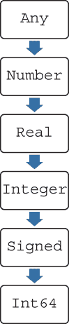
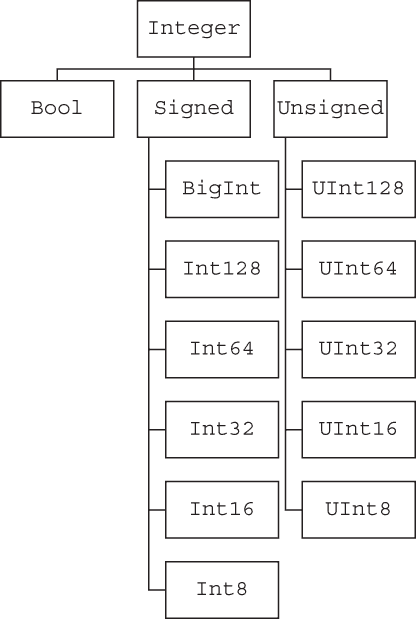
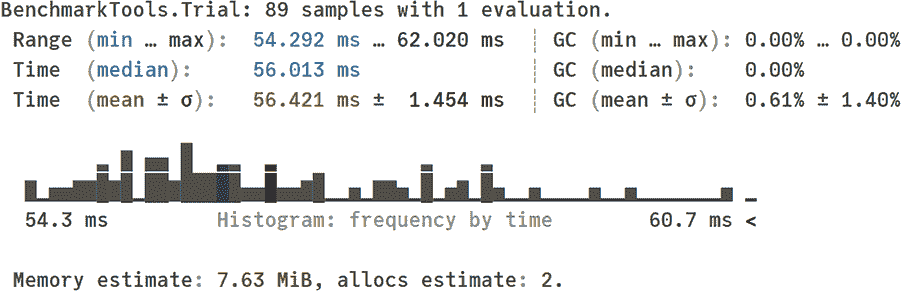
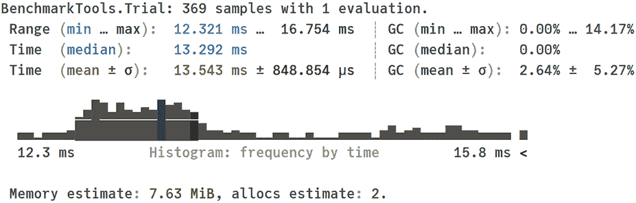

# 3 Julia 对项目扩展的支持

本章涵盖

+   使用 Julia 的类型系统

+   为函数定义多个方法

+   与模块和包一起工作

+   使用宏

在本章中，你将学习在创建大型项目时重要的 Julia 语言元素。我们从探索 Julia 的类型系统开始。了解类型层次结构的工作方式对于学习如何为单个函数定义多个方法至关重要，这是我们始于第 2.4 节讨论的话题。同样，当你使用现有的函数时，你必须知道如何找出它接受的参数类型。在调用函数时尝试传递错误类型的参数并引发异常是 Julia 中工作最常见错误之一。为了避免这些问题，你必须对 Julia 的类型系统设计有一个很好的理解。

当你为函数定义方法时，你可以限制它们接受的参数类型。这个特性使得你的 Julia 程序运行更快，更容易捕获错误，并使代码的工作方式更容易理解。

如果你的项目变得更大，你需要使用第三方功能，这些功能以包的形式提供，或者将你的源代码组织成模块。在本章中，你将学习如何使用 Julia 来实现这一点。

最后，在某些情况下，自动生成 Julia 代码是非常方便的。在 Julia 中，这是通过宏来实现的。编写自己的宏是一个高级话题，所以在本章中，你将学习如何使用 Julia 中可用的宏。

为了展示我在本章中介绍的材料在实际中的实用性，我们将改进第二章中最初实现的 winsorized_mean 函数，从性能、代码安全和可读性等方面进行优化。

## 3.1 理解 Julia 的类型系统

如第二章所述，第 2.4 节中实现的 winsorized_mean 函数不会与你可以传递给它的所有可能的参数值一起工作。我们如何确保它能够正确处理各种类型的传入参数？为了理解这一点，我们首先需要讨论 Julia 的类型系统。

### 3.1.1 Julia 中一个函数可能有多个方法

当你学习 Julia 语言时，你可能听说过它使用*多重分派*（在第 2.4 节中提到）。你可以为同一个函数定义多个方法，这些方法的实现根据传入参数的类型不同而不同。你可以使用 methods 函数来获取为给定函数定义的方法列表。以下是一个为设置 Julia 工作目录的 cd 函数定义的方法列表示例：

```
julia> methods(cd)
# 4 methods for generic function "cd":
[1] cd() in Base.Filesystem at file.jl:88
[2] cd(dir::AbstractString) in Base.Filesystem at file.jl:83
[3] cd(f::Function) in Base.Filesystem at file.jl:141
[4] cd(f::Function, dir::AbstractString) in Base.Filesystem at file.jl:91
```

你可以看到，一些函数的参数有类型注解；在这种情况下，它们是::Function 和::AbstractString，这限制了给定方法允许的值的类型，并根据传入值的类型改变其行为。

让我们在这里关注函数类型。直观上，所有函数都应该具有这种类型，通常情况下也是如此：

```
julia> sum isa Function
true
```

然而，如果我们检查 sum 函数的类型，我们会看到它不是 Function：

```
julia> typeof(sum)
typeof(sum)
julia> typeof(sum) == Function
false
```

要理解这里发生的事情，我们需要知道在 Julia 中，类型是按照层次结构组织的。这允许在定义函数的方法时将多个类型捆绑在一起。例如，在上一个例子中，cd 函数可以接受任何函数作为参数。

### 3.1.2 Julia 中的类型是按照层次结构排列的

在 Julia 中，所有类型都排列在一个树中，每个类型都有一个父类型。这个父类型，称为 *超类型*，可以使用 supertype 函数来检查：

```
julia> supertype(typeof(sum))
Function
```

因此，我们确实看到 sum 函数的类型是 Function 类型的 *子类型*。以下规则控制着类型树的工作方式（在这里我展示了主要的心智模型，并省略了一些边缘情况的讨论）：

+   树的根类型称为 Any。所有其他类型都是 Any 类型的子类型。如果你定义一个函数而没有指定其参数类型，就像我们在 2.4 节中所做的那样，Julia 默认假设允许 Any 类型；也就是说，你可以向这样的函数传递任何类型的值。

+   只有叶类型才能有实例（也就是说，有特定类型的对象）。可以实例化的类型被称为 *具体的*。换句话说，如果你有一个值，你可以确信它的类型是具体的，并且它是一个叶类型。因此，没有类型是 Function 的函数。每个函数都有其独特的具体类型，它是 Function 类型的子类型。

+   类型树中不是叶子的类型（例如，Any 或 Function）不能被实例化。它们仅作为中间类型，允许对其他类型进行逻辑分组，并被称为 *抽象的*。你可以通过调用 subtypes 函数来找到抽象类型的子类型列表。

具体类型与抽象类型

只有具体类型可以被实例化，不能有具体的子类型。你可以使用 isconcretetype 函数来检查给定的类型是否是具体的。抽象类型不能有实例，但可以有子类型。你可以使用 isabstracttype 函数来检查给定的类型是否是抽象的。因此，一个类型既抽象又具体是不可能的。

然而，有些类型既不是抽象的也不是具体的。当你学习更多关于参数化类型的内容时，你将在第四章遇到这些类型。这种类型的一个例子是 Vector。（注意，这个类型省略了其参数，这就是为什么它不是具体的；在 2.1 节中，你看到了一个具有 Vector{Int} 的值的例子，这是一个具体的类型，因为它有一个完全指定的参数，在这种情况下是 Int。）

### 3.1.3 查找类型的所有超类型

让我们看看 supertype 和 subtypes 函数的实际应用。首先，我们从你已知的 Int64 类型开始，检查它有哪些超类型。为此，我们定义以下递归函数：

```
julia> function print_supertypes(T)        ❶
           println(T)
           T == Any || print_supertypes(supertype(T))
           return nothing
       end
print_supertypes (generic function with 1 method)

julia> print_supertypes(Int64)
Int64
Signed
Integer
Real
Number
Any
```

❶ print_supertypes 函数接受一个类型作为其参数。

如您所见，类型层次结构相当深。这允许您的函数对它们接受的参数类型有精细的控制。

在我们的函数中，我们递归地遍历类型树。在这个例子中，我们从 Int64 类型开始。我们首先打印它。接下来，我们检查它是否等于 Any 类型。Int64 不等于 Any；因此，由于我们使用了||运算符，我们执行了 print_supertypes(supertype(T))表达式。它再次调用 print_supertypes 函数，这次以 Int64 的超类型作为参数，即 Signed。这个过程递归重复，直到 print_supertypes 函数以 Any 类型作为参数，即类型树的根。

在这一点上，我们不执行 print_supertypes 函数的递归调用，过程终止。图 3.1 说明了结果；箭头指示子类型关系。



图 3.1 print_supertypes 函数接受一个类型作为其参数。

此外，您可能已经注意到了我们代码中的 return nothing 行。它服务于 2.4 节中讨论的目的——即所有函数应明确指定它们想要返回的值。在这种情况下，因为我们不希望返回任何特定值，所以我们返回 nothing 值以表示函数中没有返回值。如果一个函数返回 nothing，Julia 的 REPL 不会在终端打印任何返回值。因此，在这个例子中，唯一打印的是 println(T)操作输出的类型。

### 3.1.4 查找类型的所有子类型

现在我们将进行相反的操作，尝试打印 Integer 抽象类型的所有子类型。以下是执行此操作的代码。在这个例子中，我们再次使用递归。这次，当类型没有子类型时，递归停止：

```
julia> function print_subtypes(T, indent_level=0)
           println(" " ^ indent_level, T)
           for S in subtypes(T)
               print_subtypes(S, indent_level + 2)
           end
           return nothing
       end
print_subtypes (generic function with 2 methods)

julia> print_subtypes(Integer)
Integer
  Bool
  Signed
    BigInt
    Int128
    Int16
    Int32
    Int64
    Int8
  Unsigned
    UInt128
    UInt16
    UInt32
    UInt64
    UInt8
```

您已经了解到整数类型有三个子类型：Bool、Signed 和 Unsigned。Bool 类型没有子类型，而 Signed 和 Unsigned 是抽象的，并且具有广泛的子类型，这些子类型在位（由类型名称中的数字表示；参见 2.1 节关于不同数值类型的位表示的讨论）中具有不同的内存占用。图 3.2 展示了这个类型层次结构。



图 3.2 Integer 类型的子类型层次结构

您可能会问，前述代码中的" " ^ indent_level 表达式是什么意思。它只是重复" "字符串 indent_level 次。第六章将详细介绍在 Julia 中处理字符串的更多细节。

### 3.1.5 类型联合

使用抽象类型引用类型集合是有用的。然而，有时你可能想要指定一个没有相应节点（抽象类型）的类型树中的类型列表。例如，如果你想在代码中只允许有符号或无符号整数，但不允许 Bool 值，你可以使用 Union 关键字。在我们的场景中，如果你写 Union{Signed, Unsigned}，你告诉 Julia 允许 Union 关键字后面的花括号内指定的任何类型。

在数据科学工作流程中，当我们指定某种类型与 Missing 类型之间的联合时，通常会使用 Union 关键字。例如，如果你写 Union{String, Missing}，你表示一个值必须是一个 String，但也可以是可选的缺失值。第七章更详细地介绍了处理缺失值。

### 3.1.6 决定在方法签名中放置哪些类型限制

现在我们回到 2.4 节中的 winsorized_mean 函数。它接受两个参数：一个整数 k 和一个向量 x。这些参数的适当类型限制是什么？对于 k，这很简单。根据你所学的，自然要求 k 是一个 Integer。那么 x 呢？让我们使用我们之前定义的 print_supertypes 函数检查向量 [1.0, 2.0, 3.0] 和范围 1:3 的类型和其超类型：

```
julia> print_supertypes(typeof([1.0, 2.0, 3.0]))
Vector{Float64}
DenseVector{Float64}
AbstractVector{Float64}
Any

julia> print_supertypes(typeof(1:3))
UnitRange{Int64}
AbstractUnitRange{Int64}
OrdinalRange{Int64, Int64}
AbstractRange{Int64}
AbstractVector{Int64}
Any
```

我们可以看到类型层次结构有点深，但类型似乎在 AbstractVector 层级上相遇；唯一的问题是，在第一种情况下，我们有一个 Float64 类型的参数，而在第二种情况下，是 Int64。一个直观且正确的方法是只删除参数，并要求 x 是 AbstractVector。这就是我们在 3.2 节将要做的。让我们看看 AbstractVector 是什么：

```
julia> AbstractVector
AbstractVector (alias for AbstractArray{T, 1} where T)
```

在别名解释中添加 where T 意味着 T 可以是任何类型。学习 [1.0, 2.0, 3.0] 和 1:3 的正确公共类型的一个替代方法是使用类型 join 函数：

```
julia> typejoin(typeof([1.0, 2.0, 3.0]), typeof(1:3))
AbstractVector{T} where T (alias for AbstractArray{T, 1} where T)
```

类型 join 函数找到其参数类型中最窄的父类型。你可能不会经常用到这个函数，但它在确认我们的直觉方面很有用。

与类型一起工作的主题比我们在这里所涵盖的复杂得多。我们将在第五章中回到这个话题，该章涵盖了参数类型和 where 关键字。然而，我在这本书中仍然省略了许多与类型相关的概念。在进行数据科学时，你通常不需要定义自己的类型，所以我省略了创建自己的类型、定义构造函数以及定义类型提升和转换规则的过程。关于这些主题的权威指南是 Julia 手册中的“类型”部分（[`docs.julialang.org/en/v1/manual/types/`](https://docs.julialang.org/en/v1/manual/types/))。

## 3.2 在 Julia 中使用多重分派

现在你已经知道了如何定义函数以及类型层次结构是如何工作的，你就可以学习如何定义具有不同方法的函数了。然后你可以将这种知识应用到我们的 winsorized_mean 函数中。

### 3.2.1 定义函数方法规则

幸运的是，如果你理解了 Julia 类型系统的工作原理，定义方法相对简单。你只需在函数参数后添加类型限制 ::。如第 3.1 节所述，如果省略类型指定部分，Julia 假设允许 Any 类型的值。

假设我们想要通过接受单个位置参数并具有以下行为来创建函数 fun：

+   如果向 fun 传递一个数字，它应该打印“传递了一个数字”，除非它是一个具有 Float64 类型的值，在这种情况下，我们希望打印一个 Float64 值。

+   在所有其他情况下，我们希望打印“不支持类型”。

这里有一个通过为函数 fun 定义三个方法来实现这种行为的例子：

```
julia> fun(x) = println("unsupported type")
fun (generic function with 1 method)

julia> fun(x::Number) = println("a number was passed")
fun (generic function with 2 methods)

julia> fun(x::Float64) = println("a Float64 value")
fun (generic function with 3 methods)

julia> methods(fun)
# 3 methods for generic function "fun":
[1] fun(x::Float64) in Main at REPL[3]:1
[2] fun(x::Number) in Main at REPL[2]:1
[3] fun(x) in Main at REPL[1]:1

julia> fun("hello!")
unsupported type

julia> fun(1)
a number was passed

julia> fun(1.0)
a Float64 value
```

在这个例子中，1 是一个 Number（因为它是一个 Int），但它不是 Float64，例如，所以最具体的匹配方法是 fun(x::Number)。

### 3.2.2 方法歧义问题

当为函数定义多个方法时，你必须避免方法歧义。当 Julia 编译器无法决定给定参数集应该选择哪个方法时，就会发生歧义。

通过一个例子更容易理解这个问题。假设你想要定义一个接受两个位置参数的 bar 函数。bar 函数应该告诉你这些参数中是否有任何是数字。这是实现这个函数的第一个尝试：

```
julia> bar(x, y) = "no numbers passed"
bar (generic function with 1 method)

julia> bar(x::Number, y) = "first argument is a number"
bar (generic function with 2 methods)

julia> bar(x, y::Number) = "second argument is a number"
bar (generic function with 3 methods)

julia> bar("hello", "world")
"no numbers passed"

julia> bar(1, "world")
"first argument is a number"

julia> bar("hello", 2)
"second argument is a number"

julia> bar(1, 2)
ERROR: MethodError: bar(::Int64, ::Int64) is ambiguous. Candidates:
  bar(x::Number, y) in Main at REPL[2]:1
  bar(x, y::Number) in Main at REPL[3]:1
Possible fix, define
  bar(::Number, ::Number)
```

如你所见，直到我们想要通过传递两个参数（第一个和第二个）都是数字来调用 bar 时，一切工作得都很顺利。在这种情况下，Julia 会抱怨它不知道应该调用哪个方法，因为可能有两个方法可以被选中。幸运的是，我们得到了如何解决这种情况的提示。我们需要定义一个额外的、解决歧义的方法：

```
julia> bar(x::Number, y::Number) = "both arguments are numbers"
bar (generic function with 4 methods)

julia> bar(1, 2)
"both arguments are numbers"

julia> methods(bar)
# 4 methods for generic function "bar":
[1] bar(x::Number, y::Number) in Main at REPL[8]:1
[2] bar(x::Number, y) in Main at REPL[2]:1
[3] bar(x, y::Number) in Main at REPL[3]:1
[4] bar(x, y) in Main at REPL[1]:1
```

多重分派有什么用？

理解 Julia 中方法的工作原理是至关重要的。正如你在前面的例子中所看到的，这种知识使用户能够根据函数任何位置参数的类型来区分函数的行为。结合第 3.1 节中讨论的灵活的类型层次系统，多重分派允许 Julia 程序员编写高度灵活和可重用的代码。

注意，通过在适当的抽象级别指定类型，用户不需要考虑所有可能的具体类型，这些类型可以传递给函数，同时仍然保留对接受值的类型的控制。例如，如果你定义了自己的 Number 子类型——例如，通过 Decimals.jl 包（[`github.com/JuliaMath/Decimals.jl`](https://github.com/JuliaMath/Decimals.jl)），该包具有支持任意精度十进制浮点计算的类型——你不需要重写你的代码。新类型将正常工作，即使原始代码并不是专门针对这个用例开发的。

### 3.2.3 改进的 winsorized mean 实现

我们已经准备好改进 winsorized_mean 函数的定义。以下是如何比我们在 2.4 节中做得更仔细地实现它的方法：

```
julia> function winsorized_mean(x::AbstractVector, k::Integer)
           k >= 0 || throw(ArgumentError("k must be non-negative"))
           length(x) > 2 * k || throw(ArgumentError("k is too large"))
           y = sort!(collect(x))
           for i in 1:k
y[i] = y[k + 1]
               y[end - i + 1] = y[end - k]
           end
           return sum(y) / length(y)
       end
winsorized_mean (generic function with 1 method)
```

首先请注意，我们已经限制了 x 和 k 的允许类型；因此，如果你尝试调用该函数，其参数必须匹配所需的类型：

```
julia> winsorized_mean([8, 3, 1, 5, 7], 1)
5.0

julia> winsorized_mean(1:10, 2)
5.5

julia> winsorized_mean(1:10, "a")
ERROR: MethodError: no method matching
winsorized_mean(::UnitRange{Int64}, ::String)
Closest candidates are:
  winsorized_mean(::AbstractVector{T} where T, ::Integer) at REPL[6]:1

julia> winsorized_mean(10, 1)
ERROR: MethodError: no method matching winsorized_mean(::Int64, ::Int64)
Closest candidates are:
  winsorized_mean(::AbstractVector{T} where T, ::Integer) at REPL[6]:1
```

此外，我们还可以看到一些使代码更健壮的代码更改。首先，我们检查传递的参数是否一致；也就是说，如果 k 是负数或太大，则无效，在这种情况下，我们通过调用带有 ArgumentError 作为其参数的 throw 函数来抛出错误。看看如果我们传递错误的 k 会发生什么：

```
julia> winsorized_mean(1:10, -1)
ERROR: ArgumentError: k must be non-negative

julia> winsorized_mean(1:10, 5)
ERROR: ArgumentError: k is too large
```

接下来，在排序之前，先复制存储在 x 向量中的数据。为了实现这一点，我们使用 collect 函数，它接受任何可迭代集合，并返回一个存储相同值的对象，具有 Vector 类型。我们将这个向量传递给 sort!函数以就地排序。

你可能会问，为什么需要使用 collect 函数来分配一个新的 Vector。原因是，例如，像 1:10 这样的范围是只读的；因此，之后我们就无法通过 y[i] = y[k + 1]和 y[end - the + 1] = y[end -- k]来更新 y。此外，通常 Julia 可以支持数组中的非 1 基索引（见[`github.com/JuliaArrays/OffsetArrays.jl`](https://github.com/JuliaArrays/OffsetArrays.jl)）。然而，Vector 使用 1 基索引。总之，使用 collect 函数将任何集合或通用 AbstractVector 转换为 Julia 中定义的标准 Vector 类型，该类型是可变的，并使用 1 基索引。

最后，请注意，我们不是手动执行 for 循环，而是使用了 sum 函数，这使得代码既简单又健壮。

在方法中添加参数类型注解是否会提高它们的执行速度？

你在 3.2 节中已经看到，给函数参数添加类型注解可以使 Julia 代码更容易阅读和更安全。用户经常问的一个自然问题是，这是否会提高代码执行速度。

如果你为函数只有一个方法，添加类型注解不会提高代码执行速度。原因是当函数被调用时，Julia 编译器知道你传递给它的参数类型，并使用这些信息生成本机机器代码。换句话说，类型限制信息不会影响代码生成。

然而，如果你为函数定义了多个方法，情况就不同了。这是因为类型限制会影响方法调度。然后，每个方法都可以有不同的实现，使用针对给定类型的值优化的算法。使用多重调度允许 Julia 编译器选择最适合你的数据的实现。

让我们来看一个例子。考虑第二章中引入的 sort 函数。通过调用 methods(sort)，你可以了解到它在 Base Julia 中定义了五个方法（如果你加载了 Julia 包，可能还有更多）。有一个用于排序向量的通用方法，其签名是 sort(v::AbstractVector; kwthe.)，还有一个用于排序范围如 1:3 的专用方法，其签名是 sort(r::Abstract- UnitRange)。

有这种专用方法的好处是什么？第二个方法定义为 sort(r::AbstractUnitRange) = r.。因为我们知道类型为 AbstractUnitRange 的对象已经是排序好的（它们是值范围，增量等于 1），所以我们只需返回传递的值。在这种情况下，利用方法签名中的类型限制可以显著提高排序操作的性能。在 3.4 节中，你将学习如何通过使用基准测试来检查这一点。

## 3.3 与包和模块一起工作

Julia 中的大型程序需要结构来帮助组织它们的代码。因此，很可能有人已经实现了一个像我们的 winsorized_mean 这样的函数，因为它是一种常用的统计方法。在 Julia 中，这样的函数是通过包共享的。所以，如果有人创建了一个像我们这样的函数，那么我们就不必编写自己的函数，而可以使用包中定义的那个。这就是为什么你需要知道如何在 Julia 中使用包。

### 3.3.1 Julia 中的模块是什么？

这个讨论的起点是理解模块的概念以及它与*包*和*文件*的关系。让我们从处理多个文件开始，因为这最容易理解。

假设你的代码被拆分成了三个文件——file1.jl、file2.jl 和 file3.jl——并且你想要创建一个主文件——比如，可以叫 main.jl——它使用这三个文件。你可以通过使用 include 函数来实现这一点。假设你的 main.jl 文件中的源代码如下：

```
include("file1.jl")
include("file2.jl")
include("file3.jl")
```

然后，如果你执行它，简化一下，它的工作方式就像你将 file1.jl 的内容复制并粘贴进去，然后复制并粘贴 file2.jl 的内容进去，最后复制并粘贴 file3.jl。正如你所看到的，include 函数的逻辑很简单。它只是允许你将代码拆分成多个文件，以使它们更小。

在 Julia 中，我刚刚展示的模式很常见。你创建一个主文件，它确实包含最小量的逻辑，并且主要作为一个包含实际代码存储的其他文件的位置。

那么，模块是什么？*模块*是一种定义独立的变量命名空间的方式。在 2.4 节中，我告诉你程序中有一个全局作用域。现在你将了解到可以有多个，因为每个模块定义了自己的独立的全局作用域。当你使用 Julia 时，默认的全局作用域也是一个名为 Main 的模块（因此，在本章的许多列表中，你已经看到函数是在 Main 中定义的）。

你可以使用模块关键字参数像这样定义一个名为 ExampleModule 的模块，该模块定义了一个名为 example 的单个函数：

```
module ExampleModule

function example()
    println("Hello")
end

end # ExampleModule
```

你可能已经注意到了这个例子中的两个风格问题：

+   模块内的代码按照惯例不缩进（与 Julia 中所有其他块不同）。模块可以非常大（甚至跨越数千行），因此为模块的全部内容使用四个空格缩进并不实用。

+   有一个惯例是在结束关键字参数后添加一个带有模块名称的注释。再次强调，模块通常包含数百甚至数千行代码。因此，很难从视觉上识别结束关键字是否完成了模块的定义。因此，使用注释明确指出结束是有用的。

在使用 Julia 进行数据科学项目时，你通常不需要定义自己的模块，所以让我强调一些关键的实际概念：

+   与 Python 不同，模块与代码如何组织成文件没有关系。你可以在单个文件中拥有许多模块，或者一个模块可以在多个文件中定义（使用 include 函数组合）。模块仅用于通过定义单独的变量命名空间和模块特定的全局作用域，为你的代码提供逻辑结构。

+   模块设计者可以使用 export 关键字决定哪些变量和函数对模块用户是可用的。

如果有人创建了一个打算与其他 Julia 用户共享的模块，它可以通过 Julia 通用注册表（[`github.com/JuliaRegistries/General`](https://github.com/JuliaRegistries/General)）进行注册。这些模块必须具有特殊结构，注册后，它们作为 *包* 可用。你可以在附录 A 中找到管理包的说明。

简单来说，你可以这样理解模块和包。模块赋予你将代码组织成连贯单元的能力。当开发者决定将模块提供的功能与其他 Julia 用户共享时，这个模块可以通过适当的元数据（如版本）进行标注，并注册为包。你可以在 Pkg.jl 包文档中找到有关包创建、开发和管理的详细信息，文档地址为 [`pkgdocs.julialang.org/v1/`](https://pkgdocs.julialang.org/v1/)。

Julia 的标准库

通常，当你想要使用一个包时，你需要安装它（安装将在附录 A 中解释）。然而，Julia 随附了一套标准库模块。它们的行为类似于常规的 Julia 包，但你不需要明确安装它们。我们在这个章节中使用的此类模块的例子是 Statistics。你可以在 Julia 手册的“标准库”部分找到所有标准库模块的文档（[`docs.julialang.org/en/v1/`](https://docs.julialang.org/en/v1/)）。

### 3.3.2 在 Julia 中如何使用包？

了解如何使用捆绑到包中的模块对于数据科学家来说很重要。你有两种基本方法可以使已安装包的功能在你的代码中使用：使用 import 或 using 关键字参数。当你使用 import 时，只有模块名称被引入到你的代码作用域中。要访问模块定义的变量和函数，你需要用模块名称作为前缀，后面跟着一个点。以下是一个例子：

```
julia> import Statistics

julia> x = [1, 2, 3]
3-element Vector{Int64}:
 1
 2
 3

julia> mean(x)
ERROR: UndefVarError: mean not defined

julia> Statistics.mean(x)
2.0
```

Statistics 模块是 Julia 标准库的一部分。它定义了基本统计函数，如 mean、std、var 和 quantile。正如你所见，当我们使用 import 时，我们必须在函数名称前加上 Statistics 以使一切正常工作。

相反，使用 using 关键字，我们将模块的所有导出功能引入到作用域中，以便可以直接使用。因此，根据前面的例子，我们有以下内容：

```
julia> using Statistics

julia> mean(x)
2.0
```

这段代码可以正常工作，因为 mean 函数是由 Statistics 模块导出的。

现在，你可能想知道在代码中你应该使用 import 还是 using 语句。这是 Python 用户经常问的问题，他们了解到只导入计划在代码中使用的函数或变量是安全的。在 Julia 中情况并非如此。

在大多数 Julia 代码中，你可以安全地使用 using 语句，这也是人们通常的做法。你已经知道原因：Julia 语言可以自动检测你试图使用的名称是否与已通过例如 using 关键字引入的相同名称冲突。在这种情况下，你会被告知存在问题。

让我通过一些最常见的情况来解释你可能会遇到名称冲突问题。在第一个例子中，你定义了一个变量名，后来通过 using 语句从模块中引入。为此，请启动一个新的 Julia 会话：

```
julia> mean = 1
1

julia> using Statistics
WARNING: using Statistics.mean in module Main conflicts with
an existing identifier.

julia> mean
1
```

如你所见，因为你已经定义了 mean 变量，加载导出 mean 函数的 Statistics 模块会产生警告，但不会覆盖你的定义。你必须使用带有前缀的形式从这个模块中调用 mean 函数——即 Statistics.mean。

在第二种情况下，你试图将一个与已加载模块中的函数名称冲突的变量名赋值（再次启动一个新的 Julia 会话）：

```
julia> using Statistics

julia> mean([1, 2, 3])
2.0

julia> mean = 1
ERROR: cannot assign a value to variable Statistics.mean from module Main
```

这次，你得到了一个错误；从你使用 Statistics 模块中的 mean 函数的那一刻起，你就不允许在代码中为其赋值。

在最后一种情况下，你首先加载一个模块，然后在使用模块中定义的相同名称之前定义一个冲突的变量名（再次启动一个新的 Julia 会话）：

```
julia> using Statistics

julia> mean = 1
1

julia> mean([1, 2, 3])
ERROR: MethodError: objects of type Int64 are not callable
```

现在，您被允许自由定义均值变量而不会收到警告。稍后，如果您想使用来自 Statistics 模块的 mean 函数，您又需要再次编写 Statistics.mean。为了方便起见，在这种情况下，您可以在全局作用域中定义变量而不会出现错误或警告。如果您永远不会计划使用从已加载的模块中加载的某个名称，则该名称不会被引入作用域。这在您已经有了一些正在运行的代码并需要开始使用一个导出您已在代码中使用名称的额外模块时非常有用。

在这种情况下，这种行为确保您不需要更改您的原始代码；它将像以前一样继续工作。您可以建立的心理模型是 Julia 是懒惰的；它在第一次使用时将变量引入作用域并解析其名称。

### 3.3.3 使用 StatsBase.jl 计算 winsorized 均值

现在我们准备回到我们的 winsorized_mean 示例。假设您已安装了 StatsBase.jl 包，您会发现它提供了 winsor 函数。在加载 Statistics 和 StatsBase 之后，您可以检查其帮助信息（启动一个新的 Julia 会话）：

```
julia> using Statistics

julia> using StatsBase

help?> winsor
search: winsor winsor! winsorized_mean

  winsor(x::AbstractVector; prop=0.0, count=0)

  Return an iterator of all elements of x that replaces either count or
  proportion prop of the highest elements with the previous-highest
  element and an equal number of the lowest elements with the next-lowest
  element.

  The number of replaced elements could be smaller than specified if
  several elements equal the lower or upper bound.

  To compute the Winsorized mean of x, use mean(winsor(x)).
```

让我们检查它是否确实产生了与我们的数据中的 winsorized_mean 相同的结果：

```
julia> mean(winsor([8, 3, 1, 5, 7], count=1))
5.0
```

为什么您需要重启您的 Julia 会话？

在本节中的几个示例中，我已提示您启动一个新的 Julia 会话。这是因为目前无法在定义了变量或函数后完全重置工作空间。例如，正如您在示例中看到的，在我们使用了来自 Statistics 模块的 mean 函数之后，我们不允许创建一个具有 mean 名称的变量。

由于用户在交互式工作时经常需要此功能，Julia 开发团队计划在未来添加清除工作空间而不重启 Julia 会话的功能。

如同往常，如果您想了解更多关于模块的详细信息，请参阅 Julia 手册 ([`docs.julialang.org/en/v1/manual/modules/`](https://docs.julialang.org/en/v1/manual/modules/))。有关如何创建包以及 Julia 包管理器如何工作的详细信息，请参阅 Pkg.jl 包文档 ([`pkgdocs.julialang.org/v1/`](https://pkgdocs.julialang.org/v1/))。附录 A 解释了如何在 Julia 中安装包以及如何获取它们功能方面的帮助。

在讨论模块和包的总结中，讨论 Julia 社区管理其功能的标准非常重要。就提供的功能和方法而言，Julia 的设计遵循与 Python 的“电池包含”方法相似的原则：

+   默认情况下，您只能访问在 Base 模块中定义的一组非常有限的函数，该模块在启动 Julia 时始终被加载。

+   Julia 随带了许多预安装的包，这些包构成了 Julia 标准库，你可以在需要时加载。这些模块提供了诸如字符串处理、处理日期和时间、多线程和分布式计算、I/O、排序、基本统计、随机数生成、线性代数、Julia 对象序列化和测试等功能。

如果你需要标准库中不可用的功能，最简单的方法是查找它所在的包。JuliaHub ([`juliahub.com/ui/Packages`](https://juliahub.com/ui/Packages)) 提供了一个灵活的网页界面，允许你浏览可用的包。

Base Julia 术语的含义

通常，在这本书以及其他关于 Julia 的资源中，你会看到术语 *Base Julia*。这指的是 Julia 定义的 Base 模块。此模块提供了一组定义，当你在运行 Julia 时，这些定义总是被加载。

使用 Julia 进行统计分析

Julia 随带 Statistics 模块作为其标准库的一部分。此模块包含基本统计功能，允许你计算数据的均值、方差、标准差、皮尔逊相关、协方差、中位数和分位数。

JuliaStats 收集中的更多高级统计功能提供了。本章讨论的 StatsBase.jl 包是 JuliaStats 的一部分。此包定义了允许你计算数据加权统计函数，并提供诸如排名和秩相关以及各种数据抽样算法的功能。

JuliaStats 的其他流行包包括 Distributions.jl（提供各种概率分布的支持）、HypothesisTests.jl（定义了许多常用的统计测试）、MultivariateStats.jl（用于多元统计分析，如主成分分析）、Distances.jl（用于高效计算向量之间的距离）、KernelDensity.jl（用于核密度估计）、Clustering.jl（提供数据聚类算法）和 GLM.jl（允许你估计广义线性模型）。

## 3.4 使用宏

你将在本书中遇到 Julia 的最后一个重要特性是宏。作为一名数据科学家，你可能不需要定义自己的宏，但预期你会经常使用它们，尤其是在第二部分，我们将讨论 DataFramesMeta.jl 包中定义的特定领域语言（DSL），它允许方便地处理数据框。

在我们当前的目的下，我们需要使用 @time 宏来比较我们的 winzorized_mean 函数与 StatsBase.jl 包提供的实现之间的性能。

那么，宏到底做了什么？*宏*用于生成你的程序代码。你可以把宏看作是接受 Julia 代码的解析表示并返回其转换（技术上，宏在 *抽象语法树* 的层面上操作 [[`mng.bz/5mKZ`](http://mng.bz/5mKZ)]）的函数。

重要的是要理解，宏是在 Julia 代码解析之后、编译之前执行的。如果你了解 Lisp 编程语言，你会注意到 Julia 和 Lisp 在支持宏的方式上有相似之处。请注意，在 Julia 中，宏与执行源代码文本操作的 C 宏不同。

你可以很容易地在代码中识别宏调用，因为宏总是以 @ 字符为前缀。以下是一个宏调用的例子：

```
julia> @time 1 + 2
  0.000000 seconds
3
```

在这个例子中，我们使用 @time 宏并将 1 + 2 表达式传递给它。这个宏执行传递的表达式并打印出执行所需的时间。如你所见，与函数不同，你可以不使用括号来调用宏。然而，你也可以将传递给宏的表达式用括号括起来：

```
julia> @time(1 + 2)
  0.000000 seconds
3
```

这里是一个调用接受两个参数的宏的例子：

```
julia> @assert 1 == 2 "1 is not equal 2"
ERROR: AssertionError: 1 is not equal 2

julia> @assert(1 == 2, "1 is not equal 2")
ERROR: AssertionError: 1 is not equal 2
```

注意，如果你不使用括号，传递给宏的表达式应该用空格分隔（在这种情况下不能使用逗号）。

你现在知道了宏是如何被调用的，但它们到底做了什么？正如我所说的，它们重写你的代码以生成新的、转换后的代码。你可以通过使用 @macroexpand 宏轻松地看到这段重写的代码。让我们从一个简单的 @assert 宏的例子开始：

```
julia> @macroexpand @assert(1 == 2, "1 is not equal 2")
:(if 1 == 2
      nothing
  else
      Base.throw(Base.AssertionError("1 is not equal 2"))
  end)
```

如你所见，在这种情况下，生成的代码相对简单。@assert 宏创建了一个 if 块，如果断言为真则什么都不做，如果断言为假则抛出错误。

当然，通常宏可以生成更复杂的代码。例如，@time 宏执行多个操作以确保正确测量传递表达式的执行时间：

```
julia> @macroexpand @time 1 + 2
quote
    #= timing.jl:206 =#
    while false
        #= timing.jl:206 =#
    end
    #= timing.jl:207 =#
    local var"#11#stats" = Base.gc_num()
    #= timing.jl:208 =#
    local var"#14#compile_elapsedtime" =
    Base.cumulative_compile_time_ns_before()
    #= timing.jl:209 =#
    local var"#13#elapsedtime" = Base.time_ns()
    #= timing.jl:210 =#
    local var"#12#val" = 1 + 2
    #= timing.jl:211 =#
    var"#13#elapsedtime" = Base.time_ns() - var"#13#elapsedtime"
    #= timing.jl:212 =#
    var"#14#compile_elapsedtime" =
    Base.cumulative_compile_time_ns_after() - var"#14#compile_elapsedtime"
    #= timing.jl:213 =#
    local var"#15#diff" = Base.GC_Diff(Base.gc_num(), var"#11#stats")
    #= timing.jl:214 =#
    Base.time_print(var"#13#elapsedtime", (var"#15#diff").allocd,
    (var"#15#diff").total_time, Base.gc_alloc_count(var"#15#diff"),
    var"#14#compile_elapsedtime", true)
    #= timing.jl:215 =#
    var"#12#val"
end
```

如你所见，看似简单的测量执行时间的操作实际上相当复杂。

现在你可能会问为什么 @time 是一个宏而不是一个函数。如果你定义的是 time 函数而不是宏，并编写 time(1 + 2)，那么 1 + 2 表达式会在传递给函数之前被评估，因此无法测量其执行时间。为了测量一个表达式的执行时间，我们必须在表达式运行之前增加适当的代码。这只有在解析 Julia 代码时才可能实现。

值得记住的是 @macroexpand 宏，因为你在学习 DataFramesMeta.jl 包的第二部分时会发现它很有用。

如本章惯例，让我们使用 winsorized_mean 示例来测试宏。我们将比较我们的解决方案与 StatsBase.jl 实现的性能。对于基准测试，我们将使用 BenchmarkTools.jl 包中的@benchmark 宏。它与@time 宏的不同之处在于它多次运行表达式，然后计算观察到的运行时间的统计数据（在运行此代码之前，请使用第 3.2 节中的代码定义 winsorized_mean 函数）。在示例代码中，我在 rand(10⁶)表达式后添加了一个分号（;），以抑制将其值打印到终端。

我们从基准测试我们的 winsorized_mean 函数开始：

```
julia> using BenchmarkTools

julia> x = rand(10⁶);                        ❶

julia> @benchmark winsorized_mean($x, 10⁵)   ❷
```

❶ 在 REPL 传入的表达式末尾使用分号（;）来抑制将其值打印到终端

❷ 由于 x 是一个全局变量，使用$x 来确保测试代码的正确基准测试

您应该得到与图 3.3 中所示类似的计时结果（在您的机器上，精确的计时可能略有不同）。



图 3.3 winsorized_mean 函数的执行时间基准测试

现在我们使用 Julia 统计生态系统中的包提供的函数来基准测试 winsorized mean 的计算：

```
julia> using Statistics

julia> using StatsBase

julia> @benchmark mean(winsor($x; count=10⁵))
```

代码产生了图 3.4 中所示的计时结果。使用库函数要快得多。



图 3.4 使用 winsor 函数的执行时间基准测试

在示例中，我们首先使用 rand 函数从范围[0, 1]生成一百万个随机浮点数。基准测试的结果表明，库函数的速度大约是我们代码的四倍。这个原因相对容易猜测。在我们的函数中，我们排序整个向量，而通常情况下，由于 k 与向量大小相比通常相对较小，所以不需要这样做。库解决方案使用 partialsort!函数来提高其效率。

使用@benchmark 宏的一个重要方面是，我们使用$x 而不是仅仅使用 x。这是为了正确评估我们检查的表达式的执行时间。作为规则，请记住，在您想要基准测试的表达式中使用$前缀来标记所有全局变量（这仅适用于基准测试，并不是使用宏时的通用规则）。有关此要求的详细信息，请参阅 BenchmarkTools.jl 包的文档([`github.com/JuliaCI/BenchmarkTools.jl`](https://github.com/JuliaCI/BenchmarkTools.jl))。简短的解释如下。回想一下，由于 x 是一个全局变量，使用它的代码不是类型稳定的。当@benchmark 宏看到$x 时，它被指示在运行基准测试之前将 x 变量转换为局部变量（因此是类型稳定的）。

BenchmarkTools.jl 包也提供了一个接受与 @benchmark 相同参数的 @btime 宏。区别在于它产生的输出更简洁，类似于 @time，并且打印的时间是基准测试期间测量的最小时间。以下是一个示例：

```
julia> @btime mean(winsor($x; count=10⁵))
  12.542 ms (2 allocations: 7.63 MiB)
0.5003188657625405
```

注意，报告的时间与 @benchmark mean(winsor($x; count=10⁵)) 生成的最小时间相似。

作为应用宏的最后一个例子，尝试在你的 Julia REPL 中写下以下内容：

```
julia> @edit winsor(x, count=10⁵)
```

`@edit` 是我最喜欢的宏之一。在你的源代码编辑器中，它会直接带你到你所使用函数的源代码（你可以通过设置 `JULIA_EDITOR` 环境变量来指定应该使用哪个编辑器；参见 [`mng.bz/yaJy`](http://mng.bz/yaJy)）。使用 Julia 的一个巨大好处是，这个函数很可能是用 Julia 编写的，因此你可以轻松地检查其实现。我建议你检查 winsor 函数的实现，以了解其创造者使用了哪些技巧来使其运行得更快。

练习 3.1 创建一个名为 x 的变量，其值为从 1 到 10⁶ 的范围。现在，使用 `collect` 函数创建一个 y 向量，其包含与 x 范围相同的值。使用 `@btime` 宏，通过使用 `sort` 函数来检查对 x 和 y 进行排序的时间。最后，使用 `@edit` 宏，检查在排序 x 范围时将被调用的 `sort` 函数的实现。

这就是你需要了解关于宏的所有内容，以便使用它们。你几乎不需要编写自己的宏，因为大多数时候，编写函数就足以得到你想要的结果。然而，有时你希望在代码执行之前执行某些操作。在这些情况下，宏是实现预期结果的方法。

## 概述

+   变量的类型之间存在层次关系，并形成一个树状结构。树的根是 `Any` 类型，它可以匹配任何值。具有子类型的类型被称为 *抽象* 类型，不能有实例。可以有实例的类型不能有子类型，被称为 *具体* 类型。

+   一个函数可以有多个方法。每个方法都有一个独特的参数类型集，它允许使用这些参数。

+   在 Julia 中，模块用于创建独立的命名空间（全局作用域）。模块最常见的使用是创建包。包可以注册到 Julia 通用注册表中，并供所有开发者使用。

+   Julia 中的宏允许你在代码执行之前将其转换为其他代码。当函数不允许你达到预期结果时，它们有时很有用。

+   当你安装 Julia 时，它“内置”了许多模块。这些模块作为标准库的一部分提供，并提供了在实践中最常需要的功能。你可以在 JuliaHub 中探索 Julia 生态系统中的额外包。
