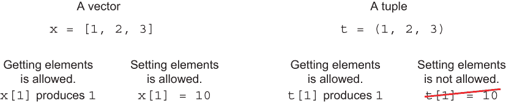
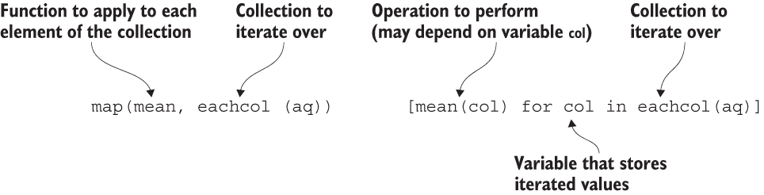
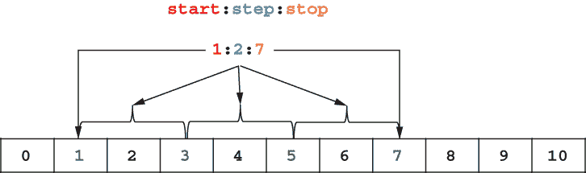
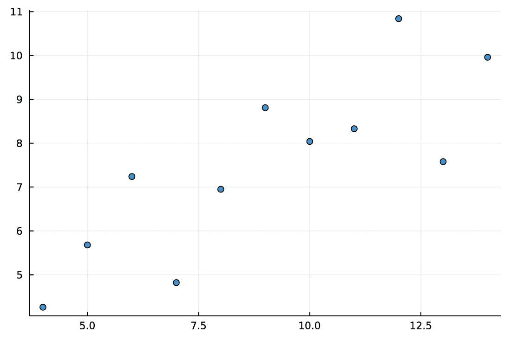
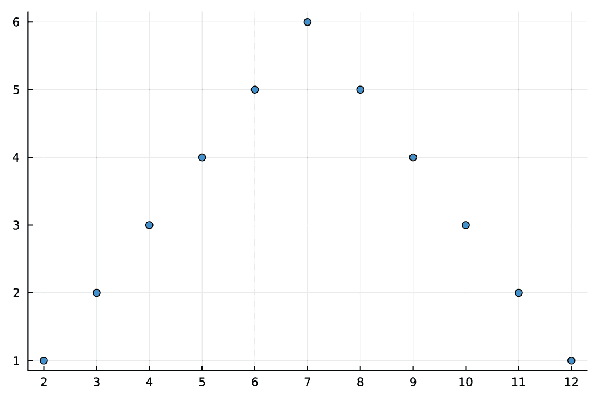

# 4 在 Julia 中处理集合

本章涵盖

+   与数组一起工作

+   使用字典来处理键值映射

+   处理不可变集合类型：元组和命名元组

在第二章和第三章中，你学习了 Julia 语言的基本元素。我们一直在所有示例中主要使用标量类型（如数字）。然而，在数据科学中，你通常会处理数据 *集合*，即一组变量数量的数据项。在第二章中已经介绍的一种集合类型是向量。

在本章中，你将学习如何使用在实际情况中最常用的几个基本集合：数组、字典、元组和命名元组。

## 4.1 与数组一起工作

在本节中，你将学习在 Julia 中处理数组的基础知识：它们的创建、对数组的索引以及你可以期望对这些数组执行的最常见操作。数组是数据科学中常用的集合。大多数机器学习算法都期望以数组形式存储数据作为它们的输入。在 Julia（与例如 Python 相比），数组是语言规范的一部分，因此它们配备了方便的语法。与它们一起工作只需要学习一套规则，而且它们运行速度快。

要学习如何在 Julia 中处理数组，我们将分析安斯康姆四重奏数据（[`mng.bz/69ZZ`](http://mng.bz/69ZZ)）。正如你将在本节中学到的，它由四个数据集组成，这些数据集具有相同的基本描述性统计，但分布却非常不同。每个数据集包含 11 个观测值，有两个变量：一个表示为 x 的特征和一个表示为 y 的目标。表 4.1 显示了数据。

表 4.1 安斯康姆四重奏数据

| 数据集 1 | 数据集 2 | 数据集 3 | 数据集 4 |
| --- | --- | --- | --- |
| x | y | x | y | x | y | x | y |
| 10.0 | 8.04 | 10.0 | 9.14 | 10.0 | 7.46 | 8.0 | 6.58 |
| 8.0 | 6.95 | 8.0 | 8.14 | 8.0 | 6.77 | 8.0 | 5.76 |
| 13.0 | 7.58 | 13.0 | 8.74 | 13.0 | 12.74 | 8.0 | 7.71 |
| 9.0 | 8.81 | 9.0 | 8.77 | 9.0 | 7.11 | 8.0 | 8.84 |
| 11.0 | 8.33 | 11.0 | 9.26 | 11.0 | 7.81 | 8.0 | 8.47 |
| 14.0 | 9.96 | 14.0 | 8.10 | 14.0 | 8.84 | 8.0 | 7.04 |
| 6.0 | 7.24 | 6.0 | 6.13 | 6.0 | 6.08 | 8.0 | 5.25 |
| 4.0 | 4.26 | 4.0 | 3.10 | 4.0 | 5.39 | 19.0 | 12.50 |
| 12.0 | 10.84 | 12.0 | 9.13 | 12.0 | 8.15 | 8.0 | 5.56 |
| 7.0 | 4.82 | 7.0 | 7.26 | 7.0 | 6.42 | 8.0 | 7.91 |
| 5.0 | 5.68 | 5.0 | 4.74 | 5.0 | 5.73 | 8.0 | 6.89 |

我们的目标是对这些数据集执行以下操作：

+   计算变量 x 和 y 的平均值和标准差

+   计算变量 x 和 y 的皮尔逊相关系数

+   通过 x 解释 y 并计算其确定系数 R²

+   通过使用图表来直观地调查数据

书中用于表格数据的术语

在本书中描述表格数据时，我使用了以下术语。数据行被称为观测值，列被称为变量。

在预测模型的上下文中，由模型解释的变量被称为*目标*（其他交替使用的名称包括输出或因变量）。用于进行预测的变量被称为特征（其他名称包括输入或自变量）。

在 MLJ.jl 生态系统（[`github.com/alan-turing-institute/MLJ.jl`](https://github.com/alan-turing-institute/MLJ.jl)）中使用了相同的术语，这是一个在 Julia 中用于机器学习的流行工具箱。

### 4.1.1 将数据放入矩阵中

我们想要分析存储在表 4.1 中的数据。该表有八个列和 11 行。每一列代表一个变量。请注意，列 1、3、5 和 7（奇数列）分别是数据集 1、2、3 和 4 中的 x 特征变量。同样，列 2、4、6 和 8（偶数列）是相应数据集中的 y 目标变量。

创建矩阵

在分析数据之前，我们需要将其存储在计算机的内存中。由于数据是同质的类型（这些都是数字），使用矩阵作为容器是自然的。在本节中，你将看到如何创建这个矩阵并检查其基本属性。

我们从创建一个变量并将其绑定到存储我们数据的矩阵开始，如下所示。

列表 4.1 定义存储 Anscombe 的四重奏数据的矩阵

```
julia> aq = [10.0   8.04  10.0  9.14  10.0   7.46   8.0   6.58
              8.0   6.95   8.0  8.14   8.0   6.77   8.0   5.76
             13.0   7.58  13.0  8.74  13.0  12.74   8.0   7.71
              9.0   8.81   9.0  8.77   9.0   7.11   8.0   8.84
             11.0   8.33  11.0  9.26  11.0   7.81   8.0   8.47
             14.0   9.96  14.0  8.1   14.0   8.84   8.0   7.04
              6.0   7.24   6.0  6.13   6.0   6.08   8.0   5.25
              4.0   4.26   4.0  3.1    4.0   5.39  19.0  12.50
             12.0  10.84  12.0  9.13  12.0   8.15   8.0   5.56
              7.0   4.82   7.0  7.26   7.0   6.42   8.0   7.91
              5.0   5.68   5.0  4.74   5.0   5.73   8.0   6.89]
11×8 Matrix{Float64}:
 10.0   8.04  10.0  9.14  10.0   7.46   8.0   6.58
  8.0   6.95   8.0  8.14   8.0   6.77   8.0   5.76
 13.0   7.58  13.0  8.74  13.0  12.74   8.0   7.71
  9.0   8.81   9.0  8.77   9.0   7.11   8.0   8.84
 11.0   8.33  11.0  9.26  11.0   7.81   8.0   8.47
 14.0   9.96  14.0  8.1   14.0   8.84   8.0   7.04
  6.0   7.24   6.0  6.13   6.0   6.08   8.0   5.25
  4.0   4.26   4.0  3.1    4.0   5.39  19.0  12.5
 12.0  10.84  12.0  9.13  12.0   8.15   8.0   5.56
  7.0   4.82   7.0  7.26   7.0   6.42   8.0   7.91
  5.0   5.68   5.0  4.74   5.0   5.73   8.0   6.89
```

aq 变量是一个包含 Float64 值的 Matrix。请注意，在 Julia 中，创建存储预定义数据的矩阵很容易。你只需将数据的一行作为输入的单行写入，使用空白作为列的分隔符，并用方括号将一切括起来。如果你想要了解构建数组的其他选项，请参阅 Julia 手册中的“数组字面量”部分（[`mng.bz/M0vo`](http://mng.bz/M0vo)）。

在列表 4.1 中我们操作输出的头部，我们可以看到矩阵有 11 行和 8 列。我们可以通过使用 size 函数来检查这一点：

```
julia> size(aq)
(11, 8)

julia> size(aq, 1)
11

julia> size(aq, 2)
8
```

size 函数可以接受一个参数，在这种情况下，它返回一个维度的元组，或者接受两个参数，其中第二个参数是我们想要调查的维度（其中 1 代表行，2 代表列）。

与元组一起工作

在继续前进之前，让我们简要讨论一下什么是*tuple*。你可以把它想象成一个向量，但长度固定且不可变。它是使用括号创建的，而向量是使用方括号创建的。你可以像向量一样获取元组的元素，但与向量不同，你不能设置它们，因为元组是不可变的；参见图 4.1。Julia 中的元组与 Python 中的元组类似，它们的类型是 Tuple。



图 4.1 向量和元组的比较。你可以获取向量和元组的元素，但 Julia 只允许设置向量的元素。

图 4.1 中所示操作的执行结果，在 Julia REPL 中如下所示：

```
julia> v = [1, 2, 3]
3-element Vector{Int64}:
 1
 2
 3

julia> t = (1, 2, 3)
(1, 2, 3)

julia> v[1]
1

julia> t[1]
1

julia> v[1] = 10
10

julia> v
3-element Vector{Int64}:
 10
  2
  3

julia> t[1] = 10
ERROR: MethodError: no method matching
setindex!(::Tuple{Int64, Int64, Int64}, ::Int64, ::Int64)
```

在这个例子中，请注意，向量和元组都使用 *基于 1 的索引*。这意味着，正如在第二章中讨论的，向量和元组的第一个元素的索引为 1。在 R、Fortran 和 MATLAB 中也使用相同的约定。如果你大量使用 Python、Java 或 C++，这一点尤其重要，因为这些编程语言使用基于 0 的索引。

元组与向量的比较

你可能会问使用元组而不是向量的好处是什么。考虑如下。

元组是不可变的，因此如果你想在代码中确保用户无法更改它们，使用它们会更安全。

由于元组是不可变的，因此它们更快，因为编译器不需要使用动态内存分配来处理它们（在类型稳定的代码中），并且能够知道存储在其中的变量的类型，即使它们是异构的（有关确保 Julia 代码性能的提示列表，请参阅 Julia 手册，[`mng.bz/epPP`](http://mng.bz/epPP)）。

作为缺点，我不建议创建存储大量元素的元组（它们最适合存储小集合）。大元组可能会导致你的程序编译时间显著增加。

Julia 中向量的表示

在本节中，我们讨论的是 Julia 中使用的一种基本向量类型，它具有 Vector 类型。一般来说，Julia 支持其他向量类型，你将在接下来的章节中了解到其中的一些。特别是，了解以下内容是有用的：与 Vector 类型不同，某些向量类型是不可变的或不需要基于 1 的索引。

对于更技术性的读者，让我提一下，在 Julia 中，元组是在栈上分配的，而标准数组是在堆上分配的。如果你不知道这些内存分配模型，请参阅 [`mng.bz/o5a2`](http://mng.bz/o5a2)。为了有效地使用 Julia，你不需要知道内存管理是如何处理的细节。只需了解堆分配比栈分配慢即可。此外，堆分配需要运行一个称为 *垃圾回收* (*GC*) 的额外过程。GC 负责释放不再被引用的堆分配内存。

图 4.2 展示了创建元组与向量的基准测试。你可以在内存估计部分（用矩形标记）看到，创建向量需要一次内存分配，而创建元组不会导致任何分配。因此，在 GC 部分（用圆角矩形标记），你可以看到，在基准测试元组创建时，GC 从未触发，而在基准测试向量时，GC 有时会运行。


图 4.2 比较元组与向量创建时间的基准测试。创建元组更快，并且不会导致堆内存分配。在执行此图所示的计算之前，请使用 BenchmarkTools 运行。

为了总结向量和元组的比较，让我们讨论当传递混合类型的数据时它们的构造。当你使用方括号构造一个向量时，Julia 会尝试将所有传递的元素提升到公共类型，而构造元组不会导致这种转换。以下是一个例子：

```
julia> [1, 2.0]
2-element Vector{Float64}:
 1.0
 2.0

julia> (1, 2.0)
(1, 2.0)
```

在代码中，当构造向量时，我们传递 1（一个整数）和 2.0（一个浮点值）。在产生的向量中，整数 1 被转换为浮点数 1.0。当构造元组时，传递的值被存储在其中而不进行任何转换。

### 4.1.2 计算矩阵中存储的数据的基本统计量

现在我们已经准备好计算存储在 aq 矩阵中的变量的均值和标准差。为此，我们将使用 Statistics 模块中定义的 mean 和 std 函数：

```
julia> using Statistics

julia> mean(aq; dims=1)
1×8 Matrix{Float64}:
 9.0  7.50091  9.0  7.50091  9.0  7.5  9.0  7.50091

julia> std(aq; dims=1)
1×8 Matrix{Float64}:
 3.31662  2.03157  3.31662  2.03166  3.31662  2.03042  3.31662  2.03058
```

在第 4.1 列出的 aq 矩阵中，第 1、3、5 和 7 列存储 x 特征。在所提供的摘要中，无论是均值函数还是标准差函数，位置 1、3、5 和 7 的值都是相等的。这意味着在这些所有情况下，x 特征具有相同的均值和标准差。对于存储 y 目标变量的第 2、4、6 和 8 列，也存在相同的情况。

注意，我们使用了 dims 关键字参数来指示我们想要计算统计量的维度。这里 dims=1，因为我们有按行存储的观测值，所以我们想要在 aq 矩阵的第一维上计算统计量。换句话说，我们按列计算 aq 矩阵的统计量，因为我们想要分析的数据存储为其列。

让我们讨论两种计算所需统计量的替代方法。这是第一种方法：

```
julia> map(mean, eachcol(aq))
8-element Vector{Float64}:
 9.0
 7.500909090909093
 9.0
 7.500909090909091
 9.0
 7.500000000000001
 9.0
 7.50090909090909

julia> map(std, eachcol(aq))
8-element Vector{Float64}:
 3.3166247903554
 2.031568135925815
 3.3166247903554
 2.0316567355016177
 3.3166247903554
 2.030423601123667
 3.3166247903554
 2.0305785113876023
```

让我们分析这个例子。eachcol(aq)调用返回一个迭代矩阵列的集合（作为参考，eachrow(aq)将迭代其行）。接下来，我们应用 map 函数（在第二章中讨论过），它将适当的函数（均值和标准差，分别）应用于每一列。作为第二章的提醒，请注意，我们可以像这样使用 do-end 符号与 map 函数：

```
map(eachcol(aq)) do col
    mean(col)
end
```

然而，在这种情况下，这会比将 mean 函数作为 map 的第一个位置参数传递更冗长。

而不是使用 map 函数，我们可以使用理解来通过迭代 aq 矩阵的列创建一个向量：

```
julia> [mean(col) for col in eachcol(aq)]
8-element Vector{Float64}:
 9.0
 7.500909090909093
 9.0
 7.500909090909091
 9.0
 7.500000000000001
 9.0
 7.50090909090909

julia> [std(col) for col in eachcol(aq)]
8-element Vector{Float64}:
 3.3166247903554
 2.031568135925815
 3.3166247903554
 2.0316567355016177
 3.3166247903554
 2.030423601123667
 3.3166247903554
 2.0305785113876023
```

如您所见，理解使用了 for 关键字参数，之后我们指定哪个变量（在这种情况下为 col）应存储由迭代器产生的值（在这种情况下为 eachcol(aq)）。然后在 for 关键字之前，我们写出应该评估的表达式，它可以依赖于 col 变量。结果，我们得到一个收集产生的结果的数组。图 4.3 比较了使用 map 函数和理解时的语法。



图 4.3 使用 map 函数和列表推导式时的语法。当使用列表推导式时，您明确地为用于存储迭代值的变量命名（在我们的例子中是 col）。

在大多数情况下，使用列表推导式和使用 map 函数之间的选择取决于程序员的便利性和代码可读性（特别是，您可以期望相似的性能）。它们的区别在您想要同时操作几个集合时最为明显。请参阅 Julia 手册 [`mng.bz/aPZo`](http://mng.bz/aPZo) 和 [`mng.bz/gR1x`](http://mng.bz/gR1x) 以获取示例。另一个区别是，列表推导式始终产生数组，而 map 函数可以产生不同类型的值。以下是一个示例，展示如何取存储在元组中的几个数字的绝对值。列表推导式产生一个向量，而 map 返回一个元组：

```
julia> x = (-2, -1, 0, 1, 2)
(-2, -1, 0, 1, 2)

julia> [abs(v) for v in x]
5-element Vector{Int64}:
 2
 1
 0
 1
 2

julia> map(abs, x)
(2, 1, 0, 1, 2)
```

### 4.1.3 数组索引

通常，您想选择矩阵的一部分以便以后使用它。这可以通过索引轻松完成。

我们通过展示另一种指定计算 aq 矩阵中列统计的方法来说明索引：

```
julia> [mean(aq[:, j]) for j in axes(aq, 2)]
8-element Vector{Float64}:
 9.0
 7.500909090909093
 9.0
 7.500909090909091
 9.0
 7.500000000000001
 9.0
 7.50090909090909

julia> [std(aq[:, j]) for j in axes(aq, 2)]
8-element Vector{Float64}:
 3.3166247903554
 2.031568135925815
 3.3166247903554
 2.0316567355016177
 3.3166247903554
 2.030423601123667
 3.3166247903554
 2.0305785113876023
```

这次，我们在 aq 矩阵中使用索引。axes 函数与之前讨论的 size 函数类似。区别在于它不是返回给定维度的长度，而是在给定维度中产生一个有效的索引范围。在这个例子中，如下所示：

```
julia> axes(aq, 2)
Base.OneTo(8)

help?> Base.OneTo
  Base.OneTo(n)

  Define an AbstractUnitRange that behaves like 1:n, with the added
  Distinction that the lower limit is guaranteed (by the type system)
  to be 1.
```

如您所见，索引从 1 开始，跨越到 8。我包括了返回的 OneTo 对象的文档，以便您确切了解它代表什么。在实践中，您不需要自己构建它，但偶尔您可能会遇到由标准 Julia 函数产生的它，因此了解它的作用是有价值的。

为什么 OneTo 以 Base 开头？

我们可以看到，Julia 通过在前面加上 Base 来打印 OneTo 类型的信息——例如，Base.OneTo(8)。这个输出给我们提供了两条信息：

+   OneTo 类型定义在 Base 模块中（这是启动 Julia 时始终加载的默认模块）。

+   此类型未导出到 Main 模块。因此，您只能通过在其名称前加上定义它的模块名称来访问它。

第 3.3 节解释了 Base 和 Main 模块以及名称导出是如何工作的。

在我们的理解中，因为我们现在正在迭代矩阵的第二维索引，我们需要提取它的单个列。这是通过使用 aq[:, j] 表达式完成的。冒号 (:) 表示我们选择 aq 的第 j 列的所有行。

矩阵索引：实用指南

如果你使用矩阵，使用两个索引（行和列）来访问其元素，就像前面的例子一样。同样，当索引向量时，使用单个索引。一般来说，Julia 允许其他索引风格，这在编写高级泛型代码时很有用，但我建议你坚持“数组维度与索引数量一样多”的基本规则，这样会使你的代码更易于阅读和调试。

关于 aq[:, j]表达式的最后一点是，它会复制我们矩阵的第 j 列。有时，出于性能考虑，你可能更愿意不复制数据，而是使用 aq 矩阵的视图。这可以通过使用视图函数或@view 宏来实现，如下所示：

```
julia> [mean(view(aq, :, j)) for j in axes(aq, 2)]
8-element Vector{Float64}:
 9.0
 7.500909090909093
 9.0
 7.500909090909091
 9.0
 7.500000000000001
 9.0
 7.50090909090909

julia> [std(@view aq[:, j]) for j in axes(aq, 2)]
8-element Vector{Float64}:
 3.3166247903554
 2.031568135925815
 3.3166247903554
 2.0316567355016177
 3.3166247903554
 2.030423601123667
 3.3166247903554
 2.0305785113876023
```

在第一个例子中，当计算平均值时，我们使用视图函数。在这种情况下，我们将索引作为连续的参数传递给它。当使用@view 宏时，我们可以使用标准的索引语法。我在计算标准差时展示了这种方法。除了语法差异之外，编写 view(aq, :, j)和@view aq[:, j]是等效的。

什么是视图？

在 Julia 中，如果你有一个数组并创建其视图，则不会从父数组复制任何数据。相反，创建了一个轻量级对象，它延迟引用父数组。因此，父数组和它的视图共享相同的内存来存储数据。如果你修改视图中的数据，这种更改也会在父数组中可见。

在@view 宏的上下文中，让我提醒你一下 Julia 中宏工作方式的一个重要方面（我们在第三章讨论过）。如果你不带括号调用宏，它会急切地考虑所有跟随的内容作为一个表达式；尽可能多的代码被视为一个表达式。

这里有一个例子，说明这会导致问题。假设你想要创建一个包含向量两个视图的元组，并尝试以下代码：

```
julia> x = [1, 2, 3, 4]
4-element Vector{Int64}:
 1
 2
 3
 4

julia> (@view x[1:2], @view x[3:4])
ERROR: LoadError: ArgumentError: Invalid use of @view macro:
argument must be a reference expression A[...].
```

错误的原因是什么？问题是代码中的 x[1:2], @view[3:4]部分是一个单独的表达式，传递给了第一个@view 调用。为了解决这个问题，你需要使用第二种宏调用风格，它使用括号（就像调用函数一样）：

```
julia> (@view(x[1:2]), @view(x[3:4]))
([1, 2], [3, 4])
```

### 4.1.4 复制与创建视图的性能考虑

你可能会问复制对操作性能的影响有多大。本节将介绍如何比较复制和创建视图的性能。为此，我们需要一个比 aq 矩阵大得多的数据集，因为对于实际相关的基准测试来说，它太小了。

这里是一个在 1000 万行和 10 列的矩阵上的基准测试示例：

```
julia> using BenchmarkTools

julia> x = ones(10⁷, 10)
10000000×10 Matrix{Float64}:
 1.0  1.0  1.0  1.0  1.0  1.0  1.0  1.0  1.0  1.0
 1.0  1.0  1.0  1.0  1.0  1.0  1.0  1.0  1.0  1.0
 1.0  1.0  1.0  1.0  1.0  1.0  1.0  1.0  1.0  1.0
 1.0  1.0  1.0  1.0  1.0  1.0  1.0  1.0  1.0  1.0
 ⋮                        ⋮
 1.0  1.0  1.0  1.0  1.0  1.0  1.0  1.0  1.0  1.0
 1.0  1.0  1.0  1.0  1.0  1.0  1.0  1.0  1.0  1.0
 1.0  1.0  1.0  1.0  1.0  1.0  1.0  1.0  1.0  1.0
 1.0  1.0  1.0  1.0  1.0  1.0  1.0  1.0  1.0  1.0

julia> @btime [mean(@view $x[:, j]) for j in axes($x, 2)];    ❶
  39.193 ms (1 allocation: 144 bytes)

julia> @btime [mean($x[:, j]) for j in axes($x, 2)];
  201.935 ms (21 allocations: 762.94 MiB)

julia> @btime mean($x, dims=1);
  38.959 ms (7 allocations: 688 bytes)
```

❶ 回想第三章，我们用$x 在代码中写出来以获得适当的基准结果，因为 x 是一个全局变量。

我们首先使用 ones 函数创建一个填充 1 的大矩阵。从基准测试中可以看出，使用视图（views）使用更少的内存并且更快。在基准测试中，我们还包括了 mean(x, dims=1)的调用，它也会产生预期的结果。这个函数是标准 Julia 分布的一部分，并且针对性能进行了优化。基准测试显示我们的代码大致上效率相当。

### 4.1.5 计算变量之间的相关性

让我们将你所学到的知识应用到计算研究变量之间的相关性上，因为这同样是我们想要计算的统计量。与计算均值和标准差的不同之处在于，在计算相关性时，我们需要同时将两个列传递给一个函数。在本节中，你将学习如何做到这一点。

我们想要计算第 1 列和第 2 列、第 3 列和第 4 列、第 5 列和第 6 列、以及第 7 列和第 8 列之间的相关性。这里是一个使用 Statistics 模块中的 cor 函数的简单方法：

```
[cor(aq[:, i], aq[:, i+1]) for i in 1:2:7]
4-element Vector{Float64}:
 0.8164205163448398
 0.8162365060002429
 0.8162867394895983
 0.8165214368885028
```

这次，cor 函数传递了两个向量（分别与 x 和 y 变量相关）。正如你所见，相关性相似。让我来解释一下 1:2:7 的表达式。你已经学习了关于 start:stop 形式的范围，它从 start 开始，到 stop 结束，包含 start 和 stop，步长为 1。start:step:stop 这种风格是这种语法的推广，允许你通过参数 step 指定范围的步长；参见图 4.4。



图 4.4 解释具有自定义步长的范围语法。在这个例子中，步长值为 2，所以我们正在迭代奇数：1, 3, 5, 7。

让我们通过使用你在第三章中学到的 collect 函数来检查 step 参数是否按我解释的那样工作：

```
julia> collect(1:2:7)
4-element Vector{Int64}:
 1
 3
 5
 7
```

在[cor(aq[:, i], aq[:, i+1]) for i in 1:2:7]表达式中，我故意使用了复制操作。我鼓励你通过使用视图作为练习来重写这段代码。

练习 4.1 使用视图（无论是 view 函数还是@view 宏）重写[cor(aq[:, i], aq[:, i+1]) for i in 1:2:7]表达式。通过使用 BenchmarkTools.jl 包中的@benchmark 宏来比较两种方法的性能。

### 4.1.6 拟合线性回归

我们现在可以转向使用普通最小二乘法（OLS）来拟合线性回归。稍后你将学习使用 GLM.jl 包估计此类模型参数的更通用和方便的 API，但到目前为止，我们只限于基本方法来学习如何在 Julia 中处理矩阵。我们想要拟合的线性回归形式为*y = a + b * x + error*，其中*a*和*b*是必须估计的未知系数。我们将选择它们，使得所有观测值中误差项的平方和最小化。

如同你可能从入门统计学课程中学到的，为了估计线性回归的参数，我们需要一个包含目标变量的向量 y 和一个模型特征矩阵。至关重要的是，因为我们想要学习两个参数 a 和 b，所以我们的模型中有两个特征。与 a 参数相关的特征被称为*常数项*，必须表示为一个只包含 1 的列。第二个特征应该是我们的*x*变量。让我们从我们的 aq 数据集中提取第一组*x*和*y*变量（索引 1 和 2）来构建目标向量 y 和特征矩阵 X：

```
julia> y = aq[:, 2]
11-element Vector{Float64}:
  8.04
  6.95
  7.58
  8.81
  8.33
  9.96
  7.24
  4.26
 10.84
  4.82
  5.68

julia> X = [ones(11) aq[:, 1]]     ❶
11×2 Matrix{Float64}:
 1.0  10.0
 1.0   8.0
 1.0  13.0
 1.0   9.0
 1.0  11.0
 1.0  14.0
 1.0   6.0
 1.0   4.0
 1.0  12.0
 1.0   7.0
 1.0   5.0
```

❶ 我们使用 11 是因为我们知道我们的数据有 11 个观测值。

可能会让你惊讶的是[ones(11) aq[:, 1]]语法。然而，你已经学习了我们在这里使用的一切构建块。ones 函数生成一个包含 11 个 1 的向量。然后我们使用构造矩阵的方法，通过在列之间用空格分隔并将它们括在方括号中来合并列。这是我们在这个部分开始时使用的方法。唯一的区别是现在我们是在水平连接整个向量，而不是矩阵的单个单元格。

这个操作按预期工作，因为在 Julia 中向量总是被视为列向量。当你用[1, 2, 3]这样的字面量定义一个向量，使用视觉上水平的语法（为了在代码中节省垂直空间），产生的对象是一个列向量。这一点通过 Julia 在 REPL 中垂直打印向量的事实得到了强调，而 R 则是水平打印。

我们现在准备估计我们模型的参数。你可以使用反斜杠（\）操作符：

```
julia> X \ y
2-element Vector{Float64}:
 3.000090909090909
 0.500090909090909
```

在这种情况下，常数项被近似估计为 3.0，与*x*变量的系数为 0.5。

反斜杠操作符

当 A 是矩阵时，A \ B 操作的结果取决于其形状。

如果 A 是方阵，结果 X 满足 A * X = B。

如果 A 不是方阵，结果 X 是表达式 norm(A * X - B)的最小化器，其中 norm 是一个计算欧几里得范数的函数；它在 LinearAlgebra 模块中定义。

在线性回归的背景下，当 A 是特征矩阵而 B 是目标变量向量时，A \ B 会产生最小二乘估计或回归参数。

我们现在准备估计所有四个模型：

```
julia> [[ones(11) aq[:, i]] \ aq[:, i+1] for i in 1:2:7]
4-element Vector{Vector{Float64}}:
 [3.000090909090909, 0.500090909090909]
 [3.0009090909090905, 0.5]
 [3.0024545454545457, 0.4997272727272727]
 [3.001727272727273, 0.4999090909090908]
```

再次强调，所有模型几乎都是相同的。注意这次，我们创建了一个包含向量的向量。在 Julia 中，数组可以存储任何类型的对象，包括其他数组（通常称为*嵌套数组*）。如果你预计会大量使用这些数据结构，你可能会考虑学习 ArraysOfArrays.jl 包提供的功能。

浮点数计算的精度

浮点运算使用有限精度进行。一个后果是，在不同的硬件上运行相同的 Julia 代码或使用执行线性代数运算的不同库的实现可能会产生略微不同的结果。（Julia 允许切换线性代数库；见[`github.com/JuliaLinearAlgebra/MKL.jl`](https://github.com/JuliaLinearAlgebra/MKL.jl)。）

你可能会在本书的示例中看到这种效果。例如，我们在这个部分使用的 X \ y 表达式可能会产生与我之前展示不同的输出。差异可能出现在输出的最低有效位。

我们现在可以计算确定系数 R²：

```
julia> function R²(x, y)
           X = [ones(11) x]
           model = X \ y
           prediction = X * model
           error = y - prediction
           SS_res = sum(v -> v ^ 2, error)
           mean_y = mean(y)
           SS_tot = sum(v -> (v - mean_y) ^ 2, y)
           return 1 - SS_res / SS_tot
       end
R² (generic function with 1 method)

julia> [R²(aq[:, i], aq[:, i+1]) for i in 1:2:7]
4-element Vector{Float64}:
 0.6665424595087751
 0.6662420337274844
 0.6663240410665592
 0.6667072568984652
```

首先，我们定义一个 R²函数，它接受 x 特征和 y 目标。记住，如果你不记得如何输入 2，你可以通过按?并粘贴 2 来轻松获取帮助：

```
help?> ²
"²" can be typed by \²<tab>
```

在 R²函数中，我们首先重现了我们刚才讨论的模型参数估计步骤。然后，我们使用 X * 模型表达式来预测，利用了 Julia 中的乘法运算符默认执行矩阵乘法的事实。接下来，我们将预测误差存储在 error 变量中。确定系数定义为 1 减去模型平方误差之和与目标变量与其均值偏差之和的比。我们在函数的最后部分计算这些量。在 R²函数的主体中，我们使用了 mean 函数，这要求你首先加载 Statistics 模块以确保计算无错误执行。

如你所见，将 R²函数应用于我们的数据几乎为所有四个数据集产生了相同的结果。这是我们想要进行的最后分析。

### 4.1.7 绘制 Anscombe 的四重奏数据

现在你已经准备好学习为什么 Anscombe 的四重奏数据如此著名了。让我们绘制数据以发现所有四个数据集的分布都截然不同。我们将使用 Plots.jl 包来进行绘图。首先，我们在散点图上绘制第一个数据集以热身：

```
julia> using Plots

julia> scatter(aq[:, 1], aq[:, 2]; legend=false)
```

图 4.5 展示了你应该看到的输出。



图 4.5 Anscombe 的四重奏的第一个数据集的图表。点分布散乱，但似乎大致遵循线性趋势。

如果你运行示例代码，你会看到第一次生成图表的时间是明显的。正如 1.4 节中解释的那样，这是预期的，因为 Julia 需要编译我们调用的函数。幸运的是，这是一个一次性成本，连续生成的图表会很快。

现在让我们可视化四个图表。使用 Plots.jl，这相当简单。你只需要用 plot 函数包裹四个 scatter 调用：

```
julia> plot(scatter(aq[:, 1], aq[:, 2]; legend=false),
            scatter(aq[:, 3], aq[:, 4]; legend=false),
            scatter(aq[:, 5], aq[:, 6]; legend=false),
            scatter(aq[:, 7], aq[:, 8]; legend=false))
```

这将生成图 4.6 中所示的图表。正如你所见，四个数据集看起来完全不同。


图 4.6 Anscombe 四重奏中的四个数据集的图表。尽管，正如我们所检查的，所有四个数据集都具有相同的基本统计摘要，但 x 和 y 变量之间的关系在每个数据集中都是完全不同的。

在我们完成本节之前，让我向大家展示另一种制作最后图表的方法。你可能认为有很多不必要的输入。确实如此。以下是使用列表推导式达到相同结果的代码：

```
julia> plot([scatter(aq[:, i], aq[:, i+1]; legend=false)
            for i in 1:2:7]...)
```

然而，请注意，我们必须添加一个小的细节。由于绘图函数接受子图作为其连续的位置参数，我们不能直接将我们的列表推导式产生的向量传递给它，因为这会产生错误。我们需要在函数调用中将向量展开为多个位置参数。这种操作称为*展开*，它使用三个点(...)执行。在我们的代码中，它们直接位于函数调用中的列表推导式之后。

如果你对手数组操作的更多细节感兴趣，请查看 Julia 手册中关于多维数组的部分（[`docs.julialang.org/en/v1/manual/arrays/`](https://docs.julialang.org/en/v1/manual/arrays/)）。你还可以查看[`mng.bz/neYe`](http://mng.bz/neYe)以了解我们描述的问题如何使用 DataFrames.jl（我们将在第二部分中使用此包）来解决。

到目前为止，你应该已经掌握了如何创建向量数组和数组，如何操作它们，以及如何将它们传递给统计和绘图函数。数组是一种特殊类型的集合，其中每个维度都可以用连续的整数范围进行索引。然而，有时你需要一种允许你使用任何值进行索引的数据结构。这是可能的，使用字典，我们将在下一节中讨论。

## 4.2 使用字典映射键值对

在进行数据科学时，经常使用的一种标准集合类型是字典。我们将通过解决著名的 Sicherman 骰子谜题来介绍字典。在本节中，你将学习如何创建字典，向字典中添加键，从中检索值，以及比较字典。

Sicherman 谜题

一个标准的骰子有六个面，面上的数字从 1 到 6。在许多游戏中，玩家掷两个标准的骰子，并将得到的结果相加。在 Sicherman 谜题中，我们被要求检查是否有可能以与标准骰子完全不同的方式给一对立方体的面编号，以便这些立方体可以用于任何骰子游戏，并且所有概率都将与使用标准骰子时相同。更正式地说，我们想要检查是否存在其他成对的两个六面骰子，这些骰子的面用正整数编号，并且它们掷出的值的总和的概率分布与标准骰子相同。

为了解决这个谜题，我们将使用字典。*字典*是键到值的映射。在我们的例子中，由于我们考虑两个六面的骰子，我们可以有 36 种不同的投掷结果（每个骰子有六个面，6 × 6 = 36 种可能的结果组合）。因此，我们的映射将告诉我们，对于投掷值的总和的每个值，它在总共 36 次中出现了多少次。

创建一个字典

让我们首先为标准骰子的一个对创建这个分布的字典：

```
julia> two_standard = Dict{Int, Int}()
Dict{Int64, Int64}()

julia> for i in [1, 2, 3, 4, 5, 6]
           for j in [1, 2, 3, 4, 5, 6]
               s = i + j
               if haskey(two_standard, s)
                   two_standard[s] += 1
               else
                   two_standard[s] = 1
               end
           end
       end

julia> two_standard
Dict{Int64, Int64} with 11 entries:
  5  => 4
  12 => 1
  8  => 5
  6  => 5
  11 => 2
  9  => 4
  3  => 2
  7  => 6
  4  => 3
  2  => 1
  10 => 3
```

在我们的代码中，我们首先创建一个空的 two_standard 字典。请注意，通过写入 Dict{Int, Int}，我们为我们的类型指定了两个参数。第一个参数是允许的键的类型，第二个参数是允许的值的类型。

接下来，使用双层循环，我们遍历投掷的可能结果的 36 种组合，并将它们相加，将总和存储在 s 变量中。在循环内部，使用 haskey 函数，我们检查字典是否已经包含 s 键的映射。如果包含，我们增加字典条目的计数。否则，这是我们第一次遇到给定的键，我们将其赋值为 1。请注意，字典的索引使用方括号，就像数组或元组的索引一样。

我们可以轻松地提取字典的键和值的列表：

```
julia> keys(two_standard)
KeySet for a Dict{Int64, Int64} with 11 entries. Keys:
  5
  12
  8
  6
  11
  9
  3
  7
  4
  2
  10

julia> values(two_standard)
ValueIterator for a Dict{Int64, Int64} with 11 entries. Values:
  4
  1
  5
  5
  2
  4
  2
  6
  3
  1
  3
```

你可以看到，这两个值的类型看起来都不像是向量。它们只是字典内容的视图。因此，如果我们想绘制投掷总和的分布图，我们需要收集它们，这样就会将视图转换为向量。以下是应该这样做的方法：

```
julia> using Plots

julia> scatter(collect(keys(two_standard)),
               collect(values(two_standard));
               legend=false, xaxis=2:12)
```

注意，通过使用 xaxis 关键字参数，我们明确设置了图中的 x 轴标签。图 4.7 显示了你应该获得的图表。



图 4.7 投掷两个标准骰子的总和分布。可能的结果范围从 2 到 12。分布是对称的。

在前面的例子中，我想向你展示 keys 和 values 函数的使用。然而，Plots.jl 允许你更轻松地可视化字典的内容。你可以写 scatter(two_standard; legend=false, xaxis=2:12)来获得相同的图表。

解决 Sicherman 谜题

现在我们已经准备好开始解决这个谜题了。为了减少搜索空间，请注意，由于等于 2 的最小总和只出现一次，两个骰子上必须恰好有一个 1。同样，请注意，最大的总和等于 12，所以任何骰子上的最大数字是 11。因此，我们专注于骰子的五个面（正如讨论的那样，只有一个面必须包含 1）的值，范围从 2 到 11。让我们生成一个包含所有这些骰子的向量。请注意，我们只能关注骰子上非递减的数字序列：

```
julia> all_dice = [[1, x2, x3, x4, x5, x6]
                   for x2 in 2:11
                   for x3 in x2:11
                   for x4 in x3:11
                   for x5 in x4:11
                   for x6 in x5:11]
2002-element Vector{Vector{Int64}}:
 [1, 2, 2, 2, 2, 2]
 [1, 2, 2, 2, 2, 3]
 [1, 2, 2, 2, 2, 4]
 [1, 2, 2, 2, 2, 5]
 ⋮
 [1, 10, 10, 10, 11, 11]
 [1, 10, 10, 11, 11, 11]
 [1, 10, 11, 11, 11, 11]
 [1, 11, 11, 11, 11, 11]
```

注意，在这段代码中，我们使用了 Julia 中尚未讨论的语法的一个很好的特性。for 循环可以嵌套，并且跟随前一个循环的循环可以使用外部循环中定义的变量。这样的嵌套理解就像我们编写了多个 for 循环，一个嵌套在另一个内部。

现在我们看到我们有 2,002 个这样的骰子。我们准备测试所有骰子对，以检查哪些具有与我们的两个 _ 标准分布相同的分布。以下是操作方法：

```
julia> for d1 in all_dice, d2 in all_dice
           test = Dict{Int, Int}()
           for i in d1, j in d2
               s = i + j
               if haskey(test, s)
                   test[s] += 1
               else
                   test[s] = 1
               end
           end
           if test == two_standard
               println(d1, " ", d2)
           end
       end
[1, 2, 2, 3, 3, 4] [1, 3, 4, 5, 6, 8]
[1, 2, 3, 4, 5, 6] [1, 2, 3, 4, 5, 6]
[1, 3, 4, 5, 6, 8] [1, 2, 2, 3, 3, 4]
```

在这段代码中，我们以与之前创建两个 _ 标准字典相同的方式创建测试字典。唯一的区别是我们使用了一种不同的、更简洁的 for 循环写法。例如，在 for i in d1, j in d2 中，我们立即创建一个嵌套循环，遍历 d1 和 d2 值的笛卡尔积。

还要注意，我们可以使用==比较来检查两个字典是否具有相同的键到值的映射。

我们编写的代码输出了三对骰子。一对是标准的骰子，正如预期的那样。另外两对相同，只是顺序相反。因此，我们已经了解到 Sicherman 骰子谜题有一个独特的解决方案。有些令人惊讶的是，我们现在知道，如果我们拿一个有数字 1、2、2、3、3、4 的骰子和另一个有数字 1、3、4、5、6、8 的骰子，那么它们投掷值的总和的分布与两个标准骰子的分布是无法区分的。

示例代码有一个缺点。它违反了“不要重复自己”（DRY）原则。我们两次重复了相同的代码来填充 Dict{Int, Int}字典：第一次用于填充 two_standard 字典，第二次用于反复填充测试字典。在这种情况下，我通常将重复的代码封装在函数中。这项操作是作为练习留给你的，以加强你在 Julia 中学习函数定义语法的知识。

练习 4.2：重写解决 Sicherman 谜题的代码，将处理逻辑封装在函数中。创建一个名为 dice_distribution 的函数，该函数接受两个骰子的值作为参数，并生成一个包含这些值可能组合的总和分布的字典。接下来，编写另一个名为 test_dice 的函数，在该函数中创建 all_dice 变量，然后创建 two_standard 变量，并最终运行主循环，比较 all_dice 向量中所有骰子的分布与 two_standard 分布。

Julia 中的标准数据集合

在本节中，我们提供了一个使用字典的简短示例。如果你想了解更多关于 Base Julia 支持的其他集合类型，请参阅 Julia 手册（[`docs.julialang.org/en/v1/base/collections/`](https://docs.julialang.org/en/v1/base/collections/)）。此外，DataStructures.jl 包提供了更多你可能需要的集合类型。以下是在实践中最需要的几个集合类型。

与字典相关的一种数据结构，有时在数据科学工作流程中使用，是 *集合*。Set 类型在 Base Julia 中可用。与字典不同，集合只保留一组唯一的值。集合允许你执行的基本操作包括添加值、移除值和快速检查某个值是否存在于集合中。

在 Base Julia 中，Dict 和 Set 类型存储它们的元素顺序未定义。在 DataStructures.jl 包中提供的保留插入顺序的类型分别是 OrderedDict 字典和 OrderedSet 集合。

如果你对于使用 DataFrames.jl 解决 Sicherman 掷骰子谜题的替代方案感兴趣，请查看我的博客文章“使用 DataFrames.jl 解决 Sicherman 掷骰子谜题”([`mng.bz/p692`](http://mng.bz/p692))。

你现在已经知道了如何使用字典，与数组不同，字典允许你使用任何值作为索引。一个自然的问题是我们是否可以有一个数据结构，它既能支持整数索引，又能通过名称选择值。确实，Julia 提供了这样的集合。它被称为 NamedTuple，我们将在下一节讨论它。

## 4.3 通过使用命名元组来结构化你的数据

当我们在 4.1 节分析 Anscombe 的四重奏数据时，你可能会有一种感觉，那就是我们在数据中缺少一些结构。NamedTuple 类型是向你的代码添加结构的基本方法。你可以把 NamedTuple 视为给元组的连续元素添加名称的方式。

在本节中，你将学习如何创建 NamedTuple 并访问其元素。你还将看到如何使用 GLM.jl 包拟合线性模型。

我们将使用 NamedTuple 类型重写 Anscombe 的四重奏数据示例。从我们已经在列表 4.1 中定义的 aq 矩阵开始（这里重复列出以方便你使用）：

```
julia> aq = [10.0   8.04  10.0  9.14  10.0   7.46   8.0   6.58
              8.0   6.95   8.0  8.14   8.0   6.77   8.0   5.76
             13.0   7.58  13.0  8.74  13.0  12.74   8.0   7.71
              9.0   8.81   9.0  8.77   9.0   7.11   8.0   8.84
             11.0   8.33  11.0  9.26  11.0   7.81   8.0   8.47
             14.0   9.96  14.0  8.1   14.0   8.84   8.0   7.04
              6.0   7.24   6.0  6.13   6.0   6.08   8.0   5.25
              4.0   4.26   4.0  3.1    4.0   5.39  19.0  12.50
             12.0  10.84  12.0  9.13  12.0   8.15   8.0   5.56
              7.0   4.82   7.0  7.26   7.0   6.42   8.0   7.91
              5.0   5.68   5.0  4.74   5.0   5.73   8.0   6.89]
11×8 Matrix{Float64}:
 10.0   8.04  10.0  9.14  10.0   7.46   8.0   6.58
  8.0   6.95   8.0  8.14   8.0   6.77   8.0   5.76
 13.0   7.58  13.0  8.74  13.0  12.74   8.0   7.71
  9.0   8.81   9.0  8.77   9.0   7.11   8.0   8.84
 11.0   8.33  11.0  9.26  11.0   7.81   8.0   8.47
 14.0   9.96  14.0  8.1   14.0   8.84   8.0   7.04
  6.0   7.24   6.0  6.13   6.0   6.08   8.0   5.25
  4.0   4.26   4.0  3.1    4.0   5.39  19.0  12.5
 12.0  10.84  12.0  9.13  12.0   8.15   8.0   5.56
  7.0   4.82   7.0  7.26   7.0   6.42   8.0   7.91
  5.0   5.68   5.0  4.74   5.0   5.73   8.0   6.89
```

### 4.3.1 定义命名元组和访问其内容

首先，作为一个练习，为第一个数据集创建一个命名元组：

```
julia> dataset1 = (x=aq[:, 1], y=aq[:, 2])
(x = [10.0, 8.0, 13.0, 9.0, 11.0, 14.0, 6.0, 4.0, 12.0, 7.0, 5.0],
 y = [8.04, 6.95, 7.58, 8.81, 8.33, 9.96, 7.24, 4.26, 10.84, 4.82, 5.68])
```

如你所见，创建一个 NamedTuple 很简单。它与 Tuple 类似，只是我们给元素命名了。NamedTuple，就像 Tuple 一样，是不可变的。你可以通过数字索引它，但也可以通过点（.）和字段名来访问其字段：

```
julia> dataset1[1]
11-element Vector{Float64}:
 10.0
  8.0
 13.0
  9.0
 11.0
 14.0
  6.0
  4.0
 12.0
  7.0
  5.0

julia> dataset1.x
11-element Vector{Float64}:
 10.0
  8.0
 13.0
  9.0
 11.0
 14.0
  6.0
  4.0
 12.0
  7.0
  5.0
```

现在我们将在下一个列表中创建一个嵌套的命名元组，包含我们的四个数据集。

列表 4.2 定义一个存储 Anscombe 的四重奏数据的命名元组

```
julia> data = (set1=(x=aq[:, 1], y=aq[:, 2]),
               set2=(x=aq[:, 3], y=aq[:, 4]),
               set3=(x=aq[:, 5], y=aq[:, 6]),
               set4=(x=aq[:, 7], y=aq[:, 8]))
(set1 = (x = [10.0, 8.0, 13.0, 9.0, 11.0, 14.0, 6.0, 4.0, 12.0, 7.0, 5.0],
 y = [8.04, 6.95, 7.58, 8.81, 8.33, 9.96, 7.24, 4.26, 10.84, 4.82, 5.68]),
 set2 = (x = [10.0, 8.0, 13.0, 9.0, 11.0, 14.0, 6.0, 4.0, 12.0, 7.0, 5.0],
 y = [9.14, 8.14, 8.74, 8.77, 9.26, 8.1, 6.13, 3.1, 9.13, 7.26, 4.74]),
 set3 = (x = [10.0, 8.0, 13.0, 9.0, 11.0, 14.0, 6.0, 4.0, 12.0, 7.0, 5.0],
 y = [7.46, 6.77, 12.74, 7.11, 7.81, 8.84, 6.08, 5.39, 8.15, 6.42, 5.73]),
 set4 = (x = [8.0, 8.0, 8.0, 8.0, 8.0, 8.0, 8.0, 19.0, 8.0, 8.0, 8.0],
 y = [6.58, 5.76, 7.71, 8.84, 8.47, 7.04, 5.25, 12.5, 5.56, 7.91, 6.89]))
```

现在，你可以像这样从我们的集合中获取单个数据集：

```
julia> data.set1
(x = [10.0, 8.0, 13.0, 9.0, 11.0, 14.0, 6.0, 4.0, 12.0, 7.0, 5.0],
 y = [8.04, 6.95, 7.58, 8.81, 8.33, 9.96, 7.24, 4.26, 10.84, 4.82, 5.68])

julia> data.set1.x
11-element Vector{Float64}:
 10.0
  8.0
 13.0
  9.0
 11.0
 14.0
  6.0
  4.0
 12.0
  7.0
  5.0
```

### 4.3.2 分析存储在命名元组中的 Anscombe 四重奏数据

我们现在可以使用数据变量重制第 4.1 节中分析的选定步骤。首先，计算每个集合中 x 变量的平均值：

```
julia> using Statistics

julia> map(s -> mean(s.x), data)
(set1 = 9.0, set2 = 9.0, set3 = 9.0, set4 = 9.0)
```

在代码中，我们创建了一个匿名函数 s -> mean(s.x)，它从传递的 NamedTuple 中提取 x 字段并计算其平均值。值得注意的是，map 函数足够智能，可以返回一个 NamedTuple，它保留了源 NamedTuple 中处理过的字段的名称。计算皮尔逊相关系数的工作方式类似：

```
julia> map(s -> cor(s.x, s.y), data)
(set1 = 0.8164205163448398, set2 = 0.8162365060002429,
 set3 = 0.8162867394895983, set4 = 0.8165214368885028)
```

最后，让我们使用 GLM.jl 包为第一个数据集拟合一个线性模型。在模型中，目标变量是 y，我们有一个特征 x：

```
julia> using GLM

julia> model = lm(@formula(y ~ x), data.set1)
StatsModels.TableRegressionModel{LinearModel{GLM.LmResp{Vector{Float64}},
 GLM.DensePredChol{Float64, LinearAlgebra.CholeskyPivoted{Float64,
 Matrix{Float64}}}}, Matrix{Float64}}              ❶

y ~ 1 + x                                          ❷

Coefficients:
───────────────────────────────────────────────────────────────────────
                Coef.  Std. Error     t  Pr(>|t|)  Lower 95%  Upper 95%
───────────────────────────────────────────────────────────────────────
(Intercept)  3.00009     1.12475   2.67    0.0257   0.455737   5.54444
x            0.500091    0.117906  4.24    0.0022   0.23337    0.766812
───────────────────────────────────────────────────────────────────────
```

❶ 输出的一部分表示模型变量的类型。您可以安全地忽略它。

❷ 这表示拟合模型所使用的公式。

观察以下代码中的几个特点：

+   我们使用 @formula(y ~ x) 语法来说明我们的 NamedTuple 中的 x 字段是一个特征，而 y 是目标变量。在 @formula 宏内部，我们传递目标变量名称，然后是波浪号 (~) 和特征变量名称。在第二部分，我们将更详细地讨论此类公式的构建方式。如果您想了解 @formula 领域特定语言的全部细节，可以在 StatsModels.jl 包的文档中找到它们（[`mng.bz/O6Qo`](http://mng.bz/O6Qo)）。

+   lm 函数的第一个位置参数是模型公式，第二个位置参数是由我们的 data.set1 命名元组表示的表。lm 函数从传递的表中获取数据，并拟合由传递的公式指定的线性回归模型。lm 函数返回的对象存储了我们模型估计参数的信息。当在 REPL 中打印此对象时，它给我们一个包含模型总结统计信息的表，其中我们的模型中的 x 变量和截距自动获得适当的名称。

如您所见，我们线性模型得到的估计值与第 4.1 节中得到的结果相同。

作为最后一个例子，让我们使用 GLM.jl 中的 r2 函数计算我们模型的确定系数：

```
julia> r2(model)
0.666542459508775
```

再次，结果与之前的一致。使用 GLM.jl 包构建模型比我们在第 4.1 节中手动构建模型要强大得多。现在您可以使用存储在 NamedTuple 中的数据重制图 4.6（在一个图中显示所有四个数据集的散点图）。

练习 4.3 使用 4.2 列表中定义的命名元组数据重制图 4.6。

### 4.3.3 理解 Julia 中的复合类型和值的可变性

在结束本节之前，深入讨论两个重要概念是值得的：*复合结构*和值的*可变性*。我在这里讨论这些主题是为了帮助您更好地理解数组、字典、命名元组以及本章讨论的其他类型之间的差异。

复合类型

在 4.3.2 节中我们使用的模型变量是一个`TableRegressionModel`类型的复合类型——即一个结构体。在进行基本操作时，你很可能不需要自己创建它们，但你经常会遇到它们作为函数从包中返回的结果。

`TableRegressionModel`类型在`StatsModels.jl`包中定义如下：

```
struct TableRegressionModel{M,T} <: RegressionModel
    model::M
    mf::ModelFrame
    mm::ModelMatrix{T}
end
```

在基本层面上，你不需要理解这个定义的所有细节。对我们来说现在重要的是，这个结构体定义了三个字段：model、mf 和 mm。当你得到具有这种类型的值时，你可以通过使用点（.）轻松访问其字段，就像在命名元组（在第二部分，你将了解到点操作符的工作方式要复杂一些，但默认情况下它以我描述的方式行为）中一样：

```
julia> model.mm
ModelMatrix{Matrix{Float64}}([1.0 10.0; 1.0 8.0; ... ; 1.0 7.0; 1.0 5.0],
                             [1, 2])
```

因此，你可以将这些对象视为与命名元组类似，区别在于它们的类型有一个特定的名称（在我们的例子中是`TableRegressionModel`），并且不能像命名元组那样用数字索引。你可以在 Julia 手册中了解更多关于定义复合类型的信息（[`mng.bz/YKwK`](http://mng.bz/YKwK)）。

值的可变性

Julia 区分可变和不可变类型。以下是本书中遇到的一些类型分类：

+   *不可变*——Int、Float64、String、Tuple、NamedTuple、结构体

+   *可变*——数组（因此也包括向量和矩阵）、字典以及使用`mutable`关键字创建的结构体

你可能会问不可变和可变类型有什么区别。关键是可变值可以被改变。这听起来可能很显然，但关键的是它们也可以被传递给它们的函数所改变。这样的副作用可能会相当令人惊讶。因此，正如第二章所讨论的，对那些会改变其参数的函数使用感叹号后缀（!）进行注释至关重要。同样，正如第二章所讨论的，记住在函数末尾添加!只是一种约定（以!结尾的函数不会得到 Julia 编译器的特殊处理；这种约定只是为了让用户更直观地看到函数可能会改变其参数）。以下是两个数据突变的工作示例。

在第一个例子中，我们看到在向量上调用`unique`和`unique!`函数之间的区别。它们都从集合中移除重复项。它们之间的区别在于`unique`返回一个新的向量，而`unique!`则就地工作：

```
julia> x = [3, 1, 3, 2]
4-element Vector{Int64}:
 3
 1
 3
 2

julia> unique(x)             ❶
3-element Vector{Int64}:
 3
 1
 2

julia> x                     ❷
4-element Vector{Int64}:
 3
 1
 3
 2

julia> unique!(x)            ❸
3-element Vector{Int64}:
 3
 1
 2

julia> x                     ❹
3-element Vector{Int64}:
 3
 1
 2
```

❶ `unique`函数返回一个新的向量。它不会改变传入的向量。

❷ x 向量未改变。

❸ 独特的`unique`函数会就地改变 x 向量。

❹ x 向量被改变。

`unique`函数不会改变传入的参数，而是分配一个新的向量并去重。另一方面，`unique!`函数会就地更新传入的向量。

第二个示例旨在向您展示，即使您的数据结构是不可变的，它也可能包含可变元素，这些元素可以被函数修改。在这个例子中，我们使用 empty! 函数，它接受一个可变集合作为参数，并就地移除存储在其内的所有元素：

```
julia> empty_field!(nt, i) = empty!(nt[i])                ❶
empty_field! (generic function with 1 method)

julia> nt = (dict = Dict("a" => 1, "b" => 2), int=10)     ❷
(dict = Dict("b" => 2, "a" => 1), int = 10)

julia> empty_field!(nt, 1)
Dict{String, Int64}()

julia> nt                                                 ❸
(dict = Dict{String, Int64}(), int = 10)
```

❶ empty_field! 函数在 nt 对象的第 i 个元素上调用 empty! 函数。

❷ nt 命名元组的第一个元素是一个字典；字典是可变的。

❸ 执行 empty_field! 函数后，存储在 nt 命名元组中的字典为空。

在这个例子中，我们创建了 empty_field! 函数，它接受一个对象并尝试在位置 i 上对其进行索引，然后使用 empty! 函数就地清空存储的值。接下来，我们创建一个具有两个字段的命名元组：一个字典和一个整数。Dict("a" => 1, "b" => 2) 语法是一种方便的方法来初始化字典，其中每个元素 "a" => 1 是一个 Pair 对象，将单个键映射到单个值。

需要观察的关键点是，当我们调用 empty_field!(nt, 1) 时，存储在 nt 变量中的字典被清空，尽管 nt 是一个不可变的命名元组。然而，它包含一个可变对象作为其字段。

总结一下，强调我们已经讨论过的内容，Julia 在向函数传递参数时不会复制数据。如果一个对象被传递给函数，并且它包含一个结构（即使是嵌套的）是可变的，那么该对象可能被函数修改。如果你想创建一个在传递给函数时完全独立的对象，以确保原始值不会被修改，请使用 deepcopy 函数来创建它。

## 摘要

+   数组是 Julia 中最常见的容器，因为大多数机器学习算法都使用数组作为输入。在 Julia 中，数组是语言的核心部分，因此它们既高效又易于使用。

+   您可以使用 Statistics 模块和 GLM.jl 包轻松地对您的数据进行分析，包括确定均值、标准差、相关性和线性模型的估计。所有提供这些功能的函数都接受数组作为输入。

+   与 R、Fortran 和 MATLAB 一样，Julia 默认使用基于 1 的索引数组。

+   在 Julia 中，向量始终被认为是列向量。

+   您可以使用字典在 Julia 中存储键值映射。重要的是要记住，在 Julia 中，字典中的键可以是任何类型的值。

+   数组和字典是可变容器，这意味着您可以更改其内容。

+   元组和命名元组类似于一维数组，但它们是不可变容器。一旦创建，就不允许更改其内容。

+   命名元组与元组不同，除了有索引外，它们的所有元素还具有名称，您可以使用这些名称来访问它们。
