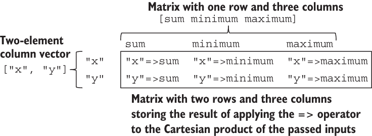
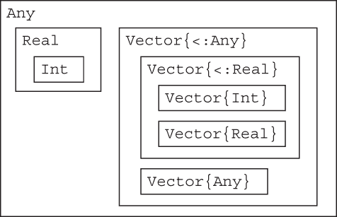
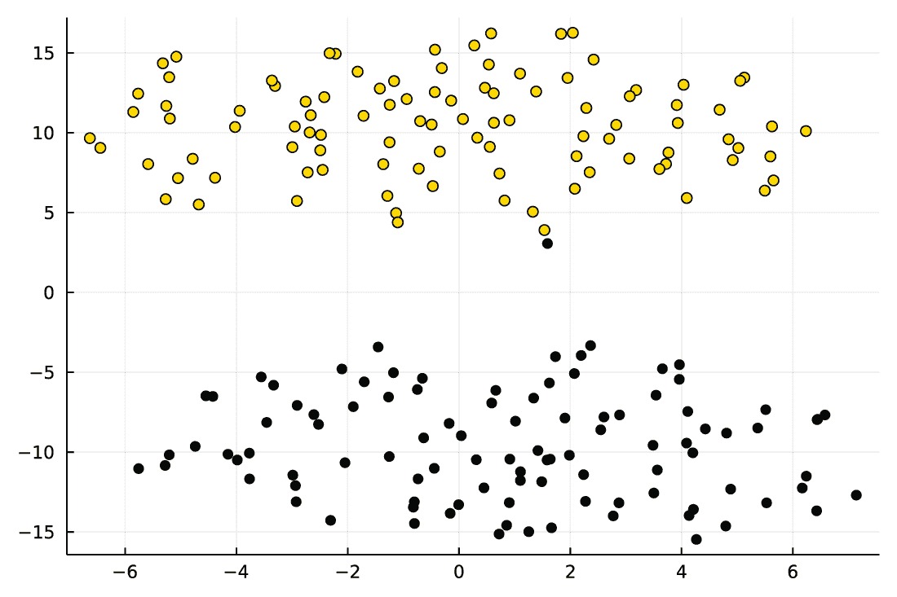

# 5 集合处理的高级主题

本章涵盖了

+   向量化你的代码，即广播

+   理解参数化类型的子类型规则

+   将 Julia 与 Python 集成

+   执行 t-SNE 维度缩减

你已经从第二章中了解到如何使用循环、map 函数和列表推导来处理向量。本章介绍了实践中常用的一种方法：广播。

5.2 节解释了与参数化类型的子类型规则相关的一个更高级的话题，这通常会引起学习 Julia 的人提出问题。这个问题与集合密切相关，因为，正如你将在本章中学到的，最常见的集合类型，如数组或字典，都是参数化的。因此，如果你想了解如何正确编写允许集合作为其参数的方法签名，你需要学习这个话题。

5.3 节专注于将 Julia 与 Python 集成。你将了解到在 Julia 格式和 Python 格式之间转换集合是由 PyCall.jl 包自动完成的。因此，你可以轻松地在你的 Julia 项目中使用现有的执行数据集合操作的 Python 代码。作为一个这样的集成示例，我将向你展示如何使用 Python 的 scikit-learn 库执行数据 t-SNE 维度缩减（[`lvdmaaten.github.io/tsne/`](https://lvdmaaten.github.io/tsne/)）。运行 PyCall.jl 示例需要在你的计算机上有一个正确配置的 Python 安装。因此，请确保遵循附录 A 中的环境设置说明。

## 5.1 使用广播向量化你的代码

在我们第 2、3 和 4 章中讨论的示例中，我们使用了三种执行重复操作的方法：

+   遍历集合的 for 循环

+   将函数应用于集合的 map 函数

+   列表推导

这三种语法功能强大且灵活；然而，许多为数据科学设计的语言提供了执行*向量运算*的方法，也称为*广播操作*。在 Julia 中，广播操作也得到支持。在本节中，你将学习如何使用它。

我们将通过回到 Anscombe 的四重奏数据来讨论广播的工作原理。然而，让我们先从一些玩具示例上的广播解释开始。

### 5.1.1 理解 Julia 中广播的语法和意义

Julia 语言的 重要设计规则是函数的定义遵循数学规则。你已经在第四章中看到了这个规则在起作用，该章展示了乘法运算符 * 使用矩阵乘法规则。因此，以下代码遵循矩阵乘法规则：

```
julia> x = [1 2 3]
1×3 Matrix{Int64}:
 1  2  3

julia> y = [1, 2, 3]
3-element Vector{Int64}:
 1
 2
 3

julia> x * y
1-element Vector{Int64}:
 14
```

该操作的效果就像我们乘以 x，它绑定到一个 1 × 3 的矩阵，以及一个三个元素的向量 y，在 Julia 中向量始终被解释为列向量。

你可能会问，那么我们应该如何逐元素相乘两个向量，这在数学上被称为 *Hadamard product*。显然，仅使用 * 操作符是不可能的，因为它执行标准的矩阵乘法：

```
julia> a = [1, 2, 3]
3-element Vector{Int64}:
 1
 2
 3

julia> b = [4, 5, 6]
3-element Vector{Int64}:
 4
 5
 6

julia> a * b
ERROR: MethodError: no method matching *(::Vector{Int64}, ::Vector{Int64})
```

你会得到一个错误，因为向量与向量的乘法不是一个有效的数学运算。相反，我们需要进行广播。在 Julia 中，向操作符添加广播很容易。你只需在前面加上一个点（.），如下所示：

```
julia> a .* b
3-element Vector{Int64}:
  4
 10
 18
```

当使用像 .* 这样的广播操作符时，Julia 会迭代传入的集合的元素（在我们的例子中，是向量 a 和 b），并在点（在我们的例子中，是 *）之后逐元素应用操作符。因此，在这种情况下，广播的结果与以下操作产生的结果相同：

```
julia> map(*, a, b)
3-element Vector{Int64}:
  4
 10
 18

julia> [a[i] * b[i] for i in eachindex(a, b)]
3-element Vector{Int64}:
  4
 10
 18
```

在这个 map 示例中，我们正在传递两个集合（而不是像之前解释 map 的工作原理时那样只传递一个）。传入的函数（在这种情况下是 *,）会迭代地逐元素应用到这些集合上，直到其中一个被耗尽。

在理解示例中，值得讨论 eachindex (a, b) 表达式，它会产生以下结果：

```
julia> eachindex(a, b)
Base.OneTo(3)
```

eachindex 函数产生可以用于索引传入的 a 和 b 参数的索引。在这种情况下，这些只是从 1 到 3 的整数。因此，你可以使用这些值索引 a 和 b 向量；例如，以下索引表达式是有效的：a[1]，b[2]，a[3]，但 a[0] 或 b[4] 是无效的，因为它们不在 Base.OneTo(3) 指定的范围内。

如果 a 和 b 的大小不匹配，我们会得到一个错误：

```
julia> eachindex([1, 2, 3], [4, 5])
ERROR: DimensionMismatch("all inputs to eachindex must have the same
indices, got Base.OneTo(3) and Base.OneTo(2)")
```

这与 map 函数的一个重要区别，map 函数内部不使用 eachindex 函数，而是迭代集合，直到其中一个被耗尽，正如我之前解释的那样：

```
julia> map(*, [1, 2, 3], [4, 5])
2-element Vector{Int64}:
  4
 10
```

使用 map 的实际考虑

如果你向 map 函数传递多个集合，你应该事先检查它们是否有相同的长度。大多数情况下，使用与 map 函数长度不等的集合是一个错误。

广播，就像 eachindex 函数一样，会检查传入的对象的维度是否匹配：

```
julia> [1, 2, 3] .* [4, 5]
ERROR: DimensionMismatch("arrays could not be broadcast to a common size;
got a dimension with lengths 3 and 2")
```

### 5.1.2 广播中扩展长度为 1 的维度

所有参与广播的集合的维度必须匹配的规则有一个例外。这个例外指出，单元素维度会通过重复该单元素中存储的值来扩展，以匹配其他集合的大小：

```
julia> [1, 2, 3] .^ [2]
3-element Vector{Int64}:
  1
  4
  9
```

你可能会问为什么单元素维度会被扩展。原因是实用的：在大多数情况下，当你的集合在某个维度上只有一个元素时，你希望它被扩展。以下是一个例子：

```
julia> [1, 2, 3] .^ 2
3-element Vector{Int64}:
 1
 4
 9
```

在这里，我们正在计算一个向量元素的平方。由于 2 是一个标量，它被解释为在每个维度上大小为 1。大多数人认为在这种情况下，维度扩展应该发生。你会在 Python 和 R 中看到相同的行为。

现在让我们考虑第二个例子：

```
julia> [1, 2, 3, 4, 5, 6, 7, 8, 9, 10] .* [1 2 3 4 5 6 7 8 9 10]
10×10 Matrix{Int64}:
  1   2   3   4   5   6   7   8   9   10
  2   4   6   8  10  12  14  16  18   20
  3   6   9  12  15  18  21  24  27   30
  4   8  12  16  20  24  28  32  36   40
  5  10  15  20  25  30  35  40  45   50
  6  12  18  24  30  36  42  48  54   60
  7  14  21  28  35  42  49  56  63   70
  8  16  24  32  40  48  56  64  72   80
  9  18  27  36  45  54  63  72  81   90
 10  20  30  40  50  60  70  80  90  100
```

我们在这里创建了一个乘法表。指定的操作之所以有效，是因为我们有一个包含 10 个元素、一列和 10 行的向量，以及一个包含一行和 10 列的 10 元素矩阵。在这种情况下，操作的两边都发生了维度扩展。

这种技术在实践中经常被用来获取所有输入的笛卡尔积。例如，在第二部分，你将了解到当你写下 "x" => sum in DataFrames.jl 时，你要求该包将求和函数应用于数据框的 x 列。一个常见的场景是我们想要将多个函数应用于数据框的多个列。使用广播，这可以简洁地写成以下形式：

```
julia> ["x", "y"] .=> [sum minimum maximum]
3×3 Matrix{Pair{String, _A} where _A}:
 "x"=>sum  "x"=>minimum  "x"=>maximum
 "y"=>sum  "y"=>minimum  "y"=>maximum
```

这个表达式要求对 x 和 y 列进行求和、最小值和最大值的计算。它之所以按预期工作，是因为我们使用了与乘法表示例中相同的模式。["x", "y"] 表达式创建了一个包含两个元素的向量（回想一下，Julia 中的向量是列式的；在这种情况下，向量有一列和两行），而 [sum minimum maximum] 表达式创建了一个包含一行和三列的矩阵。

当我们将广播应用于 => 操作符时，我们得到传递给它的参数的笛卡尔积。["x", "y"] 向量的单个列被重复三次以匹配 [sum minimum maximum] 矩阵的列数。同样，[sum minimum maximum] 矩阵的单行被重复两次以匹配 ["x", "y"] 向量的行数。因此，["x", "y"] .=> [sum minimum maximum] 操作产生与以下更冗长的代码相同的结果：

```
julia> left_matrix = ["x" "x" "x"
                      "y" "y" "y"]
2×3 Matrix{String}:
 "x"  "x"  "x"
 "y"  "y"  "y"

julia> right_matrix = [sum minimum maximum
                       sum minimum maximum]
2×3 Matrix{Function}:
 sum  minimum  maximum
 sum  minimum  maximum

julia> left_matrix .=> right_matrix
2×3 Matrix{Pair{String}}:
 "x"=>sum  "x"=>minimum  "x"=>maximum
 "y"=>sum  "y"=>minimum  "y"=>maximum
```

图 5.1 阐述了 ["x", "y"] .=> [sum minimum maximum] 操作。



图 5.1 ["x", "y"] .=> [sum minimum maximum] 操作的结果是一个 2 × 3 矩阵，因为我们传递了一个包含两个元素的向量和一行三列的矩阵作为参数。

你现在知道，你可以在任何操作符之前添加一个点 (.) 来广播它。那么对于不是操作符的函数呢？这里你也使用一个点 (.)，但这次，你在函数名之后附加它。这里有一个例子：

```
julia> abs.([1, -2, 3, -4])
4-element Vector{Int64}:
 1
 2
 3
 4
```

让我强调一下，仅仅将 abs 函数应用于一个向量会导致错误：

```
julia> abs([1, 2, 3])
ERROR: MethodError: no method matching abs(::Vector{Int64})
```

原因与之前相同：绝对值在数学上对数字有定义，但对向量没有定义。当然，你也可以方便地将广播应用于接受多个参数的函数。例如，字符串函数将它的参数连接成一个单一的字符串：

```
julia> string(1, 2, 3)
"123"
```

如果我们对这个函数使用广播，我们会得到以下结果：

```
julia> string.("x", 1:10)
10-element Vector{String}:
 "x1"
 "x2"
 "x3"
 "x4"
 "x5"
 "x6"
 "x7"
 "x8"
 "x9"
 "x10"
```

在这里，我们将标量 x 的维度扩展到与 1:10 范围的长度相匹配。当我们想要自动生成对象的名称时，这种操作相当常见——例如，数据框的列或文件夹中的文件名。

在这里强调很重要，即在操作符之前加前缀点或在函数名后加后缀是一个完全通用的解决方案。这并不是特定预定义操作的硬编码功能。你可以使用广播与任何自定义函数。例如：

```
julia> f(i::Int) = string("got integer ", i)
f (generic function with 2 methods)

julia> f(s::String) = string("got string ", s)
f (generic function with 2 methods)

julia> f.([1, "1"])
2-element Vector{String}:
 "got integer 1"
 "got string 1"
```

在这里，我们为 f 函数定义了两种方法。正如你所见，通过写入 f.，我们自动广播了它，而无需定义任何额外的内容。

### 5.1.3 保护集合不被广播

在我们回到安斯康姆四重奏数据之前，让我先评论一个常见情况。如果我们不想广播一个集合，但想强制它在所有维度上重复使用，就像它是一个标量一样，我们应该怎么做？为了解释这个问题，让我首先介绍 in 函数。

in 函数

in 函数用于检查某个值是否包含在集合中。例如：

```
julia> in(1, [1, 2, 3])
true

julia> in(4, [1, 2, 3])
false
```

为了方便起见，in 也支持中缀表示法：

```
julia> 1 in [1, 2, 3]
true

julia> 4 in [1, 2, 3]
false
```

你已经知道这种中缀表示法，因为它用于定义 for 循环中的迭代；请参阅第 2.2 节了解这些循环的工作原理。

现在想象你有一个长向量值，并想检查它们是否包含在向量中。当你尝试没有广播的测试时，它可能不会像你预期的那样工作：

```
julia> in([1, 3, 5, 7, 9], [1, 2, 3, 4])
false
```

问题在于向量[1, 3, 5, 7, 9]不是向量[1, 2, 3, 4]的元素，所以你得到 false。为了参考，让我们测试将[1, 3, 5, 7, 9]向量放入我们寻找它的集合中的场景：

```
julia> in([1, 3, 5, 7, 9], [1, 2, 3, 4, [1, 3, 5, 7, 9]])
true
```

如预期，这次 in 测试返回 true。回到原始测试，请注意，广播似乎也没有起作用：

```
julia> in.([1, 3, 5, 7, 9], [1, 2, 3, 4])
ERROR: DimensionMismatch("arrays could not be broadcast to a common size;
got a dimension with lengths 5 and 4")
```

我们应该如何解决这个问题？解决方案是将我们想要整体重复使用的向量用 Ref 包装起来。这样，我们将保护这个对象不被迭代。相反，它将从 Ref 中解包，并像标量一样进行广播处理，因此这个值将被重复以匹配其他容器的维度：

```
julia> in.([1, 3, 5, 7, 9], Ref([1, 2, 3, 4]))
5-element BitVector:
 1
 1
 0
 0
 0
```

这次我们得到了预期的结果。

Julia 中的 Ref 是什么？

在 Julia 中，当你写下 r = Ref(x)时，你创建了一个零维容器，它将 x 值作为其唯一元素存储。你可以通过写入 r[]从 Ref 值 r 中检索 x 对象（注意，我们在索引语法中不传递任何索引，因为 r 对象是零维的）。类型名为 Ref；你可以把它想象成 r 是 x 的引用。

由于 Ref 对象是零维的，并且存储了恰好一个元素，它们在每个维度上的长度都是 1。因此，如果你在广播中使用 r 对象，它存储的 x 值将在所有所需的维度中使用，遵循第 5.1.2 节中讨论的扩展规则。

在输出中，请注意布尔 true 被打印为 1，布尔 false 被打印为 0。这种显示选择允许更方便地检查包含布尔值的大型矩阵。为了了解为什么这很有用，考虑我们想要使用 isodd 函数来检查第 5.1.2 节中创建的乘法表中的哪些条目是奇数：

```
julia> isodd.([1, 2, 3, 4, 5, 6, 7, 8, 9, 10] .* [1 2 3 4 5 6 7 8 9 10])
10×10 BitMatrix:
 1  0  1  0  1  0  1  0  1  0
 0  0  0  0  0  0  0  0  0  0
 1  0  1  0  1  0  1  0  1  0
 0  0  0  0  0  0  0  0  0  0
 1  0  1  0  1  0  1  0  1  0
 0  0  0  0  0  0  0  0  0  0
 1  0  1  0  1  0  1  0  1  0
 0  0  0  0  0  0  0  0  0  0
 1  0  1  0  1  0  1  0  1  0
 0  0  0  0  0  0  0  0  0  0
```

在这个例子中，你可以看到广播操作可以在单个表达式中链接在一起。在这种情况下，我们广播了乘法*和 isodd 函数。

为了参考，让我展示一下如果我们将其元素类型更改为 Any（第 5.2 节提供了更多关于类型参数的详细信息），这个矩阵将如何显示：

```
julia> Matrix{Any}(isodd.([1, 2, 3, 4, 5, 6, 7, 8, 9, 10] .*
                          [1 2 3 4 5 6 7 8 9 10]))
10×10 Matrix{Any}:
  true  false   true  false   true  false   true  false   true  false
 false  false  false  false  false  false  false  false  false  false
  true  false   true  false   true  false   true  false   true  false
 false  false  false  false  false  false  false  false  false  false
  true  false   true  false   true  false   true  false   true  false
 false  false  false  false  false  false  false  false  false  false
  true  false   true  false   true  false   true  false   true  false
 false  false  false  false  false  false  false  false  false  false
  true  false   true  false   true  false   true  false   true  false
 false  false  false  false  false  false  false  false  false  false
```

这次，打印 true 和 false 以避免与可能存储在此矩阵中的整数 1 和 0 混淆，因为其元素类型是 Any。然而，在我看来，分析这样的打印输出比以前不太方便。

为了练习你所学的，尝试以下练习，这是处理数据时的常见任务。

练习 5.1：parse 函数可以用来将字符串转换为数字。例如，如果你想将字符串解析为整数，写 parse(Int, "10")以获取整数 10。假设你被给了一个包含字符串["1", "2", "3"]的向量。你的任务是创建一个包含这些字符串中数字的整数向量。

### 5.1.4 使用广播分析安斯康姆四重奏数据

现在我们准备回到我们的安斯康姆四重奏数据。首先，让我们初始化 aq 变量，就像我们在列表 4.1 中做的那样：

```
julia> aq = [10.0   8.04  10.0  9.14  10.0   7.46   8.0   6.58
              8.0   6.95   8.0  8.14   8.0   6.77   8.0   5.76
             13.0   7.58  13.0  8.74  13.0  12.74   8.0   7.71
              9.0   8.81   9.0  8.77   9.0   7.11   8.0   8.84
             11.0   8.33  11.0  9.26  11.0   7.81   8.0   8.47
             14.0   9.96  14.0  8.1   14.0   8.84   8.0   7.04
              6.0   7.24   6.0  6.13   6.0   6.08   8.0   5.25
              4.0   4.26   4.0  3.1    4.0   5.39  19.0  12.50
             12.0  10.84  12.0  9.13  12.0   8.15   8.0   5.56
              7.0   4.82   7.0  7.26   7.0   6.42   8.0   7.91
              5.0   5.68   5.0  4.74   5.0   5.73   8.0   6.89]
11×8 Matrix{Float64}:
 10.0   8.04  10.0  9.14  10.0   7.46   8.0   6.58
  8.0   6.95   8.0  8.14   8.0   6.77   8.0   5.76
 13.0   7.58  13.0  8.74  13.0  12.74   8.0   7.71
  9.0   8.81   9.0  8.77   9.0   7.11   8.0   8.84
 11.0   8.33  11.0  9.26  11.0   7.81   8.0   8.47
 14.0   9.96  14.0  8.1   14.0   8.84   8.0   7.04
  6.0   7.24   6.0  6.13   6.0   6.08   8.0   5.25
  4.0   4.26   4.0  3.1    4.0   5.39  19.0  12.5
 12.0  10.84  12.0  9.13  12.0   8.15   8.0   5.56
  7.0   4.82   7.0  7.26   7.0   6.42   8.0   7.91
  5.0   5.68   5.0  4.74   5.0   5.73   8.0   6.89

julia> using Statistics
```

我们将使用广播来重现我们在 4.1 节中执行的两个任务：计算每个变量的平均值和计算确定系数。

我们首先从计算 aq 矩阵的列平均值开始。我们想要将平均值函数应用于矩阵的每一列。在思考如何做到这一点时，我们注意到我们需要将平均值函数广播到 aq 的列集合上。幸运的是，我们知道 eachcol 函数给我们提供了这样的集合；因此，我们可以写出这个：

```
julia> mean.(eachcol(aq))
8-element Vector{Float64}:
 9.0
 7.500909090909093
 9.0
 7.500909090909091
 9.0
 7.500000000000001
 9.0
 7.50090909090909
```

注意 mean 后面的点（.），这意味着我们想要将此函数广播到由 eachcol(aq)产生的集合上。如果我们忘记写点，我们会得到以下结果：

```
julia> mean(eachcol(aq))
11-element Vector{Float64}:
  8.6525
  7.4525
 10.47125
  8.56625
  9.35875
 10.492500000000001
  6.3375
  7.03125
  9.71
  6.92625
  5.755000000000001
```

由于 eachcol(aq)是由构成 aq 矩阵列的八个向量组成的集合，因此平均值函数计算它们的平均值；也就是说，该函数将这八个向量的总和除以 8。因此，我们得到一个包含 aq 矩阵行平均值的向量（注意结果有 11 个元素，这是 aq 矩阵的行数），我们想要计算其列的平均值。

作为第二个应用，让我们使用广播来重写计算确定系数的函数。让我提醒你原始实现：

```
function R²(x, y)
    X = [ones(11) x]
    model = X \ y
    prediction = X * model
    error = y - prediction
    SS_res = sum(v -> v ^ 2, error)
    mean_y = mean(y)
    SS_tot = sum(v -> (v - mean_y) ^ 2, y)
    return 1 - SS_res / SS_tot
end
```

如果我们想要使用广播，我们可以这样写：

```
function R²(x, y)
    X = [ones(11) x]
    model = X \ y
    prediction = X * model
    SS_res = sum((y .- prediction) .^ 2)
    SS_tot = sum((y .- mean(y)) .^ 2)
    return 1 - SS_res / SS_tot
end
```

如你所见，我们改变了 SS_res 和 SS_tot 的公式。在两种情况下，我们都使用了点（.）两次。例如，在(y .- prediction) .^ 2 中，我们广播了减法和指数运算。

Julia 中广播的效率

Julia 的一个重要特性，使其与 R 和 Python 区分开来的是，如果它在单个表达式中遇到多个连续的广播操作，它会一次性执行操作而不分配任何中间对象。这个特性被称为*广播融合*，大大提高了复杂广播操作的效率。

广播融合可以很高效，因为，如第一章所述，Julia 将你的程序作为一个整体编译，所以当遇到广播操作时，编译器可以完全优化要执行的本地代码。这与 R 和 Python 不同，在 R 和 Python 中，对广播操作的支持通常是用 C 语言等实现的，并存储在预编译的二进制文件中，用于有限的预定义函数集。

如果你想了解更多关于 Julia 语言这个功能如何工作的信息，我建议你从 Matt Bauman 的“可扩展的广播融合”（[`mng.bz/G1OR`](http://mng.bz/G1OR)）开始阅读。

到现在为止，你已经知道了四种迭代应用操作到集合元素的方法：

+   使用 for 循环

+   使用列表推导式

+   使用 map 函数（以及其他类似的高阶函数，它们将函数作为它们的参数）

+   使用广播

你可能正在问自己在哪些情况下应该使用哪个选项。幸运的是，这主要是一个方便性和代码可读性的问题。在你的项目中，使用对你来说最容易使用且能产生最易读代码的选项。Julia 的一个伟大特性是，所有这些选项都很快。大多数时候，你不会因为选择其中一个而牺牲性能。

我说“大多数时候”，因为存在这个规则的例外。除了本节中已经讨论的差异之外，最重要的例外之一是，如果你使用 for 循环或 map 函数，你可以选择使用 Threads 模块或 ThreadsX.jl 包来使操作利用处理器上的所有核心。轻松支持代码的多线程执行是区分 Julia 与 R 和 Python 的一个特性。第二部分将展示如何在项目中利用多线程的例子。

## 5.2 定义具有参数类型的函数

在本节中，我们将编写自己的函数来计算两个向量的协方差。正如你可能猜到的，Statistics 模块中的 cov 函数执行这个计算，但将此函数作为练习来编写是有教育意义的。我们的目标是编写一个函数，该函数接受包含实数值的两个向量作为参数，并返回协方差。我的要求的关键部分是函数应该接受包含实数值的两个向量作为参数。在本节中，你将学习如何指定此类限制。

定义具有复杂类型限制的函数具有挑战性。幸运的是，在你的大多数代码中，你不需要编写自己的方法，因此不需要对这一主题有深入的了解。然而，由于用 Julia 编写的包大量使用这些功能，你必须了解这些概念，以便能够理解这些包提供的函数接受哪些参数，以及在使用它们时如何阅读 Julia 产生的错误消息。

### 5.2.1 Julia 中大多数集合类型都是参数化的

在第三章中，你学习了 Julia 的类型系统和如何定义方法。在本章中，我们将讨论与集合一起工作。你可能已经注意到，大多数表示集合的类型都是*参数化的*：它们指定了可以存储在其中的数据类型。以下是一些示例：

```
julia> []
Any[]

julia> Dict()
Dict{Any, Any}()
```

在这里，我们创建了一个空向量和空字典。它们可以存储任何值，这由 Any 参数表示，因此它们就像 Python 中的列表和字典一样工作。

对于向量，你可以通过在开方括号前加上类型来指定它们的元素类型：

```
julia> Float64[1, 2, 3]
3-element Vector{Float64}:
 1.0
 2.0
 3.0
```

注意，尽管我们输入了 1、2 和 3 作为整数，但它们被转换为 Float64，因为我们要求结果向量应包含此类值。同样，对于字典，我们可以这样写：

```
julia> Dict{UInt8, Float64}(0 => 0, 1 => 1)
Dict{UInt8, Float64} with 2 entries:
  0x00 => 0.0
  0x01 => 1.0
```

如你所见，我们强制将键和值分别转换为 UInt8 和 Float64 类型。作为旁注，请注意 Julia 使用 0x 前缀打印无符号整数，这些值使用十六进制表示。例如，让我们指定从 Int 到 UInt32 的显式转换：

```
julia> UInt32(200)
0x000000c8
```

作为最后的例子，我们创建了一个可以存储任何 Real 值的向量：

```
julia> Real[1, 1.0, 0x3]
3-element Vector{Real}:
    1
    1.0
 0x03
```

注意这次，没有发生存储值的转换，因为 Int、Float64 和 UInt8 类型是 Real 类型的子类型（正如你在第三章所知）。要检查这一点，请运行 typeof.(Real[1, 1.0, 0x3])，你将得到一个[Int64, Float64, UInt8]向量作为结果。

在我们继续前进之前，让我介绍一下 eltype 函数。此函数允许我们提取集合可以存储的元素类型。以下是一些示例：

```
julia> v1 = Any[1, 2, 3]
3-element Vector{Any}:
 1
 2
 3

julia> eltype(v1)
Any

julia> v2 = Float64[1, 2, 3]
3-element Vector{Float64}:
 1.0
 2.0
 3.0

julia> eltype(v2)
Float64

julia> v3 = [1, 2, 3]
3-element Vector{Int64}:
 1
 2
 3

julia> eltype(v3)
Int64

julia> d1 = Dict()
Dict{Any, Any}()

julia> eltype(d1)
Pair{Any, Any}

julia> d2 = Dict(1 => 2, 3 => 4)
Dict{Int64, Int64} with 2 entries:
  3 => 4
  1 => 2

julia> eltype(d2)
Pair{Int64, Int64}
```

对于向量，我们只得到类型。对于字典，我们得到一个 Pair 类型，因为，如前所述，在 Julia 中键值组合有一个 Pair 类型：

```
julia> p = 1 => 2
1 => 2

julia> typeof(p)
Pair{Int64, Int64}
```

### 5.2.2 参数化类型的子类型规则

看过这些例子后，我们现在准备回到我们的任务，即定义一个函数，该函数接受两个包含实数值的向量并返回它们的协方差。我们希望该函数接受任何向量。

你从第三章中已经知道我们应该使用 AbstractVector 类型。我们还希望函数只接受这些向量中的实数值。同样，我们知道这些向量的元素类型应该是 Real。

因此，我们的第一个假设是 AbstractVector{Real} 应该是正确的类型。让我们通过使用第三章中讨论的 isa 测试来验证这个假设：

```
julia> [1, 2, 3] isa AbstractVector{Int}
true

julia> [1, 2, 3] isa AbstractVector{Real}
false
```

我们看到，正如预期的那样，[1, 2, 3] 的类型是 AbstractVector{Int} 的子类型，但令人惊讶的是，它不是 AbstractVector{Real} 的子类型。这种 Julia 中参数的行为在计算机科学中被称为 *不变性*：尽管 Int 是 Real 的子类型，但 AbstractVector{Int} 不是 AbstractVector{Real} 的子类型。你可以在 Julia 手册的“参数复合类型”部分找到对这个设计决策的深入讨论（[`mng.bz/z5EX`](http://mng.bz/z5EX)）。

类型为 AbstractVector{Real} 子类型的向量必须允许存储任何实数值。你在 5.2.1 节中看到了向量 Real[1, 1.0, 0x3]，并且我们在那里检查了确实其元素有不同的类型。因此，例如，Vector{Real} 不能像 Vector{Int} 一样高效地存储在内存中。

我现在将专注于解释如何指定元素类型是 Real 子类型的向量类型。这种情况的语法是 AbstractVector{<:Real}。<: 序列表示向量的元素类型可以是 Real 的任何子类型，而不仅仅是 Real。等价地，我们也可以使用在第三章中讨论过的 where 关键字：

```
julia> AbstractVector{<:Real} == AbstractVector{T} where T<:Real
true
```

AbstractVector{T} 其中 T<:Real 的形式遇到得较少，但如果我们想在代码中稍后引用存储向量元素类型的变量 T，它可能是有用的。

为了总结我们的讨论，让我给出几个类型及其含义的具体例子。这个例子是围绕 Vector 类型构建的：

+   Int 是 Real 的子类型。这是因为 Real 是一个指代多个数值类型的抽象概念；同样，Real 也是 Any 的子类型。

+   Vector{Int} 不是 Vector{Real} 的子类型。这是因为，正如你在本节中看到的，Vector{Int} 和 Vector{Real} 都可以有实例。一个是只能存储整数的容器。另一个是可以存储任何实数值的容器。这两个是两个具体且不同的容器。没有一个是从另一个派生的子类型。

+   Vector{<:Real}，或者等价地，Vector{T} 其中 T<:Real，是一种描述可以存储实数值的所有容器的联合的方式。Vector{<:Real} 是一个抽象概念，指代多个容器。Vector{Int} 和 Vector{Real} 都是 Vector{<:Real} 的子类型。

+   Vector、Vector{<:Any} 和 Vector{T}（其中 T 是类型）都是描述所有具有 Vector 类型但没有限制其元素类型的容器联合的方式。这与 Vector{Any} 不同，Vector{Any} 是一个具体类型，它可以有一个实例：它是一个可以存储任何值的向量。请注意，尽管 Vector{Any} 是 Vector{<:Any} 的子类型，而 Vector{<:Any} 又是 Any 的子类型（因为 Julia 中的每个类型都是 Any 的子类型）。

图 5.2 展示了这些关系。



图 5.2 在这个子类型关系的示例中，一个框代表一个类型。如果一个类型是给定类型的子类型，它就被放在框内。请注意，尽管 Int 是 Real 的子类型，但 Vector{Int} 不是 Vector{Real} 的子类型。同样，尽管 Real 是 Any 的子类型，但 Vector{Real} 也不是 Vector{Any} 的子类型。

### 5.2.3 使用子类型规则定义协方差函数

那么，我们应该如何定义我们的协方差函数？这里是一个完整的方法：

```
julia> using Statistics

julia> function ourcov(x::AbstractVector{<:Real},
                       y::AbstractVector{<:Real})
           len = length(x)
           @assert len == length(y) > 0                               ❶
           return sum((x .- mean(x)) .* (y .- mean(y))) / (len - 1)
       end
ourcov (generic function with 1 method)
```

❶ 第 3.4 节解释了 @assert 宏的工作方式。第 2.3.1 节解释了如何组合几个逻辑条件。

在前面的代码中，我们使用广播来计算协方差。让我们首先检查我们的`ourcov`函数是否正确工作：

```
julia> ourcov(1:4, [1.0, 3.0, 2.0, 4.0])
1.3333333333333333

julia> cov(1:4, [1.0, 3.0, 2.0, 4.0])
1.3333333333333333
```

它看起来确实按预期工作。请注意，在代码中，我们混合了一系列整数和一个浮点数值向量，它们被接受并正确处理。然而，如果我们传递一个元素类型不是 Real 子类型的集合，即使我们不更改集合存储的具体值，函数也会失败：

```
julia> ourcov(1:4, Any[1.0, 3.0, 2.0, 4.0])
ERROR: MethodError: no method matching ourcov(::UnitRange{Int64},
::Vector{Any})
Closest candidates are:
  ourcov(::AbstractVector{var"#s3"} where var"#s3"<:Real,
::AbstractVector{var"#s2"} where var"#s2"<:Real) at REPL[48]:1
```

这次，函数失败了，因为我们的第二个参数是一个元素类型为 Any 的向量，而 Any 不是 Real 的子类型。

在我总结这一节之前，让我回答一个常见问题。如果你有一个包含宽元素类型（例如，Any）的容器，并且想要将其缩小到存储在集合中的元素类型，该怎么办？幸运的是，这很简单。你只需要将恒等函数（返回其参数）广播到集合上。然后，Julia 实现的广播机制将为你执行元素类型的缩小。这里你可以看到它是如何工作的：

```
julia> x = Any[1, 2, 3]
3-element Vector{Any}:
 1
 2
 3

julia> identity.(x)
3-element Vector{Int64}:
 1
 2
 3

julia> y = Any[1, 2.0]
2-element Vector{Any}:
 1
 2.0

julia> identity.(y)
2-element Vector{Real}:
 1
 2.0
```

## 5.3 与 Python 集成

在本节中，你将学习如何在处理集合时将 Julia 与 Python 集成。你会发现 Julia 和 Python 之间的集合类型转换是自动完成的。知道如何在 Julia 中使用 Python 代码是有用的，因为在较大的项目中，你可能需要构建使用这两种技术开发的软件组件。我选择了我们将使用的示例，以进一步强化你对如何在 Julia 中处理数组和使用广播的理解。

我选择展示与 Python 的集成，因为目前它是一种非常流行的语言。在第十章中，您将学习如何集成 Julia 和 R。如果您想从 Julia 调用 C 或 Fortran 代码，请参阅 Julia 手册 [`mng.bz/091l`](http://mng.bz/091l)。其他语言的绑定由包提供——例如，使用 Cxx.jl ([`github.com/JuliaInterop/Cxx.jl`](https://github.com/JuliaInterop/Cxx.jl)) 与 C++ 集成或使用 JavaCall.jl ([`github.com/JuliaInterop/JavaCall.jl`](https://github.com/JuliaInterop/JavaCall.jl)) 与 Java 集成。

### 5.3.1 使用 t-SNE 进行降维前的数据准备

作为 Julia 与 Python 集成的示例应用，我将向您展示如何使用 t-SNE 算法进行降维。*t-Distributed Stochastic Neighbor Embedding* (*t-SNE*) 是一种统计方法，它为属于高维空间中的每个数据点在低维空间中分配一个位置 ([`lvdmaaten.github.io/tsne/`](https://lvdmaaten.github.io/tsne/))。在这种情况下，我们将使用二维空间作为目标，因为它可以很容易地在图中可视化。t-SNE 以一种方式执行映射，使得高维源空间中的相似对象在低维目标空间中是邻近的点，而不相似的对象是远离的点。

我们从在五维空间中生成随机数据开始，我们稍后希望将其嵌入到二维空间中：

```
julia> using Random

julia> Random.seed!(1234);

julia> cluster1 = randn(100, 5) .- 1
100×5 Matrix{Float64}:
 -0.0293437  -0.737544   -0.613869  -1.31815    -2.95335
 -1.97922    -1.02224    -1.74252   -2.33397    -2.00848
  ⋮
 -1.55273    -1.09341    -0.823972  -3.41422    -2.21394
 -4.40253    -1.62642    -1.01099   -0.926064    0.0914986

julia> cluster2 = randn(100, 5) .+ 1
100×5 Matrix{Float64}:
  1.57447    1.40369    1.44851     1.27623    0.942008
  2.16312    1.88732    2.51227     0.533175  -0.520495
  ⋮
  1.47109    2.61912    1.80582     1.18953    1.41611
  2.77582    1.53736   -0.805129   -0.315228   1.35773
```

首先，我们使用 Julia 中的 Random.seed!(1234) 命令来设置随机数生成器的种子。函数名称后缀为 ! 是因为它会修改全局随机数生成器的状态。这将确保我向您展示的数据与您在相同版本的 Julia 下运行此代码时获得的数据相同。如果您希望在每次运行此代码时都生成不同的随机数，请跳过设置随机数生成器的种子。

接下来，使用 randn 函数，我们生成两个 100 行 5 列的矩阵。它们存储的值是从标准正态分布中随机抽取的。通过广播，我们从 cluster1 矩阵的所有条目中减去 1，并将 1 添加到 cluster2 矩阵的所有条目中。这样，我们就将两个矩阵中存储的点分离开了。来自 cluster 1 的数据大多是负数，而在 cluster 2 中，我们大多数条目是正数。

现在，我们使用 vcat 函数垂直连接这些矩阵，创建一个 200 行 5 列的单个矩阵。我们称这个矩阵为 data5，因为它有五个列：

```
julia> data5 = vcat(cluster1, cluster2)
200×5 Matrix{Float64}:
 -0.0293437  -0.737544  -0.613869  -1.31815    -2.95335
 -1.97922    -1.02224   -1.74252   -2.33397    -2.00848
 -0.0981391  -1.39129   -1.87533   -1.76821    -1.23108
 -1.0328     -0.972379   0.600607  -0.0713489  -1.16386
  ⋮
  1.2327      2.37472    1.31467   -0.290594    3.00592
 -0.198159   -0.211778  -0.726857   0.194847    2.65386
  1.47109     2.61912    1.80582    1.18953     1.41611
  2.77582     1.53736   -0.805129  -0.315228    1.35773
```

我们将想要查看，在使用 t-SNE 算法将维度降低到二维后，我们是否能够通过视觉确认这两个簇确实被分开了。

### 5.3.2 从 Julia 调用 Python

首先，我们需要使用 PyCall.jl 包中的 pyimport 函数加载所需的 Python 包：

```
julia> using PyCall

julia> manifold = pyimport("sklearn.manifold")
PyObject <module 'sklearn.manifold' from
'~\\.julia\\conda\\3\\lib\\site-packages\\sklearn\\manifold\\__init__.py'>
```

此操作可能在你的机器上失败。如果发生这种情况，原因可能是 Python 配置不正确或 Python 中的 sklearn 未安装。你应该会收到有关需要执行哪些操作来修复此问题的信息。如果 Python 中的 sklearn 未安装，以下代码是添加它的标准方法：

```
using Conda
Conda.add("scikit-learn")
```

然而，在某些操作系统配置下，此操作可能会失败。请参阅以下侧边栏以获取更多选项。

使用 PyCall.jl 包配置与 Python 的集成

PyCall.jl 包允许你从 Julia 语言与 Python 进行交互。它允许你从 Julia 导入 Python 模块，调用 Python 函数（类型自动转换），甚至可以从 Julia 中评估整个 Python 代码块。

当你安装 PyCall.jl 时，默认情况下，在 Mac 和 Windows 系统上，它将为 Julia 安装一个私有的最小 Python 分布。在 GNU/Linux 系统上，该包将使用你的 PATH 中可用的 Python 安装。或者，你可以使用 PyCall.jl GitHub 页面（[`mng.bz/vXo1`](http://mng.bz/vXo1)）上解释的不同版本的 Python。

如果你使用 Mac 或 Windows 操作系统，并且使用 Python 的默认配置，你可以使用 Conda.jl 包向 Julia 的 Python 分布中添加包。如果你使用 GNU/Linux 系统，那么默认情况下，你应该能够通过使用你在 Python 安装中使用的标准工具来添加包。

不幸的是，与 Julia 内置的标准包管理器不同，在机器上正确配置 Python 环境并安装包有时可能具有挑战性。PyCall.jl 包维护者已尝试在大多数情况下使此过程自动运行。但是，如果失败，我建议你参考 PyCall.jl（[`github.com/JuliaPy/PyCall.jl`](https://github.com/JuliaPy/PyCall.jl)）和 Conda.jl（[`github.com/JuliaPy/Conda.jl`](https://github.com/JuliaPy/Conda.jl)）页面，以获取解决这些问题的更详细说明。

在从 Python 导入 sklearn.manifold 并将其绑定到 manifold 变量后，我们就准备好使用 t-SNE 算法了。我们将结果存储在 data2 变量中，因为降维后的结果矩阵有两列：

```
julia> tsne = manifold.TSNE(n_components=2, init="random",
                            learning_rate="auto", random_state=1234)
PyObject TSNE(init='random', learning_rate='auto', random_state=1234)

julia> data2 = tsne.fit_transform(data5)
200×2 Matrix{Float32}:
  1.25395   -14.9826
  0.448442  -12.2407
 -2.0488    -10.6652
  2.19538    -3.94876
  ⋮
  6.23544    10.1046
  5.49633     6.37504
 -1.82243    13.8231
  5.05417    13.2529
```

如果你参考了 scikit-learn 文档中关于使用 t-SNE 算法的示例（[`mng.bz/K0oZ`](http://mng.bz/K0oZ)），你会发现使用 Python 在 Julia 中几乎是透明的：

+   你可以以与在 Python 中调用它们完全相同的方式调用 Python 函数。特别是，你可以使用点（.）以与 Python 中相同的方式引用对象。

+   Julia 和 Python 对象之间发生自动转换，因此你无需考虑它。

这种集成级别意味着从 Julia 中使用 Python 对开发者来说几乎不需要动脑筋。根据我的经验，大多数时候，如果你想把一些 Python 代码移植到 Julia，只需修复语法差异就足够了，而且一切都会正常工作。例如，在 Julia 中，字符串字面量需要双引号(")，而在 Python 中通常使用单引号(')。

本节仅展示了将 Julia 与 Python 集成的最小示例。如果你想了解更多细节，例如可能的集成选项，请查看 PyCall.jl 包网站[`github.com/JuliaPy/PyCall.jl`](https://github.com/JuliaPy/PyCall.jl)。

### 5.3.3 t-SNE 算法结果的可视化

为了总结我们的分析，让我们使用散点图来绘制 data2 矩阵。我们将用不同的填充颜色来着色前 100 个点，代表簇 1，而最后 100 个点来自簇 2：

```
julia> using Plots

julia> scatter(data2[:, 1], data2[:, 2];
               color=[fill("black", 100); fill("gold", 100)],
               legend=false)
```

在此代码中，注意[fill("black", 100); fill("gold", 100)]表达式。首先，使用 fill 函数，我们创建了两个存储 100 个常量值的向量，代表我们想要使用的颜色。接下来，在方括号内，使用分号（;），我们垂直连接这两个向量，创建一个包含 200 个元素的向量，并将其作为颜色关键字参数传递给 scatter 函数。

图 5.3 显示了结果图。观察可知，正如预期的那样，我们看到了来自簇 1 和簇 2 的点之间的分离（除了簇 1 中的一个异常值）。



图 5.3 t-SNE 嵌入结果的可视化。簇 1 和簇 2 的数据（用不同的填充颜色表示）被分离。该算法帮助我们识别簇 1 中的一个异常值；这是在嵌入空间中位于簇 2 的点更近的黑点。

练习 5.2 重复 5.3 节中展示的分析，但在创建簇 1 和簇 2 的数据时，不是加 1 和减 1，而是分别加 0.4 和减 0.4。这将减少五维空间中两个簇之间的分离。检查这是否会减少由 t-SNE 生成的二维空间中的分离。

## 摘要

+   Julia 提供了四种迭代集合并转换它们的重要方式：循环、map 函数（以及其他类似的高阶函数）、列表推导式和广播。每种方法在处理数据时都有略微不同的规则。因此，你应该根据具体情况选择其中一种。

+   Julia 中的大多数函数都是定义为在标量上工作的。如果你想逐元素应用一个函数到集合上，你必须使用 Julia 提供的一种允许你迭代集合的方法。

+   在 Julia 中，广播是一种将函数应用于值集合（在其他语言中通常称为 *向量化* 的操作）。你可以通过在函数后添加一个点 (.) 来广播任何函数（如 sin 或 log）。同样，要向量化一个运算符（如 * 或 /），在它前面加上一个点 (.)。

+   Julia 中的广播是高效的，因为它使用了广播融合。在执行复杂的广播操作时，Julia 不需要为存储数据处理中间结果的对象分配内存。

+   在 Julia 中，类似于 R 和 Python，广播会自动扩展长度为 1 的维度。记住这个规则很重要，因为如果你忘记了它，你可能会对广播操作的结果感到惊讶。

+   如果你有一个要传递集合的广播操作，而你希望该集合被视为标量，请将其包裹在 Ref 中。这种方法通常在通过 in 函数执行对参考表的查找时使用。

+   当与集合一起工作时，你应该了解 Julia 的参数化类型的子类型规则。编写 Vector{Real} 指定了一个值可以取的类型。这个值是一个可以存储任何实数的 Vector。另一方面，Vector{<:Real} 用于表示任何元素类型是 Real 子类型的 Vector 的超类型。没有值可以有 Vector{<:Real} 类型，因为它不是一个叶类型，也不是具体的。因此，Vector{Int} 是 Vector{<:Real} 的子类型，但不是 Vector{Real} 的子类型（回想第三章，在 Julia 中，如果一个类型可以有实例，则不允许它有子类型）。

+   你可以通过使用 PyCall.jl 包将 Julia 与 Python 集成。当你想在 Julia 项目中使用 Python 代码时，这种集成通常是必需的。

+   PyCall.jl 包提供的 Julia 与 Python 的集成允许你以与在 Python 中调用它们完全相同的方式调用 Python 函数，并且自动在 Julia 和 Python 格式之间转换集合。这意味着在 Julia 中使用 Python 功能很容易，并且只需对 Python 代码进行最小更改即可在 Julia 项目中使用它们。
