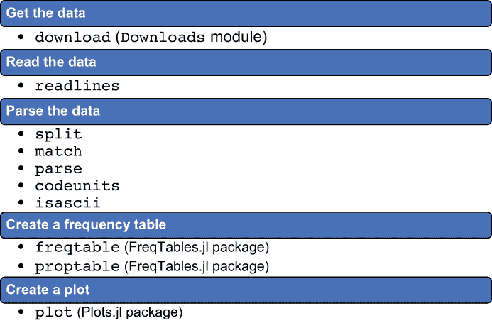
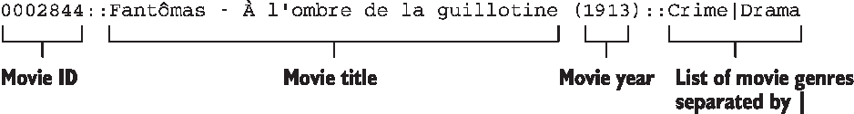
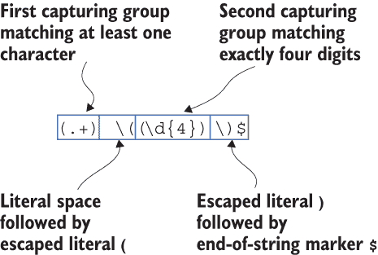
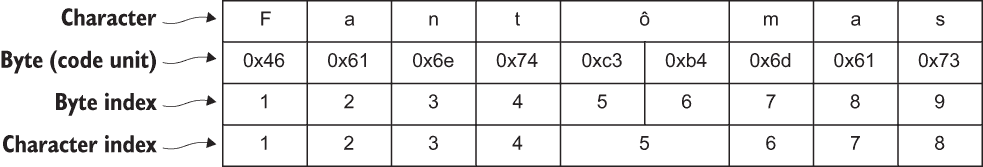
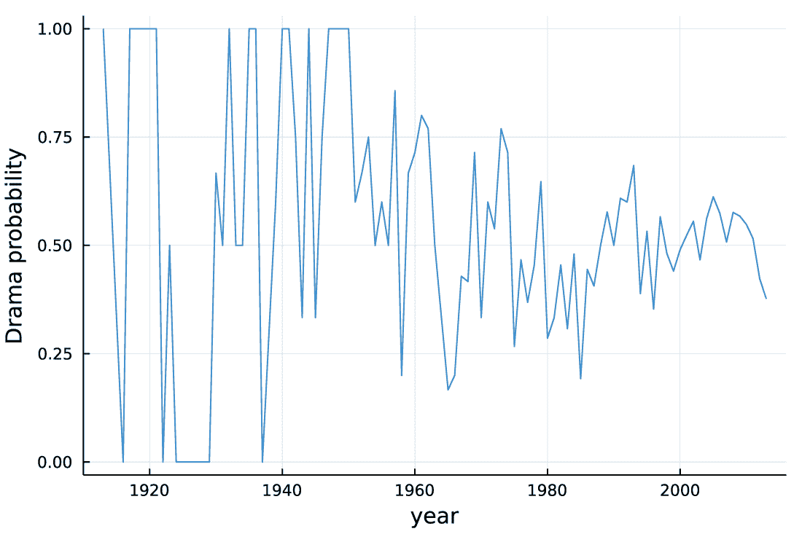
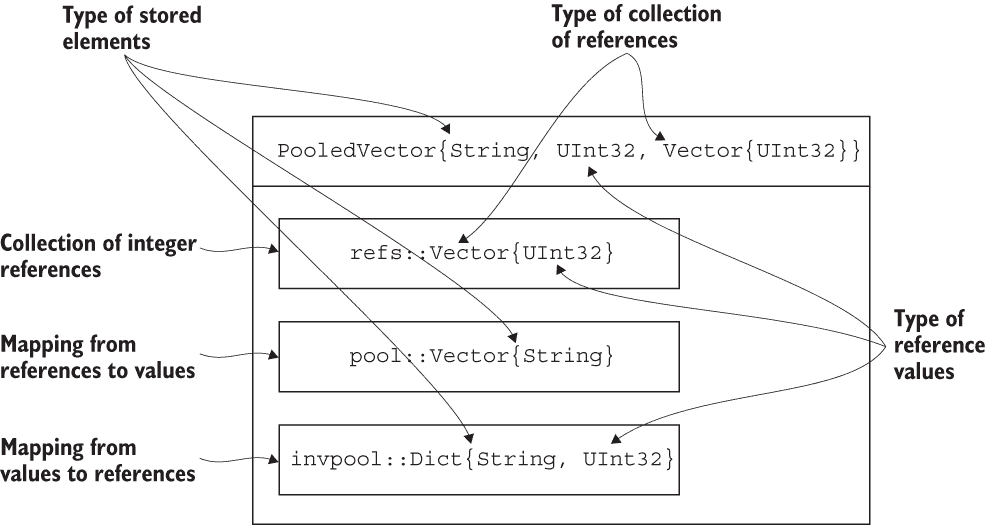

# 6 处理字符串

本章涵盖

+   Julia 字符串的 UTF-8 编码；字节与字符索引

+   字符串操作：插值、分割、使用正则表达式、解析

+   处理符号

+   使用 InlineStrings.jl 包处理固定宽度字符串

+   使用 PooledArrays.jl 包压缩字符串向量

在本章中，你将学习如何在 Julia 语言中处理文本数据。文本数据存储在字符串中。*字符串* 是你在进行数据科学项目时最常遇到的数据类型之一，尤其是在涉及自然语言处理任务时。

作为字符串处理的实际应用，我们将分析被 Twitter 用户评分的电影类型。我们希望了解哪种电影类型最常见，以及这种类型的相对频率如何随电影年份变化。

对于这次分析，我们将使用 movies.dat 文件。文件 URL 是 [`mng.bz/9Vao`](http://mng.bz/9Vao)，该文件在 GitHub 仓库 [`github.com/sidooms/MovieTweetings`](https://github.com/sidooms/MovieTweetings) 下以 MIT 许可证共享。

我们将根据以下步骤分析电影类型数据，这些步骤在本章的后续部分中描述，并在图 6.1 中展示：

1.  从网络获取数据。

1.  在 Julia 中读取数据。

1.  解析原始数据以提取每部分析电影的年份和类型列表。

1.  创建频率表以找出哪种电影类型最常见。

1.  按年份创建最常见类型的流行度图表。



图 6.1 分析步骤：每个步骤列出使用的重要 Julia 函数和提供它们的包

通过分析，你将了解 Julia 中的字符串是 UTF-8 编码的含义，以及你在处理字符串时应如何考虑这一事实。

在本章末尾，我们将讨论处理字符串时的性能问题。你将了解以下内容：

+   在分析文本数据时使用符号而不是字符串

+   使用 InlineStrings.jl 包提供的固定宽度字符串

+   使用 PooledArrays.jl 包压缩字符串向量

## 6.1 获取和检查数据

在大多数数据科学工作流程中，你将面临的第一项任务是获取数据并在开始分析之前读取它。因此，在本节中，我们从学习如何从网络下载源文件并检查其内容开始（为了你的方便，该文件也存储在 GitHub 仓库中，与本书的源代码一起）。

### 6.1.1 从网络下载文件

首先，下载数据，如下所示。

列表 6.1 从 GitHub 获取 movies.dat 文件

```
julia> import Downloads
julia> Downloads.download("https://raw.githubusercontent.com/" *
                          "sidooms/MovieTweetings/" *
                          "44c525d0c766944910686c60697203cda39305d6/" *
                          "snapshots/10K/movies.dat",
                          "movies.dat")
"movies.dat"
```

我们使用来自 Downloads 模块的 download 函数，该函数接受两个参数：要获取的文件的 URL 位置以及它应该保存的位置路径。在这种情况下，我们将文件保存为 movies.dat 到 Julia 的工作目录中。

在 Julia 1.6 之前的版本中下载文件

在 Julia 1.6 之前的版本中，下载功能无需使用 Downloads 模块即可使用。尽管这个功能在 Julia 1.7（本书使用的版本）中仍然可用，但它已被弃用，因此我建议您使用 Downloads 模块。

注意，在上面的示例中，download 函数的两个参数都是字符串字面量。请注意两个重要点：

+   字符串字面量用双引号（"）括起来。

+   您可以使用乘法运算符（*）连接字符串字面量。在上面的示例中，我们将一个长字符串拆分为多行代码，并通过使用 * 连接它们（在 Python 中，您会使用加法运算符（+）来连接字符串）。

让我简要地评论一下 Julia 字符串支持的一些标准特性。

### 6.1.2 使用字符串构造的常用技术

第一个方便的特性是，您可以通过在字符串字面量中使用 $ 来将变量插入到字符串中。以下是一个示例：

```
julia> x = 10
10

julia> "I have $x apples"
"I have 10 apples"
```

在此代码中，绑定到变量 x 的值被插入到字符串中，正如我们在字符串字面量中写入 $x 一样。您也可以以这种方式插入更复杂的表达式，但此时您需要将它们括在括号中：

```
julia> "I have $(2 * x) apples"
"I have 20 apples"
```

第二个特性是，您可以在字符串字面量中使用 C 的传统转义输入形式（[`en.cppreference.com/w/cpp/language/escape`](https://en.cppreference.com/w/cpp/language/escape)）；例如，要创建包含换行符的字符串，请使用 \n 序列。例如，字符串字面量 "a\nb" 由三个字符组成：a，后面跟着一个换行符，最后是 b。

除了标准转义序列之外，Julia 还引入了两个额外的转义序列。要写入 $，您需要使用 \. 转义它。未转义的 $ 用于插值，如我之前解释的。以下是一个 \$ 转义序列在起作用的示例，显示仅使用 $ 会导致错误：

```
julia> "I have \$100."
"I have \$100\.             ❶

julia> "I have $100."
ERROR: syntax: invalid interpolation syntax: "$1"
```

❶ Julia 通过使用转义形式在交互会话中显示字符串。

第二个扩展是 \ 紧接着一个换行符。这个序列允许您将长字符串拆分为多行。因此，我们可以在列表 6.1 中使用 *，而不是这样写以获得相同的结果：

```
Downloads.download("https://raw.githubusercontent.com/\
                    sidooms/MovieTweetings/\
                    44c525d0c766944910686c60697203cda39305d6/\
                    snapshots/10K/movies.dat",
                   "movies.dat")
```

在这种情况下，\ 后面的换行符以及下一行中的任何前导空白（通常用于代码缩进）都被忽略，正如您在这里看到的：

```
julia> "a\
        b\
        c"
"abc"
```

有时你可能想避免 C 的转义输入形式的特殊处理和插值。你可以通过在字符串字面量前使用 raw 前缀轻松避免它们（这些字面量被称为*原始字符串字面量*）。我在 Windows 上工作时最常使用这个特性来编写路径。以下是一个例子。如果你尝试在一个标准的字符串字面量中写入标准的 Windows 路径，很可能会出错：

```
julia> "C:\my_folder\my_file.txt"
ERROR: syntax: invalid escape sequence
```

这个错误发生是因为 Julia 将\m 视为无效的转义序列。我们可以通过使用 raw 前缀轻松解决这个问题：

```
julia> raw"C:\my_folder\my_file.txt"
"C:\\my_folder\\my_file.txt"
```

这次一切正常。请注意，字符串仍然显示为标准字符串。每个\字符显示为\\，因为这是在标准字符串中解释为\的转义序列。如果你想打印字符串的未装饰文本表示，请使用 print 函数：

```
julia> print(raw"C:\my_folder\my_file.txt")
C:\my_folder\my_file.txt
```

在 Julia 代码中，你可能会遇到第二种特殊的字符串字面量，即三引号字符串。这些字面量以三个引号（""")开始和结束。它们通常用于创建跨越多行的长文本块。在这本书中，我们不使用这些字面量，但如果你对细节感兴趣，可以在 Julia 手册中找到它们，网址为[`mng.bz/jAjp`](http://mng.bz/jAjp)。

现在你已经了解了创建字符串字面量的基础知识，让我们看看如何从磁盘读取字符串。首先，我们使用 isfile 函数检查 movies.dat 文件是否已下载，以查看文件是否存在于当前工作目录中：

```
julia> isfile("movies.dat")
true
```

### 6.1.3 读取文件内容

函数返回 true，这意味着文件存在。让我们逐行读取其内容，并将结果绑定到下一列表中的 movies 变量。

列表 6.2 将 movies.dat 文件读入向量

```
julia> movies = readlines("movies.dat")
3096-element Vector{String}:
 "0002844::Fantômas - À l'ombre de la guillotine (1913)::Crime|Drama"
 "0007264::The Rink (1916)::Comedy|Short"
 "0008133::The Immigrant (1917)::Short|Comedy|Drama|Romance"
 "0012349::The Kid (1921)::Comedy|Drama|Family"
 ⋮
 "2748368::Neil (2013)::Short|Comedy"
 "2750600::A Different Tree (2013)::Short|Drama|Family"
 "2763252::Broken Night (2013)::Short|Drama"
 "2769592::Kiss Shot Truth or Dare (2013)::Short"
```

readlines 函数读取文件中的所有行，作为一个字符串向量。向量中的每个字符串代表我们数据中的一行。

观察数据，我们可以看到关于每部电影（文件中的一行）的条目具有以下结构：



第一部分是电影的数字标识符。它由冒号（::）分隔符后跟电影标题。接下来是括号中的电影年份。最后，在下一个冒号分隔符之后，我们有与电影匹配的流派。如果我们有多个流派，它们由竖线（|）分隔。

## 6.2 分割字符串

当处理数据时，你经常会面临挑战，因为在使用它进行分析之前，必须先对其进行预处理。最基本的预处理类型是分割包含多个信息片段的字符串。这是你将在本节中学到的技能。

对于每部电影，我们将从该字符串中提取电影的年份及其流派列表。然而，在我们对所有字符串这样做之前，我会向你展示如何对列表中的第一个字符串进行操作。我们首先提取它：

```
julia> movie1 = first(movies)
"0002844::Fantômas - À l'ombre de la guillotine (1913)::Crime|Drama"
```

注意，我们使用了第一个函数来获取 movies 向量的第一个元素。我们将使用的第一个与字符串一起工作的函数是 split。它接受两个参数：要分割的字符串和用于分割字符串的分隔符。默认情况下，分隔符是空白字符，但在这个例子中，我们首先想使用::。让我们尝试使用 split 函数：

```
julia> movie1_parts = split(movie1, "::")
3-element Vector{SubString{String}}:
 "0002844"
 "Fantômas - À l'ombre de la guillotine (1913)"
 "Crime|Drama"
```

movie1_parts 变量现在包含三个字符串的向量，正如预期的那样。

你可能已经注意到，movies 向量具有 Vector{String}类型，而 movie1_parts 向量具有 Vector{SubString{String}}类型。这是因为 Julia 为了效率，在 split 函数分割字符串时，不会复制字符串，而是创建一个指向原始字符串切片的 SubString{String}对象。这种行为是安全的，因为 Julia 中的字符串是不可变的（我们已经在第四章中讨论了可变和不可变类型）。因此，一旦字符串被创建，其内容就不能被更改。创建字符串的子字符串是一个保证安全的操作。在你的代码中，如果你想创建一个 SubString{String}，你可以使用 view 函数或 String 上的@view 宏。

由于 String 和 SubString{String}都是字符串，因此 Julia 中必须有一个更一般的字符串抽象概念。确实如此：

```
julia> supertype(String)
AbstractString

julia> supertype(SubString{String})
AbstractString
```

我们遇到的所有字符串类型都是 AbstractString 的子类型。在 Julia 中，AbstractString 是表示所有字符串的类型（在本章中，我们很快将讨论这个类型的更多子类型）。

应该在什么情况下使用 AbstractString？

当注释函数参数的类型应为字符串时，使用 AbstractString 而不是 String（除非你确实需要 String 类型，这种情况很少）。

例如，这是一个定义函数的好风格：

```
suffix_bang(s::AbstractString) = s * "!"
```

在这个定义中使用 String 而不是 AbstractString 是不推荐的，因为这样这个函数就不会与 SubString{String}参数一起工作。

split 函数是 Base Julia 中用于处理字符串的许多函数之一。你可以在 Julia 手册的“字符串”部分找到它们的文档（[`docs.julialang.org/en/v1/base/strings/`](https://docs.julialang.org/en/v1/base/strings/)）。以下是一些常用的函数：

+   string—通过使用 print 函数将传递的值转换为字符串

+   join—将迭代器的元素连接成一个字符串，在连接的项之间插入给定的分隔符

+   occursin—检查第一个参数是否是第二个参数的子字符串

+   contains—检查第二个参数是否是第一个参数的子字符串

+   replace—在给定的字符串中查找传递的模式，并用指定的值替换它们

+   strip—从字符串中删除前导和尾随字符（默认为空白字符）（相关的是 lstrip 和 rstrip，用于删除前导和尾随字符）

+   startswith—检查给定的字符串是否以传递的前缀开始

+   endswith—检查给定的字符串是否以传递的后缀结束

+   uppercase—将字符串转换为大写

+   lowercase—将字符串转换为小写

+   randstring—创建随机字符串（在 Random 模块中定义）

## 6.3 使用正则表达式处理字符串

在上一节中，你学习了如何通过使用 split 函数从以固定字符序列分隔的数据中提取信息。现在我们继续讨论如何使用正则表达式来提取字符串中遵循更通用模式的片段。

一旦我们创建了 movie1_parts 变量，我们可以将其第二个元素分割成电影名称和年份：

```
julia> movie1_parts[2]
"Fantômas - À l'ombre de la guillotine (1913)"
```

我们将通过使用正则表达式（www.regular-expressions.info）来完成这项任务。

### 6.3.1 使用正则表达式

如何编写正则表达式的主题非常广泛；如果你想要了解更多关于它的信息，我建议阅读 Jeffrey E. F. Friedl 的《精通正则表达式》（O’Reilly，2006）。Julia 支持 Perl 兼容的正则表达式，由 Perl-Compatible Regular Expressions (PCRE)库提供（[www.pcre.org](https://www.pcre.org/))。在这里，我将向你展示我们将使用的正则表达式以及如何在 Julia 中编写正则表达式字面量：

```
julia> rx = r"(.+) \((\d{4})\)$"
r"(.+) \((\d{4})\)$"
```

要创建一个正则表达式字面量，在字符串字面量前加上字母 r。这个正则表达式的含义在图 6.2 中解释。它最重要的部分是我们通过使用括号创建了两个捕获组。一个*捕获组*是一种从与正则表达式匹配的字符串中检索部分内容的方法。在我们的例子中，我们设计了两个捕获组：第一个将包含电影名称，第二个将包含电影年份。



图 6.2 r"(.+) \((\d{4})\)" 正则表达式的解释

你可以通过使用 match 函数在 Julia 中轻松地将正则表达式与字符串匹配：

```
julia> m = match(rx, movie1_parts[2])
RegexMatch("Fantômas - À l'ombre de la guillotine (1913)",
1="Fantômas - À l'ombre de la guillotine", 2="1913")
```

m 变量绑定到表示将 rx 正则表达式与 movie1_parts[2]字符串匹配的结果的对象。当对象被显示时，我们可以看到它已经捕获了两组，正如预期的那样。这些组可以通过使用索引从 m 对象中轻松检索：

```
julia> m[1]
"Fantômas - À l'ombre de la guillotine"

julia> m[2]
"1913"
```

这种方法非常方便。如果我们想将年份存储为数字，我们应该使用我们在第五章中讨论过的 parse 函数来解析它：

```
julia> parse(Int, m[2])
1913
```

这是对 Julia 中正则表达式的一个简要教程。如果你想要了解更多关于如何使用它们的信息，我建议你阅读 Julia 手册中的整个“正则表达式”部分（[`mng.bz/WMBw`](http://mng.bz/WMBw)）。

### 6.3.2 编写 movies.dat 文件单行内容的解析器

我们现在有了所有编写 movies.dat 文件单行解析器的部件。我建议将这个解析器定义为函数。接下来的列表显示了如何定义它。

列表 6.3 解析 movies.dat 文件单行内容的函数

```
function parseline(line::AbstractString)
    parts = split(line, "::")
    m = match(r"(.+) \((\d{4})\)", parts[2])
    return (id=parts[1],
            name=m[1],
            year=parse(Int, m[2]),
            genres=split(parts[3], "|"))
end
```

parseline 函数从我们的文件中取一行，并返回一个包含电影 ID、名称、年份和一系列类型的 NamedTuple。你可以在 6.1.2 和 6.1.3 节中找到对行解析所有部分的解释。我只想评论一下，表达式 split(parts[3], "|")) 取得 parts 向量的第三个元素，它包含由管道（|）分隔的类型列表，然后再次分割它。

让我们看看这个函数是如何处理我们文件的第一行的：

```
julia> record1 = parseline(movie1)
(id = "0002844", name = "Fantômas - À l'ombre de la guillotine",
 year = 1913, genres = SubString{String}["Crime", "Drama"])
```

获得的结果是正确的，符合我们的预期。例如，要获取第一部电影的名字字符串，我们可以写 record1.name。

## 6.4 使用索引从字符串中提取子集

在我们继续分析 movies.dat 文件之前，让我们暂停一下，讨论一下在 Julia 中字符串是如何索引的。字符串索引通常用于提取字符串的一个子集。

### 6.4.1 Julia 中字符串的 UTF-8 编码

要理解字符串索引，你必须了解 UTF-8 编码的基础 ([`mng.bz/49jD`](http://mng.bz/49jD))。

*UTF-8* 是一个描述字符串中单个字符如何用字节表示的标准。它的特殊之处在于不同的字符可以使用 1、2、3 或 4 个字节。这个标准是目前最常用的 ([`mng.bz/QnWR`](http://mng.bz/QnWR))，特别是在 Julia 中。你可以使用 codeunits 函数来检查给定字符串的字节序列。以下列表展示了由一个字符组成但具有不同字节数的字符串的例子。

列表 6.4 具有不同字节长度的单字符字符串的 UTF-8 编码

```
julia> codeunits("a")
1-element Base.CodeUnits{UInt8, String}:
 0x61

julia> codeunits("ε")
2-element Base.CodeUnits{UInt8, String}:
 0xce
 0xb5

julia> codeunits("∀")
3-element Base.CodeUnits{UInt8, String}:
 0xe2
 0x88
 0x80
```

为了了解单个字符可能占用不同数量字节的影响，让我们调查一下我们在 6.3.2 节中创建的 record1.name 字符串。为了减少分析中的输出，我们将它限制在这个字符串的第一个单词上，即 *Fantômas*。我们看到它由八个字符组成，因此我们将通过使用第一个函数从我们的字符串中提取这些字符：

```
julia> word = first(record1.name, 8)
"Fantômas"
```

在这种情况下，第一个函数接受两个参数：一个字符串和从其前面取出的字符数——在我们的例子中是八个。你可能想知道我们是否可以将字符串视为字符集合，并通过使用索引提取它们。让我们试试：

```
julia> record1.name[1:8]
"Fantôma"
```

### 6.4.2 字符串的字符索引与字节索引

代码运行正常，但产生了意外的结果。由于某种原因，Julia 从名字中删除了最后一个字母。为什么？问题在于 Julia 中的字符串索引使用的是字节偏移量，而不是字符偏移量，而在 UTF-8 中，字母 ô 使用了 2 个字节进行编码。我们可以通过使用第五章中学到的 eachindex 函数来检查这一点。

```
julia> for i in eachindex(word)
           println(i, ": ", word[i])
       end
1: F
2: a
3: n
4: t
5: ô
7: m
8: a
9: s
```

或者通过在单个字母 ô 的字符串上使用 codeunits 函数：

```
julia> codeunits("ô")
2-element Base.CodeUnits{UInt8, String}:
 0xc3
 0xb4
```

让我们看看 Fantômas 字符串包含的字节单元：

```
julia> codeunits("Fantômas")
9-element Base.CodeUnits{UInt8, String}:
 0x46
 0x61
 0x6e
 0x74
 0xc3
 0xb4
 0x6d
 0x61
 0x73
```

事实上，我们看到 ô 的字节索引等于 5，但下一个字母 m 的字节索引等于 7，因为 ô 使用了 2 个字节进行编码。在图 6.3 中，你可以看到 Fantômas 字符串中字符、字节（代码单元）、字节索引和字符索引的映射。



图 6.3 Fantômas 字符串中字符、字节（代码单元）、字节索引和字符索引的映射

字符串索引的这一行为可能一开始会相当令人惊讶。这种行为的理由是，根据上下文，你可能想要对你的字符串执行字节索引或字符索引，Julia 提供了这两种选项。通常，当你需要解析非标准输入数据（例如，来自物联网传感器的数据）时，你需要与字节一起工作，当你处理标准文本时，你需要与字符一起工作。

因此，在使用函数时，你必须始终检查它是否使用字节索引或字符索引。你已经看到，使用方括号进行索引使用字节索引，而函数首先使用字符计数。在我的博客文章“字符串，或者来来回回”（[`mng.bz/XaW1`](http://mng.bz/XaW1)）中，我创建了一个在处理字符串时最常用函数的词汇表，包括它们使用的索引类型。

使用字符计数处理字符串

在数据科学工作流程中，你通常希望使用字符计数而不是字节索引来操作字符串。因此，建议你不要使用方括号索引字符串。

对于匹配复杂的模式，请使用正则表达式。对于更简单的场景，以下是一个列表，列出了最有用的函数，这些函数使用字符计数来处理字符串，并附有示例用法：

+   length("abc")—返回字符串中的字符数；产生 3。

+   chop("abcd", head=1, tail=2)—从字符串的头部或尾部移除指定数量的字符。在这种情况下，我们从头部移除一个字符，从尾部移除两个字符，产生 "b"。

+   first("abc", 2)—返回字符串中的前两个字符组成的字符串；产生 "ab"。

+   last("abc", 2)—返回字符串中的最后两个字符组成的字符串；产生 "bc"。

### 6.4.3 ASCII 字符串

在一种情况下，字节索引和字符索引保证会产生相同的结果。这发生在你的字符串只包含 ASCII 字符时。这类字符的最重要例子是数字 0 到 9，小写字母 a 到 z，大写字母 A 到 Z，以及常见的符号如 !, +, -, *, ), 和 (. 通常，任何可以在标准 US 键盘上不使用元键就能键入的字符都是 ASCII 字符。

ASCII 字符的一个重要特性是它们在 UTF-8 编码中总是由单个字节表示。在 Julia 中，你可以通过使用 isascii 函数轻松检查你的字符串是否只包含 ASCII 字符：

```
julia> isascii("Hello world!")
true

julia> isascii("∀ x: x≥0")
false
```

在第一种情况下，Hello world!字符串仅由字母、一个空格和一个感叹号组成，这些都是 ASCII 字符。在第二个例子中，∀和≥字符不是 ASCII 字符。

### 6.4.4 Char 类型

在我结束关于索引的讨论之前，让我简要地提一下，当你使用索引从字符串中选取单个字符时，你不会得到一个单字符字符串，就像在 R 或 Python 中那样，而是一个单独的字符类型，称为 Char。以下是一个示例：

```
julia> word[1]
'F': ASCII/Unicode U+0046 (category Lu: Letter, uppercase)

julia> word[5]
'ô': Unicode U+00F4 (category Ll: Letter, lowercase)
```

在这本书中，我们不需要处理单个字符，所以我省略了如何使用它们的所有细节。然而，如果你做很多自然语言处理，我建议阅读 Julia 手册中的“Characters”部分（[`mng.bz/820B`](http://mng.bz/820B)）。

## 6.5 在 movies.dat 中分析流派频率

我们现在可以分析 movies.dat 文件中的电影流派了。通过这样做，你将学习如何创建频率表，频率表通常用于总结数据。

回想一下，我们想要执行两个任务：找出最常见的电影流派，并了解一个流派相对于电影年份的相对频率是如何变化的。

### 6.5.1 查找常见的电影流派

我们从第 6.2 节中定义的 movies 变量开始，并使用第 6.3 节中定义的 parseline 函数处理这个向量：

```
julia> records = parseline.(movies)
3096-element Vector{NamedTuple{(:id, :name, :year, :genres),
Tuple{SubString{String}, SubString{String}, Int64,
Vector{SubString{String}}}}}:
 (id = "0002844", name = "Fantômas - À l'ombre de la guillotine",
  year = 1913, genres = ["Crime", "Drama"])
 (id = "0007264", name = "The Rink", year = 1916,
  genres = ["Comedy", "Short"])
 (id = "0008133", name = "The Immigrant", year = 1917,
  genres = ["Short", "Comedy", "Drama", "Romance"])
 (id = "0012349", name = "The Kid", year = 1921,
  genres = ["Comedy", "Drama", "Family"])
 ⋮
 (id = "2748368", name = "Neil", year = 2013, genres = ["Short", "Comedy"])
 (id = "2750600", name = "A Different Tree", year = 2013,
  genres = ["Short", "Drama", "Family"])
 (id = "2763252", name = "Broken Night", year = 2013,
  genres = ["Short", "Drama"])
 (id = "2769592", name = "Kiss Shot Truth or Dare", year = 2013,
  genres = ["Short"])
```

在 parseline 函数后添加一个点（.），这意味着我们将它广播到 movies 集合的所有元素上。结果，我们得到一个描述我们想要分析的电影的命名元组的向量。

让我们先找出在我们的数据集中哪种流派最频繁。我们将分两步完成这项任务：

1.  创建一个包含我们分析的所有电影流派的单个向量。

1.  使用 FreqTables.jl 包中的 freqtable 函数创建此向量的频率表。

第一步是创建一个包含所有电影流派的单个向量。我们可以以多种方式完成这项任务。在这里，我们将使用 append!函数，该函数将一个向量附加到另一个向量上。我们的代码将从可以存储字符串的空向量开始，并连续将其包含所有电影流派向量的向量附加到它上。以下是代码：

```
julia> genres = String[]
String[]

julia> for record in records
           append!(genres, record.genres)
       end

julia> genres
8121-element Vector{String}:
 "Crime"
 "Drama"
 "Comedy"
 "Short"
 ⋮
 "Family"
 "Short"
 "Drama"
 "Short"
```

append!函数接受两个参数。第一个是我们想要附加数据的向量，第二个是包含要附加数据的向量。

注意代码中的一个重要细节。genres 变量是一个存储 String 值的向量。另一方面，正如我们已经讨论过的，record.genres 是一个包含 SubString{String}值的集合。当你执行 append!操作时，SubString{String}值会自动转换为 String。这会导致在内存中分配新的字符串（回想一下，在 split 函数中使用 SubString{String}的目的就是为了避免这种分配）。由于我们的数据量较小，我决定这不是问题，因为这种方法造成的额外执行时间和内存消耗在这个情况下是可以忽略不计的。

现在我们准备创建一个频率表。我们将分三步完成这项任务：

1.  加载 FreqTables.jl 包。

1.  使用 freqtable 函数创建频率表。

1.  使用 sort! 函数就地排序结果，以找到最频繁和最不频繁的类型。

这里是执行此任务的代码：

```
julia> using FreqTables

julia> table = freqtable(genres)
25-element Named Vector{Int64}
Dim1        │ 
────────────+────
            │  14
Action      │ 635
Adventure   │ 443
⋮               ⋮
Thriller    │ 910
War         │ 126
Western     │  35

julia> sort!(table)
25-element Named Vector{Int64}
Dim1        │
────────────+─────
News        │    4
Film-Noir   │   13
            │   14
⋮                ⋮
Thriller    │  910
Comedy      │ 1001
Drama       │ 1583
```

注意，freqtable 函数返回一个非标准数组，类型为 NamedVector。这种类型允许你使用命名索引。在我们的例子中，索引的名称是 genres。这种类型在 NamedArrays.jl 包中定义，你可以在 [`github.com/davidavdav/NamedArrays.jl`](https://github.com/davidavdav/NamedArrays.jl) 找到更多关于如何使用它的信息。在这里，让我只提一下，你可以通过使用 names 函数来获取索引的名称，并且对这样的数组进行排序是在值上排序（而不是在索引上）。

### 6.5.2 理解类型流行趋势随年份的变化

我们已经了解到戏剧是最常见的类型。我们现在准备找出这个类型作为电影年份函数的频率。我们将按以下步骤进行此分析：

1.  将每部电影的年份提取到一个向量中。

1.  对于每部电影，检查它是否包含戏剧作为其类型之一。

1.  按年份创建戏剧在电影类型中出现的比例频率表。

这里是完成此任务的代码：

```
julia> years = [record.year for record in records]
3096-element Vector{Int64}:
 1913
 1916
 1917
 1921
    ⋮
 2013
 2013
 2013
 2013

julia> has_drama = ["Drama" in record.genres for record in records]
3096-element Vector{Bool}:
 1
 0
 1
 1
 ⋮
 0
 1
 1
 0

julia> drama_prop = proptable(years, has_drama; margins=1)
93×2 Named Matrix{Float64}
Dim1 ╲ Dim2 │    false      true
────────────+───────────────────
1913        │      0.0       1.0
1916        │      1.0       0.0
1917        │      0.0       1.0
⋮                    ⋮         ⋮
2011        │ 0.484472  0.515528
2012        │ 0.577017  0.422983
2013        │ 0.623529  0.376471
```

在此代码中，为了创建年份和 has_drama 向量，我们使用列表推导。为了检查戏剧是否是其中一种类型，我们使用第五章中讨论的 in 操作符。最后，为了计算比例频率表，我们使用 FreqTables.jl 包中的 proptable 函数。我们传递 year 和 has_data 变量以创建交叉表，并通过传递 margins=1，我们要求计算第一维度的比例（即行）。在这种情况下，由于传递给 proptable 的第一个变量是 year，第二个是 has_drama，因此比例是按年份计算的。观察 proptable 自动按维度值对维度进行排序。

drama_prop 表很好，但不容易分析。让我们在下一个列表中创建一个年份与戏剧在电影类型中存在比例的图表。

列表 6.5 按年份绘制戏剧电影的比例

```
julia> using Plots

julia> plot(names(drama_prop, 1), drama_prop[:, 2]; legend=false,
            xlabel="year", ylabel="Drama probability")
```

我们通过使用 names 函数从 drama_prop 矩阵的第一个轴提取年份。为了获取按年份的戏剧比例，我们使用 drama_prop[:, 2] 提取第二列。我们额外选择不显示图例，并为 x 轴和 y 轴创建标签。图 6.4 显示了结果。



图 6.4 在绘制戏剧类型按年份的比例时，没有明显的趋势可见。

如图 6.4 所示，似乎没有明显的趋势。因此，戏剧类型似乎在多年间保持稳定。然而，我们可以看到戏剧概率的变异性随着年份的推移而降低。这很可能是由于在最初几年中，电影很少。检查这一点是你的练习。

练习 6.1 使用年份变量创建电影数量的图表。

## 6.6 引入符号

在某些数据科学场景中，你希望使用字符串作为对象的标签或标记——例如，表示产品的颜色。你通常不希望操作这些标签；你在这上面进行的唯一操作是进行相等性比较，并且希望它非常快。

Julia 有一个特殊类型叫做 Symbol，它类似于字符串，具有这些特性。本节首先解释如何创建具有 Symbol 类型的值，然后讨论它们与字符串相比的优缺点。

### 6.6.1 创建符号

在我向你展示如何使用 Symbol 类型之前，你首先需要学习如何构建这些对象。你可以通过两种方式创建具有 Symbol 类型的值

第一种方法是调用 Symbol，传递给它任何值或值的序列。以下有三个例子：

```
julia> s1 = Symbol("x")
:x

julia> s2 = Symbol("hello world!")
Symbol("hello world!")

julia> s3 = Symbol("x", 1)
:x1
```

绑定到变量 s1、s2 和 s3 的所有三个值都具有 Symbol 类型：

```
julia> typeof(s1)
Symbol

julia> typeof(s2)
Symbol

julia> typeof(s3)
Symbol
```

在本例中要注意两个重要点。首先，当你向 Symbol 传递多个值，如 Symbol("x", 1)时，它们的字符串表示形式会被连接起来。

其次，更重要的是，你可以看到符号以两种方式显示。第一种风格是:x 和:x1，第二种风格更为冗长：Symbol("hello world!").

你可能会想知道什么规则支配着这一点。简短风格用于打印只包含构成有效变量名字符的 Symbol。在这个例子中，我们在 hello 和 world 之间使用了一个空格，由于在变量名中使用空格是不允许的，所以打印是以冗长形式进行的。

这里是同样规则的一个更多例子：

```
julia> Symbol("1")
Symbol("1")
```

由于 1 不是一个有效的变量名（它是一个整数字面量），所以我们得到一个以冗长形式打印的符号。

你可能已经猜到了创建符号的另一种样式。如果我们想要用作 Symbol 表示的字符序列是一个有效的变量名，那么我们可以在其前加上冒号（:）来创建一个 Symbol 值。因此，以下操作是有效的：

```
julia> :x
:x

julia> :x1
:x1
```

然而，记住如果字符序列不是一个有效的变量名，这种语法是不正确的。这里有一个例子：

```
julia> :hello world
ERROR: syntax: extra token "world" after end of expression
```

我们得到一个错误。这里是一个第二个例子：

```
julia> :1
1
```

这里，我们没有得到错误，但得到的不是 Symbol，而是一个整数 1。

### 6.6.2 使用符号

你知道如何创建一个具有 Symbol 类型的值。现在我们将专注于如何使用它们。

正如我提到的，Symbol 类型看起来与字符串相似，但它不是。我们可以通过测试其超类型来检查这一点：

```
julia> supertype(Symbol)
Any
```

在这里，我们看到类型是 Any，而不是 AbstractString。这意味着没有操作字符串的函数会与具有 Symbol 类型的值一起工作。在典型的数据科学工作流程中，实际上有用的符号操作只有相等性比较。因此，我们可以这样写：

```
julia> :x == :x
true

julia> :x == :y
false
```

重点是符号的相等比较非常快，比测试字符串的相等性快得多。下面的列表显示了一个简单的基准测试，其中我们在包含一百万个元素的向量中查找一个值。

列表 6.6 比较使用 String 与 Symbol 的性能

```
julia> using BenchmarkTools

julia> str = string.("x", 1:10⁶)   ❶
1000000-element Vector{String}:
 "x1"
 "x2"
 "x3"
   ⋮
 "x999998"
 "x999999"
 "x1000000"

julia> symb = Symbol.(str)          ❷
1000000-element Vector{Symbol}:
 :x1
 :x2
 :x3
   ⋮
 :x999998
 :x999999
 :x1000000

julia> @btime "x" in $str;          ❸
5.078 ms (0 allocations: 0 bytes)

julia> @btime :x in $symb;          ❹
433.000 μs (0 allocations: 0 bytes)
```

❶ 创建一个字符串值向量

❷ 创建一个符号值向量

❸ 测量在字符串值向量中查找值的性能

❹ 测量在符号值向量中查找值的性能

在这里，我们有两个向量：包含字符串的 str 和包含符号值的 symb。基准测试结果表明，在这种情况下，使用符号的查找速度比使用字符串快 10 倍以上。

你可能会问这是如何实现的。诀窍在于 Julia 内部维护一个全局符号池。如果你引入一个新的符号，Julia 首先检查它是否已经存在于这个池中，如果是，Julia 会重用它。因此，当你比较两个符号时，你可以比较它们在内存中的地址，而不需要检查它们的内容。

这种行为有两个额外的后果。一方面，定义许多相同的符号不会分配新的内存，因为它们将指向相同的引用值。另一方面，一旦符号分配到全局池中，它将一直保留到 Julia 会话结束，如果你创建了大量的唯一符号，这有时可能会在 Julia 程序中看起来像内存泄漏。

在你的代码中选择字符串和符号

作为一般建议，你应该在你的程序中优先使用字符串而不是符号。字符串更加灵活，并且有多个函数接受它们作为参数。然而，如果你需要在程序中进行大量类似字符串值的比较，但你预计不需要操作这些值并且需要最大性能，你可以考虑使用符号。

在我结束对符号的讨论之前，让我指出，在本节中，我专注于符号作为数据的使用。符号在 Julia 中的另一个应用是用于 *元编程*——对 Julia 代码的程序性操作。我们在这本书中不涉及这个高级主题，但如果你想了解更多，我推荐从 Julia 手册中的“元编程”部分开始学习（[`mng.bz/E0Dj`](http://mng.bz/E0Dj)）。

## 6.7 使用固定宽度字符串类型来提高性能

在许多数据科学工作流程中，我们处理仅由几个字符组成的字符串。想想美国各州的代码，由两个字母组成，或者标准的美国 ZIP 代码，由五个数字组成。如果你恰好处理这样的字符串，Julia 提供了比标准 String 或 Symbol 更高效的存储格式。

### 6.7.1 可用的固定宽度字符串

这些高级字符串类型在 InlineStrings.jl 包中定义。就像标准 String 类型一样，这些字符串类型是 UTF-8 编码的，但它们在两个方面与标准 String 类型不同：

+   作为好处，它们与数字一样易于处理（技术上，它们不需要在内存中动态分配）。

+   作为限制，它们在字节上有固定的最大大小。

InlineStrings.jl 包提供了八个固定宽度字符串类型：

+   String1—大小最多 1 字节

+   String3—大小最多 3 字节

+   String7—大小最多 7 字节

+   String15—大小最多 15 字节

+   String31—大小最多 31 字节

+   String63—大小最多 63 字节

+   String127—大小最多 127 字节

+   String255—大小最多 255 字节

在实际应用中，如果你想使用这些字符串，你可以手动选择适当类型，但通常建议自动执行类型选择。如果你在字符串上调用 InlineString 函数，它将被转换为最窄的匹配固定宽度字符串。同样，如果你在字符串集合上调用 inlinestrings 函数，将自动选择所有传递字符串的适当最窄公共类型。以下是一些这些函数工作的示例：

```
julia> using InlineStrings

julia> s1 = InlineString("x")
"x"

julia> typeof(s1)
String1

julia> s2 = InlineString("∀")
"∀"

julia> typeof(s2)
String3

julia> sv = inlinestrings(["The", "quick", "brown", "fox", "jumps",
                           "over", "the", "lazy", "dog"])
9-element Vector{String7}:
 "The"
 "quick"
 "brown"
 "fox"
 "jumps"
 "over"
 "the"
 "lazy"
 "dog"
```

在这个例子中，我们可以看到“x”字符串可以编码为 String1，因为 x 字符在 UTF-8 编码中用 1 个字节表示。另一方面，∀字符，如你在列表 6.4 中看到的，在 UTF-8 中用 3 个字节表示，所以“∀”被转换为 String3。在 sv 变量的最后一个例子中，我们有几个字符串，但没有一个超过 7 个字节，而有些字符串长度超过 3 个字节。因此，作为操作的结果，我们得到一个 String7 值的向量。

### 6.7.2 固定宽度字符串的性能

为了展示使用在 InlineStrings.jl 包中定义的字符串类型的潜在好处，让我们进行一个简单的实验。我们想要生成两种字符串向量的字符串：一种使用 String 类型，另一种使用固定宽度字符串。

然后，我们将执行两个检查。在第一个检查中，我们将看到存储在两个向量中的对象需要多少内存。在第二个检查中，我们将基准测试 Julia 对这些向量进行排序的速度。我们从设置下一列表中的数据开始。

列表 6.7 设置不同字符串类型性能比较的数据

```
julia> using Random

julia> using BenchmarkTools

julia> Random.seed!(1234);                    ❶

julia> s1 = [randstring(3) for i in 1:10⁶]   ❷
1000000-element Vector{String}:
 "KYD"
 "tLO"
 "xnU"
⋮    
"Tt6"
 "19y"
 "GQ7"

julia> s2 = inlinestrings(s1)                 ❸
1000000-element Vector{String3}:
 "KYD"
 "tLO"
 "xnU"
⋮
"Tt6"
 "19y"
 "GQ7"
```

❶ 设置随机数生成器种子以确保示例的可重复性

❷ 生成 String 类型的随机字符串向量

❸ 将向量转换为具有 String3 类型的值向量

我们首先加载所需的包 Random 和 BenchmarkTools。接下来，我们使用 Random.seed!(1234)命令设置 Julia 随机数生成器的种子。我执行这一步是为了确保，如果你使用的是编写本书时使用的相同版本的 Julia，你将得到与列表 6.7 中所示相同的数据。

然后我们使用列表推导和 randstring 函数生成一个包含一百万个随机 String 类型字符串的向量。我们使用 randstring(3)调用确保我们的字符串由三个字符组成。最后，使用 inlinestrings 函数创建一个包含 String3 字符串的向量并将其绑定到 s2 变量。由于我们的所有字符串都由三个 ASCII 字符组成，String3 类型会自动被 inlinestrings 函数检测到。

我们的测试是比较存储在向量 s1 和 s2 中的所有对象使用的内存量（以字节为单位），我们使用 Base.summarysize 函数：

```
julia> Base.summarysize(s1)
19000040

julia> Base.summarysize(s2)
4000040
```

在这种情况下，s2 向量使用的内存少于 s1 向量使用的 25%，因为我们的字符串较短且长度一致。

第二个测试检查了排序 s1 和 s2 向量时的性能：

```
julia> @btime sort($s1);
  227.507 ms (4 allocations: 11.44 MiB)

julia> @btime sort($s2);
  6.019 ms (6 allocations: 7.65 MiB)
```

在这种情况下，我们可以看到对 s2 进行排序的速度大约比 s1 快 40 倍。

在本书的第二部分，你将了解到当从 CSV 文件获取数据时，Julia CSV 读取器可以自动检测使用固定宽度字符串而不是标准 String 类型是有用的。因此，在实践中，通常只需要意识到固定宽度字符串的存在和含义，这样当你在一个数据框中看到它们时，你不会对遇到由 String3 字符串组成的列感到惊讶。

练习 6.2 使用列表 6.7 中的 s1 向量，创建包含与 s1 向量中相同字符串的符号的 s3 向量。然后，基准测试你能够多快地对 s3 向量进行排序。最后，使用 unique 函数基准测试你能够多快地对 s1、s2 和 s3 向量进行去重。

## 6.8 使用 PooledArrays.jl 压缩字符串向量

本章我们将讨论的与字符串存储效率相关的最后一个场景是字符串向量的压缩。*压缩*用于在向量中包含相对较少的独特值相对于存储在向量中的元素数量时节省内存。

考虑以下场景。1936 年，英国统计学家和生物学家罗纳德·费希尔研究了三种鸢尾花：*Iris setosa*、*Iris virginica*和*Iris versicolor*。如果你学习过机器学习模型，你可能听说过这个实验；如果没有，你可以在[`archive.ics.uci.edu/ml/datasets/iris`](https://archive.ics.uci.edu/ml/datasets/iris)找到这个数据集的引用。

我们不会在本书中分析这个数据集，因为它在许多其他资源中都有涵盖，包括 Nina Zumel 和 John Mount 合著的《实用数据科学 R》（Manning, 2019）。然而，我将使用花名来展示字符串压缩的潜在好处。作为一项额外的技能，你将学习如何将数据写入文件。在我们创建文件后，我们将将其作为字符串向量读回。接下来，我们将压缩这个向量，并比较未压缩和压缩数据的内存占用。

### 6.8.1 创建包含花名的文件

我们将首先创建包含花名的文件。然后，我们将这些数据读回到一个 String 值的 Vector 和一个这样的值的 PooledArray 中，以比较它们占用的内存量。作为一项额外的技能，你将学习如何在 Julia 中将数据写入文本文件。

这里是写入三百万行数据的代码，通过在文件中重复写入*Iris setosa*、*Iris virginica*和*Iris versicolor*的名称。我们存储数据的文件称为 iris.txt。

列表 6.8 将 Iris 花名写入文件

```
julia> open("iris.txt", "w") do io
           for i in 1:10⁶
               println(io, "Iris setosa")
               println(io, "Iris virginica")
               println(io, "Iris versicolor")
           end
       end
```

我们首先使用 open 函数以写入模式打开 iris.txt 文件。我们通过传递 w 作为第二个位置参数来表示我们想要写入文件。注意，我们使用了你在第二章中学到的 do-end 块记法。在这个记法中，io 是绑定打开的文件描述符的变量的名称。然后，在 do-end 块内部，你可以将数据写入你的文件。使用 do-end 块的关键价值在于，文件描述符在操作完成后保证被关闭（即使 do-end 块内部抛出异常）。

在这种情况下，我们使用 println 函数将数据写入文件；第一个参数传递的是我们想要写入的文件描述符，第二个参数是我们想要写入的数据。println 函数在写入数据到文件后会插入一个换行符。如果我们想要避免换行符，我们可以使用 print 函数代替。

在我们继续之前，让我们检查文件是否确实已经创建：

```
julia> isfile("iris.txt")
true
```

### 6.8.2 将数据读入向量并压缩

我们已经创建了 iris.txt 文件；现在让我们使用本章中已经学过的 readlines 函数来读取它：

```
julia> uncompressed = readlines("iris.txt")
3000000-element Vector{String}:
 "Iris setosa"
 "Iris virginica"
 "Iris versicolor"
⋮
 "Iris setosa"
 "Iris virginica"
 "Iris versicolor"
```

现在通过使用来自 PooledArrays.jl 包的 PooledArray 构造函数来压缩这个向量：

```
julia> using PooledArrays

julia> compressed = PooledArray(uncompressed)
3000000-element PooledVector{String, UInt32, Vector{UInt32}}:
 "Iris setosa"
 "Iris virginica"
 "Iris versicolor"
⋮
 "Iris setosa"
 "Iris virginica"
 "Iris versicolor"
```

我们创建了一个具有 PooledVector 类型的向量。首先，让我们使用 Base.summarysize 函数来检查压缩向量确实比未压缩向量使用更少的内存：

```
julia> Base.summarysize(uncompressed)
88000040

julia> Base.summarysize(compressed)
12000600
```

注意，压缩对象的内存大小比未压缩对象小 85%。让我解释一下这种压缩是如何实现的。

### 6.8.3 理解 PooledArray 的内部设计

要理解为什么压缩向量可以使用比未压缩向量更少的内存，图 6.5 展示了 PooledVector{String, UInt32, Vector{UInt32}} 内部实现的最重要元素。



图 6.5 字符串的 PooledVector 包含一个整数引用集合和两个映射：一个是从字符串值到整数引用的映射，另一个是从整数引用到字符串值的映射。你可以通过编写 fieldnames(PooledArray) 来获取 PooledArray 的所有字段列表。

重要的是要注意，压缩池向量并不直接存储字符串。相反，它为存储的每个唯一字符串分配一个整数引用值。invpool 字典指示分配给每个唯一存储字符串的编号：

```
julia> compressed.invpool
Dict{String, UInt32} with 3 entries:
  "Iris virginica"  => 0x00000002
  "Iris versicolor" => 0x00000003
  "Iris setosa"     => 0x00000001
```

在这种情况下，“Iris setosa”被分配为编号 1，“Iris virginica”为编号 2，“Iris versicolor”为编号 3。

注意，分配的编号从 1 开始。因此，通过使用向量很容易编码从数字到值的逆映射。这是在 pool 字段中实现的：

```
julia> compressed.pool
3-element Vector{String}:
 "Iris setosa"
 "Iris virginica"
 "Iris versicolor"
```

现在，如果我们想在我们压缩的池向量中找到哪个字符串被分配了编号 1，我们只需取 compressed.pool 向量的第一个元素，在我们的例子中是 "Iris setosa"。

重要的是要注意 invpool 和 pool 中的映射是一致的。因此，如果我们取一个引用编号 i，以下不变量可以得到保证：compressed.invpool[compressed.pool[i]] 等于 i。

现在，你已经准备好理解压缩是如何实现的。请注意，分配给字符串的整数编号比字符串本身使用的内存少。因此，我们不是存储字符串，而是在 refs 向量中只存储分配给它们的编号。接下来，如果用户想要获取压缩向量的一个元素，则从 refs 向量中检索该元素的引用编号，然后在 pool 向量中查找实际值。因此，以下两行代码是等价的：

```
julia> compressed[10]
"Iris setosa"

julia> compressed.pool[compressed.refs[10]]
"Iris setosa"
```

在我们的例子中，分配给字符串的整数引用编号具有 UInt32 类型，因此它们使用 4 字节内存，正如第二章所述。另一方面，我们的字符串使用更多的内存，这我们可以再次使用 Base.summarysize 函数来检查，这次是广播到 compressed.pool 向量的元素：

```
julia> Base.summarysize.(compressed.pool)
3-element Vector{Int64}:
 19
 22
 23
```

我们可以看到，这些字符串占用的内存比 4 字节多得多。此外，我们还需要考虑，除了未压缩向量中字符串的原始大小之外，我们还需要单独保留对这些向量的指针。考虑到这两个元素，你现在可以明白为什么压缩向量与未压缩向量相比，内存占用减少了七倍以上。

我花费了这么多时间解释池化向量的实现方式，因为这很重要，可以帮助你理解何时应该使用这种数据结构。如果你有一组字符串，其中唯一值的数量与原始集合的元素数量相比很少，使用池化向量将会是有益的。如果不是这种情况，你将不会从使用池化向量中受益，因为你不仅需要存储数据，还需要存储三个对象：refs、pool 和 invpool。重要的是要注意，pool 和 invpool 的大小与集合中唯一元素的数量成比例。因此，如果唯一值很少，它们会很小，但如果唯一值很多，它们会相当大。

总结一下，让我们使用在第五章中学到的字符串函数构建一个包含所有唯一值的向量，然后比较存储此类字符串的正常向量的尺寸与池化向量的尺寸：

```
julia> v1 = string.("x", 1:10⁶)
1000000-element Vector{String}:
 "x1"
 "x2"
 "x3"
⋮
"x999998"
 "x999999"
 "x1000000"

julia> v2 = PooledArray(v1)
1000000-element PooledVector{String, UInt32, Vector{UInt32}}:
 "x1"
 "x2"
 "x3"
⋮
"x999998"
 "x999999"
 "x1000000"

julia> Base.summarysize(v1)
22888936

julia> Base.summarysize(v2)
54152176
```

如预期的那样，由于 v1 和 v2 向量都包含所有唯一元素，压缩向量 v2 比未压缩的 v1 使用了超过两倍的内存。

与第 6.7 节中讨论的固定宽度字符串类似，在第二部分中，你将了解到当从 CSV 文件获取数据时，Julia CSV 读取器可以通过分析数据中存在的唯一值数量与存储元素数量的关系，自动检测使用压缩向量而不是标准向量是有用的。

如果你正在使用 Python 中的 pandas 并了解 Categorical 类型，或者你在 R 中使用过 factor，你可能会问它们与 PooledArrays.jl 有何关联。PooledArrays.jl 的目标是仅提供压缩。它不提供额外的逻辑，允许你处理分类值（在数据科学的意义上）。在第十三章中，你将学习到 CategoricalArrays.jl 包，它为 Julia 提供了一个精心设计的分类值实现。（如果你想要快速比较 PooledArrays.jl 和 CategoricalArrays.jl，我建议阅读我的“分类值与池化数组”博客文章，链接为 [`mng.bz/N547`](http://mng.bz/N547)。）

## 6.9 选择字符串集合的适当存储

在这个阶段，你可能会被 Julia 提供的用于存储字符串集合的选项数量所淹没。幸运的是，正如我在第 6.7 节和第 6.8 节中已经暗示的那样，在读取例如 CSV 文件时，读取器会自动做出正确的选择。然而，如果你想要自己做出选择，总结一下可以指导你选择的规则是有用的：

+   如果你的字符串集合只有几个元素，或者你预计内存或性能对你的程序不是关键因素，你可以安全地只使用标准的 String 并将其存储在标准集合类型中（例如，一个 Vector）。

+   如果你有很多字符串需要存储，你有以下选择：

    +   如果唯一值相对于你的集合元素数量的比例较小，你仍然可以使用 String，但需要将其存储在 PooledArrays.jl 包提供的 PooledArray 中。

    +   否则，如果你的字符串较短且长度相似，你可以使用 InlineStrings.jl 包提供的固定宽度字符串（String1, String3, String7 等）并将它们存储在标准集合中（例如，一个 Vector）。

    +   最后，如果你有很多具有许多唯一值的字符串，其中至少有一些相当长，你需要做出最终决定。如果你有兴趣将这些字符串作为标签处理，并且只想比较它们的相等性，使用 Symbol（记住，技术上符号不是字符串，但如果你只想比较它们，这很可能不会是问题）。否则，使用标准的 String 类型。在这两种情况下，你都可以使用标准集合（例如，一个 Vector）。

作为总结，我将引用计算机科学家唐纳德·克努特的话：“过早优化是所有罪恶的根源。”这与我们的主题有何关系？通常，当我开始编写 Julia 代码时，我通常最常使用 Vector{String} 来存储我的字符串（除非像 CSV.jl 这样的包自动做出最优决策，那么我可以免费获得优化）。接下来，我会检查是否遇到任何性能或内存瓶颈（最简单的方法是使用 @time 宏；更高级的剖析技术在第 1 版 Julia 手册的 [`docs.julialang.org/en/v1/manual/profile/`](https://docs.julialang.org/en/v1/manual/profile/) 中描述），如果有，就适当地调整所使用的数据类型。

Julia 中多分派的一个极其方便的特性，在第三章中讨论过，就是改变数据类型不会要求你重写代码的其他部分。只要你没有硬编码具体的数据类型，而是正确地使用了抽象类型，比如 AbstractString，Julia 将会自动处理你决定执行的字符串容器的具体实现的变化。

## 摘要

+   在 Julia 中，你可以使用来自 Downloads 模块的 download 函数从网络上下载文件。这是一个在实践中你将经常需要执行的操作。

+   你可以通过使用 * 符号来连接字符串，所以 "a" * "b" 会产生 "ab"。这在需要给字符串添加前缀或后缀时非常有用。

+   使用 $ 符号，你可以将值插入到字符串中。如果你有一个变量 x 绑定了值为 10，并且你输入 "x = $x"，你会得到 "x = 10"。这种功能在实践中的应用很常见，例如，用于显示计算的中途结果。

+   你可以使用原始字符串字面量来避免在字符串字面量中对 \ 和 $ 进行特殊处理。这在指定 Windows 中的路径时很有用。例如，raw"C:\DIR" 字面量；如果我们省略了原始前缀，我们会得到一个错误。

+   readlines 函数可以用来将文件的 内容读入一个字符串向量，其中结果向量的每个元素都是一个表示源文件单行的字符串。这种方式读取文件很方便，因为大多数文本数据最终都是按行解析的。

+   可以使用 split 函数根据指定的分隔符将字符串分割成多个字符串。例如，split("a,b", ",") 产生一个 ["a", "b"] 向量。这种对源数据的解析在实际应用中很常见。

+   Julia 中的标准字符串类型是 String。然而，由于 Julia 中的字符串是不可变的，当将一些标准函数应用于 String 类型的字符串时，它们会返回一个具有 SubString{String} 类型的视图。这种视图的好处是它们不需要分配额外的内存来存储。

+   当你编写接受字符串的自定义函数时，在函数定义中指定 AbstractString 作为类型参数，以确保它将适用于用户可能想要传递的任何字符串类型。由于 Julia 有许多字符串类型，因此你的函数应以通用方式实现。

+   Julia 完全支持使用正则表达式，这对于从字符串数据中提取信息很有用。你可以通过在字符串前加上 r 来创建正则表达式文字——例如，r"a.a" 模式匹配以 a 开头和结尾的三个字符序列，中间包含任何字符。正则表达式通常用于从文本源中提取数据。

+   可以使用 parse 函数将字符串转换为数字；例如，parse(Int, "10") 返回整数 10。在处理存储在文本文件中的数值数据时，这种功能通常很有用。

+   Julia 中的字符串使用 UTF-8 编码，因此每个字符在字符串中可能占用 1、2、3 或 4 个字节。在这种编码中，ASCII 字符始终占用 1 个字节。因此，通常情况下，字符串中的字符数可能少于该字符串的字节数。

+   在操作字符串时，你可以使用字节或字符计数来引用字符串的某个具体部分。对于 ASCII 字符串，这些方法等效，但在一般情况下并不等效。你必须始终检查你使用的函数是操作字节计数还是字符计数。

+   使用方括号进行字符串索引——例如，"abc"[2:3]——使用字节索引。由于 Julia 中的字符串是 UTF-8 编码的，因此并非所有索引都适用于这种索引方式。

+   常用的使用字符索引的函数有 length、chop、first 和 last。

+   FreqTables.jl 包提供了 freqtable 和 proptable 函数，允许你轻松地从你的数据中创建频率表。这些源数据摘要在数据科学工作流程中很常见。

+   符号是一个特殊类型，它不是字符串，但在你的字符串被视为标签且只需要比较它们时，有时会用到。同时，要求比较操作快速执行。

+   可以使用冒号（:）前缀方便地创建有效的变量名标识符，例如，:some_symbol。

+   InlineStrings.jl 包定义了几个固定宽度的字符串类型：String1, String3, String7 等。如果你的字符串较短且长度一致，这种非标准字符串类型将使用更少的内存，并且在许多操作（如排序）中处理速度更快。

+   你可以使用 open 函数打开文件进行写入。然后，你可以通过使用 println 函数（例如，如果你将文件描述符（指示数据应写入的位置）作为第一个参数传递）来写入它们。

+   来自 PooledArrays.jl 包的 PooledArray 类型值允许你在其中只有少量唯一值时压缩字符串集合的内存大小。在这种情况下，使用此功能可以节省大量 RAM。

+   Julia 提供了多种将字符串存储在集合中的选项，每种选项都有略微不同的性能和内存使用概况。这允许你根据处理的数据结构灵活优化你的代码。此外，当检测到使用这些字符串会更高效时，几个标准的 Julia 包，如 CSV.jl，会在读取数据时自动为你创建非标准的 InlineStrings.jl 字符串或 PooledVector。
