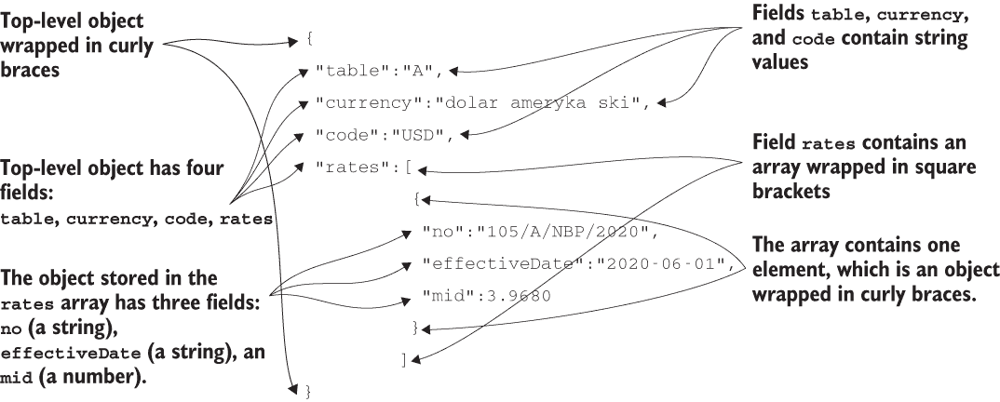
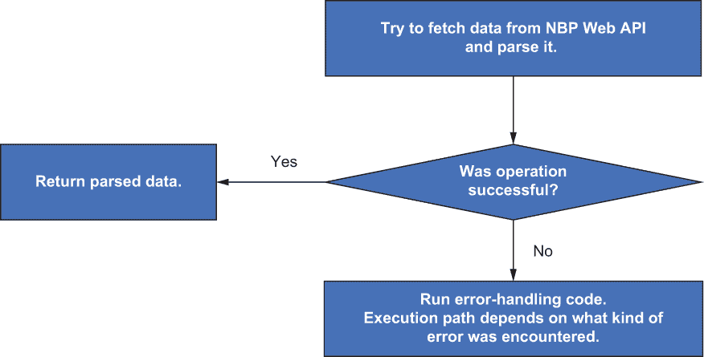
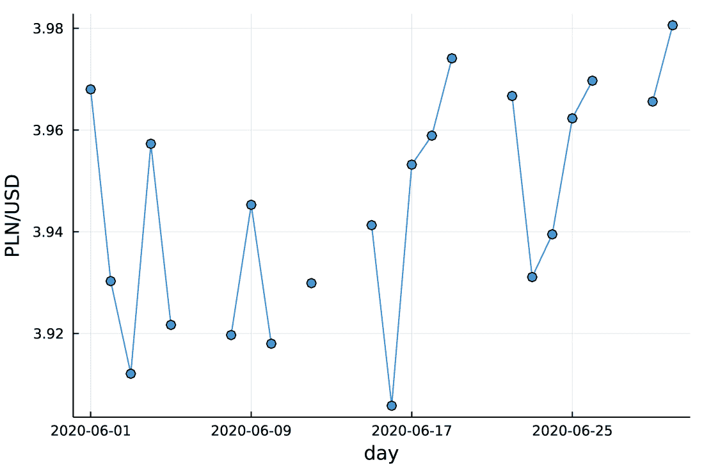
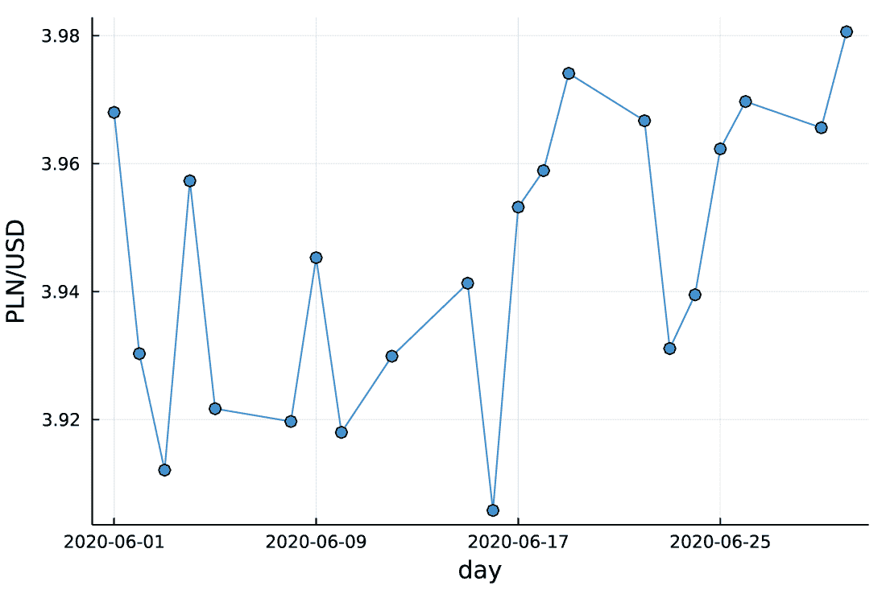
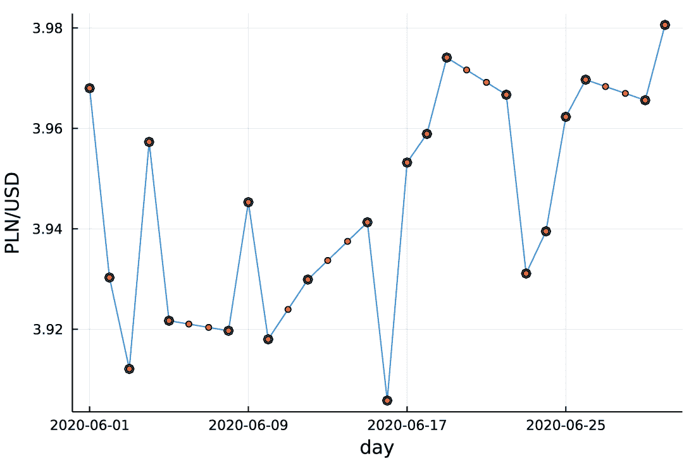

# 7 处理时间序列数据和缺失值

本章涵盖

+   使用 HTTP 查询获取数据

+   解析 JSON 数据

+   处理日期

+   处理缺失值

+   绘制含有缺失值的图表

+   插值缺失值

这是第一部分的最后一章，重点关注 Julia 语言。本章将要涵盖的主题的一个激励用例是处理金融资产价格。想象一下，你想分析某只股票的价格或两种货币之间的汇率随时间的变化。为了能够在 Julia 中处理这些问题，你需要知道如何处理时间序列数据。现实生活中时间数据的常见特征是某些时间戳包含缺失数据。因此，本章的第二个主要主题是在 Julia 中处理缺失值。

本章我们解决的问题是分析波兰国家银行（NBP）发布的 PLN/USD 汇率。数据通过 Web API 提供，API 描述在[`api.nbp.pl/en.html`](https://api.nbp.pl/en.html)。

我们将通过以下步骤完成任务：

1.  理解 Web API 公开的数据格式。

1.  使用 HTTP GET 请求获取指定日期范围内的数据。

1.  处理请求的数据不可用时的错误。

1.  从查询获取的结果中提取 PLN/USD 汇率。

1.  对获取的数据进行简单的统计分析。

1.  使用适当的处理方法绘制获取的图表数据。

为了执行这一系列步骤，你需要学习如何在 Julia 中处理缺失数据，处理日期，使用 HTTP 请求获取数据，以及解析使用 JSON 格式传递的信息([`www.json.org/json-en.html`](https://www.json.org/json-en.html))。为了帮助你逐一学习这些主题，本章分为四个部分：

+   在 7.1 节中，你将学习 NBP 通过其 Web API 公开的汇率数据的 JSON 格式；你将了解如何在 Julia 中执行 HTTP GET 请求以及如何解析 JSON 数据。

+   在 7.2 节中，你将学习如何在 Julia 中处理缺失值。这些知识是理解如何处理从 NBP Web API 获取的数据所必需的，因为其中包含缺失值。

+   在 7.3 节中，你将了解如何处理来自不同日期的 NBP Web API 查询数据，并将它们的结果作为时间序列进行处理。你将学习如何在 Julia 中处理日期。

+   在 7.4 节中，你将对时间序列数据进行统计分析并绘制图表。我们将特别关注在数据分析和可视化中处理缺失数据。

## 7.1 理解 NBP Web API

在你开始分析汇率数据之前，你需要学习如何从 NBP Web API 获取它。此外，正如你很快就会看到的，NBP Web API 以 JSON 格式公开汇率信息，因此你还将了解如何解析它。我选择这个数据源是因为 JSON 格式被许多数据源广泛使用，因此学习如何处理它是有价值的。此外，你可以预期在实际操作中，你通常需要在数据科学项目中通过各种 Web API 获取数据。

我们首先通过网页浏览器检查 NBP Web API 公开的数据。我们将通过网页浏览器传递示例查询。接下来，你将学习如何以编程方式执行此操作。

### 7.1.1 通过网页浏览器获取数据

Web API 的完整规范可在[`api.nbp.pl/en.html`](https://api.nbp.pl/en.html)找到。API 可以通过网页浏览器和编程方式访问。我们首先使用网页浏览器查询它。就我们的目的而言，了解请求的一种格式就足够了：

```
https://api.nbp.pl/api/exchangerates/rates/a/usd/YYYY-MM-DD/?format=json
```

在这个请求中，你应该将 YYYY-MM-DD 部分替换为特定日期，首先输入年份的四位数字，然后是月份的两位数字，最后是日期的两位数字。以下是一个获取 2020 年 6 月 1 日数据的示例：

```
https://api.nbp.pl/api/exchangerates/rates/a/usd/2020-06-01/?format=json
```

当你在网页浏览器中运行此查询时，你应该得到以下响应（根据你使用的浏览器，响应的布局可能略有不同）：

```
{
 "table":"A",
 "currency":"dolar amerykański",
 "code":"USD",
 "rates":[
          {
           "no":"105/A/NBP/2020",
           "effectiveDate":"2020-06-01",
           "mid":3.9680
          }
         ]
}
```

结果以 JSON 格式返回。你可以在[www.json.org/json-en.html](https://www.json.org/json-en.html)找到格式规范。此外，如果你想了解更多关于 JSON 的信息，可以考虑阅读 iCode Academy（白花出版社，2017 年）的《JSON 入门：7 天内轻松学习 JSON 编程指南》或浏览 MDN Web 文档教程[`mng.bz/DDKa`](http://mng.bz/DDKa)。在这里，我将专注于解释如何解释这个特定的 JSON 结构。

图 7.1 展示了说明。结果包含一个具有四个字段的对象：表格、货币、代码和汇率。对我们来说，有趣的字段是汇率，它包含一个包含单个对象的数组。这个单个对象有三个字段：no、effectiveDate 和 mid。对我们来说，重要的字段是 mid，它存储了我们查询的那天的 PLN/USD 汇率。对于 2020 年 6 月 1 日，汇率为 3.960 PLN/USD。



图 7.1 在对 NBP Web API 进行请求返回的 JSON 数据中，键值字段被大括号括起来，数组被方括号括起来。

### 7.1.2 使用 Julia 获取数据

现在我们已经了解了数据的结构，我们转向 Julia。我们将通过使用 HTTP.jl 包中的 HTTP.get 函数从 NBP Web API 获取数据。接下来，我们将使用 JSON3.jl 包中提供的 JSON 读取器函数 JSON3.read 来解析这个响应。下面的列表展示了如何执行这些步骤。

列表 7.1 执行 NBP Web API 查询和解析获取的 JSON 响应

```
julia> using HTTP

julia> using JSON3

julia> query = "https://api.nbp.pl/api/exchangerates/rates/a/usd/" *
               "2020-06-01/?format=json"                                   ❶
"https://api.nbp.pl/api/exchangerates/rates/a/usd/2020-06-01/?format=json"

julia> response = HTTP.get(query)                                          ❷
HTTP.Messages.Response:
"""
HTTP/1.1 200 OK
Date: Mon, 06 Dec 2021 10:29:10 GMT
Cache-Control: no-cache
Pragma: no-cache
Content-Length: 134
Content-Type: application/json; charset=utf-8
Expires: -1
ETag: "cZimS9v8pROOFg78jX55w0AsnRyhsNg4/e6vNH+Nxos="
Set-Cookie: ee3la5eizeiY4Eix=ud5ahSho; path=/

{"table":"A","currency":"dolar amerykański","code":"USD",
"rates":[{"no":"105/A/NBP/2020",
"effectiveDate":"2020-06-01","mid":3.9680}]}"""

julia> json = JSON3.read(response.body)                                    ❸
JSON3.Object{Vector{UInt8}, Vector{UInt64}} with 4 entries:
  :table    => "A"
  :currency => "dolar amerykański"
  :code     => "USD"
  :rates    => JSON3.Object[{...
```

❶ 定义一个包含我们查询的 URL 的字符串

❷ 向 NBP Web API 发送 HTTP GET 请求

❸ 将获取的响应数据解析为 JSON

我们将查询字符串传递给 HTTP.get 函数并获取响应对象。我们可以在打印的结果消息中看到查询是成功的，因为它有一个 200 OK 状态码。在响应消息的底部，我们看到与我们在网页浏览器中获取的相同的 JSON 数据。

响应对象包含多个字段，对我们来说重要的是 body 字段，它存储了获取的字节向量：

```
julia> response.body
134-element Vector{UInt8}:
 0x7b
 0x22
 0x74
    ⋮
 0x7d
 0x5d
 0x7d
```

我们将这个字节向量传递给 JSON 读取器函数 JSON3.read。在讨论这一步之前，让我解释一下如何高效地检查 response.body 的内容作为字符串。你可以简单地使用 String 构造函数：

```
julia> String(response.body)
"{\"table\":\"A\",\"currency\":\"dolar amerykański\",\"code\":\"USD\",
\"rates\":[{\"no\":\"105/A/NBP/2020\",
\"effectiveDate\":\"2020-06-01\",\"mid\":3.9680}]}"
```

此操作是高效的，这意味着字符串被包裹在传递的字节向量周围，并且没有进行数据复制。这有一个我们必须注意的副作用。由于我们使用了字节向量来创建 String 对象，所以 response.body 向量被清空了：

```
julia> response.body
UInt8[]
```

在 Vector{UInt8}上调用 String 构造函数会消耗存储在向量中的数据。这种行为的优点是操作非常快。缺点是转换只能进行一次。操作完成后，response.body 向量是空的，因此再次调用 String(response.body)会产生一个空字符串(""):

String 构造函数清空传递给它的 Vector{UInt8}源是 Julia 中很少见的函数之一，当它修改的参数没有以!后缀命名时。因此，记住这个例外非常重要。在我们的例子中，如果你想保留 response.body 中存储的值，你应该在传递给 String 构造函数之前将其复制，如下所示：String(copy(response.body))。

现在你已经了解了如何处理响应对象，让我们转向 json 变量，它是我们绑定 JSON3.read（response.body）返回值的。JSON3.read 函数的一个优点是它返回的对象可以像 Julia 中的任何其他对象一样查询。因此，使用点（.）来访问其字段：

```
julia> json.table
"A"

julia> json.currency
"dolar amerykański"

julia> json.code
"USD"

julia> json.rates
1-element JSON3.Array{JSON3.Object, Vector{UInt8},
SubArray{UInt64, 1, Vector{UInt64}, Tuple{UnitRange{Int64}}, true}}:
 {
              "no": "105/A/NBP/2020",
   "effectiveDate": "2020-06-01",
             "mid": 3.968
}
```

类似地，JSON 数组，例如存储在 json.rates 字段中的数组，可以使用基于 1 的索引来访问，就像 Julia 中的任何向量一样。因此，要获取存储在 json.rates 中的第一个对象的 mid 字段，你可以编写如下代码：

```
julia> json.rates[1].mid
3.968
```

接下来，我将介绍一个有用的函数，它可以用来确保在 Julia 中从数组获取数据的一个特定用例的正确性。如果我们知道并想检查一个数组恰好包含一个元素，并且我们想提取它，我们可以使用唯一函数：

```
julia> only(json.rates).mid
3.968
```

唯一函数的一个重要属性是，如果我们的向量包含零个或多个元素，它将抛出一个错误：

```
julia> only([])
ERROR: ArgumentError: Collection is empty, must contain exactly 1 element

julia> only([1, 2])
ERROR: ArgumentError: Collection has multiple elements, must contain exactly 1 element
```

当编写生产代码时，唯一的功能非常有用，因为它允许你轻松地捕获数据不符合假设时出现的错误。

### 7.1.3 处理 NBP Web API 查询失败的情况

在我们继续获取更广泛日期范围的数据之前，让我们讨论 NBP Web API 的一个更多功能。我想考虑的场景是，如果我们没有给定日期的 PLN/USD 汇率数据会发生什么。首先，在你的浏览器中执行以下查询：

```
https://api.nbp.pl/api/exchangerates/rates/a/usd/2020-06-06/?format=json
```

你应该得到以下响应：

```
404 NotFound - Not Found - Brak danych
```

我们看到在这种情况下，数据没有 2020 年 6 月 6 日的日期。让我们看看当我们尝试在下一个列表中程序化执行查询时，这个场景是如何处理的。

列表 7.2 抛出异常的查询示例

```
julia> query = "https://api.nbp.pl/api/exchangerates/rates/a/usd/" *
               "2020-06-06/?format=json"
"https://api.nbp.pl/api/exchangerates/rates/a/usd/2020-06-06/?format=json"

julia> response = HTTP.get(query)
ERROR: HTTP.ExceptionRequest.StatusError(404, "GET",
"/api/exchangerates/rates/a/usd/2020-06-06/?format=json",
HTTP.Messages.Response:
"""
HTTP/1.1 404 Not Found
Date: Mon, 06 Dec 2021 10:56:16 GMT
Cache-Control: no-cache
Pragma: no-cache
Content-Length: 38
Content-Type: text/plain; charset=utf-8
Expires: -1
Set-Cookie: ee3la5eizeiY4Eix=Naew5Ohp; path=/

404 NotFound - Not Found - Brak danych""")
```

HTTP.get 函数在这种情况下抛出一个异常，返回 404 错误，告知我们请求的页面未找到。这是我们尚未遇到的新场景。让我们讨论如何处理它。

*异常*意味着在执行查询时发生了意外情况，Julia 程序立即终止而没有产生结果。

这种行为在我们遇到意外情况时很有用。然而，在这种情况下，我们可以认为这种情况是预期的。我们不希望我们的程序在没有得到适当的查询结果时停止。或者，我们最可能想要得到一个结果，表明给定的一天没有数据，因为这一天缺少 PLN/USD 汇率。在 Julia 中，这样的值表示为 missing，7.2 节详细说明了它的含义和使用方法。

让我们讨论如何处理异常，以便它们不会在我们不希望它们终止程序的情况下终止我们的程序。为此，我们使用 try-catch-end 块。



图 7.2 使用 NBP Web API 处理 HTTP GET 错误的逻辑。当从远程位置获取数据时，错误经常发生，因此你的代码应该为这种情况做好准备。

列表 7.3 中的代码执行以下操作（也请参阅图 7.2）：

+   尝试在块的 try 部分执行我们的查询

+   如果查询成功，则返回其结果

+   如果查询失败，则执行块的 catch 部分的代码

列表 7.3 使用 try-catch-end 块处理异常

```
julia> query = "https://api.nbp.pl/api/exchangerates/rates/a/usd/" *
               "2020-06-01/?format=json"
"https://api.nbp.pl/api/exchangerates/rates/a/usd/2020-06-01/?format=json"

julia> try                                               ❶
           response = HTTP.get(query)
           json = JSON3.read(response.body)
           only(json.rates).mid                          ❷
       catch e                                           ❸
           if e isa HTTP.ExceptionRequest.StatusError    ❹
               missing
           else
               rethrow(e)                                ❺
           end
       end
3.968

julia> query = "https://api.nbp.pl/api/exchangerates/rates/a/usd/" *
               "2020-06-06/?format=json"
"https://api.nbp.pl/api/exchangerates/rates/a/usd/2020-06-06/?format=json"

julia> try
           response = HTTP.get(query)
           json = JSON3.read(response.body)
           only(json.rates).mid
       catch e
           if e isa HTTP.ExceptionRequest.StatusError
               missing
           else
               rethrow(e)
           end
       end
missing
```

❶ 在 try 部分，我们执行应该正常工作的代码。

❷ 从获取的请求响应中提取唯一条目（利率向量）的中场

❸ 如果我们尝试执行的代码抛出错误，将错误信息存储在变量 e 中

❹ 检查错误是否由 HTTP 服务器的状态错误引起；在这种情况下，产生一个缺失值

❺ 如果错误有其他原因，重新抛出它，以便程序员知道发生了意外情况

我们可以看到，对于有效的日期 2020 年 6 月 1 日，我们得到解析值 3.968，而对于无效日期 2020 年 6 月 6 日，则产生一个缺失值。

让我们在以下伪代码中回顾一下 try-catch-end 块的结构：

```
try
    <instructions that we try to execute>
catch
    <instructions executed if there is an exception in the try part>
end
```

在这里，我们正在尝试执行我们已经讨论过的三个操作：获取数据，以 JSON 格式解析它，并提取汇率。

现在看看列表 7.3 中的捕获部分。首先注意捕获关键字后面的 e。这种语法意味着我们将异常信息绑定到名为 e 的变量上。

接下来，我们使用 e isa HTTP.ExceptionRequest.StatusError 来检查异常是否确实是 HTTP 请求的问题。这正是我们在列表 7.2 中看到的异常类型。如果有 HTTP 请求的问题，我们产生缺失值。但是，我们只在这种情况下这样做。在其他所有情况下，我们使用 rethrow 函数重新抛出我们刚刚捕获的相同异常。

你可能会问我们为什么这样做。原因是我们可能会得到由例如唯一函数引发的异常。正如你所知道的那样，如果这个函数接收到一个没有恰好一个元素的数组，它将引发异常。如果这种情况发生，我们不想通过产生缺失值来隐藏这样的问题，而是更愿意明确警告用户发生了意外情况（我们期望一个元素数组，但得到了其他东西）。

不要盲目地在你的代码中捕获任何异常。

如果你在代码中捕获异常，一个好的做法是始终检查它们的类型，并且只捕获你想优雅处理的异常。有许多异常类型（例如，OutOfMemoryError），你几乎不希望默默地隐藏，并且它们可能在代码的任意部分抛出。例如，如果一个 Julia 程序耗尽内存，它很可能无法正确继续执行。

在本节中，我仅讨论了 try-catch-end 块的最简单用法。我在书中这么晚才讨论这个话题，因为虽然你需要知道如何处理异常，但它们应该保留用于异常情况。在正常情况下，更好的做法是以不抛出异常的方式编写代码。

这个建议基于两个原因。首先，处理异常相对较慢，因此大量使用 try-catch-end 块可能会降低其性能。其次，这样的代码通常更难推理。

如果你想要了解更多关于异常处理的信息，请查看 Julia 手册中的“异常处理”部分（[`mng.bz/lR9B`](http://mng.bz/lR9B)）。

## 7.2 在 Julia 中处理缺失数据

在 7.1 节的例子中，我们决定如果 NBP Web API 中的 PLN/USD 汇率数据缺失，则产生缺失。在本节中，我们将定义缺失值并讨论为什么它在数据科学项目中使用。

学习如何处理缺失值非常重要，因为大多数现实生活中的数据都存在质量问题。在实践中最常见的处理情况之一是，你想要分析的对象的一些特征尚未收集。例如，想象你正在分析一家医院中患者的体温数据。你期望每小时进行一次测量。然而，有时测量并未进行或未记录。这些情况在你要分析的数据中表现为缺失。

### 7.2.1 缺失值的定义

让我们从 Julia 手册中缺失值的定义开始（[`docs.julialang.org/en/v1/manual/missing/`](https://docs.julialang.org/en/v1/manual/missing/))：

Julia 提供了对表示统计意义上的缺失值的支持，即对于观察中某个变量的值不存在，但理论上存在有效值的情况。

这种情况表示为具有 Missing 类型的缺失值。Julia 语言（类似于 R，但与 Python 等不同）设计时内置了缺失值的概念。在你的代码中，你不需要使用哨兵值来表示数据的缺失。你可以通过使用 ismissing 函数轻松检查一个值是否缺失：

```
julia> ismissing(missing)
true

julia> ismissing(1)
false
```

让我们回顾一下第三章中引入的另一个值：无（类型为 Nothing）。无与缺失有何不同？你应该使用无来表示值的客观不存在，而缺失表示一个存在但未被记录的值。

为了确保缺失值和无之间的区别清晰，让我举一个非技术性的例子。假设我们有一个人的信息，我们询问他们的车品牌。我们可以有以下三种情况：

+   这个人有一辆车，我们知道品牌；然后我们只需给出它。

+   我们知道这个人有车，但我们不知道品牌；那么我们应该产生缺失，因为从客观上讲，这个品牌名称存在，但我们不知道它。

+   我们知道这个人没有车，我们产生无，因为该值在客观上是不存在的。

事实上，在某些情况下，使用缺失值和无之间的界限很微妙（如前例所示——如果我们甚至不知道这个人是否有车怎么办？）。然而，在实际应用中，根据应用上下文，决定使用缺失值还是无通常很容易。在数据科学领域，缺失值主要在源数据中遇到，当由于某种原因记录失败时。

### 7.2.2 处理缺失值

缺失的定义对原生支持它的编程语言的设计（如 Julia 或 R）有重要影响。在本节中，我们讨论了处理缺失值的最重要方面。

函数中的缺失值传播

原则是许多函数会静默地传播缺失值——也就是说，如果它们以缺失值作为输入，它们会以缺失值作为输出返回。以下是一些例子：

```
julia> 1 + missing
missing

julia> sin(missing)
missing
```

缺失传播的一个重要情况是在应该产生布尔值的测试上下文中：

```
julia> 1 == missing
missing

julia> 1 > missing
missing

julia> 1 < missing
missing
```

这种行为通常被称为 *三值逻辑* ([`mng.bz/o59Z`](http://mng.bz/o59Z))，因为你可以从逻辑运算中获得真、假或缺失。

三值逻辑是处理缺失值的一种逻辑上一致的方法。然而，在逻辑测试的上下文中，如果我们可能遇到缺失数据，我们应该小心。原因是将缺失值作为条件传递给条件语句会产生错误：

```
julia> if missing
           print("this is not printed")
       end
ERROR: TypeError: non-boolean (Missing) used in boolean context

julia> missing && true
ERROR: TypeError: non-boolean (Missing) used in boolean context
```

在 Julia 中处理缺失值的设计要求你明确决定缺失值应该被处理为真还是假。这是通过 coalesce 函数实现的，你可能从 SQL 中了解过它（[`mng.bz/BZ1r`](http://mng.bz/BZ1r)）。其定义很简单：coalesce 返回其第一个非缺失的位置参数，或者如果所有参数都是缺失的，则返回缺失。

coalesce 的使用最常见于处理逻辑条件。如果你写 coalesce(condition, true)，这意味着如果条件评估为缺失，你希望这个缺失被视为真。同样，coalesce(condition, false) 表示你希望将缺失视为假。以下是一个例子：

```
julia> coalesce(missing, true)
true

julia> coalesce(missing, false)
false
```

逻辑条件中的缺失值

如果你的数据可能包含你可能在逻辑条件中使用的缺失值，请始终确保用 coalesce 包裹它们，第二个参数根据你希望如何处理条件中的缺失值来设置为真或假。

使用保证布尔结果的比较运算符

有时，然而，将缺失值在比较中像其他任何值一样处理，而不使用具有三值逻辑的特殊处理，是有用的。如果需要在你的代码中这样做，你可以使用 isless 函数来测试排序，使用 isequal 来测试相等。这两个函数保证无论传递给它们的值是什么，都会返回真或假。以下是一些例子：

```
julia> isequal(1, missing)
false

julia> isequal(missing, missing)
true

julia> isless(1, missing)
true

julia> isless(missing, missing)
false
```

作为一条特殊规则，在 isless 对缺失值与数字的比较中，缺失值始终被视为大于所有数字，所以我们有以下结果：

```
julia> isless(Inf, missing)
true
```

在 isequal 比较中，缺失值仅被视为等于自身。

除了保证返回布尔值的 isequal 函数之外，Julia 还提供了另一种比较值以返回布尔值的方法。这种比较是通过 === 运算符执行的。

`isequal`函数与`===`运算符的区别在于，对于支持相等概念的价值，`isequal`通常被实现为比较值本身，而`===`测试两个值在技术上是否相同（即没有程序可以区分它们）。比较内容与技术身份之间的区别通常在处理如向量之类的可变集合时最为明显。以下是一个示例：

```
julia> a = [1]
1-element Vector{Int64}:
 1

julia> b = [1]
1-element Vector{Int64}:
 1

julia> isequal(a, b)
true

julia> a === b
false
```

向量 a 和 b 具有相同的内容，因此`isequal`测试返回 true。然而，它们在技术上不同，因为它们有不同的内存位置。因此，`===`测试返回 false。你将在第二部分中看到更多使用`===`运算符的示例。最后，Julia 有`!==`运算符，它总是给出与`===`相反的答案。

`===`、`==`和`isequal`之间的关系

这里是控制`===`和`==`运算符以及`isequal`函数之间关系的规则：

+   `===`运算符始终返回一个 Bool 值，并允许我们比较任何值以确定其身份（即没有程序可以区分它们）。

+   `==`运算符默认回退到`===`。如果一个类型在逻辑上支持相等概念（如数字、字符串或数组），它为`==`运算符定义了一个特殊方法。例如，数字是根据它们的数值进行比较的，而数组是根据它们的内容进行比较的。

+   因此，为它们实现了`==`运算符的特殊方法。当使用`==`运算符进行比较时，用户必须记住以下特殊规则：

    +   使用`==`与缺失值进行比较始终返回缺失值。

    +   使用浮点 NaN 值进行比较始终返回 false（有关此规则的更多示例，请参阅第二章）。

    +   浮点正零（0.0）和负零（-0.0）的比较返回 true。

+   `isequal`函数的行为类似于`==`运算符，但总是返回一个 Bool 值，并且为其定义了不同的特殊规则：

    +   使用`isequal`与缺失值进行比较返回 false，除非两个缺失值进行比较，此时返回 true。

    +   与浮点 NaN 值进行比较返回 false，除非两个 NaN 值进行比较，此时返回 true。

    +   浮点正零（0.0）和负零（-0.0）的比较返回 false。

`isequal`用于比较字典中的键。

重要的是要记住，当键值对存储在`Dict`字典中时，键的相等性是通过`isequal`函数确定的。例如，由于 0.0 与`isequal`比较时不等于-0.0，字典`Dict(0.0 => "zero", -0.0 => "negative zero")`存储了两个键值对，一个对应于 0.0 键，另一个对应于-0.0 键。

同样的规则适用于分组和连接数据帧（这些主题将在第二部分中讨论）。

在集合中替换缺失值

让我们回到 coalesce 函数的另一种常见用法，即缺失数据插补。假设你有一个包含缺失值的向量，如下所示。

列表 7.4 包含缺失值的向量

```
julia> x = [1, missing, 3, 4, missing]
5-element Vector{Union{Missing, Int64}}:
 1
  missing
 3
 4
  missing
```

x 向量包含整数和缺失值，所以它的元素类型，如第三章所述，是 Union{Missing, Int64}。假设我们想用 0 替换所有缺失值。这可以通过广播 coalesce 函数轻松完成：

```
julia> coalesce.(x, 0)
5-element Vector{Int64}:
 1
 0
 3
 4
 0
```

在计算中跳过缺失值

如果缺失值隐藏在集合中（如列表 7.4 中的向量 x），则有时也会不希望传播缺失值。例如，考虑 sum 函数：

```
julia> sum(x)
missing
```

结果在逻辑上是正确的。我们有想要添加的缺失值，所以结果是未知的。然而，我们可能非常常见地想要添加向量中的所有非缺失值。为此，使用 skipmissing 函数创建一个围绕 x 向量的包装器：

```
julia> y = skipmissing(x)
skipmissing(Union{Missing, Int64}[1, missing, 3, 4, missing])
```

现在 y 变量绑定到一个新对象，它在其内部存储 x 向量，但当你迭代 y 时，它会跳过存储在 x 中的缺失值。现在，如果你在 y 上运行 sum，你会得到预期的结果：

```
julia> sum(y)
8
```

通常，你会这样写：

```
julia> sum(skipmissing(x))
8
```

现在你可能会问，为什么在 Julia 中我们创建一个特殊对象来跳过缺失值。在其他语言中，比如 R，函数通常通过关键字参数让用户决定是否跳过缺失值。

有两个考虑因素。首先，编写 skipmissing(x) 是高效的。这里没有进行复制：这只是确保不会将缺失值传递给以 skipmissing(x) 作为参数的函数的一种方式。第二个原因是设计的可组合性。如果我们有一个 skipmissing(x) 对象，我们编写的函数（如 sum、mean 和 var）不需要显式处理缺失值。它们可以有一个实现，用户通过传递适当的参数来选择要操作的内容。

这有什么好处？在其他生态系统中，一些函数有适当的关键字参数来处理缺失值，而另一些则没有，在后一种情况下，用户必须手动处理。在 Julia 中，处理缺失值被抽象到了更高的层次。

在函数中启用缺失值传播

最后一种缺失值传播的场景涉及那些默认不传播缺失值的函数，因为它们的设计者决定不这样做。让我们编写一个具有这种行为的简单函数：

```
julia> fun(x::Int, y::Int) = x + y
fun (generic function with 1 method)
```

此函数只接受 Int 类型的参数；如果它接收到缺失值，则会报错：

```
julia> fun(1, 2)
3

julia> fun(1, missing)
ERROR: MethodError: no method matching fun(::Int64, ::Missing)
```

然而，在某些场景中，即使函数的设计者没有预见到有人可能想要传递缺失值给它，我们仍然想创建另一个基于原始函数并传播缺失值的函数。这个功能由 Missings.jl 包中的 passmissing 函数提供。以下是其使用的一个示例：

```
julia> using Missings

julia> fun2 = passmissing(fun)
(::Missings.PassMissing{typeof(fun)}) (generic function with 2 methods)

julia> fun2(1, 2)
3

julia> fun2(1, missing)
missing
```

这个想法很简单。passmissing 函数接受一个函数作为其参数，并返回一个新的函数。返回的函数，在本例中为 fun2，如果其任何位置参数是缺失值，则返回缺失值。否则，它使用传递的参数调用 fun。

现在你已经了解了围绕缺失值构建的 Julia 语言的基本功能。如果你想了解更多，请参阅 Julia 手册([`docs.julialang.org/en/v1/manual/missing/`](https://docs.julialang.org/en/v1/manual/missing/))或 Missings.jl 包的文档([`github.com/JuliaData/Missings.jl`](https://github.com/JuliaData/Missings.jl))。

总结一下，让我提一下，在集合（例如，Vector{Union{Missing, Int}}）中允许缺失值与不允许缺失值的相同集合类型相比，会有轻微的性能和内存消耗开销（例如，Vector{Int}）。然而，在大多数情况下，这并不明显。

练习 7.1 给定向量 v = ["1", "2", missing, "4"]，解析它，以便将字符串转换为数字，而缺失值保持为缺失值。

## 7.3 从 NBP Web API 获取时间序列数据

我们现在可以回到我们的问题，即分析 PLN/USD 汇率。在这个例子中，假设我们想要获取 2020 年 6 月所有天的数据。使用你在 7.1 节中学到的知识，我们将创建一个函数，从单日获取数据，然后将其应用于所有相关日期。但我们如何列出 2020 年 6 月的所有天？

你首先需要学习如何在 Julia 中处理日期。完成这个之后，我们将回到我们的主要任务。

时间序列分析在数据科学项目中通常是必需的。为了正确处理此类数据，你需要知道如何向观测值添加时间戳。这可以通过使用 Julia 标准库中的 Dates 模块方便地实现。

### 7.3.1 与日期一起工作

在本节中，我将向你展示如何在 Julia 中操作日期。日期支持由 Dates 标准模块提供。创建日期对象的最简单方法是将字符串传递给 Date 构造函数，该字符串的格式与你在 7.1 节中看到的 YYYY-MM-DD 格式相同。以下是一个示例：

```
julia> using Dates

julia> d = Date("2020-06-01")
2020-06-01
```

现在我们可以检查绑定到变量 d 的对象，首先检查其类型，然后提取年、月和日期部分：

```
julia> typeof(d)
Date

julia> year(d)
2020

julia> month(d)
6

julia> day(d)
1
```

除了像年、月和日这样的自然函数之外，Julia 还提供了几个更高级的函数。在这里，让我向你展示如何查询日期的星期数和英文名称：

```
julia> dayofweek(d)
1

julia> dayname(d)
"Monday"
```

你可以在 Julia 手册的“API 参考”部分找到可用函数的完整列表([`mng.bz/derv`](http://mng.bz/derv))。

如果你有一些不遵循 YYYY-MM-DD 格式的日期字符串，你可以使用 DateFormat 对象来指定自定义日期格式。有关详细信息，请参阅 Julia 手册的“构造函数”部分([`mng.bz/rn6e`](http://mng.bz/rn6e))。

构建日期的另一种常见方式是传递表示日期的年、月和日的数字：

```
julia> Date(2020, 6, 1)
2020-06-01
```

最后一个构造函数为我们提供了一个简单的方法来创建从 2020 年 6 月开始的日期向量，使用广播，如下所示。

列表 7.5 创建 2020 年 6 月所有日期的向量

```
julia> dates = Date.(2020, 6, 1:30)
30-element Vector{Date}:
 2020-06-01
 2020-06-02
 2020-06-03
   ⋮
 2020-06-28
 2020-06-29
 2020-06-30
```

这种创建日期对象序列的方式很简单，但仅适用于跨一个月的日期。如果我们想要从 2020 年 5 月 20 日到 2020 年 7 月 5 日的日期呢？为了解决这个问题，我们需要使用持续时间度量。对于我们的目的，日持续时间是合适的。例如，Day(1)是一个表示等于一天的时间间隔的对象：

```
julia> Day(1)
1 day
```

现在重要的是，你可以添加带有持续时间的日期来获取新的日期。例如，要获取 2020 年 6 月 1 日之后的第二天，你可以这样写：

```
julia> d
2020-06-01

julia> d + Day(1)
2020-06-02
```

你可能已经猜到了如何写一个由一天分隔的日期范围。你可以通过使用范围来实现这一点。以下是从 2020 年 5 月 20 日到 2020 年 7 月 5 日（包括）的所有日期：

```
julia> Date(2020, 5, 20):Day(1):Date(2020, 7, 5)
Date("2020-05-20"):Day(1):Date("2020-07-05")
```

你可以通过使用 collect 函数来检查这个范围是否产生了预期的值集，将其转换为 Vector：

```
julia> collect(Date(2020, 5, 20):Day(1):Date(2020, 7, 5))
47-element Vector{Date}:
 2020-05-20
 2020-05-21
 2020-05-22
   ⋮
 2020-07-03
 2020-07-04
 2020-07-05
```

存在着其他时间持续度的度量，例如周和年。你可以在 Julia 手册的“TimeType-Period Arithmetic”部分中了解更多关于它们和日期算术规则的信息（[`mng.bz/VyBW`](http://mng.bz/VyBW)）。

最后，Julia 还允许你与时间和日期时间对象一起工作。详细信息可以在 Julia 手册的“Dates”部分中找到（[`docs.julialang.org/en/v1/stdlib/Dates/`](https://docs.julialang.org/en/v1/stdlib/Dates/)）。

练习 7.2 创建一个包含 2021 年每月第一天日期的向量。

### 7.3.2 从 NBP Web API 获取一系列日期的数据

既然我们已经创建了一个包含我们想要获取 PLN/USD 汇率数据的日期向量（在列表 7.5 中），那么让我们在下一个列表中编写一个函数来获取特定日期的数据。我们将遵循第 7.1 节中解释的步骤，这样我们就可以轻松地收集所有所需日期的数据。

列表 7.6 获取特定日期 PLN/USD 汇率数据的函数

```
function get_rate(date::Date)
    query = "https://api.nbp.pl/api/exchangerates/rates/" *
            "a/usd/$date/?format=json"
    try
        response = HTTP.get(query)
        json = JSON3.read(response.body)
        return only(json.rates).mid
    catch e
        if e isa HTTP.ExceptionRequest.StatusError
            return missing
        else
            rethrow(e)
        end
    end
end
```

这个函数对我们的第 7.1 节中的代码进行了一些小的修改。首先，我们接受一个 Date 作为其参数，这样我们就可以确保用户不会用任意值调用我们的 get_rate 函数，这个值会被插入到查询字符串中。此外，请注意，我将 get_rate 函数定义为只接受标量 Date。这是在 Julia 中定义函数的推荐风格，正如我在第五章中解释的那样。稍后我们将在这个日期向量上广播这个函数，以获取 PLN/USD 汇率向量。

接下来，为了形成查询字符串，我们将日期插入其中。正如我们在第六章中讨论的，插入是通过使用$字符后跟插入变量的名称来完成的。以下是一个示例：

```
julia> d
2020-06-01

julia> "d = $d"
"d = 2020-06-01"
```

为了再举一个例子，这里有一种方法来插值我们在列表 7.5 中定义的 dates 向量中的第一个值（插值部分是加粗的）：

```
julia> "https://api.nbp.pl/api/exchangerates/rates/" *
       "a/usd/$(dates[1])/?format=json"
"https://api.nbp.pl/api/exchangerates/rates/a/usd/2020-06-01/?format=json"
```

这次，作为一个例子，我们插值 dates[1]，为了确保它得到适当的插值，我们将其括在括号中。如果我们省略括号，整个 dates 向量都会被插值，然后是[1]字符序列，这并不是我们想要的（再次强调，插值部分是加粗的）：

```
julia> "https://api.nbp.pl/api/exchangerates/rates/" *
       "a/usd/$dates[1]/?format=json"
"https://api.nbp.pl/api/exchangerates/rates/a/usd/[Date(\"2020-06-01\"),
 Date(\"2020-06-02\"), Date(\"2020-06-03\"), Date(\"2020-06-04\"),
 Date(\"2020-06-05\"), Date(\"2020-06-06\"), Date(\"2020-06-07\"),
 Date(\"2020-06-08\"), Date(\"2020-06-09\"), Date(\"2020-06-10\"),
 Date(\"2020-06-11\"), Date(\"2020-06-12\"), Date(\"2020-06-13\"),
 Date(\"2020-06-14\"), Date(\"2020-06-15\"), Date(\"2020-06-16\"),
 Date(\"2020-06-17\"), Date(\"2020-06-18\"), Date(\"2020-06-19\"),
 Date(\"2020-06-20\"), Date(\"2020-06-21\"), Date(\"2020-06-22\"),
 Date(\"2020-06-23\"), Date(\"2020-06-24\"), Date(\"2020-06-25\"),
 Date(\"2020-06-26\"), Date(\"2020-06-27\"), Date(\"2020-06-28\"),
 Date(\"2020-06-29\"), Date(\"2020-06-30\")][1]/?format=json"
```

最终的修改是，根据我在第二章中介绍的规则，我们在代码中明确写出 return 关键字两次，以确保 get_rate 函数将返回的值清晰可见。

现在我们已经准备好在下一列表中获取 2020 年 6 月的 PLN/USD 汇率。

列表 7.7 获取 2020 年 6 月的 PLN/USD 汇率

```
julia> rates = get_rate.(dates)
30-element Vector{Union{Missing, Float64}}:
 3.968
 3.9303
 3.9121
   ⋮
  missing
 3.9656
 3.9806
```

我们在 get_rate 函数后面使用点（.）来将其应用于 dates 向量的所有元素。此外，结果是一个具有元素类型 Union{Float64, Missing}的 Vector，这意味着在结果中，我们有缺失值和浮点数的混合。

## 7.4 分析从 NBP Web API 获取的数据

在列表 7.5 中定义了 dates 变量，在列表 7.7 中定义了 rates 变量后，让我们分析数据以了解其内容。我们想要做以下事情：

+   计算数据的基本摘要统计量：率的向量的平均值和标准差

+   分析我们向量中缺失数据出现的星期几

+   在图表上显示 PLN/USD 汇率

你将获得的关键新技能是在考虑数据的时序性质和适当处理缺失值的同时进行此分析。

### 7.4.1 计算摘要统计量

首先，我们想要计算列表 7.7 中定义的率的向量的平均值和标准差。我们的第一次尝试使用了 Statistics 模块中的 mean 和 std 函数：

```
julia> using Statistics

julia> mean(rates)
missing

julia> std(rates)
missing
```

不幸的是，这并不是我们预期的结果。如第 7.2 节所述，我们需要额外使用 skipmissing 函数：

```
julia> mean(skipmissing(rates))
3.9452904761904755

julia> std(skipmissing(rates))
0.022438959529396577
```

在分析期间，PLN/USD 汇率略低于 4 PLN/USD，标准差约为 0.02。

### 7.4.2 找出哪些星期几缺失值最多

如第 7.3 节所述，dayname 函数返回给定日期的英文名称。因此，我们可以使用你在第六章中学到的 proptable 函数，通过交叉表 dayname.(dates)和 ismissing .(rates)来获取所需的结果，如下一列表所示。

列表 7.8 率向量中缺失数据天数的频率表

```
julia> using FreqTables

julia> proptable(dayname.(dates), ismissing.(rates); margins=1)
7×2 Named Matrix{Float64}
Dim1 ╲ Dim2 │ false   true
────────────+─────────────
Friday      │   1.0    0.0
Monday      │   1.0    0.0
Saturday    │   0.0    1.0
Sunday      │   0.0    1.0
Thursday    │  0.75   0.25
Tuesday     │   1.0    0.0
Wednesday   │   1.0    0.0
```

我们可以看到，周六和周日我们总是有缺失数据。对于其他所有日子，除了周四，没有数据缺失。让我们找出哪些周四有问题。为此，创建一个布尔向量，使用广播找到满足两个条件的索引：

```
julia> dayname.(dates) .== "Thursday" .&& ismissing.(rates)
30-element BitVector:
 0
 0
 0
   ⋮
 0
 0
 0
```

我们可以使用这个布尔向量来找到日期向量中满足条件的元素，如下列所示。

列表 7.9 查找汇率向量包含缺失值的星期四

```
julia> dates[dayname.(dates) .== "Thursday" .&& ismissing.(rates)]
1-element Vector{Date}:
 2020-06-11
```

我们可以看到，一个单独的日子符合我们的条件。你可以确认这个日期在波兰是一个国家假日，所以结果看起来是合理的。

你将在第二部分学到更多与此示例相关的细节：

+   在列表 7.8 中展示的表中，日期是按字母顺序排序的。在第二部分，你将了解到，你可以使用 CategoricalArrays.jl 包按一周中日期的标准顺序对行进行排序。

+   在列表 7.9 中，所使用的条件看起来有点复杂。在第二部分，你将了解到，如果你将日期和汇率向量保存在 DataFrame 中，你可以更容易地进行选择。

### 7.4.3 绘制 PLN/USD 汇率图

作为最后一步，让我们创建一个 PLN/USD 汇率图的图表。从最简单的方法开始，将日期和汇率向量传递给绘图函数：

```
julia> using Plots

julia> plot(dates, rates;
            xlabel="day", ylabel="PLN/USD", legend=false, marker=:o)
```

图 7.3 显示了该图表。它看起来不太美观，因为它在汇率向量中缺失值的地方有间隙。



图 7.3 在这个日期与汇率向量的基本图表中，我们在向量中值缺失的地方有间隙。

为了修复这个图表，让我们跳过日期和汇率向量中包含缺失值的那些日子。我们再次可以使用有效的索引的布尔向量。语法稍微有点棘手：

```
julia> rates_ok = .!ismissing.(rates)
30-element BitVector:
 1
 1
 1
⋮
0
 1
 1
```

我们应该如何读取它？对于传递的单个值，!ismissing 是 ismissing 函数产生的返回值的否定。现在我们知道我们需要在感叹号(!)操作符前加上点(.)来广播它，但我们需要在 ismissing 部分后加上点(.)，这给了我们我使用的语法。

因此，可以通过以下命令生成跳过缺失值的图表：

```
julia> plot(dates[rates_ok], rates[rates_ok];
            xlabel="day", ylabel="PLN/USD", legend=false, marker=:o)
```

与 7.4.2 节末尾提到的笔记类似，如果数据存储在 DataFrame 中，这个操作可以做得更干净。我们将在第二部分讨论这个话题。

图 7.4 显示了你应该得到的结果。观察图表的 x 轴，观测值根据它们的日期适当地间隔。这意味着在图 7.4 中，从视觉上看，我们对图 7.3 中数据缺失的日期进行了线性插值——即图表中的点通过直线连接。



图 7.4 跳过缺失值的日期与汇率向量图表。与图 7.3 不同，这个图表是连续的。

你可以使用 Impute.jl 包中的 Impute.interp 函数执行数据的线性插值。给定一个向量，这个函数通过线性插值使用两个非缺失值之间的所有缺失值：

```
julia> using Impute

julia> rates_filled = Impute.interp(rates)
30-element Vector{Union{Missing, Float64}}:
 3.968
 3.9303
 3.9121
   ⋮
 3.9669666666666665
 3.9656
 3.9806
```

Impute.jl 包具有许多更多功能，这些功能有助于处理缺失数据。我建议你查看该包的仓库（[`github.com/invenia/Impute.jl`](https://github.com/invenia/Impute.jl)）以获取详细信息。

为了完成我们的项目，让我们将日期与`rates_filled`向量的散点图添加到图 7.4 所示的图表中，以检查是否确实使用了线性插值：

```
julia> scatter!(dates, rates_filled, markersize=3)
```

我们使用带有感叹号结尾的 `scatter!` 函数来更新之前的图表，并添加额外的数据。图 7.5 展示了我们操作的结果。



图 7.5：一个日期与利率向量的散点图，跳过了缺失值，并添加了一个散点图，该散点图表示使用线性插值填充的缺失数据。该图表的形状与图 7.4 相同。

如果你想要了解更多关于可以传递给 Plots.jl 包提供的绘图函数的属性，其手册中的“属性”部分（[`docs.juliaplots.org/stable/attributes/`](https://docs.juliaplots.org/stable/attributes/））是一个很好的起点。在图 7.3-7.5 所展示的图表的上下文中，例如，你可能会发现使用 xticks 关键字参数定义自定义的 x 轴刻度很有用，这样它们就可以使用与默认不同的间距或显示格式。使用这个功能，让我们用具有非缺失数据的日期的 x 轴刻度来重现图 7.4。图 7.6 展示了我们想要的结果。


图 7.6：在日期与利率向量的散点图中添加了具有数据的日期的 x 轴刻度，跳过了缺失值。

与图 7.4 相比，图 7.6 有三个变化。首先，我们有了位于日期处的 x 轴刻度。我们通过在绘图调用中添加 xticks=dates[rates_ok]关键字参数来实现这一点。其次，由于现在有很多刻度，我们垂直打印它们，这是通过 xrot=90 关键字参数实现的。第三，由于标签占据了更多的垂直空间，我们通过 bottommargin=5Plots.mm 关键字参数增加了图表的底部边距。

你可能会问 5Plots.mm 代表什么。这个表达式定义了一个代表 5 毫米的值。这个功能由 Measures.jl 包提供，并在 Plots.jl 包中可用。我们需要使用 Plots.前缀，因为 Plots.jl 没有导出 mm 常量。在 Plots.jl 中使用长度的绝对度量（在我们的例子中是毫米）来定义图表的尺寸的能力，当你想要创建生产质量的图表时通常很有用。

下面是生成图 7.6 的完整代码：

```
julia> plot(dates[rates_ok], rates[rates_ok];
            xlabel="day", ylabel="PLN/USD", legend=false, marker=:o,
            xticks=dates[rates_ok], xrot=90, bottommargin=5Plots.mm)
```

为了总结本章内容，尝试以下更高级的练习。

练习 7.3 NBP Web API 允许你获取一段时间内日期的汇率序列。例如，查询 ["https://api.nbp.pl/api/exchangerates/rates/a/usd/2020-06-01/2020-06-30/?format=json"](https://api.nbp.pl/api/exchangerates/rates/a/usd/2020-06-01/2020-06-30/?format=json) 返回了 2020 年 6 月的汇率序列，这些汇率存在于特定日期——换句话说，没有汇率的日期会被跳过。你的任务是解析这个查询的结果，并确认获得的结果与我们收集的日期和汇率向量中的数据一致。

## 摘要

+   JSON 是一种常用于交换数据的存储格式。它允许你处理复杂的数据结构，包括对象（提供键值映射）和数组（存储值序列）。

+   来自 HTTP.jl 包的 HTTP.get 函数可以用来发送 HTTP GET 请求消息。如果请求失败，此函数会抛出 HTTP .ExceptionRequest.StatusError 异常。

+   你可以通过使用 try-catch-end 块来处理 Julia 抛出的异常。请谨慎使用此功能，并仅捕获你真正想要处理的异常。

+   你可以通过使用 JSON3.jl 包中的 JSON3.read 函数在 Julia 中解析 JSON 数据。结果值可以使用标准的 Julia 语法访问：可以使用点（.）语法检索对象键，使用索引访问数组元素。

+   Julia 提供了缺失值，用于在观察中某个变量的值不存在，但理论上存在有效值的情况。这个特殊值在 Julia 中被引入，因为它经常被需要，因为现实生活中的数据很少是完整的。

+   许多标准的 Julia 函数会传播缺失值：如果它们接收到缺失值作为参数，它们会返回缺失值作为结果。因此，如果你使用这些函数，你不需要添加任何特殊代码来处理缺失数据。

+   如果你有一个可能取此值的变量，可以使用 coalesce 函数为缺失值提供默认值。这在编写逻辑条件时特别有用。如果你想表达式在 x 缺失时产生 false，而在其他情况下保留 x 的值，则编写 coalesce(x, false)。

+   如果你的数据集中包含缺失值，你可以使用 skipmissing 包装器来高效地创建（不复制数据）另一个集合，该集合已移除这些缺失值。

+   如果你有一个默认不接受缺失值的函数，你可以使用 passmissing 函数将其包装成传播缺失值的函数。

+   Dates 标准模块提供了处理日期、时间和日期时间对象的功能。如果你处理时间数据，你可能会使用这个模块。

+   您可以使用日期对象来表示日期作为时间的实例。几个对象（如 Day 和 Month）允许您表示时间段。您可以对表示时间和时间段实例的对象执行算术运算。日期标准模块的这项内置功能很有用，因为涉及日期的算术规则很复杂，所以您不需要自己实现它们。

+   Julia 提供了许多便利函数，例如 dayofweek 和 dayname，允许您查询日期对象。在分析时间数据时，此类信息通常很有用。

+   当使用来自 Plots.jl 包的 plot 函数绘制数据时，缺失的数据会被跳过。在设计您的图表时，您需要考虑这一点。

+   Plots.jl 正确处理传递给它的日期对象，并确保图表上点的间距遵循日历中日期之间的距离。这是一个重要特性，因为图表上的距离与日期之间的间隔成正比。

+   如果您想在数据序列的缺失值上执行线性插值，可以使用来自 Impute.jl 包的 Impute.interp 函数。使用此包可以节省您实现插值代码的精力。
