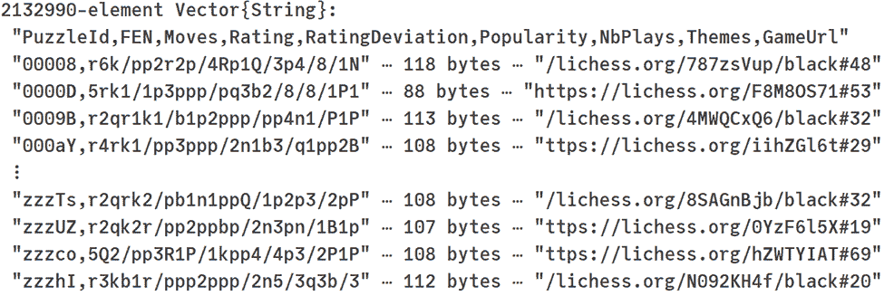
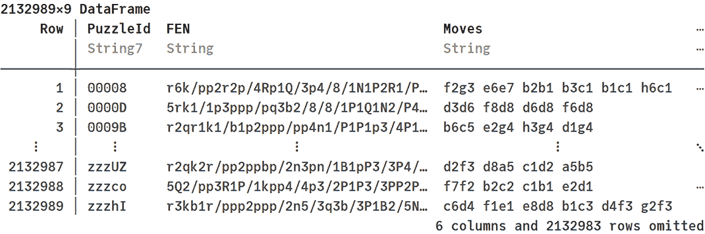
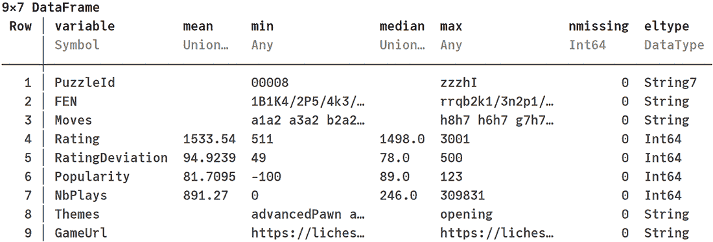
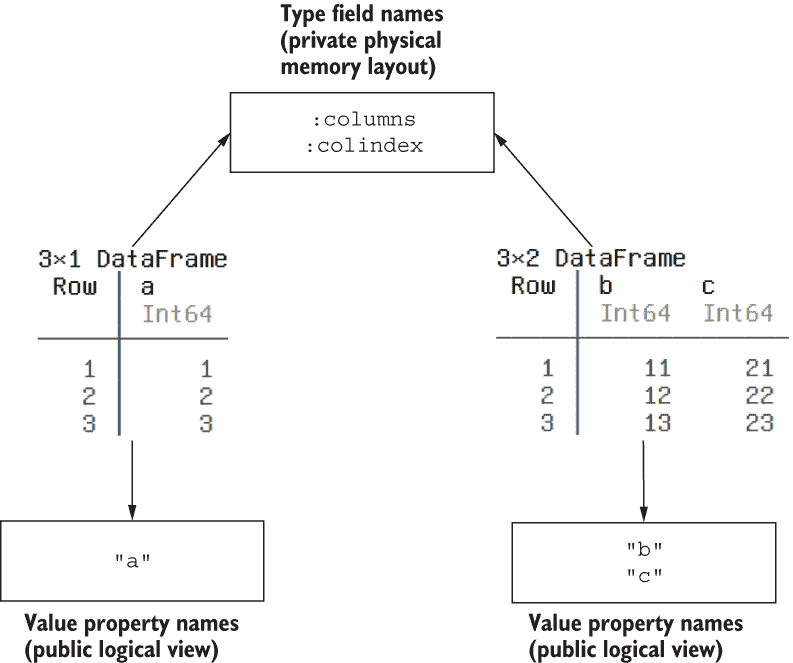
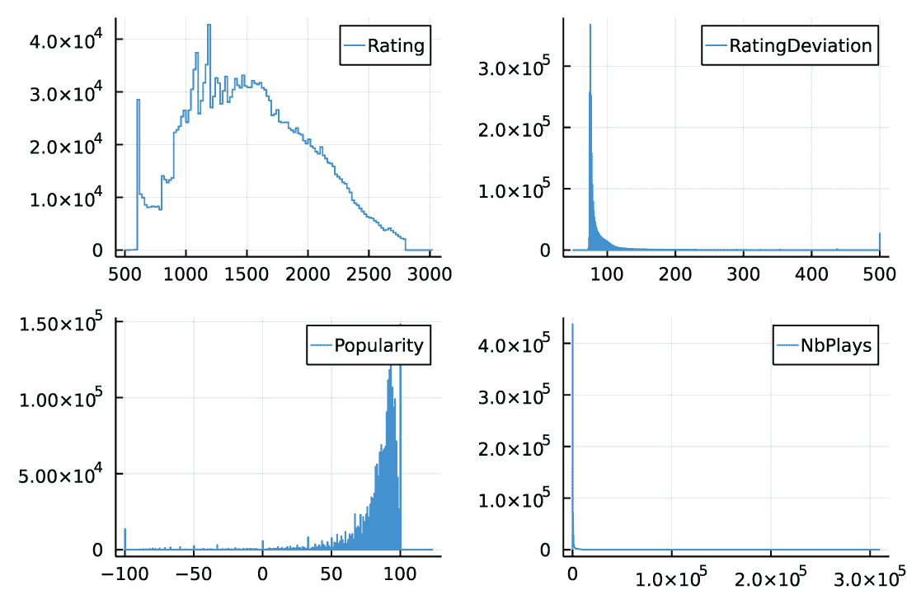

# 使用数据框的 8 个基本步骤

本章涵盖

+   处理压缩文件

+   读取和写入 CSV 文件、Apache Arrow 数据和 SQLite 数据库

+   从数据框中获取列

+   计算数据框内容的摘要统计量

+   使用直方图可视化数据分布

在本章中，你将学习使用 DataFrames.jl 包在 Julia 中处理数据框的基本原理。"数据框对象"是灵活的数据结构，允许你处理表格数据。正如我在第一章中解释的，表格数据通常，尤其是数据框，是一个由单元格组成的二维结构。每一行都有相同数量的单元格，提供关于数据的一个观测值的信息。每一列都有相同数量的单元格，存储关于观测值之间相同特征的信息，并且有一个名称。

在阅读第一部分后，你已经掌握了使用 Julia 分析数据的基本技能。从本章开始，你将学习如何在 Julia 中高效地执行数据分析任务。我们首先解释如何处理表格数据，因为大多数统计数据集都采用这种形式。因此，几乎所有用于数据科学的生态系统都提供了数据框类型。例如：

+   每个关系型数据库都通过一个或多个表来组织数据。

+   在 R 中，data.frame 对象是语言中内置的一个核心概念。多年来，这个概念在这个生态系统中提出了多种替代实现；其中最受欢迎的是 tibble 和 data.table。

+   在 Python 中，pandas 包非常流行，其核心组件是 DataFrame 类型。

本章的目标是介绍你如何使用数据框。我们将通过执行一个简单的数据分析任务来实现这一目标。

许多人喜欢玩游戏。在 COVID-19 大流行期间，在线下棋变得越来越受欢迎。Netflix 还通过其 2020 年的迷你剧集《王后棋局》进一步激发了这种兴趣。如果你想了解更多关于近期对棋类游戏日益增长的兴趣，你可能想查看 Chess.com 博客文章[`mng.bz/O6Gj`](http://mng.bz/O6Gj)。

许多人通过解决棋盘谜题来练习下棋。因此，一个自然的问题就是：什么使一个棋盘谜题变得出色？我们将通过本章将要进行的分析来探讨这个话题。具体来说，我们将研究谜题的流行程度与其难度之间的关系。也许人们最喜欢简单的谜题。或者也许相反，非常难的谜题，需要找到巧妙的走法，才是最有吸引力的。本章和第九章的目标是向你展示如何找到这些问题的答案。

就像任何数据科学项目一样，为了对问题有深入了解，我们需要可以分析的数据。幸运的是，有关谜题的数据在网络上免费提供。Lichess ([`lichess.org`](https://lichess.org/)) 是一个免费的开源国际象棋服务器。其功能之一是允许用户解决国际象棋谜题。

您可以从 [`database.lichess.org`](https://database.lichess.org/) 下载可用的谜题数据库。数据在 Creative Commons CC0 许可下分发。包含谜题的文件作为一个 bzip2 存档 ([`mng.bz/YKgj`](http://mng.bz/YKgj)) 提供。它包含关于超过两百万个谜题的信息，包括给定谜题被玩了多少次，谜题有多难，Lichess 用户有多喜欢这个谜题，以及谜题具有哪些国际象棋主题。

我们的目标是检查谜题难度与用户是否喜欢它之间的关系。我们将在第九章进行这项分析。然而，在我们能够从数据中获得见解之前，我们需要获取它、加载它，并对其进行初步分析。这些准备工作是本章的目标。具体来说，我们将执行以下步骤：

1.  从网络上下载压缩的谜题存档。

1.  解压缩它。

1.  将其内容读入一个数据框。

1.  使用直方图来分析存储在此数据集中所选特征的分布。

所有这些任务几乎需要在每个数据科学项目中执行。因此，学习如何高效地执行这些任务是有用的。为了实现这些目标，我按照以下方式组织了本章：

+   在第 8.1 节中，你将学习如何在 Julia 中处理 bzip2 压缩数据。在实际应用中，知道如何编程处理压缩归档通常是必需的，因为许多来源中的数据通常为了存储而进行压缩。

+   在第 8.2 节中，我将向您展示如何将 CSV 文件读入 DataFrame 对象并快速检查其内容。

+   第 8.3 节介绍了从数据框中获取数据的最基本方法：通过从中选择一个列。

本章中我们处理的数据源是 CSV 格式。为了向您展示如何读取和写入使用不同标准存储的数据，在第 8.4 节中，你将学习如何处理 Apache Arrow 格式和 SQLite 数据库。

## 8.1 获取、解包和检查数据

要处理 Lichess 上可用的谜题数据库，我们首先需要从网络上下载它。接下来，我们将解压缩它，以便稍后可以将其读入 DataFrame。

我将向您展示如何解包存储在 bzip2 存档中的数据。然而，同样的方法也可以用于解压缩其他格式创建的存档。数据压缩通常被使用，因为它可以减少存储大小或传输时间，因此了解如何处理压缩数据在实践中是有用的。

注意：在包含本书源代码的 GitHub 仓库中，我已经包含了本节中使用的 puzzles.csv.bz2 文件，以确保本章和第九章中展示的结果的可重复性。Lichess 棋盘数据库不断更新，因此如果你选择使用其最新版本而不是 GitHub 上的版本，你可能会得到略微不同的结果，代码可能需要一些小的修改。因此，在示例代码的第一步中，我们将文件保存为 new_puzzles.csv.bz2，这样它就不会覆盖我们在分析中使用的 puzzles.csv.bz2 文件。

### 8.1.1 从网络上下载文件

由于下载的文件很大，我们添加了一个步骤来检查文件是否已经本地存在，以避免在不需要的情况下再次获取：

```
julia> import Downloads

julia> if isfile("new_puzzles.csv.bz2")                         ❶
           @info "file already present"                         ❷
       else
           @info "fetching file"                                ❸
           Downloads.download("https://database.lichess.org/" * ❸
                              "lichess_db_puzzle.csv.bz2",      ❸
                              "new_puzzles.csv.bz2")            ❸
       end
[ Info: file already present
```

❶ 检查文件是否已经存在

❷ 如果是，则打印确认信息

❸ 如果不是，则通知用户需要从网络上获取数据

我们使用 @info 宏来打印适当的状态消息。在上面的打印输出中，我展示了 puzzles.csv.bz2 已经存在于工作目录中。在这种情况下，isfile("new_puzzles.csv.bz2") 检查产生 true。

在 Julia 中创建事件日志

Julia 随带日志模块，该模块允许你将计算进度记录为事件日志。@info 宏是这个模块的一部分，用于记录信息性消息。其他常见的事件严重程度级别通过宏支持：@debug、@warn 和 @error。

日志模块允许你灵活地决定哪些事件被记录以及如何记录。例如，你可以决定只记录错误消息并将它们写入文件。如果你想了解更多关于如何在 Julia 程序中配置日志的信息，请参阅 Julia 手册中的“日志”部分 ([`docs.julialang.org/en/v1/stdlib/Logging/`](https://docs.julialang.org/en/v1/stdlib/Logging/)) 以获取详细信息。

### 8.1.2 使用 bzip2 归档

存储在 GitHub 仓库中并用于本章的 puzzles.csv.bz2 文件是使用 bzip2 算法压缩的 ([www.sourceware.org/bzip2/](https://www.sourceware.org/bzip2/))，这由 .bz2 文件扩展名指示。我们将使用 CodecBzip2.jl 包来解压缩它。我们首先将文件内容读取为 UInt8 值的向量（单个 UInt8 值是 1 字节），然后使用转码函数将其解压缩为一个字节数组向量：

```
julia> using CodecBzip2

julia> compressed = read("puzzles.csv.bz2")                 ❶
94032447-element Vector{UInt8}:
 0x42
 0x5a
 0x68
    ⋮
 0x49
 0x5f
 0x30

julia> plain = transcode(Bzip2Decompressor, compressed)     ❷
366020640-element Vector{UInt8}:
 0x30
 0x30
 0x30
    ⋮
 0x32
 0x30
 0x0a
```

❶ 将压缩数据读入一个字节数组向量

❷ 使用 Bzip2Decompressor 编解码器解压缩数据

压缩数据有 94,032,447 字节，解压缩后变为 366,020,640 字节。因此，该数据集的压缩比大约为 4：

```
julia> length(plain) / length(compressed)
3.892492981704496
```

理解转码函数

在我们的例子中，我们使用转码函数来解压缩一个字节数组。在 Julia 中，这个函数用于两个上下文：更改字符串编码和转码数据流。

第一个用例是在 Unicode 编码之间转换数据。正如你在第六章中学到的，Julia 中的字符串是 UTF-8 编码的。如果你有一个以 UTF-16 或 UTF-32 编码的源数据流，你可以使用 transcode 函数将其转换为 UTF-8。同样，你也可以将 UTF-8 编码的数据转换为 UTF-16 或 UTF-32。

使用 transcode 函数的第二个情况是将数据流进行转码。在这种情况下，您应该提供一个要应用于此数据的编解码器和一个字节数组。*编解码器*是一个程序，它将数据从源格式转换为另一种目标格式。转码的最常见用途是数据压缩、解压缩和更改数据格式。以下是一个选定的可用编解码器列表，以及提供它们的包：

+   gzip、zlib 和 deflate 格式压缩和解压缩：CodecZlib.jl

+   bzip2 格式压缩和解压缩：CodecBzip2.jl

+   xz 格式压缩和解压缩：CodecXz.jl

+   zsdf 格式压缩和解压缩：CodecZstd.jl

+   base16、base32 和 base64 解码和编码：CodecBase.jl

我省略了所有这些格式和功能细节，因为我们在这本书中不需要它们。如果您想了解更多关于如何使用 transcode 函数的信息，请参阅相应包的文档。

我们很可能需要多次回到我们的未压缩数据。让我们将其写入 puzzles.csv 文件。

在保存 puzzles.csv 文件的代码中，我们使用了你在第六章中已经看到的 open 函数和 do-end 块的模式。新的东西是 write 函数的使用。它用于将数据的二进制表示写入文件。在我们的情况下，因为 plain 是 Vector{UInt8}，所以我们将其原始内容写入文件。在将存储在 plain 向量中的未压缩数据写入文件之前，我们使用 println 函数向该文件写入一个字符串。这是因为，正如你很快就会学到的，原始 CSV 数据没有包含列名的标题。我使用了 Lichess 网站上给出的列名（[`database.lichess.org/#puzzles`](https://database.lichess.org/#puzzles)）：

```
julia> open("puzzles.csv", "w") do io
           println(io, "PuzzleId,FEN,Moves,Rating,RatingDeviation," *
                       "Popularity,NbPlays,Themes,GameUrl")           ❶
           write(io, plain)                                           ❷
       end
366020640
```

❶ 将第二个传入参数的文本表示写入 io，后跟一个换行符

❷ 将第二个传入参数的二进制表示写入 io

### 8.1.3 检查 CSV 文件

让我们快速检查 puzzles.csv 文件的内容：

```
julia> readlines("puzzles.csv")
```

运行此命令在终端中给出以下输出：



的确，这个文件看起来是一个格式正确的 CSV 文件。这种格式是存储表格数据的流行方式，其指定如下：

+   文件的第一行包含由逗号（,）分隔的列名。

+   以下每一行都包含关于我们数据单个观测值（记录）的信息。在一行中，逗号分隔了引用表格连续列的单元格。每行中的列数必须等于数据第一行中定义的列名数量。

## 8.2 将数据加载到数据框中

现在我们已经解压缩了数据，让我们将其加载到数据框中。我们的 Lichess 数据存储在 CSV 格式，我故意选择这个例子，因为 CSV 是实践中使用最广泛的人类可读数据格式之一。它可以很容易地由电子表格编辑器读取和写入。因此，了解如何在 Julia 中处理 CSV 文件是值得的。

### 8.2.1 将 CSV 文件读取到数据框中

在 DataFrames.jl 库中定义的 DataFrame 类型是您在 Julia 中内存中存储表格数据最受欢迎的选项之一。要将磁盘上的 puzzles.csv 文件读取到 DataFrame 中，请使用 CSV.jl 包中的 CSV.read 函数：

```
julia> using CSV

julia> using DataFrames

julia> puzzles = CSV.read("puzzles.csv", DataFrame);
```

在最后一个表达式中，我使用分号 (;) 来抑制将数据框内容打印到屏幕。

CSV.read 函数不仅可以读取传递为字符串的文件名中的数据，还可以直接传递一个提供包含要读取数据的字节序列的源的源。在我们的例子中，我们有一个这样的源，因为它是一个绑定到普通变量的二进制向量。因此，我们也可以通过编写以下内容来创建我们的数据框：

```
julia> puzzles2 = CSV.read(plain, DataFrame;
                           header=["PuzzleId", "FEN", "Moves",
                                   "Rating", "RatingDeviation",
                                   "Popularity", "NbPlays",
                                   "Themes", "GameUrl"]);     ❶
julia> puzzles == puzzles2                                    ❷
true
```

❶ 在传递列名时使用 header 关键字参数从字节数组中读取数据

❷ 检查 puzzles 和 puzzles2 数据框是否相同

注意，在这种情况下，我们将 header 关键字参数传递给 CSV.read 函数，因为我们的原始数据没有列名。接下来，我们使用 == 操作符比较两个数据框，以确保它们相同。

选择 CSV.read 如何从源读取数据

在我们的例子中，我们看到了 CSV.read 函数允许传递 header 关键字参数来为创建的表提供列名。在 CSV.jl 文档（[`csv.juliadata.org/stable/reading.html`](https://csv.juliadata.org/stable/reading.html)）中，您可以找到读者支持的所有选项列表。我将总结几个最常用的关键字参数及其功能：

+   header—控制处理文件时如何处理列名。默认情况下，假设列名是输入的第一行/行。

+   limit—指定应从数据中读取的行数。默认情况下，读取所有数据。

+   misssingstring—控制解析输入数据时如何处理缺失值。默认情况下，空字符串被视为表示缺失值。

+   delim—解析在数据输入中查找的参数，用于分隔每行上的不同列。如果没有提供参数（默认），解析将尝试检测输入前 10 行上最一致的分隔符，如果无法检测到其他一致的分隔符，则回退到单个逗号（,）。

+   ignorerepeated—如果解析应该忽略列之间的连续分隔符，则使用此选项。此选项可用于解析固定宽度数据输入。默认情况下，它设置为 false。

+   dateformat—控制解析在数据输入中检测日期和时间值的方式。如果没有提供参数（默认），解析将尝试检测时间、日期和日期时间列。

+   decimal—在解析浮点值时使用，以指示浮点值的分数部分开始的位置。默认情况下，使用点（.）。

+   stringtype—控制字符串列的类型。默认情况下，使用第六章中讨论的 InlineString.jl 包，用于存储窄字符串的列，而 String 类型用于存储宽字符串的列。

+   pool—控制哪些列将以 PooledArray 的形式返回。我们已在第六章中讨论了这种类型。默认情况下，如果列存储字符串，且存储的唯一值数量小于其长度的 20%，并且唯一值的数量小于 500，则该列会被合并。

此外，我们不需要绑定到压缩和普通变量的值。因此，为了允许 Julia 释放这些对象分配的内存，我们将这两个变量都绑定为无：

```
julia> compressed = nothing

julia> plain = nothing
```

释放大型对象分配的内存

需要记住的是，如果一个大型对象绑定到一个在 Julia 程序中可访问的变量名，Julia 不会释放这些对象分配的内存。为了允许 Julia 重新回收此内存，你必须确保该对象不可访问。

在一个常见情况下，全局变量通常在交互会话中创建。由于在 Julia 中，你不能在变量绑定到值之后删除变量名（见 [`mng.bz/G1GA`](http://mng.bz/G1GA)），解决方案是将变量名的绑定从指向一个大对象更改为无。

### 8.2.2 检查数据框的内容

让我们看一下以下列表中的 puzzles 数据框。

列表 8.1 将样本数据框打印到屏幕上

```
julia> puzzles
```

列表 8.1 的输出被裁剪了，正如你在这里可以看到的：



裁剪由三个点表示，并在打印输出的右下角的消息中指示，我们从中了解到还有七个列和 2,123,983 行没有被完全打印出来。你在计算机上运行此命令时得到的精确输出取决于显示它的窗口大小。

当打印 puzzles 数据框时，标题包含有关显示的列名称及其元素类型的信息。我们数据框中的每一行都是一个单独的谜题描述。请注意，PuzzleId 列使用五个字符来编码谜题标识符。CSV.read 函数自动检测这一事实，并使用 String7 类型来存储字符串。另一方面，FEN 和 Moves 列更宽，因此使用 String 类型。

在读取数据后，检查所有列是否产生了预期的结果是一个好习惯。要快速查看数据框的摘要统计信息，请使用 describe 函数，如以下列表所示。

列表 8.2 获取数据框列的摘要统计信息

```
julia> show(describe(puzzles); truncate=14)
```

你可以在这里看到结果：



我想向您展示 describe 函数的完整默认结果。因此，此示例还使用了 show 函数来自定义数据框显示。truncate 关键字参数允许您指定在截断之前输出列的最大显示宽度（您可以通过执行 ?show 来了解 show 函数支持的其他关键字参数，以检查其文档字符串）。

describe 函数返回一个新的数据框，其中每一行包含有关原始数据框中单个列的信息。默认情况下，describe 为每个源列生成以下统计信息：

+   variable—存储为符号的名称

+   mean—如果列包含数值数据，则值的平均值

+   min—如果列包含可以定义顺序的数据，则列的最小值

+   median—如果列包含数值数据，则值的中间值

+   max—如果列包含可以定义顺序的数据，则列的最大值

+   nmissing—缺失值的数量

+   eltype—存储的值的类型

describe 函数允许您进一步指定要计算的统计信息（这里列出的是默认值）并选择哪些列应计算摘要统计信息。如果您想了解详细信息，请参阅文档 ([`mng.bz/09wE`](http://mng.bz/09wE))。

根据列表 8.2 中提供的摘要统计信息，我们准备对存储在 puzzles 数据框中的列进行解释：

+   PuzzleId—谜题的唯一标识符

+   FEN—对谜题起始位置的编码

+   Moves—解决谜题的移动

+   Rating—谜题的难度

+   RatingDeviation—对谜题难度评估的准确性

+   Popularity—用户对谜题的喜爱程度（越高越好）

+   NbPlays—给定谜题被玩过的次数

+   Themes—描述谜题中包含的棋类主题

+   GameUrl—从其中获取谜题的源游戏的 URL

在我们继续前进之前，让我们讨论在处理数据框时常用到的三个函数：ncol、nrow 和 names 函数。

The ncol function returns the number of columns in a data frame:

```
julia> ncol(puzzles)
9
```

nrow 函数返回数据框中的行数：

```
julia> nrow(puzzles)
2132989
```

最后，names 函数返回我们数据框中的列名向量（此函数具有更多功能，我们将在第九章中讨论）：

```
julia> names(puzzles)
9-element Vector{String}:
 "PuzzleId"
 "FEN"
 "Moves"
 "Rating"
 "RatingDeviation"
 "Popularity"
 "NbPlays"
 "Themes"
 "GameUrl"
```

### 8.2.3 将数据框保存到 CSV 文件

在我们结束本节之前，让我们看看如何将数据框保存回 CSV 文件。您使用 CSV.write 函数，其中第一个参数是目标文件名，第二个参数是要保存的表格：

```
julia> CSV.write("puzzles2.csv", puzzles)
"puzzles2.csv"
```

在此代码中，我们将谜题数据框保存到 puzzles2.csv 文件中。

检查原始 puzzles.csv 和 puzzles2.csv 文件是否相同将很有趣。为了执行此测试，我们将使用 read 函数，当传递一个文件作为单个参数时，它返回一个包含从文件中读取的字节的 Vector{UInt8}。以下是一个示例：

```
julia> read("puzzles2.csv")
386223179-element Vector{UInt8}:
 0x50
 0x75
 0x7a
    ⋮
 0x32
 0x30
 0x0a
```

因此，我们可以通过比较应用于它们的 read 函数的结果来检查文件 puzzles.csv 和 puzzles2.csv 是否相同：

```
julia> read("puzzles2.csv") == read("puzzles.csv")
true
```

事实上，这两个文件包含相同的数据。

选择 CSV.write 如何写入数据

与 CSV.read 函数类似，CSV.write 函数允许传递多个关键字参数来控制 CSV 数据应如何写入。您可以在 CSV.jl 包的文档中找到所有选项（[`csv.juliadata.org/stable/writing.html`](https://csv.juliadata.org/stable/writing.html)）。以下是最重要的几个：

+   delim—用作字段分隔符的字符或字符串。默认为逗号（,）。

+   missingstring—用于打印缺失值的字符串。默认情况下，使用空字符串。

+   dateformat—要使用的日期格式字符串。默认为由 Dates 模块指定的格式。

+   append—是否将写入追加到现有文件中。如果为 true，则不会写入列名；默认为 false。

+   compress—控制是否使用标准 gzip 压缩来压缩写入的输出。默认情况下，使用 false。

+   decimal—在写入浮点数时用作小数点的字符。默认为点（.）。

## 8.3 从数据框中获取列

为了能够执行我们的分析，我们需要学习如何从数据框中获取数据。这类操作中最常见的是提取单个列。DataFrames.jl 提供了几种进行此操作的方法。让我们逐一调查它们。

为了专注于分析 Lichess 谜题数据的任务，我们将特别想要从谜题数据框中创建 Rating、RatingDeviation、Popularity 和 NbPlays 列的直方图，因为它们将在我们的进一步分析中使用。

### 8.3.1 理解数据框的存储模型

在内部，DataFrame 对象将数据存储为向量的集合。每个向量代表数据框的一列，并分配一个名称和一个编号。让我们在表 8.1 中可视化这一点。

表 8.1 拼图数据框的结构

| 列编号 | 列名称 | 列向量 |
| --- | --- | --- |
| 1 | PuzzleId | ["00008", "0000D", "0009B", "000aY", ...] |
| 2 | FEN | ["r6k/pp2r2p/ ... /7K b - - 0 24", ...] |
| 3 | Moves | ["f2g3 e6e7 b2b1 b3c1 b1c1 h6c1", ...] |
| 4 | Rating | [1765, 1525, 1102, 1320, 1560, 1039, ...] |
| 5 | RatingDeviation | [74, 74, 75, 74, 76, 80, 75, ...] |
| 6 | Popularity | [93, 97, 85, 92, 88, 85, 80, ...] |
| 7 | NbPlays | [493, 9211, 503, 395, 441, 54, ...] |
| 8 | Themes | ["crushing ... middlegame", ...] |
| 9 | GameUrl | ["https://lichess.org/.../black#48", ...] |

例如，在内部，编号为 4 的列名为 Rating，存储了一个表示拼图难度的整数向量：[1765, 1525, 1102, 1320, 1560, ...]。

数据框的存储布局被选择以确保对数据框列执行的操作非常快。本书将讨论多个此类操作。让我们从最简单的一个开始：从数据框中提取列。

### 8.3.2 将数据框列视为属性

在第四章中，你学习了关于 NamedTuple 类型以及使用 struct 关键字参数创建的复合类型。我们讨论了你可以通过使用点号（.）后跟字段名称来访问 NamedTuple 或复合类型的字段。相同的语法允许访问数据框的列。

如果你考虑拼图数据框并想从中提取 Rating 列，请编写以下内容：

```
julia> puzzles.Rating
2132989-element Vector{Int64}:
 1765
 1525
 1102
    ⋮
  980
 1783
 2481
```

之前，在第五章中，我说过点号（.）允许用户访问结构体的字段。那么，DataFrame 类型是如何允许用户使用这种语法来访问其列的呢？

原因是 Julia 在结构体对象的字段和其属性之间做出了区分。当你使用点号（.）语法时，你可以访问对象的属性。默认情况下，对象的属性与其字段相同，但可以覆盖这种行为（技术上，你需要向 getproperty 函数添加适当的方法；更多信息请参见[`mng.bz/K0Bg`](http://mng.bz/K0Bg)）。这正是 DataFrame 类型所做的事情。它不是暴露其字段，而是允许用户使用点号（.）语法来访问其列，因为在实践中这要更有用。

注意，字段名称是类型定义的一部分，因此具有此类型的每个值都有相同的字段。相反，如果类型覆盖了属性的定义，那么具有相同类型的值之间的属性可以不同。例如，所有具有 DataFrame 类型的值都有相同的字段，但它们的属性取决于给定数据框存储的列名称。

你可以通过使用 fieldnames 函数来获取 DataFrame 类型的字段列表。如果你使用 DataFrames.jl 1.3 版本工作，调用 fieldnames(DataFrame) 将会得到一个包含 (:columns, :colindex) 的元组。（DataFrame 对象存储哪些字段是实现细节，并且它们可能会随着 DataFrames.jl 的版本而变化。）内部字段存储构成 DataFrame 列的向量，以及列名称和它们的数字映射。如果你想要从 DataFrame 类型的 df 变量中提取字段，你可以使用 getfield 函数。例如，getfield(df, :columns) 返回一个存储在数据帧中的向量。

图 8.1 展示了两个样本数据帧的字段和属性之间的关系。



图 8.1 由于两个数据帧具有相同的类型，它们具有相同的字段名称。这些字段名称是 DataFrame 类型的定义的一部分。相反，由于两个数据帧具有不同的列，它们的属性名称也不同。DataFrame 类型的属性定义为与给定实例的列名称相对应。

虽然在技术上可能，但你永远不应该直接从数据帧中提取字段。DataFrame 类型的内部布局被认为是私有的，并且可能会在未来发生变化。我仅介绍这个主题是为了确保你理解 Julia 中对象字段和属性之间的区别。

让我们回到本节的主题，并检查使用 @btime 宏获取数据帧列的操作速度有多快（回想第三章中提到的，我们需要在全局变量 puzzles 前面加上 $ 以获得正确的基准测试结果）：

```
julia> using BenchmarkTools

julia>  @btime $puzzles.Rating;
  7.600 ns (0 allocations: 0 bytes)
```

操作非常快。它只需要几纳秒，因为以这种方式访问数据帧的列不需要复制数据。通过编写 puzzles.Rating，你可以得到由 puzzles 变量引用的相同数据。Julia 需要执行的唯一操作是从 :colindex 私有字段中检索信息，即 Rating 有列号 4，然后从 :columns 私有字段中提取它。

这种行为有明显的性能优势。然而，你可能会问，如果你想要获取向量的副本，该怎么办。这不仅仅是一个普通的问题。在实践中，你可能稍后想要修改它，而不改变原始向量的数据。

在 Julia 中复制对象的一种既定方法是调用它的 copy 函数，所以通过编写 copy(puzzles.Rating)，你可以得到 puzzles 数据帧中存储的向量的副本。然而，当你比较 puzzles.Rating 和 copy(puzzles.Rating) 时，你会了解到它们是相等的：

```
julia> puzzles.Rating == copy(puzzles.Rating)
true
```

这表明使用 `==` 来测试两个向量是否相等是比较它们的内容，而不是它们的内存位置。是否有可能以某种方式比较向量，从而检查它们是否是相同的对象（在这个意义上，没有任何 Julia 程序能够区分它们）？确实有。你可以通过使用第七章中讨论的 `===` 比较来实现这一点：

```
julia> puzzles.Rating === copy(puzzles.Rating)
false
```

我们看到这两个对象不是同一个（尽管它们有相同的内容）。

如果我们使用 `===` 来比较 puzzles.Rating 和 puzzles.Rating，我们会得到 true，因为这次它们确实是同一个对象：

```
julia> puzzles.Rating === puzzles.Rating
true
```

另一方面，两个副本是不同的，正如预期的那样：

```
julia> copy(puzzles.Rating) === copy(puzzles.Rating)
false
```

你也可以在点（.）之后使用字符串字面量来获取数据框的列：

```
julia> puzzles."Rating"
2132989-element Vector{Int64}:
 1765
 1525
 1102
    ⋮
  980
 1783
 2481
```

这个操作的效果与写入 puzzles.Rating 相同。那么，你可能会问，为什么 puzzles."Rating" 有用。这种语法简化了处理数据框列名中的任何特殊字符（例如，空格）。然后双引号（"）使得列名的开始和结束变得明确。将 puzzles."Rating" 而不是 puzzles.Rating 写入的一个小缺点是，它稍微慢一些，因为 Julia 需要在从数据框获取数据之前将字符串转换为 Symbol。然而，这个操作仍然很快（纳秒级）。

练习 8.1 使用 BenchmarkTools.jl 包，通过使用 puzzles ."Rating" 语法来测量从数据框获取列的性能。

### 8.3.3 通过数据框索引获取列

使用属性访问，如 puzzles.Rating，来获取数据框的列容易输入，但有一个缺点。如果列名存储在一个变量中，会怎样呢？

```
julia> col = "Rating"
"Rating"
```

你如何获取由 col 变量引用的 puzzles 数据框的列？以及你如何从数据框中通过编号而不是名称来获取列？这两个问题都通过使用索引语法得到解答。

数据框索引的一般形式如下：

```
data_frame_name[selected_rows, selected_columns]
```

如你所见，这与第四章中讨论的矩阵类似。在本章中，我们将讨论各种选项的接受值，包括 selected_rows 和 selected_columns，但在这个部分，我们专注于你应该如何从数据框中获取单个列。

要通过复制从数据框中获取列，使用冒号（:）作为行选择器，并使用字符串、Symbol 或数字作为列选择器。这里有四种等效的方法来使用复制从 puzzles 数据框中获取 Rating 列：

```
puzzles[:, "Rating"]    ❶
puzzles[:, :Rating]     ❷
puzzles[:, 4]           ❸
puzzles[:, col]         ❹
```

❶ 使用字符串传递列选择器

❷ 使用符号传递列选择器

❸ 使用整数传递列选择器

❹ 使用变量（在这种情况下存储字符串）传递列选择器

突出强调，在引用数据框的列时，您始终可以使用字符串或符号。为了方便用户，数据框将接受两者并将它们以相同的方式处理。选择对您更方便的样式。如果您担心性能，使用符号会稍微快一点，但使用字符串的时间增加是可以忽略不计的。

注意，在最后一个选择器 puzzles[:, col] 中，我们使用绑定到 "Rating" 字符串的 col 变量。允许这种选择是使用索引而不是属性访问的好处。

最后，您可能会问我是如何确定 Rating 是我们数据框中的第四列的。这很容易使用 columnindex 函数来检查：

```
julia> columnindex(puzzles, "Rating")
4
```

如果数据框中没有找到特定的列名，columnindex 函数将返回 0，就像这个例子一样：

```
julia> columnindex(puzzles, "Some fancy column name")
0
```

在 DataFrames.jl 中，列是从 1 开始编号的（就像在标准数组中一样），因此如果您从 columnindex 函数中获得 0 值，您知道这样的列名不存在于数据框中。

您还可以使用 hasproperty 函数来测试数据框是否包含特定的列名：

```
julia> hasproperty(puzzles, "Rating")
true

julia> hasproperty(puzzles, "Some fancy column name")
false
```

注意，在 columnindex 和 hasproperty 中，如果我们愿意，可以使用符号而不是字符串来传递列名。

通过复制从数据框中获取列比非复制操作更昂贵：

```
julia>  @btime $puzzles[:, :Rating];
  2.170 ms (2 allocations: 16.27 MiB)
```

在这种情况下，时间从 puzzles.Rating 选择器的纳秒增长到 puzzles[:, :Rating] 的毫秒。此外，使用的内存也更多。

要从数据框中获取列而不进行复制，请使用感叹号（!）作为行选择器，并使用字符串、符号或数字作为列选择器。以下是四种获取 puzzles 数据框中 Rating 列而不进行复制的等价方法，使用索引：

```
puzzles[!, "Rating"]
puzzles[!, :Rating]
puzzles[!, 4]
puzzles[!, col]
```

注意，编写 puzzles[!, "Rating"] 与编写 puzzles.Rating 等效。回想一下，如果您使用冒号（:）而不是感叹号（!）（例如：puzzles[:, "Rating"]），您将得到 Rating 列的副本。

在访问数据框的列时请谨慎使用非复制访问

在许多应用中，用户可能会被诱惑使用数据框列的非复制访问，例如编写 puzzles.Rating 或 puzzles[!, "Rating"]。这种方法有其优点，因为访问更快。然而，如果您对获得的向量进行修改，非复制访问有一个严重的缺点。DataFrames.jl 用户的经验表明，这种类型的访问有时会导致难以捕捉的故障。

因此，作为一个经验法则，始终以复制的方式访问数据框的列——即像 puzzles[:, "Rating"] 一样——除非您 100% 确定您不会修改列，或者您的操作需要非常快（例如，它在一个执行数百万次的循环中）。

### 8.3.4 在数据框的列中可视化存储的数据

现在你已经学会了如何从一个数据框中获取列，我们就可以创建所需的图表了。以下代码使用 Plots.jl 包中的直方图函数生成 Rating、RatingDeviation、Popularity 和 NbPlays 列的四个直方图：

```
julia> using Plots

julia> plot(histogram(puzzles.Rating; label="Rating"),
            histogram(puzzles.RatingDeviation; label="RatingDeviation"),
            histogram(puzzles.Popularity; label="Popularity"),
            histogram(puzzles.NbPlays; label="NbPlays"))
```

你可以在图 8.2 中看到结果。所有这些变量都显著偏斜。我们将在第九章讨论如何处理这个问题，并分析拼图评分与流行度之间的关系。



图 8.2 在这些来自拼图数据框的 Rating、RatingDeviation、Popularity 和 NbPlays 列的直方图中，所有分析的变量都是偏斜的。

然而，在进入下一章之前，让我们作为一个练习，用另一种方式编写生成图表的代码：

```
julia> plot([histogram(puzzles[!, col]; label=col) for
             col in ["Rating", "RatingDeviation",
                     "Popularity", "NbPlays"]]...)
```

代码末尾的三个点(...)是你在第四章中学到的散列操作。我们需要它，因为绘图函数期望我们将创建的直方图作为连续的位置参数传递。此代码展示了你如何利用在索引数据框时可以使用变量而不是显式的列名这一事实。请注意，在这种情况下，我使用了非复制访问数据（通过应用!作为行选择器），因为我确信我不会修改或存储提取的列（这些值仅用于生成图表）。

## 8.4 使用不同格式读取和写入数据框

在本章中，你已经学会了如何使用 Julia 读取和写入 CSV 文件。然而，在数据科学项目中，还使用了许多其他数据存储格式。当你在 Julia 中处理数据框时，你通常会想使用这些格式。

这里有一些按字母顺序排列的（在括号中，我给出了支持它们的 Julia 包的名称）：Apache Arrow (Arrow.jl)、Apache Avro (Avro.jl)、Apache Parquet (Parquet.jl)、Microsoft Excel (XLSX.jl)、JSON (JSON3.jl)、MySQL (MySQL.jl)、PostgreSQL (LibPQ.jl)和 SQLite (SQLite.jl)。在本节中，我将向你展示 Arrow.jl 和 SQLite.jl 包。

Apache Arrow 格式是一种与语言无关的列式内存格式，旨在进行高效的分析操作。这种格式越来越受欢迎，因为它允许以几乎或没有成本在不同系统之间传输数据，无论使用哪种编程语言。除了这些优点之外，我选择这个格式来展示 Julia 如何以透明的方式处理存储在非原生内存格式中的数据。你可以在[`arrow.apache.org/`](https://arrow.apache.org/)了解更多关于这个标准的信息。

作为第二个例子，我们将使用 SQLite 数据库。在我看来，这是最容易设置和使用的数据库之一。因此，它也是实践中使用最广泛的数据库之一；据报道，有超过一千兆（10¹²）个 SQLite 数据库正在使用中([www.sqlite.org/mostdeployed.html](https://www.sqlite.org/mostdeployed.html))。

对于这两种数据格式，我将为您提供一个关于如何保存和加载我们在本章中使用的 puzzles 数据帧的最小介绍。

### 8.4.1 Apache Arrow

我们从以 Apache Arrow 格式保存数据帧开始。如第一章所述，它由 Apache Parquet、PySpark 和 Dask 等流行框架支持。这项任务相对简单；只需使用 Arrow.write 函数，传递要保存的文件名和数据帧：

```
julia> using Arrow

julia> Arrow.write("puzzles.arrow", puzzles)
"puzzles.arrow"
```

一个更有趣的过程与读取存储在 Apache Arrow 格式中的数据有关。您首先需要创建一个 Arrow.Table 对象，然后将它传递给 DataFrame 构造函数。在代码中，我们检查我们读取回的对象是否与原始 puzzles 数据帧相同：

```
julia> arrow_table = Arrow.Table("puzzles.arrow")      ❶
Arrow.Table with 2329344 rows, 9 columns, and schema:
 :PuzzleId         String
 :FEN              String
 :Moves            String
 :Rating           Int64
 :RatingDeviation  Int64
 :Popularity       Int64
 :NbPlays          Int64
 :Themes           String
 :GameUrl          String

julia> puzzles_arrow = DataFrame(arrow_table);         ❷

julia> puzzles_arrow == puzzles                        ❸
true
```

❶ 创建一个包含对磁盘上源数据引用的 Arrow.Table 对象

❷ 从 Arrow.Table 构建 DataFrame

❸ 检查我们创建的数据帧与使用的源数据帧具有相同的内容

Arrow.Table 对象的显著特点是它存储的列使用 Apache Arrow 格式。同样重要的是，Arrow.Table 中的列是原始 arrow 内存的视图。

这有一个显著的优势。当创建 Arrow.Table 对象时，操作系统不会同时将整个文件内容加载到 RAM 中。相反，当请求文件的不同区域时，文件的部分内容会被部分交换到 RAM 中。这允许支持处理大于可用 RAM 的 Apache Arrow 数据。此外，如果您只需要处理源表的一部分，读取过程会更快，因为您只需获取所需的数据。

然而，这种设计有一个缺点，因为这意味着具有 Apache Arrow 数据格式的列是只读的。以下是一个例子：

```
julia> puzzles_arrow.PuzzleId
2329344-element Arrow.List{String, Int32, Vector{UInt8}}:
 "00008"
 "0000D"
   ⋮
 "zzzco"
 "zzzhI"

julia> puzzles_arrow.PuzzleId[1] = "newID"
ERROR: setindex! not defined for Arrow.List{String, Int32, Vector{UInt8}}
```

注意，puzzles_arrow.PuzzleId 列具有非标准的 Arrow.List 类型，而不是例如 Vector 类型。这种非标准向量类型是只读的。我们通过尝试更改此类向量的一个元素来检查这一点，并得到一个错误。

在许多应用程序中，如果源数据帧的列是只读的，通常没有问题，因为我们可能只想从它们中读取数据。然而，有时您可能希望修改从 Apache Arrow 源创建的数据帧中存储的向量。

在这种情况下，只需复制数据帧。通过这样做，您将在 RAM 中实现 Apache Arrow 列，并将它们的类型更改为可变的标准 Julia 类型。以下是一个例子：

```
julia> puzzles_arrow = copy(puzzles_arrow);

julia> puzzles_arrow.PuzzleId
2329344-element Vector{String}:
 "00008"
 "0000D"
   ⋮
 "zzzco"
 "zzzhI"
```

在执行数据帧的复制操作后，:PuzzleId 列现在具有标准的 Vector 类型。

### 8.4.2 SQLite

对于 Apache Arrow 数据，我们首先将在磁盘上创建一个 SQLite 数据库。接下来，我们将存储 puzzles 数据帧到其中。最后，我们将使用 SQL SELECT 查询读取它。

首先，我们创建一个由磁盘上的文件支持的 SQLite 数据库。使用 SQLite.DB 函数，传递一个文件名作为参数：

```
julia> using SQLite

julia> db = SQLite.DB("puzzles.db")
SQLite.DB("puzzles.db")
```

接下来，我们使用 SQLite.load!函数将谜题数据框存储在其中。我们传递三个位置参数：要存储在数据库中的表、我们想要存储数据库的连接以及目标数据库中的表名：

```
julia> SQLite.load!(puzzles, db, "puzzles")
"puzzles"
```

让我们检查一下是否已成功在我们的数据库中创建了一个表。我们首先使用 SQLite.tables 函数列出数据库中存储的所有表，然后使用 SQLite.columns 函数获取有关给定表中存储的列的更详细信息：

```
julia> SQLite.tables(db)
1-element Vector{SQLite.DBTable}:
 SQLite.DBTable("puzzles", Tables.Schema:
 :PuzzleId         Union{Missing, String}
 :FEN              Union{Missing, String}
 :Moves            Union{Missing, String}
 :Rating           Union{Missing, Int64}
 :RatingDeviation  Union{Missing, Int64}
 :Popularity       Union{Missing, Int64}
 :NbPlays          Union{Missing, Int64}
 :Themes           Union{Missing, String}
 :GameUrl          Union{Missing, String})

julia> SQLite.columns(db, "puzzles")
(cid = [0, 1, 2, 3, 4, 5, 6, 7, 8],
 name = ["PuzzleId", "FEN", "Moves", "Rating", "RatingDeviation",
         "Popularity", "NbPlays", "Themes", "GameUrl"],
 type = ["TEXT", "TEXT", "TEXT", "INT", "INT",
         "INT", "INT", "TEXT", "TEXT"],
 notnull = [1, 1, 1, 1, 1, 1, 1, 1, 1],
 dflt_value = [missing, missing, missing, missing, missing,
               missing, missing, missing, missing],
 pk = [0, 0, 0, 0, 0, 0, 0, 0, 0])
```

我们看到现在数据库中有一个谜题表。关于此表列的元数据与源谜题数据框的结构相匹配。

最后，我们将谜题表读回到一个数据框中。作为一个重要的第一步，我们需要创建一个查询。我们使用 DBInterface.execute 函数，向其传递一个数据库连接和一个包含我们想要运行的 SQL 查询的字符串。重要的是，这个操作是惰性的，不会实际化查询。数据只在需要时才被检索。在我们的例子中，我们通过使用查询的结果创建一个数据框来实现这种实际化。

此外，请注意我们使用的是一个通用的执行函数，它不是 SQLite 特有的。该函数定义在由 SQLite.jl 自动加载的接口包 DBInterface.jl 中。如果我们使用另一个数据库后端，我们也会使用 DBInterface.execute 来以相同的方式运行 SQL 查询。在创建数据框之后，我们检查获得的结果与原始谜题数据框相同：

```
julia> query = DBInterface.execute(db, "SELECT * FROM puzzles")
SQLite.Query(SQLite.Stmt(SQLite.DB("puzzles.db"), 7),
Base.RefValue{Int32}(100), [:PuzzleId, :FEN, :Moves, :Rating,
:RatingDeviation, :Popularity, :NbPlays, :Themes, :GameUrl],
Type[Union{Missing, String}, Union{Missing, String},
Union{Missing, String}, Union{Missing, Int64}, Union{Missing, Int64},
Union{Missing, Int64}, Union{Missing, Int64}, Union{Missing, String},
Union{Missing, String}], Dict(:NbPlays => 7, :Themes => 8, :GameUrl => 9,
:Moves => 3, :RatingDeviation => 5, :FEN => 2, :Rating => 4,
:PuzzleId => 1, :Popularity => 6), Base.RefValue{Int64}(0))

julia> puzzles_db = DataFrame(query);

julia> puzzles_db == puzzles
true
```

这次，与 Apache Arrow 的情况不同，数据框的列是标准的 Julia 向量。让我们检查一下:PuzzleId 列：

```
julia> puzzles_db.PuzzleId
2329344-element Vector{String}:
 "00008"
 "0000D"
   ⋮
 "zzzco"
 "zzzhI"
```

使用完 SQLite 数据库后，我们需要关闭它：

```
julia> close(db)
```

要了解如何使用本节中讨论的 Arrow.jl 和 SQLite.jl 包，请访问它们的相应存储库：[`github.com/apache/arrow-julia`](https://github.com/apache/arrow-julia) 和 [`github.com/JuliaDatabases/SQLite.jl`](https://github.com/JuliaDatabases/SQLite.jl)。

## 摘要

+   DataFrames.jl 是一个允许你在 Julia 中处理表格数据的包。它定义的最重要类型是 DataFrame，其行通常表示观测值，而列通常表示这些观测值的特征。

+   您可以使用 CodecBzip2.jl 包解压 bzip2 存档。在 Julia 中以及对于其他压缩格式，也有类似的功能，因为在实际应用中，您通常会需要处理压缩数据。

+   CSV.jl 包中的 CSV.read 函数可以用来将存储在 CSV 文件中的数据读入 DataFrame。同样，CSV.write 函数可以用来将表格数据保存到 CSV 文件。CSV 格式是最受欢迎的人可读格式之一，您在数据分析时可能会经常使用它。

+   您可以使用`describe`函数来获取数据框的摘要信息。通过这种方式，您可以快速检查数据框中存储的数据是否符合您的预期。

+   `nrow`和`ncol`函数为您提供有关数据框行数和列数的信息。由于这些函数返回一个值，因此它们在编写操作数据框对象的代码时经常被使用。

+   `names`函数可以用来获取数据框中列名的列表；它还接受一个列选择器参数，允许您传递指定要获取的列名的条件。当您处理具有数千列的非常宽的数据框时，此功能特别有用。

+   在内部，`DataFrame`对象按列存储数据。数据框的每一列都是一个向量。这确保了从数据框中提取列非常快速。

+   您可以通过使用属性访问语法（例如，`puzzles.Rating`返回`Rating`列）从数据框中获取列。这是最常执行的操作之一，因为它便于输入和阅读。

+   当引用数据框的列时，您可以使用字符串或符号；因此，`puzzles."Rating"`和`puzzles.Rating`都是有效的。如果您的列名包含 Julia 中标识符不允许的字符（例如，空格），使用字符串特别有用。

+   您可以使用`Plots.jl`包中的`histogram`函数来绘制数据的直方图。这是一种检查数据分布的有用方法。

+   `Arrow.jl`包允许您使用 Apache Arrow 格式存储的数据。当您想要在不同数据分析生态系统之间交换数据或处理太大而无法放入 RAM 的数据时，这通常很有用。

+   `SQLite.jl`包提供了一个到 SQLite 数据库引擎的接口。SQLite 数据库是存储、共享和归档您数据最受欢迎的格式之一。
