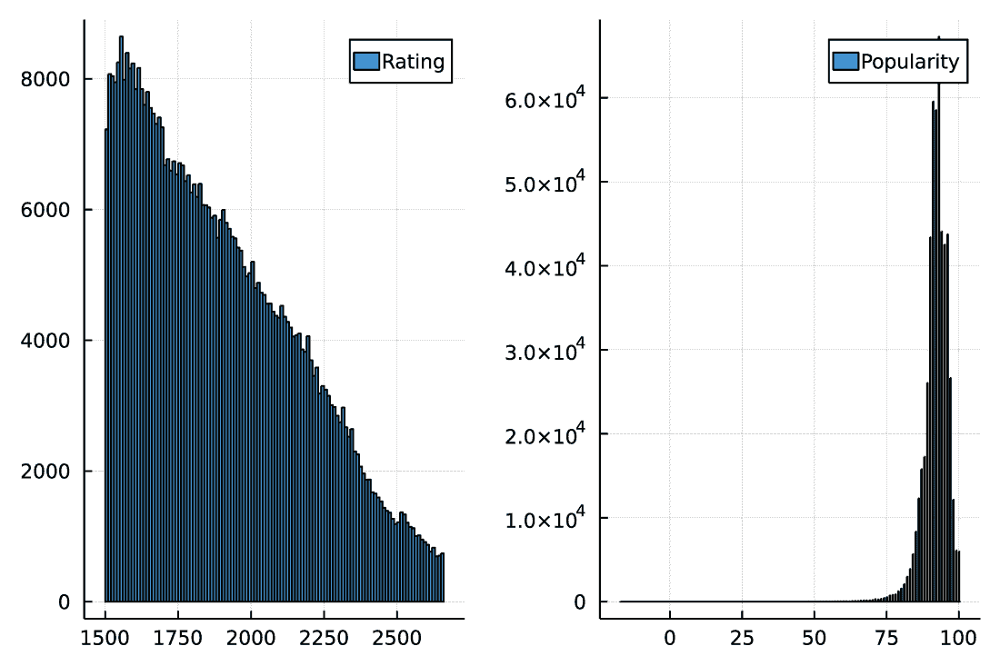
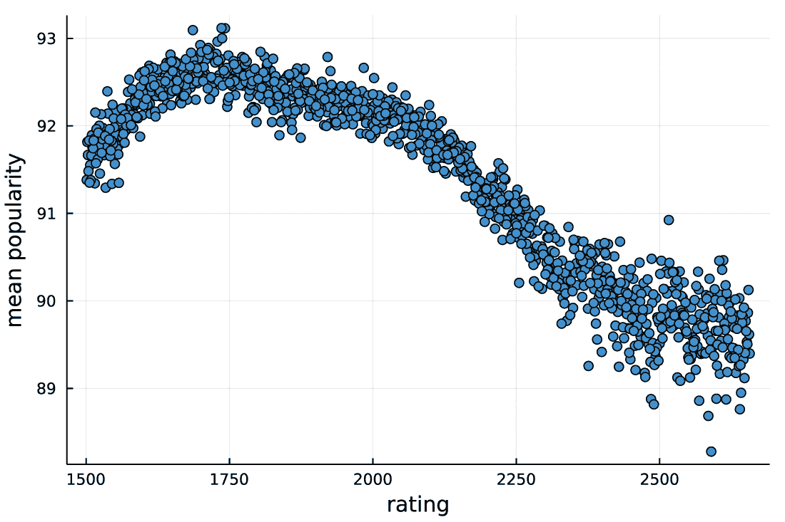

# 9 从数据框获取数据

本章涵盖了

+   子集数据框的行

+   选择数据框的列

+   创建局部线性回归（LOESS）模型

+   可视化 LOESS 预测

在第八章中，您学习了使用 DataFrames.jl 包在 Julia 中处理数据框的基本原则，并且我们开始分析 Lichess 棋盘数据。回想一下，我们的目标是确定谜题难度与受欢迎程度之间的关系。

在第 8.3 节中，我们通过得出结论，我们希望在最终分析（如图 9.1 所示，我重现了第八章中使用的直方图）之前清理原始数据来停止我们的调查，即原始数据具有显著偏斜。数据清理的最简单形式是删除不需要的观测值。因此，在本章中，您将学习如何通过子集数据框的行和选择列来获取数据。

本章的目标是检查谜题难度与用户喜爱程度之间的关系。为了进行这项分析，我们将采取以下步骤：

1.  将数据集子集化，仅关注我们想要稍后分析的列和行。

1.  在数据框中聚合关于谜题难度与受欢迎程度之间关系的数据并绘制它。

1.  建立局部线性回归（LOESS）模型以获取关于数据中存在的关系的更好总结信息。

通过这次分析，您将在学习本章后获得的关键技能是学习各种进入数据框的方法。

数据框索引——选择其部分列或子集行——是实践中最常需要的操作之一。因此，学习如何在数据框中进行索引是您使用 DataFrames.jl 进行数据框之旅的一个良好起点。

为了实现这一目标，同时向您展示如何分析 Lichess 谜题，我按照以下结构组织了本章：

+   在第 9.1 节中，我深入讨论了通过子集数据框的行和/或选择列来索引数据框的多种方法。

+   为了加强您的学习，在第 9.2 节中，我不介绍任何新概念，而是展示如何在第八章和第 9.1 节中介绍的知识在更复杂的场景中结合起来。在本节的最后一步，我们将构建一个 LOESS 模型来理解 Lichess 数据库中谜题难度与受欢迎程度之间的关系。

## 9.1 高级数据框索引

在本节中，您将学习如何在数据框中执行列选择和行子集。这是处理数据框时最常见的操作之一。

图 8.2，在此处作为方便您查看的图 9.1 重现，显示我们正在处理的数据具有显著偏斜。

在继续分析评分和受欢迎程度列之间的关系之前，让我们将以下条件应用到我们的数据框中，以创建一个我们将用于后续分析的新的数据框：

+   我们只想保留 Rating 和 Popularity 列，因为这些是我们分析所需的唯一列。

+   我们希望删除代表我们不希望包含在分析中的谜题的行。

现在我们来讨论谜题必须满足的条件才能被包含在我们的分析中。


图 9.1 从 puzzles 数据框的 Rating、RatingDeviation、Popularity 和 NbPlays 列的直方图中可以看出，所有分析变量都是偏斜的。

首先，我们希望保留被玩得足够的谜题。因此，我们关注那些 NbPlays 列中的播放次数大于该列中位数的谜题。这个条件将消除 50%的谜题。这样，我们去除那些玩得很少的谜题，因为它们可能没有稳定的评分或流行度值。

其次，我们希望删除难度评分低或非常高的谜题。这会去除简单的谜题，这些谜题很可能是经验不足的玩家评估的，以及对于典型玩家来说可能没有足够经验来公正评估的非常难的谜题。我们将考虑评分低于 1500 的谜题为过于简单，不适合包含。我选择 1500 作为阈值，因为这是任何谜题的起始评分。在列表 8.2 中，你可以看到评分的中位数和平均值大约是 1500。为了表示一个非常高的评分，我们使用第 99 百分位数（我们将删除最难的 1%的谜题）。

本节组织如下。在 9.1.1 节中，我将向你展示如何执行我们想要分析 Lichess 谜题数据的确切操作。这样，你将了解这些操作是如何工作的。接下来，在 9.1.2 小节中，我将提供一个允许的列选择器的完整列表，而在 9.1.3 小节中，我们将讨论允许的行子集选项的完整列表。

注意：在处理本章的代码之前，请按照第 8.1 节的说明操作，以确保你的工作目录中存在 puzzles.csv 文件。

在我们开始之前，我们需要加载库并从我们在第八章中创建的 puzzles.csv 文件创建 puzzles 数据框对象：

```
julia> using DataFrames

julia> using CSV

julia> using Plots

julia> puzzles = CSV.read("puzzles.csv", DataFrame);
```

### 9.1.1 获取简化的 puzzles 数据框

在本节中，你将学习如何选择数据框的列和子集其行。为了获取我们的处理后的数据框，我们需要定义一个合适的列选择器和行选择器。

我们从列选择器开始，因为在这种情况下，它是简单的。我们可以传递一个列名向量，例如：["Rating", "Popularity"]。或者，我们也可以传递列名作为符号，[:Rating, :Popularity]，或者，例如，作为整数[4, 6]。（记住，你可以通过使用 columnindex 函数轻松检查列号。）在 9.1.2 节中，你将了解 DataFrames.jl 提供的更多列选择器选项。

为了定义适当的行子集操作，我们将使用 *指示向量*。这个向量必须与我们数据框中的行数一样多，并且必须包含布尔值。指示向量中对应于真值的行将被保留，而假值将被删除。

首先，我们使用 Statistics 模块中的 median 函数创建一个表示播放次数少于中值的行的指示向量：

```
julia> using Statistics

julia> plays_lo = median(puzzles.NbPlays)
246.0

julia> puzzles.NbPlays .> plays_lo
2132989-element BitVector:
 1
 1
 1
   ⋮
 1
 1
 0
```

注意，当我们用 .> 比较 NbPlays 列与计算出的中值的标量值时，我们使用了广播。如果我们省略点（.），我们会得到一个错误：

```
julia> puzzles.NbPlays > plays_lo
ERROR: MethodError: no method matching isless(::Float64, ::Vector{Int64})
```

以类似的方式，让我们创建一个表示评分在 1500 到第 99 个百分位数之间的谜题的指示向量。对于第二种条件，我们使用 Statistics 模块中的 quantile 函数：

```
julia> rating_lo = 1500
1500

julia> rating_hi = quantile(puzzles.Rating, 0.99)
2658.0

julia> rating_lo .< puzzles.Rating .< rating_hi
2132989-element BitVector:
 1
 1
 0
   ⋮
 0
 1
 1
```

我们再次使用了广播来得到期望的结果。最后，让我们使用广播的 && 操作符结合这两个条件：

```
julia> row_selector = (puzzles.NbPlays .> plays_lo) .&&
                      (rating_lo .< puzzles.Rating .< rating_hi)
2132989-element BitVector:
 1
 1
 0
   ⋮
 0
 1
 0
```

在这个表达式中，我可以省略括号，但我的个人偏好是始终在工作于复杂条件时明确显示操作应该如何分组。

让我们检查我们选择了多少行。我们可以使用 sum 或 count 函数：

```
julia> sum(row_selector)
513357

julia> count(row_selector)
513357
```

sum 函数和 count 函数之间的区别在于，count 要求传递给它的数据是布尔值，并计算真值的数量，而 sum 可以处理任何对加法有意义的定义的数据。由于在 Julia 中，布尔值被视为数字，正如你在第二章中学到的，你可以将它们相加。在这种加法中，true 被认为是 1，false 被认为是 0。

现在我们已经准备好在下一个列表中创建我们所需的数据框了。我们将它称为 good。

列表 9.1 通过索引选择数据框的行和列

```
julia> good = puzzles[row_selector, ["Rating", "Popularity"]]
513357×2 DataFrame
    Row │ Rating  Popularity 
        │ Int64   Int64      
────────┼────────────────────
      1 │   1765          93
      2 │   1525          97
      3 │   1560          88
   :    │   :         :
 513356 │   2069          92
 513357 │   1783          90
          513352 rows omitted
```

我们可以看到，good 数据框有 513,357 行和两列，正如预期的那样。让我们创建所选列的直方图（图 9.2），看看它们现在是否有更好的分布：

```
julia> plot(histogram(good.Rating; label="Rating"),
            histogram(good.Popularity; label="Popularity"))
```



图 9.2 在 good 数据框的列 Rating 和 Popularity 的这些直方图中，两个变量的分布都符合预期，我们将在进一步的分析中使用这些数据。

评分分布现在大致呈下降趋势；我们比简单谜题有更少的困难谜题。对于流行度的分布，我们没有在 -100 和 100 处出现峰值，如图 8.2 所示，这很可能是由于玩得很少的谜题造成的。请将此假设作为练习进行检查。

练习 9.1 在两种条件下计算 NbPlays 列的摘要统计量。在第一种情况下，仅选择流行度为 100 的谜题，在第二种情况下，选择流行度为 -100 的谜题。要计算向量的摘要统计量，请使用 StatsBase.jl 包中的 summarystats 函数。

### 9.1.2 允许的列选择器概述

在实践中，你可能希望使用不同的条件来选择数据框的列——例如，保留所有你不想保留的列，或者保留所有名称与特定模式匹配的列。在本节中，你将了解到 DataFrames.jl 提供了一套丰富的列选择器，允许你轻松完成此类任务。

你在第 8.3 节中学到，传递一个字符串、一个 Symbol 或一个整数作为列选择器可以从数据框中提取一个列。这三个列选择器被称为*单列选择器*。获得的结果类型取决于所使用的行选择器。如果你使用单个整数，你会得到数据框单元格中存储的值：

```
julia> puzzles[1, "Rating"]
1765
```

如果行选择器选择了多行，你会得到一个向量。让我们重复一下你在第 8.3 节中已经看到过的例子：

```
julia> puzzles[:, "Rating"]
2132989-element Vector{Int64}:
 1765
 1525
 1102
    ⋮
  980
 1783
 2481
```

我们将要讨论的所有其他选择器都选择多列。获得的结果类型再次取决于所使用的行子集值。如果你选择单行，你会得到一个名为 DataFrameRow 的对象：

```
julia> row1 = puzzles[1, ["Rating", "Popularity"]]
DataFrameRow
Row  │ Rating  Popularity 
     │ Int64   Int64
─────┼────────────────────
   1 │   1765          93
```

你可以将 DataFrameRow 视为一个包含所选单元格的 NamedTuple。唯一的区别是 DataFrameRow 保留了一个指向它所来自的数据框的链接。技术上，它是一个视图。因此，当数据框更新时，它会在 DataFrameRow 中反映出来。相反，如果你更新 DataFrameRow，底层数据框也会更新（我们将在第十二章详细讨论数据框的突变）。

一些用户可能会惊讶，在这种情况下使用常规索引会创建一个视图。然而，经过一番激烈的辩论后，这个设计选择被做出，以确保获取数据框的行是一个快速操作，因为通常你会在循环中挑选数据框的许多连续行，并且只从它们中读取数据。

目前为止，正如我所说的，你可以将 DataFrameRow 视为一个一维对象。因此，你可以像从数据框中获取数据一样从它那里获取数据，但如果你使用索引，只需使用单个索引。以下是从 row1 对象获取评分值的方法：

```
julia> row1["Rating"]
1765

julia> row1[:Rating]
1765

julia> row1[1]
1765

julia> row1.Rating
1765

julia> row1."Rating"
1765
```

另一方面，如果你选择多行和多列，你会得到一个 DataFrame。你已经在列表 9.1 中看到了这种选择类型：

```
julia> good = puzzles[row_selector, ["Rating", "Popularity"]]
513357×2 DataFrame
    Row │ Rating  Popularity 
        │ Int64   Int64      
────────┼────────────────────
      1 │   1765          93
      2 │   1525          97
      3 │   1560          88
   :    │   :         :
 513356 │   2069          92
 513357 │   1783          90
          513352 rows omitted
```

表 9.1 总结了数据框索引的可能输出类型。

表 9.1 数据框索引的输出类型，取决于行子集值和列选择器

|  | 单列选择器 | 多列选择器 |
| --- | --- | --- |
| 单行子集 | good[1, "Rating"]单元格中存储的值 | good[1, :]DataFrameRow |
| 多行子集 | good[:, "Rating"]向量 | good[:, :]DataFrame |

现在你已经知道了在给定不同的列选择器时可以期望的输出类型，我们就可以深入探讨可用的多列选择器了。我们有很多这样的选择器，因为存在许多选择列的规则。我将逐一列举它们，并附上例子，参考我们的 puzzles 数据框。

我首先会向你展示可用的选项列表，这样你就可以简要地参考它们。接下来，我将解释如何使用 names 函数检查每个选项所选择的列，我们从列表开始：

+   *一个字符串、符号或整数值的向量*——你已经在第 8.3 节中看到了这种风格：["Rating", "Popularity"], [:Rating, :Popularity], [4, 6]。

+   *一个长度等于数据框列数的布尔值向量*——在这里，要选择 Rating 和 Popularity 列，一个合适的向量如下（注意它长度为 9，并在第 4 位和第 6 位有 true 值）：

```
julia> [false, false, false, true, false, true, false, false, false]
9-element Vector{Bool}:
 0
 0
 0
 1
 0
 1
 0
 0
 0
```

+   *正则表达式*——这会选择与传递的表达式匹配的列（我们在第六章讨论了正则表达式）。例如，传递一个 r"Rating" 正则表达式将选择 Rating 和 RatingDeviation 列。

+   *一个* Not *表达式*——这会否定传递的选择器。例如，Not([4, 6]) 将选择除了第 4 列和第 6 列之外的所有列；同样，Not(r"Rating") 将选择除了匹配 r"Rating" 正则表达式的 Rating 和 RatingDeviation 列之外的所有列。

+   Between 表达式——一个例子是 Between("Rating", "Popularity")，它从 Rating 开始并结束于 Popularity 的连续列，因此在我们的情况下，它将是 Rating、RatingDeviation 和 Popularity。

+   冒号（:）或 All() 选择器——这会选择所有列。

+   Cols 选择器——这有两种形式。在第一种形式中，你可以将多个选择器作为参数传递并选择它们的并集；例如，Cols(r"Rating", "NbPlays") 将选择 Rating、RatingDeviation 和 NbPlays 列。在第二种形式中，你将函数作为参数传递给 Cols；然后这个函数应该接受一个字符串，它是列的名称，并返回一个布尔值。结果，你将得到一个列表，其中包含传递的函数返回 true 的列。例如，如果你使用 Cols(startswith ("P")) 选择器，你会得到 PuzzleId 和 Popularity 列，因为这些是唯一以 P 开头的 puzzles 数据框中的列名。

这非常累人。幸运的是，正如我暗示的，有一个简单的方法来测试所有这些例子。

你还记得在第 8.2 节中讨论的 names 函数吗？它返回数据框中存储的列名。通常你需要从数据框中选择列名而不执行数据框索引。names 函数的好处是它可以接受任何列选择器作为其第二个参数，并将返回所选列的名称。让我们尝试使用 names 函数与前面列表中的所有示例：

```
julia> names(puzzles, ["Rating", "Popularity"])
2-element Vector{String}:
 "Rating"
 "Popularity"

julia> names(puzzles, [:Rating, :Popularity])
2-element Vector{String}:
 "Rating"
 "Popularity"

julia> names(puzzles, [4, 6])
2-element Vector{String}:
 "Rating"
 "Popularity"

julia> names(puzzles,
             [false, false, false, true, false, true, false, false, false])
2-element Vector{String}:
 "Rating"
 "Popularity"

julia> names(puzzles, r"Rating")
2-element Vector{String}:
 "Rating"
 "RatingDeviation"

julia> names(puzzles, Not([4, 6]))
7-element Vector{String}:
 "PuzzleId"
 "FEN"
 "Moves"
 "RatingDeviation"
 "NbPlays"
 "Themes"
 "GameUrl"

julia> names(puzzles, Not(r"Rating"))
7-element Vector{String}:
 "PuzzleId"
 "FEN"
 "Moves"
 "Popularity"
 "NbPlays"
 "Themes"
 "GameUrl"

julia> names(puzzles, Between("Rating", "Popularity"))
3-element Vector{String}:
 "Rating"
 "RatingDeviation"
 "Popularity"

julia> names(puzzles, :)
9-element Vector{String}:
 "PuzzleId"
 "FEN"
 "Moves"
 "Rating"
 "RatingDeviation"
 "Popularity"
 "NbPlays"
 "Themes"
 "GameUrl"

julia> names(puzzles, All())
9-element Vector{String}:
 "PuzzleId"
 "FEN"
 "Moves"
 "Rating"
 "RatingDeviation"
 "Popularity"
 "NbPlays"
 "Themes"
 "GameUrl"

julia> names(puzzles, Cols(r"Rating", "NbPlays"))
3-element Vector{String}:
 "Rating"
 "RatingDeviation"
 "NbPlays"

julia> names(puzzles, Cols(startswith("P")))
2-element Vector{String}:
 "PuzzleId"
 "Popularity"
```

这并不是 names 函数所拥有的全部功能。

首先，你不必写 names(puzzles, Cols(startswith("P")))，你可以省略 Cols 包装器。调用 names(puzzles, startswith("P"))，其中你传递一个接受字符串并返回布尔值的函数，将产生相同的结果。

最后一个特性是，你可以将类型作为 names 函数的第二个参数传递。你将得到元素类型是传递类型子类型的列。例如，要获取存储在 puzzles 数据框中所有实数列，你可以编写以下内容：

```
julia> names(puzzles, Real)
4-element Vector{String}:
 "Rating"
 "RatingDeviation"
 "Popularity"
 "NbPlays"
```

要获取所有包含字符串的列，请编写以下内容：

```
julia> names(puzzles, AbstractString)
5-element Vector{String}:
 "PuzzleId"
 "FEN"
 "Moves"
 "Themes"
 "GameUrl"
```

注意，names 中最后两种接受的形式（传递函数和传递类型）在索引中不被接受。因此，要从 puzzles 数据框中选择所有存储实数的列，请编写 puzzles[:, names(puzzles, Real)]。

现在，你可以在指尖上拥有灵活选择数据框列的所有功能。我们可以继续到行选择器，它们稍微简单一些。

### 9.1.3 允许的行子集值概述

在本节中，你将学习执行数据框行子集的选项。在第 9.1.2 小节中，我们讨论了传递单个整数作为行子集值。如果你使用单列选择器，你将得到单个单元格的值；如果你使用多列选择器，你将得到 DataFrameRow。

当你选择多行时，你会得到一个向量（当选择单个列时）或数据框（当选择多个列时）。哪些多行选择器是被允许的？以下是一个完整的列表：

+   *整数向量*—例如，[1, 2, 3]将选择与传入的数字对应的行。

+   *布尔值向量*—其长度必须等于数据框中的行数，在结果中，你将得到向量包含 true 的行。你在第 8.3 节中看到了这个选择器；例如，在列表 9.1 中的表达式 puzzles[row_selector, ["Rating", "Popularity"]]中，row_selector 是一个布尔向量。

+   *非* 表达式—这与列的工作方式相同。编写 Not([1, 2, 3])将选择除了第 1 行、第 2 行和第 3 行之外的所有行。

+   *冒号* (:)—这会选择数据框中的所有行并进行复制。

+   *感叹号* (!)—这会从数据框中选择所有行而不进行复制（记住第 8.2 节中的警告，你应该小心使用此选项，因为它可能导致难以发现的错误）。

首先，让我们比较整数、布尔和 Not 选择器在一个小数据框上的效果。在示例中，我们首先创建名为:id 的单列 df_small 数据框，其值在 1 到 4 的范围内（我们将在第十章中详细讨论创建数据框的这种方法和其他方法）。接下来，我们使用各种行选择器对这个数据框进行子集化：

```
julia> df_small = DataFrame(id=1:4)
4×1 DataFrame
 Row │ id    
     │ Int64 
─────┼───────
   1 │     1
   2 │     2
   3 │     3
   4 │     4

julia> df_small[[1, 3], :]
2×1 DataFrame
 Row │ id    
     │ Int64 
─────┼───────
   1 │     1
   2 │     3

julia> df_small[[true, false, true, false], :]
2×1 DataFrame
 Row │ id    
     │ Int64 
─────┼───────
   1 │     1
   2 │     3

julia> df_small[Not([2, 4]), :]
2×1 DataFrame
 Row │ id    
     │ Int64 
─────┼───────
   1 │     1
   2 │     3

julia> df_small[Not([false, true, false, true]), :]
2×1 DataFrame
 Row │ id    
     │ Int64 
─────┼───────
   1 │     1
   2 │     3
```

在示例中，所有索引操作都保留了 df_small 数据框的第 1 行和第 3 行。

接下来，让我们看看比较:和!行选择器的示例。让我们比较以下选择操作：

```
julia> df1 = puzzles[:, ["Rating", "Popularity"]];

julia> df2 = puzzles[!, ["Rating", "Popularity"]];
```

df1 和 df2 都从 puzzles 数据框中选择所有行和两列。我们可以检查它们是否存储相同的数据：

```
julia> df1 == df2
true
```

虽然 df1 和 df2 具有相同的内容，但它们并不相同。区别在于 df1 复制了 Rating 和 Popularity 列，而 df2 则重用了来自 puzzles 数据框的 Rating 和 Popularity 列。我们可以通过使用===比较来轻松检查它：

```
julia> df1.Rating === puzzles.Rating
false

julia> df1.Popularity === puzzles.Popularity
false

julia> df2.Rating === puzzles.Rating
true

julia> df2.Popularity === puzzles.Popularity
true
```

因此，稍后修改 df2 数据框可能会影响存储在 puzzles 数据框中的数据，这是不安全的。再次强调，使用!而不是:的好处是速度和内存消耗，如下面的基准测试所示：

```
julia> using BenchmarkTools

julia> @btime $puzzles[:, ["Rating", "Popularity"]];
  4.370 ms (27 allocations: 32.55 MiB)

julia> @btime $puzzles[!, ["Rating", "Popularity"]];
  864.583 ns (21 allocations: 1.70 KiB)
```

作为总结，我将再次总结可用的选项。请记住，传递一个整数，如 1，可以选择单个行或列，而传递一个包含它的向量，如[1]，可以选择多个行或列（在这种情况下恰好是 1）。因此，我们有四种索引到数据框的方法，它们在获得的结果上有所不同：

+   对于行和列索引都传递单元素选择器，返回数据框的单个单元格内容：

+   ```
    julia> puzzles[1, 1]
    "00008"
    ```

+   传递一个多行子集值和一个单列选择器返回一个向量：

+   ```
    julia> puzzles[[1], 1]
    1-element Vector{String7}:
     "00008"
    ```

+   传递一个单行子集值和多列选择器返回一个 DataFrameRow：

+   ```
    julia> puzzles[1, [1]]
    DataFrameRow
     Row │ PuzzleId
         │ String7
    ─────┼──────────
       1 │ 00008
    ```

+   传递一个多行子集值和多列选择器返回一个 DataFrame：

+   ```
    julia> puzzles[[1], [1]]
    1×1 DataFrame
     Row │ PuzzleId
         │ String7
    ─────┼──────────
       1 │ 00008
    ```

数据框行名

你可能已经注意到 DataFrames.jl 不支持为你的 DataFrame 对象提供行名。引用数据框的行的唯一方式是通过其编号。

然而，很容易向你的数据框中添加一个存储行名的列。行名常在其他生态系统中用于提供一种快速行查找的方式。在第 11、12 和 13 章中，你将了解到 DataFrames.jl 通过使用基于 groupby 函数的替代方法来提供这种功能。

### 9.1.4 创建数据框对象的视图

在第四章中，你了解到可以使用@view 宏创建避免复制数据的数组视图。在 DataFrames.jl 中也支持相同的机制。如果你将任何索引表达式传递给@view 宏，你将得到一个视图。

创建视图的好处是，通常它比第 9.1.3 节中讨论的标准索引更快，使用的内存更少。然而，这种好处是有代价的。视图与父对象共享数据，这可能导致代码中难以捕捉的 bug，尤其是如果你修改了视图引用的数据。

你有四种方法来创建数据框的视图，这取决于行和列选择器是否选择一个或多个行，如第 9.1.3 小节所述：

+   对于行和列索引都传递单元素选择器，返回数据框单个单元格内容的视图（技术上，如你所见，它被认为是一个零维对象；如果你想了解更多关于这些的信息，请参阅 Julia 手册的“常见问题解答”部分，网址为[`mng.bz/9VKq`](http://mng.bz/9VKq)）：

+   ```
    julia> @view puzzles[1, 1]
    0-dimensional view(::Vector{String7}, 1) with eltype String7:
    "00008"
    ```

+   传递一个多行选择器和单列选择器返回一个向量的视图：

+   ```
    julia> @view puzzles[[1], 1]
    1-element view(::Vector{String7}, [1]) with eltype String7:
     "00008"
    ```

+   通过单行选择器和多列选择器返回一个 DataFrameRow（因此与 puzzles[1, [1]]的正常索引没有区别，因为正常索引已经产生了一个视图；参见 9.1.2 小节中的讨论）：

+   ```
    puzzles[1, [1]]
    DataFrameRow
     Row │ PuzzleId
         │ String7
    ─────┼──────────
       1 │ 00008
    ```

+   通过多行和多列选择器返回一个子数据框：

+   ```
    julia> @view puzzles[[1], [1]]
    1×1 SubDataFrame
     Row │ PuzzleId
         │ String7
    ─────┼──────────
       1 │ 00008
    ```

在这些选项中，最常用的是创建一个子数据框。当你想要节省内存和时间时，你会使用数据框的视图，并且接受你的结果对象将与其父对象共享内存。

例如，让我们比较一下我们在 9.1 小节中列出的操作 puzzles[row_selector, ["Rating", "Popularity"]]的性能与创建视图的相同操作：

```
julia> @btime $puzzles[$row_selector, ["Rating", "Popularity"]];
  4.606 ms (22 allocations: 11.75 MiB)

julia> @btime @view $puzzles[$row_selector, ["Rating", "Popularity"]];
  1.109 ms (12 allocations: 3.92 MiB)
```

创建视图更快且占用更少的内存。我们在创建数据框视图时看到的最大分配是为存储所选行和列的信息。你可以使用 parentindices 函数检索由子数据框选择的源数据框的索引：

```
julia> parentindices(@view puzzles[row_selector, ["Rating", "Popularity"]])
([1, 2, 5, 8  ...  2132982, 2132983, 2132984, 2132988], [4, 6])
```

什么是数据框？

你现在知道 DataFrames.jl 定义了 DataFrame 和子数据框类型。这两个类型有一个共同的超类型：AbstractDataFrame。AbstractDataFrame 在 DataFrames.jl 中表示数据框的一般概念，与其在内存中的底层表示无关。

DataFrames.jl 中的大多数函数都适用于 AbstractDataFrame 对象，因此在这些情况下它们接受 DataFrame 和子数据框类型。在这本书中，我写的是我们使用数据框。例如，我们在这章中使用的索引对所有数据框都按相同的方式工作。

然而，在某些情况下，我们与具体类型一起工作是很重要的。例如，DataFrame 构造函数始终返回一个 DataFrame。此外，在第十一章中，我们将讨论通过使用 push!函数就地添加行到 DataFrame。由于子数据框对象是视图，因此不支持此操作。

## 9.2 分析谜题难度与流行度之间的关系

如章节介绍中所承诺的，在本节中，我们将使用你在更复杂的环境中获得的技能来理解谜题难度与流行度之间的关系。我们将分两步进行。在 9.2.1 节中，我们将根据评分计算谜题的平均流行度。接下来，在 9.2.2 节中，我们将对数据进行 LOESS 回归拟合。

### 9.2.1 通过评分计算谜题的平均流行度

在本节中，你将学习如何使用 Base Julia 的功能在数据框中聚合数据。聚合是数据分析中最常见的操作之一。

我们将使用在第 9.1 节中创建的好数据框。本节中使用的这种方法旨在向您展示如何使用数据框的索引。然而，这并不是执行分析的最有效方法。在本章末尾，我将向您展示完成所需操作更快但需要学习与 groupby 函数相关的 DataFrames.jl 包的高级功能的代码（这些将在第 11、12 和 13 章中讨论）。首先，让我们回顾一下好数据框的内容：

```
julia> describe(good)
2×7 DataFrame
 Row │ variable    mean       min    median   max    nmissing  eltype
     │ Symbol      Float64    Int64  Float64  Int64  Int64     DataType
─────┼──────────────────────────────────────────────────────────────────
   1 │ Rating      1900.03     1501   1854.0   2657         0  Int64
   2 │ Popularity    91.9069    -17     92.0    100         0  Int64
```

对于评级列中的每个唯一值，我们希望计算流行度列的平均值。我们将分两步进行这项任务：

1.  创建一个字典，将给定的评级值映射到数据框中可以找到的行向量。

1.  使用这个字典来计算每个唯一评级值的平均流行度。

我们从第一个任务开始，创建一个字典并将评级映射到可以找到它的数据框行：

```
julia> rating_mapping = Dict{Int, Vector{Int}}()     ❶
Dict{Int64, Vector{Int64}}()

julia> for (i, rating) in enumerate(good.Rating)     ❷
           if haskey(rating_mapping, rating)         ❸
               push!(rating_mapping[rating], i)      ❹
           else
               rating_mapping[rating] = [i]          ❺
           end
       end

julia> rating_mapping
Dict{Int64, Vector{Int64}} with 1157 entries:
  2108 => [225, 6037, 6254, 7024, 8113, 8679, 8887, 131...
  2261 => [361, 2462, 5276, 6006, 6409, 6420, 9089, 101...
  1953 => [655, 984, 1290, 1699, 2525, 2553, 3195, 3883...
  2288 => [864, 1023, 2019, 3475, 4164, 9424, 9972, 123...
  1703 => [68, 464, 472, 826, 1097, 1393, 2042, 2110, 4...
  ⋮    => ⋮
```

❶ 创建一个空字典，用于存储映射

❷ 遍历 good.Rating 向量的所有元素，并跟踪迭代元素的索引和值

❸ 检查我们是否已经遇到了给定的评级值

❹ 如果我们看到了给定的评级值，则将其索引追加到字典中的现有条目

❺ 如果我们还没有看到给定的评级值，则在字典中创建一个新的条目

让我们回顾一下这段代码的关键部分。在 for 循环中使用的 enumerate(good.Rating)表达式产生(i, rating)元组，其中 i 是一个从 1 开始的计数器，rating 是从 good.Rating 向量中取出的第 i 个值。使用 enumerate 在您需要不仅迭代 rating 的值，还需要迭代次数时很有用。

接下来，我们检查我们得到的评级是否之前已经出现过。如果我们已经在 rating_mapping 字典中有了它，我们就检索映射到这个评级值的索引向量，并使用 push!函数将行号 i 添加到这个向量的末尾。另一方面，如果我们还没有看到给定的评级，我们就在字典中创建一个新的条目，将评级映射到一个只包含单个整数 i 的向量。

让我们尝试获取评级等于 2108 的 rating_mapping 字典中存储的行的数据框：

```
julia> good[rating_mapping[2108], :]
457×2 DataFrame
 Row │ Rating  Popularity 
     │ Int64   Int64
─────┼────────────────────
   1 │   2108          95
   2 │   2108          90
   3 │   2108          90
  :  │   :         :
 456 │   2108          91
 457 │   2108          92
          452 rows omitted
```

看起来我们只得到了具有 2108 评级的行。我们可以通过使用 unique 函数来确保这一点：

```
julia> unique(good[rating_mapping[2108], :].Rating)
1-element Vector{Int64}:
 2108
```

事实上，在我们的选择中，只有 2108 这个值在评级列中。

练习 9.2 确保存储在 rating_mapping 字典中的值加起来代表我们好数据框的所有行索引。为此，检查这些向量的长度之和是否等于好数据框中的行数。

对于 2108 评级计算我们的流行度列的平均评级现在变得容易：

```
julia> using Statistics

julia> mean(good[rating_mapping[2108], "Popularity"])
91.64989059080963
```

现在我们已经准备好了所有必要的组件来创建一个图表，展示评分与谜题流行度之间的关系。首先，使用 unique 函数再次创建一个唯一评分值的向量：

```
julia> ratings = unique(good.Rating)
1157-element Vector{Int64}:
 1765
 1525
 1560
    ⋮
 2616
 2619
 2631
```

接下来，我们计算每个唯一评分值的平均流行度：

```
julia> mean_popularities = map(ratings) do rating
           indices = rating_mapping[rating]
           popularities = good[indices, "Popularity"]
           return mean(popularities)
       end
1157-element Vector{Float64}:
 92.6219512195122
 91.7780580075662
 91.79565772669221
  ⋮
 88.87323943661971
 89.56140350877193
 89.34782608695652
```

如果你想要刷新你对 map 函数如何在 do-end 块中工作的理解，请参阅第二章。为了得到期望的结果，我们本可以使用列表推导式而不是 map 函数。表达式如下：

```
[mean(good[rating_mapping[rating], "Popularity"]) for rating in ratings]
```

然而，我更喜欢使用 map 函数的解决方案，因为在我看来，代码更容易理解。

最后，我们可以执行所需的图表：

```
julia> using Plots

julia> scatter(ratings, mean_popularities;
               xlabel="rating", ylabel="mean popularity", legend=false)
```

图 9.3 显示了结果。



图 9.3 展示了评分与流行度之间的关系，表明结果存在一些噪声。让我们创建一个图表，展示评分与平均流行度之间的平滑关系。为此，我们将使用一个流行的局部回归模型，称为 LOESS。

### 9.2.2 拟合 LOESS 回归

在本节中，你将学习如何将 LOESS 回归拟合到你的数据中，并使用拟合的模型进行预测。

图 9.3 中呈现的关系表明结果存在一些噪声。让我们创建一个图表，展示评分与平均流行度之间的平滑关系。为此，我们将使用一个流行的局部回归模型，称为 LOESS。

LOESS 回归

局部估计散点图平滑（LOESS）模型最初是为散点图平滑开发的。你可以在 William S. Cleveland 和 E. Grosse 的《局部回归的计算方法》（[`doi.org/10.1007/BF01890836`](https://doi.org/10.1007/BF01890836)）中找到更多关于此方法的信息。

在 Julia 中，Loess.jl 包允许你构建 LOESS 回归模型。

我们将创建一个 LOESS 模型，使用它进行预测，并在我们的图表中添加一条线。首先准备预测：

```
julia> using Loess

julia> model = loess(ratings, mean_popularities);

julia> ratings_predict = float(sort(ratings))
1157-element Vector{Float64}:
 1501.0
 1502.0
 1503.0
    ⋮
 2655.0
 2656.0
 2657.0

julia> popularity_predict = predict(model, ratings_predict)
1157-element Vector{Float64}:
 91.78127959282982
 91.78699303591367
 91.7926814281816
  ⋮
 89.58061736598427
 89.58011426583589
 89.57962657070658
```

注意，为了进行预测，我们首先使用 sort 函数对评分进行排序。这样做是为了使最终的图表看起来更美观，因为我们希望点在 x 轴上按顺序排列。（作为对排序数据的替代，你可以在 plot 函数中传递 serisetype=:line 关键字参数。）此外，我们对生成的向量使用 float 函数。原因是 predict 函数只接受浮点数向量，而我们的原始评分向量包含整数，不是浮点数。

你可以通过运行 methods 函数并将 predict 作为其参数来检查 predict 函数接受哪些参数：

```
julia> methods(predict)
# 3 methods for generic function "predict":
[1] predict(model::Loess.LoessModel{T}, z::T)
    where T<:AbstractFloat in Loess at ...
[2] predict(model::Loess.LoessModel{T}, zs::AbstractVector{T})
    where T<:AbstractFloat in Loess at ...
[3] predict(model::Loess.LoessModel{T}, zs::AbstractMatrix{T})
    where T<:AbstractFloat in Loess at ...
```

如你所见，predict 函数有三个方法。每个方法都接受一个训练好的模型作为第一个参数，第二个参数可以是标量、向量或矩阵。在所有三种方法中，限制是第二个参数的元素必须是 AbstractFloat 的子类型。

现在，我们已经准备好在我们的图表中添加一条平滑线：

```
julia> plot!(ratings_predict, popularity_predict; width=5, color="black")
```

注意，我们使用 plot!来向已经存在的图表中添加额外的线。结果如图 9.4 所示。


图 9.4 将局部回归图添加到谜题评分与其流行度之间的关系中，证实了具有最高平均流行度的谜题评分为约 1750。

从图 9.4 中，我们可以看到最受欢迎的谜题的评分为约 1750，因此如果谜题要么太简单要么太难，其流行度就会较低。

从数据科学的角度来看，当然，这种分析有点简化：

+   我省略了评分都带有不确定性（RatingDeviation 列测量它）的事实。

+   流行度也是基于用户响应样本的一部分。

+   对于不同的评分，我们有不同数量的谜题。

+   我尚未优化 LOESS 模型中的平滑处理（这可以通过在 Loess.loess 函数中使用 span 关键字参数来完成；请参阅 [`github.com/JuliaStats/Loess.jl`](https://github.com/JuliaStats/Loess.jl)）。

更仔细的分析可能会考虑所有这些因素，但我决定省略这种分析，以保持示例简单，并专注于本章中涵盖的索引主题。

练习 9.3 检查在 loess 函数中更改 span 关键字参数值的影响。默认情况下，此参数的值为 0.75。将其设置为 0.25 并向图 9.4 所示的图中添加另一条预测线。使线条为黄色，宽度为 5。

作为本章的最后一个例子，正如之前所承诺的，让我们看看我们如何可以使用 DataFrames.jl 的更高级功能来聚合我们的分析数据，以通过评分获取流行度平均值：

```
julia> combine(groupby(good, :Rating), :Popularity => mean)
1157×2 DataFrame
  Row │ Rating  Popularity_mean 
      │ Int64   Float64
──────┼─────────────────────────
    1 │   1501          91.3822
    2 │   1502          91.8164
    3 │   1503          91.6671
  :   │   :            :
 1156 │   2656          89.6162
 1157 │   2657          89.398
               1152 rows omitted
```

有关此代码的意义及其执行的精确规则，请参阅第 11、12 和 13 章。我决定在这里展示此代码，以便让你清楚地知道，在第 9.2.1 节中使用字典进行的计算并不是在 DataFrames.jl 中进行数据聚合的惯用方式。尽管如此，我还是想在那一节中展示低级方法，因为我相信它很好地解释了如何使用循环、字典和数据框索引编写更复杂的数据处理代码，正如你偶尔需要编写这样的低级代码一样。

## 摘要

+   在数据框中进行索引始终需要传递行选择器和列选择器，其一般形式为 data_frame[row_selector, column_selector]。这种方法确保阅读你代码的人会立即看到预期的输出。

+   DataFrames.jl 定义了一系列可接受的列选择器，可以是整数、字符串、符号、向量、正则表达式或 :, Not, Between, Cols, 或 All 表达式。这种灵活性是必需的，因为用户经常希望使用复杂的模式进行列选择。请注意，1 和 [1] 选择器并不等价。尽管两者都指向第一列，但前者是从数据框中提取它，而后者则创建一个只包含这一列的数据框。

+   要选择数据框的行，您可以使用整数、向量、Not、: 和 ! 表达式。同样，列选择器 1 和 [1] 并不等效。第一个创建一个 DataFrameRow，而第二个创建一个数据框。

+   : 和 ! 都会从数据框中选择所有行。它们之间的区别在于：: 会复制数据框中存储的向量，而 ! 会重用源数据框中存储的向量。使用 ! 更快且内存使用更少，但可能导致难以捕捉的 bug，因此我建议除非用户的代码对性能敏感，否则不要使用它。

+   您可以使用 @view 宏来创建 DataFrame 对象的视图，就像您为数组做的那样。重要的是要记住，视图与父对象共享内存。因此，它们创建速度快且内存使用量少，但在此同时，您在修改其内容时需要小心。特别是，如果您选择数据框的单行和多列，您将得到一个 DataFrameRow 对象，它是数据框单行的视图。

+   == 中缀运算符比较容器（如向量或数据框）的内容。=== 运算符可以用来检查比较的对象是否相同（在可变容器最常见的案例中，这检查它们是否存储在相同的内存位置）。

+   您可以使用字典来帮助您进行数据的聚合。这种方法允许您独立于存储数据的容器类型处理数据。然而，如果您使用 DataFrames.jl，您还可以使用 groupby 函数来达到相同的结果。此功能的详细信息在第 11、12 和 13 章中解释。

+   Loess.jl 包可以用来构建局部回归模型。这些模型在特征和目标变量之间存在非线性关系时使用。
