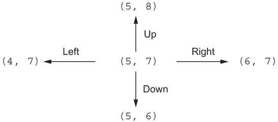
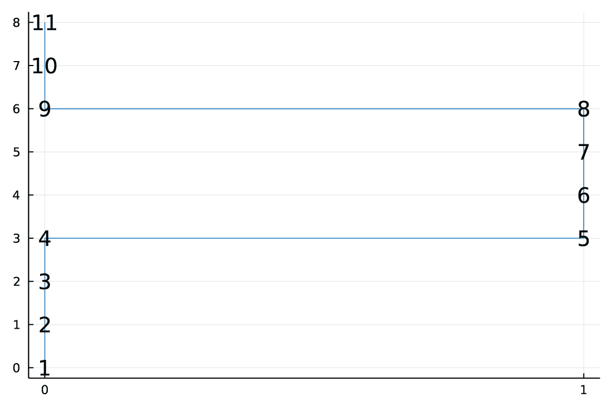

# 10 创建数据框对象

本章涵盖

+   创建数据框

+   使用 RCall.jl 与 R 语言集成

+   理解 Tables.jl 接口

+   绘制相关矩阵图

+   通过向其中添加行来迭代构建数据框

+   序列化 Julia 对象

在第八章中，我向您介绍了如何使用从 CSV 文件加载的样本数据来处理数据框。在本章中，我将向您展示更多将不同类型的数据值转换为 DataFrame 对象以及从 DataFrame 对象转换回来的方法。您需要具备这些基本知识，以便能够高效地使用 DataFrames.jl 包。您必须准备好源数据可能以各种格式出现，并且您需要知道如何将这些数据转换为 DataFrame。

由于创建 DataFrame 对象的话题范围很广，在本章中，我通过几个小型任务作为应用您所学概念的示例。跟随一个复杂的例子（就像我们在第八章和第九章中处理 Lichess 谜题数据那样）将无法展示实践中所有有用的选项。为了确保本章除了教您如何创建数据框之外，还能为您提供有用的数据分析食谱，我们将创建一个存储在数据框中的数据的相关矩阵图。

我将本章分为两个部分，以帮助您轻松导航可用的选项，并专注于您日常工作中最相关的场景：

+   在第 10.1 节中，您将学习从不同类型的数据对象创建数据框的各种方法。如果您已经拥有想要存储在数据框中的数据，您将需要执行此类操作。

+   在第 10.2 节中，您将学习通过向其中添加新行来迭代地创建数据框。如果您想要存储在数据框中的数据是在程序运行时生成的（例如，如果您收集模拟实验的结果），您将使用这种方法来创建数据框对象。

在第 10.1.2 节中，我们将使用 RCall.jl 包，该包提供了 Julia 与 R 之间的集成。在该节中运行示例需要您计算机上有一个正确配置的 R 安装。因此，请确保遵循附录 A 中的环境设置说明。

## 10.1 回顾创建数据框的最重要方法

在本节中，您将学习从与 DataFrame 类型不同的源数据创建数据框的三个最常见方法。这是您需要掌握的基本技能，因为您的源数据可能有各种格式。然而，为了使用 DataFrames.jl 包提供的功能，您首先需要创建一个具有 DataFrame 类型的对象。

在本节中，我通过使用我们在第四章中处理过的 Anscombe 的四重奏数据来展示最常见的场景。在这些场景中，我们通过以下方式创建数据框：

+   矩阵

+   向量集合

+   The Tables.jl interface

此外，你还将学习如何使用 RCall.jl 将 Julia 与 R 语言集成以及如何创建存储在数据框中的数据的相关矩阵的绘图。在我们开始创建数据框对象之前，我们首先需要重新创建第四章中使用的 Anscombe 的四重奏数据：

```
julia> aq = [10.0   8.04  10.0  9.14  10.0   7.46   8.0   6.58
              8.0   6.95   8.0  8.14   8.0   6.77   8.0   5.76
             13.0   7.58  13.0  8.74  13.0  12.74   8.0   7.71
              9.0   8.81   9.0  8.77   9.0   7.11   8.0   8.84
             11.0   8.33  11.0  9.26  11.0   7.81   8.0   8.47
             14.0   9.96  14.0  8.1   14.0   8.84   8.0   7.04
              6.0   7.24   6.0  6.13   6.0   6.08   8.0   5.25
              4.0   4.26   4.0  3.1    4.0   5.39  19.0  12.50
             12.0  10.84  12.0  9.13  12.0   8.15   8.0   5.56
              7.0   4.82   7.0  7.26   7.0   6.42   8.0   7.91
              5.0   5.68   5.0  4.74   5.0   5.73   8.0   6.89];
```

首先，确保加载 DataFrames.jl 包：

```
julia> using DataFrames
```

### 10.1.1 从矩阵创建数据框

在本节中，你将学习如何从矩阵创建数据框，因为矩阵是存储你可能想要分析的数据的常见格式。

Julia 中 Matrix 和 DataFrame 之间的一个区别是 Matrix 不支持列名。因此，当我们向 DataFrame 构造函数传递 Matrix 时，我们需要提供列名。这些名称可以是字符串向量或符号向量。我在下面的列表中展示了这两种选项。

列表 10.1 创建 aq1 数据框

```
julia> aq1 = DataFrame(aq, ["x1", "y1", "x2", "y2", "x3", "y3", "x4", "y4"])❶
11×8 DataFrame
Row │ x1      y1      x2      y2      x3      y3      x4      y4      
    │ Float64 Float64 Float64 Float64 Float64 Float64 Float64 Float64 
────┼─────────────────────────────────────────────────────────────────
  1 │    10.0    8.04    10.0    9.14    10.0    7.46     8.0    6.58
  2 │     8.0    6.95     8.0    8.14     8.0    6.77     8.0    5.76
  3 │    13.0    7.58    13.0    8.74    13.0   12.74     8.0    7.71
  4 │     9.0    8.81     9.0    8.77     9.0    7.11     8.0    8.84
  5 │    11.0    8.33    11.0    9.26    11.0    7.81     8.0    8.47
  6 │    14.0    9.96    14.0    8.1     14.0    8.84     8.0    7.04
  7 │     6.0    7.24     6.0    6.13     6.0    6.08     8.0    5.25
  8 │     4.0    4.26     4.0    3.1      4.0    5.39    19.0   12.5
  9 │    12.0   10.84    12.0    9.13    12.0    8.15     8.0    5.56
 10 │     7.0    4.82     7.0    7.26     7.0    6.42     8.0    7.91
 11 │     5.0    5.68     5.0    4.74     5.0    5.73     8.0    6.89

julia> DataFrame(aq, [:x1, :y1, :x2, :y2, :x3, :y3, :x4, :y4])              ❷
11×8 DataFrame
Row │ x1      y1      x2      y2      x3      y3      x4      y4      
    │ Float64 Float64 Float64 Float64 Float64 Float64 Float64 Float64 
────┼─────────────────────────────────────────────────────────────────
  1 │    10.0    8.04    10.0    9.14    10.0    7.46     8.0    6.58
  2 │     8.0    6.95     8.0    8.14     8.0    6.77     8.0    5.76
  3 │    13.0    7.58    13.0    8.74    13.0   12.74     8.0    7.71
  4 │     9.0    8.81     9.0    8.77     9.0    7.11     8.0    8.84
  5 │    11.0    8.33    11.0    9.26    11.0    7.81     8.0    8.47
  6 │    14.0    9.96    14.0    8.1     14.0    8.84     8.0    7.04
  7 │     6.0    7.24     6.0    6.13     6.0    6.08     8.0    5.25
  8 │     4.0    4.26     4.0    3.1      4.0    5.39    19.0   12.5
  9 │    12.0   10.84    12.0    9.13    12.0    8.15     8.0    5.56
 10 │     7.0    4.82     7.0    7.26     7.0    6.42     8.0    7.91
 11 │     5.0    5.68     5.0    4.74     5.0    5.73     8.0    6.89
```

❶ 使用字符串向量作为列名

❷ 使用符号向量作为列名

当我们将 Matrix 转换为 DataFrame 时，Matrix 的列成为 DataFrame 的列。为了方便，你可以通过传递：auto 参数而不是列名向量来请求 DataFrame 构造函数自动创建列名：

```
julia> DataFrame(aq, :auto)
11×8 DataFrame
Row │ x1      x2      x3      x4      x5      x6      x7      x8      
    │ Float64 Float64 Float64 Float64 Float64 Float64 Float64 Float64 
────┼─────────────────────────────────────────────────────────────────
  1 │    10.0    8.04    10.0    9.14    10.0    7.46     8.0    6.58
  2 │     8.0    6.95     8.0    8.14     8.0    6.77     8.0    5.76
  3 │    13.0    7.58    13.0    8.74    13.0   12.74     8.0    7.71
  4 │     9.0    8.81     9.0    8.77     9.0    7.11     8.0    8.84
  5 │    11.0    8.33    11.0    9.26    11.0    7.81     8.0    8.47
  6 │    14.0    9.96    14.0    8.1     14.0    8.84     8.0    7.04
  7 │     6.0    7.24     6.0    6.13     6.0    6.08     8.0    5.25
  8 │     4.0    4.26     4.0    3.1      4.0    5.39    19.0   12.5
  9 │    12.0   10.84    12.0    9.13    12.0    8.15     8.0    5.56
 10 │     7.0    4.82     7.0    7.26     7.0    6.42     8.0    7.91
 11 │     5.0    5.68     5.0    4.74     5.0    5.73     8.0    6.89
```

当我们使用：auto 选项时，生成的列名由一个 x 字符后跟列号组成。

类似于 Matrix 参数，DataFrame 构造函数接受一个向量作为第一个参数，列名作为第二个参数。让我们首先从我们的 aq 矩阵创建一个向量向量（回想一下我们在第四章讨论了 collect 和 eachcol 函数）：

```
julia> aq_vec = collect(eachcol(aq))
8-element Vector{SubArray{Float64, 1, Matrix{Float64},
                 Tuple{Base.Slice{Base.OneTo{Int64}}, Int64}, true}}:
 [10.0, 8.0, 13.0, 9.0, 11.0, 14.0, 6.0, 4.0, 12.0, 7.0, 5.0]
 [8.04, 6.95, 7.58, 8.81, 8.33, 9.96, 7.24, 4.26, 10.84, 4.82, 5.68]
 [10.0, 8.0, 13.0, 9.0, 11.0, 14.0, 6.0, 4.0, 12.0, 7.0, 5.0]
 [9.14, 8.14, 8.74, 8.77, 9.26, 8.1, 6.13, 3.1, 9.13, 7.26, 4.74]
 [10.0, 8.0, 13.0, 9.0, 11.0, 14.0, 6.0, 4.0, 12.0, 7.0, 5.0]
 [7.46, 6.77, 12.74, 7.11, 7.81, 8.84, 6.08, 5.39, 8.15, 6.42, 5.73]
 [8.0, 8.0, 8.0, 8.0, 8.0, 8.0, 8.0, 19.0, 8.0, 8.0, 8.0]
 [6.58, 5.76, 7.71, 8.84, 8.47, 7.04, 5.25, 12.5, 5.56, 7.91, 6.89]
```

从 aq_vec 对象创建 DataFrame 的方法是传递列名作为第二个参数

```
julia> DataFrame(aq_vec, ["x1", "y1", "x2", "y2", "x3", "y3", "x4", "y4"])
11×8 DataFrame
Row │ x1      y1      x2      y2      x3      y3      x4      y4      
    │ Float64 Float64 Float64 Float64 Float64 Float64 Float64 Float64 
────┼─────────────────────────────────────────────────────────────────
  1 │    10.0    8.04    10.0    9.14    10.0    7.46     8.0    6.58
  2 │     8.0    6.95     8.0    8.14     8.0    6.77     8.0    5.76
  3 │    13.0    7.58    13.0    8.74    13.0   12.74     8.0    7.71
  4 │     9.0    8.81     9.0    8.77     9.0    7.11     8.0    8.84
  5 │    11.0    8.33    11.0    9.26    11.0    7.81     8.0    8.47
  6 │    14.0    9.96    14.0    8.1     14.0    8.84     8.0    7.04
  7 │     6.0    7.24     6.0    6.13     6.0    6.08     8.0    5.25
  8 │     4.0    4.26     4.0    3.1      4.0    5.39    19.0   12.5
  9 │    12.0   10.84    12.0    9.13    12.0    8.15     8.0    5.56
 10 │     7.0    4.82     7.0    7.26     7.0    6.42     8.0    7.91
 11 │     5.0    5.68     5.0    4.74     5.0    5.73     8.0    6.89
```

或者传递：auto 关键字参数：

```
julia> DataFrame(aq_vec, :auto)
11×8 DataFrame
Row │ x1      x2      x3      x4      x5      x6      x7      x8      
    │ Float64 Float64 Float64 Float64 Float64 Float64 Float64 Float64 
────┼─────────────────────────────────────────────────────────────────
  1 │    10.0    8.04    10.0    9.14    10.0    7.46     8.0    6.58
  2 │     8.0    6.95     8.0    8.14     8.0    6.77     8.0    5.76
  3 │    13.0    7.58    13.0    8.74    13.0   12.74     8.0    7.71
  4 │     9.0    8.81     9.0    8.77     9.0    7.11     8.0    8.84
  5 │    11.0    8.33    11.0    9.26    11.0    7.81     8.0    8.47
  6 │    14.0    9.96    14.0    8.1     14.0    8.84     8.0    7.04
  7 │     6.0    7.24     6.0    6.13     6.0    6.08     8.0    5.25
  8 │     4.0    4.26     4.0    3.1      4.0    5.39    19.0   12.5
  9 │    12.0   10.84    12.0    9.13    12.0    8.15     8.0    5.56
 10 │     7.0    4.82     7.0    7.26     7.0    6.42     8.0    7.91
 11 │     5.0    5.68     5.0    4.74     5.0    5.73     8.0    6.89
```

### 10.1.2 从向量创建数据框

你经常会想要将存储列作为向量的对象转换为 DataFrame。与第 10.1.1 节中讨论的矩阵一样，向量是源数据可能最初存储的常见格式。例如，在列表 4.2 中，我们使用了以下命名元组来存储 Anscombe 的四重奏数据：

```
julia> data = (set1=(x=aq[:, 1], y=aq[:, 2]),
               set2=(x=aq[:, 3], y=aq[:, 4]),
               set3=(x=aq[:, 5], y=aq[:, 6]),
               set4=(x=aq[:, 7], y=aq[:, 8]));
```

在命名元组数据中，我们将数据框的列存储为向量。例如，回想一下第四章中你可以如下检索 set1 数据集中的 x 列：

```
julia> data.set1.x
11-element Vector{Float64}:
 10.0
  8.0
 13.0
  9.0
 11.0
 14.0
  6.0
  4.0
 12.0
  7.0
  5.0
```

使用关键字参数的构造函数

我们可以通过两种方式将向量传递给 DataFrame 构造函数。第一种是使用关键字参数：

```
julia> DataFrame(x1=data.set1.x, y1=data.set1.y,
                 x2=data.set2.x, y2=data.set2.y,
                 x3=data.set3.x, y3=data.set3.y,
                 x4=data.set4.x, y4=data.set4.y)
11×8 DataFrame
Row │ x1      y1      x2      y2      x3      y3      x4      y4      
    │ Float64 Float64 Float64 Float64 Float64 Float64 Float64 Float64 
────┼─────────────────────────────────────────────────────────────────
  1 │    10.0    8.04    10.0    9.14    10.0    7.46     8.0    6.58
  2 │     8.0    6.95     8.0    8.14     8.0    6.77     8.0    5.76
  3 │    13.0    7.58    13.0    8.74    13.0   12.74     8.0    7.71
  4 │     9.0    8.81     9.0    8.77     9.0    7.11     8.0    8.84
  5 │    11.0    8.33    11.0    9.26    11.0    7.81     8.0    8.47
  6 │    14.0    9.96    14.0    8.1     14.0    8.84     8.0    7.04
  7 │     6.0    7.24     6.0    6.13     6.0    6.08     8.0    5.25
  8 │     4.0    4.26     4.0    3.1      4.0    5.39    19.0   12.5
  9 │    12.0   10.84    12.0    9.13    12.0    8.15     8.0    5.56
 10 │     7.0    4.82     7.0    7.26     7.0    6.42     8.0    7.91
 11 │     5.0    5.68     5.0    4.74     5.0    5.73     8.0    6.89
```

使用这种风格，我们传递一个列名后跟一个我们想要存储在这个列中的向量。请注意，我们利用了 Julia 中的关键字参数不需要任何额外的装饰器（例如，在 Symbol 的情况下使用：前缀）的事实；请参阅第 2.4 节中关于关键字参数的讨论。

在这个例子中，我们将包含四个数据集的数据对象展开到八个列中。在第 10.1.3 节中，您将看到另一种将数据对象转换为数据框的方法，它依赖于 Tables.jl 接口。

使用对构造函数

创建相同数据框的另一种方法是使用位置参数和 Pair 表示法列名 => 列数据：

```
julia> DataFrame(:x1 => data.set1.x, :y1 => data.set1.y,
                 :x2 => data.set2.x, :y2 => data.set2.y,
                 :x3 => data.set3.x, :y3 => data.set3.y,
                 :x4 => data.set4.x, :y4 => data.set4.y)
11×8 DataFrame
Row │ x1      y1      x2      y2      x3      y3      x4      y4      
    │ Float64 Float64 Float64 Float64 Float64 Float64 Float64 Float64 
────┼─────────────────────────────────────────────────────────────────
  1 │    10.0    8.04    10.0    9.14    10.0    7.46     8.0    6.58
  2 │     8.0    6.95     8.0    8.14     8.0    6.77     8.0    5.76
  3 │    13.0    7.58    13.0    8.74    13.0   12.74     8.0    7.71
  4 │     9.0    8.81     9.0    8.77     9.0    7.11     8.0    8.84
  5 │    11.0    8.33    11.0    9.26    11.0    7.81     8.0    8.47
  6 │    14.0    9.96    14.0    8.1     14.0    8.84     8.0    7.04
  7 │     6.0    7.24     6.0    6.13     6.0    6.08     8.0    5.25
  8 │     4.0    4.26     4.0    3.1      4.0    5.39    19.0   12.5
  9 │    12.0   10.84    12.0    9.13    12.0    8.15     8.0    5.56
 10 │     7.0    4.82     7.0    7.26     7.0    6.42     8.0    7.91
 11 │     5.0    5.68     5.0    4.74     5.0    5.73     8.0    6.89
```

再次，我们本可以使用字符串而不是符号，这在您希望列包含非标准字符（如空格）时非常有用。

使用 Pair 表示法的附加功能是，我们不必传递多个位置参数，而可以传递这些对的向量以获得相同的结果（我省略了打印以节省空间，因为输出与前面的示例相同）：

```
julia> DataFrame([:x1 => data.set1.x, :y1 => data.set1.y,
                  :x2 => data.set2.x, :y2 => data.set2.y,
                  :x3 => data.set3.x, :y3 => data.set3.y,
                  :x4 => data.set4.x, :y4 => data.set4.y]);
```

这种方法的好处是什么？它很有用，因为这样就可以轻松地使用推导式遍历数据 NamedTuple。让我们一步一步来做。首先，创建一个迭代数据集编号（从 1 到 4）和列（:x 和 :y）的向量：

```
julia> [(i, v) for i in 1:4 for v in [:x, :y]]
8-element Vector{Tuple{Int64, Symbol}}:
 (1, :x)
 (1, :y)
 (2, :x)
 (2, :y)
 (3, :x)
 (3, :y)
 (4, :x)
 (4, :y)
```

注意，在这个推导式中，我们使用了一个双重循环，它产生了一个元组向量。接下来，我们可以使用将传递的参数连接成字符串的字符串函数将这些值转换为列名：

```
julia> [string(v, i) for i in 1:4 for v in [:x, :y]]
8-element Vector{String}:
 "x1"
 "y1"
 "x2"
 "y2"
 "x3"
 "y3"
 "x4"
 "y4"
```

我们几乎完成了。接下来，使用推导式，创建一个向量，将每个列名映射到数据对象中的列值：

```
julia> [string(v, i) => getproperty(data[i], v)
        for i in 1:4 for v in [:x, :y]]
8-element Vector{Pair{String, Vector{Float64}}}:
"x1" => [10.0, 8.0, 13.0, 9.0, 11.0, 14.0, 6.0, 4.0, 12.0, 7.0, 5.0]
"y1" => [8.04, 6.95, 7.58, 8.81, 8.33, 9.96, 7.24, 4.26, 10.84, 4.82, 5.68]
"x2" => [10.0, 8.0, 13.0, 9.0, 11.0, 14.0, 6.0, 4.0, 12.0, 7.0, 5.0]
"y2" => [9.14, 8.14, 8.74, 8.77, 9.26, 8.1, 6.13, 3.1, 9.13, 7.26, 4.74]
"x3" => [10.0, 8.0, 13.0, 9.0, 11.0, 14.0, 6.0, 4.0, 12.0, 7.0, 5.0]
"y3" => [7.46, 6.77, 12.74, 7.11, 7.81, 8.84, 6.08, 5.39, 8.15, 6.42, 5.73]
"x4" => [8.0, 8.0, 8.0, 8.0, 8.0, 8.0, 8.0, 19.0, 8.0, 8.0, 8.0]
"y4" => [6.58, 5.76, 7.71, 8.84, 8.47, 7.04, 5.25, 12.5, 5.56, 7.91, 6.89]
```

在此代码中，您可以看到对 getproperty 函数的调用。您可以使用此函数通过变量获取 NamedTuple 的属性。因此，编写 data.set1 等同于编写 getproperty(data, :set1)。

现在我们有一个包含列名和列值的对列向量，我们可以将其传递给 DataFrame 构造函数（我再次省略了输出，因为它与前面的情况相同）：

```
julia> DataFrame([string(v, i) => getproperty(data[i], v)
                  for i in 1:4 for v in [:x, :y]]);
```

使用字典的构造函数

相关地，当您在 Julia 中使用 collect 函数收集字典时，您会得到一个将它们的键映射到值的对向量。例如：

```
julia> data_dict = Dict([string(v, i) => getproperty(data[i], v)
                         for i in 1:4 for v in [:x, :y]])
Dict{String, Vector{Float64}} with 8 entries:
"y3" => [7.46, 6.77, 12.74, 7.11, 7.81, 8.84, 6.08, 5.39, 8.15, 6.42, 5.73]
"x1" => [10.0, 8.0, 13.0, 9.0, 11.0, 14.0, 6.0, 4.0, 12.0, 7.0, 5.0]
"y1" => [8.04, 6.95, 7.58, 8.81, 8.33, 9.96, 7.24, 4.26, 10.84, 4.82, 5.68]
"y4" => [6.58, 5.76, 7.71, 8.84, 8.47, 7.04, 5.25, 12.5, 5.56, 7.91, 6.89]
"x4" => [8.0, 8.0, 8.0, 8.0, 8.0, 8.0, 8.0, 19.0, 8.0, 8.0, 8.0]
"x2" => [10.0, 8.0, 13.0, 9.0, 11.0, 14.0, 6.0, 4.0, 12.0, 7.0, 5.0]
"y2" => [9.14, 8.14, 8.74, 8.77, 9.26, 8.1, 6.13, 3.1, 9.13, 7.26, 4.74]
"x3" => [10.0, 8.0, 13.0, 9.0, 11.0, 14.0, 6.0, 4.0, 12.0, 7.0, 5.0]

julia> collect(data_dict)
8-element Vector{Pair{String, Vector{Float64}}}:
"y3" => [7.46, 6.77, 12.74, 7.11, 7.81, 8.84, 6.08, 5.39, 8.15, 6.42, 5.73]
"x1" => [10.0, 8.0, 13.0, 9.0, 11.0, 14.0, 6.0, 4.0, 12.0, 7.0, 5.0]
"y1" => [8.04, 6.95, 7.58, 8.81, 8.33, 9.96, 7.24, 4.26, 10.84, 4.82, 5.68]
"y4" => [6.58, 5.76, 7.71, 8.84, 8.47, 7.04, 5.25, 12.5, 5.56, 7.91, 6.89]
"x4" => [8.0, 8.0, 8.0, 8.0, 8.0, 8.0, 8.0, 19.0, 8.0, 8.0, 8.0]
"x2" => [10.0, 8.0, 13.0, 9.0, 11.0, 14.0, 6.0, 4.0, 12.0, 7.0, 5.0]
"y2" => [9.14, 8.14, 8.74, 8.77, 9.26, 8.1, 6.13, 3.1, 9.13, 7.26, 4.74]
"x3" => [10.0, 8.0, 13.0, 9.0, 11.0, 14.0, 6.0, 4.0, 12.0, 7.0, 5.0]
```

因此，您可以编写 DataFrame(collect(data_dict)) 来从 data_dict 字典创建数据框。然而，在这种情况下，这是不必要的。DataFrame 构造函数自动处理此操作，您只需将其传递给字典即可获得数据框：

```
julia> DataFrame(data_dict)
11×8 DataFrame
Row │ x1      y1      x2      y2      x3      y3      x4      y4      
    │ Float64 Float64 Float64 Float64 Float64 Float64 Float64 Float64 
────┼─────────────────────────────────────────────────────────────────
  1 │    10.0    8.04    10.0    9.14    10.0    7.46     8.0    6.58
  2 │     8.0    6.95     8.0    8.14     8.0    6.77     8.0    5.76
  3 │    13.0    7.58    13.0    8.74    13.0   12.74     8.0    7.71
  4 │     9.0    8.81     9.0    8.77     9.0    7.11     8.0    8.84
  5 │    11.0    8.33    11.0    9.26    11.0    7.81     8.0    8.47
  6 │    14.0    9.96    14.0    8.1     14.0    8.84     8.0    7.04
  7 │     6.0    7.24     6.0    6.13     6.0    6.08     8.0    5.25
  8 │     4.0    4.26     4.0    3.1      4.0    5.39    19.0   12.5
  9 │    12.0   10.84    12.0    9.13    12.0    8.15     8.0    5.56
 10 │     7.0    4.82     7.0    7.26     7.0    6.42     8.0    7.91
 11 │     5.0    5.68     5.0    4.74     5.0    5.73     8.0    6.89
```

在 Dict 字典的常见情况下，如示例所示，结果数据框的列按其名称排序，因为 Dict 的迭代顺序未定义（有关此主题的讨论，请参阅第四章）。

在创建数据框时，一个重要的考虑因素是内存管理。您有两个选项：

+   让 DataFrame 构造函数复制传递给它的数据，这样数据框的列就会被重新分配。

+   让 DataFrame 构造函数重用传递给它的数据，这样数据框的列就不会被分配。

copycols 关键字参数

默认情况下，DataFrame 构造函数会复制数据。这是一个安全的方法，可以导致更少错误倾向的代码。然而，如果你担心内存使用或性能，你可以通过将 copycols=false 关键字参数传递给 DataFrame 构造函数来关闭复制。

让我们比较这些选项。首先，检查列默认是复制的：

```
julia> df1 = DataFrame(x1=data.set1.x)
11×1 DataFrame
 Row │ x1
     │ Float64
─────┼─────────
   1 │    10.0
   2 │     8.0
   3 │    13.0
   4 │     9.0
   5 │    11.0
   6 │    14.0
   7 │     6.0
   8 │     4.0
   9 │    12.0
  10 │     7.0
  11 │     5.0

julia> df1.x1 === data.set1.x
false
```

现在，让我们调查非复制行为：

```
julia> df2 = DataFrame(x1=data.set1.x; copycols=false)
11×1 DataFrame
 Row │ x1
     │ Float64
─────┼─────────
   1 │    10.0
   2 │     8.0
   3 │    13.0
   4 │     9.0
   5 │    11.0
   6 │    14.0
   7 │     6.0
   8 │     4.0
   9 │    12.0
  10 │     7.0
  11 │     5.0

julia> df2.x1 === data.set1.x
true
```

练习 10.1 比较创建包含单个随机向量的数据框（长度为一百万）时，有和没有复制源向量的性能。你可以通过使用 rand(10⁶) 命令生成这个向量。

处理非标准参数的规则

在结束从向量创建 DataFrame 的讨论之前，我将评论 DataFrame 构造函数的一个便利功能。正如你在第五章中了解到的，默认情况下，Julia 从不隐式向量化你的代码。相反，你必须使用显式广播。

在 DataFrames.jl 中，为了用户方便，对这一规则做了例外。如果你将标量（例如，一个数字或一个字符串）传递给 DataFrame 构造函数，这个标量会自动重复，直到与构造函数中传递的向量的长度相匹配。这种行为被称为 *伪广播*。以下是一个例子：

```
julia> df = DataFrame(x=1:3, y=1)
3×2 DataFrame
 Row │ x      y
     │ Int64 
─────┼──────────────
   1 │     1      1
   2 │     2      1
   3 │     3      1
```

标量 1 被重复三次，以匹配 1:3 范围的长度。

另一个便利功能是，DataFrame 构造函数总是将范围（如前一个例子中传递的 1:3）收集到一个 Vector 中。你可以通过编写以下代码来检查它：

```
julia> df.x
3-element Vector{Int64}:
 1
 2
 3
```

这种规则背后的原因是，大多数情况下，如果你在 DataFrame 中存储一个列，你希望这个列是可变的——也就是说，允许向其中添加元素或更改存储在其中的值。另一方面，范围是只读对象。这就是 DataFrame 构造函数总是将它们转换为向量的原因。

最后，伪广播仅适用于标量。如果你将不同长度的向量传递给 DataFrame 构造函数，你会得到一个错误：

```
julia> DataFrame(x=[1], y=[1, 2, 3])
ERROR: DimensionMismatch("column :x has length 1 and column :y has length 3")
```

这种行为可能会让 R 用户感到惊讶，因为当这些长度的最小公倍数等于最长传递向量的长度时，R 允许将不同长度的向量传递给数据框构造函数。例如，如果你使用长度为 6、2 和 3 的向量，你会得到一个包含六行的数据框。

Julia 与 R 的集成

为了展示 R 的这一特性，我将使用 RCall.jl 包，并解释如何将 R 数据框对象转换为 DataFrames.jl 的 DataFrame 对象。了解如何使用 RCall.jl 包是有用的，因为你可能已经编写了 R 代码，并希望将其作为 Julia 程序的一部分运行：

```
julia> using RCall

julia> r_df = R"data.frame(a=1:6, b=1:2, c=1:3)"    ❶
RObject{VecSxp}
  a b c
1 1 1 1
2 2 2 2
3 3 1 3
4 4 2 1
5 5 1 2
6 6 2 3

julia> julia_df = rcopy(r_df)                       ❷
6×3 DataFrame
 Row │ a      b      c
     │ Int64  Int64  Int64
─────┼─────────────────────
   1 │     1      1      1
   2 │     2      2      2
   3 │     3      1      3
   4 │     4      2      1
   5 │     5      1      2
   6 │     6      2      3
```

❶ 通过在包含 R 代码的字符串前加上 R 字符来执行 R 命令

❷ 使用 rcopy 函数将 R 数据框转换为 DataFrame

在加载 RCall.jl 包之后，我们首先创建 r_df 对象，它是一个 R 数据框。您执行任何 R 命令的一种方法是将它写入以 R 字符为前缀的字符串中。接下来，使用 rcopy 函数，我将 R 数据框转换为 DataFrames.jl 中定义的 DataFrame 对象。

示例显示，当创建数据框以使长度与 1:6 向量匹配时，R 会回收 1:2 和 1:3 向量。正如我解释的那样，在 DataFrames.jl 中不允许这种行为，因为它可能导致生产代码中难以捕捉的 bug。

RCall.jl 包

本节提供了一个最小示例，展示了如何使用 Julia 和 R 以及 RCall.jl 包一起工作。如果您想了解更多关于可用功能的信息，请参阅包文档（[`juliainterop.github.io/RCall.jl/stable/`](https://juliainterop.github.io/RCall.jl/stable/)）。在这里，让我们讨论使用 RCall.jl 包最重要的方面。

首先，您需要安装 R 才能使用它。在某些计算环境中，安装 RCall.jl 包可能无法自动检测您的 R 安装。在这种情况下，请参阅安装 RCall.jl 手册（[`mng.bz/jAy8`](http://mng.bz/jAy8)）以获取说明如何解决问题的说明。

在我们的示例代码中，我们使用以 R 字符为前缀的字符串来执行 R 代码。此外，RCall.jl 包提供了 R REPL 模式，您可以直接在终端中执行 R 代码。当您处于 Julia REPL 并按下 $（美元）键时，提示符将从 julia> 切换到 R>，并且 R 模式将被激活。您可以通过按退格键退出此模式。R REPL 模式在交互式会话中非常有用。

您可以在包手册的“入门”部分找到有关如何使用 R REPL 模式的更详细解释，以及 RCall.jl 包的附加功能描述，这些功能我在这里没有描述。（[`mng.bz/WM7l`](http://mng.bz/WM7l)）

### 10.1.3 使用 Tables.jl 接口创建数据框

在本小节中，我们讨论了 Tables.jl 包，它提供了简单而强大的接口函数，用于处理各种 *表格数据*——数据中观测值存储在行中，变量存储在列中。Tables.jl 包是必需的，因为在许多分析任务中，您会得到一个类似表格的对象，但它不是一个 DataFrame。

例如，如果您使用 DifferentialEquations.jl 包求解微分方程，您可能希望将解决方案存储为数据框，如包文档所示（[`mng.bz/82l5`](http://mng.bz/82l5)）。关键是 DifferentialEquations.jl 实现了一个适当的接口，允许进行此类转换；它不需要将 DataFrames.jl 作为其依赖项。如第一章所述，这种可组合性是 Julia 的一个优势。

DataFrame 是支持 Tables.jl 包提供的表格接口的类型的例子。如果你有一个支持 Tables.jl 接口的对象，你可以将其作为单个参数传递给 DataFrame 构造函数，并得到一个 DataFrame 作为结果。

支持与 Tables.jl 集成的包列表非常广泛([`mng.bz/E0xX`](http://mng.bz/E0xX))。在本节中，我们将集中讨论两种最常见的支持此接口的对象类型，它们在 Base Julia 中定义：

+   向量 NamedTuple

+   NamedTuple 对象的迭代器

Julia 中的迭代器

你在第四章学习了 Julia 支持的各种集合类型。这些包括数组、元组、命名元组和字典。

许多 Julia 集合都可以迭代。你可以这样想。如果一个集合 c 是可迭代的，你可以写一个 for 循环，如下所示，以顺序检索集合 c 在这个循环中的所有元素（请注意，此代码不可运行）：

```
for v in c
    # loop body
end
```

此外，许多函数，如 map，依赖于集合的可迭代性。支持这种使用形式的类型被称为实现了迭代接口。如果你定义了自己的类型并希望支持此接口，你可以查看 Julia 手册([`mng.bz/82w2`](http://mng.bz/82w2))来了解如何实现。

你可以在 Julia 手册的“迭代”部分找到支持迭代接口的标准 Julia 集合列表([`mng.bz/N5xv`](http://mng.bz/N5xv))。

在 NamedTuple 向量的第一种情况下，解释是直观的。NamedTuple 的字段名成为数据框的列名，向量成为其列。记住，这些向量必须具有相同的长度才能使操作生效。以下是一个使用 data.set1 NamedTuple 的示例：

```
julia> data.set1
(x = [10.0, 8.0, 13.0, 9.0, 11.0, 14.0, 6.0, 4.0, 12.0, 7.0, 5.0],
 y = [8.04, 6.95, 7.58, 8.81, 8.33, 9.96, 7.24, 4.26, 10.84, 4.82, 5.68])

julia> DataFrame(data.set1)
11×2 DataFrame
 Row │ x        y
     │ Float64  Float64
─────┼──────────────────
   1 │    10.0     8.04
   2 │     8.0     6.95
   3 │    13.0     7.58
   4 │     9.0     8.81
   5 │    11.0     8.33
   6 │    14.0     9.96
   7 │     6.0     7.24
   8 │     4.0     4.26
   9 │    12.0    10.84
  10 │     7.0     4.82
  11 │     5.0     5.68
```

第二种情况发生在传递 NamedTuple 对象的迭代器时。然后我们假设每个 NamedTuple 具有相同的字段集（使用第一个 NamedTuple 的字段名），并且每个 NamedTuple 用于创建一行数据。

让我们从最简单的例子开始，以确保我描述的规则清晰，然后我们将转向数据 NamedTuple 的更复杂的情况：

```
julia> DataFrame([(a=1, b=2), (a=3, b=4), (a=5, b=6)])
3×2 DataFrame
 Row │ a      b
     │ Int64  Int64
─────┼──────────────
   1 │     1      2
   2 │     3      4
   3 │     5      6
```

在这种情况下，我们将一个向量（它是可迭代的）传递给 DataFrame 构造函数。这个向量包含三个元素，每个元素都是一个具有字段 a 和 b 的 NamedTuple。因此，结果我们得到一个包含三行两列的数据框：a 和 b。

让我们转向数据对象。它是一个 NamedTuple，其中包含 NamedTuple 对象：

```
julia> data
(set1 = (x = [10.0, 8.0, 13.0, 9.0, 11.0, 14.0, 6.0, 4.0, 12.0, 7.0, 5.0],
  y = [8.04, 6.95, 7.58, 8.81, 8.33, 9.96, 7.24, 4.26, 10.84, 4.82, 5.68]),
 set2 = (x = [10.0, 8.0, 13.0, 9.0, 11.0, 14.0, 6.0, 4.0, 12.0, 7.0, 5.0],
  y = [9.14, 8.14, 8.74, 8.77, 9.26, 8.1, 6.13, 3.1, 9.13, 7.26, 4.74]),
 set3 = (x = [10.0, 8.0, 13.0, 9.0, 11.0, 14.0, 6.0, 4.0, 12.0, 7.0, 5.0],
  y = [7.46, 6.77, 12.74, 7.11, 7.81, 8.84, 6.08, 5.39, 8.15, 6.42, 5.73]),
 set4 = (x = [8.0, 8.0, 8.0, 8.0, 8.0, 8.0, 8.0, 19.0, 8.0, 8.0, 8.0],
  y = [6.58, 5.76, 7.71, 8.84, 8.47, 7.04, 5.25, 12.5, 5.56, 7.91, 6.89]))
```

如果数据是一个向量的命名元组，我们会得到一个包含四个列的数据框，分别是 set1、set2、set3 和 set4。然而，这个命名元组存储的是命名元组，因此这个规则不适用于它。由于命名元组是可迭代的并且存储命名元组，每个值都被视为创建的 DataFrame 中的一行。由于每个内部命名元组都包含字段 x 和 y，我们将得到一个包含 x 和 y 两列以及四个行的 DataFrame，代表我们处理的四个数据集。让我们看看在下一个列表中这是否成立。

列表 10.2 创建 aq2 数据框

```
julia> aq2 = DataFrame(data)
4×2 DataFrame
 Row │ x                                  y
     │ Array...                             Array...
─────┼─────────────────────────────────────────────────────────────────────
   1 │ 10.0, 8.0, 13.0, 9.0, 11.0, 14....  [8.04, 6.95, 7.58, 8.81, 8.33, 9...
   2 │ [10.0, 8.0, 13.0, 9.0, 11.0, 14....  [9.14, 8.14, 8.74, 8.77, 9.26, 8...
   3 │ [10.0, 8.0, 13.0, 9.0, 11.0, 14....  [7.46, 6.77, 12.74, 7.11, 7.81, ...
   4 │ [8.0, 8.0, 8.0, 8.0, 8.0, 8.0, 8...  [6.58, 5.76, 7.71, 8.84, 8.47, 7...
```

我们得到一个包含四个向量的向量，在 x 和 y 列中都有。注意，在列表 10.2 中，你可以看到 DataFrame 的列可以存储任何对象；在这种情况下，列存储向量。

### 10.1.4 绘制存储在数据框中的数据的相关矩阵

在本节中，我们将绘制存储在我们在 10.1 节创建的 aq1 数据框中的数据的相关矩阵。回想一下，这个数据框存储了安斯康姆的数据：

```
julia> aq1
11×8 DataFrame
Row │ x1      y1      x2      y2      x3      y3      x4      y4      
    │ Float64 Float64 Float64 Float64 Float64 Float64 Float64 Float64 
────┼─────────────────────────────────────────────────────────────────
  1 │    10.0    8.04    10.0    9.14    10.0    7.46     8.0    6.58
  2 │     8.0    6.95     8.0    8.14     8.0    6.77     8.0    5.76
  3 │    13.0    7.58    13.0    8.74    13.0   12.74     8.0    7.71
  4 │     9.0    8.81     9.0    8.77     9.0    7.11     8.0    8.84
  5 │    11.0    8.33    11.0    9.26    11.0    7.81     8.0    8.47
  6 │    14.0    9.96    14.0    8.1     14.0    8.84     8.0    7.04
  7 │     6.0    7.24     6.0    6.13     6.0    6.08     8.0    5.25
  8 │     4.0    4.26     4.0    3.1      4.0    5.39    19.0   12.5
  9 │    12.0   10.84    12.0    9.13    12.0    8.15     8.0    5.56
 10 │     7.0    4.82     7.0    7.26     7.0    6.42     8.0    7.91
 11 │     5.0    5.68     5.0    4.74     5.0    5.73     8.0    6.89
```

首先，我们创建这个数据框列的相关矩阵，然后我们绘制它。为了计算相关矩阵，我们使用 StatsBase.jl 包中的 pairwise 函数。

这个函数接受两个参数。第一个参数是我们想要应用的函数——在我们的例子中，是从 Statistics 模块中计算皮尔逊相关性的 cor 函数。第二个参数是我们想要计算相关性的向量集合。由于我们的数据存储在数据框中，我们通过使用 eachcol 函数来获取这个集合：

```
julia> using Statistics

julia> using StatsBase

julia> cor_mat = pairwise(cor, eachcol(aq1))
8×8 Matrix{Float64}:
 1.0      0.81642  1.0      0.81624  1.0      0.81629 -0.5     -0.31405
 0.81642  1.0      0.81642  0.75001  0.81642  0.46872 -0.52909 -0.48912
 1.0      0.81642  1.0      0.81624  1.0      0.81629 -0.5     -0.31405
 0.81624  0.75001  0.81624  1.0      0.81624  0.58792 -0.71844 -0.47810
 1.0      0.81642  1.0      0.81624  1.0      0.81629 -0.5     -0.31405
 0.81629  0.46872  0.81629  0.58792  0.81629  1.0     -0.34466 -0.15547
-0.5     -0.52909 -0.5     -0.71844 -0.5     -0.34466  1.0      0.81652
-0.31405 -0.48912 -0.31405 -0.47810 -0.31405 -0.15547  0.81652  1.0
```

接下来，我们使用 Plots.jl 包中的 heatmap 函数绘制 cor_mat 矩阵。作为这个函数的第一个和第二个参数，我们传递变量的名称，这些名称是通过 names(aq1)调用获得的。第三个参数是 cor_mat 相关矩阵。

我们还传递了 aspect_ratio=:equal 和 size=(400,400)关键字参数，以确保我们的相关矩阵中的每个单元格都是一个正方形。如果不传递这些关键字参数，相关矩阵将不是正方形，而是水平方向比垂直方向更宽。此外，我们传递 rightmargin=5Plots.mm 以确保颜色条的注释不会被裁剪；我们已经在第七章中讨论了在绘制图 7.6 时添加额外填充的情况：

```
julia> using Plots

julia> heatmap(names(aq1), names(aq1), cor_mat;
               aspect_ratio=:equal, size=(400, 400),
               rightmargin=5Plots.mm)
```

图 10.1 显示了生成的图表。我们可以看到匹配变量的对——(:x1, :y1)、(:x2, :y2)、(:x3, :y3)和(:x4, :y4)——具有相似的皮尔逊相关系数。

![CH10_F01_Kaminski2

图 10.1 在绘制 aq1 数据框的相关矩阵时，浅色方块表示正相关，深色方块表示负相关。

## 10.2 逐步创建数据框

在许多情况下，你可能会想逐步创建一个数据框——例如，通过向现有数据框中添加新数据行。这种情况下最有用的一个场景是在你的程序中生成数据并希望将其存储在数据框中。我将在 10.2.3 小节中展示一个示例，我们将讨论二维随机游走的模拟。

本节涵盖了三种最常见的操作，允许你向数据框中添加行：

+   将多个数据框垂直连接到一个新的数据框中

+   在现有数据框中就地追加数据框

+   在现有数据框中就地添加新行

### 10.2.1 垂直连接数据框

在本节中，你将学习如何通过垂直连接将多个数据框合并为一个。当你有来自多个来源的数据但希望将其存储在一个数据框中时，这个操作通常很有必要。

我们首先创建几个我们将要垂直连接的数据框。在 10.1 节中，你学习了通过编写 DataFrame(data.set1)，你可以从一个向量 NamedTuple 创建一个数据框。在本节中，我们首先为数据对象中包含的四个数据集创建四个数据框。接下来，我们将垂直连接这四个数据框。

在下一个列表中，我们将使用 map 函数从数据 NamedTuple 的四个字段中创建四个源数据框。

列表 10.3 使用 map 函数创建多个数据框

```
julia> data_dfs = map(DataFrame, data)
(set1 = 11×2 DataFrame
 Row │ x        y
     │ Float64  Float64
─────┼──────────────────
   1 │    10.0     8.04
   2 │     8.0     6.95
   3 │    13.0     7.58
   4 │     9.0     8.81
   5 │    11.0     8.33
   6 │    14.0     9.96
   7 │     6.0     7.24
   8 │     4.0     4.26
   9 │    12.0    10.84
  10 │     7.0     4.82
  11 │     5.0     5.68, set2 = 11×2 DataFrame
 Row │ x        y
     │ Float64  Float64
─────┼──────────────────
   1 │    10.0     9.14
   2 │     8.0     8.14
   3 │    13.0     8.74
   4 │     9.0     8.77
   5 │    11.0     9.26
   6 │    14.0     8.1
   7 │     6.0     6.13
   8 │     4.0     3.1
   9 │    12.0     9.13
  10 │     7.0     7.26
  11 │     5.0     4.74, set3 = 11×2 DataFrame
 Row │ x        y
     │ Float64  Float64
─────┼──────────────────
   1 │    10.0     7.46
   2 │     8.0     6.77
   3 │    13.0    12.74
   4 │     9.0     7.11
   5 │    11.0     7.81
   6 │    14.0     8.84
   7 │     6.0     6.08
   8 │     4.0     5.39
   9 │    12.0     8.15
  10 │     7.0     6.42
  11 │     5.0     5.73, set4 = 11×2 DataFrame
 Row │ x        y
     │ Float64  Float64
─────┼──────────────────
   1 │     8.0     6.58
   2 │     8.0     5.76
   3 │     8.0     7.71
   4 │     8.0     8.84
   5 │     8.0     8.47
   6 │     8.0     7.04
   7 │     8.0     5.25
   8 │    19.0    12.5
   9 │     8.0     5.56
  10 │     8.0     7.91
  11 │     8.0     6.89)
```

我们通过在数据对象中存储与四个数据集对应的四个数据框来创建 data_dfs NamedTuple。我们现在想垂直连接（堆叠）这些数据框。在 Julia 中，你可以使用 vcat 函数来完成这个操作：

```
julia> vcat(data_dfs.set1, data_dfs.set2, data_dfs.set3, data_dfs.set4)
44×2 DataFrame
 Row │ x        y       
     │ Float64  Float64
─────┼──────────────────
   1 │    10.0     8.04
   2 │     8.0     6.95
   3 │    13.0     7.58
  :  │    :        :
  42 │     8.0     5.56
  43 │     8.0     7.91
  44 │     8.0     6.89
         38 rows omitted
```

操作的结果是一个单一的数据框，源数据框堆叠在一块。唯一的问题是，我们看不到哪些行来自哪个源数据框。你可以通过传递 source 关键字参数给 vcat 来解决这个问题。如果你传递一个列名作为 source，这个列将存储给定行来自哪个数据框的编号：

```
julia> vcat(data_dfs.set1, data_dfs.set2, data_dfs.set3, data_dfs.set4;
            source="source_id")
44×3 DataFrame
 Row │ x        y        source_id 
     │ Float64  Float64  Int64     
─────┼─────────────────────────────
   1 │    10.0     8.04          1
   2 │     8.0     6.95          1
   3 │    13.0     7.58          1
  :  │    :        :         :
  42 │     8.0     5.56          4
  43 │     8.0     7.91          4
  44 │     8.0     6.89          4
                    38 rows omitted
```

操作完成后，source_id 列包含从 1 到 4 的数字，显示给定行来自哪个源数据框。如果你希望为源数据框使用自定义名称，请将一个包含源列名称和分配给传递的数据框的标识符的 Pair 作为 source 关键字参数传递。以下是一个示例：

```
julia> vcat(data_dfs.set1, data_dfs.set2, data_dfs.set3, data_dfs.set4;
            source="source_id"=>string.("set", 1:4))
44×3 DataFrame
 Row │ x        y        source_id 
     │ Float64  Float64  String    
─────┼─────────────────────────────
   1 │    10.0     8.04  set1
   2 │     8.0     6.95  set1
   3 │    13.0     7.58  set1
  :  │    :        :         :
  42 │     8.0     5.56  set4
  43 │     8.0     7.91  set4
  44 │     8.0     6.89  set4
                    38 rows omitted
```

如果你有很多数据框存储在一个向量中，在 vcat 调用中逐个列出它们可能不太方便。我们可以使用 reduce 函数，传递一个 vcat 作为第一个参数，后面跟着一个数据框向量，如果需要，还可以传递适当的关键字参数。在这种情况下，我们可以使用 collect 函数将 data_dfs NamedTuple 转换为一个数据框对象向量，这样我们就可以使用这个模式。以下是一个示例：

```
julia> reduce(vcat, collect(data_dfs);
              source="source_id"=>string.("set", 1:4))
44×3 DataFrame
 Row │ x        y        source_id 
     │ Float64  Float64  String    
─────┼─────────────────────────────
   1 │    10.0     8.04  set1
   2 │     8.0     6.95  set1
   3 │    13.0     7.58  set1
  :  │    :        :         :
  42 │     8.0     5.56  set4
  43 │     8.0     7.91  set4
  44 │     8.0     6.89  set4
                    38 rows omitted
```

reduce 函数

reduce 函数并不仅限于 DataFrames.jl。一般来说，如果你编写 reduce (op, collection)，它将执行使用给定操作符 op 对传递的集合进行归约；有关更多详细信息，请参阅 Julia 手册 [tinyurl.com/3pbhaw84](http://tinyurl.com/3pbhaw84)。

例如，如果你编写 reduce(*, [2, 3, 4])，你将得到 24，因为它是存储在向量 [2, 3, 4] 中的数字的乘积。

在我之前展示的垂直连接操作中，所有数据帧都具有相同的列名。然而，在实际操作中，你可能希望连接不满足此条件的数据帧。我们使用 cols=:union 关键字参数从传递的数据帧中创建列的并集。在必要的地方，缺失值填充在不存在某些数据帧的列中。以下列表显示了一个简单的示例。

列表 10.4 列名不匹配的垂直连接数据帧

```
julia> df1 = DataFrame(a=1:3, b=11:13)
3×2 DataFrame
 Row │ a      b
     │ Int64  Int64
─────┼──────────────
   1 │     1     11
   2 │     2     12
   3 │     3     13

julia> df2 = DataFrame(a=4:6, c=24:26)
3×2 DataFrame
 Row │ a      c
     │ Int64  Int64
─────┼──────────────
   1 │     4     24
   2 │     5     25
   3 │     6     26

julia> vcat(df1, df2)
ERROR: ArgumentError: column(s) c are missing from argument(s) 1,
and column(s) b are missing from argument(s) 2

julia> vcat(df1, df2; cols=:union)
6×3 DataFrame
 Row │ a      b        c
     │ Int64  Int64?   Int64?
─────┼─────────────────────────
   1 │     1       11  missing
   2 │     2       12  missing
   3 │     3       13  missing
   4 │     4  missing       24
   5 │     5  missing       25
   6 │     6  missing       26
```

你可以看到，vcat(df1, df2) 抛出错误，因为传递的数据帧具有不匹配的列名。另一方面，vcat(df1, df2; cols= :union) 可以正常工作，并保留在源数据帧中传递的列的并集。请注意，由于列 c 不在 df1 中，其前三个元素在结果数据帧中填充了缺失值。同样，列 b 不在 df2 中，因此其最后三个元素在结果数据帧中填充了缺失值。

vcat 中 cols 关键字参数的选项

vcat 中的 cols 关键字参数可以采用以下值：

+   :setequal—要求所有数据帧具有相同的列名，不考虑顺序。如果它们以不同的顺序出现，则使用第一个提供的数据帧的顺序。

+   :orderequal—要求所有数据帧具有相同的列名和相同的顺序。

+   :intersect—仅保留所有提供的数据帧中存在的列。如果交集为空，则返回空数据帧。

+   :union—保留至少在一个提供的数据帧中存在的列。在必要的地方，缺失值填充在不存在某些数据帧的列中。

默认情况下，cols 关键字参数采用 :setequal 值。

练习 10.2 检查 vcat 在数据帧 df1=DataFrame(a=1, b=2) 和 df2=DataFrame(b=2, a=1) 上的结果。接下来，验证如果额外传递 cols=:orderequal 关键字参数的操作结果。

### 10.2.2 将表格追加到数据帧

在 10.2.1 节中，你学习了如何从多个源数据帧创建新的数据帧。接下来，我们将讨论一个类似的操作，该操作会更新数据帧。我将向你展示如何就地向现有数据帧中添加表格数据。不同之处在于，追加不会创建新的数据帧，而是修改现有的数据帧。

你可以使用 append! 函数向现有数据帧中添加数据。让我们从一个例子开始。我们将创建一个空数据帧，然后按照以下列表所示，向其中添加 data_dfs.set1 和 data_dfs.set2 数据帧。

列表 10.5 将数据框附加到数据框

```
julia> df_agg = DataFrame()
0×0 DataFrame

julia> append!(df_agg, data_dfs.set1)
11×2 DataFrame
 Row │ x        y
     │ Float64  Float64
─────┼──────────────────
   1 │    10.0     8.04
   2 │     8.0     6.95
   3 │    13.0     7.58
   4 │     9.0     8.81
   5 │    11.0     8.33
   6 │    14.0     9.96
   7 │     6.0     7.24
   8 │     4.0     4.26
   9 │    12.0    10.84
  10 │     7.0     4.82
  11 │     5.0     5.68

julia> append!(df_agg, data_dfs.set2)
22×2 DataFrame
 Row │ x        y
     │ Float64  Float64
─────┼──────────────────
   1 │    10.0     8.04
   2 │     8.0     6.95
   3 │    13.0     7.58
   4 │     9.0     8.81
   5 │    11.0     8.33
   6 │    14.0     9.96
   7 │     6.0     7.24
   8 │     4.0     4.26
   9 │    12.0    10.84
  10 │     7.0     4.82
  11 │     5.0     5.68
  12 │    10.0     9.14
  13 │     8.0     8.14
  14 │    13.0     8.74
  15 │     9.0     8.77
  16 │    11.0     9.26
  17 │    14.0     8.1
  18 │     6.0     6.13
  19 │     4.0     3.1
  20 │    12.0     9.13
  21 │     7.0     7.26
  22 │     5.0     4.74
```

除了就地更新传递的数据框之外，append!函数与 vcat 有类似的机制，但有以下不同之处：

+   你可以将任何遵循 Tables.jl 接口的表附加到数据框中（vcat 要求所有参数都是数据框）。

+   append!不支持`source`关键字参数。如果你想在 append!中使用时有一个表示给定行来源的列，你应该在附加之前将其添加到源数据框中。

+   append!支持与 vcat 相同的`cols`关键字参数。对于此参数的`:setequal`、`:orderequal`和`:union`值，行为相同。对于`:intersect`值，行为略有不同；对于此选项，附加的表包含比目标数据框更多的列，但所有在目标数据框中存在的列名必须在附加数据框中存在，并且只使用这些列。此外，支持与`:intersect`行为相似的`:subset`值，但如果附加数据框中缺少列，则对于该列，将缺失值推送到目标数据框。如列表 10.5 所示，你可以始终，无论`cols`关键字参数的值如何，将数据附加到没有列的数据框（DataFrame()对象），同样，DataFrame()也可以始终附加。

+   append!支持`promote`关键字参数，这在 vcat 中是不需要的。此参数确定如果附加数据框中存储的值无法存储在目标数据框的列中，应该发生什么。如果`promote=false`，则会抛出错误。如果`promote=true`，则目标数据框中的列类型会改变，以便 append!操作可以成功完成。默认情况下，`promote=false`，除非 cols 关键字参数是`:union`或`:subset`；然后`promote=true`。

让我们看看前面列表中的第一点和最后一点，因为它们展示了 append!和 vcat 之间最大的差异。

我们首先检查如何将一个不是数据框的 Tables.jl 表附加到数据框中。如第 10.1 节所述，向量的 NamedTuple 是 Tables.jl 表。因此，data.set1 和 data.set2 是这样的表。因此，以下代码产生的结果与列表 10.5 的结果相同（我省略了输出以节省空间）：

```
df_agg = DataFrame()
append!(df_agg, data.set1)
append!(df_agg, data.set2)
```

当你的数据可能包含缺失值时，append!函数的`promote`关键字通常需要。考虑以下示例：

```
julia> df1 = DataFrame(a=1:3, b=11:13)
3×2 DataFrame
 Row │ a      b
     │ Int64  Int64
─────┼──────────────
   1 │     1     11
   2 │     2     12
   3 │     3     13
julia> df2 = DataFrame(a=4:6, b=[14, missing, 16])
3×2 DataFrame
 Row │ a      b
     │ Int64  Int64?
─────┼────────────────
   1 │     4       14
   2 │     5  missing
   3 │     6       16

julia> append!(df1, df2)
┌ Error: Error adding value to column :b.
```

我们得到一个错误，因为 df1 数据框中的列 b 不允许在其中存储缺失值。你可以通过传递`promote=true`关键字参数来解决这个问题！：

```
julia> append!(df1, df2; promote=true)
6×2 DataFrame
 Row │ a      b
     │ Int64  Int64?
─────┼────────────────
   1 │     1       11
   2 │     2       12
   3 │     3       13
   4 │     4       14
   5 │     5  missing
   6 │     6       16
```

这次，操作成功了，正如你所看到的，b 列的元素类型提升为 Union{Int, Missing}，因为它的元素类型显示为 Int64?。

### 10.2.3 向现有数据框添加新行

append!函数在数据框中就地添加一个表。然而，通常你需要向数据框中添加一行。这个操作可以使用 push!函数来完成。这个函数的工作方式与 append!完全相同，包括允许的关键字参数。唯一的区别是，push!接受的是单行，而不是整个表。以下类型的值是有效的行：

+   DataFrameRow、NamedTuple 和字典——推送到行中的列名会被检查，并按照 cols 关键字参数规则与目标数据框的列名匹配

+   AbstractArray 和 Tuple——推送的集合必须与目标数据框中的列数相同。

让我们看看两种选项的最小示例，然后我们将转向这个功能的一个实际案例研究。

我们将以一个使用 NamedTuples 定义列名来表示行的数据推送为例：

```
julia> df = DataFrame()
0×0 DataFrame

julia> push!(df, (a=1, b=2))
1×2 DataFrame
 Row │ a      b
     │ Int64  Int64
─────┼──────────────
   1 │     1      2

julia> push!(df, (a=3, b=4))
2×2 DataFrame
 Row │ a      b
     │ Int64  Int64
─────┼──────────────
   1 │     1      2
   2 │     3      4
```

接下来，我们将一个向量推送到数据框中：

```
julia> df = DataFrame(a=Int[], b=Int[])
0×2 DataFrame

julia> push!(df, [1, 2])
1×2 DataFrame
 Row │ a      b
     │ Int64  Int64
─────┼──────────────
   1 │     1      2

julia> push!(df, [3, 4])
2×2 DataFrame
 Row │ a      b
     │ Int64  Int64
─────┼──────────────
   1 │     1      2
   2 │     3      4
```

注意，在这种情况下，由于向量不携带列名信息，我们必须在向其推送行之前用 DataFrame（a=Int[], b=Int[]）初始化数据框的列。当我们向数据框推送 NamedTuples 时，只需要用 DataFrame()初始化它就足够了，因为列名可以从推送的 NamedTuples 中推断出来。

### 10.2.4 在数据框中存储模拟结果

将行推送到数据框在执行计算机模拟研究时很有用。数据框是一个很好的对象来存储模拟结果，原因有两点。首先，模拟通常会产生具有固定结构的数据，因此连续的模拟结果可以很容易地作为数据框中的行存储。其次，在你完成模拟后，你通常想要分析产生的数据，DataFrames.jl 提供了许多函数，使得这一部分的任务变得简单。

在本节中，我通过一个随机游走模拟的例子来展示如何进行这一操作。

二维随机游走的定义

让我们创建一个二维随机游走的简单模拟([`mng.bz/E0Zl`](http://mng.bz/E0Zl))。我们将第一维称为 x，第二维称为 y。

假设一个对象从点(0, 0)开始它的旅程，并在一步中可以向左（减少其 x 位置 1 个单位）、向右（增加其 x 位置 1 个单位）、向下（减少其 y 位置 1 个单位）或向上（增加其 y 位置 1 个单位）移动。每个方向以相同的概率随机选择。我们想要可视化这个模拟的 10 步样本。图 10.2 描述了这个过程的单步。



图 10.2 在二维随机游走单步中点的坐标可能的变化。每个方向被以相同的概率选择。

在我们的实现中，我们不会尝试提供执行此模拟的最有效方法。相反，我们的目标是学习如何与数据框（data frames）一起工作。

首先，我们创建一个函数来生成我们模拟的一次随机步：

```
function sim_step(current)
    dx, dy = rand(((1,0), (-1,0), (0,1), (0,-1)))    ❶
    return (x=current.x + dx, y=current.y + dy)      ❷
end
```

❶ 随机选择四个接受方向中的一个

❷ 返回一个包含更新位置的命名元组

步进函数假设传递给它的当前值具有 x 和 y 属性，分别提供关于对象在第一和第二维度的位置信息。它返回一个包含对象更新位置的命名元组。

值得注意的是，rand(((1,0), (-1,0), (0,1), (0,-1)))操作。rand 函数接收一个包含四个元组的元组((1,0), (-1,0), (0,1), (0,-1))。由于这个元组是一个四元素集合，rand 函数返回其元素之一，以相等的概率选择。这个语法的一个重要特性是我们没有分配任何内存来执行它，因为我们正在使用元组（参见第四章中关于元组和向量的区别的解释）。因此，它很快：

```
julia> using BenchmarkTools

julia> @btime rand(((1,0), (-1,0), (0,1), (0,-1)));
  5.200 ns (0 allocations: 0 bytes)
```

接下来，请注意，dx, dy = ... 语法执行了*迭代解构*。rand 函数返回的元组的第一个元素被分配给 dx，第二个分配给 dy 变量——例如：

```
julia> dx, dy = (10, 20)
(10, 20)

julia> dx
10

julia> dy
20
```

在继续前进之前，让我们通过模拟快速检查 rand(((1,0), (-1,0), (0,1), (0,-1)))操作确实以相等的概率返回四个元组，通过运行 1000 万（10⁷）次随机抽取。在代码中，我在 for _ in 1:10⁷ 表达式中使用 _ 作为变量名。这种方法可以在需要 Julia 语法中的变量名，但你不想在代码中使用该变量的值时使用：

```
julia> using FreqTables

julia> using Random

julia> Random.seed!(1234);

julia> proptable([rand(((1,0), (-1,0), (0,1), (0,-1))) for _ in 1:10⁷])
4-element Named Vector{Float64}
Dim1    │
────────┼─────────
(-1, 0) │ 0.249893
(0, -1) │ 0.250115
(0, 1)  │ 0.250009
(1, 0)  │ 0.249983
```

我们看到所有四个值有大约四分之一的概率被观察到，正如预期的那样。我们已经在第六章中使用了 Random.seed!和 proptable 函数。

随机行走的简单模拟器

我们现在可以运行下一列表中的模拟了。

列表 10.6 两个维度的随机行走的样本模拟

```
julia> using Random

julia> Random.seed!(6);

julia> walk = DataFrame(x=0, y=0)            ❶
1×2 DataFrame
 Row │ x      y
     │ Int64  Int64
─────┼──────────────
   1 │     0      0

julia> for _ in 1:10                         ❷
           current = walk[end, :]            ❸
           push!(walk, sim_step(current))    ❹
       end

julia> walk
11×2 DataFrame
 Row │ x      y
     │ Int64  Int64
─────┼──────────────
   1 │     0      0                          ❺
   2 │     0      1
   3 │     0      2
   4 │     0      3
   5 │     1      3
   6 │     1      4
   7 │     1      5
   8 │     1      6
   9 │     0      6
  10 │     0      7
  11 │     0      8                          ❻
```

❶ 使用模拟的起点初始化数据表

❷ 使用下划线(_)作为迭代的变量名，因为我们稍后不需要它

❸ 获取对象的当前位置，作为表示行走数据表最后一行的 DataFrameRow

❹ 在行走数据表的末尾添加一行新数据

❺ 在实例 1 中，对象位于点(0, 0)。

❻ 在实例 11 中，移动了 10 次后，对象位于点(0, 8)。

让我们绘制模拟的结果：

```
julia> using Plots

julia> plot(walk.x, walk.y;
            legend=false,
            series_annotations=1:11,            ❶
            xticks=range(extrema(walk.x)...),   ❷
            yticks=range(extrema(walk.y)...))   ❷
```

❶ 在图上的数据点上添加文本注释

❷ 在图中观察值范围内的整数上打勾

图 10.3 显示了模拟的结果。



图 10.3 在这个行走数据表的可视化中，图上的每个数字都表示对象在给定位置出现的实例。对于这次模拟运行，网格上的点只访问一次。

在实例 1 中，对象位于点(0,0)，然后移动了 10 次，最终在实例 11 中到达位置(0, 8)。

这个例子展示了在 plots 函数中可以使用的更多高级选项：

+   series_annotations 关键字参数允许您传递用作绘制点上的文本注释的标签。

+   xticks 和 yticks 关键字参数控制 x 轴和 y 轴刻度的位置。

注意，我希望刻度是整数，范围在行走数据框给定维度的值中。让我们一步一步地看看 range(extrema(walk .y)...)) 表达式是如何工作的。首先，我们运行 extrema 函数：

```
julia> extrema(walk.y)
(0, 8)
```

它产生一个包含在 walk.y 向量中观察到的最小值和最大值的元组。接下来，我们使用 range 函数创建一个从最小值到最大值的值范围，步长为 1。请注意，通常 range 函数期望获取两个位置参数，例如：

```
julia> range(1, 5)
1:5
```

由于极值函数返回一个包含两个元素的元组，我们需要使用 ... 符号将其展开。

模拟输出分析

让我们回到图 10.3。可能会引起你注意的是，这个图上的所有点都是不同的。在从 1 到 11 的每个实例中，点的位置都不同。这个事实会让我们感到惊讶吗？我会说会的。（我已经仔细选择了随机数生成器的种子以实现这种效果。）

注意，实例 1 和 3 中位置不同的概率是 3/4。原因是无论我们从实例 1 移动到实例 2 的方式如何，当我们处于实例 3 时，回到实例 1 的位置只有一种方式。因此，我们不会回到原地的概率是 3/4（只有四个可能的方向中的一个支持这个事件）。类似的推理适用于实例 2 和 4、3 和 5、...，最后是实例 9 和 11（总共九个事件，每个事件发生的概率都是 3/4）。由于所有九个事件都是独立的，根据概率法则，所有唯一点的概率至多是这些九个单个概率的乘积：

```
julia> (3/4)⁹
0.07508468627929688
```

我们预计这个概率在实际中会更小，因为在先前的计算中，我们只考虑了向前两步到达相同位置的情况，而在一般情况下，我们可能在实例 5 中回到实例 1 的位置（在实例 3 中没有访问过它）——例如，在移动序列（0, 1）、（1, 0）、（0, -1）、（-1, 0）之后。

让我们使用模拟来近似下一个列表中所有唯一点的概率。

列表 10.7 检查所有唯一点的行走的概率的代码

```
julia> function walk_unique()                        ❶
           walk = DataFrame(x=0, y=0)
           for _ in 1:10
               current = walk[end, :]
               push!(walk, sim_step(current))
           end
           return nrow(unique(walk)) == nrow(walk)   ❷
       end
walk_unique (generic function with 1 method)

julia> Random.seed!(2);

julia> proptable([walk_unique() for _ in 1:10⁵])
2-element Named Vector{Float64}
Dim1  │
──────┼────────
false │ 0.95744
true  │ 0.04256
```

❶ 定义一个函数运行一次整个模拟

❷ 检查行走数据框中的所有行是否唯一

我们观察到，我们的 10 步行走由所有唯一点组成的概率是 4.2%，这低于预期的 7.5%。

与列表 10.6 中的代码相比，walk_unique 函数的新元素是 nrow(unique(walk)) == nrow(walk)表达式。它比较原始 walk 数据框和 unique(walk)数据框的行数。当应用于数据框对象时，unique 函数仅保留其中存储的唯一行。

unique 函数

unique 函数允许您去除数据框的重复行。此外，您可以可选地传递任何数据框接受的列选择器（这些选择器在第九章中已解释）作为第二个位置参数。在这种情况下，去重仅在所选列上执行。例如，unique(walk, "x")将确保 walk 数据框的 x 列中没有重复项。

如果您想在删除重复项时避免分配新的数据框，您有两个选择。首先，您可以将 view=true 关键字参数传递给 unique 函数。而不是分配新的数据框，它将返回源数据框的视图。其次，您可以使用 unique!函数，它与 unique 函数的工作方式相同，但会就地删除传递的数据框的行。

unique 函数不仅适用于数据框；它无需加载任何包即可使用，并返回由 isequal 函数确定的集合的唯一值数组。我们已经在第四章中讨论了 unique 函数。

练习 10.3 将列表 10.7 中的代码修改为，如果随机游走再次访问相同点时，只进行两步验证。验证在这种情况下，我们没有重复访问相同点的概率大约为 7.5%。

Julia 对象的序列化

在第十一章中，我们将使用本节创建的 walk 数据框。因此，在我们结束讨论之前，让我们将其保存到磁盘上。我们可以使用 CSV.jl 包来完成此操作，正如你在第八章中学到的。然而，我想向你展示 Julia 提供的另一个持久化存储选项。

Serialization 模块提供了将 Julia 对象以二进制格式保存到磁盘的功能。这与 Python 中的 pickle 功能或 R 中的 save 和 load 函数类似。您需要学习的两个函数是 serialize，它将对象写入磁盘，以及 deserialize，它从磁盘读取它到内存中：

```
julia> using Serialization

julia> serialize("walk.bin", walk)        ❶

julia> deserialize("walk.bin") == walk    ❷
true
```

❶ 第一个参数是我们想要写入对象的文件，第二个参数是我们想要保存的对象。

❷ deserialize 函数接受一个单一参数，即我们存储要读取数据的文件。

在代码中，我已经检查了序列化和反序列化 walk 数据框会产生相同的值。请勿删除我们创建的 walk.bin 文件，因为我们将在第十一章中使用它。

对象序列化的局限性

Julia 对象的序列化设计为短期存储功能。因此，序列化和反序列化只能由具有相同版本和相同加载包版本的 Julia 安全执行。

## 摘要

+   你可以从各种源值构建 DataFrame 对象，包括矩阵、向量向量、向量列表、向量命名元组、命名元组的迭代器以及以向量为键的字典。你可以将支持在 Tables.jl 包中定义的表接口的任何对象传递给 DataFrame 构造函数。这种灵活性意味着你可以在代码中轻松创建 DataFrame 对象。

+   当从矩阵构建数据框时，你需要传递列名作为第二个参数或请求自动生成列名。你可以完全控制构建的数据框，同时在不关心列的确切名称时保持便利性。

+   你可以通过将列名和列值传递给 DataFrame 构造函数来构建数据框。这是构建数据框最常用的方法之一。

+   你可以轻松地将支持 Tables.jl 接口的任何对象转换为数据框。这通常可以显著简化你的代码，因为数十个 Julia 包定义了支持 Tables.jl 接口的数据类型。

+   DataFrame 构造函数支持 copycols 关键字参数，它接受一个布尔值，允许你决定传递的数据是否应该被复制。在实际应用中，拥有这样的控制是有用的。默认情况下，数据会被复制，所以你不会遇到数据别名在代码中传播的风险。然而，如果你需要性能，或者你的计算受内存限制，你可以使用 copycols=false 来避免复制。

+   你可以使用 RCall.jl 包将 Julia 与 R 集成。当你已经在你的机器上安装了 R 并希望在 Julia 项目中使用 R 代码时，这非常有用。

+   StatsBase.jl 中的成对函数可以用来计算一个函数对所有可能成对条目集合的值。它通常用于创建数据框列的相关矩阵，在这种情况下，使用的是 cor 函数。我们可以通过使用 eachcol 函数来获取数据框列的集合。

+   你可以使用来自 Plots.jl 包的 heatmap 函数绘制矩阵的热图。这个函数通常用于显示相关矩阵。

+   你可以使用 vcat 函数垂直连接数据框。在实际应用中，当你想将多个源数据框合并为一个时，这个操作通常很有必要。

+   如果你增量收集数据，可以使用 append! 和 push! 函数动态地向数据框中添加行。append! 函数将整个表附加到数据框中，而 push! 则添加一行。这些函数在你想将模拟的结果存储在数据框中时经常被使用。

+   有时您可能想要合并具有不同列或列中不同类型值的表格数据。因此，vcat、append! 和 push! 支持 cols 关键字参数，该参数控制在没有匹配列的情况下的处理方式。此外，append! 和 push! 函数还接受 promote 关键字参数，允许您在想要向数据框添加一些与目标数据框中列的元素类型不匹配的数据时执行列类型提升。这些选项通常在处理质量较低且需要清理的现实生活数据时使用。

+   您可以使用独特的功能来去除数据框中的重复行。这个函数通常在清理数据时使用。

+   您可以通过使用序列化模块来序列化和反序列化 Julia 对象。这是一种方便的方法，用于短期持久化存储 Julia 对象。
