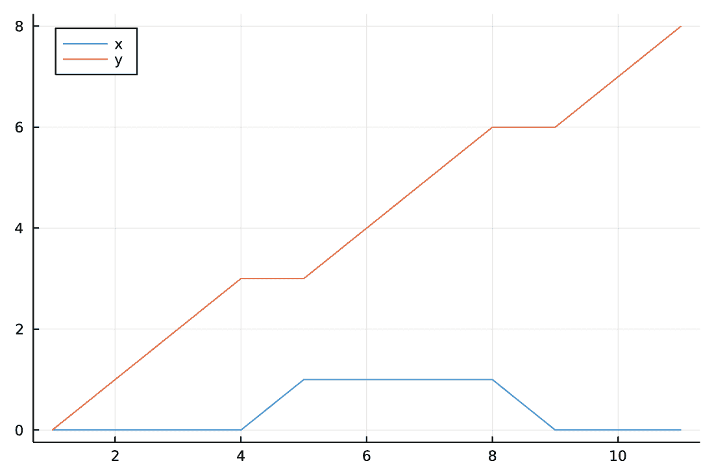

# 第十一章 转换和分组数据框

本章涵盖

+   将数据框转换为其他 Julia 类型

+   编写类型稳定的代码

+   理解类型盗用

+   分组数据框对象

+   与分组数据框一起工作

在第十章中，我们回顾了从不同数据源构建 DataFrame 对象的各种方法。在本章中，我们讨论了相反的过程，并展示了如何从数据框创建其他对象（回想第九章，数据框可以是 DataFrame 或其视图，即 SubDataFrame）。你可能想在两种情况下执行此类操作。

在第一种情况下，你需要执行由不接受数据框作为输入但接受其他类型的函数提供的分析任务，因此你需要将数据框转换为预期的目标格式。一个例子是将数据框转换为矩阵，你打算在后续的线性代数操作中使用。

在第二种情况下，你想要改变数据框中存储的数据的解释方式。此类操作中最重要的是分组数据框。你可以通过在数据框上使用 groupby 函数来分组数据框，从而产生 GroupedDataFrame 对象。R 中的 dplyr 和 Python 中的 pandas 也都有分组功能。分组对象最重要的应用是使用户能够执行 split-apply-combine 转换（参见 [www.jstatsoft.org/article/view/v040i01](https://www.jstatsoft.org/article/view/v040i01)）。这种数据分析任务经常执行。我们将在剩余的章节中讨论这些操作。

然而，GroupedDataFrame 对象不仅支持 split-apply-combine，而且还能让你高效地执行诸如分组迭代、查找、重新排序和子集化等操作。所有这些任务在实践中都经常执行；让我们看看一些例子。

假设你有一个大学中学生的庞大数据库。你希望在按研究领域（按*高效*，即无需扫描或移动源数据，因为它可能很大）对学生进行分组后，高效地执行以下操作：

+   查找所有数学专业的学生（无需执行完整表扫描）

+   按注册学生的数量对研究领域进行排序（无需对源数据框进行排序）

+   删除所有学生人数少于 10 个的研究领域（无需更改源数据框）

你可以使用 GroupedDataFrame 对象执行这些任务。我们将在本章中讨论如何执行它们。我将本章分为两个部分：

+   第 11.1 节展示了如何将数据框转换为 Julia 中常用其他类型的值。

+   第 11.2 节解释了如何使用 groupby 函数从一个源数据框创建 GroupedDataFrame，以及如何使用它。

在讨论如何将数据框对象转换为其他类型时，我们考察了您在处理 Julia 时需要学习的两个重要概念：代码的*类型稳定性*和*类型盗用*。我在第 11.1 节中解释了这两个主题。

## 11.1 将数据框转换为其他值类型

在本节中，您将学习如何将数据框转换为其他值类型。当您有一个不接受数据框作为其参数的函数，但您有存储在数据框中的数据要传递给这个函数时，这种操作通常很需要。

数据框对象最常遇到的目标类型转换如下：

+   矩阵

+   向量的命名元组

+   命名元组的向量

+   数据框列的迭代器

+   数据框行的迭代器

在转换的示例中，我们将使用我们在第十章中创建的 walk 数据框。因此，我们首先需要使用 deserialize 函数从 walk.bin 文件中读取它：

```
julia> using DataFrames

julia> using Serialization

julia> walk = deserialize("walk.bin");
```

关于 Julia 中转换含义的说明

在本章中，我多次使用了*转换*，意味着从一个类型的对象创建另一个类型的对象。例如，我说我们将数据框转换为向量的命名元组。这个含义与对这个词的直观理解一致，并且在实践中经常遇到。这就是我决定使用它的原因。

然而，在 Julia 中，如果我们想精确一点，*转换*的含义更窄。Julia 定义了 convert 函数，Julia 语言的纯粹主义者可能会争论说，只有在使用这个函数时才会发生转换，无论是显式还是隐式。当您将一个值赋给数组时，就会发生 convert 函数的隐式使用。考虑以下操作：

```
julia> x = [1.5]
1-element Vector{Float64}:
 1.5

julia> x[1] = 1
1

julia> x
1-element Vector{Float64}:
 1.0
```

x 变量是一个 Float64 的向量。然而，在 x[1] = 1 操作中，我们将一个整数赋值给这个向量的第一个元素。正如您所看到的，1 这个整数在未要求的情况下被隐式地转换为 1.0 浮点数。

因此，严格来说，将对象转换为一种类型与构造这种类型的值是不同的。如果您想了解更多关于转换和构造之间区别的细节，请参阅 Julia 手册([`mng.bz/K0Z4`](http://mng.bz/K0Z4))。

在这本书中，为了方便起见，并且当这不会引起歧义时，我使用*转换*这个术语（意味着我们在调用转换方法或使用类型构造函数时创建一个特定类型的新的对象）。

### 11.1.1 转换为矩阵

在本节中，您将学习如何将数据框转换为矩阵。例如，如果您的数据框只包含数值，并且您想使用线性代数函数处理这些数值以检查矩阵的列是否线性无关，您可能需要执行这种转换。

将数据框转换为矩阵，可以通过传递给矩阵构造函数来实现：

```
julia> Matrix(walk)
11×2 Matrix{Int64}:
 0  0
 0  1
 0  2
 0  3
 1  3
 1  4
 1  5
 1  6
 0  6
 0  7
 0  8
```

生成的矩阵的适当元素类型将自动检测。你可以选择自己指定它，通过将其作为参数传递给构造函数：

```
julia> Matrix{Any}(walk)
11×2 Matrix{Any}:
 0  0
 0  1
 0  2
 0  3
 1  3
 1  4
 1  5
 1  6
 0  6
 0  7
 0  8
```

虽然可以传递矩阵的元素类型，但很少需要这样做。通常，最好依赖于自动类型检测，因为它确保操作将成功。如果你向构造函数传递了错误的元素类型，你会得到一个错误：

```
julia> Matrix{String}(walk)
ERROR: MethodError: Cannot `convert` an object of type Int64
to an object of type String
```

转换到矩阵为结果矩阵分配了新的内存，但除此之外，它相当快。当你在分析中需要将矩阵传递给函数时很有用。让我们看看一个例子。如果你将矩阵传递给 Plots.jl 的 plot 函数，它会在单个图表上绘制几条线。然而，将数据帧传递给 plot 函数是不支持的：

```
julia> using Plots

julia> plot(walk)
ERROR: Cannot convert DataFrame to series data for plotting
```

相反，你可以绘制 Matrix(walk)：

```
julia> plot(Matrix(walk); labels=["x" "y"] , legend=:topleft)
```

图 11.1 显示了生成的图表。我们画了两系列数据。



图 11.1 使用两系列数据可视化 walk 数据帧。请注意，我们已经将图例移动到图表的右上角（默认情况下，图例显示在右上角，会与图表重叠）。

我们在这里使用了 plot 函数的两个关键字参数。第一个是 labels，它接受一个包含系列标签的单行矩阵——在我们的例子中，["x" "y"]。请注意，它不是一个向量（将写作["x", "y"]）。我们只是在"x"和"y"之间放置了空格。第二个关键字参数是 legend，它允许我们指定图例的位置。在这种情况下，我选择将其放在图表的右上角。

### 11.1.2 向量命名元组的转换

在本节中，你将学习如何将数据帧转换为向量的命名元组。在实践中，有时会这样做，因为它可以提高代码的性能。在本节中，你将看到一个例子，说明这样做可能有所帮助。此外，这种转换成本很低。

转换本身很简单。只需调用以下：

```
julia> Tables.columntable(walk)
(x = [0, 0, 0, 0, 1, 1, 1, 1, 0, 0, 0],
 y = [0, 1, 2, 3, 3, 4, 5, 6, 6, 7, 8])
```

这个操作不会复制源数据帧中存储的向量，并保留列名。回想一下，我们在 11.1.1 节中讨论的矩阵转换会丢失源数据帧中的列名信息，并分配新的内存。

到目前为止，你可以看到 DataFrame 和向量的 NamedTuple 看起来很相似。两者都在列中存储数据，并支持列名。让我们讨论为什么两者都很有用以及何时应该使用它们。理解这个主题是 Julia 中处理表格数据的高级知识的基本组成部分之一。它与区分 DataFrame 和向量 NamedTuple 的两个关键特性有关：

+   DataFrame 是一个类型不稳定的对象，而向量的 NamedTuple 是类型稳定的。这种区别与这两种容器类型的性能有关。

+   DataFrame 是在 DataFrames.jl 包中定义的类型，而 NamedTuple 类型是在 Julia 中定义的，无需加载任何包。DataFrames.jl 包的维护者有更大的灵活性来定义 DataFrame 对象的行为。这种区别与 *类型盗用* 相关。

接下来，我们将首先讨论类型稳定性问题，然后是类型盗用问题。

Julia 中的类型稳定性

我们说，如果 Julia 能够在编译时确定该代码中所有变量的类型，那么这段 Julia 代码就是 *类型稳定的*。如果满足这个条件，Julia 代码可以快速执行。否则，它可能运行缓慢。

我通过 DataFrame 对象的例子解释了类型稳定性的后果，因为这是本书的核心主题。如果你想了解更多关于相关性能考虑的内容，请参阅 Julia 手册中的“性能提示”部分 ([`mng.bz/9Vda`](http://mng.bz/9Vda))。

从 Julia 编译器的角度来看，DataFrame 的每一列都是一个 AbstractVector。如果你从一个数据框中提取一列，编译器无法推断其具体类型。因此，对该列的操作将会缓慢。

这里有一个例子。我们想要手动计算数据框单列元素的总和。在示例中，当我写下 1_000_000 这个字面量时，Julia 忽略了下划线，这使得阅读这个数字更容易：

```
julia> using BenchmarkTools

julia> function mysum(table)
           s = 0               ❶
           for v in table.x    ❷
               s += v
           end
           return s
       end
mysum (generic function with 1 method)

julia> df = DataFrame(x=1:1_000_000);

julia> @btime mysum($df)
  87.789 ms (3998948 allocations: 76.28 MiB)
500000500000
```

❶ 假设我们求和整数

❷ 假设表具有 x 是其列的性质

我们看到操作进行了大量的分配，但评估时间是否良好或糟糕最初是困难的。然而，让我们从我们的 df 数据框中创建一个向量 NamedTuple 并对其性能进行基准测试：

```
julia> tab = Tables.columntable(df);

julia> @btime mysum($tab)
  153.600 μs (0 allocations: 0 bytes)
500000500000
```

我们看到没有分配，并且执行时间快得多，因此从性能角度来看，在 df 数据框上运行此代码不是一个好的选择。

df 和 tab 对象之间的区别是什么？正如我所说的，DataFrame 的所有列在编译器看来都是 AbstractVector。由于 AbstractVector 是一个抽象容器（回想一下第三章中关于抽象类型与具体类型之间区别的讨论），Julia 编译器不知道具有这种类型的值的实际内存布局，因此被迫使用通用的（因此较慢的）代码来处理它。在 tab 对象中，Julia 编译器知道列 x 的类型是 Vector{Int64}。这是一个具体类型，因此 Julia 可以生成用于执行计算的优化机器代码。

这可以通过在 mysum(df) 函数调用上运行 @code_warntype 宏来确认：

```
julia> @code_warntype mysum(df)
MethodInstance for mysum(::DataFrame)
  from mysum(table) in Main at REPL[32]:1
Arguments
  #self#::Core.Const(mysum)
  table::DataFrame
Locals
  @_3::Any
  s::Any
  v::Any
Body::Any
1 ─       (s = 0)
│   %2  = Base.getproperty(table, :x)::AbstractVector
│         (@_3 = Base.iterate(%2))
│   %4  = (@_3 === nothing)::Bool
│   %5  = Base.not_int(%4)::Bool
└──       goto #4 if not %5
2 ... %7  = @_3::Any
│         (v = Core.getfield(%7, 1))
│   %9  = Core.getfield(%7, 2)::Any
│         (s = s + v)
│         (@_3 = Base.iterate(%2, %9))
│   %12 = (@_3 === nothing)::Bool
│   %13 = Base.not_int(%12)::Bool
└──       goto #4 if not %13
3 ─       goto # 2
4 ...    return s
```

@code_warntype 宏告诉我们编译器如何看待我们的函数调用。您不需要理解这个打印输出的所有细节。只需检查编译器是否对正在处理的数据类型有一个恰当的理解即可。一般来说，如果有问题，您会看到它以红色突出显示（本书中为粗体）。我们可以看到，我们的数据框的列 x 被视为 AbstractVector，并以红色打印，您还有几个 Any 值也被打印为红色。这是一个信号，表明代码将无法快速运行。

让我们检查 mysum(tab) 对象上的 @code_warntype 宏调用：

```
julia> @code_warntype mysum(tab)
MethodInstance for mysum(::NamedTuple{(:x,), Tuple{Vector{Int64}}})
  from mysum(table) in Main at REPL[32]:1
Arguments
  #self#::Core.Const(mysum)
  table::NamedTuple{(:x,), Tuple{Vector{Int64}}}
Locals
  @_3::Union{Nothing, Tuple{Int64, Int64}}
  s::Int64
  v::Int64
Body::Int64
1 ─       (s = 0)
│   %2  = Base.getproperty(table, :x)::Vector{Int64}
│         (@_3 = Base.iterate(%2))
│   %4  = (@_3 === nothing)::Bool
│   %5  = Base.not_int(%4)::Bool
└──       goto #4 if not %5
2 ... %7  = @_3::Tuple{Int64, Int64}
│         (v = Core.getfield(%7, 1))
│   %9  = Core.getfield(%7, 2)::Int64
│         (s = s + v)
│         (@_3 = Base.iterate(%2, %9))
│   %12 = (@_3 === nothing)::Bool
│   %13 = Base.not_int(%12)::Bool
└──       goto #4 if not %13
3 ─       goto # 2
4 ...       return s
```

这次，没有红色打印的内容，我们看到 Julia 识别了所有值的类型。这意味着我们可以期待 mysum(tab) 能够快速执行。

为什么 Julia 能够对 tab 对象进行正确的类型推断？原因是存储在其中的列的名称和类型编码在其类型中：

```
julia> typeof(tab)
NamedTuple{(:x,), Tuple{Vector{Int64}}}
```

我们刚刚看到了这个事实的好处：与 tab 对象一起工作的操作是快速的。然而，必须存在一些缺点，因为 DataFrames.jl 开发者决定不使 DataFrame 对象类型稳定。有两个问题：

+   由于列名和类型是 tab 对象类型定义的一部分，它们不能动态更改。您不能添加、删除、更改类型或重命名向量的 NamedTuple 的列（如您在第四章中学到的，NamedTuple 是不可变的）。

+   编译包含许多列的向量 NamedTuple 是昂贵的。一般来说，超过 1,000 列是问题，您应该避免此类操作。

练习 11.1 测量创建一个包含 1 行和 10,000 列（仅包含 1s）的数据框所需的时间。使用由 ones(1, 10_000) 创建的矩阵作为源，并带有自动列名。接下来，测量从该数据框创建向量 NamedTuple 所需的时间。

由于这些原因，DataFrame 对象的设计开始变得有意义；它比向量的 NamedTuple 更灵活，也更符合 Julia 编译器的风格。然而，有一个问题：如何克服具有 DataFrame 类型的对象的类型不稳定性。

我们可以使用一个简单的技巧，称为 *函数屏障方法* ([`mng.bz/jAXy`](http://mng.bz/jAXy)) 来实现这一点。在函数内部从数据框中提取列是缓慢的，但如果您将提取的列传递给另一个函数旁边，编译器将正确地识别这个内部函数中的列类型，这样就会变得快速。您可以这样想：每次您进入一个函数，编译器都会对其参数执行类型检查。以下是一个解决 mysum 函数类型不稳定性问题的示例：

```
julia> function barrier_mysum2(x)
           s = 0
           for v in x
               s += v
           end
           return s
       end
barrier_mysum2 (generic function with 1 method)

julia> mysum2(table) = barrier_mysum2(table.x)
mysum2 (generic function with 1 method)

julia> @btime mysum2($df)
  161.500 μs (1 allocation: 16 bytes)
500000500000
```

我们现在有非常快的执行时间，就像 mysum(tab)。我们看到只有一个分配。它与 table.x 操作相关，这是一个类型不稳定的操作。然而，一旦我们进入 barrier_mysum2 函数内部，一切就都是类型稳定的，因为 Julia 编译器正确地识别了其参数 x 的类型。理解 table.x 的类型在 mysum2 函数中是未知的，但一旦它传递给 barrier_mysum2 函数，它就在函数内部变得已知，这一点至关重要。

如你所见，解决方案相对简单。对于我们在剩余章节中将要讨论的许多操作，DataFrames.jl 会自动创建这样的内核函数，所以在实践中，大多数时候你甚至不需要考虑它。

总结来说，DataFrame 对象的设计与 DataFrames.jl 中内置的功能相结合，为您带来了 DataFrame 对象的修改灵活性和低编译成本，以及通过使用函数屏障方法计算的高执行速度。

尽管如此，有时 DataFrames.jl 提供的标准方法并不能给你预期的性能（在我的经验中，这些情况很少见）。然后，如果你有一个只有几个列的数据框，并且你知道你不想修改它，你可能想创建一个临时的向量 NamedTuple 来分析你的数据。

Julia 中的类型盗用

我们需要特殊 DataFrame 类型的第二个原因与**类型盗用**相关。

注意：你可以在第一次阅读这本书时跳过这一节，因为这个主题稍微复杂一些。然而，如果你想在将来自己创建 Julia 包，理解类型盗用是至关重要的。

Julia 手册将**类型盗用**定义为**在您未定义的类型上扩展或重新定义 Base 或其他包中的方法的实践**([`mng.bz/WMEx`](http://mng.bz/WMEx))。我通过示例解释了这意味着什么以及可能产生的后果。

正如你在本章中看到的，DataFrame 类型支持许多在 Base Julia 中定义的标准函数，包括 push!、append!、vcat、unique 和 unique!。由于 DataFrame 类型在 DataFrames.jl 中定义，DataFrames.jl 的开发者可以安全地为这些函数为 DataFrame 类型定义方法。我们通过自定义定义破坏现有代码的风险为零。

现在想象一下，我们开始为向量 NamedTuple 上的 unique 定义一个特殊方法。记住，在数据框对象上运行 unique 会去重其行：

```
julia> df = DataFrame(a=[1, 1, 2], b=[1, 1, 2])
3×2 DataFrame
 Row │ a      b
     │ Int64  Int64
┼──────────────
   1 │     1      1
   2 │     1      1
   3 │     2      2

julia> unique(df)
2×2 DataFrame
 Row │ a      b
     │ Int64  Int64
─────┼──────────────
   1 │     1      1
   2 │     2      2
```

现在检查如果我们对一个向量 NamedTuple 运行 unique 会发生什么：

```
julia> tab = Tables.columntable(df)
(a = [1, 1, 2], b = [1, 1, 2])

julia> unique(tab)
1-element Vector{Vector{Int64}}:
 [1, 1, 2]
```

我们不是去重行，而是得到 tab 的唯一列。这是 unique 在传递给 Base Julia 内置的 NamedTuple 时的默认行为。因此，我们绝对不能为向量的 NamedTuple 创建一个自定义的 unique 定义，即使我们想这么做，因为这可能会破坏依赖于 unique 在 NamedTuple 对象上默认工作方式的现有代码。

总之，由于我们定义了自己的 DataFrame 类型，我们可以自由地以任何我们喜欢的方式定义函数在其上的工作方式（甚至可以是从 Base Julia 来的函数）。另一方面，如果你在 Base Julia 中定义了一个类型和一个函数，你不允许这样做，因为这将是类型盗用。DataFrames.jl 的开发者可以以最用户友好的方式定义 DataFrame 类型值的行为了，而不受 Base Julia 中定义的默认行为的约束。

提供类型稳定表格对象的选定包

Julia 生态系统中有几种类型稳定的表格类型实现，与 DataFrames.jl 中定义的 DataFrame 类型相反。以下是一个提供此类功能的选定包列表。

TypedTables.jl 包提供了 Table 类型。对于用户来说，Table 呈现为一个命名元组的数组。表格的每一行都表示为一个命名元组。内部，Table 存储一个数组的命名元组，并且是列存储表格数据的方便结构。

另一个类似的包是 TupleVectors.jl，它定义了 TupleVector 类型。同样，对于用户来说，它看起来像是一个命名元组的向量，但它在内部存储为一个向量命名元组。这个包的一个有趣特性是它支持列嵌套；有关详细信息，请参阅[`github.com/cscherrer/TupleVectors.jl`](https://github.com/cscherrer/TupleVectors.jl)。

最后，StructArrays.jl 包提供了 StructArray 类型。这种类型是一个 AbstractArray，其元素可以是任何结构对象，例如命名元组（参见第四章中关于结构类型的讨论）。然而，它的内部内存布局是基于列的（结构中的每个字段都存储在一个单独的 Array 中）。

你应该选择哪个包来进行数据分析？根据我的经验，DataFrames.jl 通常会是最优选择。它目前是功能最丰富的包。此外，DataFrame 类型不稳定的一个好处是你可以轻松处理非常宽的表格，并且可以在原地修改表格。然而，当使用 DataFrames.jl 处理包含非常少行和列的数百万个表格时，你可能会遇到性能瓶颈。在这种情况下，你可以考虑使用向量的命名元组（回想一下本节中提到的，你可以使用 Tables.columntable 从数据框创建它）或者使用我列出的其中一个包（TypedTables.jl, TupleVectors.jl 或 StructArrays.jl）来提高你代码的执行速度。

### 11.1.3 其他常见转换

我将通过总结一些在实践中被广泛使用的更常见的转换来结束本节。除了我们已讨论的转换为矩阵和向量 NamedTuple 之外，我在表 11.1 中列出了其他常见的转换。在以下小节中，我将讨论它们，并解释何时以及为什么你可能想使用它们。在示例中，我们将继续使用本节开头反序列化的 walk 数据框。 

表 11.1 数据框对象选择的转换方法。在所有示例代码中，我假设 df 是一个数据框。

| 输出值 | 含义 | 示例代码 | 分配数据内存 | 类型稳定 |
| --- | --- | --- | --- | --- |
| 矩阵 | 矩阵的列是数据列。 | Matrix(df) | 是 | 是或否 |
| 向量 NamedTuple | 命名元组的每个元素是数据的一列。 | Tables.columntable(df) | 否 | 是 |
| 向量行数据 | 向量的每个元素是一行数据。 | Tables.rowtable(df) | 是 | 是 |
| NamedTuple 迭代器 | 每个迭代的元素是一行数据。 | Tables.namedtupleiterator(df) | 否 | 是 |
| DataFrameRow 集合 | 集合的每个元素是一行数据。 | eachrow(df) | 否 | 否 |
| 数据框列集合 | 集合的每个元素是一列数据。 | eachcol(df) | 否 | 否 |
| 数据框列向量 | 向量的每个元素是一列数据。 | identity.(eachcol(df)) | 否 | 是或否 |

NamedTuple 向量

我们从创建 NamedTuple 向量开始。这种转换在稍后按行处理数据时很有用：

```
julia> Tables.rowtable(walk)
11-element Vector{NamedTuple{(:x, :y), Tuple{Int64, Int64}}}:
 (x = 0, y = 0)
 (x = 0, y = 1)
 (x = 0, y = 2)
 (x = 0, y = 3)
 (x = 1, y = 3)
 (x = 1, y = 4)
 (x = 1, y = 5)
 (x = 1, y = 6)
 (x = 0, y = 6)
 (x = 0, y = 7)
 (x = 0, y = 8)
```

这个对象的优点是它是类型稳定的，可以像其他任何向量一样稍后进行处理。缺点是对于宽表，编译成本很高，并且会分配内存。

NamedTuple 迭代器

如果你想避免内存分配，请使用 NamedTuple 的迭代器。缺点是，你不能像处理向量那样处理这个对象。你只能迭代它：

```
julia> nti = Tables.namedtupleiterator(walk)
Tables.NamedTupleIterator{Tables.Schema{(:x, :y), Tuple{Int64, Int64}},
Tables.RowIterator{NamedTuple{(:x, :y), Tuple{Vector{Int64},
Vector{Int64}}}}}(Tables.RowIterator{NamedTuple{(:x, :y),
Tuple{Vector{Int64}, Vector{Int64}}}}(
(x = [0, 0, 0, 0, 1, 1, 1, 1, 0, 0, 0],
 y = [0, 1, 2, 3, 3, 4, 5, 6, 6, 7, 8]), 11))

julia> for v in nti
           println(v)
       end
(x = 0, y = 0)
(x = 0, y = 1)
(x = 0, y = 2)
(x = 0, y = 3)
(x = 1, y = 3)
(x = 1, y = 4)
(x = 1, y = 5)
(x = 1, y = 6)
(x = 0, y = 6)
(x = 0, y = 7)
(x = 0, y = 8)
```

数据框行和列的类型不稳定迭代器

如果我们接受处理类型不稳定的集合，我们可以调用 eachrow 和 eachcol 来获取可迭代和可索引的对象，分别从源数据框中生成行（作为 DataFrameRow）和列（作为向量）：

```
julia> er = eachrow(walk)
11×2 DataFrameRows
 Row │ x      y
     │ Int64  Int64
─────┼──────────────
   1 │     0      0
   2 │     0      1
   3 │     0      2
   4 │     0      3
   5 │     1      3
   6 │     1      4
   7 │     1      5
   8 │     1      6
   9 │     0      6
  10 │     0      7
  11 │     0      8

julia> er[1]

 Row │ x      y
     │ Int64  Int64
─────┼──────────────
   1 │     0      0

julia> er[end]
DataFrameRow
 Row │ x      y
     │ Int64  Int64
─────┼──────────────
  11 │     0      8

julia> ec = eachcol(walk)
11×2 DataFrameColumns
 Row │ x      y
     │ Int64  Int64
─────┼──────────────
   1 │     0      0
   2 │     0      1
   3 │     0      2
   4 │     0      3
   5 │     1      3
   6 │     1      4
   7 │     1      5
   8 │     1      6
   9 │     0      6
  10 │     0      7
  11 │     0      8

julia> ec[1]
11-element Vector{Int64}:
 0
 0
 0
 0
 1
 1
 1
 1
 0
 0
 0

julia> ec[end]
11-element Vector{Int64}:
 0
 1
 2
 3
 3
 4
 5
 6
 6
 7
 8
```

使用数据框参数调用 eachrow 和 eachcol 产生的集合，不复制数据，编译成本低，但速度较慢，因为编译器在处理它们时无法生成最优代码。这个问题对于处理具有数百万行数据的数据框的 eachrow 尤为重要。为了有效地处理这种情况，引入了非分配的 Tables.namedtupleiterator 函数（你必须记住不要向它传递非常宽的表，因为这样它的编译成本会非常高）。

向量向量

我们将要讨论的最后一种转换选项是使用 identity 函数创建的 data frame 列向量（eachcol(df)），如表 6.1 所示。你可能想知道为什么我们要将 identity 函数广播到 data frame 的列上。这个操作实现了两个目标：它将 eachcol 函数返回的 DataFrameColumns 集合转换为 Vector，并且如果传递的 data frame 的列具有相同的类型，这个类型将被正确地识别为返回向量的元素类型。因此，以分配外部向量的代价（这通常应该是很低的），返回的值将便于后续操作：

```
julia> identity.(eachcol(walk))
2-element Vector{Vector{Int64}}:
 [0, 0, 0, 0, 1, 1, 1, 1, 0, 0, 0]
 [0, 1, 2, 3, 3, 4, 5, 6, 6, 7, 8]
```

在这种情况下，你可以看到生成的向量的元素类型被正确地识别为 Vector{Int64}，因为传递的 data frame 的所有列都具有相同的元素类型。

注意，如果我们传递一个具有异构列类型的 data frame，则这种情况可能不成立：

```
julia> df = DataFrame(x=1:2, b=["a", "b"])
2×2 DataFrame
 Row │ x      b
     │ Int64  String
─────┼───────────────
   1 │     1  a
   2 │     2  b

julia> identity.(eachcol(df))
2-element Vector{Vector}:
 [1, 2]
 ["a", "b"]
```

这次，生成的向量的元素类型是 Vector（如第五章所述，这不是一个具体类型）。因此，后来与具有 Vector{Vector}类型的值一起工作的代码将不会是类型稳定的。因此，表 6.1 表明 identity.(eachcol(df))可以是类型稳定的，也可以不是，这取决于源 data frame 中存储的列的类型。

## 11.2 数据框对象分组

在本节中，我们将讨论如何从 data frame 创建 GroupedDataFrame 对象并与之交互。GroupedDataFrame 对象是源 data frame 的包装器，当你在组内对数据进行操作时非常有用。

如本章引言中所述，分组数据是执行 split-apply-combine 转换的第一步。如果你想要通过执行如分组查找或分组重排等操作来处理分组数据，这些转换非常有用。在本节中，我们将集中讨论如何直接处理 GroupedDataFrame 对象，而在接下来的章节中，你将学习如何使用它们来执行 split-apply-combine 转换。

### 11.2.1 准备源数据框

在本节中，我们将创建一个数据框，我们将在数据框分组的示例中使用它。我选择了我在 JuliaAcademy 的 DataFrames.jl 课程中使用的数据集（[`github.com/JuliaAcademy/DataFrames`](https://github.com/JuliaAcademy/DataFrames)）。它显示了 2020 年几个城镇的降雨量。它只有 10 行，这样我们就可以更容易地理解我们执行的操作的后果。我们首先将数据读入 DataFrame：

```
julia> using CSV

julia> raw_data = """
       city,date,rainfall
       Olecko,2020-11-16,2.9
       Olecko,2020-11-17,4.1
       Olecko,2020-11-19,4.3
       Olecko,2020-11-20,2.0
       Olecko,2020-11-21,0.6
       Olecko,2020-11-22,1.0
       Ełk,2020-11-16,3.9
       Ełk,2020-11-19,1.2
       Ełk,2020-11-20,2.0
       Ełk,2020-11-22,2.0
       """;

julia> rainfall_df = CSV.read(IOBuffer(raw_data), DataFrame)
10×3 DataFrame
 Row │ city     date        rainfall 
     │ String7  Date        Float64  
─────┼───────────────────────────────
   1 │ Olecko   2020-11-16       2.9
   2 │ Olecko   2020-11-17       4.1
   3 │ Olecko   2020-11-19       4.3
   4 │ Olecko   2020-11-20       2.0
   5 │ Olecko   2020-11-21       0.6
   6 │ Olecko   2020-11-22       1.0
   7 │ Ełk      2020-11-16       3.9
   8 │ Ełk      2020-11-19       1.2
   9 │ Ełk      2020-11-20       2.0
  10 │ Ełk      2020-11-22       2.0
```

这次，我们将源 CSV 数据存储在 raw_data 字符串中。接下来，我们使用 IOBuffer 函数处理它，以创建一个内存中的文件-like 对象，该对象可以被 CSV.read 函数读取。请注意，如果我们（在这种情况下，不正确地）将字符串传递给 CSV.read 函数作为第一个参数，该函数会将该参数视为文件名，这并不是我们想要的。

我们创建的 `rainfall_df` 数据框存储了两个城市（Olecko 和 Ełk）在 2020 年 11 月几天内的降雨量（以毫米为单位）的信息。

### 11.2.2 对数据框进行分组

在本节中，您将学习如何使用 `groupby` 函数对数据框进行分组。我们通过按城市名称对数据进行分组并存储结果在 `gdf_city` 分组数据框中开始我们的分析：

```
julia> gdf_city = groupby(rainfall_df, "city")
GroupedDataFrame with 2 groups based on key: city
First Group (6 rows): city = "Olecko"
 Row │ city     date        rainfall 
     │ String7  Date        Float64  
─────┼───────────────────────────────
   1 │ Olecko   2020-11-16       2.9
   2 │ Olecko   2020-11-17       4.1
   3 │ Olecko   2020-11-19       4.3
   4 │ Olecko   2020-11-20       2.0
   5 │ Olecko   2020-11-21       0.6
   6 │ Olecko   2020-11-22       1.0
⋮
Last Group (4 rows): city = "Ełk"
 Row │ city     date        rainfall 
     │ String7  Date        Float64  
─────┼───────────────────────────────
   1 │ Ełk      2020-11-16       3.9
   2 │ Ełk      2020-11-19       1.2
   3 │ Ełk      2020-11-20       2.0
   4 │ Ełk      2020-11-22       2.0
```

当我们打印 `gdf_city` 对象时，我们首先得到它由两个组组成的信息，以及分组键是列 `city`。然后显示第一组和最后一组的内 容。

您可以将任何列选择器（我们在第九章中讨论了列选择器）传递给 `groupby` 函数，以指定用于分组数据框的列。例如，要按除降雨量之外的所有列对 `rainfall_df` 数据框进行分组，请编写以下代码：

```
julia> gdf_city_date = groupby(rainfall_df, Not("rainfall"))
GroupedDataFrame with 10 groups based on keys: city, date
First Group (1 row): city = "Olecko", date = Dates.Date("2020-11-16")
 Row │ city     date        rainfall 
     │ String7  Date        Float64
─────┼───────────────────────────────
   1 │ Olecko   2020-11-16       2.9
⋮
Last Group (1 row): city = "Ełk", date = Dates.Date("2020-11-22")
 Row │ city     date        rainfall 
     │ String7  Date        Float64
─────┼───────────────────────────────
   1 │ Ełk      2020-11-22       2.0
```

这次，我们的数据根据存储在 `city` 和 `date` 列中的唯一值组合分成 10 组。

在对数据框进行分组时可用选项

`groupby` 函数有两个关键字参数，`sort` 和 `skipmissing`，您可以可选地传递这些参数以更改创建结果 `GroupedDataFrame` 的方式。

`sort` 关键字参数定义了返回的 `GroupedDataFrame` 中组的顺序。默认情况下（`sort=nothing`），此顺序是未定义的。在这种情况下，您要求 `groupby` 使用它支持的最快算法对数据进行分组。如果您在处理大型数据框时关心分组操作的速度，请使用此选项。如果您传递 `sort=true`，则组将根据分组列的值进行排序。如果您传递 `sort=false`，则组将按照它们在源数据框中出现的顺序创建。

`skipmissing` 关键字参数接受布尔值。默认情况下，它设置为 `false`，这意味着在结果中保留源数据框中出现的所有组。如果您传递 `skipmissing=true`，则具有分组列中缺失值的组将从结果中删除。

### 11.2.3 获取分组数据框的组键

在本节中，您将学习如何检查与 `GroupedDataFrame` 中每个组对应的分组键。当您想了解您的 `GroupedDataFrame` 存储了哪些组时，这些信息很有用。

当您处理大型 `GroupedDataFrame` 对象时，通常很难理解它包含哪些组。例如，我们知道 `gdf_city_date` 有 10 个组，但由于这会占用太多空间，我们看不到所有这些组。要获取此信息，您可以使用 `keys` 函数：

```
julia> keys(gdf_city_date)
10-element DataFrames.GroupKeys{GroupedDataFrame{DataFrame}}:
 GroupKey: (city = "Olecko", date = Dates.Date("2020-11-16"))
 GroupKey: (city = "Olecko", date = Dates.Date("2020-11-17"))
 GroupKey: (city = "Olecko", date = Dates.Date("2020-11-19"))
 GroupKey: (city = "Olecko", date = Dates.Date("2020-11-20"))
 GroupKey: (city = "Olecko", date = Dates.Date("2020-11-21"))
 GroupKey: (city = "Olecko", date = Dates.Date("2020-11-22"))
 GroupKey: (city = "Ełk", date = Dates.Date("2020-11-16"))
 GroupKey: (city = "Ełk", date = Dates.Date("2020-11-19"))
 GroupKey: (city = "Ełk", date = Dates.Date("2020-11-20"))
 GroupKey: (city = "Ełk", date = Dates.Date("2020-11-22"))
```

`keys` 函数返回一个存储 `GroupKey` 对象的向量，这些对象的行为类似于命名元组，用于保存给定组中分组列的值。如果您想在代码中稍后使用此类对象，可以轻松地将 `GroupKey` 对象转换为元组、命名元组或字典。以下是对第一个组进行此类转换的示例：

```
julia> gk1 = keys(gdf_city_date)[1]
GroupKey: (city = "Olecko", date = Dates.Date("2020-11-16"))

julia> g1_t = Tuple(gk1)
("Olecko", Dates.Date("2020-11-16"))

julia> g1_nt = NamedTuple(gk1)
(city = "Olecko", date = Dates.Date("2020-11-16"))

julia> g1_dict = Dict(gk1)
Dict{Symbol, Any} with 2 entries:
  :date => Date("2020-11-16")
  :city => "Olecko"
```

### 11.2.4 使用单个值索引分组数据框

在本节中，你将学习如何使用索引从一个分组数据框中获取单个组。这是你需要学习的基本操作，以便与 GroupedDataFrame 对象一起工作。

现在，你已经知道了如何获取 GroupedDataFrame 的组键信息。让我们转向获取存储在组中的数据。幸运的是，这很容易，因为 GroupedDataFrame 对象支持索引，就像向量一样。

重要的是，你可以使用正常的向量索引整数来索引 GroupedDataFrame，但你也可以传递一个 GroupKey、Tuple、NamedTuple 或字典来选择你想要选择的组。

让我们来看一个例子。以下是从我们的 gdf_city_date 对象中提取第一个组的不同等效方法：

```
julia> gdf_city_date[1]                 ❶
1×3 SubDataFrame
 Row │ city     date        rainfall 
     │ String7  Date        Float64  
─────┼───────────────────────────────
   1 │ Olecko   2020-11-16       2.9

julia> gdf_city_date[gk1]               ❷
1×3 SubDataFrame
 Row │ city     date        rainfall 
     │ String7  Date        Float64  
─────┼───────────────────────────────
   1 │ Olecko   2020-11-16       2.9

julia> gdf_city_date[g1_t]              ❸
1×3 SubDataFrame
 Row │ city     date        rainfall 
     │ String7  Date        Float64  
─────┼───────────────────────────────
   1 │ Olecko   2020-11-16       2.9

julia> gdf_city_date[g1_nt]             ❹
1×3 SubDataFrame
 Row │ city     date        rainfall 
     │ String7  Date        Float64  
─────┼───────────────────────────────
   1 │ Olecko   2020-11-16       2.9

julia> gdf_city_date[g1_dict]           ❺
1×3 SubDataFrame
 Row │ city     date        rainfall 
     │ String7  Date        Float64  
─────┼───────────────────────────────
   1 │ Olecko   2020-11-16       2.9
```

❶ 使用整数进行查找

❷ 使用 GroupKey 进行查找

❸ 使用元组进行查找

❹ 使用命名元组进行查找

❺ 使用字典进行查找

在代码中的所有五个索引场景中，我们获得了一个存储来自我们原始 rainfall_df 数据框的行的数据框。返回的对象是一个子数据框，这意味着，正如你在第九章中学到的，这是一个视图。这个设计选择是为了确保从 GroupedDataFrame 中获取单个组是快速的，因为它不涉及复制源数据。

为了看到更多关于组查找的例子，让我们从 gdf_city 对象中提取与城市 Olecko 对应的组（回想一下，gdf_city 是按单个列 city 分组的）：

```
julia> gdf_city[("Olecko",)]            ❶
6×3 SubDataFrame
 Row │ city     date        rainfall 
     │ String7  Date        Float64  
─────┼───────────────────────────────
   1 │ Olecko   2020-11-16       2.9
   2 │ Olecko   2020-11-17       4.1
   3 │ Olecko   2020-11-19       4.3
   4 │ Olecko   2020-11-20       2.0
   5 │ Olecko   2020-11-21       0.6
   6 │ Olecko   2020-11-22       1.0

julia> gdf_city[(city="Olecko",)]       ❷
6×3 SubDataFrame
 Row │ city     date        rainfall 
     │ String7  Date        Float64  
─────┼───────────────────────────────
   1 │ Olecko   2020-11-16       2.9
   2 │ Olecko   2020-11-17       4.1
   3 │ Olecko   2020-11-19       4.3
   4 │ Olecko   2020-11-20       2.0
   5 │ Olecko   2020-11-21       0.6
   6 │ Olecko   2020-11-22       1.0
```

❶ 使用元组进行索引

❷ 使用命名元组进行索引

如你所见，当你知道你感兴趣的关键值时，查找具体的组很容易。

你可能会问为什么在像 Tuple 或 NamedTuple 这样的集合中传递标识组的值是必需的。一般来说，你可以通过多个列对数据框进行分组，所以 DataFrames.jl 需要接受值集合来标识组。正如我们讨论的那样，唯一的例外是传递一个整数作为索引，在这种情况下，它被解释为组号。

### 11.2.5 比较索引方法性能

在本节中，我们比较了第 11.2.4 节中讨论的索引方法的速度。但在我们继续之前，让我们看看一个简单的基准，比较在一个大型分组数据框中的查找速度。在所有以下行中，我抑制了表达式产生的值的打印，以便更容易地跟踪计时结果。

警告：这些测试是在一个拥有 32 GB RAM 的机器上运行的。如果您有更少的 RAM 并且想重现这些测试，请将 bench_df 数据框中的行数减少到，例如，10⁷。

```
julia> using BenchmarkTools

julia> bench_df = DataFrame(id=1:10⁸);

julia> bench_gdf = groupby(bench_df, :id);

julia> @btime groupby($bench_df, :id);         ❶
  248.141 ms (88 allocations: 858.31 MiB)

julia> bench_i = 1_000_000;

julia> bench_gk = keys(bench_gdf)[bench_i];

julia> bench_t = Tuple(bench_gk);

julia> bench_nt = NamedTuple(bench_gk);

julia> bench_dict = Dict(bench_gk);

julia> @btime $bench_gdf[$bench_i];            ❷
  283.544 ns (7 allocations: 176 bytes)

julia> @btime $bench_gdf[$bench_gk];           ❸
  336.406 ns (9 allocations: 208 bytes)

julia> @btime $bench_gdf[$bench_t];            ❹
  483.505 ns (10 allocations: 224 bytes)

julia> @btime $bench_gdf[$bench_nt];           ❺
  575.691 ns (12 allocations: 256 bytes)

julia> @btime $bench_gdf[$bench_dict];         ❻
  678.912 ns (15 allocations: 304 bytes)
```

❶ 分组数据框创建的计时

❷ 使用整数进行查找的计时

❸ 使用 GroupKey 进行查找的计时

❹ 使用元组进行查找的计时

❺ 使用命名元组进行查找的计时

❻ 使用字典进行查找的计时

我有以下关于这些基准的评论：

+   当按整数列分组时，对 1 亿行进行的分组操作在几百毫秒内完成，我认为这是很快的。

+   所有索引操作都在数百纳秒的顺序上执行，这在大多数实际应用中应该足够快。

+   整数索引速度最快，其次是 GroupKey 索引和元组索引。接下来是命名元组索引，它比元组索引更昂贵，因为它还需要检查列名。使用字典索引是最慢的，因为字典是可变的，而在 Julia 中，与不可变对象相比，处理可变对象通常更慢。

+   虽然这些基准测试中看不到，但如果你使用元组、命名元组或字典索引，那么在第一次执行查找时，它比连续操作要慢。为了使元组、命名元组或字典查找的平均成本降低，DataFrames.jl 在 GroupedDataFrame 对象内部懒惰地创建一个辅助数据结构。这个操作是懒惰执行的，因为在你会仅使用整数或 GroupKeys 执行查找的情况下，这样的辅助数据结构是不需要的，所以 DataFrames.jl 默认避免其创建。

### 11.2.6 使用多个值索引分组数据帧

在本节中，你将使用索引从 GroupDataFrame 中选择几个组。

你现在知道，要在 GroupDataFrame 对象中执行单个组查找，你需要用单个值索引它。作为此规则的天然扩展，如果你在索引 GroupedDataFrame 时传递多个值，你将得到一个只保留所选组的 GroupedDataFrame。以下有两个例子：

```
julia> gdf_city[[2, 1]]                              ❶
GroupedDataFrame with 2 groups based on key: city
First Group (4 rows): city = "Ełk"
 Row │ city     date        rainfall 
     │ String7  Date        Float64  
─────┼───────────────────────────────
   1 │ Ełk      2020-11-16       3.9
   2 │ Ełk      2020-11-19       1.2
   3 │ Ełk      2020-11-20       2.0
   4 │ Ełk      2020-11-22       2.0
⋮
Last Group (6 rows): city = "Olecko"
 Row │ city     date        rainfall 
     │ String7  Date        Float64  
─────┼───────────────────────────────
   1 │ Olecko   2020-11-16       2.9
   2 │ Olecko   2020-11-17       4.1
   3 │ Olecko   2020-11-19       4.3
   4 │ Olecko   2020-11-20       2.0
   5 │ Olecko   2020-11-21       0.6
   6 │ Olecko   2020-11-22       1.0

julia> gdf_city[[1]]                                 ❷
GroupedDataFrame with 1 group based on key: city
First Group (6 rows): city = "Olecko"
 Row │ city     date        rainfall 
     │ String7  Date        Float64  
─────┼───────────────────────────────
   1 │ Olecko   2020-11-16       2.9
   2 │ Olecko   2020-11-17       4.1
   3 │ Olecko   2020-11-19       4.3
   4 │ Olecko   2020-11-20       2.0
   5 │ Olecko   2020-11-21       0.6
   6 │ Olecko   2020-11-22       1.0
```

❶ 改变 gdf_city 分组数据帧中组的顺序

❷ 创建一个包含单个组的分组数据帧

如你所见，索引规则与你学习 Julia 中的一般索引规则后预期的相同。例如，在 gdf_city[[1]]表达式中传递一个单元素向量作为索引，返回一个包含单个组的分组数据帧。这个例子使用整数来索引分组数据帧，但也可以使用 GroupKey、元组、命名元组或字典的向量。

让我在这里再次强调，GroupedDataFrame 索引不涉及复制存储在 rainfall_df 数据帧中的源数据，因此所有这些操作都很快。

总结来说，使用 GroupedDataFrame 索引，你可以轻松执行以下三个在准备数据以进行进一步操作时通常很有用的操作：

+   组查找，当索引时传递单个组索引时返回数据帧

+   组重排序，当索引时传递组索引的排列时返回分组数据帧

+   分组子集，当索引时传递分组索引的子集向量时返回分组数据帧

### 11.2.7 迭代分组数据帧

在本节中，我将向你展示如何迭代 GroupedDataFrame 的组。如果你想在 GroupedDataFrame 的所有组上执行相同的操作，这个操作非常有用。

由于 `GroupedDataFrame` 对象支持索引，因此自然地期望它们也遵循第十章中讨论的迭代接口。确实如此，这种迭代会产生表示连续组的 DataFrame。因此，你可以在理解中使用它。以下是一个示例，说明如何确定 `gdf_city` 分组 DataFrame 中每个组的行数：

```
julia> [nrow(df) for df in gdf_city]
2-element Vector{Int64}:
 6
 4
```

虽然这种迭代通常很有用，但它有一个问题。在迭代值时，我们看不到哪些键对应于它们。我们可以通过将 `gdf_city` 对象包装在 `pairs` 函数中来解决这个问题。这个函数返回一个 GroupKey 和 DataFrame 对的迭代器。以下是一个简单的示例，打印这些对：

```
julia> for p in pairs(gdf_city)
           println(p)
       end
GroupKey: (city = "Olecko",) => 6×3 SubDataFrame
 Row │ city     date        rainfall 
     │ String7  Date        Float64  
─────┼───────────────────────────────
   1 │ Olecko   2020-11-16       2.9
   2 │ Olecko   2020-11-17       4.1
   3 │ Olecko   2020-11-19       4.3
   4 │ Olecko   2020-11-20       2.0
   5 │ Olecko   2020-11-21       0.6
   6 │ Olecko   2020-11-22       1.0
GroupKey: (city = "Ełk",) => 4×3 SubDataFrame
 Row │ city     date        rainfall 
     │ String7  Date        Float64  
─────┼───────────────────────────────
   1 │ Ełk      2020-11-16       3.9
   2 │ Ełk      2020-11-19       1.2
   3 │ Ełk      2020-11-20       2.0
   4 │ Ełk      2020-11-22       2.0
```

现在，让我们使用 `pairs` 函数生成一个映射每个城市名称到该城市观测行数的字典：

```
julia> Dict(key.city => nrow(df) for (key, df) in pairs(gdf_city))
Dict{String7, Int64} with 2 entries:
  "Ełk"    => 4
  "Olecko" => 6
```

这次，代码稍微复杂一些，所以我将一步一步地解释它（你已经在第一部分学习了所有这些语法）。在 `pairs(gdf_city)` 的代码部分中，`(key, df)` 执行了 Pair 对象的解构，并在每次迭代中将第一个元素（一个 GroupKey）分配给 `key` 变量，将第二个元素（一个 DataFrame）分配给 `df` 变量。`key.city` 部分从 GroupKey 对象中提取城市名称。

`nrow(df)` 函数生成表示给定组的 DataFrame 中的行数。最后，我们将 key.city => nrow(df) 对的迭代器传递给字典构造函数。

`pairs` 函数

在本节中，我们使用 `pairs` 函数在迭代 `GroupedDataFrame` 对象时生成键 => 值对。

`pairs` 函数也可以与不同的集合一起使用。例如，如果你向它传递一个向量，你将得到一个元素索引 => 元素值对的迭代器。一般规则是，`pairs` 函数返回任何将一组键映射到一组值的集合上的键 => 值对的迭代器。

现在你已经了解了与处理分组 DataFrame 相关的所有基本概念。在接下来的章节中，你将学习如何使用分组 DataFrame 执行拆分-应用-组合操作。然而，由于按组计数观测数是一个简单的拆分-应用-组合操作，我将向你展示你可以如何通过使用 `combine` 函数来完成它（我们将在接下来的章节中详细讨论）：

```
julia> combine(gdf_city, nrow)
2×2 DataFrame
 Row │ city     nrow  
     │ String7  Int64 
─────┼────────────────
   1 │ Olecko       6
   2 │ Ełk          4
```

在我看来，这段代码与我们在之前手动将分组 DataFrame 聚合到字典中的方法相比有以下优点：

+   它更短，更容易阅读。

+   它生成一个 DataFrame，因此如果我们想进一步处理这些数据，我们可以使用 DataFrames.jl 包的其他功能。

练习 11.2 使用 gdf_city 分组数据框，通过使用 Statistics 模块中的 mean 函数计算每个城市的平均温度。将结果存储为字典，其中键是城市名称，值是对应的平均温度。将您的结果与以下调用的输出进行比较：combine(gdf_city, :rainfall => mean)。我们将在第十二章和第十三章中讨论此类表达式的确切语法。

## 摘要

+   您可以轻松地将数据框转换为多种其他类型。最常见的转换之一是转换为矩阵、向量的命名元组以及命名元组的向量。当您有一个不接受 DataFrame 但需要一个其他类型值作为输入的函数时，这种转换通常需要。

+   我们称 Julia 代码为类型稳定的，如果 Julia 在编译期间可以推断出所有使用变量的类型。类型稳定的代码通常比类型不稳定的代码快。

+   在数据框上调用 eachrow 和 eachcol 函数返回的 DataFrame 对象及其类型是不稳定的。这有其好处，因为它不会产生显著的编译时间，并允许更改数据框的列。然而，这也带来一个缺点，即需要使用函数屏障方法来确保对存储在其中的数据进行操作时速度快。

+   如果在您未定义的类型上扩展或重新定义 Base Julia 或其他包中的方法，则 Julia 中会发生类型盗用。编写进行类型盗用的代码是不被鼓励的，因为它可能会破坏现有代码。

+   您可以使用 eachcol 函数创建数据框列的迭代器。当您想对数据框的连续列迭代执行操作时，会使用它。

+   您可以使用 eachrow 函数或 Tables.namedtupleiterator 函数创建数据框行的迭代器。当您想对数据框的连续行迭代执行操作时，会使用它们。

+   您可以通过使用 groupby 函数从数据框创建 GroupedDataFrame 对象。当您想按数据框中一个或多个列中存储的值对数据进行分组处理时，分组数据框非常有用。这种数据处理在实际情况中经常需要，例如，在执行 split-apply-combine 操作时。

+   GroupedDataFrame 对象是可索引和可迭代的。您可以轻松执行分组查找、重新排序或子集分组数据框中的组。当您分析存储在 GroupedDataFrame 中的数据时，需要这些操作。

+   您可以使用整数值、GroupKey、元组、命名元组或字典来索引 GroupedDataFrame 对象。这种广泛的选择是有用的，因为它允许您选择最适合您需求的一个。

+   由于在执行此类操作时，存储在父数据框中的源数据不会被复制，因此 GroupedDataFrame 对象的索引速度快。因此，您可以高效地处理具有大量组的分组数据框。
