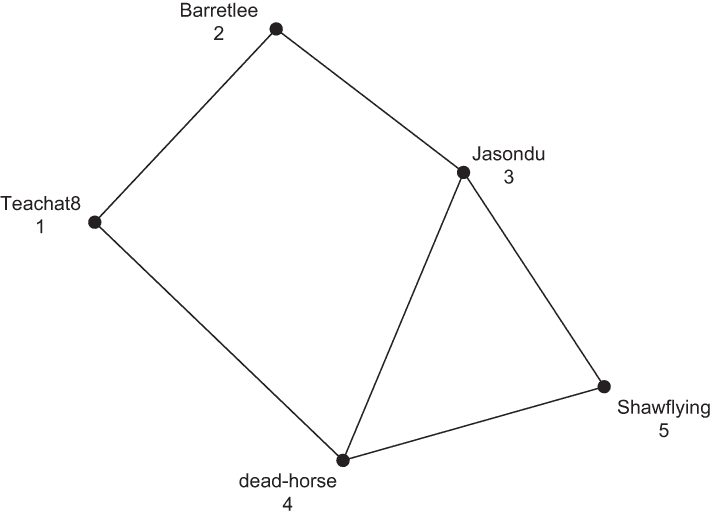
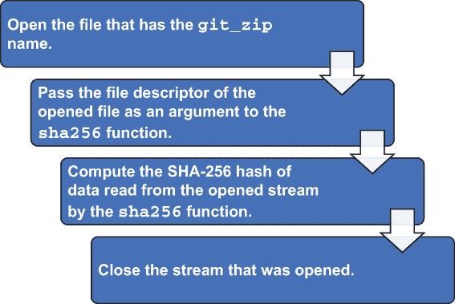
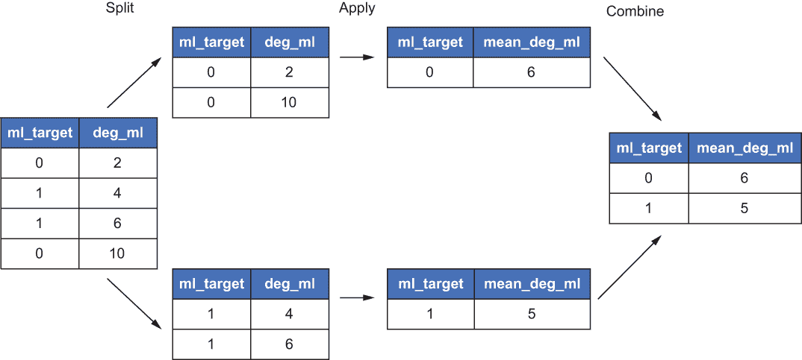
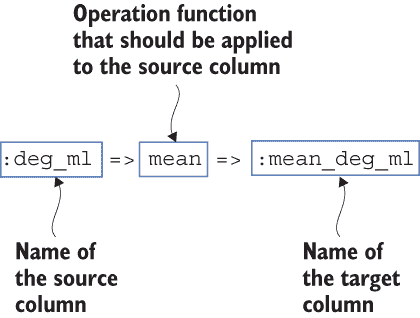
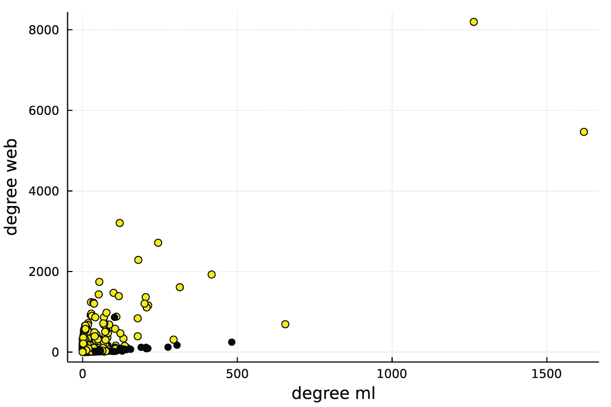
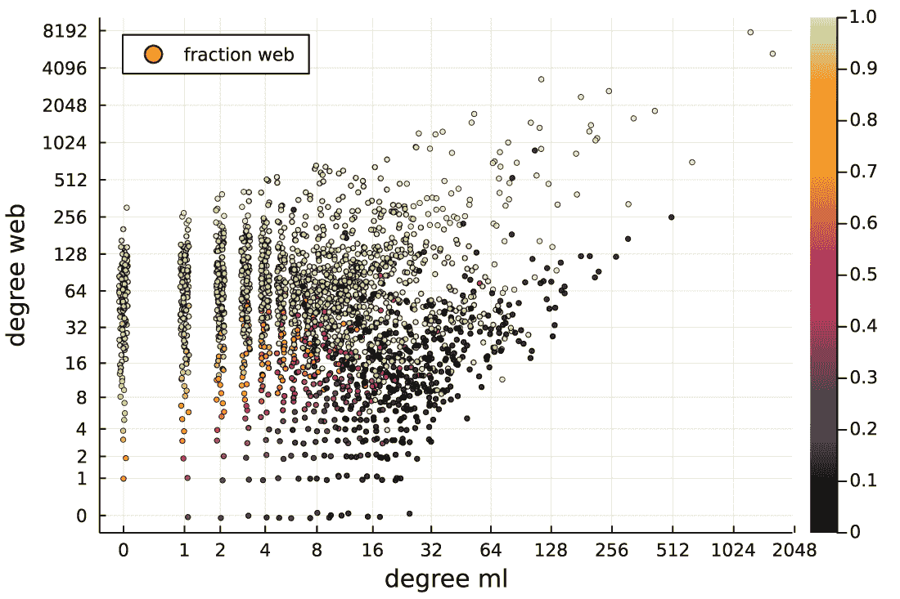

# 12 变异和转换数据帧

本章涵盖了

+   从 ZIP 存档中提取数据

+   添加和变异数据帧的列

+   对数据帧执行 split-apply-combine 转换

+   使用图并分析其属性

+   创建复杂图表

在第 8-11 章中，您学习了如何创建数据帧并从中提取数据。现在是时候讨论数据帧可以变异的方式了。通过*数据帧变异*，我的意思是使用现有列的数据创建新列。例如，您可能有一个日期列在数据帧中，并希望创建一个新列来存储从该日期提取的年份。在 DataFrames.jl 中，您可以通过两种方式实现这一目标：

+   通过向其中添加新列来就地更新源数据帧。

+   创建一个新的数据帧，只存储您将在数据分析管道中稍后需要的列。

本章涵盖了两种方法。数据帧变异是所有数据科学项目的基本步骤。正如第一章所讨论的，在摄取源数据之后，您需要对其进行准备，以便可以分析以获得见解。此数据准备过程通常涉及数据清洗和转换等任务，这些任务通常通过变异数据帧的现有列来完成。

本章解决的问题是对 GitHub 开发者的分类。我们将使用的数据来自 Benedek Rozemberczki 等人发表在“多尺度属性节点嵌入”（[`github.com/benedekrozemberczki/MUSAE`](https://github.com/benedekrozemberczki/MUSAE)）中的工作。共享数据集许可协议为 GPL-3.0。

将 GitHub 开发者进行分类的任务是来自复杂网络挖掘领域的典型数据科学项目。这些技术的实际商业应用是通过调查他们的朋友购买的产品来预测客户可能感兴趣购买的产品类型。

在我们的源数据中，每个开发者被分类为网络或机器学习专家。此外，我们还拥有有关哪些开发者之间有联系的信息。如果两个开发者相互在 GitHub 上关注对方，则称这两个开发者是*连接的*。

很自然地假设网络开发者主要与其他网络开发者连接；同样，机器学习开发者可能与其他机器学习开发者一起工作。本章的目标是检查我们的源数据是否证实了这些假设。

如本书惯例，我提供了一个数据科学项目的完整示例。因此，除了本章的核心主题数据帧变异之外，你将在数据分析的所有领域学习新事物：获取、转换和分析数据。我们将讨论如何集成 DataFrames.jl，它使你能够处理表格数据，以及 Graphs.jl 包，它提供了你可以用来分析图数据的函数。这种集成的目的是，正如你将在本章中看到的，某些数据转换在数据以表格形式表示时表达得更为自然，而其他转换在用图结构表示数据时更容易进行。

## 12.1 获取和加载 GitHub 开发者数据集

在本节中，你将下载并从 ZIP 文件中提取 GitHub 开发者数据集。你将把开发者的信息存储在两个数据帧中，并学习如何更新数据帧的列。所有这些任务在几乎任何数据分析项目中都是常见的任务。

GitHub 开发者数据集可在斯坦福大学大型网络数据集收藏网站下载（[`snap.stanford.edu/data/github-social.html`](https://snap.stanford.edu/data/github-social.html)）。此数据集包含有关 GitHub 开发者社交网络的信息。在此数据中，观测单位是一个 GitHub 开发者。对于每个开发者，我们都有关于他们专业化的信息，这可能是机器学习或网页开发。此外，对于每对开发者，我们知道他们是否相互关注。在数据科学中，这种数据结构被称为 *图*。

### 12.1.1 理解图

在本节中，你将学习什么是图以及如何使用图来表示 GitHub 开发者数据。一个 *图* 是由 *节点* 组成的集合，并且一些节点对可能通过 *无向边* 连接。在我们的数据中，单个 GitHub 开发者是一个节点，两个开发者之间的连接是一个边。当可视化时，节点通常表示为点，边表示为连接这些点的线。图 12.1 展示了一个表示五个开发者的示例小图，该图来自 GitHub 开发者的社交网络。



图 12.1 在这个包含五个 GitHub 开发者的图中，每个开发者是一个编号的节点（点），开发者之间的每个连接是一个边（线）。

此图由五个节点组成。对于每个节点，我展示了开发者的 GitHub 名称。在 Graphs.jl 包中，节点被分配了数字。在 Julia 中，我们使用基于 1 的索引（详细信息请参阅第四章），因此节点从 1 到 5 编号。

图中的节点通过边连接。在这个例子中，边是通过连接节点的线条表示的。通常，边由表示它们连接的节点的数字对描述；例如，边 (1, 2) 表示节点 1 和 2 通过边连接。在我们的图中，我们有六个边：(1, 2)、(1, 4)、(2, 3)、(3, 4)、(3, 5) 和 (4, 5)。

在分析图时，我们经常谈论一个特定节点的邻居集合。*邻居*定义为与被分析节点通过边连接的节点。例如，在图 12.1 中，节点 4 通过边与节点 1、3 和 5 连接，因此集合 {1, 3, 5} 是节点 4 的邻域。此外，对于每个节点，我们定义其 *度* 为连接到它的边的数量。在节点 4 的例子中，其度数为 3。

回到我们涉及 GitHub 开发者图的问题，我们想看看通过检查一个节点（GitHub 开发者）的邻域，我们是否能够预测这位开发者是机器学习或网络专家。例如，在图 12.1 中，节点 4（dead-horse GitHub 用户）与节点 1、3 和 5（Teachat8、Jasondu 和 Shawflying GitHub 用户）连接，这些是它的邻域。我们想检查通过学习节点 1、3 和 5 是否代表网络或机器学习开发者，我们是否可以预测节点 4 的类型。

我刚才描述的问题在图挖掘领域是一个标准任务，称为 *节点分类*。在本章中，我将向你展示如何对这个问题进行简单分析，主要关注使用 DataFrames.jl 处理数据。如果你想更深入地探索分析图数据，你可以查看我与 Paweł Prałat 和 François Théberge 合著的 *Mining Complex Networks*（CBC Press，2021），[www.ryerson.ca/mining-complex-networks/](https://www.torontomu.ca/mining-complex-networks/)。这本书附有所有示例的源代码，包括 Julia 和 Python。

### 12.1.2 从网络获取 GitHub 开发者数据

在本节中，我们将下载 GitHub 开发者数据并检查下载的文件是否正确。这次，源文件 ([`snap.stanford.edu/data/git_web_ml.zip`](https://snap.stanford.edu/data/git_web_ml.zip)) 是一个 ZIP 归档，因此你还将学习如何处理此类文件。由于 ZIP 归档是二进制文件，出于安全考虑，我们将验证文件的 SHA-256 哈希（本节后面将解释），以确保正确获取。

在下面的列表中，我们使用第六章中更详细描述的函数下载数据。

列表 12.1 下载并检查 git_web_ml.zip 文件

```
julia> import Downloads

julia> using SHA

julia> git_zip = "git_web_ml.zip"
"git_web_ml.zip"

julia> if !isfile(git_zip)                                        ❶
           Downloads.download("https://snap.stanford.edu/data/" *
                              "git_web_ml.zip",
                              git_zip)
       end

julia> isfile(git_zip)                                            ❷
true

julia> open(sha256, git_zip) == [0x56, 0xc0, 0xc1, 0xc2,          ❸
                                 0xc4, 0x60, 0xdc, 0x4c,          ❸
                                 0x7b, 0xf8, 0x93, 0x57,          ❸
                                 0xb1, 0xfe, 0xc0, 0x20,          ❸
                                 0xf4, 0x5e, 0x2e, 0xce,          ❸
                                 0xba, 0xb8, 0x1d, 0x13,          ❸
                                 0x1d, 0x07, 0x3b, 0x10,          ❸
                                 0xe2, 0x8e, 0xc0, 0x31]          ❸
true
```

❶ 仅在当前工作目录中不存在该文件时下载文件

❷ 确保文件已成功下载

❸ 将 sha256 函数应用于下载的文件以计算其 SHA-256 哈希，并将其与我在我的机器上计算的一个参考向量进行比较

让我们关注 open(sha256, git_zip) 操作。这是一段简短的代码，但下面做了很多事情。在这个模式中，我们向 open 函数传递两个参数。第一个是我们想要应用于文件的函数，第二个是我们想要处理的文件名。图 12.2 列出了 Julia 执行此操作时执行的步骤。



图 12.2 open(sha256, git_zip) 操作执行的步骤。当 open 函数以 sha256 函数作为第一个参数传递时，保证在操作完成后关闭打开的流，并返回 sha256 函数产生的值。

将作为 open 函数的第一个参数传递的函数必须接受新打开文件的句柄作为其唯一参数。这种情况适用于

sha256 函数，它可以接受这个文件句柄并计算从其中读取的数据的 SHA-256 哈希值。值得注意的是，这个计算不需要将整个文件读入 RAM，这允许处理非常大的文件。此外，重要的是要知道，如果 open 函数将其第一个参数作为函数，那么 open 将返回该函数返回的值并自动关闭它打开的流。这种行为很有用，因为程序员不需要记住手动关闭流。

SHA-256 哈希

*SHA-256* 是由美国国家安全局设计的加密哈希函数。SHA-256 算法接收一个字节流并返回其 256 位的表示。其理念是，如果你有两个不同的源流，它们具有相同的 SHA-256 表示的可能性非常低。此外，该算法被称为 *单向*，这意味着如果你有数据的 256 位表示，很难找到输入数据，其 SHA-256 哈希与你的匹配。如果你想了解更多关于这个主题的信息，请查看 David Wong 的《Real-World Cryptography》（Manning，2021，[www.manning.com/books/real-world-cryptography](http://www.manning.com/books/real-world-cryptography)）。

SHA-256 哈希的一个常见用途是验证从网络获取的数据是否正确下载。如果你有数据的预期 SHA-256 哈希，并且它与你在获取的数据上计算出的哈希匹配，那么数据很可能没有被损坏。

在 Julia 中，SHA 模块中的 sha256 函数返回一个包含应用 SHA-256 算法到传递数据的结果的 32 元素 Vector {UInt8}。

### 12.1.3 实现从 ZIP 文件中提取数据的函数

现在我们已经下载了 git_web_ml.zip 归档，我们可以将我们稍后要处理的数据读入一个数据框中。在本节中，我们将创建一个执行此操作的函数。

作为第一步，我们使用 ZipFile.jl 包打开 ZIP 归档：

```
julia> import ZipFile

julia> git_archive = ZipFile.Reader(git_zip)
ZipFile.Reader for IOStream(<file git_web_ml.zip>) containing 6 files:

uncompressedsize method  mtime            name
----------------------------------------------
              0 Store   2019-10-03 21-49 git_web_ml/
        3306139 Deflate 2019-09-20 22-39 git_web_ml/musae_git_edges.csv
        4380176 Deflate 2019-09-20 22-39 git_web_ml/musae_git_features.json
         676528 Deflate 2019-09-20 22-39 git_web_ml/musae_git_target.csv
            485 Deflate 2019-10-03 21-44 git_web_ml/citing.txt
            881 Deflate 2019-10-03 21-49 git_web_ml/README.txt
```

`git_archive`变量绑定到一个对象，允许我们从存档中读取数据。我们可以看到存档中有五个文件。我们感兴趣的是`musae_git_edges.csv`和`musae_git_target.csv`。这些是 CSV 文件，因此我们将使用 CSV.jl 包来读取它们。

在我们继续之前，让我们看看`ZipFile.Reader`的结构。每个`ZipFile.Reader`对象都有一个`files`属性，它是一个包含其中存储的文件的 Vector。让我们调查`git_archive`变量中的这个属性：

```
julia> git_archive.files
6-element Vector{ZipFile.ReadableFile}:
 ZipFile.ReadableFile(name=git_web_ml/, method=Store,
     uncompresssedsize=0, compressedsize=0, mtime=1.57013214e9)
   ⋮
 ZipFile.ReadableFile(name=git_web_ml/README.txt, method=Deflate,
     uncompresssedsize=881, compressedsize=479, mtime=1.57013214e9)
```

在这种情况下，我们有元素：一个目录和五个文件。每个存储的文件都有几个属性。我们感兴趣的是存储文件名的`name`属性。让我们检查`git_archive`中存储的第二个文件：

```
julia> git_archive.files[2].name
"git_web_ml/musae_git_edges.csv"
```

首先，我们编写一个辅助函数，该函数从存档中存储的 CSV 文件创建一个 DataFrame。在列表 12.2 中，`ingest_to_df`函数接受两个参数。第一个是存档，它应该是一个打开的 ZipFile.Reader 对象，就像绑定到`git_archive`变量上的那样。第二个参数是`filename`，这是我们想要从存档中提取的文件名。这个名称包括文件的完整路径，因此存档中的所有文件都是唯一标识的。

列表 12.2 从 ZIP 存档中提取 CSV 文件到数据框的函数

```
function ingest_to_df(archive::ZipFile.Reader, filename::AbstractString)
    idx = only(findall(x -> x.name == filename, archive.files))
    return CSV.read(read(archive.files[idx]), DataFrame)
end
```

让我们逐步查看这个函数的功能。`findall(x -> x.name == filename, archive.files)`调用查找所有名称与`filename`变量匹配的文件，并将它们作为向量返回。`findall`函数接受两个参数。第一个是一个函数，指定我们想要检查的条件（在这种情况下，文件名是否与`filename`匹配）。第二个参数是一个集合；从这个集合中，我们想要找到函数作为第一个参数传递时返回为真的元素。

`findall`函数返回一个索引向量，指向满足检查条件的集合。以下有两个`findall`调用的示例：

```
julia> findall(x -> x.name == "git_web_ml/musae_git_edges.csv",
               git_archive.files)
1-element Vector{Int64}:
 2

julia> findall(x -> x.name == "", git_archive.files)
Int64[]
```

在第一次调用`findall`时，我们了解到在索引 2 处有一个文件，其名称为`git_web_ml/musae_git_edges.csv`。在第二次调用中，我们发现没有文件名称匹配""。

在`ingest_to_df`函数中，我们期望传入的文件名与我们的存档中恰好一个文件完全匹配。因此，我们使用唯一函数来获取该文件索引作为整数。如果没有恰好一个匹配项，则会抛出错误：

```
julia> only(findall(x -> x.name == "git_web_ml/musae_git_edges.csv",
                    git_archive.files))
2

julia> only(findall(x -> x.name == "", git_archive.files))
ERROR: ArgumentError: Collection is empty, must contain exactly 1 element
```

将`only`与`findall`结合使用是一种常见的模式，它提供了一种安全的方式来检查集合中是否恰好有一个元素满足某种条件。

在 ingest_to_df 函数中，我们将找到的文件索引存储在 idx 变量中。接下来，我们调用 read(archive.files[idx])将文件解压缩到 Vector{UInt8}对象中。重要的是要记住，从存档中读取数据会消耗它。如果我们对同一个文件对象调用 read 函数，我们会得到空的 UInt8 向量数组。这与第七章中讨论的相同模式相同，当时我们将 HTTP.get 查询的结果转换为 String。

接下来，这个 Vector{UInt8}对象被传递给 CSV.read 函数，该函数将传递的数据解析为 CSV 并返回一个 DataFrame。注意，之前我们使用了 CSV.read 函数，传递给它一个包含要解析的文件名的字符串。这次，我们直接传递一个字节数组，并且它被正确处理。这种方法很有用，因为我们不需要在将 CSV 文件读入 DataFrame 之前将其保存到磁盘上。

### 12.1.4 将 GitHub 开发者数据读入 DataFrame

在本节中，我们将使用第 12.2 节中定义的 ingest_to_df 函数将数据读入 DataFrame。

创建 DataFrame

在 12.3 节中，我们创建了两个 DataFrame。第一个是 edges_df。通过调用 summary 和 describe 函数，我们了解到这个 DataFrame 有 289,003 行和两列：id_1 和 id_2。这个 DataFrame 的行代表我们 GitHub 开发者图中的边。第二个 DataFrame 是 classes_df。它有 37,700 行和三列：id、name 和 ml_target。这个 DataFrame 的一行代表一个开发者的信息。

我们感兴趣的关键节点特征存储在 ml_target 列中。它有两个值，0 和 1，其中 0 表示网页开发者，1 表示机器学习开发者。观察发现，数据集中只有大约 25%的开发者是机器学习专家。

列表 12.3 构建边和节点属性 DataFrame

```
julia> using CSV

julia> using DataFrames

julia> edges_df = ingest_to_df(git_archive,
                               "git_web_ml/musae_git_edges.csv");    ❶

julia> classes_df = ingest_to_df(git_archive,
                                 "git_web_ml/musae_git_target.csv"); ❷

julia> close(git_archive)                                            ❸

julia> summary(edges_df)
"289003×2 DataFrame"

julia> describe(edges_df, :min, :max, :mean, :nmissing, :eltype)     ❹
2×6 DataFrame
 Row │ variable  min    max    mean     nmissing  eltype   
     │ Symbol    Int64  Int64  Float64  Int64     DataType 
─────┼─────────────────────────────────────────────────────
   1 │ id_1          0  37694  14812.6         0  Int64
   2 │ id_2         16  37699  23778.8         0  Int64
julia> summary(classes_df)
"37700×3 DataFrame"

julia> describe(classes_df, :min, :max, :mean, :nmissing, :eltype)   #D
3×6 DataFrame
 Row │ variable   min            max      mean      nmissing  eltype   
     │ Symbol     Any            Any      Union...    Int64     DataType 
─────┼─────────────────────────────────────────────────────────────────
   1 │ id         0              37699    18849.5          0  Int64
   2 │ name       007arunwilson  timqian                   0  String31
   3 │ ml_target  0              1        0.258329         0  Int64
```

❶ 包含 GitHub 开发者图边的 DataFrame

❷ 包含我们分类问题目标的 DataFrame

❸ 在从 ZipFile.Reader 对象获取数据后关闭它

❹ 传递我们感兴趣的汇总统计列表

在我们继续分析之前，让我们看看 describe 调用。我在第八章介绍了这个函数，你了解到它可以传递比我们想要描述的 DataFrame 更多的参数。在这个例子中，我将计算的统计信息限制为我们分析中感兴趣的那些：最小值、最大值、平均值、缺失值的数量和列的元素类型。如果你想看到所有默认的列统计信息，你可以调用 describe(edges_df)和 describe(classes_df)。

到目前为止，如果你有一个 GitHub 账户，你可能想知道你是否包含在我们分析的数据库中。你可以通过使用本章之前使用的 findall 函数来检查。这里，我们使用 GitHub 上的 my bkamins 名字：

```
julia> findall(n -> n == "bkamins", classes_df.name)
Int64[]
```

The returned vector is empty, which means that my name is not included in this data. Now let’s look for StefanKarpinski (one of the creators of the Julia language):

```
julia> findall(n -> n == "StefanKarpinski", classes_df.name)
1-element Vector{Int64}:
 1359

julia> classes_df[findall(n -> n == "StefanKarpinski", classes_df.name), :]
1×3 DataFrame
 Row │ id     name             ml_target 
     │ Int64  String31         Int64
─────┼───────────────────────────────────
   1 │  1358  StefanKarpinski          1
```

This time, the check succeeds. Note that the id of StefanKarpinski is 1358, but it is row number 1359 in our data frame. Let’s fix this off-by-one issue.

Using broadcasting to update the contents of data frames

An important feature we learn from listing 12.3 is that the developer’s identifier (columns id_1 and id_2 in edges_df and column id in classes_df) starts indexing with 0. Let’s increase all the indices by 1 so that they start from 1. This is needed because in section 12.2, we will use these edges to create a graph with the Graphs.jl package, and in this package, nodes in a graph use 1-based indexing, just like standard arrays in Julia. We accomplish the update by using broadcasting:

```
julia> edges_df .+= 1
289003×2 DataFrame
    Row │ id_1   id_2  
        │ Int64  Int64 
────────┼──────────────
      1 │     1  23978
      2 │     2  34527
      3 │     2   2371
   :    │   :      :
 289001 │ 37645   2348
 289002 │ 25880   2348
 289003 │ 25617   2348
    288997 rows omitted

julia> classes_df.id .+= 1
37700-element SentinelArrays.ChainedVector{Int64, Vector{Int64}}:
     1
     2
     3
     ⋮
 37698
 37699
 37700
```

The edges_df .+= 1 example shows that when broadcasting a data frame as a whole, it is treated as a two-dimensional object. Therefore, in this case, the operation gives the same result as we would get if we had a matrix instead of a data frame: we have incremented each cell in the data frame by 1.

The classes_df.id .+= 1 example shows that if you get a single column from a data frame, you can update it exactly as you update a vector—in this case, by also incrementing all its elements by 1.

A rule to remember is that broadcasting data frames works in the same way as for other arrays. Therefore, everything that you learned about broadcasting in Julia in general (covered in chapter 5) applies to data frame objects.

Let’s look at a few more examples using a smaller df data frame (not related to our GitHub example) because it is easier to follow visually:

```
julia> df = DataFrame(a=1:3, b=[4, missing, 5])   ❶
3×2 DataFrame
 Row │ a      b       
     │ Int64  Int64?  
─────┼────────────────
   1 │     1        4
   2 │     2  missing 
   3 │     3        5

julia> df .^ 2                                    ❷
3×2 DataFrame
 Row │ a      b       
     │ Int64  Int64?  
─────┼────────────────
   1 │     1       16
   2 │     4  missing 
   3 │     9       25

julia> coalesce.(df, 0)                           ❸
3×2 DataFrame
 Row │ a      b     
     │ Int64  Int64 
─────┼──────────────
   1 │     1      4
   2 │     2      0
   3 │     3      5

julia> df .+ [10, 11, 12]                         ❹
3×2 DataFrame
 Row │ a      b       
     │ Int64  Int64?  
─────┼────────────────
   1 │    11       14
   2 │    13  missing 
   3 │    15       17

julia> df .+ [10 11]                              ❺
3×2 DataFrame
 Row │ a      b       
     │ Int64  Int64?  
─────┼────────────────
   1 │    11       15
   2 │    12  missing 
   3 │    13       16
```

❶ 创建数据框

❷ 将数据框中所有元素平方

❸ 将数据框中所有缺失元素替换为 0（coalesce 函数在第五章中已解释）

❹ 将向量[10 11, 12]添加到数据框的每一列

❺ 将一行的矩阵[10 11]添加到数据框的每一行

Going back to the GitHub example, our developer identifiers now start from 1\. There is more to it. All developers have unique numbers, and the classes_df data frame stores them in sorted order, starting from developer 1 and ending with developer 37700\. We can easily check this by using the axes function you learned about in chapter 4:

```
julia> classes_df.id == axes(classes_df, 1)
true
```

The previous classes_df.id .+= 1 example showed how you can update the existing column of a data frame by using broadcasting. However, instead of using classes_df.id, you could have written classes_df[:, :id] .+= 1 or classes _df[!, :id] .+= 1. You could also use "id" here instead of :id. A natural question is whether there is a difference between using : and ! as a row selector in these two assignments. Indeed, there is a subtle one. The classes_df[:, :id] .+= 1 operation updates the :id column in place, while classes_df[!, :id] .+= 1 allocates a new column in the data frame.

如果你想知道在哪些情况下这个选择会有所不同，请考虑以下示例。同样，我使用一个新的、小的 df 数据框，它与 GitHub 案例研究无关，以便更容易检查我们执行的操作的结果：

```
julia> df = DataFrame(a=1:3, b=1:3)
3×2 DataFrame
 Row │ a      b     
     │ Int64  Int64 
─────┼───────────────
   1 │     1      1
   2 │     2      2
   3 │     3      3

julia> df[!, :a] .= "x"
3-element Vector{String}:
 "x"
 "x"
 "x"

julia> df[:, :b] .= "x"
ERROR: MethodError: Cannot `convert` an object of type String
to an object of type Int64

julia> df
3×2 DataFrame
 Row │ a       b     
     │ String  Int64 
─────┼───────────────
   1 │ x           1
   2 │ x           2
   3 │ x           3
```

在这个示例中，我们看到 df[!, :a] .= "x"之所以有效，是因为它用新数据（df.a .= "x"调用将是等效的）替换了列。然而，df[:, :a] .= "x"失败，因为它试图就地更新现有的列，而我们无法将字符串分配给整数向量。

我们讨论的将赋值操作（.=运算符）广播到数据框列的相同模式也适用于对现有列的标准赋值（=运算符）。以下是一个示例：

```
julia> df = DataFrame(a=1:3, b=1:3, c=1:3)
3×3 DataFrame
 Row │ a      b      c     
     │ Int64  Int64  Int64 
─────┼─────────────────────
   1 │     1      1      1
   2 │     2      2      2
   3 │     3      3      3

julia> df[!, :a] = ["x", "y", "z"]
3-element Vector{String}:
 "x"
 "y"
 "z"

julia> df[:, :b] = ["x", "y", "z"]
ERROR: MethodError: Cannot `convert` an object of type String
to an object of type Int64

julia> df[:, :c] = [11, 12, 13]
3-element Vector{Int64}:
 11
 12
 13

julia> df
3×3 DataFrame
 Row │ a       b      c     
     │ String  Int64  Int64 
─────┼──────────────────────
   1 │ x           1     11
   2 │ y           2     12
   3 │ z           3     13
```

在这个示例中，我们可以看到 df[!, :a] = ["x", "y", "z"]操作（或等价地，df.a = ["x", "y", "z"]）之所以有效，是因为它替换了列。df[:, :b] = ["x", "y", "z"]赋值失败，因为它是对现有列的就地操作，我们无法将字符串转换为整数。然而，df[:, :c] = [11, 12, 13]之所以有效，是因为我们向 c 列分配了一个整数向量。

## 12.2 计算额外的节点特征

在本节中，你将学习如何通过使用 Graphs.jl 包中定义的 SimpleGraph 类型将存储在数据框中的表格数据与图集成。我们将从存储在 edges_df 数据框中的边列表创建一个图。接下来，使用 Graphs.jl 包，我们将计算图节点的几个特征，并将它们作为新列添加到 classes_df 数据框中。如果你将来会处理社交媒体数据，了解如何使用 Graphs.jl 包来分析它将是有用的。

Graphs.jl 包

本节仅介绍了 Graphs.jl 包提供的有限功能集。如果你想了解更多关于在 Julia 中使用图的信息，请参阅包文档（[`juliagraphs.org/Graphs.jl/dev`](https://juliagraphs.org/Graphs.jl/dev/)/）。在这里，我只是评论说它支持所有在处理图时有用的典型功能，包括图遍历、计算节点距离和中心性度量。

### 12.2.1 创建 SimpleGraph 对象

在本节中，我们将创建一个 Graph 对象。这个对象很有用，因为 Graphs.jl 包提供了多个函数，这些函数将允许你以后高效地查询此类对象的相关属性——例如，从图中查询特定节点的邻居。

在列表 12.4 中，我们使用 Graphs.jl 包来处理图。首先，我们使用 SimpleGraph 函数创建一个空图，然后迭代 edges_df 数据框的行，使用 add_edge!函数向其中添加边。接下来，我们检查图中的边和节点数量。它们与 edges_df 和 classes_df 数据框中的行数分别一致，正如预期的那样。在 Graphs.jl 中，节点始终使用连续整数编号，从 1 开始。

列表 12.4 从边列表创建图

```
julia> using Graphs

julia> gh = SimpleGraph(nrow(classes_df))        ❶
{37700, 0} undirected simple Int64 graph

julia> for (srt, dst) in eachrow(edges_df)       ❷
           add_edge!(gh, srt, dst)
       end

julia> gh
{37700, 289003} undirected simple Int64 graph

julia> ne(gh)                                    ❸
289003

julia> nv(gh)                                    ❹
37700
```

❶ 创建一个包含 37,700 个节点但没有边的图

❷ 通过迭代 edges_df 数据帧的行来向图中添加边

❸ 获取图中边的数量

❹ 获取图中节点数（也称为顶点数）

让我们看看 `for (src, dst) in eachrow(edges_df)` 表达式。回想一下，edges_df 有两列。这意味着这个数据帧的每一行都是一个包含两个元素的 DataFrameRow（我们在第九章讨论了 DataFrameRow 对象）。当我们迭代这两个元素对象时，我们可以通过使用元组语法自动将它们解构为两个变量（我们在第十章讨论了解构）。在这种情况下，这两个变量是 src 和 dst（它们需要用括号括起来）。在代码中，我使用 src 和 dst 变量名，因为它们在 Graphs.jl 包内部使用。然而，请记住，我们的图是无向的，所以边没有方向。

这里有一个使用矩阵而不是数据帧进行迭代的另一个例子（以表明这是一个你可以使用的通用模式）：

```
julia> mat = [1 2; 3 4; 5 6]
3×2 Matrix{Int64}:
 1  2
 3  4
 5  6

julia> for (x1, x2) in eachrow(mat)
           @show x1, x2
       end
(x1, x2) = (1, 2)
(x1, x2) = (3, 4)
(x1, x2) = (5, 6)
```

事实上，我们看到 x1 和 x2 变量获取了矩阵迭代行的第一个和第二个元素。这个例子使用了 @show 宏，它在调试中很有用，因为它显示了传递给它的表达式及其值。

### 12.2.2 使用 Graphs.jl 包计算节点的特征

在本节中，使用 gh 图，我们将使用 Graphs.jl 库的功能来计算其节点的某些特征。我们从节点度开始，可以使用 degree 函数获得：

```
julia> degree(gh)
37700-element Vector{Int64}:
   1
   8
   1
   ⋮
   4
   3
   4
```

我们可以看到第一个节点有一个邻居，第二个节点有八个邻居，以此类推。让我们在 classes_df 数据帧中创建一个 deg 列，以存储这个节点度信息：

```
julia> classes_df.deg = degree(gh)
37700-element Vector{Int64}:
   1
   8
   1
   ⋮
   4
   3
   4
```

我们可以执行这个赋值操作，因为我们确信 classes_df 数据帧按升序存储开发者，从 1 开始，到 37700 结束。如果不是这样，我们就必须执行一个连接操作，以正确地将开发者与其功能匹配。我们在第十三章讨论了连接。

创建列的语法与更新现有列的语法相同。因此，你也可以写成 `classes_df[!, :deg] = degree(gh)` 或 `classes_df[:, :deg] = degree(gh)` 来向数据帧添加列。与更新列一样，使用 ! 和 : 行选择器之间有一个区别。! 行选择器将传递的向量存储在数据帧中而不进行复制（当我们更新现有列时也会发生相同的情况）。: 行选择器创建传递向量的副本。以下是一个显示这种差异的例子：

```
julia> df = DataFrame()
0×0 DataFrame

julia> x = [1, 2, 3]
3-element Vector{Int64}:
 1
 2
 3

julia> df[!, :x1] = x
3-element Vector{Int64}:
 1
 2
 3

julia> df[:, :x2] = x
3-element Vector{Int64}:
 1
 2
 3

julia> df
3×2 DataFrame
 Row │ x1     x2    
     │ Int64  Int64 
─────┼──────────────
   1 │     1      1
   2 │     2      2
   3 │     3      3

julia> df.x1 === x
true

julia> df.x2 === x
false

julia> df.x2 == x
true
```

x1 列是在不复制的情况下创建的，因此它存储与 x 向量相同的向量。x2 列是通过复制创建的，因此它存储具有相同内容但内存中不同位置的向量。因此，如果我们后来更改了 x 向量的内容，x1 列的内容将发生变化，但 x2 列的内容将不受影响。

为了完整地阐述，让我提一下，您也可以通过使用广播赋值来创建列。以下是一个使用前一个示例中创建的 df 数据框的示例：

```
julia> df.x3 .= 1
3-element Vector{Int64}:
 1
 1
 1

julia> df
3×3 DataFrame
 Row │ x1     x2     x3    
     │ Int64  Int64  Int64 
─────┼─────────────────────
   1 │     1      1      1
   2 │     2      2      1
   3 │     3      3      1
```

### 12.2.3 计算一个节点的网络和机器学习邻居数量

在本节中，我们将计算 GitHub 开发者数据框的另外两个特征。我们想要计算节点网络中是网络开发者的邻居数量以及是机器学习开发者的邻居数量。这个操作比我们在本书中通常执行的操作稍微复杂一些，并且它使用了您已经学习到的 Julia 语言中的许多特性。

迭代图的边

在我们执行此操作之前，让我们看看 Graphs.jl 库中的 edges 函数，它返回一个图边的迭代器：

```
julia> edges(gh)
SimpleEdgeIter 289003
```

让我们检查它的第一个元素：

```
julia> e1 = first(edges(gh))
Edge 1 => 23978

julia> dump(e1)
Graphs.SimpleGraphs.SimpleEdge{Int64}
  src: Int64 1
  dst: Int64 23978

julia> e1.src
1

julia> e1.dst
23978
```

我们可以看到，e1 对象代表图中的一个单边。使用 dump 函数，我们检查其结构并了解到它有两个字段，src 和 dst，然后我们检查它们可以使用属性访问语法访问。

我们知道如何处理 gh 图的边，所以让我们转向计算是网络开发者还是机器学习开发者的节点邻居数量的函数。

定义一个计算节点邻居数量的函数

在列表 12.5 中，`deg_class`函数接受两个参数：一个 gh 图和一个 0-1 向量类，该类指示开发者是否与机器学习或网络工作。

使用 zeros 函数，我们创建了将存储机器学习和网络开发者邻居数量的向量。这些向量使用 Int 参数初始化为整数零，并且长度等于我们数据中的开发者数量，即类向量的长度。

接下来，我们迭代图的边。对于单个边，我们将分配给该边两端的开发者的数字存储在 a 和 b 变量中。然后，我们使用 class[b] == 1 条件检查 b 开发者是否与机器学习工作。如果是这种情况，我们将开发者 a 的机器学习邻居数量增加一个；否则，我们为开发者 a 的网络开发者数量执行相同的操作。然后我们执行相同的操作，但检查开发者 a 的类型并更新 b 的邻居计数信息。最后，我们返回一个包含我们创建的两个向量的元组。

列表 12.5 计算节点邻居数量的函数

```
function deg_class(gh, class)
    deg_ml = zeros(Int, length(class))  ❶
    deg_web = zeros(Int, length(class)) ❶
    for edge in edges(gh)               ❷
        a, b = edge.src, edge.dst       ❸
        if class[b] == 1                ❹
            deg_ml[a] += 1              ❹
        else                            ❹
            deg_web[a] += 1             ❹
        end
        if class[a] == 1                ❺
            deg_ml[b] += 1              ❺
        else                            ❺
            deg_web[b] += 1             ❺
        end
    end
    return (deg_ml, deg_web)
end
```

❶ 使用整数零初始化向量

❷ 迭代图的边

❸ 将迭代边的两端赋值给 a 和 b 变量

❹ 更新节点 a 的邻居数量

❺ 更新节点 b 的邻居数量

让我们看看 deg_class 函数的实际应用：

```
julia> classes_df.deg_ml, classes_df.deg_web =
       deg_class(gh, classes_df.ml_target)
([0, 0, 0, 3, 1, 0, 0, 0, 1, 2  ...  2, 0, 12, 1, 0, 1, 0, 0, 1, 0],
 [1, 8, 1, 2, 1, 1, 6, 8, 7, 5  ...  213, 3, 46, 3, 20, 0, 2, 4, 2, 4])
```

我们在一次赋值操作中向 classes_df 数据框添加了两列。如前所述，在 Julia 中，我们可以从赋值的右侧解构迭代器（在我们的情况下是 deg_class 函数返回的元组）到其左侧传递的多个变量。

应用函数屏障技术

deg_class 函数的一个重要特性是它将很快。我们通过传递 classes_df.ml_target 向量到它中来使用你在第十一章中学到的函数屏障技术。所以，尽管在 deg_class 函数内部 classes_df 数据框不是类型稳定的，但 Julia 能够识别所有变量的类型，从而为其执行生成有效的代码。让我们使用 @time 和 @code_warntype 宏来检查 deg_class 函数是否高效：

```
julia> @time deg_class(gh, classes_df.ml_target);
  0.007813 seconds (5 allocations: 589.250 KiB)

julia> @code_warntype deg_class(gh, classes_df.ml_target)
MethodInstance for deg_class(::SimpleGraph{Int64},
    ::SentinelArrays.ChainedVector{Int64, Vector{Int64}})
  from deg_class(gh, class) in Main at REPL[106]:1
Arguments
  #self#::Core.Const(deg_class)
  gh::SimpleGraph{Int64}
  class::SentinelArrays.ChainedVector{Int64, Vector{Int64}}
Locals
  @_4::Union{Nothing, Tuple{Graphs.SimpleGraphs.SimpleEdge{Int64},
    Tuple{Int64, Int64}}}
  deg_web::Vector{Int64}
  deg_ml::Vector{Int64}
  edge::Graphs.SimpleGraphs.SimpleEdge{Int64}
  b::Int64
  a::Int64
Body::Tuple{Vector{Int64}, Vector{Int64}}
   ⋮
```

在 @time 宏产生的计时中，最重要的信息是代码执行了五次分配。分配的数量并不与函数中 for edge in edges(gh) 循环的迭代次数成比例（记住我们在图中几乎有 300,000 条边）。这是一个间接指示函数类型稳定的良好信号。

当我们检查 @code_warntype 宏的输出时，我们得到了这个确认。我已经截断了前面的输出，因为它相当长，但没有类型以红色（粗体）显示，并且它们都是具体的（回想一下第五章中关于具体类型的讨论）。

通过观察操作所需的时间，我们可以确定即使我们图中的所有开发者都通过边连接（一个完全图），我们也能在几秒钟内（在我的笔记本电脑上）处理它。请注意，这样一个图会相当大，因为它将有 710,626,150 条边（可以通过使用包含 37,700 个元素的集合的两元素子集数量的公式 37700(37700-1)/2 来计算）。

练习 12.1 使用 complete_graph(37700) 调用，在 37,700 个节点上创建一个完全图（我们在 gh 图中的节点数量）。但请注意：如果你的机器上少于 32 GB RAM，请使用较小的图大小，因为这个练习对内存密集型。接下来，使用 Base .summarysize 函数，检查这个图占用多少内存。最后，使用 @time 函数，检查 deg_class 函数在这个图上完成所需的时间，使用 classes_df.ml_target 向量作为开发者类型的向量。

解释分析结果

让我们检查添加了具有附加图特征的列后的 classes_df 数据框的摘要统计信息：

```
julia> describe(classes_df, :min, :max, :mean, :std)
6×5 DataFrame
 Row │ variable   min            max      mean      std      
     │ Symbol     Any            Any      Union...    Union...   
─────┼───────────────────────────────────────────────────────
   1 │ id         1              37700    18850.5   10883.2
   2 │ name       007arunwilson  timqian
   3 │ ml_target  0              1        0.258329  0.437722
   4 │ deg        1              9458     15.3317   80.7881
   5 │ deg_ml     0              1620     2.22981   13.935
   6 │ deg_web    0              8194     13.1019   69.9712
```

观察到图中节点的平均度数略大于 15。我们可以通过使用 ne 和 nv 函数来交叉检查这个值。由于每条边都贡献了两个节点的度数，因此整个图中节点的平均度数应该是图中边数乘以 2 除以图中节点数：

```
julia> 2 * ne(gh) / nv(gh)
15.331724137931035
```

我们得到了与通过平均单个节点的度数得到的相同值，正如预期的那样。

还请注意，平均而言，开发者与网页开发者的链接比与机器学习开发者多。这并不奇怪，因为在图中，几乎 75% 的节点是网页开发者。从摘要中，我们还从最大值和标准差列的信息中了解到，图中节点的度数存在显著的变异性（我们将在分析数据时考虑这一观察结果）。

在继续前进之前，让我们检查对于每个节点，该节点的网页邻居数量和机器学习邻居数量的总和等于其总度数（因为一个节点的每个邻居要么是网页开发者，要么是机器学习开发者）：

```
julia> classes_df.deg_ml + classes_df.deg_web == classes_df.deg
true
```

的确，这是正确的。

在 DataFrames.jl 中执行对象一致性检查

在开发更复杂的解决方案时执行数据一致性检查非常重要。例如，在 DataFrames.jl 中，当你对数据帧对象执行所选操作时，会运行 DataFrame 对象的一致性检查。以下是一个一致性检查被触发时的示例：

```
julia> df = DataFrame(a=1, b=11)
1×2 DataFrame
 Row │ a      b     
     │ Int64  Int64 
─────┼──────────────
   1 │     1     11

julia> push!(df.a, 2)
2-element Vector{Int64}:
 1
 2

julia> df
Error showing value of type DataFrame:
ERROR: AssertionError: Data frame is corrupt: length of column :b (1)
does not match length of column 1 (2). The column vector has likely been
resized unintentionally (either directly or because it is shared with
another data frame).
```

此代码创建了一个包含一行两列的数据帧。接下来，我们使用 push!(df.a, 2) 操作仅向其一个列添加一个元素（回想第十章的内容，如果你想要向数据帧添加一行，你应该在整个数据帧上使用 push!）。如果我们尝试显示此数据帧，我们会得到一个错误，表明数据帧已损坏，因为数据帧中的所有列必须具有相同数量的元素。不要尝试处理损坏的数据帧。相反，定位导致此问题的代码部分并修复它。

## 12.3 使用 split-apply-combine 方法预测开发者的类型

在本节中，我们将检查我们是否可以通过学习一个节点的网页和机器学习邻居的数量来预测该节点的类型。直观上，我们预计机器学习开发者与其他机器学习开发者之间有更多的联系。同样，我们预计网页开发者会与网页开发者建立联系。你将学习如何在 DataFrames.jl 中应用 split-apply-combine 策略，使用 Plots.jl 创建复杂的图表，以及使用 GLM.jl 进行逻辑回归。

### 12.3.1 计算网页和机器学习开发者特征摘要统计

在本节中，我们将分别检查网页和机器学习开发者的 deg_ml 和 deg_web 变量的平均值。

使用索引的方法

首先，让我们通过使用我们在第九章中学到的索引语法来执行这个计算：

```
julia> using Statistics

julia> for type in [0, 1], col in ["deg_ml", "deg_web"]
           println((type, col,
                    mean(classes_df[classes_df.ml_target .== type, col])))
       end
(0, "deg_ml", 1.5985122134401488)
(0, "deg_web", 16.066878866993314)
(1, "deg_ml", 4.042304138001848)
(1, "deg_web", 4.589382893520895)
```

在循环中，我们遍历开发者类型（0 或 1）和列名（deg_ml 或 deg_web），并打印列的条件均值。我们看到网页开发者（编码为 0）的平均网页朋友比机器学习朋友多得多。对于机器学习开发者，网页和机器学习联系人的数量相当。

之前的代码虽然可行，但较为冗长，可读性不高，并且只将输出显示在屏幕上。必须有一种更优雅的方式来执行这些计算。确实如此：split-apply-combine 模式。

在 Hadley Wickham 的《数据分析的 Split-Apply-Combine 策略》一文中描述了这种模式（[www.jstatsoft.org/article/view/v040i01](https://www.jstatsoft.org/article/view/v040i01)），这种模式在许多支持数据帧操作的框架中得到了实现。如果你熟悉 Python 中的 pandas 或 R 中的 dplyr，这些概念将很熟悉。图 12.3 展示了这种方法。



图 12.3 在 split-apply-combine 策略中，我们根据 ml_target 列将源数据帧分割成两个组，对 deg_ml 列应用均值函数，并将结果合并回单个数据帧。

操作规范语法

在本节中，我通过一个示例解释了 DataFrames.jl 中的 split-apply-combine 模式。第十三章将涵盖这个主题的详细内容。

如果你想在 DataFrames.jl 中对数据按组进行聚合，你需要使用两个函数：

+   groupby—将数据帧分割；你已经在第十一章中学习了这个函数

+   combine—接受一个 GroupedDataFrame 对象并执行其聚合

我们首先按 ml_target 列对 classes_ml 数据帧进行分组，然后计算 deg_ml 和 deg_web 列的均值：

```
julia> gdf = groupby(classes_df, :ml_target)
GroupedDataFrame with 2 groups based on key: ml_target
First Group (27961 rows): ml_target = 0
   Row │ id     name           ml_target  deg    deg_ml  deg_web 
       │ Int64  String31       Int64      Int64  Int64   Int64   
───────┼─────────────────────────────────────────────────────────
     1 │     1  Eiryyy                 0      1       0        1
     2 │     2  shawflying             0      8       0        8
     3 │     4  SuhwanCha              0      5       3        2
   :   │   :          :            :        :      :        :
 27959 │ 37697  kris-ipeh              0      2       0        2
 27960 │ 37698  qpautrat               0      4       0        4
 27961 │ 37700  caseycavanagh          0      4       0        4
                                               27955 rows omitted
⋮
Last Group (9739 rows): ml_target = 1
  Row │ id     name            ml_target  deg    deg_ml  deg_web 
      │ Int64  String31        Int64      Int64  Int64   Int64
──────┼──────────────────────────────────────────────────────────
    1 │     3  JpMCarrilho             1      1       0        1
    2 │     5  sunilangadi2            1      2       1        1
    3 │    33  city292                 1      2       2        0
  :   │   :          :            :        :      :        :
 9737 │ 37694  chengzhongkai           1      4       1        3
 9738 │ 37696  shawnwanderson          1      1       1        0
 9739 │ 37699  Injabie3                1      3       1        2
                                                9733 rows omitted
```

我们可以看到，正如预期的那样，在我们的 gdf 对象中有两个组。第一个对应于 ml_target 列的值为 0（网页开发者），第二个对应于 1（机器学习开发者）。当我们把 GroupedDataFrame 对象传递给 combine 函数时，它会对数据进行分组聚合操作。下面是语法，我将在下文中解释：

```
julia> combine(gdf,
               :deg_ml => mean => :mean_deg_ml,   ❶
               :deg_web => mean => :mean_deg_web) ❶
2×3 DataFrame
 Row │ ml_target  mean_deg_ml  mean_deg_web 
     │ Int64      Float64      Float64      
─────┼──────────────────────────────────────
   1 │         0      1.59851      16.0669
   2 │         1      4.0423        4.58938
```

❶ 在 combine 函数中操作规范的指定由=>运算符连接的三个部分：源列名、应用于此列的函数以及目标列名。

combine 函数的结果是一个数据帧，其第一列是我们对 gdf 数据帧进行分组的变量（ml_target），接下来的列是我们执行聚合操作的结果。我们看到这些数字与我们之前使用 for 循环计算的结果相同。

在这个例子中，理解的关键元素是 combine 函数接受的单一操作规范语法。让我们专注于:deg_ml => mean => :mean_deg_ml 操作。这种语法告诉 combine 函数应该取:deg_ml 列，将其传递给 mean 函数，并将结果存储在:mean_deg_ml 列中。由于我们已经将 GroupedDataFrame 对象传递给 combine 函数，这些操作是按组应用的。图 12.4 进一步解释了这种语法。



图 12.4 在这个由 combine 函数接受的操作规范语法中，你传递计算的数据源，应用于源数据的操作，以及计算结果应存储的目标列名。

这种操作规范语法旨在设计得灵活且易于程序化使用（也就是说，操作规范的任何组件都可以作为变量传递）。在第十三章中，我们将讨论这种语法提供的更多选项。

DataFramesMeta.jl 领域特定语言

如果你是一个来自 R 的 dplyr 用户，你可能想知道你是否可以通过使用赋值语法达到相同的结果。这是使用 DataFramesMeta.jl 包可以实现的：

```
julia> using DataFramesMeta

julia> @combine(gdf,
                :mean_deg_ml = mean(:deg_ml),
                :mean_deg_web = mean(:deg_web))
2×3 DataFrame
 Row │ ml_target  mean_deg_ml  mean_deg_web 
     │ Int64      Float64      Float64      
─────┼──────────────────────────────────────
   1 │         0      1.59851      16.0669
   2 │         1      4.0423        4.58938
```

在这种语法中，你写@combine 而不是 combine，然后你可以使用赋值来指定操作。在操作中，我们使用符号来引用数据框的列名，因此我们在名称前使用冒号前缀。这种便利性是以表达式:mean_deg_ml = mean(:deg_ml)不是有效的 Julia 代码为代价的。在计算机科学术语中，我们称这样的代码为*领域特定语言*。因此，在 DataFrames.jl 生态系统内，当需要指定操作时（例如，聚合数据），提供了两个高级 API 来指定操作：

+   *DataFrames.jl 提供的标准评估 API*—这使用了图 12.4 中描述的=>语法。这种语法更冗长，但更易于程序化使用，并且是有效的 Julia 代码。

+   *DataFramesMeta.jl 包提供的非标准评估 API*—这使用了赋值运算符。这种语法更简短，但以依赖代码的非标准评估为代价。当与数据框进行交互式工作时，用户通常更倾向于使用它。

### 12.3.2 可视化节点网络和机器学习邻居数量之间的关系

现在我们已经调查了开发者的类型与其机器学习和网络邻居数量之间的聚合关系，我们可以更详细地通过视觉来分析它。以下是一个图表，如图 12.5 所示：

```
julia> using Plots

julia> scatter(classes_df.deg_ml, classes_df.deg_web;
               color=[x == 1 ? "black" : "yellow"
                      for x in classes_df.ml_target],
               xlabel="degree ml", ylabel="degree web", labels=false)
```



图 12.5 在这个节点机器学习和 Web 邻居数量的散点图中，开发者的类型由点颜色表示：黑色表示机器学习开发者，黄色（在印刷书中为灰色）表示 Web 开发者。

不幸的是，这个图表对于以下关键原因来说并不是很有信息量：

+   邻居数量的分布高度偏斜。（我们在计算数据摘要统计信息时已经看到了这一点。）

+   许多开发者拥有相同数量的 Web 和机器学习邻居，因此代表这些数据的点重叠。

我们将通过以下技术来解决这些问题：

+   绘制按开发者的 Web 和机器学习邻居数量组合聚合的数据。这样，对于这些值的每个组合，图表上都将有一个单独的点。

+   手动将图表的轴改为对数尺度。这样，我们将从视觉上解压缩图表的低度部分。

+   向显示的数据添加抖动（随机噪声）以进一步减少由图表上许多点引起的问题。

我们将从数据的聚合开始。我们希望有一个数据框，对于存储在 deg_ml 和 deg_web 列中的每个唯一值组合，它都能给我们提供关于 Web 开发者比例的信息：

```
julia> agg_df = combine(groupby(classes_df, [:deg_ml, :deg_web]),
                        :ml_target => (x -> 1 - mean(x)) => :web_mean)
2103×3 DataFrame
  Row │ deg_ml  deg_web  web_mean 
      │ Int64   Int64    Float64
──────┼───────────────────────────
    1 │      0        1  0.755143
    2 │      0        8  0.952104
    3 │      3        2  0.148148
  :   │   :        :        :
 2101 │     41       14  0.0
 2102 │    101       18  0.0
 2103 │      2      213  1.0
                 2097 rows omitted
```

在此代码中，我们一次性对数据进行分组和聚合。由于我们想要根据两个变量条件性地聚合数据，我们将它们作为包含两个元素的向量[:deg_ml, :deg_web]传递给 groupby。在这种情况下，我们必须定义一个匿名函数 x -> 1 - mean(x)来执行聚合。原因是 mean(x)产生的是机器学习开发者的比例，而我们想要得到的是 Web 开发者的比例。

需要注意的是，我们必须将匿名函数用括号括起来，如下所示：

```
julia> :ml_target => (x -> 1 - mean(x)) => :web_mean
:ml_target => (var"#27#28"() => :web_mean)
```

如果我们省略括号，我们会得到以下结果：

```
julia> :ml_target => x -> 1 - mean(x) => :web_mean
:ml_target => var"#29#30"()
```

如您所见，由于 Julia 运算符优先级规则，目标列名被解释为匿名函数定义的一部分，这并非我们的意图。

在我们继续前进之前，看看 DataFramesMeta.jl 语法中相同的操作：

```
julia> @combine(groupby(classes_df, [:deg_ml, :deg_web]),
                :web_mean = 1 - mean(:ml_target))
2103×3 DataFrame
  Row │ deg_ml  deg_web  web_mean 
      │ Int64   Int64    Float64  
──────┼───────────────────────────
    1 │      0        1  0.755143
    2 │      0        8  0.952104
    3 │      3        2  0.148148
  :   │   :        :        :
 2101 │     41       14  0.0
 2102 │    101       18  0.0
 2103 │      2      213  1.0
                 2097 rows omitted
```

在我看来，这比使用=>运算符的语法更容易阅读。现在我们已经有了聚合后的数据，让我们检查其摘要统计信息：

```
julia> describe(agg_df)
3×7 DataFrame
 Row │ variable  mean       min   median   max     nmissing  eltype   
     │ Symbol    Float64    Real  Float64  Real    Int64     DataType
─────┼────────────────────────────────────────────────────────────────
   1 │ deg_ml    19.1992     0        9.0  1620           0  Int64
   2 │ deg_web   98.0314     0       48.0  8194           0  Int64
   3 │ web_mean   0.740227   0.0      1.0     1.0         0  Float64
```

对于绘图来说，重要的是每个轴都有一个等于 0 的最小值。我们不能应用标准的轴对数缩放（这可以在 Plots.jl 中使用 xscale=:log 和 yscale=:log 关键字参数完成）。因此，我们将使用 log1p 函数实现自定义的轴变换。此函数计算其参数加 1 的自然对数。因此，当传递 0 时，它返回 0：

```
julia> log1p(0)
0.0
```

在列表 12.6 中，我们对数据进行 log1p 转换，并对其进行抖动处理，同时为绘图轴定义自定义刻度以匹配所执行转换。在 gen_ticks 函数中，我们定义了 0 和 2 的连续幂次，直到接近要绘制的最大数值的舍入值；该函数返回一个包含刻度位置和刻度标签的元组。

列表 12.6 绘制聚合网络开发者数据的散点图

```
julia> function gen_ticks(maxv)                               ❶
           max2 = round(Int, log2(maxv))
           tick = [0; 2 .^ (0:max2)]
           return (log1p.(tick), tick)
       end
gen_ticks (generic function with 1 method)

julia> log1pjitter(x) = log1p(x) - 0.05 + rand() / 10         ❷
log1pjitter (generic function with 1 method)

julia> using Random

julia> Random.seed!(1234);                                    ❸

julia> scatter(log1pjitter.(agg_df.deg_ml),
               log1pjitter.(agg_df.deg_web);
               zcolor=agg_df.web_mean,                        ❹
               xlabel="degree ml", ylabel="degree web",
               markersize=2,                                  ❺
               markerstrokewidth=0.5,                         ❻
               markeralpha=0.8,                               ❼
               legend=:topleft, labels="fraction web",
               xticks=gen_ticks(maximum(classes_df.deg_ml)),  ❽
               yticks=gen_ticks(maximum(classes_df.deg_web))) ❽
```

❶ 生成自定义刻度的函数

❷ 对一个值应用 log1p 转换，并在 [-0.05,0.05] 范围内添加随机抖动

❸ 为随机数生成器设置种子以确保结果的重复性

❹ 为散点图上绘制的每个点指定颜色，对应于网络开发者的比例

❺ 设置每个点的大小

❻ 设置每个点的描边宽度

❼ 设置每个点的透明度

❽ 为绘图设置自定义刻度，确保它们跨越每个轴上的最大绘图值

图 12.6 显示了生成的结果图。我们可以看到几个关系。一般来说，随着节点网络邻居数量的增加，邻居是网络开发者的概率增加。同样，随着节点机器学习邻居数量的增加，邻居是机器学习开发者的概率也增加。

此外，我们注意到在 (0, 0) 坐标处没有点，因为我们的图中的每个节点都有一个正度数。最后，一般来说，一个节点的网络和机器学习邻居的数量之间似乎存在正相关关系。如果一个开发者有很多网络邻居，那么他们也有很多机器学习邻居的可能性增加。这种关系对于度数高的开发者尤其明显。

现在，让我们考虑与图 12.6 及其生成代码相关的几个技术方面。首先，观察抖动确实在这个图中很有用。如果我们省略了它，我们就会看到所有机器学习度数为 0 的点都在一条线上，它们很可能重叠。其次，gen_ticks 函数接受一个参数，即我们想在轴上绘制的最大值。然后，通过 round(Int, log2(maxv))，我们计算出需要将数字 2 提升到最接近这个数的幂。



图 12.6 在这个节点机器学习和网络邻居的散点图中，点越暗，给定数量的机器学习和网络邻居中网络开发者的比例越低。

注意，这在我们的图表上工作得很好。对于 x 轴，最大的机器学习学位是 1620，所以我们停在 2048（而不是 1024）。对于 y 轴，最大的网络学位是 8194，所以我们停在 8192（而不是 16384）。接下来，使用[0; 2 .^ (0:max2)]，我们产生从 0 开始的刻度，然后是 2 的连续幂。最后，使用(log1p.(tick), tick)，我们返回一个元组，包含使用 log1p 函数转换的刻度位置和刻度标签。

如果您想确保图表真正具有信息性，制作图表，如图 12.6 中的图表，可能会相当耗时。Plots.jl 包的大优点是它提供了许多自定义图表的选项。在 Plots.jl 文档([`docs.juliaplots.org/stable/attributes/`](https://docs.juliaplots.org/stable/attributes/))中，您可以找到可用的绘图选项的详尽列表。

练习 12.2 检查如果从图中移除抖动，图 12.6 中的图表将如何看起来。

### 12.3.3 适配预测开发者类型的逻辑回归模型

在本节中，我们创建一个逻辑回归模型来检查 ml_target 变量与 deg_ml 和 deg_web 变量之间的关系。如果您对逻辑回归模型没有经验，您可以在[`mng.bz/G1ZV`](http://mng.bz/G1ZV)找到有关此主题的入门信息。

我们将使用 GLM.jl 包来估计模型参数，并且，像往常一样，我会向您展示一些在实践中有用的 GLM.jl 特性：

```
julia> using GLM

julia> glm(@formula(ml_target~log1p(deg_ml)+log1p(deg_web)),
           classes_df, Binomial(), LogitLink())
StatsModels.TableRegressionModel{GeneralizedLinearModel{
GLM.GlmResp{Vector{Float64}, Binomial{Float64}, LogitLink},
GLM.DensePredChol{Float64, LinearAlgebra.Cholesky{Float64,
Matrix{Float64}}}}, Matrix{Float64}}

ml_target ~ 1 + :(log1p(deg_ml)) + :(log1p(deg_web))

Coefficients:
───────────────────────────────────────────────────────────────────────────
                  Coef.  Std. Error       z  Pr(>|z|)  Lower 95%  Upper 95%
───────────────────────────────────────────────────────────────────────────
(Intercept)     0.30205   0.0288865   10.46    <1e-24   0.245433   0.358666
log1p(deg_ml)   1.80476   0.0224022   80.56    <1e-99   1.76085    1.84866
log1p(deg_web) -1.63877   0.0208776  -78.49    <1e-99  -1.67969   -1.59785
───────────────────────────────────────────────────────────────────────────
```

首先，让我们解释一下获得的结果。所有估计的系数都非常显著，这从输出中 Pr(>|z|)列的非常小的值中可以看出。正的 log1p(deg_ml)系数意味着随着节点机器学习邻居数量的增加，我们的模型预测该节点代表机器学习开发者的概率增加。同样，由于 log1p(deg_web)系数是负的，我们得出结论，随着节点网络邻居数量的增加，它代表机器学习节点的预测概率会降低。第十三章解释了如何使用此类模型对新数据进行预测。

现在，让我们转向模型的实现。为了适配逻辑回归模型，我们使用 glm 函数。在这种情况下，我们向它传递四个参数。第一个是模型公式。在这里，值得注意的是，我们可以方便地在公式中传递变量转换。在这种情况下，由于数据有显著的右偏斜，我们使用 log1p 函数转换的特征来适配模型。如果传递它们，@formula 宏会自动识别此类转换并创建适当的匿名函数：

```
julia> @formula(ml_target~log1p(deg_ml)+log1p(deg_web))
FormulaTerm
Response:
  ml_target(unknown)
Predictors:
  (deg_ml)->log1p(deg_ml)
  (deg_web)->log1p(deg_web)
```

其次，为了拟合逻辑回归，我们需要通知 glm 我们的目标特征是二元的（遵循二项分布），通过传递 Binomial() 参数。最后，由于我们可以拟合多个可能的模型来处理二元数据，我们通过 LogitLink() 参数选择逻辑回归。例如，如果您想拟合 probit 模型 ([www.econometrics-with-r.org/11-2-palr.html](http://www.econometrics-with-r.org/11-2-palr.html))，请使用 ProbitLink() 代替。

练习 12.3 使用 probit 模型而不是 logit 模型来预测 ml_target 变量。使用 glm 函数的 ProbitLink() 参数。

在本章中，我展示了如何使用 GLM.jl 包来拟合预测模型。如果您想了解更多关于此包的功能，请参阅包手册 ([`juliastats.org/GLM.jl/stable/`](https://juliastats.org/GLM.jl/stable/))。

## 12.4 检查数据框修改操作

DataFrames.jl 提供的用于修改数据框的关键选项如下：

+   *使用赋值或广播赋值进行低级 API*—使用此 API 的一个示例操作是 df.x .= 1，通过广播赋值将列 x 设置为 1。此 API 有时被称为 *命令式*，因为您明确指定了操作应如何执行。

+   *使用数据框修改函数进行高级 API*—此 API 有时被称为 *声明式*，因为您只需指定要执行的操作，并将如何最有效地执行它的决策委托给 DataFrames.jl。高级 API 在您想要执行 split-apply-combine 操作时非常有用。此高级 API 有两种形式：

    +   *使用标准评估*—这是由 DataFrames.jl 提供的，并依赖于使用 (=>) 符号指定的操作。您已经了解了支持此 API 的 combine 函数。

    +   *使用非标准评估*—这是由 DataFramesMeta.jl 包提供的，并允许您使用赋值 (=) 符号。我已经向您展示了支持此 API 的 @combine 宏。

本章重点解释了低级（命令式）API 的工作原理。第十三章将更详细地讨论高级（声明式）API。

DataFrames.jl 生态系统提供了这三个选项来处理数据框对象，因为不同的开发者对代码结构的偏好不同。在这本书中，我讨论了所有三种替代方案，以便您可以选择最适合您需求的方案。

### 12.4.1 执行低级 API 操作

您可以使用低级 API 以以下七种方式更新数据框的列：

+   在数据框中创建新列而不进行复制。

+   通过复制在数据框中创建新列。

+   通过广播在数据框中创建新列。

+   通过替换更新数据框中的现有列。

+   在数据框中就地更新现有列。

+   使用广播替换现有列来更新数据框中的现有列

+   使用广播就地更新数据框中的现有列

我们将在下一节中查看每个选项。

不复制创建数据框中的新列

要将向量 v 赋值给数据框 df 中的新列 a 而不进行复制，请编写以下之一：

```
df.a = v
df[!, "a"] = v
```

通过复制创建数据框中的新列

要将向量 v 复制到数据框 df 中的新列 a，请编写以下内容：

```
df[:, "a"] = v
```

使用广播创建数据框中的新列

要将标量或向量 s 广播到数据框 df 中的新列 a（分配此新列），请编写以下之一：

```
df.a .= s
df[!, "a"] .= s
df[:, "a"] .= s
```

通过替换现有列来更新数据框中的现有列

要将向量 v 就地赋值给数据框 df 中的现有列 a 而不进行复制（通过替换现有列），请编写以下之一：

```
df.a = v
df[!, "a"] = v
```

使用广播就地更新数据框中的现有列

要将向量 v 就地赋值给数据框 df 中的现有列 a（通过更新现有列中的数据），请编写以下内容：

```
df[:, "a"] = v
```

同样的规则可以用来更新数据框中仅选择的行 r（请注意，: 只是一种特殊的行选择器）：

```
df[r, "a"] = v
```

使用广播替换现有列来更新数据框中的现有列

要使用广播将标量或向量 s 赋值给数据框 df 中的现有列 a 并替换它，请编写以下内容：

```
df[!, "a"] .= s
```

使用广播就地更新数据框中的现有列

要使用广播将标量或向量 s 就地赋值给数据框 df 中的现有列 a（通过更新现有列中的数据），请编写以下内容：

```
df[:, "a"] .= s
```

同样的规则可以用来更新数据框中仅选择的行 r（此类选择器的示例可以是 1:3 范围；请注意，: 只是一种特殊的行选择器）：

```
df[r, "a"] .= s
```

在前面的选项中，我只包括了最常用的操作。您可以在 DataFrames.jl 文档中找到支持的低级 API 的完整操作列表（[`mng.bz/z58r`](http://mng.bz/z58r)）。请注意，列表很长，可能难以记忆。作为一个经验法则，您可以假设以下内容：

+   大多数情况下，我列出的操作将满足您的需求。

+   DataFrames.jl API 被设计为支持您可能需要的所有与复制或避免复制数据相关的行为操作。

因此，如果将来您需要执行这里未涵盖的特殊操作，您可以参考文档。

比较行选择器 ! 和 : 的行为

强调 ! 和 : 行选择器的工作方式之间的差异是有用的。假设列 a 存在于数据框 df 中。

让我们首先从数据框中读取数据开始。如果您使用 df[!, "a"] 从数据框中获取列 a，则此操作返回存储在此数据框中的列而不进行复制，而 df[:, "a"] 返回此列的副本。

另一种情况是，当你在赋值语句的左侧使用相同的语法时。在这种情况下，如果你写 df[:, "a"] = v 或 df[:, "a"] .= s，那么操作是就地进行的，即，右侧的数据被写入现有列。如果你写 df[!, "a"] = v，那么列 a 将被替换为向量 v 而不进行复制。最后，写 df[!, "a"] .= s 会分配一个新的向量并将列 a 替换为它。

练习 12.4 创建一个空数据帧。向其中添加一个名为 a 的列，存储值 1、2 和 3 而不进行复制。接下来，在数据帧中创建另一个名为 b 的列，它与列 a 是相同的向量（不进行复制）。检查列 a 和 b 存储的是相同的向量。在数据帧中存储两个相同的列是不安全的，所以在列 b 中存储其副本。现在检查列 a 和 b 存储的是相同的数据但它们是不同的对象。就地更新列 a 的前两个元素为 10。

### 12.4.2 使用 insertcols! 函数变异数据帧

在本节中，在我完成数据帧变异操作的回顾之前，你将了解 insertcols! 函数。这个函数用于向数据帧中添加新列。它的语法与 DataFrame 构造函数类似，其中你传递一个 column_name => value 对来向数据帧中添加列。

insertcols! 函数的特殊之处在于它允许你在数据帧中的任何位置添加一个列，并检查传递的列名是否已在目标数据帧中存在（以避免意外覆盖列）。你可以在 DataFrames.jl 文档中找到更多关于 insertcols! 函数的详细信息 ([`mng.bz/09Gm`](http://mng.bz/09Gm))。

我将展示一些关于它是如何工作的例子。从最基本模式开始，即在数据帧的末尾插入一个列：

```
julia> df = DataFrame(x=1:2)
3×1 DataFrame
 Row │ x     
     │ Int64 
─────┼───────
   1 │     1
   2 │     2

julia> insertcols!(df, :y => 4:5)          ❶
3×2 DataFrame
 Row │ x      y     
     │ Int64  Int64 
─────┼──────────────
   1 │     1      4
   2 │     2      5

julia> insertcols!(df, :y => 4:5)          ❷
ERROR: ArgumentError: Column y is already present in the data frame
which is not allowed when `makeunique=true`

julia> insertcols!(df, :z => 1)            ❸
3×3 DataFrame
 Row │ x      y      z     
     │ Int64  Int64  Int64 
─────┼─────────────────────
   1 │     1      4      1
   2 │     2      5      1
```

❶ 在数据帧的末尾插入一个新列

❷ 默认情况下，尝试插入重复的列名是一个错误。

❸ 标量会自动广播，就像在 DataFrame 构造函数中一样。

让我们通过在数据帧的某个位置插入一个新列来继续这个例子。为此，我们传递第二个参数，指定列应该添加的位置：

```
julia> insertcols!(df, 1, :a => 0)                      ❶
3×4 DataFrame
 Row │ a      x      y      z     
     │ Int64  Int64  Int64  Int64 
─────┼────────────────────────────
   1 │     0      1      4      1
   2 │     0      2      5      1

julia> insertcols!(df, :x, :pre_x => 2)                 ❷
3×5 DataFrame
 Row │ a      pre_x  x      y      z     
     │ Int64  Int64  Int64  Int64  Int64 
─────┼───────────────────────────────────
   1 │     0      2      1      4      1
   2 │     0      2      2      5      1

julia> insertcols!(df, :x, :post_x => 3; after=true)    ❸
3×6 DataFrame
 Row │ a      pre_x  x      post_x  y      z     
     │ Int64  Int64  Int64  Int64   Int64  Int64 
─────┼───────────────────────────────────────────
   1 │     0      2      1       3      4      1
   2 │     0      2      2       3      5      1
```

❶ 在数据帧的第一个位置插入一个新列

❷ 在数据帧中 x 列之前插入一个新列

❸ 在数据帧中 x 列之后插入一个新列，这由 after=true 关键字参数表示

DataFrames.jl 中 => 运算符的使用

在 DataFrames.jl 中，=> 运算符在两个上下文中使用，不应混淆。

第一个上下文是 DataFrame 构造函数和 insertcols! 函数，其中语法形式为 column_name => value。这种形式不涉及任何数据操作。它用于将新数据放入数据帧中。这与 Julia 中字典的填充方式一致。

第二种上下文是 combine 函数支持的运算符语法（在第十三章中，您将了解到其他函数（如 select、select!、transform、transform!、subset 和 subset!）也支持相同的运算符语法）。运算符语法用于操作数据帧中已经存在的数据。其一般结构，如图 12.4 所示，是 source_column => operation_function => target_column_name。

## 摘要

+   图是一种由节点和连接节点的边组成的数据结构。您可以使用 Graphs.jl 包在 Julia 中处理图。如果您分析来自社交媒体的数据，如 Twitter 或 Facebook，其中节点代表用户，边代表它们之间的关系，您将需要与图一起工作。

+   SHA 模块提供了允许您计算所处理数据哈希值的函数。其中常用的一种算法是 SHA-256，通过 sha256 函数提供。您可以使用它来验证从网络下载的数据是否损坏。

+   ZipFile.jl 包提供了处理 ZIP 归档的工具。在数据科学项目中经常使用它，因为在许多情况下，数据源将以这种格式压缩。

+   您可以对数据帧对象执行广播操作，就像对矩阵执行一样。广播允许您方便地转换数据帧中存储的值。

+   DataFrames.jl 提供了一个基于索引语法的低级 API，用于修改数据帧的内容。在执行此类操作时，您可以使用赋值（=运算符）和广播赋值（.=运算符）语法。通常，形式为 df[:, column] = 的操作是在原地执行的，而形式为 df[!, column] = 或 df.column = 的操作则替换列。此 API 的设计是为了让开发者能够完全控制操作执行的方式。

+   Graphs.jl 包定义了 SimpleGraph 类型，它可以用来在 Julia 中表示图，以及多个允许您分析图属性（例如，列出节点的邻居）的函数。当您的分析中包含具有网络结构的数据时，此包非常有用。

+   在 SimpleGraph 类型中，图节点以从 1 开始的连续整数表示，图边以表示它们连接的节点的整数对表示。得益于这种表示方式，在 Julia 集合中使用基于 1 的索引（例如，数据帧）时，很容易保持节点元数据。

+   您可以使用 DataFrames.jl 中的高级 API 中的 groupby 和 combine 函数对数据帧对象执行拆分-应用-组合操作（更多相关函数将在第十三章中讨论）。combine 函数用于对每个组执行聚合操作。在汇总数据时，拆分-应用-组合操作通常非常有用。

+   combine 函数根据传递的操作规范语法执行数据的聚合。其一般结构如下：source_column => operation_function => target_column_name。例如，:a => mean => :a_mean 表示应将列 :a 的数据传递给均值函数，并将计算结果存储在 :a_mean 列中。操作规范语法在程序化使用时特别方便，因为它由有效的 Julia 代码组成。

+   你可以使用 DataFramesMeta.jl 包简化@combine 宏中聚合操作的规范。在这个语法中，你通过使用赋值形式来编写操作；例如，:a_mean = mean(:a) 形式与标准操作规范语法中的 :a => mean => :a_mean 等价。@combine 接受的语法更方便编写和阅读，但依赖于非标准评估。

+   Plots.jl 包提供了一系列丰富的选项，允许你灵活地塑造你创建的图表。可用的绘图属性列表可以在[`docs.juliaplots.org/stable/attributes/`](https://docs.juliaplots.org/stable/attributes/)找到。在实践中，创建一个突出显示你分析数据重要方面的定制图表通常是数据科学项目中成功的关键因素。

+   使用 GLM.jl 包，你可以拟合逻辑回归或概率回归。这些模型在你目标变量为二元时使用。

+   insertcols!函数可用于在数据框中就地添加列。此函数允许你在源数据框的任何位置添加列。
