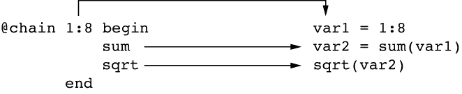
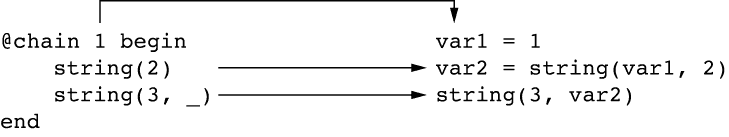
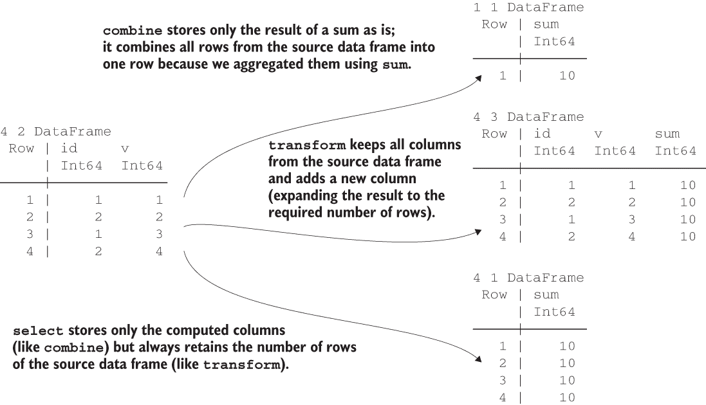
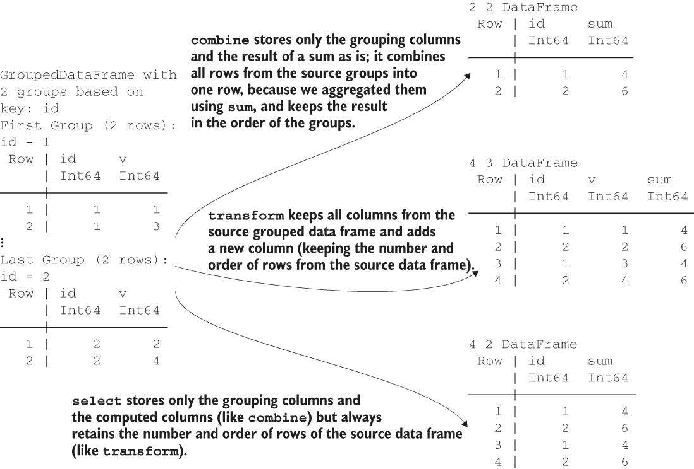
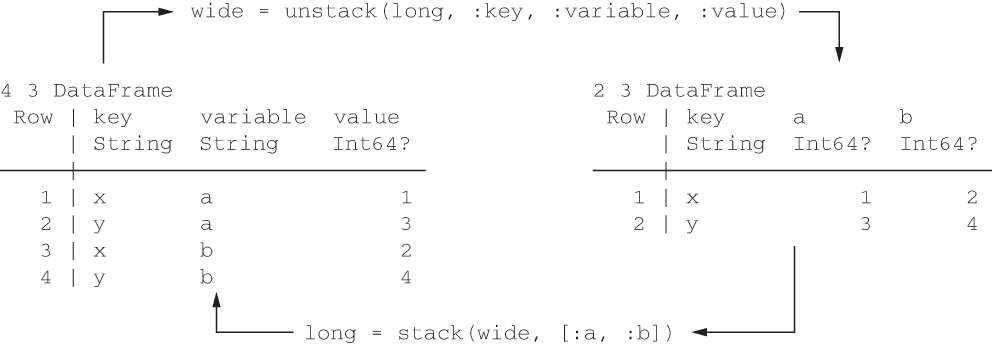
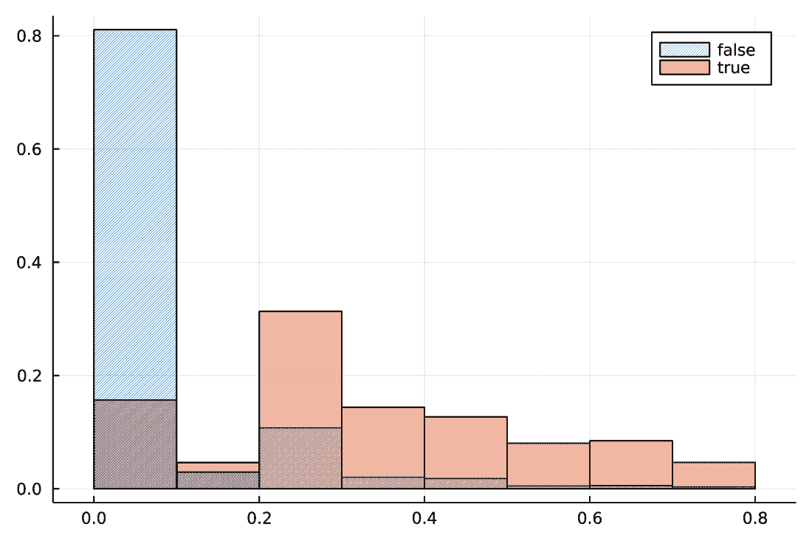
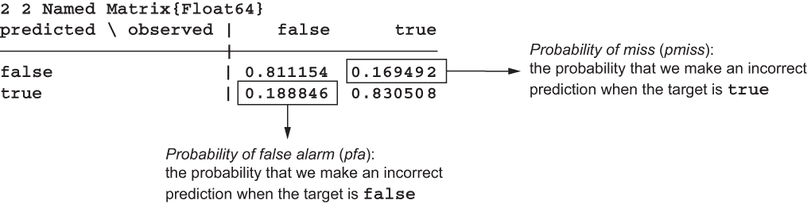
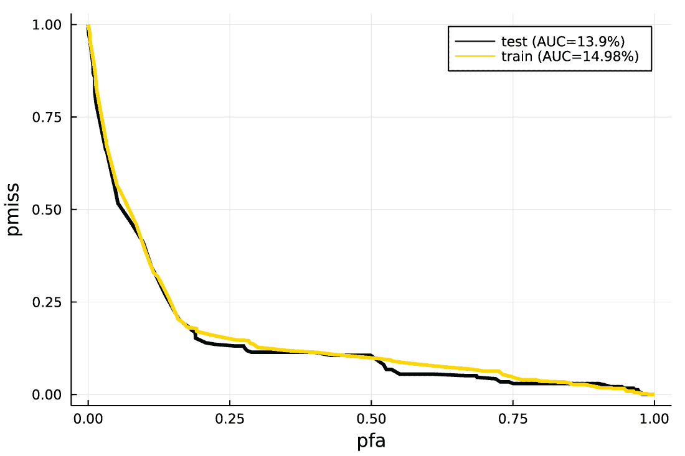

# 13 数据框的高级转换

本章涵盖

+   执行数据框和分组数据框的高级转换

+   链接转换操作以创建数据处理管道

+   排序、连接和重塑数据框

+   处理分类数据

+   评估分类模型

在第十二章中，你学习了如何通过使用组合函数的操作指定语法来执行数据框的基本转换。在本章中，你将学习更多使用此语法的复杂场景，以及更多接受此语法的函数：select、select!、transform、transform!、subset 和 subset!。使用这些函数，你可以方便地对列执行任何需要的操作。同时，这些函数针对速度进行了优化，并且可以选择使用多线程来执行计算。与第十二章一样，我还将向你展示如何使用 DataFramesMeta.jl 领域特定语言来指定这些转换。

在本章中，你还将学习如何通过使用连接操作来合并多个表。DataFrames.jl 对所有标准连接都有高效的实现：内连接、左连接和右连接、外连接、半连接和反连接，以及交叉连接。同样，我将向你展示如何使用 stack 和 unstack 函数重塑数据框。

高级数据转换能力与对连接和重塑数据框的支持相结合，使 DataFrames.jl 成为创建复杂数据分析管道的完整生态系统。通过能够将多个操作链接在一起，创建这些管道大大简化了。这可以通过本章中你将学习的@chain 宏来实现。

此外，你还将学习如何使用 CategoricalArrays.jl 包来处理分类数据（R 用户称之为*因子*）。在执行数据统计分析时，通常需要此功能。

如本书惯例，我将所有这些概念都基于真实数据集进行展示。这次，我们将使用斯坦福开放警务项目数据，该数据集可在 Open Data Commons Attribution License 下获得。在这个数据集中，每个观测值代表一次警察拦截，并包含关于事件多个特征的信息。我们的目标是了解哪些特征会影响在肯塔基州奥文斯伯勒警察拦截期间被捕的概率。在这个过程中，我们将专注于使用 DataFrames.jl 进行特征工程，以准备可用于创建预测模型的可用数据。

由于我们即将结束本书，因此预期本章的内容将比前几章更高级。本章涵盖了 DataFrames.jl 的许多功能，因此相对较长。因此，在描述中，我专注于解释新材料。

## 13.1 获取和预处理警察拦截数据集

在本节中，我们将执行分析前的准备工作。这些内容应该对您来说很熟悉，因为步骤是相同的（从网络上获取 ZIP 存档，检查其 SHA，从存档中提取 CSV 文件，并将内容加载到数据框中），正如第十二章所述。

不同之处在于，我将向您展示如何使用@chain 宏进行多个操作的管道。创建结合多个操作的管道是许多数据科学家，尤其是那些熟悉 R 中的%>%操作符的数据科学家所喜爱并经常使用的功能。在本节的末尾，我将向您展示如何使用 select!函数就地删除数据框中的列。 

### 13.1.1 加载所有必需的包

在 Julia 中，一个常见的做法是在分析开始时加载我们将在项目中使用的所有包。我为尚未在本书中使用的包添加了注释：

```
julia> using CSV

julia> using CategoricalArrays        ❶

julia> using DataFrames

julia> using DataFramesMeta

julia> using Dates

julia> using Distributions           ❷

julia> import Downloads

julia> using FreqTables

julia> using GLM

julia> using Plots

julia> using Random

julia> using ROCAnalysis             ❸

julia> using SHA

julia> using Statistics

julia> import ZipFile
```

❶ 包允许您处理分类数据（R 中的因子）

❷ 提供支持处理各种统计分布的包

❸ 提供用于评估分类模型功能的包

### 13.1.2 介绍@chain 宏

@chain 宏提供了类似于 R 中的管道（%>%）操作符的功能。我们在上一节中通过使用 DataFramesMeta.jl 包（该包最初由 Chain.jl 包提供并由 DataFramesMeta.jl 重新导出）导入了它。通过使用@chain 宏，您可以方便地执行数据的多步骤处理。

@chain 宏的工作基本规则

@chain 宏接受一个起始值和一个表达式块的范围（通常一行代码对应一个表达式）。这个宏的基本工作规则如下：

+   默认情况下，上一个表达式的结果用作当前表达式的第一个参数，并且当您指定当前表达式时，此参数被省略。

+   作为例外，如果当前表达式中至少有一个下划线（_），则第一个规则不适用。相反，每个下划线都被替换为上一个表达式的结果。

您可以在 Chain.jl 的 GitHub 页面（[`github.com/jkrumbiegel/Chain.jl`](https://github.com/jkrumbiegel/Chain.jl)）上找到@chain 宏遵循的完整规则列表。以下是一些使用示例的代码。从以下表达式开始：

```
julia> sqrt(sum(1:8))
6.0
```

这也可以用@chain 宏等价地写成如下：

```
julia> @chain 1:8 begin
           sum
           sqrt
       end
6.0
```

在这个例子中，sum 和 sqrt 函数只接受一个参数，所以我们不需要使用下划线来指示上一个表达式结果的放置，我们甚至可以在函数后面省略括号。1:8 的起始值传递给 sum 函数，然后结果传递给 sqrt 函数。图 13.1 说明了这个过程。var1 和 var2 变量名仅用于说明目的，因为在实践中，@chain 宏生成的变量名保证不会与现有标识符冲突。



图 13.1 在这个@chain 宏中，每个操作都是一个接受一个参数的函数。箭头显示了如何使用临时变量重写宏调用的每个部分。

如果您想显式使用下划线，您可以按以下方式编写我们的示例代码：

```
julia> @chain 1:8 begin
           sum(_)
           sqrt(_)
       end
6.0
```

现在让我们考虑一个更复杂的例子：

```
julia> string(3, string(1, 2))
"312"
```

这可以等价地写成以下形式：

```
julia> @chain 1 begin
           string(2)
           string(3, _)
       end
"312"
```

在这种情况下，1 作为第一个参数发送给 string(1, 2)调用，因为 string(2)表达式没有下划线。这个操作的结果，即一个"12"字符串，被传递给 string(3, _)表达式。由于在这个表达式中下划线存在，它被转换为 string(3, "12")并产生"312"作为其结果。图 13.2 描述了这一过程。



图 13.2 评估每个操作都是接受两个参数的函数的@chain 宏

### 13.1.3 获取警察拦截数据集

我们现在准备下载、解压缩并将肯塔基州奥文斯伯勒的警察拦截数据加载到数据框中。在这个过程中，我们将使用@chain 宏，您在 13.1.2 节中了解过：

```
julia> url_zip = "https://stacks.stanford.edu/file/druid:yg821jf8611/" *
                 "yg821jf8611_ky_owensboro_2020_04_01.csv.zip";         ❶

julia> local_zip = "owensboro.zip";                                     ❷

julia> isfile(local_zip) || Downloads.download(url_zip, local_zip)      ❸
true

julia> isfile(local_zip)                                                ❹
true

julia> open(sha256, local_zip) == [0x14, 0x3b, 0x7d, 0x74,              ❺
                                   0xbc, 0x15, 0x74, 0xc5,              ❺
                                   0xf8, 0x42, 0xe0, 0x3f,              ❺
                                   0x8f, 0x08, 0x88, 0xd5,              ❺
                                   0xe2, 0xa8, 0x13, 0x24,              ❺
                                   0xfd, 0x4e, 0xab, 0xde,              ❺
                                   0x02, 0x89, 0xdd, 0x74,              ❺
                                   0x3c, 0xb3, 0x5d, 0x56]              ❺
true

julia> archive = ZipFile.Reader(local_zip)                              ❻
ZipFile.Reader for IOStream(<file owensboro.zip>) containing 1 files:

uncompressedsize method  mtime            name
----------------------------------------------
         1595853 Deflate 2020-04-01 07-58 ky_owensboro_2020_04_01.csv

julia> owensboro = @chain archive begin
           only(_.files)
           read
           CSV.read(DataFrame; missingstring="NA")
       end;                                                             ❼

julia> close(archive)                                                   ❽
```

❶ 我们想要获取的文件 URL

❷ 我们想要保存到本地的文件名

❸ 仅在文件不存在时获取文件；如果文件已存在，则打印 true

❹ 检查文件是否确实存在

❺ 通过检查其 SHA-256 确保文件内容正确

❻ 打开 ZIP 存档并检查其内容

❼ 从存档中提取 CSV 文件并将其加载到 DataFrame 中；使用@chain 宏将 NA 值视为缺失

❽ 在我们完成读取后关闭 ZIP 存档

在这个例子中，使用@chain 宏的表达式等同于以下代码行：

```
CSV.read(read(only(archive.files)), DataFrame; missingstring="NA");
```

在我看来，使用@chain 宏的版本更容易阅读和修改，如果需要的话。

我们已经创建了 owensboro 数据框。我抑制了其内容的打印，因为它很大。相反，让我们使用在第十二章中使用的 summary 和 describe 函数来获取其摘要信息：

```
julia> summary(owensboro)
"6921×18 DataFrame"

julia> describe(owensboro, :nunique, :nmissing, :eltype)
18×4 DataFrame
 Row │ variable                 nunique  nmissing  eltype
     │ Symbol                   Union...      Int64  Type
─────┼─────────────────────────────────────────────────────────────────────
   1 │ raw_row_number                           0  Int64
   2 │ date                        726          0  Date
   3 │ time                        1352         0  Time
   4 │ location                    4481         0  String
   5 │ lat                                      0  Float64
   6 │ lng                                      9  Union{Missing, Float64}
   7 │ sector                      10          10  Union{Missing, String15}
   8 │ subject_age                              3  Union{Missing, Int64}
   9 │ subject_race                4           18  Union{Missing, String31}
  10 │ subject_sex                 2            0  String7
  11 │ officer_id_hash             87           0  String15
  12 │ type                        2           42  Union{Missing, String15}
  13 │ violation                   1979         0  String
  14 │ arrest_made                              0  Bool
  15 │ citation_issued                          0  Bool
  16 │ outcome                     2            0  String15
  17 │ vehicle_registration_state  35          55  Union{Missing, String3}
  18 │ raw_race                    4           18  Union{Missing, String31}
```

我们的数据集有近 7000 个观测值和 18 列。我已经展示了关于文本列中唯一值的数量、记录的缺失值数量以及每列的元素类型的信息。在本章中，我们不会处理数据框的所有列。相反，我们将专注于以下特征：

+   日期—提供事件发生的时间信息。

+   类型—指示谁被警察拦截（车辆或行人）。这个列有 42 个缺失观测值。

+   是否逮捕—显示是否进行了逮捕。这将是我们目标列。

+   违规—提供记录的违规类型的文本描述。

在接下来的几节中，我们将更详细地查看这些列中的数据。首先，我们将使用下一列表中的 select!函数删除我们不需要的列。

列表 13.1：在 owensboro 数据框中就地删除不需要的列

```
julia> select!(owensboro, :date, :type, :arrest_made, :violation);   ❶

julia> summary(owensboro)
"6921×4 DataFrame"

julia> describe(owensboro, :nunique, :nmissing, :eltype)
4×4 DataFrame
 Row │ variable     nunique  nmissing  eltype
     │ Symbol       Union...   Int64     Type
─────┼──────────────────────────────────────────────────────────
   1 │ date         726             0  Date
   2 │ type         2              42  Union{Missing, String15}
   3 │ arrest_made                  0  Bool
   4 │ violation    1979            0  String
```

❶ 就地更新数据框并仅保留其中列出的列

### 13.1.4 比较执行列操作的函数

在列表 13.1 中，我们看到 select!函数，这是 DataFrames.jl 提供的五个用于在数据框列上执行操作的函数之一。您已经在第十二章中看到另一个，即组合函数，当时您正在处理 GroupedDataFrame 对象。现在，让我们看看所有可用的函数：

+   combine—按照操作指定语法执行列转换，允许更改源中的行数（通常，将多行合并为一行，即聚合它们）

+   select—按照操作指定语法执行列转换，但结果将具有与源相同的行数和顺序

+   select!—与 select 相同，但就地更新源

+   transform—与 select 相同，但始终保留源中的所有列

+   transform!—与 transform 相同，但就地更新源

由于在列表 13.1 中我们使用了 select!函数，它通过仅保留我们传递的列名来就地更新 owensboro 数据框。

我列出的所有函数都允许在一个调用中传递多个操作指定，如列表 13.1 所示。此外，它们都与数据框和分组数据框一起工作。在后一种情况下，这些函数按组处理数据，正如您在第十二章中关于组合所学的。对于 select、select!、transform 和 transform!，如果它们应用于 GroupedDataFrame，则适用相同的规则：结果必须具有与源相同的行数和顺序。

以下列表比较了组合和转换在最小示例上的应用。图 13.3 和 13.4 也展示了这些函数，因为选项之间的差异很重要需要记住。



图 13.3：使用组合、转换和选择函数在数据框上执行:v => sum => :sum 操作的结果。转换函数是唯一一个始终保留源中所有列的函数。组合函数是唯一一个允许更改其结果行数与源数据框相比的函数。



图 13.4：使用组合、转换和选择函数在分组数据框上执行:v => sum => :sum 操作的结果。转换函数是唯一一个始终保留源中所有列的函数。组合函数是唯一一个允许更改其结果行数和顺序与源数据框相比的函数。

列表 13.2：比较组合、选择和转换操作

```
julia> df = DataFrame(id=[1, 2, 1, 2], v=1:4)
4×2 DataFrame
 Row │ id     v
     │ Int64  Int64
─────┼──────────────
   1 │     1      1
   2 │     2      2
   3 │     1      3
   4 │     2      4

julia> combine(df, :v => sum => :sum)                ❶
1×1 DataFrame
 Row │ sum
     │ Int64
─────┼───────
   1 │    10

julia> transform(df, :v => sum => :sum)              ❷
4×3 DataFrame
 Row │ id     v      sum
     │ Int64  Int64  Int64
─────┼─────────────────────
   1 │     1      1     10
   2 │     2      2     10
   3 │     1      3     10
   4 │     2      4     10

julia> select(df, :v => sum => :sum)                 ❸
4×1 DataFrame
 Row │ sum
     │ Int64
─────┼───────
   1 │    10
   2 │    10
   3 │    10
   4 │    10

julia> gdf = groupby(df, :id)
GroupedDataFrame with 2 groups based on key: id
First Group (2 rows): id = 1
 Row │ id     v
     │ Int64  Int64
─────┼──────────────
   1 │     1      1
   2 │     1      3
⋮
Last Group (2 rows): id = 2
 Row │ id     v
     │ Int64  Int64
─────┼──────────────
   1 │     2      2
   2 │     2      4

julia> combine(gdf, :v => sum => :sum)              ❹
2×2 DataFrame
 Row │ id     sum
     │ Int64  Int64
─────┼──────────────
   1 │     1      4
   2 │     2      6

julia> transform(gdf, :v => sum => :sum)            ❺
4×3 DataFrame
 Row │ id     v      sum
     │ Int64  Int64  Int64
─────┼─────────────────────
   1 │     1      1      4
   2 │     2      2      6
   3 │     1      3      4
   4 │     2      4      6

julia> select(gdf, :v => sum => :sum)               ❻
4×2 DataFrame
 Row │ id     sum
     │ Int64  Int64
─────┼──────────────
   1 │     1      4
   2 │     2      6
   3 │     1      4
   4 │     2      6
```

❶ df 的行合并成一个单一值 10，这是列 v 的总和。

❷ transform 保留源数据框的列。由于保留了源数据框的所有行，值 10 被伪广播到所有行（参见第十章中对伪广播的解释）。

❸ 与转换相同，但源数据框 df 的列不会被保留

❹ sum 是按组应用。每个组的行合并，因此每个组产生一个值；结果按组顺序存储。

❺ sum 是按组应用；transform 保留源数据框的列。由于源数据框的所有行都按原始顺序保留，值 4 和 6 被伪广播到对应于组的行。

❻ 与转换相同，但 v 列不会被保留。id 列被保留，因为这是我们按此列分组数据。

总结来说，关于列表 13.2 中 transform 和 select 的工作方式，最重要的是它们保证源数据框 df 的所有行都保留在结果中，并且它们的顺序没有改变。如果一个操作返回一个标量，它将被伪广播以填充所有所需的行（参见第十章中对伪广播的解释）。select 和 transform 的区别在于后者保留源数据框的所有列。

### 13.1.5 使用操作规范语法的简写形式

在列表 13.1 中需要注意的另一件事是，当我们使用 select! 函数时，我们只传递我们想要保留的列名。在第十二章中，你学习了操作规范语法使用以下通用模式：source_column => operation_function => target_column_name。

使用这种语法，你可能认为为了在列表 13.1 中保留 :date 列而不更改其名称，你需要编写 :date => identity => :date。但实际上不需要这样做，因为在操作规范语法的操作函数和目标列名部分是可选的。以下列表，使用列表 13.2 中定义的 df 数据框，展示了省略操作规范语法的第二和第三部分的结果。

列表 13.3 操作规范语法的简写版本

```
julia> select(df,
              :v => identity => :v1,    ❶
              :v => identity,           ❷
              :v => :v2,                ❸
              :v)                       ❹
4×4 DataFrame
 Row │ v1     v_identity  v2     v
     │ Int64  Int64       Int64  Int64
─────┼─────────────────────────────────
   1 │     1           1      1      1
   2 │     2           2      2      2
   3 │     3           3      3      3
   4 │     4           4      4      4
```

❶ 操作规范语法的完整版本

❷ 省略目标列名的版本；在这种情况下，目标列名是自动生成的，名为 v_identity。

❸ 省略操作函数的版本；在这种情况下，操作是列重命名。

❹ 省略操作函数和目标列名的版本；在这种情况下，操作是在目标数据框中以与源相同的名称存储列。

在这里，所有四个操作都产生相同的输出向量，但给列命名不同。注意，在操作规范语法的操作函数和目标列名部分都可以省略。省略操作函数等同于请求不对列进行任何转换，省略目标列名会导致自动生成目标列名。

在列表 13.1 中，我们从 owensboro 数据框中删除了不需要的列。现在让我们转向转换这些列。

## 13.2 调查违规项

我们首先调查的是：违规项。它是一个文本列，因此我们需要进行文本处理来理解其内容。在本节中，你将学习如何进行这些操作。分析存储文本数据的 DataFrame 列的内容是一个常见的操作，因此练习这些操作是值得的。

### 13.2.1 寻找最常见的违规行为

首先，快速查看：违规项的内容：

```
julia> owensboro.violation
6921-element SentinelArrays.ChainedVector{String, Vector{String}}:
 "POSS CONT SUB 1ST DEG, 1ST OFF " ⋯ 18 bytes ⋯ " DRUG PARAPHERLIA -
 BUY/POSSESS"
 "FAILURE TO ILLUMITE HEAD LAMPS;" ⋯ 20 bytes ⋯ "LICENSE; NO REGISTRATION
 PLATES"
 "NO TAIL LAMPS; OPER MTR VEHICLE" ⋯ 136 bytes ⋯ "EC, 1ST OFF; VIOLATION
 UNKNOWN"
 "OPER MTR VEH U/INFLU ALC/DRUGS/" ⋯ 49 bytes ⋯ " LICENSE - 1ST OFF (AGG
 CIRCUM)"
 "OPERATING ON SUS OR REV OPER LICENSE"
 ⋮
 "SPEEDING 10 MPH OVER LIMIT; FAILURE TO WEAR SEAT BELTS"
 "SPEEDING 11 MPH OVER LIMIT; NO REGISTRATION RECEIPT"
 "SPEEDING 17 MPH OVER LIMIT; FAI" ⋯ 127 bytes ⋯ "LATES; NO REGISTRATION
 RECEIPT"
 "SPEEDING 13 MPH OVER LIMIT"
 "FAILURE OF NON-OWNER OPERATOR T" ⋯ 37 bytes ⋯ "THER STATE REGISTRATION
 RECEIPT"
```

我们可以看到，违规类型使用标准文本进行编码，如果发生多个违规，它们的描述由分号 (;) 分隔。

为了结构化这些数据，我们希望从该列中提取最常见的违规行为的指标。在本分析中，我们还将所有超速违规行为聚合为一种类型，因为我们看到它们仅在超过速度限制的每小时英里数（mph）上有所不同。

为了实现这一目标，我们首先需要学习最常见的违规行为的类型，按照表 13.1 中的步骤进行。

表 13.1 寻找最常见的违规行为所采取的步骤

| # | 步骤描述 | 简化示例输出 |
| --- | --- | --- |
|  | 输入数据。 | ["a1; b;c ","b; a2","a3"] |
| 1 | 使用 ; 作为分隔符拆分每个观测，并去除前导和尾随空格字符。 | [["a1","b","c"],["b","a2"],["a3"]] |
| 2 | 将所有单个观测向量垂直连接成一个向量。 | ["a1","b","c","b","a2","a3"] |
| 3 | 将包含子串 "a" 的所有元素更改为字符串 "a"（对于实际数据，此字符串是 "SPEEDING"）。 | ["a","b","c","b","a","a"] |
| 4 | 在向量中计算不同字符串的出现的次数，并按频率降序呈现。 | "a" │ 3"b" │ 2"c" │ 1 |

以下列表展示了不使用 DataFrames.jl，使用你在第一部分学到的函数实现这些步骤的示例。

列表 13.4 使用 Base Julia 寻找最常见的违规行为

```
julia> violation_list = [strip.(split(x, ";"))
                         for x in owensboro.violation]                     ❶
6921-element Vector{Vector{SubString{String}}}:
 ["POSS CONT SUB 1ST DEG, 1ST OFF (METHAMPHETAMINE)", "DRUG PARAPHERLIA -
 BUY/POSSESS"]
⋮
["SPEEDING 13 MPH OVER LIMIT"]
 ["FAILURE OF NON-OWNER OPERATOR TO MAINTAIN REQ INS/SEC, 1ST OFF", "NO
 OTHER STATE REGISTRATION RECEIPT"]

julia> violation_flat = reduce(vcat, violation_list)                       ❷
13555-element Vector{SubString{String}}:
 "POSS CONT SUB 1ST DEG, 1ST OFF (METHAMPHETAMINE)"
 "DRUG PARAPHERLIA - BUY/POSSESS"
⋮
"SPEEDING 13 MPH OVER LIMIT"
 "FAILURE OF NON-OWNER OPERATOR TO MAINTAIN REQ INS/SEC, 1ST OFF"
 "NO OTHER STATE REGISTRATION RECEIPT"

julia> violation_flat_clean = [contains(x, "SPEEDING") ?
                               "SPEEDING" : x for x in violation_flat]     ❸
13555-element Vector{AbstractString}:
 "POSS CONT SUB 1ST DEG, 1ST OFF (METHAMPHETAMINE)"
 "DRUG PARAPHERLIA - BUY/POSSESS"
⋮
"SPEEDING"
 "FAILURE OF NON-OWNER OPERATOR TO MAINTAIN REQ INS/SEC, 1ST OFF"
 "NO OTHER STATE REGISTRATION RECEIPT"

julia> sort(freqtable(violation_flat_clean), rev=true)                     ❹
245-element Named Vector{Int64}
Dim1                                            │ 
────────────────────────────────────────────────┼─────
"FAILURE TO WEAR SEAT BELTS"                    │ 2689
"NO REGISTRATION PLATES"                        │ 1667
"FAILURE TO PRODUCE INSURANCE CARD"             │ 1324
SPEEDING                                        │ 1067
⋮                                                    ⋮
"WANTON ENDANGERMENT-1ST DEGREE-POLICE OFFICER" │    1
"WANTON ENDANGERMENT-2ND DEGREE-POLICE OFFICER" │    1
```

❶ 将每个违规描述拆分成一个向量，并从中去除前导和尾随空格

❷ 使用 reduce 函数（参见第十章关于此函数的讨论）将所有单个向量垂直连接成一个向量

❸ 将包含文本中的 "SPEEDING" 的所有违规项替换为 "SPEEDING"

❹ 使用 rev=true 按降序对各种违规行为的计数进行排序

在结果中，我们看到最常见的违规行为如下：

+   未佩戴安全带

+   没有车牌

+   未出示保险卡

+   超速

之后，我们将调查这些违规类型如何影响被捕的概率。在列表 13.4 的分析中，我们使用了 contains 函数，该函数检查传递给它的第一个字符串是否包含传递给它的第二个字符串。

现在，让我们使用 DataFrames.jl 和管道重写此代码。以下列表展示了结果。我们再次遵循表 13.1 中描述的步骤。

列表 13.5 使用 DataFrames.jl 查找最频繁违规情况

```
julia> agg_violation = @chain owensboro begin
           select(:violation =>
                  ByRow(x -> strip.(split(x, ";"))) =>
                  :v)                           ❶
           flatten(:v)                          ❷
           select(:v =>
                  ByRow(x -> contains(x, "SPEEDING") ? "SPEEDING" : x) =>
                  :v)                           ❸
           groupby(:v)
           combine(nrow => :count)              ❹
           sort(:count, rev=true)               ❺
       end
245×2 DataFrame
 Row │ v                                  count 
     │ Abstract...                          Int64 
─────┼──────────────────────────────────────────
   1 │ FAILURE TO WEAR SEAT BELTS          2689
   2 │ NO REGISTRATION PLATES              1667
   3 │ FAILURE TO PRODUCE INSURANCE CARD   1324
   4 │ SPEEDING                            1067
  :  │                  :                    :
 242 │ IMPROPER USE OF RED LIGHTS             1
 243 │ DISPLAY OF ILLEGAL/ALTERED REGIS...      1
 244 │ TRAFF IN CONT SUB, 2ND DEGREE, 1...      1
 245 │ UUTHORIZED USE OF MOTOR VEHICLE-...      1
                                237 rows omitted
```

❶ 将每个违规描述拆分为一个向量，从中删除前导和尾随空格，并将结果存储在 :v 列中

❷ 将 :v 列的数据框展平，将其包含的向量转换为数据框的连续行

❸ 将包含 "SPEEDING" 的所有违规替换为 "SPEEDING"

❹ 通过按 :v 列对数据进行分组，获取每个组中行数，并将其存储在 :count 列中

❺ 使用 rev=true 按降序对违规进行排序

我选择这个例子来教你们更多关于 DataFrames.jl 的功能，这些功能我在接下来的章节中会讨论。

### 13.2.2 使用 ByRow 包装器向量化函数

在列表 13.5 中，在选择操作中，我们使用操作函数的 ByRow 包装器。例如，在 ByRow(x -> strip.(split(x, ";"))) 中，它是一个匿名函数的包装器。

ByRow 的目的是简单的：它将一个常规函数转换为一个向量化的函数，这样你就可以轻松地将其应用于集合中的每个元素。在 DataFrames.jl 的情况下，这些元素是数据框对象的行，因此得名。以下是一个 ByRow 如何工作的最小示例：

```
julia> sqrt(4)                                                 ❶
2.0

julia> sqrt([4, 9, 16])                                        ❷
ERROR: MethodError: no method matching sqrt(::Vector{Int64})

julia> ByRow(sqrt)([4, 9, 16])                                 ❸
3-element Vector{Float64}:
 2.0
 3.0
 4.0

julia> f = ByRow(sqrt)                                         ❹
(::ByRow{typeof(sqrt)}) (generic function with 2 methods)

julia> f([4, 9, 16])                                           ❺
3-element Vector{Float64}:
 2.0
 3.0
 4.0
```

❶ sqrt 函数适用于标量。

❷ sqrt 函数不适用于向量。

❸ ByRow(sqrt) 是一个适用于向量的 sqrt 的向量化版本。

❹ 创建一个新的可调用对象 f，它是向量化的

❺ 你可以调用 f 而不需要在其后写一个点（.），以进行向量化操作。

ByRow(sqrt)([4, 9, 16]) 与广播 sqrt.([4, 9, 16]) 有相同的效果。那么，为什么还需要它呢？广播需要立即指定一个函数调用，而 ByRow(sqrt) 创建了一个新的可调用对象。因此，你可以将 ByRow 视为一个懒信号，你希望在传递参数后稍后将其函数广播。你可以在我们示例中定义 f 可调用对象时看到这一点。

### 13.2.3 展平数据框

列表 13.5 还介绍了 flatten 函数。其目的是将存储向量的列扩展为数据框的多个行。以下是一个最小示例：

```
julia> df = DataFrame(id=1:2, v=[[11, 12], [13, 14, 15]])
2×2 DataFrame
 Row │ id     v
     │ Int64  Array...       
─────┼─────────────────────
   1 │     1  [11, 12]
   2 │     2  [13, 14, 15]

julia> flatten(df, :v)
5×2 DataFrame
 Row │ id     v     
     │ Int64  Int64 
─────┼──────────────
   1 │     1     11
   2 │     1     12
   3 │     2     13
   4 │     2     14
   5 │     2     15
```

在此代码中，我们将存储在 v 列中的向量扩展为数据框的多个行。存储在 id 列中的值会适当地重复。

### 13.2.4 使用便利语法获取数据框的行数

你可能对列表 13.5 中 combine 调用中的 nrow => :count 操作指定语法感到惊讶，因为它不符合你迄今为止所学的操作指定语法的任何规则。这种情况是一个例外。这是因为请求数据框中的行数，或在数据框的每个组中的行数，是一个常见的操作。此外，此操作的结果不需要传递源列（对于每个源列都会相同）。

因此，为了支持这种用更简单的语法，允许两种特殊形式：只需传递 nrow 或传递 nrow => target_column_name。在第一种情况下，使用默认的 :nrow 列名；在第二种情况下，用户传递我们想要存储数据的列的名称。以下是一个显示这种语法两种变体的示例：

```
julia> @chain DataFrame(id=[1, 1, 2, 2, 2]) begin
           groupby(:id)
           combine(nrow, nrow => :rows)
       end
2×3 DataFrame
 Row │ id     nrow   rows  
     │ Int64  Int64  Int64 
─────┼─────────────────────
   1 │     1      2      2
   2 │     2      3      3
```

在这个例子中，源数据框有五行。在两行中，我们有一个值 1，在三行中，:id 列中有值 2。当传递 nrow 时，我们得到名为 :nrow 的列，包含这些数字。传递 nrow => :rows 产生相同的值，但列名为 :rows。

### 13.2.5 排序数据框

列表 13.5 使用 sort 函数对数据框的行进行排序。由于数据框可以包含许多列，我们传递一个列列表，指定应该在这些列上执行排序（当传递多个列时，排序是按字典顺序进行的）。以下是一些对数据框进行排序的示例：

```
julia> df = DataFrame(a=[2, 1, 2, 1, 2], b=5:-1:1)
5×2 DataFrame
 Row │ a      b     
     │ Int64  Int64 
─────┼──────────────
   1 │     2      5
   2 │     1      4
   3 │     2      3
   4 │     1      2
   5 │     2      1

julia> sort(df, :b)           ❶
5×2 DataFrame
 Row │ a      b     
     │ Int64  Int64 
─────┼──────────────
   1 │     2      1
   2 │     1      2
   3 │     2      3
   4 │     1      4
   5 │     2      5

julia> sort(df, [:a, :b])      ❷
5×2 DataFrame
 Row │ a      b     
     │ Int64  Int64 
─────┼──────────────
   1 │     1      2
   2 │     1      4
   3 │     2      1
   4 │     2      3
   5 │     2      5
```

❶ 数据框按列 :b 升序排序

❷ 数据框按列 :a 和 :b 的字典顺序升序排序

### 13.2.6 使用 DataFramesMeta.jl 的高级功能

列表 13.5 可以工作，但有点冗长，因为我们需要使用 ByRow 和匿名函数。对于简单的转换，在我看来，使用 ByRow 非常方便且易于阅读。以下是一个示例：

```
julia> df = DataFrame(x=[4, 9, 16])
3×1 DataFrame
 Row │ x     
     │ Int64 
─────┼───────
   1 │     4
   2 │     9
   3 │    16

julia> transform(df, :x => ByRow(sqrt))
3×2 DataFrame
 Row │ x      x_sqrt  
     │ Int64  Float64 
─────┼────────────────
   1 │     4      2.0
   2 │     9      3.0
   3 │    16      4.0
```

然而，在列表 13.5 中，我们处理了非常长的表达式。在这些情况下，使用 DataFramesMeta.jl 的领域特定语言进行转换通常更容易。让我们用 DataFramesMeta.jl 重新编写列表 13.5 中的代码，以替换 select 函数调用：

```
@chain owensboro begin
    @rselect(:v=strip.(split(:violation, ";")))                  ❶
    flatten(:v)
    @rselect(:v=contains(:v, "SPEEDING") ? "SPEEDING" : :v)      ❶
    groupby(:v)
    combine(nrow => :count)
    sort(:count, rev=true)
end
```

❶ @rselect 宏定义在 DataFramesMeta.jl 包中。

代码现在更容易阅读了。由于 DataFramesMeta.jl 宏以 @. 为前缀，因此视觉上区分它们很容易。如第十二章所述，DataFramesMeta.jl 宏使用赋值语法之后的领域特定语言，而不是 DataFrames.jl 支持的操作规范语法。

在这个例子中，我们看到了 DataFramesMeta.jl 包中的 @rselect 宏。它是 select 函数的等效，但前面的 r 表示所有操作都应该按行执行，换句话说，用 ByRow 包装。此外，@select 宏在数据框的整个列上工作，就像 select 函数一样。让我们通过在数据框的列上计算平方根的相同操作来比较它们：

```
julia> df = DataFrame(x=[4, 9, 16])
3×1 DataFrame
 Row │ x     
     │ Int64 
─────┼───────
   1 │     4
   2 │     9
   3 │    16

julia> @select(df, :s = sqrt.(:x))
3×1 DataFrame
 Row │ s       
     │ Float64 
─────┼─────────
   1 │     2.0
   2 │     3.0
   3 │     4.0

julia> @rselect(df, :s = sqrt(:x))
3×1 DataFrame
 Row │ s       
     │ Float64 
─────┼─────────
   1 │     2.0
   2 │     3.0
   3 │     4.0

julia> select(df, :x => ByRow(sqrt) => :s)
3×1 DataFrame
 Row │ s       
     │ Float64 
─────┼─────────
   1 │     2.0
   2 │     3.0
   3 │     4.0
```

在这个例子中，所有代码行都给出了等效的结果。@rselect 和 @select 之间的区别在于后者中，我们需要在 sqrt 函数后添加一个点（.）。

表 13.2 列出了 DataFramesMeta.jl 提供的相关宏（你已经在第十二章中学习了 @combine），映射到 DataFrames.jl 函数。

表 13.2 将 DataFramesMeta.jl 宏映射到 DataFrames.jl 函数

| DataFramesMeta.jl | DataFrames.jl |
| --- | --- |
| @combine | combine |
| @select | select |
| @select! | select! |
| @transform | transform |
| @transform! | transform! |
| @rselect | select with automatic ByRow of operations |
| @rselect! | select! with automatic ByRow of operations |
| @rtransform | transform with automatic ByRow of operations |
| @rtransform! | transform! with automatic ByRow of operations |

这个列表看起来很长，但相对容易学习。你需要了解的基本函数是 combine、select 和 transform。在构造宏调用名称时，只需记住你可以在名称后追加 ! 以使操作就地执行，并在名称前放置 r 以使操作自动将所有操作用 ByRow 包装（从而向量化它们）。

## 13.3 准备预测所需的数据

在 13.2 节中，我们从警察拦截数据集中提取了最常见的违规类型。我们现在准备使用的数据，以预测逮捕的概率。

在本节中，你将学习如何执行数据框对象的复杂转换，以及如何将它们连接和重塑。所有这些操作在准备建模数据时通常都是必需的。

### 13.3.1 执行数据的初始转换

为了准备数据，以便以后可以用来拟合预测逮捕概率的模型，我们想要创建一个具有以下结构的数据框：

+   一个名为 arrest 的布尔列，指示是否进行了逮捕。

+   一个名为 day 的列，显示事件发生的星期几。

+   一个列类型，告诉我们谁被警察拦截。

+   四个布尔列，v1、v2、v3 和 v4，指示被警察拦截的四个最常见原因。在这种情况下，我使用简短的列名以节省输出中的水平空间。

下面的列表展示了创建所需数据框的转换语法。

列表 13.6 准备预测模型所需的数据

```
julia> owensboro2 = select(owensboro,
           :arrest_made => :arrest,                           ❶
           :date => ByRow(dayofweek) => :day,                 ❷
           :type,                                             ❸
           [:violation =>                                     ❹
            ByRow(x -> contains(x, agg_violation.v[i])) =>    ❹
            "v$i" for i in 1:4])                              ❹
6921×7 DataFrame
  Row │ arrest  day    type        v1     v2     v3     v4    
      │ Bool    Int64  String15?   Bool   Bool   Bool   Bool
──────┼───────────────────────────────────────────────────────
    1 │   true      4  pedestrian  false  false  false  false
    2 │  false      7  vehicular   false   true  false  false
    3 │   true      7  vehicular   false  false  false  false
    4 │   true      2  vehicular   false  false  false  false
  :   │   :       :        :         :      :      :      :
 6918 │  false      3  vehicular   false  false  false   true
 6919 │  false      3  vehicular    true   true  false   true
 6920 │  false      3  vehicular   false  false  false   true
 6921 │  false      3  vehicular   false  false  false  false
                                             6913 rows omitted
```

❶ 列重命名

❷ 使用 Dates 模块中的 dayofweek 函数提取星期几的数字

❸ 选择未进行转换的列

❹ 通过程序生成四个操作指定的向量

代码中最重要的一部分是最后一段，它展示了操作指定也可以作为向量传递。在这个例子中，操作向量如下：

```
julia> [:violation =>
        ByRow(x -> contains(x, agg_violation.v[i])) =>
        "v$i" for i in 1:4]
4-element Vector{Pair{Symbol, Pair{ByRow{Base.Fix2{typeof(contains),
var"#66#68"{Int64}}}, String}}}:
 :violation => (ByRow{Base.Fix2{typeof(contains),
var"#66#68"{Int64}}}(Base.Fix2{typeof(contains),
var"#66#68"{Int64}}(contains, var"#66#68"{Int64}(1))) => "v1")
⋮
 :violation => (ByRow{Base.Fix2{typeof(contains),
var"#66#68"{Int64}}}(Base.Fix2{typeof(contains),
var"#66#68"{Int64}}(contains, var"#66#68"{Int64}(4))) => "v4")
```

我们可以看到它在对 agg_violation 数据框中的四个最常见的违规行为进行查找。接下来，select 函数正确地处理了这个对象，将其作为一个包含四个操作指定请求的向量。

让我们再看看一个通过程序生成的转换示例。假设我们想要从 owensboro 数据框中的日期和 arrest_made 列中提取最小和最大元素。我们可以将此操作表达如下：

```
julia> combine(owensboro, [:date :arrest_made] .=> [minimum, maximum])
1×4 DataFrame
 Row │ date_minimum  date_maximum  arrest_made_minimum  arrest_made_maximum 
     │ Date          Date          Bool                 Bool
─────┼─────────────────────────────────────────────────────────────────────
   1 │ 2015-09-01    2017-09-01                  false                 true
```

这之所以有效，是因为我们广播了一个行矩阵和一个列向量来指定转换（这种广播的应用在第五章中讨论过）：

```
julia> julia> [:date :arrest_made] .=> [minimum, maximum]
2×2 Matrix{Pair{Symbol}}:
 :date=>minimum  :arrest_made=>minimum
 :date=>maximum  :arrest_made=>maximum
```

此外，正如您在 combine 函数的输出中可以看到的，自动生成的列名很好地描述了执行的操作的结果。

练习 13.1 使用 DataFramesMeta.jl 的@rselect 宏重写列表 13.6 中的代码。

重命名数据框的列

操作指定语法允许您使用形式:old_column_name => :new_column_name 重命名数据框的列。

然而，列重命名非常常见。因此，DataFrames.jl 提供了两个专门用于此任务的函数：rename 和 rename!。与往常一样，这两个函数之间的区别在于 rename 创建一个新的数据框，而 rename!则就地更改传递的数据框。

基本语法与操作指定相同，即写作 rename(df, :old_column_name => :new_column_name)将列:old_column_name 重命名为:new_column_name，而不会更改数据框 df 中的其他列名。这两个函数支持几种其他列重命名样式；请参阅包文档([`mng.bz/m2jW`](http://mng.bz/m2jW))以了解更多信息。

通常情况下，当您只想重命名数据框中的列时，请使用 rename。当您除了重命名列之外，还想对传递的数据框的列执行其他操作时，请使用 select。

### 13.3.2 处理分类数据

本节介绍了使用 CategoricalArrays.jl 包处理分类数据。

现在，在我们的 owensboro2 数据框中，我们有一个名为 day 的列，它存储的是天数，其中星期一是 1，星期二是 2，……，星期天是 7。在分析中使用天名而不是数字会更好。此外，我们希望天名能正确排序——也就是说，星期一应被视为第一天，通过星期天，应被视为最后一天。这意味着我们不能将天名作为字符串存储，因为 Julia 在排序我们的数据时会使用字母顺序（按字母顺序，星期五是第一个天名，星期三是最后的一个天名）。

其他生态系统通过因子或分类列提供了允许我们为预定义值集指定自定义顺序的功能。在 Julia 中也有提供，由 CategoricalArrays.jl 包提供。

分类值

分类变量可以是无序的（名义变量）或有序的分类（序数变量）。

例如，一种*名义变量*是一个汽车的颜色，它是从封闭列表中的几个颜色之一，如蓝色、黑色或绿色。

例如，美国传统的学术评级是一种*序数变量*，包括：A+、A、A-、B+、B、B-、C+、C、C-、D+、D、D-和 F，其中 A+为最高分，F 为最低分。

CategoricalArrays.jl 包为在 Julia 中处理分类值提供支持。您需要学习的这个包定义的四个最重要的函数如下：

+   categorical—创建分类值数组

+   levels——检查存储在分类数组中的值级别

+   levels!——在分类数组中设置级别及其顺序

+   isordered——检查一个分类数组是有序的（存储序数值）还是无序的（存储名义值）

当创建存储天数和天名之间映射的参考数据框时，我们将使用这些函数，如下所示。

列表 13.7 创建一周中天名的参考数据框

```
julia> weekdays = DataFrame(day=1:7,
                            dayname=categorical(dayname.(1:7);
                                                ordered=true))
7×2 DataFrame
 Row │ day    dayname
     │ Int64  Cat...
─────┼──────────────────
   1 │     1  Monday
   2 │     2  Tuesday
   3 │     3  Wednesday
   4 │     4  Thursday
   5 │     5  Friday
   6 │     6  Saturday
   7 │     7  Sunday

julia> isordered(weekdays.dayname)
true

julia> levels(weekdays.dayname)
7-element Vector{String}:
 "Friday"
 "Monday"
 "Saturday"
 "Sunday"
 "Thursday"
 "Tuesday"
 "Wednesday"

julia> levels!(weekdays.dayname, weekdays.dayname)
7-element CategoricalArray{String,1,UInt32}:
 "Monday"
 "Tuesday"
 "Wednesday"
 "Thursday"
 "Friday"
 "Saturday"
 "Sunday"
```

我们首先创建一个 weekdays 数据框，存储天数和天名之间的映射。我们通过使用 dayname 函数创建一个天名字段，该函数返回给定天数的文本名称。接下来，使用 categorical 函数将此列转换为分类列，并通过传递 ordered=true 关键字参数使其有序。接下来，我们检查该列是否有序并检查其级别。如你所见，级别默认按字母顺序排序。为了解决这个问题，我们使用 levels! 函数将天数的顺序设置为与天数顺序相同。该函数将分类数组作为第一个参数，将包含新级别排序的向量作为第二个参数。

你可能会问，使用分类数组来表示天名有什么好处。一个好处是，这样我们可以清楚地向用户表明该列包含一个封闭的允许值集合。然而，还存在另一个重要的好处。稍后，如果我们使用对值顺序敏感的函数（例如，排序），它们将尊重我们为分类向量设置的顺序。

### 13.3.3 数据框连接

在本节中，你将学习 DataFrames.jl 提供的函数，这些函数允许你将多个数据框连接在一起。

我们有一个将天数映射到分类天名的映射，但如何将它们放入我们的 owensboro2 数据框中呢？这可以通过将 owensboro2 数据框与 weekdays 数据框进行连接来实现。在这种情况下，我们需要执行一个左连接，我们希望在原地执行该操作——也就是说，我们希望将列添加到 owensboro2 数据框中。完成此操作的是 leftjoin! 函数，我们通过传递 on 关键字参数指定执行连接的列名（这是一个存储执行连接时应使用的键的列）。在操作的结果中，owensboro2 数据框包含我们在 13.6 列表中放入的所有列（即，arrest、day、type、v1、v2、v3 和 v4），并且还添加了从连接的 weekdays 数据框中添加的 dayname 列：

```
julia> leftjoin!(owensboro2, weekdays; on=:day)
6921×8 DataFrame
  Row │ arrest  day    type        v1     v2     v3     v4     dayname
      │ Bool    Int64  String15?   Bool   Bool   Bool   Bool   Cat...?
──────┼──────────────────────────────────────────────────────────────────
    1 │   true      4  pedestrian  false  false  false  false  Thursday
    2 │  false      7  vehicular   false   true  false  false  Sunday
    3 │   true      7  vehicular   false  false  false  false  Sunday
    4 │   true      2  vehicular   false  false  false  false  Tuesday
  :   │   :       :        :         :      :      :      :        :
 6918 │  false      3  vehicular   false  false  false   true  Wednesday
 6919 │  false      3  vehicular    true   true  false   true  Wednesday
 6920 │  false      3  vehicular   false  false  false   true  Wednesday
 6921 │  false      3  vehicular   false  false  false  false  Wednesday
                                                        6913 rows omitted
```

除了 leftjoin! 之外，DataFrames.jl 提供的最常用的连接函数会从传递的源数据框中创建一个新的数据框。这些函数如下所示：

+   innerjoin——包含所有通过数据框传递的键匹配的行

+   leftjoin——包含来自左侧数据框的所有行以及来自右侧数据框的匹配行

+   rightjoin——包含来自右侧数据框的所有行以及来自左侧数据框的匹配行

+   outerjoin—包括任何传递的数据帧中出现的键的行

你可以在 DataFrames.jl 手册（[`mng.bz/wyz2`](http://mng.bz/wyz2)）以及相关函数的文档中找到有关可用连接函数及其选项的更多信息。

练习 13.2 编写一个选择操作创建 owensboro2 数据帧，该数据帧立即具有 dayname 列（无需执行连接）。

### 13.3.4 重塑数据帧

在本节中，你将学习如何使用 stack 和 unstack 函数来重塑数据帧。在继续之前，让我们查看下一个列表，以查看 owensoboro2 是否有正确的日期数字到日期名称的映射。

列表 13.8 以长格式映射日期数字到日期名称

```
julia> @chain owensboro2 begin
           groupby([:day, :dayname]; sort=true)
           combine(nrow)
       end
7×3 DataFrame
 Row │ day    dayname    nrow  
     │ Int64  Cat...?      Int64 
─────┼─────────────────────────
   1 │     1  Monday       913
   2 │     2  Tuesday     1040
   3 │     3  Wednesday   1197
   4 │     4  Thursday    1104
   5 │     5  Friday      1160
   6 │     6  Saturday     850
   7 │     7  Sunday       657
```

看起来情况确实如此。此外，我们可以看到，警察拦截次数最少的是星期日。检查映射的另一种方法是构建一个频率表：

```
julia> freqtable(owensboro2, :dayname, :day)
7×7 Named Matrix{Int64}
dayname \ day │    1     2     3     4     5     6     7
──────────────┼─────────────────────────────────────────
"Monday"      │  913     0     0     0     0     0     0
"Tuesday"     │    0  1040     0     0     0     0     0
"Wednesday"   │    0     0  1197     0     0     0     0
"Thursday"    │    0     0     0  1104     0     0     0
"Friday"      │    0     0     0     0  1160     0     0
"Saturday"    │    0     0     0     0     0   850     0
"Sunday"      │    0     0     0     0     0     0   657
```

我们可以看到，我们只存储在主对角线上的值。我们生成的频率表是一个矩阵。由于在本章中我们正在使用数据帧，你可能想知道我们是否可以使用数据帧获得类似的结果。确实，这是可能的，使用 unstack 函数，如下所示。

列表 13.9 以宽格式映射日期数字到日期名称

```
julia> @chain owensboro2 begin
           groupby([:day, :dayname]; sort=true)
           combine(nrow)
           unstack(:dayname, :day, :nrow; fill=0)
       end
7×8 DataFrame
 Row │ dayname    1      2      3      4      5      6      7     
     │ Cat...?      Int64  Int64  Int64  Int64  Int64  Int64  Int64 
─────┼────────────────────────────────────────────────────────────
   1 │ Monday       913      0      0      0      0      0      0
   2 │ Tuesday        0   1040      0      0      0      0      0
   3 │ Wednesday      0      0   1197      0      0      0      0
   4 │ Thursday       0      0      0   1104      0      0      0
   5 │ Friday         0      0      0      0   1160      0      0
   6 │ Saturday       0      0      0      0      0    850      0
   7 │ Sunday         0      0      0      0      0      0    657
```

如你所见，我们得到了相同的结果，但这次是以数据帧的形式。unstack 函数接受三个位置参数：第一个是要用于指定行键（在这种情况下为 dayname）的数据，第二个是要用于指定列键（在这种情况下为 day）的列，第三个是要用于指定行键-列键组合的值的列（在这种情况下为 nrow）。我们另外传递了 fill=0 参数来指示具有缺失键组合的条目应取此值（默认情况下将是缺失）。

重塑数据帧

数据分析使用两种方法来表示数据：宽格式和长格式（[www.statology.org/long-vs-wide-data/](https://www.statology.org/long-vs-wide-data/))）。

对于以宽格式存储的数据，也称为 *unstacked*，假设每个实体代表一行数据，每个属性代表一列数据。列表 13.9 展示了这样一个映射的例子，其中日期名称被视为实体（每一行代表一个日期名称），日期数字被视为属性（由名为 1 到 7 的列表示）。

对于长格式数据，也称为 *stacked*，一行代表从实体-属性组合到分配给它的值的映射。列表 13.8 展示了这样一个映射的例子，其中实体名称存储在 dayname 列中，属性名称存储在 day 列中，与之相关的值存储在 nrow 列中。

在 DataFrames.jl 中，你可以通过使用 stack 函数将数据帧从宽格式转换为长格式，通过使用 unstack 函数从长格式转换为宽格式。

相关操作是数据框的转置，这由 permutedims 函数支持。

你可以在包手册中找到这些函数的使用示例（[`mng.bz/QnR1`](http://mng.bz/QnR1)）。为了你的参考，以下图显示了 stack 和 unstack 函数之间的关系。



stack 函数将宽格式数据转换为长格式。[:a, :b]列选择器表示哪些列应转换为变量-值对。unstack 函数执行相反的操作。我们向它传递信息：哪些列应标识未展开数据框中的行（键，在我们的例子中），哪个列包含列名（变量，在我们的例子中），以及哪个列包含要放入行-列组合中的值（值，在我们的例子中）。

### 13.3.5 删除包含缺失值的数据框的行

数据准备建模的最后一步与缺失值有关。在列表 13.1 中，我们可以看到类型列有 42 个缺失元素。假设我们想在分析之前从 owensboro2 数据框中删除它们。这可以通过使用 dropmissing!函数就地完成：

```
julia> dropmissing!(owensboro2)
6879×8 DataFrame
  Row │ arrest  day    type        v1     v2     v3     v4     dayname   
      │ Bool    Int64  String15    Bool   Bool   Bool   Bool   Cat...        ❶
──────┼──────────────────────────────────────────────────────────────────
    1 │   true      4  pedestrian  false  false  false  false  Thursday
    2 │  false      7  vehicular   false   true  false  false  Sunday
    3 │   true      7  vehicular   false  false  false  false  Sunday
    4 │   true      2  vehicular   false  false  false  false  Tuesday
  :   │   :       :        :         :      :      :      :        :
 6876 │  false      3  vehicular   false  false  false   true  Wednesday
 6877 │  false      3  vehicular    true   true  false   true  Wednesday
 6878 │  false      3  vehicular   false  false  false   true  Wednesday
 6879 │  false      3  vehicular   false  false  false  false  Wednesday
                                                        6871 rows omitted
```

❶ 所有元素类型在其末尾都没有?，这表示没有列包含缺失数据。

该操作就地更改数据框。如果我们想创建一个新的数据框，其中包含删除的缺失值，我们可以使用 dropmissing 函数。注意，现在数据框有 6,879 行，比原始的 6,921 行减少了 42 行，正如预期的那样。

此外，我们可以轻松地通过视觉确认没有列包含缺失数据。如果你查看列表 13.6，你可以看到列的类型元素是 String15?，而现在它是 String15。类型后面附加的问号表示该列允许缺失值。由于它现在已经消失了，这意味着在 dropmissing!操作之后，我们的数据框没有缺失值。

练习 13.3 为了练习你在本节中学到的操作，准备以下两个分析。首先，计算每天的名字列的逮捕概率。其次，再次计算逮捕概率，但这次是按 dayname 和 type 列计算的，并以宽表形式呈现结果，其中 dayname 级别是行，type 值是列。

在我们继续前进之前，让我们从 owensboro2 中删除 day 列，因为我们将在进一步的分析中不需要它：

```
julia> select!(owensboro2, Not(:day))
6879×7 DataFrame
  Row │ arrest  type        v1     v2     v3     v4     dayname   
      │ Bool    String15    Bool   Bool   Bool   Bool   Cat...      
──────┼───────────────────────────────────────────────────────────
    1 │   true  pedestrian  false  false  false  false  Thursday
    2 │  false  vehicular   false   true  false  false  Sunday
  :   │   :         :         :      :      :      :        :
 6878 │  false  vehicular   false  false  false   true  Wednesday
 6879 │  false  vehicular   false  false  false  false  Wednesday
                                                 6875 rows omitted
```

## 13.4 构建逮捕概率的预测模型

在本节中，我们将构建一个逮捕概率的预测模型。与前面章节中介绍的方法相比，我们将使用更高级的流程。我们将随机将数据分成训练集和测试集，以验证我们的模型没有过拟合([www.ibm.com/cloud/learn/overfitting](https://www.ibm.com/cloud/learn/overfitting))。学习如何使用 DataFrames.jl 来完成这项工作是有用的，因为确保你的模型没有过拟合是大多数数据科学工作流程中的标准程序。

### 13.4.1 将数据分成训练集和测试集

我们首先添加指示变量 train，表示 owensboro2 数据框的某一行是否应该进入训练集或测试集。假设我们想要在这两个集合之间进行 70/30 的划分。

列表 13.10 随机生成数据指示列

```
julia> Random.seed!(1234);                                          ❶

julia> owensboro2.train = rand(Bernoulli(0.7), nrow(owensboro2));   ❷

julia> mean(owensboro2.train)
0.702427678441634
```

❶ 设置随机数生成器的种子，以确保实验的可重复性

❷ 从成功概率为 0.7 的伯努利分布中抽取随机数

我们可以看到，在大约 70%的情况下，train 列的值为 true，表示该行应该进入训练数据集。当值为 false 时，该行进入测试数据集。在生成 train 列时，我们从伯努利分布([`mng.bz/Xaql`](http://mng.bz/Xaql))中以 0.7 的成功概率抽取 true 和 false 值。伯努利类型在 Distributions.jl 包中定义。这个包提供了你可能在代码中想要使用的广泛分布——包括单变量（如 Beta 或 Binomial）和多变量（如 Multinomial 或 Dirichlet）。有关详细信息，请参阅包文档([`juliastats.org/Distributions.jl/stable/`](https://juliastats.org/Distributions.jl/stable/))。

该包的设计高度可组合。例如，如果你想从一个分布中抽取一个随机样本，你可以将其作为第一个参数传递给标准的 rand 函数。在列表 13.10 中，我们编写了 rand(Bernoulli(0.7), nrow(owensboro2))来从伯努利分布中抽取与 owensboro2 数据框行数相同的次数。

在下一个列表中，我们创建了包含 owensboro2 数据框具有 true 和 false 值的行的 train 和测试数据框。

列表 13.11 创建训练和测试数据框

```
julia> train = subset(owensboro2, :train)
4832×8 DataFrame
  Row │ arrest  type        v1     v2     v3     v4     dayname    train 
      │ Bool    String15    Bool   Bool   Bool   Bool   Cat...       Bool  
──────┼──────────────────────────────────────────────────────────────────
    1 │   true  pedestrian  false  false  false  false  Thursday    true
    2 │  false  vehicular   false   true  false  false  Sunday      true
  :   │   :         :         :      :      :      :        :        :
 4831 │  false  vehicular    true   true  false   true  Wednesday   true
 4832 │  false  vehicular   false  false  false   true  Wednesday   true
                                                        4828 rows omitted

julia> test = subset(owensboro2, :train => ByRow(!))
2047×8 DataFrame
  Row │ arrest  type        v1     v2     v3     v4     dayname    train 
      │ Bool    String15    Bool   Bool   Bool   Bool   Cat...       Bool
──────┼──────────────────────────────────────────────────────────────────
    1 │   true  vehicular   false  false  false  false  Tuesday    false
    2 │   true  vehicular   false  false  false  false  Sunday     false
  :   │   :         :         :      :      :      :        :        :
 2046 │  false  vehicular   false  false   true  false  Friday     false
 2047 │  false  vehicular   false  false  false  false  Wednesday  false
                                                        2043 rows omitted
```

注意，train 数据框中的 train 列只包含真实值，而在测试数据框中，它只包含假值。为了执行行子集操作，这次我们使用 subset 函数，该函数根据传递的条件创建一个新的数据框。像往常一样，它的 subset! 等价函数在原地操作。subset 函数接受操作指定语法，就像 combine 或 select 一样。唯一的区别是它需要不指定目标列名的形式，因为我们不是创建任何列，而是在子集行。当然，操作的结果必须是布尔值，因为我们将其用作子集行的条件。

对于接受操作指定语法的其他函数，DataFramesMeta.jl 提供了 @subset、@subset!、@rsubset 和 @rsubset! 便利宏。回想一下，r 前缀意味着传递的操作应该按行执行，而 ! 后缀意味着我们想要原地更新数据框而不是创建一个新的数据框。让我们使用 @rsubset 宏再次创建测试数据框作为练习：

```
julia> @rsubset(owensboro2, !(:train))
2047×8 DataFrame
  Row │ arrest  type        v1     v2     v3     v4     dayname    train 
      │ Bool    String15    Bool   Bool   Bool   Bool   Cat...       Bool  
──────┼──────────────────────────────────────────────────────────────────
    1 │   true  vehicular   false  false  false  false  Tuesday    false
    2 │   true  vehicular   false  false  false  false  Sunday     false
  :   │   :         :         :      :      :      :        :        :
 2046 │  false  vehicular   false  false   true  false  Friday     false
 2047 │  false  vehicular   false  false  false  false  Wednesday  false
                                                        2043 rows omitted
```

练习 13.4 通过（a）数据框索引语法和（b）groupby 函数创建训练和测试数据框。

### 13.4.2 拟合逻辑回归模型

现在，我们已经准备好构建我们的模型了。我们将使用在前面章节中介绍过的 GLM.jl 包。我们将通过使用训练数据集来构建模型，然后比较其在训练和测试数据集之间的预测能力：

```
julia> model = glm(@formula(arrest~dayname+type+v1+v2+v3+v4),
                   train, Binomial(), LogitLink())
StatsModels.TableRegressionModel{GeneralizedLinearModel{
GLM.GlmResp{Vector{Float64}, Binomial{Float64}, LogitLink},
GLM.DensePredChol{Float64, LinearAlgebra.Cholesky{Float64,
Matrix{Float64}}}}, Matrix{Float64}}

arrest ~ 1 + dayname + type + v1 + v2 + v3 + v4

Coefficients:
───────────────────────────────────────────────────────────────────────────
                     Coef. Std. Error      z  Pr(>|z|)  Lower 95% Upper 95%
───────────────────────────────────────────────────────────────────────────
(Intercept)        0.28762   0.215229   1.34    0.1814  -0.134216   0.70946
dayname: Tuesday   0.13223   0.216134   0.61    0.5407  -0.291381   0.55585
dayname: Wednesday 0.07929   0.21675    0.37    0.7145  -0.34553    0.50411
dayname: Thursday -0.03443   0.218522  -0.16    0.8748  -0.462734   0.39385
dayname: Friday    0.19434   0.202768   0.96    0.3378  -0.203075   0.59176
dayname: Saturday  0.59492   0.204298   2.91    0.0036   0.194504   0.99533
dayname: Sunday    1.02347   0.205539   4.98    <1e-06   0.620622   1.42632
type: vehicular   -1.34187   0.16969   -7.91    <1e-14  -1.67445   -1.00928
v1                -2.40105   0.147432 -16.29    <1e-58  -2.69001   -2.11208
v2                -2.46956   0.18695  -13.21    <1e-39  -2.83598   -2.10315
v3                -0.55070   0.149679  -3.68    0.0002  -0.844072  -0.25734
v4                -2.96624   0.289665 -10.24    <1e-23  -3.53397   -2.3985
───────────────────────────────────────────────────────────────────────────
```

从模型中，我们了解到逮捕的概率在星期日最高。如果拦截类型是车辆，逮捕的概率会下降。此外，对于违规类型 v1、v2、v3 和 v4，逮捕的概率也会下降。这是可以预料的，因为这些违规行为包括未系安全带、未注册车牌、未出示保险证明和超速。似乎没有哪一项违规行为足够严重，通常会导致逮捕。

我想引起您对我们所获得输出的一项特性的注意。对于 dayname 变量，星期一被选为参考水平（因此不在摘要中显示），其余水平被正确排序。这是可能的，因为 dayname 列是分类的，所以 glm 函数尊重该变量中级别的顺序。

现在，让我们评估我们模型的预测质量。我们首先使用 predict 函数将它的预测存储在 train 和 test 数据框中，分别：

```
julia> train.predict = predict(model)           ❶
4832-element Vector{Float64}:
 0.5629604404770923
 0.07583480306410262
 ⋮
 0.00014894383671078636
 0.019055034096545412

julia> test.predict = predict(model, test)      ❷
2047-element Vector{Union{Missing, Float64}}:
 0.2845489586270871
 0.4923077257785381
  ⋮
 0.19613838972815223
 0.27389501945271594
```

❶ 默认情况下，predict 函数返回用于构建模型的那个数据集的预测结果。

❷ 如果你将数据集作为 predict 函数的第二个参数传递，你将得到对新数据的预测。

### 13.4.3 评估模型预测质量

让我们比较由逮捕列的值定义的组别中模型预测的直方图。我们预计直方图之间不会重叠太多，因为这表明模型能够相对较好地将逮捕和非逮捕区分开来：

```
julia> test_groups = groupby(test, :arrest);

julia> histogram(test_groups[(false,)].predict;
                 bins=10, normalize=:probability,
                 fillstyle= :/, label="false")

julia> histogram!(test_groups[(true,)].predict;
                  bins=10, normalize=:probability,
                  fillalpha=0.5, label="true")
```

我们按逮捕列对测试数据框进行分组。然后，为了生成直方图，我们从这个分组数据框中提取代表逮捕值为假的第一个组，然后是逮捕值为真的第二个组。如果你想要刷新你对分组 DataFrame 索引的理解，你可以在第十一章中找到所有需要的解释。

对于第一组，我们使用直方图函数。对于第二组，我们使用直方图!函数，它将第二个直方图添加到同一图表中。两个直方图都使用 10 个区间进行绘制，所呈现的值是这些区间的概率。通过 fillalpha=0.5 关键字参数，我们使第二个直方图变得透明。fillstyle=:/关键字参数为第一个直方图添加线条，以便在黑白打印时易于区分。图 13.5 显示了我们的操作结果。

图 13.5 确认了如果逮捕为假，预测值较低，而如果为真，预测值较高。



图 13.5 展示了测试数据集中逮捕列值为真和假的预测值的直方图。我们可以看到，模型相对较好地将观察结果分开。

现在考虑以下实验。假设你设置了一个特定的阈值——让我们以 0.15 为例——并决定将所有预测值小于或等于 0.15 的观察结果分类为假，大于 0.15 的为真。如果我们进行这样的分类，我们有时会做出正确的决定（预测观察到的真为真或观察到的假为假），有时会犯错误（预测观察到的真为假或观察到的假为真）。在下面的代码中，我们制作了一个表格来总结这些结果：

```
julia> @chain test begin
           @rselect(:predicted=:predict > 0.15, :observed=:arrest)
           proptable(:predicted, :observed; margins=2)
       end
2×2 Named Matrix{Float64}
predicted \ observed │    false      true
─────────────────────┼───────────────────
false                │ 0.811154  0.169492
true                 │ 0.188846  0.830508
```

这个表格通常被称为*混淆矩阵*([`mng.bz/yaZ7`](http://mng.bz/yaZ7))。我们通过使用 FreqTables.jl 包中的 proptable 函数来创建它，并且由于我们传递了 margins=2 关键字参数，列中的值加起来等于 1。

例如，我们混淆矩阵的第二行第一列中的数值 0.188846 告诉我们，对于所选的阈值，大约有 18.88%的概率我们会错误地将观察到的假分类为真。让我们称这个为*假警报概率*（*pfa*）。同样，我们混淆矩阵的第一行第二列中的数值 0.169492 告诉我们，对于所选的阈值，大约有 16.95%的概率我们会错误地将观察到的真分类为假。让我们称这个为*漏报概率*（*pmiss*）。图 13.6 展示了这些关系。



这个混淆矩阵的列元素加起来等于 1。模型犯两种错误，其概率为 pmiss 和 pfa。

pfa 和 pmiss 越低，我们模型的品质就越好。然而，我们已经针对一个固定的分类阈值进行了计算，例如示例中的 0.15，这个值是任意选择的。解决这个问题的自然方法是为所有可能的截止阈值绘制 pfa 和 pmiss 之间的关系图。ROCAnalysis.jl 包提供了这个功能。

现在，我们将创建一个图表，展示 x 轴上的 pfa 与 y 轴上的 pmiss 之间的关系。此外，我们还将计算一个随机选择的具有真实标签的观测值比随机选择的具有错误标签的观测值预测概率。我们希望这个概率接近 0%，这对于一个好的分类器来说是很重要的。请注意，对于随机模型（不做任何有用的预测），这个概率等于 50%。我们可以称这个值为“pfa-pmiss 曲线下的面积”（AUC）。根据我们的定义，AUC 越低，模型越好。

使用 ROCAnalysis.jl 包，我们将为模型的测试和训练数据集预测绘制 pfa-pmiss 曲线，并在下一个列表中计算 AUC 指标。

列表 13.12 绘制用于评估模型的 pfa-pmiss 曲线

```
julia> test_roc =  roc(test; score=:predict, target=:arrest)
ROC curve with 62 points, of which 14 on the convex hull

julia> plot(test_roc.pfa, test_roc.pmiss;
            color="black", lw=3,
            label="test (AUC=$(round(100*auc(test_roc), digits=2))%)",
            xlabel="pfa", ylabel="pmiss")

julia> train_roc =  roc(train, score=:predict, target=:arrest)
ROC curve with 73 points, of which 16 on the convex hull

julia> plot!(train_roc.pfa, train_roc.pmiss;
             color="gold", lw=3,
             label="train (AUC=$(round(100*auc(train_roc), digits=2))%)")
```

我们首先使用 ROCAnalysis.jl 包中的 roc 函数。它接受一个数据框作为参数，以及 score 和 target 关键字参数，其中我们传递存储预测和真实标签的列名。生成的对象有两个我们使用的属性：pfa 和 pmiss，它们存储了不同截止阈值下的 pfa 和 pmiss 指标值，因此可以用来生成图表。最后，使用 auc 函数，我们计算 pfa-pmiss 曲线下的面积。这些操作是在测试和训练数据框上进行的，以检查获得的结果是否相似。

图 13.7 显示了列表 13.12 生成的结果。我们可以看到测试和训练模型的 pfa-pmiss 曲线几乎完全相同，因此我们可以得出结论，它没有过度拟合。AUC 低于 15%，这表明模型具有相对较好的预测能力。

我故意保持模型简单，以避免过度复杂化本章中讨论的内容。如果我们想在实践中使用这个模型，我会建议添加更多特征并允许它们之间的交互。此外，在 Julia 生态系统内，除了广义线性模型外，还有许多其他预测模型可用。你可以在 MLJ.jl 包的文档中找到一个示例列表（[`mng.bz/M09E`](http://mng.bz/M09E)）。



图 13.7 测试和训练数据集上模型预测的 pfa-pmiss 曲线几乎完全相同，这表明我们没有过度拟合模型的问题。

ROCAnalysis.jl 包采用了一种分析 pfa-pmiss 曲线下面积的方法。在其他一些来源中（例如，[`mng.bz/aPmx`](http://mng.bz/aPmx)），pmiss 度量被 1-pmiss 度量所取代。然后，在曲线的 y 轴上，我们绘制当目标为真时做出正确决策的概率。在这种情况下，曲线下的面积是最大化的（不是最小化，如我们案例中所示），可以计算为 1 减去 auc 函数的返回值。

使用 Julia 进行机器学习

在本章中，我们手动创建并评估了一个简单的预测模型。如果您想创建更复杂的机器学习工作流程，我建议学习 MLJ 框架 ([`github.com/alan-turing-institute/MLJ.jl`](https://github.com/alan-turing-institute/MLJ.jl))。

Julia 中的机器学习（MLJ）是一个工具箱，提供选择、调整、评估、组合和比较 160 多个机器学习模型的通用接口和元算法。

此外，附录 C 列出了您可能觉得有用的各种包，如果您想超越简单的数据分析，开始在 Julia 中做高级数据科学项目。

## 13.5 查看 DataFrames.jl 提供的功能

在本章中，您看到了 DataFrames.jl 提供的许多功能。总之，以下是第二部分讨论的函数概述，以便您有一个简要的参考：

+   *构建数据框*—DataFrame 和 copy

+   *提供摘要信息*—describe, summary, ncol, nrow

+   *与列名一起工作*—名称、重命名、重命名！

+   *向数据框添加行*—append!, push!, vcat

+   *迭代*—eachrow, eachcol

+   *索引*—getindex, setindex!

+   *添加列*—insertcols!

+   *转换列*—combine, select, select!, transform, transform!, flatten

+   *分组*—groupby

+   *子集行*—subset, subset!, dropmissing, dropmissing!

+   *重塑*—stack, unstack, permutedims

+   *排序*—sort, sort!

+   *连接*—innerjoin, leftjoin, leftjoin!, rightjoin, outerjoin

这个列表相当长。我只列出了第二部分中介绍的功能。要查看所有可用功能的完整列表，请查看 DataFrames.jl 文档 ([`mng.bz/gR7Z`](http://mng.bz/gR7Z))。此外，对于我们已经讨论过的函数，我省略了它们提供的一些功能，而只关注最常用的功能。在文档中，您将找到 DataFrames.jl 提供的每个函数的完整描述，以及使用示例。

combine、select、select!、transform、transform!、subset 和 subset!支持的操作规范语法比本书的这一部分所涵盖的功能更多。我仅选择了最常用的模式。您可以在软件包文档中找到所有可用功能的完整解释（[`mng.bz/epow`](http://mng.bz/epow)）。此外，在我的博客文章“DataFrames.jl Minilanguage Explained”([`mng.bz/p6pE`](http://mng.bz/p6pE))中，我还准备了对操作规范语法的回顾。

许多 DataFrames.jl 的用户喜欢使用 DataFramesMeta.jl 领域特定语言，尤其是在与@chain 宏结合使用时。这个软件包也具有许多我无法在本书中涵盖的功能；您可以在其文档中找到更多信息（[`mng.bz/O6Z2`](http://mng.bz/O6Z2)）。在我的博客文章“Welcome to DataFramesMeta.jl”([`mng.bz/YK7e`](http://mng.bz/YK7e))中，我还为这个软件包提供的最常用宏创建了一个简短的指南。

总结来说，您可以将 DataFrames.jl 视为一个成熟的软件包。它已经开发了 10 年，它提供的众多功能反映了在这段时间内其用户的各种需求。

此外，该软件包已经超过了 1.0 版本发布，这意味着它保证在 2.0 版本发布之前（预计不会很快）不会引入破坏性更改。在我的经验中，这个承诺对于考虑将其用于生产环境的用户来说最为相关。

与 DataFrames.jl 的生产使用相关的一个重要设计方面是，它被设计为要么产生正确的结果，要么引发异常。您可能已经注意到，在这本书的任何地方都没有看到任何警告信息打印出来。这是故意的。在生产环境中运行代码时，警告通常会被无声地忽略。在 DataFrames.jl 中，在许多函数中，我们提供了关键字参数，允许您将错误转换为可接受的行为。让我们来看一个例子。

在 R 中，当您创建具有重复列名的数据框时，它会被静默接受，并且会进行列重命名（这是 R 代码）：

```
> data.frame(a=1,a=2)
  a a.1
1 1   2
```

在 DataFrames.jl 中，默认情况下，我们不允许重复的列名，因为大多数情况下此代码是错误的，并且应该被修复：

```
julia> DataFrame(:a=>1, :a=>2)
ERROR: ArgumentError: Duplicate variable names: :a. Pass makeunique=true
to make them unique using a suffix automatically.
```

然而，如果您希望接受重复的列名，可以通过传递 makeunique=true 关键字参数来实现：

```
julia> DataFrame(:a=>1, :a=>2; makeunique=true)
1×2 DataFrame
 Row │ a      a_1
     │ Int64  Int64
─────┼──────────────
   1 │     1      2
```

## 总结

+   您可以使用@chain 宏创建数据处理管道。DataFrames.jl 和 DataFramesMeta.jl 提供的函数和宏与这个宏很好地集成，因为它们通常将输入数据框或分组数据框作为第一个位置参数，并返回一个数据框。

+   DataFrames.jl 定义了五个函数，允许你对数据框或分组数据框的列执行操作：combine、select、select!、transform 和 transform!。带有 ! 后缀的函数会就地修改传递给它们的对象，而没有 ! 后缀的函数则分配一个新的返回值。

+   combine 函数用于将（聚合）源对象中的行组合起来。select 和 transform 函数保持与源对象中相同的行数和顺序。它们之间的区别在于 select 只保留你指定的列，而 transform 还会保留源对象中的所有列。

+   如果你有一个作用于标量的函数，通过使用 ByRow 对象包装它，可以将它们转换为向量化的（接受）数据集合，并按元素应用原始函数。

+   在对列执行操作的函数中，使用的是通用的操作规范语法。它遵循通用模式 source_column => operation_function => target_column_name，但该模式中的某些元素可以被省略，如列表 13.3 所示。最常见的三种变体如下：(1) 传递 source_column 并将其存储在结果中而不做任何修改，(2) 传递 source_column => operation_function 会自动生成目标列名，以及(3) 传递 source_column => target_column_name 是用于列重命名的语法。

+   DataFramesMeta.jl 为 DataFrames.jl 中提供的所有列转换函数提供了宏。一个重要的规则是，宏名前可以加前缀 r。这个前缀表示宏中指定的操作应该自动向量化（按行执行）。例如，@select 和 @rselect 宏与 select 函数等价。区别在于 @select 中的操作作用于整个列，而 @rselect 中的操作作用于单个元素。

+   CategoricalArrays.jl 提供了对分类数组的支持。如果你想在统计意义上将数据视为名义或有序的，这种数据很有用。

+   DataFrames.jl 提供了允许你执行多个表的标准连接操作的函数。当你想要将来自几个源数据框的数据组合在一起时，会使用这些函数。

+   你使用 stack 和 unstack 函数在长格式和宽格式之间重塑数据框。在分析数据时，这些操作通常都是必需的。

+   subset 和 subset! 函数允许你对数据框的行进行子集化。它们使用与 combine 或 select 中相同的操作规范语法。DataFramesMeta.jl 提供了与这两个函数等价的宏。使用这些函数的好处，例如与数据框索引相比，是它们设计得易于在 @chain 操作中使用。

+   ROCAnalysis.jl 包提供了一套功能，允许您评估分类器的预测能力。这一功能在您每次构建具有二元目标变量的模型时都是必需的。
