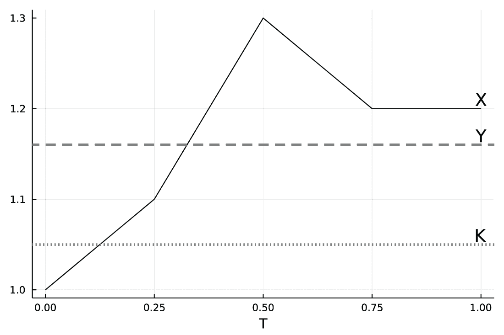
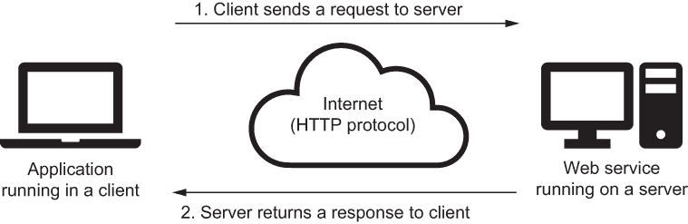
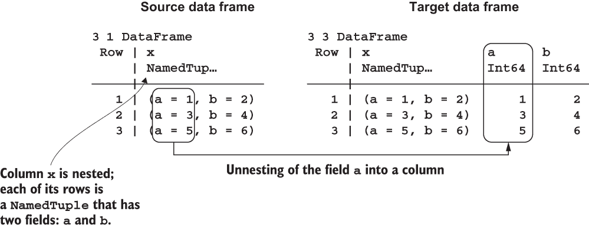

# 14 创建用于共享数据分析结果的 Web 服务

本章涵盖

+   实施蒙特卡洛模拟

+   在计算中使用多线程

+   在 Julia 中创建和运行 Web 服务

在第一章中，我们讨论了一个时间线案例研究。回想一下，时间线公司提供了一款帮助财务顾问进行退休财务规划的网络应用程序。该应用程序需要在快速响应时间的同时执行大量的按需计算。在本章中，我们将创建一个在简化设置中具有类似功能的 Web 服务。

假设我们正在一家为客户提供评估金融资产服务的公司工作。你被要求创建一个 Web 服务，用于对亚洲期权进行定价。*亚洲期权*是一种金融工具，其价格取决于一定时期内标的资产（例如，股票）的平均价格；在第 14.1 节中，我给出了该期权定义的详细信息。

由于亚洲期权是一种复杂的金融工具，其价值没有简单的公式。因此，您需要执行蒙特卡洛模拟来近似这个值。在进行蒙特卡洛模拟时，我们多次随机采样标的资产价格的变化。接下来，对于每条价格路径，我们计算亚洲期权的收益，并使用平均收益来近似期权的价值。

挑战在于蒙特卡洛模拟计算密集。因此，在本章中，您将学习如何利用 CPU 的多核，利用 Julia 对多线程的支持，尽可能快地产生所需的结果。

从工程角度来看，要求是您的 Web 服务接受 POST 请求中的 JSON 有效载荷，并返回 JSON 格式的响应。在这种情况下，POST 请求将数据发送到服务器，指定我们想要评估的亚洲期权的参数。这些参数以 JSON 格式传递到服务器；以这种方式传递的信息通常被称为*JSON 有效载荷*。您将通过使用 Genie.jl 包学习如何创建此类 Web 服务。

为了测试创建的 Web 服务，我们将编写一个客户端程序，该程序将分析亚洲期权的估值如何随着其参数的变化而变化。

本章分为以下几节：

+   第 14.1 节解释了使用蒙特卡洛模拟对亚洲期权进行定价的理论。

+   在第 14.2 节中，我们利用 Julia 提供的多线程支持来实现模拟。

+   在第 14.3 节中，我们使用 Genie.jl 包创建了一个可以响应对亚洲期权估值请求的 Web 服务。

+   在第 14.4 节中，我们通过编写一个客户端程序向创建的 Web 服务发送请求并获取返回的响应来测试该 Web 服务。

## 14.1 使用蒙特卡洛模拟对金融期权进行定价

在本节中，你将通过使用蒙特卡洛模拟来学习亚洲期权定价背后的理论。这类定价模型在金融行业中普遍使用，因此了解它们是如何工作的细节是有用的。我们的例子改编自 Barry L. Nelson 的《随机模拟的基础与方法》（Springer，2013 年）。

### 14.1.1 计算亚洲期权的收益定义

我们首先给出我们考虑的亚洲期权的定义。这种期权的收益取决于一个基础金融工具。假设这个基础工具是股票。我们在一定时间内观察这只股票的价格。如果股票的平均价格高于称为*行权价格*的值，亚洲期权会给投资者带来收益。在这种情况下，亚洲期权的收益等于股票的平均价格减去行权价格。现在我将正式定义收益是如何计算的。

假设一只股票在市场上交易。我们用 *X*(*t*) 表示它在时间 *t* 的价格。为了简单起见，假设我们目前处于时间 *t* = 0，因此我们知道股票的价格是 *X*(*0*)。我们感兴趣的是从 *t* = 0 到 *t* = *T* 这段时间内股票的平均价格。在这段时间内，股票的价格变化了 *m* 次。因此，我们将看到它在时间 0，*T*/*m*，2*T*/*m*，...，(*m* - 2)*T*/*m,*，(*m* - 1)*T*/*m,* 和 *T* 的价格。我们用 *Y* 表示在这些 *m* + 1 个时间点上的股票平均价格。

我们考虑的亚洲期权有其估值规则。在时间 *T*，我们计算股票 *Y* 的平均价格。如果这个值大于价值 *K*（称为*行权价格*），我们得到 *Y - K* 的收益；否则，我们得不到任何收益。更正式地说，我们的收益是 max(*Y - K*, 0)。如果你有机器学习的经验，你会认识到这个函数通常被称为*修正线性单元* (*ReLU*)。

在我们继续前进之前，让我们考虑这样一个定价的例子。假设我们有 *T* = 1.0，*m* = 4，和 *K* = 1.05。我们处于时间 *T*，我们看到了价格 *X* 为 1.0，1.1，1.3，1.2，1.2。因此，*Y* 等于 1.16，所以收益是 max(*Y - K*, 0) = 0.11。我们可以用以下代码可视化这个场景：

```
julia> using Plots

julia> using Statistics

julia> X = [1.0, 1.1, 1.3, 1.2, 1.2]
5-element Vector{Float64}:
 1.0
 1.1
 1.3
 1.2
 1.2

julia> T = 1.0
1.0

julia> m = 4
4

julia> Y = mean(X)
1.1600000000000001

julia> K = 1.05
1.05

julia> plot(range(0.0, T; length=m+1), X;
                  xlabel="T", legend=false, color="black")

julia> hline!([Y], color="gray", lw=3, ls=:dash)

julia> hline!([K], color="gray", lw=3, ls=:dot)

julia> annotate!([(T, Y + 0.01, "Y"),
                  (T, K + 0.01, "K"),
                  (T, X[end] + 0.01, "X")])
```

在这个例子中，我们使用了三个新的函数。范围函数创建一个从第一个到第二个位置参数的等间距值的向量，长度关键字参数指定我们想要的点的数量。hline! 函数向图中添加一条水平线，annotate! 函数向其添加文本注释。annotate! 函数接受一个向量，其中每个元素都是一个元组，指定了 *x* 位置，*y* 位置和要显示的文本。

图 14.1 显示了我们的代码产生的结果。



图 14.1 由于 Y 高于 K，亚洲期权对于股票价格 X 给出了正的收益。

### 14.1.2 计算亚洲期权的价值

我们的任务是计算亚洲期权在时间 0 的价值。在这个时候，我们不知道 *Y*。那么，我们亚洲期权的公平价值是什么？

假想我们能够多次购买这样的期权并观察我们期权所依据的股票价格的演变。我们期权的价值被定义为在这种实验中我们可能期望的平均收益。正式来说，使用概率论的语言，我们说我们想要通过 *E*(max(*Y - K*, 0)) 来计算我们收益的期望值。然而，我们需要考虑一个额外的因素。由于收益是在时间 *T* 收集的，而我们处于时间 0，我们需要对其进行折现。假设 *r* 是无风险利率，我们使用连续复利（这是金融计算中常见的假设；例如，参见 [`mng.bz/AV87`](http://mng.bz/AV87)）。因此，我们需要将收益的期望值乘以折现因子 exp(*-rT*)。总之，期权在时间 0 的价值是 exp(*-rT*)·*E*(max(*Y - K*, 0))。

计算所需价值的挑战在于，在时间 0，*Y* 的价值是未知的。我们将假设在 0 到 *T* 期间股票的价格遵循几何布朗运动（GBM，[`mng.bz/ZpRa`](http://mng.bz/ZpRa)）。这个随机过程常用于模拟金融资产的价格。

### 14.1.3 理解 GBM

通常，GBM 过程被介绍为随机微分方程的解，但就我们的目的而言，你只需要有一个直观的理解即可。其思路如下。如果我们有一个随机过程 *X*(*t*) 代表股票价格，我们希望这个价格在两个时间 *t*[1] 和 *t*[2]（其中 *t*[1] *< t*[2]）之间的比率的对数遵循正态分布。这个比率可以用公式 log(*X*(*t*[2])/*X*(*t*[1])) 表示，称为 *log return* ([`mng.bz/RvmO`](http://mng.bz/RvmO))。由于我们假设 log return 遵循正态分布，因此我们应该指定这个分布的均值和方差。

让我们从股票价格对数收益率的分布的方差开始。在 GBM 模型中，我们假设方差等于*s*²(*t*[2] - *t*[1])，其中*s*是一个参数。正如你所看到的，方差与*t*[2]和*t*[1]之间的差异成正比。为了理解为什么这是一个自然的假设，考虑三个时间段，*t*[1] *<* *t*[2] *<* *t*[3]。GBM 模型中的假设是，时间段*t*[1]和*t*[2]，以及*t*[2]和*t*[3]之间的对数收益率是独立的。观察 log(*X*(*t*[2])/*X*(*t*[1])) *+* log(*X*(*t*[3])/*X*(*t*[2])) = log(*X*(*t*[3])/*X*(*t*[1])). 因此，如果我们想让 GBM 模型保持一致，方程左边两个项的方差之和必须等于方程右边项的方差。确实如此，因为*s*²(*t*[2] - *t*[1]) *+ s*²(*t*[3] *- t*[2]) = *s*²*(t*[3] *- t*[1]*)*.

我们现在准备转向股票价格对数收益率的分布的期望值。在这里，我在书中提出的假设是，预期股票价格的对数收益率应该等于无风险资产的对数收益率。回想一下，我们用*r*来表示连续复利下的无风险利率。这意味着*r*(*t*[2] *- t*[1])应该等于 log(*E*(*X*(*t*[2]))/*E*(*X*(*t*[1]))). 可以证明，如果我们想使这个性质成立，股票价格对数收益率的分布的均值应该等于(*r - s*²/2)(*t*[2] *- t*[1])。

总结来说，在我们的几何布朗运动模型中，我们假设股票价格对数(*X*(*t*[2])/*X*(*t*[1]))的收益率服从均值为(*r - s*²/2)(*t*[2] *- t*[1])和标准差*s*²(*t*[3] *- t*[1])的正态分布。让我们将这个假设转换为我们实现中使用的参数化。回想一下，我们假设股票价格是在时间 0，*T*/*m*，2*T*/*m*，...，(*m - 2)T*/*m*，(*m - 1*)*T*/*m*，和*T*时测量的。在这些假设下，比率*X*((*I* + 1)*T*/*m*)/*X*(*iT*/*m*)的值是随机变量 exp((*r - s*²/2)*T*/*m* + *s*²(*T*/*m*)·*Z*(*i*))，其中*Z*(*0)*，*Z*(*1*)，...，*Z*(*m - 2)，*Z*(*m - 1*)是独立同分布的随机变量，具有均值为 0 和标准差 1 的正态分布。在这个公式中，*r*是无风险利率，*s*是股票价格变动的度量。

在我们继续前进之前，让我们看看生成 GBM 过程单个样本的最小示例。在计算中，我们使用*X*(0) = 1.0，*T* = 2.0，*s* = 0.2，*r* = 0.1，和*m* = 4。

在代码中，我们将 GBM 过程单个样本的模拟结果收集到一个具有两列的数据框中：模拟股票价格 X 和时间 t。然后，我们迭代地抽取股票价格在两个连续时间段之间的 log 返回值。使用它，我们计算更新的股票价格，并使用 push! 函数将其存储为 gbm 数据框的新行：

```
julia> using DataFrames

julia> using Random

julia> Random.seed!(1234);                                        ❶

julia> X0, T, s, r, m = 1.0, 2.0, 0.2, 0.1, 4                     ❷
(1.0, 2.0, 0.2, 0.1, 4)

julia> gbm = DataFrame(X=X0, t=0.0)                               ❸
1×2 DataFrame
 Row │ X        t       
     │ Float64  Float64 
─────┼─────────────────
   1 │     1.0      0.0

julia> for i in 1:m
           Z = randn()                                            ❹
           log_return = (r - s²/2) * T/m + s * sqrt(T/m) * Z     ❺
           next_X = gbm.X[end] * exp(log_return)                  ❻
           next_t = gbm.t[end] + T/m
           push!(gbm, (next_X, next_t))                           ❼
       end

julia> gbm
5×2 DataFrame
 Row │ X         t       
     │ Float64   Float64 
─────┼──────────────────
   1 │ 1.0           0.0
   2 │ 0.989186      0.5
   3 │ 1.20067       1.0
   4 │ 1.17768       1.5
   5 │ 1.35691       2.0
```

❶ 设置随机数生成器的种子以确保示例的可重复性

❷ 使用单个表达式为几个逗号分隔的变量赋值

❸ 初始化将存储模拟结果的 gbm 数据框

❹ 使用 randn 函数从标准正态分布中生成一个随机值

❺ 计算两个连续时间段之间股票价格的 log 返回值

❻ 根据最后存储的价格和 log 返回值计算下一期的股票价格

❼ 向数据框中添加一行，包含股票价格和记录时间的信息

在示例中，gbm 数据框中存储的股票价格在周期之间随机变化，因为在计算 log_return 变量时，我们有一个由 Z 变量表示的随机成分。

### 14.1.4 使用数值方法计算亚洲期权价值

描述 GBM 过程的公式看起来很复杂。这表明没有简单的方法可以让我们计算亚洲期权的价值；回想一下，这个价值被定义为 exp(*-rT*)·*E*(max(*Y - K*, 0))。实际上，在这种情况下，这个表达式的闭式公式不存在。我们应该如何计算它的值？我们将使用蒙特卡洛模拟来近似它。蒙特卡洛模拟的算法如下。

在我们的蒙特卡洛模拟的单个步骤中，我们需要为 GBM 过程的单个实现计算亚洲期权的收益。因此，我们需要执行以下操作：

1.  从标准正态分布中独立抽取随机值 *Z*(0), *Z*(1), . . . , *Z*(*m* - 2), *Z*(*m* - 1)。

1.  使用生成的随机值计算股票价格 *X*(0), *X*(*T*/*m*), . . . , *X*((*m -* 1)/*T*), *X*(*T*)。

1.  将 *Y* 计算为计算出的股票价格的平均值。

1.  计算 *V* = exp(*-rT*)·max(*Y - K*, 0)。

在我们的蒙特卡洛模拟中，我们独立重复这个过程很多次。用 *n* 表示执行此单个步骤的次数。因此，我们将收集 *n* 个值 *V*(1), *V*(2), . . . , *V*(*n* - 1), *V*(*n*)。这些值的平均值近似于我们的亚洲期权价值 exp(*-rT*)·*E*(max(*Y - K*, 0))。然而，由于我描述的过程是随机的，这个值不是精确的。在这种情况下，我们通常希望以某种方式量化这种不确定性。因此，我们将计算亚洲期权价格的 95% 置信区间。

95%置信区间是一个范围，如果我们运行模拟并多次计算，95%的区间将包含我们亚洲期权价格的真实（未知）值（[www.simplypsychology.org/confidence-interval.html](https://www.simplypsychology.org/confidence-interval.html)）。如果我们有一组 *n* 个独立的观察值，其均值为 *m*，标准差为 *sd*，那么我们将使用以下公式在本章中近似 95%置信区间：[*m - 1.96sd*/√*n, m* + 1.96*sd*/√*n*]。

在我们继续实现亚洲期权估值算法之前，我将总结我们需要知道以计算我们考虑的亚洲期权价值所需的参数：

+   时间范围 *T*

+   股票的起始价格 *X*(0)

+   执行价格 *K*

+   无风险利率 *r*

+   股票价格波动率 *s*

+   股票价格变动次数 *m*

我们假设请求亚洲期权估值用户知道这些参数。

另一个技术参数是 *n*，它是模拟重复的次数。这个参数将影响我们计算亚洲期权价格时的精度。

我们准备编写代码来计算亚洲期权的近似价值及其 95%置信区间。此外，在我们的实现中，我们还想确定期权收益为零的概率。

## 14.2 实现期权定价模拟器

在本节中，你将学习如何实现根据 14.1 节最后部分描述来定价亚洲期权的模拟器。首先，我们将创建一个函数，用于计算单个股票价格样本下我们期权的收益。接下来，我们将创建一个函数，通过蒙特卡洛模拟来计算期权的近似价格。

在此过程中，我们将使用多线程，以便我们可以快速获得计算结果。学习如何编写多线程代码是有用的，因为它可以有效地使用你的 CPU 核心，从而更快地提供计算结果。

### 14.2.1 使用多线程支持的 Julia 启动

在本节中，你将学习如何以多线程支持的方式启动 Julia。当你想要在计算中使用 CPU 的全部能力时，这非常有用。

在我们的计算中，我们希望使用多个线程，因此以四个线程的支持启动 Julia。这是通过传递-t4 开关来完成的。如果你在终端工作，你应该在我们存储与本书相关的代码存储库的目录中。输入以下内容：

```
julia --project -t4
```

如果你使用 Visual Studio Code（见附录 A），你可以在 Julia 扩展的设置中设置 Julia 会话应使用的线程数。

我假设您电脑上的处理器至少有四个物理核心。如果您的处理器不符合这一要求，代码仍然可以运行，但您可能看不到我展示的性能提升。

一旦您使用四个线程启动 Julia 会话，我们首先检查是否正确设置了环境。Threads.nthreads 函数返回 Julia 进程可用的线程数：

```
julia> Threads.nthreads()
4
```

如预期，我们得到 4，这意味着支持多线程的代码将能够使用您 CPU 的四个核心。

启动 Julia

在启动 Julia 进程时，您可以选择多个选项。您可以通过在终端中输入 julia --help 来获取这些选项的列表，或者检查 Julia 手册中的“命令行选项”部分（[`mng.bz/2r7m`](https://shortener.manning.com/2r7m)）。

这里是一个可用的开关列表：

+   -tN，*其中 N 是数字*—设置 Julia 使用的线程数为 N。在 Visual Studio Code 中，您可以在 Julia 扩展的设置中设置 N 的值。

+   --project—将当前工作目录设置为家目录项目（参见附录 A 的解释）。如果您使用终端，在启动 Julia 时，对于本书中展示的所有代码，您应该使用此选项。在 Visual Studio Code 中，如果您之前已经启动了一个 Julia 会话并且打开了一个包含 Project.toml 和 Manifest.toml 文件的代码仓库目录，则此选项默认使用。

+   -pN，*其中 N 是数字*—设置 Julia 应在此计算机上启动的额外 worker 进程数。（此选项用于分布式计算。本书中不讨论此主题；有关详细信息，请参阅 Julia 手册中的“多进程和分布式计算”部分[`mng.bz/19Jn`](http://mng.bz/19Jn)）。

+   --machine-file <文件>—在<文件>中列出的主机上启动额外的 worker 进程。（此选项用于分布式计算。本书中不讨论此主题；有关详细信息，请参阅 Julia 手册中的“多进程和分布式计算”部分[`mng.bz/19Jn`](http://mng.bz/19Jn)）。

+   --depwarn={yes│no│error}—决定 Julia 是否应打印弃用警告（通常在您使用某些已弃用且可能在未来被删除或更改的功能时发出）。默认情况下，不打印弃用警告；如果此选项设置为 error，则所有弃用都转换为错误。

+   -ON，*其中 N 是 0 到 3 之间的数字*—设置编译器的优化级别。默认值为 2（优化级别越高，编译器执行的优化越多）。

### 14.2.2 计算单个股票价格样本的期权收益

在本节中，我们将实现一个函数，用于计算本章中考虑的亚洲期权的收益，针对单个股票价格样本。我们还将检查是否可以使用多个线程来加快计算该收益的代码的执行速度。

我们的代码直接遵循第 14.1 节中提出的规范。在 X 变量中，我们保持股票的当前价格，而在 sumX 变量中，我们保持所有观察到的股票价格的总和。我们更新 X 和 sumX 变量 m 次。X 变量被迭代地乘以 exp((*r - s*²/2)*T*/*m + s*²(*T*/*m*)*Z*(*i*))表达式的样本。回想一下，*Z*(*i*)是均值为 0，标准差为 1 的正态分布。我们可以在 Julia 中使用 randn 函数来采样这个值。列表 14.1 展示了计算一个股票价格轨迹样本的期权收益的 payoff_asian_sample 函数的完整实现。

注意在列表 14.1 中，我在 payoff_asian_sample(T, X0, K, r, s, m)签名后添加了::Float64 类型注释。这样，我确保这个函数的返回值被转换为 Float64 值。换句话说，这个函数总是返回一个具有 Float64 类型的数字。

此注释是可选的，但有时很有用。首先，它明确地传达了函数开发者的意图，因此作为文档很有用。其次，如果我们错误地尝试从这个函数返回一个无法转换为 Float64 的值，我们会得到一个错误，这将使我们能够更快地捕获潜在的 bug。最后，既然我们知道这个函数返回 Float64，那么在某些情况下，使用这个函数编写的代码可以稍微简单一些。例如，当我们想要预分配一个将存储产生的值的集合时，我们可以安全地将它的元素类型声明为 Float64。

列表 14.1 计算亚洲期权的价格轨迹样本的收益

```
function payoff_asian_sample(T, X0, K, r, s, m)::Float64
    X = X0                                                     ❶
    sumX = X                                                   ❷
    d = T / m                                                  ❸
    for i in 1:m
        X *= exp((r - s² / 2) * d + s * sqrt(d) * randn())    ❹
        sumX += X
    end
    Y = sumX / (m + 1)                                         ❺
    return exp(-r * T) * max(Y - K, 0)
end
```

❶ X 变量跟踪当前股票价格。

❷ sumX 变量累积所有观察到的股票价格的总和。

❸ d 变量具有等于股票价格测量时间差的值。

❹ 通过使用根据 GBM 公式计算的日志回报来改变股票价格

❺ Y 变量存储了考虑期间的平均股票价格。

执行 payoff_asian_sample 函数涉及随机数生成，因此多次运行它会产生不同的结果。例如，让我们检查 T=1.0，X0=50.0，K=55.0，r=0.05，s=0.3 和 m=200 的参数：

```
julia> payoff_asian_sample(1.0, 50.0, 55.0, 0.05, 0.3, 200)
0.0

julia> payoff_asian_sample(1.0, 50.0, 55.0, 0.05, 0.3, 200)
1.3277342904015152

julia> payoff_asian_sample(1.0, 50.0, 55.0, 0.05, 0.3, 200)
4.645749241587061
```

如果你运行这个示例，预期会得到不同的结果，因为我们没有设置随机数生成器的种子。

如第 14.1 节所述，我们想要多次运行 payoff_asian_sample 来近似亚洲期权的价值。为了这个示例的目的，我们基准测试了运行这个函数 10,000 次所需的时间，并将结果收集在一个新分配的向量中：

```
julia> using BenchmarkTools

julia> @btime map(i -> payoff_asian_sample(1.0, 50.0, 55.0, 0.05, 0.3, 200),
                  1:10_000);
  21.783 ms (2 allocations: 78.17 KiB)
```

我们能否使这个模拟更快？我们可以，其中一种方法就是使用多线程。我们将使用 ThreadsX.jl 包中的 map 函数。这是一个 map 函数的多线程版本，它将生成多个*任务*（非正式地说，是可独立执行的代码部分），这些任务将并行运行以使用 Julia 会话中可用的所有线程：

```
julia> using ThreadsX

julia> @btime ThreadsX.map(i -> payoff_asian_sample(1.0, 50.0, 55.0, 0.05,
                           0.3, 200), 1:10_000);
  5.821 ms (413 allocations: 845.89 KiB)
```

我们的代码运行速度几乎快了四倍，因此在这种情况下使用多线程是合理的。

经验丰富的程序员会注意到，当我们开始使用 map 函数的并行化版本时，需要考虑一个问题。payoff_asian_sample 函数在调用 randn 函数时使用随机数生成器。因此，问题是是否安全地在并行中运行此函数，因为它可能导致竞争条件([`mng.bz/PoRv`](http://mng.bz/PoRv))，因为当我们生成伪随机数时，我们会更新它们的生成器的内部状态。答案是代码是正确的，因为 Julia 中的每个任务都使用随机数生成器的单独实例，所以任务之间不会相互干扰。

ThreadsX.jl 包

ThreadsX.jl 包提供了 Base Julia 中可用函数的并行化版本。以下是一个实现所选函数的列表：any、all、map、prod、reduce、collect、sort、minimum、maximum、sum 和 unique。更多详细信息请参阅包文档([`github.com/tkf/ThreadsX.jl`](https://github.com/tkf/ThreadsX.jl))。

记住，当使用可以接受函数作为参数的函数时，我们必须确保使用它们不会导致竞争条件错误。

作为更高级的主题，值得补充的是，在 ThreadsX.jl 包中定义的函数旨在支持即使在使用不同数量的线程的会话中，产生的结果的可重复性。为了确保这种可重复性，请使用 basesize 关键字参数来指定每个任务中要处理的输入元素数量。

### 14.2.3 计算期权价值

在本节中，我们将实现一个近似亚洲期权价值的函数。此外，它将通过计算价值的 95%置信区间来返回结果的不确定性评估，并计算期权给出零收益的概率。

实现执行亚洲期权估值的函数

回想一下第 14.1 节，为了近似亚洲期权的价值，我们将使用蒙特卡洛模拟。因此，我们需要多次运行第 14.1 节中定义的 payoff_asian_sample 函数。但我们应该运行多少次呢？在本节中，我们将使用以下方法。我们不会指定第 14.1 节公式中给出的重复次数*n*，而是允许用户指定模拟允许运行的时间，我们将在此时间预算内计算尽可能多的重复次数。

我们之所以倾向于设置计算时间限制，是因为我们稍后将在一个网络服务中使用这个函数，我们希望能够控制网络服务的响应时间，以确保潜在的用户不需要等待很长时间才能得到结果。回想一下，在第一章的 Timeline 案例研究中，网络应用响应的长时间等待是公司决定转向 Julia 的原因之一。

为了控制最大计算时间，我们将使用 `ThreadsX.map` 函数以每批 10,000 个元素的方式运行 `payoff_asian_sample` 函数，就像我们在第 14.2.2 节中所做的那样，直到达到用户指定的计算时间。我们将反复将 `ThreadsX.map` 函数的结果追加到单个结果集合中。在完成第 14.1 节中给出的公式计算后，我们将计算期权的近似价值、价格的 95% 置信区间以及期权产生零收益的概率。这些步骤在以下列表中的 `asian_value` 函数中实现。

列表 14.2 近似亚洲期权价值的函数

```
using Statistics

function asian_value(T, X0, K, r, s, m, max_time)
    result = Float64[]                                                    ❶
    start_time = time()                                                   ❷
    while time() - start_time < max_time                                  ❸
        append!(result, ThreadsX.map(i -> payoff_asian_sample(T, X0, K,   ❸
                                                              r, s, m),   ❸
                                     1:10_000))                           ❸
    end
    n = length(result)
    mv = mean(result)
    sdv = std(result)
    lo95 = mv - 1.96 * sdv / sqrt(n)
    hi95 = mv + 1.96 * sdv / sqrt(n)
    zero = mean(==(0), result)                                            ❹
    return (; n, mv, lo95, hi95, zero)                                    ❺
end
```

❶ 结果变量存储了以 10,000 个元素批次计算的模拟收益。

❷ 记录开始模拟的时间

❸ 在不超过 `max_time` 计算时间的情况下，添加一个包含 10,000 个元素的模拟收益批次

❹ `(0)` 语法是 `x -> x == 0` 匿名函数的简写。

❺ `(; n, mv, lo95, hi95, zero)` 语法是 `(n=n, mv=mv, lo95=lo95, hi95=hi95, zero=zero)` 的简写。

传递给 `asian_value` 函数的 `max_time` 参数应以秒为单位给出。在函数中，我们使用 `time` 函数获取以秒为单位的当前时间。这个测量具有微秒分辨率。特别是，`time() - start_time` 表达式测量自函数体中存在的 `while` 循环开始以来的时间，以秒为单位。

在 `while` 循环中，我们以每批 10,000 个元素的方式计算亚洲期权的模拟收益。我们知道，根据第 14.2 节，使用四个线程计算每个批次大约需要 5 毫秒。我们通过使用 `append!` 函数将 10,000 个元素的批次追加到结果向量中。

循环结束后，我们使用第 14.1 节中的公式计算以下统计数据：平均收益、其 95% 置信区间以及收益为 0 的概率。

在 `mean(==(0), result)` 表达式中，我们使用了在第四章中为求和函数学习的相同模式。均值函数接受一个函数作为其第一个参数，一个集合作为其第二个参数。然后它通过传递的函数转换这些集合中存储的值，有效地计算这些值的均值。以下是一个此模式应用的简单示例：

```
julia> mean(x -> x ^ 2, 1:5)
11.0
```

操作的结果是 11.0，因为我们计算了从 1 到 5 的整数的平方的平均值——即 `(1² + 2² + 3² + 4² + 5²) / 5`。

使用部分函数应用语法

另一个需要注意的表达式是`==(0)`。你知道，通常，`==`运算符需要两个参数并检查它们的相等性。`==(0)`是一个*部分函数应用*操作([`mng.bz/JVda`](http://mng.bz/JVda))。它将`==`操作右侧固定为等于 0。

`==(0)`的结果是一个期望一个参数并通过使用`==`运算符将其与 0 进行比较的函数。因此，你可以将`==(0)`视为等同于定义一个匿名函数`x -> x == 0`，该函数将操作右侧固定为 0。以下是一个使用由`==(0)`返回的函数的示例：

```
julia> eq0 = ==(0)
(::Base.Fix2{typeof(==), Int64}) (generic function with 1 method)

julia> eq0(1)
false

julia> eq0(0)
true
```

支持部分函数应用的运算

部分函数应用相当方便，因为它与使用匿名函数相比，使代码更易于阅读。

此外，重复定义匿名函数每次都会创建一个新的函数，这需要每次编译（这是一个更高级的话题）。另一方面，部分函数应用只创建一次定义，因此从编译延迟的角度来看也是首选的。

因此，除了`==`之外，常见的运算符如`>`, `>=`, `<`, `<=`, 和 `isequal` 也支持部分函数应用模式。

练习 14.1 使用`@time`宏，比较使用`<(0)`和`x -> x < 0`函数将值范围-10⁶:10⁶ 转换后的平均值计算时间。同时检查预定义`lt0(x) = x < 0`函数时的计时。运行每个操作三次。

使用创建命名元组的便捷语法

你在列表 14.2 中学习到的最后一个新元素是一种简化从变量创建命名元组的符号。如果你在括号中放入一个分号 (;) 后跟一个以逗号分隔的变量列表，Julia 会创建一个命名元组，其字段名称是你使用的变量的名称，其值是这些变量的值。以下是一个示例：

```
julia> val1 = 10
10

julia> val2 = "x"
"x"

julia> (; val1, val2)
(val1 = 10, val2 = "x")
```

结果等同于编写`(val1=val1, val2=val2)`，但更短，更方便输入和阅读。当你想从一个函数中返回一个命名元组并想存储一些在这个函数内部计算过的变量时，通常使用这种模式。这就是我们在`asian_value`函数中所做的。

测试亚洲期权估值函数

在我们继续前进之前，让我们测试一下我们的`asian_value`函数，给它 0.25 秒的计算时间，并保持所有其他参数与第 14.2.2 节测试中的值相同：

```
julia> @time asian_value(1.0, 50.0, 55.0, 0.05, 0.3, 200, 0.25)
  0.253619 seconds (19.76 k allocations: 30.483 MiB, 3.05% gc time,
                    18.78% compilation time)
(n = 300000, mv = 2.02427932454885, lo95 = 2.008366009684488,
 hi95 = 2.040192639413212, zero = 0.6931733333333333)

julia> @time asian_value(1.0, 50.0, 55.0, 0.05, 0.3, 200, 0.25)
  0.255105 seconds (17.30 k allocations: 39.226 MiB)
(n = 410000, mv = 2.026794692695957, lo95 = 2.01310815351485,
 hi95 = 2.0404812318770635, zero = 0.6940609756097561)

julia> @time asian_value(1.0, 50.0, 55.0, 0.05, 0.3, 200, 0.25)
  0.252337 seconds (16.89 k allocations: 38.398 MiB)
(n = 370000, mv = 2.0317793342921395, lo95 = 2.0173863909563443,
 hi95 = 2.0461722776279347, zero = 0.6943594594594594)
```

每次函数执行时间略超过 0.25 秒。第一次运行时，它能够运行 300,000 步的模拟，而第二次和第三次运行时，分别运行 410,000 步和 370,000 步。这种差异发生是因为在第一次运行期间，Julia 还需要执行代码的编译。

从计算的角度来看，请注意，所有三次模拟运行获得的结果相似。在 0.25 秒的时间预算下，95%置信区间的宽度大约为 0.03。为了本章的目的，让我们假设这从最终用户的角度来看是可以接受的。

Julia 中的多线程

在本节中，你学习了 ThreadsX.jl 包，它提供了一个高级 API，允许你通过使用多个线程方便地执行典型操作。

Julia 的基础库也包含一个 Threads 模块，该模块提供了一个低级 API，允许你编写多线程代码。这个 API 的关键元素是 Threads.@spawn 宏([`mng.bz/wyja`](http://mng.bz/wyja))，它创建一个任务并将其调度到可用的线程上。Threads 模块还允许你使用锁([`mng.bz/qoj6`](http://mng.bz/qoj6))，这可以帮助你避免竞态条件问题，并支持原子操作([`mng.bz/5mo8`](http://mng.bz/5mo8))，这些操作是线程安全的。

许多 Julia 包都利用了多线程。例如，DataFrames.jl 中的一些选定的昂贵操作可以利用多个线程。你可以查看包文档以获取列表([`mng.bz/69np`](http://mng.bz/69np))。

你可以在 Julia 手册的“多线程”部分找到关于 Threads 模块功能更详细的信息([`mng.bz/o5ry`](http://mng.bz/o5ry))。

## 14.3 创建一个提供亚洲期权估值的 Web 服务

在本节中，我们将构建一个 Web 服务，它将允许我们通过超文本传输协议（HTTP）提供亚洲期权估值。对于那些想要复习的人，请参阅 MDN Web 文档网站上的“HTTP 概述”([`mng.bz/ne1V`](http://mng.bz/ne1V))。

Web 服务目前是允许应用程序交换消息的最流行方法之一。当云计算变得流行时，它们的使用变得特别广泛，因为它们允许通过网络在软件程序之间进行通信，而不管创建它们的编程语言或运行它们的平台是什么。

### 14.3.1 构建 Web 服务的一般方法

我们希望 Web 服务能够这样工作。假设你有一个客户端应用程序和一个运行在服务器上的 Web 服务。我们希望客户端应用程序能够向服务器发送请求，请求亚洲期权的价格。作为回应，服务器返回计算出的价格信息。通信通过互联网，使用 HTTP 协议完成。图 14.2 展示了这个过程的高级视图。



图 14.2 客户端应用程序与服务器上运行的 Web 服务之间的通信是通过 HTTP 完成的。

客户端如何向服务器发送请求？在本节中，我将向您展示如何在 Julia 中使用 HTTP 的 POST 方法执行此操作。要发送此类请求，我们需要传递以下内容：

+   我们想要发送请求的地址。在本章中，我们将使用 http://127.0.0.1:8000，这是 Genie.jl 的默认设置，指的是当前设备（称为 *本地主机*）和端口号 8000。

+   请求头（请求元数据）。

+   请求体（请求数据）。

我们希望我们的网络服务能够接受以 JSON 格式发送数据的请求。（我们在第七章中讨论了 JSON 格式。）请求的格式应允许客户端传递我们感兴趣的亚洲期权的参数。为了简化，在 14.1 节中讨论的所有参数中，我们将允许用户传递执行价格 *K* 的值。我们还将发送一个额外的技术参数，即服务器在返回响应之前允许处理请求的时间。要向网络服务发送此类查询，我们需要在请求头中设置 Content-Type 元数据为 application/json。请求体应该是 JSON 格式的数据，指定 *K* 的值和期望的响应时间。

作为响应，网络服务应返回第 14.2 节中定义的 asian_value 函数产生的值——即使用的蒙特卡洛样本数量、亚洲期权价格的近似值、该价格的 95% 置信区间以及期权价值为零的概率。所有这些值也应使用 JSON 格式发送。我们已经在第七章中处理过这种响应类型。

要创建网络服务，我们将使用 Genie.jl 包。这个全栈式网络框架拥有开发网络应用程序所需的所有组件。在本节中，我将使用 Genie.jl 的有限和简化功能集。如果您想了解更多关于这个包的信息，请查看其文档([`mng.bz/qomJ`](http://mng.bz/qomJ))。

Julia 中的网络开发

在本章中，我们只想构建网络服务。然而，通常 Julia 提供了构建生产级网络应用程序所需的全套工具。Genie 框架的三个关键组件如下：

+   *Genie.jl*—一个具有灵活请求路由器、WebSocket 支持、模板和身份验证等功能的网络框架

+   *SearchLight.jl*—提供对象关系映射（ORM；[www.altexsoft.com/blog/object-relational-mapping/](https://www.altexsoft.com/blog/object-relational-mapping/)) 层，允许您连接到 PostgreSQL、MySQL 和 SQLite 数据库

+   *Stipple.jl*—一个用于构建交互式数据应用的响应式 UI 库

如果您想了解更多关于 Genie 框架的信息，请访问 [`genieframework.com`](https://genieframework.com/)。

### 14.3.2 使用 Genie.jl 创建网络服务

要设置一个简单的网络服务，请按照以下步骤操作：

1.  加载 Genie.jl 包。

1.  将 Genie.config.run_as_server 设置为 true，以便稍后 Genie.jl 服务器将同步启动；Julia 进程将仅在服务器启动后处理服务器操作。可见的效果是，用于启动服务器的 Genie.Server.up 函数将不会返回。

1.  定义一个 URL 与应调用的 Julia 函数之间的映射，以便在接收到请求时将响应发送回客户端。这是通过使用 Genie.Router.route 函数实现的。

1.  通过调用 Genie.Server.up()启动服务器。

此过程的一个关键要素是理解如何定义处理 POST 请求的函数。在本节中，我们希望我们的网络服务接受 JSON POST 有效负载；我们希望允许我们的网络服务的客户端在请求体中发送 JSON 格式的数据。我们还希望生成的响应以 JSON 格式呈现。

要处理 application/json POST 请求，请使用 Genie.Requests.jsonpayload 函数。然后您可以索引返回的对象以获取其字段。如果解析 JSON 失败，Genie.Requests.jsonpayload 返回 nothing。

要生成具有 application/json 内容类型的响应，请使用 Genie.Renderer.Json.json 函数。我们将传递 NamedTuple 值给它，因为它方便地将 JSON 转换为消息体，并添加适当的消息头。以下是一个示例：

```
julia> using Genie

julia> Genie.Renderer.Json.json((firstname="Bogumił", lastname="Kamiński"))
HTTP.Messages.Response:
"""
HTTP/1.1 200 OK
Content-Type: application/json; charset=utf-8

{"firstname":"Bogumił","lastname":"Kamiński"}"""
```

我们现在已经知道了一切，可以创建一个网络服务。我已经将其代码放在 GitHub 仓库中单独的 ch14_server.jl 文件中。网络服务的代码在列表 14.3 中给出。唯一的新部分是网络服务的处理。payoff_asian_sample 和 asian_value 函数与我们第 14.2 节中定义的相同。

在代码中，我们为根("/")设置了一个接受 POST 有效负载的路由。我们使用 Genie.jl 的默认设置，因此我们可以向地址 http://127.0.0.1:8000 发送 POST 请求。对于此路由，我们首先将接收到的 JSON 有效负载存储在 message 变量中。然后我们有一个 try-catch-end 块，它尝试从 message 中获取数据并将其传递给 asian_value 函数。请注意，为了简单起见，我假设我们的网络服务只接受 asian_value 函数的 K 和 max_time 参数。

我们使用 float 函数确保 K 和 max_time 在传递给 asian_value 时都是浮点数。如果获取 JSON 请求和运行模拟的过程成功，我们将返回一个具有 OK 状态的消息和 asian_value 函数返回的值。如果发生任何错误（例如，参数 K 未传递或不是数字），将引发异常，并在块的 catch 部分返回 ERROR 状态和空字符串作为值。

列表 14.3 创建亚洲期权定价网络服务

```
using Genie
using Statistics
using ThreadsX

function payoff_asian_sample(T, X0, K, r, s, m)::Float64
    X = X0
    sumX = X
    d = T / m
    for i in 1:m
        X *= exp((r - s² / 2) * d + s * sqrt(d) * randn())
        sumX += X
    end
    Y = sumX / (m + 1)
    return exp(-r * T) * max(Y - K, 0)
end

function asian_value(T, X0, K, r, s, m, max_time)
    result = Float64[]
    start_time = time()
    while time() - start_time < max_time
        append!(result,
                ThreadsX.map(i -> payoff_asian_sample(T, X0, K, r, s, m),
                             1:10_000))
    end
    n = length(result)
    mv = mean(result)
    sdv = std(result)
    lo95 = mv - 1.96 * sdv / sqrt(n)
    hi95 = mv + 1.96 * sdv / sqrt(n)
    zero = mean(==(0), result)
    return (; n, mv, lo95, hi95, zero)
end

Genie.config.run_as_server = true                                  ❶

Genie.Router.route("/", method=POST) do                            ❷
  message = Genie.Requests.jsonpayload()                           ❸
  return try
      K = float(message["K"])                                      ❹
      max_time = float(message["max_time"])                        ❹
      value = asian_value(1.0, 50.0, K, 0.05, 0.3, 200, max_time)  ❹
      Genie.Renderer.Json.json((status="OK", value=value))         ❹
  catch                                                            ❹
      Genie.Renderer.Json.json((status="ERROR", value=""))         ❹
  end
end

Genie.Server.up()                                                  ❺
```

❶ 配置 Genie.jl 以同步启动网络服务

❷ 使用 do-end 块定义一个匿名函数，该函数将在用户将 POST 请求传递到 Web 服务提供的地址根时被调用

❸ 解析在 POST 请求中发送的 JSON 有效负载

❹ 尝试获取参数并计算亚洲期权的估值；在成功时返回 OK 状态和值，否则返回 ERROR 状态

❺ 启动 Web 服务

### 14.3.3 运行 Web 服务

我们现在准备好启动我们的 Web 服务。打开一个新的终端窗口，切换到您已克隆 GitHub 存储库的文件夹，并运行 julia --project -t4 ch14_server.jl 命令。您应该看到以下输出：

```
$ julia --project -t4 ch14_server.jl
┌ Info:
└ Web Server starting at http://127.0.0.1:8000 - press Ctrl/Cmd+C to stop
  the server.
```

现在我们有一个正在运行的服务器，因此我们可以连接到它。请注意，我们使用-t4 开关启动了四个线程。不要关闭此终端窗口。

在我们继续之前，让我添加一条注释。在 14.3 列表中，当我们收到一个错误的请求时，我们仍然通过使用 Genie.Renderer.Json.json((status="ERROR", value=""))表达式向客户端发送带有 200 OK 状态的响应。处理这种情况的另一种方法是将 400 Bad Request 响应返回。如果您希望以这个状态码响应，您应该在 14.3 列表的 catch 部分放置 Genie.Responses.setstatus(400)表达式。如果您想了解更多关于 HTTP 状态码的信息，您可以查看“HTTP 状态码注册表”页面([`mng.bz/4965`](http://mng.bz/4965))。

## 14.4 使用亚洲期权定价 Web 服务

在本节中，您将学习如何向 Web 服务发送请求并解析收到的响应。学习如何做这件事是有用的，因为您的程序通常会需要使用第三方 Web 服务。为此，我们将使用您在第七章中了解到的 HTTP.jl 和 JSON3.jl 包。

例如，我们将检查在保持所有其他参数在 14.3 节中固定的值的情况下，我们的亚洲期权价值如何随着执行价格*K*在 30 到 80 之间的变化而变化。本节组织如下：

1.  我们首先讨论如何向我们的 Web 服务发送单个 POST 请求。

1.  我们在一个数据框中收集多个 POST 请求的结果。

1.  收集到的结果具有复杂的结构，其中一列存储多个值。我们将每个列展开成多个列，以便于处理数据。

1.  我们可视化计算结果，以验证提高执行价格*K*会降低我们的亚洲期权价值，并增加它给出零收益的概率。

### 14.4.1 向 Web 服务发送单个请求

启动一个新的 Julia 会话（记住不要终止我们运行 Web 服务的会话）。

我们首先发送一个 POST 请求到我们的网络服务。回想一下，它位于 http://127.0.0.1:8000。让我们获取 K=55.0 和 max_time=0.25 的响应，因为这些值我们在第 14.2 节中已经使用过。从高层次上讲，图 14.2 展示了我们的客户端和网络服务之间的通信过程：

```
julia> using HTTP

julia> using JSON3

julia> req = HTTP.post("http://127.0.0.1:8000",
                       ["Content-Type" => "application/json"],
                       JSON3.write((K=55.0, max_time=0.25)))
HTTP.Messages.Response:
"""
HTTP/1.1 200 OK
Content-Type: application/json; charset=utf-8
Server: Genie/Julia/1.7.2
Transfer-Encoding: chunked

{"status":"OK","value":{"n":190000,"mv":2.05363436780124,
"lo95":2.033372995802685,"hi95":2.0738957397997946,
"zero":0.6927631578947369}}"""

julia> JSON3.read(req.body)
JSON3.Object{Vector{UInt8}, Vector{UInt64}} with 2 entries:
  :status => "OK"
  :value  => {...
```

我们已经在第七章中使用了 JSON3.read 函数，并且知道它可以解析 JSON 数据到 JSON 对象中，从而我们可以从中获取数据。JSON3.write 函数，我们在代码中也使用，执行一个相反的操作。它接受一个 Julia 对象并将其转换为 JSON 格式的字符串。让我们看看 JSON3.write((K=55.0, max_time=0.25))会产生什么，以确保它确实是正确格式的 JSON 数据：

```
julia> JSON3.write((K=55.0, max_time=0.25))
"{\"K\":55.0,\"max_time\":0.25}"
```

我们还没有使用 HTTP.post，因为在第七章中我们使用了 HTTP.get 函数。它们之间的区别如下。当你想要发送 POST 请求时，你使用 HTTP.post 函数，当你想要发送 GET 请求时，你使用 HTTP.get。我们的网络服务期望 POST 请求，因为我们需要向它传递 JSON 数据，称为*JSON 有效负载*（GET 请求不支持在请求有效负载中发送数据）。你可以在 W3Schools 网站上找到各种 HTTP 请求方法的概述([www.w3schools.com/tags/ref_httpmethods.asp](https://www.w3schools.com/tags/ref_httpmethods.asp))。

在 HTTP.post 方法中，我们传递以下参数：

+   我们想要查询的 URL（在我们的例子中是 http://127.0.0.1:8000）。

+   标头元数据。由于我们的内容是 application/json，我们传递了"Content-Type" => "application/json"这对；它被封装在一个向量中，因为我们可能还想在标头中传递更多的元数据。

+   请求的主体，它是 JSON 格式的。

现在暂时切换到运行我们网络服务的终端。你会注意到那里打印了一条消息，显示 POST 请求已被成功处理：

```
:
[ Info: POST / 200
```

现在检查一下，如果我们向网络服务发送一个不正确的请求会发生什么：

```
julia> HTTP.post("http://127.0.0.1:8000",
                 ["Content-Type" => "application/json"],
                 JSON3.write((K="", max_time=0.25)))
HTTP.Messages.Response:
"""
HTTP/1.1 200 OK
Content-Type: application/json; charset=utf-8
Server: Genie/Julia/1.7.2
Transfer-Encoding: chunked

{"status":"ERROR","value":""}"""
```

这次，由于我们将 K 参数作为空字符串而不是数字发送，我们得到了状态中的 ERROR 和一个空字符串作为值。因此，我们的网络服务中的错误处理似乎工作正常。

练习 14.2 创建一个接受包含单个元素 n 的 JSON 有效负载的网络服务，该元素是一个整数。它应该返回一个使用 rand 函数生成的 n 个随机数的向量，格式为 JSON。如果传递的请求不正确，应生成 400 Bad Request 响应。在您的本地计算机上运行此 Web 服务器，并测试它是否按预期工作。

### 14.4.2 在数据框中收集来自网络服务的多个请求的响应

现在我们可以收集 K 从 30 变到 80 时我们的亚洲期权的估值。在下面的代码中，我们首先创建一个数据框，其中每一行存储我们想要检查的 K 的值。此外，在这个数据框中，我们存储我们想要使用的 max_time（在示例中，它被固定为等于 0.25）。

接下来，对于数据框的每一行，我们运行本节讨论的 HTTP.post 函数。为了实现这一点，我们使用 map 函数，将数据框的 K 和 max_time 列作为我们想要迭代的集合传递。我们将从网络服务获取的结果存储在 data 列中。由于获取结果的过程耗时较长，我们使用@show K 宏调用打印我们正在处理的 K 的值。这样，我们可以轻松地观察计算进度。此外，我们打印网络服务生成响应的时间，以确认它确实大约为 0.25 秒：

```
julia> using DataFrames

julia> df = DataFrame(K=30:2:80, max_time=0.25)           ❶
26×2 DataFrame
 Row │ K      max_time
     │ Int64  Float64
─────┼─────────────────
   1 │    30      0.25
   2 │    32      0.25
   3 │    34      0.25
  :  │   :       :
  24 │    76      0.25
  25 │    78      0.25
  26 │    80      0.25
        20 rows omitted

julia> df.data = map(df.K, df.max_time) do K, max_time    ❷
           @show K
           @time req = HTTP.post("http://127.0.0.1:8000",
                                 ["Content-Type" => "application/json"],
                                 JSON3.write((;K, max_time)))
           return JSON3.read(req.body)
       end;
K = 30
  0.273856 seconds (194 allocations: 148.000 KiB)
K = 32
  0.282072 seconds (194 allocations: 12.500 KiB)
K = 34
  0.274884 seconds (194 allocations: 11.953 KiB)

...

K = 76
  0.271959 seconds (193 allocations: 11.609 KiB)

K = 78
  0.261515 seconds (194 allocations: 11.906 KiB)
K = 80
  0.269932 seconds (193 allocations: 11.625 KiB)
```

❶ 初始时，数据框用我们想要计算亚洲期权价值的执行价格 K 的值以及每次运行允许的最大计算时间填充

❷ 使用 map 函数，为每个执行价格 K 和计算时间的组合向我们的网络服务发送 POST 请求，并将结果存储在数据框的 data 列中

现在我们的 df 数据框有三个列：K，max_time 和 data。最后一列存储由网络服务返回的数据构建的 JSON3 对象：

```
julia> df
26×3 DataFrame
 Row │ K      max_time  data
     │ Int64  Float64   Object...
─────┼────────────────────────────────────────────────────
   1 │    30      0.25  {\n   "status": "OK",\n    "valu...
   2 │    32      0.25  {\n   "status": "OK",\n    "valu...
   3 │    34      0.25  {\n   "status": "OK",\n    "valu...
  :  │   :       :                      :
  24 │    76      0.25  {\n   "status": "OK",\n    "valu...
  25 │    78      0.25  {\n   "status": "OK",\n    "valu...
  26 │    80      0.25  {\n   "status": "OK",\n    "valu...
                                           20 rows omitted
```

首先，检查在所有情况下我们是否都收到请求的 OK 状态，这将表明网络服务没有问题地处理了它们。为了实现这一点，我们使用 all 函数。我们向这个函数传递两个位置参数。第一个参数是一个谓词函数——在这种情况下，是一个匿名函数，检查状态是否为 OK。第二个是我们想要检查谓词始终为真的元素集合。以下是执行检查的代码：

```
julia> all(x -> x.status == "OK", df.data)
true
```

对于所有查询，我们都会收到一个状态为 OK 的响应。

### 14.4.3 解包数据框的列

df 数据框中存储在 data 列中的信息稍微有些不便，因为它嵌套了。df.data 向量的每个元素都有一个内部结构。存储在 data 列中的向量的每个条目都有一个值元素。回想一下第 14.3 节，每个值元素内部存储了五个子元素：n，mv，lo95，hi95 和 zero。我们想要使用从这五个子元素中提取的数据在我们的数据框中创建五个新列。这个过程通常被称为*解包*。

图 14.3 展示了解包的一个示例。源数据框只有一个列 x。该列的每个元素都是一个包含字段 a 和 b 的 NamedTuple。当我们解包这样的列时，我们在目标数据框中创建新的列，称为 a 和 b，它们存储来自构成列 x 的命名元组的相应字段的值。



图 14.3 源数据框中的 x 列被解包到目标数据框中的 a 和 b 列。解包通常使处理存储的数据更容易。

我们可以使用在第十三章中已经使用过的 select 函数执行展开。然而，要执行此操作，我们需要学习操作指定语法的另一个新元素。

在第十二章和第十三章中，你学习了这种语法的通用结构是 source_column => operation_function => target_column_name。例如，当我们写 :a => sum => :sum_a 时，我们希望从源数据框中获取列 a，对其应用求和函数，并将其存储在目标数据框的 sum_a 列中。

如我们已讨论的，存储的 JSON 对象的价值元素有五个子元素：n、mv、lo95、hi95 和 zero。因此，如果我们想提取 n 元素，例如，我们可以编写以下转换指定（我们在第十三章讨论了 ByRow；回想一下，它将接受标量的函数转换为向量化的函数）：

```
:data => ByRow(x -> x.value.n) => :n
```

然而，我们希望提取价值元素的五个子元素。我们可以编写五个这样的转换指定操作，但有一个更简单的方法。在操作指定语法中，target_column_name 通常是指列的名称。然而，我们可以传递一个特殊的 AsTable 表达式作为目标列名称。如果我们这样做，DataFrames.jl 将尝试将操作函数的返回值中存储的元素提取到多个列中。列的名称将自动使用展开的元素名称生成。这个过程通过示例最容易解释。假设，根据图 14.3，我们有一个数据框，其列 x 存储具有属性 a 和 b 的命名元组：

```
julia> small_df = DataFrame(x=[(a=1, b=2), (a=3, b=4), (a=5, b=6)])
3×1 DataFrame
 Row │ x
     │ NamedTup...      
─────┼────────────────
   1 │ (a = 1, b = 2)
   2 │ (a = 3, b = 4)
   3 │ (a = 5, b = 6)
```

我们现在希望将属性 :a 和 :b 展开为新的列。我们可以这样写：

```
julia> transform(small_df, :x => identity => AsTable)
3×3 DataFrame
 Row │ x               a      b     
     │ NamedTup...       Int64  Int64 
─────┼──────────────────────────────
   1 │ (a = 1, b = 2)      1      2
   2 │ (a = 3, b = 4)      3      4
   3 │ (a = 5, b = 6)      5      6
```

或者，如第十三章所述，如果不需要操作函数，可以省略它并这样写：

```
julia> transform(small_df, :x => AsTable)
3×3 DataFrame
 Row │ x               a      b     
     │ NamedTup...       Int64  Int64 
─────┼──────────────────────────────
   1 │ (a = 1, b = 2)      1      2
   2 │ (a = 3, b = 4)      3      4
   3 │ (a = 5, b = 6)      5      6
```

现在我们知道我们可以使用 AsTable 作为目标列名称，从 df 数据框的数据列中包含的 JSON 对象的价值元素中展开存储的数据。我们还希望保留 K 列，以了解哪一行代表哪个执行价格的价值。以下是执行所需操作的代码：

```
julia> df2 = select(df, :K, :data => ByRow(x -> x.value) => AsTable)
26×6 DataFrame
 Row │ K      n       mv          lo95        hi95        zero
     │ Int64  Int64   Float64     Float64     Float64     Float64
─────┼────────────────────────────────────────────────────────────────
   1 │    30  420000  20.2203     20.1943     20.2462     0.000795238
   2 │    32  370000  18.3586     18.3309     18.3863     0.0030973
   3 │    34  410000  16.4279     16.4017     16.4541     0.00917805
  :  │   :      :         :           :           :            :
  24 │    76  400000   0.0566558   0.054339    0.0589726  0.988712
  25 │    78  400000   0.0378442   0.035959    0.0397294  0.9924
  26 │    80  390000   0.0256958   0.0241446   0.027247   0.994672
                                                       20 rows omitted
```

### 14.4.4 亚洲期权定价结果的绘图

为了可视化获得的结果，我们将创建两个图表。在第一个图表中，我们想显示亚洲期权的价值作为执行价格的函数。在第二个图表中，该期权的零收益概率作为执行价格的函数被可视化。我们预计随着执行价格的上升，期权的价值会下降，零收益的概率会增加。我们使用以下代码生成图表：

```
julia> using Plots

julia> plot(plot(df2.K, df2.mv; legend=false,
                 xlabel="K", ylabel="expected value"),
            plot(df2.K, df2.zero; legend=false,
                 xlabel="K", ylabel="probability of zero"))
```

图 14.4 显示了结果。


图 14.4 绘制亚洲期权的近似价值及其作为 K 的函数的零收益概率。我们期权的零收益概率越高，其价值就越低。

在我们完成工作之前，记得终止网络服务。前往你的网络服务正在运行的控制台窗口，然后按 Ctrl-C（在 Windows 和 Linux 上）或 Cmd-C（在 Mac 上）。现在终端应该显示系统提示，表明网络服务已终止。

## 摘要

+   亚洲期权是一种复杂的金融工具。它们通常没有封闭形式的公式来计算其价值。在这种情况下，你可以使用蒙特卡洛模拟来近似这个值。在蒙特卡洛模拟中，我们多次随机采样亚洲期权所依据的股票价格的变化，并对每个样本计算期权的收益。这些收益的平均值使我们能够计算亚洲期权的近似价值。

+   使用蒙特卡洛模拟对金融资产进行定价是计算密集型的。由于 Julia 是一种快速语言，因此它是这项任务的理想选择。

+   Julia 本地支持多线程。要允许你的 Julia 进程使用多个线程，在启动时传递 -tN 选项，其中 N 是所需的线程数。内置的多线程支持是区分 Julia 与 R 或 Python 的特性之一。这个功能允许你的程序运行得更快，因为它们可以利用 Julia 运行的多个 CPU 核心来提高性能。

+   Threads 模块为在 Julia 中编写多线程代码提供了低级 API。它提供了所有标准组件（如创建任务、原子操作和锁），这些都是编写使用多线程的高级代码所必需的。

+   ThreadsX.jl 包提供了一组高级 API，允许你轻松运行标准函数（例如，使用多线程进行映射）。

+   Threads 模块和 ThreadsX.jl 包的功能结合在一起，使得在 Julia 中轻松并行化简单操作成为可能，即使是非专家也能做到。此外，编写复杂的线程代码也是可能的，专家可以充分利用可用的 CPU 来获得最佳性能。

+   当你编写的代码有有限的计算时间预算，但你仍然希望它使用多线程时，一个有用的模式是分批处理数据。批处理的大小应该足够大，以便你能够获得多线程的好处，但也足够小，以至于对单个批次的计算只需要一小部分可用的时间预算。当你编写需要确保用户可以决定他们可以等待多长时间的应用程序时，这种技术通常很有用。

+   Julia 中的几个运算符（如 ==、> 和 <）允许部分函数应用。因此，编写 == (0) 与定义匿名函数 x -> x == 0 的效果相同。使用部分函数应用模式可以编写更易读的代码，并且比使用匿名函数需要更少的编译。

+   Genie.jl 包是一个全栈网络框架，允许你创建复杂的网络应用程序。在使用 Genie.jl 的数据科学工作流程中，你可以轻松创建网络服务，这些服务允许你使用 HTTP 来提供分析结果。

+   在设计网络服务时，你可以使用 HTTP POST 请求方法，允许客户端应用程序在请求体中向服务器发送数据。服务器通过请求的 Content-Type 头部的值来了解你数据的格式。

+   使用 Genie.jl，你可以设计你的网络服务，使其接受包含指定用户请求参数的 JSON 有效负载的 POST 请求，并返回 JSON 格式的响应。使用这种网络服务设计，你可以轻松地将 Julia 代码与其他编程语言编写的代码集成在一起，因为 HTTP 和 JSON 格式抽象出了你的网络服务的实现细节。

+   你可以通过在操作规范语法中使用 AsTable 作为目标列名，轻松地展开一个包含复杂结构（例如，命名元组或 JSON 对象）的数据帧中的列。当数据以层次结构组织时，这个功能非常有用，例如，当数据以 JSON 格式存储时。
