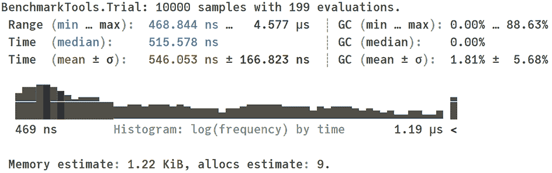
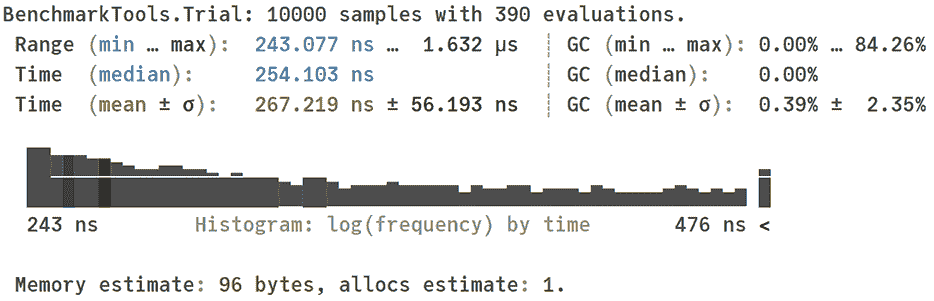
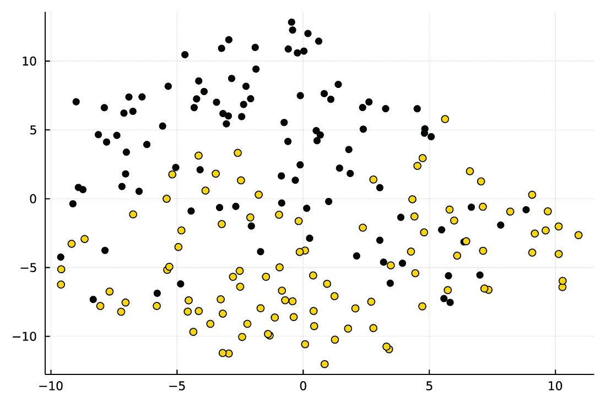
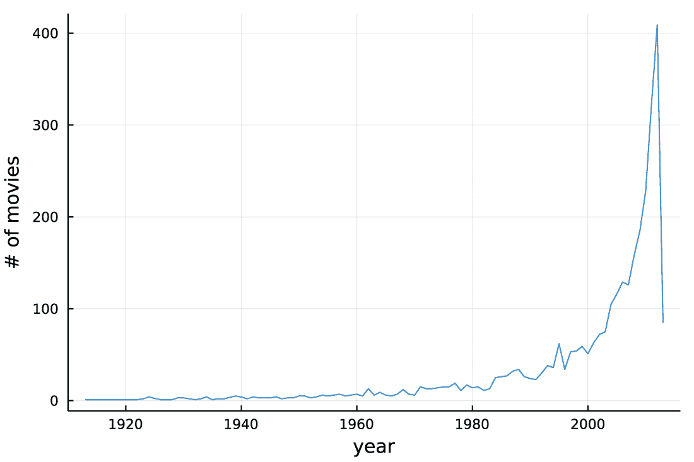
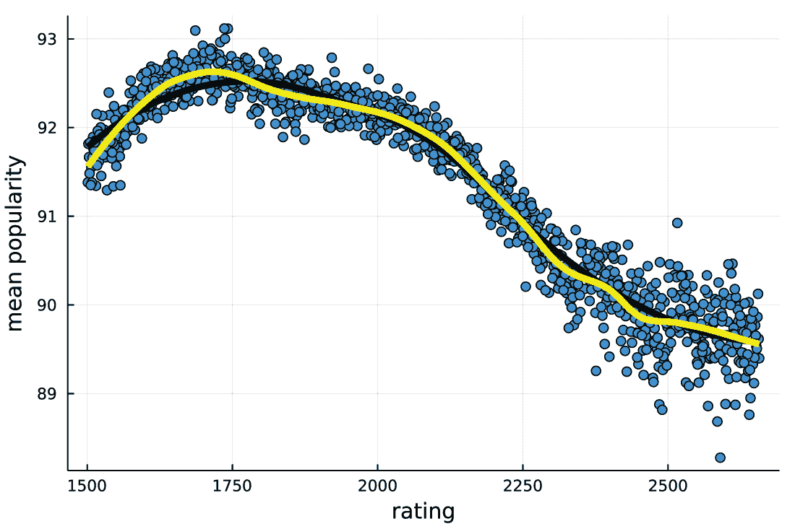
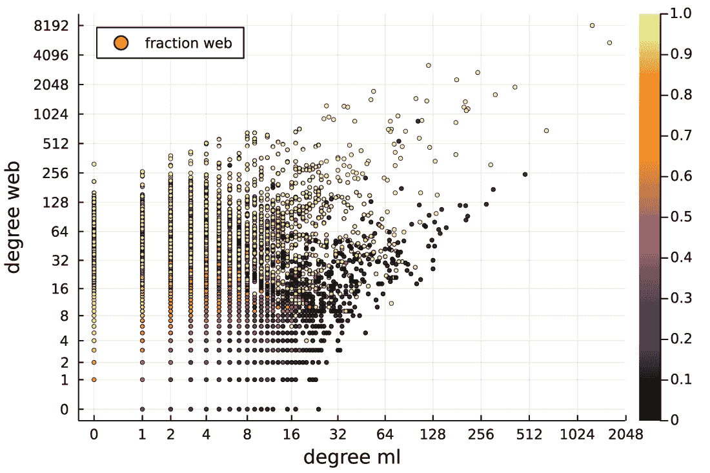

# 附录 B 练习题解答

**练习 3.1**

创建一个 x 变量，它是从 1 到 10⁶ 的值范围。现在，使用 collect 函数，创建一个包含与 x 范围相同值的 y 向量。使用@btime 宏，通过使用 sort 函数检查排序 x 和 y 的时间。最后，使用@edit 宏，检查当你排序 x 范围时将被调用的 sort 函数的实现。

**解决方案**

```
julia> using BenchmarkTools

julia> x = 1:10⁶;

julia> y = collect(x);

julia> @btime sort($x);
  1.100 ns (0 allocations: 0 bytes)

julia> @btime sort($y);
  7.107 ms (2 allocations: 7.63 MiB)

julia> @edit sort(x)
```

注意到对 x 范围的排序比排序 y 向量要快得多。如果你有一个正确配置的 Julia 环境（参见附录 A 获取说明），调用@edit sort(x)应该带你到编辑器并显示以下方法定义：

```
sort(r::AbstractUnitRange) = r
```

**练习 4.1**

使用视图（无论是视图函数还是@view 宏）重写表达式[cor(aq[:, i], aq[:, i+1]) for i in 1:2:7]。通过使用 BenchmarkTools.jl 包中的@benchmark 宏来比较两种方法的性能。

**解决方案**

```
julia> using Statistics

julia> using BenchmarkTools

julia> aq = [10.0   8.04  10.0  9.14  10.0   7.46   8.0   6.58
                     8.0   6.95   8.0  8.14   8.0   6.77   8.0   5.76
                    13.0   7.58  13.0  8.74  13.0  12.74   8.0   7.71
                     9.0   8.81   9.0  8.77   9.0   7.11   8.0   8.84
                    11.0   8.33  11.0  9.26  11.0   7.81   8.0   8.47
                    14.0   9.96  14.0  8.1   14.0   8.84   8.0   7.04
                     6.0   7.24   6.0  6.13   6.0   6.08   8.0   5.25
                     4.0   4.26   4.0  3.1    4.0   5.39  19.0  12.50
                    12.0  10.84  12.0  9.13  12.0   8.15   8.0   5.56
                     7.0   4.82   7.0  7.26   7.0   6.42   8.0   7.91
                     5.0   5.68   5.0  4.74   5.0   5.73   8.0   6.89];
```

我们现在运行第一个基准测试：

```
julia> @benchmark [cor($aq[:, i], $aq[:, i+1]) for i in 1:2:7]
```

它会产生以下输出：



现在运行第二个基准测试：

```
julia> @benchmark [cor(view($aq, :, i), view($aq, :, i+1)) for i in 1:2:7]
```

这次执行更快，如以下输出所示：



基准测试的结果显示，使用视图几乎将代码的执行时间减半。

如果你想要使用@view 宏，代码将是这样的：

```
[cor(@view(aq[:, i]), @view(aq[:, i+1])) for i in 1:2:7]
```

在示例代码中，注意我们在 aq 变量前使用了$前缀，以正确传递给@benchmark 宏（参见第二章解释此规则）。

**练习 4.2**

重新编写解决 Sicherman 谜题的代码，将处理逻辑封装在函数中。创建一个函数，dice_distribution，它接受两个作为其参数的骰子值，并生成一个包含可能组合值的总和分布的字典。接下来，编写另一个函数，test_dice，在其中创建 all_dice 变量和 two_standard 变量，然后运行主循环，比较 all_dice 向量中所有骰子的分布与 two_standard 分布。

**解决方案**

```
function dice_distribution(dice1, dice2)
    distribution = Dict{Int, Int}()
    for i in dice1
        for j in dice2
            s = i + j
            if haskey(distribution, s)
                distribution[s] += 1
            else
                distribution[s] = 1
            end
        end
    end
    return distribution
end

function test_dice()
    all_dice = [[1, x2, x3, x4, x5, x6]
                for x2 in 2:11
                for x3 in x2:11
                for x4 in x3:11
                for x5 in x4:11
                for x6 in x5:11]

    two_standard = dice_distribution(1:6, 1:6)

    for d1 in all_dice, d2 in all_dice
        test = dice_distribution(d1, d2)
        if test == two_standard
            println(d1, " ", d2)
        end
    end
end
```

现在，你可以通过运行以下命令来测试解决方案：

```
julia> test_dice()
[1, 2, 2, 3, 3, 4] [1, 3, 4, 5, 6, 8]
[1, 2, 3, 4, 5, 6] [1, 2, 3, 4, 5, 6]
[1, 3, 4, 5, 6, 8] [1, 2, 2, 3, 3, 4]
```

**练习 4.3**

使用在列表 4.2 中定义的命名元组的数据重现图 4.6。

**解决方案**

```
plot(scatter(data.set1.x, data.set1.y; legend=false),
     scatter(data.set2.x, data.set2.y; legend=false),
     scatter(data.set3.x, data.set3.y; legend=false),
     scatter(data.set4.x, data.set4.y; legend=false))
```

此代码重现了图 4.6。

**练习 5.1**

解析函数可以用来将字符串转换为数字。例如，如果你想将一个字符串解析为整数，写 parse(Int, "10")以获取整数 10。假设你被给了一个包含字符串["1", "2", "3"]的向量。你的任务是创建一个包含给定向量中字符串的整数的向量。

**解决方案**

```
julia> parse.(Int, ["1", "2", "3"])
3-element Vector{Int64}:
 1
 2
 3
```

**练习 5.2**

重复第 5.3 节中展示的分析，但在为 1 号和 2 号集群创建数据时，分别加上和减去 0.4。这将减少五维空间中两个集群之间的距离。检查这是否会减少由 t-SNE 生成的二维空间中的距离。

**解答**

```
julia> Random.seed!(1234);

julia> data5bis = [randn(100, 5) .- 0.4; randn(100, 5) .+ 0.4];

julia> tsne = manifold.TSNE(n_components=2, init="random",
                            learning_rate="auto", random_state=1234);

julia> data2bis = tsne.fit_transform(data5bis);

julia> scatter(data2bis[:, 1], data2bis[:, 2];
               color=[fill("black", 100); fill("gold", 100)],
               legend=false)

```

图 B.1 显示了结果。我们可以看到，与图 5.3 相比，集群的重叠更多。



图 B.1 在这个 t-SNE 嵌入的结果中，表示为不同填充颜色的点的集群是重叠的。

**练习 6.1**

使用 years 变量创建按年份划分的电影数量图表。

**解答**

```
julia> years_table = freqtable(years)
93-element Named Vector{Int64}
Dim1  │
──────+────
1913  │   1
1916  │   1
1917  │   1
:         :
2011  │ 322
2012  │ 409
2013  │  85

julia> plot(names(years_table, 1), years_table; legend=false,
            xlabel="year", ylabel="# of movies")
```

您的结果应该看起来像图 B.2 中的图表，其中我们看到每年电影数量的急剧增加，除了最后一年，因为很可能在整个期间没有收集到数据。



图 B.2 在这个每年电影数量的图表中，观察值在多年内急剧增加。

**练习 6.2**

使用列表 6.7 中的 s1 向量，创建包含与 s1 向量中相同字符串的符号的 s3 向量。然后，基准测试您能够多快地对 s3 向量进行排序。最后，基准测试您能够多快地使用 unique 函数对 s1、s2 和 s3 向量进行去重。

**解答**

```
julia> s3 = Symbol.(s1)
1000000-element Vector{Symbol}:
 :KYD
 :tLO
 :xnU
:
 :Tt6
 Symbol("19y")
 :GQ7

julia> @btime sort($s3);
  193.934 ms (4 allocations: 11.44 MiB)
```

将 s3 绑定到 Vector{Symbol}的排序比将 s1 绑定到 Vector{String}的排序快一点，但比将 s2 绑定到 Vector{String3}的排序慢。

现在我们测试去重：

```
julia> @btime unique($s1);
  122.145 ms (49 allocations: 10.46 MiB)

julia> @btime unique($s2);
  29.882 ms (48 allocations: 6.16 MiB)

julia> @btime unique($s3);
  25.168 ms (49 allocations: 10.46 MiB)
```

De-duplicating Vector{String}是最慢的，而对于 Vector{Symbol}和 Vector{String3}，性能相似。处理 Symbol 值很快，因为比较符号的相等性是高效的，如第 6.1 节所述。

**练习 7.1**

给定向量 v = ["1", "2", missing, "4"]，将其解析为将字符串转换为数字，并将缺失值保留为缺失值。

**解答**

我将展示三种实现预期结果的方法。第一种使用列表推导，第二种使用 map 函数，最后使用 passmissing 函数和广播：

```
julia> v = ["1", "2", missing, "4"]
4-element Vector{Union{Missing, String}}:
 "1"
 "2"
 missing
 "4"

julia> [ismissing(x) ? missing : parse(Int, x) for x in v]
4-element Vector{Union{Missing, Int64}}:
 1
 2
  missing
 4

julia> map(v) do x
           if ismissing(x)
               return missing
           else
               return parse(Int, x)
           end
       end
4-element Vector{Union{Missing, Int64}}:
 1
 2
  missing
 4

julia> using Missings

julia> passmissing(parse).(Int, v)
4-element Vector{Union{Missing, Int64}}:
 1
 2
  missing
 4
```

**练习 7.2**

创建一个包含 2021 年每月第一天的向量。

**解答**

我将向您展示两种实现预期结果的方法。在第二种方法中，我们使用一个范围，因此我使用 collect 函数向您展示结果确实如预期：

```
julia> using Dates

julia> Date.(2021, 1:12, 1)
12-element Vector{Date}:
 2021-01-01
 2021-02-01
 2021-03-01
 2021-04-01
 2021-05-01
 2021-06-01
 2021-07-01
 2021-08-01
 2021-09-01
 2021-10-01
 2021-11-01
 2021-12-01

julia> Date(2021, 1, 1):Month(1):Date(2021, 12, 1)
Date("2021-01-01"):Month(1):Date("2021-12-01")

julia> collect(Date(2021, 1, 1):Month(1):Date(2021, 12, 1))
12-element Vector{Date}:
 2021-01-01
 2021-02-01
 2021-03-01
 2021-04-01
 2021-05-01
 2021-06-01
 2021-07-01
 2021-08-01
 2021-09-01
 2021-10-01
 2021-11-01
 2021-12-01
```

注意，在第二种情况下，Julia 正确地计算了一个月的时间间隔，尽管不同的月份天数不同。这确实是期望的行为。

**练习 7.3**

NBP Web API 允许您获取一段时间内的汇率序列。例如，查询"https://api.nbp.pl/api/exchangerates/rates/a/usd/2020-06-01/2020-06-30/?format=json"返回了 2020 年 6 月有汇率的日期的汇率序列。换句话说，跳过了没有汇率的日期。您的任务是解析此查询的结果，并确认获得的结果与我们收集的 dates 和 rates 向量中的数据一致。

**解决方案**

```
julia> query2 = "https://api.nbp.pl/api/exchangerates/rates/a/usd/" *
                "2020-06-01/2020-06-30/?format=json";

julia> response2 = HTTP.get(query2);

julia> json2 = JSON3.read(response2.body)
JSON3.Object{Vector{UInt8}, Vector{UInt64}} with 4 entries:
  :table    => "A"
  :currency => "dolar amerykański"
  :code     => "USD"
  :rates    => JSON3.Object[{...

julia> rates2 = [x.mid for x in json2.rates]
21-element Vector{Float64}:
 3.968
 3.9303
 3.9121
 ⋮
 3.9697
 3.9656
 3.9806

julia> dates2 = [Date(x.effectiveDate) for x in json2.rates]
21-element Vector{Date}:
 2020-06-01
 2020-06-02
 2020-06-03
 ⋮
 2020-06-26
 2020-06-29
 2020-06-30

julia> has_rate = rates .!== missing
30-element BitVector:
 1
 1
 1
 ⋮
 0
 1
 1

julia> rates2 == rates[has_rate]
true

julia> dates2 == dates[has_rate]
true
```

在解决方案中，:rates 字段中的 json2 对象包含一系列汇率。因此，我们通过使用列表推导式将它们提取到 rates2 和 dates2 向量中。接下来，我们想要比较 rates2 和 dates2 向量与 rates 和 dates 向量在那些 rates 向量不包含缺失值的条目中进行。为此，我们创建了一个 has_rate 布尔掩码向量，通过将缺失值与 rates 向量进行 !== 比较进行广播。

**练习 8.1**

使用 BenchmarkTools.jl 包，通过使用 puzzles."Rating"语法来获取数据框中的列的性能进行测量。

**解决方案**

```
julia> using BenchmarkTools

julia> @btime $puzzles."Rating";
  36.831 ns (0 allocations: 0 bytes)
```

如预期的那样，性能略低于 puzzles.Rating。

**练习 9.1**

在两种条件下计算 NbPlays 列的摘要统计。在第一种情况下，仅选择流行度等于 100 的谜题，在第二种情况下，选择流行度等于-100 的谜题。要计算向量的摘要统计，请使用 StatsBase.jl 包中的 summarystats 函数。

**解决方案**

```
julia> using StatsBase

julia> summarystats(puzzles[puzzles.Popularity .== 100, "NbPlays"])
Summary Stats:
Length:         148244
Missing Count:  0
Mean:           283.490280
Minimum:        0.000000
1st Quartile:   6.000000
Median:         124.000000
3rd Quartile:   396.000000
Maximum:        8899.000000

julia> summarystats(puzzles[puzzles.Popularity .== -100, "NbPlays"])
Summary Stats:
Length:         13613
Missing Count:  0
Mean:           4.337839
Minimum:        0.000000
1st Quartile:   3.000000
Median:         4.000000
3rd Quartile:   5.000000
Maximum:        35.000000
```

我们可以看到，那些流行度等于-100 的谜题确实被玩得很少。然而，对于那些流行度为 100 的谜题，这种关系并不那么强烈。如您从列表 8.2 中的代码产生的输出中回忆起来，整个数据集的播放次数平均值约为 891，中位数约为 246。因此，100 流行度的谜题平均播放次数略少，但关系并不那么强烈。其中一些谜题似乎只是非常好。

**练习 9.2**

确保存储在 rating_mapping 字典中的值加起来代表我们良好数据框的所有行索引。为此，检查这些向量的长度之和是否等于良好数据框中的行数。

**解决方案**

```
julia> sum(length, values(rating_mapping))
513357

julia> nrow(good)
513357
```

使用带有其第一个参数为转换函数的 sum 函数的解释在第四章中。

**练习 9.3**

检查在 loess 函数中更改 span 关键字参数值的影响。默认情况下，此参数的值为 0.75。将其设置为 0.25，并在图 9.4 所示的图中添加另一条预测线。使线条为黄色，宽度为 5。

**解决方案**

```
julia> model2 = loess(ratings, mean_popularities; span=0.25);

julia> popularity_predict2 = predict(model2, ratings_predict);

julia> plot!(ratings_predict, popularity_predict2;
             width=5, color="yellow");
```

图 B.3 显示了结果。请注意，通过应用较少的平滑处理，曲线与数据的拟合略好。与图 9.4 的预测相比，它在边缘具有较低的偏差，评分为约 1500（原始预测略有向上偏差），在极值处评分为约 1750（原始预测略有向下偏差）。



图 B.3 此显示网络和机器学习邻居数量与机器学习开发者比例之间关系的图表是在没有抖动的情况下创建的。

**练习 10.1**

比较创建包含单个随机向量（一百万个元素）的数据框时，是否复制源向量对性能的影响。你可以通过使用 rand(10⁶)命令生成此向量。

**解决方案**

```
julia> using BenchmarkTools

julia> x = rand(10⁶);

julia> @btime DataFrame(x=$x);
  1.010 ms (22 allocations: 7.63 MiB)

julia> @btime DataFrame(x=$x; copycols=false);
  827.941 ns (21 allocations: 1.50 KiB)
```

使用 copycols=false 可以减少内存分配并加快代码执行速度。

**练习 10.2**

检查两个数据框 vcat 的结果，df1=DataFrame(a=1, b=2)和 df2=DataFrame(b=2, a=1)。接下来，验证如果我们也传递 cols=:orderequal 关键字参数时的操作结果。

**解决方案**

```
julia> df1 = DataFrame(a=1,b=2)
1×2 DataFrame
 Row │ a      b
     │ Int64  Int64
─────┼──────────────
   1 │     1      2

julia> df2 = DataFrame(b=3, a=4)
1×2 DataFrame
 Row │ b      a
     │ Int64  Int64
─────┼──────────────
   1 │     3      4

julia> vcat(df1, df2)
2×2 DataFrame
 Row │ a      b
     │ Int64  Int64
─────┼──────────────
   1 │     1      2
   2 │     4      3

julia> vcat(df1, df2, cols=:orderequal)
ERROR: ArgumentError: when `cols=:orderequal` all data frames need
to have the same column names and be in the same order
```

**练习 10.3**

将列表 10.7 中的代码修改为，如果随机游走再次访问相同点，则只执行两步验证。验证在这种情况下，我们没有重复访问相同点的概率大约为 7.5%。

**解决方案**

```
julia> function walk_unique_2ahead()
           walk = DataFrame(x=0, y=0)
           for _ in 1:10
               current = walk[end, :]
               push!(walk, sim_step(current))
           end
           return all(walk[i, :] != walk[i+2, :] for i in 1:9)
       end
walk_unique_2ahead (generic function with 1 method)

julia> Random.seed!(2);

julia> proptable([walk_unique_2ahead() for _ in 1:10⁵])
2-element Named Vector{Float64}
Dim1  │
──────┼────────
false │ 0.92472
true  │ 0.07528
```

与列表 10.7 相比，此代码的差异在于这次，我们检查的条件是 all(walk[i, :] != walk[i+2, :] for i in 1:9)。如第 10.2 节所述，我们检查在实例 1 和 3、2 和 4、...、9 和 11 中是否访问了不同的点。

结果大约为 7.5%，正如预期的那样。

**练习 11.1**

测量创建一个包含 10,000 列且只有 1s 的单行数据框所需的时间。使用由 ones(1, 10_000)创建的矩阵作为源，并自动生成列名。接下来，测量从该数据框创建向量 NamedTuple 所需的时间。

**解决方案**

```
julia> @time wide = DataFrame(ones(1, 10_000), :auto);
  0.092228 seconds (168.57 k allocations: 9.453 MiB,
                    94.13% compilation time)
julia> @time wide = DataFrame(ones(1, 10_000), :auto);
  0.006999 seconds (39.53 k allocations: 2.508 MiB)

julia> @time Tables.columntable(wide);
 18.517356 seconds (1.70 M allocations: 65.616 MiB, 0.08% gc time,
                    99.60% compilation time)
julia> @time Tables.columntable(wide);
  0.002036 seconds (25 allocations: 938.750 KiB)
```

创建非常宽的数据框对象非常快，即使在第一次运行时也是如此。另一方面，创建宽 NamedTuple 对象会带来非常高的编译成本。Tables.columntable(wide)的第二次运行很快，因为 Julia 缓存了用于所需列名和类型的函数的编译结果。

**练习 11.2**

使用 gdf_city 分组数据框，通过使用 Statistics 模块中的 mean 函数计算每个城市的平均温度。将结果存储为一个字典，其中键是城市名称，值是对应的平均温度。将你的结果与以下调用的输出进行比较：combine(gdf_city, :rainfall => mean)。（我们将在第十二章和第十三章中讨论此类表达式的确切语法。）

**解决方案**

```
julia> using Statistics

julia> Dict(key.city => mean(df.rainfall) for (key, df) in pairs(gdf_city))
Dict{String7, Float64} with 2 entries:
  "Ełk"    => 2.275
  "Olecko" => 2.48333

julia> combine(gdf_city, :rainfall => mean)
2×2 DataFrame
 Row │ city     rainfall_mean 
     │ String7  Float64       
─────┼────────────────────────
   1 │ Olecko         2.48333
   2 │ Ełk            2.275
```

**练习 12.1**

使用 complete_graph(37700) 调用，在 37,700 个节点上创建一个完整图（我们在 gh 图中拥有的节点数）。但请注意：如果你的机器上少于 32 GB RAM，请使用更小的图大小，因为这个练习是内存密集型的。接下来，使用 Base.summarysize 函数检查这个图占用多少内存。最后，使用 @time 函数检查 deg_class 函数在这个图上完成所需的时间，使用 classes_df.ml_target 向量作为开发者类型的向量。

**解决方案**

```
julia> cg = complete_graph(37700)
{37700, 710626150} undirected simple Int64 graph

julia> Base.summarysize(cg)
11371828056

julia> @time deg_class(cg, classes_df.ml_target);
  7.114192 seconds (5 allocations: 589.250 KiB)
```

与我们在第十二章中的讨论一致，我们看到，在 37,700 个节点上的完整图有 710,626,150 条边。创建该图需要大约 11 GB 的 RAM。在图上执行 deg_class 函数大约需要 7 秒钟。

**练习 12.2**。

检查如果从图中移除抖动，图 12.6 的绘制效果会如何。

**解决方案**

```
scatter(log1p.(agg_df.deg_ml),
        log1p.(agg_df.deg_web);
        zcolor=agg_df.web_mean,
        xlabel="degree ml", ylabel="degree web",
        markersize=2, markerstrokewidth=0, markeralpha=0.8,
        legend=:topleft, labels = "fraction web",
        xticks=gen_ticks(maximum(classes_df.deg_ml)),
        yticks=gen_ticks(maximum(classes_df.deg_web)))
```

此代码生成了图 B.4 的绘制。



图 B.4：网络和机器学习邻居数量与机器学习开发者比例之间的关系图。该图在无抖动的情况下创建。

如果你比较图 B.4 和 12.6，你会看到，确实，图 B.4 中绘制的点有很多重叠，这可能导致一些暗点被忽视，因为它们会被许多亮点覆盖。

**练习 12.3**

使用 probit 模型而不是 logit 模型来预测 ml_target 变量。使用 glm 函数的 ProbitLink() 参数。

**解决方案**

```
julia> glm(@formula(ml_target~log1p(deg_ml)+log1p(deg_web)),
           classes_df, Binomial(), ProbitLink())
StatsModels.TableRegressionModel{GeneralizedLinearModel{
GLM.GlmResp{Vector{Float64}, Binomial{Float64}, ProbitLink},
GLM.DensePredChol{Float64, LinearAlgebra.Cholesky{Float64,
Matrix{Float64}}}}, Matrix{Float64}}

ml_target ~ 1 + :(log1p(deg_ml)) + :(log1p(deg_web))

Coefficients:
───────────────────────────────────────────────────────────────────────────
                  Coef.  Std. Error       z  Pr(>|z|)  Lower 95%  Upper 95%
───────────────────────────────────────────────────────────────────────────
(Intercept)     0.142686  0.0161981    8.81    <1e-17   0.110939   0.174434
log1p(deg_ml)   1.02324   0.0119645   85.52    <1e-99   0.999791   1.04669
log1p(deg_web) -0.91654   0.0108211  -84.70    <1e-99  -0.937749  -0.895331
───────────────────────────────────────────────────────────────────────────
```

**练习 12.4**

创建一个空数据框。向其中添加一个名为 a 的列，存储值 1、2 和 3，而不进行复制。接下来，在数据框中创建另一个名为 b 的列，该列与列 a 相同的向量（不进行复制）。检查列 a 和 b 存储的向量是否相同。在数据框中存储两个相同的列是不安全的，因此，在列 b 中存储其副本。现在检查列 a 和 b 存储相同的数据但对象不同。就地更新列 a 的前两个元素为 10。

**解决方案**

```
julia> df = DataFrame()
0×0 DataFrame

julia> df.a = [1, 2, 3]
3-element Vector{Int64}:
 1
 2
 3

julia> df.b = df.a
3-element Vector{Int64}:
 1
 2
 3

julia> df.b === df.a
true

julia> df.b = df[:, "b"]
3-element Vector{Int64}:
 1
 2
 3

julia> df.b === df.a
false

julia> df.b == df.a
true

julia> df[1:2, "a"] .= 10
2-element view(::Vector{Int64}, 1:2) with eltype Int64:
 10
 10

julia> df
3×2 DataFrame
 Row │ a      b     
     │ Int64  Int64 
─────┼──────────────
   1 │    10      1
   2 │    10      2
   3 │     3      3
```

在这些操作中，最棘手的是 df.b = df[:, "b"]。我们将复制的值 df[:, "b"] 赋值给现有的列 b。或者，我们也可以写成 df.b = copy(df.b)。

**练习 13.1**

使用 DataFramesMeta.jl 的 @rselect 宏重写列表 13.6 中的代码。

**解决方案**

```
@rselect(owensboro,
    :arrest = :arrest_made,
    :day = dayofweek(:date),
    :type,
    :v1 = contains(:violation, agg_violation.v[1]),
    :v2 = contains(:violation, agg_violation.v[2]),
    :v3 = contains(:violation, agg_violation.v[3]),
    :v4 = contains(:violation, agg_violation.v[4]))
```

注意，使用 @rselect，我们可以更容易地指定简单的转换，但最后四个转换，我们在列表 13.6 中程序化生成的，必须明确写出。

**练习 13.2**

编写一个选择操作创建 owensboro2 数据框，该数据框立即包含 dayname 列（无需执行连接）。

**解决方案**

```
select(owensboro,
    :arrest_made => :arrest,
    :date => ByRow(dayofweek) => :day,
    :type,
    [:violation =>
     ByRow(x -> contains(x, agg_violation.v[i])) =>
     "v$i" for i in 1:4],
    :date => ByRow(dayname) => :dayname)
```

只需将 dayname 函数应用于 :date 列即可获得所需的结果。不过，请注意，在这种情况下，获得的列不是分类的，因此我们稍后需要使用分类函数将其转换为分类列。

**练习 13.3**

为了练习本节学到的操作，准备以下分析。首先，计算每天被捕的概率。其次，再次计算被捕的概率，但这次按 dayname 和 type 列计算，并以宽表形式呈现结果，其中 dayname 级别是行，type 值形成列。

**解决方案**

```
julia> @chain owensboro2 begin
           groupby(:dayname, sort=true)
           combine(:arrest => mean)
       end
7×2 DataFrame
 Row │ dayname    arrest_mean 
     │ Cat...       Float64     
─────┼────────────────────────
   1 │ Monday       0.0825991
   2 │ Tuesday      0.0928433
   3 │ Wednesday    0.0780201
   4 │ Thursday     0.0834846
   5 │ Friday       0.112174
   6 │ Saturday     0.165485
   7 │ Sunday       0.258114
```

注意到，通常情况下，被捕的最高概率出现在周末：

```
julia> @chain owensboro2 begin
           groupby([:dayname, :type], sort=true)
           combine(:arrest => mean)
           unstack(:dayname, :type, :arrest_mean)
       end
7×3 DataFrame
 Row │ dayname    pedestrian  vehicular 
     │ Cat...       Float64?    Float64?  
─────┼──────────────────────────────────
   1 │ Monday       0.827586  0.0580205
   2 │ Tuesday      0.611111  0.0741483
   3 │ Wednesday    0.568182  0.0592334
   4 │ Thursday     0.568182  0.063327
   5 │ Friday       0.596491  0.0869167
   6 │ Saturday     0.638889  0.144444
   7 │ Sunday       0.592593  0.243548
```

如果类型是行人，被捕的概率会高得多。

**练习 13.4**

通过（a）数据帧索引语法和（b）groupby 函数创建训练和测试数据帧。

**解决方案**

```
julia> train2 = owensboro2[owensboro2.train, :]
4832×8 DataFrame
  Row │ arrest  type        v1     v2     v3     v4     dayname    train 
      │ Bool    String15    Bool   Bool   Bool   Bool   Cat...       Bool  
──────┼──────────────────────────────────────────────────────────────────
    1 │   true  pedestrian  false  false  false  false  Thursday    true
    2 │  false  vehicular   false   true  false  false  Sunday      true
  :   │   :         :         :      :      :      :        :        :
 4831 │  false  vehicular    true   true  false   true  Wednesday   true
 4832 │  false  vehicular   false  false  false   true  Wednesday   true
                                                        4828 rows omitted

julia> test2 = owensboro2[.!owensboro2.train, :]
2047×8 DataFrame
  Row │ arrest  type        v1     v2     v3     v4     dayname    train 
      │ Bool    String15    Bool   Bool   Bool   Bool   Cat...       Bool
──────┼──────────────────────────────────────────────────────────────────
    1 │   true  vehicular   false  false  false  false  Tuesday    false
    2 │   true  vehicular   false  false  false  false  Sunday     false
  :   │   :         :         :      :      :      :        :        :
 2046 │  false  vehicular   false  false   true  false  Friday     false
 2047 │  false  vehicular   false  false  false  false  Wednesday  false
                                                        2043 rows omitted

julia> test3, train3 = groupby(owensboro2, :train, sort=true)
GroupedDataFrame with 2 groups based on key: train
First Group (2047 rows): train = false
  Row │ arrest  type        v1     v2     v3     v4     dayname    train 
      │ Bool    String15    Bool   Bool   Bool   Bool   Cat...       Bool
──────┼──────────────────────────────────────────────────────────────────
    1 │   true  vehicular   false  false  false  false  Tuesday    false
    2 │   true  vehicular   false  false  false  false  Sunday     false
    3 │  false  vehicular   false  false  false  false  Tuesday    false
  :   │   :         :         :      :      :      :        :        :
 2046 │  false  vehicular   false  false   true  false  Friday     false
 2047 │  false  vehicular   false  false  false  false  Wednesday  false
                                                        2042 rows omitted
⋮
Last Group (4832 rows): train = true
  Row │ arrest  type        v1     v2     v3     v4     dayname    train 
      │ Bool    String15    Bool   Bool   Bool   Bool   Cat...       Bool
──────┼──────────────────────────────────────────────────────────────────
    1 │   true  pedestrian  false  false  false  false  Thursday    true
    2 │  false  vehicular   false   true  false  false  Sunday      true
    3 │   true  vehicular   false  false  false  false  Sunday      true
  :   │   :         :         :      :      :      :        :        :
 4831 │  false  vehicular    true   true  false   true  Wednesday   true
 4832 │  false  vehicular   false  false  false   true  Wednesday   true
                                                        4827 rows omitted
```

在使用 groupby 函数的解决方案中，我们使用 sort=true 非常重要。这确保了组按分组列排序，因此 false 键在第一个组中，true 键在最后一个组中。此外，在这种情况下，train3 和 test3 数据帧具有 SubDataFrame 类型，因此它们是原始 owensboro2 数据帧的视图。

**练习 14.1**

使用 @time 宏，比较使用 <(0) 和 x -> x < 0 函数计算 -10⁶:10⁶ 范围内值平均值的耗时。还要检查预先定义 lt0(x) = x < 0 函数时的计时。运行每个操作三次。

**解决方案**

```
julia> @time mean(x -> x < 0, -10⁶:10⁶)
  0.058563 seconds (124.09 k allocations: 6.868 MiB, 100.84% compilation time)
0.499999750000125

julia> @time mean(x -> x < 0, -10⁶:10⁶)
  0.058623 seconds (123.13 k allocations: 6.808 MiB, 99.25% compilation time)
0.499999750000125

julia> @time mean(x -> x < 0, -10⁶:10⁶)
  0.059394 seconds (123.13 k allocations: 6.808 MiB, 99.22% compilation time)
0.499999750000125

julia> @time mean(<(0), -10⁶:10⁶)
  0.000515 seconds
0.499999750000125

julia> @time mean(<(0), -10⁶:10⁶)
  0.000608 seconds
0.499999750000125

julia> @time mean(<(0), -10⁶:10⁶)
  0.000523 seconds
0.499999750000125
```

如您在 @time 宏的结果中所见，使用 <(0) 的代码更快，因为它不需要每次都编译，而使用 x -> x < 0 的代码则需要。

这种差异在脚本中可能并不重要，因为在脚本中通常只编译一次。但当你以交互式方式与 Julia 一起工作时，它最为相关，在这种情况下，你通常会在全局范围内手动重复相同的操作多次。

解决此问题的另一种方法是定义一个命名函数：

```
julia> lt0(x) = x < 0
lt0 (generic function with 1 method)

julia> @time mean(lt0, -10⁶:10⁶)
  0.000433 seconds (4 allocations: 112 bytes)
0.499999750000125

julia> @time mean(lt0, -10⁶:10⁶)
  0.000420 seconds (4 allocations: 112 bytes)
0.499999750000125

julia> @time mean(lt0, -10⁶:10⁶)
  0.000400 seconds (4 allocations: 112 bytes)
0.499999750000125
```

然而，在交互式会话中，用户通常更喜欢在行内定义匿名函数，而不是预先定义它们为命名函数。

**练习 14.2**

创建一个接受包含单个元素 n 的 JSON 有效负载的 Web 服务，n 是一个整数。它应该以 JSON 格式返回使用 rand 函数生成的 n 个随机数的向量。如果传递的请求不正确，应生成 400 Bad Request 响应。在您的本地计算机上运行此 Web 服务器并测试它是否按预期工作。

**解决方案**

在解决方案中，我们现在有了服务器和客户端部分。首先，启动一个将作为服务器的 Julia 会话，并在其中运行以下代码：

```
using Genie
Genie.config.run_as_server = true
Genie.Router.route("/", method=POST) do
    message = Genie.Requests.jsonpayload()
    return try
        n = message["n"]
        Genie.Renderer.Json.json(rand(n))
    catch
        Genie.Responses.setstatus(400)
    end
end
Genie.Server.up()
```

现在，启动另一个 Julia 会话，并测试我们创建的 Web 服务：

```
julia> using HTTP

julia> using JSON3

julia> req = HTTP.post("http://127.0.0.1:8000",
                       ["Content-Type" => "application/json"],
                       JSON3.write((n=3,)))
HTTP.Messages.Response:
"""
HTTP/1.1 200 OK
Content-Type: application/json; charset=utf-8
Server: Genie/Julia/1.7.2
Transfer-Encoding: chunked

[0.5328896673008208,0.832033459458785,0.4955600307532585]"""

julia> JSON3.read(req.body)
3-element JSON3.Array{Float64, Vector{UInt8}, Vector{UInt64}}:
 0.5328896673008208
 0.832033459458785
 0.4955600307532585

julia> HTTP.post("http://127.0.0.1:8000",
                       ["Content-Type" => "application/json"],
                       JSON3.write((x=3,)))
ERROR: HTTP.ExceptionRequest.StatusError(400, "POST", "/", HTTP.Messages.Response:
"""
HTTP/1.1 400 Bad Request
Content-Type: application/json; charset=utf-8
Server: Genie/Julia/1.7.2
Transfer-Encoding: chunked

""")
```

在第一次调用中，我们传递一个正确的请求，并获得一个包含三个随机数的数组（您的数字可能不同）。在第二个示例中，请求格式不正确，因为我们没有传递 n，而是传递了 x。在这种情况下，服务器返回 400 Bad Request 响应。
