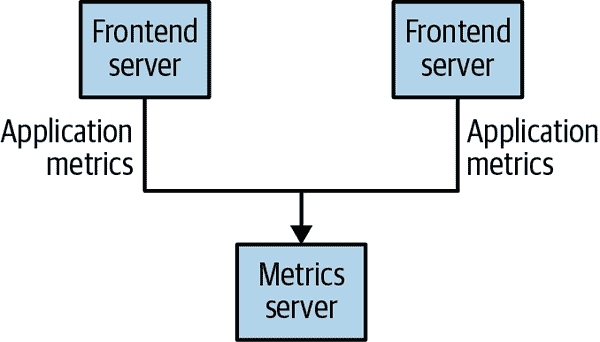
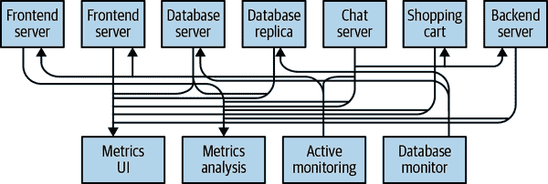
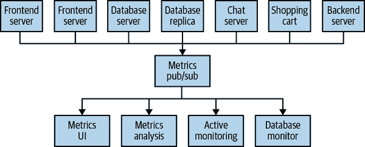
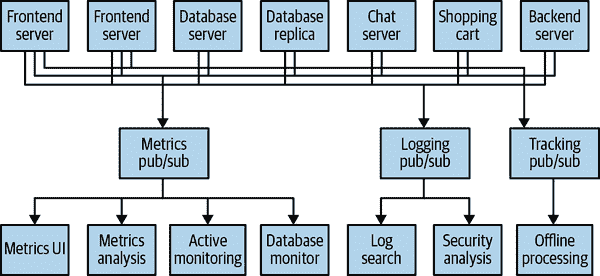
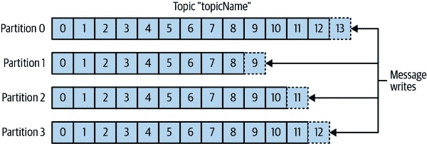
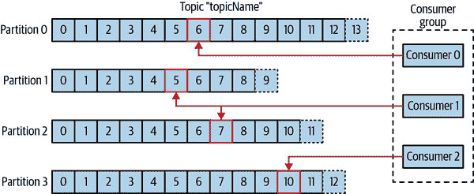
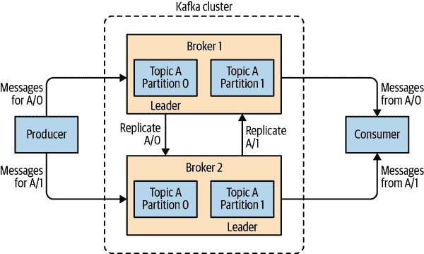
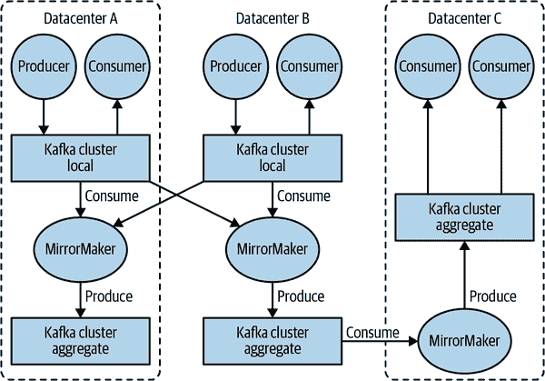
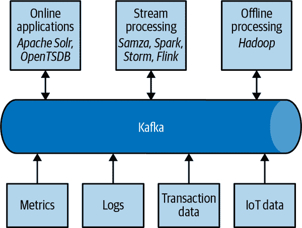

# 第一章：遇见 Kafka

每个企业都由数据驱动。我们接收信息，分析它，操纵它，并将其作为输出创建更多信息。每个应用程序都会创建数据，无论是日志消息，度量标准，用户活动，传出消息，还是其他内容。每个字节的数据都有一个故事要讲，一个重要的东西，将告知下一步要做的事情。为了知道那是什么，我们需要将数据从创建它的地方传输到可以分析它的地方。我们每天都在网站上看到这一点，比如亚马逊，我们对我们感兴趣的项目的点击被转化为稍后向我们展示的推荐。

我们能够越快地做到这一点，我们的组织就能越具敏捷性和响应性。我们在数据传输上花费的精力越少，我们就能更多地专注于手头的核心业务。这就是为什么管道是数据驱动企业的关键组成部分。我们如何移动数据几乎与数据本身一样重要。

> 每当科学家们意见不一致时，那是因为我们缺乏数据。然后我们可以就要获取什么类型的数据达成一致；我们获取数据；数据解决了问题。要么我是对的，要么你是对的，要么我们都错了。然后我们继续前进。
>
> 尼尔·德格拉斯·泰森

# 发布/订阅消息传递

在讨论 Apache Kafka 的具体内容之前，重要的是我们理解发布/订阅消息传递的概念，以及为什么它是数据驱动应用程序的关键组成部分。*发布/订阅（pub/sub）消息传递*是一种模式，其特点是数据（消息）的发送者（发布者）不会将其直接发送给接收者。相反，发布者以某种方式对消息进行分类，而接收者（订阅者）订阅接收某些类别的消息。发布/订阅系统通常有一个代理，即消息发布的中心点，以促进这种模式。

## 它是如何开始的

许多发布/订阅的用例都是从同样的方式开始的：使用简单的消息队列或进程间通信通道。例如，您创建一个需要将监控信息发送到某个地方的应用程序，因此您从应用程序直接连接到在仪表板上显示您的度量标准的应用程序，并通过该连接推送度量标准，如图 1-1 所示。

###### 图 1-1：单一，直接的度量发布者

这是一个简单的解决方案，用于解决刚开始监控时的简单问题。不久之后，您决定希望分析您的度量标准长期运行，而这在仪表板上效果不佳。您启动了一个新的服务，可以接收度量标准，存储它们并分析它们。为了支持这一点，您修改了应用程序，使其将度量标准写入这两个系统。到目前为止，您有三个应用程序正在生成度量标准，并且它们都与这两个服务建立了相同的连接。您的同事认为定期轮询服务以进行警报是个好主意，因此您在每个应用程序上都添加了一个服务器，以便按请求提供度量标准。过了一会儿，您有更多的应用程序正在使用这些服务器获取个别度量标准，并将它们用于各种目的。这种架构看起来可能与图 1-2 相似，连接甚至更难追踪。

###### 图 1-2：许多度量发布者，使用直接连接

这里积累的技术债务是显而易见的，因此您决定偿还其中的一部分。您设置了一个单一的应用程序，从所有外部应用程序接收度量标准，并提供一个服务器来查询那些需要它们的任何系统的度量标准。这将架构的复杂性降低到类似于图 1-3 的东西。恭喜，您已经构建了一个发布/订阅消息传递系统！

###### 图 1-3：度量发布/订阅系统

## 个人队列系统

与您使用指标进行战争的同时，您的一位同事正在使用日志消息进行类似的工作。另一位同事正在跟踪前端网站上用户行为，并将该信息提供给正在进行机器学习的开发人员，同时为管理层创建一些报告。您都遵循了构建系统的类似路径，这些系统将信息的发布者与订阅者解耦。图 1-4 显示了这样的基础设施，有三个独立的发布/订阅系统。

###### 图 1-4：多个发布/订阅系统

这肯定比使用点对点连接要好得多（如图 1-2 中所示），但存在很多重复。您的公司正在维护多个用于排队数据的系统，所有这些系统都有各自的错误和限制。您还知道将会有更多的消息传递用例即将到来。您希望拥有一个单一的集中式系统，允许发布通用类型的数据，随着业务的增长而增长。

# 进入 Kafka

Apache Kafka 被开发为一个发布/订阅消息系统，旨在解决这个问题。它经常被描述为“分布式提交日志”，或者最近被描述为“分布式流平台”。文件系统或数据库提交日志旨在提供所有事务的持久记录，以便可以重放它们以一致地构建系统的状态。同样，Kafka 中的数据是持久存储的，有序的，并且可以被确定性地读取。此外，数据可以在系统内分布，以提供额外的故障保护，以及显著的性能扩展机会。

## 消息和批次

Kafka 中的数据单元称为*消息*。如果您是从数据库背景接触 Kafka，您可以将其视为类似于*行*或*记录*。就 Kafka 而言，消息只是一个字节数组，因此其中包含的数据对 Kafka 来说没有特定的格式或含义。消息可以有一个可选的元数据，称为*键*。键也是一个字节数组，与消息一样，对 Kafka 来说没有特定的含义。当消息需要以更受控制的方式写入分区时，会使用键。最简单的方案是生成键的一致哈希，然后通过取哈希结果对主题中分区总数取模来选择该消息的分区号。这确保具有相同键的消息始终写入相同的分区（前提是分区数不会改变）。

为了提高效率，消息被批量写入 Kafka。*批量*只是一组消息，所有这些消息都被生产到相同的主题和分区。对于每条消息进行一次网络往返将导致过多的开销，将消息收集到一起形成批量可以减少这种开销。当然，这是延迟和吞吐量之间的权衡：批量越大，每单位时间可以处理的消息就越多，但单个消息传播所需的时间就越长。批次通常也会被压缩，提供更高效的数据传输和存储，但会消耗一些处理能力。关于键和批次的更多细节将在第三章中讨论。

## 模式

虽然对于 Kafka 本身来说，消息是不透明的字节数组，但建议对消息内容施加额外的结构或模式，以便轻松理解。根据应用程序的个体需求，有许多可用的消息*模式*选项。像 JavaScript 对象表示法（JSON）和可扩展标记语言（XML）这样的简单系统易于使用且易于阅读。但是，它们缺乏诸如强大的类型处理和模式版本之间的兼容性等功能。许多 Kafka 开发人员青睐使用 Apache Avro，这是最初为 Hadoop 开发的序列化框架。Avro 提供了紧凑的序列化格式，模式与消息有效载荷分开，并且在更改时不需要生成代码，具有强大的数据类型和模式演变，具有向后和向前的兼容性。

在 Kafka 中，一致的数据格式很重要，因为它允许写入和读取消息解耦。当这些任务紧密耦合时，订阅消息的应用程序必须更新以处理新的数据格式，与旧格式并行。只有在这之后，发布消息的应用程序才能更新以利用新的格式。通过使用明确定义的模式并将其存储在共同的存储库中，Kafka 中的消息可以在没有协调的情况下被理解。模式和序列化在第三章中有更详细的介绍。

## 主题和分区

Kafka 中的消息被分类为*主题*。主题的最接近类比是数据库表或文件系统中的文件夹。主题还可以进一步分为多个*分区*。回到“提交日志”的描述，分区就是一个单独的日志。消息以追加方式写入其中，并且按顺序从头到尾读取。请注意，由于主题通常具有多个分区，因此无法保证整个主题中的消息顺序，只能保证单个分区内的消息顺序。图 1-5 显示了一个具有四个分区的主题，写入被追加到每个分区的末尾。分区也是 Kafka 提供冗余和可伸缩性的方式。每个分区可以托管在不同的服务器上，这意味着单个主题可以横向扩展到多个服务器上，以提供远远超出单个服务器能力的性能。此外，分区可以被复制，以便不同的服务器将存储相同分区的副本，以防一个服务器发生故障。

###### 图 1-5\. 具有多个分区的主题的表示

在讨论像 Kafka 这样的系统中的数据时，经常使用术语*流*。通常情况下，流被认为是单个数据主题，而不考虑分区的数量。这代表了一条从生产者到消费者的数据流。这种引用消息的方式在讨论流处理时最常见，即在实时操作消息的框架上进行操作，其中一些框架包括 Kafka Streams、Apache Samza 和 Storm。这种操作方式可以与离线框架（如 Hadoop）在以后的某个时间点上对大量数据进行操作进行比较。有关流处理的概述在第十四章中提供。

## 生产者和消费者

Kafka 客户端是系统的用户，基本上有两种类型：生产者和消费者。还有高级客户端 API——用于数据集成的 Kafka Connect API 和用于流处理的 Kafka Streams。高级客户端使用生产者和消费者作为构建模块，并在其上提供更高级的功能。

*生产者*创建新消息。在其他发布/订阅系统中，这些可能被称为*发布者*或*写者*。消息将被生产到特定主题。默认情况下，生产者将消息均匀地分布到主题的所有分区上。在某些情况下，生产者将消息定向到特定分区。这通常是使用消息键和分区器来生成键的哈希并将其映射到特定分区。这确保使用给定键生成的所有消息将被写入同一分区。生产者还可以使用遵循其他业务规则的自定义分区器将消息映射到分区。有关生产者的详细信息，请参阅第三章。

*消费者*读取消息。在其他发布/订阅系统中，这些客户端可能被称为*订阅者*或*读者*。消费者订阅一个或多个主题，并按照它们被生产到每个分区的顺序读取消息。消费者通过跟踪消息的偏移量来跟踪它已经消费的消息。*偏移量*——一个不断增加的整数值——是 Kafka 在每条消息被生产时添加的另一个元数据。给定分区中的每条消息都有一个唯一的偏移量，并且下一条消息有一个更大的偏移量（尽管不一定是单调递增的）。通过通常在 Kafka 本身中存储每个分区的下一个可能偏移量，消费者可以在不丢失位置的情况下停止和重新启动。

消费者作为*消费者组*的一部分工作，这是一个或多个一起消费主题的消费者。该组确保每个分区只被一个成员消费。在图 1-6 中，有三个消费者在一个单一组中消费一个主题。其中两个消费者分别从一个分区工作，而第三个消费者从两个分区工作。消费者到分区的映射通常称为消费者对分区的*所有权*。

以这种方式，消费者可以水平扩展以消费具有大量消息的主题。此外，如果单个消费者失败，组的其余成员将重新分配正在消费的分区，以代替缺失的成员。有关消费者和消费者组的详细讨论，请参阅第四章。

###### 图 1-6\. 一个消费者组从一个主题中读取消息

## 经纪人和集群

单个 Kafka 服务器称为*经纪人*。经纪人接收来自生产者的消息，为它们分配偏移量，并将消息写入磁盘存储。它还为消费者提供服务，响应对分区的获取请求，并用已发布的消息进行响应。根据特定硬件及其性能特征，单个经纪人可以轻松处理数千个分区和每秒数百万条消息。

Kafka 经纪人被设计为作为*集群*的一部分运行。在经纪人集群中，一个经纪人还将作为集群的*控制器*（从集群的活动成员中自动选举产生）。控制器负责管理操作，包括将分区分配给经纪人并监视经纪人故障。集群中的单个分区由集群中的单个经纪人拥有，并且该经纪人被称为分区的*领导者*。复制分区（如图 1-7 中所示）分配给其他经纪人，称为分区的*跟随者*。复制提供了分区中消息的冗余，以便如果有经纪人故障，其中一个跟随者可以接管领导权。所有生产者必须连接到领导者才能发布消息，但消费者可以从领导者或其中一个跟随者获取消息。集群操作，包括分区复制，将在第七章中详细介绍。

###### 图 1-7：集群中分区的复制

Apache Kafka 的一个关键特性是*保留*，即一段时间内消息的持久存储。Kafka 经纪人配置了主题的默认保留设置，可以保留一段时间的消息（例如 7 天），或者直到分区达到特定大小（例如 1GB）。一旦达到这些限制，消息将过期并被删除。通过这种方式，保留配置定义了任何时间可用数据的最小量。个别主题也可以配置自己的保留设置，以便仅在有用时存储消息。例如，跟踪主题可能保留几天，而应用程序指标可能仅保留几个小时。主题还可以配置为*日志压缩*，这意味着 Kafka 将仅保留使用特定键生成的最后一条消息。这对于只有最后更新有趣的更改日志类型数据很有用。

## 多个集群

随着 Kafka 部署的增长，拥有多个集群通常是有利的。有几个原因可以解释为什么这样做是有用的：

+   数据类型的分离

+   满足安全需求的隔离

+   多个数据中心（灾难恢复）

特别是在使用多个数据中心时，通常需要在它们之间复制消息。这样，在线应用程序可以访问两个站点的用户活动。例如，如果用户在其个人资料中更改公共信息，则无论在哪个数据中心显示搜索结果，该更改都需要可见。或者，监控数据可以从许多站点收集到单个中央位置，分析和警报系统在那里托管。Kafka 集群内的复制机制仅设计为在单个集群内工作，而不是在多个集群之间工作。

Kafka 项目包括一个名为*MirrorMaker*的工具，用于将数据复制到其他集群。在其核心，MirrorMaker 只是一个 Kafka 消费者和生产者，通过队列连接在一起。消息从一个 Kafka 集群中消耗，并在另一个集群中生成。图 1-8 显示了一个使用 MirrorMaker 的架构示例，将来自两个本地集群的消息聚合到一个聚合集群，然后将该集群复制到其他数据中心。该应用程序的简单性掩盖了它在创建复杂数据管道方面的强大功能，这将在第九章中进一步详细介绍。

###### 图 1-8：多数据中心架构

# 为什么选择 Kafka？

在发布/订阅消息系统中有很多选择，那么 Apache Kafka 为什么是一个好选择呢？

## 多个生产者

Kafka 能够无缝处理多个生产者，无论这些客户端是使用许多主题还是相同的主题。这使得系统非常适合从许多前端系统聚合数据并使其一致。例如，通过多个微服务为用户提供内容的站点可以有一个页面浏览的单个主题，所有服务都可以使用通用格式写入。消费应用程序可以接收站点上所有应用程序的页面浏览的单个流，而无需协调从多个主题消耗，每个应用程序一个。

## 多个消费者

除了多个生产者外，Kafka 还设计为多个消费者可以读取任何单个消息流，而不会干扰其他客户端。这与许多排队系统相反，其中一旦消息被一个客户端消耗，它就不可用于任何其他客户端。多个 Kafka 消费者可以选择作为一个组操作，并共享一个流，确保整个组仅处理给定消息一次。

## 基于磁盘的保留

Kafka 不仅可以处理多个消费者，而且持久的消息保留意味着消费者不总是需要实时工作。消息被写入磁盘，并且将根据可配置的保留规则进行存储。这些选项可以根据主题选择，允许不同的消息流具有不同的保留量，以满足消费者的需求。持久的保留意味着如果消费者落后，无论是由于处理速度慢还是流量激增，都不会丢失数据。这也意味着可以对消费者进行维护，将应用程序离线一小段时间，而不用担心生产者上的消息积压或丢失。消费者可以停止，消息将被保留在 Kafka 中。这使它们可以重新启动并在离开时继续处理消息，而不会丢失数据。

## 可扩展

Kafka 的灵活可扩展性使其能够轻松处理任意数量的数据。用户可以从单个代理作为概念验证开始，扩展到由三个代理组成的小型开发集群，然后随着数据规模的扩大，进入由数十甚至数百个代理组成的生产集群。扩展可以在集群在线时进行，对整个系统的可用性没有影响。这也意味着多个代理组成的集群可以处理单个代理的故障并继续为客户提供服务。需要容忍更多同时故障的集群可以配置更高的复制因子。复制将在第七章中进行更详细的讨论。

## 高性能

所有这些功能共同使 Apache Kafka 成为一个在高负载下具有出色性能的发布/订阅消息系统。生产者、消费者和代理都可以扩展以轻松处理非常大的消息流。这可以在仍然提供从生成消息到可供消费者使用的亚秒级消息延迟的情况下完成。

## 平台功能

Apache Kafka 核心项目还添加了一些流平台功能，可以使开发人员更容易执行常见类型的工作。虽然不是完整的平台，通常包括像 YARN 这样的结构化运行时环境，但这些功能是以 API 和库的形式提供的，为构建和灵活性提供了坚实的基础，可以在其中运行。Kafka Connect 帮助从源数据系统中提取数据并将其推送到 Kafka，或者从 Kafka 中提取数据并将其推送到接收数据系统。Kafka Streams 提供了一个库，用于轻松开发可扩展和容错的流处理应用程序。Connect 在第九章中讨论，而 Streams 在第十四章中有详细介绍。

# 数据生态系统

许多应用程序参与我们为数据处理构建的环境。我们已经定义了以应用程序形式的输入，这些应用程序创建数据或以其他方式将其引入系统。我们已经定义了以度量标准、报告和其他数据产品形式的输出。我们创建循环，一些组件从系统中读取数据，使用其他来源的数据进行转换，然后将其重新引入数据基础设施以供其他地方使用。这是针对多种类型的数据进行的，每种数据都具有独特的内容、大小和用途。

Apache Kafka 为数据生态系统提供了循环系统，如图 1-9 所示。它在基础设施的各个成员之间传递消息，为所有客户端提供一致的接口。当与提供消息模式的系统配对时，生产者和消费者不再需要紧密耦合或任何直接连接。组件可以根据业务情况的创建和解散而添加和删除，并且生产者不需要担心谁在使用数据或消费应用程序的数量。

###### 图 1-9：大数据生态系统

## 用例

### 活动跟踪

Kafka 最初的用例是在 LinkedIn 设计的用户活动跟踪。网站的用户与前端应用程序进行交互，生成有关用户正在执行的操作的消息。这可以是被动信息，例如页面浏览和点击跟踪，也可以是更复杂的操作，例如用户添加到其个人资料的信息。这些消息发布到一个或多个主题，然后由后端应用程序消费。这些应用程序可能生成报告，为机器学习系统提供数据，更新搜索结果，或执行其他必要的操作，以提供丰富的用户体验。

### 消息传递

Kafka 还用于消息传递，应用程序需要向用户发送通知（例如电子邮件）的情况。这些应用程序可以生成消息，而无需担心格式或消息实际上将如何发送。然后，单个应用程序可以读取所有要发送的消息并一致地处理它们，包括：

+   使用统一的外观和感觉格式化消息（也称为*装饰*）

+   将多个消息收集到单个通知中发送

+   应用用户的偏好来决定他们希望如何接收消息

使用单个应用程序可以避免在多个应用程序中重复功能，还可以进行聚合等操作，否则将不可能进行。

### 指标和日志记录

Kafka 还非常适合收集应用程序和系统指标和日志。这是一个使用案例，其中具有多个应用程序生成相同类型的消息的能力非常突出。应用程序定期向 Kafka 主题发布指标，并且这些指标可以被用于监控和警报的系统消费。它们还可以在像 Hadoop 这样的离线系统中用于执行更长期的分析，例如增长预测。日志消息也可以以相同的方式发布，并且可以路由到专用的日志搜索系统，如 Elasticsearch 或安全分析应用程序。Kafka 的另一个附加好处是，当目标系统需要更改时（例如，是时候更新日志存储系统了），无需更改前端应用程序或聚合手段。

### 提交日志

由于 Kafka 基于提交日志的概念，数据库更改可以发布到 Kafka，并且应用程序可以轻松监视此流以接收实时更新。此更改日志流也可用于将数据库更新复制到远程系统，或将多个应用程序的更改合并到单个数据库视图中。在这里，持久保留对于提供更改日志的缓冲区非常有用，这意味着在消费应用程序发生故障时可以重放它。或者，可以使用日志压缩主题仅保留每个键的单个更改，以提供更长时间的保留。

### 流处理

另一个提供多种类型应用程序的领域是流处理。虽然几乎所有对 Kafka 的使用都可以被视为流处理，但这个术语通常用来指提供类似于 Hadoop 中 map/reduce 处理功能的应用程序。Hadoop 通常依赖于在长时间范围内（小时或天）对数据进行聚合。流处理实时操作数据，就像消息产生的速度一样快。流框架允许用户编写小型应用程序来处理 Kafka 消息，执行诸如计算指标、将消息分区以便其他应用程序高效处理，或者使用来自多个来源的数据转换消息等任务。流处理在第十四章中有所涵盖。

# Kafka 的起源

Kafka 是为了解决领英的数据管道问题而创建的。它旨在提供一个高性能的消息系统，可以处理多种类型的数据，并实时提供关于用户活动和系统指标的清晰结构化数据。

> 数据真的支撑着我们所做的一切。
>
> 领英前 CEO Jeff Weiner

## 领英的问题

与本章开头描述的示例类似，领英有一个用于收集系统和应用程序指标的系统，使用自定义收集器和开源工具在内部存储和呈现数据。除了传统的指标，如 CPU 使用率和应用程序性能，还有一个复杂的请求跟踪功能，利用监控系统，可以深入了解单个用户请求在内部应用程序中的传播情况。然而，监控系统存在许多缺陷。这包括基于轮询的指标收集，指标之间的大间隔，以及应用程序所有者无法管理自己的指标。该系统需要高度的人工干预，大部分简单任务都需要人工干预，而且不一致，不同系统对于相同测量的指标名称不同。

同时，还创建了一个用于跟踪用户活动信息的系统。这是一个 HTTP 服务，前端服务器会定期连接到该服务，并发布一批消息（以 XML 格式）到 HTTP 服务。然后这些批次被移动到离线处理平台，文件被解析和整理。这个系统有很多缺陷。XML 格式不一致，解析起来计算成本很高。改变被跟踪的用户活动类型需要前端和离线处理之间大量协调的工作。即使这样，由于不断变化的模式，系统经常会出现故障。跟踪是建立在每小时批处理的基础上的，因此无法实时使用。

监控和用户活动跟踪不能使用相同的后端服务。监控服务太笨重，数据格式不适合活动跟踪，而监控的轮询模型与跟踪的推送模型不兼容。同时，跟踪服务对于指标来说太脆弱，面向批处理的处理模式也不适合实时监控和警报。然而，监控和跟踪数据具有许多相似之处，信息的相关性（例如特定类型的用户活动如何影响应用程序性能）是非常可取的。特定类型的用户活动下降可能表明应用程序存在问题，但处理活动批次的延迟数小时意味着对这类问题的反应缓慢。

起初，对现有的开源解决方案进行了彻底调查，以找到一个能够提供对数据的实时访问并能够扩展以处理所需的消息流量的新系统。使用 ActiveMQ 建立了原型系统，但当时它无法处理这样的规模。对于 LinkedIn 需要使用的方式来说，它也是一个脆弱的解决方案，发现了 ActiveMQ 中许多会导致代理暂停的缺陷。这些暂停会导致连接到客户端的连接积压，并干扰应用程序为用户提供请求的能力。决定继续使用自定义基础架构进行数据管道。

## Kafka 的诞生

LinkedIn 的开发团队由 Jay Kreps 领导，他是一名负责开发和开源发布分布式键值存储系统 Voldemort 的首席软件工程师。最初的团队还包括 Neha Narkhede，后来又加入了 Jun Rao。他们一起着手创建一个能够满足监控和跟踪系统需求并能够为未来扩展的消息系统。主要目标是：

+   通过使用推拉模型解耦生产者和消费者

+   在消息系统内为消息数据提供持久性，以允许多个消费者

+   优化消息的高吞吐量

+   允许系统进行水平扩展，以随着数据流的增长而增长

结果是一个发布/订阅消息系统，具有典型的消息系统接口，但存储层更像是日志聚合系统。结合采用 Apache Avro 进行消息序列化，Kafka 能够有效处理每天数十亿条消息的指标和用户活动跟踪。Kafka 的可扩展性帮助 LinkedIn 的使用量超过了每天产生的七万亿条消息（截至 2020 年 2 月），每天消耗超过五 PB 的数据。

## 开源

Kafka 于 2010 年末在 GitHub 上作为开源项目发布。随着它开始引起开源社区的关注，它于 2011 年 7 月被提议并接受为 Apache 软件基金会的孵化器项目。Apache Kafka 于 2012 年 10 月从孵化器毕业。从那时起，它一直在不断地进行开发，并在 LinkedIn 之外找到了一个强大的贡献者和提交者社区。Kafka 现在被用于世界上一些最大的数据管道，包括 Netflix、Uber 和许多其他公司。

Kafka 的广泛采用也在核心项目周围形成了一个健康的生态系统。全球各地都有活跃的见面会小组，提供本地的流处理讨论和支持。还有许多与 Apache Kafka 相关的开源项目。LinkedIn 继续维护其中一些，包括 Cruise Control、Kafka Monitor 和 Burrow。除了商业产品，Confluent 还发布了包括 ksqlDB、模式注册表和 REST 代理在内的项目，采用社区许可证（不严格属于开源，因为它包含使用限制）。一些最受欢迎的项目列在附录 B 中。

## 商业参与

2014 年秋天，杰伊·克雷普斯（Jay Kreps）、内哈·纳尔凯德（Neha Narkhede）和饶军（Jun Rao）离开领英，创立了 Confluent，这是一家以提供 Apache Kafka 的开发、企业支持和培训为中心的公司。他们还与其他公司（如 Heroku）合作，为 Kafka 提供云服务。Confluent 通过与谷歌合作，在谷歌云平台上提供托管的 Kafka 集群，以及在亚马逊网络服务和 Azure 上提供类似的服务。Confluent 的另一个重大举措是组织 Kafka 峰会系列会议。Kafka 峰会始于 2016 年，每年在美国和伦敦举办，为社区提供了一个全球范围内共享关于 Apache Kafka 和相关项目知识的平台。

## 名字

人们经常问 Kafka 是如何得到它的名字，以及它是否代表了应用程序本身的特定含义。杰伊·克雷普斯提供了以下见解：

> 我认为，由于 Kafka 是一个优化写作的系统，使用作家的名字是有道理的。我在大学时上了很多文学课，喜欢弗朗茨·卡夫卡。而且这个名字对于一个开源项目来说听起来很酷。
>
> 所以基本上没有太多关系。

# 开始使用 Kafka

现在我们已经了解了 Kafka 及其历史，我们可以设置它并构建自己的数据管道。在下一章中，我们将探讨安装和配置 Kafka。我们还将介绍在运行 Kafka 时选择合适的硬件，以及在转向生产运营时需要注意的一些事项。
