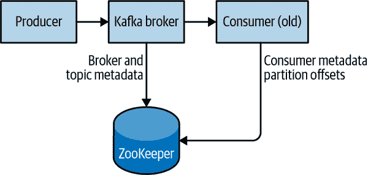

# 第二章：安装 Kafka

本章描述了如何开始使用 Apache Kafka 代理，包括如何设置 Apache ZooKeeper，Kafka 用于存储代理的元数据。本章还将涵盖 Kafka 部署的基本配置选项，以及一些关于选择正确硬件来运行代理的建议。最后，我们将介绍如何在单个集群的一部分安装多个 Kafka 代理，以及在生产环境中使用 Kafka 时应该了解的一些事项。

# 环境设置

在使用 Apache Kafka 之前，您的环境需要设置一些先决条件，以确保其正常运行。以下部分将指导您完成这个过程。

## 选择操作系统

Apache Kafka 是一个 Java 应用程序，可以在许多操作系统上运行。虽然 Kafka 可以在许多操作系统上运行，包括 Windows、macOS、Linux 和其他操作系统，但 Linux 是一般用例的推荐操作系统。本章中的安装步骤将重点介绍在 Linux 环境中设置和使用 Kafka。有关在 Windows 和 macOS 上安装 Kafka 的信息，请参阅附录 A。

## 安装 Java

在安装 ZooKeeper 或 Kafka 之前，您需要设置并运行 Java 环境。Kafka 和 ZooKeeper 与所有基于 OpenJDK 的 Java 实现（包括 Oracle JDK）兼容。最新版本的 Kafka 支持 Java 8 和 Java 11。安装的确切版本可以是操作系统提供的版本，也可以是直接从网络下载的版本，例如[Oracle 版本的 Oracle 网站](https://www.oracle.com/java)。虽然 ZooKeeper 和 Kafka 可以与运行时版本的 Java 一起工作，但在开发工具和应用程序时建议使用完整的 Java 开发工具包（JDK）。建议安装 Java 环境的最新发布的补丁版本，因为旧版本可能存在安全漏洞。安装步骤将假定您已经安装了部署在*/usr/java/jdk-11.0.10*的 JDK 版本 11 更新 10。

## 安装 ZooKeeper

Apache Kafka 使用 Apache ZooKeeper 存储有关 Kafka 集群的元数据，以及消费者客户端详细信息，如图 2-1 所示。ZooKeeper 是一个集中式服务，用于维护配置信息、命名、提供分布式同步和提供组服务。本书不会详细介绍 ZooKeeper，而是将解释限制在操作 Kafka 所需的内容。虽然可以使用 Kafka 分发中包含的脚本运行 ZooKeeper 服务器，但从分发中安装完整版本的 ZooKeeper 是微不足道的。



###### 图 2-1：Kafka 和 ZooKeeper

Kafka 已经广泛测试了稳定的 ZooKeeper 3.5 版本，并定期更新以包括最新版本。在本书中，我们将使用 ZooKeeper 3.5.9，可以从[ZooKeeper 网站](https://oreil.ly/iMZjR)下载。

### 独立服务器

ZooKeeper 附带一个基本示例配置文件，对于大多数用例来说都可以正常工作，位于*/usr/local/zookeeper/config/zoo_sample.cfg*。但是，为了演示目的，我们将在本书中手动创建一些基本设置的配置文件。以下示例在*/usr/local/zookeeper*中使用基本配置安装 ZooKeeper，并将其数据存储在*/var/lib/zookeeper*中：

```java
# tar -zxf apache-zookeeper-3.5.9-bin.tar.gz
# mv apache-zookeeper-3.5.9-bin /usr/local/zookeeper
# mkdir -p /var/lib/zookeeper
# cp > /usr/local/zookeeper/conf/zoo.cfg << EOF
> tickTime=2000
> dataDir=/var/lib/zookeeper
> clientPort=2181
> EOF
# export JAVA_HOME=/usr/java/jdk-11.0.10
# /usr/local/zookeeper/bin/zkServer.sh start
JMX enabled by default
Using config: /usr/local/zookeeper/bin/../conf/zoo.cfg
Starting zookeeper ... STARTED
#
```

您现在可以通过连接到客户端端口并发送四字命令`srvr`来验证 ZooKeeper 是否在独立模式下正确运行。这将从运行的服务器返回基本的 ZooKeeper 信息：

```java
# telnet localhost 2181
Trying 127.0.0.1...
Connected to localhost.
Escape character is '^]'.
srvr
Zookeeper version: 3.5.9-83df9301aa5c2a5d284a9940177808c01bc35cef, built on 01/06/2021 19:49 GMT
Latency min/avg/max: 0/0/0
Received: 1
Sent: 0
Connections: 1
Outstanding: 0
Zxid: 0x0
Mode: standalone
Node count: 5
Connection closed by foreign host.
#
```

### ZooKeeper 集合

ZooKeeper 被设计为作为一个名为*ensemble*的集群工作，以确保高可用性。由于使用的平衡算法，建议集群包含奇数个服务器（例如 3、5 等），因为大多数集群成员（*quorum*）必须正常工作才能响应 ZooKeeper 的请求。这意味着在一个三节点集群中，您可以运行一个节点缺失。在一个五节点集群中，您可以运行两个节点缺失。

# 调整 ZooKeeper 集群的大小

考虑在一个五节点集群中运行 ZooKeeper。要对集群进行配置更改，包括交换节点，您需要逐个重新加载节点。如果您的集群不能容忍多于一个节点宕机，进行维护工作会增加额外的风险。此外，不建议运行超过七个节点，因为由于共识协议的性质，性能可能开始下降。

此外，如果您觉得五个或七个节点无法支持由于太多客户端连接而产生的负载，请考虑添加额外的观察者节点来帮助平衡只读流量。

要在集群中配置 ZooKeeper 服务器，它们必须有一个列出所有服务器的共同配置，每个服务器在数据目录中需要一个指定服务器 ID 号的*myid*文件。如果集群中的服务器的主机名是`zoo1.example.com`，`zoo2.example.com`和`zoo3.example.com`，配置文件可能如下所示：

```java
tickTime=2000
dataDir=/var/lib/zookeeper
clientPort=2181
initLimit=20
syncLimit=5
server.1=zoo1.example.com:2888:3888
server.2=zoo2.example.com:2888:3888
server.3=zoo3.example.com:2888:3888
```

在此配置中，`initLimit`是允许跟随者与领导者连接的时间。`syncLimit`值限制了落后于领导者的跟随者可以有多久。这两个值都是`tickTime`单位的数字，这使得`init​Li⁠mit`为 20×2,000 毫秒，即 40 秒。配置还列出了集群中的每个服务器。服务器以`*server.X=hostname:peerPort:leaderPort*`的格式指定，具有以下参数：

`X`

服务器的 ID 号。这必须是一个整数，但不需要基于零或连续。

`hostname`

服务器的主机名或 IP 地址。

`peerPort`

用于集群中的服务器相互通信的 TCP 端口。

`leaderPort`

用于执行领导者选举的 TCP 端口。

客户端只需要能够通过`*clientPort*`连接到集群，但集群的成员必须能够通过所有三个端口相互通信。

除了共享配置文件之外，每个服务器必须在*dataDir*目录中有一个名为*myid*的文件。该文件必须包含服务器的 ID 号，该号码必须与配置文件匹配。完成这些步骤后，服务器将启动并在集群中相互通信。

# 在单台机器上测试 ZooKeeper 集群

可以通过在配置中指定所有主机名为`localhost`并为每个实例指定唯一的`*peerPort*`和`*leaderPort*`来在单台机器上测试和运行 ZooKeeper 集群。此外，每个实例都需要创建一个单独的*zoo.cfg*，其中为每个实例定义了唯一的*dataDir*和`*clientPort*`。这只对测试目的有用，但*不*建议用于生产系统。

# 安装 Kafka Broker

一旦 Java 和 ZooKeeper 配置完成，您就可以安装 Apache Kafka 了。当前版本可以从[Kafka 网站](https://oreil.ly/xLopS)下载。截至目前，该版本是在 Scala 版本 2.13.0 下运行的 2.8.0 版本。本章的示例是使用 2.7.0 版本显示的。

以下示例在*/usr/local/kafka*中安装 Kafka，配置为使用先前启动的 ZooKeeper 服务器，并将消息日志段存储在*/tmp/kafka-logs*中：

```java
# tar -zxf kafka_2.13-2.7.0.tgz
# mv kafka_2.13-2.7.0 /usr/local/kafka
# mkdir /tmp/kafka-logs
# export JAVA_HOME=/usr/java/jdk-11.0.10
# /usr/local/kafka/bin/kafka-server-start.sh -daemon
/usr/local/kafka/config/server.properties
#
```

一旦 Kafka 经纪人启动，我们可以通过针对集群执行一些简单操作来验证它是否正常工作：创建一个测试主题，生成一些消息，并消费相同的消息。

创建和验证主题：

```java
# /usr/local/kafka/bin/kafka-topics.sh --bootstrap-server localhost:9092 --create
--replication-factor 1 --partitions 1 --topic test
Created topic "test".
# /usr/local/kafka/bin/kafka-topics.sh --bootstrap-server localhost:9092
--describe --topic test
Topic:test    PartitionCount:1    ReplicationFactor:1    Configs:
 Topic: test    Partition: 0    Leader: 0    Replicas: 0    Isr: 0
#
```

向测试主题生成消息（使用 Ctrl-C 随时停止生产者）：

```java
# /usr/local/kafka/bin/kafka-console-producer.sh --bootstrap-server
localhost:9092 --topic test
Test Message 1
Test Message 2
^C
#
```

从测试主题消费消息：

```java
# /usr/local/kafka/bin/kafka-console-consumer.sh --bootstrap-server
localhost:9092 --topic test --from-beginning
Test Message 1
Test Message 2
^C
Processed a total of 2 messages
#
```

# Kafka CLI 实用程序上的 ZooKeeper 连接的弃用

如果您熟悉 Kafka 实用程序的旧版本，您可能习惯于使用“--zookeeper”连接字符串。在几乎所有情况下，这已经被弃用。当前的最佳实践是使用更新的“--bootstrap-server”选项，并直接连接到 Kafka 经纪人。如果在集群中运行，可以提供集群中任何经纪人的主机:端口。

# 配置经纪人

Kafka 发行版提供的示例配置足以作为概念验证运行独立服务器，但很可能不足以满足大型安装的需求。Kafka 有许多配置选项，可以控制设置和调整的各个方面。大多数选项可以保留默认设置，因为它们涉及 Kafka 经纪人的调整方面，直到您有特定的用例需要调整这些设置之前，这些设置都不适用。

## 一般经纪人参数

在部署 Kafka 到除单个服务器上的独立经纪人之外的任何环境时，应该审查几个经纪人配置参数。这些参数涉及经纪人的基本配置，大多数必须更改才能在与其他经纪人的集群中正确运行。

### broker.id

每个 Kafka 经纪人必须有一个整数标识符，这是使用“broker.id”配置设置的。默认情况下，此整数设置为“0”，但可以是任何值。对于单个 Kafka 集群中的每个经纪人，这个整数必须是唯一的。选择这个数字在技术上是任意的，如果需要进行维护任务，它可以在经纪人之间移动。然而，强烈建议将此值设置为主机的某些固有值，以便在执行维护时，将经纪人 ID 号映射到主机上不是繁重的任务。例如，如果您的主机名包含唯一的数字（例如`host1.example.com`，`host2.example.com`等），那么分别为`broker.id`值选择`1`和`2`是不错的选择。

### listeners

Kafka 的旧版本使用简单的“端口”配置。这仍然可以作为简单配置的备份使用，但已经是一个不推荐的配置。示例配置文件在 TCP 端口 9092 上启动 Kafka 监听器。新的“listeners”配置是一个以逗号分隔的 URI 列表，我们使用监听器名称进行监听。如果监听器名称不是常见的安全协议，那么必须配置另一个配置“listener.security.protocol.map”。监听器被定义为“*<protocol>://<hostname>:<port>*”。合法的“listener”配置示例是“PLAINTEXT://localhost:9092,SSL://:9091”。将主机名指定为“0.0.0.0”将绑定到所有接口。将主机名留空将绑定到默认接口。请记住，如果选择低于 1024 的端口，Kafka 必须以 root 用户身份启动。以 root 用户身份运行 Kafka 不是推荐的配置。

### zookeeper.connect

用于存储经纪人元数据的 ZooKeeper 的位置是使用“zookeeper.connect”配置参数设置的。示例配置使用在本地主机上端口 2181 上运行的 ZooKeeper，指定为“localhost:2181”。此参数的格式是一个以分号分隔的“hostname:port/path”字符串列表，其中包括：

`hostname`

ZooKeeper 服务器的主机名或 IP 地址。

`port`

服务器的客户端端口号。

`/path`

用作 Kafka 集群的 chroot 环境的可选 ZooKeeper 路径。如果省略，将使用根路径。

如果指定了 chroot 路径（指定为给定应用程序的根目录的路径）并且不存在，代理在启动时将创建它。

# 为什么使用 Chroot 路径？

通常认为使用 Kafka 集群的 chroot 路径是一个良好的做法。这允许 ZooKeeper 集合与其他应用程序共享，包括其他 Kafka 集群，而不会发生冲突。最好还要在此配置中指定多个 ZooKeeper 服务器（它们都是同一个集合的一部分）。这允许 Kafka 代理在服务器故障时连接到 ZooKeeper 集合的另一个成员。

### log.dirs

Kafka 将所有消息持久化到磁盘，并将这些日志段存储在`log.dir`配置中指定的目录中。对于多个目录，首选使用`log.dirs`配置。如果未设置此值，它将默认回到`log.dir`。`log.dirs`是本地系统上路径的逗号分隔列表。如果指定了多个路径，代理将以“最少使用”的方式在其中存储分区，一个分区的日志段存储在同一路径中。请注意，代理将在当前存储的分区数量最少的路径中放置新的分区，而不是使用的磁盘空间最少，因此不能保证在多个目录中均匀分布数据。

### num.recovery.threads.per.data.dir

Kafka 使用可配置的线程池来处理日志段。目前，该线程池用于：

+   正常启动时，打开每个分区的日志段

+   在故障后启动时，检查和截断每个分区的日志段

+   关闭时，清理关闭日志段

默认情况下，每个日志目录只使用一个线程。由于这些线程仅在启动和关闭期间使用，因此合理地设置更多的线程以并行化操作是合理的。特别是在从不干净的关闭中恢复时，这可能意味着在重新启动具有大量分区的代理时节省数小时的时间！设置此参数时，请记住配置的数量是指`log.dirs`指定的每个日志目录。这意味着如果`num.​recov⁠ery.threads.per.data.dir`设置为 8，并且在`log.dirs`中指定了 3 个路径，则总共有 24 个线程。

### auto.create.topics.enable

默认的 Kafka 配置指定代理在以下情况下应自动创建主题：

+   当生产者开始向主题写入消息时

+   当消费者开始从主题中读取消息时

+   当任何客户端请求主题的元数据时

在许多情况下，这可能是不希望的行为，特别是因为没有办法通过 Kafka 协议验证主题的存在而不导致其被创建。如果您正在显式管理主题创建，无论是手动还是通过配置系统，都可以将`auto.create.topics.enable`配置设置为`false`。

### auto.leader.rebalance.enable

为了确保 Kafka 集群不会因为所有主题领导都在一个代理上而变得不平衡，可以指定此配置以尽可能平衡领导。它启用了一个后台线程，定期检查分区的分布（此间隔可通过`leader.​imbal⁠ance.check.interval.seconds`进行配置）。如果领导不平衡超过另一个配置`leader.imbalance.per.broker.percentage`，则会开始重新平衡分区的首选领导。

### delete.topic.enable

根据您的环境和数据保留指南，您可能希望锁定集群以防止任意删除主题。通过将此标志设置为`false`，可以禁用主题删除。

## 主题默认值

Kafka 服务器配置指定了为创建的主题设置的许多默认配置。其中包括分区计数和消息保留等参数，可以使用管理工具（在第十二章中介绍）针对每个主题进行设置。服务器配置中的默认值应设置为适用于集群中大多数主题的基线值。

# 使用每个主题的覆盖

在较旧版本的 Kafka 中，可以使用代理配置中的参数`log.retention.hours.per.topic`、`log.reten⁠tion.​bytes.per.topic`和`log.segment.bytes.per.topic`为这些配置指定每个主题的覆盖。这些参数不再受支持，必须使用管理工具指定覆盖。

### num.partitions

`num.partitions`参数确定新主题创建时创建多少个分区，主要是在启用自动主题创建时（这是默认设置）使用。此参数默认为一个分区。请记住，主题的分区数量只能增加，不能减少。这意味着如果主题需要比`num.partitions`更少的分区，就需要小心地手动创建主题（在第十二章中讨论）。

如第一章中所述，分区是 Kafka 集群中扩展主题的方式，这使得使用能够平衡整个集群中的消息负载的分区计数变得重要，因为添加代理时会增加负载。许多用户将主题的分区计数设置为等于或是集群中代理数量的倍数。这样可以使分区均匀分布到代理中，从而均匀分布消息负载。例如，在 Kafka 集群中运行的具有 10 个分区的主题，如果有 10 个主机且领导权在所有 10 个主机之间平衡，将具有最佳吞吐量。然而，这并不是必须的，因为您也可以通过其他方式平衡消息负载，比如使用多个主题。

考虑到这一切，很明显您希望有很多分区，但不要太多。如果您对主题的目标吞吐量和消费者的预期吞吐量有一些估计，可以将目标吞吐量除以预期消费者吞吐量，以此确定分区数量。因此，如果我们希望能够从主题中写入和读取 1GBps，并且我们知道每个消费者只能处理 50MBps，那么我们知道至少需要 20 个分区。这样，我们可以有 20 个消费者从主题中读取，并实现 1GBps 的吞吐量。

如果您没有这些详细信息，我们的经验表明，将磁盘上的分区大小限制在每天不到 6GB 的保留量通常会产生令人满意的结果。从小开始，根据需要扩展比从大开始更容易。

### default.replication.factor

如果启用了自动主题创建，此配置设置了新主题的复制因子应该是多少。复制策略可以根据集群的所需耐久性或可用性而变化，并将在后面的章节中进行更多讨论。如果您在集群中运行 Kafka，可以防止由 Kafka 内部能力之外的因素（如硬件故障）导致的故障，以下是一个简要建议。

强烈建议将复制因子设置为至少高于`min.insync.replicas`设置的 1。对于更具容错性的设置，如果您有足够大的集群和足够的硬件，将复制因子设置为高于`min.insync.replicas`的 2（简称为 RF++）可能更可取。RF++将使维护更容易，并防止停机。这个建议的原因是允许在副本集中同时发生一个计划内的停机和一个非计划内的停机。对于典型的集群，这意味着每个分区至少有三个副本。例如，如果在 Kafka 或底层操作系统的滚动部署或升级期间发生网络交换机故障、磁盘故障或其他非计划问题，您可以确保仍然有额外的副本可用。这将在第七章中进一步讨论。

### 日志保留时间（log.retention.ms）

Kafka 保留消息的最常见配置是按时间。默认值在配置文件中使用`log.retention.hours`参数指定，设置为 168 小时，即一周。然而，还允许使用另外两个参数，`log.retention.minutes`和`log.retention.ms`。所有这三个参数都控制相同的目标（消息可能被删除的时间），但建议使用的参数是`log.retention.ms`，因为如果指定了多个参数，较小的单位大小将优先。这将确保始终使用`log.retention.ms`设置的值。如果指定了多个参数，较小的单位大小将优先。

# 按时间和最后修改时间保留

按时间保留是通过检查磁盘上每个日志段文件的最后修改时间（mtime）来执行的。在正常的集群操作下，这是日志段关闭的时间，并代表文件中最后一条消息的时间戳。然而，当使用管理工具在代理之间移动分区时，这个时间是不准确的，会导致这些分区的过度保留。有关此信息，请参阅第十二章讨论分区移动。

### 日志保留字节数（log.retention.bytes）

另一种过期消息的方法是基于保留的消息总字节数。这个值是使用`log.retention.bytes`参数设置的，它是针对每个分区应用的。这意味着如果您有一个包含 8 个分区的主题，并且`log.retention.bytes`设置为 1GB，则主题保留的数据量最多为 8GB。请注意，所有保留都是针对单个分区执行的，而不是主题。这意味着如果主题的分区数量扩大，使用`log.retention.bytes`时保留也会增加。将值设置为-1 将允许无限保留。

# 按大小和时间配置保留

如果您同时为`log.retention.bytes`和`log.retention.ms`（或其他按时间保留的参数）指定了值，则在满足任一标准时可能会删除消息。例如，如果`log.retention.ms`设置为 86400000（1 天），而`log.retention.bytes`设置为 1000000000（1GB），如果一天内的消息总量大于 1GB，则可能会删除不到 1 天的消息。相反，如果总量小于 1GB，则即使分区的总大小小于 1GB，也可能在 1 天后删除消息。为了简单起见，建议选择基于大小或时间的保留方式，而不是两者兼用，以防止意外和不必要的数据丢失，但更高级的配置可以同时使用两者。

### 日志段字节数（log.segment.bytes）

先前提到的日志保留设置是针对日志段而不是单个消息的。当消息被生产到 Kafka 代理时，它们会附加到分区的当前日志段。一旦日志段达到由`log.segment.bytes`参数指定的大小（默认为 1GB），日志段将关闭并打开一个新的日志段。一旦日志段关闭，就可以考虑将其过期。较小的日志段大小意味着文件必须更频繁地关闭和分配，这会降低磁盘写入的整体效率。

如果主题的生产速率较低，则调整日志段的大小可能很重要。例如，如果一个主题每天只接收 100 兆字节的消息，并且`log.segment.bytes`设置为默认值，则需要 10 天才能填满一个段。由于消息直到日志段关闭后才能过期，如果`log.retention.ms`设置为 604800000（1 周），则实际上将保留多达 17 天的消息，直到关闭的日志段过期。这是因为一旦当前有 10 天的消息的日志段关闭，必须在根据时间策略过期之前保留该日志段 7 天（因为在最后一条消息过期之前无法删除该段）。

# 按时间戳检索偏移量

日志段的大小还会影响按时间戳获取偏移量的行为。当请求特定时间戳的分区偏移量时，Kafka 会找到在该时间正在写入的日志段文件。它通过使用文件的创建时间和最后修改时间来执行此操作，并寻找在指定时间戳之前创建并在指定时间戳之后最后修改的文件。响应中返回该日志段开头的偏移量（也是文件名）。

### log.roll.ms

另一种控制日志段何时关闭的方法是使用`log.roll.ms`参数，该参数指定多长时间后应关闭日志段。与`log.retention.bytes`和`log.retention.ms`参数一样，`log.segment.bytes`和`log.roll.ms`不是互斥的属性。Kafka 将在达到大小限制或时间限制时关闭日志段，以先到者为准。默认情况下，没有`log.roll.ms`设置，这导致只按大小关闭日志段。

# 使用基于时间的日志段时的磁盘性能

当使用基于时间的日志段限制时，重要的是要考虑当多个日志段同时关闭时对磁盘性能的影响。当有许多分区从未达到日志段的大小限制时，会发生这种情况，因为时间限制的时钟将在代理启动时开始，并且对于这些低容量分区，它将始终在相同的时间执行。

### min.insync.replicas

在为数据耐久性配置集群时，将`min.insync.replicas`设置为 2 可以确保至少有两个副本与生产者“同步”。这与将生产者配置设置为确认“所有”请求一起使用。这将确保至少有两个副本（领导者和另一个副本）确认写入才能成功。这可以防止数据丢失，例如领导者确认写入，然后发生故障并且领导权转移到没有成功写入的副本的情况。没有这些耐用的设置，生产者会认为它成功生产了，但消息会被丢弃和丢失。然而，配置更高的耐久性会导致效率降低，因为涉及额外的开销，因此不建议对可以容忍偶尔消息丢失的高吞吐量集群更改此设置。有关更多信息，请参见第七章。

### message.max.bytes

Kafka 经纪限制了可以生成的消息的最大大小，由`message.max.bytes`参数配置，默认为 1000000，即 1MB。尝试发送大于此值的消息的生产者将从经纪那里收到错误，并且消息将不被接受。与经纪上指定的所有字节大小一样，此配置涉及压缩消息大小，这意味着生产者可以发送比此值大得多的未压缩消息，只要它们压缩到配置的`message.max.bytes`大小以下。

增加允许的消息大小会对性能产生明显影响。更大的消息意味着处理网络连接和请求的经纪线程将在每个请求上工作更长时间。更大的消息还会增加磁盘写入的大小，这将影响 I/O 吞吐量。其他存储解决方案，如 blob 存储和/或分层存储，可能是解决大容量磁盘写入问题的另一种方法，但本章不涉及这些内容。

# 协调消息大小配置

Kafka 经纪上配置的消息大小必须与消费者客户端上的`fetch.message.max.bytes`配置协调。如果这个值小于`message.max.bytes`，那么遇到更大消息的消费者将无法获取这些消息，导致消费者陷入僵局无法继续。当在集群中配置时，经纪上的`replica.fetch.max.bytes`配置也适用相同规则。

# 选择硬件

为 Kafka 经纪选择适当的硬件配置可能更多地是一门艺术而不是科学。Kafka 本身对特定硬件配置没有严格要求，并且在大多数系统上都可以正常运行。然而，一旦性能成为问题，有几个因素可能导致整体性能瓶颈：磁盘吞吐量和容量，内存，网络和 CPU。当扩展 Kafka 到非常大规模时，由于需要更新的元数据量，单个经纪可以处理的分区数量也可能受到限制。一旦确定了哪些性能类型对您的环境最为关键，您可以选择一个适合预算的优化硬件配置。

## 磁盘吞吐量

生产者客户端的性能将受到用于存储日志段的经纪磁盘吞吐量的直接影响。Kafka 消息在生成时必须提交到本地存储，大多数客户端将等待至少一个经纪确认消息已提交，然后才会考虑发送成功。这意味着更快的磁盘写入将等于更低的生成延迟。

在磁盘吞吐量方面的明显决定是选择传统的旋转硬盘驱动器（HDD）还是固态硬盘（SSD）。SSD 具有极低的搜索和访问时间，并提供最佳性能。另一方面，HDD 更经济，并且每单位提供更大的容量。您还可以通过在经纪中使用更多的 HDD 来提高性能，无论是通过拥有多个数据目录还是通过设置冗余独立磁盘阵列（RAID）配置来设置驱动器。其他因素，如特定的驱动器技术（例如串行附加存储或串行 ATA），以及驱动器控制器的质量，都会影响吞吐量。一般来说，观察表明 HDD 驱动器通常对于存储需求非常高但访问频率不高的集群更有用，而如果有大量客户端连接，则 SSD 是更好的选择。

## 磁盘容量

容量是存储讨论的另一面。所需的磁盘容量取决于任何时候需要保留多少消息。如果预计经纪人每天将接收 1TB 的流量，并且保留 7 天，那么经纪人将需要至少 7TB 的可用存储来存储日志段。您还应该考虑至少 10%的其他文件开销，以及您希望保持用于流量波动或随时间增长的任何缓冲区。

存储容量是确定 Kafka 集群规模和确定何时扩展的因素之一。通过为每个主题设置多个分区，可以在集群中平衡总流量，这将允许额外的经纪人增加可用容量，如果单个经纪人上的密度不够。对所需磁盘容量的决定也将受到为集群选择的复制策略的影响（在第七章中有更详细的讨论）。

## 内存

Kafka 消费者的正常操作模式是从分区的末尾读取，消费者赶上生产者并且滞后很少，如果有的话。在这种情况下，消费者正在读取的消息被最佳地存储在系统的页面缓存中，这会比经纪人不得不重新从磁盘读取消息时读取更快。因此，为系统提供更多的内存用于页面缓存将提高消费者客户端的性能。

Kafka 本身不需要为 Java 虚拟机（JVM）配置太多堆内存。即使处理每秒 15 万条消息和每秒 200 兆位的数据速率的经纪人也可以运行 5GB 堆。系统内存的其余部分将被页面缓存使用，并且通过允许系统缓存正在使用的日志段来使 Kafka 受益。这是不建议将 Kafka 与任何其他重要应用程序共存的主要原因，因为它将不得不共享页面缓存的使用。这将降低 Kafka 的消费者性能。

## 网络

可用的网络吞吐量将指定 Kafka 可以处理的最大流量。这可以是集群规模的决定性因素，结合磁盘存储。这受 Kafka 支持多个消费者所造成的入站和出站网络使用之间固有不平衡的影响。生产者可能为给定主题每秒写入 1MB，但可能有任意数量的消费者对出站网络使用量产生乘数效应。其他操作，如集群复制（在第七章中介绍）和镜像（在第十章中讨论），也会增加要求。如果网络接口变得饱和，集群复制落后是很常见的，这可能使集群处于脆弱状态。为防止网络成为主要决定因素，建议使用至少 10Gb 的网卡（网络接口卡）。老旧的配备 1Gb 网卡的机器很容易饱和，不建议使用。

## CPU

在扩展 Kafka 之前，处理能力并不像磁盘和内存那样重要，但它会在一定程度上影响经纪人的整体性能。理想情况下，客户端应该压缩消息以优化网络和磁盘使用。然而，Kafka 经纪人必须解压所有消息批次，以验证各个消息的“校验和”并分配偏移量。然后，它需要重新压缩消息批次以将其存储在磁盘上。这就是 Kafka 对处理能力需求的大部分来源。然而，除非集群变得非常大，单个集群中有数百个节点和数百万个分区，否则这不应该是选择硬件的主要因素。在那时，选择性能更好的 CPU 可以帮助减少集群大小。

# 云中的 Kafka

近年来，Kafka 在云计算环境中的安装越来越普遍，例如微软 Azure、亚马逊的 AWS 或谷歌云平台。有许多选项可以在云中设置并通过供应商（如 Confluent）或甚至通过 Azure 自己的 HDInsight 上的 Kafka 进行管理，但以下是一些简单的建议，如果您计划手动管理自己的 Kafka 集群。在大多数云环境中，您可以选择许多计算实例，每个实例都具有不同的 CPU、内存、IOPS 和磁盘组合。必须优先考虑 Kafka 的各种性能特征，以选择正确的实例配置。

## 微软 Azure

在 Azure 中，您可以单独管理磁盘和虚拟机（VM），因此决定您的存储需求不需要与所选的 VM 类型相关。也就是说，决策的一个好的起点是所需的数据保留量，然后是生产者所需的性能。如果需要非常低的延迟，可能需要使用优化了 I/O 的实例，利用高级 SSD 存储。否则，托管存储选项（如 Azure 托管磁盘或 Azure Blob 存储）可能就足够了。

在实际情况中，Azure 的经验表明，“标准 D16s v3”实例类型对于较小的集群是一个不错的选择，并且对于大多数用例来说性能足够好。为了匹配高性能硬件和 CPU 需求，“D64s v4”实例具有良好的性能，可以扩展到更大的集群。建议在 Azure 可用性集中构建您的集群，并在 Azure 计算故障域之间平衡分区，以确保可用性。一旦选择了 VM，接下来可以决定存储类型。强烈建议使用 Azure 托管磁盘而不是临时磁盘。如果移动 VM，您可能会面临丢失 Kafka 经纪人上所有数据的风险。HDD 托管磁盘相对便宜，但微软对可用性没有明确定义的服务级别协议（SLA）。高级 SSD 或 Ultra SSD 配置要贵得多，但速度更快，并且得到了微软 99.99%的 SLA 支持。或者，如果对延迟不那么敏感，可以使用 Microsoft Blob 存储。

## 亚马逊网络服务

在 AWS 中，如果需要非常低的延迟，可能需要使用具有本地 SSD 存储的 I/O 优化实例。否则，临时存储（如 Amazon 弹性块存储）可能就足够了。

在 AWS 中，常见的选择是“m4”或“r3”实例类型。 “m4”将允许更长的保留期，但磁盘吞吐量会较低，因为它在弹性块存储上。 “r3”实例将具有更好的本地 SSD 驱动器吞吐量，但这些驱动器将限制可以保留的数据量。为了兼顾两者，可能需要升级到“i2”或“d2”实例类型，但它们的价格要高得多。

# 配置 Kafka 集群

单个 Kafka 经纪人适用于本地开发工作，或用于概念验证系统，但将多个经纪人配置为集群有显著的好处，如图 2-2 所示。最大的好处是能够跨多台服务器分配负载。其次是使用复制来防范由于单个系统故障而导致的数据丢失。复制还将允许在维护 Kafka 或底层系统时仍保持对客户端的可用性。本节重点介绍了配置 Kafka 基本集群的步骤。第七章包含有关数据复制和持久性的更多信息。


###### 图 2-2：一个简单的 Kafka 集群

## 多少个经纪人？

Kafka 集群的适当大小由几个因素决定。通常，您的集群大小将受以下关键领域的限制：

+   磁盘容量

+   每个经纪人的副本容量

+   CPU 容量

+   网络容量

要考虑的第一个因素是保留消息所需的磁盘容量以及单个经纪人上可用的存储空间。如果集群需要保留 10 TB 的数据，单个经纪人可以存储 2 TB，那么最小的集群大小是 5 个经纪人。此外，增加复制因子将至少增加 100%的存储需求，具体取决于所选择的复制因子设置（请参阅第七章）。在这种情况下，副本指的是单个分区复制到的不同经纪人的数量。这意味着相同的集群，配置为复制 2，现在需要至少包含 10 个经纪人。

要考虑的另一个因素是集群处理请求的能力。这可以通过前面提到的其他三个瓶颈来展示。

如果您有一个包含 10 个经纪人的 Kafka 集群，但在您的集群中有超过 100 万个副本（即，具有复制因子 2 的 500,000 个分区），在均衡的情况下，每个经纪人承担大约 100,000 个副本。这可能导致生产、消费和控制器队列中的瓶颈。过去，官方建议是每个经纪人不超过 4,000 个分区副本，每个集群不超过 200,000 个分区副本。然而，集群效率的提高使得 Kafka 能够扩展得更大。目前，在配置良好的环境中，建议每个经纪人不要超过 14,000 个分区副本，每个集群不要超过 1 百万个副本。

如本章前面提到的，对于大多数用例来说，CPU 通常不是主要瓶颈，但如果经纪人上有过多的客户端连接和请求，它可能会成为瓶颈。根据有多少个唯一的客户端和消费者组，以及扩展以满足这些需求，可以帮助确保大型集群的更好性能。谈到网络容量，重要的是要考虑网络接口的容量，以及它们是否能够处理客户端流量，如果有多个数据的消费者，或者数据在保留期内的流量不一致（例如，在高峰时段的流量突发）。如果单个经纪人的网络接口在高峰时期使用了 80%的容量，并且有两个数据的消费者，那么除非有两个经纪人，否则消费者将无法跟上高峰期的流量。如果在集群中使用了复制，这是数据的另一个额外的消费者，必须考虑到。您可能还希望扩展到更多经纪人的集群，以处理由较低的磁盘吞吐量或系统可用内存引起的性能问题。

## 经纪人配置

在经纪人配置中，只有两个要求允许多个 Kafka 经纪人加入单个集群。第一个是所有经纪人必须对“zookeeper.connect”参数具有相同的配置。这指定了 ZooKeeper 集群和路径，集群在其中存储元数据。第二个要求是集群中的所有经纪人必须具有“broker.id”参数的唯一值。如果两个经纪人尝试使用相同的“broker.id”加入同一个集群，第二个经纪人将记录错误并无法启动。在运行集群时使用了其他配置参数，特别是控制复制的参数，这些将在后面的章节中介绍。

## 操作系统调优

虽然大多数 Linux 发行版都有适用于内核调优参数的开箱即用配置，对于 Kafka 经纪人，可以进行一些改变以提高性能。这些主要围绕虚拟内存和网络子系统以及用于存储日志段的磁盘挂载点的特定问题。这些参数通常在*/etc/sysctl.conf*文件中配置，但您应参考您的 Linux 发行版文档，了解如何调整内核配置的具体细节。

### 虚拟内存

一般来说，Linux 虚拟内存系统会自动调整以适应系统工作负载。我们可以对交换空间的处理方式以及脏内存页面进行一些调整，以调整这些内容以适应 Kafka 的工作负载。

与大多数应用程序一样，特别是对吞吐量有要求的应用程序，最好尽量避免交换。将内存页面交换到磁盘会导致 Kafka 在性能的各个方面都有明显的影响。此外，Kafka 大量使用系统页缓存，如果 VM 系统交换到磁盘，那么分配给页缓存的内存不足。

避免交换的一种方法就是根本不配置任何交换空间。拥有交换空间并不是一个要求，但如果系统发生灾难性事件，交换空间可以提供一个安全网。拥有交换空间可以防止操作系统因内存不足而突然终止进程。因此，建议将“vm.swappiness”参数设置为一个非常低的值，比如 1。该参数是 VM 子系统使用交换空间而不是从页缓存中丢弃页面的可能性的百分比。最好减少可用于页缓存的内存量，而不是利用任何交换内存。

# 为什么不将 Swappiness 设置为零？

以前，“vm.swappiness”的建议总是将其设置为 0。这个值曾经意味着“除非出现内存不足的情况，否则不进行交换”。然而，随着 Linux 内核版本 3.5-rc1 的改变，这个值的含义发生了变化，并且这个改变被反向移植到了许多发行版中，包括 Red Hat 企业 Linux 内核版本 2.6.32-303。这改变了值 0 的含义为“在任何情况下都不进行交换”。这就是为什么现在建议使用值 1。

调整内核处理必须刷新到磁盘的脏页的方式也有好处。Kafka 依赖于磁盘 I/O 性能来为生产者提供良好的响应时间。这也是日志段通常放在快速磁盘上的原因，无论是具有快速响应时间的单独磁盘（例如 SSD）还是具有大量 NVRAM 用于缓存的磁盘子系统（例如 RAID）。结果是，在后台刷新进程开始将脏页写入磁盘之前允许的脏页数量可以减少。通过将`vm.dirty_background_ratio`的值设置为低于默认值 10 来实现。该值是系统内存总量的百分比，将该值设置为 5 在许多情况下是合适的。但是，不应将此设置为零，因为这将导致内核不断刷新页面，从而消除内核对磁盘写入的缓冲，以应对底层设备性能的暂时性波动。

在内核强制同步操作将脏页刷新到磁盘之前允许的脏页总数也可以通过将`vm.dirty_ratio`的值更改为默认值 20 以上（也是总系统内存的百分比）来增加。对于这个设置，有很多可能的值，但在 60 到 80 之间是一个合理的数字。这个设置确实会引入一定的风险，无论是未刷新的磁盘活动量还是强制同步刷新可能导致的长时间 I/O 暂停。如果选择更高的`vm.dirty_ratio`设置，强烈建议在 Kafka 集群中使用复制来防范系统故障。

在选择这些参数的值时，明智的做法是在 Kafka 集群在负载下运行时（无论是在生产环境还是模拟环境下）随时间审查脏页的数量。当前的脏页数量可以通过检查*/proc/vmstat*文件来确定：

```java
# cat /proc/vmstat | egrep "dirty|writeback"
nr_dirty 21845
nr_writeback 0
nr_writeback_temp 0
nr_dirty_threshold 32715981
nr_dirty_background_threshold 2726331
#
```

Kafka 使用文件描述符来跟踪日志段和打开的连接。如果一个代理有很多分区，那么该代理至少需要*(分区数)*×*(分区大小/段大小)*来跟踪所有日志段，另外还需要跟踪代理建立的连接数。因此，建议根据上述计算将`vm.max_map_count`更新为一个非常大的数字。根据环境的不同，将这个值更改为 400,000 或 600,000 通常是成功的。还建议将`vm.overcommit_memory`设置为 0。将默认值设置为 0 表示内核从应用程序确定空闲内存的数量。如果将属性设置为非零值，可能会导致操作系统获取过多的内存，从而剥夺 Kafka 进行最佳操作所需的内存。这对于具有高摄入速率的应用程序是常见的。

### 磁盘

除了选择磁盘设备硬件以及如果使用 RAID 则配置 RAID 之外，为该磁盘选择文件系统可能对性能产生更大的影响。有许多不同的文件系统可用，但本地文件系统的最常见选择要么是 Ext4（第四个扩展文件系统），要么是 Extents 文件系统（XFS）。 XFS 已成为许多 Linux 发行版的默认文件系统，这是有充分理由的：它在大多数工作负载下的性能优于 Ext4，而且几乎不需要进行调整。 Ext4 可以表现良好，但需要使用被认为不太安全的调整参数。这包括将提交间隔设置为比默认值五更长的时间，以强制较少的刷新。 Ext4 还引入了块的延迟分配，这增加了数据丢失和文件系统损坏的风险，以防系统故障。 XFS 文件系统也使用延迟分配算法，但通常比 Ext4 使用的算法更安全。 XFS 在 Kafka 的工作负载下也具有更好的性能，而无需进行文件系统执行的自动调整之外的调整。在批处理磁盘写入时，它也更有效，所有这些都结合在一起，提供更好的整体 I/O 吞吐量。

无论选择哪种文件系统用于保存日志段的挂载点，建议为挂载点设置`noatime`挂载选项。文件元数据包含三个时间戳：创建时间（`ctime`），上次修改时间（`mtime`）和上次访问时间（`atime`）。默认情况下，每次读取文件时都会更新`atime`。这会产生大量的磁盘写入。`atime`属性通常被认为没有什么用，除非应用程序需要知道文件是否自上次修改以来已被访问（在这种情况下可以使用`relatime`选项）。 Kafka 根本不使用`atime`，因此禁用它是安全的。在挂载点上设置`noatime`将阻止这些时间戳的更新，但不会影响`ctime`和`mtime`属性的正确处理。使用`largeio`选项还可以帮助提高 Kafka 的效率，特别是在进行更大的磁盘写入时。

### 网络

调整 Linux 网络堆栈的默认调整对于任何产生大量网络流量的应用程序都很常见，因为内核默认情况下未针对大型高速数据传输进行调整。实际上，Kafka 的推荐更改与大多数 Web 服务器和其他网络应用程序建议的更改相同。第一个调整是更改为每个套接字分配的发送和接收缓冲区的默认和最大内存量。这将显着提高大型传输的性能。每个套接字的发送和接收缓冲区默认大小的相关参数是`net.core.wmem_default`和`net.core.rmem_default`，这些参数的合理设置是 131072，或 128 KiB。发送和接收缓冲区的最大大小的参数是`net.core.wmem_max`和`net.core.rmem_max`，这些参数的合理设置是 2097152，或 2 MiB。请记住，最大大小并不表示每个套接字都会分配这么多的缓冲区空间；它只允许在需要时分配多达这么多的空间。

除了套接字设置之外，TCP 套接字的发送和接收缓冲区大小必须使用`net.ipv4.tcp_wmem`和`net.ipv4.tcp_rmem`参数分别设置。这些参数使用三个以空格分隔的整数来指定最小、默认和最大大小。最大大小不能大于使用`net.core.wmem_max`和`net.core.rmem_max`设置的所有套接字的值。每个参数的示例设置是“4096 65536 2048000”，这是 4 KiB 最小，64 KiB 默认和 2 MiB 最大缓冲区。根据 Kafka 经纪人的实际工作负载，您可能希望增加最大大小，以允许更大的网络连接缓冲。

有几个其他网络调优参数是有用的。通过将`net.ipv4.tcp_window_scaling`设置为 1 来启用 TCP 窗口缩放将允许客户端更有效地传输数据，并允许数据在代理端进行缓冲。将`net.ipv4.tcp_max_syn_backlog`的值增加到默认值 1024 以上将允许更多的同时连接被接受。将`net.core.netdev_max_backlog`的值增加到默认值 1000 以上可以在网络流量突发时提供帮助，特别是在使用多千兆网络连接速度时，通过允许更多的数据包排队等待内核处理它们。

# 生产方面的考虑

一旦您准备将 Kafka 环境从测试中移出并投入到生产运营中，还有一些需要考虑的事项，这将有助于建立可靠的消息服务。

## 垃圾收集器选项

调整应用程序的 Java 垃圾收集选项一直是一种艺术，需要详细了解应用程序如何使用内存以及大量的观察和试错。幸运的是，随着 Java 7 和 Garbage-First 垃圾收集器（G1GC）的引入，情况已经改变。虽然最初 G1GC 被认为不稳定，但在 JDK8 和 JDK11 中有了显著改进。现在建议 Kafka 使用 G1GC 作为默认的垃圾收集器。G1GC 旨在自动调整不同的工作负载，并在应用程序的生命周期内提供一致的垃圾收集暂停时间。它还通过将堆分成较小的区域并不在每次暂停中收集整个堆来轻松处理大堆大小。

G1GC 在正常操作中只需进行最少量的配置。有两个用于调整其性能的 G1GC 配置选项：

`MaxGCPauseMillis`

此选项指定每个垃圾回收周期的首选暂停时间。这不是一个固定的最大值——如果需要，G1GC 可以超过这个时间。默认值为 200 毫秒。这意味着 G1GC 将尝试安排垃圾收集器周期的频率，以及在每个周期中收集的区域数量，以便每个周期大约需要 200 毫秒。

`InitiatingHeapOccupancyPercent`

此选项指定在 G1GC 启动收集周期之前可以使用的堆总量的百分比。默认值为 45。这意味着 G1GC 在堆使用 45%之后才会启动收集周期。这包括新（Eden）和旧区域的使用总量。

Kafka 代理在利用堆内存和创建垃圾对象的方式上相当高效，因此可以将这些选项设置得更低。本节提供的垃圾收集器调优选项已被证明适用于具有 64GB 内存的服务器，在 5GB 堆中运行 Kafka。对于`MaxGCPauseMillis`，该代理可以配置为 20 毫秒的值。`InitiatingHeapOccupancyPercent`的值设置为 35，这会导致垃圾收集比默认值稍早地运行。

Kafka 最初发布时 G1GC 收集器尚不可用且不稳定。因此，Kafka 默认使用并发标记和扫描垃圾回收以确保与所有 JVM 的兼容性。新的最佳实践是对于 Java 1.8 及更高版本使用 G1GC。通过环境变量很容易进行更改。使用本章前面的`start`命令，修改如下：

```java
# export KAFKA_JVM_PERFORMANCE_OPTS="-server -Xmx6g -Xms6g
-XX:MetaspaceSize=96m -XX:+UseG1GC
-XX:MaxGCPauseMillis=20 -XX:InitiatingHeapOccupancyPercent=35
-XX:G1HeapRegionSize=16M -XX:MinMetaspaceFreeRatio=50
-XX:MaxMetaspaceFreeRatio=80 -XX:+ExplicitGCInvokesConcurrent"
# /usr/local/kafka/bin/kafka-server-start.sh -daemon
/usr/local/kafka/config/server.properties
#
```

## 数据中心布局

对于测试和开发环境来说，Kafka 经纪人在数据中心的物理位置并不是很重要，因为如果集群在短时间内部分或完全不可用，影响就不会那么严重。然而，在生产流量服务时，停机通常意味着损失，无论是因为用户服务的丢失还是因为对用户活动的遥测数据的丢失。这时就变得至关重要配置 Kafka 集群内的复制（参见第七章），同时也要考虑经纪人在数据中心机架中的物理位置。最好选择具有故障区域概念的数据中心环境。如果在部署 Kafka 之前没有解决这个问题，可能需要进行昂贵的维护来移动服务器。

Kafka 可以以机架感知的方式将新分区分配给经纪人，确保单个分区的副本不共享一个机架。为此，必须正确设置每个经纪人的`broker.rack`配置。出于类似的原因，在云环境中也可以将此配置设置为故障域。但是，这仅适用于新创建的分区。Kafka 集群不会监视不再具有机架感知的分区（例如，由于分区重新分配而导致的情况），也不会自动纠正这种情况。建议使用工具来保持集群平衡，以保持机架感知，例如 Cruise Control（参见附录 B）。正确配置这一点将有助于确保随着时间的推移继续保持机架感知。

总的来说，最佳实践是将集群中的每个 Kafka 经纪人安装在不同的机架上，或者至少不共享基础设施服务的单点故障，如电源和网络。这通常意味着至少部署将运行经纪人的服务器具有双电源连接（连接到两个不同的电路）和双网络交换机（服务器本身具有绑定接口以实现无缝故障转移）。即使有双重连接，将经纪人放在完全不同的机架中也是有益的。不时需要对机架或机柜进行物理维护，这可能需要将其脱机（例如移动服务器或重新布线电源连接）。

## 将应用程序放置在 ZooKeeper 上

Kafka 利用 ZooKeeper 存储有关经纪人、主题和分区的元数据信息。对 ZooKeeper 的写入仅在消费者组的成员资格发生变化或 Kafka 集群本身发生变化时才执行。这种流量通常很小，不足以为单个 Kafka 集群使用专用的 ZooKeeper 集合。事实上，许多部署将为多个 Kafka 集群使用单个 ZooKeeper 集合（对于每个集群使用 chroot ZooKeeper 路径，如本章前面所述）。

# Kafka 消费者、工具、ZooKeeper 和您

随着时间的推移，对 ZooKeeper 的依赖正在减少。在 2.8.0 版本中，Kafka 引入了一个早期版本的完全无 ZooKeeper 的 Kafka，但它仍未达到生产就绪状态。然而，在此之前的版本中，我们仍然可以看到对 ZooKeeper 依赖的减少。例如，在较早的 Kafka 版本中，消费者（除了经纪人）利用 ZooKeeper 直接存储有关消费者组成和正在消费的主题的信息，并定期提交每个正在消费的分区的偏移量（以实现组内消费者之间的故障转移）。从 0.9.0.0 版本开始，消费者接口发生了变化，允许直接由 Kafka 经纪人管理这些内容。在每个 Kafka 的 2.x 版本中，我们看到了进一步的步骤，以从 Kafka 的其他必需路径中删除 ZooKeeper。管理工具现在直接连接到集群，并已经废弃了直接连接到 ZooKeeper 进行主题创建、动态配置更改等操作的需要。因此，许多先前使用`--zookeeper`标志的命令行工具已经更新为使用`--bootstrap-server`选项。`--zookeeper`选项仍然可以使用，但已被废弃，并将在未来删除，当 Kafka 不再需要连接到 ZooKeeper 来创建、管理或从主题中消费时。

然而，在某些配置下，消费者和 ZooKeeper 存在一些问题。虽然使用 ZooKeeper 进行此类目的已经被废弃，但消费者可以配置选择使用 ZooKeeper 或 Kafka 来提交偏移量，并且还可以配置提交之间的间隔。如果消费者使用 ZooKeeper 来提交偏移量，每个消费者将在每个间隔内为其消费的每个分区执行 ZooKeeper 写入。偏移量提交的合理间隔是 1 分钟，因为这是消费者组在消费者故障的情况下读取重复消息的时间段。这些提交可能会产生大量的 ZooKeeper 流量，特别是在具有许多消费者的集群中，需要考虑到这一点。如果 ZooKeeper 集群无法处理流量，可能需要使用更长的提交间隔。然而，建议使用最新的 Kafka 库的消费者使用 Kafka 来提交偏移量，消除对 ZooKeeper 的依赖。

除了将单个集群用于多个 Kafka 集群之外，如果可以避免，不建议将集群与其他应用程序共享。Kafka 对 ZooKeeper 的延迟和超时非常敏感，与集群的通信中断将导致经纪人的行为变得不可预测。这很容易导致多个经纪人同时下线，如果它们失去 ZooKeeper 连接，将导致离线分区。这也会给集群控制器带来压力，这可能会在中断过后的很长时间内显示出微妙的错误，例如在尝试对经纪人执行受控关闭时。其他应用程序可能会通过重度使用或不当操作对 ZooKeeper 集群施加压力，应将其隔离到自己的集群中。

# 摘要

在本章中，我们学习了如何启动和运行 Apache Kafka。我们还涵盖了为经纪人选择合适的硬件以及在生产环境中设置的特定问题。现在您已经有了一个 Kafka 集群，我们将介绍 Kafka 客户端应用程序的基础知识。接下来的两章将介绍如何为生产消息到 Kafka（第三章）以及再次消费这些消息（第四章）创建客户端。
