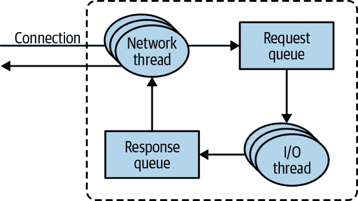
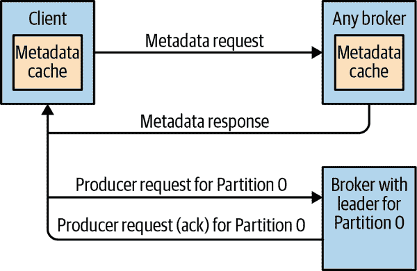
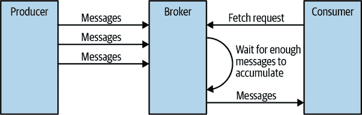
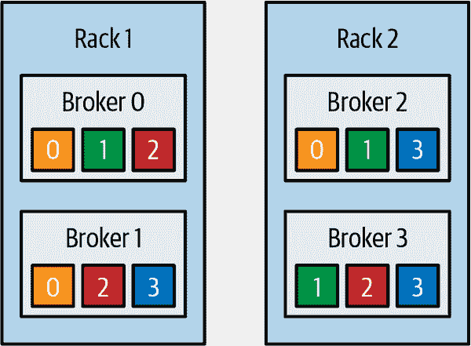
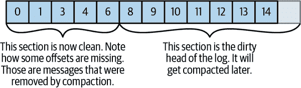
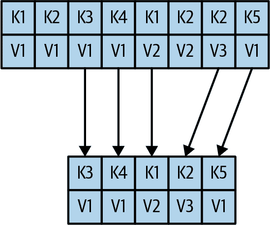

# 第六章：Kafka 内部

要在生产环境中运行 Kafka 或编写使用 Kafka 的应用程序并不一定需要严格了解 Kafka 的内部工作原理。然而，了解 Kafka 的工作方式确实在故障排除或尝试理解 Kafka 行为的原因时提供了背景。由于本书的范围无法涵盖每一个实现细节和设计决策，因此在本章中，我们专注于一些对 Kafka 从业者特别相关的主题：

+   Kafka 控制器

+   Kafka 复制是如何工作的

+   Kafka 如何处理来自生产者和消费者的请求

+   Kafka 如何处理存储，比如文件格式和索引

深入了解这些主题在调整 Kafka 时将会特别有用——了解调整旋钮控制的机制对于有意识地使用它们而不是随机摆弄它们有很大帮助。

# 集群成员资格

Kafka 使用 Apache ZooKeeper 来维护当前集群成员的代理列表。每个代理都有一个唯一的标识符，可以在代理配置文件中设置，也可以自动生成。每次代理进程启动时，它都会通过在 ZooKeeper 中创建一个[*临时节点*](http://bit.ly/2s3MYHh)来注册自己的 ID。Kafka 代理、控制器和一些生态系统工具订阅 ZooKeeper 中的*/brokers/ids*路径，代理在这里注册，以便在代理被添加或移除时得到通知。

如果你尝试使用相同的 ID 启动另一个代理，你将会收到一个错误——新代理将尝试注册但失败，因为我们已经有了相同代理 ID 的 ZooKeeper 节点。

当代理失去与 ZooKeeper 的连接（通常是由于代理停止，但这也可能是由于网络分区或长时间的垃圾回收暂停导致的），代理在启动时创建的临时节点将自动从 ZooKeeper 中删除。监视代理列表的 Kafka 组件将收到通知，表示代理已经离开。

即使代理停止时代表代理的节点消失了，代理 ID 仍然存在于其他数据结构中。例如，每个主题的副本列表（参见“复制”）包含了副本的代理 ID。这样，如果你完全丢失了一个代理并启动一个具有相同 ID 的全新代理，它将立即加入集群，取代缺失的代理，并分配给它相同的分区和主题。

# 控制器

控制器是 Kafka 代理之一，除了通常的代理功能外，还负责选举分区领导者。在集群中启动的第一个代理成为控制器，通过在 ZooKeeper 中创建一个名为`/controller`的临时节点来实现。当其他代理启动时，它们也会尝试创建这个节点，但会收到“节点已经存在”的异常，这会导致它们“意识到”控制器节点已经存在，集群已经有了一个控制器。代理在控制器节点上创建一个[*ZooKeeper watch*](http://bit.ly/2sKoTTN)，以便在此节点发生变化时得到通知。这样，我们保证集群一次只有一个控制器。

当控制器代理停止或失去与 ZooKeeper 的连接时，临时节点将消失。这包括任何情况，其中控制器使用的 ZooKeeper 客户端停止向 ZooKeeper 发送心跳超过`zookeeper.session.timeout.ms`。当临时节点消失时，集群中的其他代理将通过 ZooKeeper 监视被通知控制器已经消失，并将尝试在 ZooKeeper 中自行创建控制器节点。在 ZooKeeper 中创建新控制器的第一个节点将成为下一个控制器，而其他节点将收到“节点已存在”异常并在新控制器节点上重新创建监视。每次选举控制器时，它都会通过 ZooKeeper 条件递增操作接收一个新的更高*控制器时代*编号。代理知道当前的控制器时代，如果它们从具有较旧编号的控制器接收到消息，它们会忽略它。这很重要，因为控制器代理可能由于长时间的垃圾回收暂停而断开与 ZooKeeper 的连接 - 在此暂停期间，将选举新的控制器。在暂停后，前一领导者恢复操作时，它可以继续向代理发送消息，而不知道有一个新的控制器 - 在这种情况下，旧的控制器被视为僵尸。消息中的控制器时代允许代理忽略来自旧控制器的消息，这是一种僵尸围栏。

当控制器首次启动时，必须从 ZooKeeper 中读取最新的副本状态映射，然后才能开始管理集群元数据并执行领导者选举。加载过程使用异步 API，并将读取请求管道化到 ZooKeeper 以隐藏延迟。但即使如此，在具有大量分区的集群中，加载过程可能需要几秒钟 - 在[Apache Kafka 1.1.0 博客文章](https://oreil.ly/mQpL4)中描述了几个测试和比较。

当控制器注意到代理离开集群（通过监视相关的 ZooKeeper 路径或因为它收到了来自代理的`ControlledShutdownRequest`），它知道所有在该代理上有领导者的分区都需要新的领导者。它遍历所有需要新领导者的分区，并确定新领导者应该是谁（简单地是该分区副本列表中的下一个副本）。然后它将新状态持久化到 ZooKeeper（再次使用管道化的异步请求以减少延迟），然后向包含这些分区副本的所有代理发送`LeaderAndISR`请求。该请求包含有关分区的新领导者和跟随者的信息。这些请求被批处理以提高效率，因此每个请求都包括对同一代理上具有副本的多个分区的新领导信息。每个新领导者都知道它需要开始为来自客户端的生产者和消费者请求提供服务，而跟随者知道它们需要开始复制来自新领导者的消息。由于集群中的每个代理都有一个包含集群中所有代理和所有副本映射的`MetadataCache`，因此控制器向所有代理发送有关领导变更的信息以便它们可以更新它们的缓存。当代理重新启动时，类似的过程重复进行 - 主要区别在于代理中的所有副本都作为跟随者开始，并且需要在有资格被选举为领导者之前赶上领导者。

总之，Kafka 使用 ZooKeeper 的临时节点功能来选举控制器，并在节点加入和离开集群时通知控制器。控制器负责在注意到节点加入和离开集群时在分区和副本之间选举领导者。控制器使用时代编号来防止“脑裂”情况，其中两个节点相信彼此是当前控制器。

## KRaft：Kafka 的新基于 Raft 的控制器

从 2019 年开始，Apache Kafka 社区开始了一项雄心勃勃的项目：从基于 ZooKeeper 的控制器转移到基于 Raft 的控制器仲裁。新控制器的预览版本名为 KRaft，是 Apache Kafka 2.8 版本的一部分。计划于 2021 年中期发布的 Apache Kafka 3.0 版本将包括 KRaft 的首个生产版本，Kafka 集群将能够同时运行传统的基于 ZooKeeper 的控制器或 KRaft。

为什么 Kafka 社区决定替换控制器？Kafka 现有的控制器已经经历了几次重写，但尽管改进了它使用 ZooKeeper 存储主题、分区和副本信息的方式，但明显地现有模型无法扩展到我们希望 Kafka 支持的分区数量。几个已知的问题促使了这一变化：

+   元数据更新同步写入 ZooKeeper，但异步发送到代理。此外，从 ZooKeeper 接收更新也是异步的。所有这些导致了元数据在代理、控制器和 ZooKeeper 之间不一致的边缘情况。这些情况很难检测。

+   每当控制器重新启动时，它必须从 ZooKeeper 中读取所有代理和分区的所有元数据，然后将这些元数据发送给所有代理。尽管经过多年的努力，这仍然是一个主要瓶颈——随着分区和代理数量的增加，重新启动控制器变得更慢。

+   关于元数据所有权的内部架构并不理想——一些操作是通过控制器完成的，另一些是通过任何代理完成的，还有一些是直接在 ZooKeeper 上完成的。

+   ZooKeeper 是自己的分布式系统，就像 Kafka 一样，需要一些专业知识来操作。想要使用 Kafka 的开发人员因此需要学习两个分布式系统，而不仅仅是一个。

考虑到所有这些问题，Apache Kafka 社区决定替换现有的基于 ZooKeeper 的控制器。

在现有架构中，ZooKeeper 有两个重要功能：用于选举控制器和存储集群元数据——注册的代理、配置、主题、分区和副本。此外，控制器本身管理元数据——用于选举领导者、创建和删除主题以及重新分配副本。所有这些功能都将在新控制器中替换。

新控制器设计的核心思想是，Kafka 本身具有基于日志的架构，其中用户将状态表示为事件流。这种表示的好处在社区中得到了充分理解——多个消费者可以通过重放事件快速追上最新状态。日志建立了事件之间的明确顺序，并确保消费者始终沿着单一时间线移动。新的控制器架构为 Kafka 的元数据管理带来了相同的好处。

在新的架构中，控制器节点是一个 Raft 仲裁，负责管理元数据事件日志。该日志包含有关集群元数据每个更改的信息。目前存储在 ZooKeeper 中的所有内容，如主题、分区、ISR、配置等，都将存储在此日志中。

使用 Raft 算法，控制器节点将从其中选举出一个领导者，而无需依赖任何外部系统。元数据日志的活跃控制器称为*活跃控制器*。活跃控制器处理来自代理的所有 RPC。跟随者控制器复制写入活跃控制器的数据，并在活跃控制器失败时作为热备份。因为控制器现在都跟踪最新状态，控制器故障转移将不需要一个漫长的重新加载期，在此期间我们将所有状态转移到新控制器。

控制器不再推送更新到其他经纪人，而是这些经纪人将通过新的`MetadataFetch` API 从活动控制器获取更新。与获取请求类似，经纪人将跟踪其获取的最新元数据更改的偏移量，并且只会从控制器请求更新的元数据。经纪人将将元数据持久化到磁盘，[这将使它们能够快速启动，即使有数百万个分区](https://oreil.ly/TsU0w)。

经纪人将向控制器仲裁注册，并将保持注册，直到被管理员注销，因此一旦经纪人关闭，它就是离线但仍然注册。在线但未与最新元数据同步的经纪人将被隔离，并且将无法为客户端请求提供服务。新的隔离状态将防止客户端向不再是领导者但过时以至于不知道自己不是领导者的经纪人产生事件的情况。

作为迁移到控制器仲裁的一部分，以前涉及客户端或经纪人直接与 ZooKeeper 通信的所有操作将通过控制器路由。这将允许通过替换控制器来实现无缝迁移，而无需更改任何经纪人上的任何内容。

新架构的整体设计在[KIP-500](https://oreil.ly/KAsp9)中有描述。有关如何为 Kafka 调整 Raft 协议的详细信息在[KIP-595](https://oreil.ly/XbI8L)中有描述。有关新控制器仲裁的详细设计，包括控制器配置和用于与集群元数据交互的新 CLI，可在[KIP-631](https://oreil.ly/rpOjK)中找到。

# 复制

复制是 Kafka 架构的核心。事实上，Kafka 经常被描述为“分布式、分区、复制的提交日志服务”。复制是至关重要的，因为这是 Kafka 在个别节点不可避免地失败时保证可用性和耐久性的方式。

正如我们已经讨论过的那样，Kafka 中的数据是按主题组织的。每个主题都被分区，每个分区可以有多个副本。这些副本存储在经纪人上，每个经纪人通常存储属于不同主题和分区的数百甚至数千个副本。

有两种类型的副本：

领导者副本

每个分区都有一个被指定为领导者的副本。所有生成请求都通过领导者进行以保证一致性。客户端可以从领导副本或其跟随者中消费。

追随者副本

对于不是领导者的分区的所有副本都被称为跟随者。除非另有配置，否则跟随者不会为客户端请求提供服务；它们的主要工作是从领导者复制消息并保持与领导者最近的消息同步。如果分区的领导者副本崩溃，其中一个跟随者副本将被提升为该分区的新领导者。

领导者还负责知道哪个跟随者副本与领导者保持同步。跟随者尝试通过复制领导者的所有消息来保持同步，但由于各种原因，例如网络拥塞减慢了复制速度，或者经纪人崩溃并且该经纪人上的所有副本开始落后，直到我们启动经纪人并且它们可以再次开始复制时，它们可能无法保持同步。

为了与领导者保持同步，副本发送领导者`Fetch`请求，这与消费者为了消费消息发送的请求类型相同。作为对这些请求的响应，领导者将消息发送给副本。这些`Fetch`请求包含副本想要接收的消息的偏移量，并且始终是有序的。这意味着领导者可以知道副本获取了所有消息直到副本获取的最后一条消息，并且没有获取之后的消息。通过查看每个副本请求的最后偏移量，领导者可以知道每个副本落后多少。如果一个副本在 10 秒内没有请求消息，或者如果它请求了消息但在 10 秒内没有赶上最新的消息，那么该副本被认为是*不同步*的。如果一个副本无法跟上领导者，它在故障发生时将不再能成为新的领导者——毕竟，它不包含所有的消息。

这个的反义词，一直在请求最新消息的副本被称为*同步副本*。只有同步副本有资格在现有领导者失败的情况下被选举为分区领导者。

在副本被认为是不同步之前可以不活动或落后的时间由`replica.lag.time.max.ms`配置参数控制。这种允许的滞后对客户端行为和领导者选举期间的数据保留有影响。我们在第七章中深入讨论这个问题，当我们讨论可靠性保证时。

除了当前领导者，每个分区都有一个*首选领导者*——当主题最初创建时是领导者的副本。它是首选的，因为当分区首次创建时，领导者在代理之间是平衡的。因此，我们期望当首选领导者确实是集群中所有分区的领导者时，负载将在代理之间平衡。默认情况下，Kafka 配置为`auto.leader.rebalance.enable=true`，它将检查首选领导者副本是否不是当前领导者但是同步的，并将触发领导者选举使首选领导者成为当前领导者。

# 查找首选领导者

识别当前首选领导者的最佳方法是查看分区的副本列表。（您可以在`kafka-topics.sh`工具的输出中查看分区和副本的详细信息。我们将在第十三章中讨论这个和其他管理工具。）列表中的第一个副本始终是首选领导者。这一点是正确的，无论当前领导者是谁，甚至如果副本被重新分配到不同的代理使用副本重新分配工具。事实上，如果您手动重新分配副本，重要的是要记住您指定的第一个副本将是首选副本，因此请确保将它们分布在不同的代理上，以避免一些代理负载过重，而其他代理没有处理他们公平份额的工作。

# 请求处理

Kafka 代理大部分工作是处理来自客户端、分区副本和控制器的请求发送到分区领导者。Kafka 有一个二进制协议（通过 TCP）规定了请求的格式以及代理如何响应这些请求——无论是请求成功处理还是代理在处理请求时遇到错误时。

Apache Kafka 项目包括由 Apache Kafka 项目的贡献者实现和维护的 Java 客户端；还有其他语言的客户端，如 C、Python、Go 等。[您可以在 Apache Kafka 网站上看到完整的列表](http://bit.ly/2sKvTjx)。它们都使用这个协议与 Kafka 代理进行通信。

客户端始终发起连接并发送请求，代理处理请求并对其做出响应。从特定客户端发送到代理的所有请求将按照接收顺序进行处理，这个保证使得 Kafka 能够作为消息队列并对其存储的消息提供顺序保证。

所有请求都有一个包括以下内容的标准头部：

+   请求类型（也称为*API 密钥*）

+   请求版本（以便代理可以处理不同版本的客户端并相应地做出响应）

+   关联 ID：唯一标识请求的编号，也出现在响应和错误日志中（用于故障排除）

+   客户端 ID：用于标识发送请求的应用程序

我们不会在这里描述协议，因为它在[Kafka 文档](http://kafka.apache.org/protocol.html)中有详细描述。然而，了解请求是如何由代理处理的是有帮助的——稍后，当我们讨论如何监视 Kafka 和各种配置选项时，您将了解指标和配置参数所指的队列和线程的上下文。

对于代理监听的每个端口，代理运行一个*接收器*线程来创建连接并将其交给一个*处理器*线程进行处理。处理器线程（也称为*网络线程*）的数量是可配置的。网络线程负责从客户端连接接收请求，将其放入*请求队列*，并从*响应队列*中取出响应并将其发送回客户端。有时，对客户端的响应必须延迟——只有在数据可用时，消费者才会收到响应，而管理员客户端在主题删除进行中时才会收到`DeleteTopic`请求的响应。延迟的响应被保存在[*炼狱*](https://oreil.ly/2jWos)中，直到可以完成。请参阅图 6-1 以了解此过程的可视化。



###### 图 6-1：Apache Kafka 内部的请求处理

一旦请求被放置在请求队列中，*I/O 线程*（也称为请求*处理程序线程*）负责接收并处理它们。最常见的客户端请求类型有：

生产请求

由生产者发送，并包含客户端写入 Kafka 代理的消息

获取请求

当消费者和追随者副本从 Kafka 代理读取消息时发送

管理员请求

在执行元数据操作时由管理员客户端发送，例如创建和删除主题

生产请求和获取请求都必须发送到分区的领导副本。如果代理接收到特定分区的生产请求，而该分区的领导者在另一个代理上，发送生产请求的客户端将收到“不是分区领导者”的错误响应。如果特定分区的获取请求到达一个没有该分区领导者的代理，将发生相同的错误。Kafka 的客户端负责将生产和获取请求发送到包含请求相关分区的领导者的代理。

客户端如何知道要发送请求的位置？Kafka 客户端使用另一种称为*元数据请求*的请求类型，其中包括客户端感兴趣的主题列表。服务器响应指定了主题中存在的分区，每个分区的副本，以及哪个副本是领导者。元数据请求可以发送到任何代理，因为所有代理都有包含此信息的元数据缓存。

客户端通常会缓存此信息，并使用它来指导生成和获取请求到每个分区的正确代理。他们还需要偶尔刷新此信息（刷新间隔由`metadata.​max.age.ms`配置参数控制），通过发送另一个元数据请求，以便知道主题元数据是否发生变化，例如，如果添加了新的代理或某些副本被移动到新的代理（图 6-2）。此外，如果客户端收到“不是领导者”错误的请求之一，它将在再次尝试发送请求之前刷新其元数据，因为该错误表明客户端正在使用过时的信息，并且正在向错误的代理发送请求。



###### 图 6-2：客户端路由请求

## 生成请求

正如我们在第三章中看到的，一个名为`acks`的配置参数是在被认为是成功写入之前需要确认接收消息的代理数量。生产者可以配置为在消息被领导者接受时就将消息视为“成功写入”（`acks=1`），或者在所有同步副本都接受时将消息视为“成功写入”（`acks=all`），或者在消息被发送时就将消息视为“成功写入”，而不必等待代理接受它（`acks=0`）。

当包含分区领导副本的代理接收到该分区的生成请求时，它将首先运行一些验证：

+   发送数据的用户是否对主题具有写权限？

+   请求中指定的`acks`数量是否有效（只允许 0、1 和“all”）？

+   如果`acks`设置为`all`，是否有足够的同步副本可以安全地写入消息？（代理可以配置为在同步副本数量低于可配置数量时拒绝新消息；我们将在第七章中更详细地讨论这一点，当我们讨论 Kafka 的持久性和可靠性保证时。）

然后代理将新消息写入本地磁盘。在 Linux 上，消息被写入文件系统缓存，并且不能保证何时将其写入磁盘。Kafka 不会等待数据持久化到磁盘上，它依赖于消息的复制来保证消息的持久性。

一旦消息被写入分区的领导者，代理会检查`acks`配置：如果`acks`设置为 0 或 1，代理将立即响应；如果`acks`设置为`all`，请求将被存储在一个名为*炼狱*的缓冲区中，直到领导者观察到跟随者副本复制了消息，然后才会向客户端发送响应。

## 获取请求

代理处理获取请求的方式与处理生成请求的方式非常相似。客户端发送请求，要求代理从一系列主题、分区和偏移量中发送消息，类似于“请给我发送从主题 Test 的分区 0 的偏移量 53 开始的消息，以及从主题 Test 的分区 3 的偏移量 64 开始的消息。”客户端还会为每个分区指定代理可以返回的数据量的限制。这个限制很重要，因为客户端需要分配内存来保存从代理返回的响应。如果没有这个限制，代理可能会发送足够大的回复，导致客户端内存耗尽。

正如我们之前讨论的，请求必须到达请求中指定的分区的领导者，并且客户端将进行必要的元数据请求，以确保正确路由获取请求。当领导者收到请求时，它首先检查请求是否有效——对于这个特定的分区，这个偏移量是否存在？如果客户端要求一个如此古老以至于已经从分区中删除或者偏移量尚不存在的消息，代理将会以错误响应。

如果偏移存在，经纪人将从分区中读取消息，直到请求中客户端设置的限制，并将消息发送给客户端。Kafka 以“零拷贝”方法向客户端发送消息而闻名——这意味着 Kafka 直接从文件（或更可能是 Linux 文件系统缓存）将消息发送到网络通道，而无需任何中间缓冲区。这与大多数数据库不同，大多数数据库在发送给客户端之前将数据存储在本地缓存中。这种技术消除了复制字节和管理内存缓冲区的开销，并显著提高了性能。

除了设置经纪人可以返回的数据量的上限外，客户端还可以设置返回的数据量的下限。例如，将下限设置为 10K 是客户端告诉经纪人的方式，“只有在你至少有 10K 字节要发送给我的时候才返回结果”。这是在客户端从未看到太多流量的主题中减少 CPU 和网络利用率的好方法。客户端不再每隔几毫秒向经纪人发送请求请求数据，并且几乎没有或没有消息返回，而是客户端发送请求，经纪人等待直到有足够的数据，然后返回数据，然后客户端才会请求更多（图 6-3）。总体上读取的数据量是相同的，但是往返要少得多，因此开销也更少。



###### 图 6-3： 经纪人延迟响应，直到积累足够的数据

当然，我们不希望客户端永远等待经纪人有足够的数据。过了一会儿，最好只是获取已经存在的数据并处理，而不是等待更多。因此，客户端还可以定义超时时间，告诉经纪人，“如果你在*x*毫秒内没有满足发送最小数据量的要求，就发送你得到的数据。”

有趣的是，并非分区领导者上存在的所有数据都可以供客户端读取。大多数客户端只能读取写入所有同步副本的消息（即使它们是消费者，从者副本不受此限制——否则复制将无法工作）。我们已经讨论过，分区的领导者知道哪些消息被复制到了哪个副本，直到消息被写入所有同步副本，它才会被发送给消费者——尝试获取这些消息将导致空响应而不是错误。

这种行为的原因是，尚未复制到足够多副本的消息被视为“不安全”——如果领导者崩溃并且另一个副本取代了它，这些消息将不再存在于 Kafka 中。如果我们允许客户端读取仅存在于领导者上的消息，我们可能会看到不一致的行为。例如，如果消费者读取了一条消息，领导者崩溃并且没有其他经纪人包含此消息，那么消息就消失了。没有其他消费者将能够读取此消息，这可能会导致与读取它的消费者不一致。相反，我们等到所有同步副本都收到消息，然后才允许消费者读取它（图 6-4）。这种行为还意味着，如果经纪人之间的复制因某种原因变慢，新消息到达消费者的时间将更长（因为我们要等待消息首先复制）。此延迟受到`replica.lag.time.max.ms`的限制——即副本在被认为是同步的情况下可以延迟复制新消息的时间量。


###### 图 6-4： 消费者只能看到复制到同步副本的消息

在某些情况下，消费者从大量分区中消费事件。在每个请求中将其感兴趣的所有分区列表发送给代理，并让代理发送所有其元数据回来可能非常低效 - 分区集合很少改变，它们的元数据很少改变，并且在许多情况下没有太多数据返回。为了最小化这种开销，Kafka 有`fetch session cache`。消费者可以尝试创建一个缓存会话，存储它们正在消费的分区列表及其元数据。一旦创建了会话，消费者就不再需要在每个请求中指定所有分区，并且可以使用增量获取请求。如果有任何更改，代理将只在响应中包含元数据。会话缓存的空间有限，Kafka 优先考虑追随者副本和具有大量分区的消费者，因此在某些情况下可能不会创建或将被驱逐。在这两种情况下，代理将向客户端返回适当的错误，并且消费者将透明地重新使用包含所有分区元数据的完整获取请求。

## 其他请求

我们刚讨论了 Kafka 客户端使用的最常见的请求类型：`Metadata`，`Produce`和`Fetch`。Kafka 协议目前处理[61 种不同的请求类型](https://oreil.ly/hBmNc)，并将添加更多。仅消费者就使用了 15 种请求类型来形成组，协调消费，并允许开发人员管理消费者组。还有大量与元数据管理和安全性相关的请求。

此外，相同的协议用于 Kafka 代理之间的通信。这些请求是内部的，不应该被客户端使用。例如，当控制器宣布分区有一个新的领导者时，它会向新的领导者发送`LeaderAndIsr`请求（以便它知道开始接受客户端请求），并发送给追随者（以便它们知道跟随新的领导者）。

协议不断发展演变 - 随着 Kafka 社区增加更多的客户端功能，协议也在不断演变以匹配。例如，在过去，Kafka 消费者使用 Apache ZooKeeper 来跟踪它们从 Kafka 接收的偏移量。因此，当消费者启动时，它可以检查 ZooKeeper 中从其分区读取的最后一个偏移量，并知道从哪里开始处理。出于各种原因，社区决定停止使用 ZooKeeper，并将这些偏移量存储在一个特殊的 Kafka 主题中。为了做到这一点，贡献者们不得不向协议中添加几个请求：`OffsetCommitRequest`，`OffsetFetchRequest`和`ListOffsetsRequest`。现在，当应用程序调用客户端 API 来提交消费者偏移量时，客户端不再写入 ZooKeeper；相反，它将`OffsetCommitRequest`发送到 Kafka。

主题创建过去是由命令行工具处理的，这些工具直接更新 ZooKeeper 中的主题列表。Kafka 社区后来添加了`CreateTopic`请求，以及用于管理 Kafka 元数据的类似请求。Java 应用程序通过 Kafka 的`AdminClient`执行这些元数据操作，在第五章中有详细记录。由于这些操作现在是 Kafka 协议的一部分，它允许没有 ZooKeeper 库的语言的客户端直接向 Kafka 代理请求创建主题。

除了通过添加新的请求类型来发展协议外，Kafka 开发人员有时选择修改现有请求以添加一些功能。例如，在 Kafka 0.9.0 和 Kafka 0.10.0 之间，他们决定通过将信息添加到`Metadata`响应来让客户端知道当前的控制器是谁。因此，`Metadata`请求和响应中添加了一个新版本。现在，0.9.0 客户端发送版本 0 的`Metadata`请求（因为 0.9.0 客户端中不存在版本 1），无论是 0.9.0 还是 0.10.0 的代理都知道要响应版本 0 的响应，该响应不包含控制器信息。这没问题，因为 0.9.0 客户端不期望控制器信息，也不知道如何解析它。如果您有 0.10.0 客户端，它将发送版本 1 的`Metadata`请求，而 0.10.0 代理将响应包含控制器信息的版本 1 响应，0.10.0 客户端可以使用该信息。如果 0.10.0 客户端向 0.9.0 代理发送版本 1 的`Metadata`请求，代理将不知道如何处理较新版本的请求，并将以错误响应。这就是我们建议在升级任何客户端之前先升级代理的原因——新代理知道如何处理旧请求，但反之则不然。

在 0.10.0 版本中，Kafka 社区添加了`ApiVersionRequest`，允许客户端询问代理支持的每个请求的版本，并相应地使用正确的版本。正确使用这种新功能的客户端将能够通过使用代理支持的协议版本与旧代理通信。目前正在进行工作，以添加 API，允许客户端发现代理支持哪些功能，并允许代理对存在于特定版本中的功能进行控制。这项改进是在[KIP-584](https://oreil.ly/dxg8N)中提出的，目前看来很可能会成为 3.0.0 版本的一部分。

# 物理存储

Kafka 的基本存储单元是分区副本。分区不能在多个代理之间拆分，甚至不能在同一代理的多个磁盘之间拆分。因此，分区的大小受单个挂载点上可用空间的限制。（如果使用 JBOD 配置，挂载点可以是单个磁盘，如果配置了 RAID，则可以是多个磁盘。请参见第二章。）

在配置 Kafka 时，管理员定义了分区将存储在其中的目录列表——这是`log.dirs`参数（不要与 Kafka 存储其错误日志的位置混淆，该位置在*log4j.properties*文件中配置）。通常的配置包括 Kafka 将使用的每个挂载点的目录。

让我们看看 Kafka 如何使用可用目录来存储数据。首先，我们要看看数据如何分配给集群中的代理和代理中的目录。然后我们将看看代理如何管理文件——特别是如何处理保留保证。然后，我们将深入文件内部，查看文件和索引格式。最后，我们将看看日志压缩，这是一个高级功能，允许您将 Kafka 转换为长期数据存储，并描述其工作原理。

## 分层存储

从 2018 年底开始，Apache Kafka 社区开始合作一个雄心勃勃的项目，为 Kafka 添加分层存储功能。该项目的工作正在进行中，计划在 3.0 版本中发布。

动机相当简单：Kafka 目前用于存储大量数据，要么是由于高吞吐量，要么是由于长期保留期。这引入了以下问题：

+   您在分区中可以存储的数据量是有限的。因此，最大保留和分区计数不仅受产品要求驱动，还受物理磁盘大小的限制。

+   您对磁盘和集群大小的选择受存储需求驱动。集群通常比如果延迟和吞吐量是主要考虑因素时要大，这会增加成本。

+   例如，在扩展或缩小集群时，将分区从一个经纪人移动到另一个经纪人所需的时间取决于分区的大小。大分区会使集群的弹性降低。如今，架构设计朝向最大弹性，利用灵活的云部署选项。

在分层存储方法中，Kafka 集群配置为具有两个存储层级：本地和远程。本地层级与当前的 Kafka 存储层级相同——它使用 Kafka 经纪人上的本地磁盘来存储日志段。新的远程层级使用专用存储系统，例如 HDFS 或 S3，来存储已完成的日志段。

Kafka 用户可以选择为每个层级设置单独的存储保留策略。由于本地存储通常比远程层级昂贵得多，因此本地层级的保留期通常只有几个小时甚至更短，而远程层级的保留期可以更长——可以是几天，甚至几个月。

本地存储的延迟明显低于远程存储。这很有效，因为对延迟敏感的应用程序执行尾读取，并且从本地层级提供服务，因此它们可以从现有的 Kafka 机制中受益，该机制可以有效地使用页面缓存来提供数据。从远程层级提供服务的应用程序包括回填和其他需要比本地层级中的数据更旧的数据的应用程序。

分层存储中使用的双层架构允许在 Kafka 集群中独立于内存和 CPU 扩展存储，这使得 Kafka 成为长期存储解决方案。这也减少了在 Kafka 经纪人上本地存储的数据量，因此在恢复和重新平衡期间需要复制的数据量也减少了。在远程层级可用的日志段无需在经纪人上恢复，或者可以进行延迟恢复，并且可以从远程层级提供服务。由于并非所有数据都存储在经纪人上，因此增加保留期不再需要扩展 Kafka 集群存储并添加新节点。同时，整体数据保留仍然可以更长，从而消除了从 Kafka 复制数据到外部存储的需要，这是当前许多部署中所做的。

分层存储的设计在[KIP-405](https://oreil.ly/yZP6w)中有详细记录，其中包括一个新组件——`RemoteLogManager`以及与现有功能的交互，例如副本追赶领导者和领导者选举。

在 KIP-405 中记录的一个有趣的结果是分层存储的性能影响。实施分层存储的团队在几种用例中测量了性能。第一种是使用 Kafka 通常的高吞吐量工作负载。在这种情况下，延迟略有增加（从 p99 的 21 毫秒到 25 毫秒），因为经纪人还必须将段发送到远程存储。第二种用例是一些消费者正在读取旧数据。如果没有分层存储，读取旧数据的消费者会对延迟产生很大影响（p99 的 21 毫秒对比 60 毫秒），但启用分层存储后，影响显著降低（p99 的 25 毫秒对比 42 毫秒）；这是因为分层存储读取是通过网络路径从 HDFS 或 S3 读取的。网络读取不会与磁盘 I/O 或页面缓存上的本地读取竞争，并且会保持页面缓存完整并具有新鲜数据。

这意味着，除了无限存储、更低的成本和弹性之外，分层存储还提供了历史读取和实时读取之间的隔离。

## 分区分配

当你创建一个主题时，Kafka 首先决定如何在代理之间分配分区。假设你有 6 个代理，并决定创建一个有 10 个分区和 3 个副本因子的主题。Kafka 现在有 30 个分区副本要分配给 6 个代理。在进行分配时，目标是：

+   为了在代理之间均匀分布副本——在我们的例子中，确保我们为每个代理分配五个副本。

+   为了确保对于每个分区，每个副本都在不同的代理上。如果分区 0 的领导者在代理 2 上，我们可以将跟随者放在代理 3 和 4 上，但不能放在代理 2 上，也不能都放在代理 3 上。

+   如果代理有机架信息（在 Kafka 0.10.0 及更高版本中可用），则尽可能将每个分区的副本分配到不同的机架上。这确保了导致整个机架停机的事件不会导致分区完全不可用。

为了做到这一点，我们从一个随机的代理开始（比如说 4），并以循环方式为每个代理分配分区，以确定领导者的位置。所以分区 0 的领导者将在代理 4 上，分区 1 的领导者将在代理 5 上，分区 2 将在代理 0 上（因为我们只有 6 个代理），依此类推。然后，对于每个分区，我们将副本放在领导者的递增偏移量上。如果分区 0 的领导者在代理 4 上，第一个跟随者将在代理 5 上，第二个将在代理 0 上。分区 1 的领导者在代理 5 上，所以第一个副本在代理 0 上，第二个在代理 1 上。

当考虑机架感知时，我们不是按照数字顺序选择代理，而是准备一个交替机架的代理列表。假设我们知道代理 0 和 1 在同一个机架上，代理 2 和 3 在另一个机架上。我们不是按照 0 到 3 的顺序选择代理，而是按照 0、2、1、3 的顺序排列它们——每个代理后面都跟着一个来自不同机架的代理（图 6-5）。在这种情况下，如果分区 0 的领导者在代理 2 上，第一个副本将在代理 1 上，这是一个完全不同的机架。这很好，因为如果第一个机架下线，我们知道我们仍然有一个存活的副本，因此分区仍然可用。对于所有的副本都是如此，所以在机架故障的情况下，我们有保证的可用性。



###### 图 6-5：分区和副本分配给不同机架上的代理

一旦我们为每个分区和副本选择了正确的代理，就该决定为新分区使用哪个目录了。我们对每个分区都独立进行这个操作，规则非常简单：我们计算每个目录上的分区数量，并将新分区添加到分区最少的目录上。这意味着如果你添加了一个新的磁盘，所有新的分区都将在该磁盘上创建。这是因为在平衡之前，新磁盘总是有最少的分区。

# 注意磁盘空间

请注意，分配分区给代理时不考虑可用空间或现有负载，分配分区给磁盘时考虑分区的数量，但不考虑分区的大小。这意味着如果一些代理的磁盘空间比其他的多（也许是因为集群是由新旧服务器混合组成的），一些分区异常大，或者你在同一个代理上有不同大小的磁盘，你需要小心处理分区的分配。

## 文件管理

保留是 Kafka 中的一个重要概念——Kafka 不会永久保留数据，也不会等待所有消费者读取消息后再删除它。相反，Kafka 管理员为每个主题配置一个保留期限——存储消息的时间或存储多少数据后删除旧消息。

因为在大文件中查找需要清除的消息然后删除文件的一部分既耗时又容易出错，我们改为将每个分区分割成*段*。默认情况下，每个段包含 1GB 的数据或一周的数据，以较小者为准。当 Kafka 代理写入分区时，如果达到段限制，它将关闭文件并开始新文件。

我们当前正在写入的段称为*活动段*。活动段永远不会被删除，因此，如果您将日志保留设置为仅存储一天的数据，但每个段包含五天的数据，您实际上将保留五天的数据，因为我们不能在段关闭之前删除数据。如果您选择存储一周的数据并且每天滚动一个新段，您将看到每天我们将滚动一个新段，同时删除最旧的段——因此大部分时间分区将有七个段。

正如您在第二章中学到的，Kafka 代理将保持对每个分区中每个段的打开文件句柄，即使是非活动段。这导致打开文件句柄的数量通常很高，操作系统必须相应地进行调整。

## 文件格式

每个段都存储在单个数据文件中。在文件内部，我们存储 Kafka 消息及其偏移量。磁盘上的数据格式与我们从生产者发送到代理，以及后来从代理发送到消费者的消息格式相同。在磁盘和网络上传输相同的消息格式是 Kafka 能够在向消费者发送消息时使用零拷贝优化，并且避免解压和重新压缩生产者已经压缩的消息。因此，如果我们决定更改消息格式，网络协议和磁盘格式都需要更改，Kafka 代理需要知道如何处理包含两种格式消息的文件的情况。

Kafka 消息由用户有效载荷和系统头组成。用户有效载荷包括可选的键、值和可选的头集合，其中每个头都是其自己的键/值对。

从版本 0.11 开始（以及 v2 消息格式），Kafka 生产者始终以批处理方式发送消息。如果发送单个消息，批处理会增加一些开销。但是对于每批次两条或更多消息，批处理可以节省空间，从而减少网络和磁盘使用。这是 Kafka 在`linger.ms=10`时表现更好的原因之一——小延迟增加了更多消息一起发送的机会。由于 Kafka 为每个分区创建单独的批次，因此写入较少分区的生产者也将更有效。请注意，Kafka 生产者可以在同一生产请求中包含多个批次。这意味着，如果您在生产者上使用压缩（建议！），发送更大的批次意味着在网络和代理磁盘上都会获得更好的压缩。

消息批处理头包括：

+   指示消息格式当前版本的魔术数字（这里我们正在记录 v2）。

+   批处理中第一条消息的偏移量以及与最后一条消息偏移量的差异——即使批处理后来被压缩并删除了一些消息，这些偏移量也会被保留。当生产者创建并发送批处理时，第一条消息的偏移量设置为 0。首次持久化此批处理的代理（分区领导者）将其替换为真实偏移量。

+   第一条消息的时间戳和批处理中最高时间戳。如果时间戳类型设置为追加时间而不是创建时间，代理可以设置时间戳。

+   批处理的大小，以字节为单位。

+   接收批处理的领导者的时代（这在领导者选举后截断消息时使用；[KIP-101](https://oreil.ly/Ffa4D)和[KIP-279](https://oreil.ly/LO7nx)详细解释了使用方法）。

+   用于验证批处理是否损坏的校验和。

+   十六位表示不同的属性：压缩类型、时间戳类型（时间戳可以在客户端或经纪人处设置），以及批次是否属于事务或是控制批次。

+   生产者 ID、生产者时代和批次中的第一个序列——这些都用于确保精确一次。

+   当然，批次中包含的消息集。

正如您所看到的，批处理头包含了大量信息。记录本身也有系统头（不要与用户设置的头混淆）。每个记录包括：

+   记录的大小，以字节为单位

+   属性——目前没有记录级属性，因此这不会被使用

+   当前记录的偏移量与批次中第一个偏移量之间的差异

+   该记录时间戳与批次中第一个时间戳之间的差异（以毫秒为单位）

+   用户有效负载：键、值和头

请注意，每个记录的开销非常小，大部分系统信息都在批处理级别。在头部存储批处理的第一个偏移量和时间戳，并且仅在每个记录中存储差异，大大减少了每个记录的开销，使得更大的批次更有效。

除了包含用户数据的消息批次外，Kafka 还有控制批次，例如表示事务提交。这些由消费者处理，不会传递给用户应用程序，目前它们包括版本和类型指示器：0 表示中止事务，1 表示提交。

如果您希望自己查看所有这些内容，Kafka 经纪人附带了`DumpLogSegment`工具，允许您查看文件系统中的分区段并检查其内容。您可以使用以下命令运行该工具：

```java
  bin/kafka-run-class.sh kafka.tools.DumpLogSegments
```

如果选择`--deep-iteration`参数，它将向您显示包装消息内部压缩的消息的信息。

# 消息格式向下转换

早些时候记录的消息格式是在 0.11 版本中引入的。由于 Kafka 支持在所有客户端升级之前升级经纪人，因此它必须支持经纪人、生产者和消费者之间的任何版本组合。大多数组合都可以正常工作——新经纪人将理解生产者的旧消息格式，并且新生产者将知道将旧格式的消息发送到旧经纪人。但是当新生产者向新经纪人发送 v2 消息时，就会出现一个具有挑战性的情况：消息以 v2 格式存储，但不支持 v2 格式的旧消费者尝试读取它。在这种情况下，经纪人将需要将消息从 v2 格式转换为 v1 格式，以便消费者能够解析它。这种转换比正常消费使用更多的 CPU 和内存，因此最好避免。[KIP-188](https://oreil.ly/9RwQC)引入了几个重要的健康指标，其中包括`FetchMessageConversionsPerSec`和`MessageConversions​TimeMs`。如果您的组织仍在使用旧客户端，我们建议检查这些指标，并尽快升级客户端。

## 索引

Kafka 允许消费者从任何可用的偏移量开始获取消息。这意味着，如果消费者要求从偏移量 100 开始获取 1MB 的消息，那么经纪人必须能够快速定位偏移量 100 的消息（可能在分区的任何段中），并从该偏移量开始读取消息。为了帮助经纪人快速定位给定偏移量的消息，Kafka 为每个分区维护一个索引。该索引将偏移量映射到段文件和文件内的位置。

类似地，Kafka 还有第二个索引，将时间戳映射到消息偏移量。在按时间戳搜索消息时使用此索引。Kafka Streams 广泛使用此查找，并且在某些故障转移场景中也很有用。

索引也被分成段，因此我们可以在消息被清除时删除旧的索引条目。Kafka 不会尝试维护索引的校验和。如果索引损坏，它将从匹配的日志段中重新生成，只需重新读取消息并记录偏移和位置。如果需要，管理员完全可以安全地（尽管可能导致长时间的恢复）删除索引段——它们将自动重新生成。

## 压缩

通常情况下，Kafka 会存储一定时间的消息，并清除超过保留期的消息。然而，想象一种情况，你使用 Kafka 来存储客户的送货地址。在这种情况下，存储每个客户的最后地址而不是仅仅存储最近一周或一年的数据更有意义。这样，你就不必担心旧地址，而且仍然保留了长时间未搬迁的客户的地址。另一个用例可能是一个使用 Kafka 来存储其当前状态的应用程序。每当状态发生变化时，应用程序就会将新状态写入 Kafka。在从崩溃中恢复时，应用程序会从 Kafka 中读取这些消息以恢复其最新状态。在这种情况下，它只关心崩溃前的最新状态，而不关心在其运行时发生的所有变化。

Kafka 通过允许在主题上设置保留策略为*delete*（删除保留时间之前的事件）或者*compact*（仅存储主题中每个键的最新值）来支持这种用例。显然，将策略设置为 compact 只对包含键和值的事件的主题有意义。如果主题包含*null*键，压缩将失败。

主题也可以有一个`delete.and.compact`策略，它将压缩和保留期结合在一起。超过保留期的消息将被删除，即使它们是键的最新值。这个策略可以防止被压缩的主题变得过大，并且在业务需要在一定时间后删除记录时也会用到。

## 压缩的工作原理

每个日志被视为分为两个部分（见图 6-6）：

干净

在之前已经压缩过的消息。这个部分只包含每个键的最新值，即上一次压缩时的最新值。

脏

在最后一次压缩之后写入的消息。



###### 图 6-6：具有干净和脏部分的分区

如果 Kafka 在启动时启用了压缩（使用名为`log.cleaner.enabled`的配置），每个代理将启动一个压缩管理器线程和一些压缩线程。这些线程负责执行压缩任务。每个线程选择具有脏消息占总分区大小比例最高的分区，并清理该分区。

为了压缩一个分区，清理线程会读取分区的脏部分并创建一个内存映射。每个映射条目由消息键的 16 字节哈希和具有相同键的上一条消息的 8 字节偏移组成。这意味着每个映射条目只使用 24 字节。如果我们看一个 1GB 的段，并假设段中的每条消息占用 1KB，那么段将包含 100 万条这样的消息，我们只需要一个 24MB 的映射来压缩段（我们可能需要更少——如果键重复，我们将经常重用相同的哈希条目并使用更少的内存）。这是非常高效的！

在配置 Kafka 时，管理员配置了压缩线程可以使用的偏移量映射的内存量。尽管每个线程都有自己的映射，但配置是针对所有线程的总内存。如果为压缩偏移量映射配置了 1 GB，并且有 5 个清理线程，则每个线程将获得 200 MB 的自己的偏移量映射。Kafka 不需要将分区的整个脏段都适应于为该映射分配的大小，但至少一个完整段必须适应。如果不适应，Kafka 将记录错误，并且管理员将需要为偏移量映射分配更多内存或使用更少的清理线程。如果只有少数段适应，Kafka 将从最旧的适应于映射的段开始压缩。其余的将保持脏状态，并等待下一次压缩。

一旦清理线程构建偏移量映射，它将开始读取干净的段，从最旧的段开始，并检查它们的内容与偏移量映射。对于每条消息，它会检查消息的键是否存在于偏移量映射中。如果键不存在于映射中，则刚读取的消息的值仍然是最新的，并且消息将复制到替换段中。如果键存在于映射中，则将省略该消息，因为分区中稍后具有相同键但更新值的消息。一旦所有仍包含其键的最新值的消息都被复制过去，替换段将与原始段交换，并继续到下一个段。在该过程结束时，我们将得到每个键的一条消息，即具有最新值的消息。参见图 6-7。



###### 图 6-7：压缩前后的分区段

## 删除事件

如果我们始终保留每个键的最新消息，那么当我们真正想要删除特定键的所有消息时，比如如果用户离开我们的服务并且我们有法律义务从系统中删除该用户的所有痕迹时，我们该怎么办？

要完全从系统中删除键，甚至不保存最后一条消息，应用程序必须生成包含该键和空值的消息。当清理线程找到这样的消息时，它首先会进行正常的压缩，并仅保留具有空值的消息。它将保留此特殊消息（称为*墓碑*）一段可配置的时间。在此期间，消费者将能够看到此消息，并知道该值已删除。因此，如果消费者将数据从 Kafka 复制到关系数据库，它将看到墓碑消息，并知道需要从数据库中删除用户。在此一定时间后，清理线程将删除墓碑消息，并且键将从 Kafka 的分区中消失。给消费者足够的时间来看到墓碑消息非常重要，因为如果我们的消费者关闭了几个小时并错过了墓碑消息，它将简单地在消费时看不到该键，因此不知道它已从 Kafka 中删除或需要从数据库中删除。

值得记住的是，Kafka 的管理客户端还包括一个`deleteRecords`方法。该方法删除指定偏移量之前的所有记录，并使用完全不同的机制。当调用此方法时，Kafka 将移动低水位标记，即分区的第一个偏移量的记录，到指定的偏移量。这将阻止消费者消费新低水位标记下方的记录，并有效地使这些记录无法访问，直到它们被清理线程删除。此方法可用于具有保留策略和压缩主题的主题。

## 何时进行主题压缩？

与“删除”策略永远不会删除当前活动段的方式相同，“压缩”策略永远不会压缩当前段。消息只有在非活动段上才有资格进行压缩。

默认情况下，当主题包含脏记录的比例达到 50%时，Kafka 将开始紧缩。目标不是经常进行紧缩（因为紧缩可能会影响主题的读/写性能），但也不要留下太多脏记录（因为它们会占用磁盘空间）。在主题使用的磁盘空间的 50%上浪费脏记录，然后一次性进行紧缩似乎是一个合理的折衷方案，并且可以由管理员进行调整。

此外，管理员可以通过两个配置参数控制紧缩的时间：

+   `min.compaction.lag.ms`可用于保证消息写入后必须经过的最短时间，然后才能进行紧缩。

+   `max.compaction.lag.ms`可用于保证消息写入后到达紧缩资格的最大延迟时间。这种配置通常用于需要在一定时间内保证紧缩的业务场景；例如，GDPR 要求在收到删除请求后的 30 天内删除某些信息。

# 总结

Kafka 显然不仅仅是我们在本章中所涵盖的内容，但我们希望这能让您对 Kafka 社区在开发项目时所做的设计决策和优化有所了解，并且或许解释了您在使用 Kafka 时遇到的一些更加晦涩的行为和配置。

如果您真的对 Kafka 内部感兴趣，那么没有什么比阅读代码更好的了。Kafka 开发者邮件列表（dev@kafka.apache.org）是一个非常友好的社区，总会有人愿意回答关于 Kafka 实际运行方式的问题。而且在阅读代码的同时，也许您可以修复一个或两个 bug——开源项目总是欢迎贡献。
