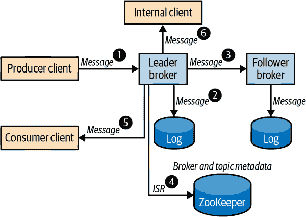
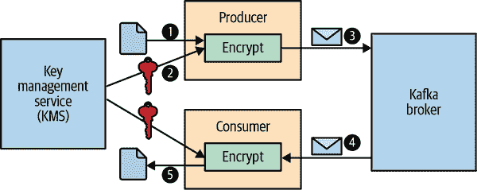

# 第十一章：保护 Kafka

Kafka 用于各种用例，从网站活动跟踪和指标管道到患者记录管理和在线支付。每种用例在安全性、性能、可靠性和可用性方面都有不同的要求。虽然始终最好使用最强大和最新的安全功能，但通常需要权衡，因为增加的安全性会影响性能、成本和用户体验。Kafka 支持几种标准安全技术，并提供一系列配置选项，以将安全性调整到每种用例。

与性能和可靠性一样，安全是系统的一个方面，必须针对整个系统而不是逐个组件来解决。系统的安全性只有最薄弱的环节一样强大，安全流程和政策必须在整个系统中执行，包括底层平台。Kafka 中可定制的安全功能使其能够与现有安全基础设施集成，构建一个适用于整个系统的一致安全模型。

在本章中，我们将讨论 Kafka 中的安全功能，并了解它们如何解决安全的不同方面，并为 Kafka 安装的整体安全做出贡献。在整个章节中，我们将分享最佳实践、潜在威胁以及减轻这些威胁的技术。我们还将审查可以采用的其他措施，以保护 ZooKeeper 和平台的其余部分。

# 锁定 Kafka

Kafka 使用一系列安全程序来建立和维护数据的机密性、完整性和可用性：

+   身份验证确定*您是谁*并确定您的身份。

+   授权确定*您被允许做什么*。

+   加密保护您的数据免受窃听和篡改。

+   审计跟踪您已经做过或尝试做过的事情。

+   配额控制您可以利用多少资源。

要了解如何锁定 Kafka 部署，让我们首先看一下数据如何在 Kafka 集群中流动。图 11-1 显示了示例数据流中的主要步骤。在本章中，我们将使用这个示例流程来检查 Kafka 可以配置的不同方式，以保护每个步骤的数据，以确保整个部署的安全性。



###### 图 11-1\. Kafka 集群中的数据流

1.  Alice 向名为`customerOrders`的主题的一个分区生成客户订单记录。记录被发送到分区的领导者。

1.  领导经纪人将记录写入其本地日志文件。

1.  跟随者经纪人从领导者那里获取消息，并将其写入其本地副本日志文件。

1.  领导经纪人更新 ZooKeeper 中的分区状态，以更新同步副本（如果需要）。

1.  Bob 从主题`customerOrders`中消费客户订单记录。Bob 接收到 Alice 生成的记录。

1.  一个内部应用程序处理到达`customerOrders`的所有消息，以生成热门产品的实时指标。

安全部署必须保证：

客户端真实性

当 Alice 建立与经纪人的客户端连接时，经纪人应对客户进行身份验证，以确保消息确实来自 Alice。

服务器真实性

在向领导经纪人发送消息之前，Alice 的客户端应验证连接是否真实。

数据隐私

消息流动的所有连接以及存储消息的所有磁盘都应该加密或物理上保护，以防窃听者读取数据，并确保数据不会被窃取。

数据完整性

应在通过不安全网络传输的数据中包含消息摘要以检测篡改。

访问控制

在将消息写入日志之前，领导经纪人应验证 Alice 是否有权写入`customerOrders`。在将消息返回给 Bob 的消费者之前，经纪人应验证 Bob 是否有权从主题中读取消息。如果 Bob 的消费者使用组管理，则经纪人还应验证 Bob 是否有权访问消费者组。

审计性

应记录经纪人、Alice、Bob 和其他客户执行的所有操作的审计跟踪。

可用性

经纪人应该应用配额和限制，以避免一些用户占用所有可用带宽或用拒绝服务攻击压倒经纪人。应该锁定 ZooKeeper 以确保 Kafka 集群的可用性，因为经纪人的可用性取决于 ZooKeeper 的可用性和 ZooKeeper 中存储的元数据的完整性。

在接下来的章节中，我们将探讨 Kafka 安全功能，这些功能可用于提供这些保证。我们首先介绍 Kafka 连接模型以及与客户端到 Kafka 经纪人的连接相关的安全协议。然后，我们详细查看每个安全协议，并检查每个协议的身份验证能力，以确定客户端真实性和服务器真实性。我们审查了不同阶段的加密选项，包括某些安全协议中数据在传输过程中的内置加密，以解决数据隐私和数据完整性问题。然后，我们探讨了 Kafka 中可定制的授权，以管理访问控制和有助于审计的主要日志。最后，我们审查了系统的其他安全性，包括 ZooKeeper 和必须维护可用性的平台。有关配额的详细信息，配额有助于通过在用户之间公平分配资源来提供服务的可用性，请参阅第三章。 

# 安全协议

Kafka 经纪人配置了一个或多个端点的侦听器，并在这些侦听器上接受客户端连接。每个侦听器可以配置自己的安全设置。在物理上受保护并且只对授权人员可访问的私有内部侦听器的安全要求可能与可通过公共互联网访问的外部侦听器的安全要求不同。安全协议的选择确定了数据在传输过程中的身份验证和加密级别。

Kafka 使用两种标准技术支持四种安全协议，即 TLS 和 SASL。传输层安全性（TLS），通常称为其前身安全套接字层（SSL），支持加密以及客户端和服务器身份验证。简单认证和安全层（SASL）是提供使用不同机制进行身份验证的框架，用于连接导向的协议。每个 Kafka 安全协议都将传输层（PLAINTEXT 或 SSL）与可选的身份验证层（SSL 或 SASL）结合在一起：

PLAINTEXT

PLAINTEXT 传输层，无身份验证。仅适用于私有网络中处理非敏感数据，因为没有使用身份验证或加密。

SSL

SSL 传输层，带有可选的 SSL 客户端身份验证。适用于在不安全的网络中使用，因为支持客户端和服务器身份验证以及加密。

SASL_PLAINTEXT

PLAINTEXT 传输层，带有 SASL 客户端身份验证。一些 SASL 机制也支持服务器身份验证。不支持加密，因此仅适用于私有网络中使用。

SASL_SSL

SSL 传输层，带有 SASL 身份验证。适用于在不安全的网络中使用，因为支持客户端和服务器身份验证以及加密。

# TLS/SSL

TLS 是公共互联网上最广泛使用的加密协议之一。应用程序协议如 HTTP、SMTP 和 FTP 依赖于 TLS 来提供数据在传输过程中的隐私和完整性。TLS 依赖于公钥基础设施（PKI）来创建、管理和分发数字证书，这些证书可用于非对称加密，避免了在服务器和客户端之间分发共享密钥的需要。TLS 握手期间生成的会话密钥使得后续数据传输可以使用更高性能的对称加密。

用于经纪人间通信的侦听器可以通过配置`inter.broker.listener.name`或`security.inter.broker.protocol`来选择。对于用于经纪人间通信的安全协议，必须在经纪人配置中提供服务器端和客户端端的配置选项。这是因为经纪人需要为该侦听器建立客户端连接。以下示例配置了 SSL 用于经纪人间和内部侦听器，以及 SASL_SSL 用于外部侦听器：

```java
listeners=EXTERNAL://:9092,INTERNAL://10.0.0.2:9093,BROKER://10.0.0.2:9094
advertised.listeners=EXTERNAL://broker1.example.com:9092,INTERNAL://broker1.local:9093,BROKER://broker1.local:9094
listener.security.protocol.map=EXTERNAL:SASL_SSL,INTERNAL:SSL,BROKER:SSL
inter.broker.listener.name=BROKER
```

客户端配置了安全协议和引导服务器，确定经纪人侦听器。返回给客户端的元数据仅包含与引导服务器相同侦听器对应的端点：

```java
security.protocol=SASL_SSL
bootstrap.servers=broker1.example.com:9092,broker2.example.com:9092
```

在下一节中，我们将审查经纪人和客户端针对每种安全协议的特定于协议的配置选项。

# 认证

认证是建立客户端和服务器身份以验证客户端真实性和服务器真实性的过程。当爱丽丝的客户端连接到领导经纪人以生成客户订单记录时，服务器认证使客户端能够确定客户端正在与实际经纪人交谈的服务器。客户端认证通过验证爱丽丝的凭据（如密码或数字证书）来验证爱丽丝的身份，以确定连接是来自爱丽丝而不是冒名顶替者。一旦经过身份验证，爱丽丝的身份将与连接的整个生命周期相关联。Kafka 使用`KafkaPrincipal`的实例来表示客户端身份，并使用此主体为具有该客户端身份的连接授予访问资源和分配配额。每个连接的`KafkaPrincipal`在身份验证期间基于身份验证协议进行建立。例如，基于基于密码的身份验证提供的用户名，可以为爱丽丝使用主体`User:Alice`。`KafkaPrincipal`可以通过为经纪人配置`principal.builder.class`来进行自定义。

# 匿名连接

主体`User:ANONYMOUS`用于未经身份验证的连接。这包括 PLAINTEXT 侦听器上的客户端以及 SSL 侦听器上的未经身份验证的客户端。

## SSL

当 Kafka 配置为 SSL 或 SASL_SSL 作为侦听器的安全协议时，TLS 用作该侦听器上连接的安全传输层。建立 TLS 连接时，TLS 握手过程执行身份验证，协商加密参数，并生成用于加密的共享密钥。客户端验证服务器的数字证书以建立服务器的身份。如果启用 SSL 进行客户端身份验证，则服务器还验证客户端的数字证书以建立客户端的身份。所有 SSL 流量都是加密的，适用于不安全的网络。

# SSL 性能

SSL 通道是加密的，因此在 CPU 使用方面引入了明显的开销。目前不支持 SSL 的零拷贝传输。根据流量模式，开销可能高达 20-30%。

### 配置 TLS

当使用 SSL 或 SASL_SSL 为经纪人侦听器启用 TLS 时，经纪人应配置具有经纪人私钥和证书的密钥库，客户端应配置具有经纪人证书或签署经纪人证书的证书颁发机构（CA）的信任库。经纪人证书应包含经纪人主机名作为主题替代名称（SAN）扩展或作为通用名称（CN），以使客户端能够验证服务器主机名。通配符证书可用于简化管理，方法是为域中的所有经纪人使用相同的密钥库。  

# 服务器主机名验证  

默认情况下，Kafka 客户端验证存储在服务器证书中的主机名是否与客户端正在连接的主机匹配。连接主机名可以是客户端配置的引导服务器，也可以是经纪人在元数据响应中返回的广告侦听器主机名。主机名验证是服务器身份验证的关键部分，可防止中间人攻击，因此在生产系统中不应禁用。  

通过设置经纪人配置选项`ssl.​cli⁠ent.auth=required`，可以配置经纪人使用 SSL 作为安全协议对连接到侦听器的客户端进行身份验证。客户端应配置具有密钥库，经纪人应配置具有客户端证书或签署客户端证书的 CA 证书的信任库。如果 SSL 用于经纪人之间的通信，经纪人信任库应包括经纪人证书的 CA 以及客户端证书的 CA。默认情况下，客户端证书的可分辨名称（DN）用作授权和配额的`KafkaPrincipal`。配置选项`ssl.principal.mapping.rules`可用于提供一系列规则以自定义主体。使用 SASL_SSL 的侦听器禁用 TLS 客户端身份验证，并依赖于 SASL 身份验证和由 SASL 建立的`KafkaPrincipal`。  

# SSL 客户端身份验证  

通过设置`ssl.​cli⁠ent.auth=requested`，可以将 SSL 客户端身份验证设置为可选。在这种情况下，未配置密钥库的客户端将完成 TLS 握手，但将被分配主体`User:ANONYMOUS`。  

以下示例显示了如何使用自签名 CA 为服务器和客户端身份验证创建密钥库和信任库。  

为经纪人生成自签名 CA 密钥对：  

```java
$keytool-genkeypair-keyalgRSA-keysize2048-keystoreserver.ca.p12\
 -storetype PKCS12 -storepass server-ca-password -keypass server-ca-password  \ -alias ca -dname "CN=BrokerCA" -ext bc=ca:true -validity 365 ①$keytool-export-fileserver.ca.crt-keystoreserver.ca.p12\
 -storetype PKCS12 -storepass server-ca-password -alias ca -rfc // ②
```

①  

为 CA 创建密钥对，并将其存储在 PKCS12 文件 server.ca.p12 中。我们将用它来签署证书。  

②  

将 CA 的公共证书导出到 server.ca.crt。这将包含在信任库和证书链中。  

使用由自签名 CA 签名的证书为经纪人创建密钥库。如果使用通配符主机名，可以为所有经纪人使用相同的密钥库。否则，为每个经纪人创建一个具有其完全限定域名（FQDN）的密钥库：  

```java
$keytool-genkey-keyalgRSA-keysize2048-keystoreserver.ks.p12\
 -storepass server-ks-password -keypass server-ks-password -alias server   \ -storetype PKCS12 -dname "CN=Kafka,O=Confluent,C=GB" -validity 365 ①$keytool-certreq-fileserver.csr-keystoreserver.ks.p12-storetypePKCS12\
 -storepass server-ks-password -keypass server-ks-password -alias server ②$keytool-gencert-infileserver.csr-outfileserver.crt\
 -keystore server.ca.p12 -storetype PKCS12 -storepass server-ca-password   \ -alias ca -ext SAN=DNS:broker1.example.com -validity 365 ③$catserver.crtserver.ca.crt>serverchain.crt$keytool-importcert-fileserverchain.crt-keystoreserver.ks.p12\
 -storepass server-ks-password -keypass server-ks-password -alias server   \ -storetype PKCS12 -noprompt // ④
```

①  

为经纪人生成私钥，并将其存储在 PKCS12 文件 server.ks.p12 中。  

②  

生成证书签名请求。

③  

使用 CA 密钥库签署经纪人的证书。签署的证书存储在 server.crt 中。  

④  

将经纪人的证书链导入经纪人的密钥库。  

如果 TLS 用于经纪人之间的通信，请为经纪人创建一个信任库，其中包含经纪人的 CA 证书，以使经纪人能够相互进行身份验证：  

```java
$ keytool -import -file server.ca.crt -keystore server.ts.p12 \
 -storetype PKCS12 -storepass server-ts-password -alias server -noprompt
```

为客户端生成一个信任库，其中包含经纪人的 CA 证书：  

```java
$ keytool -import -file server.ca.crt -keystore client.ts.p12 \
 -storetype PKCS12 -storepass client-ts-password -alias ca -noprompt
```

如果启用了 TLS 客户端身份验证，则必须为客户端配置密钥存储。以下脚本为客户端生成一个自签名的 CA，并创建一个由客户端 CA 签名的客户端密钥存储。客户端 CA 被添加到经纪人信任存储中，以便经纪人可以验证客户端的真实性：

```java
#Generateself-signedCAkey-pairforclientskeytool -genkeypair -keyalg RSA -keysize 2048 -keystore client.ca.p12         \
 -storetype PKCS12 -storepass client-ca-password -keypass client-ca-password \ -alias ca -dname CN=ClientCA -ext bc=ca:true -validity 365 ①keytool -export -file client.ca.crt -keystore client.ca.p12  -storetype PKCS12 \
 -storepass client-ca-password -alias ca -rfc #Createkeystoreforclientskeytool -genkey -keyalg RSA -keysize 2048 -keystore client.ks.p12           \
 -storepass client-ks-password -keypass client-ks-password -alias client   \ -storetype PKCS12 -dname "CN=Metrics App,O=Confluent,C=GB" -validity 365 ②keytool -certreq -file client.csr -keystore client.ks.p12 -storetype PKCS12 \
 -storepass client-ks-password -keypass client-ks-password -alias client keytool -gencert -infile client.csr -outfile client.crt                     \
 -keystore client.ca.p12 -storetype PKCS12 -storepass client-ca-password   \ -alias ca -validity 365 cat client.crt client.ca.crt > clientchain.crt keytool -importcert -file clientchain.crt -keystore client.ks.p12           \
 -storepass client-ks-password -keypass client-ks-password -alias client   \ -storetype PKCS12 -noprompt ③#AddclientCAcertificatetobroker'struststorekeytool -import -file client.ca.crt -keystore server.ts.p12 -alias client \
 -storetype PKCS12 -storepass server-ts-password -noprompt // ④
```

①

在本示例中，我们为客户端创建了一个新的 CA。

②

使用此证书进行身份验证的客户端默认使用`User:CN=Metrics ⁠App,​O=Con⁠flu⁠ent,C=GB`作为主体。

③

我们将客户端证书链添加到客户端密钥存储中。

④

经纪人的信任存储应包含所有客户端的 CA。

一旦我们有了密钥和信任存储，我们就可以为经纪人配置 TLS。只有在 TLS 用于经纪人之间的通信或启用了客户端身份验证时，经纪人才需要信任存储：

```java
ssl.keystore.location=/path/to/server.ks.p12
ssl.keystore.password=server-ks-password
ssl.key.password=server-ks-password
ssl.keystore.type=PKCS12
ssl.truststore.location=/path/to/server.ts.p12
ssl.truststore.password=server-ts-password
ssl.truststore.type=PKCS12
ssl.client.auth=required
```

客户端配置了生成的信任存储。如果需要客户端身份验证，则应为客户端配置密钥存储。

```java
ssl.truststore.location=/path/to/client.ts.p12
ssl.truststore.password=client-ts-password
ssl.truststore.type=PKCS12
ssl.keystore.location=/path/to/client.ks.p12
ssl.keystore.password=client-ks-password
ssl.key.password=client-ks-password
ssl.keystore.type=PKCS12
```

# 信任存储

信任存储配置在经过知名受信任的机构签名的证书的经纪人和客户端中可以省略。在这种情况下，Java 安装中的默认信任存储将足以建立信任。安装步骤在第二章中有描述。

必须定期更新密钥存储和信任存储，以避免 TLS 握手失败。经纪人 SSL 存储可以通过修改相同的文件或将配置选项设置为新的带版本的文件来动态更新。在这两种情况下，可以使用 Admin API 或 Kafka 配置工具来触发更新。以下示例使用配置工具更新经纪人 ID 为`0`的经纪人的外部侦听器的密钥存储：

```java
$ bin/kafka-configs.sh --bootstrap-server localhost:9092     \
 --command-config admin.props                               \
 --entity-type brokers --entity-name 0 --alter --add-config \
 'listener.name.external.ssl.keystore.location=/path/to/server.ks.p12'
```

### 安全注意事项

TLS 广泛用于为多种协议提供传输层安全性，包括 HTTPS。与任何安全协议一样，重要的是在采用协议用于关键任务的应用程序时了解潜在的威胁和缓解策略。Kafka 默认只启用较新的协议 TLSv1.2 和 TLSv1.3，因为较旧的协议如 TLSv1.1 存在已知的漏洞。由于存在不安全的重新协商问题，Kafka 不支持 TLS 连接的重新协商。默认情况下启用主机名验证以防止中间人攻击。可以通过限制密码套件进一步加强安全性。具有至少 256 位加密密钥大小的强密码套件可防止密码攻击，并在通过不安全网络传输数据时确保数据完整性。一些组织要求 TLS 协议和密码套件受限以符合 FIPS 140-2 等安全标准。

由于默认情况下包含私钥的密钥存储存储在文件系统上，因此通过文件系统权限限制对密钥存储文件的访问至关重要。标准 Java TLS 功能可用于在私钥受损时启用证书吊销。在这种情况下，可以使用短寿命密钥来减少风险。

TLS 握手在经纪人的网络线程上消耗大量时间，是昂贵的。在不安全的网络上使用 TLS 的侦听器应受到连接配额和限制的保护，以保护经纪人的可用性免受拒绝服务攻击。经纪人配置选项`connection.failed.​aut⁠hen⁠tication.delay.ms`可用于在身份验证失败时延迟失败响应，以减少客户端重试身份验证失败的速率。

## SASL

Kafka 协议支持使用 SASL 进行身份验证，并内置支持几种常用的 SASL 机制。SASL 可以与 TLS 结合使用作为传输层，以提供具有身份验证和加密的安全通道。SASL 身份验证通过服务器挑战和客户端响应的序列执行，其中 SASL 机制定义了挑战和响应的序列和线路格式。Kafka 经纪人直接支持以下 SASL 机制，并具有可定制的回调，以与现有安全基础设施集成：

GSSAPI

Kerberos 身份验证使用 SASL/GSSAPI 进行支持，并可用于与 Active Directory 或 OpenLDAP 等 Kerberos 服务器集成。

PLAIN

使用自定义服务器端回调来验证来自外部密码存储的密码的用户名/密码身份验证。

SCRAM-SHA-256 和 SCRAM-SHA-512

Kafka 可以直接使用用户名/密码进行身份验证，无需额外的密码存储。

OAUTHBEARER

使用 OAuth 令牌进行身份验证，通常与自定义回调一起使用，以获取和验证标准 OAuth 服务器授予的令牌。

每个启用 SASL 的监听器上可以通过为该监听器配置`sasl.enabled.mechanisms`来启用一个或多个 SASL 机制。客户端可以通过配置`sasl.mechanism`选择任何已启用的机制。

Kafka 使用 Java 身份验证和授权服务（JAAS）来配置 SASL。配置选项`sasl.jaas.config`包含一个单个 JAAS 配置条目，指定登录模块及其选项。在配置`sasl.jaas.config`时，经纪人使用`listener`和`mechanism`前缀。例如，`listener.name.external.gssapi.sasl.jaas.config`配置了名为`EXTERNAL`的监听器上 SASL/GSSAPI 的 JAAS 配置条目。经纪人和客户端上的登录过程使用 JAAS 配置来确定用于身份验证的公共和私有凭据。

# JAAS 配置文件

还可以使用 Java 系统属性`java.security.auth.login.​con⁠fig`在配置文件中指定 JAAS 配置。但是，建议使用 Kafka 选项`sasl.jaas.config`，因为它支持密码保护，并且在监听器上启用多个机制时为每个 SASL 机制单独配置。

Kafka 支持的 SASL 机制可以定制，以与第三方身份验证服务器集成，使用回调处理程序。可以为经纪人或客户端提供登录回调处理程序，以自定义登录过程，例如获取用于身份验证的凭据。可以提供服务器回调处理程序来执行客户端凭据的身份验证，例如使用外部密码服务器验证密码。可以提供客户端回调处理程序来注入客户端凭据，而不是将它们包含在 JAAS 配置中。

在接下来的小节中，我们将更详细地探讨 Kafka 支持的 SASL 机制。

### SASL/GSSAPI

Kerberos 是一种广泛使用的网络身份验证协议，使用强加密来支持在不安全网络上进行安全的相互身份验证。通用安全服务应用程序接口（GSS-API）是一个框架，用于为使用不同身份验证机制的应用程序提供安全服务。[RFC-4752](https://oreil.ly/wxTZt)介绍了使用 GSS-API 的 Kerberos V5 机制进行身份验证的 SASL 机制 GSSAPI。开源和企业级商业实现的 Kerberos 服务器的可用性使 Kerberos 成为许多具有严格安全要求的部门身份验证的流行选择。Kafka 支持使用 SASL/GSSAPI 进行 Kerberos 身份验证。

#### 配置 SASL/GSSAPI

Kafka 使用 Java 运行时环境中包含的 GSSAPI 安全提供程序来支持使用 Kerberos 进行安全认证。GSSAPI 的 JAAS 配置包括包含主体与其长期密钥的映射的密钥表文件的路径。要为代理配置 GSSAPI，需要为每个代理创建一个包含代理主机名的主体的密钥表。客户端通过验证代理主机名来确保服务器的真实性并防止中间人攻击。Kerberos 在认证期间需要安全的 DNS 服务来查找主机名。在前向和反向查找不匹配的部署中，可以在客户端的 Kerberos 配置文件* krb5.conf *中配置`rdns=false`来禁用反向查找。每个代理的 JAAS 配置应包括 Java 运行时环境中的 Kerberos V5 登录模块，密钥表文件的路径和完整的代理主体：

```java
sasl.enabled.mechanisms=GSSAPI
listener.name.external.gssapi.sasl.jaas.config=\ // ①
  com.sun.security.auth.module.Krb5LoginModule required \
    useKeyTab=true storeKey=true     \
    keyTab="/path/to/broker1.keytab" \ // ②
    principal="kafka/broker1.example.com@EXAMPLE.COM"; // ③
```

①

我们使用以侦听器前缀为前缀的`sasl.jaas.config`，其中包含侦听器名称和小写的 SASL 机制。

②

代理进程必须能够读取密钥表文件。

③

代理的服务主体应包括代理主机名。

如果 SASL/GSSAPI 用于代理间通信，则还应为代理配置代理间 SASL 机制和 Kerberos 服务名称：

```java
sasl.mechanism.inter.broker.protocol=GSSAPI
sasl.kerberos.service.name=kafka
```

客户端应在 JAAS 配置和`sasl.kerberos.service.name`中配置自己的密钥表和主体，以指示它们正在连接的服务的名称：

```java
sasl.mechanism=GSSAPI
sasl.kerberos.service.name=kafka // ①
sasl.jaas.config=com.sun.security.auth.module.Krb5LoginModule required \
    useKeyTab=true storeKey=true   \
    keyTab="/path/to/alice.keytab" \
    principal="Alice@EXAMPLE.COM"; // ②
```

①

Kafka 服务的服务名称应该为客户端指定。

②

客户端可以在没有主机名的情况下使用主体。

默认情况下，主体的短名称用作客户端标识。例如，在示例中，`User:Alice`是客户端主体，`User:kafka`是代理主体。代理配置`sasl.kerberos.principal.to.local.rules`可用于应用一系列规则来将完全限定的主体转换为自定义主体。

#### 安全注意事项

在使用 Kerberos 保护认证流和认证后的连接数据流的生产部署中，建议使用 SASL_SSL。如果不使用 TLS 提供安全传输层，网络上的窃听者可能会获得足够的信息来发动字典攻击或暴力攻击以窃取客户端凭据。与使用易于破解的密码生成的密钥相比，更安全的做法是为代理使用随机生成的密钥。应避免使用 DES-MD5 等弱加密算法，而应使用更强大的算法。必须使用文件系统权限限制对密钥表文件的访问，因为拥有该文件的任何用户都可以冒充用户。

SASL/GSSAPI 需要安全的 DNS 服务进行服务器认证。由于针对 KDC 或 DNS 服务的拒绝服务攻击可能导致客户端的认证失败，因此有必要监视这些服务的可用性。Kerberos 还依赖于具有可配置变化性的宽松同步时钟来检测重放攻击。确保时钟同步安全非常重要。

### SASL/PLAIN

[RFC-4616](https://oreil.ly/wZrxB)定义了一种简单的用户名/密码认证机制，可与 TLS 一起使用以提供安全认证。在认证期间，客户端向服务器发送用户名和密码，服务器使用其密码存储验证密码。Kafka 具有内置的 SASL/PLAIN 支持，可以与安全的外部密码数据库集成，使用自定义回调处理程序。

#### 配置 SASL/PLAIN

SASL/PLAIN 的默认实现使用经纪人的 JAAS 配置作为密码存储。所有客户端用户名和密码都包括在登录选项中，经纪人验证客户端在认证期间提供的密码是否与这些条目中的一个匹配。只有在用于经纪人间通信的 SASL/PLAIN 时才需要经纪人用户名和密码：

```java
sasl.enabled.mechanisms=PLAIN
sasl.mechanism.inter.broker.protocol=PLAIN
listener.name.external.plain.sasl.jaas.config=\
  org.apache.kafka.common.security.plain.PlainLoginModule required \
    username="kafka" password="kafka-password" \ // ①
    user_kafka="kafka-password" \
    user_Alice="Alice-password"; // ②
```

①

经纪人发起的经纪人间连接所使用的用户名和密码。

②

当 Alice 的客户端连接到经纪人时，Alice 提供的密码将与经纪人配置中的密码进行验证。

客户端必须配置用户名和密码进行身份验证：

```java
sasl.mechanism=PLAIN
sasl.jaas.config=org.apache.kafka.common.security.plain.PlainLoginModule \
    required username="Alice" password="Alice-password";
```

内置实现将所有密码存储在每个经纪人的 JAAS 配置中，这是不安全的，也不够灵活，因为所有经纪人都需要重新启动以添加或删除用户。在生产环境中使用 SASL/PLAIN 时，可以使用自定义服务器回调处理程序将经纪人与安全的第三方密码服务器集成。自定义回调处理程序还可以用于支持密码轮换。在服务器端，服务器回调处理程序应支持新旧密码在重叠期间的使用，直到所有客户端切换到新密码。以下示例显示了一个回调处理程序，用于验证使用 Apache 工具`htpasswd`生成的文件中的加密密码：

```java
publicclassPasswordVerifierextendsPlainServerCallbackHandler{privatefinalList<String>passwdFiles=newArrayList<>();①@Overridepublicvoidconfigure(Map<String,?>configs,Stringmechanism,List<AppConfigurationEntry>jaasEntries){Map<String,?>loginOptions=jaasEntries.get(0).getOptions();Stringfiles=(String)loginOptions.get("password.files");②Collections.addAll(passwdFiles,files.split(","));}@Overrideprotectedbooleanauthenticate(Stringuser,char[]password){returnpasswdFiles.stream()③.anyMatch(file->authenticate(file,user,password));}privatebooleanauthenticate(Stringfile,Stringuser,char[]password){try{Stringcmd=String.format("htpasswd -vb %s %s %s",④file,user,newString(password));returnRuntime.getRuntime().exec(cmd).waitFor()==0;}catch(Exceptione){returnfalse;}}}
```

①

我们使用多个密码文件，以便支持密码轮换。

②

我们在经纪人配置的 JAAS 选项中传递密码文件的路径名。也可以使用自定义经纪人配置选项。

③

我们检查密码是否匹配任何文件，允许在一段时间内使用旧密码和新密码。

④

我们使用`htpasswd`来简化。生产部署可以使用安全数据库。

经纪人配置了密码验证回调处理程序及其选项：

```java
listener.name.external.plain.sasl.jaas.config=\
    org.apache.kafka.common.security.plain.PlainLoginModule required \
    password.files="/path/to/htpassword.props,/path/to/oldhtpassword.props";
listener.name.external.plain.sasl.server.callback.handler.class=\
    com.example.PasswordVerifier
```

在客户端端，可以使用实现`org.apache.kafka.​com⁠mon.security.auth.AuthenticateCallbackHandler`的客户端回调处理程序，在建立连接时动态加载密码，而不是在启动期间从 JAAS 配置中静态加载。密码可以从加密文件或使用外部安全服务器加载，以提高安全性。以下示例使用 Kafka 中的配置类动态从文件加载密码：

```java
@Overridepublicvoidhandle(Callback[]callbacks)throwsIOException{Propertiesprops=Utils.loadProps(passwdFile);①PasswordConfigconfig=newPasswordConfig(props);Stringuser=config.getString("username");Stringpassword=config.getPassword("password").value();②for(Callbackcallback:callbacks){if(callbackinstanceofNameCallback)((NameCallback)callback).setName(user);elseif(callbackinstanceofPasswordCallback){((PasswordCallback)callback).setPassword(password.toCharArray());}}}privatestaticclassPasswordConfigextendsAbstractConfig{staticConfigDefCONFIG=newConfigDef().define("username",STRING,HIGH,"User name").define("password",PASSWORD,HIGH,"User password");③PasswordConfig(Propertiesprops){super(CONFIG,props,false);}}
```

①

我们在回调函数中加载配置文件，以确保我们使用最新的密码来支持密码轮换。

②

即使密码是外部化的，底层配置库也会返回实际的密码值。

③

我们使用`PASSWORD`类型定义密码配置，以确保密码不包含在日志条目中。

客户端和经纪人都可以配置使用客户端回调来进行 SASL/PLAIN 的经纪人间通信：

```java
sasl.jaas.config=org.apache.kafka.common.security.plain.PlainLoginModule \
  required file="/path/to/credentials.props";
sasl.client.callback.handler.class=com.example.PasswordProvider
```

#### 安全考虑

由于 SASL/PLAIN 在传输中传输明文密码，因此应仅在使用 SASL_SSL 进行加密时启用 PLAIN 机制，以提供安全的传输层。在经纪人和客户端的 JAAS 配置中存储的明文密码是不安全的，因此请考虑在安全密码存储中加密或外部化这些密码。不要使用内置密码存储，该存储将所有客户端密码存储在经纪人的 JAAS 配置中，而是使用安全的外部密码服务器，该服务器安全地存储密码并强制执行强密码策略。

# 明文密码

即使可以使用文件系统权限保护文件，也应避免在配置文件中使用明文密码。考虑将密码外部化或加密，以确保密码不会被意外暴露。Kafka 的密码保护功能将在本章后面进行描述。

### SASL/SCRAM

[RFC-5802](https://oreil.ly/dXe3y)介绍了一种安全的用户名/密码身份验证机制，解决了像 SASL/PLAIN 这样的密码身份验证机制发送密码的安全问题。盐挑战响应身份验证机制（SCRAM）避免传输明文密码，并以一种使得冒充客户端变得不切实际的格式存储密码。盐化将密码与一些随机数据结合，然后应用单向加密哈希函数以安全地存储密码。Kafka 具有内置的 SCRAM 提供程序，可在具有安全 ZooKeeper 的部署中使用，无需额外的密码服务器。Kafka 提供者支持 SCRAM 机制`SCRAM-SHA-256`和`SCRAM-SHA-512`。

#### 配置 SASL/SCRAM

在启动代理之前，可以在启动 ZooKeeper 之前创建一组初始用户。代理在启动期间将 SCRAM 用户元数据加载到内存缓存中，确保所有用户，包括代理用户进行代理间通信，都可以成功进行身份验证。用户可以随时添加或删除。代理使用基于 ZooKeeper watcher 的通知来保持缓存的最新状态。在此示例中，我们为 SASL 机制`SCRAM-SHA-512`创建一个具有主体`User:Alice`和密码`Alice-password`的用户：

```java
$ bin/kafka-configs.sh --zookeeper localhost:2181 --alter --add-config \
 'SCRAM-SHA-512=[iterations=8192,password=Alice-password]'            \
 --entity-type users --entity-name Alice
```

可以通过在代理上配置机制来启用一个或多个 SCRAM 机制。只有在监听器用于代理间通信时，才需要为代理配置用户名和密码：

```java
sasl.enabled.mechanisms=SCRAM-SHA-512
sasl.mechanism.inter.broker.protocol=SCRAM-SHA-512
listener.name.external.scram-sha-512.sasl.jaas.config=\
  org.apache.kafka.common.security.scram.ScramLoginModule required \
    username="kafka" password="kafka-password"; // ①
```

①

代理发起的代理间连接的用户名和密码。

必须配置客户端以使用代理上启用的 SASL 机制之一，并且客户端 JAAS 配置必须包括用户名和密码：

```java
sasl.mechanism=SCRAM-SHA-512
sasl.jaas.config=org.apache.kafka.common.security.scram.ScramLoginModule \
  required username="Alice" password="Alice-password";
```

您可以使用`--add-config`添加新的 SCRAM 用户，并使用`--delete-config`选项删除用户。删除现有用户后，无法为该用户建立新连接，但用户的现有连接将继续工作。可以为代理配置重新认证间隔，以限制用户删除后现有连接可以继续操作的时间。以下示例删除了`Alice`的`SCRAM-SHA-512`配置，以删除该机制的 Alice 凭据：

```java
$ bin/kafka-configs.sh --zookeeper localhost:2181 --alter --delete-config \
  'SCRAM-SHA-512' --entity-type users --entity-name Alice
```

#### 安全注意事项

SCRAM 对密码应用单向加密哈希函数，结合随机盐，以避免实际密码在传输过程中或存储在数据库中。然而，任何基于密码的系统只有密码强度高时才是安全的。必须执行强密码策略，以保护系统免受暴力或字典攻击。Kafka 通过仅支持强哈希算法 SHA-256 和 SHA-512，并避免像 SHA-1 这样的较弱算法来提供保障。这与默认迭代次数为 4,096 和每个存储密钥的唯一随机盐相结合，以限制如果 ZooKeeper 安全性受到损害的影响。

在握手期间传输的密钥和存储在 ZooKeeper 中的密钥需要采取额外的预防措施，以防止暴力攻击。SCRAM 必须与`SASL_SSL`一起使用作为安全协议，以避免窃听者在身份验证期间获取对哈希密钥的访问。ZooKeeper 还必须启用 SSL，并且必须使用磁盘加密来保护 ZooKeeper 数据，以确保即使存储被破坏，也无法检索存储的密钥。在没有安全 ZooKeeper 的部署中，可以使用 SCRAM 回调来与安全的外部凭据存储集成。

### SASL/OAUTHBEARER

OAuth 是一种授权框架，使应用程序能够获取对 HTTP 服务的有限访问权限。[RFC-7628](https://oreil.ly/sPBfv)定义了 OAUTHBEARER SASL 机制，该机制使得使用 OAuth 2.0 获取的凭据能够访问非 HTTP 协议中的受保护资源。OAUTHBEARER 通过使用 OAuth 2.0 承载令牌，具有较短的生命周期和有限的资源访问权限，避免了使用长期密码的机制中的安全漏洞。Kafka 支持 SASL/OAUTHBEARER 用于客户端身份验证，从而使其能够与第三方 OAuth 服务器集成。内置的 OAUTHBEARER 实现使用不安全的 JSON Web 令牌（JWT），不适合生产使用。可以添加自定义回调以与标准 OAuth 服务器集成，以在生产部署中使用 OAUTHBEARER 机制进行安全身份验证。

#### 配置 SASL/OAUTHBEARER

Kafka 中的 SASL/OAUTHBEARER 的内置实现不验证令牌，因此只需要在 JAAS 配置中指定登录模块。如果监听器用于经纪人之间的通信，则还必须提供经纪人发起的客户端连接所使用的令牌的详细信息。选项`unsecuredLoginStringClaim_sub`是默认情况下确定连接的`KafkaPrincipal`的主题声明：

```java
sasl.enabled.mechanisms=OAUTHBEARER
sasl.mechanism.inter.broker.protocol=OAUTHBEARER
listener.name.external.oauthbearer.sasl.jaas.config=\
  org.apache.kafka.common.security.oauthbearer.OAuthBearerLoginModule \
    required unsecuredLoginStringClaim_sub="kafka"; // ①
```

① (#co_securing_kafka_CO10-1)

用于经纪人连接的令牌的主题声明。

客户端必须配置主题声明选项`unsecuredLoginStringClaim_sub`。还可以配置其他声明和令牌的生命周期：

```java
sasl.mechanism=OAUTHBEARER
sasl.jaas.config=\
  org.apache.kafka.common.security.oauthbearer.OAuthBearerLoginModule \
    required unsecuredLoginStringClaim_sub="Alice"; // ①
```

① (#co_securing_kafka_CO11-1)

`User:Alice`是使用此配置进行连接的默认`KafkaPrincipal`。

为了将 Kafka 与第三方 OAuth 服务器集成，以在生产中使用承载令牌，Kafka 客户端必须配置`sasl.login.callback.handler.class`，以使用长期密码或刷新令牌从 OAuth 服务器获取令牌。如果 OAUTHBEARER 用于经纪人之间的通信，则还必须为经纪人配置登录回调处理程序，以获取经纪人为经纪人通信创建的客户端连接的令牌：

```java
@Overridepublicvoidhandle(Callback[]callbacks)throwsUnsupportedCallbackException{OAuthBearerTokentoken=null;for(Callbackcallback:callbacks){if(callbackinstanceofOAuthBearerTokenCallback){token=acquireToken();①((OAuthBearerTokenCallback)callback).token(token);}elseif(callbackinstanceofSaslExtensionsCallback){②((SaslExtensionsCallback)callback).extensions(processExtensions(token));}elsethrownewUnsupportedCallbackException(callback);}}
```

① (#co_securing_kafka_CO12-1)

客户端必须从 OAuth 服务器获取令牌，并在回调中设置有效的令牌。

② (#co_securing_kafka_CO12-2)

客户端还可以包括可选的扩展。

经纪人还必须配置使用`listener.name.<listener-name>.oauthbearer.sasl.server.callback.handler.​class`的服务器回调处理程序来验证客户端提供的令牌：

```java
@Overridepublicvoidhandle(Callback[]callbacks)throwsUnsupportedCallbackException{for(Callbackcallback:callbacks){if(callbackinstanceofOAuthBearerValidatorCallback){OAuthBearerValidatorCallbackcb=(OAuthBearerValidatorCallback)callback;try{cb.token(validatedToken(cb.tokenValue()));①}catch(OAuthBearerIllegalTokenExceptione){OAuthBearerValidationResultr=e.reason();cb.error(errorStatus(r),r.failureScope(),r.failureOpenIdConfig());}}elseif(callbackinstanceofOAuthBearerExtensionsValidatorCallback){OAuthBearerExtensionsValidatorCallbackecb=(OAuthBearerExtensionsValidatorCallback)callback;ecb.inputExtensions().map().forEach((k,v)->ecb.valid(validateExtension(k,v)));②}else{thrownewUnsupportedCallbackException(callback);}}}
```

① (#co_securing_kafka_CO13-1)

`OAuthBearerValidatorCallback`包含来自客户端的令牌。经纪人验证此令牌。

② (#co_securing_kafka_CO13-2)

经纪人验证来自客户端的任何可选扩展。

#### 安全注意事项

由于 SASL/OAUTHBEARER 客户端通过网络发送 OAuth 2.0 承载令牌，并且这些令牌可能被用于冒充客户端，因此必须启用 TLS 以加密身份验证流量。如果令牌泄露，可以使用短暂的令牌来限制暴露。可以在经纪人上配置重新验证以防止连接超过用于身份验证的令牌的生命周期。经纪人上配置的重新验证间隔，结合令牌吊销支持，限制了现有连接在吊销后继续使用令牌的时间。

### 委托令牌

委托令牌是 Kafka 代理和客户端之间的共享秘密，提供了一种轻量级的配置机制，无需将 SSL 密钥存储或 Kerberos 密钥表分发给客户端应用程序。委托令牌可用于减少身份验证服务器的负载，例如 Kerberos 密钥分发中心（KDC）。像 Kafka Connect 这样的框架可以使用委托令牌来简化工作人员的安全配置。已经使用 Kafka 代理进行身份验证的客户端可以为相同的用户主体创建委托令牌，并将这些令牌分发给工作人员，然后工作人员可以直接与 Kafka 代理进行身份验证。每个委托令牌由令牌标识符和用作共享秘密的基于哈希的消息认证码（HMAC）组成。使用委托令牌进行客户端身份验证时，使用令牌标识符作为用户名，HMAC 作为密码，使用 SASL/SCRAM 进行身份验证。

委托令牌可以使用 Kafka Admin API 或`delegation-tokens`命令创建或更新。要为主体`User:Alice`创建委托令牌，客户端必须使用 Alice 的凭据进行身份验证，除了委托令牌以外的任何身份验证协议。使用委托令牌进行身份验证的客户端无法创建其他委托令牌：

```java
$bin/kafka-delegation-tokens.sh--bootstrap-serverlocalhost:9092\
 --command-config admin.props --create --max-life-time-period -1  \ --renewer-principal User:Bob ①$bin/kafka-delegation-tokens.sh--bootstrap-serverlocalhost:9092\ ② --command-config admin.props --renew --renew-time-period -1 --hmac c2VjcmV0
```

①

如果 Alice 运行此命令，则生成的令牌可用于冒充 Alice。此令牌的所有者是`User:Alice`。我们还将`User:Bob`配置为令牌更新者。

②

续订命令可以由令牌所有者（Alice）或令牌更新者（Bob）运行。

#### 配置委托令牌

要创建和验证委托令牌，所有代理必须使用配置选项`delegation.token.master.key`配置相同的主密钥。只有通过重新启动所有代理才能旋转此密钥。在更新主密钥之前，应删除所有现有令牌，因为它们将不再可用，并且在所有代理上更新密钥后应创建新令牌。

至少必须在代理上启用 SASL/SCRAM 机制之一，以支持使用委托令牌进行身份验证。客户端应配置为使用带有令牌标识符的 SCRAM 作为用户名，令牌 HMAC 作为密码。使用此配置进行连接的`Kafka​P⁠rincipal`将是与令牌关联的原始主体，例如`User:Alice`：

```java
sasl.mechanism=SCRAM-SHA-512
sasl.jaas.config=org.apache.kafka.common.security.scram.ScramLoginModule \
  required tokenauth="true" username="MTIz" password="c2VjcmV0"; // ①
```

①

使用`tokenauth`的 SCRAM 配置用于配置委托令牌。

#### 安全考虑

与内置 SCRAM 实现一样，委托令牌仅适用于 ZooKeeper 安全的部署中的生产使用。SCRAM 下描述的所有安全考虑也适用于委托令牌。

代理用于生成令牌的主密钥必须使用加密或通过将密钥外部化到安全密码存储中进行保护。如果令牌泄露，可以使用短暂的委托令牌来限制暴露。可以在代理中启用重新认证，以防止使用过期令牌的连接，并限制删除令牌后现有连接继续运行的时间。

## 重新认证

正如我们之前所看到的，Kafka 代理在客户端建立连接时执行客户端身份验证。代理验证客户端凭据，并且如果凭据在那时是有效的，连接将成功进行身份验证。一些安全机制（如 Kerberos 和 OAuth）使用具有有限生命周期的凭据。Kafka 使用后台登录线程在旧凭据到期之前获取新凭据，但默认情况下新凭据仅用于验证新连接。使用旧凭据进行身份验证的现有连接将继续处理请求，直到由于请求超时、空闲超时或网络错误而发生断开连接。长期存在的连接可能会在用于身份验证的凭据到期后继续处理请求。Kafka 代理支持使用配置选项`connections.max.reauth.ms`对使用 SASL 进行身份验证的连接进行重新认证。当将此选项设置为正整数时，Kafka 代理确定 SASL 连接的会话生命周期，并在 SASL 握手期间通知客户端此生命周期。会话生命周期是凭据剩余生命周期或`connections.max.reauth.ms`的较小值。在此间隔内不重新认证的任何连接都将被代理终止。客户端使用后台登录线程获取的最新凭据或使用自定义回调注入的凭据进行重新认证。重新认证可用于在几种情况下加强安全性：

+   对于像 GSSAPI 和 OAUTHBEARER 这样使用具有有限生命周期凭据的 SASL 机制，重新认证可以保证所有活动连接都与有效凭据关联。短期凭据限制了在凭据受损的情况下的暴露。

+   基于密码的 SASL 机制（如 PLAIN 和 SCRAM）可以通过添加定期登录来支持密码轮换。重新认证限制了使用旧密码进行身份验证的连接上处理请求的时间。自定义服务器回调可以在一段时间内同时使用旧密码和新密码，以避免所有客户端迁移到新密码之前的中断。

+   `connections.max.reauth.ms` 强制所有 SASL 机制重新认证，包括那些具有永不过期凭据的机制。这限制了凭据在被吊销后与活动连接关联的时间。

+   不支持 SASL 重新认证的客户端的连接在会话到期时终止，迫使客户端重新连接和重新进行身份验证，从而为过期或被吊销的凭据提供相同的安全保证。

# 受损用户

如果用户受到威胁，必须立即采取行动将用户从系统中移除。一旦用户从认证服务器中移除，所有新连接将无法通过 Kafka 代理进行身份验证。现有连接将继续处理请求，直到下一次重新认证超时。如果未配置`connections.max.reauth.ms`，则不会应用超时，并且现有连接可能会继续长时间使用受损用户的身份。Kafka 不支持 SSL 重新协商，因为在旧的 SSL 协议中重新协商存在已知的漏洞。更新的协议如 TLSv1.3 不支持重新协商。因此，现有的 SSL 连接可能会继续使用已吊销或过期的证书。用户主体的“拒绝”ACL 可以用于阻止这些连接执行任何操作。由于 ACL 更改在所有代理中的延迟非常小，这是禁用受损用户访问的最快方法。

## 无停机的安全更新

Kafka 部署需要定期维护以轮换密钥、应用安全修复程序并更新到最新的安全协议。许多这些维护任务是使用滚动更新来执行的，其中一个接一个地关闭经纪人，并使用更新的配置重新启动。一些任务，如更新 SSL 密钥存储和信任存储，可以使用动态配置更新而无需重新启动经纪人。

在现有部署中添加新的安全协议时，可以在经纪人上添加一个新的监听器以使用新协议，同时保留旧协议的旧监听器，以确保客户端应用程序在更新期间可以继续使用旧监听器。例如，可以使用以下顺序从 PLAINTEXT 切换到 SASL_SSL：

1.  使用 Kafka 配置工具在每个经纪人上添加一个新的监听器到一个新的端口。使用单个配置更新命令来更新`listeners`和`advertised.​listeners`，包括旧的监听器以及新的监听器，并提供新的 SASL_SSL 监听器的所有配置选项。

1.  修改所有客户端应用程序以使用新的 SASL_SSL 监听器。

1.  如果正在更新经纪人间通信以使用新的 SASL_SSL 监听器，请执行经纪人的滚动更新，使用新的`inter.broker.​listener.name`。

1.  使用配置工具从`listeners`和`advertised.listeners`中移除旧的监听器，并移除旧监听器的任何未使用的配置选项。

可以在现有的 SASL 监听器上添加或移除 SASL 机制，而无需停机，使用相同的监听器端口进行滚动更新。以下顺序将机制从 PLAIN 切换到 SCRAM-SHA-256：

1.  使用 Kafka 配置工具将所有现有用户添加到 SCRAM 存储中。

1.  设置`sasl.enabled.mechanisms=PLAIN,SCRAM-SHA-256`，为监听器配置`listener.​name.<_listener-name_>.scram-sha-256.sasl.jaas.config`，并执行经纪人的滚动更新。

1.  修改所有客户端应用程序以使用`sasl.mechanism=SCRAM-SHA-256`，并更新`sasl.jaas.config`以使用 SCRAM。

1.  如果监听器用于经纪人间通信，请使用滚动更新经纪人来设置`sasl.mechanism.inter.broker.protocol=SCRAM-SHA-256`。

1.  执行经纪人的另一个滚动更新以移除 PLAIN 机制。设置`sasl.enabled.mechanisms=SCRAM-SHA-256`并移除`listener.name.​<listener-name>.plain.sasl.jaas.config`和任何其他 PLAIN 的配置选项。

# 加密

加密用于保护数据隐私和数据完整性。正如我们之前讨论的那样，使用 SSL 和 SASL_SSL 安全协议的 Kafka 监听器使用 TLS 作为传输层，提供安全加密通道，保护在不安全网络上传输的数据。TLS 密码套件可以受限以加强安全性，并符合诸如联邦信息处理标准（FIPS）之类的安全要求。

必须采取额外措施来保护静态数据，以确保即使是具有物理访问权限的用户也无法检索敏感数据，即使磁盘被盗，也要避免安全漏洞，可以使用整个磁盘加密或卷加密来加密物理存储。

虽然在许多部署中，传输层和数据存储的加密可能提供足够的保护，但可能需要额外的保护措施，以避免自动授予平台管理员对数据的访问权限。存储在经纪人内存中的未加密数据可能会出现在堆转储中，直接访问磁盘的管理员将能够访问这些数据，以及包含潜在敏感数据的 Kafka 日志。在具有高度敏感数据或个人身份信息（PII）的部署中，需要额外的措施来保护数据隐私。为了符合监管要求，特别是在云部署中，有必要保证机密数据无论如何都不能被平台管理员或云提供商访问。可以将自定义加密提供程序插入 Kafka 客户端，以实现端到端加密，从而保证整个数据流都是加密的。

## 端到端加密

在 Kafka 生产者的第三章中，我们看到*序列化器*用于将消息转换为存储在 Kafka 日志中的字节数组，在 Kafka 消费者的第四章中，我们看到*反序列化器*将字节数组转换回消息。序列化器和反序列化器可以与加密库集成，以在序列化期间对消息进行加密，并在反序列化期间进行解密。消息加密通常使用像 AES 这样的对称加密算法。存储在密钥管理系统（KMS）中的共享加密密钥使生产者能够加密消息，消费者能够解密消息。经纪人不需要访问加密密钥，也永远不会看到消息的未加密内容，使得这种方法在云环境中使用是安全的。解密消息所需的加密参数可以存储在消息头中，或者如果旧的消费者不支持头部支持，则可以存储在消息有效负载中。数字签名也可以包含在消息头中，以验证消息的完整性。

图 11-2 显示了具有端到端加密的 Kafka 数据流。



###### 图 11-2\. 端到端加密

1.  我们使用 Kafka 生产者发送消息。

1.  生产者使用来自 KMS 的加密密钥对消息进行加密。

1.  加密消息被发送到经纪人。经纪人将加密消息存储在分区日志中。

1.  经纪人将加密消息发送给消费者。

1.  消费者使用来自 KMS 的加密密钥解密消息。

生产者和消费者必须配置凭据，以从 KMS 获取共享密钥。建议定期进行密钥轮换以加强安全性，因为频繁的轮换限制了在发生违规时受损消息的数量，并且还可以防止暴力攻击。在旧密钥的保留期内，消费必须支持旧密钥和新密钥。许多 KMS 系统支持对称加密的优雅密钥轮换，无需在 Kafka 客户端中进行任何特殊处理。对于紧凑型主题，使用旧密钥加密的消息可能会被保留很长时间，可能需要重新加密旧消息。为了避免干扰较新的消息，在此过程中生产者和消费者必须处于离线状态。

# 加密消息的压缩

在加密后压缩消息不太可能在减少空间方面提供任何好处，与加密之前的压缩相比。 序列化器可以配置为在加密消息之前执行压缩，或者可以配置应用程序在生成消息之前执行压缩。 在任何情况下，最好在 Kafka 中禁用压缩，因为它会增加开销而不提供任何额外的好处。 对于通过不安全的传输层传输的消息，还必须考虑压缩加密消息的已知安全漏洞。

在许多环境中，特别是在使用 TLS 作为传输层时，消息键不需要加密，因为它们通常不包含像消息有效负载那样的敏感数据。 但在某些情况下，明文密钥可能不符合监管要求。 由于消息键用于分区和压缩，因此必须保留密钥的所需哈希等价性，以确保即使更改加密参数，密钥仍保留相同的哈希值。 一种方法是将原始密钥的安全哈希存储为消息密钥，并将加密的消息密钥存储在消息有效负载或标头中。 由于 Kafka 独立序列化消息键和值，因此可以使用生产者拦截器执行此转换。

# 授权

授权是确定您可以在哪些资源上执行哪些操作的过程。 Kafka 代理使用可定制的授权器管理访问控制。 我们之前看到，每当从客户端到代理建立连接时，代理都会对客户端进行身份验证，并将代表客户端身份的`KafkaPrincipal`与连接关联起来。 处理请求时，代理会验证与连接关联的主体是否被授权执行该请求。 例如，当 Alice 的生产者尝试将新的客户订单记录写入主题`customerOrders`时，代理会验证`User:Alice`是否被授权写入该主题。

Kafka 具有内置的授权器`AclAuthorizer`，可以通过配置授权器类名来启用，如下所示：

```java
authorizer.class.name=kafka.security.authorizer.AclAuthorizer
```

# SimpleAclAuthorizer

`AclAuthorizer`在 Apache Kafka 2.3 中引入。 从 0.9.0.0 版本开始，旧版本具有内置的授权器`kafka.security.auth.SimpleAclAuthorizer`，该授权器已被弃用，但仍受支持。

## AclAuthorizer

`AclAuthorizer`支持使用访问控制列表（ACL）对 Kafka 资源进行细粒度访问控制。 ACL 存储在 ZooKeeper 中，并且每个代理都会将其缓存在内存中，以便对请求进行授权进行高性能查找。 当代理启动时，ACL 将加载到缓存中，并且使用基于 ZooKeeper watcher 的通知来保持缓存的最新状态。 通过验证与连接关联的`KafkaPrincipal`是否具有执行所请求操作的权限来授权每个 Kafka 请求。

每个 ACL 绑定包括：

+   资源类型：`Cluster|Topic|Group|TransactionalId|DelegationToken`

+   模式类型：`Literal|Prefixed`

+   资源名称：资源或前缀的名称，或通配符`*`

+   操作：`Describe|Create|Delete|Alter|Read|Write|DescribeConfigs|AlterConfigs`

+   权限类型：`Allow|Deny`；`Deny`具有更高的优先级。

+   主体：Kafka 主体表示为<principalType>:<principalName>，例如，`User:Bob`或`Group:Sales`。 ACL 可以使用`User:*`来授予所有用户访问权限。

+   主机：客户端连接的源 IP 地址，或者如果所有主机都被授权，则为`*`。

例如，ACL 可以指定：

```java
User:Alice has Allow permission for Write to Prefixed Topic:customer from 192.168.0.1
```

如果没有与操作匹配的`Deny` ACL，并且至少有一个与操作匹配的`Allow` ACL，则`AclAuthorizer`会授权操作。 如果授予`Read`、`Write`、`Alter`或`Delete`权限，则隐含授予`Describe`权限。 如果授予`AlterConfigs`权限，则隐含授予`DescribeConfigs`权限。

# 通配符 ACL

使用模式类型`Literal`和资源名称`*`的 ACL 用作通配符 ACL，匹配资源类型的所有资源名称。

必须授予代理`Cluster:ClusterAction`访问权限，以授权控制器请求和副本获取请求。生产者需要`Topic:Write`来生产到主题。对于无事务的幂等生产，生产者还必须被授予`Cluster:IdempotentWrite`。事务性生产者需要对事务 IS 的`TransactionalId:Write`访问以及对消费者组的`Group:Read`以提交偏移量。消费者需要`Topic:Read`来从主题中消费，以及使用组管理或偏移管理时的消费者组的`Group:Read`。管理操作需要适当的`Create`，`Delete`，`Describe`，`Alter`，`DescribeConfigs`或`AlterConfigs`访问权限。表 11-1 显示了每个 ACL 应用的 Kafka 请求。

表 11-1. 每个 Kafka ACL 授予的访问权限

| ACL | Kafka 请求 | 备注 |
| --- | --- | --- |
| `Cluster:ClusterAction` | 代理间请求，包括控制器请求和用于复制的追随者获取请求 | 只应授予代理。 |
| `Cluster:Create` | `CreateTopics` 和自动主题创建 | 使用`Topic:Create`进行细粒度访问控制以创建特定主题。 |
| `Cluster:Alter` | `CreateAcls`，`DeleteAcls`，`AlterReplicaLogDirs`，`ElectReplicaLeader`，`Alter​PartitionReassignments` |  |
| `Cluster:AlterConfigs` | 代理和代理记录器的`AlterConfigs` 和 `IncrementalAlterConfigs`，`AlterClientQuotas` |  |
| `Cluster:Describe` | `DescribeAcls`，`DescribeLogDirs`，`ListGroups`，`ListPartitionReassignments`，描述元数据请求中集群的授权操作 | 使用`Group:Describe`进行细粒度访问控制以列出组。 |
| `Cluster:DescribeConfigs` | 代理和代理记录器的`DescribeConfigs`，`DescribeClientQuotas` |  |
| `Cluster:IdempotentWrite` | 幂等的`InitProducerId` 和 `Produce` 请求 | 仅对非事务幂等生产者需要。 |
| `Topic:Create` | `CreateTopics` 和自动主题创建 |  |
| `Topic:Delete` | `DeleteTopics`，`DeleteRecords` |  |
| `Topic:Alter` | `CreatePartitions` |  |
| `Topic:AlterConfigs` | 主题的`AlterConfigs` 和 `IncrementalAlterConfigs` |  |
| `Topic:Describe` | 主题的元数据请求，`OffsetForLeaderEpoch`，`ListOffset`，`OffsetFetch` |  |
| `Topic:DescribeConfigs` | 主题的`DescribeConfigs`，用于在`CreateTopics`响应中返回配置 |  |
| `Topic:Read` | `Consumer Fetch`，`OffsetCommit`，`TxnOffsetCommit`，`OffsetDelete` | 应授予消费者。 |
| `Topic:Write` | `Produce`，`AddPartitionToTxn` | 应授予生产者。 |
| `Group:Read` | `JoinGroup`，`SyncGroup`，`LeaveGroup`，`Heartbeat`，`OffsetCommit`，`AddOffsetsToTxn`，`TxnOffsetCommit` | 消费者使用消费者组管理或基于 Kafka 的偏移管理时需要。事务性生产者在事务中提交偏移量时也需要。 |
| `Group:Describe` | `FindCoordinator`，`DescribeGroup`，`ListGroups`，`OffsetFetch` |  |
| `Group:Delete` | `DeleteGroups`，`OffsetDelete` |  |
| `TransactionalId:Write` | `Produce` 和 `InitProducerId` 与事务，`AddPartitionToTxn`，`AddOffsetsToTxn`，`TxnOffsetCommit`，`EndTxn` | 事务性生产者所需。 |
| `TransactionalId:​Describe` | 事务协调器的`FindCoordinator` |  |
| `DelegationToken:​Describe` | `DescribeTokens` |  |

Kafka 提供了一个工具，用于使用在代理中配置的授权者来管理 ACL。 ACL 也可以直接在 ZooKeeper 中创建。这对于在启动代理之前创建代理 ACL 非常有用：

```java
$bin/kafka-acls.sh--add--cluster--operationClusterAction\
 --authorizer-properties zookeeper.connect=localhost:2181    \ ① --allow-principal User:kafka $bin/kafka-acls.sh--bootstrap-serverlocalhost:9092\
 --command-config admin.props --add --topic customerOrders \ ② --producer --allow-principal User:Alice $bin/kafka-acls.sh--bootstrap-serverlocalhost:9092\
 --command-config admin.props --add --resource-pattern-type PREFIXED \ ③ --topic customer --operation Read --allow-principal User:Bob
```

①

代理用户的 ACL 直接在 ZooKeeper 中创建。

②

默认情况下，ACLs 命令授予文字 ACLs。`User:Alice`被授予对主题`customerOrders`的写入访问权限。

③

前缀 ACL 授予 Bob 读取以`customer`开头的所有主题的权限。

`AclAuthorizer`有两个配置选项，用于授予资源或主体广泛访问权限，以简化 ACL 的管理，特别是在首次向现有集群添加授权时：

```java
super.users=User:Carol;User:Admin
allow.everyone.if.no.acl.found=true
```

超级用户被授予对所有资源的所有操作的访问权限，没有任何限制，并且不能使用“拒绝”ACL 拒绝访问。如果 Carol 的凭据被泄露，必须将 Carol 从`super.users`中移除，并且必须重新启动代理以应用更改。在生产系统中更安全的做法是使用 ACL 向用户授予特定访问权限，以确保可以轻松地撤销访问权限（如果需要）。

# 超级用户分隔符

与 Kafka 中的其他列表配置不同，`super.users`是用分号分隔的，因为用户主体（例如来自 SSL 证书的可分辨名称）通常包含逗号。

如果启用了`allow.everyone.if.no.acl.found`，则所有用户都将被授予对资源的访问权限，而无需任何 ACL。此选项在首次在集群中启用授权或在开发过程中可能会有用，但不适用于生产环境，因为可能会意外地向新资源授予访问权限。如果不再满足`no.acl.found`条件，则当为匹配前缀或通配符添加 ACL 时，访问权限也可能会意外地被移除。 

## 自定义授权

Kafka 中的授权可以定制以实现额外的限制或添加新类型的访问控制，如基于角色的访问控制。

以下自定义授权器将某些请求的使用限制在内部侦听器上。为简单起见，这里将请求和侦听器名称硬编码，但可以改为使用自定义授权器属性进行配置，以实现灵活性：

```java
publicclassCustomAuthorizerextendsAclAuthorizer{privatestaticfinalSet<Short>internalOps=Utils.mkSet(CREATE_ACLS.id,DELETE_ACLS.id);privatestaticfinalStringinternalListener="INTERNAL";@OverridepublicList<AuthorizationResult>authorize(AuthorizableRequestContextcontext,List<Action>actions){if(!context.listenerName().equals(internalListener)&&①internalOps.contains((short)context.requestType()))returnCollections.nCopies(actions.size(),DENIED);elsereturnsuper.authorize(context,actions);②}}
```

①

授权器使用包含侦听器名称、安全协议、请求类型等元数据的请求上下文，使得自定义授权器可以根据上下文添加或删除限制。

②

我们重复使用内置 Kafka 授权器的功能，使用公共 API。

Kafka 授权器还可以与外部系统集成，以支持基于组的访问控制或基于角色的访问控制。可以使用不同的主体类型为组主体或角色主体创建 ACL。例如，下面的 Scala 类中的角色和组可以定期从 LDAP 服务器中填充，以支持不同级别的`Allow` ACL：

```java
classRbacAuthorizerextendsAclAuthorizer{@volatileprivatevargroups=Map.empty[KafkaPrincipal,Set[KafkaPrincipal]].withDefaultValue(Set.empty)①@volatileprivatevarroles=Map.empty[KafkaPrincipal,Set[KafkaPrincipal]].withDefaultValue(Set.empty)②overridedefauthorize(context:AuthorizableRequestContext,actions:util.List[Action]):util.List[AuthorizationResult]={valprincipals=groups(context.principal)+context.principalvalallPrincipals=principals.flatMap(roles)++principals③valcontexts=allPrincipals.map(authorizeContext(context,_))actions.asScala.map{action=>valauthorized=contexts.exists(super.authorize(_,List(action).asJava).get(0)==ALLOWED)if(authorized)ALLOWEDelseDENIED④}.asJava}privatedefauthorizeContext(context:AuthorizableRequestContext,contextPrincipal:KafkaPrincipal):AuthorizableRequestContext={newAuthorizableRequestContext{⑤overridedefprincipal()=contextPrincipaloverridedefclientId()=context.clientIdoverridedefrequestType()=context.requestTypeoverridedefrequestVersion()=context.requestVersionoverridedefcorrelationId()=context.correlationIdoverridedefsecurityProtocol()=context.securityProtocoloverridedeflistenerName()=context.listenerNameoverridedefclientAddress()=context.clientAddress}}}
```

①

每个用户所属的组，从 LDAP 等外部来源填充。

②

每个用户关联的角色，从 LDAP 等外部来源填充。

③

我们为用户以及用户的所有组和角色执行授权。

④

如果任何上下文得到授权，我们返回`ALLOWED`。请注意，此示例不支持对组或角色的`Deny` ACL。

⑤

我们为每个主体创建一个授权上下文，其元数据与原始上下文相同。

可以使用标准 Kafka ACL 工具为组`Sales`或角色`Operator`分配 ACL。

```java
$bin/kafka-acls.sh--bootstrap-serverlocalhost:9092\
 --command-config admin.props --add --topic customer --producer \ --resource-pattern-type PREFIXED --allow-principal Group:Sales ①$bin/kafka-acls.sh--bootstrap-serverlocalhost:9092\
 --command-config admin.props --add --cluster --operation Alter \ --allow-principal=Role:Operator // ②
```

①

我们使用主体`Group:Sales`和自定义主体类型`Group`创建一个适用于属于组`Sales`的用户的 ACL。

②

我们使用主体`Role:Operator`和自定义主体类型`Role`创建一个适用于具有角色`Operator`的用户的 ACL。

## 安全考虑

由于`AclAuthorizer`将 ACL 存储在 ZooKeeper 中，因此应限制对 ZooKeeper 的访问。没有安全 ZooKeeper 的部署可以实现自定义授权者，将 ACL 存储在安全的外部数据库中。

在拥有大量用户的大型组织中，管理单个资源的 ACL 可能变得非常繁琐。为不同部门保留不同的资源前缀可以使用前缀 ACL，从而最小化所需的 ACL 数量。这可以与基于组或角色的 ACL 结合使用，如前面的示例所示，以进一步简化大型部署中的访问控制。

使用最小特权原则限制用户访问可以在用户受到威胁时限制暴露。这意味着仅授予每个用户主体执行其操作所需的资源的访问权限，并在不再需要时删除 ACL。例如，当一个人离开组织时，应立即删除 ACL。长时间运行的应用程序可以配置为使用服务凭据而不是与特定用户关联的凭据，以避免员工离开组织时的任何中断。由于长时间运行的连接可能会在用户从系统中删除后继续处理请求，因此可以使用`Deny` ACL 来确保不会通过带有通配符主体的 ACL 意外授予主体访问权限。如果可能的话，应避免重用主体，以防止使用旧版本的主体授予连接访问权限。

# 审计

Kafka 经纪人可以配置为生成用于审计和调试的全面*log4j*日志。日志级别以及用于记录日志的 appender 及其配置选项可以在*log4j.properties*中指定。用于授权日志记录的 logger 实例`kafka.authorizer.logger`和用于请求日志记录的 kafka.request.​logger 可以独立配置，以定制日志级别和审计日志的保留。生产系统可以使用 Elastic Stack 等框架来分析和可视化这些日志。

授权者为每次被拒绝访问的操作生成`INFO`级别的日志条目，并为每次被授予访问权限的操作生成`DEBUG`级别的日志条目。例如：

```java
DEBUG Principal = User:Alice is Allowed Operation = Write from host = 127.0.0.1 on resource = Topic:LITERAL:customerOrders for request = Produce with resourceRefCount = 1 (kafka.authorizer.logger)
INFO Principal = User:Mallory is Denied Operation = Describe from host = 10.0.0.13 on resource = Topic:LITERAL:customerOrders for request = Metadata with resourceRefCount = 1 (kafka.authorizer.logger)
```

以`DEBUG`级别生成的请求日志还包括用户主体和客户端主机的详细信息。如果请求记录器配置为以`TRACE`级别记录日志，则还包括请求的完整详细信息。例如：

```java
DEBUG Completed request:RequestHeader(apiKey=PRODUCE, apiVersion=8, clientId=producer-1, correlationId=6) -- {acks=-1,timeout=30000,partitionSizes=[customerOrders-0=15514]},response:{responses=[{topic=customerOrders,partition_responses=[{partition=0,error_code=0,base_offset=13,log_append_time=-1,log_start_offset=0,record_errors=[],error_message=null}]}],throttle_time_ms=0} from connection 127.0.0.1:9094-127.0.0.1:61040-0;totalTime:2.42,requestQueueTime:0.112,localTime:2.15,remoteTime:0.0,throttleTime:0,responseQueueTime:0.04,sendTime:0.118,securityProtocol:SASL_SSL,principal:User:Alice,listener:SASL_SSL,clientInformation:ClientInformation(softwareName=apache-kafka-java, softwareVersion=2.7.0-SNAPSHOT) (kafka.request.logger)
```

可以分析授权者和请求日志以检测可疑活动。跟踪身份验证失败的指标以及授权失败日志可能对审计非常有用，并在发生攻击或未经授权的访问事件时提供有价值的信息。为了实现端到端的审计性和消息的可追溯性，当消息被生产时，审计元数据可以包含在消息头中。端到端加密可用于保护此元数据的完整性。

# 保护 ZooKeeper

ZooKeeper 存储对于维护 Kafka 集群的可用性至关重要的 Kafka 元数据，因此除了保护 Kafka 外，还必须保护 ZooKeeper。ZooKeeper 支持使用 SASL/GSSAPI 进行 Kerberos 身份验证和使用 SASL/DIGEST-MD5 进行用户名/密码身份验证。ZooKeeper 在 3.5.0 中还添加了 TLS 支持，实现了数据在传输过程中的相互认证和加密。请注意，SASL/DIGEST-MD5 应仅与 TLS 加密一起使用，并且由于已知的安全漏洞，不适合生产使用。

## SASL

ZooKeeper 的 SASL 配置使用 Java 系统属性`java.security.auth.login.config`提供。该属性必须设置为包含具有适当登录模块及其选项的 ZooKeeper 服务器的登录部分的 JAAS 配置文件。Kafka 经纪人必须配置具有用于与启用 SASL 的 ZooKeeper 服务器通信的 ZooKeeper 客户端的客户端登录部分。随后的`Server`部分提供了用于启用 Kerberos 身份验证的 ZooKeeper 服务器的 JAAS 配置：

```java
Server {
  com.sun.security.auth.module.Krb5LoginModule required
  useKeyTab=true storeKey=true
  keyTab="/path/to/zk.keytab"
  principal="zookeeper/zk1.example.com@EXAMPLE.COM";
};
```

要在 ZooKeeper 服务器上启用 SASL 身份验证，需要在 ZooKeeper 配置文件中配置身份验证提供程序：

```java
authProvider.sasl=org.apache.zookeeper.server.auth.SASLAuthenticationProvider
kerberos.removeHostFromPrincipal=true
kerberos.removeRealmFromPrincipal=true
```

# 经纪人主体

默认情况下，ZooKeeper 使用完整的 Kerberos 主体，例如，`kafka/broker1.example.com@EXAMPLE.COM`，作为客户端身份。当为 ZooKeeper 授权启用 ACL 时，应该配置 ZooKeeper 服务器为`kerberos.removeHostFromPrincipal=true`和`kerberos.removeRealmFromPrincipal=true`，以确保所有经纪人都具有相同的主体。

Kafka 经纪人必须配置为使用具有为经纪人提供客户端凭据的 JAAS 配置文件的 SASL 进行对 ZooKeeper 进行身份验证：

```java
Client {
  com.sun.security.auth.module.Krb5LoginModule required
  useKeyTab=true storeKey=true
  keyTab="/path/to/broker1.keytab"
  principal="kafka/broker1.example.com@EXAMPLE.COM";
};
```

## SSL

SSL 可以在任何使用 SASL 身份验证的 ZooKeeper 端点上启用。与 Kafka 一样，SSL 可以配置为启用客户端身份验证，但与 Kafka 不同，同时使用 SASL 和 SSL 客户端身份验证的连接使用两种协议进行身份验证，并将多个主体与连接关联。如果与连接关联的任何主体具有访问权限，则 ZooKeeper 授权程序将授予对资源的访问权限。

要为 ZooKeeper 服务器配置 SSL，应该配置具有服务器主机名或通配符主机的密钥存储。如果启用了客户端身份验证，则还需要一个用于验证客户端证书的信任存储：

```java
secureClientPort=2181
serverCnxnFactory=org.apache.zookeeper.server.NettyServerCnxnFactory
authProvider.x509=org.apache.zookeeper.server.auth.X509AuthenticationProvider
ssl.keyStore.location=/path/to/zk.ks.p12
ssl.keyStore.password=zk-ks-password
ssl.keyStore.type=PKCS12
ssl.trustStore.location=/path/to/zk.ts.p12
ssl.trustStore.password=zk-ts-password
ssl.trustStore.type=PKCS12
```

要为 Kafka 连接到 ZooKeeper 配置 SSL，经纪人应该配置信任存储以验证 ZooKeeper 证书。如果启用了客户端身份验证，则还需要一个密钥存储：

```java
zookeeper.ssl.client.enable=true
zookeeper.clientCnxnSocket=org.apache.zookeeper.ClientCnxnSocketNetty
zookeeper.ssl.keystore.location=/path/to/zkclient.ks.p12
zookeeper.ssl.keystore.password=zkclient-ks-password
zookeeper.ssl.keystore.type=PKCS12
zookeeper.ssl.truststore.location=/path/to/zkclient.ts.p12
zookeeper.ssl.truststore.password=zkclient-ts-password
zookeeper.ssl.truststore.type=PKCS12
```

## 授权

可以通过为路径设置 ACL 来为 ZooKeeper 节点启用授权。当经纪人配置为`zookeeper.set.acl=true`时，经纪人在创建节点时为 ZooKeeper 节点设置 ACL。默认情况下，元数据节点对所有人都是可读的，但只有经纪人才能修改。如果需要，可以为可能需要直接在 ZooKeeper 中更新元数据的内部管理员用户添加其他 ACL。默认情况下，诸如包含 SCRAM 凭据的节点等敏感路径不是默认情况下对所有人可读的。

# 保护平台

在前面的部分中，我们讨论了锁定对 Kafka 和 ZooKeeper 的访问权限的选项，以保护 Kafka 部署。生产系统的安全设计应该使用威胁模型，不仅解决单个组件的安全威胁，还要解决整个系统的安全威胁。威胁模型构建了系统的抽象，并确定潜在的威胁和相关的风险。一旦评估、记录并根据风险进行优先排序，必须为每个潜在的威胁实施缓解策略，以确保整个系统受到保护。在评估潜在威胁时，重要的是要考虑外部威胁以及内部威胁。对于存储个人身份信息（PII）或其他敏感数据的系统，还必须实施符合监管政策的额外措施。本章不涉及标准威胁建模技术的深入讨论。

除了使用安全认证、授权和加密保护 Kafka 中的数据和 ZooKeeper 中的元数据之外，还必须采取额外的步骤来确保平台的安全。防御措施可能包括网络防火墙解决方案以保护网络和加密以保护物理存储。包含用于认证的凭据的密钥库、信任库和 Kerberos 密钥表文件必须使用文件系统权限进行保护。对包含安全关键信息（如凭据）的配置文件的访问必须受到限制。由于即使访问受限，明文存储在配置文件中的密码也是不安全的，因此 Kafka 支持将密码外部化存储在安全存储中。

## 密码保护

可以为 Kafka 经纪人和客户端配置可定制的配置提供程序，以从安全的第三方密码存储中检索密码。密码也可以以加密形式存储在配置文件中，使用自定义配置提供程序执行解密。

接下来的自定义配置提供程序使用工具`gpg`来解密存储在文件中的经纪人或客户端属性：

```java
publicclassGpgProviderimplementsConfigProvider{@Overridepublicvoidconfigure(Map<String,?>configs){}@OverridepublicConfigDataget(Stringpath){try{Stringpassphrase=System.getenv("PASSPHRASE");①Stringdata=Shell.execCommand(②"gpg","--decrypt","--passphrase",passphrase,path);Propertiesprops=newProperties();props.load(newStringReader(data));③Map<String,String>map=newHashMap<>();for(Stringname:props.stringPropertyNames())map.put(name,props.getProperty(name));returnnewConfigData(map);}catch(IOExceptione){thrownewRuntimeException(e);④}}@OverridepublicConfigDataget(Stringpath,Set<String>keys){⑤ConfigDataconfigData=get(path);Map<String,String>data=configData.data().entrySet().stream().filter(e->keys.contains(e.getKey())).collect(Collectors.toMap(Map.Entry::getKey,Map.Entry::getValue));returnnewConfigData(data,configData.ttl());}@Overridepublicvoidclose(){}}
```

①

我们将解码密码的密码短语提供给进程的环境变量`PASSPHRASE`。

②

我们使用`gpg`解密配置。返回值包含完整的解密配置集。

③

我们将`data`中的配置解析为 Java 属性。

④

如果遇到错误，我们会使用`RuntimeException`快速失败。

⑤

调用者可以从路径中请求密钥的子集；在这里，我们获取所有值并返回请求的子集。

您可能还记得在 SASL/PLAIN 部分，我们使用标准的 Kafka 配置类从外部文件加载凭据。现在我们可以使用`gpg`加密该文件：

```java
gpg --symmetric --output credentials.props.gpg \
 --passphrase "$PASSPHRASE" credentials.props
```

现在我们将间接配置和配置提供程序选项添加到原始属性文件中，以便 Kafka 客户端从加密文件中加载其凭据：

```java
username=${gpg:/path/to/credentials.props.gpg:username}
password=${gpg:/path/to/credentials.props.gpg:password}
config.providers=gpg
config.providers.gpg.class=com.example.GpgProvider
```

还可以使用 Kafka 配置工具将敏感的经纪人配置选项加密存储在 ZooKeeper 中，而无需使用自定义提供程序。在启动经纪人之前，可以执行以下命令将经纪人在 ZooKeeper 中的 SSL 密钥库密码存储为加密形式。密码编码器秘钥必须在每个经纪人的配置文件中配置以解密该值：

```java
$ bin/kafka-configs.sh --zookeeper localhost:2181 --alter \
 --entity-type brokers --entity-name 0 --add-config      \
 'listener.name.external.ssl.keystore.password=server-ks-password,password.encoder.secret=encoder-secret'
```

# 总结

随着过去十年中数据泄露的频率和规模不断增加，网络攻击变得越来越复杂。除了隔离和解决泄露的巨大成本以及在应用安全修复之前的停机成本之外，数据泄露还可能导致监管处罚和品牌声誉的长期损害。在本章中，我们探讨了为保证 Kafka 中存储的数据的机密性、完整性和可用性而提供的广泛选择。 

本章开始时的示例数据流，我们回顾了整个流程中可用的安全性方面的选项：

客户端真实性

当 Alice 的客户端与 Kafka 经纪人建立连接时，使用 SASL 或 SSL 进行客户端认证的侦听器可以验证连接是否真的来自 Alice 而不是冒名顶替者。可以配置重新认证以限制用户受到威胁的暴露。

服务器真实性

Alice 的客户端可以通过使用 SSL 进行主机名验证或使用具有相互认证的 SASL 机制（如 Kerberos 或 SCRAM）来验证其连接是否真实连接到经纪人。

数据隐私

使用 SSL 加密数据传输可以保护数据免受窃听者。磁盘或卷加密即使磁盘被盗也可以保护静态数据。对于高度敏感的数据，端到端加密提供了细粒度的数据访问控制，并确保云提供商和具有网络和磁盘物理访问权限的平台管理员无法访问数据。

数据完整性

SSL 可用于检测在不安全网络上的数据篡改。数字签名可以包含在消息中，以在使用端到端加密时验证完整性。

访问控制

Alice、Bob 甚至经纪人执行的每个操作都是使用可自定义的授权器进行授权的。Kafka 具有内置的授权器，可以使用 ACL 进行细粒度的访问控制。

可审计性

授权器日志和请求日志可用于跟踪操作和尝试的操作，用于审计和异常检测。

可用性

可以使用配额和配置选项的组合来管理连接，以保护经纪人免受拒绝服务攻击。可以使用 SSL、SASL 和 ACL 来保护 ZooKeeper，以确保确保 Kafka 经纪人的可用性所需的元数据是安全的。

在安全领域有很多选择，为每种情况选择合适的选项可能是一项艰巨的任务。我们审查了每种安全机制需要考虑的安全问题，以及可以采用的控制和政策，以限制潜在的攻击面。我们还审查了锁定 ZooKeeper 和平台其余部分所需的额外措施。Kafka 支持的标准安全技术以及与组织现有安全基础设施集成的各种扩展点，使您能够构建一致的安全解决方案，以保护整个平台。
