# 第十四章：流处理

传统上，Kafka 被视为一个强大的消息总线，能够传递事件流，但没有处理或转换能力。Kafka 可靠的流传递能力使其成为流处理系统的完美数据源。Apache Storm、Apache Spark Streaming、Apache Flink、Apache Samza 等许多流处理系统都是以 Kafka 作为它们唯一可靠的数据源构建的。

随着 Apache Kafka 的日益流行，首先作为一个简单的消息总线，后来作为一个数据集成系统，许多公司拥有一个包含许多有趣数据流的系统，存储了很长时间并且完全有序，只等待一些流处理框架出现并处理它们。换句话说，就像在数据库发明之前数据处理要困难得多一样，流处理也因缺乏流处理平台而受到阻碍。

从版本 0.10.0 开始，Kafka 不仅为每个流行的流处理框架提供可靠的数据流源。现在，Kafka 还包括一个强大的流处理库作为其客户端库集合的一部分，称为 Kafka Streams（有时称为 Streams API）。这使开发人员可以在其自己的应用程序中消费、处理和生成事件，而无需依赖外部处理框架。

我们将从解释我们所说的流处理是什么开始这一章（因为这个术语经常被误解），然后讨论流处理的一些基本概念和所有流处理系统共同的设计模式。然后我们将深入讨论 Apache Kafka 的流处理库——它的目标和架构。我们将举一个小例子，说明如何使用 Kafka Streams 来计算股票价格的移动平均值。然后我们将讨论其他一些良好的流处理用例示例，并在本章结束时提供一些标准，供您在选择与 Apache Kafka 一起使用的流处理框架（如果有的话）时使用。

本章只是对流处理和 Kafka Streams 这个广阔而迷人的世界的一个简要介绍。有整本书专门讨论这些主题。

一些书籍从数据架构的角度涵盖了流处理的基本概念：

+   [*Making Sense of Stream Processing*](https://oreil.ly/omhmK) 由 Martin Kleppmann（O'Reilly）讨论了重新思考应用程序作为流处理应用程序的好处，以及如何围绕事件流的概念重新定位数据架构。

+   [*Streaming Systems*](https://oreil.ly/vcBBF) 由 Tyler Akidau、Slava Chernyak 和 Reuven Lax（O'Reilly）是关于流处理主题的一个很好的概论，介绍了该领域的一些基本概念。

+   [*Flow Architectures*](https://oreil.ly/ajOTG) 由 James Urquhart（O'Reilly）面向 CTO，讨论了流处理对业务的影响。

其他书籍涉及特定框架的具体细节：

+   [*Mastering Kafka Streams and ksqlDB*](https://oreil.ly/5Ijpx) 由 Mitch Seymour（O'Reilly）

+   [*Kafka Streams in Action*](https://oreil.ly/TfUxs) 由 William P. Bejeck Jr.（Manning）

+   [*Event Streaming with Kafka Streams and ksqlDB*](https://oreil.ly/EK06e) 由 William P. Bejeck Jr.（Manning）

+   [*Stream Processing with Apache Flink*](https://oreil.ly/ransF) 由 Fabian Hueske 和 Vasiliki Kalavri（O'Reilly）

+   [*Stream Processing with Apache Spark*](https://oreil.ly/B0ODf) 由 Gerard Maas 和 Francois Garillot（O'Reilly）

最后，Kafka Streams 仍然是一个不断发展的框架。每个主要版本的发布都会弃用 API 并修改语义。本章记录了 Apache Kafka 2.8 的 API 和语义。我们避免使用计划在 3.0 版本中弃用的任何 API，但我们对连接语义和时间戳处理的讨论不包括计划在 3.0 版本中的任何更改。

# 什么是流处理？

对于流处理的含义存在很多混淆。许多定义混淆了实现细节、性能要求、数据模型和软件工程的许多其他方面。在关系数据库领域也发生了类似的事情——关系模型的抽象定义不断地与流行的数据库引擎的实现细节和特定限制纠缠在一起。

流处理的世界仍在不断发展，仅仅因为特定的流行实现以特定的方式执行任务或具有特定的限制，并不意味着这些细节是数据流处理的固有部分。

让我们从头开始：什么是数据流（也称为*事件流*或*流数据*）？首先，*数据流*是表示无界数据集的抽象。*无界*意味着无限和不断增长。数据集是无界的，因为随着时间的推移，新的记录不断到达。这个定义被[Google](http://oreil.ly/1p1AKux)、[Amazon](http://amzn.to/2sfc334)和几乎所有其他人使用。

请注意，这个简单的模型（事件流）可以用来表示我们关心分析的几乎每一个业务活动。我们可以查看信用卡交易流、股票交易、包裹递送、通过交换机的网络事件、制造设备传感器报告的事件、发送的电子邮件、游戏中的动作等。例子的列表是无穷无尽的，因为几乎一切都可以被看作是一系列事件。

除了其无界特性之外，事件流模型还有其他一些属性：

事件流是有序的

事件发生的先后顺序是固有的概念。在观察财务事件时，这一点最为明显。首先将钱存入账户，然后再花钱的顺序与首先花钱，然后再通过存钱来偿还债务的顺序是非常不同的。后者会产生透支费用，而前者则不会。请注意，这是事件流和数据库表之间的一个区别——表中的记录总是被视为无序的，“order by”子句不是关系模型的一部分；它是为了帮助报告而添加的。

不可变的数据记录

事件一旦发生，就永远不能被修改。取消的财务交易不会消失。相反，会向流中写入一个额外的事件，记录了之前交易的取消。当顾客将商品退回商店时，我们不会删除之前卖给他们的商品的事实，而是将退货记录为一个额外的事件。这是数据流和数据库表之间的另一个区别——我们可以删除或更新表中的记录，但这些都是在数据库中发生的额外交易，并且可以记录在记录所有交易的事件流中。如果您熟悉数据库中的 binlogs、WALs 或重做日志，您会发现，如果我们向表中插入记录，然后将其删除，表将不再包含该记录，但重做日志将包含两个事务——插入和删除。

事件流是可重放的

这是一个可取的特性。虽然很容易想象不可重放的流（通过套接字传输的 TCP 数据包通常是不可重放的），但对于大多数业务应用程序来说，能够重放发生几个月（有时甚至几年）前的原始事件流至关重要。这是为了纠正错误、尝试新的分析方法或进行审计。这就是我们认为 Kafka 在现代企业中如此成功的流处理的原因——它允许捕获和重放事件流。如果没有这种能力，流处理将不会超过数据科学家的实验室玩具。

值得注意的是，无论事件流的定义还是我们后来列出的属性都没有提到事件中包含的数据或每秒事件的数量。数据因系统而异 - 事件可以很小（有时只有几个字节），也可以很大（具有许多标头的 XML 消息）；它们也可以是完全无结构的键值对、半结构化的 JSON 或结构化的 Avro 或 Protobuf 消息。虽然人们经常认为数据流是“大数据”，涉及每秒数百万事件，但我们将讨论的相同技术同样适用（而且通常更好）于每秒或每分钟只有几个事件的较小事件流。

现在我们知道了事件流是什么，是时候确保我们理解流处理了。流处理是指一个或多个事件流的持续处理。流处理是一种编程范式 - 就像请求-响应和批处理一样。让我们看看不同的编程范式如何比较，以更好地理解流处理如何融入软件架构中：

请求-响应

这是最低延迟的范式，响应时间从亚毫秒到几毫秒不等，通常期望响应时间高度一致。处理模式通常是阻塞的 - 应用程序发送请求并等待处理系统响应。在数据库世界中，这种范式被称为在线事务处理（OLTP）。销售点系统、信用卡处理和时间跟踪系统通常在这种范式下工作。

批处理

这是高延迟/高吞吐量的选项。处理系统在设定的时间唤醒 - 每天凌晨 2:00、每小时整点等。它读取所有必需的输入（自上次执行以来的所有数据，自月初以来的所有数据等），写入所有必需的输出，然后在下次计划运行之前离开。处理时间从几分钟到几小时不等，用户期望在查看结果时读取过时数据。在数据库世界中，这些是数据仓库和商业智能系统 - 数据每天一次以大批量加载，生成报告，用户在下次数据加载之前查看相同的报告。这种范式通常具有很高的效率和规模经济，但近年来，企业需要更短时间内可用的数据，以使决策更及时和高效。这给了被编写为利用规模经济而不是提供低延迟报告的系统带来巨大压力。

流处理

这是一个持续且非阻塞的选项。流处理填补了请求-响应世界和批处理世界之间的差距，在请求-响应世界中，我们等待需要两毫秒处理的事件，在批处理世界中，数据一天处理一次，需要八小时才能完成。大多数业务流程不需要在毫秒内立即响应，但也不能等到第二天。大多数业务流程是持续发生的，只要业务报告持续更新，业务应用程序可以持续响应，处理就可以进行，而无需等待特定的毫秒级响应。例如，对可疑的信用交易或网络活动进行警报、根据供需实时调整价格，或跟踪包裹的交付等业务流程都非常适合持续但非阻塞的处理。

重要的是要注意，该定义不强制使用任何特定的框架、API 或功能。只要我们不断地从无界数据集中读取数据，对其进行处理并发出输出，我们就在进行流处理。但处理必须是持续的。每天凌晨 2:00 开始的过程，从流中读取 500 条记录，输出结果，然后消失，这在流处理方面并不够。

# 流处理概念

流处理与任何类型的数据处理非常相似——我们编写代码接收数据，对数据进行处理（一些转换、聚合、丰富等），然后将结果放在某个地方。然而，有一些关键概念是流处理特有的，当有数据处理经验的人首次尝试编写流处理应用程序时，这些概念通常会引起混淆。让我们来看看其中的一些概念。

## 拓扑结构

流处理应用包括一个或多个处理拓扑。处理拓扑从一个或多个源流开始，通过连接的事件流通过流处理器的图形，直到结果被写入一个或多个汇流流。每个流处理器都是应用于事件流的计算步骤，以转换事件。我们在示例中将使用的一些流处理器的示例包括过滤器、计数、分组和左连接。我们经常通过绘制处理节点并用箭头连接它们来可视化流处理应用，以显示事件如何从一个节点流向下一个节点，同时应用正在处理数据。

## 时间

时间可能是流处理中最重要的概念，也是最令人困惑的概念。在讨论分布式系统时，时间可能变得非常复杂，我们建议阅读 Justin Sheehy 的优秀论文[“There Is No Now”](http://bit.ly/2rXXdLr)。在流处理的上下文中，具有共同的时间概念至关重要，因为大多数流应用程序对时间窗口执行操作。例如，我们的流应用程序可能计算股票价格的移动五分钟平均值。在这种情况下，当我们的生产者由于网络问题下线两个小时并返回两小时的数据时，我们需要知道该如何处理——大部分数据将与已经过去并且结果已经计算和存储的五分钟时间窗口相关。

流处理系统通常涉及以下时间概念：

事件时间

这是我们正在跟踪的事件发生的时间和记录创建的时间——测量时间、商店销售商品的时间、用户在我们网站上查看页面的时间等。在 0.10.0 版本及以后，Kafka 会自动在生产者记录中添加当前时间。如果这与应用程序的*事件时间*不匹配，比如在某些情况下，Kafka 记录是基于事件发生后的某个时间创建的数据库记录，那么我们建议在记录本身中添加事件时间字段，以便以后处理时两个时间戳都可用。事件时间通常是处理流数据时最重要的时间。

日志追加时间

这是事件到达 Kafka 代理并在那里存储的时间，也称为*摄取时间*。在 0.10.0 版本及以后，如果 Kafka 配置为这样做，或者记录来自旧的生产者并且不包含时间戳，Kafka 代理将自动将此时间添加到它们接收的记录中。这种时间概念通常对流处理来说不太相关，因为我们通常对事件发生的时间感兴趣。例如，如果我们计算每天生产的设备数量，我们希望计算实际在当天生产的设备数量，即使存在网络问题，事件直到第二天才到达 Kafka。然而，在真实事件时间未记录的情况下，日志追加时间仍然可以被一致使用，因为在记录创建后不会改变，并且假设管道没有延迟，它可以是事件时间的一个合理近似值。

处理时间

这是流处理应用程序接收事件以执行某些计算的时间。这个时间可以是事件发生后的毫秒、小时或天数。这种时间概念根据每个流处理应用程序读取事件的确切时间为同一事件分配不同的时间戳。甚至在同一应用程序的两个线程中也可能不同！因此，这种时间概念非常不可靠，最好避免使用。

Kafka Streams 根据`TimestampExtractor`接口为每个事件分配时间。Kafka Streams 应用程序的开发人员可以使用此接口的不同实现，这些实现可以使用先前解释的三种时间语义之一，或者完全不同的时间戳选择，包括从事件内容中提取时间戳。

当 Kafka Streams 将输出写入 Kafka 主题时，它根据以下规则为每个事件分配时间戳：

+   当输出记录直接映射到输入记录时，输出记录将使用与输入相同的时间戳。

+   当输出记录是聚合的结果时，输出记录的时间戳将是聚合中使用的最大时间戳。

+   当输出记录是两个流的连接结果时，输出记录的时间戳是两个记录中较大的时间戳。当流和表进行连接时，使用流记录的时间戳。

+   最后，如果输出记录是由 Kafka Streams 函数生成的，该函数会根据特定的时间表生成数据，而不考虑输入，例如`punctuate()`，输出时间戳将取决于流处理应用程序的当前内部时间。

当使用 Kafka Streams 的低级处理 API 而不是 DSL 时，Kafka Streams 包括用于直接操作记录时间戳的 API，因此开发人员可以实现与应用程序所需业务逻辑相匹配的时间戳语义。

# 注意时区

在处理时间时，重要的是要注意时区。整个数据管道应该统一使用一个时区；否则，流操作的结果将会令人困惑并且通常毫无意义。如果必须处理具有不同时区的数据流，您需要确保在对时间窗口执行操作之前可以将事件转换为单一时区。通常这意味着将时区存储在记录本身中。

## 状态

只要我们只需要单独处理每个事件，流处理就是一项非常简单的活动。例如，如果我们只需要从 Kafka 中读取在线购物交易流，找到超过 1 万美元的交易，并向相关销售人员发送电子邮件，我们可能只需要使用 Kafka 消费者和 SMTP 库就可以写出几行代码。

当我们进行涉及多个事件的操作时，流处理变得非常有趣：按类型计数事件的数量，移动平均值，将两个流连接起来创建丰富的信息流等。在这些情况下，仅仅查看每个事件是不够的；我们需要跟踪更多的信息——我们在这个小时内看到了多少个类型的事件，所有需要连接的事件，总和，平均值等。我们称这些信息为*状态*。

在流处理应用程序中，通常会诱人地将状态存储在本地变量中，例如使用简单的哈希表来存储移动计数。实际上，在本书的许多示例中，我们就是这样做的。然而，这并不是流处理中管理状态的可靠方法，因为当流处理应用程序停止或崩溃时，状态会丢失，从而改变结果。这通常不是期望的结果，因此应该小心地持久化最近的状态，并在重新启动应用程序时恢复它。

流处理涉及几种类型的状态：

本地或内部状态

只能由特定流处理应用程序实例访问的状态。这种状态通常是使用嵌入式内存数据库在应用程序内部维护和管理的。本地状态的优势在于它非常快速。缺点是我们受限于可用内存的数量。因此，流处理中的许多设计模式都专注于将数据分区为可以使用有限本地状态处理的子流。

外部状态

在外部数据存储中维护的状态，通常是像 Cassandra 这样的 NoSQL 系统。外部状态的优势在于其几乎无限的大小，以及可以从应用程序的多个实例甚至不同的应用程序中访问。缺点是额外的延迟和复杂性，以及额外系统引入的可用性——应用程序需要处理外部系统不可用的可能性。大多数流处理应用程序都试图避免处理外部存储，或者至少通过在本地状态中缓存信息并尽可能少地与外部存储通信来限制延迟开销。这通常会引入在内部和外部状态之间保持一致性的挑战。

## 流-表二元性

我们都熟悉数据库表。*表*是记录的集合，每个记录由其主键标识，并包含由模式定义的一组属性。表记录是可变的（即，表允许更新和删除操作）。查询表允许检查特定时间点的数据状态。例如，通过查询数据库中的`CUSTOMERS_CONTACTS`表，我们期望找到所有客户的当前联系方式。除非表专门设计包含历史记录，否则我们在表中找不到他们过去的联系方式。

与表不同，流包含一系列变化的历史。*流*是一系列事件，其中每个事件都引起了变化。表包含了世界的当前状态，这是许多变化的结果。从这个描述中，很明显流和表是同一个硬币的两面——世界总是在变化，有时我们对引起这些变化的事件感兴趣，而其他时候我们对世界的当前状态感兴趣。允许我们在这两种数据观察方式之间进行转换的系统比只支持一种方式的系统更强大。

要将表转换为流，我们需要捕获修改表的更改。获取所有这些`insert`、`update`和`delete`事件，并将它们存储在流中。大多数数据库都提供了用于捕获这些更改的变更数据捕获（CDC）解决方案，还有许多 Kafka 连接器可以将这些更改传输到 Kafka 中，以便进行流处理。

要将流转换为表，我们需要应用流包含的所有更改。这也称为*实现*流。我们创建一个表，可以是在内存中、内部状态存储中或外部数据库中，并开始从头到尾遍历流中的所有事件，随着遍历的进行而改变状态。完成后，我们有一个表示特定时间状态的表，可以使用。

假设我们有一家出售鞋子的商店。我们零售活动的流表示可以是一系列事件的流：

+   “装运到达，带有红色、蓝色和绿色鞋子。”

+   “蓝鞋卖出。”

+   “红鞋卖出。”

+   “蓝鞋退货。”

+   “绿鞋卖出。”

如果我们想知道我们的库存现在包含什么，或者到目前为止我们赚了多少钱，我们需要实现视图。图 14-1 显示我们目前有 299 双红鞋。如果我们想知道商店有多忙，我们可以查看整个流，并看到今天有四个客户事件。我们可能还想调查为什么蓝鞋被退回。

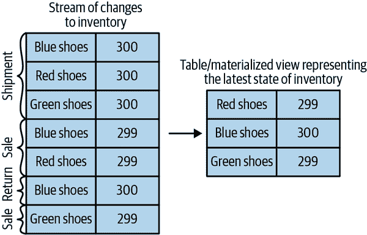

###### 图 14-1：材料库存变化

## 时间窗口

流上的大多数操作都是窗口操作，操作时间片：移动平均线，本周销售的热门产品，系统上的 99th 百分位负载等。两个流的连接操作也是窗口化的——我们连接在同一时间片发生的事件。很少有人停下来思考他们的操作需要哪种类型的窗口。例如，当计算移动平均线时，我们想知道：

窗口的大小

我们想要计算每个五分钟窗口内所有事件的平均值吗？每个 15 分钟窗口？还是整天？较大的窗口更平滑，但滞后更多——如果价格上涨，要比较小的窗口需要更长的时间才能注意到。Kafka Streams 还包括*会话窗口*，其中窗口的大小由不活动的时间段定义。开发人员定义了会话间隔，所有连续到达的事件，其间隔小于定义的会话间隔，都属于同一个会话。到达的间隔将定义一个新的会话，到达下一个间隔之前的所有事件将属于新的会话。

窗口移动的频率（*提前间隔*）

五分钟平均数可以每分钟、每秒或每次有新事件时更新。窗口的大小是固定的时间间隔，称为*跳跃窗口*。当提前间隔等于窗口大小时，称为*滚动窗口*。

窗口保持可更新的时间长度（*宽限期*）

我们的五分钟移动平均线计算了 00:00–00:05 窗口的平均值。现在，一个小时后，我们又得到了一些输入记录，它们的*事件时间*显示为 00:02。我们要更新 00:00–00:05 期间的结果吗？还是让过去的事情成为过去？理想情况下，我们将能够定义一个特定的时间段，在此期间事件将被添加到它们各自的时间片中。例如，如果事件延迟了四个小时，我们应该重新计算结果并更新。如果事件到达的时间晚于那个时间，我们可以忽略它们。

窗口可以与时钟时间对齐——即，每分钟移动一次的五分钟窗口的第一个时间片为 00:00–00:05，第二个时间片为 00:01–00:06。或者它可以是不对齐的，只是在应用程序启动时开始，然后第一个时间片可以是 03:17–03:22。参见图 14-2 了解这两种窗口类型之间的区别。

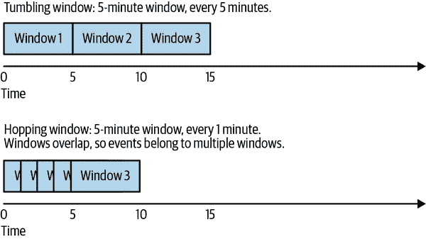

###### 图 14-2：滚动窗口与跳跃窗口

## 处理保证

流处理应用程序的一个关键要求是能够确保每个记录只处理一次，而不受故障的影响。如果没有确切一次的保证，流处理无法用于需要准确结果的情况。正如在第八章中详细讨论的那样，Apache Kafka 支持具有事务性和幂等性生产者的确切一次语义。Kafka Streams 使用 Kafka 的事务来为流处理应用程序实现确切一次的保证。使用 Kafka Streams 库的每个应用程序都可以通过将`processing.​guar⁠antee`设置为`exactly_once`来启用确切一次的保证。Kafka Streams 版本 2.6 或更高版本包括一个更高效的确切一次实现，需要 Kafka 经纪人的版本为 2.5 或更高版本。可以通过将`processing.​guar⁠antee`设置为`exactly_once_beta`来启用这种高效实现。

# 流处理设计模式

每个流处理系统都是不同的——从基本的消费者、处理逻辑和生产者的组合，到像 Spark Streaming 这样的涉及机器学习库的集群，以及其中的许多其他系统。但是有一些基本的设计模式，这些模式是对流处理架构常见需求的已知解决方案。我们将回顾一些这些众所周知的模式，并展示它们如何在一些示例中使用。

## 单事件处理

流处理的最基本模式是独立处理每个事件。这也被称为*map/filter 模式*，因为它通常用于从流中过滤不必要的事件或转换每个事件。（map 一词基于 map/reduce 模式，其中 map 阶段转换事件，reduce 阶段聚合事件。）

在这种模式中，流处理应用程序从流中消费事件，修改每个事件，然后将事件生成到另一个流中。一个例子是一个应用程序从流中读取日志消息，并将“ERROR”事件写入高优先级流，其余事件写入低优先级流。另一个例子是一个应用程序从流中读取事件，并将其从 JSON 修改为 Avro。这些应用程序不需要在应用程序内部维护状态，因为每个事件都可以独立处理。这意味着从应用程序故障或负载平衡中恢复非常容易，因为无需恢复状态；我们可以简单地将事件交给应用程序的另一个实例来处理。

这种模式可以很容易地通过简单的生产者和消费者来处理，如图 14-3 所示。

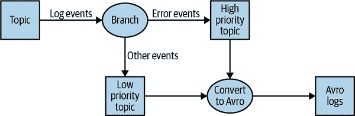

###### 图 14-3\. 单事件处理拓扑

## 使用本地状态进行处理

大多数流处理应用都关注聚合信息，特别是窗口聚合。一个例子是找到每天交易的最低和最高股价，并计算移动平均值。

这些聚合需要维护一个*状态*。在我们的示例中，为了计算每天的最低和平均价格，我们需要存储最小值、总和和截至当前时间我们看到的记录数。

所有这些都可以使用*本地*状态（而不是共享状态）来完成，因为我们示例中的每个操作都是*group by*聚合。也就是说，我们按股票符号执行聚合，而不是在整个股票市场上执行聚合。我们使用 Kafka 分区器来确保所有具有相同股票符号的事件都写入同一个分区。然后，应用程序的每个实例将从分配给它的分区中获取所有事件（这是 Kafka 消费者的保证）。这意味着应用程序的每个实例可以为写入分配给它的分区的股票符号子集维护状态。参见图 14-4。

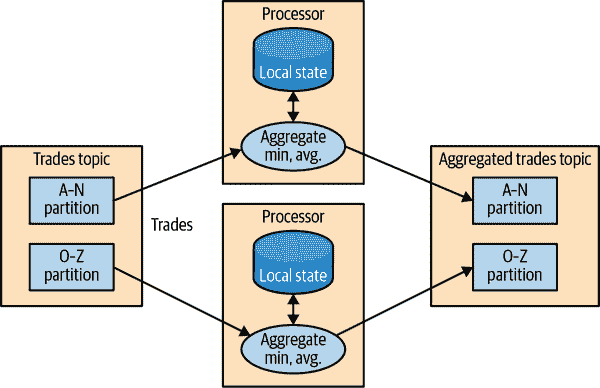

###### 图 14-4\. 具有本地状态的事件处理拓扑

当应用程序具有本地状态时，流处理应用程序变得更加复杂。流处理应用程序必须解决几个问题：

内存使用

本地状态理想情况下适合于应用程序实例可用的内存。一些本地存储允许溢出到磁盘，但这会对性能产生重大影响。

持久性

我们需要确保应用程序实例关闭时不会丢失状态，并且在实例再次启动或被不同实例替换时可以恢复状态。这是 Kafka Streams 非常擅长处理的事情——本地状态使用内置的 RocksDB 存储在内存中，该存储也将数据持久化到磁盘，以便在重新启动后快速恢复。但是所有对本地状态的更改也会发送到 Kafka 主题。如果流的节点关闭，本地状态不会丢失——可以通过重新读取 Kafka 主题中的事件轻松重新创建。例如，如果本地状态包含“IBM 的当前最低价=167.19”，我们将其存储在 Kafka 中，以便以后可以从这些数据重新填充本地缓存。Kafka 使用日志压缩来确保这些主题不会无休止地增长，并且重新创建状态始终是可行的。

重新平衡

有时分区会重新分配给不同的消费者。当这种情况发生时，失去分区的实例必须存储最后的良好状态，接收分区的实例必须知道如何恢复正确的状态。

流处理框架在帮助开发人员管理所需的本地状态方面存在差异。如果我们的应用程序需要维护本地状态，我们要确保检查框架及其保证。我们将在本章末尾包括一个简短的比较指南，但众所周知，软件变化迅速，流处理框架变化更快。

## 多阶段处理/重新分配

如果我们需要一个*group by*类型的聚合，本地状态非常适用。但是，如果我们需要使用所有可用信息的结果呢？例如，假设我们想要每天发布前 10 支股票——在每个交易日开盘到收盘期间获利最多的 10 支股票。显然，我们在每个应用程序实例上本地执行的操作是不够的，因为所有前 10 支股票可能分配给其他实例的分区。我们需要的是一个两阶段的方法。首先，我们计算每个股票符号的每日盈亏。我们可以在每个实例上使用本地状态来完成这个操作。然后，我们将结果写入一个新的具有单个分区的主题。这个分区将由单个应用程序实例读取，然后找到当天的前 10 支股票。第二个主题，其中只包含每个股票符号的每日摘要，显然比包含交易本身的主题要小得多，流量也要少得多，因此可以由应用程序的单个实例处理。有时需要更多的步骤才能产生结果。请参见图 14-5。

这种多阶段处理对于那些编写 MapReduce 代码的人来说非常熟悉，其中经常需要使用多个减少阶段。如果你曾经编写过 map-reduce 代码，你会记得你需要为每个减少步骤编写一个单独的应用程序。与 MapReduce 不同，大多数流处理框架允许在单个应用程序中包含所有步骤，框架处理哪个应用程序实例（或工作程序）将运行每个步骤的细节。

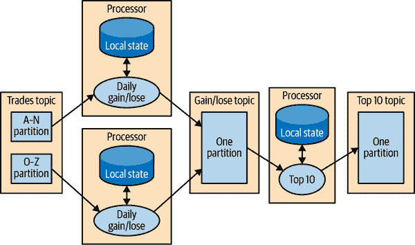

###### 图 14-5：包括本地状态和重新分区步骤的拓扑

## 使用外部查找进行处理：流-表连接

有时，流处理需要与流外部的数据集成——针对存储在数据库中的一组规则验证交易，或者使用有关点击的用户数据丰富点击流信息。

进行数据丰富的外部查找的明显想法是这样的：对于流中的每个点击事件，查找个人资料数据库中的用户，并写入一个事件，其中包括原始点击事件以及用户的年龄和性别，写入另一个主题。见图 14-6。

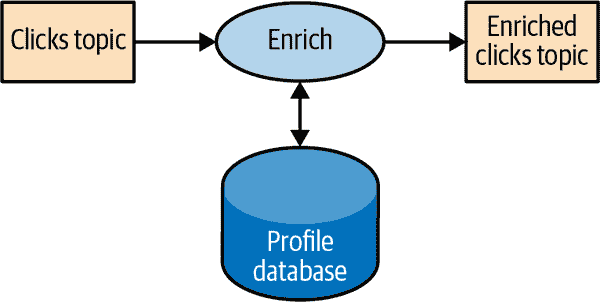

###### 图 14-6\. 包括外部数据源的流处理

这个明显的想法的问题在于，外部查找会给每条记录的处理增加显著的延迟，通常在 5 到 15 毫秒之间。在许多情况下，这是不可行的。通常，这会给外部数据存储增加额外的负载，这也是不可接受的。流处理系统通常可以处理 10 万至 50 万事件每秒，但数据库可能只能以合理的性能处理大约 1 万事件每秒。还有可用性方面的复杂性——我们的应用程序需要处理外部数据库不可用的情况。

为了获得良好的性能和可用性，我们需要在流处理应用程序中缓存来自数据库的信息。然而，管理这个缓存可能会有挑战——我们如何防止缓存中的信息变得过时？如果我们太频繁地刷新事件，仍然会对数据库造成压力，而缓存并没有太大帮助。如果我们等待太久才获取新事件，我们就会使用过时的信息进行流处理。

但是，如果我们可以捕获数据库表中发生的所有更改，并将其转换为事件流，我们可以让我们的流处理作业监听此流，并根据数据库更改事件更新缓存。将数据库更改捕获为事件流称为*变更数据捕获*（CDC），Kafka Connect 具有多个连接器，能够执行 CDC 并将数据库表转换为更改事件流。这使我们能够保留表的私有副本，并在数据库发生更改事件时得到通知，以便我们相应地更新我们自己的副本。见图 14-7。

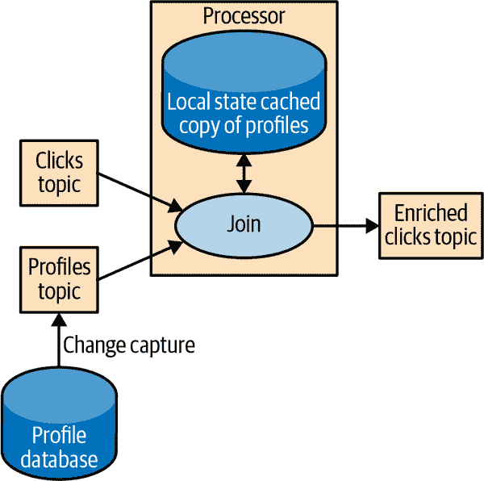

###### 图 14-7\. 连接表和事件流的拓扑结构，无需在流处理中涉及外部数据源。

然后，当我们收到点击事件时，我们可以在本地状态中查找`user_id`并丰富事件。由于我们使用的是本地状态，这样扩展得更好，不会影响数据库和其他使用它的应用程序。

我们将其称为*流-表连接*，因为其中一个流代表对本地缓存表的更改。

## 表-表连接

在前一节中，我们讨论了表和更新事件流的等效性。我们已经详细讨论了在连接流和表时的工作原理。我们没有理由不能在连接操作的两侧都有这些物化表。

连接两个表始终是非窗口化的，并在执行操作时连接两个表的当前状态。使用 Kafka Streams，我们可以执行`等值连接`，其中两个表具有相同的以相同方式分区的键，因此连接操作可以在大量应用程序实例和机器之间高效分布。

Kafka Streams 还支持两个表的`外键连接`——一个流或表的键与另一个流或表的任意字段进行连接。您可以在[Kafka Summit 2020](https://oreil.ly/f34U6)的演讲“Crossing the Streams”中了解更多信息，或者在更深入的[博客文章](https://oreil.ly/hlKNz)中了解它的工作原理。

## 流连接

有时我们想要连接两个真实的事件流，而不是一个带有表的流。什么使一个流“真实”？如果您回忆一下本章开头的讨论，流是无界的。当我们使用流来表示表时，我们可以忽略流中的大部分历史，因为我们只关心表中的当前状态。但是当我们连接两个流时，我们正在连接整个历史，试图将一个流中的事件与另一个流中在相同时间窗口内具有相同键和发生的事件进行匹配。这就是为什么流连接也被称为*窗口连接*。

例如，假设我们有一个包含人们输入到我们网站的搜索查询的流，以及另一个包含点击的流，其中包括对搜索结果的点击。我们希望匹配搜索查询与他们点击的结果，以便我们知道哪个结果对于哪个查询最受欢迎。显然，我们希望基于搜索词匹配结果，但只在特定时间窗口内匹配它们。我们假设结果是在输入到我们的搜索引擎后的几秒钟内被点击的。因此，我们在每个流上保留一个小的几秒钟的窗口，并匹配每个窗口中的结果。见图 14-8。

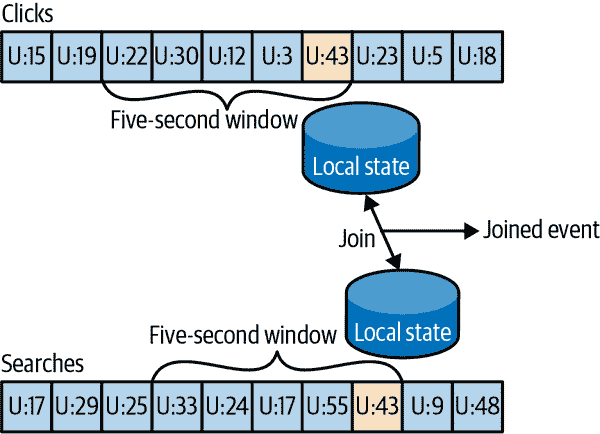

###### 图 14-8：连接两个事件流；这些连接总是涉及移动时间窗口

Kafka Streams 支持`equi-joins`，其中流、查询和点击根据相同的键进行分区，这些键也是连接键。这样，所有来自`user_id:42`的点击事件最终都会进入点击主题的分区 5，而所有`user_id:42`的搜索事件最终都会进入搜索主题的分区 5。然后，Kafka Streams 确保将两个主题的分区 5 分配给同一个任务。因此，该任务可以看到`user_id:42`的所有相关事件。它在其嵌入式 RocksDB 状态存储中维护了两个主题的连接窗口，这就是它执行连接的方式。

## 顺序错误的事件

处理在错误时间到达流的事件不仅是流处理中的挑战，也是传统 ETL 系统中的挑战。在物联网场景中，顺序错误的事件经常而且预期地发生（图 14-9）。例如，移动设备在几个小时内失去 WiFi 信号，并在重新连接时发送了几小时的事件。这也发生在监视网络设备（故障交换机在修复之前不会发送诊断信号）或制造业（工厂的网络连接在发展中国家尤其不可靠）。

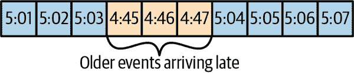

###### 图 14-9：事件的顺序错误

我们的流应用程序需要能够处理这些情况。这通常意味着应用程序必须执行以下操作：

+   认识到事件的顺序错误——这需要应用程序检查事件时间并发现它比当前时间更早。

+   定义一个时间段，在此期间将尝试协调顺序错误的事件。也许应该协调三小时的延迟，并且超过三周的事件可以被丢弃。

+   具有内部能力来协调此事件。这是流应用程序和批处理作业之间的主要区别。如果我们有一个每日批处理作业，并且在作业完成后有一些事件到达，通常我们可以重新运行昨天的作业并更新事件。对于流处理，没有“重新运行昨天的作业”——同一连续过程需要在任何给定时刻处理旧事件和新事件。

+   能够更新结果。如果流处理的结果被写入数据库，*put*或*update*就足以更新结果。如果流应用程序通过电子邮件发送结果，更新可能会更加棘手。

包括 Google 的 Dataflow 和 Kafka Streams 在内的几个流处理框架都内置了对事件时间的支持，独立于处理时间，并且能够处理事件时间早于或晚于当前处理时间的事件。这通常是通过在本地状态中维护多个可用于更新的聚合窗口，并让开发人员能够配置保留这些窗口聚合可用于更新的时间长度来实现的。当然，聚合窗口保持可用于更新的时间越长，就需要更多的内存来维护本地状态。

Kafka Streams API 总是将聚合结果写入结果主题。这些通常是`压缩主题`，这意味着仅保留每个键的最新值。如果需要更新聚合窗口的结果以响应延迟事件，Kafka Streams 将简单地为此聚合窗口写入新结果，这将有效地替换先前的结果。

## 重新处理

最后一个重要的模式是重新处理事件。这种模式有两种变体：

+   我们有一个改进版的流处理应用程序。我们希望在与旧版本相同的事件流上运行新版本的应用程序，生成一个不会替换第一个版本的新结果流，比较两个版本之间的结果，并在某个时候将客户端切换到使用新结果而不是现有结果。

+   现有的流处理应用程序存在错误。我们修复了错误，我们想重新处理事件流并重新计算结果

第一个用例之所以变得简单，是因为 Apache Kafka 在可扩展的数据存储中长时间存储事件流的全部内容。这意味着运行两个版本的流处理应用程序并写入两个结果流只需要以下步骤：

+   将新版本的应用程序作为新的消费者组启动。

+   配置新版本从输入主题的第一个偏移量开始处理（这样它将获得输入流中所有事件的副本）

+   让新应用程序继续处理，并在新版本的处理作业赶上时切换客户端应用程序到新的结果流

第二个用例更具挑战性——它需要“重置”现有应用程序，以便从输入流的开头重新开始处理，重置本地状态（这样我们就不会混合两个应用程序版本的结果），并可能清理先前的输出流。虽然 Kafka Streams 有一个用于重置流处理应用程序状态的工具，但我们建议在有足够的容量运行两个应用程序副本并生成两个结果流时尝试使用第一种方法。第一种方法更安全——它允许在多个版本之间来回切换并比较结果，而不会在清理过程中丢失关键数据或引入错误。

## 交互式查询

如前所述，流处理应用程序具有状态，并且这种状态可以分布在应用程序的许多实例之间。大多数情况下，流处理应用程序的用户通过从输出主题中读取结果来获取处理结果。然而，在某些情况下，希望通过快捷方式从状态存储中读取结果。当结果是一个表时（例如，畅销书的前 10 名），并且结果流实际上是对该表的更新流时，直接从流处理应用程序状态中读取表会更快、更容易。

Kafka Streams 包括灵活的 API，用于[查询流处理应用程序的状态](https://oreil.ly/pCGeC)。

# Kafka Streams 示例

为了演示这些模式在实践中是如何实现的，我们将展示一些使用 Apache Kafka Streams API 的示例。我们使用这个特定的 API 是因为它相对简单易用，并且它已经随 Apache Kafka 一起发布，我们已经可以访问。重要的是要记住，这些模式可以在任何流处理框架和库中实现——这些模式是通用的，但示例是具体的。

Apache Kafka 有两个流 API——低级 Processor API 和高级 Streams DSL。我们将在我们的示例中使用 Kafka Streams DSL。DSL 允许我们通过定义一系列对流中事件的转换来定义流处理应用程序。转换可以是简单的过滤器，也可以是复杂的流到流的连接。低级 API 允许我们创建自己的转换。要了解更多关于低级 Processor API 的信息，可以参考[开发者指南](https://oreil.ly/bQ5nE)，以及演示文稿[“Beyond the DSL”](https://oreil.ly/4vson)是一个很好的介绍。

使用 DSL API 的应用程序始终从使用`StreamsBuilder`创建处理*拓扑*开始——一个应用于流中事件的转换的有向无环图（DAG）。然后我们从拓扑创建一个`KafkaStreams`执行对象。启动`KafkaStreams`对象将启动多个线程，每个线程将应用处理拓扑到流中的事件。当我们关闭`KafkaStreams`对象时，处理将结束。

我们将看一些使用 Kafka Streams 实现我们刚讨论的设计模式的示例。一个简单的词频统计示例将用于演示映射/过滤模式和简单的聚合。然后我们将转移到一个示例，其中我们计算股票交易的不同统计数据，这将允许我们演示窗口聚合。最后，我们将使用 ClickStream 增强作为一个示例来演示流连接。

## 词频统计

让我们通过一个简化的 Kafka Streams 词频统计示例来了解一下。你可以在[GitHub](http://bit.ly/2ri00gj)上找到完整的示例。

创建流处理应用程序时的第一件事是配置 Kafka Streams。Kafka Streams 有大量可能的配置，我们在这里不讨论，但你可以在[文档](http://bit.ly/2t7obPU)中找到它们。此外，你可以通过向`Properties`对象添加任何生产者或消费者配置来配置嵌入在 Kafka Streams 中的生产者和消费者：

```java
public class WordCountExample {

    public static void main(String[] args) throws Exception{

        Properties props = new Properties();
        props.put(StreamsConfig.APPLICATION_ID_CONFIG,
          "wordcount"); // ①
        props.put(StreamsConfig.BOOTSTRAP_SERVERS_CONFIG,
          "localhost:9092"); // ②
        props.put(StreamsConfig.DEFAULT_KEY_SERDE_CLASS_CONFIG,
          Serdes.String().getClass().getName()); // ③
        props.put(StreamsConfig.DEFAULT_VALUE_SERDE_CLASS_CONFIG,
          Serdes.String().getClass().getName());
```

①

每个 Kafka Streams 应用程序都必须有一个应用程序 ID。它用于协调应用程序的实例，以及在命名内部本地存储和与之相关的主题时使用。对于与同一 Kafka 集群一起工作的每个 Kafka Streams 应用程序，此名称必须是唯一的。

②

Kafka Streams 应用程序总是从 Kafka 主题中读取数据，并将其输出到 Kafka 主题。正如我们将在后面讨论的那样，Kafka Streams 应用程序还使用 Kafka 进行协调。因此，最好告诉我们的应用程序在哪里找到 Kafka。

③

在读取和写入数据时，我们的应用程序将需要进行序列化和反序列化，因此我们提供了默认的 Serde 类。如果需要，我们可以在构建流拓扑时稍后覆盖这些默认值。

现在我们有了配置，让我们构建我们的流拓扑：

```java
StreamsBuilder builder = new StreamsBuilder(); // ①

KStream<String, String> source =
  builder.stream("wordcount-input");

final Pattern pattern = Pattern.compile("\\W+");

KStream<String, String> counts  = source.flatMapValues(value->
  Arrays.asList(pattern.split(value.toLowerCase()))) // ②
        .map((key, value) -> new KeyValue<String,
           String>(value, value))
        .filter((key, value) -> (!value.equals("the"))) // ③
        .groupByKey() // ④
        .count().mapValues(value->
           Long.toString(value)).toStream();// ⑤
counts.to("wordcount-output"); // ⑥
```

①

我们创建一个`StreamsBuilder`对象，并开始通过指向我们将用作输入的主题来定义一个流。

②

我们从源主题中读取的每个事件都是一行单词；我们使用正则表达式将其拆分为一系列单独的单词。然后我们取出每个单词（当前是事件记录的值）并将其放入事件记录键中，以便在分组操作中使用。 

③

我们过滤掉了单词*the*，只是为了展示过滤有多容易。

④

然后我们按键分组，所以现在我们对于每个唯一单词都有一个事件集合。

⑤

我们计算每个集合中有多少事件。计数的结果是`Long`数据类型。我们将其转换为`String`，这样人类就可以更容易地阅读结果。

⑥

只剩下一件事——将结果写回 Kafka。

现在我们已经定义了应用程序将运行的转换流程，我们只需要…运行它：

```java
KafkaStreams streams = new KafkaStreams(builder.build(), props); // ①

streams.start(); // ②

// usually the stream application would be running forever,
// in this example we just let it run for some time and stop
Thread.sleep(5000L);

streams.close(); // ③
```

①

基于我们定义的拓扑和属性，定义一个`KafkaStreams`对象。

②

启动 Kafka Streams。

③

一段时间后，停止它。

就是这样！在几行简短的代码中，我们演示了实现单个事件处理模式的简易性（我们在事件上应用了 map 和 filter）。我们通过添加 group-by 操作符重新分区数据，然后在计算每个单词作为键的记录数量时保持了简单的本地状态。然后我们在计算每个单词出现的次数时保持了简单的本地状态。

在这一点上，我们建议运行完整的示例。[GitHub 存储库中的 README](http://bit.ly/2sOXzUN)包含了如何运行示例的说明。

请注意，我们可以在我们的机器上运行整个示例，而无需安装除了 Apache Kafka 之外的任何东西。如果我们的输入主题包含多个分区，我们可以运行多个`WordCount`应用程序的实例（只需在几个不同的终端标签中运行应用程序），然后我们就有了第一个 Kafka Streams 处理集群。`WordCount`应用程序的实例相互交流并协调工作。对于一些流处理框架来说，最大的入门障碍之一是本地模式非常容易使用，但是要运行生产集群，我们需要安装 YARN 或 Mesos，然后在所有这些机器上安装处理框架，然后学习如何将我们的应用程序提交到集群。使用 Kafka 的 Streams API，我们只需启动多个应用程序实例，就可以得到一个集群。完全相同的应用程序在我们的开发机器上和生产环境中运行。

## 股票市场统计

下一个示例更加复杂——我们将读取一系列股票市场交易事件，其中包括股票代码、要价和要价大小。在股票市场交易中，*要价*是卖方要价，而*出价*是买方建议支付的价格。*要价大小*是卖方愿意以该价格出售的股票数量。为了简化示例，我们完全忽略了出价。我们也不会在我们的数据中包含时间戳；相反，我们将依赖由我们的 Kafka 生产者填充的事件时间。

然后我们将创建包含一些窗口统计信息的输出流：

+   每五秒窗口的最佳（即最低）要价

+   每五秒窗口的交易数量

+   每五秒窗口的平均要价

所有统计数据将每秒更新一次。

为了简化起见，我们假设我们的交易所只有 10 个股票代码在交易中。设置和配置与我们在“Word Count”中使用的非常相似。

```java
Properties props = new Properties();
props.put(StreamsConfig.APPLICATION_ID_CONFIG, "stockstat");
props.put(StreamsConfig.BOOTSTRAP_SERVERS_CONFIG, Constants.BROKER);
props.put(StreamsConfig.DEFAULT_KEY_SERDE_CLASS_CONFIG,
  Serdes.String().getClass().getName());
props.put(StreamsConfig.DEFAULT_VALUE_SERDE_CLASS_CONFIG,
  TradeSerde.class.getName());
```

主要区别在于使用的 Serde 类。在"词频统计"中，我们对键和值都使用了字符串，因此对两者都使用了`Serdes.String()`类作为序列化器和反序列化器。在这个例子中，键仍然是一个字符串，但值是一个包含股票代码、询价和询价大小的`Trade`对象。为了对这个对象进行序列化和反序列化（以及我们在这个小应用程序中使用的其他一些对象），我们使用了谷歌的 Gson 库来从我们的`Java`对象生成 JSON 序列化器和反序列化器。然后我们创建了一个小包装器，从中创建了一个 Serde 对象。这是我们创建 Serde 的方法：

```java
static public final class TradeSerde extends WrapperSerde<Trade> {
    public TradeSerde() {
        super(new JsonSerializer<Trade>(),
          new JsonDeserializer<Trade>(Trade.class));
    }
}
```

没有什么花哨的，但请记住为要存储在 Kafka 中的每个对象提供一个 Serde 对象 - 输入、输出，有时是中间结果。为了使这更容易，我们建议通过类似 Gson、Avro、Protobuf 或类似的库生成这些 Serdes。

现在我们已经配置好了一切，是时候构建我们的拓扑了：

```java
KStream<Windowed<String>, TradeStats> stats = source
    .groupByKey() // ①
    .windowedBy(TimeWindows.of(Duration.ofMillis(windowSize))
                           .advanceBy(Duration.ofSeconds(1))) // ②
    .aggregate( // ③
        () -> new TradeStats(),
        (k, v, tradestats) -> tradestats.add(v), // ④
        Materialized.<String, TradeStats, WindowStore<Bytes, byte[]>>
            as("trade-aggregates") // ⑤
           .withValueSerde(new TradeStatsSerde())) // ⑥
    .toStream() // ⑦
    .mapValues((trade) -> trade.computeAvgPrice()); // ⑧

stats.to("stockstats-output",
    Produced.keySerde(
      WindowedSerdes.timeWindowedSerdeFrom(String.class, windowSize))); // ⑨
```

①

我们首先从输入主题中读取事件，并执行`groupByKey()`操作。尽管它的名称是这样，但这个操作并不进行任何分组。相反，它确保事件流基于记录键进行分区。由于我们将数据写入一个带有键的主题，并且在调用`groupByKey()`之前没有修改键，所以数据仍然按其键进行分区 - 在这种情况下，此方法不起作用。

②

我们定义窗口 - 在这种情况下，是一个五秒的窗口，每秒前进一次。

③

在确保正确的分区和窗口化之后，我们开始聚合。`aggregate`方法将流拆分为重叠的窗口（每秒五秒窗口），然后在窗口中的所有事件上应用聚合方法。此方法的第一个参数是一个新对象，将包含聚合的结果 - 在我们的情况下是`Tradestats`。这是一个我们创建的对象，用于包含我们对每个时间窗口感兴趣的所有统计信息 - 最低价格、平均价格和交易数量。

④

然后我们提供一个方法来实际聚合记录 - 在这种情况下，使用`Tradestats`对象的`add`方法来更新窗口中的最低价格、交易数量和总价格。

⑤

在"流处理设计模式"中提到，窗口聚合需要维护状态和本地存储，其中状态将被维护。聚合方法的最后一个参数是状态存储的配置。`Materialized`是存储配置对象，我们将存储名称配置为`trade-aggregates`。这可以是任何唯一的名称。

⑥

作为状态存储配置的一部分，我们还提供了一个 Serde 对象，用于序列化和反序列化聚合结果（`Tradestats`对象）。

⑦

聚合的结果是一个*表*，其中股票和时间窗口是主键，聚合结果是值。我们将表转换回事件流。

⑧

最后一步是更新平均价格 - 目前聚合结果包括价格总和和交易数量。我们遍历这些记录，并使用现有的统计数据来计算平均价格，以便将其包含在输出流中。

⑨

最后，我们将结果写回`stockstats-output`流。由于结果是窗口操作的一部分，我们创建了一个`WindowedSerde`，它以包含窗口时间戳的窗口数据格式存储结果。窗口大小作为 Serde 的一部分传递，即使在序列化时没有使用窗口大小（反序列化需要窗口大小，因为输出主题中只存储窗口的开始时间）。

在定义流程之后，我们使用它来生成一个`KafkaStreams`对象并运行它，就像我们在“Word Count”中所做的那样。

这个示例展示了如何对流执行窗口聚合——这可能是流处理的最流行用例。需要注意的一件事是，维护聚合的本地状态所需的工作量很少——只需提供一个 Serde 并命名状态存储即可。然而，该应用程序将扩展到多个实例，并通过将一些分区的处理转移给幸存实例之一来自动从每个实例的故障中恢复。我们将在“Kafka Streams: Architecture Overview”中看到更多关于如何实现的内容。

通常情况下，您可以在[GitHub](http://bit.ly/2r6BLm1)上找到完整的示例，包括运行说明。

## 点击流丰富化

最后的示例将通过丰富网站上的点击流来演示流连接。我们将生成一个模拟点击流，一个虚构的个人资料数据库表的更新流，以及一个网络搜索流。然后，我们将连接这三个流，以获得对每个用户活动的 360 度视图。用户搜索了什么？他们点击了什么结果？他们是否在用户资料中更改了“兴趣”？这些类型的连接为分析提供了丰富的数据收集。产品推荐通常基于这种信息——用户搜索了自行车，点击了“Trek”链接，并对旅行感兴趣，因此我们可以向 Trek 推广自行车、头盔和内布拉斯加等异国情调的自行车旅行。

由于配置应用程序与之前的示例类似，让我们跳过这部分，看看连接多个流的拓扑结构：

```java
KStream<Integer, PageView> views =
    builder.stream(Constants.PAGE_VIEW_TOPIC,
      Consumed.with(Serdes.Integer(), new PageViewSerde())); // ①
KStream<Integer, Search> searches =
    builder.stream(Constants.SEARCH_TOPIC,
      Consumed.with(Serdes.Integer(), new SearchSerde()));
KTable<Integer, UserProfile> profiles =
    builder.table(Constants.USER_PROFILE_TOPIC,
      Consumed.with(Serdes.Integer(), new ProfileSerde())); // ②

KStream<Integer, UserActivity> viewsWithProfile = views.leftJoin(profiles, // ③
                (page, profile) -> {
                    if (profile != null)
                        return new UserActivity(
                          profile.getUserID(), profile.getUserName(),
                          profile.getZipcode(), profile.getInterests(),
                          "", page.getPage()); // ④
                    else
                       return new UserActivity(
                         -1, "", "", null, "", page.getPage());
                    });

KStream<Integer, UserActivity> userActivityKStream =
    viewsWithProfile.leftJoin(searches, // ⑤
      (userActivity, search) -> {
          if (search != null)
              userActivity.updateSearch(search.getSearchTerms()); // ⑥
          else
              userActivity.updateSearch("");
          return userActivity;
      },
      JoinWindows.of(Duration.ofSeconds(1)).before(Duration.ofSeconds(0)),  // ⑦
                    StreamJoined.with(Serdes.Integer(),  // ⑧
                                      new UserActivitySerde(),
                                      new SearchSerde()));
```

① (#co_stream_processing_CO5-1)

首先，我们为我们想要连接的两个流创建了流对象——点击和搜索。当我们创建流对象时，我们传递输入主题以及在从主题中消费记录并将其反序列化为输入对象时将使用的键和值 Serde。

② (#co_stream_processing_CO5-2)

我们还为用户资料定义了一个`KTable`。`KTable`是通过更改流更新的物化存储。

③ (#co_stream_processing_CO5-3)

然后，我们通过将事件流与个人资料表进行连接，丰富点击流的用户资料信息。在流-表连接中，流中的每个事件都会从个人资料表的缓存副本中接收信息。我们正在进行左连接，因此将保留没有已知用户的点击。

④ (#co_stream_processing_CO5-4)

这是`join`方法——它接受两个值，一个来自流，一个来自记录，并返回第三个值。与数据库不同，我们可以决定如何将两个值组合成一个结果。在这种情况下，我们创建了一个包含用户详细信息和查看页面的`activity`对象。

⑤ (#co_stream_processing_CO5-5)

接下来，我们想要将点击信息与同一用户执行的搜索进行`join`。这仍然是左连接，但现在我们要连接两个流，而不是流到表。

// ⑥ (#co_stream_processing_CO5-6)

这是`join`方法——我们只需将搜索词添加到所有匹配的页面查看中。

// ⑦ (#co_stream_processing_CO5-7)

这是有趣的部分 - *流到流连接* 是一个带有时间窗口的连接。连接每个用户的所有点击和搜索并没有太多意义 - 我们希望将每个搜索与与之相关的点击连接起来，也就是发生在搜索后的短时间内的点击。因此，我们定义了一个一秒钟的连接窗口。我们调用 `of` 来创建一个搜索前后一秒钟的窗口，然后我们调用 `before` 以零秒的间隔来确保我们只连接每次搜索后一秒钟发生的点击而不是之前的点击。结果将包括相关的点击、搜索词和用户资料。这将允许对搜索及其结果进行全面分析。

⑧

我们在这里定义连接结果的 Serde。这包括连接两侧共有的键的 Serde，以及将包含在连接结果中的两个值的 Serde。在这种情况下，键是用户 ID，所以我们使用一个简单的 `Integer` Serde。

在定义流程之后，我们使用它来生成一个 `KafkaStreams` 对象并运行它，就像我们在 “Word Count” 中所做的那样。

这个例子展示了流处理中可能存在的两种不同的连接模式。一个是将流与表连接，以丰富表中的所有流事件信息。这类似于在数据仓库上运行查询时将事实表与维度表连接。第二个例子是基于时间窗口连接两个流。这个操作是流处理中独有的。

通常情况下，您可以在 [GitHub](http://bit.ly/2sq096i) 上找到完整的示例，包括运行它的说明。

# Kafka Streams：架构概述

前一节的示例演示了如何使用 Kafka Streams API 实现一些众所周知的流处理设计模式。但要更好地理解 Kafka 的 Streams 库实际上是如何工作和扩展的，我们需要窥探一下其内部，并了解 API 背后的一些设计原则。

## 构建拓扑

每个流应用程序都实现并执行一个*拓扑*。拓扑（在其他流处理框架中也称为 DAG 或有向无环图）是一组操作和转换，每个事件都从输入到输出经过。图 14-10 显示了 “Word Count” 中的拓扑。

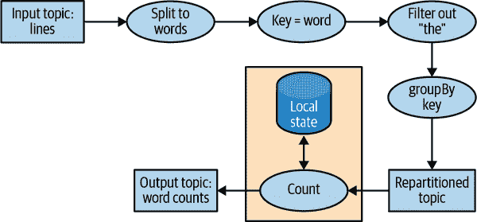

###### 图 14-10\. 单词计数流处理示例的拓扑

即使是一个简单的应用程序也有一个非平凡的拓扑结构。拓扑由处理器组成 - 这些是拓扑图中的节点（在我们的图表中用圆圈表示）。大多数处理器实现数据操作 - 过滤、映射、聚合等。还有源处理器，它们从主题中消费数据并传递数据，以及汇处理器，它们从先前的处理器获取数据并将其生成到主题中。拓扑始终以一个或多个源处理器开始，并以一个或多个汇处理器结束。

## 优化拓扑

默认情况下，Kafka Streams 通过将每个 DSL 方法独立映射到较低级别的等效方法来执行使用 DSL API 构建的应用程序。通过独立评估每个 DSL 方法，错过了优化整体拓扑的机会。

然而，请注意，Kafka Streams 应用程序的执行是一个三步过程：

1.  逻辑拓扑是通过创建 `KStream` 和 `KTable` 对象并在它们上执行 DSL 操作（如过滤和连接）来定义的。

1.  `StreamsBuilder.build()` 从逻辑拓扑生成物理拓扑。

1.  `KafkaStreams.start()` 执行拓扑 - 这是数据被消费、处理和生成的地方。

第二步，从逻辑定义生成物理拓扑，是可以应用整体优化计划的地方。

目前，Apache Kafka 仅包含了一些优化，主要是围绕尽可能重用主题。这些可以通过将`StreamsConfig.​TOPOL⁠OGY_OPTIMIZATION`设置为`StreamsConfig.OPTIMIZE`并调用`build(props)`来启用。如果只调用`build()`而不传递配置，则仍然禁用优化。建议测试应用程序时启用和禁用优化，并比较执行时间和写入 Kafka 的数据量，当然，还要验证在各种已知场景中结果是否相同。

## 测试拓扑结构

一般来说，我们希望在重要的成功执行的场景中使用软件之前对其进行测试。自动化测试被认为是黄金标准。每次对软件应用程序或库进行更改时，都会进行可重复的测试，以实现快速迭代和更容易的故障排除。

我们希望将相同的方法论应用到我们的 Kafka Streams 应用程序中。除了自动化的端到端测试，该测试会针对一个包含生成数据的暂存环境运行流处理应用程序，我们还希望包括更快、更轻量和更易于调试的单元测试和集成测试。

Kafka Streams 应用程序的主要测试工具是`TopologyTestDriver`。自从 1.1.0 版本引入以来，其 API 经历了重大改进，自 2.4 版本以来变得方便且易于使用。这些测试看起来像普通的单元测试。我们定义输入数据，将其生成到模拟输入主题，使用测试驱动程序运行拓扑，从模拟输出主题中读取结果，并通过将其与预期值进行比较来验证结果。

我们建议使用`TopologyTestDriver`来测试流处理应用程序，但由于它不模拟 Kafka Streams 的缓存行为（这本书中未讨论的一种优化，与状态存储本身完全无关，这个框架模拟了它），因此它将无法检测到整个类别的错误。

单元测试通常与集成测试相辅相成，对于 Kafka Streams，有两种流行的集成测试框架：`EmbeddedKafkaCluster`和`Testcontainers`。前者在运行测试的 JVM 内部运行 Kafka 代理，而后者在 Docker 容器中运行 Kafka 代理（以及根据测试需要的许多其他组件）。推荐使用`Testcontainers`，因为它通过使用 Docker 完全隔离了 Kafka 及其依赖项和资源使用情况，使其与我们要测试的应用程序分离。

这只是 Kafka Streams 测试方法论的简要概述。我们建议阅读[“测试 Kafka Streams—深入探讨”](https://oreil.ly/RvTIA)博客文章，以获取更深入的解释和拓扑结构以及测试的详细代码示例。

## 拓扑结构的扩展

Kafka Streams 通过允许应用程序的一个实例内的多个执行线程以及支持在分布式应用程序的分布式实例之间进行负载平衡来实现扩展。我们可以在一个机器上使用多个线程或在多台机器上运行流应用程序；在任何情况下，应用程序中的所有活动线程都将平衡数据处理所涉及的工作。

流引擎通过将拓扑结构分割成任务来并行执行。任务的数量由流引擎确定，并取决于应用程序处理的主题中的分区数量。每个任务负责一部分分区：任务将订阅这些分区并从中消费事件。对于它消费的每个事件，任务将按顺序执行适用于该分区的所有处理步骤，最终将结果写入到汇聚点。这些任务是 Kafka Streams 中的并行基本单元，因为每个任务可以独立执行。参见图 14-11。

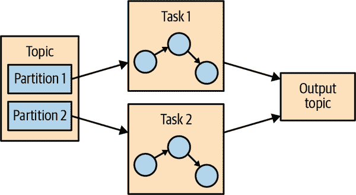

###### 图 14-11：运行相同拓扑的两个任务——一个用于输入主题中的每个分区

应用程序的开发人员可以选择每个应用程序实例将执行的线程数。如果有多个线程可用，每个线程将执行应用程序创建的任务的子集。如果应用程序的多个实例在多台服务器上运行，则每个服务器上的每个线程将执行不同的任务。这是流应用程序扩展的方式：我们将有与我们正在处理的主题中的分区数量相同的任务。如果我们想要更快地处理，就增加更多的线程。如果服务器资源不足，就在另一台服务器上启动应用程序的另一个实例。Kafka 将自动协调工作-它将为每个任务分配其自己的分区子集，并且每个任务将独立地处理来自这些分区的事件，并在拓扑需要时维护其自己的本地状态与相关聚合。参见图 14-12。

有时，处理步骤可能需要来自多个分区的输入，这可能会在任务之间创建依赖关系。例如，如果我们像在“ClickStream Enrichment”中的 ClickStream 示例中那样加入两个流，我们需要在可以发出结果之前从每个流的一个分区中获取数据。Kafka Streams 通过将一个连接所需的所有分区分配给同一个任务来处理这种情况，以便任务可以从所有相关分区中消费并独立执行连接。这就是为什么 Kafka Streams 目前要求参与连接操作的所有主题具有相同数量的分区，并且基于连接键进行分区。

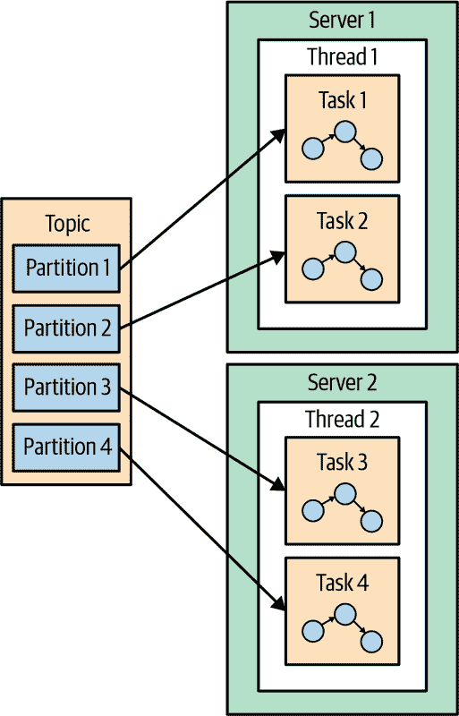

###### 图 14-12：流处理任务可以在多个线程和多个服务器上运行

任务之间的另一个依赖关系的例子是当我们的应用程序需要重新分配时。例如，在 ClickStream 示例中，我们所有的事件都是按用户 ID 进行分组的。但是，如果我们想要按页面或邮政编码生成统计信息怎么办？Kafka Streams 将按邮政编码重新分配数据，并对新分区的数据进行聚合。如果任务 1 处理来自分区 1 的数据并到达一个重新分配数据的处理器（`groupBy`操作），它将需要*洗牌*，或者将事件发送到其他任务。与其他流处理框架不同，Kafka Streams 通过将事件写入具有新键和分区的新主题来重新分配。然后，另一组任务从新主题中读取事件并继续处理。重新分配步骤将我们的拓扑分成两个子拓扑，每个子拓扑都有自己的任务。第二组任务依赖于第一组任务，因为它处理第一个子拓扑的结果。但是，第一组和第二组任务仍然可以独立并行运行，因为第一组任务以自己的速率将数据写入主题，而第二组从主题中消费并独立处理事件。任务之间没有通信，也没有共享资源，它们不需要在相同的线程或服务器上运行。这是 Kafka 做的更有用的事情之一-减少管道不同部分之间的依赖关系。参见图 14-13。

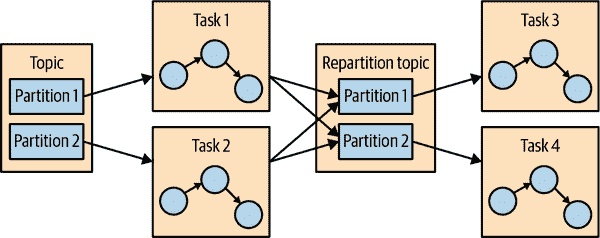

###### 图 14-13：两组任务处理具有用于在它们之间重新分配事件的主题的事件

## 生存故障

允许我们扩展应用程序的相同模型也允许我们优雅地处理故障。首先，Kafka 具有高可用性，因此我们持久化到 Kafka 的数据也具有高可用性。因此，如果应用程序失败并需要重新启动，它可以从 Kafka 中查找其在流中的最后位置，并从失败之前提交的最后偏移量继续处理。请注意，如果本地状态存储丢失（例如，因为我们需要替换存储在其上的服务器），流应用程序始终可以从其在 Kafka 中存储的更改日志中重新创建它。

Kafka Streams 还利用 Kafka 的消费者协调来为任务提供高可用性。如果一个任务失败，但有活动的线程或其他流应用程序的实例，该任务将重新启动在其中一个可用的线程上。这类似于消费者组处理组中一个消费者失败的方式，通过将分区分配给剩余的消费者之一。Kafka Streams 受益于 Kafka 消费者组协调协议的改进，例如静态组成员资格和合作再平衡（在第四章中描述），以及 Kafka 的一次性语义的改进（在第八章中描述）。

虽然这里描述的高可用性方法在理论上运行良好，但现实引入了一些复杂性。一个重要的问题是恢复的速度。当一个线程必须开始处理以前在失败线程上运行的任务时，它首先需要恢复其保存的状态，例如当前的聚合窗口。通常，这是通过重新从 Kafka 中的内部主题读取数据来完成的，以便预热 Kafka Streams 状态存储。在恢复失败任务的状态所需的时间内，流处理作业将无法在其数据子集上取得进展，导致可用性降低和数据过时。

因此，减少恢复时间通常归结为减少恢复状态所需的时间。一个关键技术是确保所有 Kafka Streams 主题都配置为积极的压缩——通过设置较低的`min.compaction.lag.ms`并将段大小配置为 100 MB，而不是默认的 1 GB（请记住，每个分区中的最后一个段，即活动段，不会被压缩）。

为了更快地恢复，我们建议配置`standby replica`——这些任务只是在流处理应用程序中跟踪活动任务，并在不同的服务器上保持当前状态。当故障转移发生时，它们已经具有最新的状态，并几乎没有停机时间就可以继续处理。

有关 Kafka Streams 中可伸缩性和高可用性的更多信息，请参阅[博客文章](https://oreil.ly/mj9Ca)和有关该主题的[Kafka 峰会演讲](https://oreil.ly/cUvKa)。

# 流处理用例

在本章中，我们学习了如何进行流处理——从一般概念和模式到 Kafka Streams 中的具体示例。在这一点上，值得看一下常见的流处理用例。正如本章开头所解释的，流处理或连续处理在我们希望事件被快速处理而不是等待几个小时直到下一批次的情况下是有用的，但也适用于我们不希望在毫秒内收到响应的情况。这一切都是正确的，但也非常抽象。让我们看一些可以通过流处理解决的真实场景：

客户服务

假设我们刚刚在一家大型连锁酒店预订了一个房间，并且我们期待收到一封确认邮件和收据。在预订后的几分钟内，当确认邮件仍未到达时，我们打电话给客服确认我们的预订。假设客服告诉我们：“我在我们的系统中找不到订单，但是从预订系统到酒店和客服台加载数据的批处理作业只运行一天一次，所以请明天再打电话。你应该在 2-3 个工作日内收到邮件。”这听起来不像是很好的服务，但我们曾经与一家大型连锁酒店进行过这样的对话。我们真正想要的是酒店连锁中的每个系统在预订后几秒钟或几分钟内得到更新，包括客服中心、酒店、发送确认邮件的系统、网站等。我们还希望客服中心能够立即查看我们在连锁酒店的任何过去访问的所有细节，并且酒店的接待处知道我们是忠实的客户，这样他们就可以给我们升级。使用流处理应用程序构建所有这些系统可以使它们几乎实时地接收和处理更新，从而提供更好的客户体验。有了这样的系统，客户将在几分钟内收到确认邮件，他们的信用卡将按时收费，收据将被发送，客服台可以立即回答他们有关预订的问题。

物联网

物联网可以意味着很多事情——从家用设备调节温度和订购洗衣液到制药生产的实时质量控制。将流处理应用于传感器和设备时，一个非常常见的用例是尝试预测何时需要进行预防性维护。这类似于应用程序监控，但应用于硬件，并且在许多行业中很常见，包括制造业、电信（识别故障的手机基站）、有线电视（在用户抱怨之前识别故障的机顶盒设备）等。每种情况都有自己的模式，但目标是相似的：处理从设备大规模到达的事件，并识别表明设备需要维护的模式。这些模式可以是交换机的丢包、制造业中需要更多力量来拧紧螺丝、或者有线电视用户更频繁地重新启动机顶盒。

欺诈检测

也被称为*异常检测*，这是一个非常广泛的领域，专注于在系统中捕捉“作弊者”或坏行为者。欺诈检测应用的例子包括检测信用卡欺诈、股票交易欺诈、视频游戏作弊和网络安全风险。在所有这些领域，尽早捕捉欺诈行为都有很大的好处，因此一个能够快速响应事件的准实时系统——也许可以在坏交易得到批准之前停止它——比在事实发生三天后才检测到欺诈的批处理作业要好得多，因为清理工作会更加复杂。这又是一个在大规模事件流中识别模式的问题。

在网络安全中，有一种称为*信标*的方法。当黑客在组织内部植入恶意软件时，它偶尔会到外部接收命令。由于它可能随时发生，频率也不确定，因此很难检测到这种活动。通常，网络对外部攻击有很好的防御，但更容易受到组织内部人员的攻击。通过处理大量的网络连接事件流并识别异常通信模式（例如，检测到该主机通常不访问那些特定的 IP），安全组织可以在更多损害发生之前及早发出警报。

# 如何选择流处理框架

在选择流处理框架时，重要的是考虑你计划编写的应用程序类型。不同类型的应用程序需要不同的流处理解决方案：

摄入

目标是将数据从一个系统传输到另一个系统，并对数据进行一些修改以符合目标系统的要求。

低毫秒级操作

任何需要几乎立即响应的应用程序。一些欺诈检测用例属于这一范畴。

异步微服务

这些微服务代表更大的业务流程执行简单的操作，比如更新商店的库存。这些应用程序可能需要维护本地状态以缓存事件，以提高性能。

近实时数据分析

这些流应用程序执行复杂的聚合和连接，以便对数据进行切片和切块，并生成有趣的、与业务相关的见解。

你将选择的流处理系统将在很大程度上取决于你要解决的问题：

+   如果你正在尝试解决摄入问题，你应该重新考虑是否需要一个流处理系统，或者是一个更简单的以摄入为重点的系统，比如 Kafka Connect。如果你确定需要一个流处理系统，你需要确保它既有良好的连接器选择，又有针对你目标系统的高质量连接器。

+   如果你正在尝试解决需要低毫秒级操作的问题，你也应该重新考虑你选择的流。请求-响应模式通常更适合这个任务。如果你确定需要一个流处理系统，那么你需要选择一个支持事件级低延迟模型的系统，而不是专注于微批处理的系统。

+   如果你正在构建异步微服务，你需要一个与你选择的消息总线（希望是 Kafka）很好集成的流处理系统，具有轻松将上游更改传递给微服务本地状态的变更捕获功能，并具有良好的本地存储支持，可以作为微服务数据的缓存或物化视图。

+   如果你正在构建一个复杂的分析引擎，你还需要一个具有良好本地存储支持的流处理系统——这次不是为了维护本地缓存和物化视图，而是为了支持难以实现的高级聚合、窗口和连接。API 应该包括对自定义聚合、窗口操作和多种连接类型的支持。

除了特定用例的考虑之外，还有一些全局考虑因素需要考虑：

系统的可操作性

是否容易部署到生产环境？是否容易监视和排除故障？是否容易根据需要进行扩展和缩减？是否与现有基础设施很好地集成？如果出现错误，需要重新处理数据怎么办？

API 的可用性和调试的便利性

我发现在不同版本的相同框架中编写高质量应用程序所需的时间有数量级的差异。开发时间和上市时间很重要，所以你需要选择一个能让你高效的系统。

让困难变得容易

几乎每个系统都声称可以进行高级的窗口聚合并维护本地存储，但问题是：它们是否让你轻松做到了？它们是否处理了规模和恢复方面的细节，还是提供了不完善的抽象，让你处理大部分混乱？系统越暴露干净的 API 和抽象，并自行处理繁琐的细节，开发人员就会更加高效。

社区

大多数你考虑的流处理应用都将是开源的，而且没有什么能取代充满活力和活跃的社区。良好的社区意味着你会定期获得新的和令人兴奋的功能，质量相对较好（没有人想要使用糟糕的软件），错误会被迅速修复，用户的问题也会及时得到答复。这也意味着，如果你遇到奇怪的错误并在谷歌上搜索，你会找到相关信息，因为其他人也在使用这个系统并遇到了相同的问题。

# 总结

我们从解释流处理开始了这一章。我们给出了一个正式的定义，并讨论了流处理范式的共同属性。我们还将其与其他编程范式进行了比较。

然后，我们讨论了重要的流处理概念。这些概念是通过使用 Kafka Streams 编写的三个示例应用程序进行演示的。

在介绍了这些示例应用程序的所有细节之后，我们概述了 Kafka Streams 的架构，并解释了它在幕后的工作原理。我们用几个流处理用例的示例和比较不同的流处理框架的建议来结束了这一章，也结束了整本书。
