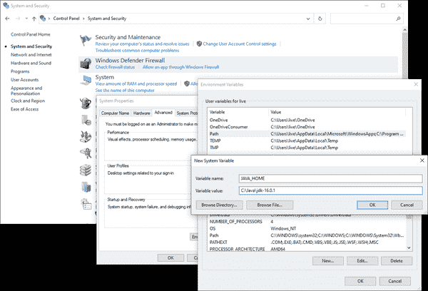

# 附录 A：在其他操作系统上安装 Kafka

Apache Kafka 主要是一个 Java 应用程序，因此应该能够在任何可以安装 JRE 的系统上运行。但是，它已经针对基于 Linux 的操作系统进行了优化，因此在那里运行效果最佳。在其他操作系统上运行可能会导致特定于操作系统的错误。因此，当在常见的桌面操作系统上用于开发或测试 Kafka 时，考虑在与最终生产环境匹配的虚拟机中运行是一个好主意。

# 在 Windows 上安装

截至 Microsoft Windows 10，现在有两种运行 Kafka 的方法。传统的方法是使用本机 Java 安装。Windows 10 用户还可以选择使用 Windows 子系统来运行。后一种方法是非常推荐的，因为它提供了一个更简单的设置，更接近典型的生产环境，所以我们将首先进行审查。

## 使用 Windows 子系统来运行 Linux

如果您正在运行 Windows 10，您可以使用 Windows 子系统来安装本机 Ubuntu 支持。在发布时，微软仍然认为 WSL 是一个实验性功能。尽管它类似于虚拟机，但它不需要完整虚拟机的资源，并且与 Windows OS 集成更加丰富。

要安装 WSL，请按照 Microsoft Developer Network 上的说明进行操作[“什么是 Windows 子系统？”页面](https://oreil.ly/dULqm)。完成后，您需要使用`apt`安装 JDK（假设您已经安装了 WSL 的 Ubuntu 系统包）：

```java
$ sudo apt install openjdk-16-jre-headless
[sudo] password for username:
Reading package lists... Done
Building dependency tree
Reading state information... Done
[...]
done.
$
```

安装完 JDK 后，您可以按照第二章中的说明安装 Apache Kafka。

## 使用本机 Java

对于较旧版本的 Windows，或者如果您不喜欢使用 WSL 环境，您可以在 Windows 上使用本机 Java 环境运行 Kafka。但是请注意，这可能会引入特定于 Windows 环境的错误。这些错误可能不会得到 Apache Kafka 开发社区与 Linux 上类似问题一样的关注。

在安装 ZooKeeper 和 Kafka 之前，您必须设置好 Java 环境。您应该安装最新版本的 Oracle Java 16，可以在[Oracle Java SE 下载页面](https://jdk.java.net)找到。下载一个完整的 JDK 包，以便您拥有所有的 Java 工具，并按照安装说明进行安装。

# 小心路径

在安装 Java 和 Kafka 时，强烈建议您坚持使用不包含空格的安装路径。虽然 Windows 允许路径中包含空格，但是设计为在 Unix 环境中运行的应用程序并不是这样设置的，指定路径将会很困难。在安装 Java 时，请确保根据这一点设置安装路径。例如，如果安装 JDK 16.0.1，一个好的选择是使用路径*C:\Java\jdk-16.0.1*。

安装 Java 后，设置环境变量以便使用。这是在 Windows 的控制面板中完成的，不过确切的位置将取决于您的操作系统版本。在 Windows 10 中，您必须：

1.  选择“系统和安全”

1.  选择系统

1.  选择“高级系统设置”，这将打开系统属性窗口

1.  在高级选项卡上，点击“环境变量”按钮

使用此部分添加一个名为`JAVA_HOME`的新用户变量（图 A-1），并将其设置为安装 Java 的路径。然后编辑名为`Path`的系统变量，并添加一个新条目**`%JAVA_HOME%\bin`**。保存这些设置，并退出控制面板。



###### 图 A-1\. 添加`JAVA_HOME`变量

现在您可以继续安装 Apache Kafka。安装包括 ZooKeeper，因此您不必单独安装它。可以在线下载[Kafka 的当前版本](https://oreil.ly/xpwY1)。在出版时，该版本是 2.8.0，运行在 Scala 版本 2.13.0 下。下载的文件将被 gzip 压缩并打包为`tar`实用程序，因此您需要使用 Windows 应用程序（如 8 Zip）来解压缩它。与在 Linux 上安装类似，您必须选择一个目录来提取 Kafka。在本例中，我们将假设 Kafka 被提取到*C:\kafka_2.13-2.8.0*中。

在 Windows 下运行 ZooKeeper 和 Kafka 有点不同，因为您必须使用专为 Windows 设计的批处理文件，而不是其他平台的 shell 脚本。这些批处理文件也不支持将应用程序放入后台运行，因此您需要为每个应用程序使用单独的 shell。首先启动 ZooKeeper：

```java
PS C:\> cd kafka_2.13-2.8.0
PS C:\kafka_2.13-2.8.0> bin\windows\zookeeper-server-start.bat C:\kafka_2.13-2.8.0\config\zookeeper.properties
[2021-07-18 17:37:12,917] INFO Reading configuration from: C:\kafka_2.13-2.8.0\config\zookeeper.properties (org.apache.zookeeper.server.quorum.QuorumPeerConfig)
[...]
[2021-07-18 17:37:13,135] INFO PrepRequestProcessor (sid:0) started, reconfigEnabled=false (org.apache.zookeeper.server.PrepRequestProcessor)
[2021-07-18 17:37:13,144] INFO Using checkIntervalMs=60000 maxPerMinute=10000 (org.apache.zookeeper.server.ContainerManager)
```

一旦 ZooKeeper 运行，您可以打开另一个窗口启动 Kafka：

```java
PS C:\> cd kafka_2.13-2.8.0
PS C:\kafka_2.13-2.8.0> .\bin\windows\kafka-server-start.bat C:\kafka_2.13-2.8.0\config\server.properties
[2021-07-18 17:39:46,098] INFO Registered kafka:type=kafka.Log4jController MBean (kafka.utils.Log4jControllerRegistration$)
[...]
[2021-07-18 17:39:47,918] INFO [KafkaServer id=0] started (kafka.server.KafkaServer)
[2021-07-18 17:39:48,009] INFO [broker-0-to-controller-send-thread]: Recorded new controller, from now on will use broker 192.168.0.2:9092 (id: 0 rack: null) (kafka.server.BrokerToControllerRequestThread)
```

# 在 macOS 上安装

macOS 运行在 Darwin 上，这是一个 Unix 操作系统，部分源自 FreeBSD。这意味着许多在 Unix 操作系统上运行的期望仍然成立，并且安装为 Unix 设计的应用程序（如 Apache Kafka）并不太困难。您可以通过使用软件包管理器（如 Homebrew）来保持安装简单，也可以手动安装 Java 和 Kafka 以更好地控制版本。

## 使用 Homebrew

如果您已经为 macOS 安装了[Homebrew](https://brew.sh)，您可以使用它一步安装 Kafka。这将确保您首先安装了 Java，然后安装 Apache Kafka 2.8.0（截至撰写时）。

如果您尚未安装 Homebrew，请首先按照[安装页面](https://oreil.ly/ZVEvc)上的说明进行安装。然后您可以安装 Kafka 本身。Homebrew 软件包管理器将确保您首先安装所有依赖项，包括 Java：

```java
$ brew install kafka
==> Installing dependencies for kafka: openjdk, openssl@1.1 and zookeeper
==> Installing kafka dependency: openjdk
==> Pouring openjdk--16.0.1.big_sur.bottle.tar.gz
[...]
==> Summary
/usr/local/Cellar/kafka/2.8.0: 200 files, 68.2MB
$
```

Homebrew 将在*/usr/local/Cellar*下安装 Kafka，但文件将链接到其他目录中：

+   二进制文件和脚本将位于*/usr/local/bin*中。

+   Kafka 配置将位于*/usr/local/etc/kafka*中。

+   ZooKeeper 配置将位于*/usr/local/etc/zookeeper*中。

+   `log.dirs`配置（Kafka 数据的位置）将设置为*/usr/local/var/lib/kafka-logs*。

安装完成后，您可以启动 ZooKeeper 和 Kafka（此示例在前台启动 Kafka）：

```java
$ /usr/local/bin/zkServer start
ZooKeeper JMX enabled by default
Using config: /usr/local/etc/zookeeper/zoo.cfg
Starting zookeeper ... STARTED
$ /usr/local/bin/kafka-server-start /usr/local/etc/kafka/server.properties
[2021-07-18 17:52:15,688] INFO Registered kafka:type=kafka.Log4jController MBean (kafka.utils.Log4jControllerRegistration$)
[...]
[2021-07-18 17:52:18,187] INFO [KafkaServer id=0] started (kafka.server.KafkaServer)
[2021-07-18 17:52:18,232] INFO [broker-0-to-controller-send-thread]: Recorded new controller, from now on will use broker 192.168.0.2:9092 (id: 0 rack: null) (kafka.server.BrokerToControllerRequestThread)
```

## 手动安装

与在 Windows OS 上手动安装类似，当在 macOS 上安装 Kafka 时，您必须首先安装 JDK。使用相同的[Oracle Java SE 下载页面](https://jdk.java.net)来获取 macOS 的适当版本。然后您可以再次类似于 Windows 下载 Apache Kafka。在本例中，我们将假设 Kafka 下载扩展到*/usr/local/kafka_2.13-2.8.0*目录中。

启动 ZooKeeper 和 Kafka 看起来就像在 Linux 上启动它们一样，尽管您需要确保首先设置`JAVA_HOME`目录：

```java
$ export JAVA_HOME=`/usr/libexec/java_home -v 16.0.1`
$ echo $JAVA_HOME
/Library/Java/JavaVirtualMachines/jdk-16.0.1.jdk/Contents/Home

$ /usr/local/kafka_2.13-2.8.0/bin/zookeeper-server-start.sh -daemon /usr/local/kafka_2.13-2.8.0/config/zookeeper.properties
$ /usr/local/kafka_2.13-2.8.0/bin/kafka-server-start.sh /usr/local/kafka_2.13-2.8.0/config/server.properties
[2021-07-18 18:02:34,724] INFO Registered kafka:type=kafka.Log4jController MBean (kafka.utils.Log4jControllerRegistration$)
[...]
[2021-07-18 18:02:36,873] INFO [KafkaServer id=0] started (kafka.server.KafkaServer)
[2021-07-18 18:02:36,915] INFO [broker-0-to-controller-send-thread]: Recorded new controller, from now on will use broker 192.168.0.2:9092 (id: 0 rack: null) (kafka.server.BrokerToControllerRequestThread)((("macOS, installing Kafka on", startref="ix_macOS")))((("operating systems", "other than Linux, installing Kafka on", startref="ix_OSinstall")))
```
