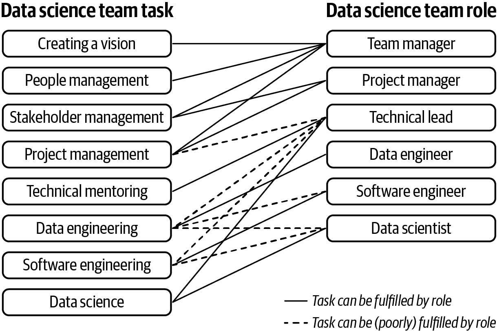

# 第一章：选择您的数据科学团队

数据科学团队可以做的事情种类繁多，这既因为“数据科学”这个术语非常广泛，也因为不同的公司有非常不同的需求。数据科学可以意味着一个公司只有一个分析师为高管制作数据仪表板，也可以意味着一个团队为生产就绪的机器学习 API 创建。一个公司可能需要帮助使用数据来定义业务策略，为客户提供定制体验，预测投资，或者完全不同的其他事情！由于数据科学团队可能做的工作类型如此之多，因此有许多不同的方式来组建团队，以满足业务需求。本章介绍了如何思考您应该为团队招聘谁。

每个数据科学团队自然会有数据科学家，但除了数据科学家本身之外，团队还可以包括许多潜在的支持角色。在团队中增加更多职位可以使您拥有更广泛的能力范围，但也需要管理更多类型的工作。考虑到数据科学团队需要有效地工作，需要考虑以下所有事项：

制定一个愿景

设计一个策略，通过与利益相关者沟通他们的需求并评估团队的能力，确定数据科学家将要处理的工作。

项目管理

跟踪正在进行的工作并在时间线问题出现时进行沟通。

利益相关者管理

与利益相关者合作，帮助他们理解数据科学的能力，并找出数据科学的机会。

人员管理

通过绩效评估、反馈、支持和其他管理任务来帮助团队。

技术指导

帮助更年轻的数据科学家解决问题并解决技术障碍。

数据工程（可选）

将数据存放在数据科学家可以清理和使用的位置，并为模型和分析的输出存储位置。

软件工程（可选）

如有必要，编写调用数据科学家构建的模型的代码，例如显示模型结果给客户的用户界面和后端。

数据科学工作本身

这也确实很重要。

除了实际数据科学工作之外，还有很多任务——几乎没有工作是可选的！不仅如此，还有很多这些任务可以由不同角色的人完成。这为如何设计团队带来了数学匹配问题，如图 1-1 所示。

从图 1-1 我们可以看到如何满足数据科学团队的需求有许多可能性。例如，您可以选择雇用一位数据工程师来进行任何数据工程，或者让一位软件工程师既做软件工程，又做数据工程（后者可能会有些困难）。问题的复杂性增加了，因为不需要覆盖所有这些任务，您可以忽略一些任务，并希望您的团队能正常运行。总之，有许多可行的解决方案。因此，除了您的数据科学团队将拥有数据科学家之外，根据一些关键决策，如谁将领导团队，谁将管理项目，团队将有什么样的技术角色，以及您将有多少专业化，您可以选择多种不同的结构。

###### 图 1-1\. 设计数据科学团队的数学匹配问题示例。这是一个二部图，但组合数量留给读者作为练习。

# 您将如何分配领导风格的任务？

一个数据科学团队确实需要两种不同类型的领导——管理和技术。管理任务包括您通常与经理相关的任务。例如为团队创建战略，与利益相关者讨论需求，决定谁来雇用和晋升等等。技术领导则做出重大的技术决策，并帮助初级数据科学家。这些任务包括决定在重大项目中使用何种模型架构或指导初级数据科学家完成他们的第一个分析。

一个管理团队的选择是尝试让单个人承担这两种类型的领导工作。然而，通常很少有人具备同时胜任管理领导任务和技术领导任务的资质。即使数据科学团队确实有一个具备这两种技能的人，他们可能也会因为忙碌而无法完美地完成这两项任务。因此，让一个人承担所有任务是有风险的。

因此，一个团队的另一种选择是分为两个不同的角色，一个是*经理*，另一个是*技术领导*。经理负责所有管理任务，包括与利益相关者保持联系。技术领导提出最佳的技术解决方案供团队实施，并帮助指导团队。有两个高级人员是昂贵的，如果他们之间合作不好，可能会带来一系列问题，但如果能够协调一致，这是一个让两位领导者各展所长的好选择。

最后，数据科学团队可以选择只有一种类型的领导，并接受在管理方面会有所不足。一个有经理但没有技术领导的数据科学团队需要团队中的数据科学家能够在没有太多指导的情况下工作，这通常意味着需要雇佣更资深的数据科学家。一个有技术领导但没有经理的数据科学团队则需要相信公司其他领导仍在战略上有效地定位他们的团队。这两种选择都是可能的，但并非理想。如果数据科学团队规模较小，你可能需要选择这种选项，然后希望团队的其他成员填补空白。

如果你是一位领导正在阅读本报告，了解你的优势和劣势以及支持团队的最佳方式非常重要。如果你来自技术背景，并且真希望你的领导工作的一部分让你保持编码能力，那么请确保在管理组件上有强有力的支持。如果你在数据科学领域没有技术背景，请确保在雇佣数据科学家时，你的团队里有资深的人并且倾听他们的意见。在本报告的几乎任何其他部分中，问题“你将如何进行领导风格的任务？”都需要深入反省和愿意分享权力并进行协作。

# 你如何进行项目管理？

项目管理（组织团队需要完成的任务并确保按时完成）对于确保团队实际完成任务至关重要。除了保持工作本身的组织外，所有相关方必须随时了解和更新变更情况。无论是否有专人被明确指派为项目管理人员，总会有人在某种方式上做这件事。也许你有一个专门负责项目管理的人，或者一个数据科学家会创建一个任务的 Excel 表格，但团队中总会有人在做项目管理。

通常情况下，项目管理由同一人负责人员管理的人来完成。这是有道理的：负责团队管理和与利益相关者会面的人很适合同时跟踪任务完成情况并与他人沟通。不幸的是，经理通常会因为会议和自己的工作而非常忙碌，因此项目管理可能会因为忙碌而搁置，对整个团队都是不利的。让团队经理负责项目管理需要经理有很强的自律性，并且在团队规模较小时效果最好。

或者，您可以雇用一个人来负责项目管理（一个恰如其名的*项目经理*）。这样可以让经理专注于其他任务。项目经理可能有也可能没有技术背景。有技术背景使他们更容易理解数据科学任务和障碍，但非技术人员仍应能够与数据科学家进行足够的沟通，理解情况并提供帮助。

如果项目经理在团队中是一个完全独立的角色，那么项目经理具有组织影响力至关重要。项目经理将经常需要帮助数据科学家，例如前往组织的其他部门解决数据访问不足等障碍。项目经理还可能需要对数据科学家采取坚定的态度——比如告诉他们停止进行有趣但非关键的任务，而是完成当天需要的工作。如果项目经理在组织中具有影响力，这类情况将能够得到处理（虽然仍然很困难）。如果项目经理没有影响力，这是不可能的。一个有专门项目经理的团队可以做的最好的事情是支持项目经理，并尽可能听取他们的意见。

作为一个大团队的领导者，大约八人或更多，您几乎肯定需要雇佣一个单独的项目经理。作为一个小团队的领导者，少于五人，您可能没有预算，需要自己动手。如果您有一个项目经理，对团队来说最好的事情就是雇用合适的人，并赋予他们做好工作的能力。如果您自己负责，对团队来说最好的事情就是确保您始终保持与项目管理的步调。

第二章专注于团队数据科学工作的管理方法，这是做项目管理的人的主要关注点。该章节将更详细地讨论与利益相关者合作以及如何推动工作的进行。第三章讲述如何帮助数据科学家发挥最佳表现，包括帮助他们承担自己的项目管理工作。强大的项目管理对于成功运行团队非常重要。

# 您的数据科学团队是否有非数据科学技术角色？

在一些组织中，在数据科学团队中拥有非数据科学角色（如软件工程师或数据工程师）是有道理的。他们可以帮助为数据科学家组织数据，编写作为模型周围包装的代码等。通过在实际数据科学团队中拥有这些类型的人员，数据科学家将得到良好支持。在团队中拥有其他工程角色的缺点是可能需要做不一致的工作量。例如，有些周可能不需要任何数据工程工作，这些周内不清楚数据工程师应该做什么。还可能存在组织上的冗余。例如，如果数据科学团队有数据工程师，而数据工程团队有数据科学家，那么谁来做什么？

这种决定在很大程度上超出了数据科学团队本身的范围。如果您在一个以项目为中心的组织中，您的团队很可能会拥有多个角色。这些组织往往充满了许多不同专业的团队，他们紧密合作进行项目。如果您在一个以角色为中心的组织中，一个纯粹的数据科学团队更合理。以角色为基础的组织倾向于拥有像工程部门、数据科学部门等类型工作者的部门。

数据工程对于在团队中有非数据科学技术人员的情况尤为常见。在一些组织中，有专门负责存储数据并使其对其他团队可访问的整个数据工程团队，这种情况下，您的数据科学团队就不需要数据工程师了。在其他组织中，通常是规模较小的组织，没有专门的团队负责此事，因此维护数据库并保持其最新的责任可能会落在其他地方，比如可能是您的数据科学团队。但特别值得思考的是数据工程，因为如果没有某种数据后端，您的数据科学家将无法工作。有很多关于在公司雇用数据科学家后才意识到公司没有任何数据可供他们使用的故事。如果您选择在团队中没有数据工程师，请确保有一个基础设施供您的数据科学家获取所需的数据。

# 团队中的数据科学家是否应该专业化？

如果您的数据科学家们专注于特定领域，例如预测、实验和优化，理论上您应该能够作为一个团队实现更多，因为您将涵盖更多的知识领域。另一方面，如果您团队中的每个人都是数据科学通才，那么分配给数据科学团队的任何工作都可以由团队的任何成员完成，您将拥有一个更强大的团队。通才团队将能够更好地审查彼此的工作，处理队友休假或离职，并在项目需要额外帮助时提供支持。这样一来，就在专业化团队能够完成更多任务与通才团队运行更加顺畅之间形成了一种博弈关系。

还有不同类型的专业化：

+   如预测、实验和优化等技术主题

+   如欺诈、营销和物流等领域

+   公司的特定部分，例如特定数据集

根据组织的情况，某些类型的专业化可能几乎没有风险。对于营销公司来说，拥有专家级别的数据科学家可能没问题。但是，在业务内的特定技术主题或数据集上进行专业化可能会导致更多情况下数据科学家没有足够的工作可做。

作为一种实践，其他条件相同的情况下，泛化可能更好。在日常运作中，您的数据科学团队成功与否取决于其运行的顺畅程度，而不是团队了解多少不常见的技术（详见第四章对此的更深入讨论）。此外，您的数据科学家们会自然而然地专注于自己的领域。数据科学家们喜欢学习新事物，因此，如果项目需要数据科学家们不熟悉的概念和方法，他们会去学习。您不需要整个团队都围绕只有某些人知道如何做某些事情来进行组织。

话虽如此，有些情况需要如此精细的技巧，您将希望专家来完成。一个典型的例子是优化和强化学习，这通常不包括在标准数据科学课程中，并且需要一段时间学习。随着数据科学团队规模的扩大，您会发现越来越多的情况下，您会感到有义务组织团队，以使一些人在他们的专业领域担任角色。但尽可能地避免这种情况，并且如果您雇佣了某个领域的专家，请不要只雇佣一个。一个单一的专家没有人可以讨论他们的想法，更糟的是，没有人可以检查他们所做的是否符合他们所说的。

如你所见，有无数种方法可以组织数据科学团队。并没有一种通用正确的方式；这在很大程度上取决于公司环境的具体情况。有些情况可能需要一个大型的专家团队为整个公司服务，而其他情况则要求数据科学家分散在各处。数据科学团队可能很大，拥有许多角色，如经理、项目经理和数据工程师，或者可能很小，只有几名数据科学家和一个技术领导者。一个优秀的数据科学领导者的角色是理解组织的背景，并为团队在其中做出最佳决策。

有了一个设计良好的数据科学团队，数据科学家们应该准备好处理来自利益相关者的工作。不幸的是，对于大多数数据科学团队来说，他们要完成的可交付工作的需求量远远超出了团队的能力。在下一章中，我们将讨论数据科学团队如何管理他们的工作流程，并战略性地考虑要做的工作类型。
