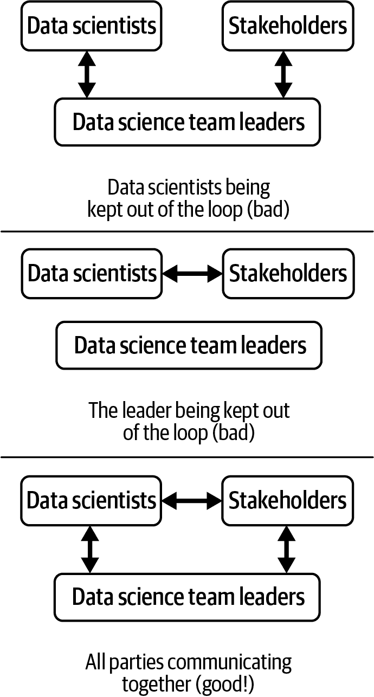

# 第二章：管理工作。

数据科学团队非常忙碌。不断有新报告、新模型和以新数据重做的过去分析的请求。对于大多数数据科学领导者来说，这意味着必须要做出周到的决策，决定实际工作和次要工作或完全不做的事情。这也使得管理任务完成所需时间非常重要，因为如果某个任务花费的时间超出预期，其他事情就不得不推迟。

要成功管理您团队的工作量，首先需要非常清晰地了解您团队的目标是什么。您是通过机器学习帮助改进产品，还是向特定部门提供数据策略建议，亦或是其他？然后，您需要一个清晰的项目管理流程来跟踪工作进展，虽然数据科学与软件工程相似，但是某些软件工程原则，比如敏捷开发，并不总是直接适用于数据科学。您还需要与利益相关者进行清晰的沟通，这样当新的进展出现时，每个人都有所需的信息。

管理数据科学团队工作的任务必须成为各种规模团队中数据科学领导者关注的问题。在较小的团队中，领导者可能直接负责项目管理任务。在较大的团队中，会有一个项目经理负责管理任务。但作为数据科学领导者，您仍然负责确保工作得以完成，一旦出现问题，解决责任也将落在您身上。因此，本章阐述了如何考虑管理数据科学团队任务以及保持团队顺利运行的最佳实践。

# 您团队的目标是什么？

在您能有效地优先处理要做的工作之前，您需要充分理解您团队的目标。由于您将会收到来自多个方向的许多请求，因此您需要专注于与您的目标一致的内容，并且放弃其他请求。数据科学团队的目标通常可以分为三类：

帮助组织利用数据做出决策。

当团队的目标是这个时，将会对数据进行大量分析，并将其呈现给利益相关者。

将数据作为产品的一部分来改进它。

这些数据科学团队帮助训练机器学习模型并投入生产。

保持组织内部数据流动。

为了达到这个目标，数据科学团队帮助将数据从数据库移动到报告、仪表板和其他业务可以使用的地方。

每一个这些目标都需要非常不同类型的工作：决策科学、机器学习和数据工程，分别来解决。数据科学团队的最佳情况是他们专注于这些目标中的一个，并在组织的一个特定部分（如营销）提供帮助。实际上，您会发现您的团队经常被吸引去完成多个目标，无论是来自外部利益相关者的未满足需求，还是出于您希望团队在新的领域带来数据的愿望。但是除非您的数据科学团队非常庞大，拥有许多数据科学家和经理，否则您可能无法做到这一点。

作为领导者，您的责任是使团队专注于一个非常具体的目标，并避免分散注意力。通过有效地说不，您可以避免让数据科学家因无法有效完成各种不同类型的工作而不知所措。

## 优先考虑数据科学工作

作为数据科学负责人，很难平衡要处理的工作，不仅因为不是所有的工作都与您的目标一致，而且因为每个任务的努力程度、范围和有助益的利益相关者可能都非常不同。在优先考虑每项任务时，一个有用的框架是考虑这三个问题：

这项工作的结果可能会对业务产生多大影响？

某些任务可能会极大地改变业务，比如将机器学习应用于产品，以便客户可以以新方式与产品交互。某些任务可能不会对业务产生太大影响。即使您能够完美地预测市场渠道的收入，这种预测也不太可能显著改变您的业务。有趣的是，关于工作的价值将带来多少这个问题并不是一个数据科学问题——它与您如何从产品角度思考任务无关。相反，思考价值将需要您作为数据科学负责人可能要走出舒适区并从产品的角度进行思考。

数据科学团队能够完成这项工作的可能性有多大？

本报告中反复提到的一个主题是，数据科学项目存在很大风险，并且在很多方面都会失败。在启动项目之前，作为数据科学负责人，您认为项目成功的可能性有多大非常重要。最好是与首席数据科学家共同合作进行这样的猜测。对项目可能运行得如何有一个相对合理的想法将有助于您决定是否值得进行。不同的数据科学项目面临的风险范围可能非常广泛：更新现有报告可能成功的机会很高，而在新数据上构建全新的机器学习模型以用于新产品则可能成功的机会较小。

这将给您的数据科学家带来多少快乐？

作为数据科学领导者，您是为了长远游戏，有些任务对数据科学家来说比其他任务更有趣（一般来说，使用全新方法构建新模型比第一百次重新训练同一模型更有趣）。在理想情况下，您团队正在处理的任务与数据科学家特别被聘用来做的工作类型及其特别的兴趣相匹配。并非所有工作都会成为数据科学家的梦想，但如果没有一项工作能够满足他们，那么您就可能面临人员流失的风险。

参见表 2-1，了解不同项目可能得分的一些示例。有趣的是，这三个问题通常高度相关（或者反相关）。在某些情况下，某件事对业务的影响可能与其实现的可能性呈现反向相关。例如，许多利益相关者向数据科学团队提出了一些不切实际的项目（比如使用机器学习预测顾客走进店铺前会点什么口味的冰淇淋！），这些项目可能具有潜在价值，但很可能无法实现。那些很可能会成功的任务可能并不具备价值。这通常是因为大多数可以轻松完成并具有巨大影响的任务已经被尝试过了！

表 2-1\. 数据科学项目示例及其优先考虑因素

| 项目 | 对业务的影响 | 实现的可能性 | 数据科学团队的喜悦 |
| --- | --- | --- | --- |
| 构建一个新的复杂异常检测模型，以发现顾客行为中任何微小的趋势 | 高：可以降低客户支持成本 | 低：具有微小信号的异常检测模型通常太嘈杂而无法正常工作 | 高：构建复杂模型既有趣又具有挑战性 |
| 自动化业务使用的手动报告到仪表板 | 低：由于报告已存在，主要价值在于节省员工时间 | 高：由于报告中已有数据，仪表板不工作的风险较低 | 低：需要重新做现有工作，且长期维护成本高 |
| 将自然语言处理添加到产品的现有部分，以便分类客户输入 | 中等：分类输入可能有所帮助，但不会立即改变整个产品 | 中等：如果您能成功设计一个相关的分类集，NLP 分类模型通常效果很好 | 中等：需要开发新模型，尽管是相当直接的模型 |

同样，对于数据科学家来说，通常全新的项目最有趣，但成功的机会最小。全新的项目如果足够有趣，甚至可以后续做一个会议发言！然而，仅仅尝试“月球登陆”项目可能并不适合商业发展。

因此，当任务进来时，请尽可能选择那些符合这些条件的任务，并避免过长时间没有能推动业务前进、成功机会较高并使员工满意的任务。

## 管理工作队列

任务进来时，您需要深思熟虑地跟踪工作队列及当前处理的事务。如果幸运的话，您的团队可能会有一个专人负责管理这个队列——即来自第一章的项目经理。否则，这可能会成为您作为团队领导的职责。

您的组织很可能已经选择了诸如 Jira、ClickUp 或 Trello 等项目管理工具。这些工具能跟踪当前正在进行的工作、即将进行的工作以及任务完成情况。如果您的组织尚未选择预设工具，您应该迅速选择一款，并让整个团队习惯于审查和更新任务板。虽然项目经理（或您）可能负责维护，但整个团队仍需要编辑每个任务的状态，以便在处理任务时进行更新。数据科学团队常常会遇到个别数据科学家分心，未能认真更新项目管理工具中的信息的问题。然而，您可以建立重视工具使用的文化。每次开始、完成或遇到障碍时，都应更新工具。如果能在任务开始、结束等讨论中保留所有信息，效果会更好。

您的数据科学家也会收到您可能不知道的任务，例如利益相关者直接提出的最后一分钟的新分析请求。他们还可能收到修复先前交付工作中问题的任务，例如在生产模型中发现的错误。如果您已经建立了与项目管理工具保持组织有序的文化，那么该工具将成为记录正在进行的工作（以及为何其他任务未被处理）的工具。这对于利益相关者询问为何任务未完成以及为您的数据科学家提供工作凭据将是有价值的。

## 与利益相关者沟通

管理来自利益相关者的工作的一部分是管理与他们自身的关系。数据科学团队通常与公司许多其他部门有联系：负责实施数据科学模型的工程师、利用数据运行广告系列的营销人员、为团队设置数据库的数据管理员等。负责数据科学团队的人必须确保这些人对团队的表现感到满意（或多或少）。

当你负责一个数据科学团队时，利益相关者会带着各种请求、信息和需求来找你。重要的不仅仅是有效地优先考虑这些请求，正如前面讨论的那样，还要确保数据科学团队的成员获得适当的信息。在一个成功的数据科学团队中，利益相关者会感到与数据科学家直接联系，并且在有问题时感到可以直接找你，就像数据科学家在与利益相关者有问题时找你一样。

如果利益相关者和数据科学家之间没有健康的沟通，可能会出现几种情况。首先，利益相关者可能决定不再与团队中的数据科学家交流，而直接与你作为领导者交流。作为领导者，这可能会让你感觉很好 —— 经常听取利益相关者的意见，了解他们的需求。但这会导致你成为信息的瓶颈，因为只有你掌握了整个团队所需的信息。

举个例子，一个利益相关者需要一个机器学习模型来预测哪些客户可能会取消订阅服务。这个利益相关者可能对模型有非常精确的要求 —— 它需要有多准确、需要处理哪些类型的客户等等。这些要求需要转化为数据科学的概念；比如，“必须始终给客户正确的答案”转化为特定的准确度指标。如果利益相关者只是告诉你这些，那么你作为领导者将很难向团队解释这个想法，并回答团队可能有的具体问题。在这种情况下，你成了信息的瓶颈，或者用一个类比来说，你成了电话游戏中的一个连接，而你的团队是最后一个人。

这会导致数据科学团队出现沟通问题的另一种情况。如果数据科学家或利益相关者觉得你是一个瓶颈，他们可能会绕过你，不告知你。在前面的例子中，如果利益相关者和数据科学家意识到直接交流更为方便，他们可能会开始这样做，你可能会发现决策被做出而不知情。虽然赋予数据科学家权力通常是好事，但作为领导者，你对整个团队如何运作有最佳的视角，你需要了解正在发生的事情。这两种情况都在图 2-1 中显示。

###### 图 2-1\. 与利益相关者的沟通可能出现的几种情况示例。

当你与利益相关者合作并满足他们的需求时，请确保在你自己、你的团队和利益相关者之间保持良好的沟通。当你注意到有人缺少他们应该拥有的信息（而你可能拥有），请努力加强与特定利益相关者以及与他们合作的团队成员的关系。

在你制定管理团队工作负载的方法时，你需要确保你的数据科学家们能够产生价值并成功完成你分配的任务。本报告的下一章将详细介绍如何与你需要完成的工作对齐你的数据科学家，并领导他们执行工作的最佳实践。
