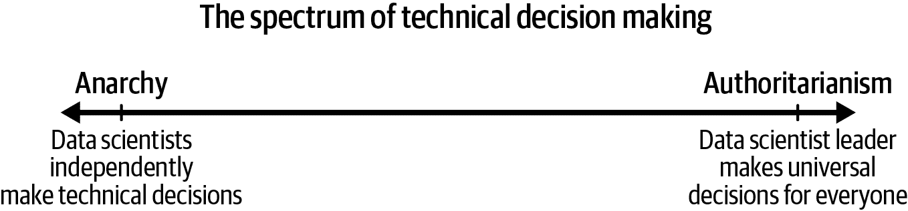

# 第四章：选择技术基础设施

因此，您的团队在组织中位置良好，并且有合适的人员。您正在努力创建提供价值的强大文化，并且有管理任务的方法。但是，这些任务要求您的数据科学家进行技术工作，这意味着他们需要相应的工具。这些工具包括如何选择编程语言（R、Python 或其他语言）；选择存储信息的数据库类型；模型是否应由工程团队部署为 API 或由数据科学团队作为批处理脚本运行；等等。数据科学领导者必须在选择团队应使用的技术和决定何时在它们之间切换方面发挥重要作用。

# 如何在技术基础设施上做出决策

关于团队技术基础设施做出决策的实际过程和实际决策同样重要。数据科学团队的领导者可以直接做出这些决策，或者可能是团队中的某个人，如技术负责人或主要数据科学家最终决定。在任何这些决策中，都存在决策方式的各种选择（见图 4-1）。在谱系的一端是专制主义，即团队内所有决策完全由负责人做出。在另一端是无政府主义，即团队中的任何人可以做出他们个人认为最好的决策的想法。

###### 图 4-1\. 每个数据科学团队所处的决策谱系。

数据科学家通常喜欢做决策，因为他们会选择他们个人最喜欢的东西。在无政府状态的环境中，数据科学家将精确选择他们喜欢的工具，因此您可能会最终拥有一个由五个人组成的数据科学团队和一个使用六种编程语言编写的代码库（其中两种语言已经不再使用）。每个数据科学家都会对他们的工具集感到满意，但数据科学家们无法共同工作。如果一个代码库在 AWS EC2 实例上使用 Python，而另一个在 Windows 笔记本电脑上使用 MATLAB，那么当数据科学家切换项目或离开团队时，您将陷入困境。但只要每个数据科学家只在自己的项目上工作，他们就会足够满意。

另一方面，在专制环境中所有决策都由领导层做出。编程语言、平台、架构以及其他技术决策都由领导层统一团队内的情况。例如，每个人使用 R，致力于非常具体格式的 GitHub 存储库，以相同的风格编写他们的代码，并以相同方式执行项目。在这些情况下，数据科学团队变动很少。每个人都可以在其他人的项目上工作，并且由于一切都是一致的，维护的基础设施更少。

问题在于，无论领导选择了什么团队范围的工具，总会有一些情况它们效果不佳。有时候在 R 中很难做到的事情，在 Python 中很容易，或者在虚拟机上进行数据科学时很困难，但在使用 Docker 时很简单。在这些情况下，如果不允许你的数据科学家使用合适的工具来处理问题，他们可能会在手头的任务上花费更多的时间和精力。更糟糕的是，他们会很快失去斗志，可能会离开团队。详见 表 4-1 中关于技术决策的一些示例。

表 4-1\. 技术决策示例情景

| 情景 | 风格 |
| --- | --- |
| 数据科学家被提供笔记本电脑，可以使用他们想要的任何工具集和编程语言，只要他们完成了分配的工作。 | 极端无政府主义 |
| 数据科学家可以在他们的笔记本电脑上使用他们想要的编程语言和库，但鼓励他们尽可能使用与现有云平台对齐的工具。 | 倾向于无政府主义 |
| 数据科学家需要使用云基础设施、Python 和一组特定的机器学习库。其他工具可以使用，但需要首先得到技术领导的批准。 | 倾向于专制主义 |
| 数据科学家必须仅使用技术领导、经理和 DevOps 批准的确切工具集。 | 极端专制主义 |

因此，无政府主义和专制主义的两个极端都不是数据科学团队应该处于的良好位置。健康的状态应该在中间某处，在这里，数据科学领导与数据科学家合作，确保在工作中使用合适的工具，同时尽量减少使用不同工具和不兼容系统的数量。最佳位置确切地在哪里取决于特定的组织及其目标。它也很大程度上取决于特定的行业。例如，做许多一次性项目的咨询公司应该有较少的严格结构，而像金融这样受到严格监管的行业则应该有更多的防护措施。

作为数据科学领导者，你很容易看到这种情况的各个方面并指出你希望达到的位置。作为领导者，你可以更轻松地通过更多的权威来管理团队，因此你可能希望团队轻微地威权化。但值得反思的是，要考虑团队中具体数据科学家的优势和劣势，并尽可能给予他们足够的自主权。

# 数据科学团队基础设施的组成部分

数据科学团队需要大量不同的基础设施系统，其中一些是专门为他们建造或购买的，比如数据库解决方案，另一些则是团队自行决定的，比如使用特定编程语言和一组库建立 Git 仓库。本节涵盖了几个重要的基础设施领域需要考虑的内容。

## 数据存储

大多数数据科学团队不需要担心从哪里存储原始数据，因为他们可以从组织的其他部门获取。其他部门创建包含营销信息、销售和收入数据以及产品直接数据的数据，并且工程师将其存储在数据库中供数据科学家使用。数据科学团队可能能够影响一些数据存储的决策，比如要求包含某些列，但很少负责实际的存储工作。

然而，数据科学团队确实需要存储中间或输出数据——已经清理或从模型输出且由数据科学团队自己拥有的数据。中间数据的一个例子是在字符串列格式化后生成的大型数据表，或者要添加到模型中的新特征。输出数据的一个例子是数据集中每个客户的模型预测。这些类型的数据集往往没有固定的模式，并且可能非常庞大。大多数情况下，数据科学团队并没有数据服务器的所有权，因此他们可能无法自己获取存储位置，需要其他团队的帮助。

在理想情况下，数据科学团队的中间和输出数据应该与输入数据存储在相近的位置。如果所有数据存储在单一位置，那么很容易将其联合起来进行进一步分析并跟踪变更。但实际操作中，有时这是不可能的；例如，如果输入数据是需要存储在数据科学家无法写入的安全服务器上的生产数据。在这些情况下，你需要设置一个不同的位置来存储数据，并创建管理这些数据的流程。

作为中间和输出数据的创建者，您将负责跟踪它。这就是数据治理实践的重要性所在。您需要制定一种结构来决定存储哪些数据以及如何一致地存储它们。您需要以一种方式做到这一点，以便将来人们能够理解所做的工作。一个完整的数据工程团队可能会为他们的数据建立数据仓库或数据集市，但由于这不是您的主要关注点，您可能不需要走得那么远。

作为团队领导，您需要深思熟虑如何最好地存储这些数据以及如何随着时间跟踪它。如果您没有仔细考虑，那么数据可能会分散在许多位置，例如多个数据库服务器、共享网络驱动器和文件存储系统，并且您将无法跟踪它。更糟糕的是，随着时间的推移，其他系统将开始依赖这些数据——例如，使用模型的客户预测来调整电子邮件活动的过程——如果数据没有被正确存储，那么在使用它时可能会产生技术债务。

## 运行分析和训练模型的工作空间

数据科学家的日常工作主要包括清洗数据、进行分析、训练模型等各种工作，这些都发生在同一个地方。这些数据科学工作场所的形式各异，取决于数据科学团队的设置：

每个数据科学家都在公司拥有的笔记本电脑上工作

对于许多公司来说，数据科学家在公司拥有的笔记本电脑上进行日常工作，使用他们选择的集成开发环境，如 RStudio 或 JupyterLab。数据科学家会将数据下载到这台机器上，进行工作，然后将结果上传到共享位置。使用笔记本电脑的好处在于它们几乎不需要协作设置——每个数据科学家可以独立安装他们想要的任何东西，并使用。但也存在标准化的问题：任何人都可以做任何他们想做的事情，因此对于一个数据科学家可以运行的代码，可能在另一个队友的笔记本电脑上无法运行。由于每台机器的设置都不同，通常团队中的高级员工必须在初级员工因其不寻常的设置而导致问题时提供帮助。数据科学家在硬件方面也受到机器规格的限制，因此如果特定的分析需要不同的东西，那么这种分析就无法完成。此外，笔记本电脑被物理盗窃的安全风险也存在。

数据科学家在云中的虚拟机上工作

一些数据科学团队通过将笔记本电脑替换为像 AWS EC2 实例或 Google Cloud Platform VMs 这样的虚拟机来改进第一种情况。这使得数据科学家可以根据不同的硬件需求更改实例大小，并消除了笔记本电脑被盗的可能性。不足之处在于机器的标准化仍可能完全缺失，所以就像笔记本电脑一样，在一个虚拟机上有效的东西可能在另一个上无法运行。此外，虚拟机开放在网络外也存在安全风险：因为每个数据科学家都设置他们的机器，有相当大的机会有人设置错误。

共享云工作平台

最近，数据科学团队开始采用专为数据科学家量身定制的云平台。这些平台，如 AWS SageMaker、Saturn Cloud 和 DataBricks，旨在提供一个数据科学家可以完成所有工作的地方。通过使用标准平台，数据科学代码更容易在不同团队成员之间传递，减少了设置和维护工作空间的时间，代码通常更容易部署。它们还具有较少的安全风险，因为内置了用于监督的管理工具。每个平台都有其优势和劣势，因此如果你在考虑其中一个平台，值得让你的数据科学家们试用并看看他们喜欢哪个。

注意，一些数据科学团队拥有的数据集非常庞大，不可能在单台机器上进行分析。在这些情况下，必须使用分布式集群跑计算。集群必须连接到数据科学工作空间，以便团队可以进一步获取并分析结果。Spark 是这些计算的流行技术，而 DataBricks 平台内置了 Spark。Dask 是一个较新的基于 Python 的分布式计算框架，它内置在 Saturn Cloud 平台中，或者可以通过 Coiled 提供的服务单独使用。尽管如此，对于大多数数据科学团队来说，没有必要使用分布式计算。通常数据集足够小，可以在单台机器上运行，或者如果需要的话可以在单个大型虚拟机上运行。如果你的团队不需要维护分布式系统，那么维护这种系统的开销可能是一个巨大的负担。

## 分享报告和分析

如果你的团队专注于利用数据来推动业务策略，你将会创建大量的报告和分析。如果你的团队更专注于创建机器学习模型，你仍然需要分析来指导使用哪些模型以及如何使用。几乎没有情况是你的团队不需要创建需要保存和与他人分享的信息的情况，因此你需要有支持这一点的基础设施。你还希望能够将分析与生成它的代码连接起来，以防需要重新运行它。

如果您没有明确选择一种存储和分享分析结果的方法，那么您的“基础设施”最终将只是用于分享信息的电子邮件和 Slack 消息。实际操作中，这非常难以维护。虽然通过这种方式很容易与他人分享结果，但几乎无法找到旧分析或追踪生成分析结果的代码。

更为复杂的方法是创建一个共享位置来保存分析结果，例如 AWS S3 存储桶、Dropbox 文件夹或可能是 GitHub 代码库。在这些方法中，数据科学团队必须严格执行标准结构，以便可以在共享位置中找到特定的分析结果并追踪到生成它们的代码。理想情况下，结果应该对数据科学家和非数据科学家都可见。与需要技术知识才能查看的 AWS S3 存储桶等相比，Dropbox 文件夹这样的工具更易于非技术人员导航。无论采用何种方法，您仍然需要制定数据治理政策，以确保这些内容得到有效组织。

像[知识库](https://oreil.ly/7GfVh)这样的项目，由 Airbnb 推出的开源工具，或者[RStudio Connect](https://oreil.ly/RmvtI)，一个用于分享 R Markdown 报告和 R Shiny 仪表板等内容的平台，正在建设以解决这一问题。通过提供一个平台，可以轻松上传并直接查看分析结果，同时还可以存储分析代码，数据科学团队能够更好地对工作进行分类和长期维护。

## 部署代码

如果您的数据科学团队正在创建定期运行的代码，无论是批处理计划还是作为 API 持续运行，那么您将需要一个可以运行该代码的平台。通常情况下，您的团队可能会落入两种可能的情况之一。一种情况是有一个支持工程团队来维护代码，另一种情况是您的数据科学团队独立操作：

您有一个工程团队的支持

如果您的数据科学工作直接构建到产品中，那么您可能已经有一个工程团队来帮助您。工程团队负责将您的模型和工作连接到产品；他们是调用您的 API 或使用批处理脚本输出的人员。由于这一点，他们几乎总是已经为部署所有软件工程代码设置了自己的平台，最好的做法是让数据科学代码与之融合。您的数据科学团队不必担心维护平台，而只需交付 Docker 容器、Python 库或某种标准格式的代码即可运行。然而，您的团队需要确保代码符合标准，作为团队的领导者，您应该检查数据科学家是否遵循这些标准。

您的数据科学团队独立操作

有许多数据科学团队与工程组没有直接联系，比如为业务单元生成洞察的数据科学团队。尽管如此，这类团队仍可能希望部署代码。例如，他们可能希望每月对每位客户进行评分，并预测其未来价值。包括 Algorithmia、RStudio Connect 和 Saturn Cloud 在内的许多公司提供了数据科学家部署模型的平台，而无需成为工程专家。

在这两种情况下，您仍然希望拥有强大的流程和基础设施：在部署之前确保代码经过测试的系统，监控模型维持准确性的方法等。建立这些系统将需要结合数据科学和工程专业知识，并且顺利运行所需的努力不应被低估。

# 当您的团队成员与您的基础设施不匹配时

随着团队成熟，您的基础设施决策将变得更加稳固。越来越多的流程将围绕您特定的数据库和工作场所构建，并且您的团队会对其更加熟悉。总体而言，这是一个积极的事情！这意味着您的团队正在解决问题，并变得更快更有经验。然而，在引入新成员时，您可能会发现一些差异。在招聘新人时，您需要评估候选人必须具备多少基础设施经验。这可以通过明确地考虑具有必要技能集的简历或通过面试问题来隐式决定。

多年来（并且可能会继续如此），数据科学领域的有经验的候选人并不多。虽然普遍存在想要成为数据科学家的人，但具有丰富经验且积极寻找工作的人数却很少。在某些技术堆栈领域，市场上有经验的人可能很少，而且肯定没有人已经对所有技术都有经验。

好消息是，数据科学家通常都非常喜欢学习——这是一个建立在探索新事物基础上的职业。在招聘时，如果候选人没有你特定技术栈的经验，不要担心：他们可以在工作中学习。尽可能放松对候选人应该掌握的技术限制，允许尽可能多的替代方案。例如，如果你的团队使用 Python，但候选人只懂 R，那说明他们加入后仍可以学习 Python。此外，通过从更多不同技术背景的人中招聘，你增加了有人会以比你团队当前实践更好的方式做事的机会。在这里真的值得打长期的算盘，招聘那些在稍加培训后能成为优秀人才的人，而不是仅仅在第一天就知道所有东西的人。

# 下一步怎么办

阅读完本报告后，希望你已经考虑过以新的方式领导数据科学团队。虽然报告涵盖了许多领域，但我们可以用几个关键概念来总结它：

思考团队如何整合和沟通是很重要的。

数据科学团队的成功往往取决于利益相关者和团队之间如何进行清晰沟通，以及数据科学团队的目标如何与更广泛组织的目标整合。数据科学团队领导的工作是监督这一点，并在问题出现时立即解决。领导者还需要关注数据科学团队内部的沟通方式——数据科学家之间的沟通，独立贡献者和管理者之间的沟通，以及数据科学家与利益相关者之间的沟通方式。

领导者负责确保数据科学工作能够顺利完成，无论有多复杂。

数据科学团队不断有新任务涌现，每个任务都可能存在风险，因为你不知道是否有数据或信号来实际执行它。领导者需要跟踪这些工作，基于风险级别和重要性进行优先排序，并确保数据科学家专注于完成工作，不要被分心。这是需要跟踪的许多不同组成部分。

团队的技术支持至关重要，决策过程同样如此。

你的团队将需要做出许多技术决策，而市面上有很多企业试图向你销售你不需要的技术。你希望你的团队能够深思熟虑地决定使用不同平台的平衡方式，以确保每个人都满意。领导者需要找到自己的平衡点，是选择每个人都必须使用的技术，还是让团队中的每个人自行决定。决定决策方式与选择技术本身同样重要。

如果你想获取更多关于成为数据科学领导的信息和讨论，这里有一些资源：

+   [*如何在数据科学中领导*](https://www.manning.com/books/how-to-lead-in-data-science?query=data%20science%20leader)，作者是 Jike Chong 和 Yue Cathy Chang（Manning），深入探讨了本报告中讨论的许多主题。

+   对于更广泛的工程领导思考，请查看[*管理者之路*](https://www.oreilly.com/library/view/the-managers-path/9781491973882/)，作者是卡米尔·富尔尼尔（O’Reilly）。

+   像 Twitter 和 LinkedIn 这样的社交媒体平台，经常会有数据科学专业人士和领导者之间关于他们所面临挑战和找到的解决方案的深入讨论。

在你继续作为数据科学领导者的旅程中祝你好运！
