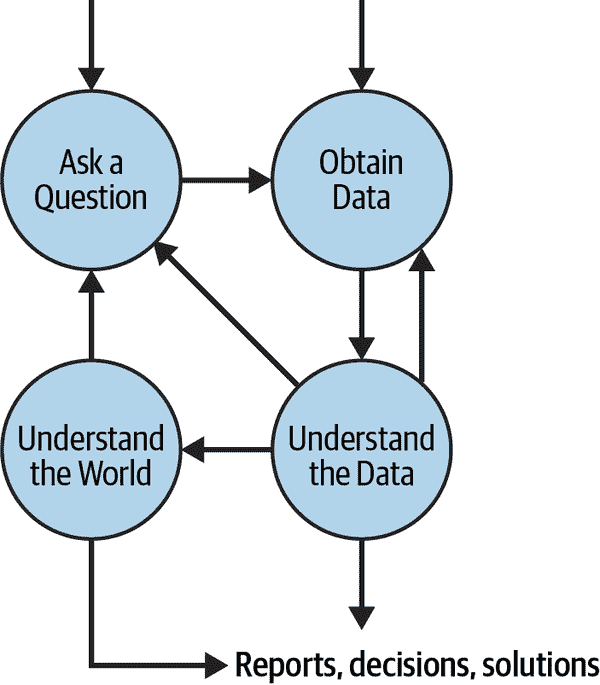

# 第一章：数据科学生命周期

数据科学是一个快速发展的领域。在撰写本文时，人们仍在努力确定数据科学究竟是什么，数据科学家做什么，以及数据科学家应该具备哪些技能。然而，我们知道的是，数据科学利用统计学和计算机科学的方法和原则结合在一起，从数据中获取洞见。学习计算机科学和统计学的结合使我们成为更好的数据科学家。我们还知道，我们获取的任何洞见都需要在我们正在解决的问题的背景下进行解释。

本书涵盖了数据科学家需要帮助做出各种重要决策的基本原理和技能。凭借技术技能和概念理解，我们可以处理以数据为中心的问题，例如评估疫苗的有效性、自动过滤假新闻、校准空气质量传感器，并为分析师在政策变更方面提供建议。

为了帮助您掌握更大的局面，我们围绕一种称为*数据科学生命周期*的工作流程组织了主题。在本章中，我们介绍这个生命周期。与其他数据科学书籍不同，这些书籍倾向于专注于生命周期的某一部分，或者只涉及计算或统计主题，我们涵盖了从头到尾的整个周期，并考虑了统计和计算两个方面。

# 生命周期的阶段

图 1-1 显示了数据科学生命周期，分为四个阶段：提出问题、获取数据、理解数据和理解世界。我们特意使这些阶段变得广泛。根据我们的经验，生命周期的机制经常变化。计算机科学家和统计学家继续开发用于处理数据的新软件包和编程语言，并开发更专业的新方法。

###### 图 1-1\. 数据科学生命周期的四个高级阶段，箭头表示这些阶段如何相互关联

尽管发生了这些变化，我们发现几乎每个数据项目都包括以下四个阶段：

提出问题

提出好问题是数据科学的核心，识别不同类型的问题指导我们的分析。我们涵盖四类问题：描述性、探索性、推论性和预测性。例如，“房价随时间的变化是如何的？”是描述性的，而“房屋的哪些方面与售价相关？”是探索性的。将一个广泛的问题缩小到可以用数据回答的问题是生命周期中这个第一阶段的关键元素。这可能涉及咨询参与研究的人员、弄清如何测量某事以及设计数据收集协议。清晰而专注的研究问题帮助我们确定我们需要的数据、要查找的模式以及如何解释结果。它还可以帮助我们完善问题、识别所提出的问题类型，并计划生命周期的数据收集阶段。

获取数据

当数据昂贵且难以收集时，当我们的目标是从数据中推广到世界时，我们的目标是为收集数据定义精确的协议。其他时候，数据是廉价且易于获取的。这在在线数据源中尤其如此。例如，[Twitter](https://oreil.ly/WvUhe)让人们可以快速下载数百万个数据点。当数据丰富时，我们可以通过获取和探索数据，然后进一步明确研究问题来开始分析。在这两种情况下，大多数数据都有缺失或异常值以及其他我们需要考虑的异常情况。无论数据来自何处，我们都需要检查数据质量。同样重要的是考虑数据的范围；例如，我们确定数据的代表性以及在收集过程中可能存在的潜在偏差来源。这些考虑有助于我们确定我们对发现的信任程度。通常，我们必须在更正式地分析数据之前操作数据。我们可能需要修改结构、清理数据值并转换测量值以准备分析。

理解数据

在获取和准备数据后，我们希望仔细检查它们，而*探索性数据分析*通常是关键。在我们的探索中，我们制作图表以揭示有趣的模式并以视觉方式总结数据。我们还继续寻找数据中的问题。当我们搜索模式和趋势时，我们使用汇总统计和构建统计模型，如线性和逻辑回归。根据我们的经验，这个生命周期的阶段是高度迭代的。理解数据还可能使我们回到数据科学生命周期的早期阶段。我们可能发现需要修改或重新进行数据清洗和操作，获取更多数据以补充我们的分析，或者鉴于数据的限制，重新定义我们的研究问题。我们在这个阶段进行的描述性和探索性分析可能已经足够回答我们的问题，或者我们可能需要进入下一个阶段以便对我们的数据进行推广。

理解世界

当我们的目标纯粹是描述性或探索性时，分析就止步于生命周期的“理解数据”阶段。在其他时候，我们的目标是量化我们发现的趋势在我们数据之外的泛化程度。我们可能希望使用我们拟合到数据的模型来从样本推断到总体，以便对世界进行推断或预测未来的观察。为了从样本到总体进行推断，我们使用统计技术如 A/B 测试和置信区间。为了对未来的观察进行预测，我们创建预测区间并使用数据的训练-测试分割。

对于生命周期的每个阶段，我们解释理论概念，介绍数据技术和统计方法，并展示它们在实际示例中的运用。在整个过程中，我们依赖其他数据科学家的真实数据和分析，而不是虚构的数据，因此您可以学习如何进行自己的数据获取、清洗、探索和正式分析，并得出合理的结论。本书的每一章通常都集中于数据科学生命周期的一个阶段，但我们还包括案例研究章节，展示整个生命周期的实际应用。

###### 注意

理解探索、推断、预测和因果之间的差异可能是一个挑战。我们很容易在数据中找到的相关性与因果关系混淆。例如，探索性或推断性分析可能会针对“暴露于空气污染较多的人是否具有更高的肺病发病率？”这样的问题寻找相关性，而因果性问题可能会问：“给维基百科贡献者颁发奖是否会增加生产力？”除非我们进行了随机实验（或近似实验），通常我们无法回答因果性问题。我们在整本书中都强调这些重要的区别。

# 生命周期的示例

本书中放置了几个案例研究，涵盖整个数据科学生命周期。这些案例研究有双重作用。它们专注于生命周期中的一个阶段，以提供本书部分中的具体示例，并演示整个循环。

第五章的重点是问题的相互作用以及数据如何用来回答问题。简单的问题“为什么我的公交总是迟到？”提供了一个丰富的案例研究，对于初学者来说足够基础，可以追踪生命周期的各个阶段，但又足够微妙，可以展示我们如何应用统计和计算思维来回答问题。在这个案例研究中，我们进行了模拟研究，以了解乘客等待时间的分布。我们还拟合了一个简单的模型来总结等待时间的统计数据。这个案例研究还展示了作为数据科学家，您如何收集自己的数据来回答您感兴趣的问题。

第十二章研究了在美国各地使用的大众市场空气传感器的准确性。我们设计了一种利用环保局维护的高精度传感器数据来改进廉价传感器读数的方法。这个案例研究展示了如何通过来自严格维护和精确的政府监测设备的数据来改进众包开放数据。在这个过程中，我们专注于清理和合并来自多个来源的数据，但我们也拟合模型来调整和改进空气质量测量。

在第十八章中，我们关注模型构建和预测。但我们涵盖了整个生命周期，并看到问题的兴趣如何影响我们构建的模型。我们的目标是帮助肯尼亚农村的兽医，他们无法访问用于称重驴的称重器，以便为生病的动物开药。当我们学习研究设计，清理数据，并在简单性与准确性之间取得平衡时，我们评估了我们模型的预测能力，并展示了科学家如何与面临实际问题的人合作，并协助他们找到解决方案。

最后，在第二十一章中，我们试图通过算法区分手工分类的新闻故事中的假新闻和真实新闻。在这个案例研究中，我们再次看到，可读性强的信息为数据科学家开发新技术并研究当今重要问题创造了惊人的机会。这些数据来自于网上新闻报道，并由阅读这些报道的人员将其分类为假新闻或真实新闻。我们还看到，数据科学家如何以创造性的方式将一般信息（如新闻文章的内容）转化为可分析的数据，以解决当前的热点问题。

# 概要

数据科学生命周期为本书提供了一个组织结构。在处理来自科学、医学、政治、社交媒体和政府等多个来源的数据集时，我们始终牢记这一生命周期。第一次使用数据集时，我们提供了数据收集背景的上下文，对研究数据感兴趣的问题以及理解数据所需的描述。通过这种方式，我们旨在贯彻整本书的良好数据科学实践。

生命周期的第一阶段——提出问题——通常被视为需要应用技术以获得数字的问题，比如“这个 A/B 测试的*p*-值是多少？”或者在实践中经常见到的模糊问题，比如“我们能恢复美国梦吗？”回答第一类问题几乎没有练习开发研究问题的实践经验。而回答第二类问题则很难在没有指导的情况下进行，指导需要将兴趣的一般领域转化为可以用数据回答的问题。提出问题与理解数据局限性以回答问题之间的相互作用是下一章的主题。
