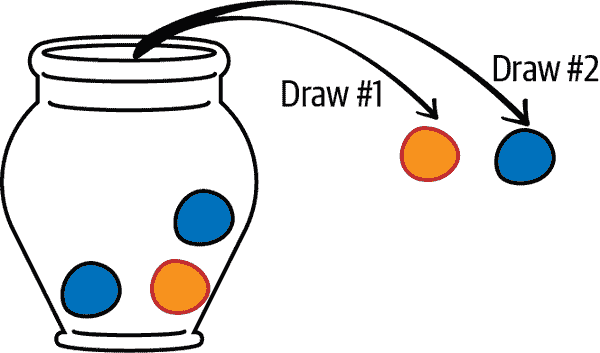
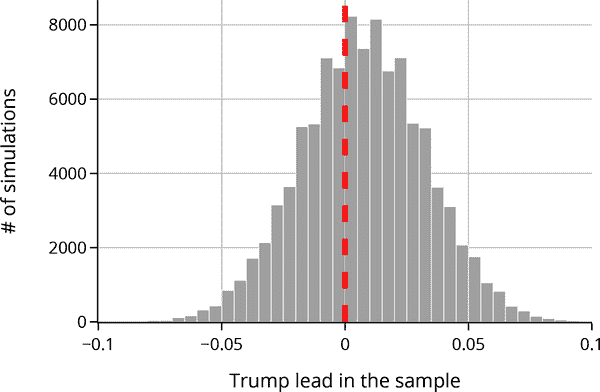
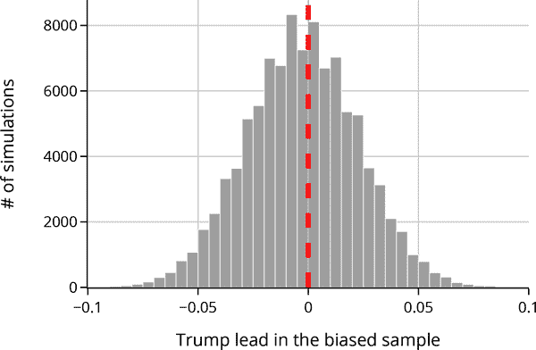
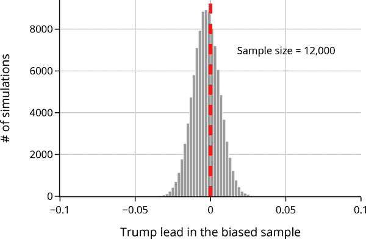
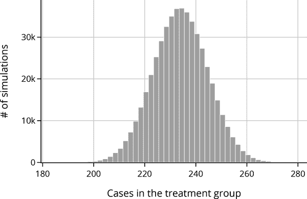
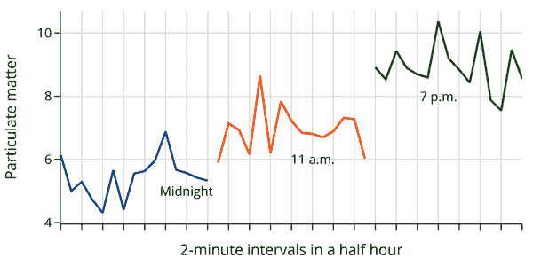
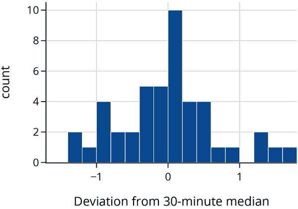
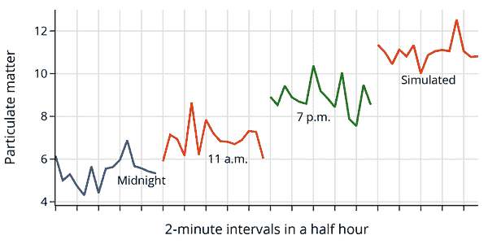

# 第三章\. 模拟与数据设计

在本章中，我们开发了理解数据抽样及其对偏差和方差影响的基础理论。我们建立这个基础不是基于经典统计的干涩方程，而是基于一个装满大理石的乌尔恩的故事。我们使用模拟的计算工具来推理从乌尔恩中选择大理石的属性以及它们对现实世界数据收集的启示。我们将模拟过程与常见的统计分布联系起来（干涩的方程），但是模拟的基本工具使我们能够超越仅仅使用方程直接建模的范围。

例如，我们研究了民意调查员未能预测 2016 年美国总统选举结果的失败。我们的模拟研究使用了宾夕法尼亚州实际投票情况。我们模拟了这六百万选民民意调查的抽样变异，揭示了回应偏差如何扭曲民意调查，并看到仅仅收集更多数据是无济于事的。

在第二个模拟研究中，我们研究了一项控制实验，证明了一种 COVID-19 疫苗的有效性，但也引发了关于疫苗相对有效性的激烈争论。将实验抽象为一个乌尔恩模型为我们提供了一个工具，用于研究随机对照实验中的分配变化。通过模拟，我们找到了临床试验的预期结果。我们的模拟，连同对数据范围的仔细检查，驳斥了疫苗无效的说法。

第三个例子使用模拟来模拟测量过程。当我们将我们人工测量的空气质量的波动与真实测量进行比较时，我们可以评估乌尔恩模型模拟测量空气质量波动的适当性。这种比较为我们校准紫外线空气质量监测器提供了背景，使它们可以更准确地在低湿度时期（如火灾季节）测量空气质量。

然而，在我们解决我们时代一些最重要的数据争论之前，我们首先从一个非常小的故事开始，这个故事是关于几颗大理石坐在一个乌尔恩中的故事。

# 乌尔恩模型

乌尔恩模型是由雅各布·伯努利在 18 世纪初开发的，作为模拟从人群中选择项目的一种方式。图 3-1 显示的乌尔恩模型提供了一个随机从乌尔恩中取样大理石过程的视觉描述。乌尔恩最初有五颗大理石：三颗黑色和两颗白色。图表显示进行了两次抽取：首先抽出一颗白色大理石，然后抽出一颗黑色大理石。



###### 图 3-1\. 两颗弃不重复从乌尔恩中抽出的大理石的图表

要建立一个乌尔恩模型，我们首先需要做出几个决定：

+   乌尔恩中的大理石数量

+   每颗大理石的颜色（或标签）

+   从乌尔恩中抽出的大理石的数量

最后，我们还需要决定抽样过程。对于我们的过程，我们将弹珠混合在容器中，当我们选择一个弹珠进行样本时，我们可以选择记录其颜色并将其放回容器（有放回抽样），或者将其设置为不能再次被选中（无放回抽样）。

这些决策构成了我们模型的参数。我们可以通过选择这些参数来调整弹珠模型，以描述许多现实世界的情况。举例来说，考虑 图 3-1 中的示例。我们可以使用`numpy`的`random.choice`方法在两次取样之间模拟从我们的容器中取出两个弹珠（无放回）。`numpy`库支持数组的函数，对于数据科学特别有用：

```py
`import` `numpy` `as` `np`

`urn` `=` `[``"``b``"``,` `"``b``"``,` `"``b``"``,` `"``w``"``,` `"``w``"``]`
`print``(``"``Sample 1:``"``,` `np``.``random``.``choice``(``urn``,` `size``=``2``,` `replace``=``False``)``)`
`print``(``"``Sample 2:``"``,` `np``.``random``.``choice``(``urn``,` `size``=``2``,` `replace``=``False``)``)`

```

```py
Sample 1: ['b' 'w']
Sample 2: ['w' 'b']

```

注意我们将`replace`参数设置为`False`，以表明一旦我们取出一个弹珠，就不会放回到容器中。

有了这个基本设置，我们可以大致回答关于我们期望看到的样本种类的问题。我们的样本中仅包含一种颜色的弹珠的机会是多少？如果我们在选择后将每个弹珠放回，机会会改变吗？如果我们改变了容器中的弹珠数量会怎样？如果我们从容器中抽取更多的弹珠会怎样？如果我们重复这个过程很多次会发生什么？

这些问题的答案对我们理解数据收集至关重要。我们可以基于这些基本技能来模拟弹珠，并将模拟技术应用于经典概率方程难以解决的现实问题。

例如，我们可以使用模拟来轻松估计我们抽取的两个弹珠中匹配颜色的样本比例。在下面的代码中，我们运行了 10,000 轮从我们的容器中抽取两个弹珠的过程。利用这些样本，我们可以直接计算具有匹配弹珠的样本比例：

```py
`n` `=` `10_000`
`samples` `=` `[``np``.``random``.``choice``(``urn``,` `size``=``2``,` `replace``=``False``)` `for` `_` `in` `range``(``n``)``]`
`is_matching` `=` `[``marble1` `==` `marble2` `for` `marble1``,` `marble2` `in` `samples``]`
`print``(``f``"``Proportion of samples with matching marbles:` `{``np``.``mean``(``is_matching``)``}``"``)`

```

```py
Proportion of samples with matching marbles: 0.4032

```

我们刚刚进行了一项*模拟研究*。我们对`np.random.choice`的调用模拟了从容器中无放回地抽取两个弹珠的概率过程。每次对`np.random.choice`的调用给我们一个可能的样本。在模拟研究中，我们重复这个概率过程多次（在这种情况下是`10_000`次），以获得大量样本。然后，我们利用这些样本的典型行为来推理出我们可能从概率过程中获得的结果。虽然这可能看起来像是一个假设性的例子（确实如此），但请考虑如果我们将弹珠替换为在线约会服务中的人，用更复杂的属性替换颜色，并可能使用神经网络来评分匹配，你就能开始看到更复杂分析的基础了。

到目前为止，我们关注的是样本，但我们通常对我们可能观察到的样本与它可以告诉我们关于最初在容器中的“种群”弹珠之间的关系感兴趣。

我们可以将数据范围的类比与第二章联系起来：从坛子中抽取的一组大理石是一个*样本*，而放置在坛子中的所有大理石是*接触框架*，在这种情况下，我们认为与*种群*相同。这种模糊了访问框架和种群之间的差异指向了模拟与现实之间的差距。模拟往往简化模型。尽管如此，它们可以为现实世界的现象提供有用的见解。

在我们不在抽样过程中替换大理石的坛子模型中，有一个常见的选择方法称为*简单随机样本*。我们接下来描述这种方法及其他基于它的抽样技术。

## 抽样设计

从坛子中不替换地抽取大理石的过程等同于一个简单随机样本。*在简单随机样本中，每个样本被选中的机会相同*。虽然方法名称中含有“简单”一词，但构建一个简单随机样本通常并不简单，在许多情况下也是最佳的抽样过程。此外，如果我们诚实地说，它有时也会有些令人困惑。

为了更好地理解这种抽样方法，我们回到坛子模型。考虑一个有七个大理石的坛子。我们不给大理石着色，而是用字母`A`到`G`对每个大理石进行标记。由于每个大理石都有不同的标签，我们可以更清楚地识别我们可能得到的所有可能样本。让我们从坛子中不替换地选择三个大理石，并使用`itertools`库生成所有组合的列表：

```py
`from` `itertools` `import` `combinations`

`all_samples` `=` `[``"``"``.``join``(``sample``)` `for` `sample` `in` `combinations``(``"``ABCDEFG``"``,` `3``)``]`
`print``(``all_samples``)`
`print``(``"``Number of Samples:``"``,` `len``(``all_samples``)``)`

```

```py
['ABC', 'ABD', 'ABE', 'ABF', 'ABG', 'ACD', 'ACE', 'ACF', 'ACG', 'ADE', 'ADF', 'ADG', 'AEF', 'AEG', 'AFG', 'BCD', 'BCE', 'BCF', 'BCG', 'BDE', 'BDF', 'BDG', 'BEF', 'BEG', 'BFG', 'CDE', 'CDF', 'CDG', 'CEF', 'CEG', 'CFG', 'DEF', 'DEG', 'DFG', 'EFG']
Number of Samples: 35

```

我们的列表显示，有 35 个唯一的三大理石集。我们可以以六种不同的方式抽取每组集合。例如，集合<math><mo fence="false" stretchy="false">{</mo> <mi>A</mi> <mo>,</mo> <mi>B</mi> <mo>,</mo> <mi>C</mi> <mo fence="false" stretchy="false">}</mo></math>可以被抽样：

```py
`from` `itertools` `import` `permutations`

`print``(``[``"``"``.``join``(``sample``)` `for` `sample` `in` `permutations``(``"``ABC``"``)``]``)`

```

```py
['ABC', 'ACB', 'BAC', 'BCA', 'CAB', 'CBA']

```

在这个小例子中，我们可以全面了解我们可以从坛子中抽取任意三个大理石的所有方法。

由于从七个种群中选择的每组三个大理石同等可能地发生，任何一个特定样本的机会必须是<math><mn>1</mn> <mrow><mo>/</mo></mrow> <mn>35</mn></math>：

<math display="block"><mrow><mrow><mi mathvariant="double-struck">P</mi></mrow></mrow> <mo stretchy="false">(</mo> <mi>A</mi> <mi>B</mi> <mi>C</mi> <mo stretchy="false">)</mo> <mo>=</mo> <mrow><mrow><mi mathvariant="double-struck">P</mi></mrow></mrow> <mo stretchy="false">(</mo> <mtext>ABD</mtext> <mo stretchy="false">)</mo> <mo>=</mo> <mo>⋯</mo> <mo>=</mo> <mrow><mrow><mi mathvariant="double-struck">P</mi></mrow></mrow> <mo stretchy="false">(</mo> <mtext>EFG</mtext> <mo stretchy="false">)</mo> <mo>=</mo> <mfrac><mn>1</mn> <mn>35</mn></mfrac></math>

我们使用特殊符号<math><mrow><mrow><mi mathvariant="double-struck">P</mi></mrow></mrow></math>表示“概率”或“机会”，并且我们将语句<math><mrow><mrow><mi mathvariant="double-struck">P</mi></mrow></mrow> <mo stretchy="false">(</mo> <mi>A</mi> <mi>B</mi> <mi>C</mi> <mo stretchy="false">)</mo></math>读作“样本包含标记为 A、B 和 C 的大理石的机会，无论顺序如何”。

我们可以使用从坛子中所有可能样本的枚举来回答关于这一随机过程的其他问题。例如，要找出大理石<math><mi>A</mi></math>在样本中的机会，我们可以加总所有包含<math><mi>A</mi></math>的样本的机会。共有 15 个，因此机会是：

<math display="block"><mrow><mrow><mi mathvariant="double-struck">P</mi></mrow></mrow> <mo stretchy="false">(</mo> <mrow><mi>A</mi>  <mi>i</mi> <mi>s</mi>  <mi>i</mi> <mi>n</mi>  <mi>t</mi> <mi>h</mi> <mi>e</mi>  <mi>s</mi> <mi>a</mi> <mi>m</mi> <mi>p</mi> <mi>l</mi> <mi>e</mi></mrow> <mo stretchy="false">)</mo> <mo>=</mo> <mfrac><mn>15</mn> <mn>35</mn></mfrac> <mo>=</mo> <mfrac><mn>3</mn> <mn>7</mn></mfrac></math>

当难以列举和计算所有可能的样本时，我们可以使用模拟来帮助理解这一概率过程。

###### 注意

许多人错误地认为简单随机样本的定义特性是每个单位有相同的抽样机会。然而，情况并非如此。从人口中抽取<math><mi>n</mi></math>个单位的简单随机样本意味着每个<math><mi>N</mi></math>个单位的所有可能的<math><mi>n</mi></math>个集合被选择的机会相同。稍有变体的是*带放回的简单随机样本*，在这种情况下，单位/彩球在每次抽取后都被放回罐子。这种方法也具有每个<math><mi>N</mi></math>个单位人口的<math><mi>n</mi></math>个样本被选中的属性。不同之处在于，因为同一彩球可以在样本中出现多次，所以可能的<math><mi>n</mi></math>个单位集合更多。

简单随机样本（及其对应的罐子）是更复杂的调查设计的主要构建块。我们简要描述了两种更广泛使用的设计：

分层抽样

将人口分成互不重叠的群体，称为*层*（一个群体称为*层*，多个称为层），然后从每个群体中简单随机抽取样本。这就像每个层都有一个单独的罐子，并且独立地从每个罐子中抽取彩球。这些层的大小可以不同，并且我们不需要从每个层中取相同数量的彩球。

簇抽样

将人口分成互不重叠的子群体，称为*簇*，从簇中简单随机抽取样本，并将簇中的所有单位包括在样本中。我们可以将这看作是从一个包含大彩球的罐子中简单随机抽样，而这些大彩球本身是装有小彩球的容器。（大彩球的数量不一定相同。）当打开时，大彩球样本变成小彩球样本。（簇通常比层小。）

例如，我们可以将标记为<math><mi>A</mi></math>-<math><mi>G</mi></math>的七个彩球，组织成三个簇：<math><mo stretchy="false">(</mo><mi>A</mi><mo>,</mo><mi>B</mi><mo stretchy="false">)</mo></math>，<math><mo stretchy="false">(</mo><mi>C</mi><mo>,</mo><mi>D</mi><mo stretchy="false">)</mo></math>和<math><mo stretchy="false">(</mo><mi>E</mi><mo>,</mo><mi>F</mi><mo>,</mo><mi>G</mi><mo stretchy="false">)</mo></math>。然后，大小为一的簇样本有同等机会从这三个簇中抽取任何一个。在这种情况下，每个彩球被抽取为样本的机会相同：

<math display="block"><mtable columnalign="right" columnspacing="0em" displaystyle="true" rowspacing="3pt"><mtr><mtd><mtable columnalign="right left right" columnspacing="0em 2em" displaystyle="true" rowspacing="3pt"><mtr><mtd><mrow><mrow><mi mathvariant="double-struck">P</mi></mrow></mrow> <mo stretchy="false">(</mo> <mrow><mi>A</mi>  <mtext>in sample</mtext></mrow> <mo stretchy="false">)</mo></mtd> <mtd><mo>=</mo> <mrow><mrow><mi mathvariant="double-struck">P</mi></mrow></mrow> <mo stretchy="false">(</mo> <mtext>cluster</mtext>  <mrow><mo stretchy="false">(</mo> <mi>A</mi> <mo>,</mo> <mi>B</mi> <mo stretchy="false">)</mo>  <mtext>chosen</mtext></mrow> <mo stretchy="false">)</mo></mtd> <mtd><mo>=</mo> <mfrac><mn>1</mn> <mn>3</mn></mfrac></mtd></mtr> <mtr><mtd><mrow><mrow><mi mathvariant="double-struck">P</mi></mrow></mrow> <mo stretchy="false">(</mo> <mrow><mi>B</mi>  <mtext>in sample</mtext></mrow> <mo stretchy="false">)</mo></mtd> <mtd><mo>=</mo> <mrow><mrow><mi mathvariant="double-struck">P</mi></mrow></mrow> <mo stretchy="false">(</mo> <mtext>cluster</mtext>  <mrow><mo stretchy="false">(</mo> <mi>A</mi> <mo>,</mo> <mi>B</mi> <mo stretchy="false">)</mo>  <mtext>chosen</mtext></mrow> <mo stretchy="false">)</mo></mtd> <mtd><mo>=</mo> <mfrac><mn>1</mn> <mn>3</mn></mfrac></mtd></mtr> <mtr><mtd><mrow><mo>⋮</mo></mrow></mtd></mtr> <mtr><mtd><mrow><mrow><mi mathvariant="double-struck">P</mi></mrow></mrow> <mo stretchy="false">(</mo> <mrow><mi>G</mi>  <mtext>in sample</mtext></mrow> <mo stretchy="false">)</mo></mtd> <mtd><mo>=</mo> <mrow><mrow><mi mathvariant="double-struck">P</mi></mrow></mrow> <mo stretchy="false">(</mo> <mtext>cluster</mtext>  <mrow><mo stretchy="false">(</mo> <mi>E</mi> <mo>,</mo> <mi>F</mi> <mo>,</mo> <mi>G</mi> <mo stretchy="false">)</mo>  <mtext>chosen</mtext></mrow> <mo stretchy="false">)</mo></mtd> <mtd><mo>=</mo> <mfrac><mn>1</mn> <mn>3</mn></mfrac></mtd></mtr></mtable></mtd></mtr></mtable></math>

但并非每种元素组合的发生概率都相等：样本不可能同时包含<math><mi>A</mi></math>和<math><mi>C</mi></math>，因为它们位于不同的簇中。

经常，我们对样本的总结感兴趣；换句话说，我们对*统计量*感兴趣。对于任何样本，我们可以计算统计量，而罐模型帮助我们找到该统计量可能具有的值的分布。接下来，我们检查我们简单示例的统计量分布。

## 统计量的抽样分布

假设我们有兴趣测试新燃料箱设计的失败压力，这样做成本高昂，因为我们需要摧毁燃料箱，并且可能需要测试多个燃料箱以解决制造上的变化。

我们可以使用罐模型选择要测试的原型，并且可以通过失败测试的原型比例总结我们的测试结果。罐模型为我们提供了每个样本被选择的相同机会，因此压力测试结果代表了整体群体。

为了简单起见，假设我们有七个与之前弹珠类似标记的燃料箱。让我们看看如果选择时，如何处理坦克<math><mi>A</mi></math>、<math><mi>B</mi></math>、<math><mi>D</mi></math>和<math><mi>F</mi></math>未通过压力测试，而选择通过测试的<math><mi>C</mi></math>、<math><mi>E</mi></math>和<math><mi>G</mi></math>。

对于每三颗弹珠的样本，我们可以根据这些四个次品原型中有多少个来计算失败的比例。我们举几个计算示例：

| 样本 | ABC | BCE | BDF | CEG |
| --- | --- | --- | --- | --- |
| 失败比例 | 2/3 | 1/3 | 1 | 0 |

由于我们从罐中抽取三颗弹珠，唯一可能的样本比例是<math><mn>0</mn></math>、<math><mn>1</mn> <mrow><mo>/</mo></mrow> <mn>3</mn></math>、<math><mn>2</mn> <mrow><mo>/</mo></mrow> <mn>3</mn></math>和<math><mn>1</mn></math>，对于每个三元组，我们可以计算其相应的比例。有四个样本使我们得到全部测试失败（样本比例为 1）。它们分别是<math><mi>A</mi> <mi>B</mi> <mi>D</mi></math>、<math><mi>A</mi> <mi>B</mi> <mi>F</mi></math>、<math><mi>A</mi> <mi>D</mi> <mi>F</mi></math>和<math><mi>B</mi> <mi>D</mi> <mi>F</mi></math>，因此观察到样本比例为 1 的机会为<math><mn>4</mn> <mrow><mo>/</mo></mrow> <mn>35</mn></math>。我们可以将样本比例的分布总结为一张表格，称为*样本比例*的*抽样分布*：

| 失败比例 | 样本数 | 样本比例 |
| --- | --- | --- |
| 0 | 1 | 1/35 <math><mo>≈</mo> <mn>0.03</mn></math> |
| 1/3 | 12 | 12/35 <math><mo>≈</mo> <mn>0.34</mn></math> |
| 2/3 | 18 | 18/35 <math><mo>≈</mo> <mn>0.51</mn></math> |
| 1 | 4 | 4/35 <math><mo>≈</mo> <mn>0.11</mn></math> |
| 总数 | 35 | 1 |

尽管这些计算相对直观，我们可以通过仿真研究来近似它们。为此，我们反复从我们的总体中取三个样本，比如说一万次。对于每个样本，我们计算失败比例。这给我们 10,000 个模拟样本比例。仿真比例表应接近抽样分布。我们通过仿真研究确认这一点。

## 模拟抽样分布

仿真可以是理解复杂随机过程的强大工具。在我们七个燃料箱的例子中，我们能够考虑来自相应盒模型的所有可能样本。然而，在具有大量人口和样本以及更复杂抽样过程的情况下，直接计算某些结果的概率可能并不可行。在这些情况下，我们经常转向仿真，以提供我们无法直接计算的数量的准确估计。

让我们设定一个问题，即寻找三个燃料箱的简单随机样本中失败比例的抽样分布，作为一个盒子模型。由于我们关心罐是否故障，我们使用 1 表示失败和 0 表示通过，这给我们一个标记如下的罐子：

```py
`urn` `=` `[``1``,` `1``,` `0``,` `1``,` `0``,` `1``,` `0``]`

```

我们已经使用 1 表示失败和 0 表示通过对罐头 <math><mi>A</mi></math> 至 <math><mi>G</mi></math> 进行编码，因此我们可以取样本的平均值来获得样本中的失败比例：

```py
`sample` `=` `np``.``random``.``choice``(``urn``,` `size``=``3``,` `replace``=``False``)`
`print``(``f``"``Sample:` `{``sample``}``"``)`
`print``(``f``"``Prop Failures:` `{``sample``.``mean``(``)``}``"``)`

```

```py
Sample: [1 0 0]
Prop Failures: 0.3333333333333333

```

在仿真研究中，我们重复抽样过程数千次以获得数千个比例，然后从我们的仿真中估计比例的抽样分布。在这里，我们构建了 10,000 个样本（因此有 10,000 个比例）：

```py
`samples` `=` `[``np``.``random``.``choice``(``urn``,` `size``=``3``,` `replace``=``False``)` `for` `_` `in` `range``(``10_000``)``]`
`prop_failures` `=` `[``s``.``mean``(``)` `for` `s` `in` `samples``]`

```

我们可以研究这 10,000 个样本比例，并将我们的发现与我们已经使用所有 35 个可能样本的完全枚举计算的结果进行匹配。我们预计仿真结果与我们之前的计算非常接近，因为我们重复了许多次抽样过程。也就是说，我们想比较 10,000 个样本比例的分数是否为 0、<math><mn>1</mn> <mrow><mo>/</mo></mrow> <mn>3</mn></math> 、<math><mn>2</mn> <mrow><mo>/</mo></mrow> <mn>3</mn></math> 和 1，与我们确切计算的那些分数相匹配；这些分数是 <math><mn>1</mn> <mrow><mo>/</mo></mrow> <mn>35</mn></math> 、<math><mn>12</mn> <mrow><mo>/</mo></mrow> <mn>35</mn></math> 、<math><mn>18</mn> <mrow><mo>/</mo></mrow> <mn>35</mn></math> 和 <math><mn>4</mn> <mrow><mo>/</mo></mrow> <mn>35</mn></math> ，约为 <math><mn>0.03</mn></math> 、<math><mn>0.34</mn></math> 、<math><mn>0.51</mn></math> 和 <math><mn>0.11</mn></math> ：

```py
`unique_els``,` `counts_els` `=` `np``.``unique``(``prop_failures``,` `return_counts``=``True``)`
`pd``.``DataFrame``(``{`
    `"``Proportion of failures``"``:` `unique_els``,`
    `"``Fraction of samples``"``:` `counts_els` `/` `10_000``,`
`}``)`

```

|   | 失败比例 | 样本分数比 |
| --- | --- | --- |
| **0** | 0.00 | 0.03 |
| **1** | 0.33 | 0.35 |
| **2** | 0.67 | 0.51 |
| **3** | 1.00 | 0.11 |

仿真结果非常接近我们之前计算的准确概率。

###### 注意

模拟研究利用随机数生成器从随机过程中采样许多结果。从某种意义上讲，模拟研究将复杂的随机过程转化为我们可以使用本书中涵盖的广泛计算工具进行分析的数据。虽然模拟研究通常不提供特定假设的确凿证据，但它们可以提供重要的证据。在许多情况下，模拟是我们拥有的最准确的估计过程。

从一个瓮中抽取 0 和 1 的球是理解随机性的一个流行框架，这种机会过程已被正式命名为*超几何分布*，大多数软件都提供快速进行此过程模拟的功能。在下一节中，我们将模拟燃料箱例子中的超几何分布。

## 使用超几何分布进行模拟

而不是使用 `random.choice`，我们可以使用 `numpy` 的 `random.hypergeometric` 来模拟从瓮中取球并计算失败次数。`random.hypergeometric` 方法针对 0-1 瓮进行了优化，并允许我们在一次调用中请求 10,000 次模拟。为了完整起见，我们重复了我们的模拟研究并计算了经验比例：

```py
`simulations_fast` `=` `np``.``random``.``hypergeometric``(`
    `ngood``=``4``,` `nbad``=``3``,` `nsample``=``3``,` `size``=``10_000`
`)`
`print``(``simulations_fast``)`

```

```py
[1 1 2 ... 1 2 2]

```

（我们并不认为通过的是“坏”的；这只是一种命名惯例，将你想要计数的类型称为“好”的，其他的称为“坏”的。）

我们统计了 10,000 个样本中有 0、1、2 或 3 次失败的比例：

```py
`unique_els``,` `counts_els` `=` `np``.``unique``(``simulations_fast``,` `return_counts``=``True``)`
`pd``.``DataFrame``(``{`
    `"``Number of failures``"``:` `unique_els``,`
    `"``Fraction of samples``"``:` `counts_els` `/` `10_000``,`
`}``)`

```

|   | 失败次数 | 样本分数比 |
| --- | --- | --- |
| **0** | 0 | 0.03 |
| **1** | 1 | 0.34 |
| **2** | 2 | 0.52 |
| **3** | 3 | 0.11 |

也许你已经在想：既然超几何分布如此受欢迎，为什么不提供可能值的确切分布呢？事实上，我们可以精确计算这些：

```py
`from` `scipy``.``stats` `import` `hypergeom`

`num_failures` `=` `[``0``,` `1``,` `2``,` `3``]`
`pd``.``DataFrame``(``{`
    `"``Number of failures``"``:` `num_failures``,`
    `"``Fraction of samples``"``:` `hypergeom``.``pmf``(``num_failures``,` `7``,` `4``,` `3``)``,`
`}``)`

```

|   | 失败次数 | 样本分数比 |
| --- | --- | --- |
| **0** | 0 | 0.03 |
| **1** | 1 | 0.34 |
| **2** | 2 | 0.51 |
| **3** | 3 | 0.11 |

###### 注意

在可能的情况下，最好使用第三方包中提供的功能来模拟命名分布，比如 `numpy` 中提供的随机数生成器，而不是编写自己的函数。最好利用他人开发的高效和准确的代码。话虽如此，偶尔从头开始构建可以帮助你理解算法，所以我们建议试一试。

或许最常见的两种机会过程是那些由从 0-1 瓮中抽取 1 的数量产生的过程：不替换抽取是*超几何*分布，替换抽取是*二项式*分布。

虽然这个模拟过程非常简单，我们本可以直接使用`hypergeom.pmf`来计算我们的分布，但我们希望展示模拟研究能够揭示的直觉。我们在本书中采用的方法是基于模拟研究开发对机会过程的理解。然而，在第十七章中，我们确实正式地定义了统计数据的概率分布的概念。

现在我们把模拟作为了解准确性的工具之一，可以重新审视第二章中的选举例子，并进行一次选举后研究，看看选民民意调查可能出了什么问题。这个模拟研究模仿了从 600 万个选民中抽取超过一千个弹珠（参与民意调查的选民）。我们可以检查偏见的潜在来源和民意调查结果的变化，并进行“如果”分析，看看如果从选民中抽取更多的弹珠会对预测产生怎样的影响。

# 示例：模拟选举民意调查的偏见和方差

2016 年，几乎所有关于美国总统选举结果的预测都是错误的。这是一个历史性的预测误差水平，震惊了统计学和数据科学界。在这里，我们探讨为什么几乎每一个政治民意调查都是如此自信，却又如此错误。这个故事既展示了模拟的力量，也揭示了数据的傲慢和偏见挑战的难度。

美国总统是由选举人团选出的，而不是由普通选民的投票决定。根据各州的人口大小，每个州被分配一定数量的选举人票数。通常情况下，谁在某州赢得了普选，谁就会获得该州所有的选举人票数。在选举前进行的民意调查帮助下，评论家确定了“争夺”州，在这些州中选举预计会非常接近，选举人票数可能会左右选举结果。

2016 年，民意调查机构正确预测了 50 个州中的 46 个的选举结果。这并不差！毕竟，对于那 46 个州来说，唐纳德·特朗普获得了 231 张选举人票，希拉里·克林顿获得了 232 张选举人票——几乎是平局，克林顿领先微弱。不幸的是，剩下的四个州，佛罗里达、密歇根、宾夕法尼亚和威斯康辛，被认定为争夺州，并且合计 75 张选举人票。这四个州的普选投票比例非常接近。例如，在宾夕法尼亚州，特朗普获得了 6,165,478 票中的 48.18%，而克林顿获得了 47.46%。在这些州，由于民意调查使用的样本量较小，很难预测选举结果。但是，在调查过程本身也存在更大的挑战。

许多专家研究了 2016 年选举结果，以分析并确定出了什么问题。根据[美国公共舆论研究协会](https://oreil.ly/4FWW2)的说法，一项在线自愿参与的民意调查对受访者的教育程度进行了调整，但只使用了三个广泛的类别（高中或以下、部分大学和大学毕业）。民意调查人员发现，如果他们将具有高级学位的受访者与具有大学学位的受访者分开，那么他们将会将克林顿的估计百分比降低 0.5 个百分点。换句话说，在事后，他们能够确定受过教育程度较高的选民更愿意参与投票。这种偏见很重要，因为这些选民也倾向于喜欢克林顿而不是特朗普。

现在我们知道人们实际投票的方式，我们可以进行类似[Manfred te Grotenhuis 等人](https://oreil.ly/hOSC2)的模拟研究，模拟不同情况下的选举民意调查，以帮助形成对准确性、偏见和方差的直觉。我们可以模拟并比较宾夕法尼亚州的两种情况下的民意调查：

+   受访者没有改变他们的想法，也没有隐藏他们投票给谁，并且代表了在选举日投票的人群。

+   受过高等教育的人更有可能回答，这导致了对克林顿的偏见。

我们的最终目标是了解在样本收集过程中完全没有偏见和存在少量非响应偏见的情况下，民意调查错误地将选举归因于希拉里·克林顿的频率。我们首先为第一种情况建立瓮模型。

## 宾夕法尼亚州瓮模型

我们对宾夕法尼亚州选民进行民意调查的瓮模型是一种事后情况，我们使用选举结果。这个瓮中有 6,165,478 个弹珠，每个选民一个。就像我们的小样本一样，我们在每个弹珠上写上他们投票给的候选人，从瓮中抽取 1,500 个弹珠（1,500 个是这些调查的典型大小），并统计特朗普、克林顿和任何其他候选人的选票。通过统计，我们可以计算特朗普相对于克林顿的领先优势。

由于我们只关心特朗普相对于克林顿的领先优势，我们可以将其他候选人的所有选票合并在一起。这样，每个弹珠都有三种可能的选票：特朗普、克林顿或其他。我们不能忽略“其他”类别，因为它会影响领先优势的大小。让我们将选民数分配给这三个群体：

```py
`proportions` `=` `np``.``array``(``[``0.4818``,` `0.4746``,` `1` `-` `(``0.4818` `+` `0.4746``)``]``)`               
`n` `=` `1_500` 
`N` `=` `6_165_478`
`votes` `=` `np``.``trunc``(``N` `*` `proportions``)``.``astype``(``int``)`
`votes`

```

```py
array([2970527, 2926135,  268814])

```

这个版本的瓮模型有三种类型的弹珠。它比超几何分布复杂一些，但仍然足够常见以具有命名分布：*多元超几何分布*。在 Python 中，具有两种以上弹珠类型的瓮模型是通过`scipy.stats.multivariate_hypergeom.rvs`方法实现的。该函数返回从瓮中抽取的每种类型的弹珠数量。我们调用函数如下：

```py
`from` `scipy``.``stats` `import` `multivariate_hypergeom`

`multivariate_hypergeom``.``rvs``(``votes``,` `n``)`

```

```py
array([727, 703,  70])

```

每次调用`multivariate_hypergeom.rvs`时，我们都会得到一个不同的样本和计数：

```py
`multivariate_hypergeom``.``rvs``(``votes``,` `n``)`

```

```py
array([711, 721,  68])

```

我们需要计算每个样本的特朗普领先： <math><mo stretchy="false">(</mo> <msub><mi>n</mi> <mi>T</mi></msub> <mo>−</mo> <msub><mi>n</mi> <mi>C</mi></msub> <mo stretchy="false">)</mo> <mrow><mo>/</mo></mrow> <mi>n</mi></math> ，其中 <math><msub><mi>n</mi> <mi>T</mi></msub></math> 是特朗普的选票数，<math><msub><mi>n</mi> <mi>C</mi></msub></math> 是克林顿的选票数。如果领先是正数，则样本显示特朗普胜出。

我们知道实际领先是 0.4818 – 0.4746 = 0.0072\. 为了了解民意调查的变化情况，我们可以模拟反复从瓮中取出的机会过程，并检查我们得到的值。现在，我们可以模拟在宾夕法尼亚投票中的 1,500 名选民的 100,000 次调查：

```py
`def` `trump_advantage``(``votes``,` `n``)``:`
    `sample_votes` `=` `multivariate_hypergeom``.``rvs``(``votes``,` `n``)`
    `return` `(``sample_votes``[``0``]` `-` `sample_votes``[``1``]``)` `/` `n`

```

```py
`simulations` `=` `[``trump_advantage``(``votes``,` `n``)` `for` `_` `in` `range``(``100_000``)``]` 

```

平均而言，民调结果显示特朗普领先接近 0.7%，这与投票结果的构成相符：

```py
`np``.``mean``(``simulations``)`

```

```py
0.007177066666666666

```

然而，很多时候样本的领先是负数，这意味着在该选民样本中克林顿是赢家。下图显示了在宾夕法尼亚 1,500 名选民样本中特朗普优势的抽样分布。在 0 处的垂直虚线显示，特朗普更常被提及，但在 1,500 人的调查中，有很多次克林顿处于领先地位：



在 100,000 次模拟的调查中，我们发现特朗普大约 60%的时间是胜利者：

```py
`np``.``mean``(``np``.``array``(``simulations``)` `>` `0``)`

```

```py
0.60613

```

换句话说，一个样本即使没有任何偏见地收集，也将大约 60%的时间正确预测特朗普的胜利。而这种无偏样本将在 40%的时间错误。

我们使用了瓮模型来研究简单民意调查的变化，并找出了如果选择过程没有偏差时民意调查的预测可能是什么样子（弹珠是无法区分的，六百多万个弹珠中的每一种可能的 1,500 个弹珠集合是同等可能的）。接下来，我们看看当一点偏差进入混合时会发生什么。

## 具有偏差的瓮模型

根据 Grotenhuis 的说法，“在完美的世界里，民意调查从选民群体中取样，他们会明确表达自己的政治偏好，然后相应地投票。”^(2) 这就是我们刚刚进行的模拟研究。然而，在现实中，往往很难控制每一种偏见来源。

我们在这里研究了教育偏见对民调结果的影响。具体来说，我们检查了对克林顿有利的 0.5%偏见的影响。这种偏见实质上意味着我们在民意调查中看到了选民偏好的扭曲图片。克林顿的选票不是 47.46%，而是 47.96%，而特朗普是 48.18 – 0.5 = 47.68%。我们调整了瓮中弹珠的比例以反映这一变化：

```py
`bias` `=` `0.005`
`proportions_bias` `=` `np``.``array``(``[``0.4818` `-` `bias``,` `0.4747` `+` `bias``,` 
                             `1` `-` `(``0.4818` `+` `0.4746``)``]``)`
`proportions_bias`

```

```py
array([0.48, 0.48, 0.04])

```

```py
`votes_bias` `=` `np``.``trunc``(``N` `*` `proportions_bias``)``.``astype``(``int``)`
`votes_bias`

```

```py
array([2939699, 2957579,  268814])

```

当我们再次进行模拟研究时，这次使用有偏的瓮，我们发现结果大不相同：

```py
`simulations_bias` `=` `[``trump_advantage``(``votes_bias``,` `n``)` `for` `_` `in` `range``(``100_000``)``]` 

```



```py
`np``.``mean``(``np``.``array``(``simulations_bias``)` `>` `0``)` 

```

```py
0.44967

```

现在，特朗普在大约 45%的民意调查中领先。请注意，两次模拟的直方图形状相似。它们对称，并且尾部长度合理。也就是说，它们似乎大致遵循正态曲线。第二个直方图稍微向左移动，反映了我们引入的非响应偏倚。增加样本量会有所帮助吗？我们接下来研究这个话题。

## 进行更大规模的民调

通过我们的模拟研究，我们可以了解更大样本对样本领先的影响。例如，我们可以尝试使用 12,000 个样本，是实际民调规模的 8 倍，并针对无偏和有偏情况运行 100,000 次模拟：

```py
`simulations_big` `=` `[``trump_advantage``(``votes``,` `12_000``)` `for` `_` `in` `range``(``100_000``)``]`
`simulations_bias_big` `=` `[``trump_advantage``(``votes_bias``,` `12_000``)`
                        `for` `_` `in` `range``(``100_000``)``]`

```

```py
`scenario_no_bias` `=` `np``.``mean``(``np``.``array``(``simulations_big``)` `>` `0``)`
`scenario_bias` `=` `np``.``mean``(``np``.``array``(``simulations_bias_big``)` `>` `0``)`
`print``(``scenario_no_bias``,` `scenario_bias``)`

```

```py
0.78968 0.36935

```

模拟显示，在有偏情况下，只有大约三分之一的模拟中检测到特朗普的领先地位。这些结果的直方图分布比仅有 1,500 位选民的情况更窄。不幸的是，它已经偏离了正确的数值。我们并没有克服偏倚；我们只是对偏倚情况有了更准确的了解。大数据并没有拯救我们。此外，更大规模的民调还有其他问题。它们通常更难进行，因为民调员在有限的资源下工作，本来可以用来改善数据范围的努力被重新定向到扩展民调上：



事后，通过多个相同选举的民调，我们可以检测到偏倚。在对 600 个州级、州长、参议院和总统选举的 4,000 多次民意调查进行的[选举后分析](http://dx.doi.org/10.1080/01621459.2018.1448823)中，研究人员发现，平均来说，选举民调显示出大约 1.5 个百分点的偏倚，这有助于解释为什么许多民调预测都错了。

当胜利的边际相对较小时，就像 2016 年那样，更大的样本量可以减少抽样误差，但不幸的是，如果存在偏倚，那么预测结果接近偏倚估计。如果偏倚使得预测从一个候选人（特朗普）转向另一个（克林顿），那么我们就会看到一场“意外”的颠覆。民调员开发选民选择方案，试图减少偏倚，比如按教育水平分离选民的偏好。但是，就像这个案例一样，很难，甚至不可能考虑到新的、意外的偏倚来源。民调仍然有用，但我们需要承认偏倚问题，并在减少偏倚方面做得更好。

在这个例子中，我们使用了乌尔恩模型来研究民调中的简单随机样本。乌尔恩模型在随机对照实验中也是常见的应用之一。

# 例如：模拟疫苗随机试验

在药物试验中，试验志愿者接受的是新治疗方法或者安慰剂（一种假的治疗方法），研究人员控制志愿者分配到治疗组和安慰剂组的过程。在*随机对照实验*中，他们使用随机过程来进行这种分配。科学家们基本上使用乌尔恩模型来选择接受治疗和安慰剂（即接受安慰剂的那些人）的对象。我们可以模拟乌尔恩的随机机制，以更好地理解实验结果的变化和临床试验中效力的含义。

2021 年 3 月，底特律市长迈克·达根（Mike Duggan）拒绝接受超过 6000 剂强生公司的疫苗 [国家新闻](https://oreil.ly/kB757)，并表示他的市民应该“得到最好的”。市长指的是疫苗的有效率，据报道约为 66%。相比之下，Moderna 和 Pfizer 的疫苗报告的有效率约为 95%。

乍看之下，达根市长的理由似乎合理，但是三个临床试验的范围并不可比，这意味着直接比较试验结果是有问题的。此外，[CDC](https://oreil.ly/25Pok) 认为 66%的有效率相当不错，这也是为什么它获得了紧急批准。

让我们依次考虑范围和效力的要点。

## 范围

记住，当我们评估数据的范围时，我们考虑研究的对象、时间和地点。对于强生公司的临床试验，参与者：

+   包括 18 岁及以上成年人，其中大约 40%具有与患严重 COVID-19 风险增加相关的既往病史。

+   从 2020 年 10 月到 11 月，参与者被招募入研究。

+   来自八个国家，涵盖三大洲，包括美国和南非。

Moderna 和 Pfizer 试验的参与者主要来自美国，大约 40%有既往病史，试验在 2020 年夏季早些时候进行。试验的时间和地点使得它们难以比较。COVID-19 病例在美国夏季时期处于低点，但在晚秋期间迅速上升。同时，当时南非的一种更具传染性的病毒变种正在迅速传播，这也是 J&J 试验的时候。

每个临床试验旨在通过将受试者随机分配到治疗组和对照组来测试疫苗在没有疫苗的情况下的效果。尽管每个试验的范围有所不同，但试验内的随机化使得治疗组和对照组的范围基本相似。这使得在同一试验中组之间可以进行有意义的比较。三个疫苗试验的范围差异足够大，使得直接比较这三个试验的结果变得复杂。

在进行 [J&J 疫苗](https://oreil.ly/epz0T) 的试验中，有 43,738 人参与了。这些参与者被随机分成两组。一半人接受新疫苗，另一半接受安慰剂，比如生理盐水。然后每个人都被随访 28 天，看是否感染了 COVID-19。

关于每位患者都记录了大量信息，比如他们的年龄、种族和性别，以及他们是否感染了 COVID-19，包括疾病的严重程度。28 天后，研究人员发现了 468 例 COVID-19 病例，其中治疗组有 117 例，对照组有 351 例。

将患者随机分配到治疗组和对照组为科学家提供了评估疫苗有效性的框架。典型的推理如下：

1.  从疫苗无效的假设开始。

1.  因此，468 名感染 COVID-19 的人无论是否接种疫苗都会感染。

1.  试验中剩下的 43,270 人，无论是否接种疫苗，都不会生病。

1.  在治疗组有 117 人，对照组有 351 人的拆分，完全是由于将参与者分配到治疗或对照组的偶然过程。

我们可以建立一个反映这种情况的瓮模型，然后通过模拟研究实验结果的行为。

## 用于随机分配的瓮模型

我们的瓮有 43,738 个弹珠，代表临床试验中的每个人。由于其中有 468 例 COVID-19 病例，我们用 1 标记了 468 个弹珠，剩下的 43,270 个用 0 标记。我们从瓮中抽出一半的弹珠（21,869 个）接受治疗，剩下的一半接受安慰剂。实验的关键结果仅仅是从瓮中随机抽取的标记为 1 的弹珠数量。

我们可以模拟这个过程，以了解在这些假设下从瓮中最多抽取 117 个标记为 1 的弹珠的可能性有多大。由于我们从瓮中抽出一半的弹珠，我们预计大约有一半的 468 个弹珠，即 234 个，会被抽出。模拟研究给出了随机分配过程可能产生的变异的概念。也就是说，模拟可以给出试验中治疗组病毒病例如此之少的近似机会。

###### 注意

这个瓮模型涉及到几个关键假设，比如疫苗无效的假设。跟踪这些假设的依赖很重要，因为我们的模拟研究给出了仅在这些关键假设下观察到的罕见结果的近似。

与以往一样，我们可以使用超几何概率分布模拟瓮模型，而不必从头编写偶然过程的程序：

```py
`simulations_fast` `=` `np``.``random``.``hypergeometric``(``ngood``=``468``,` `nbad``=``43270``,` 
                                            `nsample``=``21869``,` `size``=``500000``)`

```



在我们的模拟中，我们重复了 500,000 次随机分配到治疗组的过程。事实上，我们发现 500,000 次模拟中没有一次发生 117 例或更少的情况。如果疫苗真的没有效果，看到如此少的 COVID-19 病例将是一个极其罕见的事件。

在解释了比较具有不同范围和预防 COVID-19 严重病例有效性的药物试验之后，达根市长撤回了他最初的声明，说：“我完全相信强生公司的疫苗既安全又有效。”^(3)

本例表明

+   使用随机过程将受试者分配到临床试验治疗组中，可以帮助我们回答各种假设情景。

+   考虑数据范围可以帮助我们确定是否合理比较不同数据集的数据。

从瓮中抽取弹珠的模拟是研究调查样本和控制实验可能结果的有用抽象。这种模拟有效，因为它模拟了用于选择样本或将人员分配到治疗中的机会机制。在我们测量自然现象的设置中，我们的测量倾向于遵循类似的机会过程。正如第二章中所述，仪器通常具有与其相关的误差，我们可以使用瓮来表示测量对象的变异性。

# 例子：测量空气质量

在美国各地，[用于测量空气污染的传感器被广泛使用](https://oreil.ly/t6JzZ)，包括个人、社区组织以及州和地方空气监测机构。例如，2020 年 9 月的两天，约 60 万加利福尼亚人和 50 万俄勒冈人在紫外空气地图上查看了火灾蔓延和疏散计划。([紫外空气](https://www2.purpleair.com)从传感器收集的众包数据制作空气质量地图。)

传感器测量空气中直径小于 2.5 微米的颗粒物质的数量（测量单位为每立方米的微克数：μg/m³）。记录的测量值是两分钟内的平均浓度。例如，尽管颗粒物质的水平在一天中会发生变化，比如人们通勤上下班，但是在一天的某些时间，比如午夜，我们预计两分钟的平均值在半小时内变化不大。如果我们检查这些时间段内的测量值，我们可以了解仪器记录的综合变异性和空气中颗粒物的混合情况。

任何人都可以访问 PurpleAir 网站上的传感器测量值。该网站提供下载工具，并且对 PurpleAir 地图上出现的任何传感器都可用数据。我们下载了一个传感器在 24 小时内的数据，并选择了一天中分布在整个时间段内读数大致稳定的三个半小时时间间隔。这为我们提供了三组 15 个两分钟平均值，总共 45 个测量值：

|   | aq2.5 | time | hour | meds | diff30 |
| --- | --- | --- | --- | --- | --- |
| **0** | 6.14 | 2022-04-01 00:01:10 UTC | 0 | 5.38 | 0.59 |
| **1** | 5.00 | 2022-04-01 00:03:10 UTC | 0 | 5.38 | -0.55 |
| **2** | 5.29 | 2022-04-01 00:05:10 UTC | 0 | 5.38 | -0.26 |
| **...** | ... | ... | ... | ... | ... |
| **42** | 7.55 | 2022-04-01 19:27:20 UTC | 19 | 8.55 | -1.29 |
| **43** | 9.47 | 2022-04-01 19:29:20 UTC | 19 | 8.55 | 0.63 |
| **44** | 8.55 | 2022-04-01 19:31:20 UTC | 19 | 8.55 | -0.29 |

```py
45 rows × 5 columns
```

线图可以让我们感受到测量值的变化。在一个 30 分钟的时间段内，我们期望测量值大致相同，除了空气中颗粒物的轻微波动和仪器的测量误差：



图表显示了一天中空气质量如何恶化，但在每个半小时间隔中，午夜、上午 11 点和下午 7 点时，空气质量分别大约为 5.4、6.6 和 8.6 μg/m³。我们可以将数据范围想象为：在特定位置的特定半小时时间间隔内，环绕传感器的空气中有一个平均颗粒浓度。这个浓度是我们的目标，我们的仪器——传感器，进行了许多形成样本的测量。 （请参见第二章中有关这一过程的飞镖板类比。）如果仪器工作正常，测量值将集中在目标上：30 分钟平均值。

为了更好地了解半小时间隔内的变化，我们可以检查测量值与相应半小时的中位数之间的差异。这些“误差”的分布如下：



直方图显示，测量值的典型波动通常小于 0.5 μg/m³，很少大于 1 μg/m³。使用仪器时，我们经常考虑其*相对标准误差*，即标准偏差占平均值的百分比。这 45 个偏差的标准偏差为：

```py
`np``.``std``(``pm``[``'``diff30``'``]``)`

```

```py
0.6870817156282193

```

鉴于每小时的测量值范围在 5 至 9 μg/m³之间，相对误差为 8%至 12%，这是相当精确的。

我们可以使用乌尔恩模型来模拟这个测量过程的变异性。我们将所有 45 次测量与它们的 30 分钟中位数的偏差放入乌尔恩，并通过从中抽取 15 次（*有放回*）并将抽取的偏差加到一个假设的 30 分钟平均值来模拟一个 30 分钟的空气质量测量序列：

```py
`urn` `=` `pm``[``"``diff30``"``]`

```

```py
`np``.``random``.``seed``(``221212``)`
`sample_err` `=` `np``.``random``.``choice``(``urn``,` `size``=``15``,` `replace``=``True``)`
`aq_imitate` `=` `11` `+` `sample_err`

```

我们可以为这组人工测量数据添加一条线图，并与之前的三个真实数据进行比较：



从模拟数据的线图形状看，它与其他数据相似，这表明我们对测量过程的模型是合理的。不幸的是，我们不知道这些测量是否接近真实的空气质量。为了检测仪器的偏差，我们需要与更精确的仪器进行比较，或者在空气含有已知颗粒物数量的受保护环境中进行测量。事实上，[研究人员](https://oreil.ly/Xkvh0) 发现低湿度会使读数偏高。在第十二章中，我们对 PurpleAir 传感器数据进行了更全面的分析，并校准仪器以提高其准确性。

# 总结

在本章中，我们使用了从乌尔恩抽取彩球的类比来模拟从人群中随机抽样和在实验中随机分配受试者到治疗组的过程。这个框架使我们能够进行针对假设调查、实验或其他随机过程的模拟研究，以研究它们的行为。我们发现了在假设治疗无效的情况下观察到特定临床试验结果的概率，并且基于实际选举投票结果的样本研究了对克林顿和特朗普的支持情况。这些模拟研究使我们能够量化随机过程中的典型偏差，并近似总结统计的分布，例如特朗普领先克林顿的情况。这些模拟研究揭示了统计量的抽样分布，并帮助我们回答关于在乌尔恩模型下观察到类似结果的可能性问题。

球罐模型简化为几个基本要素：罐中弹珠的数量，每个弹珠上的内容，从罐中抽取的弹珠数量，以及抽取过程中是否替换。从这些基础出发，我们可以模拟越来越复杂的数据设计。然而，罐模型的实用性关键在于将数据设计映射到罐子中。如果样本不是随机抽取的，受试者没有随机分配到治疗组，或者测量不是在校准良好的设备上进行的，那么这个框架在帮助我们理解数据并做出决策方面就会显得力不从心。另一方面，我们也需要记住，罐模型是对实际数据收集过程的简化。如果现实中数据收集存在偏差，那么我们在模拟中观察到的随机性并不能完整地捕捉到全貌。太多时候，数据科学家们忽略这些烦恼，只关注罐模型描述的变异性。这是预测 2016 年美国总统选举结果的调查中的主要问题之一。

在这些例子中，我们学习的总结统计数据是作为例子的一部分给出的。在下一章中，我们将讨论如何选择一个总结统计数据来代表这些数据。

^(1) Manfred te Grotenhuis 等人，《更好的民意抽样将更加怀疑希拉里·克林顿在 2016 年选举中可能获胜的潜力》，*伦敦政治经济学院*，2018 年 2 月 1 日。

^(2) Grotenhuis 等人，《更好的民意抽样将更加怀疑希拉里·克林顿在 2016 年选举中可能获胜的潜力》。

^(3) 不幸的是，尽管疫苗的有效性，美国食品药品监督管理局由于增加罕见且潜在致命的血栓风险，于 2022 年 5 月限制了 J&J 疫苗的使用。
