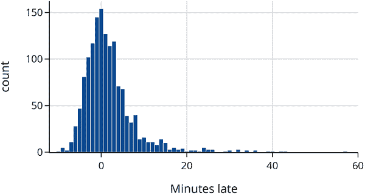
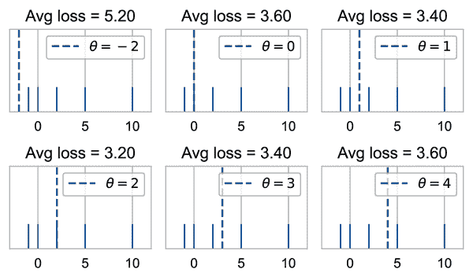
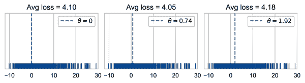
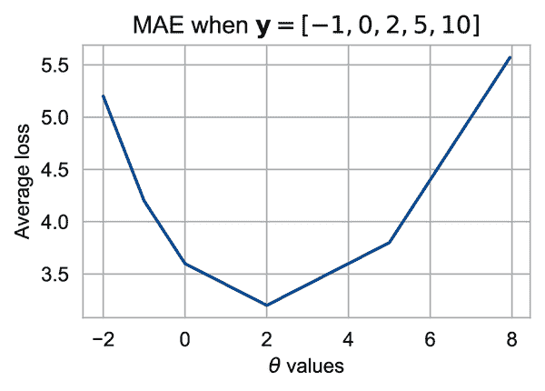
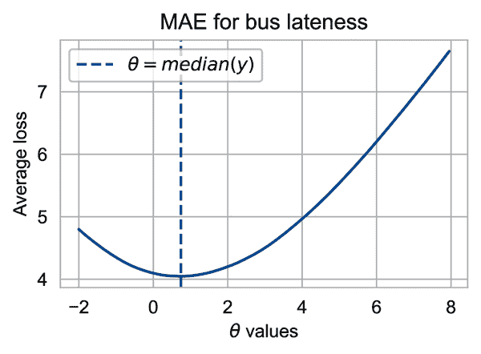
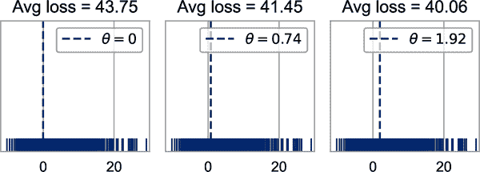
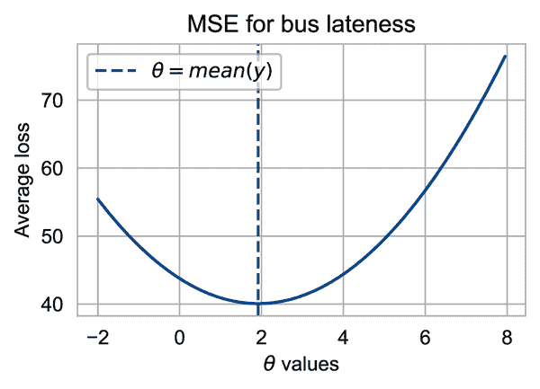

# 第四章：模型与总结统计

我们在第二章中看到了数据范围的重要性，在第三章中看到了数据生成机制的重要性，例如可以用一个瓮模型来表示的机制。瓮模型解决了建模的一个方面：它描述了偶然变化，并确保数据代表了目标。良好的范围和代表性数据为从数据中提取有用信息奠定了基础，这在建模的另一部分中经常被称为数据中的*信号*。我们使用模型来近似这个信号，其中最简单的模型之一是常数模型，其中信号由一个单一数字（如均值或中位数）来近似。其他更复杂的模型总结了数据中特征之间的关系，例如空气质量中的湿度和颗粒物质(第十二章)，社区中的上升流动性和通勤时间(第十五章)，以及动物的身高和体重(第十八章)。这些更复杂的模型也是从数据中构建的近似值。当模型很好地适合数据时，它可以提供对世界的有用近似描述或仅仅是数据的有用描述。

在本章中，我们通过一个*损失*的形式介绍了模型拟合的基础知识。我们演示了如何通过考虑由简单总结描述数据引起的损失来建模数据中的模式，即常数模型。我们在第十六章深入探讨了瓮模型与拟合模型之间的联系，其中我们检查了拟合模型时信号和噪声之间的平衡，并在第十七章中讨论了推断、预测和假设检验的主题。

常数模型让我们可以从*损失最小化*的角度在简单情境中介绍模型拟合，它帮助我们将总结统计（如均值和中位数）与后续章节中的更复杂建模场景联系起来。我们从一个例子开始，该例子使用关于公交车晚点的数据来介绍常数模型。

# 常数模型

一个乘客，Jake，经常在西雅图市中心第三大道和派克街交界处的北行 C 路公交车站乘坐公交车。^(1) 这辆公交车应该每 10 分钟到达一次，但是 Jake 注意到有时候他等车的时间很长。他想知道公交车通常晚到多久。Jake 成功获取了从华盛顿州交通中心获得的公交车的预定到达时间和实际到达时间。根据这些数据，他可以计算每辆公交车晚点到达他所在站点的分钟数：

```py
`times` `=` `pd``.``read_csv``(``'``data/seattle_bus_times_NC.csv``'``)`
`times`

```

|   | 路线 | 方向 | 预定时间 | 实际时间 | 晚到分钟数 |
| --- | --- | --- | --- | --- | --- |
| **0** | C | 北行 | 2016-03-26 06:30:28 | 2016-03-26 06:26:04 | -4.40 |
| **1** | C | 往北 | 2016-03-26 01:05:25 | 2016-03-26 01:10:15 | 4.83 |
| **2** | C | 往北 | 2016-03-26 21:00:25 | 2016-03-26 21:05:00 | 4.58 |
| **...** | ... | ... | ... | ... | ... |
| **1431** | C | 往北 | 2016-04-10 06:15:28 | 2016-04-10 06:11:37 | -3.85 |
| **1432** | C | 往北 | 2016-04-10 17:00:28 | 2016-04-10 16:56:54 | -3.57 |
| **1433** | C | 往北 | 2016-04-10 20:15:25 | 2016-04-10 20:18:21 | 2.93 |

```py
1434 rows × 5 columns
```

数据表中的 `minutes_late` 列记录了每辆公交车的迟到时间。请注意，有些时间是负数，这意味着公交车提前到达。让我们来看一下每辆公交车迟到时间的直方图：

```py
`fig` `=` `px``.``histogram``(``times``,` `x``=``'``minutes_late``'``,` `width``=``450``,` `height``=``250``)`
`fig``.``update_xaxes``(``range``=``[``-``12``,` `60``]``,` `title_text``=``'``Minutes late``'``)`
`fig`

```



我们已经可以在数据中看到一些有趣的模式。例如，许多公交车提前到达，但有些车晚到超过 20 分钟。我们还可以看到明显的众数（高点），在 0 附近，意味着许多公交车大致按时到达。

要了解这条路线上公交车通常晚到多久，我们希望通过一个常数来总结迟到情况 —— 这是一个统计量，一个单一的数字，比如均值、中位数或众数。让我们找到数据表中 `minutes_late` 列的每个这些摘要统计量。

从直方图中，我们估计数据的众数是 0，并使用 Python 计算均值和中位数：

```py
mean:    1.92 mins late
median:  0.74 mins late
mode:    0.00 mins late

```

自然地，我们想知道这些数字中哪一个最能代表迟到的摘要情况。我们不想依赖经验法则，而是采取更正式的方法。我们为公交车迟到建立一个常数模型。让我们称这个常数为 <math><mi>θ</mi></math> （在建模中，<math><mi>θ</mi></math> 通常被称为*参数*）。例如，如果我们考虑 <math><mi>θ</mi> <mo>=</mo> <mn>5</mn></math> ，那么我们的模型大致认为公交车通常晚到五分钟。

现在，<math><mi>θ</mi> <mo>=</mo> <mn>5</mn></math> 并不是一个特别好的猜测。从迟到时间的直方图中，我们看到有更多的点接近 0 而不是 5。但是目前还不清楚 <math><mi>θ</mi> <mo>=</mo> <mn>0</mn></math>（众数）是否比 <math><mi>θ</mi> <mo>=</mo> <mn>0.74</mn></math>（中位数）、<math><mi>θ</mi> <mo>=</mo> <mn>1.92</mn></math>（均值）或者完全不同的其他值更好。为了在不同的 <math><mi>θ</mi></math> 值之间做出选择，我们希望给每个 <math><mi>θ</mi></math> 值分配一个评分，以衡量这个常数如何与数据匹配。换句话说，我们希望评估用常数近似数据所涉及的损失，比如 <math><mi>θ</mi> <mo>=</mo> <mn>5</mn></math> 。而理想情况下，我们希望选择最能匹配我们数据的常数，也就是具有最小损失的常数。在下一节中，我们将更正式地描述损失，并展示如何使用它来拟合模型。

# 最小化损失

我们想要通过一个常数来模拟北向 C 路线的延迟，这个常数我们称之为<math><mi>θ</mi></math>，并且我们想要利用每辆公交车实际延迟的分钟数的数据来找出一个合适的<math><mi>θ</mi></math>值。为此，我们使用一个*损失函数*，这个函数衡量我们的常数<math><mi>θ</mi></math>与实际数据之间的差距。

损失函数是一个数学函数，接受<math><mi>θ</mi></math>和数据值<math><mi>y</mi></math>作为输入。它输出一个单一的数字，*损失*，用来衡量<math><mi>θ</mi></math>和<math><mi>y</mi></math>之间的距离。我们将损失函数写成<math><mrow><mi mathvariant="script">l</mi></mrow> <mo stretchy="false">(</mo> <mi>θ</mi> <mo>,</mo> <mi>y</mi> <mo stretchy="false">)</mo></math>。

按照惯例，损失函数对于较好的<math><mi>θ</mi></math>值输出较低的值，对于较差的<math><mi>θ</mi></math>值输出较大的值。为了使常数适应我们的数据，我们选择产生所有<math><mi>θ</mi></math>选择下平均损失最低的特定<math><mi>θ</mi></math>。换句话说，我们找到*最小化数据平均损失*的<math><mi>θ</mi></math>，其中<math><msub><mi>y</mi> <mn>1</mn></msub> <mo>,</mo> <mo>…</mo> <mo>,</mo> <msub><mi>y</mi> <mi>n</mi></msub></math> 。更正式地，我们将平均损失写为<math><mi>L</mi> <mo stretchy="false">(</mo> <mi>θ</mi> <mo>,</mo> <msub><mi>y</mi> <mn>1</mn></msub> <mo>,</mo> <msub><mi>y</mi> <mn>2</mn></msub> <mo>,</mo> <mo>…</mo> <mo>,</mo> <msub><mi>y</mi> <mi>n</mi></msub> <mo stretchy="false">)</mo></math>，其中：

<math display="block"><mtable columnalign="right" columnspacing="0em" displaystyle="true" rowspacing="3pt"><mtr><mtd><mtable columnalign="right left" columnspacing="0em" displaystyle="true" rowspacing="3pt"><mtr><mtd><mi>L</mi> <mo stretchy="false">(</mo> <mi>θ</mi> <mo>,</mo> <msub><mi>y</mi> <mn>1</mn></msub> <mo>,</mo> <msub><mi>y</mi> <mn>2</mn></msub> <mo>,</mo> <mo>…</mo> <mo>,</mo> <msub><mi>y</mi> <mi>n</mi></msub> <mo stretchy="false">)</mo></mtd> <mtd><mo>=</mo> <mtext>mean</mtext> <mrow><mo>{</mo> <mrow><mi mathvariant="script">l</mi></mrow> <mo stretchy="false">(</mo> <mi>θ</mi> <mo>,</mo> <msub><mi>y</mi> <mn>1</mn></msub> <mo stretchy="false">)</mo> <mo>,</mo> <mrow><mi mathvariant="script">l</mi></mrow> <mo stretchy="false">(</mo> <mi>θ</mi> <mo>,</mo> <msub><mi>y</mi> <mn>2</mn></msub> <mo stretchy="false">)</mo> <mo>,</mo> <mo>…</mo> <mo>,</mo> <mrow><mi mathvariant="script">l</mi></mrow> <mo stretchy="false">(</mo> <mi>θ</mi> <mo>,</mo> <msub><mi>y</mi> <mi>n</mi></msub> <mo stretchy="false">)</mo> <mo>}</mo></mrow></mtd></mtr> <mtr><mtd><mo>=</mo> <mfrac><mn>1</mn> <mi>n</mi></mfrac> <munderover><mo>∑</mo> <mrow><mi>i</mi> <mo>=</mo> <mn>1</mn></mrow> <mrow><mi>n</mi></mrow></munderover> <mrow><mi mathvariant="script">l</mi></mrow> <mo stretchy="false">(</mo> <mi>θ</mi> <mo>,</mo> <msub><mi>y</mi> <mi>i</mi></msub> <mo stretchy="false">)</mo></mtd></mtr></mtable></mtd></mtr></mtable></math>

作为简写，我们经常使用向量<math><mrow><mi mathvariant="bold">y</mi></mrow> <mo>=</mo> <mo stretchy="false">[</mo> <msub><mi>y</mi> <mn>1</mn></msub> <mo>,</mo> <msub><mi>y</mi> <mn>2</mn></msub> <mo>,</mo> <mo>…</mo> <mo>,</mo> <msub><mi>y</mi> <mi>n</mi></msub> <mo stretchy="false">]</mo></math>。然后我们可以将平均损失写为：

<math display="block"><mtable columnalign="right" columnspacing="0em" displaystyle="true" rowspacing="3pt"><mtr><mtd><mi>L</mi> <mo stretchy="false">(</mo> <mi>θ</mi> <mo>,</mo> <mrow><mi mathvariant="bold">y</mi></mrow> <mo stretchy="false">)</mo> <mo>=</mo> <mfrac><mn>1</mn> <mi>n</mi></mfrac> <munderover><mo>∑</mo> <mrow><mi>i</mi> <mo>=</mo> <mn>1</mn></mrow> <mrow><mi>n</mi></mrow></munderover> <mrow><mi mathvariant="script">l</mi></mrow> <mo stretchy="false">(</mo> <mi>θ</mi> <mo>,</mo> <mrow><msub><mi>y</mi> <mi>i</mi></msub></mrow> <mo stretchy="false">)</mo></mtd></mtr></mtable></math>

###### 注意

注意，<math><mrow><mi mathvariant="script">l</mi></mrow> <mo stretchy="false">(</mo> <mi>θ</mi> <mo>,</mo> <mi>y</mi> <mo stretchy="false">)</mo></math> 告诉我们模型对单个数据点的损失，而<math><mi>L</mi> <mo stretchy="false">(</mo> <mi>θ</mi> <mo>,</mo> <mrow><mi mathvariant="bold">y</mi></mrow> <mo stretchy="false">)</mo></math> 给出模型对所有数据点的平均损失。大写的<math><mi>L</mi></math>帮助我们记住平均损失结合了多个较小的<math><mi mathvariant="script">l</mi></math>值。

一旦我们定义了一个损失函数，我们可以找到产生最小平均损失的 <math><mi>θ</mi></math> 值。我们称这个最小化的值为 <math><mrow><mover><mi>θ</mi> <mo stretchy="false">^</mo></mover></mrow></math> 。换句话说，对于所有可能的 <math><mi>θ</mi></math> 值，<math><mrow><mover><mi>θ</mi> <mo stretchy="false">^</mo></mover></mrow></math> 是为我们的数据产生最小平均损失的那个值。我们称这个优化过程为*模型拟合*；它找到了适合我们数据的最佳常数模型。

接下来，我们看一下两个特定的损失函数：绝对误差和平方误差。我们的目标是拟合模型并找到每个损失函数的 <math><mrow><mover><mi>θ</mi> <mo stretchy="false">^</mo></mover></mrow></math> 。

## 平均绝对误差

我们从*绝对误差*损失函数开始。这里是绝对损失背后的理念。对于某个 <math><mi>θ</mi></math> 值和数据值 <math><mi>y</mi></math> ：

1.  找到误差，<math><mi>y</mi> <mo>−</mo> <mi>θ</mi></math> 。

1.  取误差的绝对值，<math><mo stretchy="false">|</mo> <mi>y</mi> <mo>−</mo> <mi>θ</mi> <mo stretchy="false">|</mo></math> 。

因此，损失函数为 <math><mrow><mi mathvariant="script">l</mi></mrow> <mo stretchy="false">(</mo> <mi>θ</mi> <mo>,</mo> <mi>y</mi> <mo stretchy="false">)</mo> <mo>=</mo> <mrow><mo stretchy="false">|</mo></mrow> <mi>y</mi> <mo>−</mo> <mi>θ</mi> <mo stretchy="false">|</mo></math> 。

取误差的绝对值是将负误差转换为正误差的简单方法。例如，点 <math><mi>y</mi> <mo>=</mo> <mn>4</mn></math> 距离 <math><mi>θ</mi> <mo>=</mo> <mn>2</mn></math> 和 <math><mi>θ</mi> <mo>=</mo> <mn>6</mn></math> 同样远，因此误差是同样“糟糕”的。

平均绝对误差被称为*平均绝对误差*（MAE）。MAE 是每个单独绝对误差的平均值：

<math display="block"><mi>L</mi> <mo stretchy="false">(</mo> <mi>θ</mi> <mo>,</mo> <mrow><mrow><mi mathvariant="bold">y</mi></mrow></mrow> <mo stretchy="false">)</mo> <mo>=</mo> <mfrac><mn>1</mn> <mi>n</mi></mfrac> <munderover><mo>∑</mo> <mrow><mi>i</mi> <mo>=</mo> <mn>1</mn></mrow> <mrow><mi>n</mi></mrow></munderover> <mrow><mo stretchy="false">|</mo></mrow> <msub><mi>y</mi> <mi>i</mi></msub> <mo>−</mo> <mi>θ</mi> <mo stretchy="false">|</mo></math>

注意，MAE 的名称告诉你如何计算它：取误差的绝对值的平均值，<math><mo fence="false" stretchy="false">{</mo> <msub><mi>y</mi> <mi>i</mi></msub> <mo>−</mo> <mi>θ</mi> <mo fence="false" stretchy="false">}</mo></math> 。

我们可以编写一个简单的 Python 函数来计算这个损失：

```py
`def` `mae_loss``(``theta``,` `y_vals``)``:`
    `return` `np``.``mean``(``np``.``abs``(``y_vals` `-` `theta``)``)`

```

让我们看看当我们只有五个数据点 <math><mo stretchy="false">[</mo> <mrow><mo>–</mo></mrow> <mn>1</mn> <mo>,</mo> <mn>0</mn> <mo>,</mo> <mn>2</mn> <mo>,</mo> <mn>5</mn> <mo>,</mo> <mn>10</mn> <mo stretchy="false">]</mo></math> 时，这个损失函数的表现。我们可以尝试不同的 <math><mi>θ</mi></math> 值，并查看每个值对应的 MAE 输出：



我们建议通过手工验证一些这些损失值，以确保您理解如何计算 MAE。

在我们尝试的<math><mi>θ</mi></math>值中，我们发现<math><mi>θ</mi><mo>=</mo><mn>2</mn></math>具有最低的平均绝对误差。对于这个简单的例子，2 是数据值的中位数。这不是巧合。现在让我们来检查公交晚点时间原始数据的平均损失是多少，当我们将<math><mi>θ</mi></math>设置为分钟数的众数、中位数和平均数时，分别得到的 MAE 为：



我们再次看到中位数（中间图）比众数和平均数（左图和右图）有更小的损失。事实上，对于绝对损失，最小化的<math><mrow><mover><mi>θ</mi><mo stretchy="false">^</mo></mover></mrow></math>是<math><mtext>中位数</mtext><mo fence="false" stretchy="false">{</mo><msub><mi>y</mi><mn>1</mn></msub><mo>,</mo><msub><mi>y</mi><mn>2</mn></msub><mo>,</mo><mo>…</mo><mo>,</mo><msub><mi>y</mi><mi>n</mi></msub><mo fence="false" stretchy="false">}</mo></math>。

到目前为止，我们通过简单尝试几个值并选择最小损失的值来找到了<math><mi>θ</mi></math>的最佳值。为了更好地理解<math><mi>θ</mi></math>的 MAE 作为函数的情况，我们可以尝试更多的<math><mi>θ</mi></math>值，并绘制一条曲线，显示<math><mi>L</mi><mo stretchy="false">(</mo><mi>θ</mi><mo>,</mo><mrow><mrow><mi mathvariant="bold">y</mi></mrow></mrow><mo stretchy="false">)</mo></math>随<math><mi>θ</mi></math>变化的情况。我们为前述的五个数据值<math><mo stretchy="false">[</mo><mrow><mo>–</mo></mrow><mn>1</mn><mo>,</mo><mn>0</mn><mo>,</mo><mn>2</mn><mo>,</mo><mn>5</mn><mo>,</mo><mn>10</mn><mo stretchy="false">]</mo></math>绘制了这条曲线：



前面的图表显示，实际上<math><mi>θ</mi><mo>=</mo><mn>2</mn></math>是这五个值的最佳选择。请注意曲线的形状。它是分段线性的，线段在数据值（–1, 0, 2 和 5）的位置连接。这是绝对值函数的特性。对于大量数据，平坦部分不那么明显。我们的公交数据有超过 1400 个数据点，MAE 曲线看起来更加平滑：



我们可以利用这个图来确认数据的中位数是最小化值；换句话说，<math><mrow><mover><mi>θ</mi><mo stretchy="false">^</mo></mover></mrow><mo>=</mo><mn>0.74</mn></math>。这个图不是真正的证明，但希望它足够令你信服。

接下来，让我们看看另一个平方误差的损失函数。

## 均方误差

我们已经将常数模型拟合到我们的数据中，并发现使用均方误差时，最小化器是中位数。现在我们将保持模型不变，但切换到不同的损失函数：平方误差。我们不再取每个数据值<math><mi>y</mi></math>和常数<math><mi>θ</mi></math>之间的绝对差值，而是将误差平方。也就是说，对于某个<math><mi>θ</mi></math>值和数据值<math><mi>y</mi></math>：

1.  找到误差，<math><mi>y</mi> <mo>−</mo> <mi>θ</mi></math>。

1.  计算误差的平方，<math><mo stretchy="false">(</mo> <mi>y</mi> <mo>−</mo> <mi>θ</mi> <msup><mo stretchy="false">)</mo> <mn>2</mn></msup></math>。

这给出了损失函数<math><mrow><mi mathvariant="script">l</mi></mrow> <mo stretchy="false">(</mo> <mi>θ</mi> <mo>,</mo> <mi>y</mi> <mo stretchy="false">)</mo> <mo>=</mo> <mo stretchy="false">(</mo> <mi>y</mi> <mo>−</mo> <mi>θ</mi> <msup><mo stretchy="false">)</mo> <mn>2</mn></msup></math>。

与以往一样，我们希望利用所有数据来找到最佳的<math><mi>θ</mi></math>，因此我们计算均方误差，简称为 MSE：

<math display="block"><mi>L</mi> <mo stretchy="false">(</mo> <mi>θ</mi> <mo>,</mo> <mrow><mrow><mi mathvariant="bold">y</mi></mrow></mrow> <mo stretchy="false">)</mo> <mo>=</mo> <mi>L</mi> <mo stretchy="false">(</mo> <mi>θ</mi> <mo>,</mo> <msub><mi>y</mi> <mn>1</mn></msub> <mo>,</mo> <msub><mi>y</mi> <mn>2</mn></msub> <mo>,</mo> <mo>…</mo> <mo>,</mo> <msub><mi>y</mi> <mi>n</mi></msub> <mo stretchy="false">)</mo> <mo>=</mo> <mfrac><mn>1</mn> <mi>n</mi></mfrac> <munderover><mo>∑</mo> <mrow><mi>i</mi> <mo>=</mo> <mn>1</mn></mrow> <mrow><mi>n</mi></mrow></munderover> <mo stretchy="false">(</mo> <msub><mi>y</mi> <mi>i</mi></msub> <mo>−</mo> <mi>θ</mi> <msup><mo stretchy="false">)</mo> <mn>2</mn></msup></math>

我们可以编写一个简单的 Python 函数来计算 MSE：

```py
`def` `mse_loss``(``theta``,` `y_vals``)``:`
    `return` `np``.``mean``(``(``y_vals` `-` `theta``)` `*``*` `2``)`

```

让我们再次尝试均值、中位数和众数作为 MSE 的潜在最小化器：



现在，当我们使用 MSE 损失来拟合常数模型时，我们发现均值（右图）的损失小于中位数和众数（左图和中图）。

让我们绘制给定数据的不同<math><mi>θ</mi></math>值的 MSE 曲线。曲线显示最小化值<math><mrow><mover><mi>θ</mi> <mo stretchy="false">^</mo></mover></mrow></math>接近 2：



这条曲线的一个特点是，与 MAE 相比，MSE 增长得非常迅速（注意纵轴上的范围）。这种增长与平方误差的性质有关；它对远离<math><mi>θ</mi></math>的数据值施加了更高的损失。如果<math><mi>θ</mi> <mo>=</mo> <mn>10</mn></math>且<math><mi>y</mi> <mo>=</mo> <mn>110</mn></math>，则平方损失为<math><mo stretchy="false">(</mo> <mn>10</mn> <mo>−</mo> <mn>110</mn> <msup><mo stretchy="false">)</mo> <mn>2</mn></msup> <mo>=</mo> <mn>10</mn> <mo>,</mo> <mn>000</mn></math>，而绝对损失为<math><mo stretchy="false">|</mo> <mn>10</mn> <mo>−</mo> <mn>110</mn> <mrow><mo stretchy="false">|</mo></mrow> <mo>=</mo> <mn>100</mn></math>。因此，MSE 对异常大的数据值更为敏感。

从均方误差曲线来看，最小化的 <math><mrow><mover><mi>θ</mi> <mo stretchy="false">^</mo></mover></mrow></math> 看起来是 <math><mrow><mi mathvariant="bold">y</mi></mrow></math> 的均值。同样，这不是巧合；数据的均值总是与平方误差的 <math><mrow><mover><mi>θ</mi> <mo stretchy="false">^</mo></mover></mrow></math> 相符。我们展示了这是如何从均方误差的二次特性推导出来的。在此过程中，我们展示了平方损失作为方差和偏差项之和的常见表示，这是模型拟合中的核心。首先，我们在损失函数中添加和减去 <math><mrow><mover><mi>y</mi> <mo stretchy="false">¯</mo></mover></mrow></math> ，并展开平方如下：

<math display="block"><mtable columnalign="right" columnspacing="0em" displaystyle="true" rowspacing="3pt"><mtr><mtd><mtable columnalign="right left" columnspacing="0em" displaystyle="true" rowspacing="3pt"><mtr><mtd><mi>L</mi> <mo stretchy="false">(</mo> <mi>θ</mi> <mo>,</mo> <mrow><mi mathvariant="bold">y</mi></mrow> <mo stretchy="false">)</mo></mtd> <mtd><mo>=</mo> <mfrac><mn>1</mn> <mi>n</mi></mfrac> <munderover><mo>∑</mo> <mrow><mi>i</mi> <mo>=</mo> <mn>1</mn></mrow> <mrow><mi>n</mi></mrow></munderover> <mo stretchy="false">(</mo> <msub><mi>y</mi> <mi>i</mi></msub> <mo>−</mo> <mi>θ</mi> <msup><mo stretchy="false">)</mo> <mn>2</mn></msup></mtd></mtr> <mtr><mtd><mo>=</mo> <mfrac><mn>1</mn> <mi>n</mi></mfrac> <munderover><mo>∑</mo> <mrow><mi>i</mi> <mo>=</mo> <mn>1</mn></mrow> <mrow><mi>n</mi></mrow></munderover> <mo stretchy="false">[</mo> <mo stretchy="false">(</mo> <msub><mi>y</mi> <mi>i</mi></msub> <mo>−</mo> <mrow><mover><mi>y</mi> <mo stretchy="false">¯</mo></mover></mrow> <mo stretchy="false">)</mo> <mo>+</mo> <mo stretchy="false">(</mo> <mrow><mover><mi>y</mi> <mo stretchy="false">¯</mo></mover></mrow> <mo>−</mo> <mi>θ</mi> <mo stretchy="false">)</mo> <msup><mo stretchy="false">]</mo> <mn>2</mn></msup></mtd></mtr> <mtr><mtd><mo>=</mo> <mfrac><mn>1</mn> <mi>n</mi></mfrac> <munderover><mo>∑</mo> <mrow><mi>i</mi> <mo>=</mo> <mn>1</mn></mrow> <mrow><mi>n</mi></mrow></munderover> <mo stretchy="false">[</mo> <mo stretchy="false">(</mo> <msub><mi>y</mi> <mi>i</mi></msub> <mo>−</mo> <mrow><mover><mi>y</mi> <mo stretchy="false">¯</mo></mover></mrow> <msup><mo stretchy="false">)</mo> <mn>2</mn></msup> <mo>+</mo> <mn>2</mn> <mo stretchy="false">(</mo> <msub><mi>y</mi> <mi>i</mi></msub> <mo>−</mo> <mrow><mover><mi>y</mi> <mo stretchy="false">¯</mo></mover></mrow> <mo stretchy="false">)</mo> <mo stretchy="false">(</mo> <mrow><mover><mi>y</mi> <mo stretchy="false">¯</mo></mover></mrow> <mo>−</mo> <mi>θ</mi> <mo stretchy="false">)</mo> <mo>+</mo> <mo stretchy="false">(</mo> <mrow><mover><mi>y</mi> <mo stretchy="false">¯</mo></mover></mrow> <mo>−</mo> <mi>θ</mi> <msup><mo stretchy="false">)</mo> <mn>2</mn></msup> <mo stretchy="false">]</mo></mtd></mtr></mtable></mtd></mtr></mtable></math>

接下来，我们将均方误差分解为这三个项的和，并注意中间项为 0，这是由于平均数的简单性质：<math><mo>∑</mo> <mo stretchy="false">(</mo> <msub><mi>y</mi> <mi>i</mi></msub> <mo>−</mo> <mrow><mover><mi>y</mi> <mo stretchy="false">¯</mo></mover></mrow> <mo stretchy="false">)</mo> <mo>=</mo> <mn>0</mn></math> ：

<math display="block"><mtable columnalign="right" columnspacing="0em" displaystyle="true" rowspacing="3pt"><mtr><mtd><mtable columnalign="right left" columnspacing="0em" displaystyle="true" rowspacing="3pt"><mtr><mtd><mfrac><mn>1</mn> <mi>n</mi></mfrac> <munderover><mo>∑</mo> <mrow><mi>i</mi> <mo>=</mo> <mn>1</mn></mrow> <mrow><mi>n</mi></mrow></munderover></mtd> <mtd><mo stretchy="false">(</mo> <msub><mi>y</mi> <mi>i</mi></msub> <mo>−</mo> <mrow><mover><mi>y</mi> <mo stretchy="false">¯</mo></mover></mrow> <msup><mo stretchy="false">)</mo> <mn>2</mn></msup> <mo>+</mo> <mfrac><mn>1</mn> <mi>n</mi></mfrac> <munderover><mo>∑</mo> <mrow><mi>i</mi> <mo>=</mo> <mn>1</mn></mrow> <mrow><mi>n</mi></mrow></munderover> <mn>2</mn> <mo stretchy="false">(</mo> <msub><mi>y</mi> <mi>i</mi></msub> <mo>−</mo> <mrow><mover><mi>y</mi> <mo stretchy="false">¯</mo></mover></mrow> <mo stretchy="false">)</mo> <mo stretchy="false">(</mo> <mrow><mover><mi>y</mi> <mo stretchy="false">¯</mo></mover></mrow> <mo>−</mo> <mi>θ</mi> <mo stretchy="false">)</mo> <mo>+</mo> <mfrac><mn>1</mn> <mi>n</mi></mfrac> <munderover><mo>∑</mo> <mrow><mi>i</mi> <mo>=</mo> <mn>1</mn></mrow> <mrow><mi>n</mi></mrow></munderover> <mo stretchy="false">(</mo> <mrow><mover><mi>y</mi> <mo stretchy="false">¯</mo></mover></mrow> <mo>−</mo> <mi>θ</mi> <msup><mo stretchy="false">)</mo> <mn>2</mn></msup></mtd></mtr> <mtr><mtd><mo>=</mo> <mfrac><mn>1</mn> <mi>n</mi></mfrac> <munderover><mo>∑</mo> <mrow><mi>i</mi> <mo>=</mo> <mn>1</mn></mrow> <mrow><mi>n</mi></mrow></munderover> <mo stretchy="false">(</mo> <msub><mi>y</mi> <mi>i</mi></msub> <mo>−</mo> <mrow><mover><mi>y</mi> <mo stretchy="false">¯</mo></mover></mrow> <msup><mo stretchy="false">)</mo> <mn>2</mn></msup> <mo>+</mo> <mn>2</mn> <mo stretchy="false">(</mo> <mrow><mover><mi>y</mi> <mo stretchy="false">¯</mo></mover></mrow> <mo>−</mo> <mi>θ</mi> <mo stretchy="false">)</mo> <mfrac><mn>1</mn> <mi>n</mi></mfrac> <munderover><mo>∑</mo> <mrow><mi>i</mi> <mo>=</mo> <mn>1</mn></mrow> <mrow><mi>n</mi></mrow></munderover> <mo stretchy="false">(</mo> <msub><mi>y</mi> <mi>i</mi></msub> <mo>−</mo> <mrow><mover><mi>y</mi> <mo stretchy="false">¯</mo></mover></mrow> <mo stretchy="false">)</mo> <mo>+</mo> <mfrac><mn>1</mn> <mi>n</mi></mfrac> <munderover><mo>∑</mo> <mrow><mi>i</mi> <mo>=</mo> <mn>1</mn></mrow> <mrow><mi>n</mi></mrow></munderover> <mo stretchy="false">(</mo> <mrow><mover><mi>y</mi> <mo stretchy="false">¯</mo></mover></mrow> <mo>−</mo> <mi>θ</mi> <msup><mo stretchy="false">)</mo> <mn>2</mn></msup></mtd></mtr> <mtr><mtd><mo>=</mo> <mfrac><mn>1</mn> <mi>n</mi></mfrac> <munderover><mo>∑</mo> <mrow><mi>i</mi> <mo>=</mo> <mn>1</mn></mrow> <mrow><mi>n</mi></mrow></munderover> <mo stretchy="false">(</mo> <msub><mi>y</mi> <mi>i</mi></msub> <mo>−</mo> <mrow><mover><mi>y</mi> <mo stretchy="false">¯</mo></mover></mrow> <msup><mo stretchy="false">)</mo> <mn>2</mn></msup> <mo>+</mo> <mo stretchy="false">(</mo> <mrow><mover><mi>y</mi> <mo stretchy="false">¯</mo></mover></mrow> <mo>−</mo> <mi>θ</mi> <msup><mo stretchy="false">)</mo> <mn>2</mn></msup></mtd></mtr></mtable></mtd></mtr></mtable></math>

在剩余的两个术语中，第一个不涉及 <math><mi>θ</mi></math> 。你可能认识到它是数据的方差。第二个术语始终为非负。它称为*偏差平方*。第二个术语，偏差平方，在 <math><mrow><mrow><mover><mi>θ</mi></mover></mrow></mrow> <mo>=</mo> <mrow><mrow><mover><mi>y</mi> <mo stretchy="false">¯</mo></mover></mrow></mrow></math> 时为 0，因此 <math><mrow><mover><mi>θ</mi> <mo stretchy="false">^</mo></mover></mrow></math> 给出任何数据集的最小均方误差。

我们已经看到，对于绝对损失，最好的常数模型是中位数，但对于平方误差，是均值。选择损失函数是模型拟合的一个重要方面。

## 选择损失函数

现在我们已经处理了两个损失函数，我们可以回到最初的问题：我们如何选择使用中位数、均值或模式？由于这些统计量最小化不同的损失函数，^(2) 我们可以等价地问：对于我们的问题，什么是最合适的损失函数？为了回答这个问题，我们看一下问题的背景。

与平均绝对误差（MAE）相比，均方误差（MSE）在公交车迟到（或提前）很多时会导致特别大的损失。希望了解典型迟到时间的公交车乘客会使用 MAE 和中位数（晚 0.74 分钟），但是讨厌意外大迟到时间的乘客可能会用均方误差和均值（晚 1.92 分钟）来总结数据。

如果我们想进一步优化模型，我们可以使用更专业的损失函数。例如，假设公交车提前到达时会在站点等待直到预定出发时间；那么我们可能希望将早到视为 0 损失。如果一个非常迟到的公交车比一个中度迟到的公交车更加令人恼火，我们可能会选择一个*非对称损失函数*，对超级迟到的惩罚更大。

实质上，在选择损失函数时上下文很重要。通过仔细考虑我们计划如何使用模型，我们可以选择一个有助于我们做出良好数据驱动决策的损失函数。

# 总结

我们介绍了恒定模型：一个通过单一值汇总数据的模型。为了拟合恒定模型，我们选择了一个度量给定常数与数据值匹配程度的损失函数，并计算所有数据值的平均损失。我们发现，根据损失函数的选择，我们得到不同的最小化值：我们发现平均值最小化平均平方误差（MSE），中位数最小化平均绝对误差（MAE）。我们还讨论了如何结合问题的上下文和知识来选择损失函数。

将模型拟合到损失最小化的概念将简单的汇总统计数据（如平均数、中位数和众数）与更复杂的建模情况联系起来。我们在建模数据时采取的步骤适用于许多建模场景：

1.  选择模型的形式（例如恒定模型）。

1.  选择一个损失函数（如绝对误差）。

1.  通过最小化所有数据的损失来拟合模型（如平均损失）。

在本书的其余部分，我们的建模技术扩展到这些步骤的一个或多个。我们引入新模型、新损失函数和新的最小化损失技术。第五章 重新审视了公交车晚点到达站点的研究。这一次，我们将问题呈现为案例研究，并访问数据科学生命周期的所有阶段。通过经历这些阶段，我们做出了一些不同寻常的发现；当我们通过考虑数据范围并使用瓮来模拟乘客到达公交车站时，我们发现建模公交车迟到不同于建模乘客等待公交车的经验。

^(1) 我们（作者）最初从名为杰克·范德普拉斯的数据科学家的分析中了解到公交到达时间数据。我们以他的名义命名本节的主角。

^(2) 众数最小化了一个称为 0-1 损失的损失函数。尽管我们尚未涵盖这种特定损失，但该过程是相同的：选择损失函数，然后找到最小化损失的内容。
