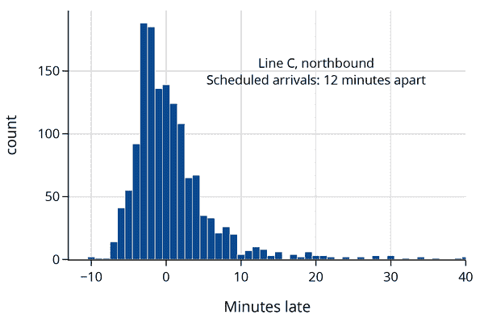

# 第五章 案例研究：为什么我的公交车总是迟到？

Jake VanderPlas 的博客[Pythonic Perambulations](http://jakevdp.github.io)，提供了一个现代数据科学家的生活示例。作为数据科学家，我们在工作中、日常生活中以及个人生活中都看到数据，我们对这些数据可能带来的见解往往很好奇。在这第一个案例研究中，我们借鉴了 Pythonic Perambulations 上的一篇文章["等待时间悖论，或者，为什么我的公交车总是迟到？"](https://oreil.ly/W8Ih5)，来模拟在西雅图街角等公交车的情景。我们涉及数据生命周期的每个阶段，但在这第一个案例研究中，我们的重点是思考问题、数据和模型的过程，而不是数据结构和建模技术。通过持续的模型和模拟研究，我们可以更好地理解这些问题。

VanderPlas 的文章受到他等公交车的经历的启发。等待时间总是比预期的长。这种经历与以下推理不符：如果每 10 分钟就来一辆公交车，并且你在随机时间到达车站，那么平均等待时间应该约为 5 分钟。作者借助华盛顿州交通中心提供的数据，能够研究这一现象。我们也做同样的研究。

我们应用在前几章介绍的概念，从总体问题开始，为什么我的公交车总是迟到？并将这个问题细化为更接近我们目标且可以通过数据调查的问题。然后我们考虑数据的范围，例如这些数据是如何收集的以及潜在的偏倚来源，并准备数据进行分析。我们对数据范围的理解帮助我们设计一个等车模型，我们可以模拟来研究这一现象。

# 问题和范围

我们的研究起源于一个经常乘坐公交车的乘客的经历，他想知道为什么他的公交车总是迟到。我们不是在寻找实际导致公交车迟到的原因，比如交通拥堵或维护延误。相反，我们想研究实际到达时间与计划到达时间之间的差异模式。这些信息将帮助我们更好地理解等待公交车的感受。

公交线路在世界各地甚至城市内部都有所不同，因此我们将调查范围缩小到西雅图市的一个公交车站。我们的数据是关于西雅图快速通行线路 C、D 和 E 在第三大道和派克街的停靠时间，华盛顿州交通中心提供了 2016 年 3 月 26 日至 5 月 27 日这三条公交线路所有实际和计划停靠时间的数据。

考虑到我们狭窄的范围仅限于两个月内一个特定停靠点的公交车，并且我们可以访问在这段时间窗口内收集的所有行政数据，人口、访问框架和样本是相同的。然而，我们可以想象我们的分析可能对西雅图及其以外的其他地点和其他时段也有用。如果我们幸运的话，我们发现的想法或采取的方法可能对他人有用。目前，我们保持狭窄的焦点。

让我们来看看这些数据，以更好地理解它们的结构。

# 数据整理

在开始分析之前，我们检查数据的质量，在可能的情况下简化结构，并导出可能有助于分析的新测量数据。我们在第九章中涵盖了这些操作类型，因此现在不必担心代码的细节。而是专注于清理数据时数据表之间的差异。我们首先将数据加载到 Python 中。

数据表的前几行显示如下：

```py
`bus``.``head``(``3``)`

```

|   | OPD_DATE | VEHICLE_ID | RTE | DIR | ... | STOP_ID | STOP_NAME | SCH_STOP_TM | ACT_STOP_TM |
| --- | --- | --- | --- | --- | --- | --- | --- | --- | --- |
| **0** | 2016-03-26 | 6201 | 673 | S | ... | 431 | 第三大道与派克街 (431) | 01:11:57 | 01:13:19 |
| **1** | 2016-03-26 | 6201 | 673 | S | ... | 431 | 第三大道与派克街 (431) | 23:19:57 | 23:16:13 |
| **2** | 2016-03-26 | 6201 | 673 | S | ... | 431 | 第三大道与派克街 (431) | 21:19:57 | 21:18:46 |

```py
3 rows × 9 columns
```

（原始数据以逗号分隔值的形式存储在文件中，我们已将其加载到此表中；详情请参见第八章。）

看起来表格中一些列可能是多余的，比如标记为`STOP_ID`和`STOP_NAME`的列。我们可以查找唯一值的数量及其计数来确认这一点：

```py
`bus``[``[``'``STOP_ID``'``,``'``STOP_NAME``'``]``]``.``value_counts``(``)`

```

```py
STOP_ID  STOP_NAME              
578      3RD AVE & PIKE ST (578)    19599
431      3RD AVE & PIKE ST (431)    19318
dtype: int64

```

有两个名为 `3RD AVE & PIKE ST` 的停靠点名称。我们想知道它们是否与公交车的行驶方向有关，可以通过方向、停靠点 ID 和停靠点名称的可能组合来检查：

```py
`bus``[``[``'``DIR``'``,``'``STOP_ID``'``,``'``STOP_NAME``'``]``]``.``value_counts``(``)`

```

```py
DIR  STOP_ID  STOP_NAME              
N    578      3RD AVE & PIKE ST (578)    19599
S    431      3RD AVE & PIKE ST (431)    19318
dtype: int64

```

实际上，北方向对应的是停靠点 ID 578，南方向对应的是停靠点 ID 431。由于我们只研究一个停靠点，我们实际上不需要比方向更多的信息。

我们还可以检查唯一路线名称的数量：

```py
673    13228
674    13179
675    12510
Name: RTE, dtype: int64

```

这些路线是按编号排列，并不符合问题描述原文中的 C、D 和 E 的名称。这个问题涉及到数据整理的另一个方面：我们需要找到连接路线字母和数字的信息。我们可以从西雅图公共交通网站获取这些信息。数据整理的另一个部分是将数据值翻译成更容易理解的形式，因此我们用字母替换路线号码：

```py
`def` `clean_stops``(``bus``)``:`
    `return` `bus``.``assign``(`
        `route``=``bus``[``"``RTE``"``]``.``replace``(``{``673``:` `"``C``"``,` `674``:` `"``D``"``,` `675``:` `"``E``"``}``)``,`
        `direction``=``bus``[``"``DIR``"``]``.``replace``(``{``"``N``"``:` `"``northbound``"``,` `"``S``"``:` `"``southbound``"``}``)``,`
    `)`

```

我们还可以在表格中创建新的列，帮助我们进行调查。例如，我们可以使用计划和实际到达时间计算公交车的晚点时间。这需要一些日期和时间格式的处理，这在第九章有介绍。

让我们检查这个新量的值，确保我们的计算是正确的：

```py
 smallest amount late: -12.87 minutes
 greatest amount late:  150.28 minutes
 median amount late:    0.52 minutes

```

公交车晚点有负值有点令人惊讶，但这只是意味着公交车比计划时间提前到达。虽然中位数的晚点只有大约半分钟，但有些公交车晚到 2.5 小时！让我们看一下公交车晚点分钟数的直方图：

```py
`px``.``histogram``(``bus``,` `x``=``"``minutes_late``"``,` `nbins``=``120``,` `width``=``450``,` `height``=``300``,` 
             `labels``=``{``'``minutes_late``'``:``'``Minutes late``'``}``)`

```


我们在第四章也看到了类似形状的直方图。公交车晚点情况的分布高度右偏，但许多车辆准时到达。

最后，我们通过创建数据表的简化版本来结束数据整理工作。因为我们只需要追踪路线、方向、计划和实际到达时间以及公交车的晚点时间，所以我们创建了一个更小的表格，并给列取了一些更易读的名称：

```py
`bus` `=` `bus``[``[``"``route``"``,` `"``direction``"``,` `"``scheduled``"``,` `"``actual``"``,` `"``minutes_late``"``]``]`
`bus``.``head``(``)`

```

|   | 路线 | 方向 | 计划时间 | 实际时间 | 迟到分钟 |
| --- | --- | --- | --- | --- | --- |
| **0** | C | 南行 | 2016-03-26 01:11:57 | 2016-03-26 01:13:19 | 1.37 |
| **1** | C | 南行 | 2016-03-26 23:19:57 | 2016-03-26 23:16:13 | -3.73 |
| **2** | C | 南行 | 2016-03-26 21:19:57 | 2016-03-26 21:18:46 | -1.18 |
| **3** | C | 南行 | 2016-03-26 19:04:57 | 2016-03-26 19:01:49 | -3.13 |
| **4** | C | 南行 | 2016-03-26 16:42:57 | 2016-03-26 16:42:39 | -0.30 |

这些表格操作在第六章有详细介绍。

在我们开始建模公交车晚点之前，我们想要深入探索和学习这些数据。我们接下来会做这件事。

# 探索公交时间

在我们清理和简化数据的过程中，我们对数据有了很多了解，但在开始建模等待时间之前，我们希望深入挖掘，更好地理解公交车晚点现象。我们将焦点缩小到了一个站点（第三大道和派克街口）在两个月内的公交活动上。我们看到公交车晚点的分布呈右偏态，确实有些公交车非常晚。在这个探索阶段，我们可能会问：

+   不同的三条公交线路的晚点分布看起来一样吗？

+   公交车是往北行驶还是往南行驶是否重要？

+   白天时间如何影响公交车的晚点情况？

+   公交车是否按照全天的规律间隔到达？

回答这些问题有助于我们更好地确定建模方法。

回顾一下 第四章 中我们发现的公交车晚点的中位数时间是 3/4 分钟。但这与我们为所有公交线路和方向计算的中位数（1/2 分钟）不符。我们来检查一下是否是由于该章节关注的是北行 C 线路的原因。我们创建每个六种公交线路和方向组合的延误直方图来解决这个问题和我们列表上的前两个问题：


y 轴上的比例尺（或密度）使得比较直方图变得更加容易，因为我们不会被不同组中的计数误导。x 轴上的范围在六个图中是相同的，这样更容易检测到分布的不同中心和扩展。（这些概念在 第十一章 中有描述。）

每条线路的南行和北行分布都不同。当我们深入了解背景时，我们了解到 C 线路起源于北部，而其他两条线路起源于南部。直方图暗示在公交路线的后半段到达时间的变异性较大，这是合理的，因为随着一天的进展，延误会逐渐累积。

接下来，为了探索不同时段的延误情况，我们需要推导一个新的量：公交车计划到达的小时。鉴于我们刚刚看到的路线和方向的变化导致的公交车晚点情况，我们再次为每条线路和方向创建单独的图表：


的确，似乎存在交通高峰时间的影响，而且晚高峰似乎比早高峰更严重。北行 C 线路看起来受到的影响最大。

最后，为了检查公交车的计划频率，我们需要计算计划到达时间之间的间隔。我们在表格中创建一个新列，其中包含北行 C 线路公交车的计划到达时间之间的时间：

```py
`minute` `=` `pd``.``Timedelta``(``'``1 minute``'``)`
`bus_c_n` `=` `(`
    `bus``[``(``bus``[``'``route``'``]` `==` `'``C``'``)` `&` `(``bus``[``'``direction``'``]` `==` `'``northbound``'``)``]`
    `.``sort_values``(``'``scheduled``'``)`
    `.``assign``(``sched_inter``=``lambda` `x``:` `x``[``'``scheduled``'``]``.``diff``(``)` `/` `minute``)`
`)`
`bus_c_n``.``head``(``3``)`

```

|   | 线路 | 方向 | 计划时间 | 实际时间 | 延迟分钟数 | 计划间隔 |
| --- | --- | --- | --- | --- | --- | --- |
| **19512** | C | 北行 | 2016-03-26 00:00:25 | 2016-03-26 00:05:01 | 4.60 | NaN |
| **19471** | C | 北行 | 2016-03-26 00:30:25 | 2016-03-26 00:30:19 | -0.10 | 30.0 |
| **19487** | C | 北行 | 2016-03-26 01:05:25 | 2016-03-26 01:10:15 | 4.83 | 35.0 |

让我们来看一下这些公交车的到站间隔时间分布直方图：

```py
`fig` `=` `px``.``histogram``(``bus_c_n``,` `x``=``'``sched_inter``'``,` 
                   `title``=``"``Bus line C, northbound``"``,`
                   `width``=``450``,` `height``=``300``)`

`fig``.``update_xaxes``(``range``=``[``0``,` `40``]``,` `title``=``"``Time between consecutive buses``"``)`
`fig``.``update_layout``(``margin``=``dict``(``t``=``40``)``)`

```


我们可以看到，公交车在一天中的不同时间段被安排以不同的间隔到达。在这两个月的时间内，大约有 1500 辆公交车被安排在前一辆车后 12 分钟到达，大约有 1400 辆公交车被安排在前一辆车后 15 分钟到达。

在探索数据的过程中，我们学到了很多，并且现在更有能力拟合模型。尤其是，如果我们想要清楚地了解等待公交车的经历，我们需要考虑公交车预定到达之间的间隔，以及公交线路和方向。

# 建模等待时间

我们对建模等待公交车的人的经历很感兴趣。我们可以开发一个涉及预定到达间隔、公交线路和方向的复杂模型。相反，我们采取了更简单的方法，将焦点缩小到一个线路、一个方向和一个预定间隔。我们检查了预定间隔为 12 分钟的 C 线向北站点：

```py
`bus_c_n_12` `=` `bus_c_n``[``bus_c_n``[``'``sched_inter``'``]` `==` `12``]`

```

复杂模型和狭窄方法都是合法的，但我们尚未掌握处理复杂模型的工具（请参阅第十五章了解更多建模细节）。

到目前为止，我们已经检查了公交车晚点的分钟数分布。我们为我们正在分析的数据子集（预定在前一辆公交车到达后 12 分钟的 C 线向北站点）创建了另一个此延迟的直方图：

```py
`fig` `=` `px``.``histogram``(``bus_c_n_12``,` `x``=``'``minutes_late``'``,`
                   `labels``=``{``'``minutes_late``'``:``'``Minutes late``'``}``,`
                   `nbins``=``120``,` `width``=``450``,` `height``=``300``)`

`fig``.``add_annotation``(``x``=``20``,` `y``=``150``,`  `showarrow``=``False``,`
  `text``=``"``Line C, northbound<br>Scheduled arrivals: 12 minutes apart``"` `)`
`fig``.``update_xaxes``(``range``=``[``-``13``,` `40``]``)`
`fig``.``show``(``)`

```



现在让我们计算晚点的最小值、最大值和中位数：

```py
smallest amount late:  -10.20 minutes
greatest amount late:  57.00 minutes
median amount late:    -0.50 minutes

```

有趣的是，C 线向北行驶的公交车，间隔 12 分钟的情况下，更多时候会提前抵达而不是晚点！

现在让我们重新审视我们的问题，确认我们正在答案的正确方向上。仅总结公交车晚点的情况并不能完全解释等待公交车的人的经历。当有人到达公交车站时，他们需要等待下一辆公交车到达。图 5-1 展示了乘客和公交车到达公交车站时时间流逝的理想化图像。如果人们在随机时间到达公交车站，注意到他们更有可能在公交车晚点的时间段到达，因为公交车之间的间隔更长。这种到达模式是大小偏倚抽样的一个例子。因此，要回答等待公交车的人们经历了什么这个问题，我们需要做的不仅仅是总结公交车晚点的情况。


###### 图 5-1\. 理想化时间轴，显示公交车到达（矩形）、乘客到达（圆圈）和乘客等待下一辆公交车到达的时间（大括号）

我们可以设计一个模拟，模拟一天中等待公交车的过程，使用来自第三章的思想。为此，我们设置了一系列从早上 6 点到午夜预定间隔为 12 分钟的公交车到达时间：

```py
`scheduled` `=` `12` `*` `np``.``arange``(``91``)`
`scheduled`

```

```py
array([   0,   12,   24, ..., 1056, 1068, 1080])

```

针对每个预定到达时间，我们通过添加每辆公交车晚点的随机分钟数来模拟其实际到达时间。为此，我们从实际公交车晚点的分布中选择晚点的分钟数。注意，在我们的模拟研究中，我们已经通过使用实际公交车延迟的分布来整合真实数据，这些公交车的间隔为 12 分钟：

```py
`minutes_late` `=` `bus_c_n_12``[``'``minutes_late``'``]`
`actual` `=` `scheduled` `+` `np``.``random``.``choice``(``minutes_late``,` `size``=``91``,` `replace``=``True``)`

```

我们需要对这些到达时间进行排序，因为当一辆公交车迟到很久时，可能会有另一辆公交车在它之前到达：

```py
`actual``.``sort``(``)`
`actual`

```

```py
array([  -1.2 ,   25.37,   32.2 , ..., 1051.02, 1077\.  , 1089.43])

```

我们还需要随机模拟人们在一天中的不同时间到达公交车站的情况。我们可以使用另一个不同的罐子模型来描述乘客的到达情况。对于乘客，我们在罐子里放入带有时间的彩球。这些时间从时间 0 开始，代表上午 6 点，到午夜最后一辆公交车的到达，即从上午 6 点起计算到夜间 1,068 分钟。为了与我们数据中的公交车时间测量方式匹配，我们将这些时间分成每分钟 1/100 的间隔：

```py
`pass_arrival_times` `=` `np``.``arange``(``100``*``1068``)`
`pass_arrival_times` `/` `100`

```

```py
array([   0\.  ,    0.01,    0.02, ..., 1067.97, 1067.98, 1067.99])

```

现在我们可以模拟一天中，例如，五百人在公交车站的到达情况。我们从这个罐子中抽取五百次，每次抽取后替换掉彩球：

```py
`sim_arrival_times` `=` `(`
    `np``.``random``.``choice``(``pass_arrival_times``,` `size``=``500``,` `replace``=``True``)` `/` `100`
`)`
`sim_arrival_times``.``sort``(``)`
`sim_arrival_times`

```

```py
array([   2.06,    3.01,    8.54, ..., 1064\.  , 1064.77, 1066.42])

```

要了解每个人等待多长时间，我们寻找他们采样时间后最快到达的公交车。这两个时间的差值（个人采样时间和其后最快公交车到达时间）就是这个人的等待时间：

```py
`i` `=` `np``.``searchsorted``(``actual``,` `sim_arrival_times``,` `side``=``'``right``'``)`
`sim_wait_times` `=` `actual``[``i``]` `-` `sim_arrival_times`
`sim_wait_times`

```

```py
array([23.31, 22.36, 16.83, ..., 13\.  , 12.23, 10.58])

```

我们可以建立一个完整的模拟，例如模拟两百天的公交车到达，而每天我们模拟五百人在一天中的随机时间到达公交车站。总计是 100,000 次模拟等待时间：

```py
`sim_wait_times` `=` `[``]`

`for` `day` `in` `np``.``arange``(``0``,` `200``,` `1``)``:`
    `bus_late` `=` `np``.``random``.``choice``(``minutes_late``,` `size``=``91``,` `replace``=``True``)`
    `actual` `=` `scheduled` `+` `bus_late`
    `actual``.``sort``(``)`
    `sim_arrival_times` `=` `(`
        `np``.``random``.``choice``(``pass_arrival_times``,` `size``=``500``,` `replace``=``True``)` `/` `100`
    `)`
    `sim_arrival_times``.``sort``(``)`
    `i` `=` `np``.``searchsorted``(``actual``,` `sim_arrival_times``,` `side``=``"``right``"``)`
    `sim_wait_times` `=` `np``.``append``(``sim_wait_times``,` `actual``[``i``]` `-` `sim_arrival_times``)`

```

让我们制作这些模拟等待时间的直方图，以检查其分布情况：

```py
`fig` `=` `px``.``histogram``(``x``=``sim_wait_times``,` `nbins``=``40``,`
                   `histnorm``=``'``probability density``'``,`
                   `width``=``450``,` `height``=``300``)`

`fig``.``update_xaxes``(``title``=``"``Simulated wait times for 100,000 passengers``"``)`
`fig``.``update_yaxes``(``title``=``"``proportion``"``)`
`fig``.``show``(``)`

```


正如我们预期的那样，我们发现了一个偏斜的分布。我们可以用一个常数模型来描述这一点，其中我们使用绝对损失来选择最佳常数。我们在第四章中看到，绝对损失给出了中位数等待时间：

```py
`print``(``f``"``Median wait time:` `{``np``.``median``(``sim_wait_times``)``:``.2f``}` `minutes``"``)`

```

```py
Median wait time: 6.49 minutes

```

中位数约为六分半钟，看起来并不太长。虽然我们的模型捕捉了典型等待时间，但我们也想提供一个过程变异性的估计。这个话题在第十七章中有所涉及。我们可以计算等待时间的上四分位数，以帮助我们了解过程的变异性：

```py
`print``(``f``"``Upper quartile:` `{``np``.``quantile``(``sim_wait_times``,` `0.75``)``:``.2f``}` `minutes``"``)`

```

```py
Upper quartile: 10.62 minutes

```

上四分位数相当大。当你等待超过 10 分钟的公交车时，这无疑是令人难忘的，因为公交车本应每 12 分钟到达一次，但每四次乘车中就有一次会发生这种情况！

# 摘要

在我们的第一个案例研究中，我们已经遍历了数据建模的整个生命周期。也许你会觉得，这样一个简单的问题并不能立即用收集的数据回答。我们需要将公交车的预定到达时间和实际到达时间的数据与乘客在随机时间到达公交车站的模拟研究结合起来，以揭示乘客的等待体验。

这个模拟简化了公交乘车中的许多真实模式。我们关注的是单向行驶的一条公交线路，公交车每隔 12 分钟到达一次。此外，数据的探索显示，迟到的模式与一天中的时间相关，这在我们的分析中尚未考虑。尽管如此，我们的发现仍然是有用的。例如，它们证实了典型的等待时间长于计划间隔的一半。等待时间的分布具有右长尾，意味着乘客的体验可能受到过程中变化的影响。

我们还看到了如何衍生新的量，例如公交车的迟到时间和公交车之间的时间，并探索数据在建模中的实用性。我们的直方图显示，特定的公交线路和方向是重要的，需要加以考虑。我们还发现，随着一天中时间的变化，许多公交车在另一辆车到达后 10、12 和 15 分钟到达，有些则到达频率更高或更分散。这一观察进一步为建模阶段提供了信息。

最后，我们使用了`pandas`和`plotly`等数据工具库，这些将在后面的章节中介绍。我们的重点不在于如何操作表格或创建图表，而是专注于生命周期，将问题与数据连接到建模到结论。在下一章中，我们将转向处理数据表格的实际问题。
