# 第六章：使用 pandas 处理数据框

数据科学家处理存储在表格中的数据。本章介绍了“数据框架”，这是表示数据表的最常用方式之一。我们还介绍了`pandas`，这是处理数据框架的标准 Python 包。以下是一个包含有关流行狗品种信息的数据框架示例：

|   | grooming | food_cost | kids | size |
| --- | --- | --- | --- | --- |
| breed |   |   |   |   |
| --- | --- | --- | --- | --- |
| **拉布拉多寻回犬** | 每周 | 466.0 | 高 | 中型 |
| **德国牧羊犬** | 每周 | 466.0 | 中等 | 大型 |
| **比格犬** | 每天 | 324.0 | 高 | 小型 |
| **金毛寻回犬** | 每周 | 466.0 | 高 | 中型 |
| **约克夏梗** | 每天 | 324.0 | 低 | 小型 |
| **英国斗牛犬** | 每周 | 466.0 | 中等 | 中型 |
| **拳师犬** | 每周 | 466.0 | 高 | 中型 |

在数据框中，每行代表一个单独的记录——在本例中是一个狗品种。每列代表记录的一个特征——例如，grooming 列表示每个狗品种需要多频繁地梳理。

数据框架具有列和行的标签。例如，此数据框架具有一个标记为 grooming 的列和一个标记为德国牧羊犬的行。数据框架的列和行是有序的——我们可以将拉布拉多寻回犬行称为数据框架的第一行。

在列内，数据具有相同的类型。例如，食物成本包含数字，狗的大小由类别组成。但是在行内，数据类型可以不同。

由于这些属性，数据框架使得各种有用的操作成为可能。

###### 注意

数据科学家经常发现自己与使用不同背景的人合作。例如，计算机科学家说数据框中的列表示数据的“特征”，而统计学家则称之为“变量”。

有时，人们使用同一个术语来指代略有不同的概念。在编程中，“数据类型”指的是计算机如何在内部存储数据。例如，Python 中的`size`列具有字符串数据类型。但从统计学的角度来看，`size`列的类型是有序分类数据（序数数据）。我们在第十章中详细讨论了这种具体区别。

在本章中，我们介绍了常见的数据框架操作。数据科学家在 Python 中处理数据框架时使用`pandas`库。首先，我们解释了`pandas`提供的主要对象：`DataFrame`和`Series`类。然后，我们展示如何使用`pandas`执行常见的数据操作任务，如切片、过滤、排序、分组和连接。

# 子集

本节介绍了对数据框进行子集操作的操作。当数据科学家首次读取数据框时，他们通常希望获取计划使用的特定数据子集。例如，数据科学家可以从包含数百列的数据框中*切片*出 10 个相关特征。或者，他们可以*过滤*数据框以删除包含不完整数据的行。在本章的其余部分，我们使用一个婴儿姓名的数据框来演示数据框操作。

## 数据范围和问题

有一篇[2021 年《纽约时报》文章](https://oreil.ly/qL1dt)讨论了哈里王子和梅根·马克尔为他们的新生女儿选择的独特姓名“莉莉贝特”。文章中采访了婴儿姓名专家帕梅拉·雷德蒙德，她谈到了人们如何给孩子取名的有趣趋势。例如，她说以字母“L”开头的名字近年来变得非常流行，而以字母“J”开头的名字在上世纪 70 年代和 80 年代最受欢迎。这些说法在数据中反映出来吗？我们可以使用`pandas`来找出答案。

首先，我们将包导入为`pd`，这是它的常用缩写：

```py
`import` `pandas` `as` `pd`

```

我们有一个婴儿姓名数据集，存储在名为*babynames.csv*的逗号分隔值（CSV）文件中。我们使用`pd.read_csv`函数将文件读取为`pandas.DataFrame`对象：

```py
`baby` `=` `pd``.``read_csv``(``'``babynames.csv``'``)`
`baby`

```

|   | 名称 | 性别 | 计数 | 年份 |
| --- | --- | --- | --- | --- |
| **0** | 利亚姆 | M | 19659 | 2020 |
| **1** | 诺亚 | M | 18252 | 2020 |
| **2** | 奥利弗 | M | 14147 | 2020 |
| **...** | ... | ... | ... | ... |
| **2020719** | 维罗纳 | F | 5 | 1880 |
| **2020720** | 维尔蒂 | F | 5 | 1880 |
| **2020721** | 威尔玛 | F | 5 | 1880 |

```py
2020722 rows × 4 columns
```

`baby`表中的数据来自[美国社会保障局（SSA）](https://oreil.ly/EhTlP)，记录了出生证明目的的婴儿姓名和出生性别。SSA 将婴儿姓名数据提供在其网站上。我们已将此数据加载到`baby`表中。

SSA 网站有一个[页面](https://oreil.ly/jzCVF)，详细描述了数据。在本章中，我们不会深入讨论数据的限制，但我们将指出网站上有关此相关信息：

> 所有姓名均来自于 1879 年后在美国出生的社会保障卡申请。请注意，许多 1937 年之前出生的人从未申请过社会保障卡，因此他们的姓名不包含在我们的数据中。对于那些申请过的人，我们的记录可能不显示出生地，同样，他们的姓名也不包含在我们的数据中。
> 
> 所有数据都来自我们 2021 年 3 月社会保障卡申请记录的 100％样本。

在撰写本文时，重要的一点是指出，SSA 数据集仅提供了男性和女性的二进制选项。我们希望将来像这样的国家数据集能够提供更多包容性选项。

## 数据框和索引

让我们更详细地查看 `baby` 数据帧。数据帧有行和列。每行和列都有一个标签，如 图 6-1 中所示。

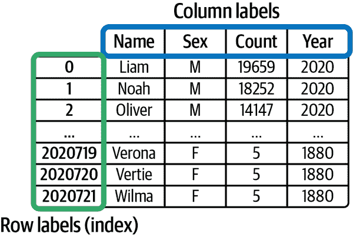

###### 图 6-1\. `baby` 数据帧为行和列都设置了标签（框起来的）

默认情况下，`pandas` 分配的行标签从 0 开始递增。在这种情况下，标记为 `0` 的行和标记为 `Name` 的列的数据为 `'Liam'`。

数据帧的行标签也可以是字符串。图 6-2 显示了一个狗数据的数据帧，其中行标签是字符串。

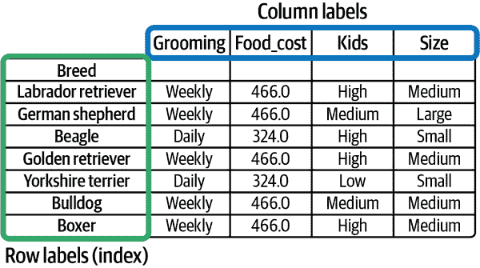

###### 图 6-2\. 数据帧中的行标签也可以是字符串，例如本例中，每行都使用狗品种名称进行标记

行标签有一个特殊的名称。我们称之为数据帧的 *索引*，`pandas` 将行标签存储在特殊的 `pd.Index` 对象中。我们暂时不讨论 `pd.Index` 对象，因为不常操作索引本身。但现在重要的是要记住，即使索引看起来像数据的一列，索引实际上代表行标签，而不是数据。例如，狗品种的数据帧有四列数据，而不是五列，因为索引不算作列。

## 切片

*切片* 是通过从另一个数据帧中取出部分行或列来创建一个新数据帧的操作。想象一下切西红柿——切片可以在垂直和水平方向上进行。在 `pandas` 中进行数据帧切片时，我们使用 `.loc` 和 `.iloc` 属性。让我们从 `.loc` 开始。

这是完整的 `baby` 数据帧：

```py
`baby`

```

|   | Name | Sex | Count | Year |
| --- | --- | --- | --- | --- |
| **0** | Liam | M | 19659 | 2020 |
| **1** | Noah | M | 18252 | 2020 |
| **2** | Oliver | M | 14147 | 2020 |
| **...** | ... | ... | ... | ... |
| **2020719** | Verona | F | 5 | 1880 |
| **2020720** | Vertie | F | 5 | 1880 |
| **2020721** | Wilma | F | 5 | 1880 |

```py
2020722 rows × 4 columns
```

`.loc` 允许我们使用它们的标签选择行和列。例如，要获取标记为 `1` 的行和标记为 `Name` 的列中的数据：

```py
`#        The first argument is the row label`
`#        ↓`
`baby``.``loc``[``1``,` `'``Name``'``]`
`#            ↑`
`#            The second argument is the column label`

```

```py
'Noah'

```

###### 警告

注意，`.loc` 需要使用方括号；运行 `baby.loc(1, 'Name')` 将导致错误。

为了切片多行或列，我们可以使用 Python 切片语法，而不是单独的值：

```py
`baby``.``loc``[``0``:``3``,` `'``Name``'``:``'``Count``'``]`

```

|   | Name | Sex | Count |
| --- | --- | --- | --- |
| **0** | Liam | M | 19659 |
| **1** | Noah | M | 18252 |
| **2** | Oliver | M | 14147 |
| **3** | Elijah | M | 13034 |

要获取整列数据，我们可以将空切片作为第一个参数传递：

```py
`baby``.``loc``[``:``,` `'``Count``'``]`

```

```py
0          19659
1          18252
2          14147
           ...  
2020719        5
2020720        5
2020721        5
Name: Count, Length: 2020722, dtype: int64

```

请注意，这个输出看起来不像一个数据帧，因为它不是。选择数据帧的单行或单列会产生一个 `pd.Series` 对象：

```py
`counts` `=` `baby``.``loc``[``:``,` `'``Count``'``]`
`counts``.``__class__``.``__name__`

```

```py
'Series'

```

什么是`pd.Series`对象和`pd.DataFrame`对象的区别？本质上，`pd.DataFrame`是二维的——它有行和列，代表着数据表。`pd.Series`是一维的——它代表着数据列表。`pd.Series`和`pd.DataFrame`对象有许多共同的方法，但它们实际上代表着两种不同的东西。混淆两者可能会导致错误和混乱。

要选择数据帧的特定列，请将列表传递给`.loc`。以下是原始数据帧：

```py
`baby`

```

|   | 名字 | 性别 | 数量 | 年份 |
| --- | --- | --- | --- | --- |
| **0** | Liam | M | 19659 | 2020 |
| **1** | Noah | M | 18252 | 2020 |
| **2** | Oliver | M | 14147 | 2020 |
| **...** | ... | ... | ... | ... |
| **2020719** | Verona | F | 5 | 1880 |
| **2020720** | Vertie | F | 5 | 1880 |
| **2020721** | Wilma | F | 5 | 1880 |

```py
2020722 rows × 4 columns
```

```py
`# And here's the dataframe with only Name and Year columns`
`baby``.``loc``[``:``,` `[``'``Name``'``,` `'``Year``'``]``]`
`#           └──────┬───────┘`
`#         list of column labels`

```

|   | 名字 | 年份 |
| --- | --- | --- |
| **0** | Liam | 2020 |
| **1** | Noah | 2020 |
| **2** | Oliver | 2020 |
| **...** | ... | ... |
| **2020719** | Verona | 1880 |
| **2020720** | Vertie | 1880 |
| **2020721** | Wilma | 1880 |

```py
2020722 rows × 2 columns
```

选择列非常常见，所以有一种简便写法：

```py
`# Shorthand for baby.loc[:, 'Name']`
`baby``[``'``Name``'``]`

```

```py
0            Liam
1            Noah
2          Oliver
            ...  
2020719    Verona
2020720    Vertie
2020721     Wilma
Name: Name, Length: 2020722, dtype: object

```

```py
`# Shorthand for baby.loc[:, ['Name', 'Count']]`
`baby``[``[``'``Name``'``,` `'``Count``'``]``]`

```

|   | 名字 | 数量 |
| --- | --- | --- |
| **0** | Liam | 19659 |
| **1** | Noah | 18252 |
| **2** | Oliver | 14147 |
| **...** | ... | ... |
| **2020719** | Verona | 5 |
| **2020720** | Vertie | 5 |
| **2020721** | Wilma | 5 |

```py
2020722 rows × 2 columns
```

使用`.iloc`切片与`.loc`类似，不同之处在于`.iloc`使用行和列的*位置*而不是标签。当数据帧索引具有字符串时，演示时最容易显示`.iloc`和`.loc`之间的差异，所以让我们看一个有关狗品种信息的数据帧：

```py
`dogs` `=` `pd``.``read_csv``(``'``dogs.csv``'``,` `index_col``=``'``breed``'``)`
`dogs`

```

|   | 美容 | 食品成本 | 孩子 | 尺寸 |
| --- | --- | --- | --- | --- |
| 品种 |   |   |   |   |
| --- | --- | --- | --- | --- |
| **拉布拉多猎犬** | 每周 | 466.0 | 高 | 中等 |
| **德国牧羊犬** | 每周 | 466.0 | 中等 | 大型 |
| **猎犬** | 每日 | 324.0 | 高 | 小型 |
| **金毛寻回犬** | 每周 | 466.0 | 高 | 中等 |
| **约克夏梗** | 每日 | 324.0 | 低 | 小型 |
| **斗牛犬** | 每周 | 466.0 | 中等 | 中等 |
| **拳师犬** | 每周 | 466.0 | 高 | 中等 |

要通过位置获取前三行和前两列，请使用`.iloc`：

```py
`dogs``.``iloc``[``0``:``3``,` `0``:``2``]`

```

|   | 美容 | 食品成本 |
| --- | --- | --- |
| 品种 |   |   |
| --- | --- | --- |
| **拉布拉多猎犬** | 每周 | 466.0 |
| **德国牧羊犬** | 每周 | 466.0 |
| **猎犬** | 每日 | 324.0 |

使用`.loc`进行相同操作需要使用数据帧标签：

```py
`dogs``.``loc``[``'``Labrador Retriever``'``:``'``Beagle``'``,` `'``grooming``'``:``'``food_cost``'``]`

```

|   | 美容 | 食品成本 |
| --- | --- | --- |
| 品种 |   |   |
| --- | --- | --- |
| **拉布拉多猎犬** | 每周 | 466.0 |
| **德国牧羊犬** | 每周 | 466.0 |
| **猎犬** | 每日 | 324.0 |

接下来，我们将看看如何过滤行。

## 过滤行

到目前为止，我们已经展示了如何使用`.loc`和`.iloc`使用标签和位置来切片数据帧。

然而，数据科学家通常希望*筛选*行——他们希望使用某些条件获取行的子集。假设我们要找到 2020 年最流行的婴儿名字。为此，我们可以筛选行，仅保留`Year`为 2020 的行。

要筛选，我们想要检查`Year`列中的每个值是否等于 1970，然后仅保留这些行。

要比较`Year`中的每个值，我们切出列并进行布尔比较（这与我们在`numpy`数组中所做的类似）。以下是参考数据框：

```py
`baby`

```

|   | 名称 | 性别 | 计数 | 年份 |
| --- | --- | --- | --- | --- |
| **0** | Liam | M | 19659 | 2020 |
| **1** | Noah | M | 18252 | 2020 |
| **2** | Oliver | M | 14147 | 2020 |
| **...** | ... | ... | ... | ... |
| **2020719** | Verona | F | 5 | 1880 |
| **2020720** | Vertie | F | 5 | 1880 |
| **2020721** | Wilma | F | 5 | 1880 |

```py
2020722 rows × 4 columns
```

```py
`# Get a Series with the Year data`
`baby``[``'``Year``'``]`

```

```py
0          2020
1          2020
2          2020
           ... 
2020719    1880
2020720    1880
2020721    1880
Name: Year, Length: 2020722, dtype: int64

```

```py
`# Compare with 2020`
`baby``[``'``Year``'``]` `==` `2020`

```

```py
0           True
1           True
2           True
           ...  
2020719    False
2020720    False
2020721    False
Name: Year, Length: 2020722, dtype: bool

```

注意，对`Series`进行布尔比较会生成布尔`Series`。这几乎等同于：

```py
`is_2020` `=` `[``]`
`for` `value` `in` `baby``[``'``Year``'``]``:`
    `is_2020``.``append``(``value` `==` `2020``)`

```

但布尔比较比`for`循环更容易编写，执行起来也更快。

现在告诉`pandas`仅保留评估为`True`的行：

```py
`baby``.``loc``[``baby``[``'``Year``'``]` `==` `2020``,` `:``]`

```

|   | 名称 | 性别 | 计数 | 年份 |
| --- | --- | --- | --- | --- |
| **0** | Liam | M | 19659 | 2020 |
| **1** | Noah | M | 18252 | 2020 |
| **2** | Oliver | M | 14147 | 2020 |
| **...** | ... | ... | ... | ... |
| **31267** | Zylynn | F | 5 | 2020 |
| **31268** | Zynique | F | 5 | 2020 |
| **31269** | Zynlee | F | 5 | 2020 |

```py
31270 rows × 4 columns
```

###### 提示

将布尔`Series`传递到`.loc`中，仅保留`Series`具有`True`值的行。

筛选有简写方式。这将计算与前面代码段相同的表，但不使用`.loc`：

```py
`baby``[``baby``[``'``Year``'``]` `==` `2020``]`

```

|   | 名称 | 性别 | 计数 | 年份 |
| --- | --- | --- | --- | --- |
| **0** | Liam | M | 19659 | 2020 |
| **1** | Noah | M | 18252 | 2020 |
| **2** | Oliver | M | 14147 | 2020 |
| **...** | ... | ... | ... | ... |
| **31267** | Zylynn | F | 5 | 2020 |
| **31268** | Zynique | F | 5 | 2020 |
| **31269** | Zynlee | F | 5 | 2020 |

```py
31270 rows × 4 columns
```

最后，为了找到 2020 年最常见的名字，请按降序排列数据框中的`Count`。将较长的表达式用括号括起来，可以轻松添加换行符，使其更易读：

```py
`(``baby``[``baby``[``'``Year``'``]` `==` `2020``]`
 `.``sort_values``(``'``Count``'``,` `ascending``=``False``)`
 `.``head``(``7``)` `# take the first seven rows`
`)`

```

|   | 名称 | 性别 | 计数 | 年份 |
| --- | --- | --- | --- | --- |
| **0** | Liam | M | 19659 | 2020 |
| **1** | Noah | M | 18252 | 2020 |
| **13911** | Emma | F | 15581 | 2020 |
| **2** | Oliver | M | 14147 | 2020 |
| **13912** | Ava | F | 13084 | 2020 |
| **3** | Elijah | M | 13034 | 2020 |
| **13913** | Charlotte | F | 13003 | 2020 |

我们看到，Liam、Noah 和 Emma 是 2020 年最受欢迎的婴儿名字。

## 示例：Luna 最近成为热门名字吗？

*纽约时报*的文章提到，Luna 这个名字在 2000 年之前几乎不存在，但此后已成为女孩们非常流行的名字。Luna 究竟在何时变得流行？我们可以使用切片和筛选来检查。在解决数据处理任务时，我们建议将问题分解为较小的步骤。例如，我们可以这样思考：

1.  筛选：仅保留`Name`列中含有`'Luna'`的行。

1.  筛选：仅保留`Sex`列中含有`'F'`的行。

1.  切片：保留`Count`和`Year`列。

现在只需要将每个步骤翻译成代码即可：

```py
`luna` `=` `baby``[``baby``[``'``Name``'``]` `==` `'``Luna``'``]` `# [1]`
`luna` `=` `luna``[``luna``[``'``Sex``'``]` `==` `'``F``'``]`     `# [2]`
`luna` `=` `luna``[``[``'``Count``'``,` `'``Year``'``]``]`      `# [3]`
`luna`

```

|   | 计数 | 年份 |
| --- | --- | --- |
| **13923** | 7770 | 2020 |
| **45366** | 7772 | 2019 |
| **77393** | 6929 | 2018 |
| **...** | ... | ... |
| **2014083** | 17 | 1883 |
| **2018187** | 18 | 1881 |
| **2020223** | 15 | 1880 |

```py
128 rows × 2 columns
```

在本书中，我们使用一个叫做`plotly`的库进行绘图。我们不会在这里深入讨论绘图，因为我们在第十一章中更多地谈论了它。现在，我们使用`px.line()`制作一个简单的折线图：

```py
`px``.``line``(``luna``,` `x``=``'``Year``'``,` `y``=``'``Count``'``,` `width``=``350``,` `height``=``250``)`

```

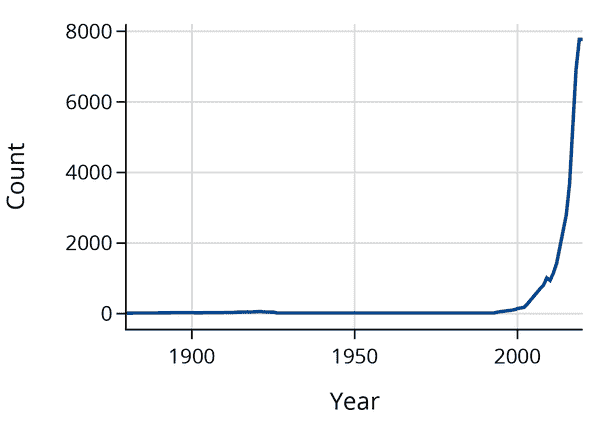

就像文章所说的那样。Luna 在 2000 年左右几乎不流行。换句话说，即使没有关于他们的其他任何信息，如果有人告诉你他们的名字是 Luna，你也可以很好地猜到他们的年龄！

纯属娱乐，这里是同样的 Siri 名字的图表：

```py
`siri` `=` `(``baby``.``query``(``'``Name ==` `"``Siri``"``'``)`
        `.``query``(``'``Sex ==` `"``F``"``'``)``)`
`px``.``line``(``siri``,` `x``=``'``Year``'``,` `y``=``'``Count``'``,` `width``=``350``,` `height``=``250``)`

```

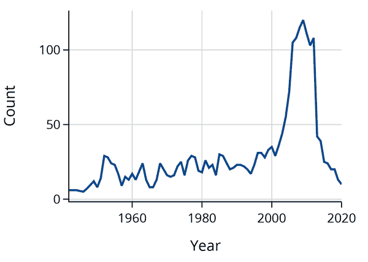

###### 小贴士

使用`.query`类似于使用带有布尔系列的`.loc`。`query()`在过滤上有更多的限制，但可以作为一种简写方便使用。

为什么在 2010 年后突然变得不那么受欢迎呢？嗯，Siri 恰好是苹果的语音助手的名字，于 2011 年推出。让我们在 2011 年划一条线，看看：

```py
`fig` `=` `px``.``line``(``siri``,` `x``=``"``Year``"``,` `y``=``"``Count``"``,` `width``=``350``,` `height``=``250``)`
`fig``.``add_vline``(`
    `x``=``2011``,` `line_color``=``"``red``"``,` `line_dash``=``"``dashdot``"``,` `line_width``=``4``,` `opacity``=``0.7`
`)`

```

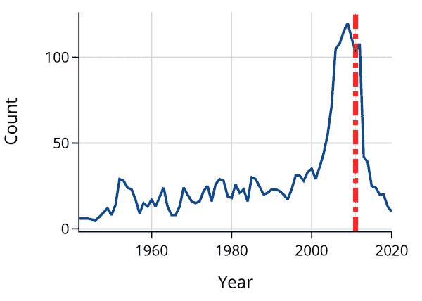

看起来家长们不希望其他人对他们的手机说“嘿 Siri”时让他们的孩子感到困惑。

在这一节中，我们介绍了`pandas`中的数据框。我们涵盖了数据科学家对数据框进行子集切片和使用布尔条件进行筛选的常见方式。在下一节中，我们将解释如何将行聚合在一起。

# 聚合

本节介绍了数据框中行聚合的操作。数据科学家将行聚合在一起以对数据进行摘要。例如，包含每日销售额的数据集可以聚合以显示月销售额。本节介绍了*分组*和*透视*，这两种常见的聚合数据操作。

我们使用上一节介绍的婴儿姓名数据：

```py
`baby` `=` `pd``.``read_csv``(``'``babynames.csv``'``)`
`baby`

```

|   | 名字 | 性别 | 计数 | 年份 |
| --- | --- | --- | --- | --- |
| **0** | Liam | 男 | 19659 | 2020 |
| **1** | Noah | 男 | 18252 | 2020 |
| **2** | Oliver | 男 | 14147 | 2020 |
| **...** | ... | ... | ... | ... |
| **2020719** | Verona | 女 | 5 | 1880 |
| **2020720** | Vertie | 女 | 5 | 1880 |
| **2020721** | Wilma | 女 | 5 | 1880 |

```py
2020722 rows × 4 columns
```

## 基本的分组聚合

假设我们想要找出记录在案的总出生婴儿数。这只是 `Count` 列的总和：

```py
`baby``[``'``Count``'``]``.``sum``(``)`

```

```py
352554503

```

汇总姓名计数是一种简单的聚合数据的方式——它将多行的数据合并。

但假设我们想回答一个更有趣的问题：美国出生率是否随时间而上升？为了回答这个问题，我们可以在每年内对 `Count` 列求和，而不是在整个数据集上进行求和。换句话说，我们根据 `Year` 将数据分组，然后在每个组内对 `Count` 值求和。这个过程在 图 6-3 中有所描述。

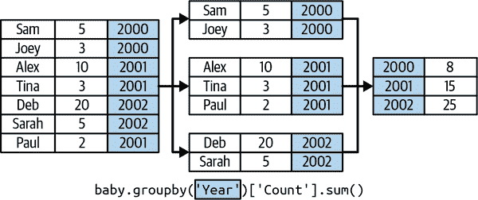

###### 图 6-3\. 描述了示例数据的分组和聚合过程

我们将这个操作称为*分组*，然后是*聚合*。在`pandas`中，我们这样写：

```py
`baby``.``groupby``(``'``Year``'``)``[``'``Count``'``]``.``sum``(``)`

```

```py
Year
1880     194419
1881     185772
1882     213385
         ...   
2018    3487193
2019    3437438
2020    3287724
Name: Count, Length: 141, dtype: int64

```

注意，代码几乎与未分组版本相同，只是以 `.groupby('Year')` 开始。

结果是一个 `pd.Series`，其中包含数据集中每年出生的总婴儿数。请注意，该系列的索引包含唯一的 `Year` 值。现在我们可以绘制随时间变化的计数：

```py
`counts_by_year` `=` `baby``.``groupby``(``'``Year``'``)``[``'``Count``'``]``.``sum``(``)``.``reset_index``(``)`
`px``.``line``(``counts_by_year``,` `x``=``'``Year``'``,` `y``=``'``Count``'``,` `width``=``350``,` `height``=``250``)`

```

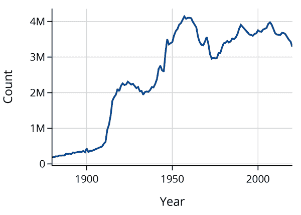

在这张图中我们看到了什么？首先，我们注意到 1920 年之前出生的婴儿似乎非常少。一个可能的解释是社会保障局成立于 1935 年，因此其之前的出生数据可能不够完整。

我们还注意到了 1939 年第二次世界大战爆发时的下降以及 1946 年至 1964 年间的战后婴儿潮时期。

这是在`pandas`中进行分组的基本步骤：

```py
`(``baby`                `# the dataframe`
 `.``groupby``(``'``Year``'``)`    `# column(s) to group`
 `[``'``Count``'``]`           `# column(s) to aggregate`
 `.``sum``(``)`              `# how to aggregate`
`)`

```

### 示例：使用`.value_counts()`

数据框中更常见的任务之一是计算列中每个唯一项出现的次数。例如，我们可能对以下 `classroom` 数据框中每个姓名出现的次数感兴趣：

```py
`classroom`

```

|   | 姓名 |
| --- | --- |
| **0** | Eden |
| **1** | Sachit |
| **2** | Eden |
| **3** | Sachit |
| **4** | Sachit |
| **5** | Luke |

实现这一点的一种方式是使用我们的分组步骤和`.size()` 聚合函数：

```py
`(``classroom`
 `.``groupby``(``'``name``'``)`
 `[``'``name``'``]`
 `.``size``(``)`
`)`

```

```py
name
Eden      2
Luke      1
Sachit    3
Name: name, dtype: int64

```

这个操作非常常见，`pandas`提供了一个简写——`.value_counts()` 方法用于 `pd.Series` 对象：

```py
`classroom``[``'``name``'``]``.``value_counts``(``)`

```

```py
name
Sachit    3
Eden      2
Luke      1
Name: count, dtype: int64

```

默认情况下，`.value_counts()` 方法会对结果系列按照从最高到最低的顺序进行排序，方便查看最常见和最不常见的值。我们提到这个方法是因为在书的其他章节中经常使用它。

## 在多列上进行分组

我们可以将多个列作为列表传递给 `.groupby` 方法，以一次性对多列进行分组。当需要进一步细分我们的组时，这非常有用。例如，我们可以按年份和性别对数据进行分组，以查看随时间变化的男女婴儿出生数：

```py
`counts_by_year_and_sex` `=` `(``baby`
 `.``groupby``(``[``'``Year``'``,` `'``Sex``'``]``)` `# Arg to groupby is a list of column names`
 `[``'``Count``'``]`
 `.``sum``(``)`
`)`
`counts_by_year_and_sex` 

```

```py
Year  Sex
1880  F        83929
      M       110490
1881  F        85034
              ...   
2019  M      1785527
2020  F      1581301
      M      1706423
Name: Count, Length: 282, dtype: int64

```

注意代码如何紧随分组的步骤。

`counts_by_year_and_sex` 系列具有我们称之为多级索引的两个级别，一个用于每列进行的分组。如果我们将系列转换为数据框，则更容易看到结果只有一列：

```py
`counts_by_year_and_sex``.``to_frame``(``)`

```

|   |   | 数量 |
| --- | --- | --- |
| 年份 | 性别 |   |
| --- | --- | --- |
| **1880** | **F** | 83929 |
| **M** | 110490 |
| **1881** | **F** | 85034 |
| **...** | **...** | ... |
| **2019** | **M** | 1785527 |
| **2020** | **F** | 1581301 |
| **M** | 1706423 |

```py
282 rows × 1 columns
```

索引有两个级别，因为我们按两列进行了分组。多级索引可能有点棘手，所以我们可以重置索引，回到具有单个索引的 dataframe：

```py
`counts_by_year_and_sex``.``reset_index``(``)`

```

|   | 年份 | 性别 | 数量 |
| --- | --- | --- | --- |
| **0** | 1880 | F | 83929 |
| **1** | 1880 | M | 110490 |
| **2** | 1881 | F | 85034 |
| **...** | ... | ... | ... |
| **279** | 2019 | M | 1785527 |
| **280** | 2020 | F | 1581301 |
| **281** | 2020 | M | 1706423 |

```py
282 rows × 3 columns
```

## 自定义聚合函数

分组后，`pandas` 为我们提供了灵活的方法来聚合数据。到目前为止，我们已经看到了如何在分组后使用 `.sum()`：

```py
`(``baby`
 `.``groupby``(``'``Year``'``)`
 `[``'``Count``'``]`
 `.``sum``(``)` `# aggregate by summing`
`)`

```

```py
Year
1880     194419
1881     185772
1882     213385
         ...   
2018    3487193
2019    3437438
2020    3287724
Name: Count, Length: 141, dtype: int64

```

`pandas` 还提供其他聚合函数，如 `.mean()`、`.size()` 和 `.first()`。下面是使用 `.max()` 进行相同分组的示例：

```py
`(``baby`
 `.``groupby``(``'``Year``'``)`
 `[``'``Count``'``]`
 `.``max``(``)` `# aggregate by taking the max within each group`
`)`

```

```py
Year
1880     9655
1881     8769
1882     9557
        ...  
2018    19924
2019    20555
2020    19659
Name: Count, Length: 141, dtype: int64

```

但有时 `pandas` 并没有我们想要使用的确切聚合函数。在这些情况下，我们可以定义并使用自定义聚合函数。`pandas` 通过 `.agg(fn)` 让我们能够做到这一点，其中 `fn` 是我们定义的函数。

例如，如果我们想要找出每个组中最大值和最小值之间的差异（数据的范围），我们可以首先定义一个名为 `data_range` 的函数，然后将该函数传递给 `.agg()`。这个函数的输入是一个包含一列数据的 `pd.Series` 对象。它会对每个组调用一次：

```py
`def` `data_range``(``counts``)``:`
    `return` `counts``.``max``(``)` `-` `counts``.``min``(``)`

`(``baby`
 `.``groupby``(``'``Year``'``)`
 `[``'``Count``'``]`
 `.``agg``(``data_range``)` `# aggregate using custom function`
`)`

```

```py
Year
1880     9650
1881     8764
1882     9552
        ...  
2018    19919
2019    20550
2020    19654
Name: Count, Length: 141, dtype: int64

```

我们首先定义了一个 `count_unique` 函数，用于计算系列中唯一值的数量。然后我们将该函数传递给 `.agg()`。由于这个函数很短，我们可以使用 lambda 表达式代替：

```py
`def` `count_unique``(``s``)``:`
    `return` `len``(``s``.``unique``(``)``)`

`unique_names_by_year` `=` `(``baby`
 `.``groupby``(``'``Year``'``)`
 `[``'``Name``'``]`
 `.``agg``(``count_unique``)` `# aggregate using the custom count_unique function`
`)`
`unique_names_by_year`

```

```py
Year
1880     1889
1881     1829
1882     2012
        ...  
2018    29619
2019    29417
2020    28613
Name: Name, Length: 141, dtype: int64

```

```py
`px``.``line``(``unique_names_by_year``.``reset_index``(``)``,`
        `x``=``'``Year``'``,` `y``=``'``Name``'``,`
        `labels``=``{``'``Name``'``:` `'``# unique names``'``}``,`
        `width``=``350``,` `height``=``250``)`

```

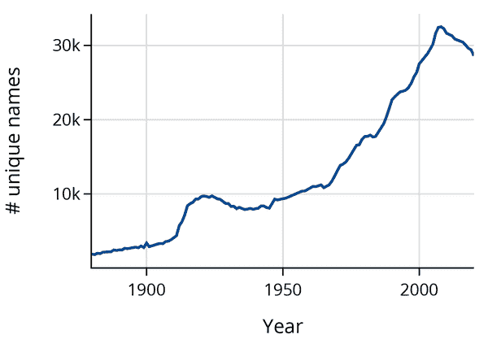

我们发现，尽管自 1960 年代以来每年出生的婴儿数量已经趋于稳定，但独特名称的数量总体上还是在增加的。

## 数据透视

数据透视基本上是在使用两列进行分组时，方便地安排分组和聚合结果的一种方法。在本节的前面，我们将婴儿姓名数据按年份和性别分组：

```py
`counts_by_year_and_sex` `=` `(``baby`
 `.``groupby``(``[``'``Year``'``,` `'``Sex``'``]``)` 
 `[``'``Count``'``]`
 `.``sum``(``)`
`)`
`counts_by_year_and_sex``.``to_frame``(``)`

```

|   |   | 数量 |
| --- | --- | --- |
| 年份 | 性别 |   |
| --- | --- | --- |
| **1880** | **F** | 83929 |
| **M** | 110490 |
| **1881** | **F** | 85034 |
| **...** | **...** | ... |
| **2019** | **M** | 1785527 |
| **2020** | **F** | 1581301 |
| **M** | 1706423 |

```py
282 rows × 1 columns
```

这将生成一个包含计数的 `pd.Series`。我们还可以想象相同的数据，将 `Sex` 索引级别“透视”到 dataframe 的列中。通过一个例子更容易理解：

```py
`mf_pivot` `=` `pd``.``pivot_table``(`
    `baby``,`
    `index``=``'``Year``'``,`   `# Column to turn into new index`
    `columns``=``'``Sex``'``,`  `# Column to turn into new columns`
    `values``=``'``Count``'``,` `# Column to aggregate for values`
    `aggfunc``=``sum``)`    `# Aggregation function`
`mf_pivot`

```

| 性别 | F | M |
| --- | --- | --- |
| 年份 |   |   |
| --- | --- | --- |
| **1880** | 83929 | 110490 |
| **1881** | 85034 | 100738 |
| **1882** | 99699 | 113686 |
| **...** | ... | ... |
| **2018** | 1676884 | 1810309 |
| **2019** | 1651911 | 1785527 |
| **2020** | 1581301 | 1706423 |

```py
141 rows × 2 columns
```

###### 注意

如我们在`mf_pivot`表中所见，数据框的索引也可以命名。为了阅读输出，重要的是注意数据框有两列，M 和 F，存储在名为 Sex 的索引中。同样，数据框有 141 行，每行有自己的标签。这些标签存储在名为 Year 的索引中。这里，Sex 和 Year 是数据框索引的名称，不是行或列标签本身。

注意，在透视表和使用`.groupby()`生成的表中，数据值是相同的；只是排列方式不同。透视表可以使用两个属性快速汇总数据，通常出现在文章和论文中。

函数`px.line()`也能很好地与透视表配合使用，因为该函数在表中的每一列数据上绘制一条线：

```py
`fig` `=` `px``.``line``(``mf_pivot``,` `width``=``350``,` `height``=``250``)`
`fig``.``update_traces``(``selector``=``1``,` `line_dash``=``'``dashdot``'``)`
`fig``.``update_yaxes``(``title``=``'``Value``'``)`

```

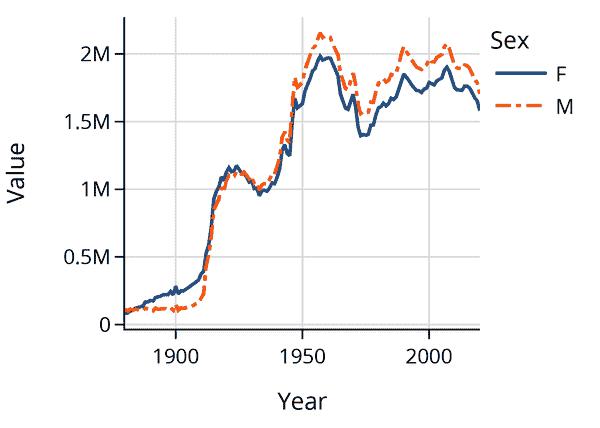

本节介绍了使用`pandas`中的`.groupby()`函数以及一个或多个列使用`pd.pivot_table()`函数对数据进行聚合的常见方法。在下一节中，我们将解释如何将数据框连接在一起。

# 连接

数据科学家经常希望*连接*两个或多个数据框，以便跨数据框连接数据值。例如，一个在线书店可能有一个数据框，其中包含每位用户订购的书籍，以及一个包含每本书流派的第二个数据框。通过将这两个数据框连接起来，数据科学家可以看到每位用户偏爱哪些流派。

我们将继续查看婴儿姓名数据。我们将使用连接来检查[*纽约时报*关于婴儿姓名的文章](https://oreil.ly/qL1dt)中提到的一些趋势。文章讨论了某些类别的姓名如何随时间变得更受欢迎或不受欢迎。例如，它提到了神话般的姓名如 Julius 和 Cassius 变得流行，而婴儿潮时期的姓名如 Susan 和 Debbie 则变得不那么流行。这些类别的流行度随时间的变化如何？

我们将*纽约时报*文章中的名称和类别放入了一个小数据框中：

```py
`nyt` `=` `pd``.``read_csv``(``'``nyt_names.csv``'``)`
`nyt`

```

|   | nyt_name | category |
| --- | --- | --- |
| **0** | Lucifer | forbidden |
| **1** | Lilith | forbidden |
| **2** | Danger | forbidden |
| **...** | ... | ... |
| **20** | Venus | celestial |
| **21** | Celestia | celestial |
| **22** | Skye | celestial |

```py
23 rows × 2 columns
```

要查看名称类别的流行程度，我们将`nyt`数据框与`baby`数据框连接以从`baby`获取名称计数：

```py
`baby` `=` `pd``.``read_csv``(``'``babynames.csv``'``)`
`baby`

```

|   | Name | Sex | Count | Year |
| --- | --- | --- | --- | --- |
| **0** | Liam | M | 19659 | 2020 |
| **1** | Noah | M | 18252 | 2020 |
| **2** | Oliver | M | 14147 | 2020 |
| **...** | ... | ... | ... | ... |
| **2020719** | Verona | F | 5 | 1880 |
| **2020720** | Vertie | F | 5 | 1880 |
| **2020721** | Wilma | F | 5 | 1880 |

```py
2020722 rows × 4 columns
```

对于直觉，我们可以想象在 `baby` 的每一行中进行以下询问：这个名称是否在 `nyt` 表中？如果是，那么将 `category` 列的值添加到该行。这就是连接背后的基本思想。让我们首先看一些较小数据框的示例。

## 内连接

我们首先制作 `baby` 和 `nyt` 表的较小版本，这样在连接表格时更容易看到发生的情况：

```py
`nyt_small`

```

|   | nyt_name | category |
| --- | --- | --- |
| **0** | Karen | 战斗者 |
| **1** | Julius | 神话 |
| **2** | Freya | 神话 |

```py
`baby_small`

```

|   | 名称 | 性别 | 计数 | 年份 |
| --- | --- | --- | --- | --- |
| **0** | Noah | M | 18252 | 2020 |
| **1** | Julius | M | 960 | 2020 |
| **2** | Karen | M | 6 | 2020 |
| **3** | Karen | F | 325 | 2020 |
| **4** | Noah | F | 305 | 2020 |

要在 `pandas` 中连接表，我们将使用 `.merge()` 方法：

```py
`baby_small``.``merge``(``nyt_small``,`
                 `left_on``=``'``Name``'``,`        `# column in left table to match`
                 `right_on``=``'``nyt_name``'``)`   `# column in right table to match`

```

|   | 名称 | 性别 | 计数 | 年份 | nyt_name | category |
| --- | --- | --- | --- | --- | --- | --- |
| **0** | Julius | M | 960 | 2020 | Julius | 神话 |
| **1** | Karen | M | 6 | 2020 | Karen | boomer |
| **   | **2** | Karen | F | 325 | 2020 | Karen | boomer |

注意，新表具有 `baby_small` 和 `nyt_small` 表的列。名称为 `Noah` 的行已消失。其余行从 `nyt_small` 中获得了匹配的 `category`。

###### 注意

读者还应注意，`pandas` 具有 `.join()` 方法用于将两个数据框连接在一起。然而，`.merge()` 方法在数据框连接方面更加灵活，因此我们专注于 `.merge()`。我们鼓励读者查阅 `pandas` 文档，了解这两者之间的确切区别。

当我们将两个表连接在一起时，我们告诉 `pandas` 我们要使用哪些列（`left_on` 和 `right_on` 参数）来进行连接。当连接列中的值匹配时，`pandas` 将行进行匹配，如图 6-4 所示。

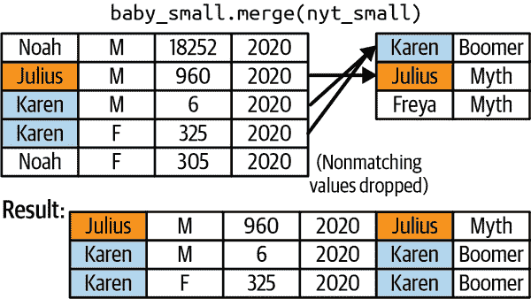

###### 图 6-4。要进行连接，`pandas` 使用 `Name` 和 `nyt_name` 列中的值进行行匹配，删除没有匹配值的行。

默认情况下，`pandas` 执行*内连接*。如果任一表中的行在另一表中没有匹配项，`pandas` 将从结果中删除这些行。在本例中，`baby_small` 中的 `Noah` 行在 `nyt_small` 中没有匹配项，因此被删除。同样，`nyt_small` 中的 `Freya` 行也没有在 `baby_small` 中找到匹配项，因此也被删除。只有在两个表中都有匹配项的行才会留在最终结果中。

## 左连接、右连接和外连接

有时我们希望保留没有匹配项的行，而不是完全删除它们。还有其他类型的连接——左连接、右连接和外连接——即使在没有匹配项时也会保留行。

在*左连接*中，保留左表中没有匹配项的行，如图 6-5 所示。

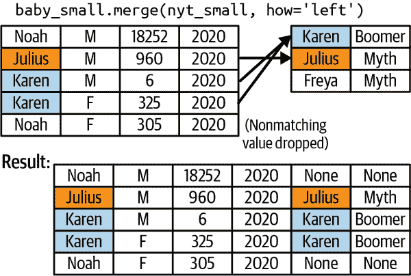

###### 图 6-5。在左连接中，保留左表中没有匹配值的行

要在`pandas`中进行左连接，调用`.merge()`时使用`how='left'`参数：

```py
`baby_small``.``merge``(``nyt_small``,`
                 `left_on``=``'``Name``'``,`        
                 `right_on``=``'``nyt_name``'``,`
                 `how``=``'``left``'``)`           `# left join instead of inner`

```

|   | Name | Sex | Count | Year | nyt_name | category |
| --- | --- | --- | --- | --- | --- | --- |
| **0** | Noah | M | 18252 | 2020 | NaN | NaN |
| **1** | Julius | M | 960 | 2020 | Julius | mythology |
| **2** | Karen | M | 6 | 2020 | Karen | boomer |
| **3** | Karen | F | 325 | 2020 | Karen | boomer |
| **4** | Noah | F | 305 | 2020 | NaN | NaN |

注意`Noah`行在最终表中被保留。由于这些行在`nyt_small`数据框中没有匹配，连接在`nyt_name`和`category`列中留下`NaN`值。同时注意，`nyt_small`中的`Freya`行仍然被丢弃。

*右连接*与左连接类似，但保留右表中没有匹配的行而不是左表：

```py
`baby_small``.``merge``(``nyt_small``,`
                 `left_on``=``'``Name``'``,`        
                 `right_on``=``'``nyt_name``'``,`
                 `how``=``'``right``'``)`

```

|   | Name | Sex | Count | Year | nyt_name | category |
| --- | --- | --- | --- | --- | --- | --- |
| **0** | Karen | M | 6.0 | 2020.0 | Karen | boomer |
| **1** | Karen | F | 325.0 | 2020.0 | Karen | boomer |
| **2** | Julius | M | 960.0 | 2020.0 | Julius | mythology |
| **3** | NaN | NaN | NaN | NaN | Freya | mythology |

最后，*外连接*保留两个表中的行，即使它们没有匹配：

```py
`baby_small``.``merge``(``nyt_small``,`
                 `left_on``=``'``Name``'``,`        
                 `right_on``=``'``nyt_name``'``,`
                 `how``=``'``outer``'``)`

```

|   | Name | Sex | Count | Year | nyt_name | category |
| --- | --- | --- | --- | --- | --- | --- |
| **0** | Noah | M | 18252.0 | 2020.0 | NaN | NaN |
| **1** | Noah | F | 305.0 | 2020.0 | NaN | NaN |
| **2** | Julius | M | 960.0 | 2020.0 | Julius | mythology |
| **3** | Karen | M | 6.0 | 2020.0 | Karen | boomer |
| **4** | Karen | F | 325.0 | 2020.0 | Karen | boomer |
| **5** | NaN | NaN | NaN | NaN | Freya | mythology |

## 示例：纽约时报名字类别的流行程度

现在让我们回到完整的数据框`baby`和`nyt`。`.head()`用于获取前几行数据，节省空间：

```py
`baby``.``head``(``2``)`

```

|   | Name | Sex | Count | Year |
| --- | --- | --- | --- | --- |
| **0** | Liam | M | 19659 | 2020 |
| **1** | Noah | M | 18252 | 2020 |

```py
`nyt``.``head``(``2``)`

```

|   | nyt_name | category |
| --- | --- | --- |
| **0** | Lucifer | forbidden |
| **1** | Lilith | forbidden |

我们想要了解`nyt`中名字类别的流行度随时间的变化。为了回答这个问题：

1.  用`baby`和`nyt`进行内连接。

1.  将表按`category`和`Year`分组。

1.  使用求和对计数进行聚合：

```py
`cate_counts` `=` `(`
    `baby``.``merge``(``nyt``,` `left_on``=``'``Name``'``,` `right_on``=``'``nyt_name``'``)` `# [1]`
    `.``groupby``(``[``'``category``'``,` `'``Year``'``]``)`                       `# [2]`
    `[``'``Count``'``]`                                            `# [3]`
    `.``sum``(``)`                                               `# [3]`
    `.``reset_index``(``)`
`)`
`cate_counts`

```

|   | category | Year | Count |
| --- | --- | --- | --- |
| **0** | boomer | 1880 | 292 |
| **1** | boomer | 1881 | 298 |
| **2** | boomer | 1882 | 326 |
| **...** | ... | ... | ... |
| **647** | mythology | 2018 | 2944 |
| **648** | mythology | 2019 | 3320 |
| **649** | mythology | 2020 | 3489 |

```py
650 rows × 3 columns
```

现在我们可以绘制`boomer`名字和`mythology`名字的流行度：

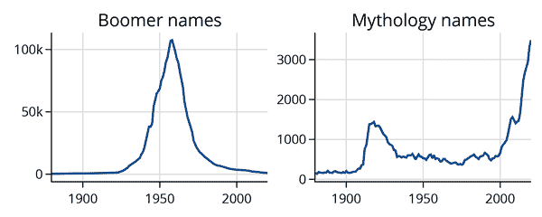

据*纽约时报*文章称，自 2000 年以来，婴儿潮一代的名字变得不太流行，而神话名字则变得更受欢迎。

我们还可以一次性绘制所有类别的流行度。查看下面的图表，看看它们是否支持*纽约时报*文章中的观点：

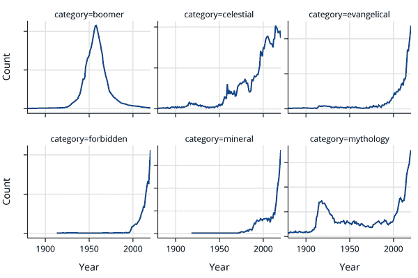

在本节中，我们介绍了数据框的连接操作。当将数据框连接在一起时，我们使用`.merge()`函数匹配行。在连接数据框时，考虑连接的类型（内部、左侧、右侧或外部）是很重要的。在下一节中，我们将解释如何转换数据框中的值。

# 转换中

当数据科学家需要以相同的方式更改特征中的每个值时，他们会转换数据框列。例如，如果一个特征包含以英尺表示的人的身高，数据科学家可能希望将身高转换为厘米。在本节中，我们将介绍*apply*，这是一种使用用户定义函数转换数据列的操作：

```py
`baby` `=` `pd``.``read_csv``(``'``babynames.csv``'``)`
`baby`

```

|   | Name | Sex | Count | Year |
| --- | --- | --- | --- | --- |
| **0** | Liam | M | 19659 | 2020 |
| **1** | Noah | M | 18252 | 2020 |
| **2** | Oliver | M | 14147 | 2020 |
| **...** | ... | ... | ... | ... |
| **2020719** | Verona | F | 5 | 1880 |
| **2020720** | Vertie | F | 5 | 1880 |
| **2020721** | Wilma | F | 5 | 1880 |

```py
2020722 rows × 4 columns
```

在*纽约时报*的婴儿名字文章中，帕梅拉提到，以字母 L 或 K 开头的名字在 2000 年后变得流行。另一方面，以字母 J 开头的名字在 1970 年代和 1980 年代达到了流行高峰，但自那以后流行度下降。我们可以使用`baby`数据集验证这些说法。

我们通过以下步骤解决这个问题：

1.  将`Name`列转换为一个新列，其中包含每个`Name`值的第一个字母。

1.  根据第一个字母和年份对数据框进行分组。

1.  通过求和聚合名称计数。

要完成第一步，我们将*应用*一个函数到`Name`列。

## 应用

`pd.Series`对象包含一个`.apply()`方法，该方法接受一个函数并将其应用于系列中的每个值。例如，要找出每个名称的长度，我们应用`len`函数：

```py
`names` `=` `baby``[``'``Name``'``]`
`names``.``apply``(``len``)`

```

```py
0          4
1          4
2          6
          ..
2020719    6
2020720    6
2020721    5
Name: Name, Length: 2020722, dtype: int64

```

要提取每个名称的第一个字母，我们定义一个自定义函数，并将其传递给`.apply()`。函数的参数是系列中的一个单独值：

```py
`def` `first_letter``(``string``)``:`
    `return` `string``[``0``]`

`names``.``apply``(``first_letter``)`

```

```py
0          L
1          N
2          O
          ..
2020719    V
2020720    V
2020721    W
Name: Name, Length: 2020722, dtype: object

```

使用`.apply()`类似于使用`for`循环。前面的代码大致相当于写成：

```py
`result` `=` `[``]`
`for` `name` `in` `names``:`
    `result``.``append``(``first_letter``(``name``)``)`

```

现在我们可以将首字母分配给数据框中的新列：

```py
`letters` `=` `baby``.``assign``(``Firsts``=``names``.``apply``(``first_letter``)``)`
`letters`

```

|   | Name | Sex | Count | Year | Firsts |
| --- | --- | --- | --- | --- | --- |
| **0** | Liam | M | 19659 | 2020 | L |
| **1** | Noah | M | 18252 | 2020 | N |
| **2** | Oliver | M | 14147 | 2020 | O |
| **...** | ... | ... | ... | ... | ... |
| **2020719** | Verona | F | 5 | 1880 | V |
| **2020720** | Vertie | F | 5 | 1880 | V |
| **2020721** | Wilma | F | 5 | 1880 | W |

```py
2020722 rows × 5 columns
```

###### 注意

要在数据框中创建一个新列，您可能还会遇到以下语法：

```py
`baby``[``'``Firsts``'``]` `=` `names``.``apply``(``first_letter``)`

```

这会通过添加一个名为 `Firsts` 的新列来改变 `baby` 表。在前面的代码中，我们使用了 `.assign()`，它不会改变 `baby` 表本身，而是创建了一个新的数据框。改变数据框并不是错误的，但可能是错误的常见源泉。因此，在本书中，我们大多数情况下会使用 `.assign()`。

## 示例： “L” 开头名字的流行程度

现在我们可以使用 `letters` 数据框来查看首字母随时间变化的流行程度：

```py
`letter_counts` `=` `(``letters`
 `.``groupby``(``[``'``Firsts``'``,` `'``Year``'``]``)`
 `[``'``Count``'``]`
 `.``sum``(``)`
 `.``reset_index``(``)`
`)`
`letter_counts`

```

|   | Firsts | Year | Count |
| --- | --- | --- | --- |
| **0** | A | 1880 | 16740 |
| **1** | A | 1881 | 16257 |
| **2** | A | 1882 | 18790 |
| **...** | ... | ... | ... |
| **3638** | Z | 2018 | 55996 |
| **3639** | Z | 2019 | 55293 |
| **3640** | Z | 2020 | 54011 |

```py
3641 rows × 3 columns
```

```py
`fig` `=` `px``.``line``(``letter_counts``.``loc``[``letter_counts``[``'``Firsts``'``]` `==` `'``L``'``]``,`
              `x``=``'``Year``'``,` `y``=``'``Count``'``,` `title``=``'``Popularity of` `"``L``"` `names``'``,`
              `width``=``350``,` `height``=``250``)`
`fig``.``update_layout``(``margin``=``dict``(``t``=``30``)``)`

```

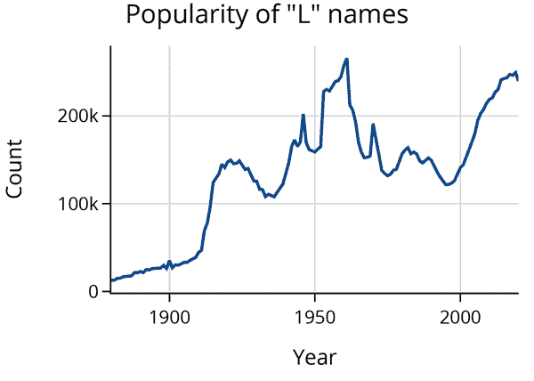

这张图表显示，在 1960 年代，“L”开头的名字很流行，在此后的几十年里有所下降，但自 2000 年以来确实重新流行起来。

那么，“J” 开头的名字怎么样？

```py
`fig` `=` `px``.``line``(``letter_counts``.``loc``[``letter_counts``[``'``Firsts``'``]` `==` `'``J``'``]``,`
              `x``=``'``Year``'``,` `y``=``'``Count``'``,` `title``=``'``Popularity of` `"``J``"` `names``'``,`
              `width``=``350``,` `height``=``250``)`
`fig``.``update_layout``(``margin``=``dict``(``t``=``30``)``)`

```

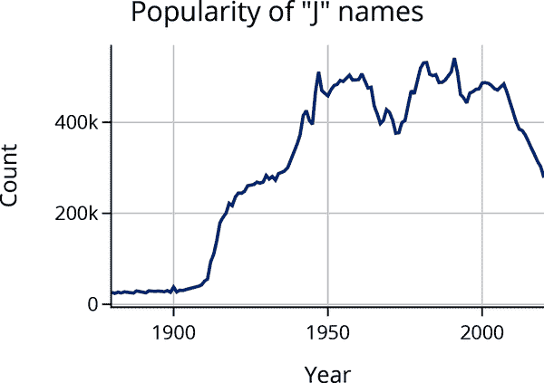

*纽约时报* 的文章指出，“J”开头的名字在 1970 年代和 80 年代很流行。图表也证实了这一点，并显示自 2000 年以来它们变得不那么流行。

## `.apply()` 的代价

`.apply()` 的强大之处在于其灵活性——你可以用任何接受单个数据值并输出单个数据值的函数来调用它。

然而，它的灵活性也有一个代价。使用 `.apply()` 可能会很慢，因为 `pandas` 不能优化任意函数。例如，对于数值计算，使用 `.apply()` 比直接在 `pd.Series` 对象上使用向量化操作要慢得多：

```py
`%``%``timeit`

`# Calculate the decade using vectorized operators`
`baby``[``'``Year``'``]` `/``/` `10` `*` `10`

```

```py
9.66 ms ± 755 µs per loop (mean ± std. dev. of 7 runs, 100 loops each)

```

```py
`%``%``timeit`

`def` `decade``(``yr``)``:`
    `return` `yr` `/``/` `10` `*` `10`

`# Calculate the decade using apply`
`baby``[``'``Year``'``]``.``apply``(``decade``)`

```

```py
658 ms ± 49.6 ms per loop (mean ± std. dev. of 7 runs, 1 loop each)

```

使用 `.apply()` 的版本要慢 30 倍！特别是对于数值计算，我们建议直接在 `pd.Series` 对象上进行向量化操作。

在本节中，我们介绍了数据转换。为了在数据框中转换值，我们通常使用 `.apply()` 和 `.assign()` 函数。在下一节中，我们将比较数据框与其他表示和操作数据表的方法。

# 数据框与其他数据表示方式有何不同？

数据框只是表示表中存储数据的一种方式。在实践中，数据科学家会遇到许多其他类型的数据表，如电子表格、矩阵和关系表。在本节中，我们将比较数据框与其他表示方式，解释为什么数据框在数据分析中如此广泛使用。我们还将指出其他表示方式可能更合适的场景。

## 数据框和电子表格

电子表格是计算机应用程序，用户可以在网格中输入数据并使用公式进行计算。今天一个众所周知的例子是微软 Excel，尽管电子表格可以追溯到至少 1979 年的[VisiCalc](https://doi.org/10.1109/MAHC.2007.4338439)。电子表格使得直接查看和操作数据变得很容易，因为电子表格公式可以在数据更改时自动重新计算结果。相比之下，数据框代码通常需要在数据集更新时手动重新运行。这些特性使得电子表格非常受欢迎——根据[2005 年的估计](https://doi.org/10.1109/VLHCC.2005.34)，有超过 5500 万的电子表格用户，而行业中只有 300 万专业程序员。

数据框比电子表格有几个关键优势。在类似 Jupyter 的计算笔记本中编写数据框代码会自然地产生数据谱系。打开笔记本的人可以看到笔记本的输入文件以及数据是如何更改的。电子表格不显示数据谱系；如果一个人手动编辑单元格中的数据值，将很难让未来的用户看到哪些值是手动编辑的以及如何编辑的。数据框可以处理比电子表格更大的数据集，用户还可以使用分布式编程工具来处理很难加载到电子表格中的大数据集。

## 数据框和矩阵

矩阵是用于线性代数操作的二维数据数组。在下一个例子中，<math><mrow><mi mathvariant="bold">X</mi></mrow></math>是一个具有三行两列的矩阵：

<math display="block"><mtable columnalign="right" columnspacing="0em" displaystyle="true" rowspacing="3pt"><mtr><mtd><mtable displaystyle="true" rowspacing="3pt"><mtr><mtd><mrow><mi mathvariant="bold">X</mi></mrow> <mo>=</mo> <mrow><mo>[</mo> <mtable columnalign="center" columnspacing="1em" rowspacing="4pt"><mtr><mtd><mn>1</mn></mtd> <mtd><mn>0</mn></mtd></mtr> <mtr><mtd><mn>0</mn></mtd> <mtd><mn>4</mn></mtd></mtr> <mtr><mtd><mn>0</mn></mtd> <mtd><mn>0</mn></mtd></mtr></mtable> <mo>]</mo></mrow></mtd></mtr></mtable></mtd></mtr></mtable></math>

矩阵是由它们允许的运算符定义的数学对象。例如，矩阵可以相加或相乘。矩阵也有转置。这些运算符具有数据科学家在统计建模中依赖的非常有用的特性。

矩阵和数据框之间的一个重要区别是，当矩阵被视为数学对象时，它们只能包含数字。另一方面，数据框还可以包含文本等其他类型的数据。这使得数据框更适合加载和处理可能包含各种数据类型的原始数据。实际上，数据科学家经常将数据加载到数据框中，然后将数据处理成矩阵形式。在本书中，我们通常使用数据框进行探索性数据分析和数据清洗，然后将数据处理成矩阵形式用于机器学习模型。

###### 注意

数据科学家将矩阵称为数学对象，也称为程序对象。例如，R 编程语言有一个矩阵对象，而在 Python 中，我们可以使用二维的`numpy`数组表示矩阵。在 Python 和 R 中实现的矩阵可以包含除了数字以外的其他数据类型，但这样做会丧失数学属性。这是领域可以用同一术语指称不同事物的另一个例子。

## 数据框和关系

关系是数据库系统中使用的数据表表示形式，特别是像 SQLite 和 PostgreSQL 这样的 SQL 系统。（我们在第七章中介绍了关系和 SQL。）关系与数据框架有许多相似之处；它们都使用行来表示记录，列来表示特征。两者都有列名，并且列内的数据具有相同的类型。

数据框架的一个关键优势在于，它们不*需要*行来表示记录，也不需要列来表示特征。许多时候，原始数据并不以直接放入关系中的方便格式出现。在这些情况下，数据科学家使用数据框架来加载和处理数据，因为数据框架在这方面更加灵活。通常，数据科学家会将原始数据加载到数据框架中，然后处理数据，使其能够轻松地存储在关系中。

关系型数据库系统（如[PostgreSQL](https://oreil.ly/3zXyH)）比数据框架具有的一个关键优势在于，它们具有非常有用的数据存储和管理功能。考虑一家运营大型社交媒体网站的数据科学家。数据库可能包含的数据量太大，无法一次性读入`pandas`数据框架；因此，数据科学家使用 SQL 查询来子集化和聚合数据，因为数据库系统更能处理大型数据集。此外，网站用户通过发布帖子、上传图片和编辑个人资料不断更新其数据。在这种情况下，数据库系统让数据科学家能够重复使用现有的 SQL 查询更新他们的分析，而不是反复下载大型 CSV 文件。

# 摘要

在本章中，我们解释了数据框架是什么，它们为什么有用，以及如何使用`pandas`代码与它们一起工作。子集化、聚合、连接和转换几乎在每个数据分析中都是有用的。在本书的其余部分中，特别是第 8、第 9 和第十章中，我们将经常依赖这些操作。
