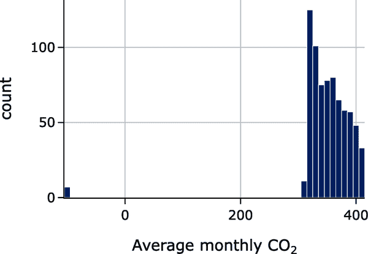
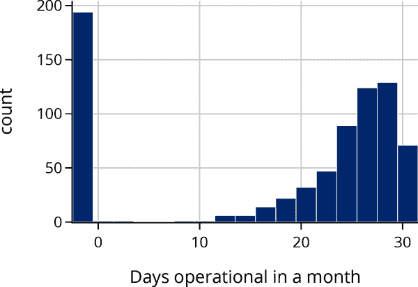
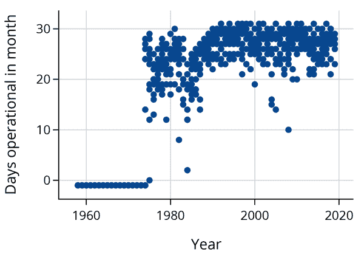
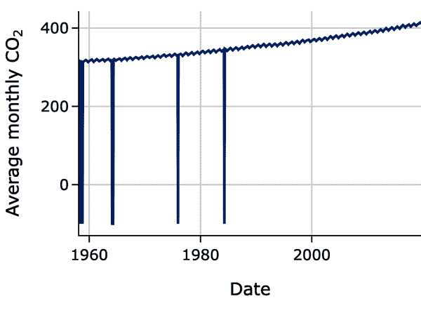
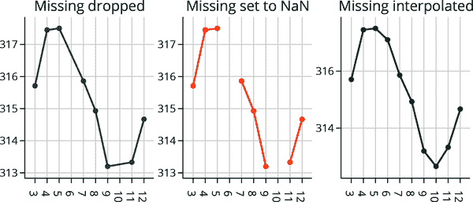
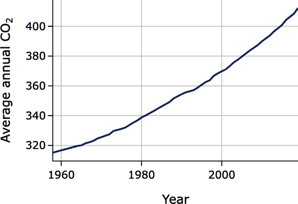
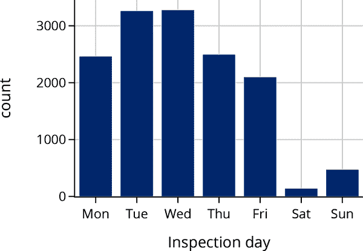
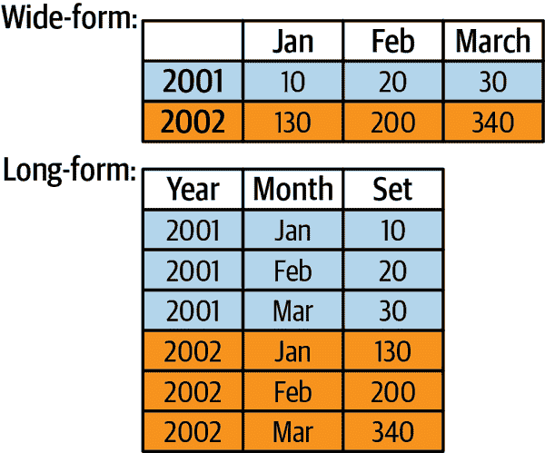
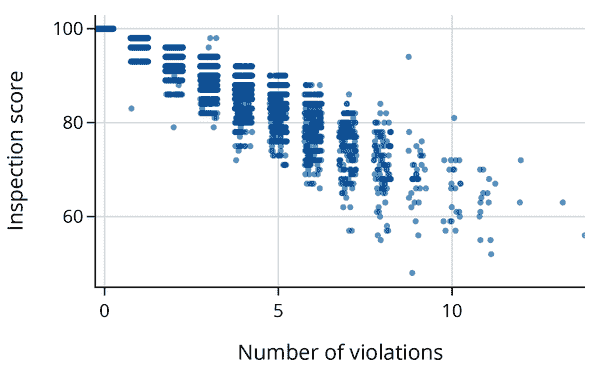
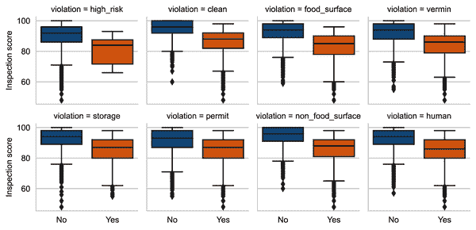

# 第九章：整理数据框架

我们通常需要在分析之前对数据进行准备工作。准备工作的量可能差异很大，但从原始数据到准备好进行分析的数据，有几个基本步骤。第八章 讨论了从纯文本源创建数据框架的初始步骤。在本章中，我们评估数据的质量。为此，我们对单个数据值和整个列执行有效性检查。除了检查数据的质量外，我们还确定数据是否需要转换和重塑以准备进行分析。质量检查（和修复）以及转换通常是循环的：质量检查指导我们进行必要的转换，当我们检查转换后的列以确认数据准备好进行分析时，我们可能会发现它们需要进一步清理。

根据数据源的不同，我们对质量有不同的期望。一些数据集可能需要大量的整理工作才能使其达到可分析的形式，而其他数据可能已经很干净，我们可以直接进行建模。以下是一些数据源的示例以及我们可能预期进行的整理工作量：

+   来自科学实验或研究的数据通常是干净的，有良好的文档记录，并且具有简单的结构。这些数据被组织成可以广泛分享的形式，以便其他人可以在其基础上建立或重现发现。通常情况下，经过少量或无需整理后，即可进行分析。

+   政府调查数据通常附有非常详细的代码书和描述数据收集及格式化方式的元数据，这些数据集通常也是即开即用的，可以直接进行探索和分析。

+   行政数据可能是干净的，但如果没有关于数据源的内部知识，我们可能需要广泛检查它们的质量。此外，由于我们经常将这些数据用于与最初收集它们的目的不同的用途，我们可能需要转换特征或合并数据表。

+   从网页抓取等非正式收集的数据通常会非常混乱，并且往往缺乏文档记录。例如，文本、推特、博客和维基百科表格通常需要格式化和清理，才能将它们转化为可以分析的信息。

在本章中，我们将数据整理分解为以下几个阶段：评估数据质量，处理缺失值，转换特征，并通过修改其结构和粒度来重塑数据。评估数据质量的重要步骤是考虑其范围。数据范围已在第二章中介绍，我们建议您参考该章节以获取更详细的内容。

要清理和准备数据，我们还依赖探索性数据分析，尤其是可视化。然而，在本章中，我们专注于数据整理，并将更详细地讨论这些其他相关主题，这些内容在第 10 和第十一章节中。

我们使用在第八章中介绍的数据集：DAWN 政府调查与药物滥用有关的急诊室访问情况，以及旧金山餐馆食品安全检查的行政数据。但我们首先通过另一个足够简单且干净的例子介绍各种数据整理概念，以便我们可以在每个整理步骤中集中精力。

# 示例：从毛纳罗亚观测站收集二氧化碳（CO[2]）测量数据

我们在第二章中看到，[国家海洋和大气管理局（NOAA）](https://www.noaa.gov)监测毛纳罗亚观测站空气中的 CO[2]浓度。我们继续以此为例，介绍如何进行数据质量检查、处理缺失值、转换特征和重塑表格。这些数据位于文件*data/co2_mm_mlo.txt*中。在将其加载到数据框之前，让我们先了解源数据的格式、编码和大小（见第八章）：

```py
`from` `pathlib` `import` `Path`
`import` `os`
`import` `chardet`

`co2_file_path` `=` `Path``(``'``data``'``)` `/` `'``co2_mm_mlo.txt``'`

`[``os``.``path``.``getsize``(``co2_file_path``)``,` 
 `chardet``.``detect``(``co2_file_path``.``read_bytes``(``)``)``[``'``encoding``'``]``]`

```

```py
[51131, 'ascii']

```

我们发现文件是纯文本，使用 ASCII 编码，大小约为 50 KiB。由于文件并不特别大，因此我们应该可以轻松地将其加载到数据框中，但首先需要确定文件的格式。让我们先看一下文件的前几行：

```py
`lines` `=` `co2_file_path``.``read_text``(``)``.``split``(``'``\n``'``)`
`len``(``lines``)`

```

```py
811

```

```py
`lines``[``:``6``]`

```

```py
['# --------------------------------------------------------------------',
 '# USE OF NOAA ESRL DATA',
 '# ',
 '# These data are made freely available to the public and the',
 '# scientific community in the belief that their wide dissemination',
 '# will lead to greater understanding and new scientific insights.']

```

我们看到文件以数据源信息开头。在开始分析之前，我们应该先阅读这些文档，但有时沉浸于分析中的冲动会胜过一切，我们会开始随意地发现数据的各种属性。所以让我们快速找出实际数据值的位置：

```py
`lines``[``69``:``75``]`

```

```py
['#',
 '#            decimal     average   interpolated    trend    #days',
 '#             date                             (season corr)',
 '1958   3    1958.208      315.71      315.71      314.62     -1',
 '1958   4    1958.292      317.45      317.45      315.29     -1',
 '1958   5    1958.375      317.50      317.50      314.71     -1']

```

我们发现数据从文件的第 73 行开始。我们还发现了一些相关特征：

+   值由空白分隔，可能是制表符。

+   数据以精确的列对齐。例如，每行的第七到第八位置出现了月份。

+   列标题分为两行。

我们可以使用`read_csv`将数据读入`pandas`的`DataFrame`中，并提供参数指定分隔符是空白、没有表头（我们将设置自己的列名），并跳过文件的前 72 行：

```py
`co2` `=` `pd``.``read_csv``(``'``data/co2_mm_mlo.txt``'``,` 
                  `header``=``None``,` `skiprows``=``72``,` `sep``=``'``\``s+``'``,`
                  `names``=``[``'``Yr``'``,` `'``Mo``'``,` `'``DecDate``'``,` `'``Avg``'``,` `'``Int``'``,` `'``Trend``'``,` `'``days``'``]``)`
`co2``.``head``(``3``)`

```

|   | 年 | 月 | 日期 | 平均 | 股息 | 趋势 | 天数 |
| --- | --- | --- | --- | --- | --- | --- | --- |
| **0** | 1958 | 3 | 1958.21 | 315.71 | 315.71 | 314.62 | -1 |
| **1** | 1958 | 4 | 1958.29 | 317.45 | 317.45 | 315.29 | -1 |
| **2** | 1958 | 5 | 1958.38 | 317.50 | 317.50 | 314.71 | -1 |

我们已成功将文件内容加载到数据框中，可以看出数据的粒度是 1958 年至 2019 年的月均 CO[2]浓度。此外，表格形状为 738 行 7 列。

由于科学研究往往具有非常干净的数据，我们很容易就跳进去绘制一张 CO[2]月均值如何变化的图表。字段`DecDate`方便地将月份和年份表示为数值特征，因此我们可以轻松地制作一张折线图：

```py
	px.line(co2, x='DecDate', y='Avg', width=350, height=250,
			labels={'DecDate':'Date', 'Avg':'Average monthly CO₂'})

```



哎呀！绘制数据后发现了一个问题。折线图中的四个低谷看起来很奇怪。这里发生了什么？我们可以检查数据帧的一些百分位数，看看是否能找出问题：

```py
`co2``.``describe``(``)``[``3``:``]`

```

|   | Yr | Mo | DecDate | Avg | Int | Trend | days |
| --- | --- | --- | --- | --- | --- | --- | --- |
| **min** | 1958.0 | 1.0 | 1958.21 | -99.99 | 312.66 | 314.62 | -1.0 |
| **25%** | 1973.0 | 4.0 | 1973.56 | 328.59 | 328.79 | 329.73 | -1.0 |
| **50%** | 1988.0 | 6.0 | 1988.92 | 351.73 | 351.73 | 352.38 | 25.0 |
| **75%** | 2004.0 | 9.0 | 2004.27 | 377.00 | 377.00 | 377.18 | 28.0 |
| **max** | 2019.0 | 12.0 | 2019.62 | 414.66 | 414.66 | 411.84 | 31.0 |

这一次，我们更仔细地查看数值范围，发现一些数据有异常值，如`-1`和`-99.99`。如果我们仔细阅读文件顶部的信息，我们会发现`-99.99`表示缺失的月平均值，`-1`表示设备当月运行天数的缺失值。即使数据相对干净，也应该在进入分析阶段前阅读文档并进行一些质量检查是个好习惯。

## 质量检查

让我们暂停一会儿，进行一些质量检查。我们可以确认我们拥有预期的观测数量，寻找异常值，并将发现的异常与其他特征的值进行交叉验证。

首先，我们考虑数据的形状。我们应该有多少行数据？从数据框的头部和尾部看，数据按时间顺序排列，从 1958 年 3 月开始，到 2019 年 8 月结束。这意味着我们应该有 <math><mn>12</mn> <mo>×</mo> <mo stretchy="false">(</mo> <mn>2019</mn> <mo>−</mo> <mn>1957</mn> <mo stretchy="false">)</mo> <mo>−</mo> <mn>2</mn> <mo>−</mo> <mn>4</mn> <mo>=</mo> <mn>738</mn></math> 条记录，我们可以与数据框的形状进行对比：

```py
`co2``.``shape`

```

```py
(738, 7)

```

我们的计算与数据表中的行数匹配。

接下来，让我们检查特征的质量，从`Mo`开始。我们期望值在 1 到 12 之间，每个月应有 2019-1957=62 或 61 个实例（因为记录从第一年的三月开始，到最近一年的八月结束）：

```py
`co2``[``"``Mo``"``]``.``value_counts``(``)``.``reindex``(``range``(``1``,``13``)``)``.``tolist``(``)`

```

```py
[61, 61, 62, 62, 62, 62, 62, 62, 61, 61, 61, 61]

```

如预期，一月、二月、九月、十月、十一月和十二月各有 61 次出现，其余 62 次。

现在让我们用直方图检查名为`days`的列：

```py
`px``.``histogram``(``co2``,` `x``=``'``days``'``,` `width``=``350``,` `height``=``250``,`
            `labels``=``{``'``days``'``:``'``Days operational in a month``'``}``)`

```



我们发现有少数几个月份的平均值是基于少于一半天数的测量值。此外，有近 200 个缺失值。散点图可以帮助我们交叉检查缺失数据与记录年份：

```py
`px``.``scatter``(``co2``,` `x``=``'``Yr``'``,` `y``=``'``days``'``,` `width``=``350``,` `height``=``250``,`
           `labels``=``{``'``Yr``'``:``'``Year``'``,` `'``days``'``:``'``Days operational in month``'` `}``)`

```



图表底部的左侧线条显示，所有缺失数据都在设备运行初期。设备运行天数可能在早期并未收集。此外，从 80 年代中期到 80 年代末，设备可能存在问题。针对这些推测，我们该如何处理呢？我们可以通过查阅历史记录的文件来确认这些推测。如果我们担心缺失设备运行天数的记录对 CO[2]平均值的影响，那么一个简单的解决方案是删除最早的记录。不过，在我们检查时间趋势并评估这些早期天数是否存在潜在问题之后再采取行动会更好。

接下来，让我们再次关注平均 CO[2]测量值中的`-99.99`值，并从直方图开始我们的检查：

```py
`px``.``histogram``(``co2``,` `x``=``'``Avg``'``,` `width``=``350``,` `height``=``250``,`
             `labels``=``{``'``Avg``'``:``'``Average monthly CO₂``'``}``)`

```



根据我们对二氧化碳（CO[2]）水平的研究，记录的数值在 300 至 400 的范围内，这符合我们的预期。我们还注意到只有少量的缺失数值。由于缺失值不多，我们可以检查所有这些值：

```py
`co2``[``co2``[``"``Avg``"``]` `<` `0``]`

```

|   | Yr | Mo | DecDate | Avg | Int | Trend | days |
| --- | --- | --- | --- | --- | --- | --- | --- |
| **3** | 1958 | 6 | 1958.46 | -99.99 | 317.10 | 314.85 | -1 |
| **7** | 1958 | 10 | 1958.79 | -99.99 | 312.66 | 315.61 | -1 |
| **71** | 1964 | 2 | 1964.12 | -99.99 | 320.07 | 319.61 | -1 |
| **72** | 1964 | 3 | 1964.21 | -99.99 | 320.73 | 319.55 | -1 |
| **73** | 1964 | 4 | 1964.29 | -99.99 | 321.77 | 319.48 | -1 |
| **213** | 1975 | 12 | 1975.96 | -99.99 | 330.59 | 331.60 | 0 |
| **313** | 1984 | 4 | 1984.29 | -99.99 | 346.84 | 344.27 | 2 |

我们面临的问题是如何处理`-99.99`的数值。我们已经看到在折线图中保留这些数值会带来问题。有几种选择，我们接下来会描述它们。

## 处理缺失数据

平均 CO[2]水平中的`-99.99`表示缺失记录。这些值影响了我们的统计摘要和图表。知道哪些值是缺失的很重要，但我们需要采取措施。我们可以删除这些记录，用`NaN`替换`-99.99`，或者用一个可能的平均 CO[2]值替换`-99.99`。让我们逐个检查这三种选择。

注意，表格中已经有了一个替代值来代替`-99.99`。标记为`Int`的列中的值与`Avg`中的值完全相同，只有当`Avg`为`-99.99`时，才会使用“合理”的估计值。

为了看清每种选择的影响，让我们放大一个短时间段，比如说 1958 年的测量数据，我们知道在这里有两个缺失值。我们可以为三种情况创建一个时间序列图：删除带有`-99.99`的记录（左侧图）、使用`NaN`表示缺失值（中间图）、替换`-99.99`为估计值（右侧图）：



仔细观察时，我们可以看到每个图表之间的差异。最左边的图表连接了一个两个月的时间段内的点，而不是一个月。在中间的图表中，数据缺失处断开了线，而在右边，我们可以看到第 6 和第 10 月现在有值了。总体上来说，由于 738 个月中只有七个值缺失，所有这些选项都有效。然而，右图更吸引人的地方在于季节性趋势更清晰可辨。

用于插值 CO[2] 测量值的方法是考虑到月份和年份的平均处理过程。其思想是反映季节性变化和长期趋势。这一技术在数据文件顶部的文档中有更详细的描述。

这些图表显示数据的粒度为每月测量，但我们还可以选择其他粒度选项。接下来我们将讨论这一点。

## 数据表重塑

毛纳罗亚观测站获取的 CO[2] 测量数据还有每天和每小时的数据。每小时数据的*粒度更细*，而每日数据则*比每小时数据粗*。

为什么不总是使用最精细的数据粒度？在计算层面上，细粒度数据可能会变得非常大。毛纳罗亚观测站从 1958 年开始记录 CO[2] 水平。想象一下，如果该设施每秒提供一次测量，数据表会包含多少行！但更重要的是，我们希望数据的粒度与我们的研究问题相匹配。假设我们想要查看过去 50 多年来 CO[2] 水平是否上升，这与全球变暖预测一致。我们并不需要每秒一次的 CO[2] 测量。事实上，我们可能对年均值感到满意，因为这样可以平滑掉季节模式。我们可以聚合每月测量值，将粒度更改为年均值，并制作一个图表显示总体趋势。我们可以使用*聚合*来转向更粗粒度——在`pandas`中，我们使用`.groupby()`和`.agg()`：



的确，自 1958 年以来，毛纳罗亚观测站记录的 CO[2] 测量值上升了将近 100 ppm。

总结一下，在将空格分隔的纯文本文件读入数据框后，我们开始检查其质量。我们使用数据的范围和上下文来确认其形状是否与收集日期的范围匹配。我们确认了月份的值和计数是否符合预期。我们确定了功能中缺失值的程度，并查找缺失值与其他功能之间的关系。我们考虑了三种处理缺失数据的方法：删除记录、处理`NaN`值和填补值以获得完整的表格。最后，我们通过将数据框的粒度从每月平均值升级到年度平均值来改变数据的粒度。这种粒度变化消除了季节性波动，并集中在大气中 CO[2]水平的长期趋势上。本章的接下来四个部分将扩展这些操作，将数据整理成适合分析的形式：质量检查、缺失值处理、转换和形状调整。我们从质量检查开始。

# 质量检查

一旦您的数据进入表格，并且您理解了范围和粒度，就是检查质量的时候了。在您检查和整理文件到数据框时，您可能会发现源数据中的错误。在本节中，我们描述如何继续这一检查，并进行更全面的功能和值质量评估。我们从四个角度考虑数据质量：

范围

数据是否与您对人口的理解相匹配？

测量和值

值是否合理？

关系

相关特征是否一致？

分析

哪些功能可能在未来的分析中有用？

我们依次描述每个点，从范围开始。

## 基于范围的质量

在第二章中，我们讨论了收集的数据是否能够充分解决当前问题。在那里，我们确定了目标人口、访问框架和样本收集数据。该框架帮助我们考虑可能影响研究结果普适性的潜在限制。

虽然在我们审议最终结论时，这些更广泛的数据范围考虑是重要的，但它们也有助于检查数据质量。例如，在第八章介绍的旧金山餐厅检查数据中，一项侧面调查告诉我们，城市的邮政编码应以 941 开头。但快速检查显示，有几个邮政编码以其他数字开头：

```py
`bus``[``'``postal_code``'``]``.``value_counts``(``)``.``tail``(``10``)`

```

```py
92672        1
64110        1
94120        1
            ..
94621        1
941033148    1
941          1
Name: postal_code, Length: 10, dtype: int64

```

使用范围进行的这种验证有助于我们发现潜在问题。

另一个例子是，在[Climate.gov](https://www.climate.gov)和[NOAA](https://oreil.ly/UBPDY)上关于大气 CO[2]的背景阅读中，Typical measurements 约为全球 400 ppm。因此，我们可以检查夏威夷火山月均 CO[2]浓度是否介于 300 到 450 ppm 之间。

接下来，我们将数据值与代码手册等进行比对。

## 测量和记录值的质量

我们还可以通过考虑特征的合理值来检查测量的质量。例如，想象一下餐厅检查中违规数量的合理范围可能是 0 到 5\. 其他检查可以基于常识的范围：餐厅检查分数必须在 0 到 100 之间；月份必须在 1 到 12 之间\. 我们可以使用文档来告诉我们特征的预期值。例如，在 DAWN 调查中的急诊室访问类型，介绍在第八章，已编码为 1、2、...、8（参见图 9-1）。因此，我们可以确认访问类型的所有值确实是介于 1 到 8 之间的整数。


###### 图 9-1\. DAWN 调查中急诊室访问类型（CASETYPE）变量描述的屏幕截图（实际代码书中出现了拼写错误 SUICICDE）

我们还希望确保数据类型符合我们的预期。例如，我们希望价格是一个数字，无论它是存储为整数、浮点数还是字符串。确认测量单位与预期相符可以是另一个有用的质量检查（例如，以磅为单位记录的重量值，而不是公斤）。我们可以为所有这些情况设计检查。

可以通过比较两个相关特征来设计其他检查。

## 相关特征的质量

有时，两个特征对其值有内置条件，我们可以交叉检查其内部一致性。例如，根据 DAWN 研究的文档，饮酒只被认为是年龄在 21 岁以下的患者急诊访问的有效原因，因此我们可以检查任何记录中“饮酒”类型的访问是否年龄在 21 岁以下。 `type` 和 `age` 的交叉表可以确认满足此约束：

```py
display_df(pd.crosstab(dawn['age'], dawn['type']), rows=12)

```

| 类型 | 1 | 2 | 3 | 4 | 5 | 6 | 7 | 8 |
| --- | --- | --- | --- | --- | --- | --- | --- | --- |
| 年龄 |   |   |   |   |   |   |   |   |
| --- | --- | --- | --- | --- | --- | --- | --- | --- |
| **-8** | 2 | 2 | 0 | 21 | 5 | 1 | 1 | 36 |
| **1** | 0 | 6 | 20 | 6231 | 313 | 4 | 2101 | 69 |
| **2** | 8 | 2 | 15 | 1774 | 119 | 4 | 119 | 61 |
| **3** | 914 | 121 | 2433 | 2595 | 1183 | 48 | 76 | 4563 |
| **4** | 817 | 796 | 4953 | 3111 | 1021 | 95 | 44 | 6188 |
| **5** | 983 | 1650 | 0 | 4404 | 1399 | 170 | 48 | 9614 |
| **6** | 1068 | 1965 | 0 | 5697 | 1697 | 140 | 62 | 11408 |
| **7** | 957 | 1748 | 0 | 5262 | 1527 | 100 | 60 | 10296 |
| **8** | 1847 | 3411 | 0 | 10221 | 2845 | 113 | 115 | 18366 |
| **9** | 1616 | 3770 | 0 | 12404 | 3407 | 75 | 150 | 18381 |
| **10** | 616 | 1207 | 0 | 12291 | 2412 | 31 | 169 | 7109 |
| **11** | 205 | 163 | 0 | 24085 | 2218 | 12 | 308 | 1537 |

交叉表确认所有酒精案例（`type`为 3）年龄在 21 岁以下（这些编码为 1、2、3 和 4）。数据值符合预期。

最后一种质量检查类型涉及特征中所含信息的量。

## 分析质量

即使数据通过了之前的质量检查，它的有效性仍然可能存在问题。例如，如果一个特征的几乎所有值都相同，那么这个特征对于理解底层模式和关系的贡献就很少。或者如果存在太多缺失值，尤其是在缺失值中存在可辨识的模式时，我们的发现可能会受限。此外，如果一个特征有许多坏/损坏的值，那么我们可能会质疑即使在适当范围内的那些值的准确性。

我们在下面的代码中看到，旧金山的餐馆检查类型可以是例行或投诉。由于 14,000 多次检查中只有一次是投诉，如果我们放弃这个特征，我们几乎不会损失什么，而且我们可能也想删除那个单独的检查，因为它代表了一个异常：

```py
`pd``.``value_counts``(``insp``[``'``type``'``]``)`

```

```py
routine      14221
complaint        1
Name: type, dtype: int64

```

一旦我们发现数据的问题，我们需要弄清楚该如何处理。

## 数据修复与否

当你揭示数据的问题时，基本上你有四个选择：保留数据如其所是，修改数值，移除特征，或删除记录。

保留数据如其所是

并非数据的每一个异常方面都需要修正。你可能已经发现了数据的一个特征，它将告诉你如何进行分析，而且不需要修正。或者你可能发现问题相对较小，很可能不会影响你的分析，因此你可以保留数据。或者，你可能希望用`NaN`替换损坏的数值。

修改单个数值

如果你已经找出了问题所在并可以修正数值，那么你可以选择进行更改。在这种情况下，创造一个带有修改数值的新特征，并保留原始特征是一个好的做法，就像二氧化碳（CO[2]）的例子中那样。

移除一列

如果一个特征中的许多值存在问题，那么考虑完全消除该特征。与排除一个特征不同，可能存在一种转换可以使你保留该特征同时降低记录的详细级别。

删除记录

一般而言，我们不希望无故从数据集中删除大量观察结果。相反，尝试将你的调查范围缩小到某个明确定义的数据子集，而不是简单地对应着删除带有损坏数值的记录。当你发现一个异常值实际上是正确的时候，你可能仍然决定将该记录排除在你的分析之外，因为它与你的其他数据有显著不同，而你不希望它过度影响你的分析。

无论你采取什么方法，你都需要研究你所做改变对分析的可能影响。例如，尝试确定带有损坏数值的记录是否彼此相似，并且与其他数据不同。

质量检查可以揭示需要在进行分析之前解决的数据问题。一种特别重要的检查类型是查找缺失值。我们建议有时您可能希望将损坏的数据值替换为`NaN`，因此将其视为缺失。在其他时候，数据可能会缺失。如何处理缺失数据是一个重要的话题，有很多研究在解决这个问题；我们将在下一节中介绍处理缺失数据的方法。

# 缺失值与记录

在第三章中，我们考虑了当人群和访问框架不对齐时可能出现的问题，因此我们无法访问我们想要研究的所有人。我们还描述了当有人拒绝参与研究时可能出现的问题。在这些情况下，整个记录/行可能会丢失，并且我们讨论了由于缺失记录可能出现的偏差类型。如果未响应者在关键方面与响应者不同，或者非响应率不可忽略，则我们的分析可能会严重有误。第三章中关于选举民意测验的例子表明，增加样本大小而不解决非响应问题并不会减少非响应偏差。此外，在该章中，我们讨论了预防非响应的方法。这些预防措施包括使用激励措施鼓励响应，保持调查简短，编写清晰的问题，培训访问员，并投入广泛的后续程序。不幸的是，尽管这些努力，一定程度的非响应是不可避免的。

当记录不完全丢失，但记录中的特定字段不可用时，我们称之为字段级的非响应。一些数据集使用特殊编码来表示信息丢失的情况。我们发现毛纳罗亚数据使用`-99.99`表示缺失的 CO[2]测量。在表中的 738 行中，我们只发现了七个这样的值。在这种情况下，我们表明这些缺失值对分析影响不大。

特征的值被称为*完全随机缺失*，当缺失数据的记录就像随机选择的记录子集时。也就是说，记录是否缺失不依赖于未观察到的特征、其他特征的值或抽样设计。例如，如果有人在毛纳罗亚意外损坏了实验设备，导致某天未记录 CO[2]，那么没有理由认为那天的 CO[2]水平与丢失的测量有关。

在其他时候，我们考虑*给定协变量缺失随机*的值（协变量是数据集中的其他特征）。例如，在 DAWN 调查中，急诊访问类型在给定协变量情况下是随机缺失的，如果，例如，非响应仅依赖于种族和性别（而不依赖于访问类型或其他任何因素）。在这些有限的情况下，可以对观察数据进行加权以适应非响应。

在某些调查中，缺失信息进一步分类为受访者拒绝回答、受访者不确定答案或面试官未问问题。每种类型的缺失值使用不同的值记录。例如，根据[代码书](https://oreil.ly/lwBYh)，DAWN 调查中的许多问题使用`-7`表示不适用，`-8`表示未记录，`-9`表示缺失。这些编码可以帮助我们进一步完善非响应的研究。

在非响应发生后，有时可以使用模型预测缺失的数据。我们接下来描述这个过程。但请记住，预测缺失的观察结果永远不如首次观察到它们好。

有时，我们会为缺失的值替换一个合理的值，以创建一个“干净”的数据框架。这个过程称为*填补*。填补值的一些常见方法包括*演绎*、*均值*和*热卡*填补。

在演绎填补中，我们通过与其他特征的逻辑关系填补值。例如，这是旧金山餐馆检查的业务数据框架中的一行。邮政编码错误地标记为“Ca”，纬度和经度缺失：

```py
`bus``[``bus``[``'``postal_code``'``]` `==` `"``Ca``"``]`

```

|   | business_id | name | address | city | ... | postal_code | latitude | longitude | phone_number |
| --- | --- | --- | --- | --- | --- | --- | --- | --- | --- |
| **5480** | 88139 | TACOLICIOUS | 2250 CHESTNUT ST | San Francisco | ... | Ca | NaN | NaN | +14156496077 |

```py
1 row × 9 columns
```

我们可以在 USPS 网站上查找地址以获取正确的邮政编码，并可以使用 Google Maps 查找餐馆的纬度和经度来填补这些缺失值。

均值填补使用数据集中非缺失行的平均值。例如，如果一个测试分数数据集中一些学生的分数缺失，均值填补将使用非缺失分数的平均值填补缺失值。均值填补的一个关键问题是，由于该特征现在具有与均值相同的值，因此填补后特征的变异性将较小。如果不正确处理，这将影响后续分析，例如，置信区间将比预期小（这些主题在第十七章中有详细介绍）。在马乌纳罗亚的 CO[2]的缺失值中，使用了更复杂的平均技术，其中包括邻近的季节性值。

热卡填补使用机会过程从具有值的行中随机选择一个值。例如，热卡填补可以通过随机选择数据集中的另一个测试分数来填补缺失的测试分数。热卡填补的一个潜在问题是，特征之间的关系强度可能会因为我们增加了随机性而减弱。

对于均值和热补卡填补，我们通常基于数据集中具有其他特征中类似值的记录来填补值。更复杂的填补技术使用最近邻方法来找到相似记录子组，其他技术使用回归技术来预测缺失值。

在所有这些填补类型中，我们应该创建一个包含修改后数据的新特征，或者创建一个新特征来指示原始特征中的响应是否已被填补，以便我们可以跟踪我们的更改。

决定保留或丢弃具有缺失值的记录、更改值或删除特征可能看起来微不足道，但它们可能至关重要。一个异常记录可能严重影响您的发现。无论您做出什么决定，都要确保检查删除或更改特征和记录的影响。在报告您对数据所做修改时，一定要透明和彻底。最好通过编程方式进行这些更改，以减少潜在错误，并使其他人能够通过审查您的代码确认您所做的确切更改。

数据转换也需要同样的透明度和可重现性预防措施，接下来我们会讨论这些。

# 转换和时间戳

有时特征的形式不适合分析，因此我们对其进行转换。特征可能需要转换的原因有很多：值编码可能对分析无用，我们可能想对特征应用数学函数，或者我们可能想从特征中提取信息并创建新特征。我们描述了这三种基本类型的转换：类型转换、数学转换和提取：

类型转换

这种转换发生在我们将数据从一种格式转换为另一种格式以使数据更适合分析时。我们可能会将存储为字符串的信息转换为另一种格式。例如，我们可能希望将报价字符串`"$2.17"`转换为数字 2.17，以便计算汇总统计数据。或者我们可能希望将存储为字符串的时间，如`"1955-10-12"`，转换为`pandas Timestamp`对象。另一个示例是在将类别合并在一起时发生，例如将 DAWN 中的 11 个年龄类别减少为 5 个分组。

数学转换

数学转换的一种类型是当我们从一个测量单位，比如从磅到公斤，进行单位转换。我们可能进行单位转换，以便我们的数据统计可以直接与其他数据集的统计进行比较。进行特征转换的另一个原因是使其分布更对称（这个概念在第十章中有更详细的介绍）。处理不对称性最常见的转换是对数。最后，我们可能希望通过算术运算创建一个新的特征。例如，我们可以结合身高和体重，通过计算 <math><mtext>height</mtext> <mrow><mo>/</mo></mrow> <msup><mtext>weight</mtext> <mn>2</mn></msup></math> 来创建身体质量指数。

提取

有时候我们想通过提取创建一个特征，新特征包含从另一个特征中提取的部分信息。例如，检查违规行为包含违规描述的字符串，我们可能只关心违规是否涉及，比如，害虫。如果违规描述中包含单词 *vermin*，我们可以创建一个新特征，如果是，则为`True`，否则为`False`。将信息转换为逻辑值（或 0-1 值）在数据科学中非常有用。本章中即将介绍的示例为这些二元特征提供了一个具体的用例。

我们在第十章中涵盖了许多其他有用转换的示例。在本节的其余部分，我们解释了与处理日期和时间相关的另一种转换方式。日期和时间出现在许多类型的数据中，因此学习如何处理这些数据类型是值得的。

## 转换时间戳

*时间戳* 是记录特定日期和时间的数据值。例如，时间戳可以记录为 `Jan 1 2020 2pm` 或 `2021-01-31 14:00:00` 或 `2017 Mar 03 05:12:41.211 PDT`。时间戳有许多不同的格式！这种信息对于分析非常有用，因为它让我们能够回答诸如“一天中哪个时段的网站流量最高？”的问题。当我们处理时间戳时，通常需要对其进行解析以便于分析。

让我们看一个例子。旧金山餐馆的检查数据包括餐厅检查发生的日期：

```py
`insp``.``head``(``4``)`

```

|   | business_id | score | date | type |
| --- | --- | --- | --- | --- |
| **0** | 19 | 94 | 20160513 | routine |
| **1** | 19 | 94 | 20171211 | routine |
| **2** | 24 | 98 | 20171101 | routine |
| **3** | 24 | 98 | 20161005 | routine |

默认情况下，`pandas`将`date`列读取为整数：

```py
`insp``[``'``date``'``]``.``dtype`

```

```py
dtype('int64')

```

这种存储类型使得回答一些有用的数据问题变得困难。假设我们想知道检查是否更频繁发生在周末还是工作日。为了回答这个问题，我们想将`date`列转换为`pandas`的`Timestamp`存储类型，并提取星期几。

日期值似乎采用`YYYYMMDD`格式，其中`YYYY`、`MM`和`DD`分别对应四位数年份、两位数月份和两位数日期。`pd.to_datetime()`方法可以将日期字符串解析为对象，我们可以传入日期格式作为[日期格式](https://oreil.ly/TFWcU)字符串：

```py
`date_format` `=` `'``%Y``%m``%d``'`

`insp_dates` `=` `pd``.``to_datetime``(``insp``[``'``date``'``]``,` `format``=``date_format``)`
`insp_dates``[``:``3``]`

```

```py
0   2016-05-13
1   2017-12-11
2   2017-11-01
Name: date, dtype: datetime64[ns]

```

现在我们可以看到`insp_dates`现在具有`datetime64[ns]`的`dtype`，这意味着值已成功转换为`pd.Timestamp`对象。¹

`pandas`为使用`.dt`访问器保持时间戳的`Series`对象提供了特殊方法和属性。例如，我们可以轻松地提取每个时间戳的年份：

```py
`insp_dates``.``dt``.``year``[``:``3``]`

```

```py
0    2016
1    2017
2    2017
Name: date, dtype: int32

```

`pandas`文档详细介绍了[`.dt`访问器](https://oreil.ly/_ceNL)的所有细节。通过查看文档，我们可以看到`.dt.day_of_week`属性获取每个时间戳的星期几（星期一=0，星期二=1，…，星期日=6）。因此，让我们向数据框中分配新列，这些列包含解析的时间戳和星期几：

```py
`insp` `=` `insp``.``assign``(``timestamp``=``insp_dates``,`
                   `dow``=``insp_dates``.``dt``.``dayofweek``)`
`insp``.``head``(``3``)`

```

|   | business_id | score | date | type | timestamp | dow |
| --- | --- | --- | --- | --- | --- | --- |
| **0** | 19 | 94 | 20160513 | routine | 2016-05-13 | 4 |
| **1** | 19 | 94 | 20171211 | routine | 2017-12-11 | 0 |
| **2** | 24 | 98 | 20171101 | routine | 2017-11-01 | 2 |

现在我们可以看出，餐厅检查员是否偏爱某一周的某一天，通过对星期几进行分组来实现：

```py
`insp``[``'``dow``'``]``.``value_counts``(``)``.``reset_index``(``)`

```

|   | dow | count |
| --- | --- | --- |
| **0** | 2 | 3281 |
| **1** | 1 | 3264 |
| **2** | 3 | 2497 |
| **3** | 0 | 2464 |
| **4** | 4 | 2101 |
| **5** | 6 | 474 |
| **6** | 5 | 141 |



正如预期的那样，检查很少在周末进行。我们还发现星期二和星期三是最受欢迎的检查日。

我们已经对检查表执行了许多操作。跟踪这些修改的一种方法是将这些操作从一个操作到下一个进行管道传输。接下来我们将讨论管道的概念。

## 转换管道

在数据分析中，我们通常对数据应用许多转换，当我们反复变异数据框时，很容易引入错误，部分原因是 Jupyter 笔记本允许我们按任何顺序运行单元格。作为良好的实践，我们建议将转换代码放入具有有用名称的函数中，并使用`DataFrame.pipe()`方法将转换链接在一起。

让我们将早期的时间戳解析代码重写为函数，并将时间戳作为新列添加回数据框中，同时添加第二列，其中包含时间戳的年份：

```py
`date_format` `=` `'``%Y``%m``%d``'`

`def` `parse_dates_and_years``(``df``,` `column``=``'``date``'``)``:`
    `dates` `=` `pd``.``to_datetime``(``df``[``column``]``,` `format``=``date_format``)`
    `years` `=` `dates``.``dt``.``year`
    `return` `df``.``assign``(``timestamp``=``dates``,` `year``=``years``)`

```

现在我们可以使用`.pipe()`方法将`insp`数据框通过此函数管道化：

```py
`insp` `=` `(``pd``.``read_csv``(``"``data/inspections.csv``"``)`
        `.``pipe``(``parse_dates_and_years``)``)`

```

我们可以链接许多`.pipe()`调用在一起。例如，我们可以从时间戳中提取星期几：

```py
`def` `extract_day_of_week``(``df``,` `col``=``'``timestamp``'``)``:`
    `return` `df``.``assign``(``dow``=``df``[``col``]``.``dt``.``day_of_week``)`

`insp` `=` `(``pd``.``read_csv``(``"``data/inspections.csv``"``)`
        `.``pipe``(``parse_dates_and_years``)`
        `.``pipe``(``extract_day_of_week``)``)`
`insp`

```

|   | business_id | score | date | type | timestamp | year | dow |
| --- | --- | --- | --- | --- | --- | --- | --- |
| **0** | 19 | 94 | 20160513 | routine | 2016-05-13 | 2016 | 4 |
| **1** | 19 | 94 | 20171211 | 日常 | 2017-12-11 | 2017 | 0 |
| **2** | 24 | 98 | 20171101 | 日常 | 2017-11-01 | 2017 | 2 |
| **...** | ... | ... | ... | ... | ... | ... | ... |
| **14219** | 94142 | 100 | 20171220 | 日常 | 2017-12-20 | 2017 | 2 |
| **14220** | 94189 | 96 | 20171130 | 日常 | 2017-11-30 | 2017 | 3 |
| **14221** | 94231 | 85 | 20171214 | 日常 | 2017-12-14 | 2017 | 3 |

```py
14222 rows × 7 columns
```

使用 `pipe()` 的几个关键优势。当在单个数据框上有许多转换时，我们可以更容易地看到发生了哪些转换，因为我们只需读取函数名。此外，我们可以将转换函数重用于不同的数据框。例如，`viol` 数据框包含有关餐厅安全违规的信息，同时也有一个 `date` 列。这意味着我们可以使用 `.pipe()` 重新使用时间戳解析函数，而无需编写额外的代码。方便！

```py
`viol` `=` `(``pd``.``read_csv``(``"``data/violations.csv``"``)`
        `.``pipe``(``parse_dates_and_years``)``)` 
`viol``.``head``(``2``)`

```

|   | business_id | date | description | timestamp | year |
| --- | --- | --- | --- | --- | --- |
| **0** | 19 | 20171211 | 食品安全知识不足或缺乏 ce… | 2017-12-11 | 2017 |
| **1** | 19 | 20171211 | 未批准或未维护的设备或器具 | 2017-12-11 | 2017 |

另一种转换方式是通过删除不需要的列、获取行的子集或将行滚动到更粗粒度来改变数据框的形状。接下来我们描述这些结构变化。

# 修改结构

如果一个数据框的结构不方便，我们可能很难进行我们想要的分析。整理过程通常以某种方式重塑数据框，以使分析更容易和更自然。这些变化可以简单地从表中获取一部分行和/或列，或者以更基本的方式改变表的粒度。在本节中，我们使用 第六章 中的技术来展示如何以以下方式修改结构：

简化结构

如果一个数据框有不需要在我们分析中的特征，那么我们可能希望删除这些多余的列，以便更轻松地处理数据框。或者，如果我们想专注于特定时间段或地理区域，我们可能希望获取行的子集（子集在 第六章 中有所介绍）。在 第八章 中，我们将从 DAWN 调查中的数百个特征中读取数据框的一个小集合，因为我们有兴趣了解患者人口学特征对急诊访问类型模式的影响。在 第十章 中，我们将限制对家庭销售价格的分析到一年和几个城市，以减少通货膨胀的影响，并更好地研究位置对销售价格的影响。

调整粒度

在本章的早些示例中，CO[2]测量结果已从月平均值聚合到年平均值，以更好地可视化年度趋势。在接下来的部分中，我们提供另一个示例，其中我们将违规级别数据聚合到检查级别，以便与餐厅检查分数合并。在这两个示例中，我们调整了数据框的粒度，通过分组记录和聚合值来处理更粗略的粒度。对于 CO[2]测量结果，我们对同一年的月值进行了分组然后求平均值。其他常见的组合方式包括记录数、总和、最小值、最大值以及组内的第一个或最后一个值。有关如何调整`pandas`数据框的详细信息可以在第六章找到，包括如何按多列值进行分组。

处理混合粒度

有时，数据集可能存在混合粒度的情况，即记录处于不同的详细级别。政府机构提供的数据中常见的情况是在同一文件中包含县级和州级的数据。发生这种情况时，我们通常希望将数据框拆分为两个部分，一个是县级的，另一个是州级的。这样可以使县级和州级分析更加容易，甚至可行。

重塑结构

数据，尤其是来自政府来源的数据，可以作为数据透视表进行共享。这些*宽*表格以数据值作为列名，通常在分析中难以使用。我们可能需要将它们重塑为*长*格式。图 9-2 展示了相同数据存储在宽和长数据表中的情况。宽数据表的每一行对应长数据表中的三行，如表中所示。请注意，在宽数据表中，每一行有三个值，分别对应每个月。而在长数据表中，每一行只有一个月的值。长数据表通常更容易聚合以供未来分析使用。因此，长格式数据也经常被称为[*整洁数据*](https://doi.org/10.18637/jss.v059.i10)。



###### 图 9-2\. 宽数据表（顶部）和长数据表（底部）的示例，包含相同的数据

为了演示重塑，我们可以将 CO[2]数据放入一个类似于数据透视表形状的宽数据框中。每个月份都有一列，每年都有一行：

```py
`co2_pivot` `=` `pd``.``pivot_table``(`
    `co2``[``10``:``34``]``,`
    `index``=``'``Yr``'``,`   `# Column to turn into new index`
    `columns``=``'``Mo``'``,`  `# Column to turn into new columns`
    `values``=``'``Avg``'``)` `# Column to aggregate` 

`co2_wide` `=` `co2_pivot``.``reset_index``(``)`

`display_df``(``co2_wide``,` `cols``=``10``)`

```

| Mo | Yr | 1 | 2 | 3 | 4 | ... | 8 | 9 | 10 | 11 | 12 |
| --- | --- | --- | --- | --- | --- | --- | --- | --- | --- | --- | --- |
| **0** | 1959 | 315.62 | 316.38 | 316.71 | 317.72 | ... | 314.80 | 313.84 | 313.26 | 314.8 | 315.58 |
| **1** | 1960 | 316.43 | 316.97 | 317.58 | 319.02 | ... | 315.91 | 314.16 | 313.83 | 315.0 | 316.19 |

```py
2 rows × 13 columns
```

列标题是月份，网格中的单元格值是 CO[2]的月平均值。我们可以将此数据框转换回长格式，其中列名变为一个特征，称为`month`，并将网格中的值重新组织为第二个特征，称为`average`：

```py
`co2_long` `=` `co2_wide``.``melt``(``id_vars``=``[``'``Yr``'``]``,`
                         `var_name``=``'``month``'``,`
                         `value_name``=``'``average``'``)`

`display_df``(``co2_long``,` `rows``=``4``)`

```

|   | 年 | 月 | 平均值 |
| --- | --- | --- | --- |
| **0** | 1959 | 1 | 315.62 |
| **1** | 1960 | 1 | 316.43 |
| **...** | ... | ... | ... |
| **22** | 1959 | 12 | 315.58 |
| **23** | 1960 | 12 | 316.19 |

```py
24 rows × 3 columns
```

注意数据已恢复到其原始形状（尽管行不是原始顺序）。当我们期望读者查看数据表本身时，宽格式数据更常见，例如在经济文章或新闻报道中。但是，长格式数据对数据分析更有用。例如，`co2_long`允许我们编写简短的`pandas`代码，按年份或月份分组，而宽格式数据则使按年份分组变得困难。`.melt()`方法特别适用于将宽格式转换为长格式数据。

这些结构修改已集中在单个表上。然而，我们经常希望将分散在多个表中的信息组合在一起。在下一节中，我们将结合本章介绍的技术来处理餐厅检查数据，并解决表的连接问题。

# 示例：整理餐厅安全违规

我们在本章结束时通过一个示例展示了许多数据整理技术。回顾第八章，旧金山餐厅检查数据存储在三个表中：`bus`（企业/餐厅）、`insp`（检查）和`viol`（安全违规）。违规数据集包含检查期间发现的详细违规描述。我们希望捕捉部分信息，并将其与检查评分连接，这是一个检查级别的数据集。

我们的目标是找出与较低餐厅安全评分相关的安全违规类型。这个例子涵盖了数据整理中与更改结构相关的几个关键概念：

+   过滤以便专注于数据的较窄部分

+   聚合以修改表的粒度

+   连接以汇总跨表信息

此外，本示例的一个重要部分展示了如何将文本数据转换为数值量进行分析。

作为第一步，让我们通过将数据简化为一年的检查来简化结构。（回想一下，该数据集包含四年的检查信息。）在以下代码中，我们统计了检查表中每年的记录数：

```py
`pd``.``value_counts``(``insp``[``'``year``'``]``)`

```

```py
year
2016    5443
2017    5166
2015    3305
2018     308
Name: count, dtype: int64

```

将数据减少到一年的检查将简化我们的分析。稍后，如果需要，我们可以返回并使用所有四年的数据进行分析。

## 缩小焦点

我们将数据整理限定在 2016 年进行的检查中。在这里，我们可以再次使用`pipe`函数，以便对检查和违规数据框应用相同的重塑：

```py
`def` `subset_2016``(``df``)``:`
    `return` `df``.``query``(``'``year == 2016``'``)`

`vio2016` `=` `viol``.``pipe``(``subset_2016``)`
`ins2016` `=` `insp``.``pipe``(``subset_2016``)`

```

```py
`ins2016``.``head``(``5``)`

```

|   | business_id | score | date | type | timestamp | year |
| --- | --- | --- | --- | --- | --- | --- |
| **0** | 19 | 94 | 20160513 | routine | 2016-05-13 | 2016 |
| **3** | 24 | 98 | 20161005 | routine | 2016-10-05 | 2016 |
| **4** | 24 | 96 | 20160311 | routine | 2016-03-11 | 2016 |
| **6** | 45 | 78 | 20160104 | routine | 2016-01-04 | 2016 |
| **9** | 45 | 84 | 20160614 | routine | 2016-06-14 | 2016 |

在第八章中，我们发现`business_id`和`timestamp`共同唯一标识了检查（除了几个例外）。我们还看到这里，餐馆在一年内可能接受多次检查——例如，商家＃24 在 2016 年进行了两次检查，分别在三月和十月。

接下来，让我们看看违规表中的几条记录：

```py
`vio2016``.``head``(``5``)`

```

|   | business_id | date | description | timestamp | year |
| --- | --- | --- | --- | --- | --- |
| **2** | 19 | 20160513 | 未批准或未维护的设备或器具... | 2016-05-13 | 2016 |
| **3** | 19 | 20160513 | 地板、墙壁或天花板不洁或破损... | 2016-05-13 | 2016 |
| **4** | 19 | 20160513 | 食品安全证书或食品处理者证未... | 2016-05-13 | 2016 |
| **6** | 24 | 20161005 | 地板、墙壁或天花板不洁或破损... | 2016-10-05 | 2016 |
| **7** | 24 | 20160311 | 地板、墙壁或天花板不洁或破损... | 2016-03-11 | 2016 |

请注意，前几条记录是同一家餐厅的。如果我们想将违规信息带入检查表中，我们需要处理这些表的不同粒度。一种方法是以某种方式聚合违规行为。我们将在接下来讨论这一点。

## 聚合违规行为

将违规行为的一个简单聚合是计算它们的数量，并将该计数添加到检查数据表中。为了找出检查中的违规次数，我们可以按`business_id`和`timestamp`对违规行为进行分组，然后找出每个组的大小。基本上，这种分组将违规行为的粒度变更为检查级别：

```py
`num_vios` `=` `(``vio2016`
            `.``groupby``(``[``'``business_id``'``,` `'``timestamp``'``]``)`
            `.``size``(``)`
            `.``reset_index``(``)`
            `.``rename``(``columns``=``{``0``:` `'``num_vio``'``}``)``)``;`
`num_vios``.``head``(``3``)`

```

|   | business_id | timestamp | num_vio |
| --- | --- | --- | --- |
| **0** | 19 | 2016-05-13 | 3 |
| **1** | 24 | 2016-03-11 | 2 |
| **2** | 24 | 2016-10-05 | 1 |

现在我们需要将这些新信息与`ins2016`合并。具体来说，我们想要*左连接*`ins2016`和`num_vios`，因为可能有些检查没有任何违规行为，我们不希望丢失它们：

```py
`def` `left_join_vios``(``ins``)``:`
    `return` `ins``.``merge``(``num_vios``,` `on``=``[``'``business_id``'``,` `'``timestamp``'``]``,` `how``=``'``left``'``)`

`ins_and_num_vios` `=` `ins2016``.``pipe``(``left_join_vios``)`
`ins_and_num_vios`

```

|   | business_id | score | date | type | timestamp | year | num_vio |
| --- | --- | --- | --- | --- | --- | --- | --- |
| **0** | 19 | 94 | 20160513 | routine | 2016-05-13 | 2016 | 3.0 |
| **1** | 24 | 98 | 20161005 | routine | 2016-10-05 | 2016 | 1.0 |
| **2** | 24 | 96 | 20160311 | routine | 2016-03-11 | 2016 | 2.0 |
| **...** | ... | ... | ... | ... | ... | ... | ... |
| **5440** | 90096 | 91 | 20161229 | routine | 2016-12-29 | 2016 | 2.0 |
| **5441** | 90268 | 100 | 20161229 | routine | 2016-12-29 | 2016 | NaN |
| **5442** | 90269 | 100 | 20161229 | routine | 2016-12-29 | 2016 | NaN |

```py
5443 rows × 7 columns
```

在检查时如果没有违规，特征`num_vio`将会是缺失值(`NaN`)。我们可以检查有多少缺失的数值：

```py
`ins_and_num_vios``[``'``num_vio``'``]``.``isnull``(``)``.``sum``(``)`

```

```py
833

```

关于 2016 年的餐厅检查，约 15%没有记录安全违规。如果餐厅的安全得分为 100，我们可以通过将它们设置为 0 来修正这些缺失值。这是归纳填充的一个例子，因为我们使用领域知识来填补缺失值：

```py
`def` `zero_vios_for_perfect_scores``(``df``)``:`
    `df` `=` `df``.``copy``(``)`
    `df``.``loc``[``df``[``'``score``'``]` `==` `100``,` `'``num_vio``'``]` `=` `0`
    `return` `df`

`ins_and_num_vios` `=` `(``ins2016``.``pipe``(``left_join_vios``)`
                    `.``pipe``(``zero_vios_for_perfect_scores``)``)`

```

我们可以再次统计有缺失违规数量的检查次数：

```py
`ins_and_num_vios``[``'``num_vio``'``]``.``isnull``(``)``.``sum``(``)`

```

```py
65

```

我们已经纠正了大量缺失的数值。进一步调查后，我们发现一些企业的检查日期接近但不完全匹配。我们可以进行模糊匹配，将日期仅相差一两天的检查归为一类。但目前，我们将它们留为空值`NaN`。

让我们来研究违规数量与检查得分之间的关系：



正如我们预期的那样，检查得分与违规数量之间存在负相关关系。我们还可以看到得分的变异性。随着违规数量的增加，得分的变异性也增加。似乎某些违规比其他违规更为严重，对得分的影响更大。接下来我们提取违规种类的信息。

## 从违规描述中提取信息

我们之前看到违规数据框架中的特征描述有很多文本，包括方括号中关于何时纠正违规的信息。我们可以汇总描述并查看最常见的违规情况：

```py
display_df(vio2016['description'].value_counts().head(15).to_frame(), rows=15)

```

|   | 描述 |
| --- | --- |
| **地板、墙壁或天花板不干净或已磨损** | 161 |
| **未批准或未维护的设备或器具** | 99 |
| **中度风险的食品持有温度** | 95 |
| **清洗不充分或无法接近的洗手设施** | 93 |
| **清洁或消毒不充分的食品接触表面** | 92 |
| **食品存储不当** | 81 |
| **擦拭布不干净或存放不当或消毒剂不足** | 71 |
| **食品安全证书或持证食品处理人员卡不可用** | 64 |
| **中度风险的害虫侵扰** | 58 |
| **食品未受到污染保护** | 56 |
| **非食品接触表面不干净** | 54 |
| **食品安全知识不足或缺乏持证食品安全经理** | 52 |
| **许可证或检查报告未张贴** | 41 |
| **设备、器具或亚麻布存储不当** | 41 |
| **低风险的害虫侵扰** | 34 |

通过阅读这些冗长的描述，我们发现其中一些与设施的清洁有关，另一些与食品存储有关，还有一些与员工的清洁有关。

由于有许多类型的违规行为，我们可以尝试将它们分组到更大的类别中。一种方法是根据文本是否包含特定术语（如*害虫*、*手*或*高风险*）创建一个简单的布尔标志。

通过这种方法，我们为不同类别的违规行为创建了八个新特征。暂时不必担心代码的具体细节——此代码使用了正则表达式，详见第十三章。重要的是，此代码根据违规描述中是否包含特定单词创建包含`True`或`False`的特征：

```py
`def` `make_vio_categories``(``vio``)``:`
    `def` `has``(``term``)``:`
        `return` `vio``[``'``description``'``]``.``str``.``contains``(``term``)`

    `return` `vio``[``[``'``business_id``'``,` `'``timestamp``'``]``]``.``assign``(`
        `high_risk`        `=` `has``(``r``"``high risk``"``)``,`
        `clean`            `=` `has``(``r``"``clean|sanit``"``)``,`
        `food_surface`     `=` `(``has``(``r``"``surface``"``)` `&` `has``(``r``"``\``Wfood``"``)``)``,`
        `vermin`           `=` `has``(``r``"``vermin``"``)``,`
        `storage`          `=` `has``(``r``"``thaw|cool|therm|storage``"``)``,`
        `permit`           `=` `has``(``r``"``certif|permit``"``)``,`
        `non_food_surface` `=` `has``(``r``"``wall|ceiling|floor|surface``"``)``,`
        `human`            `=` `has``(``r``"``hand|glove|hair|nail``"``)``,`
    `)`

```

```py
`vio_ctg` `=` `vio2016``.``pipe``(``make_vio_categories``)`
`vio_ctg`

```

|   | business_id | timestamp | high_risk | clean | ... | storage | permit | non_food_surface | human |
| --- | --- | --- | --- | --- | --- | --- | --- | --- | --- |
| **2** | 19 | 2016-05-13 | False | False | ... | False | False | False | False |
| **3** | 19 | 2016-05-13 | False | True | ... | False | False | True | False |
| **4** | 19 | 2016-05-13 | False | False | ... | False | True | False | True |
| **...** | ... | ... | ... | ... | ... | ... | ... | ... | ... |
| **38147** | 89900 | 2016-12-06 | False | False | ... | False | False | False | False |
| **38220** | 90096 | 2016-12-29 | False | False | ... | False | False | False | False |
| **38221** | 90096 | 2016-12-29 | False | True | ... | False | False | True | False |

```py
15624 rows × 10 columns
```

现在，我们在`vio_ctg`中有了这些新特征，我们可以找出某些违规类别是否比其他类别更具影响力。例如，餐厅的评分是否更多受到与害虫相关的违规行为的影响，而不是与许可相关的违规行为？

要做到这一点，我们首先要统计每个企业的违规次数。然后我们可以将此信息与检查信息合并。首先，让我们对每个企业的违规次数进行求和：

```py
`vio_counts` `=` `vio_ctg``.``groupby``(``[``'``business_id``'``,` `'``timestamp``'``]``)``.``sum``(``)``.``reset_index``(``)`
`vio_counts`

```

|   | business_id | timestamp | high_risk | clean | ... | storage | permit | non_food_surface | human |
| --- | --- | --- | --- | --- | --- | --- | --- | --- | --- |
| **0** | 19 | 2016-05-13 | 0 | 1 | ... | 0 | 1 | 1 | 1 |
| **1** | 24 | 2016-03-11 | 0 | 2 | ... | 0 | 0 | 2 | 0 |
| **2** | 24 | 2016-10-05 | 0 | 1 | ... | 0 | 0 | 1 | 0 |
| **...** | ... | ... | ... | ... | ... | ... | ... | ... | ... |
| **4803** | 89790 | 2016-11-29 | 0 | 0 | ... | 0 | 0 | 0 | 1 |
| **4804** | 89900 | 2016-12-06 | 0 | 0 | ... | 0 | 0 | 0 | 0 |
| **4805** | 90096 | 2016-12-29 | 0 | 1 | ... | 0 | 0 | 1 | 0 |

```py
4806 rows × 10 columns
```

再次，我们使用左连接将这些新特征合并到检查级别的数据框中。对于得分为 100 的特殊情况，我们将所有新特征设置为`0`：

```py
`feature_names` `=` `[``'``high_risk``'``,` `'``clean``'``,` `'``food_surface``'``,` `'``vermin``'``,`
                 `'``storage``'``,` `'``permit``'``,` `'``non_food_surface``'``,` `'``human``'``]`
`def` `left_join_features``(``ins``)``:`
    `return` `(``ins``[``[``'``business_id``'``,` `'``timestamp``'``,` `'``score``'``]``]`
            `.``merge``(``vio_counts``,` `on``=``[``'``business_id``'``,` `'``timestamp``'``]``,` `how``=``'``left``'``)``)`

`def` `zero_features_for_perfect_scores``(``ins``)``:`
    `ins` `=` `ins``.``copy``(``)`
    `ins``.``loc``[``ins``[``'``score``'``]` `==` `100``,` `feature_names``]` `=` `0`
    `return` `ins`

```

```py
`ins_and_vios` `=` `(``ins2016``.``pipe``(``left_join_features``)`
                `.``pipe``(``zero_features_for_perfect_scores``)``)`
`ins_and_vios``.``head``(``3``)`

```

|   | business_id | timestamp | score | high_risk | ... | storage | permit | non_food_surface | human |
| --- | --- | --- | --- | --- | --- | --- | --- | --- | --- |
| 0 | 19 | 2016-05-13 | 94 | 0.0 | ... | 0.0 | 1.0 | 1.0 | 1.0 |
| 1 | 24 | 2016-10-05 | 98 | 0.0 | ... | 0.0 | 0.0 | 1.0 | 0.0 |
| 2 | 24 | 2016-03-11 | 96 | 0.0 | ... | 0.0 | 0.0 | 2.0 | 0.0 |

```py
3 rows × 11 columns
```

要查看每个违规类别与分数的关系，我们可以制作一系列箱线图，比较包含和不包含每个违规的分数分布。由于我们这里关注的是数据的模式，而不是可视化代码，我们隐藏了代码（您可以在[网上](https://oreil.ly/go29H)查看更大的图像）：



# 概要

数据整理是数据分析的重要组成部分。如果没有数据整理，我们可能会忽略数据中可能导致未来分析严重后果的问题。本章涵盖了几个在几乎每一次分析中都会使用的重要数据整理步骤。

在将数据读入数据框后，我们描述了在数据集中寻找什么。质量检查帮助我们发现数据中的问题。为了找到不良和缺失值，我们可以采取许多方法：

+   检查摘要统计数据、分布和值计数。第十章 提供了如何使用可视化和摘要统计检查数据质量的示例和指导。我们在这里简要提到了几种方法。特征中唯一值计数的表格可以揭示意外编码和倾斜分布，其中一个选项是罕见的。百分位数可以帮助揭示具有异常高（或低）值的比例。

+   使用逻辑表达式来识别数值超出范围或关系失调的记录。仅计算未通过质量检查的记录数量可以快速显示问题的规模。

+   检查具有特定特征中问题值的整个记录。有时，在 CSV 格式文件中逗号放错位置时，整个记录会混乱。或者该记录可能代表一个不寻常的情况（例如在房屋销售数据中包含牧场），您需要决定是否应该包含在您的分析中。

+   参考外部来源以找出异常的原因。

本章的最大收获是对数据保持好奇心。寻找能揭示数据质量的线索。找到的证据越多，您对发现的结果越有信心。如果发现问题，请深入挖掘。尝试理解和解释任何异常现象。对数据的深入了解将帮助您评估您发现的问题是可以忽略或修正的小问题，还是可能严重影响数据可用性的问题。这种好奇心思维与探索性数据分析密切相关，这是下一章的主题。

¹ 这意味着每个值使用 64 位内存，并且精确到纳秒（简称 ns）。
