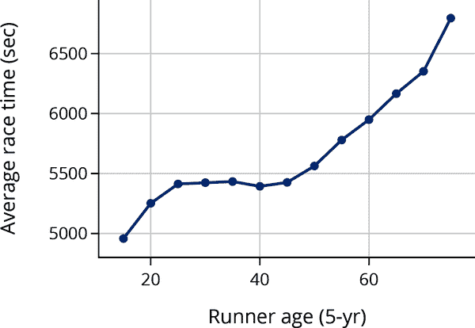
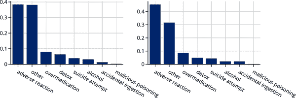

# 第十一章 数据可视化

作为数据科学家，我们创建数据可视化是为了理解我们的数据，并向其他人解释我们的分析。图表应该传达一个信息，我们的工作是尽可能清晰地传达这个信息。

在第十章中，我们将统计图的选择与所绘制数据的类型联系起来；我们还介绍了许多标准图，并展示了如何解读它们。在本章中，我们讨论了有效数据可视化的原则，这些原则使得观众更容易理解我们图中的信息。我们讨论了如何选择轴的刻度，如何通过平滑和聚合处理大量数据，如何进行有意义的比较，如何融入研究设计，并添加上下文信息。我们还展示了如何使用`plotly`这一流行的 Python 绘图包来创建图表。

撰写关于数据可视化的一章的一个棘手之处在于，可视化软件包经常变动，因此我们展示的任何代码可能很快就会过时。由于这个原因，一些书籍完全避免使用代码。我们相反地取得了平衡，覆盖了广泛有用的高级数据可视化原则。然后我们单独包含实际的绘图代码来实现这些原则。当新软件可用时，读者仍然可以使用我们的原则来指导他们的可视化创建。

# 选择比例以揭示结构

在第十章中，我们探讨了 2003 年至 2009 年间旧金山湾区房屋销售价格。让我们重新看一下这个例子，并看一看销售价格的直方图：

```py
`px``.``histogram``(``sfh``,` `x``=``'``price``'``,` `nbins``=``100``,`
             `labels``=``{``'``price``'``:``"``Sale price (USD)``"``}``,` `width``=``350``,` `height``=``250``)`

```


虽然这个图准确地显示了数据，但大部分可见的箱子都挤在图的左侧。这使得理解价格分布变得困难。

通过数据可视化，我们希望展示数据的重要特征，如分布的形状和两个或更多特征之间的关系。正如这个例子所示，当我们生成初始图后，仍然有其他方面需要考虑。在本节中，我们涵盖了帮助我们决定如何调整轴限制、放置刻度标记和应用变换的*比例原则*。我们首先检查何时以及如何调整图形以减少空白区域；换句话说，我们试图用数据填充我们图的数据区域。

## 填充数据区域

正如我们从销售价格直方图中看到的那样，当大部分数据出现在绘图区域的一个小部分时，读取分布就变得困难了。当这种情况发生时，数据的重要特征，如多模式和偏斜，可能会被掩盖。散点图也存在类似问题。当所有点都挤在散点图的一个角落时，很难看到分布的形状，因此也很难从形状中获得任何见解。

当存在少数异常大的观测时会出现这个问题。为了更好地观察数据的主要部分，我们可以通过调整 x 或 y 轴的限制删除这些观测值，或者在绘制前从数据中删除异常值。无论哪种情况，我们都会在标题或图表本身中提到这种排除。

让我们利用这个想法来改善销售价格的直方图。在接下来的并列图中，我们通过改变 x 轴的限制来裁剪数据。在左图中，我们排除了价格超过 $2 百万的房屋。这样做使得大部分房屋分布的形状在图中更加清晰。例如，我们可以更容易地观察到偏斜和较小的次要模式。在右图中，我们分别展示了分布长尾右侧的详细信息（在线查看更大的[版本](https://oreil.ly/lVDrE)）：


左图的 x 轴包含 0，但右图的 x 轴从 $2M 开始。我们考虑下一步在轴上是否包含或排除 0。

## 包含零

我们通常不需要在轴上包含 0，特别是如果包含它会使填充数据区域变得困难。例如，让我们制作一个反映狗品种平均寿命与平均身高关系的散点图。（此数据集首次在第十章介绍；它包含 172 种品种的多个特征。）


左图的 x 轴从 10 厘米开始，因为所有狗至少有这么高，类似地，y 轴从 6 年开始。右侧的散点图在两个轴上都包含 0。这将数据推到数据区域的顶部，并留下不利于我们看到线性关系的空白空间。

在柱状图中，通常需要包含 0，这样柱子的高度直接与数据值相关联。例如，我们创建了两个比较狗品种寿命的柱状图。左图包含 0，而右图不包含：


从右图可以轻易地错误地得出小品种的寿命是大品种的两倍的结论。

在处理比例时，我们通常也希望包含 0，因为比例范围从 0 到 1。下图显示了每种类型中品种的比例：


在柱状图和散点图中，包含 0 使您能够更准确地比较各类别的相对大小。

早些时候，当我们调整轴时，实际上是从绘图区域中删除了数据。虽然当少数观测值异常大（或小）时这是一个有用的策略，但在偏斜分布中效果较差。在这种情况下，我们通常需要转换数据以更好地了解其形状。

## 通过变换显示形状

另一种常见的调整比例的方法是转换数据或图的轴。我们使用变换来处理偏斜的数据，以便更容易检查分布。当变换产生对称分布时，对称性带有有用的建模属性（参见第十五章）。

有多种方法可以转换数据，但对数变换往往特别有用。例如，在下面的图表中，我们重新生成了旧金山房屋销售价格的两个直方图。顶部直方图是原始数据。对于下面的直方图，我们在绘制前对价格取了对数（以 10 为底）：


对数变换使得价格分布更对称。现在我们可以更轻松地看到分布的重要特征，如大约 <math><msup><mn>10</mn> <mrow><mn>5.85</mn></mrow></msup></math> 处的模式，约为 70 万美元，以及次要模式接近 <math><msup><mn>10</mn> <mrow><mn>5.55</mn></mrow></msup></math> 处，即 35 万美元。

使用对数变换的缺点是实际值不那么直观——在这个例子中，我们需要将值转换回美元才能理解销售价格。因此，我们通常更喜欢将轴变换为对数刻度，而不是数据本身。这样，我们可以在轴上看到原始的值：


具有对数刻度 x 轴的直方图基本上显示了与转换数据的直方图相同的形状。但由于在美元刻度上的箱子宽度相等，但在对数美元刻度上绘制，所以右侧的箱子变窄了。还要注意，y 轴上的 <math><mi>μ</mi></math> 是 <math><msup><mn>10</mn> <mrow><mo>−</mo> <mn>6</mn></mrow></msup></math> 。

对数变换还可以显示散点图中的形状。在这里，我们将建筑物大小绘制在 x 轴上，地块大小绘制在 y 轴上。在这个图中很难看出形状，因为许多点都挤在数据区域的底部：


然而，当我们同时使用对数刻度的 x 轴和 y 轴时，关系的形状更容易看出：

```py
`px``.``scatter``(``sfh``,` `x``=``'``bsqft``'``,` `y``=``'``lsqft``'``,`
           `log_x``=``True``,` `log_y``=``True``,` 
           `labels``=``{``"``bsqft``"``:` `"``Building size (sq ft)``"``,`
                   `"``lsqft``"``:` `"``Lot size (sq ft)``"``}``,`
           `width``=``350``,` `height``=``250``)`

```


通过变换后的坐标轴，我们可以看到在对数尺度上，地块大小随建筑物大小大致呈线性增加。对数变换将大值——比其他值大几个数量级的值——拉向中心。这种变换有助于填充数据区域并揭示隐藏的结构，就像我们在房价分布和房屋尺寸与地块大小之间的关系中所看到的那样。

除了设置轴的限制和变换轴外，我们还要考虑绘图的纵横比—长度与宽度的比例。调整纵横比称为*银行业务*，在下一节中，我们将展示如何通过银行业务来帮助揭示特征之间的关系。

## 解读关系

对于散点图，我们尝试选择刻度，使得两个特征之间的关系大致沿着 45 度线。这种缩放称为*银行业务向 45 度*。这样做是因为我们的眼睛更容易观察到与直线偏离的情况和趋势。例如，我们重现了显示狗品种寿命与身高关系的图：

```py
`px``.``scatter``(``dogs``,` `x``=``'``height``'``,` `y``=``'``longevity``'``,` `width``=``300``,` `height``=``250``,`
           `labels``=``{``"``height``"``:` `"``Height (cm)``"``,`
                   `"``longevity``"``:` `"``Typical lifespan (yr)``"``}``)`

```


散点图已经银行业务向 45 度，我们更容易看到数据大致沿直线分布以及它们在极端情况下的偏离。

当银行业务向 45 度倾斜有助于我们判断数据是否遵循线性关系时，当存在明显的曲率时，很难弄清楚关系的形式。在这种情况下，我们尝试能够使数据沿直线分布的变换（例如，请参阅图 11-1）。对数变换在揭示曲线关系的一般形式时非常有用。

## 透过拉直揭示关系

我们经常使用散点图来观察两个特征之间的关系。例如，在这里我们绘制了狗品种的身高与体重的关系：

```py
`px``.``scatter``(``dogs``,` `x``=``'``height``'``,` `y``=``'``weight``'``,` `width``=``350``,` `height``=``250``,`
           `labels``=``{``"``height``"``:` `"``Height (cm)``"``,` `"``weight``"``:` `"``Weight (lb)``"``}``)`

```


我们看到更高的狗体重更重，但这种关系并非线性的。

当看起来两个变量之间存在非线性关系时，尝试应用对数尺度到 x 轴、y 轴或两者都是有用的。让我们在变换轴的散点图中寻找线性关系。这里我们重新绘制了狗品种的体重与身高的图，但这次我们将对 y 轴应用了对数尺度：

```py
`px``.``scatter``(``dogs``,` `x``=``'``height``'``,` `y``=``'``weight``'``,` `log_y``=``True``,`
           `labels``=``{``"``height``"``:` `"``Height (cm)``"``,` `"``weight``"``:` `"``Weight (lb)``"``}``,`
           `width``=``300``,` `height``=``300``)`

```


这个图显示了大致线性的关系，在这种情况下，我们称狗的体重和身高之间存在对数-线性关系。

通常，当我们看到变换一个或两个轴后呈现线性关系时，我们可以使用表 11-1 来揭示原始变量的关系（在表中，a 和 b 是常数）。我们进行这些变换是因为这样更容易看出点是否沿着一条线分布，而不是看它们是否遵循幂律或指数律。

表 11-1。应用变换时两个变量之间的关系

| x 轴 | y 轴 | 关系 | 也称为 |
| --- | --- | --- | --- |
| 无转换 | 无转换 | 线性：<math><mi>y</mi> <mo>=</mo> <mi>a</mi> <mi>x</mi> <mo>+</mo> <mi>b</mi></math> | 线性 |
| 对数尺度 | 无转换 | 对数：<math><mi>y</mi> <mo>=</mo> <mi>a</mi> <mi>log</mi> <mo>⁡</mo> <mi>x</mi> <mo>+</mo> <mi>b</mi></math> | 线性-对数 |
| 无变换 | 对数比例 | 指数： <math><mi>y</mi> <mo>=</mo> <mi>b</mi> <msup><mi>a</mi> <mi>x</mi></msup></math> | 对数-线性 |
| 对数比例 | 对数比例 | 功率： <math><mi>y</mi> <mo>=</mo> <mi>b</mi> <msup><mi>x</mi> <mi>a</mi></msup></math> | 对数-对数 |

如表 11-1 所示，对数变换可以揭示几种常见类型的关系。正因如此，对数变换被认为是变换的利器。作为另一个虽然是人为的例子，图 11-1 中最左边的图显示了*x*和*y*之间的曲线关系。中间的图显示了*log(y)*和*x*之间不同的曲线关系；该图看起来也是非线性的。进一步的对数变换，最右边显示了*log(y)*对*log(x)*的图。这个图证实了数据具有对数-对数（或者功率）关系，因为变换后的点沿着一条直线分布。


###### 图 11-1\. 散点图展示了对数变换如何“拉直”两个变量之间的曲线关系

调整比例是数据可视化中的重要实践。虽然对数变换很灵活，但并不适用于所有呈现偏斜或曲率的情况。例如，有时值都大致相同数量级，对数变换影响有限。另一个需要考虑的变换是平方根变换，通常适用于计数数据。

在下一节中，我们将探讨平滑的原则，这是在需要可视化大量数据时使用的方法。

# 平滑和聚合数据

当我们有大量数据时，通常不想绘制所有单个数据点。以下散点图展示了来自[樱花](https://www.cherryblossom.org)的数据，这是每年四月份在华盛顿特区举办的一场 10 英里长的比赛，当时樱花盛开。这些数据来自比赛网站，包括 1999 年至 2012 年所有注册男性跑步者的官方时间和其他信息。我们将跑步者的年龄绘制在 x 轴上，比赛时间绘制在 y 轴上：


这个散点图包含超过 70,000 个数据点。由于数据点过多，很多点会重叠在一起。这是一个常见的问题，称为*过度绘制*。在这种情况下，过度绘制使我们无法看到时间和年龄之间的关系。在这个图中，我们唯一能看到的是一群非常年轻的跑步者，这可能指向数据质量存在问题。为了解决过度绘制的问题，我们使用平滑技术在绘图前聚合数据。

## 平滑技术揭示形状

直方图是一种熟悉的平滑绘图类型。直方图通过将点放入 bin 中并绘制每个 bin 的条形来汇总数据值。这里的平滑意味着我们不能区分 bin 中各个点的位置：点被平滑地分配到它们的 bin 中。对于直方图，bin 的面积对应于 bin 中点的百分比（或计数或比例）。（通常 bin 宽度相等，我们采取一种简便的方式将 bin 的高度标记为比例。）

下面的直方图显示了狗品种寿命的分布：


在这个直方图上方是一个折线图，为每个数据值绘制一条线。我们可以看到在最高的 bin 中，即使少量数据也会导致折线图的重叠。通过平滑处理折线图的点，直方图显示了分布的一般形状。在这种情况下，我们看到许多品种的寿命约为 12 年。有关如何阅读和解释直方图的更多信息，请参见第十章。

另一种常见的平滑技术是*核密度估计*（KDE）。KDE 图使用平滑曲线而不是柱状图显示分布。在下面的图中，我们展示了同一狗寿命直方图，并覆盖了一个 KDE 曲线。KDE 曲线与直方图具有类似的形状：


把直方图看作平滑方法可能会让人惊讶。KDE 和直方图都旨在帮助我们看到值分布中的重要特征。类似的平滑技术也可以用于散点图。这是下一节的主题。

## 揭示关系和趋势的平滑技术

我们可以通过分 bin 数据来找到散点图的高密度区域，就像直方图一样。下面的图重新绘制了樱花大赛时间与年龄的散点图。这张图使用了六边形 bin 将点聚合在一起，并根据落入其中的点数对六边形进行了阴影处理：

```py
`runners_over_17` `=` `runners``[``runners``[``"``age``"``]` `>` `17``]`

`plt``.``figure``(``figsize``=``(``4``,` `4``)``)`
`plt``.``hexbin``(``data``=``runners_over_17``,` `x``=``'``age``'``,` `y``=``'``time``'``,` `gridsize``=``35``,` `cmap``=``'``Blues``'``)`

`sns``.``despine``(``)`
`plt``.``grid``(``False``)`
`plt``.``xlabel``(``"``Runner age (yr)``"``)`
`plt``.``ylabel``(``"``Race time (sec)``"``)``;`

```


注意在 25 到 40 岁组中的高密度区域，通过图中的深色区域表示。图表告诉我们，许多这个年龄段的跑者大约在 5,000 秒（约 80 分钟）内完成比赛。（请注意，我们从这个图中删除了年轻跑者的数据。）我们还可以看到 40 到 60 岁组对应区域的向上曲率，这表明这些跑者通常比 25 到 40 岁组的跑者慢。这张图类似于热图，其中高密度区域通过更热或更亮的颜色传达。

核密度估计在二维中也适用。当我们在二维中使用 KDE 时，通常绘制结果三维形状的轮廓线图，并像读取地形图一样解读图形：

```py
`plt``.``figure``(``figsize``=``(``5``,` `3``)``)`
`fig` `=` `sns``.``kdeplot``(``data``=``runners_over_17``,` `x``=``'``age``'``,` `y``=``'``time``'``)`
`plt``.``xlabel``(``"``Runner age (yr)``"``)`
`plt``.``ylabel``(``"``Race time (sec)``"``)``;`

```


这个二维 KDE 提供了与前一图中阴影区域相似的见解。我们看到 25 到 40 岁年龄组的跑步者高度集中，这些跑步者的时间大约为 5,000 秒左右。平滑使我们在数据量大时能够更清楚地看到整体情况，因为它可以显示高度集中数据值的位置和这些高集中区域的形状。否则这些区域可能无法看到。

另一种经常更具信息性的平滑方法是对具有相似 x 值的点的 y 值进行平滑处理。简单来说，我们将具有相似年龄的跑步者分组，使用五年递增：20–25、25–30、30–35 等。然后，对于每个五年的跑步者组，我们计算其平均比赛时间，绘制每组的平均时间，并连接点以形成一个“曲线”：

```py
`times` `=` `(`
    `runners_over_17``.``assign``(``age_5yr``=``runners_over_17``[``'``age``'``]` `/``/` `5` `*` `5``)`
    `.``groupby``(``'``age_5yr``'``)``[``'``time``'``]``.``mean``(``)``.``reset_index``(``)`
`)`

`px``.``line``(``times``,` `x``=``'``age_5yr``'``,` `y``=``'``time``'``,`
        `labels``=``{``'``time``'``:``"``Average race time (sec)``"``,` `'``age_5yr``'``:``"``Runner age (5-yr)``"``}``,`
        `markers``=``True``,` 
        `width``=``350``,` `height``=``250``)`

```


这幅图再次显示，年龄在 25 到 40 岁之间的跑步者典型的跑步时间约为 5,400 秒。它还显示，老年跑步者平均完成比赛时间较长（这并不令人意外，但在早期的图表中没有那么明显）。年龄在 20 岁以下的跑步者时间的下降和 80 岁时曲线的平坦可能仅仅是这些组别中跑步者较少且更健壮的结果。另一种平滑技术使用与 KDE 类似的核平滑。我们这里不详细介绍。

分箱和核平滑技术依赖于一个调整参数，该参数指定箱的宽度或核的扩展，并且在制作直方图、KDE 或平滑曲线时通常需要指定此参数。这是下一节的主题。

## 平滑技术需要调整

现在我们已经看到平滑在绘图中的用处，我们转向调整的问题。对于直方图，箱宽度或者对于等宽箱，箱的数量会影响直方图的外观。这里显示的长寿左直方图有几个宽箱子，而右侧直方图有许多窄箱子（在线上查看更大图像[online](https://oreil.ly/SmLYq)）：


在两个直方图中，很难看出分布的形状。在几个宽箱子（左图）中，我们对分布进行了过度平滑处理，这使得无法分辨模式和尾部。另一方面，太多的箱子（右图）给出的图像与地毯图相差无几。KDE 图中有一个称为*带宽*的参数，其作用类似于直方图的箱宽度。

大多数直方图和 KDE 软件会自动选择直方图的箱宽度和核的带宽。然而，这些参数通常需要一点调整才能创建最有用的图形。当您创建依赖调整参数的可视化时，重要的是在最终确定一个参数值之前尝试几种不同的值。

数据减少的另一种不同方法是检查分位数。这是下一节的主题。

## 减少分布到分位数

在第十章中我们发现，虽然箱线图不如直方图信息丰富，但在一次比较多个组的分布时它们是有用的。箱线图基于数据的四分位数将数据减少到几个基本特征。更一般地，分位数（下四分位数、中位数和上四分位数分别是第 25、50 和 75 个分位数）在比较分布时可以提供有用的数据缩减。

当两个分布在形状上大致相似时，用直方图可能很难比较它们。例如，以下直方图展示了旧金山房屋数据中两卧室和四卧室房屋价格的分布。这些分布在形状上看起来大致相似。但是它们的分位数图可以方便地比较分布的中心、传播和尾部（在线上更大地查看[在线](https://oreil.ly/zVagW)）：

```py
`px``.``histogram``(``sfh``.``query``(``'``br in [2, 4]``'``)``,`
             `x``=``'``price``'``,` `log_x``=``True``,` `facet_col``=``'``br``'``,` 
             `labels``=``{``'``price``'``:``"``Sale price (USD)``"``}``,`
             `width``=``700``,` `height``=``250``)`

```


我们可以用*分位数-分位数*图来比较，简称为*q-q 图*。为了制作这种图，我们首先计算价格的两卧室和四卧室分布的百分位数（也称为分位数）：

```py
`br2` `=` `sfh``.``query``(``'``br == 2``'``)`
`br4` `=` `sfh``.``query``(``'``br == 4``'``)`
`percs` `=` `np``.``arange``(``1``,` `100``,` `1``)`
`perc2` `=` `np``.``percentile``(``br2``[``'``price``'``]``,` `percs``,` `method``=``'``lower``'``)`
`perc4` `=` `np``.``percentile``(``br4``[``'``price``'``]``,` `percs``,` `method``=``'``lower``'``)`
`perc_sfh` `=` `pd``.``DataFrame``(``{``'``percentile``'``:` `percs``,` `'``br2``'``:` `perc2``,` `'``br4``'``:` `perc4``}``)`
`perc_sfh`

```

|   | 百分位数 | br2 | br4 |
| --- | --- | --- | --- |
| --- | --- | --- | --- |
| **0** | 1 | 1.50e+05 | 2.05e+05 |
| **1** | 2 | 1.82e+05 | 2.50e+05 |
| **2** | 3 | 2.03e+05 | 2.75e+05 |
| **...** | ... | ... | ... |
| **96** | 97 | 1.04e+06 | 1.75e+06 |
| **97** | 98 | 1.20e+06 | 1.95e+06 |
| **98** | 99 | 1.44e+06 | 2.34e+06 |

```py
99 rows × 3 columns
```

然后在散点图上绘制匹配的百分位数。通常我们也会显示参考线 y = x 来帮助比较：

```py
`fig` `=` `px``.``scatter``(``perc_sfh``,` `x``=``'``br2``'``,` `y``=``'``br4``'``,` `log_x``=``True``,` `log_y``=``True``,` 
                 `labels``=``{``'``br2``'``:` `'``Price of 2-bedroom house``'``,`
                         `'``br4``'``:` `'``Price of 4-bedroom house``'``}``,`
                 `width``=``350``,` `height``=``250``)`

`fig``.``add_trace``(``go``.``Scatter``(``x``=``[``1e5``,` `2e6``]``,` `y``=``[``1e5``,` `2e6``]``,` 
            `mode``=``'``lines``'``,` `line``=``dict``(``dash``=``'``dash``'``)``)``)`

`fig``.``update_layout``(``showlegend``=``False``)`
`fig`

```


当分位点沿直线分布时，变量具有类似形状的分布。与参考线平行的线表示中心的差异，斜率不为 1 的线表示传播的差异，而曲线表示形状的差异。从前述的分位数图中，我们看到四卧室房屋价格的分布在形状上与两卧室的分布类似，除了大约 10 万美元的偏移和稍长的右尾（对大值的上升弯曲指示）。阅读分位数图需要练习。一旦你掌握了技巧，它可以是比较分布的一种便捷方式。注意，房屋数据有超过 10 万个观察值，而分位数图将数据减少到 99 个百分位数。这种数据缩减非常有用。然而，我们并不总是想使用平滑处理器。这是下一节的主题。

## 当不进行平滑处理时

平滑和聚合可以帮助我们看到重要的特征和关系，但是当我们只有少数观测时，平滑技术可能会误导我们。只有少数观测时，我们更喜欢地毯图而不是直方图、箱线图和密度曲线，而是使用散点图而不是平滑曲线和密度轮廓。这似乎是显而易见的，但是当我们有大量数据时，子组中的数据量可能会迅速减少。这种现象是 *维度诅咒* 的一个例子。

平滑最常见的误用之一发生在箱线图中。例如，这是寿命的七个箱线图的集合，每个箱线图代表一种狗品种：

```py
`px``.``box``(``dogs``,` `x``=``'``group``'``,` `y``=``'``longevity``'``,` 
       `labels``=``{``'``group``'``:``"``"``,` `'``longevity``'``:``"``Longevity (yr)``"``}``,`
       `width``=``500``,` `height``=``250``)`

```


其中一些箱线图只有两到三个观测值。接下来的条形图是一种更可取的可视化方法：

```py
`px``.``strip``(``dogs``,` `x``=``"``group``"``,` `y``=``"``longevity``"``,` 
         `labels``=``{``'``group``'``:``"``"``,` `'``longevity``'``:``"``Longevity (yr)``"``}``,`
         `width``=``400``,` `height``=``250``)`

```


在这个图中，我们仍然可以比较各组，但我们也可以看到每组中的确切值。现在我们可以看出非运动组中只有三个品种；基于箱线图的偏斜分布的印象过于看重箱线的形状。

本节介绍了由于大型数据集而产生重叠点的过绘制问题。为了解决这个问题，我们介绍了聚合数据的平滑技术。我们看到了平滑的两个常见示例—分箱和核平滑—并将它们应用于一维和二维设置中。在一维中，这些是直方图和核密度曲线，它们都帮助我们看到分布的形状。在二维中，我们发现在保持 x 值不变的同时平滑 y 值是有用的，以可视化趋势。我们解决了需要调整平滑量以获得更多信息的直方图和密度曲线，并警告不要用太少的数据进行平滑处理。

有许多其他减少散点图中的重叠的方法。例如，我们可以使点部分透明，以便重叠点显示更暗。如果许多观测值具有相同的值（例如当寿命四舍五入到最接近的年份时），那么我们可以向值添加少量随机噪声，以减少重叠的数量。这个过程称为 *jittering*，它用于寿命的条形图。透明度和 jittering 对于中等大小的数据很方便。但是，它们对于大型数据集效果不佳，因为绘制所有点仍然会压倒可视化。

我们介绍的分位数图为比较具有远少于点数的分布提供了一种方法；另一种方法是使用并排箱线图，还有一种方法是在同一图中叠加 KDE 曲线。我们经常旨在比较数据子集（或组）之间的分布和关系，接下来我们将讨论几种促进各种图类型的有意义比较的设计原则。

# 促进有意义的比较

同样的数据可以用许多不同的方式进行可视化，决定制作哪种图表可能令人生畏。一般来说，我们的图表应该帮助读者进行有意义的比较。在本节中，我们讨论了几个有用的原则，可以提高图表的清晰度。

## 强调重要的差异

每当我们制作一个比较不同群体的图表时，我们都会考虑图表是否突出了重要的差异。一般来说，当图表中的对象以使比较更容易阅读的方式对齐时，读者更容易看到差异。让我们看一个例子。

[美国劳工统计局](https://oreil.ly/b0YMJ)发布了有关收入的数据。我们以 2020 年全职等效周收入的中位数为基础，对超过 25 岁的人群按教育水平和性别进行了分组：^(1)

```py
`labels` `=` `{``"``educ``"``:` `"``Education``"``,` 
          `"``income``"``:` `"``Weekly earnings (USD)``"``,` 
          `"``gender``"``:` `"``Sex``"``}`
`fig` `=` `px``.``bar``(``earn``,` `x``=``"``educ``"``,` `y``=``"``income``"``,`
             `facet_col``=``"``gender``"``,` `labels``=``labels``,`
             `width``=``450``,` `height``=``250``)`
`fig``.``update_layout``(``margin``=``dict``(``t``=``30``)``)`

```


这些条形图显示，随着教育程度的提高，收入也增加。但可以说，一个更有趣的比较是相同教育水平下男女之间的比较。我们可以以不同的方式分组条形图，以便集中在这种比较上：

```py
`px``.``bar``(``earn``,` `x``=``'``educ``'``,` `y``=``'``income``'``,` `color``=``'``gender``'``,`
       `barmode``=``'``group``'``,` `labels``=``labels``,`
       `width``=``450``,` `height``=``250``)`

```


这个图更好；我们可以更容易地比较每个教育水平男性和女性的收入。然而，我们可以通过垂直对齐进一步明确这种差异。我们不再使用条形，而是在每个教育水平上使用点来代表男性和女性群体：

```py
`fig` `=` `px``.``line``(``earn``,` `x``=``'``educ``'``,` `y``=``'``income``'``,` `symbol``=``'``gender``'``,`
              `color``=``'``gender``'``,` `labels``=``labels``,` `width``=``450``,` `height``=``250``)`
`fig``.``update_traces``(``marker_size``=``10``)`

```


这个图更清晰地显示了一个重要的差异：男性和女性的收入差距随着教育程度的提高而扩大。我们考虑了三个可视化同一数据的图表，但它们在传达信息的方式上有所不同。我们更喜欢最后一个，因为它将收入差异垂直对齐，更易于比较。

注意，在制作所有三个图表时，我们按照教育水平从少到多的顺序对教育类别进行了排序。这种排序是有意义的，因为教育水平是有序的。当我们比较名义类别时，我们使用其他排序方法。

## 分组顺序

对于有序特征，当我们制作图表时，我们保持类别的自然顺序，但对于名义特征，这个原则不适用。相反，我们选择一种有助于比较的顺序。在条形图中，按照高度排序条形是一个好的做法，而对于箱线图和条带图，通常按照中位数的顺序排列箱子/条带。

后面的两个条形图各自比较了不同狗品种的平均寿命：


左边的图按字母顺序排列了条形，我们更喜欢右边的图，因为它按寿命的顺序排列了条形，这样更容易比较各个类别的寿命。我们不需要来回跳跃或眯起眼睛去猜测牧群犬是否比玩具犬寿命更短。

作为另一个例子，以下两组箱线图比较了旧金山东湾地区不同城市的房屋销售价格分布：


我们更喜欢右侧的图表，因为它按每个城市的中位数价格排序了箱子。同样，这种排序使得更容易比较组（在这种情况下是城市）之间的分布。我们看到 Albany 和 Walnut Creek 的下四分位数和中位数价格大致相同，但是 Walnut Creek 的价格有更大的右偏。

在可能的情况下，按高度排序条形图中的条和箱线图中的箱子，使得我们更容易比较不同组之间的数据。用于呈现分组数据的另一种技术是堆叠。我们将在下一节介绍堆叠，并提供示例以说服您远离这种类型的图表。

## 避免堆积

接下来的图示是一个堆积条形图，其中每个城市都有一根条形，并按照销售房屋中卧室数从一到八个或更多的比例进行划分。这称为*堆积条形图*。条形图基于一个交叉制表：

```py
`br_crosstab`

```

| br | 1.0 | 2.0 | 3.0 | 4.0 | 5.0 | 6.0 | 7.0 | 8.0 |
| --- | --- | --- | --- | --- | --- | --- | --- | --- |
| city |   |   |   |   |   |   |   |   |
| --- | --- | --- | --- | --- | --- | --- | --- | --- |
| **Albany** | 1.21e-01 | 0.56 | 0.25 | 0.05 | 9.12e-03 | 1.01e-03 | 2.03e-03 | 4.05e-03 |
| **Berkeley** | 6.91e-02 | 0.38 | 0.31 | 0.16 | 4.44e-02 | 1.42e-02 | 6.48e-03 | 7.23e-03 |
| **El Cerrito** | 1.81e-02 | 0.34 | 0.47 | 0.14 | 2.20e-02 | 6.48e-03 | 0.00e+00 | 6.48e-04 |
| **Piedmont** | 8.63e-03 | 0.22 | 0.40 | 0.26 | 9.50e-02 | 1.29e-02 | 7.19e-03 | 1.44e-03 |
| **Richmond** | 3.60e-02 | 0.36 | 0.42 | 0.15 | 2.52e-02 | 7.21e-03 | 7.72e-04 | 7.72e-04 |
| **Walnut Creek** | 1.16e-01 | 0.35 | 0.30 | 0.18 | 4.37e-02 | 5.08e-03 | 4.12e-04 | 2.75e-04 |

绘图中的每个条形的高度都相同，因为段代表城市中一卧室或更多卧室的房屋比例，因此总和为 1 或 100%（在线查看[详细信息](https://oreil.ly/cIba_)）：

```py
`fig` `=` `px``.``bar``(``br_crosstab``,` `width``=``450``,` `height``=``300``)`
`fig``.``update_layout``(``yaxis_title``=``None``,` `xaxis_title``=``None``,`
                  `legend_title``=``"``# Bedrooms``"``)`
`fig``.``show``(``)`

```


通过简单地扫描每列第一个片段顶部，很容易比较每个城市一卧室房屋的比例。但是，比较四卧室房屋就更加困难。由于段的底部水平不对齐，我们必须用眼睛判断绘图中上下移动的段长度。这种上下移动称为*基线摆动*。（我们意识到，由于颜色过多，这个图在灰度中显示效果不佳，但我们的目标是引导你远离这样的图表，所以对于在线阅读的读者，我们保留了所有的颜色。）

堆叠线图更难阅读，因为我们必须判断曲线之间的间隙，而它们上下摇晃。下图显示了 1950 年至 2012 年排放量最高的 10 个国家的[二氧化碳（CO[2]）排放](https://oreil.ly/kjk9N)（在线查看颜色[online](https://oreil.ly/VUyuz)）：


由于这些线条是堆叠在一起的，很难看出特定国家的排放量如何变化，也很难比较各个国家。相反，我们可以绘制每个国家的线条，而不是堆叠，如下图所示（在线查看颜色[online](https://oreil.ly/erWuU)）：


现在查看单个国家的变化以及比较国家变得更加容易，因为我们只需要判断 y 轴位置而不是具有不同基线的短垂直段。我们还在 y 轴上使用了对数刻度。现在我们可以看到，一些国家的二氧化碳排放率增长缓慢，例如美国和日本，而其他国家的增长速度更快，如中国和印度，而德国减缓了其二氧化碳排放。在每个国家的基线在图中摇晃时，几乎不可能检测到这些方面。

在这两个图中，为了更容易区分各个国家，我们使用了不同的线型和颜色。选择颜色以促进比较依赖于许多考虑因素。这是下一节的主题。

## 选择调色板

选择颜色在数据可视化中也起着重要作用。我们希望避免使用过亮或过暗的颜色，以免给读者的眼睛带来压力。我们还应避免对色盲人士可能困难的调色板——7%到 10%的人（主要是男性）是红绿色盲。

对于分类数据，我们希望使用一种可以清楚区分类别的调色板。图 11-2 中的顶部展示了一个示例（参见 Figure 11-2）。从上到下，这些调色板用于分类数据的定性，用于数值数据的分散调色板，其中希望吸引对大值和小值的注意力，以及用于数值数据的顺序调色板，其中希望强调大或小值。


###### 图 11-2. 来自 ColorBrewer 2.0 的三种适合打印的调色板（在线查看颜色[online](https://oreil.ly/0ub2H)）

对于数值数据，我们希望使用顺序调色板，强调光谱的一侧而不是另一侧，或者使用分散调色板，两端平衡强调，中间淡化。图 11-2 显示了顺序调色板位于底部，分散调色板位于中间（参见 Figure 11-2）：

当我们想要强调低或高值（如癌症率）时，我们选择一个顺序调色板。当我们想要强调两个极端（如两党选举结果）时，我们选择一个分散调色板。

选择感知统一的颜色调色板非常重要。这意味着当数据值加倍时，可视化中的颜色在人眼中看起来会变得两倍鲜艳。我们还希望避免颜色会在我们从图表的一个部分看向另一个部分时产生余像，不同强度的颜色会使一个属性看起来比另一个属性更重要，以及色盲人士难以区分的颜色。我们强烈建议使用专为数据可视化制作的调色板或调色板生成器。

图表应该被长时间检查，因此我们应该选择不妨碍读者仔细研究图表的颜色。更重要的是，颜色的使用不应是多余的——颜色应该代表信息。相关的是，人们通常很难区分超过七种颜色，因此我们限制图表中颜色的数量。最后，颜色在纸上打印时可能与在计算机屏幕上查看时相差很大。在选择颜色时，我们考虑我们的图表将如何显示。

在可视化中进行准确的比较是如此重要，以至于研究人员已经研究了人们感知颜色和其他绘图特征（如角度和长度）差异的程度。这是下一节的主题。

## 绘图比较的指南

研究人员研究了人们在不同类型的图表中读取信息的准确度。他们发现以下排序，从最准确到最不准确：

+   沿着共同刻度的位置，比如在地毯图、条带图或点图中

+   在相同但非对齐刻度上的位置，比如在条形图中

+   长度，在堆叠条形图中

+   角度和斜率，在饼图中

+   面积，在堆叠线图或气泡图中

+   体积和密度，在三维条形图中

+   颜色的饱和度和色调，比如在使用半透明点进行重叠绘制时

例如，这是一个显示旧金山售出的房屋中拥有从一到八个或更多卧室比例的饼图，以及具有相同比例的条形图：


在饼图中很难判断角度，需要用实际百分比进行注释。我们还失去了卧室数量的自然顺序。条形图没有这些问题。

然而，任何规则都有例外。每个饼图中只有两个或三个片段的多个饼图可以提供有效的可视化效果。例如，一组饼图显示旧金山东湾地区六个城市中每个城市售出的两卧室房屋的比例，按比例排序，可以产生深远的可视化效果。然而，坚持使用条形图通常至少和任何饼图一样清晰。

根据这些准则，我们建议在进行比较时坚持使用位置和长度。读者可以更准确地根据位置或长度来判断比较，而不是角度、面积、体积或颜色。但是，如果我们想向图表添加额外信息，通常会使用颜色、符号和线型，除了位置和长度。我们在本章中展示了几个例子。

接下来我们转向数据设计的话题，讨论如何在可视化中反映数据收集的时间、地点和方式的方面。这是一个微妙但重要的话题。如果忽略数据的范围，我们可能会得到非常误导人的图表。

# 结合数据设计

当我们创建可视化时，考虑数据的范围尤为重要，特别是数据设计（见第二章）。考虑数据收集方式的问题可以影响我们的图表选择和所描绘的比较。这些考虑包括数据收集的时间和地点，以及用于选择样本的设计。我们看几个例子，展示数据范围如何影响我们所做的可视化。

## 数据随时间的收集

当数据随时间收集时，我们通常制作一条线图，将时间戳放在 x 轴上，将感兴趣的特征放在 y 轴上，以便观察时间趋势。例如，让我们重新审视旧金山房价数据。这些数据从 2003 年到 2008 年收集，展示了 2008/2009 年美国房地产泡沫的崩溃（[美国房地产泡沫](https://oreil.ly/PUPiQ)）。由于时间是这些数据范围的关键方面，让我们将销售价格可视化为时间序列。我们之前的探索显示销售价格高度偏斜，所以让我们使用百分位数而不是平均数。我们绘制中位数价格（这是我们在本章早些时候看到的一种平滑形式）：


此图显示了 2003 年到 2007 年价格的上升和 2008 年的下降。但是，我们可以通过绘制几个额外的百分位数线来展示更多信息，而不仅仅是中位数。让我们为第 10、30、50（中位数）、70 和 90 百分位数的销售价格分别绘制不同的线条。当我们随时间检查价格时，通常需要校正通货膨胀，以便比较处于相同基础上。除了通货膨胀调整外，让我们将价格相对于 2003 年的起始价格进行绘制，每个百分位数的起始值为 y = 1。 （2006 年 90 百分位数的值为 1.5 表明，销售价格是 2003 年 90 百分位数的 1.5 倍）。这种归一化方法使我们能够看到住房市场不同部分的房屋危机如何影响房主：


当我们随时间跟踪第 10 百分位线的折线图时，我们发现它在 2005 年迅速上升，在接下来的几年里相对于 2003 年的值保持较高水平，然后比其他百分位数更早更快地下降。这告诉我们，较便宜的房屋，如起始家庭住房，在房地产市场崩溃中遭受了更大的波动并且损失了更多的价值。相比之下，高端住房受到的冲击较小；在 2008 年底，第 90 百分位数的房价仍高于 2003 年的价格。应用这一领域知识有助于揭示我们可能会忽略的数据趋势，并展示如何利用数据设计来改善可视化。

住房数据是一个关于特定时期内特定地理区域的完全普查的观察数据的例子。接下来，我们考虑另一个观察性研究，其中自我选择和时间段影响了可视化效果。

## 观察性研究

我们需要特别小心那些不构成人口普查或科学样本的数据。我们也应该注意横断面研究，无论是来自人口普查还是科学样本。在这个例子中，我们重新审视了樱花 10 英里赛的数据。在本章的早些时候，我们制作了一个平滑曲线来研究赛时与年龄之间的关系。我们在这里再次重现这个图表，以突显解释可能存在的潜在陷阱：



诱人的是，看到这张图表可能会得出结论，例如，60 岁的跑步者通常比 40 岁时需要额外花费 600 秒来完成比赛。然而，这是一个*横断面*研究，而不是*纵向*研究。该研究并未随时间跟踪人们的变化；相反，它获取了一个人群的横截面。在图表中代表 60 岁跑步者的人与代表 40 岁跑步者的人是不同的。这两组人可能在影响赛时与年龄关系的方式上有所不同。作为一个群体，比赛中的 60 岁老人可能比 40 岁的老人更适合他们的年龄。换句话说，数据设计不允许我们对个体跑步者做出结论。这个可视化并没有错，但我们在从中得出结论时需要小心。

这个设计更加复杂，因为我们有多年的比赛结果。每一年形成一个队列，一个选手组，而从一年到下一年，队列会改变。我们通过比较不同年份的选手来清晰地传达这个信息。在这里，我们分别画出了 1999 年、2005 年和 2010 年的选手线路图：


我们看到 2010 年每个年龄组的中位数比 2005 年的跑步者更高，而 2005 年的跑步者的时间比 1999 年的跑步者更高。有趣的是，随着比赛的增加，尤其是近年来新手跑步者的参与增加，比赛时间逐年放缓。这个例子显示了我们在解释模式时需要注意数据范围。在科学研究中，我们也需要牢记数据范围。这是下一节的主题。

## 不均匀抽样

在科学研究中，我们必须考虑样本设计，因为它可能影响我们的图表。一些样本以不均等的速率抽取个体，这需要在我们的可视化中进行考虑。我们在第八章和第九章中看到了科学研究的例子：药物滥用警告网络（DAWN）调查。这些数据来自于关于药物相关急诊访问的复杂随机研究，每个记录都带有一个权重，我们必须使用这些权重来准确地代表人口中的急诊访问情况。接下来的两个条形图显示了急诊访问类型的分布。可以在[在线链接](https://oreil.ly/LYAol)上查看更大的版本。左侧的图表未使用调查权重，右侧的图表使用了：



在未加权的条形图中，“其他”类别与“不良反应”类别一样频繁。然而，加权后，“其他”类别下降到“不良反应”的约三分之二。忽略抽样权重可能会导致分布的误导性呈现。无论是直方图、条形图、箱线图、二维轮廓还是光滑曲线，我们都需要使用权重来获得代表性的图表。数据范围的另一个影响我们图表选择的方面是数据收集的地点，这是下一节的主题。

## 地理数据

当我们的数据包含像纬度和经度这样的地理信息时，除了典型的图表外，我们应该考虑制作地图。例如，下图展示了美国空气质量传感器的位置，这是第十二章案例研究的重点：


注意加利福尼亚州和东海岸有更多的数据点。使用所有这些传感器数据的简单空气质量直方图会误代表美国的空气质量分布。为了将空间因素纳入分布中，我们可以使用不同颜色的标记将空气质量测量添加到地图上，并且可以按位置分面显示空气质量的直方图。

除了绘制条形、颜色和线条样式等特征外，我们还可以选择添加文本以提供背景信息，从而使我们的图表更具信息性。这是下一节的主题。

# 添加背景信息

在本章中，我们在图表中使用文本来提供包括测量单位的有意义的轴标签、用于类别的刻度标签和标题。在广泛分享可视化时，这是一个良好的实践。一个好的目标是在图中包含足够的上下文，使其能够独立存在——读者应该能够理解图的主要内容，而不需要到处寻找解释。尽管如此，统计图的每个元素都应该有一个目的。多余的文本或图表功能，通常称为*图表垃圾*，应该被消除。在本节中，我们提供了如何通过添加上下文来创建一个出版准备好的图表的简要概述。

文本上下文包括*标签*和*标题*。在刻度标记和轴上一贯使用信息丰富的标签是一个良好的做法。例如，轴标签通常受益于包含测量单位。当需要时，图表应包含标题和图例。信息丰富的标签对于其他人会看到和解释的图表尤为重要。然而，即使在进行我们自己的探索性数据分析时，我们通常也希望包含足够的上下文，以便在稍后返回分析时，我们能够轻松地理解我们绘制了什么。

标题起到了几个作用。它们描述了绘制的内容并指导读者。标题还指出了图的重要特征并评论了它们的含义。标题中重复文本中的信息是可以接受的。读者通常会快速浏览出版物并关注章节标题和可视化内容，因此图的标题应该是自包含的。

*参考标记*为绘图区域带来了额外的背景信息。提供基准、历史值和其他外部信息的参考点和参考线帮助进行比较和解释。例如，我们经常在分位数-分位数图上添加斜率为 1 的参考线。我们还可能在时间序列图上添加垂直线以标记特殊事件，如自然灾害。

下面的例子演示了如何向绘图添加这些上下文元素。

## 例子：100 米短跑时间

以下图显示了自 1968 年以来男子 100 米短跑的比赛时间。这些数据仅包括在正常风条件下、使用电子计时的户外比赛，并且仅包括在 10 秒内完成比赛的选手的时间。图表是一个基本的散点图，显示了时间与年份的关系。从这张图开始，我们对其进行了增强，以创建一幅出现在[FiveThirtyEight 文章](https://oreil.ly/pxHr4)中的图表。


当我们想要准备一张图形供他人阅读时，我们考虑的是主要信息。在这种情况下，我们的主要信息是双重的：在过去的 50 年中，最佳选手们的速度越来越快，而乌塞恩·博尔特在 2009 年创下的 9.58 秒的非凡记录至今未被打破（事实上，第二快的比赛时间也属于博尔特）。我们通过添加直接陈述主要信息的标题、y 轴标签中的测量单位以及散点图中关键点的注释来提供这张图形的背景信息。此外，我们添加了一个水平参考线，在 10 秒以下的时间中仅绘制时间，以澄清世界纪录时间使用特殊符号来引起读者的注意。


这些背景信息描述了我们所绘制的内容，帮助读者看到主要信息，并指出数据中几个有趣的特征。现在，这张图可以成为幻灯片、技术报告或社交媒体帖子的有用部分。根据我们的经验，查看我们的数据分析的人记住我们的图形，而不是段落文本或方程式。为他人准备的图形添加背景信息是非常重要的。

在下一节中，我们将详细介绍如何使用 `plotly` Python 包创建图形。

# 使用 `plotly` 创建图形

在本节中，我们介绍了使用 `plotly` Python 包的基础知识，这是我们在本书中创建图形所使用的主要工具。

`plotly` 包相比其他绘图库有几个优点。它创建的是交互式图形而不是静态图像。当你在 `plotly` 中创建一个图形时，你可以平移和缩放，以查看通常太小以至于看不见的图形部分。你还可以悬停在图形元素上，比如散点图中的符号，以查看原始数据值。此外，`plotly` 可以使用 SVG 文件格式保存图形，这意味着即使放大后图像仍然清晰。如果你在 PDF 或书本的纸质副本中阅读本章节，我们使用了这个功能来渲染图形图像。最后，它有一个简单的“express” API，用于创建基本图形，这在进行探索性分析并想快速创建多个图形时非常有帮助。

在本节中，我们介绍了 `plotly` 的基础知识。如果你在这里遇到未涵盖的内容，我们建议查阅[官方 `plotly` 文档](https://plotly.com/python)。

## 图形和轨迹对象

每个 `plotly` 中的图形都包装在一个 `Figure` 对象中。`Figure` 对象跟踪要绘制的内容。例如，一个单独的 `Figure` 可以在左侧绘制散点图，在右侧绘制线图。`Figure` 对象还跟踪图形的布局，包括图形的大小、标题、图例和注释。

`plotly.express` 模块提供了一个简洁的 API 来制作图形：

```py
`import` `plotly``.``express` `as` `px`

```

我们在以下代码中使用 `plotly.express` 制作了一张关于狗品种体重与身高的散点图。请注意，`.scatter()` 的返回值是一个 `Figure` 对象：

```py
`fig` `=` `px``.``scatter``(`
    `dogs``,` `x``=``"``height``"``,` `y``=``"``weight``"``,`
    `labels``=``dict``(``height``=``"``Height (cm)``"``,` `weight``=``"``Weight (kg)``"``)``,`
    `width``=``350``,` `height``=``250``,`
`)`

`fig``.``__class__`

```

```py
plotly.graph_objs._figure.Figure

```

显示 `Figure` 对象将其渲染到屏幕上：

```py
`fig`

```


这个特定的 `Figure` 包含了一个图表，但是 `Figure` 对象可以包含任意数量的图表。在这里，我们创建了一个包含三个散点图的分面图：

```py
`# The plot titles are cut off; we'll fix them in the next snippet`
`px``.``scatter``(``dogs``,` `x``=``'``height``'``,` `y``=``'``weight``'``,`
           `facet_col``=``'``size``'``,`
           `labels``=``dict``(``height``=``"``Height (cm)``"``,` `weight``=``"``Weight (kg)``"``)``,`
           `width``=``550``,` `height``=``250``)`

```


这三个图表存储在 `Trace` 对象中。但是，我们尽量避免手动操作 `Trace` 对象。相反，`plotly` 提供了自动创建分面子图的函数，例如我们这里使用的 `px.scatter` 函数。现在我们已经看到如何制作简单的图表，接下来我们展示如何修改图表。

## 修改布局

我们经常需要更改图表的布局。例如，我们可能想调整图表的边距或轴范围。我们可以使用 `Figure.update_layout()` 方法来实现这一点。在我们制作的分面散点图中，标题被裁剪，因为图表的边距不够大。我们可以通过 `Figure.update_layout()` 来更正这个问题：

```py
`fig` `=` `px``.``scatter``(``dogs``,` `x``=``'``height``'``,` `y``=``'``weight``'``,`
                 `facet_col``=``'``size``'``,`
                 `labels``=``dict``(``height``=``"``Height (cm)``"``,` `weight``=``"``Weight (kg)``"``)``,`
                 `width``=``550``,` `height``=``250``)`

`fig``.``update_layout``(``margin``=``dict``(``t``=``40``)``)`
`fig`

```


`.update_layout()` 方法允许我们修改布局的任何属性。这包括图表标题 (`title`)、边距 (`margins` 字典) 和是否显示图例 (`showlegend`)。`plotly` 文档中列出了完整的 [布局属性](https://oreil.ly/aBLxx)。

`Figure` 对象还具有 `.update_xaxes()` 和 `.update_yaxes()` 函数，与 `.update_layout()` 类似。这两个函数允许我们修改轴的属性，如轴限制 (`range`)、刻度数 (`nticks`) 和轴标签 (`title`)。在这里，我们调整了 y 轴的范围，并更改了 x 轴的标题。我们还为图表添加了标题，并更新了布局，以避免标题被裁剪：

```py
`fig` `=` `px``.``scatter``(`
    `dogs``,` `x``=``"``weight``"``,` `y``=``"``longevity``"``,`
    `title``=``"``Smaller dogs live longer``"``,`
    `width``=``350``,` `height``=``250``,`
`)`

`fig``.``update_yaxes``(``range``=``[``5``,` `18``]``,` `title``=``"``Typical lifespan (yr)``"``)`
`fig``.``update_xaxes``(``title``=``"``Average weight (kg)``"``)`
`fig``.``update_layout``(``margin``=``dict``(``t``=``30``)``)`
`fig`

```


`plotly` 包提供了许多绘图方法；我们在下一节中描述了其中几种。

## 绘图函数

`plotly` 方法包括折线图、散点图、条形图、箱线图和直方图。每种类型的绘图方法的 API 都类似。数据帧是第一个参数。然后我们可以使用 `x` 和 `y` 关键字参数指定数据帧的列放置在 x 轴和 y 轴上。

我们首先制作了每年樱花赛跑者的中位时间折线图：

```py
`px``.``line``(``medians``,` `x``=``'``year``'``,` `y``=``'``time``'``,` `width``=``350``,` `height``=``250``)`

```


接下来，我们制作不同大小狗品种的平均寿命条形图：

```py
`lifespans` `=` `dogs``.``groupby``(``'``size``'``)``[``'``longevity``'``]``.``mean``(``)``.``reset_index``(``)`

`px``.``bar``(``lifespans``,` `x``=``'``size``'``,` `y``=``'``longevity``'``,`
       `width``=``350``,` `height``=``250``)`

```


`plotly` 中的绘图方法还包含用于制作分面图的参数。我们可以根据颜色、绘图符号或线条样式在同一图表中进行分面，或者将其分为多个子图。以下是每种方式的示例。我们首先制作了一个关于狗品种身高和体重的散点图，并使用不同的绘图符号和颜色来进行分面：

```py
`fig` `=` `px``.``scatter``(``dogs``,` `x``=``'``height``'``,` `y``=``'``weight``'``,` 
                 `color``=``'``size``'``,` `symbol``=``'``size``'``,`
                 `labels``=``dict``(``height``=``"``Height (cm)``"``,` 
                             `weight``=``"``Weight (kg)``"``,` `size``=``"``Size``"``)``,`
                 `width``=``350``,` `height``=``250``)`
`fig`

```


下一个图显示了每个品种大小寿命的并列直方图。这里我们按列进行分面：

```py
`fig` `=` `px``.``histogram``(``dogs``,` `x``=``'``longevity``'``,` `facet_col``=``'``size``'``,`
                   `width``=``550``,` `height``=``250``)`
`fig``.``update_layout``(``margin``=``dict``(``t``=``30``)``)`

```


要获取绘图函数的完整列表，请参阅[`plotly`](https://oreil.ly/GxvpT)的主要文档或[`plotly.express`](https://oreil.ly/DhU9j)，这是我们在本书中主要使用的`plotly`子模块。

要为图表添加背景信息，我们使用`plotly`的注释方法；接下来将对此进行描述。

## 注释

`Figure.add_annotation()`方法在`plotly`图表上放置注释。这些注释是带有文本和可选箭头的线段。箭头的位置使用`x`和`y`参数设置，我们可以使用`ax`和`ay`参数将文本从其默认位置移动。在这里，我们使用信息注释散点图的一个点：

```py
	fig = px.scatter(dogs, x='weight', y='longevity',
					 labels=dict(weight="Weight (kg)", 
					 longevity="Typical lifespan (yr)"),
					 width=350, height=250)

	fig.add_annotation(text='Chihuahuas live 16.5 years on average!',
					   x=2, y=16.5,
					   ax=30, ay=5,
					   xshift=3,
					   xanchor='left')
	fig

```


本节介绍了使用`plotly` Python 包创建图表的基础知识。我们介绍了`Figure`对象，这是`plotly`用来存储图表及其布局的对象。我们讨论了`plotly`提供的基本图表类型，以及通过调整布局和坐标轴以及添加注释来自定义图表的几种方式。在下一节中，我们将简要比较`plotly`与 Python 中其他常见的可视化工具。

# 其他可视化工具

有许多软件包和工具可用于创建数据可视化。在本书中，我们主要使用`plotly`。但值得了解的是其他几种常用工具。在本节中，我们将`plotly`与`matplotlib`和图形语法工具进行比较。

## [matplotlib](https://matplotlib.org/)

[`matplotlib`](https://matplotlib.org/)库是为 Python 创建的最早的数据可视化工具之一。因此，它被广泛使用，并拥有大量的软件包生态系统。值得注意的是，用于`pandas DataFrames`的内置绘图方法使用`matplotlib`。在`matplotlib`之上构建的一个流行包被称为[`seaborn`](https://seaborn.pydata.org)。与仅使用`matplotlib`相比，`seaborn`提供了一个更简单的 API 来创建统计图，例如带有置信区间的点图。事实上，`seaborn`的 API 启发了`plotly`的 API。如果你将`plotly`和`seaborn`的代码并排比较，你会发现创建基本图表的方法使用了相似的代码。

使用`matplotlib`的一个优势是其流行性。因为许多现有项目使用它，因此在线获取帮助来创建或调整图表相对容易。对于本书而言，使用`plotly`的主要优势是我们创建的图表是交互式的。`matplotlib`中的图表通常是静态图像，不支持平移、缩放或悬停在标记上。尽管如此，我们预计`matplotlib`仍将继续用于数据分析。事实上，本书中的几个图表是使用`seaborn`和`matplotlib`制作的，因为`plotly`尚未支持我们想要制作的所有图表。

## 图形语法

[图形语法](https://dl.acm.org/doi/book/10.5555/1088896)是由李·威尔金森（Lee Wilkinson）为创建数据可视化而开发的理论。其基本思想是使用常见的构建块来制作图表。例如，柱状图和点图几乎是相同的，唯一的区别在于柱状图绘制矩形，而点图绘制点。这个想法被体现在图形语法中，它会说柱状图和点图只在它们的“几何”组件上有所不同。图形语法是一个优雅的系统，我们可以使用它来描述几乎我们想要制作的每一种图表。

这个系统在流行的绘图库[`ggplot2`](https://ggplot2.tidyverse.org)（用于 R 编程语言）和[`Vega`](https://vega.github.io/vega)（用于 JavaScript）中实现。[`Vega-Altair`](https://altair-viz.github.io)，一个 Python 包，提供了一种使用 Python 创建`Vega`图表的方法，我们鼓励感兴趣的读者阅读其文档。

使用像`Vega-Altair`这样的图形语法工具可以实现可视化的灵活性。像`plotly`一样，`altair`也创建交互式可视化。然而，这些工具的 Python API 可能没有`plotly`的 API 那么直接。在本书中，我们通常不需要`plotly`无法创建的图表，因此我们选择了`plotly`更简单的 API。

为了简洁起见，我们略去了 Python 中许多其他绘图工具。但对于本书的目的，依赖于`plotly`提供了交互性和灵活性的有用平衡。

# 总结

当我们分析数据集时，我们使用可视化来发现数据中难以以其他方式检测到的模式。数据可视化是一个迭代的过程。我们创建一个图，然后决定是否进行调整或选择一个全新的图表类型。本章介绍了我们用来做出这些决策的原则。

我们首先介绍了规模的原则，并看到通过改变或转换绘图轴来调整比例尺可以揭示数据中隐藏的结构。然后，我们讨论了平滑和聚合技术，这些技术帮助我们处理大型数据集，否则会导致过度绘制。为了进行有意义的比较，我们应用了知觉原则，例如调整基线以使线条、柱状图和点易于比较。我们展示了如何考虑数据设计来改进可视化效果。并且我们看到，为绘图添加上下文有助于读者理解我们的信息。

在这一章之后，你应该能够创建一个图表，并理解哪些调整能使图表更有效。当你学会如何制作信息丰富的可视化时，请保持耐心并进行迭代。我们没有人能在第一次尝试时做出完美的图表，在分析中我们发现了新的东西时，我们会继续改进我们的图表。然后，在向他人展示我们的发现时，我们会筛选出少数几个最能说服我们未来读者分析正确性和重要性的图表。这甚至可能会导致创建一个更好地传达我们发现的新图表，我们会进行迭代开发。

在下一章中，我们将通过一个扩展案例研究来展示我们迄今为止在书中学到的一切。我们希望你会对自己已经能做到的事情感到惊讶。

^(1) 美国政府调查仍然根据性别的二元定义收集数据，但进展正在取得。例如，从 2022 年开始，美国公民可以在他们的护照申请中选择“X”作为他们的性别标记。
