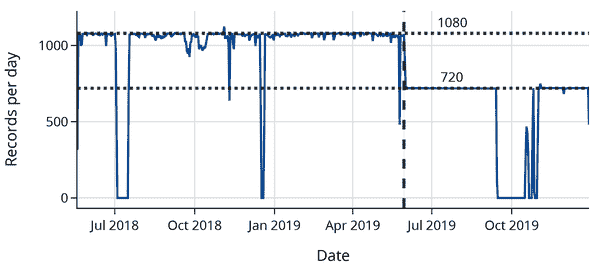

# 第十二章：案例研究：空气质量测量的准确性有多高？

加利福尼亚州容易发生森林大火，以至于该州的居民（如本书的作者们）有时会说加利福尼亚州“总是在火灾中”。2020 年，40 起不同的火灾使得整个州笼罩在烟雾之中，迫使成千上万的人撤离，并造成超过 120 亿美元的损失（图 12-1）。


###### 图 12-1 卫星图像，显示 2020 年 8 月加利福尼亚州被烟雾覆盖的情况（图片来源于[Wikipedia](https://oreil.ly/CrDld)，根据 CC BY-SA 3.0 IGO 许可）。

在像加利福尼亚这样的地方，人们利用空气质量测量来了解他们需要采取哪些保护措施。根据情况，人们可能希望戴口罩、使用空气过滤器或完全避免外出。

在美国，一个重要的空气质量信息来源是由美国政府运行的[空气质量系统](https://www.epa.gov/aqs)（AQS）。AQS 在美国各地的位置上安装了高质量的传感器，并向公众提供它们的数据。这些传感器经过严格的校准到严格的标准——实际上，AQS 传感器通常被视为准确度的黄金标准。然而，它们也有一些缺点。这些传感器很昂贵：每台通常在 15,000 至 40,000 美元之间。这意味着传感器数量较少，并且它们之间的距离较远。住在传感器远离的人可能无法获取 AQS 数据用于个人使用。此外，AQS 传感器不提供实时数据。由于数据经过广泛的校准，它们仅每小时发布一次，并且有一到两小时的时间滞后。实质上，AQS 传感器精确但不及时。

相比之下，[PurpleAir](https://www2.purpleair.com)传感器，我们在第三章介绍过，售价约 250 美元，可以轻松安装在家中。由于价格较低，成千上万的美国人购买了这些传感器用于个人使用。这些传感器可以连接到家庭 WiFi 网络，因此可以轻松监测空气质量，并可以向 PurpleAir 报告数据。2020 年，数千名 PurpleAir 传感器的所有者将他们传感器的测量数据公开发布。与 AQS 传感器相比，PurpleAir 传感器更及时。它们每两分钟报告一次测量结果，而不是每小时。由于部署了更多的 PurpleAir 传感器，更多的人住在接近传感器的地方，可以利用这些数据。然而，PurpleAir 传感器的准确性较低。为了使传感器价格更加合理，PurpleAir 使用了更简单的方法来计算空气中的颗粒物。这意味着 PurpleAir 的测量可能会报告空气质量比实际情况更差（见[Josh Hug 的博客文章](https://oreil.ly/ZH5aj)）。实质上，PurpleAir 传感器倾向于及时但准确性较低。

在本章中，我们计划利用 AQS 传感器的测量结果来改进 PurpleAir 的测量。这是一项重大任务，我们首先采用了由[卡洛琳·巴克约恩、布雷特·甘特和安德里亚·克莱门斯](https://oreil.ly/XPxZu)从美国环境保护署开发的分析方法。巴克约恩及其同事的工作非常成功，以至于截至撰写本文时，类似 AirNow 的官方美国政府地图，如[火灾与烟雾](https://fire.airnow.gov)地图，都包括 AQS 和 PurpleAir 传感器，并对 PurpleAir 数据应用了巴克约恩的校正。

我们的工作遵循数据科学生命周期，从考虑问题和可用数据的设计和范围开始。我们大部分的工作都花费在清洗和整理数据以进行分析，但我们也进行了探索性数据分析并建立了一个泛化模型。我们首先考虑问题、设计和数据的范围。

# 问题、设计和范围

理想情况下，空气质量的测量应该既*准确*又*及时*。不准确或有偏差的测量可能意味着人们对空气质量的重视程度不够。延迟的警报可能会使人们暴露于有害空气中。在引言中提到廉价空气质量传感器的流行背景让我们对它们的质量和实用性产生了兴趣。

两种不同类型的仪器测量了一个自然现象——空气中颗粒物的数量。AQS 传感器具有测量误差小和偏差可以忽略不计的优势（参见第二章）。另一方面，PurpleAir 仪器的精度较低；测量值具有更大的变异性并且也有偏差。我们最初的问题是：我们能否利用 AQS 测量结果使 PurpleAir 的测量更准确？

我们现在处于一个有大量可用数据的情况中。我们可以访问少量来自 AQS 的高质量测量数据，并且可以从成千上万个 PurpleAir 传感器中获取数据。为了缩小我们问题的焦点，我们考虑如何利用这两个数据源来改进 PurpleAir 的测量。

这两个来源的数据包括传感器的位置。因此，我们可以尝试将它们配对，找到接近每个 AQS 传感器的 PurpleAir 传感器。如果它们很接近，那么这些传感器实际上就是在测量相同的空气。我们可以将 AQS 传感器视为地面真实情况（因为它们非常精确），并研究给定真实空气质量情况下 PurpleAir 测量值的变化。

即使合并的 AQS 和 PurpleAir 传感器对相对较少，将我们发现的任何关系普遍化到其他 PurpleAir 传感器似乎是合理的。如果 AQS 和 PurpleAir 测量之间存在简单的关系，那么我们可以利用这种关系来调整来自任何 PurpleAir 传感器的测量结果，使其更加准确。

我们已经明确了我们的问题：我们能否建立 PurpleAir 传感器读数与相邻 AQS 传感器读数之间的关系模型？如果可以，那么希望可以利用该模型改进 PurpleAir 的读数。剧透警告：确实可以！

本案例研究很好地整合了本书这一部分介绍的概念。它为我们提供了一个机会，看看数据科学家如何在实际环境中处理、探索和可视化数据。特别是，我们看到了如何通过大型、不太精确的数据集来增强小型、精确的数据集的有用性。像这样结合大型和小型数据集对数据科学家来说尤为激动人心，并广泛适用于从社会科学到医学等其他领域。

在接下来的部分中，我们通过寻找彼此靠近的 AQS 和 PurpleAir 传感器配对来进行数据处理。我们特别关注 PM2.5 颗粒的读数，这些颗粒直径小于 2.5 微米。这些颗粒足以吸入到肺部，对健康构成最大风险，并且在木材燃烧中特别常见。

# 寻找配对传感器

我们的分析始于寻找 AQS 和 PurpleAir 传感器的配对，即安装在基本相邻位置的传感器。这一步骤很重要，因为它使我们能够减少可能导致传感器读数差异的其他变量的影响。想象一下，如果我们比较一个放置在公园中的 AQS 传感器和一个放置在繁忙高速公路旁的 PurpleAir 传感器会发生什么。这两个传感器将有不同的读数，部分原因是传感器暴露在不同的环境中。确保传感器真正配对让我们可以声明传感器读数差异是由传感器构造方式和小范围空气波动引起的，而不是其他潜在混淆变量的影响。

由 EPA 小组进行的 Barkjohn 分析找到了在彼此距离不到 50 米的 AQS 和 PurpleAir 传感器配对。该小组联系了每个 AQS 站点，确认是否也安装了 PurpleAir 传感器。这额外的工作让他们对传感器配对的真实配对性充满信心。

在这一部分中，我们探索和清理来自 AQS 和 PurpleAir 的位置数据。然后，我们进行一种连接操作，构建一个潜在的配对传感器列表。我们不会自己联系 AQS 站点；相反，我们将在后续章节中使用 Barkjohn 确认的配对传感器列表。

我们下载了 AQS 和 PurpleAir 传感器列表，并将数据保存在文件 *data/list_of_aqs_sites.csv* 和 *data/list_of_purpleair_sensors.json* 中。让我们开始将这些文件读入 `pandas DataFrames`。首先，我们检查文件大小，看看它们是否可以合理地加载到内存中：

```py
`!`ls -lLh data/list_of*

```

```py
-rw-r--r--  1 sam  staff   4.8M Oct 27 16:54 data/list_of_aqs_sites.csv
-rw-r--r--  1 sam  staff   3.8M Oct 22 16:10 data/list_of_purpleair_sensors.json

```

两个文件都相对较小。让我们从 AQS 站点列表开始。

## 处理 AQS 站点列表

我们已过滤出仅显示测量 PM2.5 的 AQS 站点的[AQS 站点地图](https://oreil.ly/EkZcB)，然后使用该地图的 Web 应用程序下载站点列表作为 CSV 文件。现在我们可以将其加载到`pandas DataFrame`中：

```py
`aqs_sites_full` `=` `pd``.``read_csv``(``'``data/list_of_aqs_sites.csv``'``)`
`aqs_sites_full``.``shape`

```

```py
(1333, 28)

```

表中有 28 列。让我们检查列名：

```py
`aqs_sites_full``.``columns`

```

```py
Index(['AQS_Site_ID', 'POC', 'State', 'City', 'CBSA', 'Local_Site_Name',
       'Address', 'Datum', 'Latitude', 'Longitude', 'LatLon_Accuracy_meters',
       'Elevation_meters_MSL', 'Monitor_Start_Date', 'Last_Sample_Date',
       'Active', 'Measurement_Scale', 'Measurement_Scale_Definition',
       'Sample_Duration', 'Sample_Collection_Frequency',
       'Sample_Collection_Method', 'Sample_Analysis_Method',
       'Method_Reference_ID', 'FRMFEM', 'Monitor_Type', 'Reporting_Agency',
       'Parameter_Name', 'Annual_URLs', 'Daily_URLs'],
      dtype='object')

```

为了找出对我们最有用的哪些列，我们参考了 AQS 在其网站上提供的[数据字典](https://oreil.ly/GvMPI)。在那里，我们确认数据表包含有关 AQS 站点的信息。因此，我们可能期望粒度对应于 AQS 站点，即每行表示一个单个站点，标记为`AQS_Site_ID`的列是主键。我们可以通过每个 ID 的记录计数来确认这一点：

```py
`aqs_sites_full``[``'``AQS_Site_ID``'``]``.``value_counts``(``)`

```

```py
06-071-0306    4
19-163-0015    4
39-061-0014    4
              ..
46-103-0020    1
19-177-0006    1
51-680-0015    1
Name: AQS_Site_ID, Length: 921, dtype: int64

```

看起来有些站点在这个数据框中出现了多次。不幸的是，这意味着粒度比单个站点级别更细。为了弄清楚站点重复的原因，让我们更仔细地查看一个重复站点的行：

```py
`dup_site` `=` `aqs_sites_full``.``query``(``"``AQS_Site_ID ==` `'``19-163-0015``'``"``)`

```

根据列名选择几列进行检查——那些听起来可能会揭示重复原因的列：

```py
`some_cols` `=` `[``'``POC``'``,` `'``Monitor_Start_Date``'``,`
             `'``Last_Sample_Date``'``,` `'``Sample_Collection_Method``'``]`
`dup_site``[``some_cols``]`

```

|   | POC | Monitor_Start_Date | Last_Sample_Date | Sample_Collection_Method |
| --- | --- | --- | --- | --- |
| **458** | 1 | 1/27/1999 | 8/31/2021 | R & P Model 2025 PM-2.5 Sequential Air Sampler... |
| **459** | 2 | 2/9/2013 | 8/26/2021 | R & P Model 2025 PM-2.5 Sequential Air Sampler... |
| **460** | 3 | 1/1/2019 | 9/30/2021 | Teledyne T640 at 5.0 LPM |
| **461** | 4 | 1/1/2019 | 9/30/2021 | Teledyne T640 at 5.0 LPM |

`POC`列看起来对于区分表中的行是有用的。数据字典对该列有以下说明：

> 这是用于区分在同一站点上测量相同参数的不同仪器的“参数发生代码”。

因此，站点`19-163-0015`有四个仪器都测量 PM2.5。数据框的粒度是单个仪器级别。

由于我们的目标是匹配 AQS 和 PurpleAir 传感器，我们可以通过选择每个 AQS 站点的一个仪器来调整粒度。为此，我们根据站点 ID 对行进行分组，然后在每个组中取第一行：

```py
`def` `rollup_dup_sites``(``df``)``:`
    `return` `(`
        `df``.``groupby``(``'``AQS_Site_ID``'``)`
        `.``first``(``)`
        `.``reset_index``(``)`
    `)`

```

```py
`aqs_sites` `=` `(``aqs_sites_full`
             `.``pipe``(``rollup_dup_sites``)``)`
`aqs_sites``.``shape`

```

```py
(921, 28)

```

现在行数与唯一 ID 的数量匹配。

要与 PurpleAir 传感器匹配 AQS 站点，我们只需要站点 ID、纬度和经度。因此，我们进一步调整结构，仅保留这些列：

```py
`def` `cols_aqs``(``df``)``:`
    `subset` `=` `df``[``[``'``AQS_Site_ID``'``,` `'``Latitude``'``,` `'``Longitude``'``]``]`
    `subset``.``columns` `=` `[``'``site_id``'``,` `'``lat``'``,` `'``lon``'``]`
    `return` `subset`

```

```py
`aqs_sites` `=` `(``aqs_sites_full`
             `.``pipe``(``rollup_dup_sites``)`
             `.``pipe``(``cols_aqs``)``)`

```

现在`aqs_sites`数据框已准备就绪，我们转向 PurpleAir 站点。

## 整理 PurpleAir 站点列表

不同于 AQS 站点，包含 PurpleAir 传感器数据的文件是以 JSON 格式提供的。我们将在第十四章中更详细地讨论这种格式。现在，我们使用 shell 工具（参见第八章）来查看文件内容：

```py
`!`head data/list_of_purpleair_sensors.json `|` cut -c `1`-60

```

```py
{"version":"7.0.30",
"fields":
["ID","pm","pm_cf_1","pm_atm","age","pm_0","pm_1","pm_2","pm
"data":[
[20,0.0,0.0,0.0,0,0.0,0.0,0.0,0.0,0.0,0.0,0.0,97,0.0,0.0,0.0
[47,null,null,null,4951,null,null,null,null,null,null,null,9
[53,0.0,0.0,0.0,0,0.0,0.0,0.0,0.0,1.2,5.2,6.0,97,0.0,0.5,702
[74,0.0,0.0,0.0,0,0.0,0.0,0.0,0.0,0.0,0.0,0.0,97,0.0,0.0,0.0
[77,9.8,9.8,9.8,1,9.8,10.7,11.0,11.2,13.8,15.1,15.5,97,9.7,9
[81,6.5,6.5,6.5,0,6.5,6.1,6.1,6.6,8.1,8.3,9.7,97,5.9,6.8,405

```

从文件的前几行可以猜测数据存储在`"data"`键中，列标签存储在`"fields"`键中。我们可以使用 Python 的`json`库将文件读取为 Python 的`dict`：

```py
`import` `json`

`with` `open``(``'``data/list_of_purpleair_sensors.json``'``)` `as` `f``:`
    `pa_json` `=` `json``.``load``(``f``)`

`list``(``pa_json``.``keys``(``)``)`

```

```py
['version', 'fields', 'data', 'count']

```

我们可以从`data`中的值创建一个数据框，并使用`fields`的内容标记列：

```py
`pa_sites_full` `=` `pd``.``DataFrame``(``pa_json``[``'``data``'``]``,` `columns``=``pa_json``[``'``fields``'``]``)`
`pa_sites_full``.``head``(``)`

```

|   | ID | pm | pm_cf_1 | pm_atm | ... | Voc | Ozone1 | Adc | CH |
| --- | --- | --- | --- | --- | --- | --- | --- | --- | --- |
| **0** | 20 | 0.0 | 0.0 | 0.0 | ... | NaN | NaN | 0.01 | 1 |
| **1** | 47 | NaN | NaN | NaN | ... | NaN | 0.72 | 0.72 | 0 |
| **2** | 53 | 0.0 | 0.0 | 0.0 | ... | NaN | NaN | 0.00 | 1 |
| **3** | 74 | 0.0 | 0.0 | 0.0 | ... | NaN | NaN | 0.05 | 1 |
| **4** | 77 | 9.8 | 9.8 | 9.8 | ... | NaN | NaN | 0.01 | 1 |

```py
5 rows × 36 columns
```

与 AQS 数据类似，此数据框中的列比我们需要的多得多：

```py
`pa_sites_full``.``columns`

```

```py
Index(['ID', 'pm', 'pm_cf_1', 'pm_atm', 'age', 'pm_0', 'pm_1', 'pm_2', 'pm_3',
       'pm_4', 'pm_5', 'pm_6', 'conf', 'pm1', 'pm_10', 'p1', 'p2', 'p3', 'p4',
       'p5', 'p6', 'Humidity', 'Temperature', 'Pressure', 'Elevation', 'Type',
       'Label', 'Lat', 'Lon', 'Icon', 'isOwner', 'Flags', 'Voc', 'Ozone1',
       'Adc', 'CH'],
      dtype='object')

```

在这种情况下，我们可以猜测我们最感兴趣的列是传感器 ID (`ID`)、传感器标签 (`Label`)、纬度 (`Lat`)和经度 (`Lon`)。但我们确实在 PurpleAir 网站的数据字典中进行了查阅以进行双重检查。

现在让我们检查`ID`列是否存在重复，就像我们对 AQS 数据所做的那样：

```py
`pa_sites_full``[``'``ID``'``]``.``value_counts``(``)``[``:``3``]`

```

```py
85829     1
117575    1
118195    1
Name: ID, dtype: int64

```

由于 `value_counts()` 方法按降序列出计数，我们可以看到每个 ID 仅包含一次。因此，我们已验证粒度处于单个传感器级别。接下来，我们保留仅需要的列以匹配来自两个源的传感器位置：

```py
`def` `cols_pa``(``df``)``:`
    `subset` `=` `df``[``[``'``ID``'``,` `'``Label``'``,` `'``Lat``'``,` `'``Lon``'``]``]`
    `subset``.``columns` `=` `[``'``id``'``,` `'``label``'``,` `'``lat``'``,` `'``lon``'``]`
    `return` `subset`

```

```py
`pa_sites` `=` `(``pa_sites_full`
            `.``pipe``(``cols_pa``)``)`
`pa_sites``.``shape`

```

```py
(23138, 4)

```

注意，PurpleAir 传感器比 AQS 传感器多数万台。我们的下一个任务是找到每个 AQS 传感器附近的 PurpleAir 传感器。

## 匹配 AQS 和 PurpleAir 传感器

我们的目标是通过找到每个 AQS 仪器附近的 PurpleAir 传感器来匹配两个数据框中的传感器。我们认为附近意味着在 50 米范围内。这种匹配比我们到目前为止见过的连接更具挑战性。例如，使用`pandas`的`merge`方法的天真方法会失败：

```py
`aqs_sites``.``merge``(``pa_sites``,` `left_on``=``[``'``lat``'``,` `'``lon``'``]``,` `right_on``=``[``'``lat``'``,` `'``lon``'``]``)`

```

|   | site_id | lat | lon | id | label |
| --- | --- | --- | --- | --- | --- |
| **0** | 06-111-1004 | 34.45 | -119.23 | 48393 | VCAPCD OJ |

我们不能简单地匹配具有完全相同纬度和经度的仪器；我们需要找到足够接近 AQS 仪器的 PurpleAir 站点。

要找出两个位置之间有多远，我们使用一个基本的近似方法：在南北方向上，`111,111`米大致相当于一度纬度，在东西方向上，`111,111 * cos(纬度)`相当于一度经度。^(1) 因此，我们可以找到对应于每个点周围 50 米×50 米矩形的纬度和经度范围：

```py
`magic_meters_per_lat` `=` `111_111`
`offset_in_m` `=` `25`
`offset_in_lat` `=` `offset_in_m` `/` `magic_meters_per_lat`
`offset_in_lat`

```

```py
0.000225000225000225

```

为了进一步简化，我们使用 AQS 站点的中位纬度：

```py
`median_latitude` `=` `aqs_sites``[``'``lat``'``]``.``median``(``)`
`magic_meters_per_lon` `=` `111_111` `*` `np``.``cos``(``np``.``radians``(``median_latitude``)``)`
`offset_in_lon` `=` `offset_in_m` `/` `magic_meters_per_lon`
`offset_in_lon`

```

```py
0.000291515219937587

```

现在我们可以将坐标匹配到`offset_in_lat`和`offset_in_lon`之内。在 SQL 中执行此操作比在`pandas`中要容易得多，因此我们将表推入临时 SQLite 数据库，然后运行查询以将表读回到数据框中：

```py
`import` `sqlalchemy`

`db` `=` `sqlalchemy``.``create_engine``(``'``sqlite://``'``)`

`aqs_sites``.``to_sql``(``name``=``'``aqs``'``,` `con``=``db``,` `index``=``False``)`
`pa_sites``.``to_sql``(``name``=``'``pa``'``,` `con``=``db``,` `index``=``False``)`

```

```py
`query` `=` `f``'''`
`SELECT`
 `aqs.site_id AS aqs_id,`
 `pa.id AS pa_id,`
 `pa.label AS pa_label,`
 `aqs.lat AS aqs_lat,`
 `aqs.lon AS aqs_lon,`
 `pa.lat AS pa_lat,`
 `pa.lon AS pa_lon`
`FROM aqs JOIN pa`
 `ON  pa.lat -` `{``offset_in_lat``}` `<= aqs.lat`
 `AND                             aqs.lat <= pa.lat +` `{``offset_in_lat``}`
 `AND pa.lon -` `{``offset_in_lon``}` `<= aqs.lon`
 `AND                             aqs.lon <= pa.lon +` `{``offset_in_lon``}`
`'''`
`matched` `=` `pd``.``read_sql``(``query``,` `db``)`
`matched`

```

|   | aqs_id | pa_id | pa_label | aqs_lat | aqs_lon | pa_lat | pa_lon |
| --- | --- | --- | --- | --- | --- | --- | --- |
| **0** | 06-019-0011 | 6568 | IMPROVE_FRES2 | 36.79 | -119.77 | 36.79 | -119.77 |
| **1** | 06-019-0011 | 13485 | AMTS_Fresno | 36.79 | -119.77 | 36.79 | -119.77 |
| **2** | 06-019-0011 | 44427 | Fresno CARB CCAC | 36.79 | -119.77 | 36.79 | -119.77 |
| **...** | ... | ... | ... | ... | ... | ... | ... |
| **146** | 53-061-1007 | 3659 | Marysville 7th | 48.05 | -122.17 | 48.05 | -122.17 |
| **147** | 53-063-0021 | 54603 | Augusta 1 SRCAA | 47.67 | -117.36 | 47.67 | -117.36 |
| **148** | 56-021-0100 | 50045 | WDEQ-AQD Cheyenne NCore | 41.18 | -104.78 | 41.18 | -104.78 |

```py
149 rows × 7 columns
```

我们已经达到了我们的目标——我们匹配了 149 个 AQS 站点与 PurpleAir 传感器。我们对位置的整理完成了，现在转向整理和清理传感器测量数据的任务。我们从 AQS 站点获取的测量值开始。

# 整理和清理 AQS 传感器数据

现在我们已经找到彼此附近的传感器，我们准备整理和清理这些站点的测量数据文件。我们演示了一个 AQS 仪器及其匹配的 PurpleAir 传感器涉及的任务。我们选择了位于加利福尼亚州萨克拉门托的一对。AQS 传感器 ID 是 `06-067-0010`，PurpleAir 传感器名称是 `AMTS_TESTINGA`。

AQS 提供了一个网站和 [API](https://oreil.ly/tl_nc) 用于下载传感器数据。我们下载了从 2018 年 5 月 20 日到 2019 年 12 月 29 日的每日测量数据，保存在 *data/aqs_06-067-0010.csv* 文件中。让我们从加载这个文件到数据框架开始：

```py
`aqs_full` `=` `pd``.``read_csv``(``'``data/aqs_06-067-0010.csv``'``)`
`aqs_full``.``shape`

```

```py
(2268, 31)

```

从 [数据字典](https://oreil.ly/e1PjI) 中我们发现，`arithmetic_mean` 列对应于实际的 PM2.5 测量。一些 AQS 传感器每小时进行一次测量。对于我们的分析，我们下载了每日平均值（算术平均值）的 24 小时平均值的传感器测量。

让我们进行一些质量检查和必要的数据清理。我们关注与值的范围和质量相关的检查：

1.  检查和修正数据的粒度。

1.  删除不需要的列。

1.  检查 `date_local` 列中的值。

1.  检查 `arithmetic_mean` 列中的值。

为简洁起见，我们选择了一些重要的质量检查，特别是加强了我们在数据整理、探索性数据分析和可视化中涵盖的思想。

## 检查粒度

我们希望我们数据的每一行对应于单个日期，具有该日期的平均 PM2.5 读数。正如我们之前看到的，一个简单的检查方法是查看 `date_local` 列中是否有重复值：

```py
`aqs_full``[``'``date_local``'``]``.``value_counts``(``)`

```

```py
date_local
2019-01-03    12
2018-12-31    12
2018-12-28    12
              ..
2018-11-28    12
2018-11-25    12
2018-11-22    12
Name: count, Length: 189, dtype: int64

```

实际上，每个日期有 12 行数据，因此粒度并不是在个体日期级别上。

从数据字典中我们得知，有多种标准用于从原始传感器数据计算最终测量结果。`pollutant_standard` 列包含每个标准的名称。`event_type` 列标记了是否包括“异常事件”期间测得的数据。让我们通过计算这 12 个测量的范围来检查这些平均值有多么不同：

```py
`(``aqs_full`
 `.``groupby``(``'``date_local``'``)`
 `[``'``arithmetic_mean``'``]`
 `.``agg``(``np``.``ptp``)` `# np.ptp computes max() - min()`
 `.``value_counts``(``)`
`)`

```

```py
arithmetic_mean
0.0    189
Name: count, dtype: int64

```

对于所有 189 个日期，最大 PM2.5–最小 PM2.5 为 0。这意味着我们只需取每个日期的第一个 PM2.5 测量值：

```py
`def` `rollup_dates``(``df``)``:`
    `return` `(`
        `df``.``groupby``(``'``date_local``'``)`
        `.``first``(``)`
        `.``reset_index``(``)`
    `)`

```

```py
`aqs` `=` `(``aqs_full`
       `.``pipe``(``rollup_dates``)``)`
`aqs``.``shape`

```

```py
(189, 31)

```

此数据清理步骤使我们获得了所需的细粒度：每一行代表一个单独的日期，具有该日期的平均 PM2.5 测量值。接下来，我们进一步修改数据框的结构并删除不需要的列。

## 移除不必要的列

我们计划将 AQS 数据框中的 PM2.5 测量与 PurpleAir 的 PM2.5 测量进行匹配，以每日为单位。为简化结构，我们可以舍弃除日期和 PM2.5 列外的所有列。我们还将 PM2.5 列重命名，以便更容易理解：

```py
`def` `drop_cols``(``df``)``:`
    `subset` `=` `df``[``[``'``date_local``'``,` `'``arithmetic_mean``'``]``]`
    `return` `subset``.``rename``(``columns``=``{``'``arithmetic_mean``'``:` `'``pm25``'``}``)`

```

```py
`aqs` `=` `(``aqs_full`
       `.``pipe``(``rollup_dates``)`
       `.``pipe``(``drop_cols``)``)`
`aqs``.``head``(``)`

```

|   | date_local | pm25 |
| --- | --- | --- |
| **0** | 2018-05-20 | 6.5 |
| **1** | 2018-05-23 | 2.3 |
| **2** | 2018-05-29 | 11.8 |
| **3** | 2018-06-01 | 6.0 |
| **4** | 2018-06-04 | 8.0 |

现在我们已经为数据表获得了所需的形状，我们转而检查数据值。

## 检查日期的有效性

让我们仔细查看日期。我们已经看到当没有 PM2.5 读数时存在间隙，因此我们预计存在缺失日期。让我们将日期解析为时间戳对象，以便更容易确定缺失的日期。与我们在 第九章 中所做的一样，我们检查格式：

```py
`aqs``[``'``date_local``'``]``.``iloc``[``:``3``]`

```

```py
0    2018-05-20
1    2018-05-23
2    2018-05-29
Name: date_local, dtype: object

```

日期以 YYYY-MM-DD 表示，因此我们在 Python 表示中描述为 `'%Y-%m-%d'`。为了解析日期，我们使用 `pd.to_datetime()` 函数，并将 `date_local` 列重新分配为 `pd.TimeStamp`：

```py
`def` `parse_dates``(``df``)``:`
    `date_format` `=` `'``%Y``-``%m``-``%d``'`
    `timestamps` `=` `pd``.``to_datetime``(``df``[``'``date_local``'``]``,` `format``=``date_format``)`
    `return` `df``.``assign``(``date_local``=``timestamps``)`

```

```py
`aqs` `=` `(``aqs_full`
       `.``pipe``(``rollup_dates``)`
       `.``pipe``(``drop_cols``)`
       `.``pipe``(``parse_dates``)``)`

```

该方法运行无误，表明所有字符串都匹配了格式。

###### 注意

仅仅因为日期可以解析，这并不意味着日期立即可以用于进一步的分析。例如，字符串 `9999-01-31` 可以解析为 `pd.TimeStamp`，但该日期无效。

现在日期已转换为时间戳，我们可以计算缺失的日期数。我们找到最早日期和最晚日期之间的天数——这对应于我们可能记录的最大测量次数：

```py
`date_range` `=` `aqs``[``'``date_local``'``]``.``max``(``)` `-` `aqs``[``'``date_local``'``]``.``min``(``)`
`date_range``.``days`

```

```py
588

```

减去时间戳会得到 `Timedelta` 对象，正如我们所看到的，它们具有一些有用的属性。数据中有很多日期缺失。然而，当我们将此传感器的这些数据与其他传感器的数据结合起来时，我们希望有足够的数据来拟合一个模型。

我们的最终整理步骤是检查 PM2.5 测量的质量。

## 检查 PM2.5 测量质量

颗粒物浓度以每立方米空气中的微克数（µg/m³）来衡量。（1 克中有 1 百万微克，1 磅约等于 450 克。）[EPA 制定了标准](https://oreil.ly/XqVqG)，即 PM2.5 的日均值为 35 µg/m³，年均值为 12 µg/m³。我们可以利用这些信息对 PM2.5 测量进行几项基本检查。首先，PM2.5 不能低于 0。其次，我们可以寻找异常高的 PM2.5 值，并查看它们是否对应于重大事件，如野火。

进行这些检查的一种视觉方法是将 PM2.5 测量值绘制成日期图：

```py
`px``.``scatter``(``aqs``,` `x``=``'``date_local``'``,` `y``=``'``pm25``'``,`
           `labels``=``{``'``date_local``'``:``'``Date``'``,` `'``pm25``'``:``'``AQS daily avg PM2.5``'``}``,`
           `width``=``500``,` `height``=``250``)`

```


我们发现 PM2.5 的测量数值不会低于 0，通常低于 EPA 的标准。我们还发现 2018 年 11 月中旬 PM2.5 出现了大幅上升。该传感器位于萨克拉门托，因此我们可以检查该地区是否发生了火灾。

实际上，2018 年 11 月 8 日标志着“加州历史上最致命和破坏性的野火”——“大火营”（见由美国人口普查局管理的[大火营页面](https://oreil.ly/tqxtH)）。火灾发生在距离萨克拉门托仅 80 英里的地方，因此这个 AQS 传感器捕捉到了 PM2.5 的剧烈增长。

我们已经清理和探索了一个 AQS 传感器的数据。在下一节中，我们将对其附近的 PurpleAir 传感器进行相同的操作。

# 整理 PurpleAir 传感器数据

在上一节中，我们分析了 AQS 站点 `06-067-0010` 的数据。匹配的 PurpleAir 传感器命名为 `AMTS_TESTINGA`，我们已经使用 PurpleAir 网站将此传感器的数据下载到 *data/purpleair_AMTS* 文件夹中：

```py
`!`ls -alh data/purpleair_AMTS/* `|` cut -c `1`-72

```

```py
-rw-r--r--  1 nolan  staff    50M Jan 25 16:35 data/purpleair_AMTS/AMTS_
-rw-r--r--  1 nolan  staff    50M Jan 25 16:35 data/purpleair_AMTS/AMTS_
-rw-r--r--  1 nolan  staff    48M Jan 25 16:35 data/purpleair_AMTS/AMTS_
-rw-r--r--  1 nolan  staff    50M Jan 25 16:35 data/purpleair_AMTS/AMTS_

```

有四个 CSV 文件。它们的名称相当长，并且每个的开头都相同。PurpleAir 数据的数据字典表明，每个传感器都有两个单独的仪器 A 和 B，每个都记录数据。请注意，我们用于收集这些数据和配套数据字典的 PurpleAir 网站已降级。数据现在通过 REST API 可用。[记录 API 的站点](https://oreil.ly/WSciR)还包含有关字段的信息。（REST 的主题在第十四章中涵盖。）让我们检查文件名的后部分：

```py
`!`ls -alh data/purpleair_AMTS/* `|` cut -c `73`-140

```

```py
TESTING (outside) (38.568404 -121.493163) Primary Real Time 05_20_20
TESTING (outside) (38.568404 -121.493163) Secondary Real Time 05_20_
TESTING B (undefined) (38.568404 -121.493163) Primary Real Time 05_2
TESTING B (undefined) (38.568404 -121.493163) Secondary Real Time 05

```

我们可以看到前两个 CSV 文件对应于仪器 A，最后两个对应于 B。拥有两个仪器对数据清理很有用；如果 A 和 B 对某个测量结果有异议，我们可能会质疑测量结果的完整性，并决定删除它。

数据字典还提到，每个仪器记录主要和次要数据。主要数据包含我们感兴趣的字段：PM2.5、温度和湿度。次要数据包含其他粒径的数据，如 PM1.0 和 PM10。因此我们只使用主文件。

我们的任务与上一节类似，只是增加了处理两台仪器读数的内容。

我们首先加载数据。当 CSV 文件名很长时，我们可以将文件名分配给 Python 变量，以更轻松地加载文件：

```py
`from` `pathlib` `import` `Path`

`data_folder` `=` `Path``(``'``data/purpleair_AMTS``'``)`
`pa_csvs` `=` `sorted``(``data_folder``.``glob``(``'``*.csv``'``)``)`
`pa_csvs``[``0``]`

```

```py
PosixPath('data/purpleair_AMTS/AMTS_TESTING (outside) (38.568404 -121.493163) Primary Real Time 05_20_2018 12_29_2019.csv')

```

```py
`pa_full` `=` `pd``.``read_csv``(``pa_csvs``[``0``]``)`
`pa_full``.``shape`

```

```py
(672755, 11)

```

让我们看一下列，确定我们需要哪些列：

```py
`pa_full``.``columns`

```

```py
Index(['created_at', 'entry_id', 'PM1.0_CF1_ug/m3', 'PM2.5_CF1_ug/m3',
       'PM10.0_CF1_ug/m3', 'UptimeMinutes', 'RSSI_dbm', 'Temperature_F',
       'Humidity_%', 'PM2.5_ATM_ug/m3', 'Unnamed: 10'],
      dtype='object')

```

虽然我们对 PM2.5 感兴趣，但似乎有两列包含 PM2.5 数据：`PM2.5_CF1_ug/m3` 和 `PM2.5_ATM_ug/m3`。我们调查了这两列之间的差异，发现 PurpleAir 传感器使用两种不同的方法将原始激光记录转换为 PM2.5 数值。这两种计算对应于 CF1 和 ATM 列。Barkjohn 发现使用 CF1 比 ATM 产生了更好的结果，因此我们保留该列，以及日期、温度和相对湿度：

```py
`def` `drop_and_rename_cols``(``df``)``:`
    `df` `=` `df``[``[``'``created_at``'``,` `'``PM2.5_CF1_ug/m3``'``,` `'``Temperature_F``'``,` `'``Humidity_``%``'``]``]`
    `df``.``columns` `=` `[``'``timestamp``'``,` `'``PM25cf1``'``,` `'``TempF``'``,` `'``RH``'``]`
    `return` `df`

`pa` `=` `(``pa_full`
      `.``pipe``(``drop_and_rename_cols``)``)`
`pa``.``head``(``)`

```

|   | 时间戳 | PM25cf1 | TempF | RH |
| --- | --- | --- | --- | --- |
| **0** | 2018-05-20 00:00:35 UTC | 1.23 | 83.0 | 32.0 |
| **1** | 2018-05-20 00:01:55 UTC | 1.94 | 83.0 | 32.0 |
| **2** | 2018-05-20 00:03:15 UTC | 1.80 | 83.0 | 32.0 |
| **3** | 2018-05-20 00:04:35 UTC | 1.64 | 83.0 | 32.0 |
| **4** | 2018-05-20 00:05:55 UTC | 1.33 | 83.0 | 32.0 |

接下来我们检查粒度。

## 检查粒度

为了使这些测量的粒度与 AQS 数据匹配，我们希望每个日期（24 小时）有一个平均 PM2.5。PurpleAir 表示传感器每两分钟进行一次测量。在我们将其聚合到 24 小时期间之前，让我们再次检查原始测量的粒度。

要实现这一点，我们将包含日期信息的列从字符串转换为 `pd.TimeStamp` 对象。日期的格式与 AQS 格式不同，我们描述为 `'%Y-%m-%d %X %Z'`。正如我们所见，`pandas` 对于具有时间戳索引的数据框架有特殊支持：

```py
`def` `parse_timestamps``(``df``)``:`
    `date_format` `=` `'``%Y``-``%m``-``%d`  `%X` `%``Z``'`
    `times` `=` `pd``.``to_datetime``(``df``[``'``timestamp``'``]``,` `format``=``date_format``)`
    `return` `(``df``.``assign``(``timestamp``=``times``)`
            `.``set_index``(``'``timestamp``'``)``)`

`pa` `=` `(``pa_full`
      `.``pipe``(``drop_and_rename_cols``)`
      `.``pipe``(``parse_timestamps``)``)`
`pa``.``head``(``2``)`

```

|   | PM25cf1 | TempF | RH |
| --- | --- | --- | --- |
| 时间戳 |   |   |   |
| --- | --- | --- | --- |
| **2018-05-20 00:00:35+00:00** | 1.23 | 83.0 | 32.0 |
| **2018-05-20 00:01:55+00:00** | 1.94 | 83.0 | 32.0 |

时间戳很棘手 — 注意原始时间戳是以 UTC 时区给出的。然而，AQS 数据根据 *加利福尼亚州当地时间* 平均，这比 UTC 时间晚七或八小时，这取决于是否实行夏令时。这意味着我们需要更改 PurpleAir 时间戳的时区以匹配当地时区。`df.tz_convert()` 方法作用于数据框架的索引，这也是我们将 `pa` 的索引设置为时间戳的一个原因：

```py
`def` `convert_tz``(``pa``)``:`
    `return` `pa``.``tz_convert``(``'``US/Pacific``'``)`

`pa` `=` `(``pa_full`
      `.``pipe``(``drop_and_rename_cols``)`
      `.``pipe``(``parse_timestamps``)`
      `.``pipe``(``convert_tz``)``)`
`pa``.``head``(``2``)`

```

|   | PM25cf1 | TempF | RH |
| --- | --- | --- | --- |
| 时间戳 |   |   |   |
| --- | --- | --- | --- |
| **2018-05-19 17:00:35-07:00** | 1.23 | 83.0 | 32.0 |
| **2018-05-19 17:01:55-07:00** | 1.94 | 83.0 | 32.0 |

如果我们将此版本的数据框架的前两行与上一个进行比较，我们会看到时间已更改以表明与 UTC 相差七个小时。

可视化时间戳可以帮助我们检查数据的粒度。

### 可视化时间戳

可视化时间戳的一种方法是计算每个 24 小时内出现的次数，然后绘制这些计数随时间的变化。要在 `pandas` 中对时间序列数据进行分组，可以使用 `df.resample()` 方法。此方法适用于具有时间戳索引的数据框。它的行为类似于 `df.groupby()`，但我们可以指定希望如何分组时间戳——可以分组为日期、周、月等多种选项（`D` 参数告诉 `resample` 将时间戳聚合成单独的日期）：

```py
`per_day` `=` `(``pa``.``resample``(``'``D``'``)`
           `.``size``(``)`
           `.``rename``(``'``records_per_day``'``)`
           `.``to_frame``(``)`
`)`

```

```py
`percs` `=` `[``10``,` `25``,` `50``,` `75``,` `100``]`
`np``.``percentile``(``per_day``[``'``records_per_day``'``]``,` `percs``,` `method``=``'``lower``'``)`

```

```py
array([ 293,  720, 1075, 1440, 2250])

```

我们可以看到每天的测量次数变化很大。这些计数的折线图能更好地展示这些变化：

```py
`px``.``line``(``per_day``,` `x``=``per_day``.``index``,` `y``=``'``records_per_day``'``,` 
        `labels``=``{``'``timestamp``'``:``'``Date``'``,` `'``records_per_day``'``:``'``Records per day``'``}``,`
        `width``=``550``,` `height``=``250``,``)`

```


这是一个引人入胜的图表。我们可以看到数据中存在明显的缺失测量间隙。在 2018 年 7 月和 2019 年 9 月，数据的大部分似乎都丢失了。即使传感器运行正常，每天的测量次数也略有不同。例如，在 2018 年 8 月至 10 月之间的折线图上“崎岖不平”，日期上的测量次数有所变化。我们需要决定如何处理缺失数据。但也许更紧迫的是：折线图上出现了奇怪的“阶梯”。一些日期大约有 1,000 个读数，一些大约有 2,000 个，一些大约有 700 个，一些大约有 1,400 个。如果传感器每两分钟进行一次测量，则每天的最大测量次数应为 720 次。对于完美的传感器，折线图应显示为 720 次的平直线。显然情况并非如此。让我们来调查一下。

### 检查采样率

进一步的挖掘显示，尽管 PurpleAir 传感器当前每 120 秒记录一次数据，但以前并非如此。2019 年 5 月 30 日之前，传感器每 80 秒记录一次数据，即每天 1,080 个数据点。采样率的变化确实解释了 2019 年 5 月 30 日的数据下降。接下来我们看看时间段内存在远高于预期点数的情况。这可能意味着数据中存在重复的测量。我们可以通过查看一天的测量数据来验证这一点，例如 2019 年 1 月 1 日。我们通过向 `.loc` 传入字符串来筛选该日期的时间戳：

```py
`len``(``pa``.``loc``[``'``2019-01-01``'``]``)`

```

```py
2154

```

几乎有 1,080 个预期读数的两倍。让我们检查是否存在重复读数：

```py
`pa``.``loc``[``'``2019-01-01``'``]``.``index``.``value_counts``(``)`

```

```py
2019-01-01 13:52:30-08:00    2
2019-01-01 12:02:21-08:00    2
2019-01-01 11:49:01-08:00    2
                            ..
2019-01-01 21:34:10-08:00    2
2019-01-01 11:03:41-08:00    2
2019-01-01 04:05:38-08:00    2
Name: timestamp, Length: 1077, dtype: int64

```

每个时间戳正好出现两次，我们可以验证所有重复的日期包含相同的 PM2.5 读数。由于温度和湿度也是如此，我们从数据框中删除重复行：

```py
`def` `drop_duplicate_rows``(``df``)``:`
    `return` `df``[``~``df``.``index``.``duplicated``(``)``]`

`pa` `=` `(``pa_full`
      `.``pipe``(``drop_and_rename_cols``)`
      `.``pipe``(``parse_timestamps``)`
      `.``pipe``(``convert_tz``)`
      `.``pipe``(``drop_duplicate_rows``)``)`
`pa``.``shape`

```

```py
(502628, 3)

```

为了检查，我们重新制作了每天记录数的折线图，这次我们会在预期包含的区域内填充颜色：

```py
`per_day` `=` `(``pa``.``resample``(``'``D``'``)`
 `.``size``(``)``.``rename``(``'``records_per_day``'``)`
 `.``to_frame``(``)`
`)`

```

```py
`fig` `=` `px``.``line``(``per_day``,` `x``=``per_day``.``index``,` `y``=``'``records_per_day``'``,`
              `labels``=``{``'``timestamp``'``:``'``Date``'``,` `'``records_per_day``'``:``'``Records per day``'``}``,` 
              `width``=``550``,` `height``=``250``)`

`fig``.``add_annotation``(``x``=``'``2019-07-24``'``,` `y``=``720``,`
            `text``=``"``720``"``,` `showarrow``=``False``,` `yshift``=``10``)`
`fig``.``add_annotation``(``x``=``'``2019-07-24``'``,` `y``=``1080``,`
            `text``=``"``1080``"``,` `showarrow``=``False``,` `yshift``=``10``)`

`fig``.``add_hline``(``y``=``1080``,` `line_width``=``3``,` `line_dash``=``"``dot``"``,` `opacity``=``0.6``)`
`fig``.``add_hline``(``y``=``720``,` `line_width``=``3``,` `line_dash``=``"``dot``"``,` `opacity``=``0.6``)`
`fig``.``add_vline``(``x``=``"``2019-05-30``"``,` `line_width``=``3``,` `line_dash``=``"``dash``"``,` `opacity``=``0.6``)`

`fig`

```



去除重复日期后，每天的测量数据图与我们预期的计数更一致。细心的读者会发现每年 11 月左右，在取消夏令时后，有两次高于最大测量值的峰值。当时钟被倒退一小时时，那一天有 25 小时而不是通常的 24 小时。时间戳确实很棘手！

但仍然有缺失的测量值，我们需要决定如何处理。

## 处理缺失值

计划是创建测量值的 24 小时平均，但我们不想使用测量不足的日子。我们遵循 Barkjohn 的分析，仅在该日有至少 90%可能数据点时保留 24 小时平均。请记住，在 2019 年 5 月 30 日之前，一天有 1080 个可能数据点，之后为 720 个可能数据点。我们计算了每天需要保留的最少测量数：

```py
`needed_measurements_80s` `=` `0.9` `*` `1080`
`needed_measurements_120s` `=` `0.9` `*` `720`

```

现在我们可以确定哪些日子有足够的测量数据可以保留：

```py
`cutoff_date` `=` `pd``.``Timestamp``(``'``2019-05-30``'``,` `tz``=``'``US/Pacific``'``)`

`def` `has_enough_readings``(``one_day``)``:`
    `[``n``]` `=` `one_day`
    `date` `=` `one_day``.``name`
    `return` `(``n` `>``=` `needed_measurements_80s`
            `if` `date` `<``=` `cutoff_date`
            `else` `n` `>``=` `needed_measurements_120s``)`

```

```py
`should_keep` `=` `per_day``.``apply``(``has_enough_readings``,` `axis``=``'``columns``'``)`
`should_keep``.``head``(``)`

```

```py
timestamp
2018-05-19 00:00:00-07:00    False
2018-05-20 00:00:00-07:00     True
2018-05-21 00:00:00-07:00     True
2018-05-22 00:00:00-07:00     True
2018-05-23 00:00:00-07:00     True
Freq: D, dtype: bool

```

我们已经准备好将每天的读数进行平均，并删除不足的天数：

```py
`def` `compute_daily_avgs``(``pa``)``:`
    `should_keep` `=` `(``pa``.``resample``(``'``D``'``)`
                   `[``'``PM25cf1``'``]`
                   `.``size``(``)`
                   `.``to_frame``(``)`
                   `.``apply``(``has_enough_readings``,` `axis``=``'``columns``'``)``)`
    `return` `(``pa``.``resample``(``'``D``'``)`
            `.``mean``(``)`
            `.``loc``[``should_keep``]``)`

`pa` `=` `(``pa_full`
      `.``pipe``(``drop_and_rename_cols``)`
      `.``pipe``(``parse_timestamps``)`
      `.``pipe``(``convert_tz``)`
      `.``pipe``(``drop_duplicate_rows``)`
      `.``pipe``(``compute_daily_avgs``)``)`
`pa``.``head``(``2``)`

```

|   | PM25cf1 | TempF | RH |
| --- | --- | --- | --- |
| timestamp |   |   |   |
| --- | --- | --- | --- |
| **2018-05-20 00:00:00-07:00** | 2.48 | 83.35 | 28.72 |
| **2018-05-21 00:00:00-07:00** | 3.00 | 83.25 | 29.91 |

现在我们有了仪器 A 的平均每日 PM2.5 读数，需要在仪器 B 上重复刚才在仪器 A 上执行的数据整理工作。幸运的是，我们可以重复使用同样的流程。为了简洁起见，我们不在此处包含该数据整理步骤。但我们需要决定如果 PM2.5 的平均值不同要怎么办。如果 A 和 B 的 PM2.5 值相差超过 61%，或者超过 5 µg m⁻³，Barkjohn 会删除 12 行中的一对传感器中的此行。

如您所见，准备和清理这些数据需要大量工作：我们处理了缺失数据，对每个仪器的读数进行了聚合，将两个仪器的读数平均在一起，并删除了它们不一致的行。这项工作使我们对 PM2.5 读数更加自信。我们知道最终数据框中的每个 PM2.5 值都是来自生成一致且完整读数的两个独立仪器的日均值。

要完全复制 Barkjohn 的分析，我们需要在所有 PurpleAir 传感器上重复此过程。然后我们会在所有 AQS 传感器上重复 AQS 清洁程序。最后，我们将 PurpleAir 和 AQS 数据合并在一起。这个过程产生了每对同位置传感器的日均读数。为了简洁起见，我们略过此代码。而是继续使用小组数据集进行分析的最后步骤。我们从 EDA 开始，着眼于建模。

# 探索 PurpleAir 和 AQS 的测量数据

让我们探索匹配的 AQS 和 PurpleAir PM2.5 读数的清理数据集，并寻找可能帮助我们建模的见解。我们主要关注两种空气质量测量数据之间的关系。但我们要记住数据的范围，比如这些数据在时间和地点上的分布。从数据清理中我们了解到，我们处理的是几年内的 PM2.5 日均值数据，并且我们有来自美国数十个地点的数据。

首先，我们回顾整个清理过的数据框：

```py
`full_df`

```

|   | date | id | region | pm25aqs | pm25pa | temp | rh | dew |
| --- | --- | --- | --- | --- | --- | --- | --- | --- |
| **0** | 2019-05-17 | AK1 | 阿拉斯加 | 6.7 | 8.62 | 18.03 | 38.56 | 3.63 |
| **1** | 2019-05-18 | AK1 | 阿拉斯加 | 3.8 | 3.49 | 16.12 | 49.40 | 5.44 |
| **2** | 2019-05-21 | AK1 | 阿拉斯加 | 4.0 | 3.80 | 19.90 | 29.97 | 1.73 |
| **...** | ... | ... | ... | ... | ... | ... | ... | ... |
| **12427** | 2019-02-20 | WI6 | 北部 | 15.6 | 25.30 | 1.71 | 65.78 | -4.08 |
| **12428** | 2019-03-04 | WI6 | 北部 | 14.0 | 8.21 | -14.38 | 48.21 | -23.02 |
| **12429** | 2019-03-22 | WI6 | 北部 | 5.8 | 9.44 | 5.08 | 52.20 | -4.02 |

```py
12246 rows × 8 columns
```

我们在下表中为数据框中的每一列提供解释：

| 列名 | 描述 |
| --- | --- |
| date | 观测日期 |
| id | 一个唯一标识符，格式为带有数字的美国州缩写（我们为站点 ID `CA1` 执行了数据清理） |
| region | 地区的名称，对应一组站点（`CA1`站点位于`西部`地区） |
| pm25aqs | AQS 传感器测量的 PM2.5 |
| pm25pa | 紫外传感器测量的 PM2.5 |
| temp | 温度，摄氏度 |
| rh | 相对湿度，范围从 0%到 100% |
| dew | 露点（较高的露点意味着空气中有更多的湿气） |

让我们从制作几个简单的可视化图开始获取见解。由于范围涉及特定位置的时间测量，我们可以选择一个有很多测量记录的位置，并制作每周平均空气质量的折线图。首先，让我们找出记录较多的站点：

```py
`full_df``[``'``id``'``]``.``value_counts``(``)``[``:``3``]`

```

```py
id
IA3    830
NC4    699
CA2    659
Name: count, dtype: int64

```

标记为`NC4`的位置有近 700 次观测记录。为了稍微平滑折线图，让我们制作每周平均值图：

```py
`nc4` `=` `full_df``.``loc``[``full_df``[``'``id``'``]` `==``'``NC4``'``]`

```

```py
`ts_nc4` `=` `(``nc4``.``set_index``(``'``date``'``)`
 `.``resample``(``'``W``'``)`
 `[``'``pm25aqs``'``,` `'``pm25pa``'``]`
 `.``mean``(``)`
 `.``reset_index``(``)`
`)`

```

```py
`fig` `=` `px``.``line``(``ts_nc4``,` `x``=``'``date``'``,` `y``=``'``pm25aqs``'``,`
              `labels``=``{``'``date``'``:``'``'``,` `'``pm25aqs``'``:``'``PM2.5 weekly avg``'``}``,`
              `width``=``500``,` `height``=``250``)`

`fig``.``add_trace``(``go``.``Scatter``(``x``=``ts_nc4``[``'``date``'``]``,` `y``=``ts_nc4``[``'``pm25pa``'``]``,`
                         `line``=``dict``(``color``=``'``black``'``,` `dash``=``'``dot``'``)``)``)`

`fig``.``update_yaxes``(``range``=``[``0``,``30``]``)`
`fig``.``update_layout``(``showlegend``=``False``)`
`fig``.``show``(``)`

```


我们看到大多数 AQS 传感器（实线）测得的 PM2.5 值介于 5.0 到 15.0 µg m⁻³之间。PurpleAir 传感器跟随 AQS 传感器的上下波动模式，这让人感到安心。但测量值始终高于 AQS，并且在某些情况下相当高，这表明可能需要进行修正。

接下来，让我们考虑两个传感器 PM2.5 读数的分布情况：

```py
`left` `=` `px``.``histogram``(``nc4``,` `x``=``'``pm25aqs``'``,` `histnorm``=``'``percent``'``)`
`right` `=` `px``.``histogram``(``nc4``,` `x``=``'``pm25pa``'``,` `histnorm``=``'``percent``'``)`

`fig` `=` `left_right``(``left``,` `right``,` `width``=``600``,` `height``=``250``)`
`fig``.``update_xaxes``(``title``=``'``AQS readings``'``,` `col``=``1``,` `row``=``1``)`
`fig``.``update_xaxes``(``title``=``'``PurpleAir readings``'``,` `col``=``2``,` `row``=``1``)`
`fig``.``update_yaxes``(``title``=``'``percent``'``,` `col``=``1``,` `row``=``1``)`
`fig``.``show``(``)`

```


这两个分布都是右偏的，这在值有下限时经常发生（在这种情况下是 0）。比较这两个分布的更好方法是使用量化-量化图（见 第十章）。使用 q-q 图可以更容易地比较均值、扩展和尾部。

```py
`percs` `=` `np``.``arange``(``1``,` `100``,` `1``)`
`aqs_qs` `=` `np``.``percentile``(``nc4``[``'``pm25aqs``'``]``,` `percs``,` `interpolation``=``'``lower``'``)`
`pa_qs` `=` `np``.``percentile``(``nc4``[``'``pm25pa``'``]``,` `percs``,` `interpolation``=``'``lower``'``)`
`perc_df` `=` `pd``.``DataFrame``(``{``'``percentile``'``:` `percs``,` `'``aqs_qs``'``:``aqs_qs``,` `'``pa_qs``'``:``pa_qs``}``)`

```

```py
`fig` `=` `px``.``scatter``(``perc_df``,` `x``=``'``aqs_qs``'``,` `y``=``'``pa_qs``'``,`
                 `labels``=``{``'``aqs_qs``'``:` `'``AQS quantiles``'``,`
                         `'``pa_qs``'``:` `'``PurpleAir quantiles``'``}``,`
                 `width``=``350``,` `height``=``250``)`

`fig``.``add_trace``(``go``.``Scatter``(``x``=``[``2``,` `13``]``,` `y``=``[``1``,` `25``]``,` 
             `mode``=``'``lines``'``,` `line``=``dict``(``dash``=``'``dash``'``,` `width``=``4``)``)``)`
`fig``.``update_layout``(``showlegend``=``False``)`
`fig`

```


量化-量化图大致是线性的。我们叠加了一个斜率为 2.2 的虚线，它很好地对齐了分位数，这表明 PurpleAir 测量的分布约是 AQS 的两倍。

在 q-q 图或并排直方图中看不到的是传感器读数如何一起变化。让我们来看看这个。首先，我们看一下两个读数之间的差异分布：

```py
`diffs` `=` `(``nc4``[``'``pm25pa``'``]` `-` `nc4``[``'``pm25aqs``'``]``)`

```

```py
`fig` `=` `px``.``histogram``(``diffs``,` `histnorm``=``'``percent``'``,` 
                   `width``=``350``,` `height``=``250``)`

`fig``.``update_xaxes``(``range``=``[``-``10``,``30``]``,` `title``=``"``Difference: PA&#8211;AQS reading``"``)`
`fig``.``update_traces``(``xbins``=``dict``(`
        `start``=``-``10.0``,` `end``=``30.0``,` `size``=``2``)``)`
`fig``.``update_layout``(``showlegend``=``False``)`
`fig``.``show``(``)`

```


如果仪器完全一致，我们会在 0 处看到一个尖峰。如果仪器一致且没有偏差的测量误差，我们期望看到以 0 为中心的分布。然而，我们看到 90% 的时间，PurpleAir 测量大于 AQS 的 24 小时平均值，大约 25% 的时间高出 10 µg/m³，考虑到 AQS 的平均值通常在 5 µg/m³ 到 10 µg/m³ 之间，这是很多的。

散点图可以让我们进一步了解这两台仪器的测量之间的关系。由于我们有兴趣找到一个总体关系，不论时间和地点，我们在图中包含所有的平均读数：

```py
`px``.``scatter``(``full_df``,` `x``=``'``pm25aqs``'``,` `y``=``'``pm25pa``'``,` `width``=``350``,` `height``=``250``,`
           `labels``=``{``'``pm25aqs``'``:``'``AQS PM2.5``'``,` `'``pm25pa``'``:``'``PurpleAir PM2.5``'``}``)`

```


虽然关系看起来是线性的，但除了少数几个读数外，其余都集中在图的左下角。让我们重新制作散点图并放大数据的大部分，以便更好地观察。我们还向图中添加了一个平滑曲线，以帮助更好地看到关系：

```py
`full_df` `=` `full_df``.``loc``[``(``full_df``[``'``pm25aqs``'``]` `<` `50``)``]`

```

```py
`px``.``scatter``(``full_df``,` `x``=``'``pm25aqs``'``,` `y``=``'``pm25pa``'``,` 
           `trendline``=``'``lowess``'``,` `trendline_color_override``=``"``orange``"``,`
           `labels``=``{``'``pm25aqs``'``:``'``AQS PM2.5``'``,` `'``pm25pa``'``:``'``PurpleAir PM2.5``'``}``,`
           `width``=``350``,` `height``=``250``)`

```


这种关系看起来大致是线性的，但在 AQS 的小值区间中曲线略微弯曲。当空气非常清洁时，PurpleAir 传感器不会检测到太多颗粒物质，因此更准确。此外，我们可以看到曲线应通过点 (0, 0)。尽管关系中有轻微弯曲，但这两个测量之间的线性关联（相关性）很高：

```py
`np``.``corrcoef``(``full_df``[``'``pm25aqs``'``]``,` `full_df``[``'``pm25pa``'``]``)`

```

```py
array([[1\.  , 0.88],
       [0.88, 1\.  ]])

```

在开始这项分析之前，我们预期 PurpleAir 测量通常会高估 PM2.5。事实上，在散点图中反映了这一点，但我们也看到这两台仪器的测量之间似乎有强烈的线性关系，这将有助于校准 PurpleAir 传感器。

# 创建校正 PurpleAir 测量的模型

现在我们已经探讨了 AQS 和 PurpleAir 传感器之间 PM2.5 读数的关系，我们准备进行分析的最后一步：创建一个修正 PurpleAir 测量的模型。Barkjohn 的原始分析对数据拟合了许多模型，以找到最合适的模型。在本节中，我们使用来自第四章的技术来拟合一个简单的线性模型。我们还简要描述了 Barkjohn 为实际应用选择的最终模型。由于这些模型使用了本书后面介绍的方法，我们不会在这里深入解释技术细节。相反，我们鼓励您在阅读第十五章后重新访问本节。

首先，让我们总结一下我们的建模目标。我们希望创建一个尽可能准确预测 PM2.5 的模型。为此，我们建立了一个根据 AQS 测量调整 PurpleAir 测量的模型。我们将 AQS 测量视为真实的 PM2.5 值，因为它们来自精确校准的仪器，并且被美国政府积极用于决策制定。因此，我们有理由信任 AQS PM2.5 值的精度和接近真实的特性。

在我们建立了通过 AQS 调整 PurpleAir 测量的模型之后，我们将模型反转并使用它来预测未来的真实空气质量，这是一个*校准*场景。由于 AQS 测量接近真实值，我们将更为变化的 PurpleAir 测量与之对齐；这就是校准过程。然后我们使用校准曲线来纠正未来的 PurpleAir 测量。这个两步过程包含在即将介绍的简单线性模型及其反转形式中。

首先，我们拟合一条线来预测从真实数据（由 AQS 仪器记录）中记录的 PurpleAir（PA）测量：

<math display="block"><mtext>PA</mtext> <mo>≈</mo> <mi>b</mi> <mo>+</mo> <mi>m</mi> <mtext>AQS</mtext></math>

接下来，我们将线条反转，使用 PA 测量来预测空气质量：

<math display="block"><mtext>True air quality</mtext> <mo>≈</mo> <mo>−</mo> <mi>b</mi> <mrow><mo>/</mo></mrow> <mi>m</mi> <mo>+</mo> <mn>1</mn> <mrow><mo>/</mo></mrow> <mi>m</mi> <mtext>PA</mtext></math>

在我们的探索性数据分析期间制作的散点图和直方图表明 PurpleAir 测量更为变化，这支持校准方法。我们发现 PurpleAir 测量值大约是 AQS 测量值的两倍，这表明<math><mi>m</mi></math>可能接近 2，而<math><mn>1</mn> <mrow><mo>/</mo></mrow> <mi>m</mi></math>可能接近<math><mn>1</mn> <mrow><mo>/</mo></mrow> <mn>2</mn></math>。

现在让我们拟合模型。根据第四章的概念，我们选择一个损失函数并最小化平均误差。回想一下，*损失函数*衡量我们的模型与实际数据的差距。我们使用平方损失，在这种情况下是<math><mo stretchy="false">[</mo> <mi>P</mi> <mi>A</mi> <mo>−</mo> <mo stretchy="false">(</mo> <mi>b</mi> <mo>+</mo> <mi>m</mi> <mi>A</mi> <mi>Q</mi> <mi>S</mi> <mo stretchy="false">)</mo> <msup><mo stretchy="false">]</mo> <mn>2</mn></msup></math> 。为了使模型与我们的数据拟合，我们最小化数据上的平均平方损失：

<math display="block"><mtable columnalign="right" displaystyle="true" rowspacing="3pt"><mtr><mtd><mfrac><mn>1</mn> <mi>n</mi></mfrac> <munderover><mo>∑</mo> <mrow><mi>i</mi> <mo>=</mo> <mn>1</mn></mrow> <mrow><mi>n</mi></mrow></munderover> <mo stretchy="false">[</mo> <mi>P</mi> <msub><mi>A</mi> <mi>i</mi></msub> <mo>−</mo> <mo stretchy="false">(</mo> <mi>b</mi> <mo>+</mo> <mi>m</mi> <mi>A</mi> <mi>Q</mi> <msub><mi>S</mi> <mi>i</mi></msub> <msup><mo stretchy="false">]</mo> <mn>2</mn></msup></mtd></mtr></mtable></math>

我们使用`scikit-learn`提供的线性建模功能来做到这一点（现在不必担心这些细节）：

```py
`from` `sklearn``.``linear_model` `import` `LinearRegression`

`AQS``,` `PA` `=` `full_df``[``[``'``pm25aqs``'``]``]``,` `full_df``[``'``pm25pa``'``]`

`model` `=` `LinearRegression``(``)``.``fit``(``AQS``,` `PA``)`
`m``,` `b` `=` `model``.``coef_``[``0``]``,` `model``.``intercept_`

```

通过反转线路，我们得到估计：

```py
`print``(``f``"``True air quality estimate =` `{``-``b``/``m``:``.2``}` `+` `{``1``/``m``:``.2``}``PA``"``)` 

```

```py
True air quality estimate = 1.4 + 0.53PA

```

这接近我们的预期。对 PurpleAir 测量的调整约为<math><mn>1</mn> <mrow><mo>/</mo></mrow> <mn>2</mn></math> 。

Barkjohn 确定的模型包含了相对湿度：

<math display="block"><mtable columnalign="right" displaystyle="true" rowspacing="3pt"><mtr><mtd><mtext>PA</mtext> <mo>≈</mo> <mi>b</mi> <mo>+</mo> <msub><mi>m</mi> <mn>1</mn></msub> <mtext>AQS</mtext> <mo>+</mo> <msub><mi>m</mi> <mn>2</mn></msub> <mtext>RH</mtext></mtd></mtr></mtable></math>

这是一个多变量线性回归模型的示例—它使用多个变量进行预测。我们可以通过最小化数据上的平均平方误差来拟合它：

<math display="block"><mtable columnalign="right" displaystyle="true" rowspacing="3pt"><mtr><mtd><mfrac><mn>1</mn> <mi>n</mi></mfrac> <munderover><mo>∑</mo> <mrow><mi>i</mi> <mo>=</mo> <mn>1</mn></mrow> <mrow><mi>n</mi></mrow></munderover> <mo stretchy="false">[</mo> <mi>P</mi> <msub><mi>A</mi> <mi>i</mi></msub> <mo>−</mo> <mo stretchy="false">(</mo> <mi>b</mi> <mo>+</mo> <msub><mi>m</mi> <mn>1</mn></msub> <mi>A</mi> <mi>Q</mi> <msub><mi>S</mi> <mi>i</mi></msub> <mo>+</mo> <msub><mi>m</mi> <mn>2</mn></msub> <mi>R</mi> <msub><mi>H</mi> <mi>i</mi></msub> <msup><mo stretchy="false">]</mo> <mn>2</mn></msup></mtd></mtr></mtable></math>

接着我们反转校准，使用以下方程找到预测模型：

<math display="block"><mtable columnalign="right left" columnspacing="0em" displaystyle="true" rowspacing="3pt"><mtr><mtd><mtext>True air quality</mtext></mtd> <mtd><mo>≈</mo> <mo>−</mo> <mfrac><mi>b</mi> <msub><mi>m</mi> <mn>1</mn></msub></mfrac> <mo>+</mo> <mfrac><mn>1</mn> <msub><mi>m</mi> <mn>1</mn></msub></mfrac> <mtext>PA</mtext> <mo>−</mo> <mfrac><msub><mi>m</mi> <mn>2</mn></msub> <msub><mi>m</mi> <mn>1</mn></msub></mfrac> <mtext>RH</mtext></mtd></mtr></mtable></math>

我们拟合这个模型并检查系数：

```py
`AQS_RH``,` `PA` `=` `full_df``[``[``'``pm25aqs``'``,` `'``rh``'``]``]``,` `full_df``[``'``pm25pa``'``]`
`model_h` `=` `LinearRegression``(``)``.``fit``(``AQS_RH``,` `PA``)`
`[``m1``,` `m2``]``,` `b` `=` `model_h``.``coef_``,` `model_h``.``intercept_`

`print``(``f``"``True Air Quality Estimate =` `{``-``b``/``m``:``1.2``}` `+` `{``1``/``m1``:``.2``}``PA +` `{``-``m2``/``m1``:``.2``}``RH``"``)` 

```

```py
True Air Quality Estimate = 5.7 + 0.53PA + -0.088RH

```

在第 15 和 16 章中，我们将学习如何通过检查预测误差的大小和模式等因素来比较这两个模型。目前，我们注意到包含相对湿度的模型表现最佳。

# 摘要

在本章中，我们复制了 Barkjohn 的分析。我们创建了一个模型，校正 PurpleAir 测量，使其与 AQS 测量接近。这个模型的准确性使得 PurpleAir 传感器可以包含在官方的美国政府地图上，比如 AirNow Fire and Smoke 地图。重要的是，这个模型提供了及时的*和*准确的空气质量测量。

我们看到众包开放数据如何通过来自精确、严格维护、政府监控设备的数据进行改进。在这个过程中，我们专注于清理和合并来自多个来源的数据，但我们也适合模型以调整和改进空气质量测量。

对于这个案例研究，我们应用了本书的这一部分涵盖的许多概念。正如您所见，整理文件和数据表以便分析是数据科学中的一个重要部分。我们使用文件整理和来自第八章的粒度概念来准备两个来源以进行合并。我们将它们组织成结构，以便匹配相邻的空气质量传感器。数据科学中的这个“肮脏”部分对于通过增加众包开放数据来扩展严格维护的精确政府监控设备的数据的覆盖范围至关重要。

这个准备过程涉及了对数据的深入、仔细的检查、清理和改进，以确保它们在两个来源之间的兼容性和在我们的分析中的可信度。来自第九章的概念帮助我们有效地处理时间数据，并找到和修正了许多问题，如缺失数据点甚至是重复的数据值。

文件和数据整理、探索性数据分析以及可视化是许多分析工作的重要组成部分。虽然拟合模型可能看起来是数据科学中最激动人心的部分，但了解和信任数据是至关重要的，通常会在建模阶段带来重要的见解。与建模相关的主题占据了本书其余大部分内容。然而，在我们开始之前，我们会涵盖与数据整理相关的另外两个主题。在下一章中，我们将展示如何从文本创建可分析的数据，而在接下来的一章中，我们将研究我们在第八章中提到的其他源文件格式。

在你进入下一章之前，回顾一下你到目前为止学到的内容。对自己的成就感到自豪——你已经走了很长的一段路！我们在这里涵盖的原则和技术对几乎每一种数据分析都很有用，你可以立即开始将它们应用到你自己的分析中。

^(1) 这种估算是基于假设地球是完美的球体。然后，一度纬度是地球的半径（以米为单位）。插入地球的平均半径后，得到每度纬度 111,111 米。经度也是一样的，但是每个“环”围绕地球的半径随着接近极点而减小，所以我们通过一个<math><mrow><mo form="prefix">cos</mo> <mo>(</mo> <mtext>lat</mtext> <mo>)</mo></mrow></math> 因子进行调整。事实证明地球并不是完美的球体，所以这些估算不能用于像着陆火箭这样精确计算的目的。但对于我们的目的来说，它们表现得相当好。
