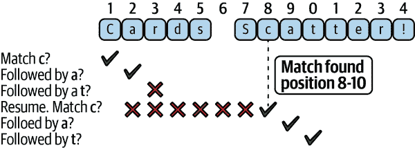
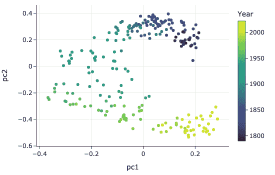

# 第十三章：处理文本

数据不仅可以以数字形式存在，还可以以文字形式存在：狗品种的名称、餐馆违规描述、街道地址、演讲、博客文章、网评等等。为了组织和分析文本中包含的信息，我们经常需要执行以下一些任务：

将文本转换为标准格式

这也被称为*规范化文本*。例如，我们可能需要将字符转换为小写，使用常见拼写和缩写，或删除标点和空格。

提取文本片段以创建特征

举例来说，一个字符串可能包含嵌入其中的日期，我们希望从字符串中提取出来以创建一个日期特征。

将文本转换为特征

我们可能希望将特定词语或短语编码为 0-1 特征，以指示它们在字符串中的存在。

分析文本

为了一次性比较整个文档，我们可以将文档转换为单词计数的向量。

这一章介绍了处理文本数据的常用技术。我们展示了简单的字符串操作工具通常足以将文本整理成标准形式或提取字符串的部分内容。我们还介绍了正则表达式，用于更通用和稳健的模式匹配。为了演示这些文本操作，我们使用了几个例子。我们首先介绍这些例子，并描述我们想要为分析准备文本的工作。

# 文本和任务示例

对于刚刚介绍的每种任务，我们提供一个激励性的例子。这些例子基于我们实际完成的任务，但为了专注于概念，我们已经将数据简化为片段。

## 将文本转换为标准格式

假设我们想要研究人口统计数据与选举结果之间的联系。为此，我们从维基百科获取了选举数据，从美国人口普查局获取了人口数据。数据的粒度是以县为单位的，我们需要使用县名来连接这两个表格。不幸的是，这两个表格中的县名并不总是匹配的：

|   | 县 | 州 | 投票数 |
| --- | --- | --- | --- |
| **0** | 德维特县 | 伊利诺伊州 | 97.8 |
| **1** | 拉克奎帕尔县 | 明尼苏达州 | 98.8 |
| **2** | 列威斯和克拉克县 | 蒙大拿州 | 95.2 |
| **3** | 圣约翰大洗礼者教区 | 路易斯安那州 | 52.6 |
|   | 县 | 州 | 人口 |
| --- | --- | --- | --- |
| **0** | 德威特 | 伊利诺伊州 | 16,798 |
| **1** | 拉克奎帕尔 | 明尼苏达州 | 8,067 |
| **2** | 列威斯和克拉克 | 蒙大拿州 | 55,716 |
| **3** | 圣约翰大洗礼者 | 路易斯安那州 | 43,044 |

我们无法将表格连接起来，直到我们将字符串清理为县名的共同格式为止。我们需要更改字符的大小写，使用常见的拼写和缩写，并处理标点符号。

## 提取文本片段以创建特征

文本数据有时具有很多结构，特别是当它是由计算机生成时。例如，以下是一个 Web 服务器的日志条目。注意条目中有多个数据片段，但这些片段没有一致的分隔符——例如，日期出现在方括号中，但数据的其他部分出现在引号和括号中：

```py
169.237.46.168 - -
[26/Jan/2004:10:47:58 -0800]"GET /stat141/Winter04 HTTP/1.1" 301 328
"http://anson.ucdavis.edu/courses"
"Mozilla/4.0 (compatible; MSIE 6.0; Windows NT 5.0; .NET CLR 1.1.4322)"

```

尽管文件格式与我们在 第八章 中看到的简单格式之一不符，但我们可以使用文本处理技术提取文本片段以创建特征。

## 将文本转换为特征

在 第九章 中，我们基于字符串内容创建了一个分类特征。在那里，我们检查了餐厅违规描述，并为特定词语的存在创建了名义变量。这里展示了一些示例违规行为：

```py
	unclean or degraded floors walls or ceilings
	inadequate and inaccessible handwashing facilities
	inadequately cleaned or sanitized food contact surfaces
	wiping cloths not clean or properly stored or inadequate sanitizer
	foods not protected from contamination
	unclean nonfood contact surfaces
	unclean or unsanitary food contact surfaces
	unclean hands or improper use of gloves
	inadequate washing facilities or equipment

```

这些新功能可以用于食品安全评分的分析。以前，我们制作了简单的特征，标记了描述中是否包含诸如 *手套* 或 *头发* 这样的词语。在本章中，我们更正式地介绍了我们用来创建这些特征的正则表达式工具。

## 文本分析

有时我们想比较整个文档。例如，美国总统每年都会发表国情咨文演讲。以下是第一次演讲的前几行：

```py
*** 

State of the Union Address
George Washington
January 8, 1790

Fellow-Citizens of the Senate and House of Representatives:
I embrace with great satisfaction the opportunity which now presents itself
of congratulating you on the present favorable prospects of our public …

```

我们可能会想：国情咨文演讲随时间如何变化？不同政党是否专注于不同的主题或在演讲中使用不同的语言？为了回答这些问题，我们可以将演讲转换为数字形式，以便使用统计方法进行比较。

这些示例用来说明字符串操作、正则表达式和文本分析的思想。我们从描述简单的字符串操作开始。

# 字符串操作

当我们处理文本时，有几种基本的字符串操作工具我们经常使用。

+   将大写字符转换为小写（或反之）。

+   用另一个子字符串替换或删除子字符串。

+   将字符串在特定字符处分割成片段。

+   在指定的位置切片字符串。

我们展示了如何组合这些基本操作来清理县名数据。请记住，我们有两张表需要连接，但县名的写法不一致。

让我们首先将县名转换为标准格式。

## 使用 Python 字符串方法将文本转换为标准格式

我们需要解决两张表中县名之间的以下不一致性：

+   大小写问题：`qui` 与 `Qui`。

+   省略词语：`County` 和 `Parish` 在 `census` 表中不存在。

+   不同的缩写约定：`&` 与 `and`。

+   不同的标点符号约定：`St.` 与 `St`。

+   使用空白符：`DeWitt` 与 `De Witt`。

当我们清理文本时，通常最容易的方法是先将所有字符转换为小写。全使用小写字符比尝试跟踪大写和小写的组合要容易。接下来，我们想通过将`&`替换为`and`并删除`County`和`Parish`来修复不一致的单词。最后，我们需要修复标点符号和空格的不一致。

只需使用两个 Python 字符串方法，`lower`和`replace`，我们就可以执行所有这些操作并清理县名。这些方法被合并到一个名为`clean_county`的方法中：

```py
`def` `clean_county``(``county``)``:`
    `return` `(``county`
            `.``lower``(``)`
            `.``replace``(``'``county``'``,` `'``'``)`
            `.``replace``(``'``parish``'``,` `'``'``)`
            `.``replace``(``'``&``'``,` `'``and``'``)`
            `.``replace``(``'``.``'``,` `'``'``)`
            `.``replace``(``'` `'``,` `'``'``)``)`

```

尽管简单，这些方法是我们可以组合成更复杂的字符串操作的基本构建块。这些方法方便地定义在所有 Python 字符串上，无需导入其他模块。值得熟悉的是[字符串方法的完整列表](https://oreil.ly/YWl9d)，但我们在表格 13-1 中描述了一些最常用的方法。

表格 13-1. 字符串方法

| 方法 | 描述 |
| --- | --- |
| `str.lower()` | 返回字符串的副本，所有字母都转换为小写 |
| `str.replace(a, b)` | 将`str`中所有子字符串`a`替换为子字符串`b` |
| `str.strip()` | 从`str`中移除前导和尾随的空格 |
| `str.split(a)` | 返回在子字符串`a`处分割的`str`的子字符串 |
| `str[x:y]` | 切片 `str`，返回从索引 x（包括）到 y（不包括）的部分 |

接下来，我们验证`clean_county`方法是否生成匹配的县名：

```py
`(``[``clean_county``(``county``)` `for` `county` `in` `election``[``'``County``'``]``]``,`
 `[``clean_county``(``county``)` `for` `county` `in` `census``[``'``County``'``]``]``)`

```

```py
(['dewitt', 'lacquiparle', 'lewisandclark', 'stjohnthebaptist'],
 ['dewitt', 'lacquiparle', 'lewisandclark', 'stjohnthebaptist'])

```

自从县名现在有了统一的表示方式，我们可以成功地将这两个表格连接起来。

## pandas 中的字符串方法

在上述代码中，我们使用循环来转换每个县名。`pandas`的`Series`对象提供了一种便捷的方法，可以将字符串方法应用于系列中的每个项。

在`pandas`的`Series`上，`.str`属性公开了相同的 Python 字符串方法。在`.str`属性上调用方法会在系列中的每个项上调用该方法。这使我们能够在不使用循环的情况下转换系列中的每个字符串。我们将转换后的县名保存回其原始表中。首先，我们在选举表中转换县名：

```py
`election``[``'``County``'``]` `=` `(``election``[``'``County``'``]`
 `.``str``.``lower``(``)`
 `.``str``.``replace``(``'``parish``'``,` `'``'``)`
 `.``str``.``replace``(``'``county``'``,` `'``'``)`
 `.``str``.``replace``(``'``&``'``,` `'``and``'``)`
 `.``str``.``replace``(``'``.``'``,` `'``'``,` `regex``=``False``)`
 `.``str``.``replace``(``'` `'``,` `'``'``)``)`

```

我们还将人口普查表中的名称转换，以便这两个表格包含相同的县名表示。我们可以连接这些表格：

```py
`election``.``merge``(``census``,` `on``=``[``'``County``'``,``'``State``'``]``)`

```

|   | 县名 | 州名 | 投票率 | 人口 |
| --- | --- | --- | --- | --- |
| **0** | dewitt | IL | 97.8 | 16,798 |
| **1** | lacquiparle | MN | 98.8 | 8,067 |
| **2** | lewisandclark | MT | 95.2 | 55,716 |
| **3** | stjohnthebaptist | LA | 52.6 | 43,044 |

###### 注意

注意，我们根据县名和州名两列进行了合并。这是因为一些州有同名的县。例如，加利福尼亚州和纽约州都有一个名为金县的县。

要查看完整的字符串方法列表，我们建议查看[Python 关于`str`方法的文档](https://oreil.ly/Fb34C)和[`pandas`关于`.str`访问器的文档](https://oreil.ly/njVi3)。我们只使用了`str.lower()`和多次调用`str.replace()`来完成规范化任务。接下来，我们使用另一个字符串方法`str.split()`提取文本。

## 分割字符串以提取文本片段

假设我们想从网络服务器的日志条目中提取日期：

```py
`log_entry`

```

```py
169.237.46.168 - - [26/Jan/2004:10:47:58 -0800]"GET /stat141/Winter04 HTTP/1.1"
301 328 "http://anson.ucdavis.edu/courses""Mozilla/4.0 (compatible; MSIE 6.0;
Windows NT 5.0; .NET CLR 1.1.4322)"

```

字符串分割可以帮助我们定位构成日期的信息片段。例如，当我们在左括号上分割字符串时，我们得到两个字符串：

```py
`log_entry``.``split``(``'``[``'``)`

```

```py
['169.237.46.168 - - ',
 '26/Jan/2004:10:47:58 -0800]"GET /stat141/Winter04 HTTP/1.1" 301 328 "http://anson.ucdavis.edu/courses""Mozilla/4.0 (compatible; MSIE 6.0; Windows NT 5.0; .NET CLR 1.1.4322)"']

```

第二个字符串包含日期信息，为了获取日、月和年，我们可以在该字符串上以冒号分割：

```py
`log_entry``.``split``(``'``[``'``)``[``1``]``.``split``(``'``:``'``)``[``0``]`

```

```py
'26/Jan/2004'

```

要分开日、月和年，我们可以在斜杠上分割。总共我们分割原始字符串三次，每次只保留我们感兴趣的部分：

```py
`(``log_entry``.``split``(``'``[``'``)``[``1``]`
 `.``split``(``'``:``'``)``[``0``]`
 `.``split``(``'``/``'``)``)`

```

```py
['26', 'Jan', '2004']

```

通过反复使用`split()`，我们可以提取日志条目的许多部分。但是这种方法很复杂——如果我们还想获取活动的小时、分钟、秒钟和时区，我们需要总共使用`split()`六次。有一种更简单的方法来提取这些部分：

```py
`import` `re`

`pattern` `=` `r``'``[` `\``[/:``\``]]``'` 
`re``.``split``(``pattern``,` `log_entry``)``[``4``:``11``]`

```

```py
['26', 'Jan', '2004', '10', '47', '58', '-0800']

```

这种替代方法使用了一个称为正则表达式的强大工具，我们将在下一节中介绍。

# 正则表达式

*正则表达式*（或简称*regex*）是我们用来匹配字符串部分的特殊模式。想想社会安全号码（SSN）的格式，例如`134-42-2012`。为了描述这种格式，我们可以说 SSN 由三位数字、一个短划线、两位数字、另一个短划线，然后是四位数字。正则表达式让我们能够在代码中捕获这种模式。正则表达式为我们提供了一种紧凑而强大的方式来描述这种数字和短划线的模式。正则表达式的语法非常简单，我们在本节中几乎介绍了所有的语法。

在介绍这些概念时，我们解决了前一节中描述的一些示例，并展示了如何使用正则表达式执行任务。几乎所有编程语言都有一个库，用于使用正则表达式匹配模式，这使得正则表达式在任何编程语言中都很有用。我们使用 Python 内置的`re`模块中的一些常见方法来完成示例中的任务。这些方法在本节末尾的表格 13-7 中进行了总结，其中简要描述了基本用法和返回值。由于我们只涵盖了一些最常用的方法，您可能会发现参考[官方文档关于`re`模块的信息](https://oreil.ly/IXWol)也很有用。

正则表达式基于逐个字符（也称为*字面量*）搜索模式的字符串。我们称这种概念为*字面量的连接*。

## 字面量的连接

串联最好通过一个基本示例来解释。假设我们在字符串`cards scatter!`中寻找模式`cat`。图 13-1 包含了一个图表，展示了搜索如何逐个字符地进行。请注意，在字符串的第一个位置找到了“c”，接着是“a”，但没有“t”，所以搜索会回到字符串的第二个字符，并开始再次搜索“c”。模式`cat`在字符串`cards scatter!`中的位置为 8 到 10。一旦你掌握了这个过程，你可以继续进行更丰富的模式；它们都遵循这个基本的范例。



###### 图 13-1\. 为了匹配文字模式，正则引擎沿着字符串移动，并逐个检查是否符合整个模式。请注意，模式在单词`scatters`中找到，并且在`cards`中找到部分匹配。

###### 注意

在前面的例子中，我们观察到正则表达式可以匹配出现在输入字符串中的任何模式。在 Python 中，这种行为根据用于匹配正则表达式的方法而异——某些方法仅在字符串开头匹配正则表达式时返回匹配；其他方法则在字符串中的任何位置返回匹配。

这些更丰富的模式由字符类和通配符等元字符组成。我们将在接下来的小节中描述它们。

### 字符类

我们可以通过使用*字符类*（也称为*字符集*）使模式更加灵活，它允许我们指定要匹配的一组等效字符。这使我们能够创建更宽松的匹配。要创建一个字符类，请将所需的字符集合包含在方括号`[ ]`中。例如，模式`[0123456789]`表示“匹配方括号内的任何文字”—在这种情况下是任何单个数字。然后，以下正则表达式匹配三个数字：

```py
[0123456789][0123456789][0123456789]

```

这是一个常用的字符类，有一个数字范围的简写表示法`[0-9]`。字符类允许我们创建一个匹配社保号码（SSNs）的正则表达式：

```py
[0-9][0-9][0-9]-[0-9][0-9]-[0-9][0-9][0-9][0-9]

```

另外两个常用的字符类范围是小写字母`[a-z]`和大写字母`[A-Z]`。我们可以将范围与其他等效字符结合使用，并使用部分范围。例如，`[a-cX-Z27]`等效于字符类`[abcXYZ27]`。

让我们回到我们最初的模式`cat`，并修改它以包含两个字符类：

```py
c[oa][td]

```

这个模式匹配`cat`，但也匹配`cot`，`cad`和`cod`：

```py
  Regex: c[oa][td]
   Text: The cat eats cod, cads, and cots, but not coats.
Matches:     ***      ***  ***       ***                 

```

每次仍然逐个字符地移动字符串的核心概念仍然存在，但现在在哪个文字被视为匹配方面有了更多的灵活性。

### 通配符字符

当我们真的不关心文字是什么时，我们可以用`.`，即句号字符来指定。这可以匹配除换行符以外的任何字符。

### 否定字符类

*否定字符类* 匹配方括号内除了那些字符外的任何字符。要创建否定字符类，请在左方括号后面放置插入符号。例如，`[⁰-9]` 匹配除数字外的任何字符。

### 字符类的简写形式

有些字符集如此常见，以至于有它们的简写形式。例如，`\d`代表`[0-9]`。我们可以使用这些简写来简化对社会安全号码的搜索：

```py
\d\d\d-\d\d-\d\d\d\d

```

我们的社会安全号码的正则表达式并不是完全可靠的。如果字符串在我们寻找的模式开头或结尾有额外的数字，那么我们仍然能够匹配到。注意，我们在引号前添加`r`字符以创建原始字符串，这样可以更容易地编写正则表达式：

```py
  Regex: \d\d\d-\d\d-\d\d\d\d
   Text: My other number is 6382-13-38420.
Matches:                     ***********  

```

我们可以通过不同类型的元字符来修正这种情况：一个可以匹配单词边界的元字符。

### 锚点和边界

有时我们想要匹配字符之前、之后或之间的位置。一个例子是定位字符串的开头或结尾；这些称为*锚点*。另一个是定位单词的开头或结尾，我们称之为*边界*。元字符`\b`表示单词的边界。它长度为 0，并且匹配模式边界上的空白或标点符号。我们可以用它来修复我们的社会安全号码的正则表达式：

```py
  Regex: \d\d\d-\d\d-\d\d\d\
   Text: My other number is 6382-13-38420.
Matches:                                  

```

```py
  Regex: \b\d\d\d-\d\d-\d\d\d\d\b
   Text: My reeeal number is 382-13-3842.
Matches:                     *********** 

```

### 转义元字符

我们现在已经见过几个特殊字符，称为*元字符*：`[` 和 `]` 表示字符类，`^` 切换到否定字符类，`.` 表示任何字符，`-` 表示范围。但有时我们可能想要创建一个匹配其中一个这些文字的模式。当这种情况发生时，我们必须用反斜杠进行转义。例如，我们可以使用正则表达式 `\[` 来匹配字面上的左方括号字符：

```py
  Regex: \[
   Text: Today is [2022/01/01]
Matches:          *           

```

接下来，我们展示量词如何帮助创建更紧凑和清晰的正则表达式来匹配社会安全号码。

## 量词

要创建一个用于匹配社会安全号码的正则表达式，我们写道：

```py
\b[0-9][0-9][0-9]-[0-9][0-9]-[0-9][0-9][0-9][0-9]\b

```

这匹配由三个数字、一个破折号、另外两个数字、一个破折号和另外四个数字组成的“单词”。

量词允许我们匹配多个连续出现的字符。我们通过在花括号`{ }`中放置数字来指定重复的次数。

让我们使用 Python 的内置`re`模块来匹配这种模式：

```py
`import` `re`

`ssn_re` `=` `r``'``\``b[0-9]``{3}``-[0-9]``{2}``-[0-9]``{4}``\``b``'`
`re``.``findall``(``ssn_re``,` `'``My SSN is 382-34-3840.``'``)`

```

```py
['382-34-3840']

```

我们的模式不应匹配电话号码。让我们试试：

```py
`re``.``findall``(``ssn_re``,` `'``My phone is 382-123-3842.``'``)`

```

```py
[]

```

量词总是修改其左侧的字符或字符类。Table 13-2 显示了量词的完整语法。

Table 13-2\. 量词示例

| Table 13-3\. 简写量词 |
| --- | --- |
| {m, n} | 匹配前面的字符 m 到 n 次。 |
| {m} | 匹配前面的字符恰好 m 次。 |
| {m,} | 匹配前面的字符至少 m 次。 |
| {,n} | 匹配前面的字符最多 n 次。 |

一些常用的量词有简写形式，如 Table 13-3 所示。

Table 13-3\. 简写量词

| Symbol | 量词 | 含义 |
| --- | --- | --- |
| `*` | {0,} | 匹配前一个字符 0 或多次。 |
| `+` | {1,} | 匹配前一个字符 1 次或多次。 |
| `?` | {0,1} | 匹配前一个字符 0 或 1 次。 |

量词是贪婪的，会返回可能的最长匹配。这有时会导致意想不到的行为。由于社会安全号码以数字开头和结尾，我们可能认为以下较短的正则表达式将是查找 SSN 的简单方法。你能想出匹配出现错误的原因吗？

```py
`ssn_re_dot` `=` `r``'``[0-9].+[0-9]``'`
`re``.``findall``(``ssn_re_dot``,` `'``My SSN is 382-34-3842 and hers is 382-34-3333.``'``)`

```

```py
['382-34-3842 and hers is 382-34-3333']

```

注意，我们使用元字符`.`匹配任意字符。在许多情况下，使用更具体的字符类可以避免这些虚假的“超匹配”。我们之前包含单词边界的模式就是这样做的：

```py
`re``.``findall``(``ssn_re``,` `'``My SSN is 382-34-3842 and hers is 382-34-3333.``'``)`

```

```py
['382-34-3842', '382-34-3333']

```

有些平台允许关闭贪婪匹配并使用*惰性*匹配，返回最短的字符串。

文字连接和量词是正则表达式中的两个核心概念。接下来，我们介绍另外两个核心概念：选择和分组。

## 利用选择和分组创建特征

字符类允许我们匹配单个文字的多个选项。我们可以使用选择来匹配一组文字的多个选项。例如，在第九章中的食品安全示例中，我们标记与身体部位相关的违规行为，通过检查违规行为是否包含`hand`、`nail`、`hair`或`glove`子串。我们可以在正则表达式中使用`|`字符指定这种选择：

```py
`body_re` `=` `r``"``hand|nail|hair|glove``"`
`re``.``findall``(``body_re``,` `"``unclean hands or improper use of gloves``"``)`

```

```py
['hand', 'glove']

```

```py
`re``.``findall``(``body_re``,` `"``Unsanitary employee garments hair or nails``"``)`

```

```py
['hair', 'nail']

```

使用括号我们可以定位模式的部分，这称为*正则表达式组*。例如，我们可以使用正则表达式组从 Web 服务器日志条目中提取日期、月份、年份和时间：

```py
`# This pattern matches the entire timestamp`
`time_re` `=` `r``"``\``[[0-9]``{2}``/[a-zA-z]``{3}``/[0-9]``{4}``:[0-9:``\``- ]*``\``]``"`
`re``.``findall``(``time_re``,` `log_entry``)`

```

```py
['[26/Jan/2004:10:47:58 -0800]']

```

```py
`# Same regex, but we use parens to make regex groups...`
`time_re` `=` `r``"``\``[([0-9]``{2}``)/([a-zA-z]``{3}``)/([0-9]``{4}``):([0-9:``\``- ]*)``\``]``"`

`# ...which tells findall() to split up the match into its groups`
`re``.``findall``(``time_re``,` `log_entry``)`

```

```py
[('26', 'Jan', '2004', '10:47:58 -0800')]

```

正如我们所见，`re.findall` 返回一个包含日期和时间各个组件的元组列表。

我们已经介绍了许多术语，因此在下一节中，我们将它们整合到一组表格中，以便轻松查阅。

## 参考表格

我们通过几个总结操作顺序、元字符和字符类速记的表格来结束本节。我们还提供了总结在本节中使用的`re` Python 库少数方法的表格。

正则表达式的四个基本操作——连接、量化、选择和分组——具有优先顺序，在表格 13-4 中我们明确说明了这一点。

表格 13-4\. 操作顺序

| 操作 | 顺序 | 示例 | 匹配 |
| --- | --- | --- | --- |
| 连接 | 3 | `cat` | `cat` |
| 选择 | 4 | `cat&#124;mouse` | `cat` 和 `mouse` |
| 量化 | 2 | `cat?` | `ca` 和 `cat` |
| 分组 | 1 | c(at)? | `c` 和 `cat` |

表格 13-5 提供了本节介绍的元字符列表，以及一些额外的内容。标有“不匹配”的列举了示例正则表达式不匹配的字符串。

表格 13-5\. 元字符

| 字符 | 描述 | 示例 | 匹配 | 不匹配 |
| --- | --- | --- | --- | --- |
| . | 除 \n 外的任意字符 | `...` | abc | ab |
| [ ] | 方括号内的任意字符 | `[cb.]ar` | car .ar | jar |
| [^ ] | 方括号内 *不* 包含的任意字符 | `[^b]ar` | car par | bar ar |
| * | ≥ 0 或更多前一个符号，简写为 {0,} | `[pb]*ark` | bbark ark | dark |
| + | ≥ 1 或更多前一个符号，简写为 {1,} | `[pb]+ark` | bbpark bark | dark ark |
| ? | 0 或 1 个前一个符号，简写为 {0,1} | `s?he` | she he | the |
| {*n*} | 前一个符号恰好 *n* 次 | `hello{3}` | hellooo | hello |

| &#124; | 竖线前后的模式 | `we&#124;[ui]s` | we us

is | es e

s |

| \ | 转义下一个字符 | `\[hi\]` | [hi] | hi |
| --- | --- | --- | --- | --- |
| ^ | 行首 | `^ark` | ark two | dark |
| $ | 行尾 | `ark$` | noahs ark | noahs arks |
| \b | 单词边界 | `ark\b` | ark of noah | noahs arks |

此外，在 表 13-6 中，我们为一些常用字符集提供了简写。这些简写不需要 `[ ]`。

表 13-6\. 字符类简写

| 描述 | 方括号形式 | 简写 |
| --- | --- | --- |
| 字母数字字符 | `[a-zA-Z0-9_]` | `\w` |
| 非字母数字字符 | `[^a-zA-Z0-9_]` | `\W` |
| 数字 | `[0-9]` | `\d` |
| 非数字 | `[⁰-9]` | `\D` |
| 空白字符 | `[\t\n\f\r\p{Z}]` | `\s` |
| 非空白字符 | `[\t\n\f\r\p{z}]` | `\S` |

我们在本章中使用了以下 `re` 方法。方法名称指示了它们执行的功能：在字符串中 *搜索* 或 *匹配* 模式；在字符串中 *查找* 所有模式的情况；将模式的所有出现 *替换* 为子字符串；以及在模式处 *分割* 字符串。每个方法都需要指定一个模式和一个字符串，并且一些还有额外的参数。表 13-7 提供了方法使用的格式以及返回值的描述。

表 13-7\. 正则表达式方法

| 方法 | 返回值 |
| --- | --- |
| `re.search(pattern, string)` | 如果模式在字符串任何位置找到，则为匹配对象，否则为 `None` |
| `re.match(pattern, string)` | 如果模式在字符串开头找到，则为匹配对象，否则为 `None` |
| `re.findall(pattern, string)` | 字符串 `string` 中所有 `pattern` 的匹配项列表 |
| `re.sub(pattern, replacement, string)` | 字符串 `string` 中所有 `pattern` 的出现都被 `replacement` 替换的字符串 |
| `re.split(pattern, string)` | 围绕 `pattern` 出现的 `string` 片段列表 |

正如我们在前一节中看到的，`pandas` 的 `Series` 对象具有一个 `.str` 属性，支持使用 Python 字符串方法进行字符串操作。方便地，`.str` 属性还支持 `re` 模块的一些函数。表 13-8 展示了与 `re` 方法的 表 13-7 相似的功能。每个都需要一个模式。请参阅 [pandas 文档](https://oreil.ly/aHJRz) 获取完整的字符串方法列表。

表 13-8\. `pandas` 中的正则表达式

| 方法 | 返回值 |
| --- | --- |
| `str.contains(pattern, regex=True)` | 指示 `pattern` 是否找到的布尔序列 |
| `str.findall(pattern, regex=True)` | 匹配 `pattern` 的所有结果的列表 |
| `str.replace(pattern, replacement, regex=True)` | Series with all matching occurrences of `pattern` replaced by `replacement` |
| `str.split(pattern, regex=True)` | 给定 `pattern` 周围字符串列表的序列 |

正则表达式是一个强大的工具，但它们以难以阅读和调试著称。最后我们提出了一些建议来使用正则表达式：

+   在简单的测试字符串上开发你的正则表达式，看看模式匹配的情况。

+   如果一个模式没有匹配到任何内容，尝试通过减少模式的部分来削弱它。然后逐步加强它，看看匹配的进展。（在线正则表达式检查工具在这里非常有帮助。）

+   让模式尽可能具体以适应手头的数据。

+   尽可能使用原始字符串以获得更清晰的模式，特别是当模式包含反斜杠时。

+   当你有很多长字符串时，考虑使用编译后的模式，因为它们可以更快速地匹配（见 `re` 库中的 `compile()`）。

在下一节中，我们进行一个示例文本分析。我们使用正则表达式和字符串操作清理数据，将文本转换为定量数据，并通过这些派生数量分析文本。

# 文本分析

到目前为止，我们使用 Python 方法和正则表达式来清理短文本字段和字符串。在本节中，我们将使用一种称为*文本挖掘*的技术来分析整个文档，该技术将自由形式的文本转换为定量表达，以揭示有意义的模式和洞见。

文本挖掘是一个深奥的主题。我们不打算进行全面的讲解，而是通过一个例子介绍几个关键思想，我们将分析从 1790 年到 2022 年的国情咨文演讲。每年，美国总统向国会发表国情咨文演讲。这些演讲谈论国家当前事件，并提出国会应考虑的建议。[美国总统项目](https://oreil.ly/JbpO4) 在线提供这些演讲。

让我们从打开包含所有演讲的文件开始：

```py
`from` `pathlib` `import` `Path`

`text` `=` `Path``(``'``data/stateoftheunion1790-2022.txt``'``)``.``read_text``(``)`

```

在本章的开头，我们看到数据中每篇演讲都以三个星号开头的一行：`***`。我们可以使用正则表达式来计算字符串 `***` 出现的次数：

```py
`import` `re`
`num_speeches` `=` `len``(``re``.``findall``(``r``"``\``*``\``*``\``*``"``,` `text``)``)`
`print``(``f``'``There are` `{``num_speeches``}` `speeches total``'``)`

```

```py
There are 232 speeches total

```

在文本分析中，*文档* 指的是我们想要分析的单个文本。在这里，每篇演讲都是一个文档。我们将 `text` 变量分解为其各个文档：

```py
`records` `=` `text``.``split``(``"``***``"``)`

```

然后我们可以把演讲放入一个数据框中：

```py
`def` `extract_parts``(``speech``)``:`
    `speech` `=` `speech``.``strip``(``)``.``split``(``'``\n``'``)``[``1``:``]`
    `[``name``,` `date``,` `*``lines``]` `=` `speech`
    `body` `=` `'``\n``'``.``join``(``lines``)``.``strip``(``)`
    `return` `[``name``,` `date``,` `body``]`

`def` `read_speeches``(``)``:`
    `return` `pd``.``DataFrame``(``[``extract_parts``(``l``)` `for` `l` `in` `records``[``1``:``]``]``,`
                        `columns` `=` `[``"``name``"``,` `"``date``"``,` `"``text``"``]``)`

`df` `=` `read_speeches``(``)`
`df`

```

|   | 名称 | 日期 | 文本 |
| --- | --- | --- | --- |
| **0** | 乔治·华盛顿 | 1790 年 1 月 8 日 | 参议院和众议院的同胞们... |
| **1** | 乔治·华盛顿 | 1790 年 12 月 8 日 | 参议院和众议院的同胞们... |
| **2** | 乔治·华盛顿 | 1791 年 10 月 25 日 | 参议院和众议院的同胞们... |
| **...** | ... | ... | ... |
| **229** | 唐纳德·J·特朗普 | 2020 年 2 月 4 日 | 非常感谢。谢谢。非常感谢你... |
| **230** | 约瑟夫·R·拜登 | 2021 年 4 月 28 日 | 谢谢你。谢谢你。谢谢你。很高兴回来... |
| **231** | 约瑟夫·R·拜登 | 2022 年 3 月 1 日 | 女士们，众议长，女副总统，我们的第一... |

```py
232 rows × 3 columns
```

现在我们已经将演讲加载到数据框中，我们希望转换演讲，以查看它们随时间的变化。我们的基本思想是查看演讲中的单词 - 如果两个演讲包含非常不同的单词，我们的分析应告诉我们这一点。通过某种文档相似度的度量，我们可以看到演讲彼此之间的差异。

文档中有一些问题，我们需要先解决：

+   大小写不应该影响：`Citizens` 和 `citizens` 应被视为相同的单词。我们可以通过将文本转换为小写来解决这个问题。

+   文本中有未发表的言论：`[laughter]` 指出观众笑了的地方，但这些不应该算作演讲的一部分。我们可以通过使用正则表达式来删除方括号内的文本：`\[[^\]]+\]`。请记住，`\[` 和 `\]` 匹配文字的左右括号，`[^\]]` 匹配任何不是右括号的字符。

+   我们应该去掉不是字母或空格的字符：一些演讲谈到财务问题，但金额不应该被视为单词。我们可以使用正则表达式 `[^a-z\s]` 来删除这些字符。这个正则表达式匹配任何不是小写字母 (`a-z`) 或空格字符 (`\s`) 的字符：

    ```py
    `def` `clean_text``(``df``)``:`
        `bracket_re` `=` `re``.``compile``(``r``'``\``[[^``\``]]+``\``]``'``)`
        `not_a_word_re` `=` `re``.``compile``(``r``'``[^a-z``\``s]``'``)`
        `cleaned` `=` `(``df``[``'``text``'``]``.``str``.``lower``(``)`
                   `.``str``.``replace``(``bracket_re``,` `'``'``,` `regex``=``True``)`
                   `.``str``.``replace``(``not_a_word_re``,` `'` `'``,` `regex``=``True``)``)`
        `return` `df``.``assign``(``text``=``cleaned``)`

    `df` `=` `(``read_speeches``(``)`
          `.``pipe``(``clean_text``)``)`
    `df`

    ```

    |   | 名字 | 日期 | 文本 |
    | --- | --- | --- | --- |
    | 0 | 乔治·华盛顿 | 1790 年 1 月 8 日 | 参议院和众议院的同胞们... |
    | 1 | 乔治·华盛顿 | 1790 年 12 月 8 日 | 参议院和众议院的同胞们... |
    | 2 | 乔治·华盛顿 | 1791 年 10 月 25 日 | 参议院和众议院的同胞们... |
    | ... | ... | ... | ... |
    | 229 | 唐纳德·J·特朗普 | 2020 年 2 月 4 日 | 非常感谢。谢谢。非常感谢你... |
    | 230 | 约瑟夫·R·拜登 | 2021 年 4 月 28 日 | 谢谢你。谢谢你。谢谢你。很高兴回来... |
    | 231 | 约瑟夫·R·拜登 | 2022 年 3 月 1 日 | 女士们，众议长，女副总统，我们的第一... |

    ```py
    232 rows × 3 columns
    ```

接下来，我们看一些更复杂的问题：

+   *停用词*，如 `is`、`and`、`the` 和 `but` 出现得太频繁，我们希望将它们删除。

+   `argue` 和 `arguing` 应被视为相同的单词，尽管它们在文本中显示不同。为了解决这个问题，我们将使用*词干提取*，将两个单词转换为 `argu`。

要处理这些问题，我们可以使用[nltk 库](https://www.nltk.org)中的内置方法。

最后，我们将演讲转换为*词向量*。词向量使用一组数字来表示一个文档。例如，一种基本的词向量类型统计了文本中每个词出现的次数，如图 13-2 所示。


###### 图 13-2。三个小示例文档的词袋向量

这种简单的转换被称为*词袋模型*，我们将其应用于所有的演讲稿。然后，我们计算*词频-逆文档频率*（*tf-idf*简称）来规范化计数并测量单词的稀有性。tf-idf 会对只出现在少数文档中的单词给予更多的权重。其思想是，如果只有少数文档提到了*制裁*这个词，那么这个词对于区分不同文档就非常有用。我们使用的[scikit-learn 库](https://oreil.ly/3A6a5)完整描述了这一转换和实现。

应用这些转换后，我们得到了一个二维数组，`speech_vectors`。该数组的每一行是一个转换为向量的演讲：

```py
`import` `nltk`
`nltk``.``download``(``'``stopwords``'``)`
`nltk``.``download``(``'``punkt``'``)`

`from` `nltk``.``stem``.``porter` `import` `PorterStemmer`
`from` `sklearn``.``feature_extraction``.``text` `import` `TfidfVectorizer`

`stop_words` `=` `set``(``nltk``.``corpus``.``stopwords``.``words``(``'``english``'``)``)`
`porter_stemmer` `=` `PorterStemmer``(``)`

`def` `stemming_tokenizer``(``document``)``:`
    `return` `[``porter_stemmer``.``stem``(``word``)`
            `for` `word` `in` `nltk``.``word_tokenize``(``document``)`
            `if` `word` `not` `in` `stop_words``]`

`tfidf` `=` `TfidfVectorizer``(``tokenizer``=``stemming_tokenizer``)`
`speech_vectors` `=` `tfidf``.``fit_transform``(``df``[``'``text``'``]``)`

```

```py
`speech_vectors``.``shape`

```

```py
(232, 13211)

```

我们有 232 篇演讲，每篇演讲都被转换为一个长度为 13,211 的向量。为了可视化这些演讲，我们使用一种称为*主成分分析*的技术，将 13,211 个特征的数据表通过一组新的正交特征重新表示。第一个向量解释了原始特征的最大变化，第二个向量解释了与第一个正交的最大方差，依此类推。通常，我们可以将前两个主成分作为点对进行绘制，从而揭示聚类和异常值。

接下来，我们绘制了前两个主成分。每个点代表一个演讲，我们根据演讲的年份对点进行了颜色编码。靠近一起的点表示相似的演讲，而远离的点表示不同的演讲：



我们可以清晰地看到随时间变化的演讲之间存在明显的差异——19 世纪的演讲使用了与 21 世纪后的演讲非常不同的词汇。同一时间段的演讲聚集在一起也是非常有趣的现象。这表明，同一时期的演讲在语言风格上相对相似，即使演讲者来自不同的政党。

本节对文本分析进行了简要介绍。我们使用了前几节的文本操作工具来清理总统演讲稿。然后，我们采用了更高级的技术，如词干提取、tf-idf 转换和主成分分析来比较演讲。尽管本书无法详细介绍所有这些技术，但我们希望这一部分能引起您对文本分析这一激动人心领域的兴趣。

# 摘要

本章介绍了处理文本以清洁和分析数据的技术，包括字符串操作、正则表达式和文档分析。文本数据包含了关于人们生活、工作和思考方式的丰富信息。但这些数据对计算机来说也很难使用——想想人们为了表达同一个词而创造出的各种形式。本章的技术使我们能够纠正打字错误，从日志中提取特征，并比较文档。

我们不建议您使用正则表达式来：

+   解析层次结构，如 JSON 或 HTML；请使用解析器

+   搜索复杂属性，如回文和平衡的括号

+   验证复杂功能，比如有效的电子邮件地址

正则表达式虽然功能强大，但在这类任务中表现很差。然而，根据我们的经验，即使是基本的文本处理技能也能实现各种有趣的分析——少量技巧也能带来长远影响。

我们还要特别提醒一下正则表达式：它们可能会消耗大量计算资源。在将它们用于生产代码时，您需要权衡这些简洁明了的表达式与它们可能带来的开销。

下一章将讨论其他类型的数据，如二进制格式的数据以及 JSON 和 HTML 中高度结构化的文本。我们将重点放在将这些数据加载到数据框和其他 Python 数据结构中。
