# 第十五章：线性模型

在本书的这一部分，我们已经以不同的程度涵盖了数据科学生命周期的四个阶段。我们已经讨论了如何提出问题、获取和清理数据，并使用探索性数据分析来更好地理解数据。在本章中，我们将常数模型（在第四章中引入）扩展为*线性模型*。线性模型是生命周期的最后阶段中的一种流行工具：理解世界。

了解如何拟合线性模型为各种有用的数据分析打开了大门。我们可以使用这些模型进行*预测*——例如，环境科学家开发了一个线性模型，根据空气传感器测量和天气条件预测空气质量（参见第十二章）。在那个案例研究中，理解两个仪器测量值的变化帮助我们校准廉价传感器，并改善它们的空气质量读数。我们还可以使用这些模型来进行*推断*，例如，在第十八章中我们将看到兽医如何使用线性模型推断驴的体重与长度和胸围的系数：<math><mi>L</mi> <mi>e</mi> <mi>n</mi> <mi>g</mi> <mi>t</mi> <mi>h</mi>  <mo>+</mo>  <mn>2</mn> <mo>×</mo> <mi>G</mi> <mi>i</mi> <mi>r</mi> <mi>t</mi> <mi>h</mi>  <mo>−</mo>  <mn>175</mn></math>。在那个案例研究中，该模型使得在现场工作的兽医能够为生病的驴子开具药物处方。模型还可以帮助*描述关系*并提供见解——例如，在本章中，我们探讨了与上升流动性相关的因素之间的关系，如通勤时间、收入不平等和 K-12 教育质量。我们进行了描述性分析，按照社会科学家用来塑造公众对话和制定政策建议的分析方法。

我们首先描述简单线性模型，它总结了两个特征之间的关系，并用一条直线表示。我们解释如何使用在第四章介绍的损失最小化方法来拟合这条直线到数据上。然后我们介绍多元线性模型，它使用多个其他特征来模拟一个特征。为了拟合这样的模型，我们使用线性代数，并揭示用平方误差损失拟合线性模型背后的几何学。最后，我们涵盖了特征工程技术，这些技术可以在构建模型时包括分类特征和转换特征。

# 简单线性模型

像常数模型一样，我们的目标是通过常数近似特征中的信号。现在我们有来自第二特征的额外信息来帮助我们。简而言之，我们希望利用第二特征的信息制定比常数模型更好的模型。例如，我们可能会通过房屋的大小描述其销售价格，或者根据驴的长度预测其重量。在这些例子中，我们有一个*结果*特征（销售价格，重量），我们希望用*解释变量*特征（房屋大小，长度）来解释、描述或预测。

###### 注意

我们使用*结果*来指代我们试图建模的特征，*解释变量*来指代我们用来解释结果的特征。不同领域已经采用了描述这种关系的惯例。有些人称结果为因变量，解释变量为自变量。其他人使用响应和协变量；回归和回归器；被解释和解释性；内生和外生。在机器学习中，*目标*和*特征*或*预测*和*预测因子*是常见的。不幸的是，许多这些对都暗示了因果关系。解释或预测的概念并不一定意味着一个因素导致了另一个因素。特别令人困惑的是独立-依赖的用法，我们建议避免使用它。

我们可能会使用的一个可能模型是一条直线。数学上来说，这意味着我们有一个截距<math><msub><mi>θ</mi> <mn>0</mn></msub></math>和一个斜率<math><msub><mi>θ</mi> <mn>1</mn></msub></math>，并且我们使用解释特征<math><mi>x</mi></math>来通过直线上的一个点来近似结果<math><mi>y</mi></math>：

<math display="block"><mi>y</mi> <mo>≈</mo> <msub><mi>θ</mi> <mn>0</mn></msub> <mo>+</mo> <msub><mi>θ</mi> <mn>1</mn></msub> <mi>x</mi></math>

随着<math><mi>x</mi></math>的变化，对<math><mi>y</mi></math>的估计也会变化，但仍然落在直线上。通常情况下，估计并不完美，使用模型会有一些误差；这就是为什么我们使用符号<math><mo>≈</mo></math>来表示“大约”。

要找到一条能够很好地捕捉结果信号的线，我们使用了在第四章介绍的相同方法，并最小化平均平方损失。具体来说，我们按照以下步骤进行：

1.  找到误差：<math><msub><mi>y</mi> <mi>i</mi></msub> <mo>−</mo> <mo stretchy="false">(</mo> <msub><mi>θ</mi> <mn>0</mn></msub> <mo>+</mo> <msub><mi>θ</mi> <mn>1</mn></msub> <msub><mi>x</mi> <mi>i</mi></msub> <mo stretchy="false">)</mo> <mo>,</mo>  <mi>i</mi> <mo>=</mo> <mn>1</mn> <mo>,</mo> <mo>…</mo> <mo>,</mo> <mi>n</mi></math>

1.  平方误差（即使用平方损失）：<math><mo stretchy="false">[</mo> <msub><mi>y</mi> <mi>i</mi></msub> <mo>−</mo> <mo stretchy="false">(</mo> <msub><mi>θ</mi> <mn>0</mn></msub> <mo>+</mo> <msub><mi>θ</mi> <mn>1</mn></msub> <msub><mi>x</mi> <mi>i</mi></msub> <mo stretchy="false">)</mo> <msup><mo stretchy="false">]</mo> <mn>2</mn></msup></math>

1.  计算数据的平均损失：

    <math display="block"><mfrac><mn>1</mn> <mi>n</mi></mfrac> <munder><mo>∑</mo> <mrow><mi>i</mi></mrow></munder> <mo stretchy="false">[</mo> <msub><mi>y</mi> <mi>i</mi></msub> <mo>−</mo> <mo stretchy="false">(</mo> <msub><mi>θ</mi> <mn>0</mn></msub> <mo>+</mo> <msub><mi>θ</mi> <mn>1</mn></msub> <msub><mi>x</mi> <mi>i</mi></msub> <mo stretchy="false">)</mo> <msup><mo stretchy="false">]</mo> <mn>2</mn></msup></math>

为了拟合模型，我们寻找能够给出最小平均损失的斜率和截距；换句话说，我们最小化*均方误差*，简称 MSE。我们称截距和斜率的最小化值为<math><msub><mrow><mover><mi>θ</mi> <mo stretchy="false">^</mo></mover></mrow> <mn>0</mn></msub></math>和<math><msub><mrow><mover><mi>θ</mi> <mo stretchy="false">^</mo></mover></mrow> <mn>1</mn></msub></math>。

注意，在步骤 1 中计算的误差是沿垂直方向测量的，这意味着对于特定的<math><mi>x</mi></math>，误差是数据点<math><mo stretchy="false">(</mo> <mi>x</mi> <mo>,</mo> <mi>y</mi> <mo stretchy="false">)</mo></math>与线上点<math><mo stretchy="false">(</mo> <mi>x</mi> <mo>,</mo> <msub><mi>θ</mi> <mn>0</mn></msub> <mo>+</mo> <msub><mi>θ</mi> <mn>1</mn></msub> <mi>x</mi> <mo stretchy="false">)</mo></math>之间的垂直距离。图 15-1 展示了这一概念。左侧是点的散点图，带有用于从<math><mi>x</mi></math>估计<math><mi>y</mi></math>的直线。我们用方块标记了两个特定点，并用菱形表示它们在直线上的估计值。从实际点到直线的虚线段显示了误差。右侧的图是所有误差的散点图；作为参考，我们还标记了左图中两个方块点对应的误差在右图中也用方块标记了。

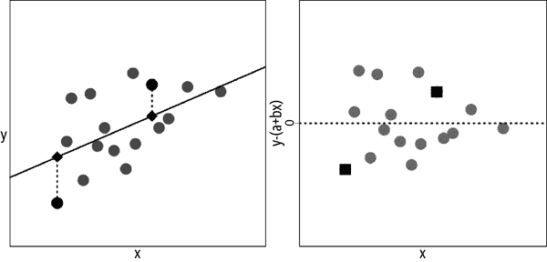

###### 图 15-1\. 左侧是<math><mo stretchy="false">(</mo> <msub><mi>x</mi> <mi>i</mi></msub> <mo>,</mo> <msub><mi>y</mi> <mi>i</mi></msub> <mo stretchy="false">)</mo></math>对的散点图和我们用于从<math><mi>x</mi></math>估计<math><mi>y</mi></math>的直线。具体的两个点用方块表示，它们的估计值用菱形表示。右侧是误差的散点图：<math><msub><mi>y</mi> <mi>i</mi></msub> <mo>−</mo> <mo stretchy="false">(</mo> <msub><mi>θ</mi> <mn>0</mn></msub> <mo>+</mo> <msub><mi>θ</mi> <mn>1</mn></msub> <msub><mi>x</mi> <mi>i</mi></msub> <mo stretchy="false">)</mo></math>。

在本章的后面，我们推导出使均方误差最小化的值 <math><msub><mrow><mover><mi>θ</mi> <mo stretchy="false">^</mo></mover></mrow> <mn>0</mn></msub></math> 和 <math><msub><mrow><mover><mi>θ</mi> <mo stretchy="false">^</mo></mover></mrow> <mn>1</mn></msub></math>。我们表明这些值分别为：

<math display="block"><mtable columnalign="right" columnspacing="0em" displaystyle="true" rowspacing="3pt"><mtr><mtd><mtable columnalign="right left" columnspacing="0em" displaystyle="true" rowspacing="3pt"><mtr><mtd><msub><mrow><mover><mi>θ</mi> <mo stretchy="false">^</mo></mover></mrow> <mn>0</mn></msub></mtd> <mtd><mo>=</mo> <mrow><mover><mi>y</mi> <mo stretchy="false">¯</mo></mover></mrow> <mo>−</mo> <msub><mrow><mover><mi>θ</mi> <mo stretchy="false">^</mo></mover></mrow> <mn>1</mn></msub> <mrow><mover><mi>x</mi> <mo stretchy="false">¯</mo></mover></mrow></mtd></mtr> <mtr><mtd><msub><mrow><mover><mi>θ</mi> <mo stretchy="false">^</mo></mover></mrow> <mn>1</mn></msub></mtd> <mtd><mo>=</mo> <mi>r</mi> <mo stretchy="false">(</mo> <mrow><mrow><mi mathvariant="bold">x</mi></mrow></mrow> <mo>,</mo> <mrow><mrow><mi mathvariant="bold">y</mi></mrow></mrow> <mo stretchy="false">)</mo> <mfrac><mrow><mi>S</mi> <mi>D</mi> <mo stretchy="false">(</mo> <mrow><mrow><mi mathvariant="bold">y</mi></mrow></mrow> <mo stretchy="false">)</mo></mrow> <mrow><mi>S</mi> <mi>D</mi> <mo stretchy="false">(</mo> <mrow><mrow><mi mathvariant="bold">x</mi></mrow></mrow> <mo stretchy="false">)</mo></mrow></mfrac></mtd></mtr></mtable></mtd></mtr></mtable></math>

在这里，<math><mrow><mrow><mi mathvariant="bold">x</mi></mrow></mrow></math> 表示值 <math><msub><mi>x</mi> <mn>1</mn></msub> <mo>,</mo> <mo>…</mo> <mo>,</mo> <msub><mi>x</mi> <mi>n</mi></msub></math>，而 <math><mrow><mrow><mi mathvariant="bold">y</mi></mrow></mrow></math> 类似定义；<math><mi>r</mi> <mo stretchy="false">(</mo> <mrow><mrow><mi mathvariant="bold">x</mi></mrow></mrow> <mo>,</mo> <mrow><mrow><mi mathvariant="bold">y</mi></mrow></mrow> <mo stretchy="false">)</mo></math> 是 <math><mo stretchy="false">(</mo> <msub><mi>x</mi> <mi>i</mi></msub> <mo>,</mo> <msub><mi>y</mi> <mi>i</mi></msub> <mo stretchy="false">)</mo></math> 对的相关系数。

将两者结合起来，线性方程变为：

<math display="block"><mtable columnalign="right" columnspacing="0em" displaystyle="true" rowspacing="3pt"><mtr><mtd><mtable columnalign="right left" columnspacing="0em" displaystyle="true" rowspacing="3pt"><mtr><mtd><msub><mrow><mover><mi>θ</mi> <mo stretchy="false">^</mo></mover></mrow> <mn>0</mn></msub> <mo>+</mo> <msub><mrow><mover><mi>θ</mi> <mo stretchy="false">^</mo></mover></mrow> <mn>1</mn></msub> <mi>x</mi></mtd> <mtd><mo>=</mo> <mrow><mover><mi>y</mi> <mo stretchy="false">¯</mo></mover></mrow> <mo>−</mo> <msub><mrow><mover><mi>θ</mi> <mo stretchy="false">^</mo></mover></mrow> <mn>1</mn></msub> <mrow><mover><mi>x</mi> <mo stretchy="false">¯</mo></mover></mrow> <mo>+</mo> <msub><mrow><mover><mi>θ</mi> <mo stretchy="false">^</mo></mover></mrow> <mn>1</mn></msub> <mi>x</mi></mtd></mtr> <mtr><mtd><mo>=</mo> <mrow><mover><mi>y</mi> <mo stretchy="false">¯</mo></mover></mrow> <mo>+</mo> <mi>r</mi> <mo stretchy="false">(</mo> <mrow><mrow><mi mathvariant="bold">x</mi></mrow></mrow> <mo>,</mo> <mrow><mrow><mi mathvariant="bold">y</mi></mrow></mrow> <mo stretchy="false">)</mo> <mi>S</mi> <mi>D</mi> <mo stretchy="false">(</mo> <mrow><mrow><mi mathvariant="bold">y</mi></mrow></mrow> <mo stretchy="false">)</mo> <mfrac><mrow><mo stretchy="false">(</mo> <mi>x</mi> <mo>−</mo> <mrow><mover><mi>x</mi> <mo stretchy="false">¯</mo></mover></mrow> <mo stretchy="false">)</mo></mrow> <mrow><mi>S</mi> <mi>D</mi> <mo stretchy="false">(</mo> <mrow><mrow><mi mathvariant="bold">x</mi></mrow></mrow> <mo stretchy="false">)</mo></mrow></mfrac></mtd></mtr></mtable></mtd></mtr></mtable></math>

这个方程有一个很好的解释：对于给定的 <math><mi>x</mi></math> 值，我们找出其高出（或低于）平均值多少个标准偏差，然后预测（或解释，具体取决于环境） <math><mi>y</mi></math> 将是 <math><mi>r</mi></math> 倍的标准偏差高出（或低于）其平均值。

从最优线的表达式中我们看到 *样本相关系数* 发挥了重要作用。回想一下，<math><mi>r</mi></math> 衡量了线性关联的强度，定义如下：

<math display="block"><mi>r</mi> <mo stretchy="false">(</mo> <mrow><mrow><mi mathvariant="bold">x</mi></mrow></mrow> <mo>,</mo> <mrow><mrow><mi mathvariant="bold">y</mi></mrow></mrow> <mo stretchy="false">)</mo> <mo>=</mo> <munder><mo>∑</mo> <mi>i</mi></munder> <mfrac><mrow><mo stretchy="false">(</mo> <msub><mi>x</mi> <mi>i</mi></msub> <mo>−</mo> <mrow><mover><mi>x</mi> <mo stretchy="false">¯</mo></mover></mrow> <mo stretchy="false">)</mo></mrow> <mrow><mi>S</mi> <mi>D</mi> <mo stretchy="false">(</mo> <mrow><mrow><mi mathvariant="bold">x</mi></mrow></mrow> <mo stretchy="false">)</mo></mrow></mfrac> <mfrac><mrow><mo stretchy="false">(</mo> <msub><mi>y</mi> <mi>i</mi></msub> <mo>−</mo> <mrow><mover><mi>y</mi> <mo stretchy="false">¯</mo></mover></mrow> <mo stretchy="false">)</mo></mrow> <mrow><mi>S</mi> <mi>D</mi> <mo stretchy="false">(</mo> <mrow><mrow><mi mathvariant="bold">y</mi></mrow></mrow> <mo stretchy="false">)</mo></mrow></mfrac></math>

以下是有助于我们拟合线性模型的相关性的几个重要特征：

+   <math><mi>r</mi></math> 是无量纲的。注意，<math><mi>x</mi></math>，<math><mrow><mover><mi>x</mi> <mo stretchy="false">¯</mo></mover></mrow></math> 和 <math><mi>S</mi> <mi>D</mi> <mo stretchy="false">(</mo> <mrow><mrow><mi mathvariant="bold">x</mi></mrow></mrow> <mo stretchy="false">)</mo></math> 都有相同的单位，所以下面的比率是无单位的（涉及 <math><msub><mi>y</mi> <mi>i</mi></msub></math> 的项同理）：

    <math display="block"><mfrac><mrow><mo stretchy="false">(</mo> <msub><mi>x</mi> <mi>i</mi></msub> <mo>−</mo> <mrow><mover><mi>x</mi> <mo stretchy="false">¯</mo></mover></mrow> <mo stretchy="false">)</mo></mrow> <mrow><mi>S</mi> <mi>D</mi> <mo stretchy="false">(</mo> <mrow><mrow><mi mathvariant="bold">x</mi></mrow></mrow> <mo stretchy="false">)</mo></mrow></mfrac></math>

+   <math><mi>r</mi></math> 介于 <math><mo>−</mo> <mn>1</mn></math> 和 <math><mo>+</mo> <mn>1</mn></math> 之间。只有当所有点恰好位于一条直线上时，相关性才为 <math><mo>+</mo> <mn>1</mn></math> 或 <math><mo>−</mo> <mn>1</mn></math> ，具体取决于线的斜率是正还是负。

+   <math><mi>r</mi></math> 衡量线性关联的强度，而不是数据是否具有线性关联。[图 15-2](https://example.org/fig-anscombequartet) 中的四个散点图都有约为 <math><mn>0.8</mn></math> 的相同相关系数（以及相同的平均值和标准偏差），但只有一个图，即左上角的那个，具有我们认为的带有随机误差的线性关联。

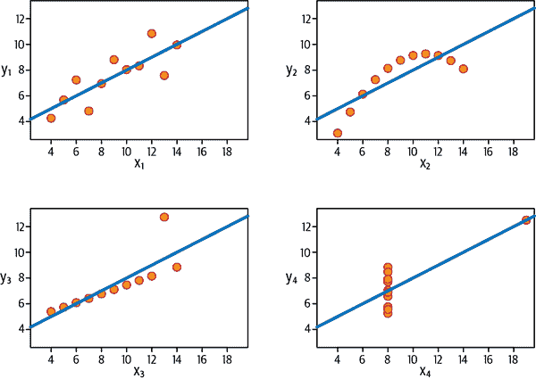

###### 图 15-2。这四组点，称为安斯康姆的四分位数，具有相同的相关性 0.8，以及相同的均值和标准差。左上角的图表展示线性关联；右上角显示完美的非线性关联；左下角除了一个点外，是完美的线性关联；右下角除了一个点外，没有关联。

再次强调，我们不希望数据点对精确地落在一条直线上，但我们期望点的分布能被直线合理描述，并且我们期望<math><msub><mi>y</mi> <mi>i</mi></msub></math>与估计值<math><msub><mrow><mover><mi>θ</mi> <mo stretchy="false">^</mo></mover></mrow> <mn>0</mn></msub> <mo>+</mo> <msub><mrow><mover><mi>θ</mi> <mo stretchy="false">^</mo></mover></mrow> <mn>1</mn></msub> <msub><mi>x</mi> <mi>i</mi></msub></math>之间的偏差大致对称分布在直线周围，并且没有明显的模式。

线性模型是在第十二章介绍的，我们在那里使用了由环境保护局操作的高质量空气监测器与邻近的廉价空气质量监测器之间的关系来校准廉价监测器，以进行更准确的预测。我们重新审视那个例子，以使简单的线性模型概念更加具体。

# 示例：空气质量的简单线性模型

请回想一下第十二章，我们的目标是利用美国政府操作的精确空气质量系统（AQS）传感器的空气质量测量来预测由 PurpleAir（PA）传感器进行的测量。数据值对来自同一天测量的邻近仪器，测量空气中直径小于 2.5mm 颗粒物的平均每日浓度。（测量单位是每立方升空气中的 24 小时内颗粒物的平均计数。）在本节中，我们关注乔治亚州一个位置的空气质量测量。这些是我们在第十二章案例研究中检验的数据子集。这些测量是 2019 年 8 月至 2019 年 11 月中旬的日均值：

|   | 日期 | id | 区域 | pm25aqs | pm25pa |
| --- | --- | --- | --- | --- | --- |
| **5258** | 2019-08-02 | GA1 | 东南 | 8.65 | 16.19 |
| **5259** | 2019-08-03 | GA1 | 东南 | 7.70 | 13.59 |
| **5260** | 2019-08-04 | GA1 | 东南 | 6.30 | 10.30 |
| **...** | ... | ... | ... | ... | ... |
| **5439** | 2019-10-18 | GA1 | 东南 | 6.30 | 12.94 |
| **5440** | 2019-10-21 | GA1 | 东南 | 7.50 | 13.62 |
| **5441** | 2019-10-30 | GA1 | 东南 | 5.20 | 14.55 |

```py
184 rows × 5 columns
```

特征`pm25aqs`包含来自 AQS 传感器的测量值，`pm25pa`来自 PurpleAir 监测器。由于我们有兴趣研究 AQS 测量如何预测 PurpleAir 测量，我们的散点图将 PurpleAir 读数放在 y 轴上，AQS 读数放在 x 轴上。我们还添加了趋势线：

```py
`px``.``scatter``(``GA``,` `x``=``"``pm25aqs``"``,` `y``=``"``pm25pa``"``,` `trendline``=``'``ols``'``,`
           `trendline_color_override``=``"``darkorange``"``,`
           `labels``=``{``'``pm25aqs``'``:``'``AQS PM2.5``'``,` `'``pm25pa``'``:``'``PurpleAir PM2.5``'``}``,`
           `width``=``350``,` `height``=``250``)`

```

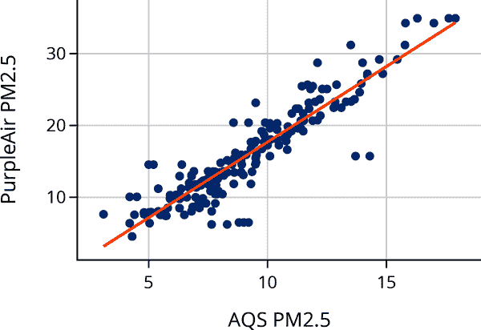

这个散点图显示了这两种仪器测量值之间的线性关系。我们要拟合的模型具有以下形式：

<math display="block"><mi>P</mi> <mi>A</mi> <mo>≈</mo> <msub><mi>θ</mi> <mn>0</mn></msub> <mo>+</mo> <msub><mi>θ</mi> <mn>1</mn></msub> <mi>A</mi> <mi>Q</mi></math>

其中<math><mi>P</mi> <mi>A</mi></math>表示 PurpleAir 的平均日测量值，<math><mi>A</mi> <mi>Q</mi></math>表示其伙伴 AQS 的测量值。

由于`pandas.Series`对象具有计算标准偏差（SDs）和相关系数的内置方法，因此我们可以快速定义计算最佳拟合线的函数：

```py
`def` `theta_1``(``x``,` `y``)``:`
    `r` `=` `x``.``corr``(``y``)`
    `return` `r` `*` `y``.``std``(``)` `/` `x``.``std``(``)`

```

```py
`def` `theta_0``(``x``,` `y``)``:`
    `return` `y``.``mean``(``)` `-` `theta_1``(``x``,` `y``)` `*` `x``.``mean``(``)`

```

现在我们可以通过计算这些数据的<math><msub><mrow><mover><mi>θ</mi> <mo stretchy="false">^</mo></mover></mrow> <mn>0</mn></msub></math>和<math><msub><mrow><mover><mi>θ</mi> <mo stretchy="false">^</mo></mover></mrow> <mn>1</mn></msub></math>来拟合模型：

```py
`t1` `=` `theta_1``(``GA``[``'``pm25aqs``'``]``,` `GA``[``'``pm25pa``'``]``)`
`t0` `=` `theta_0``(``GA``[``'``pm25aqs``'``]``,` `GA``[``'``pm25pa``'``]``)`

```

```py
Model: -3.36 + 2.10AQ

```

这个模型与散点图中显示的趋势线相匹配。这并非偶然。在调用`scatter()`时，`trendline`的参数值为`"ols"`，表示*普通最小二乘法*，即通过最小化平方误差来拟合线性模型的另一个名称。

让我们检查一下误差。首先，我们找出了给定 AQS 测量值的 PA 测量值的预测值，然后计算误差—实际 PA 测量值与预测值之间的差异：

```py
`prediction` `=` `t0` `+` `t1` `*` `GA``[``"``pm25aqs``"``]`
`error` `=` `GA``[``"``pm25pa``"``]` `-` `prediction`
`fit` `=` `pd``.``DataFrame``(``dict``(``prediction``=``prediction``,` `error``=``error``)``)`

```

让我们将这些误差绘制成预测值的图：

```py
`fig` `=` `px``.``scatter``(``fit``,` `y``=``'``error``'``,` `x``=``'``prediction``'``,`
                 `labels``=``{``"``prediction``"``:` `"``Prediction``"``,`
                         `"``error``"``:` `"``Error``"``}``,`
                 `width``=``350``,` `height``=``250``)`

`fig``.``add_hline``(``0``,` `line_width``=``2``,` `line_dash``=``'``dash``'``,` `opacity``=``1``)`
`fig``.``update_yaxes``(``range``=``[``-``12``,` `12``]``)`

```

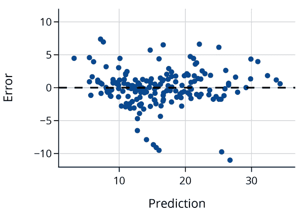

误差为 0 意味着实际测量值落在拟合线上；我们也称这条线为*最小二乘线*或*回归线*。正值意味着它在线上方，负值意味着它在线下方。你可能想知道这个模型有多好，以及它对我们的数据说了什么。我们接下来考虑这些话题。

## 解释线性模型

原始的成对测量散点图显示，PurpleAir 记录往往比更准确的 AQS 测量值要高得多。事实上，我们简单线性模型的方程的斜率约为 2.1。我们解释斜率意味着 AQS 监视器测得的 1 ppm 的变化平均对应于 PA 测量的 2 ppm 的变化。因此，如果一天 AQS 传感器测量 10 ppm，第二天它高出 5 ppm，即 15 ppm，那么我们对于下一天的 PA 测量的预测将增加<math><mn>2</mn> <mo>×</mo> <mn>5</mn> <mo>=</mo> <mn>10</mn></math> ppm。

任何 PurpleAir 读数的变化都不是由 AQS 读数的变化引起的。相反，它们都反映了空气质量，而我们的模型捕捉了这两个设备之间的关系。通常情况下，术语*预测*被认为是*因果关系*，但在这里并非如此。相反，预测只是指我们对 PA 和 AQS 测量之间*线性关联*的使用。

至于模型中的截距，我们可能期望它为 0，因为当空气中没有颗粒物时，我们认为两个仪器都应该测量 0 ppm。但对于 AQS 为 0 的情况，模型预测 PurpleAir 为<math><mo>−</mo> <mn>3.4</mn></math> ppm，这是没有意义的。空气中不可能有负的颗粒物。这突显了在超出测量范围时使用模型的问题。我们观察到 AQS 记录在 3 到 18 ppm 之间，并且在这个范围内，模型拟合良好。虽然在理论上线应该有一个截距为 0，但在实际中这样的模型却不适用，预测往往会差得多。

著名统计学家 George Box 曾经说过：“所有模型都是错误的，但有些是有用的。” 在这里，尽管线的截距不通过 0，但简单线性模型在预测 PurpleAir 传感器的空气质量测量方面是有用的。事实上，我们两个特征之间的相关性非常高：

```py
`GA``[``[``'``pm25aqs``'``,` `'``pm25pa``'``]``]``.``corr``(``)`

```

|   | pm25aqs | pm25pa |
| --- | --- | --- |
| **pm25aqs** | 1.00 | 0.92 |
| **pm25pa** | 0.92 | 1.00 |

除了查看相关系数之外，还有其他评估线性模型质量的方法。

## 评估拟合

早期的误差图针对拟合值给出了拟合质量的视觉评估。（这种图称为*残差图*，因为误差有时被称为*残差*。）一个良好的拟合应该显示一群点围绕着 0 的水平线，没有明显的模式。当出现模式时，我们通常可以得出简单线性模型并没有完全捕捉到信号的结论。我们之前看到残差图中没有明显的模式。

另一种有用的残差图类型是残差与不在模型中的特征的图。如果我们看到模式，那么我们可能希望在模型中加入这个特征，除了已经在模型中的特征之外。此外，当数据具有时间组成部分时，我们希望检查残差随时间的模式。对于这些特定的数据，由于测量是在四个月内的每日平均值，我们将错误绘制为测量记录日期：

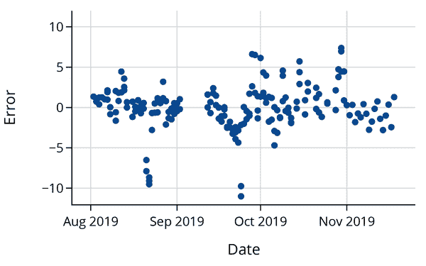

看起来在八月底和九月底附近有几天数据远低于预期。回顾原始散点图（以及第一个残差图），我们可以看到两个小的水平点簇在主要点云下方。我们刚刚制作的图表表明，我们应该检查原始数据以及关于设备的任何可用信息，以确定这些天是否正常运行。

残差图还可以让我们大致了解模型在预测中的准确性。大多数误差在线路的 <math><mo>±</mo> <mn>6</mn></math> ppm 之间。我们发现误差的标准偏差约为 2.8 ppm：

```py
`error``.``std``(``)`

```

```py
2.796095864304746

```

相比之下，PurpleAir 测量的标准偏差要大得多：

```py
`GA``[``'``pm25pa``'``]``.``std``(``)`

```

```py
6.947418231019876

```

如果我们发现监测器在八月底和九月份的某些日子不工作，并因此将其排除在数据集之外，可能会进一步减少模型误差。无论如何，在空气非常清洁的情况下，误差相对较大，但在绝对值上并不重要。我们通常更关心空气污染的情况，此时 2.8 ppm 的误差似乎是合理的。

让我们回到如何找到这条线的过程，即*模型拟合*的过程。在接下来的部分，我们通过最小化均方误差来推导截距和斜率。

# 拟合简单线性模型

我们在本章早些时候提到，当我们最小化数据的平均损失时：

<math display="block"><mfrac><mn>1</mn> <mi>n</mi></mfrac> <munder><mo>∑</mo> <mrow><mi>i</mi></mrow></munder> <mo stretchy="false">[</mo> <msub><mi>y</mi> <mi>i</mi></msub> <mo>−</mo> <mo stretchy="false">(</mo> <msub><mi>θ</mi> <mn>0</mn></msub> <mo>+</mo> <msub><mi>θ</mi> <mn>1</mn></msub> <msub><mi>x</mi> <mi>i</mi></msub> <mo stretchy="false">)</mo> <msup><mo stretchy="false">]</mo> <mn>2</mn></msup></math>

最佳拟合线具有截距和斜率：

<math display="block"><mtable columnalign="right" columnspacing="0em" displaystyle="true" rowspacing="3pt"><mtr><mtd><mtable columnalign="right left" columnspacing="0em" displaystyle="true" rowspacing="3pt"><mtr><mtd><msub><mrow><mover><mi>θ</mi> <mo stretchy="false">^</mo></mover></mrow> <mn>0</mn></msub></mtd> <mtd><mo>=</mo> <mrow><mover><mi>y</mi> <mo stretchy="false">¯</mo></mover></mrow> <mo>−</mo> <msub><mrow><mover><mi>θ</mi> <mo stretchy="false">^</mo></mover></mrow> <mn>1</mn></msub> <mrow><mover><mi>x</mi> <mo stretchy="false">¯</mo></mover></mrow></mtd></mtr> <mtr><mtd><msub><mrow><mover><mi>θ</mi> <mo stretchy="false">^</mo></mover></mrow> <mn>1</mn></msub></mtd> <mtd><mo>=</mo> <mi>r</mi> <mo stretchy="false">(</mo> <mrow><mrow><mi mathvariant="bold">x</mi></mrow></mrow> <mo>,</mo> <mrow><mrow><mi mathvariant="bold">y</mi></mrow></mrow> <mo stretchy="false">)</mo> <mfrac><mrow><mi>S</mi> <mi>D</mi> <mo stretchy="false">(</mo> <mrow><mrow><mi mathvariant="bold">y</mi></mrow></mrow> <mo stretchy="false">)</mo></mrow> <mrow><mi>S</mi> <mi>D</mi> <mo stretchy="false">(</mo> <mrow><mrow><mi mathvariant="bold">x</mi></mrow></mrow> <mo stretchy="false">)</mo></mrow></mfrac></mtd></mtr></mtable></mtd></mtr></mtable></math>

在本节中，我们使用微积分来推导这些结果。

对于简单线性模型，均方误差是两个模型参数的函数，即截距和斜率。这意味着如果我们使用微积分来找到最小化的参数值，我们需要找到均方误差对 <math><msub><mi>θ</mi> <mn>0</mn></msub></math> 和 <math><msub><mi>θ</mi> <mn>1</mn></msub></math> 的偏导数。我们也可以通过其他技术找到这些最小值：

*梯度下降*

当损失函数更复杂且找到近似解更快时，我们可以使用数值优化技术，如梯度下降（参见 第二十章）。

*二次公式*

由于平均损失是关于 <math><msub><mi>θ</mi> <mn>0</mn></msub></math> 和 <math><msub><mi>θ</mi> <mn>1</mn></msub></math> 的二次函数，我们可以使用二次公式（以及一些代数）来求解最小化参数值。

*几何论证*

在本章后面，我们使用最小二乘法的几何解释来拟合多元线性模型。这种方法与毕达哥拉斯定理相关，并具有几个直观的优点。

我们选择使用微积分来优化简单线性模型，因为这是快速且直接的方法。首先，我们对平方误差的偏导数进行计算（我们可以忽略 MSE 中的 e <math><mn>1</mn> <mrow><mo>/</mo></mrow> <mi>n</mi></math> ，因为它不影响最小值的位置）：

<math display="block"><mtable columnalign="right" columnspacing="0em" displaystyle="true" rowspacing="3pt"><mtr><mtd><mtable columnalign="right left" columnspacing="0em" displaystyle="true" rowspacing="3pt"><mtr><mtd><mfrac><mi>∂</mi> <mrow><mi>∂</mi> <msub><mi>θ</mi> <mn>0</mn></msub></mrow></mfrac> <munder><mo>∑</mo> <mrow><mi>i</mi></mrow></munder> <mo stretchy="false">[</mo> <msub><mi>y</mi> <mi>i</mi></msub> <mo>−</mo> <mo stretchy="false">(</mo> <msub><mi>θ</mi> <mn>0</mn></msub> <mo>+</mo> <msub><mi>θ</mi> <mn>1</mn></msub> <msub><mi>x</mi> <mi>i</mi></msub> <mo stretchy="false">)</mo> <msup><mo stretchy="false">]</mo> <mn>2</mn></msup></mtd> <mtd><mo>=</mo> <munder><mo>∑</mo> <mrow><mi>i</mi></mrow></munder> <mn>2</mn> <mo stretchy="false">(</mo> <msub><mi>y</mi> <mi>i</mi></msub> <mo>−</mo> <msub><mi>θ</mi> <mn>0</mn></msub> <mo>−</mo> <msub><mi>θ</mi> <mn>1</mn></msub> <msub><mi>x</mi> <mi>i</mi></msub> <mo stretchy="false">)</mo> <mo stretchy="false">(</mo> <mo>−</mo> <mn>1</mn> <mo stretchy="false">)</mo></mtd></mtr> <mtr><mtd><mfrac><mi>∂</mi> <mrow><mi>∂</mi> <msub><mi>θ</mi> <mn>1</mn></msub></mrow></mfrac> <munder><mo>∑</mo> <mrow><mi>i</mi></mrow></munder> <mo stretchy="false">[</mo> <msub><mi>y</mi> <mi>i</mi></msub> <mo>−</mo> <mo stretchy="false">(</mo> <msub><mi>θ</mi> <mn>0</mn></msub> <mo>+</mo> <msub><mi>θ</mi> <mn>1</mn></msub> <msub><mi>x</mi> <mi>i</mi></msub> <mo stretchy="false">)</mo> <msup><mo stretchy="false">]</mo> <mn>2</mn></msup> <mo>,</mo></mtd> <mtd><mo>=</mo> <munder><mo>∑</mo> <mrow><mi>i</mi></mrow></munder> <mn>2</mn> <mo stretchy="false">(</mo> <msub><mi>y</mi> <mi>i</mi></msub> <mo>−</mo> <msub><mi>θ</mi> <mn>0</mn></msub> <mo>−</mo> <msub><mi>θ</mi> <mn>1</mn></msub> <msub><mi>x</mi> <mi>i</mi></msub> <mo stretchy="false">)</mo> <mo stretchy="false">(</mo> <mo>−</mo> <msub><mi>x</mi> <mi>i</mi></msub> <mo stretchy="false">)</mo></mtd></mtr></mtable></mtd></mtr></mtable></math>

然后我们将偏导数设为零，并通过将方程两边乘以 <math><mo>−</mo> <mn>1</mn> <mrow><mo>/</mo></mrow> <mn>2</mn></math> 进行简化，得到：

<math display="block"><mtable columnalign="right" columnspacing="0em" displaystyle="true" rowspacing="3pt"><mtr><mtd><mtable columnalign="right left" columnspacing="0em" displaystyle="true" rowspacing="3pt"><mtr><mtd><mn>0</mn></mtd> <mtd><mo>=</mo> <munder><mo>∑</mo> <mrow><mi>i</mi></mrow></munder> <mo stretchy="false">(</mo> <msub><mi>y</mi> <mi>i</mi></msub> <mo>−</mo> <msub><mrow><mover><mi>θ</mi> <mo stretchy="false">^</mo></mover></mrow> <mn>0</mn></msub> <mo>−</mo> <msub><mrow><mover><mi>θ</mi> <mo stretchy="false">^</mo></mover></mrow> <mn>1</mn></msub> <msub><mi>x</mi> <mi>i</mi></msub> <mo stretchy="false">)</mo></mtd></mtr> <mtr><mtd><mn>0</mn></mtd> <mtd><mo>=</mo> <munder><mo>∑</mo> <mrow><mi>i</mi></mrow></munder> <mo stretchy="false">(</mo> <msub><mi>y</mi> <mi>i</mi></msub> <mo>−</mo> <msub><mrow><mover><mi>θ</mi> <mo stretchy="false">^</mo></mover></mrow> <mn>0</mn></msub> <mo>−</mo> <msub><mrow><mover><mi>θ</mi> <mo stretchy="false">^</mo></mover></mrow> <mn>1</mn></msub> <msub><mi>x</mi> <mi>i</mi></msub> <mo stretchy="false">)</mo> <msub><mi>x</mi> <mi>i</mi></msub></mtd></mtr></mtable></mtd></mtr></mtable></math>

这些方程式称为*正规方程式*。在第一个方程中，我们看到<math><msub><mrow><mover><mi>θ</mi> <mo stretchy="false">^</mo></mover></mrow> <mn>0</mn></msub></math>可以表示为<math><msub><mrow><mover><mi>θ</mi> <mo stretchy="false">^</mo></mover></mrow> <mn>1</mn></msub></math>的函数：

<math display="block"><msub><mrow><mover><mi>θ</mi> <mo stretchy="false">^</mo></mover></mrow> <mn>0</mn></msub> <mo>=</mo> <mrow><mover><mi>y</mi> <mo stretchy="false">¯</mo></mover></mrow> <mo>−</mo> <msub><mrow><mover><mi>θ</mi> <mo stretchy="false">^</mo></mover></mrow> <mn>1</mn></msub> <mrow><mover><mi>x</mi> <mo stretchy="false">¯</mo></mover></mrow></math>

将这个值代入第二个方程中给出我们：

<math display="block"><mtable columnalign="right" columnspacing="0em" displaystyle="true" rowspacing="3pt"><mtr><mtd><mtable columnalign="right left" columnspacing="0em" displaystyle="true" rowspacing="3pt"><mtr><mtd><mn>0</mn></mtd> <mtd><mo>=</mo> <munder><mo>∑</mo> <mrow><mi>i</mi></mrow></munder> <mo stretchy="false">(</mo> <msub><mi>y</mi> <mi>i</mi></msub> <mo>−</mo> <mrow><mover><mi>y</mi> <mo stretchy="false">¯</mo></mover></mrow> <mo>+</mo> <msub><mrow><mover><mi>θ</mi> <mo stretchy="false">^</mo></mover></mrow> <mn>1</mn></msub> <mrow><mover><mi>x</mi> <mo stretchy="false">¯</mo></mover></mrow> <mo>−</mo> <msub><mrow><mover><mi>θ</mi> <mo stretchy="false">^</mo></mover></mrow> <mn>1</mn></msub> <msub><mi>x</mi> <mi>i</mi></msub> <mo stretchy="false">)</mo> <msub><mi>x</mi> <mi>i</mi></msub></mtd></mtr> <mtr><mtd><mo>=</mo> <munder><mo>∑</mo> <mrow><mi>i</mi></mrow></munder> <mo stretchy="false">[</mo> <mo stretchy="false">(</mo> <msub><mi>y</mi> <mi>i</mi></msub> <mo>−</mo> <mrow><mover><mi>y</mi> <mo stretchy="false">¯</mo></mover></mrow> <mo stretchy="false">)</mo> <mo>−</mo> <msub><mrow><mover><mi>θ</mi> <mo stretchy="false">^</mo></mover></mrow> <mn>1</mn></msub> <mo stretchy="false">(</mo> <msub><mi>x</mi> <mi>i</mi></msub> <mo>−</mo> <mrow><mover><mi>x</mi> <mo stretchy="false">¯</mo></mover></mrow> <mo stretchy="false">)</mo> <mo stretchy="false">]</mo> <msub><mi>x</mi> <mi>i</mi></msub></mtd></mtr> <mtr><mtd><msub><mrow><mover><mi>θ</mi> <mo stretchy="false">^</mo></mover></mrow> <mn>1</mn></msub></mtd> <mtd><mo>=</mo> <mfrac><mrow><munder><mo>∑</mo> <mrow><mi>i</mi></mrow></munder> <mo stretchy="false">(</mo> <msub><mi>y</mi> <mi>i</mi></msub> <mo>−</mo> <mrow><mover><mi>y</mi> <mo stretchy="false">¯</mo></mover></mrow> <mo stretchy="false">)</mo> <msub><mi>x</mi> <mi>i</mi></msub></mrow> <mrow><munder><mo>∑</mo> <mrow><mi>i</mi></mrow></munder> <mo stretchy="false">(</mo> <msub><mi>x</mi> <mi>i</mi></msub> <mo>−</mo> <mrow><mover><mi>x</mi> <mo stretchy="false">¯</mo></mover></mrow> <mo stretchy="false">)</mo> <msub><mi>x</mi> <mi>i</mi></msub></mrow></mfrac></mtd></mtr></mtable></mtd></mtr></mtable></math>

经过一些代数运算，我们可以用我们熟悉的量来表示<math><msub><mrow><mover><mi>θ</mi> <mo stretchy="false">^</mo></mover></mrow> <mn>1</mn></msub></math>：

<math display="block"><msub><mrow><mover><mi>θ</mi> <mo stretchy="false">^</mo></mover></mrow> <mn>1</mn></msub> <mo>=</mo> <mi>r</mi> <mo stretchy="false">(</mo> <mrow><mrow><mi mathvariant="bold">x</mi></mrow></mrow> <mo>,</mo> <mrow><mrow><mi mathvariant="bold">y</mi></mrow></mrow> <mo stretchy="false">)</mo> <mfrac><mrow><mi>S</mi> <mi>D</mi> <mo stretchy="false">(</mo> <mrow><mrow><mi mathvariant="bold">y</mi></mrow></mrow> <mo stretchy="false">)</mo></mrow> <mrow><mi>S</mi> <mi>D</mi> <mo stretchy="false">(</mo> <mrow><mrow><mi mathvariant="bold">x</mi></mrow></mrow> <mo stretchy="false">)</mo></mrow></mfrac></math>

正如本章前面所示，这个表示法表明拟合线上的点在<math><mi>x</mi></math>处可以写成如下形式：

<math display="block"><msub><mrow><mover><mi>θ</mi> <mo stretchy="false">^</mo></mover></mrow> <mn>0</mn></msub> <mo>+</mo> <msub><mrow><mover><mi>θ</mi> <mo stretchy="false">^</mo></mover></mrow> <mn>1</mn></msub> <mi>x</mi> <mo>=</mo> <mrow><mover><mi>y</mi> <mo stretchy="false">¯</mo></mover></mrow> <mo>+</mo> <mi>r</mi> <mo stretchy="false">(</mo> <mrow><mrow><mi mathvariant="bold">x</mi></mrow></mrow> <mo>,</mo> <mrow><mrow><mi mathvariant="bold">y</mi></mrow></mrow> <mo stretchy="false">)</mo> <mi>S</mi> <mi>D</mi> <mo stretchy="false">(</mo> <mrow><mrow><mi mathvariant="bold">y</mi></mrow></mrow> <mo stretchy="false">)</mo> <mfrac><mrow><mo stretchy="false">(</mo> <mi>x</mi> <mo>−</mo> <mrow><mover><mi>x</mi> <mo stretchy="false">¯</mo></mover></mrow> <mo stretchy="false">)</mo></mrow> <mrow><mi>S</mi> <mi>D</mi> <mo stretchy="false">(</mo> <mrow><mrow><mi mathvariant="bold">x</mi></mrow></mrow> <mo stretchy="false">)</mo></mrow></mfrac></math>

我们已经推导出了在前一节中使用的最小二乘线方程。在那里，我们使用了`pandas`内置方法来计算<math><mi>S</mi> <mi>D</mi> <mo stretchy="false">(</mo> <mrow><mi mathvariant="bold">x</mi></mrow> <mo stretchy="false">)</mo></math>，<math><mi>S</mi> <mi>D</mi> <mo stretchy="false">(</mo> <mrow><mi mathvariant="bold">y</mi></mrow> <mo stretchy="false">)</mo></math>和<math><mi>r</mi> <mo stretchy="false">(</mo> <mrow><mi mathvariant="bold">x</mi></mrow> <mo>,</mo> <mrow><mi mathvariant="bold">y</mi></mrow> <mo stretchy="false">)</mo></math>，以便轻松计算这条线的方程。然而，在实践中，我们建议使用`scikit-learn`提供的功能来进行模型拟合：

```py
`from` `sklearn``.``linear_model` `import` `LinearRegression` 

`y` `=` `GA``[``'``pm25pa``'``]`
`x` `=` `GA``[``[``'``pm25aqs``'``]``]`
`reg` `=` `LinearRegression``(``)``.``fit``(``x``,` `y``)`

```

我们的拟合模型是：

```py
Model: PA estimate = -3.36 + 2.10AQS

```

注意，我们将`y`作为数组和`x`作为数据框传递给`LinearRegression`。当我们在模型中引入多个解释特征时，很快就会看到原因。

`LinearRegression`方法提供了稳定的数值算法来通过最小二乘法拟合线性模型。当拟合多个变量时，这一点尤为重要，接下来我们将介绍。

# 多元线性模型

到目前为止，在本章中，我们使用单个输入变量预测结果变量。现在我们介绍使用多个特征的*多元线性模型*来预测（或描述或解释）结果。具有多个解释特征可以改善模型对数据的拟合并提高预测能力。

我们从一个简单的线性模型推广到包括第二个解释变量的模型，称为<math><mi>v</mi></math>。这个模型在<math><mi>x</mi></math>和<math><mi>v</mi></math>上都是线性的，这意味着对于<math><mi>x</mi></math>和<math><mi>v</mi></math>的一对数值，我们可以用线性组合来描述、解释或预测<math><mi>y</mi></math>：

<math display="block"><mi>y</mi> <mo>≈</mo> <msub><mi>θ</mi> <mn>0</mn></msub> <mo>+</mo> <msub><mi>θ</mi> <mn>1</mn></msub> <mi>x</mi> <mo>+</mo> <msub><mi>θ</mi> <mn>2</mn></msub> <mi>v</mi></math>

注意，对于特定的<math><mi>v</mi></math>值，比如<math><msup><mi>v</mi> <mo>⋆</mo></msup></math>，我们可以将上述方程表示为：

<math display="block"><mi>y</mi> <mo>≈</mo> <mo stretchy="false">(</mo> <msub><mi>θ</mi> <mn>0</mn></msub> <mo>+</mo> <msub><mi>θ</mi> <mn>2</mn></msub> <msup><mi>v</mi> <mo>⋆</mo></msup> <mo stretchy="false">)</mo>  <mo>+</mo>  <msub><mi>θ</mi> <mn>1</mn></msub> <mi>x</mi></math>

换句话说，当我们将<math><mi>v</mi></math>固定在<math><msup><mi>v</mi> <mo>⋆</mo></msup></math>时，<math><mi>x</mi></math>和<math><mi>y</mi></math>之间有一个简单的线性关系，斜率为<math><msub><mi>θ</mi> <mn>1</mn></msub></math>，截距为<math><msub><mi>θ</mi> <mn>0</mn></msub> <mo>+</mo> <msub><mi>θ</mi> <mn>2</mn></msub> <msup><mi>v</mi> <mo>⋆</mo></msup></math>。对于另一个<math><mi>v</mi></math>的值，比如<math><msup><mi>v</mi> <mo>†</mo></msup></math>，我们同样有<math><mi>x</mi></math>和<math><mi>y</mi></math>之间的简单线性关系。<math><mi>x</mi></math>的斜率保持不变，唯一的变化是截距，现在是<math><msub><mi>θ</mi> <mn>0</mn></msub> <mo>+</mo> <msub><mi>θ</mi> <mn>2</mn></msub> <msup><mi>v</mi> <mo>†</mo></msup></math>。

使用多元线性回归时，我们需要记住在模型中的其他变量存在的情况下解释<math><msub><mi>θ</mi> <mn>1</mn></msub></math>对<math><mi>x</mi></math>的系数。在保持模型中其他变量（在本例中仅为<math><mi>v</mi></math>）的值不变的情况下，<math><mi>x</mi></math>增加 1 个单位平均对应于<math><mi>y</mi></math>的<math><msub><mi>θ</mi> <mn>1</mn></msub></math>的变化。一种可视化这种多元线性关系的方法是创建散点图的多面板，其中每个图中<math><mi>v</mi></math>的值大致相同。我们接下来为空气质量测量制作这样的散点图，并提供其他可视化和统计学示例以检验拟合多元线性模型时的情况。

研究空气质量监测仪的科学家们（参见第十二章）寻找一个包含天气因素的改进模型。他们检查的一种天气变量是相对湿度的每日测量值。让我们考虑一个双变量线性模型，以解释基于 AQS 传感器测量和相对湿度的 PurpleAir 测量。该模型具有以下形式：

<math display="block"><mi>P</mi> <mi>A</mi> <mo>≈</mo> <msub><mi>θ</mi> <mn>0</mn></msub> <mo>+</mo> <msub><mi>θ</mi> <mn>1</mn></msub> <mi>A</mi> <mi>Q</mi> <mo>+</mo> <msub><mi>θ</mi> <mn>2</mn></msub> <mi>R</mi> <mi>H</mi></math>

其中<math><mi>P</mi> <mi>A</mi></math>，<math><mi>A</mi> <mi>Q</mi></math>和<math><mi>R</mi> <mi>H</mi></math>分别指代变量：PurpleAir 平均每日测量、AQS 测量和相对湿度。

作为第一步，我们制作一个多面板图来比较固定湿度值下两种空气质量测量之间的关系。为此，我们将相对湿度转换为一个分类变量，使每个面板由湿度相似的观测组成。

```py
`rh_cat` `=` `pd``.``cut``(``GA``[``'``rh``'``]``,` `bins``=``[``43``,``50``,``55``,``60``,``78``]``,` 
                `labels``=``[``'``<50``'``,``'``50-55``'``,``'``55-60``'``,``'``>60``'``]``)`

```

然后我们使用这个定性特征将数据划分为一个二乘二的散点图面板：

```py
`fig` `=` `px``.``scatter``(``GA``,` `x``=``'``pm25aqs``'``,` `y``=``'``pm25pa``'``,` 
                 `facet_col``=``rh_cat``,` `facet_col_wrap``=``2``,`
                 `facet_row_spacing``=``0.15``,`
                 `labels``=``{``'``pm25aqs``'``:``'``AQS PM2.5``'``,` `'``pm25pa``'``:``'``PurpleAir PM2.5``'``}``,`
                 `width``=``550``,` `height``=``350``)`

`fig``.``update_layout``(``margin``=``dict``(``t``=``30``)``)`
`fig``.``show``(``)`

```

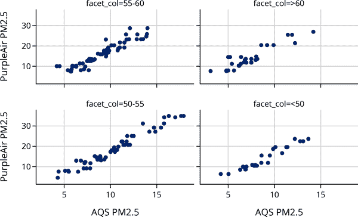

这四个图表显示了两种空气质量测量来源之间的线性关系。斜率看起来相似，这意味着多重线性模型可能非常合适。从这些图表中很难看出相对湿度是否对截距有显著影响。

我们还想检查三个特征之间的成对散点图。当两个解释性特征高度相关时，它们在模型中的系数可能不稳定。虽然三个或更多特征之间的线性关系在成对图中可能不明显，但检查这些图表仍然是一个好主意：

```py
`fig` `=` `px``.``scatter_matrix``(`
    `GA``[``[``'``pm25pa``'``,` `'``pm25aqs``'``,` `'``rh``'``]``]``,`
    `labels``=``{``'``pm25aqs``'``:``'``AQS``'``,` `'``pm25pa``'``:``'``PurpleAir``'``,` `'``rh``'``:``'``Humidity``'``}``,`
    `width``=``550``,` `height``=``400``)`

`fig``.``update_traces``(``diagonal_visible``=``False``)`

```

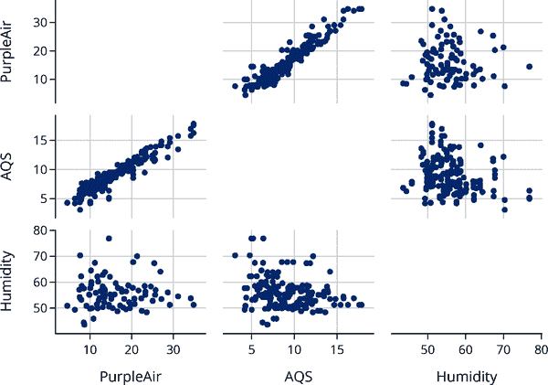

湿度与空气质量之间的关系似乎并不特别强。我们应该检查的另一个成对测量是特征之间的相关性：

|   | pm25pa | pm25aqs | rh |
| --- | --- | --- | --- |
| **pm25pa** | 1.00 | 0.95 | -0.06 |
| **pm25aqs** | 0.95 | 1.00 | -0.24 |
| **rh** | -0.06 | -0.24 | 1.00 |

一个小惊喜是，相对湿度与 AQS 测量的空气质量具有轻微的负相关。这表明湿度可能对模型有帮助。

在下一节中，我们将推导适合的方程。但现在，我们使用`LinearRegression`的功能来拟合模型。与之前不同的唯一变化是我们为解释变量提供了两列（这就是为什么`x`输入是一个数据框）：

```py
`from` `sklearn``.``linear_model` `import` `LinearRegression`

`y` `=` `GA``[``'``pm25pa``'``]`
`X2` `=` `GA``[``[``'``pm25aqs``'``,` `'``rh``'``]``]`

`model2` `=` `LinearRegression``(``)``.``fit``(``X2``,` `y``)`

```

适合的多重线性模型，包括系数单位，是：

```py
PA estimate = -15.8 ppm + 2.25 ppm/ppm x AQS +  0.21 ppm/percent x RH

```

模型中湿度的系数调整空气质量预测每百分点相对湿度 0.21 ppm。请注意，AQS 的系数与我们之前拟合的简单线性模型不同。这是因为系数反映了来自相对湿度的额外信息。

最后，为了检查拟合质量，我们制作了预测值和误差的残差图。这一次，我们使用`LinearRegression`来计算我们的预测：

```py
`predicted_2var` `=` `model2``.``predict``(``X2``)`
`error_2var` `=` `y` `-` `predicted_2var`

```

```py
`fig` `=` `px``.``scatter``(``y` `=` `error_2var``,` `x``=``predicted_2var``,`
                 `labels``=``{``"``y``"``:` `"``Error``"``,` `"``x``"``:` `"``Predicted PurpleAir measurement``"``}``,`
                 `width``=``350``,` `height``=``250``)`

`fig``.``update_yaxes``(``range``=``[``-``12``,` `12``]``)`
`fig``.``add_hline``(``0``,` `line_width``=``3``,` `line_dash``=``'``dash``'``,` `opacity``=``1``)`

`fig``.``show``(``)`

```

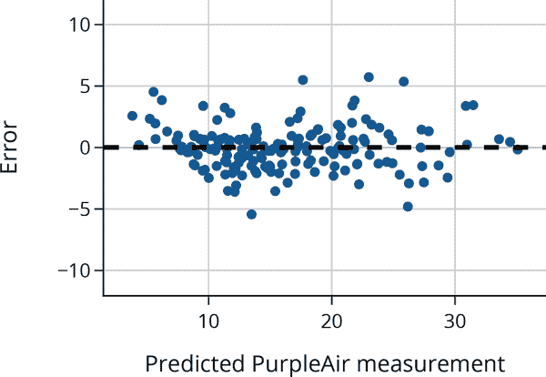

残差图表没有明显的模式，这表明模型拟合得相当好。还要注意，误差几乎都落在–4 和+4 ppm 之间，比简单线性模型的范围小。我们发现残差的标准偏差要小得多：

```py
`error_2var``.``std``(``)`

```

```py
1.8211427707294048

```

残差标准偏差从单变量模型的 2.8 ppm 降低到了 1.8 ppm，这是一个很好的尺寸缩减。

当我们有多个解释变量时，相关系数无法捕捉线性关联模型的强度。相反，我们调整 MSE 以了解模型的拟合程度。在下一节中，我们描述如何拟合多重线性模型并使用 MSE 来评估拟合。

# 拟合多重线性模型

在前一节中，我们考虑了两个解释变量的情况；其中一个我们称为<math><mi>x</mi></math>，另一个为<math><mi>v</mi></math>。现在我们希望将这种方法推广到<math><mi>p</mi></math>个解释变量。选择不同字母来表示变量的想法很快失效了。相反，我们使用一种更正式和通用的方法，将多个预测变量表示为一个矩阵，如图 15-3 所示。我们称<math><mtext mathvariant="bold">X</mtext></math>为*设计矩阵*。注意，<math><mtext mathvariant="bold">X</mtext></math>的形状为<math><mi>n</mi> <mo>×</mo> <mo stretchy="false">(</mo> <mi>p</mi> <mo>+</mo> <mn>1</mn> <mo stretchy="false">)</mo></math>。<math><mtext mathvariant="bold">X</mtext></math>的每一列代表一个特征，每一行代表一个观察值。也就是说，<math><msub><mi>x</mi> <mrow><mi>i</mi> <mo>,</mo> <mi>j</mi></mrow></msub></math>是在观察值<math><mi>i</mi></math>上针对特征<math><mi>j</mi></math>的测量值。

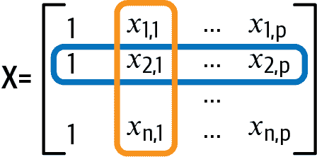

###### 图 15-3。在这个设计矩阵<math><mi>X</mi></math>中，每一行代表一个观察/记录，每一列代表一个特征/变量

###### 注意

一个技术细节：设计矩阵被定义为数学矩阵，而不是数据框，因此您可能注意到矩阵不包括数据框具有的列或行标签。

也就是说，我们通常不必担心将数据框转换为矩阵，因为大多数用于建模的 Python 库将数字数据框视为矩阵。

对于给定的观察值，比如<math><mtext mathvariant="bold">X</mtext></math>中的第二行，我们通过线性组合近似得到结果<math><msub><mi>y</mi> <mn>2</mn></msub></math>：

<math display="block"><mtable columnalign="right" displaystyle="true" rowspacing="3pt"><mtr><mtd><msub><mi>y</mi> <mn>2</mn></msub> <mo>≈</mo> <msub><mi>θ</mi> <mn>0</mn></msub> <mo>+</mo> <msub><mi>θ</mi> <mn>1</mn></msub> <msub><mi>x</mi> <mrow><mn>2</mn> <mo>,</mo> <mn>1</mn></mrow></msub> <mo>+</mo> <mo>…</mo> <mo>+</mo> <msub><mi>θ</mi> <mi>p</mi></msub> <msub><mi>x</mi> <mrow><mn>2</mn> <mo>,</mo> <mi>p</mi></mrow></msub></mtd></mtr></mtable></math>

用矩阵表示线性近似更方便。为此，我们将模型参数写成一个<math><mi>p</mi> <mo>+</mo> <mn>1</mn></math>列向量<math><mrow><mi mathvariant="bold-italic">θ</mi></mrow></math>：

<math display="block"><mtable columnalign="right" columnspacing="0em" displaystyle="true" rowspacing="3pt"><mtr><mtd><mrow><mi>θ</mi></mrow> <mo>=</mo> <mrow><mo>[</mo> <mtable columnalign="center" columnspacing="1em" rowspacing="4pt"><mtr><mtd><msub><mi>θ</mi> <mn>0</mn></msub></mtd></mtr> <mtr><mtd><msub><mi>θ</mi> <mn>1</mn></msub></mtd></mtr> <mtr><mtd><mrow><mo>⋮</mo></mrow></mtd></mtr> <mtr><mtd><msub><mi>θ</mi> <mi>p</mi></msub></mtd></mtr></mtable> <mo>]</mo></mrow></mtd></mtr></mtable></math>

将这些符号定义放在一起，我们可以使用矩阵乘法为整个数据集编写预测向量：

<math display="block"><mrow><mtext mathvariant="bold">X</mtext></mrow> <mrow><mi mathvariant="bold-italic">θ</mi></mrow></math>

如果我们检查<math><mtext mathvariant="bold">X</mtext></math>和<math><mi mathvariant="bold-italic">θ</mi></math>的维度，我们可以确认<math><mrow><mtext mathvariant="bold">X</mtext></mrow><mrow><mi mathvariant="bold-italic">θ</mi></mrow></math>是一个<math><mi>n</mi></math>维列向量。因此，使用这种线性预测的误差可以表示为向量：

<math display="block"><mrow><mi mathvariant="bold">e</mi></mrow> <mo>=</mo> <mrow><mi mathvariant="bold">y</mi></mrow> <mo>−</mo> <mrow><mtext mathvariant="bold">X</mtext></mrow> <mrow><mi mathvariant="bold-italic">θ</mi></mrow></math>

其中结果变量也表示为列向量：

<math display="block"><mtable columnalign="right" columnspacing="0em" displaystyle="true" rowspacing="3pt"><mtr><mtd><mrow><mi mathvariant="bold">y</mi></mrow> <mo>=</mo> <mrow><mo>[</mo> <mtable columnalign="center" columnspacing="1em" rowspacing="4pt"><mtr><mtd><msub><mi>y</mi> <mn>1</mn></msub></mtd></mtr> <mtr><mtd><msub><mi>y</mi> <mn>2</mn></msub></mtd></mtr> <mtr><mtd><mrow><mo>⋮</mo></mrow></mtd></mtr> <mtr><mtd><msub><mi>y</mi> <mi>n</mi></msub></mtd></mtr></mtable> <mo>]</mo></mrow></mtd></mtr></mtable></math>

这种多重线性模型的矩阵表示可以帮助我们找到使均方误差最小化的模型。我们的目标是找到模型参数 <math><mo stretchy="false">(</mo> <msub><mi>θ</mi> <mn>0</mn></msub> <mo>,</mo> <msub><mi>θ</mi> <mn>1</mn></msub> <mo>,</mo> <mo>…</mo> <mo>,</mo> <msub><mi>θ</mi> <mi>p</mi></msub> <mo stretchy="false">)</mo></math> ，使均方误差最小化：

<math display="block"><mfrac><mn>1</mn> <mi>n</mi></mfrac> <munder><mo>∑</mo> <mi>i</mi></munder> <mo stretchy="false">[</mo> <msub><mi>y</mi> <mi>i</mi></msub> <mo>−</mo> <mo stretchy="false">(</mo> <msub><mi>θ</mi> <mn>0</mn></msub> <mo>+</mo> <msub><mi>θ</mi> <mn>1</mn></msub> <msub><mi>x</mi> <mrow><mi>i</mi> <mo>,</mo> <mn>1</mn></mrow></msub> <mo>+</mo> <mo>⋯</mo> <mo>+</mo> <msub><mi>θ</mi> <mi>p</mi></msub> <msub><mi>x</mi> <mrow><mi>i</mi> <mo>,</mo> <mi>p</mi></mrow></msub> <mo stretchy="false">)</mo> <msup><mo stretchy="false">]</mo> <mn>2</mn></msup> <mo>=</mo> <mfrac><mn>1</mn> <mi>n</mi></mfrac> <mo fence="false" stretchy="false">‖</mo> <mrow><mi mathvariant="bold">y</mi></mrow> <mo>−</mo> <mrow><mtext mathvariant="bold">X</mtext></mrow> <mrow><mi mathvariant="bold-italic">θ</mi></mrow> <msup><mo fence="false" stretchy="false">‖</mo> <mn>2</mn></msup></math>

在这里，我们使用记号 <math><mo fence="false" stretchy="false">‖</mo> <mrow><mi mathvariant="bold">v</mi></mrow> <msup><mo fence="false" stretchy="false">‖</mo> <mn>2</mn></msup></math> 表示向量 <math><mrow><mi mathvariant="bold">v</mi></mrow></math> 的长度的平方和的简写形式：<math><mo fence="false" stretchy="false">‖</mo> <mrow><mi mathvariant="bold">v</mi></mrow> <msup><mo fence="false" stretchy="false">‖</mo> <mn>2</mn></msup> <mo>=</mo> <munder><mo>∑</mo> <mi>i</mi></munder> <msubsup><mi>v</mi> <mi>i</mi> <mn>2</mn></msubsup></math> 。平方根 <math><msqrt><mo fence="false" stretchy="false">‖</mo> <mrow><mi mathvariant="bold">v</mi></mrow> <msup><mo fence="false" stretchy="false">‖</mo> <mn>2</mn></msup></msqrt></math> 对应于向量 <math><mrow><mi mathvariant="bold">v</mi></mrow></math> 的长度，也称为向量 <math><mrow><mi mathvariant="bold">v</mi></mrow></math> 的 <math><msub><mi>ℓ</mi> <mn>2</mn></msub></math> 范数。因此，最小化均方误差等同于找到最短的误差向量。

我们可以像简单线性模型那样使用微积分来拟合我们的模型。然而，这种方法变得笨重，我们改用更直观的几何论证，这更容易导致设计矩阵、误差和预测值的有用属性。

我们的目标是找到参数向量，我们称之为<math><mrow><mover><mi mathvariant="bold-italic">θ</mi> <mo mathvariant="bold" stretchy="false">^</mo></mover></mrow></math>，使我们的平均平方损失最小化——我们希望使<math><mo fence="false" stretchy="false">‖</mo> <mrow><mi mathvariant="bold">y</mi></mrow> <mo>−</mo> <mrow><mtext mathvariant="bold">X</mtext></mrow> <mrow><mi mathvariant="bold-italic">θ</mi></mrow> <msup><mo fence="false" stretchy="false">‖</mo> <mn>2</mn></msup></math> 在给定的<math><mtext mathvariant="bold">X</mtext></math>和<math><mrow><mi mathvariant="bold">y</mi></mrow></math> 下尽可能小。关键洞察力在于，我们可以以几何方式重新表述这个目标。由于模型预测和真实结果都是向量，我们可以将它们视为*向量空间*中的向量。当我们改变模型参数<math><mrow><mi mathvariant="bold-italic">θ</mi></mrow></math>时，模型会进行不同的预测，但任何预测必须是<math><mrow><mi mathvariant="bold">X</mi></mrow></math>的列向量的线性组合；也就是说，预测必须在所谓的<math><mtext>span</mtext> <mo stretchy="false">(</mo> <mrow><mi mathvariant="bold">X</mi></mrow> <mo stretchy="false">)</mo></math> 中。这个概念在图 15-4 中有所体现，阴影区域代表可能的线性模型。请注意，<math><mrow><mi mathvariant="bold">y</mi></mrow></math>并没有完全包含在<math><mtext>span</mtext> <mo stretchy="false">(</mo> <mrow><mi mathvariant="bold">X</mi></mrow> <mo stretchy="false">)</mo></math>中；这通常是情况。

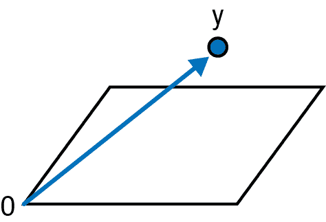

###### 图 15-4。在这个简化的图示中，所有可能的模型预测向量<math><mtext>span</mtext> <mo stretchy="false">(</mo> <mrow><mi mathvariant="bold">X</mi></mrow> <mo stretchy="false">)</mo></math>被描绘为三维空间中的一个平面，而观测到的<math><mrow><mi mathvariant="bold">y</mi></mrow></math>作为一个向量。

尽管平方损失不能完全为零，因为<math><mrow><mi mathvariant="bold">y</mi></mrow></math>不在<math><mtext>span</mtext> <mo stretchy="false">(</mo> <mrow><mi mathvariant="bold">X</mi></mrow> <mo stretchy="false">)</mo></math>中，我们可以找到一个尽可能接近<math><mrow><mi mathvariant="bold">y</mi></mrow></math>但仍在<math><mtext>span</mtext> <mo stretchy="false">(</mo> <mrow><mi mathvariant="bold">X</mi></mrow> <mo stretchy="false">)</mo></math>中的向量。这个向量被称为<math><mrow><mrow><mover><mi mathvariant="bold">y</mi> <mo mathvariant="bold" stretchy="false">^</mo></mover></mrow></mrow></math>。

误差是向量 <math><mrow><mi mathvariant="bold">e</mi></mrow> <mo>=</mo> <mrow><mi mathvariant="bold">y</mi></mrow> <mo>−</mo> <mrow><mrow><mover><mi mathvariant="bold">y</mi> <mo mathvariant="bold" stretchy="false">^</mo></mover></mrow></mrow></math> 。它的长度 <math><mo fence="false" stretchy="false">‖</mo> <mrow><mi mathvariant="bold">e</mi></mrow> <mo fence="false" stretchy="false">‖</mo></math> 表示真实结果与我们模型预测之间的距离。从视觉上看，当它与 <math><mtext>span</mtext> <mo stretchy="false">(</mo> <mrow><mi mathvariant="bold">X</mi></mrow> <mo stretchy="false">)</mo></math> *垂直* 时，<math><mrow><mi mathvariant="bold">e</mi></mrow></math> 的大小最小，如 图 15-5 所示。关于此事实的证明被省略，我们依赖于图表来说服您。

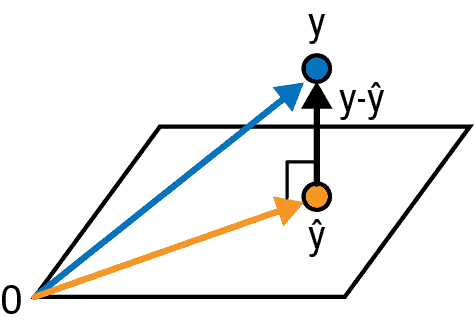

###### 图 15-5\. 当预测值 <math><mrow><mrow><mover><mi mathvariant="bold">y</mi> <mo mathvariant="bold" stretchy="false">^</mo></mover></mrow></mrow></math> 在 <math><mtext>span</mtext> <mo stretchy="false">(</mo> <mrow><mi mathvariant="bold">X</mi></mrow> <mo stretchy="false">)</mo></math> 垂直于 <math><mrow><mrow><mi mathvariant="bold">y</mi></mrow></mrow></math> 时，均方误差达到最小值。

最小误差 <math><mrow><mi mathvariant="bold">e</mi></mrow></math> 必须垂直于 <math><mrow><mrow><mover><mi mathvariant="bold">y</mi> <mo mathvariant="bold" stretchy="false">^</mo></mover></mrow></mrow></math>，这使我们能够推导出 <math><mrow><mover><mi mathvariant="bold-italic">θ</mi> <mo stretchy="false">^</mo></mover></mrow></math> 的公式如下：

<math display="block"><mtable columnalign="right" columnspacing="0em" displaystyle="true" rowspacing="3pt"><mtr><mtd><mtable columnalign="right left right" columnspacing="0em 2em" displaystyle="true" rowspacing="3pt"><mtr><mtd><mtext mathvariant="bold">X</mtext> <mrow><mover><mi mathvariant="bold-italic">θ</mi> <mo mathvariant="bold" stretchy="false">^</mo></mover></mrow> <mo>+</mo> <mrow><mi mathvariant="bold">e</mi></mrow></mtd> <mtd><mo>=</mo> <mrow><mi mathvariant="bold">y</mi></mrow></mtd> <mtd><mo stretchy="false">(</mo> <mtext>the definition of </mtext> <mrow><mi mathvariant="bold">y</mi></mrow> <mo>,</mo> <mrow><mover><mrow><mi mathvariant="bold">y</mi></mrow> <mo stretchy="false">^</mo></mover></mrow> <mo>,</mo> <mrow><mi mathvariant="bold">e</mi></mrow> <mo stretchy="false">)</mo></mtd></mtr> <mtr><mtd><msup><mrow><mtext mathvariant="bold">X</mtext></mrow> <mi mathvariant="normal">⊤</mi></msup> <mtext mathvariant="bold">X</mtext> <mrow><mover><mi mathvariant="bold-italic">θ</mi> <mo stretchy="false">^</mo></mover></mrow> <mo>+</mo> <msup><mrow><mtext mathvariant="bold">X</mtext></mrow> <mi mathvariant="normal">⊤</mi></msup> <mrow><mi mathvariant="bold">e</mi></mrow></mtd> <mtd><mo>=</mo> <msup><mrow><mtext mathvariant="bold">X</mtext></mrow> <mi mathvariant="normal">⊤</mi></msup> <mrow><mi mathvariant="bold">y</mi></mrow></mtd> <mtd><mo stretchy="false">(</mo> <mtext>left-multiply by </mtext> <msup><mrow><mtext mathvariant="bold">X</mtext></mrow> <mi mathvariant="normal">⊤</mi></msup> <mo stretchy="false">)</mo></mtd></mtr> <mtr><mtd><msup><mrow><mtext mathvariant="bold">X</mtext></mrow> <mi mathvariant="normal">⊤</mi></msup> <mtext mathvariant="bold">X</mtext> <mrow><mover><mi mathvariant="bold-italic">θ</mi> <mo stretchy="false">^</mo></mover></mrow></mtd> <mtd><mo>=</mo> <msup><mrow><mtext mathvariant="bold">X</mtext></mrow> <mi mathvariant="normal">⊤</mi></msup> <mrow><mi mathvariant="bold">y</mi></mrow></mtd> <mtd><mo stretchy="false">(</mo> <mrow><mi mathvariant="bold">e</mi></mrow> <mo>⊥</mo> <mtext>span</mtext> <mo stretchy="false">(</mo> <mtext mathvariant="bold">X</mtext> <mo stretchy="false">)</mo> <mo stretchy="false">)</mo></mtd></mtr> <mtr><mtd><mrow><mover><mi mathvariant="bold-italic">θ</mi> <mo mathvariant="bold" stretchy="false">^</mo></mover></mrow></mtd> <mtd><mo>=</mo> <mo stretchy="false">(</mo> <msup><mrow><mtext mathvariant="bold">X</mtext></mrow> <mi mathvariant="normal">⊤</mi></msup> <mtext mathvariant="bold">X</mtext> <msup><mo stretchy="false">)</mo> <mrow><mo>−</mo> <mn>1</mn></mrow></msup> <msup><mrow><mtext mathvariant="bold">X</mtext></mrow> <mi mathvariant="normal">⊤</mi></msup> <mrow><mi mathvariant="bold">y</mi></mrow></mtd> <mtd><mo stretchy="false">(</mo> <mtext>left-multiply by </mtext> <mo stretchy="false">(</mo> <msup><mrow><mtext mathvariant="bold">X</mtext></mrow> <mi mathvariant="normal">⊤</mi></msup> <mtext mathvariant="bold">X</mtext> <msup><mo stretchy="false">)</mo> <mrow><mo>−</mo> <mn>1</mn></mrow></msup> <mo stretchy="false">)</mo></mtd></mtr></mtable></mtd></mtr></mtable></math>

这种推导多元线性模型中<math><mrow><mover><mi mathvariant="bold-italic">θ</mi> <mo mathvariant="bold" stretchy="false">^</mo></mover></mrow></math>的一般方法也给了我们简单线性模型中<math><msub><mrow><mover><mi>θ</mi> <mo stretchy="false">^</mo></mover></mrow> <mn>0</mn></msub></math>和<math><msub><mrow><mover><mi>θ</mi> <mo stretchy="false">^</mo></mover></mrow> <mn>1</mn></msub></math>。如果我们将<math><mrow><mtext mathvariant="bold">X</mtext></mrow></math>设置为包含截距列和一个特征列的两列矩阵，这个公式用于最小二乘拟合的简单线性模型的截距和斜率。实际上，如果<math><mrow><mtext mathvariant="bold">X</mtext></mrow></math>仅是<math><mn>1</mn></math>列的单列，那么我们可以使用这个公式表明<math><mrow><mrow><mover><mi>θ</mi> <mo stretchy="false">^</mo></mover></mrow></mrow></math>只是<math><mrow><mi mathvariant="bold">y</mi></mrow></math>的均值。这与我们在第四章中介绍的常数模型很好地联系在一起。

###### 注意

虽然我们可以编写一个简单的函数来根据公式推导<math><mrow><mover><mi mathvariant="bold-italic">θ</mi> <mo mathvariant="bold" stretchy="false">^</mo></mover></mrow></math>

<math display="block"><mrow><mover><mi mathvariant="bold-italic">θ</mi> <mo mathvariant="bold" stretchy="false">^</mo></mover></mrow> <mo>=</mo> <mo stretchy="false">(</mo> <msup><mrow><mtext mathvariant="bold">X</mtext></mrow> <mi mathvariant="normal">⊤</mi></msup> <mtext mathvariant="bold">X</mtext> <msup><mo stretchy="false">)</mo> <mrow><mo>−</mo> <mn>1</mn></mrow></msup> <msup><mrow><mtext mathvariant="bold">X</mtext></mrow> <mi mathvariant="normal">⊤</mi></msup> <mrow><mi mathvariant="bold">y</mi></mrow></math>

我们建议使用优化调整方法来计算<math><mrow><mover><mi mathvariant="bold-italic">θ</mi> <mo mathvariant="bold" stretchy="false">^</mo></mover></mrow></math>，这些方法由`scikit-learn`和`statsmodels`库提供。它们处理设计矩阵稀疏、高度共线性和不可逆的情况。

这个<math><mrow><mover><mi mathvariant="bold-italic">θ</mi> <mo mathvariant="bold" stretchy="false">^</mo></mover></mrow></math>的解（以及图像）揭示了拟合系数和预测的一些有用性质：

+   残差<math><mrow><mi mathvariant="bold">e</mi></mrow></math>与预测值<math><mrow><mover><mrow><mi mathvariant="bold">y</mi></mrow> <mo stretchy="false">^</mo></mover></mrow></math>正交。

+   如果模型有截距项，则残差的平均值为 0。

+   残差的方差就是均方误差。

这些属性解释了为什么我们要检查残差与预测值的图表。当我们拟合多元线性模型时，我们还会将残差与我们考虑添加到模型的变量绘制在一起。如果它们显示出线性模式，那么我们会考虑将它们添加到模型中。

除了检查错误的标准差之外，多元线性模型的均方误差与常数模型的均方误差比值可以衡量模型的拟合度。这被称为*多元<math><msup><mi>R</mi> <mn>2</mn></msup></math>*，其定义如下：

<math display="block"><msup><mi>R</mi> <mn>2</mn></msup> <mo>=</mo> <mn>1</mn> <mo>−</mo> <mfrac><mrow><mo fence="false" stretchy="false">‖</mo> <mrow><mi mathvariant="bold">y</mi></mrow> <mo>−</mo> <mrow><mtext mathvariant="bold">X</mtext></mrow> <mrow><mrow><mover><mi mathvariant="bold-italic">θ</mi> <mo mathvariant="bold" stretchy="false">^</mo></mover></mrow></mrow> <msup><mo fence="false" stretchy="false">‖</mo> <mn>2</mn></msup></mrow> <mrow><mo fence="false" stretchy="false">‖</mo> <mrow><mrow><mi mathvariant="bold">y</mi></mrow></mrow> <mo>−</mo> <mrow><mover><mi>y</mi> <mo stretchy="false">¯</mo></mover></mrow> <msup><mo fence="false" stretchy="false">‖</mo> <mn>2</mn></msup></mrow></mfrac></math>

随着模型越来越贴近数据，多个<math><msup><mi>R</mi> <mn>2</mn></msup></math>接近于 1。这可能看起来是件好事，但这种方法可能存在问题，因为<math><msup><mi>R</mi> <mn>2</mn></msup></math>即使在我们为模型添加无意义的特征时也会继续增长，只要这些特征扩展了<math><mtext>span</mtext><mo stretchy="false">(</mo><mtext mathvariant="bold">X</mtext><mo stretchy="false">)</mo></math>。为了考虑模型的大小，我们通常通过模型中拟合系数的数量调整<math><msup><mi>R</mi> <mn>2</mn></msup></math>的分子和分母。也就是说，我们通过<math><mn>1</mn><mrow><mo>/</mo></mrow><mo stretchy="false">[</mo><mi>n</mi><mo>−</mo><mo stretchy="false">(</mo><mi>p</mi><mo>+</mo><mn>1</mn><mo stretchy="false">)</mo><mo stretchy="false">]</mo></math>来标准化分子，并通过<math><mn>1</mn><mrow><mo>/</mo></mrow><mo stretchy="false">(</mo><mi>n</mi><mo>−</mo><mn>1</mn><mo stretchy="false">)</mo></math>来标准化分母。在选择模型的更好方法方面，详见第十六章。

接下来，我们考虑一个社会科学的例子，在这个例子中，我们有许多可用于建模的变量。

# 示例：什么是机会之地？

美国被称为“机会之地”，因为人们相信即使资源匮乏的人也可以在美国变得富有，经济学家称这种观念为“经济流动性”。在一项研究中，经济学家拉杰·切蒂及其同事对美国的经济流动性进行了[大规模数据分析](https://doi.org/10.1093/qje/qju022)。他的基本问题是美国是否是一个机会之地。为了回答这个相对模糊的问题，切蒂需要一种衡量经济流动性的方法。

Chetty 可以访问 1980 年至 1982 年间出生于美国的每个人的 2011-2012 年联邦所得税记录，以及他们父母在他们出生年份的税务记录。他通过找到列出他们为家庭成员的父母的 1980-1982 年税务记录来将 30 岁的人与他们的父母配对。总共，他的数据集约有 1000 万人。为了衡量经济流动性，Chetty 将出生在特定地理区域、父母收入位于 1980-1982 年的第 25 个收入百分位的人群分组。然后，他找到了该组 2011 年的平均收入百分位数。Chetty 将这个平均值称为*绝对向上流动*（AUM）。如果一个地区的 AUM 为 25，那么出生在第 25 百分位的人通常会保持在第 25 百分位，即他们留在了父母出生时的位置。高 AUM 值意味着该地区具有更多的向上流动性。在这些地区出生在第 25 个收入百分位的人通常会进入比他们父母更高的收入阶层。作为参考，美国的平均 AUM 在撰写本文时约为 41。Chetty 计算了称为通勤区（CZs）的地区的 AUM，这些地区大致与县级相同的规模。

虽然原始数据的粒度是在个体级别，Chetty 分析的数据粒度是在通勤区域级别。由于隐私法规限制，收入记录不能公开，但通勤区域的 AUM 可以提供。然而，即使有了通勤区域的粒度，也并非所有通勤区域都包含在数据集中，因为在 40 个特征的数据中，可能会识别出小型通勤区域的个体。这一限制指向潜在的覆盖偏倚。测量偏倚是另一个潜在问题。例如，出生在第 25 收入百分位的儿童，如果成为极其富有的人，可能不会申报所得税。

我们还指出使用区域平均数据而不是个体测量数据的局限性。在聚合水平上，特征之间的关系通常比在个体水平上更高度相关。这种现象称为*生态回归*，需要谨慎解释从聚合数据中得出的发现。

Chetty 怀疑美国某些地方的经济流动性较高。他的分析证实了这一点。他发现一些城市，如加利福尼亚州圣何塞、华盛顿特区和西雅图，比其他城市如北卡罗来纳州夏洛特、密尔沃基和亚特兰大有更高的流动性。这意味着，例如，在圣何塞，人们从低收入阶层向高收入阶层的转移速度比在夏洛特要快。Chetty 使用线性模型发现社会和经济因素如隔离、收入不平等和当地学校系统与经济流动性相关。

在这个分析中，我们的结果变量是通勤区域的 AUM，因为我们有兴趣找出与 AUM 相关的特征。Chetty 的数据中可能有许多这样的特征，但我们首先调查了一个特别的特征：通勤区域内通勤时间在 15 分钟或更短的人口比例。

## 使用通勤时间解释向上流动性

我们开始通过将数据加载到名为`cz_df`的数据框中进行调查：

|   | aum | travel_lt15 | gini | rel_tot | ... | taxrate | worked_14 | foreign | 地区 |
| --- | --- | --- | --- | --- | --- | --- | --- | --- | --- |
| **0** | 38.39 | 0.33 | 0.47 | 0.51 | ... | 0.02 | 3.75e-03 | 1.18e-02 | 南部 |
| **1** | 37.78 | 0.28 | 0.43 | 0.54 | ... | 0.02 | 4.78e-03 | 2.31e-02 | 南部 |
| **2** | 39.05 | 0.36 | 0.44 | 0.67 | ... | 0.01 | 2.89e-03 | 7.08e-03 | 南部 |
| **...** | ... | ... | ... | ... | ... | ... | ... | ... | ... |
| **702** | 44.12 | 0.42 | 0.42 | 0.29 | ... | 0.02 | 4.82e-03 | 9.85e-02 | 西部 |
| **703** | 41.41 | 0.49 | 0.41 | 0.26 | ... | 0.01 | 4.39e-03 | 4.33e-02 | 西部 |
| **704** | 43.20 | 0.24 | 0.42 | 0.32 | ... | 0.02 | 3.67e-03 | 1.13e-01 | 西部 |

```py
705 rows × 9 columns
```

每一行代表一个通勤区。列 `aum` 是 1980–1982 年出生并且父母收入处于第 25 百分位数的人群的平均 AUM。数据框中有许多列，但现在我们专注于通勤区内通勤时间不超过 15 分钟的人群比例，即 `travel_lt15`。我们将 AUM 与这个比例进行绘图，以探索这两个变量之间的关系：

```py
`px``.``scatter``(``cz_df``,` `x``=``'``travel_lt15``'``,` `y``=``'``aum``'``,` `width``=``350``,` `height``=``250``,`
           `labels``=``{``'``travel_lt15``'``:``'``Commute time under 15 min``'``,` 
                   `'``aum``'``:``'``Upward mobility``'``}``)`

```

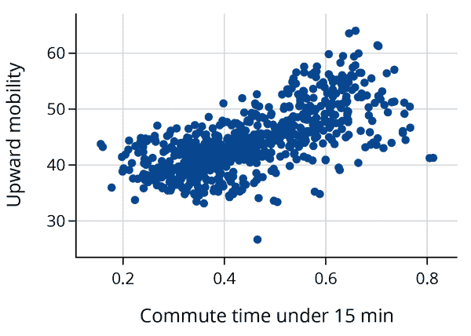

散点图显示 AUM 与通勤时间之间存在大致的线性关系。事实上，我们发现它们之间的相关性非常强：

```py
`cz_df``[``[``'``aum``'``,` `'``travel_lt15``'``]``]``.``corr``(``)`

```

|   | aum | travel_lt15 |
| --- | --- | --- |
| aum | 1.00 | 0.68 |
| travel_lt15 | 0.68 | 1.00 |

让我们用一个简单的线性模型来解释 AUM 与通勤时间的关系：

```py
`from` `sklearn``.``linear_model` `import` `LinearRegression`

`y` `=` `cz_df``[``'``aum``'``]`
`X` `=` `cz_df``[``[``'``travel_lt15``'``]``]`

`model_ct` `=` `LinearRegression``(``)``.``fit``(``X``,` `y``)`

```

MSE 最小化得到的系数为：

```py
Intercept: 31.3
    Slope: 28.7

```

有趣的是，通勤区的向上流动增加与通勤时间较短的人群比例增加相关联。

我们可以将 AUM 测量的标准差与残差的标准差进行比较。这种比较让我们了解模型在解释 AUM 方面的实用性：

```py
`prediction` `=` `model_ct``.``predict``(``X``)`
`error` `=` `y` `-` `prediction`

`print``(``f``"``SD(errors):` `{``np``.``std``(``error``)``:``.2f``}``"``)`
`print``(``f``"` `SD(AUM):` `{``np``.``std``(``cz_df``[``'``aum``'``]``)``:``.2f``}``"``)`

```

```py
SD(errors): 4.14
   SD(AUM): 5.61

```

围绕回归线的误差大小比常数模型减少了约 25%。

接下来，我们检查残差来判断拟合的不合适，因为在残差图中更容易看出拟合存在的潜在问题：

```py
`fig` `=` `px``.``scatter``(``x``=``prediction``,` `y``=``error``,`
                 `labels``=``dict``(``x``=``'``Prediction for AUM``'``,` `y``=``'``Error``'``)``,`
                 `width``=``350``,` `height``=``250``)`

`fig``.``add_hline``(``0``,` `line_width``=``2``,` `line_dash``=``'``dash``'``,` `opacity``=``1``)`
`fig``.``update_yaxes``(``range``=``[``-``20``,` `15``]``)`

`fig``.``show``(``)`

```

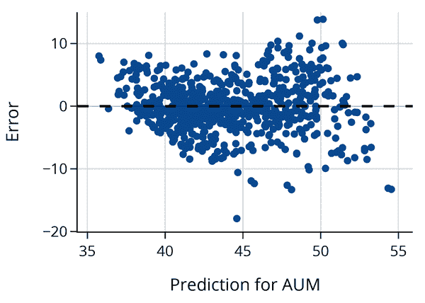

看起来随着 AUM 的增加，误差也在增加。我们可以尝试对响应变量进行转换，或者拟合一个在通勤时间分数上是二次的模型。在下一节中我们将考虑变换和多项式。首先，我们看看包含额外变量是否能更准确地预测 AUM。

## 使用多个变量来关联向上流动

在他的原始分析中，Chetty 创建了几个与隔离、收入和 K–12 教育等因素相关的高级特征。我们考虑 Chetty 的七个预测因子，旨在构建一个更具信息性的模型来解释 AUM。这些在 Table 15-1 中描述。

Table 15-1\. 解释 AUM 建模的潜在原因

| 列名 | 描述 |
| --- | --- |
| `travel_lt15` | 上班通勤时间不超过 15 分钟的人群比例。 |
| `gini` | 基尼系数，财富不平等的度量。取值介于 0 到 1 之间，数值较小表示财富分配较均匀，较大表示不平等程度更大。 |
| `rel_tot` | 自报宗教信仰的人群比例。 |
| `single_mom` | 单身母亲的子女比例。 |
| `taxrate` | 地方税率。 |
| `worked_14` | 14 到 16 岁工作的人群比例。 |
| `foreign` | 出生于美国以外的人群比例。 |

让我们首先检查 AUM 与解释性特征以及解释性特征之间的相关性：

|   | aum | travel_lt15 | gini | rel_tot | single_mom | taxrate | worked_14 | foreign |
| --- | --- | --- | --- | --- | --- | --- | --- | --- |
| **aum** | 1.00 | 0.68 | -0.60 | 0.52 | -0.77 | 0.35 | 0.65 | -0.03 |
| **travel_lt15** | 0.68 | 1.00 | -0.56 | 0.40 | -0.42 | 0.34 | 0.60 | -0.19 |
| **gini** | -0.60 | -0.56 | 1.00 | -0.29 | 0.57 | -0.15 | -0.58 | 0.31 |
| **rel_tot** | 0.52 | 0.40 | -0.29 | 1.00 | -0.31 | 0.08 | 0.28 | -0.11 |
| **single_mom** | -0.77 | -0.42 | 0.57 | -0.31 | 1.00 | -0.26 | -0.60 | -0.04 |
| **taxrate** | 0.35 | 0.34 | -0.15 | 0.08 | -0.26 | 1.00 | 0.35 | 0.26 |
| **worked_14** | 0.65 | 0.60 | -0.58 | 0.28 | -0.60 | 0.35 | 1.00 | -0.15 |
| **foreign** | -0.03 | -0.19 | 0.31 | -0.11 | -0.04 | 0.26 | -0.15 | 1.00 |

我们看到，在通勤区中单身母亲的比例与 AUM 有最强的相关性，这意味着它也是解释 AUM 的最佳特征。此外，我们看到几个解释变量彼此之间高度相关；基尼系数与工作的青少年比例、单身母亲比例以及 15 分钟以下通勤比例高度相关。由于这些高度相关的特征，我们在解释系数时需要谨慎，因为几种不同的模型可能同样能够用协变量来解释 AUM。

###### 注意

我们在本章前面介绍的向量几何视角可以帮助我们理解这个问题。回顾一下，一个特征对应于 <math><mi>n</mi></math> 维空间中的一个列向量，如 <math><mrow><mi mathvariant="bold">x</mi></mrow></math> 。对于两个高度相关的特征 <math><msub><mrow><mi mathvariant="bold">x</mi></mrow> <mn>1</mn></msub></math> 和 <math><msub><mrow><mi mathvariant="bold">x</mi></mrow> <mn>2</mn></msub></math> ，这些向量几乎是对齐的。因此，响应向量 <math><mrow><mi mathvariant="bold">y</mi></mrow></math> 在这些向量中的一个上的投影几乎与在另一个上的投影相同。当几个特征彼此相关时，情况变得更加混乱。

首先，我们可以考虑所有可能的两特征模型，看看哪一个具有最小的预测误差。Chetty 导出了 40 个潜在的变量作为预测变量，这将使我们检查 <math><mo stretchy="false">(</mo> <mn>40</mn> <mo>×</mo> <mn>39</mn> <mo stretchy="false">)</mo> <mrow><mo>/</mo></mrow> <mn>2</mn> <mo>=</mo> <mn>780</mn></math> 个模型。拟合模型时，所有成对、三元组等变量很快就会失控。这可能导致找到伪相关性（见第十七章）。

在这里，我们保持事情稍微简单，只研究包含通勤时间和单身母亲特征的两变量模型。之后，我们查看包含数据框架中所有七个数值解释特征的模型：

```py
`X2` `=` `cz_df``[``[``'``travel_lt15``'``,` `'``single_mom``'``]``]`
`y` `=` `cz_df``[``'``aum``'``]`

`model_ct_sm` `=` `LinearRegression``(``)``.``fit``(``X2``,` `y``)`

```

```py
Intercept: 49.0
Fraction with under 15 minute commute coefficient: 18.10
Fraction of single moms coefficient: 18.10

```

请注意，旅行时间的系数与简单线性模型中这个变量的系数相比有很大不同。这是因为我们模型中的两个特征高度相关。

接下来我们比较这两个拟合的误差：

```py
`prediction_ct_sm` `=` `model_ct_sm``.``predict``(``X2``)`
`error_ct_sm` `=` `y` `-` `prediction_ct_sm`

```

```py
 SD(errors in model 1): 4.14
 SD(errors in model 2): 2.85

```

残差的标准偏差进一步减少了 30%。增加模型复杂性以添加第二个变量似乎是值得的。

让我们再次直观地检查残差。我们使用与前一个单变量模型相同的 y 轴刻度，以便与其残差图进行比较：

```py
`fig` `=` `px``.``scatter``(``x``=``prediction_ct_sm``,` `y``=``error_ct_sm``,`
           `labels``=``dict``(``x``=``'``Two-variable prediction for AUM``'``,` `y``=``'``Error``'``)``,`
           `width``=``350``,` `height``=``250``)`

`fig``.``add_hline``(``0``,` `line_width``=``2``,` `line_dash``=``'``dash``'``,` `opacity``=``1``)`
`fig``.``update_yaxes``(``range``=``[``-``20``,` `15``]``)`

`fig``.``show``(``)`

```

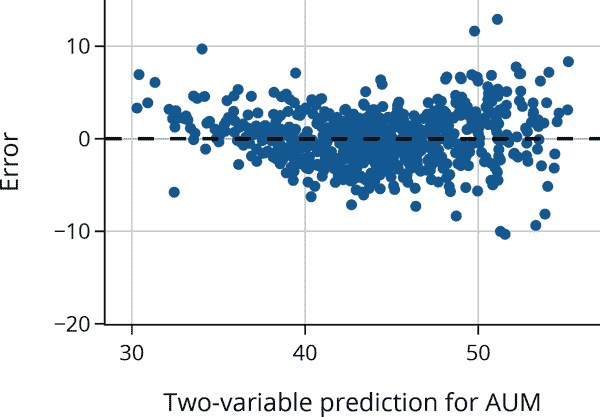

对更高 AUM 的误差的较大变异性更为明显。这意味着估计值<math><mrow><mover><mi>y</mi> <mo stretchy="false">^</mo></mover></mrow></math>不受影响，但其准确性取决于 AUM。可以通过*加权回归*来解决这个问题。

###### 注意

再次强调，不同背景的数据科学家使用不同的术语来指代相同的概念。例如，将设计矩阵<math><mtext mathvariant="bold">X</mtext></math>中的每一行称为一个观察值，每一列称为一个变量的术语在统计背景的人群中更为常见。其他人则称设计矩阵的每一列代表一个*特征*，或者每一行代表一条*记录*。此外，我们称拟合和解释模型的整个过程为*建模*，而其他人则称其为*机器学习*。

现在让我们拟合一个多元线性模型，使用所有七个变量来解释上升的流动性。在拟合模型之后，我们再次使用与前两个残差图相同的 y 轴刻度绘制误差：

```py
`X7` `=` `cz_df``[``predictors``]`
`model_7var` `=` `LinearRegression``(``)``.``fit``(``X7``,` `y``)`

`prediction_7var` `=` `model_7var``.``predict``(``X7``)`
`error_7var` `=` `y` `-` `prediction_7var`

```

```py
fig = px.scatter(
    x=prediction_7var, y=error_7var,
    labels=dict(x='Seven-variable prediction for AUM', y='Error'),
    width=350, height=250)

`fig``.``add_hline``(``0``,` `line_width``=``2``,` `line_dash``=``'``dash``'``,` `opacity``=``1``)`
`fig``.``update_yaxes``(``range``=``[``-``20``,` `15``]``)`

`fig``.``show``(``)`

```

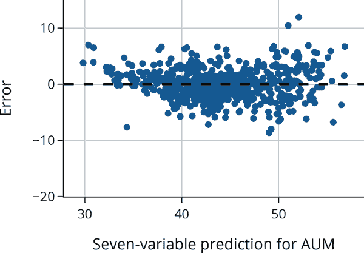

具有七个特征的模型似乎并没有比具有两个变量的模型好多少。事实上，残差的标准偏差仅减少了 8%：

```py
`error_7var``.``std``(``)` 

```

```py
2.588739233574256

```

我们可以比较这三个模型的多元<math><msup><mi>R</mi> <mn>2</mn></msup></math>：

```py
R² for 7-variable model: 0.79
R² for 2-variable model: 0.74
R² for 1-variable model: 0.46

```

对于我们来说，模型中特征数量的调整并没有太大差异，因为我们有超过 700 个观测值。现在我们已经确认了之前的发现，即使用两个变量大大改善了模型的解释能力，而七个变量模型几乎没有比两个变量模型有所改善。这种小的增益可能不值得模型的复杂性增加。

到目前为止，我们的模型仅使用了数值预测变量。但是类别数据在模型拟合中通常也很有用。此外，在第十章中，我们对变量进行了转换，并从变量的组合中创建了新的变量。接下来我们将讨论如何将这些变量纳入线性模型。

# 数值测量的特征工程

本章迄今为止我们拟合的所有模型都使用了最初在数据框中提供的数值特征。在本节中，我们将查看由数值特征变换创建的变量。将变量转换为建模使用的形式称为*特征工程*。

我们在第九章和 10 章中引入了特征工程。在那里，我们对特征进行了转换，使它们具有对称分布。变换可以捕捉数据中更多种类的模式，并导致更好和更准确的模型。

让我们回到我们在第十章中作为示例使用的数据集：旧金山湾区的房屋销售价格。我们将数据限制在 2006 年售出的房屋，当时房价相对稳定，因此我们不需要考虑价格趋势。

我们希望建立销售价格模型。回顾在第十章中的可视化结果，我们发现销售价格与多个特征相关，如房屋尺寸、地块尺寸、卧室数量和位置。我们对销售价格和房屋尺寸进行了对数变换以改善它们之间的关系，并且发现了关于卧室数量和城市的箱线图也显示了有趣的关系。在本节中，我们将在线性模型中包括转换后的数值特征。在下一节中，我们还将向模型添加序数特征（卧室数量）和名义特征（城市）。

首先，我们将在房屋尺寸上建立销售价格模型。相关矩阵告诉我们哪些数值解释变量（原始和转换后的）与销售价格最相关：

|   | price | br | lsqft | bsqft | log_price | log_bsqft | log_lsqft | ppsf | log_ppsf |
| --- | --- | --- | --- | --- | --- | --- | --- | --- | --- |
| **price** | 1.00 | 0.45 | 0.59 | 0.79 | 0.94 | 0.74 | 0.62 | 0.49 | 0.47 |
| **br** | 0.45 | 1.00 | 0.29 | 0.67 | 0.47 | 0.71 | 0.38 | -0.18 | -0.21 |
| **lsqft** | 0.59 | 0.29 | 1.00 | 0.46 | 0.55 | 0.44 | 0.85 | 0.29 | 0.27 |
| **bsqft** | 0.79 | 0.67 | 0.46 | 1.00 | 0.76 | 0.96 | 0.52 | -0.08 | -0.10 |
| **log_price** | 0.94 | 0.47 | 0.55 | 0.76 | 1.00 | 0.78 | 0.62 | 0.51 | 0.52 |
| **log_bsqft** | 0.74 | 0.71 | 0.44 | 0.96 | 0.78 | 1.00 | 0.52 | -0.11 | -0.14 |
| **log_lsqft** | 0.62 | 0.38 | 0.85 | 0.52 | 0.62 | 0.52 | 1.00 | 0.29 | 0.27 |
| **ppsf** | 0.49 | -0.18 | 0.29 | -0.08 | 0.51 | -0.11 | 0.29 | 1.00 | 0.96 |
| **log_ppsf** | 0.47 | -0.21 | 0.27 | -0.10 | 0.52 | -0.14 | 0.27 | 0.96 | 1.00 |

销售价格与房屋尺寸最相关，称为`bsqft`（建筑面积）。我们制作了销售价格与房屋尺寸的散点图，以确认这种关联是线性的：

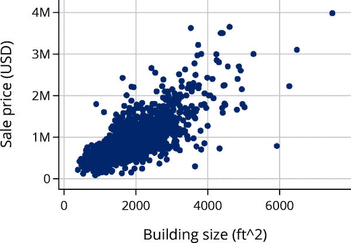

关系看起来大致是线性的，但非常大和昂贵的房屋远离分布中心，可能会对模型产生过度影响。如第十章所示，对数变换使得价格和尺寸的分布更对称（两者均为以对数 10 为底以便于将值转换为原始单位）：

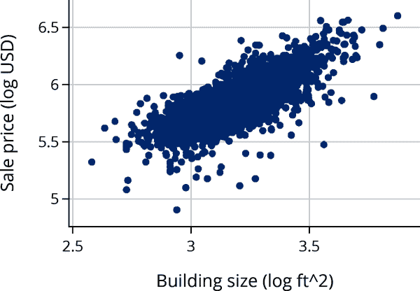

理想情况下，使用变换的模型应当在数据的背景下有意义。如果我们基于对数（大小）拟合一个简单的线性模型，那么在检查系数时，我们可以考虑百分比增加。例如，<math><mi>x</mi></math>翻倍会使预测增加<math><mi>θ</mi><mi>log</mi> <mo>⁡</mo> <mo stretchy="false">(</mo><mn>2</mn><mo stretchy="false">)</mo></math>，因为<math><mi>θ</mi><mi>log</mi> <mo>⁡</mo> <mo stretchy="false">(</mo><mn>2</mn><mi>x</mi><mo stretchy="false">)</mo><mo>=</mo><mi>θ</mi><mi>log</mi> <mo>⁡</mo> <mo stretchy="false">(</mo><mn>2</mn><mo stretchy="false">)</mo><mo>+</mo><mi>θ</mi><mi>log</mi> <mo>⁡</mo> <mo stretchy="false">(</mo><mi>x</mi><mo stretchy="false">)</mo></math>。

让我们从拟合一个通过房屋大小的对数变换解释的模型开始。但首先，我们注意到这个模型仍然被认为是一个线性模型。如果我们用<math><mi>y</mi></math>表示销售价格，<math><mi>x</mi></math>表示房屋大小，那么该模型是：

<math display="block"><mtable columnalign="right left" columnspacing="0em" displaystyle="true" rowspacing="3pt"><mtr><mtd><mi>log</mi> <mo>⁡</mo> <mo stretchy="false">(</mo> <mi>y</mi> <mo stretchy="false">)</mo></mtd> <mtd><mo>=</mo>  <msub><mi>θ</mi> <mn>0</mn></msub> <mo>+</mo> <msub><mi>θ</mi> <mn>1</mn></msub> <mi>log</mi> <mo>⁡</mo> <mo stretchy="false">(</mo> <mi>x</mi> <mo stretchy="false">)</mo></mtd></mtr></mtable></math>

（请注意，在这个方程中，我们忽略了近似以使线性关系更加清晰。）这个方程可能看起来不是线性的，但如果我们将<math><mi>log</mi> <mo>⁡</mo> <mo stretchy="false">(</mo> <mi>y</mi> <mo stretchy="false">)</mo></math>重命名为<math><mi>w</mi></math>，<math><mi>log</mi> <mo>⁡</mo> <mo stretchy="false">(</mo> <mi>x</mi> <mo stretchy="false">)</mo></math>重命名为<math><mi>v</mi></math>，那么我们可以将这种“对数-对数”关系表达为<math><mi>w</mi></math>和<math><mi>v</mi></math>的线性模型：

<math display="block"><mi>w</mi>  <mo>=</mo>  <msub><mi>θ</mi> <mn>0</mn></msub> <mo>+</mo> <msub><mi>θ</mi> <mn>1</mn></msub> <mi>v</mi></math>

可以表达为转换特征的线性组合的其他模型示例是：

<math display="block"><mtable columnalign="right" columnspacing="0em" displaystyle="true" rowspacing="3pt"><mtr><mtd><mtable columnalign="right left" columnspacing="0em" displaystyle="true" rowspacing="3pt"><mtr><mtd><mi>log</mi> <mo>⁡</mo> <mo stretchy="false">(</mo> <mi>y</mi> <mo stretchy="false">)</mo></mtd> <mtd><mo>=</mo>  <msub><mi>θ</mi> <mn>0</mn></msub> <mo>+</mo> <msub><mi>θ</mi> <mn>1</mn></msub> <mi>x</mi></mtd></mtr> <mtr><mtd><mi>y</mi></mtd> <mtd><mo>=</mo>  <msub><mi>θ</mi> <mn>0</mn></msub> <mo>+</mo> <msub><mi>θ</mi> <mn>1</mn></msub> <mi>x</mi> <mo>+</mo> <msub><mi>θ</mi> <mn>2</mn></msub> <msup><mi>x</mi> <mn>2</mn></msup></mtd></mtr> <mtr><mtd><mi>y</mi></mtd> <mtd><mo>=</mo>  <msub><mi>θ</mi> <mn>0</mn></msub> <mo>+</mo> <msub><mi>θ</mi> <mn>1</mn></msub> <mi>x</mi> <mo>+</mo> <msub><mi>θ</mi> <mn>2</mn></msub> <mi>z</mi> <mo>+</mo> <msub><mi>θ</mi> <mn>3</mn></msub> <mi>x</mi> <mi>z</mi></mtd></mtr></mtable></mtd></mtr></mtable></math>

再次，如果我们将<math><mi>log</mi> <mo>⁡</mo> <mo stretchy="false">(</mo> <mi>y</mi> <mo stretchy="false">)</mo></math>重命名为<math><mi>w</mi></math>，<math><msup><mi>x</mi> <mn>2</mn></msup></math>重命名为<math><mi>u</mi></math>，<math><mi>x</mi><mi>z</mi></math>重命名为<math><mi>t</mi></math>，那么我们可以将每个模型表示为这些重命名特征的线性组合。按顺序，前述模型现在是：

<math display="block"><mtable columnalign="right" columnspacing="0em" displaystyle="true" rowspacing="3pt"><mtr><mtd><mtable columnalign="right left" columnspacing="0em" displaystyle="true" rowspacing="3pt"><mtr><mtd><mi>w</mi></mtd> <mtd><mo>=</mo>  <msub><mi>θ</mi> <mn>0</mn></msub> <mo>+</mo> <msub><mi>θ</mi> <mn>1</mn></msub> <mi>x</mi></mtd></mtr> <mtr><mtd><mi>y</mi></mtd> <mtd><mo>=</mo>  <msub><mi>θ</mi> <mn>0</mn></msub> <mo>+</mo> <msub><mi>θ</mi> <mn>1</mn></msub> <mi>x</mi> <mo>+</mo> <msub><mi>θ</mi> <mn>2</mn></msub> <mi>u</mi></mtd></mtr> <mtr><mtd><mi>y</mi></mtd> <mtd><mo>=</mo>  <msub><mi>θ</mi> <mn>0</mn></msub> <mo>+</mo> <msub><mi>θ</mi> <mn>1</mn></msub> <mi>x</mi> <mo>+</mo> <msub><mi>θ</mi> <mn>2</mn></msub> <mi>z</mi> <mo>+</mo> <msub><mi>θ</mi> <mn>3</mn></msub> <mi>t</mi></mtd></mtr></mtable></mtd></mtr></mtable></math>

简言之，我们可以将包含特征的非线性变换和/或特征组合的模型视为其派生特征的线性。在实践中，当我们描述模型时，我们不会重命名转换后的特征；相反，我们使用原始特征的变换，因为在解释系数和检查残差图时保持追踪它们非常重要。

当我们提及这些模型时，我们包括对变换的提及。也就是说，当结果和解释变量都经过对数变换时，我们称之为*对数-对数*模型；当结果经过对数变换而解释变量没有时，我们称之为*对数-线性*；当解释变量包括二次幂变换时，我们描述模型具有二次*多项式特征*；当两个解释特征的乘积包含在模型中时，我们称之为*交互项*。

让我们拟合一个价格对大小的对数-对数模型：

```py
`X1_log` `=` `sfh``[``[``'``log_bsqft``'``]``]`    
`y_log` `=` `sfh``[``'``log_price``'``]`

`model1_log_log` `=` `LinearRegression``(``)``.``fit``(``X1_log``,` `y_log``)`

```

此模型的系数和预测值不能直接与使用线性特征拟合的模型进行比较，因为其单位是美元和平方英尺的对数，而不是美元和平方英尺。

接下来，我们通过图表检查残差和预测值：

```py
`prediction` `=` `model1_log_log``.``predict``(``X1_log``)`
`error` `=` `y_log` `-` `prediction` 

```

```py
`fig` `=` `px``.``scatter``(``x``=``prediction``,` `y``=``error``,`
                 `labels``=``dict``(``x``=``'``Predicted sale price (log USD)``'``,` `y``=``'``Error``'``)``,`
                 `width``=``350``,` `height``=``250``)`

`fig``.``add_hline``(``0``,` `line_width``=``2``,` `line_dash``=``'``dash``'``,` `opacity``=``1``)`
`fig``.``show``(``)`

```

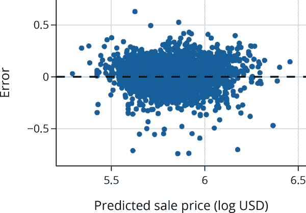

残差图看起来合理，但其中包含数千个点，这使得难以看到曲线。

为了查看是否有助于增加额外的变量，我们可以绘制拟合模型的残差图针对不在模型中的变量。如果看到模式，那就表明我们可能想要包括这个额外特征或其转换。之前，我们发现价格分布与房屋所在城市相关，因此让我们检查残差与城市之间的关系：

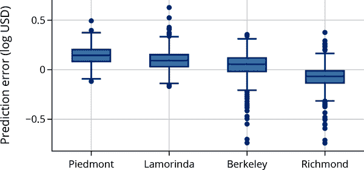

这个图表显示了错误的分布似乎受到城市的影响。理想情况下，每个城市的箱线图中位数应该与 y 轴上的 0 对齐。然而，皮德蒙特出售的房屋超过 75%存在正误差，这意味着实际销售价格高于预测值。而在另一个极端，里士满超过 75%的销售价格低于预测值。这些模式表明我们应该在模型中包括城市变量。从背景来看，地理位置影响销售价格是有道理的。在接下来的部分，我们展示了如何将名义变量纳入线性模型。

# 分类测量的特征工程

我们第一次拟合的模型是第四章中的常数模型。在那里，我们最小化平方损失以找到最适合的常数：

<math display="block"><munder><mo movablelimits="true">min</mo> <mi>c</mi></munder> <munder><mo>∑</mo> <mi>i</mi></munder> <mo stretchy="false">(</mo> <msub><mi>y</mi> <mi>i</mi></msub> <mo>−</mo> <mi>c</mi> <msup><mo stretchy="false">)</mo> <mn>2</mn></msup></math>

我们可以考虑以类似的方式在模型中包含名义特征。也就是说，我们找到每个数据子组中最适合的常数，对应于一个类别：

<math display="block"><mtable columnalign="right" columnspacing="0em" displaystyle="true" rowspacing="3pt"><mtr><mtd><mtable columnalign="right left" columnspacing="0em" displaystyle="true" rowspacing="3pt"><mtr><mtd><munder><mo movablelimits="true">min</mo> <mrow><msub><mi>c</mi> <mi>B</mi></msub></mrow></munder> <munder><mo>∑</mo> <mrow><mi>i</mi> <mo>∈</mo> <mtext>Berkeley</mtext></mrow></munder> <mo stretchy="false">(</mo> <msub><mi>y</mi> <mi>i</mi></msub> <mo>−</mo> <msub><mi>c</mi> <mi>B</mi></msub> <msup><mo stretchy="false">)</mo> <mn>2</mn></msup></mtd> <mtd><munder><mo movablelimits="true">min</mo> <mrow><msub><mi>c</mi> <mi>L</mi></msub></mrow></munder> <munder><mo>∑</mo> <mrow><mi>i</mi> <mo>∈</mo> <mtext>Lamorinda</mtext></mrow></munder> <mo stretchy="false">(</mo> <msub><mi>y</mi> <mi>i</mi></msub> <mo>−</mo> <msub><mi>c</mi> <mi>L</mi></msub> <msup><mo stretchy="false">)</mo> <mn>2</mn></msup></mtd></mtr> <mtr><mtd><munder><mo movablelimits="true">min</mo> <mrow><msub><mi>c</mi> <mi>P</mi></msub></mrow></munder> <munder><mo>∑</mo> <mrow><mi>i</mi> <mo>∈</mo> <mtext>Piedmont</mtext></mrow></munder> <mo stretchy="false">(</mo> <msub><mi>y</mi> <mi>i</mi></msub> <mo>−</mo> <msub><mi>c</mi> <mi>P</mi></msub> <msup><mo stretchy="false">)</mo> <mn>2</mn></msup></mtd> <mtd>   <munder><mo movablelimits="true">min</mo> <mrow><msub><mi>c</mi> <mi>R</mi></msub></mrow></munder> <munder><mo>∑</mo> <mrow><mi>i</mi> <mo>∈</mo> <mtext>Richmond</mtext></mrow></munder> <mo stretchy="false">(</mo> <msub><mi>y</mi> <mi>i</mi></msub> <mo>−</mo> <msub><mi>c</mi> <mi>R</mi></msub> <msup><mo stretchy="false">)</mo> <mn>2</mn></msup></mtd></mtr></mtable></mtd></mtr></mtable></math>

另一种描述这种模型的方式是*独热编码*。

独热编码将分类特征转换为多个只有 0 或 1 值的数值特征。为了对一个特征进行独热编码，我们创建新的特征，每个唯一的类别对应一个新的特征。在本例中，由于有四个城市——伯克利、Lamorinda、皮德蒙特和里士满——我们在一个设计矩阵中创建了四个新特征，称为 <math><msub><mi>X</mi> <mrow><mi>c</mi> <mi>i</mi> <mi>t</mi> <mi>y</mi></mrow></msub></math> 。 <math><msub><mi>X</mi> <mrow><mi>c</mi> <mi>i</mi> <mi>t</mi> <mi>y</mi></mrow></msub></math> 中的每一行包含一个值为 1，它出现在与城市对应的列中。 图 15-6 说明了这一概念。

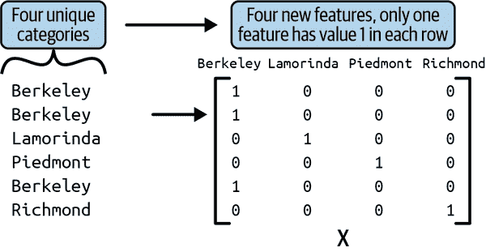

###### 图 15-6\. 对一个分类特征进行独热编码（左）及其生成的设计矩阵（右）

现在我们可以简洁地表示模型如下：

<math display="block"><msub><mi>θ</mi> <mi>B</mi></msub> <msub><mi>x</mi> <mrow><mi>i</mi> <mo>,</mo> <mi>B</mi></mrow></msub>  <mo>+</mo>  <msub><mi>θ</mi> <mi>L</mi></msub> <msub><mi>x</mi> <mrow><mi>i</mi> <mo>,</mo> <mi>L</mi></mrow></msub>  <mo>+</mo>  <msub><mi>θ</mi> <mi>P</mi></msub> <msub><mi>x</mi> <mrow><mi>i</mi> <mo>,</mo> <mi>P</mi></mrow></msub>  <mo>+</mo>  <msub><mi>θ</mi> <mi>R</mi></msub> <msub><mi>x</mi> <mrow><mi>i</mi> <mo>,</mo> <mi>R</mi></mrow></msub></math>

在这里，我们用 <math><mi>B</mi></math> ，<math><mi>L</mi></math> ，<math><mi>P</mi></math> 和 <math><mi>R</mi></math> 对设计矩阵的列进行了索引，而不是 <math><mi>j</mi></math> ，以明确表示每一列代表一个只有 0 和 1 的列，例如，如果第 <math><mi>i</mi></math> 个房屋位于皮德蒙特，则 <math><msub><mi>x</mi> <mrow><mi>i</mi> <mo>,</mo> <mi>P</mi></mrow></msub></math> 为 1。

###### 注意

独热编码创建的特征仅具有 0-1 值。这些特征也被称为*虚拟变量*或*指示变量*。在计量经济学中更常用“虚拟变量”这一术语，在统计学中更常用“指示变量”。

我们的目标是最小化关于 <math><mi mathvariant="bold-italic">θ</mi></math> 的最小二乘损失：

<math display="block"><mtable columnalign="right" columnspacing="0em" displaystyle="true" rowspacing="3pt"><mtr><mtd><mtable columnalign="right left" columnspacing="0em" displaystyle="true" rowspacing="3pt"><mtr><mtd><mo fence="false" stretchy="false">‖</mo> <mrow><mi mathvariant="bold">y</mi></mrow> <mo>−</mo> <mtext mathvariant="bold">X</mtext> <mi mathvariant="bold-italic">θ</mi> <msup><mo fence="false" stretchy="false">‖</mo> <mn>2</mn></msup></mtd> <mtd><mo>=</mo> <munder><mo>∑</mo> <mi>i</mi></munder> <mo stretchy="false">(</mo> <msub><mi>y</mi> <mi>i</mi></msub> <mo>−</mo> <msub><mi>θ</mi> <mi>B</mi></msub> <msub><mi>x</mi> <mrow><mi>i</mi> <mo>,</mo> <mi>B</mi></mrow></msub>  <mo>+</mo>  <msub><mi>θ</mi> <mi>L</mi></msub> <msub><mi>x</mi> <mrow><mi>i</mi> <mo>,</mo> <mi>L</mi></mrow></msub>  <mo>+</mo>  <msub><mi>θ</mi> <mi>P</mi></msub> <msub><mi>x</mi> <mrow><mi>i</mi> <mo>,</mo> <mi>P</mi></mrow></msub>  <mo>+</mo>  <msub><mi>θ</mi> <mi>R</mi></msub> <msub><mi>x</mi> <mrow><mi>i</mi> <mo>,</mo> <mi>R</mi></mrow></msub> <msup><mo stretchy="false">)</mo> <mn>2</mn></msup></mtd></mtr> <mtr><mtd><mo>=</mo> <munder><mo>∑</mo> <mrow><mi>i</mi> <mo>∈</mo> <mi>B</mi> <mi>e</mi> <mi>r</mi> <mi>k</mi> <mi>e</mi> <mi>l</mi> <mi>e</mi> <mi>y</mi></mrow></munder> <mo stretchy="false">(</mo> <msub><mi>y</mi> <mi>i</mi></msub> <mo>−</mo> <msub><mi>θ</mi> <mi>B</mi></msub> <msub><mi>x</mi> <mrow><mi>i</mi> <mo>,</mo> <mi>B</mi></mrow></msub> <msup><mo stretchy="false">)</mo> <mn>2</mn></msup>  <mo>+</mo>  <munder><mo>∑</mo> <mrow><mi>i</mi> <mo>∈</mo> <mi>L</mi> <mi>a</mi> <mi>m</mi> <mi>o</mi> <mi>r</mi> <mi>i</mi> <mi>n</mi> <mi>d</mi> <mi>a</mi></mrow></munder> <mo stretchy="false">(</mo> <msub><mi>y</mi> <mi>i</mi></msub> <mo>−</mo> <msub><mi>θ</mi> <mi>L</mi></msub> <msub><mi>x</mi> <mrow><mi>i</mi> <mo>,</mo> <mi>L</mi></mrow></msub> <msup><mo stretchy="false">)</mo> <mn>2</mn></msup></mtd></mtr> <mtr><mtd> <mo>+</mo>  <munder><mo>∑</mo> <mrow><mi>i</mi> <mo>∈</mo> <mi>P</mi> <mi>i</mi> <mi>e</mi> <mi>d</mi> <mi>m</mi> <mi>o</mi> <mi>n</mi> <mi>t</mi></mrow></munder> <mo stretchy="false">(</mo> <msub><mi>y</mi> <mi>i</mi></msub> <mo>−</mo> <msub><mi>θ</mi> <mi>P</mi></msub> <msub><mi>x</mi> <mrow><mi>i</mi> <mo>,</mo> <mi>P</mi></mrow></msub> <msup><mo stretchy="false">)</mo> <mn>2</mn></msup>  <mo>+</mo>  <munder><mo>∑</mo> <mrow><mi>i</mi> <mo>∈</mo> <mi>R</mi> <mi>i</mi> <mi>c</mi> <mi>h</mi> <mi>m</mi> <mi>o</mi> <mi>n</mi> <mi>d</mi></mrow></munder> <mo stretchy="false">(</mo> <msub><mi>y</mi> <mi>i</mi></msub> <mo>−</mo> <msub><mi>θ</mi> <mi>R</mi></msub> <msub><mi>x</mi> <mrow><mi>i</mi> <mo>,</mo> <mi>R</mi></mrow></msub> <msup><mo stretchy="false">)</mo> <mn>2</mn></msup></mtd></mtr></mtable></mtd></mtr></mtable></math>

其中 <math><mi mathvariant="bold-italic">θ</mi></math> 是列向量 <math><mo stretchy="false">[</mo> <msub><mi>θ</mi> <mi>B</mi></msub> <mo>,</mo> <msub><mi>θ</mi> <mi>L</mi></msub> <mo>,</mo> <msub><mi>θ</mi> <mi>P</mi></msub> <mo>,</mo> <msub><mi>θ</mi> <mi>R</mi></msub> <mo stretchy="false">]</mo></math> 。注意，这个最小化转化为四个最小化，每个城市对应一个。这正是我们在本节开始时提到的思路。

我们可以使用 `OneHotEncoder` 创建这个设计矩阵：

```py
`from` `sklearn``.``preprocessing` `import` `OneHotEncoder`

`enc` `=` `OneHotEncoder``(`
    `# categories argument sets column order`
    `categories``=``[``[``"``Berkeley``"``,` `"``Lamorinda``"``,` `"``Piedmont``"``,` `"``Richmond``"``]``]``,`
    `sparse``=``False``,`
`)`

`X_city` `=` `enc``.``fit_transform``(``sfh``[``[``'``city``'``]``]``)`

`categories_city``=``[``"``Berkeley``"``,``"``Lamorinda``"``,` `"``Piedmont``"``,` `"``Richmond``"``]`
`X_city_df` `=` `pd``.``DataFrame``(``X_city``,` `columns``=``categories_city``)`

`X_city_df`

```

|   | 伯克利 | Lamorinda | 皮德蒙特 | 里士满 |
| --- | --- | --- | --- | --- |
| **0** | 1.0 | 0.0 | 0.0 | 0.0 |
| **1** | 1.0 | 0.0 | 0.0 | 0.0 |
| **2** | 1.0 | 0.0 | 0.0 | 0.0 |
| **...** | ... | ... | ... | ... |
| **2664** | 0.0 | 0.0 | 0.0 | 1.0 |
| **2665** | 0.0 | 0.0 | 0.0 | 1.0 |
| **2666** | 0.0 | 0.0 | 0.0 | 1.0 |

```py
2667 rows × 4 columns
```

让我们使用这些独热编码特征拟合一个模型：

```py
`y_log` `=` `sfh``[``'``log_price``'``]`

`model_city` `=` `LinearRegression``(``fit_intercept``=``False``)``.``fit``(``X_city_df``,` `y_log``)`

```

并且检查多重 <math><msup><mi>R</mi> <mn>2</mn></msup></math> :

```py
R-square for city model: 0.57

```

如果我们只知道房屋所在的城市，该模型能够相当不错地估计其销售价格。以下是拟合的系数：

```py
`model_city``.``coef_`

```

```py
array([5.87, 6.03, 6.1 , 5.67])

```

正如盒图所示，估计的销售价格（以对数$表示）取决于城市。但是，如果我们知道房屋大小和城市，我们应该会有一个更好的模型。我们之前看到，简单的对数模型可以合理解释销售价格与房屋大小的关系，因此我们期望城市特征（作为独热编码变量）应该进一步改进模型。

这样的模型如下所示：

<math display="block"><msub><mi>y</mi> <mi>i</mi></msub>  <mo>≈</mo>  <msub><mi>θ</mi> <mn>1</mn></msub> <msub><mi>x</mi> <mi>i</mi></msub> <mo>+</mo> <msub><mi>θ</mi> <mi>B</mi></msub> <msub><mi>x</mi> <mrow><mi>i</mi> <mo>,</mo> <mi>B</mi></mrow></msub>  <mo>+</mo>  <msub><mi>θ</mi> <mi>L</mi></msub> <msub><mi>x</mi> <mrow><mi>i</mi> <mo>,</mo> <mi>L</mi></mrow></msub>  <mo>+</mo>  <msub><mi>θ</mi> <mi>P</mi></msub> <msub><mi>x</mi> <mrow><mi>i</mi> <mo>,</mo> <mi>P</mi></mrow></msub>  <mo>+</mo>  <msub><mi>θ</mi> <mi>R</mi></msub> <msub><mi>x</mi> <mrow><mi>i</mi> <mo>,</mo> <mi>R</mi></mrow></msub></math>

注意，这个模型描述了对数价格（表示为<math><mi>y</mi></math>）和对数大小（表示为<math><mi>x</mi></math>）之间的关系，对于每个城市的对数大小都具有相同的系数。但截距项取决于城市：

<math display="block"><mtable columnalign="right" columnspacing="0em" displaystyle="true" rowspacing="3pt"><mtr><mtd><mtable columnalign="right left right" columnspacing="0em 2em" displaystyle="true" rowspacing="3pt"><mtr><mtd><msub><mi>y</mi> <mi>i</mi></msub></mtd> <mtd><mo>≈</mo>  <msub><mi>θ</mi> <mn>1</mn></msub> <msub><mi>x</mi> <mi>i</mi></msub> <mo>+</mo> <msub><mi>θ</mi> <mi>B</mi></msub></mtd> <mtd><mtext>for houses in Berkeley</mtext></mtd></mtr> <mtr><mtd><msub><mi>y</mi> <mi>i</mi></msub></mtd> <mtd><mo>≈</mo>  <msub><mi>θ</mi> <mn>1</mn></msub> <msub><mi>x</mi> <mi>i</mi></msub> <mo>+</mo> <msub><mi>θ</mi> <mi>L</mi></msub></mtd> <mtd><mtext>for houses in Lamorinda</mtext></mtd></mtr> <mtr><mtd><msub><mi>y</mi> <mi>i</mi></msub></mtd> <mtd><mo>≈</mo>  <msub><mi>θ</mi> <mn>1</mn></msub> <msub><mi>x</mi> <mi>i</mi></msub> <mo>+</mo> <msub><mi>θ</mi> <mi>P</mi></msub></mtd> <mtd><mtext>for houses in Piedmont</mtext></mtd></mtr> <mtr><mtd><msub><mi>y</mi> <mi>i</mi></msub></mtd> <mtd><mo>≈</mo>  <msub><mi>θ</mi> <mn>1</mn></msub> <msub><mi>x</mi> <mi>i</mi></msub> <mo>+</mo> <msub><mi>θ</mi> <mi>R</mi></msub></mtd> <mtd><mtext>for houses in Richmond</mtext></mtd></mtr></mtable></mtd></mtr></mtable></math>

接下来，我们制作一个散点图的多面板图，每个城市一个，看看这种关系大致成立：

```py
`fig` `=` `px``.``scatter``(``sfh``,` `x``=``'``log_bsqft``'``,` `y``=``'``log_price``'``,` 
                 `facet_col``=``'``city``'``,` `facet_col_wrap``=``2``,`
                 `labels``=``{``'``log_bsqft``'``:``'``Building size (log ft²)``'``,`
                         `'``log_price``'``:``'``Sale price (log USD)``'``}``,`
                 `width``=``500``,` `height``=``400``)`

`fig``.``update_layout``(``margin``=``dict``(``t``=``30``)``)`
`fig`

```

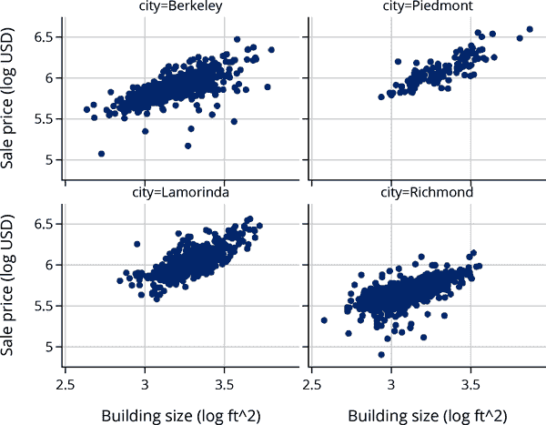

在散点图中可以看出这种偏移。我们将两个设计矩阵连接在一起，以拟合包含大小和城市的模型：

```py
`X_size` `=` `sfh``[``'``log_bsqft``'``]` 

`X_city_size` `=` `pd``.``concat``(``[``X_size``.``reset_index``(``drop``=``True``)``,` `X_city_df``]``,` `axis``=``1``)`
`X_city_size``.``drop``(``0``)`

```

|   | log_bsqft | 伯克利 | Lamorinda | 皮德蒙特 | 里士满 |
| --- | --- | --- | --- | --- | --- |
| **1** | 3.14 | 1.0 | 0.0 | 0.0 | 0.0 |
| **2** | 3.31 | 1.0 | 0.0 | 0.0 | 0.0 |
| **3** | 2.96 | 1.0 | 0.0 | 0.0 | 0.0 |
| **...** | ... | ... | ... | ... | ... |
| **2664** | 3.16 | 0.0 | 0.0 | 0.0 | 1.0 |
| **2665** | 3.47 | 0.0 | 0.0 | 0.0 | 1.0 |
| **2666** | 3.44 | 0.0 | 0.0 | 0.0 | 1.0 |

```py
2666 rows × 5 columns
```

现在让我们拟合一个包含定量特征（房屋大小）和定性特征（城市）的模型：

```py
`model_city_size` `=` `LinearRegression``(``fit_intercept``=``False``)``.``fit``(``X_city_size``,` `y_log``)`

```

这些截距反映了哪些城市的房屋更贵，即使考虑到房屋的大小：

```py
`model_city_size``.``coef_`

```

```py
array([0.62, 3.89, 3.98, 4.03, 3.75])

```

```py
R-square for city and log(size):  0.79

```

这个拟合模型包括名义变量`city`和对数变换后的房屋大小，比仅包含房屋大小的简单对数模型以及为每个城市拟合常数的模型都要好。

注意，我们从模型中删除了截距项，以便每个子组都有自己的截距。然而，一个常见的做法是从设计矩阵中删除一个独热编码特征，并保留截距。例如，如果我们删除伯克利房屋的特征并添加截距，那么模型就是：

<math display="block"><msub><mi>θ</mi> <mn>0</mn></msub>  <mo>+</mo>  <msub><mi>θ</mi> <mn>1</mn></msub> <msub><mi>x</mi> <mi>i</mi></msub>  <mo>+</mo>  <msub><mi>θ</mi> <mi>L</mi></msub> <msub><mi>x</mi> <mrow><mi>i</mi> <mo>,</mo> <mi>L</mi></mrow></msub>  <mo>+</mo>  <msub><mi>θ</mi> <mi>P</mi></msub> <msub><mi>x</mi> <mrow><mi>i</mi> <mo>,</mo> <mi>P</mi></mrow></msub>  <mo>+</mo>  <msub><mi>θ</mi> <mi>R</mi></msub> <msub><mi>x</mi> <mrow><mi>i</mi> <mo>,</mo> <mi>R</mi></mrow></msub></math>

在这种表示中，虚拟变量的系数意义在这个表述中已经改变了。例如，考虑伯克利和皮德蒙特的房屋的方程式：

<math display="block"><mtable columnalign="right" columnspacing="0em" displaystyle="true" rowspacing="3pt"><mtr><mtd><mtable columnalign="right left right" columnspacing="0em 2em" displaystyle="true" rowspacing="3pt"><mtr><mtd><msub><mi>θ</mi> <mn>0</mn></msub></mtd> <mtd><mo>+</mo>  <msub><mi>θ</mi> <mn>1</mn></msub> <msub><mi>x</mi> <mi>i</mi></msub></mtd> <mtd><mtext>for a house in Berkeley</mtext></mtd></mtr> <mtr><mtd><msub><mi>θ</mi> <mn>0</mn></msub></mtd> <mtd><mo>+</mo>  <msub><mi>θ</mi> <mn>1</mn></msub> <msub><mi>x</mi> <mi>i</mi></msub> <mo>+</mo> <msub><mi>θ</mi> <mi>P</mi></msub></mtd> <mtd><mtext>for a house in Piedmont</mtext></mtd></mtr></mtable></mtd></mtr></mtable></math>

在这个表示中，截距<math><msub><mi>θ</mi> <mn>0</mn></msub></math> 是伯克利房屋的，而系数<math><msub><mi>θ</mi> <mi>P</mi></msub></math> 衡量皮德蒙特房屋与伯克利房屋之间的典型价格差异。在这种表述中，我们可以更容易地将<math><msub><mi>θ</mi> <mi>P</mi></msub></math> 与 0 比较，看看这两个城市的平均价格是否基本相同。

如果我们包括截距和所有城市变量，则设计矩阵的列是线性相关的，这意味着我们无法解出系数。我们的预测在任何情况下都将相同，但不会有唯一的最小化解。

当我们包含两个分类变量的独热编码时，我们还喜欢采用删除一个虚拟变量并包含截距项的模型表示。这种做法保持了系数解释的一致性。

我们演示如何使用`statsmodels`库构建一个具有两组虚拟变量的模型。该库使用公式语言描述要拟合的模型，因此我们无需自己创建设计矩阵。我们导入公式 API：

```py
`import` `statsmodels``.``formula``.``api` `as` `smf`

```

首先，让我们重复使用名义变量`city`和房屋大小拟合模型，以展示如何使用公式语言并比较结果：

```py
`model_size_city` `=` `smf``.``ols``(``formula``=``'``log_price ~ log_bsqft + city``'``,`
                          `data``=``sfh``)``.``fit``(``)`

```

提供给`formula`参数的字符串描述了要拟合的模型。该模型以`log_price`作为结果，以`log_bsqft`和`city`的线性组合作为解释变量进行拟合。请注意，我们无需创建虚拟变量来拟合模型。方便地，`smf.ols`为我们执行了城市特征的独热编码。以下模型的拟合系数包括截距项，并且省略了伯克利指示变量：

```py
`print``(``model_size_city``.``params``)`

```

```py
Intercept            3.89
city[T.Lamorinda]    0.09
city[T.Piedmont]     0.14
city[T.Richmond]    -0.15
log_bsqft            0.62
dtype: float64

```

如果我们想要去除截距，我们可以在公式中添加 -1，这是一个指示从设计矩阵中去除 1 列的约定。在这个特定的例子中，所有独热编码特征所张成的空间等同于 1 向量和除了一个虚拟变量之外的所有虚拟变量所张成的空间，因此拟合是相同的。但是，系数是不同的，因为它们反映了设计矩阵的不同参数化：

```py
`smf``.``ols``(``formula``=``'``log_price ~ log_bsqft + city - 1``'``,` `data``=``sfh``)``.``fit``(``)``.``params`

```

```py
city[Berkeley]     3.89
city[Lamorinda]    3.98
city[Piedmont]     4.03
city[Richmond]     3.75
log_bsqft          0.62
dtype: float64

```

此外，我们可以在城市和大小变量之间添加交互项，以允许每个城市对大小具有不同的系数。我们在公式中指定此项，通过添加术语`log_bsqft:city`。我们在这里不详细说明。

现在让我们拟合一个具有两个分类变量的模型：卧室数量和城市。回想一下，我们之前重新分配了卧室数量大于 6 的卧室数量为 6，这实际上将 6、7、8、… 折叠到类别 6+ 中。我们可以在价格（对数 $）按卧室数量的箱线图中看到这种关系：

```py
`px``.``box``(``sfh``,` `x``=``"``br``"``,` `y``=``"``log_price``"``,` `width``=``450``,` `height``=``250``,`
       `labels``=``{``'``br``'``:``'``Number of bedrooms``'``,``'``log_price``'``:``'``Sale price (log USD)``'``}``)`

```

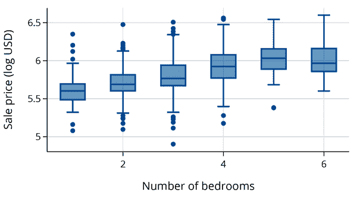

关系看起来不是线性的：每增加一个卧室，销售价格并不会以相同的金额增加。鉴于卧室数量是离散的，我们可以将此特征视为分类的，这样每个卧室编码都可以为成本贡献不同的金额：

```py
`model_size_city_br` `=` `smf``.``ols``(``formula``=``'``log_price ~ log_bsqft + city + C(br)``'``,`
                             `data``=``sfh``)``.``fit``(``)`

```

我们在公式中使用了术语`C(br)`来指示我们希望将卧室数量（数值型）视为分类变量对待。

让我们检查拟合的多重<math><msup><mi>R</mi> <mn>2</mn></msup></math>：

```py
`model_size_city_br``.``rsquared``.``round``(``2``)`

```

```py
0.79

```

尽管我们添加了五个更多的独热编码特征，但多元 <math><msup><mi>R</mi> <mn>2</mn></msup></math> 并没有增加。多元 <math><msup><mi>R</mi> <mn>2</mn></msup></math> 根据模型参数数量进行调整，从这个度量来看，并不比之前仅包含城市和大小的模型更好。

在本节中，我们介绍了定性特征的特征工程。我们看到了一种独热编码技术，它让我们在线性模型中包含分类数据，并为模型参数提供了自然的解释。

# 总结

线性模型帮助我们描述特征之间的关系。我们讨论了简单线性模型，并将其扩展到多变量线性模型。在此过程中，我们应用了在建模中广泛有用的数学技术—用微积分来最小化简单线性模型的损失，用矩阵几何来处理多变量线性模型。

线性模型可能看起来很基础，但今天它们被用于各种任务。它们足够灵活，可以允许我们包括分类特征以及变量的非线性转换，如对数转换、多项式和比率。线性模型具有广泛的可解释性，非技术人员也能理解，同时足够复杂以捕捉数据中许多常见模式的特点。

诱人的做法是将所有可用的变量都放入模型中以获得“可能的最佳拟合”。但我们应该记住最小二乘法的几何特性来拟合模型。要记住，<math><mi>p</mi></math> 个解释变量可以被看作是 <math><mi>n</mi></math> 维空间中的 <math><mi>p</mi></math> 个向量，如果这些向量高度相关，那么在这个空间上的投影将类似于在由较少向量组成的较小空间上的投影。这意味着：

+   添加更多变量可能不会显著改善模型。

+   解释系数可能会很困难。

+   几种模型可以同样有效地预测/解释响应变量。

如果我们关心进行推断，希望解释/理解模型，那么我们应该倾向于使用简单的模型。另一方面，如果我们的主要关注是模型的预测能力，那么我们往往不会关心系数的数量及其解释。但是这种“黑箱”方法可能导致模型过度依赖数据中的异常值或在其他方面不足。因此，在预测可能对人们有害时，要小心使用这种方法。

在本章中，我们以描述性方式使用了线性模型。我们介绍了一些决定何时在模型中包含特征的概念，通过检查残差的模式、比较标准误差的大小和多重<math><msup><mi>R</mi> <mn>2</mn></msup></math> 的变化来做出决策。通常情况下，我们选择了一个更简单、更容易解释的模型。在下一章中，我们将探讨其他更正式的工具，用于选择模型中要包含的特征。
